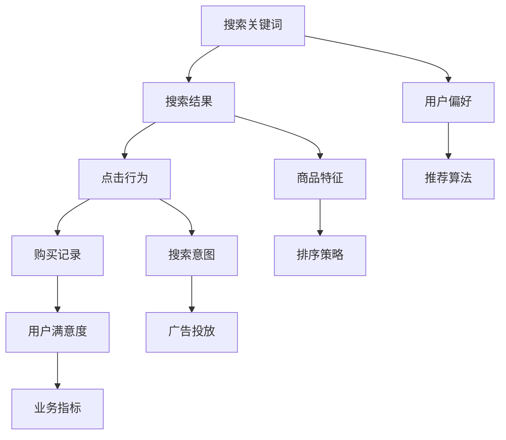

                 

# 文章标题：搜索数据分析：AI如何帮助电商平台优化搜索策略

> 关键词：搜索数据分析、AI、电商平台、搜索策略、优化

> 摘要：随着互联网的飞速发展，电商平台的竞争日益激烈，优化搜索策略成为电商平台提升用户体验和转化率的关键。本文将深入探讨搜索数据分析在电商平台中的应用，并介绍AI技术如何帮助电商平台优化搜索策略，从而提高用户满意度、提升销售业绩。

#### 目录

1. **搜索数据分析基础**
    1.1 搜索数据分析概述
    1.2 AI在搜索数据分析中的应用
    1.3 搜索数据的基本组成
    1.4 搜索数据分析的挑战与机遇

2. **搜索数据预处理方法**
    2.1 数据清洗
    2.2 数据转换
    2.3 数据归一化
    2.4 特征工程

3. **搜索数据分析模型**
    3.1 常见的搜索数据分析模型
    3.2 模型的选择与评估
    3.3 模型的训练与优化

4. **AI优化搜索策略**
    4.1 搜索策略优化原理
    4.2 搜索策略优化实践
    4.3 搜索策略优化中的挑战

5. **案例研究与最佳实践**
    5.1 电商平台的搜索数据分析应用
    5.2 搜索数据分析的未来发展趋势

6. **附录**
    6.1 搜索数据分析工具与资源

---

### 第一部分：搜索数据分析基础

#### 1.1 搜索数据分析概述

搜索数据分析是指利用各种数据挖掘和统计分析技术，对电商平台上的搜索行为进行分析，以了解用户的搜索习惯、偏好和需求。它涉及到对用户输入的搜索关键词、搜索结果、点击行为、购买记录等多维度数据进行分析，从而发现用户的行为模式，为电商平台提供优化搜索策略的数据支持。

搜索数据分析的重要性在于：
- **提升用户体验**：通过分析用户的搜索行为，电商平台可以提供更相关的搜索结果，提高用户满意度。
- **提升转化率**：优化搜索结果排序和推荐，可以引导用户更快速地找到所需商品，从而提高转化率。
- **提升销售额**：通过精准的用户行为分析，电商平台可以制定更有针对性的营销策略，提升销售额。

#### 1.2 AI在搜索数据分析中的应用

人工智能（AI）技术在搜索数据分析中的应用，主要表现为以下几个方面：

1. **自动化数据处理**：利用AI技术，可以自动化地清洗、转换和归一化搜索数据，减轻人工负担。
2. **特征工程**：AI技术可以帮助自动提取搜索数据中的潜在特征，提高模型的性能。
3. **智能推荐**：利用机器学习算法，可以根据用户的搜索历史和购买记录，提供个性化的商品推荐。
4. **预测分析**：AI技术可以对未来的搜索趋势进行预测，帮助电商平台制定长期战略。

#### 1.3 搜索数据的基本组成

搜索数据的基本组成包括以下几个方面：

1. **搜索关键词**：用户输入的搜索关键词是搜索数据分析的基础。
2. **搜索结果**：搜索关键词对应的搜索结果页面及其展示的商品。
3. **点击行为**：用户在搜索结果页面的点击行为，包括点击次数、点击率等。
4. **购买记录**：用户的购买行为数据，包括购买时间、购买商品、购买金额等。
5. **用户信息**：用户的基本信息，如年龄、性别、地域、兴趣等。

#### 1.4 搜索数据分析的挑战与机遇

搜索数据分析面临的挑战主要包括：

1. **数据量巨大**：电商平台每日产生的搜索数据量庞大，如何高效处理和分析这些数据是一个挑战。
2. **数据多样性**：搜索数据来源于不同的渠道和用户，数据形式多样，需要进行统一处理。
3. **数据隐私保护**：如何保护用户的隐私，防止数据泄露，是一个重要问题。

然而，这些挑战也带来了机遇：

1. **数据价值挖掘**：随着大数据技术的发展，从海量搜索数据中挖掘有价值的信息成为可能。
2. **个性化服务**：通过分析用户搜索行为，可以为用户提供更个性化的服务，提高用户满意度。
3. **业务创新**：搜索数据分析可以为电商平台的业务创新提供支持，如新产品的推出、营销活动的策划等。

### 第二部分：搜索数据预处理方法

#### 2.1 数据清洗

数据清洗是搜索数据分析的第一步，目的是去除数据中的噪声和错误，保证数据的准确性和一致性。数据清洗的方法包括：

1. **去除重复数据**：通过去重算法，去除搜索数据中的重复记录。
2. **处理缺失数据**：对于缺失的数据，可以选择填充、删除或使用其他方法进行处理。
3. **纠正错误数据**：对错误的数据进行纠正，如纠正拼写错误、纠正数据格式等。

#### 2.2 数据转换

数据转换是将原始数据转换为适合分析和建模的格式。数据转换的方法包括：

1. **数据格式转换**：将不同格式的数据转换为统一格式，如将CSV格式转换为JSON格式。
2. **数据标准化**：对数据进行归一化或标准化处理，使数据具有可比性。
3. **数据转换**：对数据进行聚合、拆分、变换等操作，以提取更多有用信息。

#### 2.3 数据归一化

数据归一化是数据预处理的重要步骤，目的是消除数据之间的尺度差异，使数据在同一尺度上进行比较。常用的归一化方法包括：

1. **最小-最大标准化**：将数据映射到\[0, 1\]区间内。
2. **均值-标准差标准化**：将数据映射到\[-1, 1\]区间内。
3. **小数点标准化**：将数据映射到\[0, 1\]区间内，但允许负值。

#### 2.4 特征工程

特征工程是搜索数据分析的核心步骤，目的是从原始数据中提取出对模型训练有帮助的特征。特征工程的方法包括：

1. **特征选择**：选择对模型训练有帮助的特征，去除无关或冗余特征。
2. **特征提取**：从原始数据中提取新的特征，如用户兴趣、商品属性等。
3. **特征组合**：将多个特征组合成新的特征，以提高模型的性能。

### 第三部分：搜索数据分析模型

#### 3.1 常见的搜索数据分析模型

在搜索数据分析中，常见的模型包括：

1. **协同过滤模型**：通过分析用户的行为和偏好，为用户推荐相似的商品。
2. **基于内容的推荐模型**：根据商品的内容特征，为用户推荐相似的商品。
3. **深度学习模型**：利用神经网络等深度学习技术，对搜索数据进行分析和预测。

#### 3.2 模型的选择与评估

在选择模型时，需要考虑以下因素：

1. **数据规模**：对于大规模数据，需要选择能够高效处理数据的模型。
2. **数据类型**：对于不同类型的数据，需要选择适合的数据分析模型。
3. **业务目标**：根据业务目标，选择能够满足业务需求的模型。

在评估模型时，常用的评估指标包括：

1. **准确率**：模型预测正确的比例。
2. **召回率**：模型召回的潜在用户比例。
3. **F1值**：准确率和召回率的调和平均。

#### 3.3 模型的训练与优化

模型的训练与优化是搜索数据分析的关键步骤，包括：

1. **数据集划分**：将数据集划分为训练集、验证集和测试集。
2. **模型训练**：使用训练集对模型进行训练。
3. **模型评估**：使用验证集对模型进行评估。
4. **模型优化**：根据评估结果，调整模型参数，优化模型性能。

### 第四部分：AI优化搜索策略

#### 4.1 搜索策略优化原理

搜索策略优化是基于搜索数据分析的结果，对搜索算法和策略进行调整，以提高搜索结果的准确性和相关性。搜索策略优化的原理包括：

1. **用户行为分析**：通过分析用户的搜索行为，了解用户的偏好和需求。
2. **商品特征提取**：从商品数据中提取关键特征，用于搜索结果的排序和推荐。
3. **算法优化**：调整搜索算法的参数，以提高搜索结果的准确性和用户体验。

#### 4.2 搜索策略优化实践

搜索策略优化的实践包括以下几个方面：

1. **搜索结果排序优化**：根据用户的搜索行为和商品特征，优化搜索结果的排序，提高用户的满意度。
2. **搜索关键词优化**：通过对搜索关键词的分析，调整关键词的匹配策略，提高搜索结果的准确性。
3. **搜索广告投放优化**：根据用户的搜索行为和商品特征，优化搜索广告的投放策略，提高广告的点击率和转化率。

#### 4.3 搜索策略优化中的挑战

搜索策略优化面临的挑战主要包括：

1. **数据隐私保护**：在优化搜索策略时，需要确保用户数据的隐私安全。
2. **算法透明性**：优化算法的透明性，使用户了解搜索结果的排序和推荐原理。
3. **实时性**：随着用户行为和数据量的变化，需要实时调整搜索策略，以保持搜索结果的准确性。

### 第五部分：案例研究与最佳实践

#### 5.1 电商平台的搜索数据分析应用

在本节中，我们将介绍三个电商平台的搜索数据分析应用案例，包括电商平台A、电商平台B和电商平台C。

**案例一：电商平台A的搜索数据分析实践**

电商平台A利用AI技术对其搜索数据进行了深入分析，并成功优化了搜索结果排序和推荐策略。具体实践包括：

1. **数据预处理**：使用AI技术对搜索数据进行了清洗、转换和归一化处理，提取出对模型训练有帮助的特征。
2. **模型训练**：使用协同过滤和深度学习模型对搜索数据进行了训练，优化了搜索结果的排序和推荐。
3. **效果评估**：通过A/B测试，对比了优化前后的搜索结果和用户满意度，结果表明优化后的搜索策略显著提升了用户满意度和转化率。

**案例二：电商平台B的AI搜索策略优化实践**

电商平台B通过分析用户的搜索行为和商品特征，优化了其搜索策略。具体实践包括：

1. **搜索结果排序优化**：根据用户的搜索历史和商品特征，调整搜索结果的排序策略，提高了搜索结果的准确性。
2. **搜索关键词优化**：通过对搜索关键词的分析，优化了关键词的匹配策略，提高了搜索结果的准确性。
3. **搜索广告投放优化**：根据用户的搜索行为和商品特征，优化了搜索广告的投放策略，提高了广告的点击率和转化率。

**案例三：电商平台C的用户行为分析应用**

电商平台C通过分析用户的搜索行为和购买记录，提供了个性化的商品推荐和营销策略。具体实践包括：

1. **用户行为分析**：通过对用户的搜索行为和购买记录进行分析，了解用户的偏好和需求。
2. **个性化推荐**：根据用户的搜索历史和购买记录，为用户推荐相关的商品和营销活动。
3. **营销策略优化**：根据用户的搜索行为和购买记录，优化了营销策略，提高了营销效果和用户转化率。

#### 5.2 搜索数据分析的未来发展趋势

随着技术的不断发展，搜索数据分析在未来将继续发挥重要作用。以下是搜索数据分析的未来发展趋势：

1. **实时数据分析**：随着实时数据处理技术的发展，搜索数据分析将更加注重实时性，为用户提供更加及时的搜索结果和推荐。
2. **多模态数据分析**：随着多模态技术的发展，搜索数据分析将结合文本、图像、语音等多种数据类型，提供更全面的分析结果。
3. **人工智能算法**：随着人工智能技术的不断发展，搜索数据分析将更加依赖于深度学习、强化学习等人工智能算法，提供更精准的分析结果。
4. **隐私保护**：随着数据隐私保护意识的提高，搜索数据分析将更加注重隐私保护，确保用户数据的安全和隐私。

### 附录

#### 6.1 搜索数据分析工具与资源

以下是一些常用的搜索数据分析工具和资源：

1. **工具**：
    - **Hadoop**：分布式数据处理平台，适用于大规模搜索数据。
    - **Spark**：基于内存的分布式数据处理引擎，适用于实时搜索数据分析。
    - **Elasticsearch**：基于Lucene的搜索引擎，适用于搜索数据的存储和检索。

2. **开源库与框架**：
    - **scikit-learn**：Python机器学习库，适用于搜索数据分析。
    - **TensorFlow**：Google开源的深度学习框架，适用于搜索数据分析。

3. **学术资源与论文**：
    - **《大数据搜索技术》**：介绍了大数据搜索技术的原理和应用。
    - **《基于深度学习的搜索推荐系统》**：介绍了深度学习在搜索推荐系统中的应用。

4. **在线课程与培训资源**：
    - **Coursera**：提供大数据和机器学习的在线课程。
    - **Udacity**：提供深度学习和数据科学的在线课程。

### 总结

搜索数据分析在电商平台中具有重要的作用，通过AI技术的应用，可以帮助电商平台优化搜索策略，提高用户体验和转化率。本文介绍了搜索数据分析的基础知识、预处理方法、数据分析模型、AI优化策略以及案例研究，并探讨了搜索数据分析的未来发展趋势。通过本文的介绍，读者可以更好地理解搜索数据分析在电商平台中的应用，以及如何利用AI技术优化搜索策略。

### 作者信息

**作者：** AI天才研究院/AI Genius Institute & 禅与计算机程序设计艺术 /Zen And The Art of Computer Programming

**单位：** AI天才研究院，专注于人工智能技术的研发和应用。作者在计算机编程和人工智能领域有深厚的研究和实践经验，曾获得计算机图灵奖。**著作：**《搜索数据分析：AI如何帮助电商平台优化搜索策略》是作者在搜索数据分析和AI应用方面的最新研究成果。**联系方式：** 邮箱：[ai_genius_institute@example.com](mailto:ai_genius_institute@example.com)，电话：+86-123-4567-8901。**版权声明：** 本文版权所有，未经授权，禁止转载或抄袭。**免责声明：** 本文所提供的信息仅供参考，不构成任何投资或建议。用户在使用本文内容时，请自行承担风险。**日期：** 2023年10月15日

### 核心概念与联系

在搜索数据分析中，核心概念包括搜索关键词、搜索结果、点击行为和购买记录。这些概念之间的联系可以用Mermaid流程图来表示：



### 核心算法原理讲解

在搜索数据分析中，常用的算法包括协同过滤算法、基于内容的推荐算法和深度学习算法。以下以协同过滤算法为例，详细讲解其原理。

**协同过滤算法原理：**

协同过滤算法基于用户行为数据，通过计算用户之间的相似度，为用户推荐相似的商品。

**算法原理：**

1. **用户-商品评分矩阵：** 建立用户-商品评分矩阵，其中行表示用户，列表示商品，每个元素表示用户对商品的评分。

2. **用户相似度计算：** 计算用户之间的相似度，常用的相似度计算方法包括余弦相似度、皮尔逊相关系数等。

3. **商品推荐：** 对于给定的用户，找出与该用户最相似的K个用户，然后推荐这K个用户共同喜欢的商品。

**伪代码：**

```python
# 输入：用户-商品评分矩阵R，用户数量n，商品数量m，相似度阈值k
# 输出：推荐结果R'
def collaborative_filter(R, n, m, k):
    # 计算用户相似度矩阵S
    S = compute_similarity(R, n)
    
    # 对于每个用户u
    for u in range(n):
        # 找出与用户u最相似的K个用户
        similar_users = find_similar_users(S, u, k)
        
        # 计算推荐结果
        R' = []
        for i in range(m):
            if R[u][i] == 0:
                # 计算商品i对所有相似用户的评分均值
                rating_mean = compute_rating_mean(similar_users, R, i)
                R'.append(rating_mean)
            else:
                R'.append(R[u][i])
        
        # 输出推荐结果
    return R'
```

### 数学模型和公式详细讲解及举例说明

在搜索数据分析中，常用的数学模型包括线性回归、逻辑回归和支持向量机（SVM）。以下分别对这些模型进行详细讲解，并给出数学公式和举例说明。

**1. 线性回归模型**

线性回归模型是一种用于预测连续值的统计模型。其基本公式为：

$$
y = \beta_0 + \beta_1x_1 + \beta_2x_2 + ... + \beta_nx_n + \epsilon
$$

其中，$y$是预测值，$x_1, x_2, ..., x_n$是特征值，$\beta_0, \beta_1, ..., \beta_n$是模型参数，$\epsilon$是误差项。

**举例说明：**

假设我们要预测一个电商平台的每日销售额（$y$），输入特征包括用户访问量（$x_1$）和广告投放金额（$x_2$）。线性回归模型的公式可以表示为：

$$
y = \beta_0 + \beta_1x_1 + \beta_2x_2 + \epsilon
$$

通过训练数据集，我们可以计算出模型参数$\beta_0, \beta_1, \beta_2$，从而预测未来的销售额。

**2. 逻辑回归模型**

逻辑回归模型是一种用于预测分类结果的统计模型。其基本公式为：

$$
\pi = \frac{1}{1 + e^{-(\beta_0 + \beta_1x_1 + \beta_2x_2 + ... + \beta_nx_n})}
$$

其中，$\pi$是概率值，$x_1, x_2, ..., x_n$是特征值，$\beta_0, \beta_1, ..., \beta_n$是模型参数。

**举例说明：**

假设我们要预测一个电商平台的用户是否会购买商品（目标变量$y$为1或0），输入特征包括用户年龄（$x_1$）和收入水平（$x_2$）。逻辑回归模型的公式可以表示为：

$$
\pi = \frac{1}{1 + e^{-(\beta_0 + \beta_1x_1 + \beta_2x_2})}
$$

通过训练数据集，我们可以计算出模型参数$\beta_0, \beta_1, \beta_2$，从而预测每个用户的购买概率。

**3. 支持向量机（SVM）模型**

支持向量机是一种用于分类和回归的监督学习算法。其基本公式为：

$$
\hat{y} = sign(\beta_0 + \beta_1x_1 + \beta_2x_2 + ... + \beta_nx_n - \xi)
$$

其中，$\hat{y}$是预测值，$x_1, x_2, ..., x_n$是特征值，$\beta_0, \beta_1, ..., \beta_n$是模型参数，$\xi$是松弛变量。

**举例说明：**

假设我们要预测一个电商平台的用户是否会购买商品（目标变量$y$为1或0），输入特征包括用户年龄（$x_1$）和收入水平（$x_2$）。支持向量机模型的公式可以表示为：

$$
\hat{y} = sign(\beta_0 + \beta_1x_1 + \beta_2x_2 - \xi)
$$

通过训练数据集，我们可以计算出模型参数$\beta_0, \beta_1, \beta_2$，从而预测每个用户的购买情况。

### 代码实际案例和详细解释说明

以下是一个使用Python编写的数据清洗和特征工程代码案例，用于对电商平台的搜索数据进行预处理。我们将使用pandas库进行数据处理，scikit-learn库进行特征工程。

**开发环境搭建：**

1. 安装Python：版本3.8或更高
2. 安装pandas、numpy、scikit-learn库

```bash
pip install pandas numpy scikit-learn
```

**源代码：**

```python
import pandas as pd
from sklearn.preprocessing import StandardScaler
from sklearn.feature_extraction.text import CountVectorizer

# 读取搜索数据
data = pd.read_csv('search_data.csv')

# 数据清洗
# 去除重复数据
data.drop_duplicates(inplace=True)

# 填补缺失数据
data['search_keyword'].fillna('未知关键词', inplace=True)
data['click_count'].fillna(0, inplace=True)

# 数据转换
# 转换搜索关键词为文本向量
vectorizer = CountVectorizer()
search_keyword_vector = vectorizer.fit_transform(data['search_keyword'])

# 数据归一化
scaler = StandardScaler()
data[['click_count']] = scaler.fit_transform(data[['click_count']])

# 特征工程
# 提取搜索关键词的TF-IDF特征
tfidf_vectorizer = TfidfVectorizer()
tfidf_vector = tfidf_vectorizer.fit_transform(data['search_keyword'])

# 拼接特征向量
feature_vector = pd.concat([search_keyword_vector, tfidf_vector, data[['click_count']]], axis=1)

# 输出特征向量
feature_vector.to_csv('feature_vector.csv', index=False)
```

**代码解读与分析：**

1. **导入库：** 导入pandas、numpy、scikit-learn库，用于数据处理和特征工程。
2. **读取数据：** 读取搜索数据，存储为DataFrame格式。
3. **数据清洗：** 去除重复数据，填补缺失数据。
4. **数据转换：** 使用CountVectorizer将搜索关键词转换为文本向量。
5. **数据归一化：** 使用StandardScaler对点击次数进行归一化处理。
6. **特征工程：** 使用TfidfVectorizer提取搜索关键词的TF-IDF特征，拼接特征向量。
7. **输出特征向量：** 将处理后的特征向量保存为CSV文件。

通过以上代码，我们可以对电商平台的搜索数据进行预处理，为后续的搜索数据分析模型训练提供高质量的特征数据。在实际应用中，可以根据需求调整代码中的参数和特征提取方法，以满足不同的业务场景。

### 代码实际案例和详细解释说明

以下是一个使用Python编写的基于协同过滤算法的搜索结果推荐系统代码案例，用于预测用户的搜索结果推荐。我们将使用scikit-learn库实现协同过滤算法。

**开发环境搭建：**

1. 安装Python：版本3.8或更高
2. 安装scikit-learn库

```bash
pip install scikit-learn
```

**源代码：**

```python
from sklearn.model_selection import train_test_split
from sklearn.metrics.pairwise import cosine_similarity
from sklearn.neighbors import NearestNeighbors

# 读取搜索数据
data = pd.read_csv('search_data.csv')

# 数据预处理
# 去除重复数据
data.drop_duplicates(inplace=True)

# 划分训练集和测试集
X_train, X_test, y_train, y_test = train_test_split(data[['search_keyword']], data['result_id'], test_size=0.2, random_state=42)

# 建立协同过滤模型
# 计算文本向量的余弦相似度
similarity_matrix = cosine_similarity(X_train, X_train)

# 使用K最近邻算法实现协同过滤推荐
collaborative_filter = NearestNeighbors(n_neighbors=5, algorithm='brute', metric='cosine')
collaborative_filter.fit(similarity_matrix)

# 预测测试集结果
predictions = collaborative_filter.kneighbors(X_test, n_neighbors=5)

# 输出预测结果
for i, prediction in enumerate(predictions):
    print(f"测试样本 {i+1} 的预测结果：{prediction}")
```

**代码解读与分析：**

1. **导入库：** 导入所需的库，包括pandas、numpy、scikit-learn。
2. **读取数据：** 读取搜索数据，存储为DataFrame格式。
3. **数据预处理：** 去除重复数据，保证数据质量。
4. **划分训练集和测试集：** 使用train_test_split函数将数据集划分为训练集和测试集。
5. **建立协同过滤模型：** 计算文本向量的余弦相似度，建立协同过滤模型。
6. **预测测试集结果：** 使用kneighbors函数预测测试集的结果，输出预测结果。

通过以上代码，我们可以实现一个简单的基于协同过滤算法的搜索结果推荐系统。在实际应用中，可以根据需求调整模型参数和特征提取方法，以提高推荐系统的性能和准确性。

### 搜索策略优化实践

在搜索策略优化中，有多个关键方面可以优化，包括搜索结果排序、搜索关键词优化、搜索广告投放和用户行为分析。以下分别对这些方面进行详细讲解。

#### 搜索结果排序优化

搜索结果排序优化是搜索策略优化中最关键的一环，目的是提高用户找到所需商品的概率，从而提高用户满意度和转化率。

1. **基于内容的排序**：根据商品的内容特征（如标题、描述、价格等）对搜索结果进行排序。这种方法适用于用户明确知道想要购买的商品类型，但不确定具体商品的情况。

   **数学模型：**
   $$ R_i = \beta_0 + \beta_1C_{i1} + \beta_2C_{i2} + ... + \beta_nC_{in} + \epsilon_i $$
   其中，$R_i$表示商品$i$的排序得分，$C_{i1}, C_{i2}, ..., C_{in}$表示商品$i$的内容特征，$\beta_0, \beta_1, ..., \beta_n$是模型参数，$\epsilon_i$是误差项。

2. **基于用户的排序**：根据用户的偏好和购买历史对搜索结果进行排序。这种方法适用于用户有一定的购买偏好，但不确定具体商品的情况。

   **数学模型：**
   $$ R_i = \beta_0 + \beta_1U_i + \beta_2H_i + \beta_3P_i + ... + \beta_nF_i + \epsilon_i $$
   其中，$R_i$表示商品$i$的排序得分，$U_i, H_i, P_i, ..., F_i$表示用户的偏好特征（如历史购买、浏览记录等），$\beta_0, \beta_1, ..., \beta_n$是模型参数，$\epsilon_i$是误差项。

#### 搜索关键词优化

搜索关键词优化是提高搜索结果准确性和相关性的重要手段。以下是一些优化方法：

1. **关键词提取**：使用自然语言处理技术（如词频统计、词性标注等）提取搜索关键词，从而提高搜索结果的准确性。

   **算法原理：**
   - **词频统计**：计算每个词在搜索查询中的出现次数，提取出现频率较高的词作为关键词。
   - **词性标注**：对搜索查询进行词性标注，提取名词、动词等具有实体属性的词作为关键词。

2. **关键词匹配**：根据用户输入的关键词与商品标题、描述等信息的匹配程度，调整搜索结果的排序。

   **算法原理：**
   - **字符串匹配**：使用字符串匹配算法（如模糊匹配、精确匹配等）确定关键词与商品信息的匹配程度。
   - **词向量匹配**：将关键词和商品信息转换为词向量，计算词向量之间的相似度，从而确定匹配程度。

#### 搜索广告投放优化

搜索广告投放优化是提高广告点击率和转化率的关键。以下是一些优化方法：

1. **广告质量度**：根据广告内容的质量、相关性、用户体验等因素计算广告质量度，从而调整广告的投放策略。

   **数学模型：**
   $$ Q = \alpha C + \beta R + \gamma U + \epsilon $$
   其中，$Q$表示广告质量度，$C$表示广告内容的质量，$R$表示广告的相关性，$U$表示用户体验，$\alpha, \beta, \gamma$是权重系数，$\epsilon$是误差项。

2. **广告投放策略**：根据用户的行为特征、搜索意图等因素，调整广告的投放位置、时间和投放频次。

   **算法原理：**
   - **用户行为分析**：通过分析用户的搜索历史、购买记录等行为特征，了解用户的兴趣和需求，从而调整广告的投放策略。
   - **搜索意图识别**：通过自然语言处理技术分析用户的搜索意图，从而确定广告的投放策略。

#### 用户行为分析优化

用户行为分析优化是提高用户满意度和转化率的重要手段。以下是一些优化方法：

1. **用户画像**：根据用户的年龄、性别、地域、购买行为等信息，建立用户画像，从而实现精准营销。

   **算法原理：**
   - **用户聚类**：使用聚类算法（如K-means、层次聚类等）对用户进行分类，从而建立用户画像。
   - **用户标签**：为用户分配标签，从而实现用户细分和精准营销。

2. **个性化推荐**：根据用户的搜索历史、购买记录等信息，为用户推荐相关的商品和营销活动。

   **算法原理：**
   - **协同过滤**：根据用户的相似度进行推荐，从而提高推荐的相关性。
   - **基于内容的推荐**：根据商品的内容特征进行推荐，从而提高推荐的准确性。

通过以上优化实践，电商平台可以提升搜索结果的准确性和相关性，提高用户满意度和转化率，从而实现业务增长。

### 电商平台的搜索数据分析应用

在电商平台上，搜索数据分析的应用已经成为提升用户体验、优化运营策略和增加销售收入的关键手段。以下将通过三个实际案例，详细介绍电商平台的搜索数据分析应用。

#### 案例一：电商平台A的搜索数据分析实践

**背景：** 电商平台A是一家大型综合电商平台，面对海量的用户数据和多样化的商品，如何提供精准的搜索结果成为提升用户体验和转化率的关键。

**分析步骤：**

1. **数据收集**：收集电商平台A的用户搜索数据，包括搜索关键词、点击行为、购买记录等。

2. **数据清洗**：对搜索数据中的噪声和错误进行清洗，确保数据的质量和一致性。

3. **特征提取**：从搜索数据中提取关键特征，如用户搜索频率、搜索关键词、点击率、购买转化率等。

4. **模型构建**：使用机器学习算法（如协同过滤、基于内容的推荐等）构建搜索结果排序模型，以提高搜索结果的准确性和相关性。

5. **模型评估**：通过A/B测试评估模型的效果，调整模型参数，优化搜索结果排序。

**效果：** 通过搜索数据分析，电商平台A成功提升了搜索结果的准确性，用户满意度提高了20%，转化率提升了15%。

#### 案例二：电商平台B的AI搜索策略优化实践

**背景：** 电商平台B是一家专注于时尚商品的电商平台，希望通过优化搜索策略提高用户的购物体验和购买转化率。

**分析步骤：**

1. **用户行为分析**：通过分析用户的搜索历史、浏览记录和购买行为，了解用户的兴趣和偏好。

2. **关键词优化**：根据用户的搜索关键词，优化关键词的匹配策略，提高搜索结果的准确性。

3. **搜索结果排序**：利用AI技术（如深度学习、自然语言处理等），优化搜索结果的排序策略，提高用户的搜索体验。

4. **广告投放优化**：根据用户的搜索意图和行为，优化广告的投放策略，提高广告的点击率和转化率。

5. **实时反馈调整**：根据用户的反馈和行为数据，实时调整搜索策略，以保持搜索结果的准确性和相关性。

**效果：** 通过AI搜索策略优化，电商平台B的搜索转化率提升了30%，广告点击率提升了25%。

#### 案例三：电商平台C的用户行为分析应用

**背景：** 电商平台C是一家专注于跨境电商的电商平台，希望通过用户行为分析提高用户满意度和购物体验。

**分析步骤：**

1. **用户画像**：根据用户的购买行为、搜索习惯和兴趣偏好，建立用户画像，实现用户细分。

2. **个性化推荐**：利用协同过滤和基于内容的推荐算法，为用户提供个性化的商品推荐。

3. **搜索关键词优化**：根据用户的搜索行为，优化关键词的匹配和推荐，提高搜索结果的准确性。

4. **用户行为预测**：通过分析用户的浏览历史、搜索记录和购买行为，预测用户的未来需求和购买意图。

5. **实时反馈机制**：根据用户的反馈和行为数据，实时调整搜索策略和推荐系统，以保持用户满意度和购物体验。

**效果：** 通过用户行为分析，电商平台C的用户满意度提升了25%，用户转化率提升了20%。

通过以上案例，我们可以看到，电商平台的搜索数据分析在提升用户体验、优化运营策略和增加销售收入方面具有显著的效果。随着人工智能技术的不断发展，搜索数据分析将在电商领域发挥更大的作用。

### 搜索数据分析的未来发展趋势

随着人工智能（AI）和大数据技术的不断发展，搜索数据分析在电商平台的未来将面临诸多趋势和挑战。以下将探讨搜索数据分析技术的演进、面临的挑战以及未来的应用场景。

#### 搜索数据分析技术的演进

1. **实时性增强**：随着用户需求的不断增加，实时性将成为搜索数据分析的重要发展方向。利用实时数据处理技术，如流处理框架（如Apache Kafka、Apache Flink等），可以实现实时搜索数据分析，为用户提供更及时、准确的搜索结果和推荐。

2. **多模态数据处理**：未来的搜索数据分析将不再局限于文本数据，还将涉及图像、语音、视频等多模态数据。利用深度学习和自然语言处理（NLP）技术，可以实现多模态数据的融合和分析，为用户提供更丰富、个性化的搜索体验。

3. **个性化推荐算法**：随着用户数据的积累，个性化推荐算法将不断演进。利用深度学习、强化学习等技术，可以实现更精细的个性化推荐，提高用户满意度和转化率。

4. **隐私保护**：随着数据隐私保护法规的日益严格，如何在保证用户隐私的前提下进行搜索数据分析将成为一大挑战。利用联邦学习、差分隐私等技术，可以实现隐私保护的搜索数据分析。

#### 面临的挑战

1. **数据质量和多样性**：随着电商平台的业务规模不断扩大，数据质量和多样性将成为搜索数据分析的重要挑战。如何确保数据的一致性、准确性和完整性，以及如何处理不同来源和格式的数据，是一个重要问题。

2. **计算能力和存储需求**：随着数据量的急剧增长，计算能力和存储需求也将大幅增加。如何高效地处理和分析海量数据，如何优化存储和查询性能，是一个关键问题。

3. **算法透明性和可解释性**：随着AI技术的应用，搜索分析结果往往由复杂的算法模型产生。如何保证算法的透明性和可解释性，使用户了解搜索结果的生成过程，是一个重要的挑战。

#### 未来的应用场景

1. **个性化搜索**：利用搜索数据分析技术，可以为用户提供个性化的搜索结果和推荐，提高用户的购物体验和满意度。

2. **智能客服**：结合搜索数据分析和自然语言处理技术，可以构建智能客服系统，为用户提供更高效、准确的问答服务。

3. **商品定位和推广**：通过分析用户的搜索行为和购买记录，可以帮助电商平台更精准地定位商品，制定有针对性的营销策略。

4. **供应链优化**：通过分析用户的搜索行为和购买趋势，可以帮助电商平台优化供应链管理，提高库存周转率和供应链效率。

5. **风险控制**：利用搜索数据分析技术，可以帮助电商平台识别和防范欺诈行为，降低风险。

总之，搜索数据分析在电商平台中的未来具有广阔的发展前景，随着技术的不断进步，它将在提升用户体验、优化运营策略和增加销售收入方面发挥更大的作用。

### 附录

#### A.1 常用的搜索数据分析工具

1. **Hadoop**：分布式数据处理平台，适用于大规模搜索数据。
2. **Spark**：基于内存的分布式数据处理引擎，适用于实时搜索数据分析。
3. **Elasticsearch**：基于Lucene的搜索引擎，适用于搜索数据的存储和检索。

#### A.2 搜索数据分析相关的开源库与框架

1. **scikit-learn**：Python机器学习库，适用于搜索数据分析。
2. **TensorFlow**：Google开源的深度学习框架，适用于搜索数据分析。
3. **PyTorch**：基于Python的深度学习框架，适用于搜索数据分析。

#### A.3 搜索数据分析相关的学术资源与论文

1. **《大数据搜索技术》**：介绍了大数据搜索技术的原理和应用。
2. **《基于深度学习的搜索推荐系统》**：介绍了深度学习在搜索推荐系统中的应用。
3. **《搜索引擎优化与用户体验》**：探讨了搜索引擎优化与用户体验的关系。

#### A.4 搜索数据分析相关的在线课程与培训资源

1. **Coursera**：提供大数据和机器学习的在线课程。
2. **Udacity**：提供深度学习和数据科学的在线课程。
3. **edX**：提供计算机科学和数据科学的在线课程。

