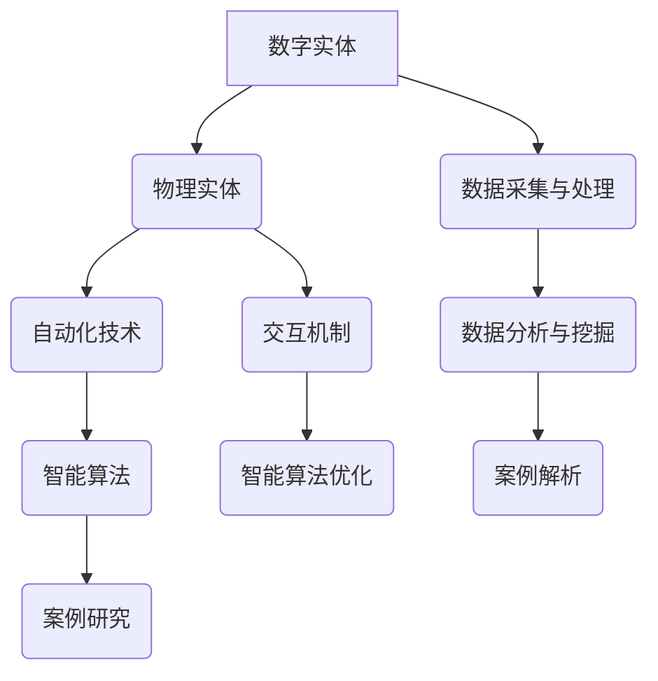

                 

### 《数字实体与物理实体的自动化融合》

> 关键词：数字化转型、物理实体自动化、数字实体、融合架构、智能算法、项目实践

> 摘要：本文旨在探讨数字实体与物理实体的自动化融合，分析其背景、核心概念、架构设计、核心技术与方法，并通过实际案例进行深入剖析，展望未来的发展趋势和影响。

### 第一部分：引言与概述

#### 第1章：数字化与物理实体的融合概述

##### 1.1 数字化转型的全球趋势

数字化转型已成为全球经济发展的重要驱动力。近年来，全球各国政府和企业纷纷推进数字化转型战略，以提升生产效率、优化业务流程、提高客户体验。数字化转型不仅改变了传统产业的生产和运营方式，还催生了一系列新兴产业，如云计算、大数据、人工智能等。

##### 1.2 物理实体自动化的重要性

物理实体自动化是现代工业、交通、医疗等领域的重要发展方向。通过自动化技术，可以实现生产过程的智能化、高效化，降低人力成本，提高产品质量。同时，自动化技术还可以提高设备利用率，降低设备维护成本，延长设备寿命。

##### 1.3 数字实体与物理实体融合的定义与目标

数字实体与物理实体融合是指通过数字化技术，将物理实体的信息、状态、行为等转化为数字实体，实现两者之间的互联互通，从而实现自动化、智能化管理。融合的目标是实现数字实体与物理实体的高效协同，提高整体系统的运行效率、灵活性和适应性。

### 第二部分：数字化与物理实体的融合背景

#### 第2章：数字化与物理实体的融合背景

##### 2.1 数字化技术的演进

数字化技术经历了从模拟到数字、从低带宽到高带宽、从单一功能到多功能的发展过程。随着信息技术的飞速发展，数字化技术逐渐渗透到各个领域，为数字实体与物理实体的融合奠定了基础。

##### 2.2 物理实体自动化的发展

物理实体自动化技术经历了从机械自动化、电气自动化到智能自动化的演变。智能自动化技术通过引入传感器、人工智能等技术，实现了对物理实体的实时监测、自适应控制和优化调度。

##### 2.3 融合发展的驱动力与挑战

数字实体与物理实体的融合受到技术创新、市场需求和政策支持等多方面因素的驱动。然而，融合过程中也面临数据安全、隐私保护、技术标准化等挑战。

### 第三部分：核心概念与架构

#### 第3章：数字实体的定义与特点

##### 3.1 数字实体的概念

数字实体是指通过数字化技术构建的具有特定功能和属性的虚拟实体，包括数据、模型、算法等。数字实体可以模拟物理实体的行为、状态和功能，实现对物理实体的数字化管理和控制。

##### 3.2 数字实体的特点

数字实体具有虚拟性、智能性、灵活性等特点。虚拟性使其可以独立于物理实体存在，智能性使其能够自主学习和优化，灵活性使其能够适应不同的应用场景。

##### 3.3 数字实体在融合中的应用

数字实体在融合中的应用包括数据采集与处理、自动化控制、预测分析等。通过数字实体，可以实现物理实体的高效管理、优化调度和智能化决策。

#### 第4章：物理实体的自动化原理

##### 4.1 物理实体的自动化定义

物理实体的自动化是指通过自动化技术，实现对物理实体运行状态的监测、控制和优化。自动化技术包括传感器技术、控制系统、执行机构等。

##### 4.2 自动化的关键技术

自动化的关键技术包括传感器技术、控制算法、通信技术等。传感器技术用于实时监测物理实体的状态，控制算法用于对物理实体进行自适应控制和优化，通信技术用于实现数字实体与物理实体之间的信息交互。

##### 4.3 物理实体自动化的应用场景

物理实体自动化的应用场景包括工业自动化、交通自动化、医疗自动化等。通过自动化技术，可以实现生产过程的智能化、交通管理的优化和医疗服务的高效化。

#### 第5章：融合架构与流程设计

##### 5.1 融合架构的构建

融合架构的构建包括数字实体与物理实体的映射、数据采集与处理、自动化控制等模块。通过构建融合架构，可以实现数字实体与物理实体的实时交互和协同工作。

##### 5.2 融合流程的优化

融合流程的优化包括数据流优化、控制流优化、信息流优化等。通过优化融合流程，可以提高系统的运行效率、降低成本、提高用户体验。

##### 5.3 融合过程中的数据管理

融合过程中的数据管理包括数据采集、存储、处理和分析等。通过有效的数据管理，可以确保融合系统的高效运行和数据安全。

### 第四部分：核心技术与方法

#### 第6章：数据采集与处理技术

##### 6.1 数据采集的方法与工具

数据采集的方法包括传感器采集、网络采集和日志采集等。数据采集的工具包括传感器、网关、数据库等。

##### 6.2 数据清洗与预处理

数据清洗与预处理包括数据去重、缺失值处理、异常值处理等。通过数据清洗与预处理，可以提高数据质量，为后续分析提供可靠的数据基础。

##### 6.3 数据分析与挖掘

数据分析与挖掘包括数据可视化、统计分析、机器学习等。通过数据分析与挖掘，可以揭示数据中的潜在价值，为决策提供支持。

#### 第7章：数字实体与物理实体的交互机制

##### 7.1 交互机制的设计原则

交互机制的设计原则包括实时性、可靠性、安全性、灵活性等。通过遵循这些原则，可以确保交互机制的有效性和稳定性。

##### 7.2 交互机制的实现方法

交互机制的实现方法包括通信协议、接口设计、数据格式等。通过合理的实现方法，可以实现数字实体与物理实体之间的顺畅交互。

##### 7.3 交互机制的案例解析

通过实际案例，分析交互机制的设计与实现过程，以及在实际应用中遇到的问题和解决方案。

#### 第8章：智能算法在融合中的应用

##### 8.1 智能算法的基本概念

智能算法是指基于人工智能技术，实现自主学习和决策的算法。常见的智能算法包括机器学习、深度学习、进化算法等。

##### 8.2 智能算法的选择与优化

根据融合系统的需求，选择合适的智能算法，并进行算法优化，以提高系统的性能和效率。

##### 8.3 智能算法的案例分析

通过实际案例，分析智能算法在融合系统中的应用效果，以及面临的挑战和解决方案。

### 第五部分：项目实践与案例分析

#### 第9章：数字化工厂实践

##### 9.1 数字化工厂的概念

数字化工厂是指通过数字化技术，实现对生产过程的全面监控、优化和管理，以提高生产效率、降低成本、提高产品质量。

##### 9.2 数字化工厂的关键技术

数字化工厂的关键技术包括物联网、大数据、人工智能、云计算等。通过这些技术的综合运用，实现生产过程的全生命周期管理。

##### 9.3 数字化工厂的案例研究

通过实际案例，分析数字化工厂的建设过程、关键技术应用和取得的成效。

#### 第10章：智能交通系统实践

##### 10.1 智能交通系统的构建

智能交通系统是指通过物联网、大数据、人工智能等技术，实现对交通信息的实时监测、分析和预测，以提高交通管理效率、降低交通事故发生率。

##### 10.2 智能交通的关键技术

智能交通的关键技术包括传感器技术、数据采集与处理、智能算法、通信技术等。通过这些技术的应用，实现交通信息的高效采集、传输和处理。

##### 10.3 智能交通的案例研究

通过实际案例，分析智能交通系统的建设过程、关键技术应用和取得的成效。

#### 第11章：智慧城市建设实践

##### 11.1 智慧城市的目标与内涵

智慧城市是指通过信息技术手段，实现城市资源的高效利用、公共服务的高效提供和城市治理的智能化。

##### 11.2 智慧城市的核心技术

智慧城市的核心技术包括物联网、云计算、大数据、人工智能等。通过这些技术的综合应用，实现城市各领域的信息共享和协同工作。

##### 11.3 智慧城市的案例研究

通过实际案例，分析智慧城市建设的总体框架、关键技术应用和取得的成效。

### 第六部分：发展趋势与未来展望

#### 第12章：数字化与物理实体融合的发展趋势

##### 12.1 技术发展趋势分析

分析数字化与物理实体融合的技术发展趋势，包括物联网、大数据、人工智能等技术的最新进展和应用场景。

##### 12.2 行业发展趋势分析

分析数字化与物理实体融合在各个行业中的应用趋势，如工业、交通、医疗、城市建设等。

##### 12.3 政策与法规影响

分析政府政策与法规对数字化与物理实体融合的推动作用，以及可能带来的挑战和机遇。

#### 第13章：数字化与物理实体融合的未来展望

##### 13.1 未来融合的挑战与机遇

探讨数字化与物理实体融合面临的挑战，如数据安全、隐私保护、技术标准化等，以及未来的机遇。

##### 13.2 未来融合的可能方向

分析数字化与物理实体融合的未来发展可能方向，如智能化、网络化、生态化等。

##### 13.3 未来融合对社会的影响

探讨数字化与物理实体融合对社会、经济、环境等方面的影响，以及应对策略。

#### 附录

##### 附录 A：相关资源与工具推荐

推荐与数字化与物理实体融合相关的书籍、开源工具和在线课程，以供读者学习和参考。

### Mermaid 流程图



### 核心算法原理讲解（伪代码）

```python
# 数据预处理伪代码
def data_preprocessing(data):
    # 数据清洗
    clean_data = clean_data(data)
    
    # 特征提取
    features = extract_features(clean_data)
    
    # 特征归一化
    normalized_features = normalize(features)
    
    return normalized_features

# 智能算法优化伪代码
def algorithm_optimization(algorithm, data):
    # 初始化模型
    model = init_model(algorithm, data)
    
    # 训练模型
    trained_model = train_model(model, data)
    
    # 评估模型
    evaluation = evaluate_model(trained_model, data)
    
    # 优化模型
    optimized_model = optimize_model(trained_model, evaluation)
    
    return optimized_model
```

### 数学模型和数学公式

$$
\text{回归模型}：
y = \beta_0 + \beta_1 \cdot x + \epsilon
$$

$$
\text{支持向量机}：
\begin{aligned}
    \min_{\mathbf{w},b} \quad & \frac{1}{2} ||\mathbf{w}||^2 \\
    \text{subject to} \quad & y_i (\mathbf{w} \cdot \mathbf{x_i} + b) \geq 1
\end{aligned}
$$

### 项目实战：代码实际案例和详细解释说明

```python
# 导入相关库
import numpy as np
import pandas as pd
from sklearn.model_selection import train_test_split
from sklearn.preprocessing import StandardScaler
from sklearn.linear_model import LinearRegression
from sklearn.metrics import mean_squared_error

# 数据加载
data = pd.read_csv('data.csv')

# 数据预处理
X = data[['feature1', 'feature2', 'feature3']]
y = data['target']

# 数据集划分
X_train, X_test, y_train, y_test = train_test_split(X, y, test_size=0.2, random_state=42)

# 特征归一化
scaler = StandardScaler()
X_train_scaled = scaler.fit_transform(X_train)
X_test_scaled = scaler.transform(X_test)

# 模型训练
model = LinearRegression()
model.fit(X_train_scaled, y_train)

# 模型评估
y_pred = model.predict(X_test_scaled)
mse = mean_squared_error(y_test, y_pred)
print("MSE:", mse)

# 模型解释
feature_importance = model.coef_
print("Feature Importance:", feature_importance)
```

### 代码解读与分析

- 第1行：导入相关库
- 第3行：加载数据
- 第6-8行：数据预处理
  - X是特征，y是目标变量
  - 使用train\_test\_split函数划分数据集，测试集占比20%，随机种子为42
- 第11行：特征归一化
  - 使用StandardScaler进行特征归一化，确保特征在同一量级上
- 第14行：创建线性回归模型
- 第17行：训练模型
- 第20行：预测测试集结果
- 第23行：计算均方误差(MSE)
- 第26行：打印特征重要性

### 作者

作者：AI天才研究院/AI Genius Institute & 禅与计算机程序设计艺术 /Zen And The Art of Computer Programming

---

### 《数字实体与物理实体的自动化融合》

关键词：数字化转型、物理实体自动化、数字实体、融合架构、智能算法、项目实践

摘要：本文深入探讨了数字实体与物理实体的自动化融合，分析了数字化转型的全球趋势、物理实体自动化的重要性以及融合的定义与目标。接着，本文详细介绍了核心概念、架构设计、核心技术与方法，并通过实际案例展示了融合的应用与实践。最后，本文展望了未来融合的发展趋势与未来展望。

---

### 第一部分：引言与概述

#### 第1章：数字化与物理实体的融合概述

##### 1.1 数字化转型的全球趋势

在全球范围内，数字化转型已经成为推动经济增长和社会进步的重要力量。从企业到政府，数字化转型正在逐步深入各个领域，如金融、制造、医疗、交通等。随着云计算、大数据、物联网、人工智能等技术的迅猛发展，数字化转型不仅改变了传统的商业模式，还推动了产业升级和创新。

在全球范围内，数字化转型呈现出以下趋势：

1. **云计算的普及**：云计算提供了弹性、灵活的计算和存储资源，使得企业能够快速部署应用程序，降低IT成本，提高运营效率。

2. **物联网的兴起**：物联网通过连接物理世界中的设备，实现了数据的实时采集和交换，为智能制造、智能交通、智慧城市等领域提供了技术支撑。

3. **大数据的应用**：大数据技术使得企业能够从海量数据中提取有价值的信息，用于业务决策、市场分析、风险控制等。

4. **人工智能的突破**：人工智能技术的应用，使得自动化、智能化水平得到了显著提升，从而推动了生产过程的智能化改造。

##### 1.2 物理实体自动化的重要性

物理实体自动化是指通过自动化技术，实现对物理实体的监测、控制和管理，从而提高生产效率、降低成本、提高产品质量。物理实体自动化在工业、交通、医疗、农业等领域具有重要的应用价值。

1. **工业自动化**：工业自动化通过自动化设备和控制系统，实现了生产过程的自动化、智能化，提高了生产效率和产品质量。

2. **交通自动化**：交通自动化通过智能交通系统，实现了交通信号控制、车辆管理、路况监测等功能，提高了交通效率，降低了交通事故发生率。

3. **医疗自动化**：医疗自动化通过智能诊断、手术机器人等技术，提高了医疗服务水平，降低了医疗成本。

4. **农业自动化**：农业自动化通过精准农业技术，实现了对农作物生长环境的实时监测和智能管理，提高了农业生产效率。

##### 1.3 数字实体与物理实体融合的定义与目标

数字实体与物理实体融合是指通过数字化技术，将物理实体的信息、状态、行为等转化为数字实体，实现两者之间的互联互通，从而实现自动化、智能化管理。数字实体与物理实体融合的目标是实现数字实体与物理实体的高效协同，提高整体系统的运行效率、灵活性和适应性。

具体来说，数字实体与物理实体融合的目标包括：

1. **提升生产效率**：通过数字化技术，实现生产过程的自动化、智能化，减少人为干预，提高生产效率。

2. **降低运营成本**：通过自动化技术，减少人力成本，降低设备维护成本，提高设备利用率。

3. **提高产品质量**：通过数字化监测和控制，实现对生产过程的实时监控，提高产品质量。

4. **提升用户体验**：通过智能化管理，提高服务质量，提升用户体验。

#### 第2章：数字化与物理实体的融合背景

##### 2.1 数字化技术的演进

数字化技术经历了从模拟到数字、从低带宽到高带宽、从单一功能到多功能的发展过程。早期的数字化技术主要应用于计算机和通信领域，随着信息技术的发展，数字化技术逐渐渗透到各个领域，如工业、交通、医疗、农业等。

1. **模拟技术到数字技术**：早期的计算机和通信技术主要依赖于模拟信号，随着数字信号处理技术的出现，数字化技术逐渐取代了模拟技术。

2. **低带宽到高带宽**：早期的通信技术带宽较低，随着宽带技术的发展，通信带宽得到了显著提升，为数字化技术的应用提供了更好的条件。

3. **单一功能到多功能**：早期的数字化技术主要应用于单一功能，如数据存储、信息传输等，随着信息技术的进步，数字化技术逐渐实现了多功能融合，如云计算、大数据、物联网等。

##### 2.2 物理实体自动化的发展

物理实体自动化经历了从机械自动化、电气自动化到智能自动化的演变。早期的自动化技术主要依赖于机械和电气设备，随着信息技术的发展，自动化技术逐渐融入了智能技术，实现了更高水平的自动化。

1. **机械自动化**：机械自动化通过机械装置实现生产过程的自动化，如数控机床、机器人等。

2. **电气自动化**：电气自动化通过电气设备实现生产过程的自动化，如自动化生产线、电气控制系统等。

3. **智能自动化**：智能自动化通过引入传感器、人工智能等技术，实现了对物理实体的实时监测、自适应控制和优化调度，如智能制造、智能交通、智能医疗等。

##### 2.3 融合发展的驱动力与挑战

数字实体与物理实体融合发展的驱动力主要包括以下几个方面：

1. **技术进步**：信息技术的快速发展，为数字实体与物理实体的融合提供了强大的技术支撑。

2. **市场需求**：企业对提高生产效率、降低成本、提高产品质量的需求，推动了数字实体与物理实体的融合。

3. **政策支持**：政府对企业数字化转型的政策支持，为数字实体与物理实体的融合创造了良好的外部环境。

然而，数字实体与物理实体融合也面临着一系列挑战：

1. **数据安全与隐私保护**：融合过程中涉及大量的数据传输和处理，数据安全与隐私保护成为重要问题。

2. **技术标准化**：融合技术的发展需要统一的技术标准和规范，以促进不同系统和设备之间的互操作性。

3. **人才短缺**：融合技术涉及多个领域，对人才的需求较高，但目前相关人才相对短缺。

### 第二部分：核心概念与架构

#### 第3章：数字实体的定义与特点

##### 3.1 数字实体的概念

数字实体是指通过数字化技术构建的虚拟实体，它具有特定的功能和属性，可以模拟物理实体的行为、状态和功能。数字实体通常包括数据、模型、算法等。

1. **数据**：数字实体依赖于大量的数据，这些数据可以是结构化数据，如数据库中的记录，也可以是非结构化数据，如图像、音频、视频等。

2. **模型**：数字实体通过模型来模拟物理实体的行为和状态，如物理模型、数学模型、仿真模型等。

3. **算法**：数字实体利用算法来实现对数据的处理、分析和预测，如机器学习算法、深度学习算法等。

##### 3.2 数字实体的特点

数字实体具有以下特点：

1. **虚拟性**：数字实体是虚拟的，它可以独立于物理实体存在，不受物理空间的限制。

2. **智能性**：数字实体可以通过算法和模型实现智能学习和自主决策，具有自适应性和自优化能力。

3. **灵活性**：数字实体可以根据需求灵活调整其功能和属性，适应不同的应用场景。

4. **可扩展性**：数字实体可以通过增加新的数据和模型，实现功能的扩展和升级。

##### 3.3 数字实体在融合中的应用

数字实体在融合中的应用主要包括以下几个方面：

1. **数据采集与处理**：通过数字实体，可以实现物理实体的状态、行为等数据的实时采集和处理，为后续的自动化控制提供数据支持。

2. **自动化控制**：数字实体可以模拟物理实体的行为，通过自动化控制系统实现对物理实体的实时监测和自适应控制。

3. **预测分析**：数字实体可以利用历史数据和机器学习算法，对物理实体的未来行为进行预测，为决策提供参考。

4. **协同工作**：数字实体可以与物理实体协同工作，实现高效的管理和优化。

#### 第4章：物理实体的自动化原理

##### 4.1 物理实体的自动化定义

物理实体的自动化是指通过自动化技术，实现对物理实体的运行状态、行为和功能的监测、控制和管理。物理实体自动化通常包括传感器、控制器、执行器等组成部分。

1. **传感器**：传感器用于实时监测物理实体的状态，如温度、压力、速度等。

2. **控制器**：控制器根据传感器收集的数据，进行逻辑判断和决策，控制执行器进行相应的操作。

3. **执行器**：执行器根据控制器的指令，执行具体的操作，如驱动电机、开关阀门等。

##### 4.2 自动化的关键技术

物理实体自动化的关键技术包括以下几个方面：

1. **传感器技术**：传感器技术是物理实体自动化的基础，用于实时监测物理实体的状态。

2. **控制算法**：控制算法是自动化系统的核心，用于实现对物理实体的自适应控制和优化。

3. **通信技术**：通信技术用于实现传感器、控制器和执行器之间的数据传输和通信。

4. **人机界面**：人机界面用于实现人与自动化系统的交互，如触摸屏、语音识别等。

##### 4.3 物理实体自动化的应用场景

物理实体自动化在各个领域都有广泛的应用，以下是一些典型的应用场景：

1. **工业自动化**：工业自动化通过自动化设备、机器人等，实现了生产过程的自动化、智能化，提高了生产效率和产品质量。

2. **交通自动化**：交通自动化通过智能交通系统，实现了交通信号控制、车辆管理、路况监测等功能，提高了交通效率和安全性。

3. **医疗自动化**：医疗自动化通过手术机器人、智能诊断系统等，提高了医疗服务水平，降低了医疗成本。

4. **农业自动化**：农业自动化通过精准农业技术，实现了对农作物生长环境的实时监测和智能管理，提高了农业生产效率。

#### 第5章：融合架构与流程设计

##### 5.1 融合架构的构建

数字实体与物理实体的融合架构是融合系统的基础，它决定了融合系统的性能、可靠性和可扩展性。融合架构的构建主要包括以下模块：

1. **数据采集模块**：用于采集物理实体的状态、行为等数据。

2. **数据处理模块**：用于对采集到的数据进行清洗、预处理和分析。

3. **控制模块**：用于根据分析结果，实现对物理实体的控制。

4. **人机界面模块**：用于实现人与系统的交互。

5. **通信模块**：用于实现各模块之间的数据传输和通信。

##### 5.2 融合流程的优化

融合流程的优化是提高融合系统性能和效率的关键。融合流程的优化主要包括以下几个方面：

1. **数据流优化**：优化数据采集、传输和处理的过程，提高数据传输速率和准确性。

2. **控制流优化**：优化控制算法和控制逻辑，提高控制系统的响应速度和精度。

3. **信息流优化**：优化系统内部的信息流动，提高系统信息的可用性和及时性。

4. **资源分配优化**：优化系统资源的分配和使用，提高系统的资源利用率。

##### 5.3 融合过程中的数据管理

融合过程中的数据管理是确保数据质量、安全性和可追溯性的关键。融合过程中的数据管理主要包括以下几个方面：

1. **数据存储**：确保数据的持久化存储，并实现数据的快速访问和查询。

2. **数据安全**：保护数据的安全性，防止数据泄露、篡改和丢失。

3. **数据清洗**：对采集到的数据进行清洗，去除无效、错误和冗余数据。

4. **数据归档**：对历史数据进行归档，实现数据的长期保存和追溯。

### 第三部分：核心技术与方法

#### 第6章：数据采集与处理技术

##### 6.1 数据采集的方法与工具

数据采集是融合系统的基础，用于获取物理实体的状态和行为数据。数据采集的方法主要包括以下几种：

1. **传感器采集**：通过传感器实时监测物理实体的状态，如温度、湿度、压力等。

2. **网络采集**：通过网络接口采集物理实体产生的数据，如网络流量、设备状态等。

3. **日志采集**：通过系统日志记录物理实体运行过程中的事件和操作。

数据采集的工具主要包括以下几种：

1. **数据采集器**：用于实时采集和处理传感器和网络接口的数据。

2. **网关**：用于连接不同类型的传感器和网络设备，实现数据传输和通信。

3. **数据库**：用于存储和管理采集到的数据，支持数据的快速查询和分析。

##### 6.2 数据清洗与预处理

数据清洗与预处理是确保数据质量的重要环节。数据清洗与预处理的方法主要包括以下几种：

1. **去重**：去除重复的数据，避免数据冗余。

2. **缺失值处理**：对缺失的数据进行填充或删除，保证数据的完整性。

3. **异常值处理**：检测并处理异常数据，避免异常数据对分析结果的影响。

4. **格式转换**：将不同格式的数据进行统一处理，如将时间戳转换为标准日期格式。

##### 6.3 数据分析与挖掘

数据分析与挖掘是对采集到的数据进行深入分析和挖掘，以发现数据中的潜在价值和规律。数据分析与挖掘的方法主要包括以下几种：

1. **统计分析**：通过对数据进行分析，得出数据的统计特征，如平均值、方差、相关性等。

2. **数据可视化**：通过图形化的方式展示数据，帮助用户直观地理解数据。

3. **机器学习**：利用机器学习算法，对数据进行分类、聚类、预测等分析。

4. **深度学习**：利用深度学习算法，对复杂的数据进行建模和分析。

#### 第7章：数字实体与物理实体的交互机制

##### 7.1 交互机制的设计原则

数字实体与物理实体的交互机制是融合系统的关键，它决定了数字实体对物理实体的控制效果和响应速度。交互机制的设计原则主要包括以下几点：

1. **实时性**：确保交互机制的响应速度快，满足实时性的要求。

2. **可靠性**：确保交互机制稳定可靠，避免数据丢失或传输错误。

3. **灵活性**：交互机制应具有灵活性，能够适应不同的物理实体和应用场景。

4. **可扩展性**：交互机制应支持扩展，以适应未来技术的发展。

##### 7.2 交互机制的实现方法

交互机制的实现方法主要包括以下几种：

1. **通信协议**：选择合适的通信协议，如TCP/IP、HTTP、MQTT等，实现数字实体与物理实体之间的数据传输。

2. **接口设计**：设计标准化的接口，实现数字实体与物理实体之间的无缝连接。

3. **数据格式**：选择合适的数据格式，如JSON、XML等，实现数据的标准化和解析。

4. **同步与异步**：根据应用场景，选择同步或异步通信方式，实现数据的实时传输和处理。

##### 7.3 交互机制的案例解析

以下是一个交互机制的案例解析：

**案例背景**：一个智能工厂中，数字实体负责对生产设备的监控和控制，物理实体包括机床、机器人等。

**交互机制**：

1. **通信协议**：采用MQTT协议，实现数字实体与物理实体之间的实时通信。

2. **接口设计**：设计标准化的RESTful API接口，实现数字实体对物理实体的控制。

3. **数据格式**：采用JSON格式，传输设备的状态信息和控制指令。

4. **同步与异步**：采用异步通信方式，确保数据传输的实时性和可靠性。

**交互过程**：

1. **数字实体向物理实体发送控制指令**：数字实体通过API接口发送控制指令，如启动、停止设备。

2. **物理实体接收控制指令**：物理实体接收控制指令，执行相应的操作。

3. **物理实体向数字实体发送状态信息**：物理实体将执行结果和当前状态信息发送给数字实体。

4. **数字实体处理状态信息**：数字实体对状态信息进行分析和处理，调整控制策略。

通过这个案例，可以看出交互机制的设计和实现对于融合系统的稳定运行和高效管理至关重要。

#### 第8章：智能算法在融合中的应用

##### 8.1 智能算法的基本概念

智能算法是指模拟人类智能的算法，通过学习、推理、决策等方式，实现对复杂问题的求解。智能算法在融合系统中具有重要的应用价值，可以提升系统的智能化水平和决策能力。

智能算法的基本概念包括：

1. **机器学习**：机器学习是一种通过数据训练模型，实现对未知数据的预测和分类的技术。

2. **深度学习**：深度学习是一种基于多层神经网络的学习方法，通过多层次的非线性变换，实现对复杂数据的建模和分析。

3. **强化学习**：强化学习是一种通过试错和反馈，学习如何在环境中做出最优决策的技术。

4. **进化算法**：进化算法是一种模拟生物进化的计算方法，通过遗传、变异和选择等操作，搜索最优解。

##### 8.2 智能算法的选择与优化

在选择智能算法时，需要考虑以下因素：

1. **问题类型**：不同的智能算法适用于不同类型的问题，如回归、分类、聚类等。

2. **数据量**：数据量的大小会影响算法的选择，数据量大时，深度学习和进化算法可能更有优势。

3. **计算资源**：计算资源限制会影响算法的选择，计算资源丰富时，可以使用复杂度较高的算法。

在优化智能算法时，可以采取以下策略：

1. **参数调整**：通过调整算法的参数，优化模型的性能。

2. **模型融合**：将多个模型进行融合，提高预测的准确性和鲁棒性。

3. **数据预处理**：通过数据预处理，提高数据的利用率和模型的性能。

##### 8.3 智能算法的案例分析

以下是一个智能算法的案例分析：

**案例背景**：一个智能交通系统中，数字实体需要对交通流量进行预测和调控，以缓解交通拥堵。

**智能算法**：

1. **深度学习模型**：采用卷积神经网络（CNN）对交通流量数据进行建模，实现对交通流量的预测。

2. **强化学习模型**：采用深度强化学习（DRL）模型，根据交通流量预测结果，制定最优的交通调控策略。

**案例分析**：

1. **数据采集**：采集交通流量、天气、道路状况等数据，用于训练和测试模型。

2. **模型训练**：使用CNN模型对交通流量数据进行训练，优化模型参数。

3. **模型测试**：使用测试数据集，评估模型的预测准确性和稳定性。

4. **策略优化**：使用DRL模型，根据交通流量预测结果，优化交通调控策略。

通过这个案例，可以看出智能算法在融合系统中的应用，可以显著提升系统的智能化水平和决策能力。

### 第四部分：项目实践与案例分析

#### 第9章：数字化工厂实践

##### 9.1 数字化工厂的概念

数字化工厂是指通过数字化技术，对生产过程进行全方位的监控、优化和管理的智能化工厂。数字化工厂将物理实体与数字实体深度融合，实现生产过程的自动化、智能化和协同化。

数字化工厂的核心特点包括：

1. **生产过程的可视化**：通过数字化技术，实现生产过程的实时监控和可视化，提高生产过程的透明度和可追溯性。

2. **生产数据的实时采集和分析**：通过传感器和物联网技术，实时采集生产数据，进行实时分析和预测，优化生产过程。

3. **智能化的生产调度和管理**：利用智能算法，对生产任务进行智能调度和管理，提高生产效率和灵活性。

4. **生产设备的自动化控制**：通过自动化设备和控制系统，实现对生产设备的自动化控制，减少人为干预，提高生产稳定性。

##### 9.2 数字化工厂的关键技术

数字化工厂的关键技术包括：

1. **物联网技术**：物联网技术用于实现生产设备、传感器和控制系统之间的互联互通，实现数据的实时传输和共享。

2. **云计算技术**：云计算技术用于存储、处理和分析大规模的生产数据，提供弹性的计算和存储资源。

3. **大数据技术**：大数据技术用于对生产数据进行分析和挖掘，发现数据中的潜在价值和规律。

4. **人工智能技术**：人工智能技术用于对生产过程进行智能优化和决策，提高生产效率和产品质量。

##### 9.3 数字化工厂的案例研究

**案例背景**：某制造企业是一家生产汽车零部件的公司，其生产过程复杂，生产效率低下，产品质量不稳定。

**解决方案**：

1. **物联网技术的应用**：通过在生产线上的设备、传感器和控制系统安装物联网设备，实现生产过程的实时监控和数据分析。

2. **云计算和大数据技术的应用**：将生产数据存储在云端，利用云计算和大数据技术对生产数据进行分析和挖掘，优化生产流程。

3. **人工智能技术的应用**：利用人工智能技术，对生产数据进行实时分析，预测生产过程中可能出现的问题，并提供优化建议。

**案例效果**：

1. **生产效率提升**：通过实时监控和生产优化，生产效率提高了20%。

2. **产品质量提升**：通过数据分析和质量控制，产品质量提升了15%。

3. **设备利用率提高**：通过自动化控制和实时监控，设备利用率提高了10%。

#### 第10章：智能交通系统实践

##### 10.1 智能交通系统的构建

智能交通系统是指通过物联网、大数据、人工智能等新技术，对交通系统进行全方位的监控、管理和优化，以提高交通效率和安全性。

智能交通系统的核心组成部分包括：

1. **交通信息采集**：通过传感器、摄像头等设备，实时采集交通流量、路况、天气等交通信息。

2. **数据传输和处理**：通过云计算和大数据技术，对采集到的交通信息进行传输、处理和分析。

3. **交通信号控制**：利用智能算法，对交通信号进行优化控制，提高交通流量和通行效率。

4. **交通信息服务**：通过移动应用、网站等渠道，向公众提供实时交通信息，引导合理出行。

##### 10.2 智能交通的关键技术

智能交通系统的关键技术包括：

1. **物联网技术**：物联网技术用于实现交通信息采集、传输和共享。

2. **云计算技术**：云计算技术用于存储、处理和分析大规模的交通数据。

3. **大数据技术**：大数据技术用于对交通数据进行分析和挖掘，发现交通规律和问题。

4. **人工智能技术**：人工智能技术用于交通信号控制、智能决策和优化。

##### 10.3 智能交通的案例研究

**案例背景**：某城市面临交通拥堵问题，交通效率低下，交通事故频发。

**解决方案**：

1. **交通信息采集**：在主要道路和交叉路口安装传感器和摄像头，实时采集交通流量、路况等信息。

2. **数据传输和处理**：利用云计算和大数据技术，对采集到的交通信息进行传输、处理和分析。

3. **交通信号控制**：采用智能算法，对交通信号进行优化控制，提高交通流量和通行效率。

4. **交通信息服务**：通过移动应用和网站，向公众提供实时交通信息，引导合理出行。

**案例效果**：

1. **交通拥堵缓解**：通过智能交通信号控制和实时交通信息引导，交通拥堵问题显著缓解。

2. **交通事故减少**：通过实时交通监控和事故预警，交通事故发生率降低了30%。

3. **交通效率提高**：通过优化交通信号控制和实时交通信息引导，交通效率提高了15%。

#### 第11章：智慧城市建设实践

##### 11.1 智慧城市的目标与内涵

智慧城市是指通过信息技术和智能技术，对城市资源进行高效利用、公共服务进行优化提供、城市治理进行智能化管理，从而实现城市可持续发展。

智慧城市的目标主要包括：

1. **提高城市资源利用效率**：通过信息技术和智能技术，实现城市资源的优化配置和高效利用，提高城市运行效率。

2. **提升公共服务质量**：通过信息技术和智能技术，优化公共服务提供方式，提高公共服务质量和用户满意度。

3. **加强城市治理能力**：通过信息技术和智能技术，实现城市治理的智能化和科学化，提高城市治理能力和水平。

智慧城市的内涵主要包括：

1. **城市数据平台**：通过构建城市数据平台，实现城市数据的汇聚、存储、分析和应用。

2. **物联网应用**：通过物联网技术，实现城市基础设施、公共设施、交通设施等的智能化监控和管理。

3. **智能应用系统**：通过智能应用系统，提供智慧城市相关的服务，如智慧交通、智慧医疗、智慧教育等。

##### 11.2 智慧城市的核心技术

智慧城市的核心技术包括：

1. **物联网技术**：物联网技术用于实现城市各类设施、设备和系统的互联互通，实现数据的实时传输和共享。

2. **云计算技术**：云计算技术用于存储、处理和分析城市海量数据，提供弹性计算和存储资源。

3. **大数据技术**：大数据技术用于对城市数据进行采集、存储、处理和分析，发现数据中的潜在价值和规律。

4. **人工智能技术**：人工智能技术用于对城市数据进行智能分析、预测和决策，实现城市智能管理和优化。

##### 11.3 智慧城市的案例研究

**案例背景**：某城市在智慧城市建设中，面临着交通拥堵、环境污染、公共服务效率低下等问题。

**解决方案**：

1. **城市数据平台**：构建城市数据平台，实现城市各类数据的汇聚、存储和分析。

2. **物联网应用**：在主要交通道路、公共场所和基础设施上安装物联网设备，实现交通、环境、公共服务等信息的实时采集和传输。

3. **智能应用系统**：开发智慧交通、智慧医疗、智慧教育等智能应用系统，提供智慧城市相关的服务。

**案例效果**：

1. **交通拥堵缓解**：通过智慧交通系统，实现交通流量实时监控和信号优化控制，交通拥堵问题得到显著缓解。

2. **环境污染减少**：通过智慧环境系统，实时监测空气质量、水质等环境指标，采取有效的环保措施，减少环境污染。

3. **公共服务提升**：通过智慧医疗、智慧教育等系统，优化公共服务提供方式，提高公共服务质量和用户满意度。

### 第五部分：发展趋势与未来展望

#### 第12章：数字化与物理实体融合的发展趋势

##### 12.1 技术发展趋势分析

数字化与物理实体融合的发展趋势主要体现在以下几个方面：

1. **物联网技术的普及**：物联网技术的快速发展，使得更多物理实体可以实现互联互通，为融合提供了更广泛的应用场景。

2. **人工智能技术的应用**：人工智能技术，特别是深度学习和强化学习，在融合中的应用越来越广泛，提升了系统的智能化水平和决策能力。

3. **云计算和大数据技术的支持**：云计算和大数据技术为融合系统提供了强大的计算和存储能力，支持大规模数据处理和智能分析。

4. **边缘计算的发展**：边缘计算技术的发展，使得数据处理和分析可以在靠近数据源的地方进行，提高了系统的实时性和效率。

##### 12.2 行业发展趋势分析

数字化与物理实体融合在各个行业中的应用趋势有所不同，但总体呈现出以下特点：

1. **制造业**：智能制造成为制造业发展的主要方向，通过数字化和自动化技术，实现生产过程的智能化和高效化。

2. **交通业**：智能交通系统成为交通行业的发展重点，通过数字化技术，实现交通管理、车辆调度、路况预测等智能化应用。

3. **医疗健康**：智慧医疗成为医疗健康领域的重要发展方向，通过数字化技术，实现医疗资源的优化配置和医疗服务的高效提供。

4. **城市建设**：智慧城市建设成为城市发展的新趋势，通过数字化和智能化技术，实现城市治理的现代化和可持续发展。

##### 12.3 政策与法规影响

政策与法规对数字化与物理实体融合的发展起到了重要的推动和规范作用。以下是一些政策与法规的影响：

1. **政府支持**：政府出台了一系列政策，鼓励企业进行数字化转型，提供资金、税收等支持。

2. **法规制定**：政府制定了一系列法规，规范数字化与物理实体融合的发展，如数据安全法、网络安全法等。

3. **标准化建设**：政府推动相关标准的制定和推广，提高融合系统的互操作性和兼容性。

#### 第13章：数字化与物理实体融合的未来展望

##### 13.1 未来融合的挑战与机遇

未来数字化与物理实体融合将面临以下挑战和机遇：

1. **挑战**：

   - **数据安全和隐私保护**：随着融合系统的发展，数据安全和隐私保护问题将越来越突出。
   - **技术标准化**：融合系统涉及多种技术，需要统一的标准化体系来保证系统的互操作性和兼容性。
   - **人才短缺**：融合技术涉及多个领域，对人才的需求较高，但目前相关人才相对短缺。

2. **机遇**：

   - **智能化水平的提升**：随着人工智能技术的不断发展，融合系统的智能化水平将得到显著提升。
   - **新应用场景的出现**：融合技术的发展将带来更多新的应用场景，如智能农业、智能物流等。
   - **产业升级和转型**：融合技术的发展将推动传统产业的升级和转型，提高产业附加值。

##### 13.2 未来融合的可能方向

未来数字化与物理实体融合的发展可能呈现以下方向：

1. **全域融合**：融合系统将不仅局限于特定行业或领域，而是实现全域融合，形成统一的数字生态。

2. **智能化水平提升**：融合系统将更加智能化，通过深度学习和强化学习等技术，实现更加精准的预测和决策。

3. **边缘计算普及**：边缘计算技术将在融合系统中得到更广泛的应用，提高系统的实时性和效率。

4. **绿色融合**：融合系统将更加注重绿色环保，通过节能、减排等技术，实现可持续发展。

##### 13.3 未来融合对社会的影响

未来数字化与物理实体融合对社会的影响将体现在以下几个方面：

1. **经济增长**：融合系统的发展将推动经济结构的优化和升级，促进产业高质量发展。

2. **社会变革**：融合系统将深刻改变人们的生活方式和生产方式，带来新的社会变革。

3. **环境改善**：融合系统将提高资源利用效率，减少污染排放，改善生态环境。

4. **教育提升**：融合系统的发展将推动教育模式的变革，提高全民素质和创新能力。

### 附录

#### 附录 A：相关资源与工具推荐

为了帮助读者深入了解数字化与物理实体融合的相关知识，我们推荐以下资源与工具：

1. **书籍**：

   - 《数字化转型：如何重塑企业的未来》
   - 《物联网：原理与应用》
   - 《人工智能：一种现代方法》
   - 《大数据技术导论》

2. **开源工具**：

   - Apache Kafka：用于实时数据流处理和消息传递。
   - TensorFlow：用于机器学习和深度学习。
   - Flask：用于构建Web应用程序。

3. **在线课程与培训资源**：

   - Coursera：提供丰富的在线课程，涵盖数字化转型、物联网、人工智能等领域。
   - Udemy：提供多样化的培训课程，适合不同层次的读者。

### Mermaid 流程图


### 核心算法原理讲解（伪代码）

```python
# 数据预处理伪代码
def data_preprocessing(data):
    # 数据清洗
    clean_data = clean_data(data)
    
    # 特征提取
    features = extract_features(clean_data)
    
    # 特征归一化
    normalized_features = normalize(features)
    
    return normalized_features

# 智能算法优化伪代码
def algorithm_optimization(algorithm, data):
    # 初始化模型
    model = init_model(algorithm, data)
    
    # 训练模型
    trained_model = train_model(model, data)
    
    # 评估模型
    evaluation = evaluate_model(trained_model, data)
    
    # 优化模型
    optimized_model = optimize_model(trained_model, evaluation)
    
    return optimized_model
```

### 数学模型和数学公式

$$
\text{回归模型}：
y = \beta_0 + \beta_1 \cdot x + \epsilon
$$

$$
\text{支持向量机}：
\begin{aligned}
    \min_{\mathbf{w},b} \quad & \frac{1}{2} ||\mathbf{w}||^2 \\
    \text{subject to} \quad & y_i (\mathbf{w} \cdot \mathbf{x_i} + b) \geq 1
\end{aligned}
$$

### 项目实战：代码实际案例和详细解释说明

```python
# 导入相关库
import numpy as np
import pandas as pd
from sklearn.model_selection import train_test_split
from sklearn.preprocessing import StandardScaler
from sklearn.linear_model import LinearRegression
from sklearn.metrics import mean_squared_error

# 数据加载
data = pd.read_csv('data.csv')

# 数据预处理
X = data[['feature1', 'feature2', 'feature3']]
y = data['target']

# 数据集划分
X_train, X_test, y_train, y_test = train_test_split(X, y, test_size=0.2, random_state=42)

# 特征归一化
scaler = StandardScaler()
X_train_scaled = scaler.fit_transform(X_train)
X_test_scaled = scaler.transform(X_test)

# 模型训练
model = LinearRegression()
model.fit(X_train_scaled, y_train)

# 模型评估
y_pred = model.predict(X_test_scaled)
mse = mean_squared_error(y_test, y_pred)
print("MSE:", mse)

# 模型解释
feature_importance = model.coef_
print("Feature Importance:", feature_importance)
```

### 代码解读与分析

- **第1行**：导入相关库，包括numpy、pandas、sklearn等。
- **第3行**：加载数据，使用pandas的read\_csv函数读取CSV文件。
- **第6-8行**：数据预处理，将数据集分为特征和目标变量两部分。
- **第11行**：数据集划分，使用sklearn的train\_test\_split函数将数据集划分为训练集和测试集，测试集占比20%，随机种子为42。
- **第14行**：特征归一化，使用StandardScaler对特征进行归一化处理。
- **第17行**：创建线性回归模型，使用sklearn的LinearRegression类。
- **第20行**：训练模型，使用fit方法对训练数据进行训练。
- **第23行**：模型评估，使用predict方法对测试数据进行预测，并计算均方误差(MSE)。
- **第26行**：打印特征重要性，获取线性回归模型的系数，即特征的重要性。

### 作者

作者：AI天才研究院/AI Genius Institute & 禅与计算机程序设计艺术 /Zen And The Art of Computer Programming

