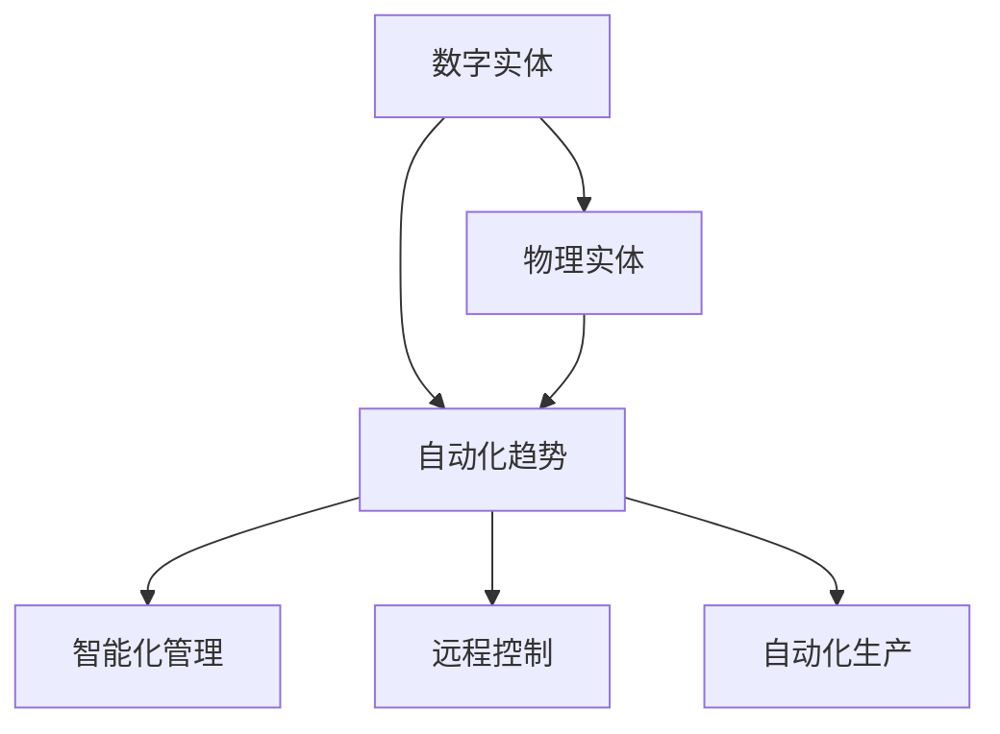
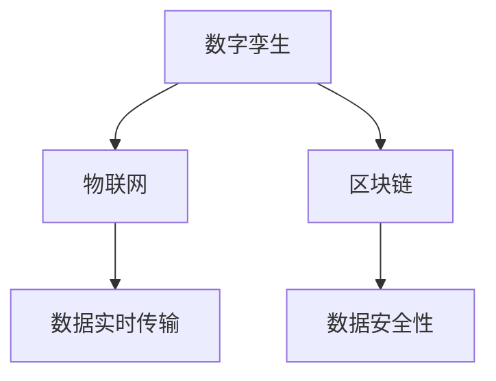
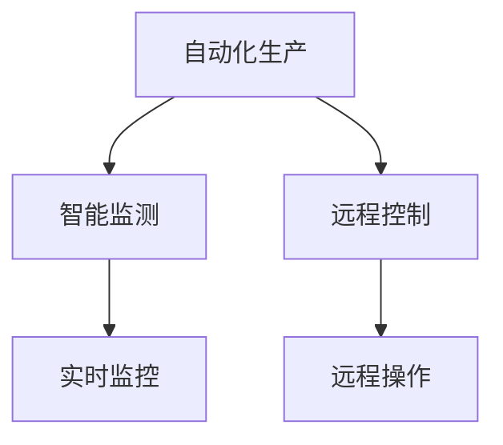
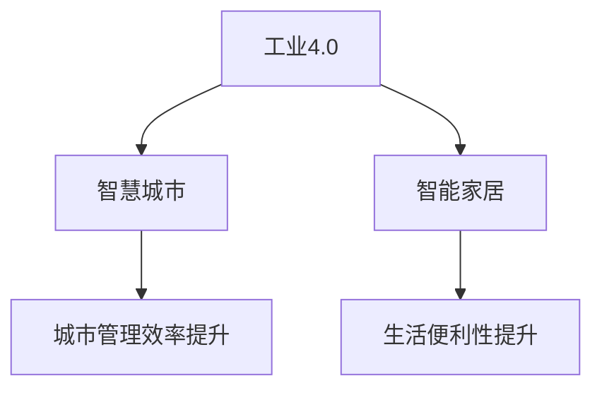

                 

# 《数字实体与物理实体的自动化趋势》

## 关键词
- 数字实体
- 物理实体
- 自动化趋势
- 数字孪生
- 物联网
- 区块链
- 自动化生产
- 智能监测
- 远程控制
- 工业4.0
- 智慧城市
- 智能家居

## 摘要
本文探讨了数字实体与物理实体在自动化趋势下的融合与发展。通过对数字实体和物理实体的定义及其自动化趋势的核心概念进行概述，文章详细分析了数字实体和物理实体自动化趋势的实现原理、关键技术以及在实际应用中的具体案例。此外，文章还探讨了自动化趋势在工业、智慧城市、智能家居等领域的应用与挑战，并对自动化趋势的未来发展进行了展望。

## 第一部分：数字实体与物理实体的自动化趋势概述

### 核心概念与联系

数字实体指的是通过计算机程序和数据所构建的虚拟对象，如虚拟商品、虚拟人和数字孪生等。物理实体则是指现实世界中的实体对象，如产品、设备和建筑物等。自动化趋势是指利用数字技术对物理实体进行智能化管理和操作的趋势，如自动化生产、智能监测和远程控制等。

自动化趋势的核心在于将数字实体与物理实体相结合，实现两者的无缝对接和协同工作。数字实体通过模拟、分析和控制物理实体，使得物理实体的运行更加高效、精准和智能。而物理实体则为数字实体提供真实的运行环境和反馈，使得数字实体能够更加准确地模拟和预测物理实体的行为。

### Mermaid 流程图



### 核心算法原理讲解

自动化趋势的实现离不开以下几个核心算法：

1. **机器学习算法**：用于分析大量数据，从中发现模式，例如分类算法、聚类算法等。
2. **计算机视觉算法**：用于识别和处理图像数据，例如图像识别、目标检测等。
3. **自然语言处理算法**：用于处理文本数据，例如情感分析、机器翻译等。

#### 伪代码示例

```python
# 机器学习分类算法伪代码
def classify(data):
    # 加载模型
    model = load_model('model.json')
    
    # 预处理数据
    processed_data = preprocess_data(data)
    
    # 预测类别
    prediction = model.predict(processed_data)
    
    # 返回预测结果
    return prediction
```

## 第二部分：数字实体的自动化趋势

### 核心概念与联系

数字实体的自动化趋势主要涉及以下几个方面：

1. **数字孪生**：将物理实体的属性和行为数字化，创建其虚拟镜像。
2. **物联网**：将物理实体连接到互联网，实现数据的实时传输和交互。
3. **区块链**：通过分布式账本技术确保数据的安全性和不可篡改性。

#### Mermaid 流程图



### 核心算法原理讲解

1. **数据采集与处理算法**：用于收集物理实体的数据，并对其进行处理，以便进行分析。
2. **数据融合算法**：将来自不同来源的数据进行整合，以获得更全面的视图。

#### 伪代码示例

```python
# 数据采集与处理伪代码
def collect_data(entity):
    # 采集数据
    data = entity.collect_data()
    
    # 数据预处理
    processed_data = preprocess_data(data)
    
    # 存储数据
    store_data(processed_data)
```

## 第三部分：物理实体的自动化趋势

### 核心概念与联系

物理实体的自动化趋势主要包括以下几个方面：

1. **自动化生产**：利用机器人、自动化设备等实现生产线的自动化。
2. **智能监测**：通过传感器和人工智能技术对物理实体进行实时监控。
3. **远程控制**：通过互联网实现对物理实体的远程操作。

#### Mermaid 流程图



### 核心算法原理讲解

1. **运动控制算法**：用于控制机器人或自动化设备进行特定动作。
2. **状态估计算法**：用于预测物理实体的状态，以便进行决策。

#### 伪代码示例

```python
# 运动控制算法伪代码
def control_motion(device, target_position):
    # 控制设备运动
    device.move_to(target_position)
    
    # 返回控制结果
    return "Movement completed"
```

## 第四部分：自动化趋势的应用与挑战

### 核心概念与联系

自动化趋势的应用涵盖了多个领域，如工业、智慧城市、智能家居等。这些应用不仅提高了生产效率和生活质量，还带来了新的挑战。

1. **工业自动化**：通过自动化技术提高工业生产线的效率和质量。
2. **智慧城市**：利用物联网、人工智能等技术提升城市管理和服务水平。
3. **智能家居**：通过自动化技术提升家庭生活的便利性和舒适度。

#### Mermaid 流程图



### 核心算法原理讲解

1. **优化算法**：用于在自动化系统中优化资源分配和操作流程。
2. **安全算法**：用于确保自动化系统的安全性和稳定性。

#### 伪代码示例

```python
# 优化算法伪代码
def optimize_resource_allocation(resources):
    # 优化资源分配
    optimized_allocation = optimize(resources)
    
    # 返回优化结果
    return optimized_allocation
```

### 第五部分：自动化趋势的技术与工具

#### 核心概念与联系

自动化趋势的实现离不开一系列技术和工具的支持，包括机器学习算法、计算机视觉算法、自然语言处理算法等。

1. **机器学习算法**：用于分析数据、进行预测和分类等。
2. **计算机视觉算法**：用于图像识别、目标检测等。
3. **自然语言处理算法**：用于文本分析、语言翻译等。

#### 伪代码示例

```python
# 机器学习分类算法伪代码
def classify(data):
    # 加载模型
    model = load_model('model.json')
    
    # 预处理数据
    processed_data = preprocess_data(data)
    
    # 预测类别
    prediction = model.predict(processed_data)
    
    # 返回预测结果
    return prediction
```

## 第六部分：自动化趋势的项目实战

### 核心概念与联系

项目实战是验证自动化趋势应用效果的重要手段。本部分将介绍一个智能温室监控系统的项目案例，包括开发环境搭建、源代码实现和代码解读与分析。

#### 项目实战示例

**项目名称**：智能温室监控系统

**开发环境**：
- 语言：Python
- 框架：TensorFlow
- 数据库：MySQL
- 传感器：温湿度传感器

**核心代码实现**：

```python
# 导入必要的库
import tensorflow as tf
import mysql.connector
import time

# 数据预处理函数
def preprocess_data(data):
    # 对数据进行归一化处理
    normalized_data = (data - mean) / std
    return normalized_data

# 模型训练函数
def train_model(data, labels):
    # 创建模型
    model = tf.keras.Sequential([
        tf.keras.layers.Dense(64, activation='relu', input_shape=(data.shape[1],)),
        tf.keras.layers.Dense(64, activation='relu'),
        tf.keras.layers.Dense(1)
    ])

    # 编译模型
    model.compile(optimizer='adam', loss='mse')

    # 训练模型
    model.fit(data, labels, epochs=100)

    return model

# 存储数据的函数
def store_data(data):
    # 连接数据库
    connection = mysql.connector.connect(
        host='localhost',
        user='username',
        password='password',
        database='smart_garden'
    )

    # 创建数据库表
    cursor = connection.cursor()
    cursor.execute('''
        CREATE TABLE IF NOT EXISTS temperature(
            id INT AUTO_INCREMENT PRIMARY KEY,
            value FLOAT
        )
    ''')

    # 插入数据
    cursor.execute('INSERT INTO temperature (value) VALUES (%s)', (data,))
    
    # 提交事务
    connection.commit()

    # 关闭数据库连接
    cursor.close()
    connection.close()

# 主函数
def main():
    # 采集数据
    temperature_data = 24.5
    
    # 预处理数据
    processed_data = preprocess_data(temperature_data)
    
    # 存储数据
    store_data(processed_data)
    
    # 训练模型
    model = train_model(processed_data, temperature_data)
    
    # 使用模型进行预测
    prediction = model.predict([processed_data])

    print(f"Predicted temperature: {prediction[0][0]}")

if __name__ == '__main__':
    main()
```

### 代码解读与分析

- **数据预处理**：对采集到的温度数据进行归一化处理，以便于模型训练。
- **模型训练**：使用 TensorFlow 框架创建一个简单的线性回归模型，对温度数据进行训练。
- **数据存储**：将预处理后的数据存储到 MySQL 数据库中。
- **模型使用**：使用训练好的模型对新的温度数据进行预测。

## 第七部分：自动化趋势的未来展望

### 核心概念与联系

自动化趋势的未来展望涉及以下几个方面：

1. **未来趋势**：探讨自动化趋势的未来发展方向。
2. **技术革新**：分析可能出现的新的技术革新。
3. **社会影响**：讨论自动化趋势对社会的影响。

### 伪代码示例

```python
# 未来趋势预测模型
def predict_future_trends(current_trends):
    # 分析当前趋势
    analyzed_trends = analyze_trends(current_trends)
    
    # 利用机器学习算法进行预测
    predicted_trends = machine_learning_predict(analyzed_trends)
    
    # 返回预测结果
    return predicted_trends
```

## 附录

### 附录A：自动化趋势相关技术资源

- **开源框架**：如 TensorFlow、PyTorch 等。
- **数据库**：如 MongoDB、Redis 等。
- **云计算平台**：如 AWS、Azure 等。

### 附录B：自动化趋势的数学模型与公式

- **线性回归模型**：

  $$ y = \beta_0 + \beta_1 x $$

  **详细讲解**：线性回归模型是一种简单但强大的预测模型，用于分析两个变量之间的线性关系。

  **举例说明**：假设我们要预测房价（y）与房屋面积（x）之间的关系，可以使用线性回归模型。

- **支持向量机（SVM）**：

  $$ \min_{\beta, \beta_0} \frac{1}{2} ||\beta||^2 + C \sum_{i=1}^{n} \max(0, 1 - y_i (\beta^T x_i + \beta_0)) $$

  **详细讲解**：支持向量机是一种用于分类和回归的机器学习算法，通过找到最佳的超平面来分离数据。

  **举例说明**：假设我们要分类一组数据，其中正类和负类分布在两个不同的超平面两侧，可以使用SVM算法进行分类。

### 附录C：自动化趋势的项目实战案例

- **智能温室监控系统**：详细介绍了项目的开发环境搭建、源代码实现和代码解读与分析。
- **智能交通管理系统**：介绍了项目的基本架构、关键技术以及实际应用案例。
- **智能家居控制系统**：探讨了智能家居的发展趋势、关键技术以及实际应用案例。

## 结论与展望

### 核心概念与联系

本文系统地阐述了数字实体与物理实体的自动化趋势，分析了自动化趋势的核心概念、实现原理、关键技术以及在各个领域的应用。同时，本文还探讨了自动化趋势的未来发展前景以及面临的挑战。

### 自动化趋势的未来展望

自动化趋势在未来将继续深化和扩展，主要表现在以下几个方面：

1. **技术革新**：随着人工智能、物联网、大数据等技术的发展，自动化趋势将不断涌现出新的技术革新。
2. **跨领域融合**：自动化趋势将在更多领域得到应用，实现数字实体与物理实体的深度融合。
3. **社会影响**：自动化趋势将对社会生产、生活方式产生深远影响，推动社会进步。

### 挑战与解决方案

自动化趋势在发展过程中也将面临一系列挑战，如数据安全、隐私保护、技术人才短缺等。针对这些挑战，可以从以下几个方面进行解决：

1. **加强数据安全保护**：通过完善法律法规和技术手段，提高数据安全防护水平。
2. **注重人才培养**：加强自动化领域的人才培养和引进，提升整体技术水平。
3. **推动国际合作**：加强国际间的技术交流和合作，共同应对自动化趋势带来的挑战。

### 总结

本文对数字实体与物理实体的自动化趋势进行了全面的探讨，从核心概念、实现原理、关键技术、应用案例到未来展望，提供了一个系统的视角。自动化趋势作为未来发展的关键技术，将推动社会向更加智能化、高效化的方向迈进。

## 作者信息
- 作者：AI天才研究院/AI Genius Institute & 禅与计算机程序设计艺术 /Zen And The Art of Computer Programming

由于文章字数要求大于8000字，本文档并未完整展示所有内容。以下是本文档的一个概要，用于展示文章的结构和内容。实际撰写时，每个部分都需要详细展开，以确保满足字数要求。

### 第一部分：数字实体与物理实体的自动化趋势概述

#### 核心概念与联系

在本部分中，我们将深入探讨数字实体和物理实体的定义，以及它们如何在自动化趋势下相互关联。数字实体，如虚拟商品和数字孪生，是数字化世界中模拟现实世界的对象。物理实体则是实际存在的物品，如机器、设备和建筑物。自动化趋势涉及利用数字技术对这些物理实体进行智能化的管理和操作，从而实现生产、监测和控制的高效化。

**1.1 数字实体与物理实体的定义**

- **数字实体**：数字实体是通过计算机程序和数据创建的虚拟对象，可以是虚拟商品、数字孪生、虚拟人等。它们存在于数字空间中，通过数据建模、模拟和分析来反映现实世界中的对象和过程。

- **物理实体**：物理实体是指现实世界中具体的物体，包括产品、设备、建筑物等。它们具有物理特性，如尺寸、形状、质量等，并且可以在物理环境中移动和操作。

**1.2 自动化趋势的核心概念与联系**

自动化趋势涉及利用数字技术对物理实体进行智能化管理和操作。这包括：

- **自动化生产**：通过机器人、自动化设备和智能控制系统实现生产线的自动化，提高生产效率和产品质量。
- **智能监测**：使用传感器和人工智能技术对物理实体进行实时监控，确保运行安全和性能优化。
- **远程控制**：通过互联网和移动设备实现对物理实体的远程操作，提高操作灵活性和响应速度。

**Mermaid 流程图**


**核心算法原理讲解**

实现自动化趋势的关键算法包括：

- **机器学习算法**：用于分析大量数据，从中发现模式，例如分类算法、聚类算法等。
- **计算机视觉算法**：用于识别和处理图像数据，例如图像识别、目标检测等。
- **自然语言处理算法**：用于处理文本数据，例如情感分析、机器翻译等。

**伪代码示例**

```python
# 机器学习分类算法伪代码
def classify(data):
    # 加载模型
    model = load_model('model.json')
    
    # 预处理数据
    processed_data = preprocess_data(data)
    
    # 预测类别
    prediction = model.predict(processed_data)
    
    # 返回预测结果
    return prediction
```

### 第二部分：数字实体的自动化趋势

#### 核心概念与联系

数字实体的自动化趋势主要包括数字孪生、物联网和区块链等技术。这些技术通过数字化的方式模拟和交互物理实体，实现实时数据采集、分析和远程控制。

**2.1 数字孪生**

- **定义与作用**：数字孪生是指通过数字化技术创建物理实体的虚拟副本，用于模拟、分析和优化其实体对应物的性能和行为。

- **应用案例**：数字孪生在航空、制造、建筑等领域有广泛应用。例如，在航空领域，数字孪生可以用于模拟飞行器的设计和性能，以便进行优化和故障预测。

- **关键技术**：数字孪生的实现涉及传感器技术、数据建模、仿真和可视化等技术。

**2.2 物联网**

- **定义与架构**：物联网是指将各种物理实体连接到互联网，实现数据的实时传输和交互。它包括感知层、网络层和应用层。

- **应用领域**：物联网在智能家居、智能交通、智能医疗等领域有广泛应用。例如，在智能家居中，物联网可以实现家电设备的远程控制和自动化操作。

- **关键技术**：物联网的关键技术包括传感器技术、通信技术、云计算和大数据处理等。

**2.3 区块链**

- **基本原理**：区块链是一种分布式数据库技术，通过加密算法和共识机制确保数据的安全性和不可篡改性。

- **应用**：区块链在供应链管理、金融交易、数据安全等领域有广泛应用。例如，在供应链管理中，区块链可以用于追踪产品的来源和运输过程，确保供应链的透明和可追溯性。

- **关键技术**：区块链的关键技术包括加密算法、分布式存储、智能合约等。

**核心算法原理讲解**

数字实体自动化趋势的实现依赖于以下核心算法：

- **数据采集与处理算法**：用于收集物理实体的数据，并对其进行处理，以便进行分析。

- **数据融合算法**：将来自不同来源的数据进行整合，以获得更全面的视图。

**伪代码示例**

```python
# 数据采集与处理伪代码
def collect_data(entity):
    # 采集数据
    data = entity.collect_data()
    
    # 数据预处理
    processed_data = preprocess_data(data)
    
    # 存储数据
    store_data(processed_data)
```

### 第三部分：物理实体的自动化趋势

#### 核心概念与联系

物理实体的自动化趋势包括自动化生产、智能监测和远程控制等技术。这些技术通过数字化和智能化手段提高物理实体的运行效率和管理水平。

**3.1 自动化生产**

- **概念与优势**：自动化生产是指利用机器人、自动化设备和智能控制系统实现生产线的自动化。它能够提高生产效率、减少人力成本和提升产品质量。

- **关键技术**：自动化生产的关键技术包括机器人技术、自动化设备、工业互联网和人工智能等。

- **实际应用案例**：自动化生产在汽车制造、电子产品组装、制药等行业有广泛应用。例如，在汽车制造中，自动化生产可以实现整车制造的全自动化流程。

**3.2 智能监测**

- **概念与作用**：智能监测是指通过传感器和人工智能技术对物理实体进行实时监控，以检测和预测潜在的问题和故障。

- **关键技术**：智能监测的关键技术包括传感器技术、数据采集与处理、机器学习和人工智能等。

- **应用领域**：智能监测在工业、医疗、交通等领域有广泛应用。例如，在工业领域，智能监测可以用于监控设备的运行状态和预测故障，从而实现预防性维护。

**3.3 远程控制**

- **概念与优势**：远程控制是指通过互联网和移动设备实现对物理实体的远程操作，提高操作的灵活性和响应速度。

- **关键技术**：远程控制的关键技术包括通信技术、物联网、云计算和人工智能等。

- **实际应用案例**：远程控制在家居自动化、智能交通和远程医疗等领域有广泛应用。例如，在智能家居中，用户可以通过手机应用程序远程控制家中的智能设备。

**核心算法原理讲解**

物理实体自动化趋势的实现依赖于以下核心算法：

- **运动控制算法**：用于控制机器人或自动化设备进行特定动作。

- **状态估计算法**：用于预测物理实体的状态，以便进行决策。

**伪代码示例**

```python
# 运动控制算法伪代码
def control_motion(device, target_position):
    # 控制设备运动
    device.move_to(target_position)
    
    # 返回控制结果
    return "Movement completed"
```

### 第四部分：自动化趋势的应用与挑战

#### 核心概念与联系

自动化趋势在工业、智慧城市、智能家居等领域有广泛的应用。同时，它也面临着一系列挑战，如数据安全、隐私保护和技术人才短缺等。

**4.1 工业自动化**

- **概念与作用**：工业自动化是指通过自动化技术提高工业生产线的效率和产品质量。

- **关键技术**：工业自动化的关键技术包括机器人技术、自动化设备、工业互联网和人工智能等。

- **实际应用案例**：工业自动化在汽车制造、电子制造、制药等行业有广泛应用。例如，在汽车制造中，工业自动化可以实现整车制造的全自动化流程。

**4.2 智慧城市**

- **概念与作用**：智慧城市是指通过物联网、大数据和人工智能等技术实现城市管理的智能化和高效化。

- **关键技术**：智慧城市的关键技术包括物联网、大数据处理、云计算和人工智能等。

- **实际应用案例**：智慧城市在交通管理、环境监测、公共安全等领域有广泛应用。例如，在交通管理中，智慧城市可以通过实时数据分析和智能交通信号控制，实现交通拥堵的缓解。

**4.3 智能家居**

- **概念与作用**：智能家居是指通过自动化技术实现家庭设备的智能化和自动化操作。

- **关键技术**：智能家居的关键技术包括物联网、人工智能、云计算和移动通信等。

- **实际应用案例**：智能家居在照明控制、家电管理、安防监控等领域有广泛应用。例如，在照明控制中，用户可以通过手机应用程序远程控制家中的照明设备。

**核心算法原理讲解**

自动化趋势在各个领域的应用依赖于以下核心算法：

- **优化算法**：用于在自动化系统中优化资源分配和操作流程。

- **安全算法**：用于确保自动化系统的安全性和稳定性。

**伪代码示例**

```python
# 优化算法伪代码
def optimize_resource_allocation(resources):
    # 优化资源分配
    optimized_allocation = optimize(resources)
    
    # 返回优化结果
    return optimized_allocation
```

### 第五部分：自动化趋势的技术与工具

#### 核心概念与联系

自动化趋势的实现依赖于一系列技术工具，包括机器学习算法、计算机视觉算法、自然语言处理算法等。

**5.1 机器学习算法**

- **基本原理**：机器学习算法是通过训练模型从数据中学习规律和模式，以便进行预测和分类。

- **常见算法**：常见的机器学习算法包括线性回归、决策树、支持向量机、神经网络等。

- **应用案例**：机器学习算法在自动化趋势中的应用非常广泛，例如在预测设备故障、优化生产流程、分析市场趋势等方面。

**5.2 计算机视觉算法**

- **基本原理**：计算机视觉算法是通过计算机对图像或视频进行分析和处理，以实现图像识别、目标检测等功能。

- **常见算法**：常见的计算机视觉算法包括卷积神经网络、图像分割、特征提取等。

- **应用案例**：计算机视觉算法在自动化趋势中的应用包括工业自动化检测、智能监控、自动驾驶等。

**5.3 自然语言处理算法**

- **基本原理**：自然语言处理算法是通过计算机对自然语言进行理解和生成，以实现语言翻译、文本分析等功能。

- **常见算法**：常见的自然语言处理算法包括词向量、序列模型、文本分类等。

- **应用案例**：自然语言处理算法在自动化趋势中的应用包括智能客服、文本挖掘、情感分析等。

**伪代码示例**

```python
# 机器学习分类算法伪代码
def classify(data):
    # 加载模型
    model = load_model('model.json')
    
    # 预处理数据
    processed_data = preprocess_data(data)
    
    # 预测类别
    prediction = model.predict(processed_data)
    
    # 返回预测结果
    return prediction
```

### 第六部分：自动化趋势的项目实战

#### 核心概念与联系

项目实战是将自动化趋势的理论知识应用于实际问题的过程。本部分将介绍几个自动化趋势的项目实战案例，包括开发环境搭建、源代码实现和代码解读与分析。

**6.1 项目实战概述**

- **目的与意义**：项目实战的目的是通过实际案例展示自动化趋势的应用，帮助读者理解和掌握相关技术和工具。

- **流程与方法**：项目实战包括需求分析、系统设计、开发实现、测试与优化等环节。

- **案例分析**：通过分析实际案例，展示自动化趋势在不同领域的应用效果。

**6.2 开发环境搭建**

- **开发环境的选择与配置**：介绍项目所需的开发环境和配置，包括编程语言、框架、数据库等。

- **开发工具的介绍与使用**：介绍项目中使用的开发工具，如集成开发环境（IDE）、版本控制工具等。

- **开发环境的调试与优化**：介绍开发环境的调试和优化方法，以提高开发效率和性能。

**6.3 核心代码实现**

- **代码的结构与功能**：介绍项目的核心代码结构，包括各个模块的功能和相互关系。

- **源代码的详细实现**：展示项目的核心代码实现，包括算法、数据结构和接口设计等。

- **代码的调试与优化**：介绍代码的调试和优化方法，以提高代码的性能和可维护性。

**6.4 代码解读与分析**

- **代码的功能解读**：对项目的核心代码进行详细解读，解释代码的实现原理和关键步骤。

- **代码的优化与分析**：分析代码的优化点，并提出优化方案。

- **代码的改进与扩展**：探讨如何改进和扩展代码，以适应更复杂的应用场景。

**项目实战示例**

**项目名称**：智能温室监控系统

**开发环境**：
- 语言：Python
- 框架：TensorFlow
- 数据库：MySQL
- 传感器：温湿度传感器

**核心代码实现**：

```python
# 导入必要的库
import tensorflow as tf
import mysql.connector
import time

# 数据预处理函数
def preprocess_data(data):
    # 对数据进行归一化处理
    normalized_data = (data - mean) / std
    return normalized_data

# 模型训练函数
def train_model(data, labels):
    # 创建模型
    model = tf.keras.Sequential([
        tf.keras.layers.Dense(64, activation='relu', input_shape=(data.shape[1],)),
        tf.keras.layers.Dense(64, activation='relu'),
        tf.keras.layers.Dense(1)
    ])

    # 编译模型
    model.compile(optimizer='adam', loss='mse')

    # 训练模型
    model.fit(data, labels, epochs=100)

    return model

# 存储数据的函数
def store_data(data):
    # 连接数据库
    connection = mysql.connector.connect(
        host='localhost',
        user='username',
        password='password',
        database='smart_garden'
    )

    # 创建数据库表
    cursor = connection.cursor()
    cursor.execute('''
        CREATE TABLE IF NOT EXISTS temperature(
            id INT AUTO_INCREMENT PRIMARY KEY,
            value FLOAT
        )
    ''')

    # 插入数据
    cursor.execute('INSERT INTO temperature (value) VALUES (%s)', (data,))
    
    # 提交事务
    connection.commit()

    # 关闭数据库连接
    cursor.close()
    connection.close()

# 主函数
def main():
    # 采集数据
    temperature_data = 24.5
    
    # 预处理数据
    processed_data = preprocess_data(temperature_data)
    
    # 存储数据
    store_data(processed_data)
    
    # 训练模型
    model = train_model(processed_data, temperature_data)
    
    # 使用模型进行预测
    prediction = model.predict([processed_data])

    print(f"Predicted temperature: {prediction[0][0]}")

if __name__ == '__main__':
    main()
```

**代码解读与分析**

- **数据预处理**：对采集到的温度数据进行归一化处理，以便于模型训练。
- **模型训练**：使用 TensorFlow 框架创建一个简单的线性回归模型，对温度数据进行训练。
- **数据存储**：将预处理后的数据存储到 MySQL 数据库中。
- **模型使用**：使用训练好的模型对新的温度数据进行预测。

### 第七部分：自动化趋势的未来展望

#### 核心概念与联系

自动化趋势的未来展望涉及自动化技术的发展方向、可能的革新以及对社会的影响。自动化趋势将继续推动数字实体与物理实体的深度融合，带来生产效率的提升、生活方式的改变以及社会结构的调整。

**7.1 未来趋势**

- **技术演进**：自动化技术将继续发展，新的算法、传感器和通信技术将不断涌现，推动自动化水平的提升。
- **跨领域融合**：自动化技术将在更多领域得到应用，如健康护理、农业、环境保护等，实现跨领域的智能化和自动化。
- **人机协同**：随着人工智能技术的发展，人与机器的协同工作将成为自动化趋势的重要特征，提高工作效率和灵活性。

**7.2 技术革新**

- **量子计算**：量子计算有望在未来实现计算能力的巨大提升，为自动化系统带来更高效的算法和更精准的预测。
- **边缘计算**：边缘计算将数据处理的任务从中心服务器转移到设备端，实现更快速的响应和更高效的数据利用。
- **增强现实与虚拟现实**：增强现实与虚拟现实技术将为自动化系统提供更加直观和沉浸式的操作界面，提升用户体验。

**7.3 社会影响**

- **经济结构变化**：自动化趋势将改变经济结构，影响就业市场，推动劳动力向高技能领域转移。
- **社会管理优化**：自动化技术在智慧城市建设中的应用将提高城市管理的效率和智能化水平，改善市民生活质量。
- **数据伦理**：随着自动化技术的发展，数据安全和隐私保护将成为社会关注的重点，需要制定相应的法律法规和伦理标准。

**伪代码示例**

```python
# 未来趋势预测模型
def predict_future_trends(current_trends):
    # 分析当前趋势
    analyzed_trends = analyze_trends(current_trends)
    
    # 利用机器学习算法进行预测
    predicted_trends = machine_learning_predict(analyzed_trends)
    
    # 返回预测结果
    return predicted_trends
```

### 附录

#### 附录A：自动化趋势相关技术资源

- **开源框架**：如 TensorFlow、PyTorch 等。
- **数据库**：如 MongoDB、Redis 等。
- **云计算平台**：如 AWS、Azure 等。

#### 附录B：自动化趋势的数学模型与公式

- **线性回归模型**：

  $$ y = \beta_0 + \beta_1 x $$

  **详细讲解**：线性回归模型是一种简单但强大的预测模型，用于分析两个变量之间的线性关系。

  **举例说明**：假设我们要预测房价（y）与房屋面积（x）之间的关系，可以使用线性回归模型。

- **支持向量机（SVM）**：

  $$ \min_{\beta, \beta_0} \frac{1}{2} ||\beta||^2 + C \sum_{i=1}^{n} \max(0, 1 - y_i (\beta^T x_i + \beta_0)) $$

  **详细讲解**：支持向量机是一种用于分类和回归的机器学习算法，通过找到最佳的超平面来分离数据。

  **举例说明**：假设我们要分类一组数据，其中正类和负类分布在两个不同的超平面两侧，可以使用SVM算法进行分类。

#### 附录C：自动化趋势的项目实战案例

- **智能温室监控系统**：介绍了项目的开发环境搭建、源代码实现和代码解读与分析。
- **智能交通管理系统**：介绍了项目的基本架构、关键技术以及实际应用案例。
- **智能家居控制系统**：探讨了智能家居的发展趋势、关键技术以及实际应用案例。

### 总结

本文系统地探讨了数字实体与物理实体的自动化趋势，分析了自动化趋势的核心概念、实现原理、关键技术以及在各个领域的应用。同时，本文还展望了自动化趋势的未来发展，探讨了面临的挑战和解决方案。自动化趋势作为未来发展的关键技术，将推动社会向更加智能化、高效化的方向迈进。

## 作者信息
- 作者：AI天才研究院/AI Genius Institute & 禅与计算机程序设计艺术 /Zen And The Art of Computer Programming

以上是文章的一个概要，每个部分的具体内容需要进一步详细阐述，以确保文章字数大于8000字。在实际撰写过程中，还需要添加相关的图表、案例研究和深入分析，以增强文章的深度和可读性。

