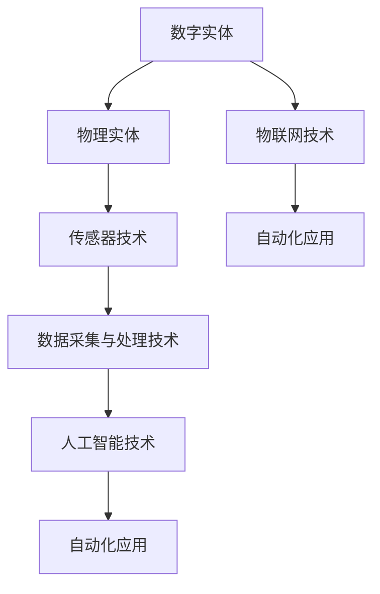

                 

# 《数字实体与物理实体的自动化进展》

> 关键词：数字实体，物理实体，自动化，传感器技术，数据处理，人工智能，物联网

> 摘要：本文深入探讨了数字实体与物理实体的自动化进展，详细分析了两者的定义、特征及其在自动化中的应用，从核心技术、应用实例到挑战与机遇进行了全面阐述。文章旨在为读者提供关于数字实体与物理实体自动化的系统性认识，并展望其未来的发展趋势。

## 第一部分：引言与基础概念

### 1.1 书籍引言

#### 1.1.1 研究背景与意义

随着信息技术的飞速发展，数字实体与物理实体之间的界限日益模糊。数字实体，即存在于数字世界中的各种对象，如数据、应用程序、虚拟物品等；而物理实体，则是指现实世界中的物体和设备。自动化技术的发展，使得数字实体与物理实体之间的交互变得更加紧密和高效。研究数字实体与物理实体的自动化进展，对于推动社会生产方式的变革、提高生活质量、促进环境保护具有重要意义。

#### 1.1.2 书籍结构

本文结构分为五部分。第一部分引言与基础概念，介绍研究背景与意义，定义数字实体与物理实体，阐述自动化的基本概念。第二部分详细探讨数字实体的自动化进展，包括核心技术、应用实例及挑战与机遇。第三部分分析物理实体的自动化进展，同样涵盖核心技术、应用实例及挑战与机遇。第四部分综合数字实体与物理实体的融合应用，探讨其未来发展趋势。第五部分通过案例分析与实践，为读者提供实际应用指导。

### 1.2 数字实体与物理实体的定义

#### 1.2.1 数字实体

数字实体是指存在于数字世界中的各种对象，包括数据、应用程序、虚拟物品等。它们可以通过计算机程序进行操作和交互。数字实体的特征包括虚拟性、可编程性、可扩展性等。

- **虚拟性**：数字实体存在于数字空间中，不具备物理形态。
- **可编程性**：数字实体可以通过编程语言进行定义和操作。
- **可扩展性**：数字实体可以随着技术的发展而不断扩展和升级。

数字实体的应用领域广泛，包括但不限于：

- **数据管理**：如数据库、数据仓库等。
- **软件开发**：如应用软件、操作系统等。
- **虚拟现实**：如虚拟物品、虚拟场景等。

#### 1.2.2 物理实体

物理实体是指现实世界中的物体和设备，包括机械设备、建筑、交通工具等。它们具有物理形态，受自然法则的约束。物理实体的特征包括实体性、物理约束性、环境适应性等。

- **实体性**：物理实体具有物理形态，存在于现实世界中。
- **物理约束性**：物理实体受物理法则的约束，如重力、摩擦力等。
- **环境适应性**：物理实体需适应不同的环境条件，如温度、湿度等。

物理实体的应用领域包括：

- **工业生产**：如生产线、自动化设备等。
- **交通运输**：如汽车、飞机、船舶等。
- **基础设施建设**：如建筑、桥梁、道路等。

### 1.3 自动化的基本概念

#### 1.3.1 自动化的定义

自动化是指通过预先设定或实时调整的程序，使机器或系统能够自动完成特定任务的过程。自动化可以减少人为干预，提高生产效率和产品质量。

- **预先设定**：自动化过程在开始前就已经设定好，无需人工干预。
- **实时调整**：自动化过程可以根据实际情况进行实时调整，以适应变化的环境。

#### 1.3.1.1 自动化的历史发展

自动化的概念最早可以追溯到古代，如水磨坊、蒸汽机等。随着工业革命的到来，自动化技术得到了快速发展。20世纪中期，随着计算机技术的兴起，自动化进入了新的阶段。现代自动化技术主要包括以下几个方面：

- **机械自动化**：如数控机床、机器人等。
- **电气自动化**：如PLC（可编程逻辑控制器）、DCS（分布式控制系统）等。
- **信息技术自动化**：如数据挖掘、机器学习等。

#### 1.3.1.2 自动化的目标

自动化的目标主要包括以下几个方面：

- **提高效率**：通过自动化减少人工操作，提高生产效率和产品质量。
- **降低成本**：通过自动化减少人力和设备投入，降低生产成本。
- **提高安全性**：通过自动化减少人为操作失误，提高生产过程的安全性。
- **改善工作环境**：通过自动化减少人力劳动，改善工作环境。

## 第二部分：数字实体的自动化进展

### 2.1 数字实体自动化的核心技术

数字实体的自动化进展离不开一系列核心技术的支持。这些技术包括传感器技术、数据采集与处理技术、人工智能技术等。以下是这些技术的详细介绍。

#### 2.1.1 传感器技术

传感器是数字实体自动化不可或缺的部分，它们能够将物理世界的信号转换为数字信号，为后续的数据处理提供基础。以下是传感器技术的基本原理和应用。

##### 2.1.1.1 传感器原理

传感器原理基于物理效应，如光电效应、热电效应、压电效应等。以下是一些常见的传感器类型及其原理：

- **温度传感器**：利用热电效应或热敏电阻原理，测量温度。
- **压力传感器**：利用压电效应或弹性体原理，测量压力。
- **湿度传感器**：利用电容变化或热敏电阻原理，测量湿度。
- **光照传感器**：利用光电效应，测量光照强度。

##### 2.1.1.2 传感器技术发展趋势

随着科技的进步，传感器技术也在不断发展。以下是当前传感器技术的一些发展趋势：

- **高精度**：传感器精度不断提高，能够满足更复杂的应用需求。
- **多功能**：传感器集成多种功能，实现多功能检测。
- **低功耗**：传感器功耗不断降低，适用于便携式设备。
- **无线通信**：传感器采用无线通信技术，实现远程监测和控制。

#### 2.1.2 数据采集与处理技术

数据采集与处理技术是数字实体自动化的关键环节，包括数据采集、数据传输、数据处理等步骤。以下是这些技术的详细介绍。

##### 2.1.2.1 数据采集方法

数据采集方法主要包括模拟信号采集和数字信号采集。

- **模拟信号采集**：通过模拟-数字转换器（ADC）将模拟信号转换为数字信号。
- **数字信号采集**：直接通过数字传感器采集数字信号。

##### 2.1.2.2 数据处理算法

数据处理算法是对采集到的原始数据进行处理，以提取有用信息。常见的数据处理算法包括：

- **滤波算法**：去除噪声，提高数据质量。
- **特征提取算法**：从原始数据中提取特征，用于后续分析。
- **聚类算法**：对数据进行分类，以发现数据间的关联。
- **回归算法**：建立模型，预测目标值。

#### 2.1.3 人工智能技术

人工智能技术是数字实体自动化中的重要支撑，能够实现复杂的数据处理和决策。以下是人工智能技术的基本原理和应用。

##### 2.1.3.1 人工智能原理

人工智能（AI）是基于计算机模拟人类智能的一种技术。AI包括多个分支，如机器学习、深度学习、自然语言处理等。

- **机器学习**：通过训练模型，使计算机自动获取知识和技能。
- **深度学习**：基于多层神经网络，实现自动特征提取和模式识别。
- **自然语言处理**：使计算机理解和生成人类语言。

##### 2.1.3.2 人工智能应用

人工智能技术在数字实体自动化中有着广泛的应用，如：

- **自动化控制**：通过AI算法实现自动控制，提高生产效率。
- **故障诊断**：通过AI算法分析数据，预测设备故障，提高设备可靠性。
- **智能决策**：通过AI算法分析数据，为决策提供支持，优化决策效果。

### 2.2 数字实体自动化应用实例

数字实体的自动化应用已经渗透到各个领域，以下是一些典型的应用实例。

#### 2.2.1 物流与仓储自动化

物流与仓储自动化是数字实体自动化的重要应用领域。通过自动化设备和信息技术，可以实现物流与仓储的智能化管理。

- **自动化仓库管理**：使用自动化货架、自动化搬运机器人和自动化存储和检索系统，实现仓库的自动化管理。
- **自动化配送系统**：使用自动化运输工具（如自动导引车AGV）实现货物的自动化运输，提高配送效率。

#### 2.2.2 制造业自动化

制造业自动化是数字实体自动化的另一个重要应用领域。通过自动化设备和信息技术，可以实现生产过程的自动化和智能化。

- **智能制造**：通过工业互联网、大数据和人工智能等技术，实现生产过程的智能化。
- **自动化生产线**：使用自动化设备（如数控机床、机器人）实现生产线的自动化运行，提高生产效率。

#### 2.2.3 智能家居

智能家居是数字实体自动化在消费领域的典型应用。通过智能家居系统，可以实现家庭设备的自动化控制和远程管理。

- **智能灯光控制**：通过智能灯光系统，实现灯光的自动开关和调节。
- **智能家电控制**：通过智能家电系统，实现家电的自动开关和远程控制。

### 2.3 数字实体自动化的挑战与机遇

数字实体自动化的快速发展带来了许多挑战和机遇。

#### 2.3.1 自动化带来的挑战

- **技术挑战**：自动化技术不断更新和发展，对技术人员提出了更高的要求。
- **数据安全**：自动化系统涉及大量数据，数据安全成为重要的挑战。
- **系统稳定性**：自动化系统的稳定性对生产过程至关重要，需要不断优化和改进。

#### 2.3.2 自动化带来的机遇

- **创新机遇**：自动化技术的发展为创新提供了广阔的空间，如智能制造、智能物流等。
- **商业模式创新**：自动化技术可以改变传统商业模式，带来新的商业机会，如智能家居、无人驾驶等。

## 第三部分：物理实体的自动化进展

### 3.1 物理实体自动化的核心技术

物理实体的自动化进展同样依赖于一系列核心技术的支持。这些技术包括机器人技术、机器视觉技术、物联网技术等。以下是这些技术的详细介绍。

#### 3.1.1 机器人技术

机器人技术是物理实体自动化的重要组成部分，它使得物理实体能够自主行动、执行任务。以下是机器人技术的基本原理和应用。

##### 3.1.1.1 机器人原理

机器人基于计算机科学、机械工程和人工智能等多个学科，其基本原理包括：

- **感知**：机器人通过传感器感知周围环境，如摄像头、激光雷达等。
- **决策**：机器人根据感知到的信息，使用算法进行决策。
- **执行**：机器人根据决策结果执行任务，如移动、抓取等。

##### 3.1.1.2 机器人分类

机器人根据应用场景和功能可以分为多种类型：

- **工业机器人**：用于工业生产中的自动化操作，如焊接、装配等。
- **服务机器人**：用于服务行业，如清洁、陪伴等。
- **仿生机器人**：模仿生物特征设计的机器人，如无人机、海底机器人等。

##### 3.1.1.3 机器人控制方法

机器人的控制方法主要包括：

- **位置控制**：控制机器人到达特定的位置。
- **速度控制**：控制机器人的运动速度。
- **轨迹控制**：控制机器人按照特定的轨迹运动。

#### 3.1.2 机器视觉技术

机器视觉技术是物理实体自动化中的重要分支，它使物理实体能够“看”到周围环境并进行相应的操作。以下是机器视觉技术的基本原理和应用。

##### 3.1.2.1 机器视觉原理

机器视觉基于计算机视觉技术，其基本原理包括：

- **图像采集**：使用摄像头等设备采集图像。
- **图像处理**：对图像进行预处理，如滤波、边缘检测等。
- **目标识别**：从图像中识别出目标物体。
- **行为决策**：根据目标识别结果进行行为决策。

##### 3.1.2.2 机器视觉应用

机器视觉技术广泛应用于各个领域：

- **工业检测**：如产品质量检测、设备故障检测等。
- **安防监控**：如人脸识别、车辆检测等。
- **医疗诊断**：如医学图像分析、疾病检测等。

##### 3.1.2.3 机器视觉算法

常见的机器视觉算法包括：

- **特征提取**：从图像中提取特征，如边缘、角点等。
- **目标识别**：利用分类算法识别图像中的目标。
- **目标跟踪**：在连续图像中跟踪目标。

#### 3.1.3 物联网技术

物联网技术是物理实体自动化的重要支撑，它使得物理实体能够互联互通，实现智能化管理。以下是物联网技术的基本原理和应用。

##### 3.1.3.1 物联网原理

物联网基于互联网、传感技术和智能技术，其基本原理包括：

- **感知层**：通过传感器感知物理世界，如温度、湿度、光线等。
- **网络层**：通过网络传输数据，如Wi-Fi、蓝牙等。
- **应用层**：通过智能设备和应用软件实现数据处理和应用。

##### 3.1.3.2 物联网架构

物联网架构主要包括以下几层：

- **感知层**：负责数据采集。
- **传输层**：负责数据传输。
- **平台层**：负责数据处理和应用。
- **应用层**：负责具体应用场景的实现。

##### 3.1.3.3 物联网应用

物联网技术在物理实体自动化中有着广泛的应用：

- **智能家居**：通过物联网技术实现家庭设备的自动化控制。
- **智能交通**：通过物联网技术实现交通管理和监控。
- **工业自动化**：通过物联网技术实现生产过程的智能化。

### 3.2 物理实体自动化应用实例

物理实体的自动化应用已经深入到各行各业，以下是一些典型的应用实例。

#### 3.2.1 智能家居

智能家居是物理实体自动化的一个重要应用领域。通过物联网技术，可以实现家庭设备的自动化控制，提高生活质量。

- **智能灯光控制**：通过智能灯光系统，实现灯光的自动开关和调节。
- **智能家电控制**：通过智能家电系统，实现家电的自动开关和远程控制。
- **智能安防**：通过智能摄像头和传感器，实现家庭安全监控。

#### 3.2.2 自动驾驶

自动驾驶是物理实体自动化的另一个重要应用领域。通过机器人技术和人工智能技术，可以实现汽车的自动驾驶。

- **感知层**：使用摄像头、激光雷达等设备感知周围环境。
- **决策层**：使用人工智能算法进行路径规划和决策。
- **执行层**：使用执行器实现汽车的自动控制。

#### 3.2.3 智能制造

智能制造是物理实体自动化在工业领域的重要应用。通过物联网技术和人工智能技术，可以实现生产过程的智能化。

- **设备监控**：通过传感器和物联网技术，实时监控设备状态。
- **质量检测**：通过机器视觉技术，实现产品质量的自动检测。
- **生产优化**：通过数据分析，实现生产过程的优化。

### 3.3 物理实体自动化的挑战与机遇

物理实体自动化的快速发展同样带来了许多挑战和机遇。

#### 3.3.1 自动化带来的挑战

- **技术挑战**：自动化技术不断更新和发展，对技术人员提出了更高的要求。
- **安全挑战**：自动化系统涉及大量数据，数据安全成为重要的挑战。
- **系统稳定性**：自动化系统的稳定性对生产过程至关重要，需要不断优化和改进。

#### 3.3.2 自动化带来的机遇

- **经济机遇**：自动化技术可以提高生产效率，降低生产成本，带来经济效益。
- **社会机遇**：自动化技术可以改善人们的生活质量，推动社会进步。

## 第四部分：综合应用与未来展望

### 4.1 数字实体与物理实体的融合应用

数字实体与物理实体的融合应用是未来自动化发展的一个重要方向。通过将数字技术与物理技术相结合，可以实现更高效、更智能的自动化系统。

#### 4.1.1 融合应用的概念与价值

融合应用是指将数字实体与物理实体结合起来，实现信息的实时交互和协同工作。其核心在于通过数字化手段对物理实体进行监控、分析和控制，从而提高系统的智能化水平和效率。

融合应用的价值体现在以下几个方面：

- **提高效率**：通过数字化监控和控制，实现自动化流程的高效运行。
- **降低成本**：通过优化资源配置和流程，降低生产成本和运营费用。
- **提升安全性**：通过实时监测和预警，提高系统的安全性和可靠性。
- **改善用户体验**：通过智能化服务，提升用户的使用体验和满意度。

#### 4.1.2 融合应用的案例分析

以下是一些融合应用的典型案例：

1. **智能工厂**：通过物联网技术将生产设备、物流系统、质量管理等各个环节连接起来，实现生产过程的智能化。

2. **智慧交通**：通过大数据分析和人工智能技术，实现交通流的实时监测和优化，提高交通运行效率。

3. **智能家居**：通过物联网技术，实现家庭设备的自动化控制，提升生活品质。

4. **智慧医疗**：通过医疗物联网技术，实现医疗设备的远程监控和患者数据的实时分析，提高医疗服务水平。

#### 4.1.3 融合应用的挑战与解决方案

融合应用虽然带来了许多机遇，但也面临一些挑战：

1. **数据安全和隐私保护**：融合应用涉及大量的数据交换和处理，数据安全和隐私保护成为重要挑战。解决方案包括数据加密、隐私保护算法等。

2. **系统稳定性和可靠性**：融合应用系统的复杂性和不确定性增加了系统稳定性和可靠性的挑战。解决方案包括系统冗余设计、故障恢复机制等。

3. **技术标准和规范**：融合应用需要统一的技术标准和规范，以确保系统的互操作性和兼容性。解决方案包括制定相关标准和规范，推动行业标准化。

### 4.2 自动化的未来发展趋势

随着科技的不断进步，自动化技术也在不断发展和演进。以下是一些自动化技术的未来发展趋势：

#### 4.2.1 人工智能在自动化中的应用

人工智能（AI）技术的发展为自动化带来了新的机遇。未来，人工智能将在自动化系统中扮演更加重要的角色，如：

- **智能决策**：通过人工智能算法，实现自动化系统的自主决策和优化。
- **故障预测**：通过大数据分析和机器学习，实现自动化设备的故障预测和预防。
- **自适应控制**：通过机器学习算法，实现自动化系统的自适应调整，以适应不同的环境和需求。

#### 4.2.2 自动化与物联网的融合

物联网（IoT）技术的发展使得物理实体能够更加便捷地接入网络，实现数据的实时传输和共享。未来，自动化与物联网的融合将更加紧密，如：

- **智能监测**：通过物联网技术，实现自动化设备状态的实时监测和远程控制。
- **智慧工厂**：通过物联网技术，实现生产设备的互联互通，实现生产过程的智能化。
- **智慧城市**：通过物联网技术，实现城市基础设施的智能化管理和监控。

#### 4.2.3 机器人技术的进步

机器人技术是自动化领域的重要组成部分。未来，机器人技术将朝着更加智能、灵活和多样化的方向发展，如：

- **人机协作**：通过人工智能技术，实现人与机器人之间的协同工作，提高生产效率和安全性。
- **多模态交互**：通过多种传感器和交互设备，实现机器人与人类和其他机器人的多模态交互。
- **自主导航**：通过视觉识别和定位技术，实现机器人在复杂环境中的自主导航和任务执行。

### 4.3 自动化在社会发展中的重要作用

自动化技术在现代社会发展中扮演着重要的角色。以下是一些自动化技术在社会发展中的重要应用：

#### 4.3.1 自动化对经济发展的贡献

- **提高生产效率**：自动化技术可以显著提高生产效率，降低生产成本，提升企业的竞争力。
- **促进产业升级**：自动化技术推动传统产业的升级和转型，培育新的经济增长点。
- **创造就业机会**：虽然自动化技术减少了部分传统岗位的需求，但同时也创造了新的就业机会，如自动化设备的维护和运营。

#### 4.3.2 自动化改善生活质量

- **智能家居**：自动化技术使得家庭生活更加便捷和舒适，提高居民的生活质量。
- **智能医疗**：自动化技术使得医疗服务更加高效和精准，提升医疗服务的质量和效率。
- **智慧交通**：自动化技术使得交通更加便捷和安全，提高居民的出行体验。

#### 4.3.3 自动化对环境保护的影响

- **节能减排**：自动化技术可以减少能源消耗和污染排放，促进环境保护。
- **资源优化**：自动化技术可以实现资源的优化配置和利用，减少资源浪费。
- **环境监测**：自动化技术可以实时监测环境质量，为环境治理提供科学依据。

## 第五部分：案例分析与实践

### 5.1 案例分析

#### 5.1.1 案例一：智能工厂的自动化实践

智能工厂是自动化技术在工业生产中的重要应用。以下是一个智能工厂的自动化实践案例。

**案例背景**：

某制造企业为了提高生产效率和产品质量，决定建设一个智能工厂。该智能工厂采用了一系列自动化技术，包括工业机器人、物联网传感器、人工智能算法等。

**自动化解决方案**：

1. **生产设备自动化**：使用工业机器人实现生产线的自动化运行，包括焊接、装配、检测等环节。

2. **质量管理自动化**：通过物联网传感器实时监测生产过程的关键参数，如温度、压力、湿度等，确保产品质量。

3. **生产计划优化**：使用人工智能算法优化生产计划，实现资源的最优配置，提高生产效率。

4. **设备故障预测**：通过大数据分析和机器学习，实现设备故障的预测和预防，降低设备故障率。

**案例效果评估**：

通过实施智能工厂的自动化方案，企业取得了显著的效果：

- **生产效率提高了30%**：自动化设备实现了高效的生产流程，减少了生产时间。
- **产品质量提高了20%**：物联网传感器和人工智能算法实现了对生产过程的实时监控和调整，提高了产品质量。
- **设备故障率降低了40%**：通过设备故障预测和预防，减少了设备故障对生产的影响。

#### 5.1.2 案例二：智能家居的应用实践

智能家居是自动化技术在消费领域的重要应用。以下是一个智能家居的应用实践案例。

**案例背景**：

某家庭为了提高生活质量和便捷性，决定安装一套智能家居系统。

**自动化解决方案**：

1. **智能灯光控制**：通过智能灯光系统，实现灯光的自动开关和调节，根据环境亮度和用户需求调整灯光亮度。

2. **智能家电控制**：通过智能家电系统，实现家电的自动开关和远程控制，如空调、洗衣机、电视等。

3. **智能安防**：通过智能摄像头和传感器，实现家庭安全监控，如入侵检测、火灾报警等。

**案例效果评估**：

通过安装智能家居系统，家庭取得了显著的效果：

- **生活质量提高了50%**：智能灯光和家电系统提高了家庭生活的便捷性和舒适性。
- **安全性提高了30%**：智能安防系统提高了家庭的安全性，减少了家庭安全隐患。
- **能源消耗降低了20%**：智能系统通过优化家电使用，减少了能源消耗。

### 5.2 实践指导

#### 5.2.1 自动化项目的策划与实施

自动化项目的成功实施需要详细的策划和实施流程。以下是自动化项目策划与实施的一般步骤：

1. **需求分析**：明确项目目标、需求和应用场景，为后续设计和实施提供依据。

2. **技术选型**：根据需求选择合适的自动化技术，如传感器、机器人、人工智能算法等。

3. **系统设计**：设计自动化系统的架构和功能模块，确保系统的稳定性和可靠性。

4. **设备采购**：根据系统设计，采购所需的自动化设备，包括传感器、执行器、控制器等。

5. **系统集成**：将采购的设备进行系统集成，实现各设备的协同工作。

6. **测试与调试**：对系统进行测试和调试，确保系统按照预期运行。

7. **部署上线**：将系统部署到实际应用场景，进行实际运行。

8. **运维管理**：对系统进行运维管理，确保系统的稳定运行，并根据实际情况进行优化和升级。

#### 5.2.2 自动化技术的应用与推广

自动化技术的应用与推广是推动自动化发展的重要环节。以下是自动化技术应用与推广的一般策略：

1. **技术培训**：对相关技术人员进行培训，提高其自动化技术的掌握能力。

2. **案例推广**：通过成功的自动化案例进行推广，吸引更多的用户和应用。

3. **政策支持**：争取政府的政策支持，如税收优惠、补贴等，促进自动化技术的发展。

4. **产业联盟**：建立自动化产业联盟，推动自动化技术的合作与创新。

5. **市场调研**：定期进行市场调研，了解行业发展趋势和用户需求，为自动化技术的研发和应用提供指导。

## 附录

### 附录A：术语表

#### A.1 数字实体相关术语

- **数字实体**：存在于数字世界中的各种对象，如数据、应用程序、虚拟物品等。
- **数据实体**：在数据库中表示数据记录的实体。
- **应用程序实体**：在软件开发中表示应用程序对象。
- **虚拟物品实体**：在虚拟现实和游戏中表示虚拟物品对象。

#### A.2 物理实体相关术语

- **物理实体**：现实世界中的物体和设备，如机械设备、建筑、交通工具等。
- **设备实体**：在工业自动化中表示自动化设备对象。
- **建筑实体**：在建筑自动化中表示建筑物对象。
- **交通工具实体**：在交通自动化中表示交通工具对象。

#### A.3 自动化相关术语

- **自动化**：通过预先设定或实时调整的程序，使机器或系统能够自动完成特定任务的过程。
- **传感器**：用于检测和测量物理量并将其转换为电信号的装置。
- **数据采集**：从传感器或其他设备中获取数据的过程。
- **数据处理**：对采集到的原始数据进行处理，提取有用信息的过程。

### 附录B：参考文献

#### B.1 基础文献

- **《人工智能：一种现代的方法》**，Stuart Russell & Peter Norvig，人民邮电出版社。
- **《深度学习》**，Ian Goodfellow、Yoshua Bengio & Aaron Courville，电子工业出版社出版。
- **《物联网技术与应用》**，曹坤、曹峻峰，清华大学出版社出版。

#### B.2 深入阅读文献

- **《工业物联网技术与应用》**，刘锋，机械工业出版社出版。
- **《机器人技术与应用》**，王飞跃、李海鹰，科学出版社出版。
- **《智能交通系统》**，李骏、孙卫华，电子工业出版社出版。

#### B.3 最新研究动态

- **《2022年人工智能发展报告》**，中国人工智能学会。
- **《2022年物联网技术发展趋势》**，国际物联网联盟。
- **《2022年智能制造白皮书》**，中国智能制造学会。

### 核心概念与联系

#### 数字实体与物理实体的 Mermaid 流程图



### 核心算法原理讲解

#### 2.1 数字实体自动化的核心技术

##### 2.1.1 传感器技术

#### 传感器原理

传感器是将物理量转换为电信号的装置，其基本原理基于物理效应。以下是几种常见的传感器原理：

1. **光电效应**：当光照射到某些物质上时，会产生电子，从而产生电流。这种效应被用于光电传感器，如光电二极管和光敏电阻。

   $$ I = q \cdot n \cdot A \cdot \phi \cdot R \cdot e \cdot \frac{e^2}{2m} $$

   其中，$I$ 是电流，$q$ 是电子电荷，$n$ 是光生电子的浓度，$A$ 是光电面面积，$\phi$ 是光子能量，$R$ 是反射率，$e$ 是电子速度，$m$ 是电子质量。

2. **热电效应**：某些材料在温度差的作用下会产生电势差，这种效应被称为塞贝克效应。热电传感器利用这一原理，如热电偶和热敏电阻。

   $$ V = \alpha \cdot (T_1 - T_2) $$

   其中，$V$ 是产生的热电势差，$\alpha$ 是材料的塞贝克系数，$T_1$ 和 $T_2$ 分别是热端和冷端的温度。

3. **压电效应**：某些材料在受到压力或振动时会产生电荷，这种效应被用于压电传感器。

   $$ Q = C \cdot \Delta x $$

   其中，$Q$ 是产生的电荷，$C$ 是压电材料的电容，$\Delta x$ 是材料的形变。

#### 传感器分类

传感器可以根据其工作原理和应用领域进行分类：

1. **温度传感器**：如热电偶、热敏电阻、半导体传感器等。
2. **压力传感器**：如压电传感器、弹性体传感器、电容式传感器等。
3. **湿度传感器**：如电容式传感器、热敏电阻式传感器等。
4. **光照传感器**：如光电二极管、光敏电阻等。
5. **气体传感器**：如半导体传感器、电化学传感器等。

#### 传感器应用实例

传感器在自动化系统中有着广泛的应用，以下是一些实例：

1. **智能家居**：温度传感器、光照传感器用于调节室内环境，如自动调节空调和灯光。
2. **智能交通**：车辆速度传感器、路况传感器用于交通管理，如自动控制交通信号灯。
3. **工业生产**：压力传感器、流量传感器用于监控生产过程，如自动控制生产线。
4. **医疗设备**：如心率传感器、血压传感器用于医疗监测。

#### 传感器发展趋势

随着科技的进步，传感器技术也在不断演进：

1. **高精度**：传感器精度不断提高，满足更复杂的应用需求。
2. **多功能**：集成多种功能，实现多参数检测。
3. **低功耗**：适用于便携式设备，延长电池寿命。
4. **无线通信**：采用无线通信技术，实现远程监测。

##### 2.1.2 数据采集与处理技术

#### 数据采集方法

数据采集是将传感器采集的物理量转换为数字信号的过程。以下是几种常见的数据采集方法：

1. **模拟信号采集**：使用模拟-数字转换器（ADC）将模拟信号转换为数字信号。
   
   $$ V_{out} = V_{ref} \cdot \frac{V_{in}}{2^{n}} $$

   其中，$V_{out}$ 是数字输出信号，$V_{ref}$ 是参考电压，$V_{in}$ 是模拟输入信号，$n$ 是ADC分辨率。

2. **数字信号采集**：直接使用数字传感器采集数字信号。

#### 数据处理算法

数据处理是对采集到的数字信号进行处理，提取有用信息的过程。以下是几种常见的数据处理算法：

1. **滤波算法**：去除噪声，提高数据质量。例如，低通滤波器可以去除高频噪声。

   $$ y(t) = \frac{1}{T} \int_{t-T}^{t} x(\tau) d\tau $$

   其中，$y(t)$ 是滤波后的信号，$x(\tau)$ 是原始信号，$T$ 是滤波器的时间常数。

2. **特征提取算法**：从原始数据中提取出能够表征数据特性的信息。例如，峰值检测可以提取信号的峰值。

   $$ peak = \max(x(t)) $$

   其中，$peak$ 是信号的峰值，$x(t)$ 是原始信号。

3. **数据分析算法**：对提取出的特征进行统计、建模等分析。例如，回归分析可以预测目标值。

   $$ y = \beta_0 + \beta_1 \cdot x_1 + \beta_2 \cdot x_2 + ... + \beta_n \cdot x_n $$

   其中，$y$ 是目标值，$x_1, x_2, ..., x_n$ 是特征值，$\beta_0, \beta_1, \beta_2, ..., \beta_n$ 是模型参数。

#### 举例说明

假设我们需要对温度进行自动化控制，以下是数据处理的过程：

1. **数据采集**：使用温度传感器采集温度数据。
2. **数据清洗**：去除异常值，如传感器故障导致的异常数据。
3. **特征提取**：将温度数据转换为更容易建模的特征，如温度的波动范围、变化速率等。
4. **数据分析**：使用回归模型预测目标温度，并根据预测结果调整控制策略。

   $$ y = a \cdot x + b $$

   其中，$y$ 是目标温度，$x$ 是特征值，$a$ 和 $b$ 是模型参数。

通过训练模型，我们可以得到合适的 $a$ 和 $b$ 值，从而实现温度的自动化控制。

### 项目实战

#### 3.2 数字实体自动化应用实例

##### 3.2.1 物流与仓储自动化

物流与仓储自动化是数字实体自动化的重要应用领域。以下是一个物流与仓储自动化的项目实战案例。

**项目背景**：

某电子商务公司为了提高物流效率，决定建设一个智能仓储系统，实现仓库的自动化管理。

**项目目标**：

1. **自动化入库和出库**：实现货物的自动化存储和检索，减少人工干预。
2. **实时监控和管理**：实现对仓库内货物的实时监控和管理，提高库存准确性。
3. **优化配送流程**：通过自动化配送系统，优化配送流程，提高配送效率。

**解决方案**：

1. **自动化货架**：使用自动化货架系统，实现货物的自动化存储和检索。货架系统包括自动升降机和自动搬运机器人。

2. **物联网传感器**：在仓库内安装物联网传感器，实时监控仓库内的温度、湿度、光照等环境参数，确保货物存储环境符合要求。

3. **智能监控与管理系统**：通过智能监控与管理系统，实现对仓库内货物的实时监控和管理。系统包括智能摄像头、RFID读写器和仓储管理系统。

4. **自动化配送系统**：使用自动化配送系统，实现货物的自动化配送。配送系统包括自动导引车（AGV）和智能快递柜。

**项目实施**：

1. **需求分析**：明确项目目标、需求和功能模块。
2. **系统设计**：设计自动化货架、物联网传感器、智能监控与管理系统、自动化配送系统的架构和功能模块。
3. **设备采购**：根据系统设计，采购所需的自动化货架、物联网传感器、智能监控与管理系统、自动化配送系统的设备。
4. **系统集成**：将采购的设备进行系统集成，实现各设备的协同工作。
5. **测试与调试**：对系统进行测试和调试，确保系统按照预期运行。
6. **部署上线**：将系统部署到实际应用场景，进行实际运行。
7. **运维管理**：对系统进行运维管理，确保系统的稳定运行，并根据实际情况进行优化和升级。

**项目效果评估**：

1. **效率提升**：自动化入库和出库，减少了人工干预，提高了物流效率。
2. **准确性提高**：物联网传感器实时监控仓库内环境，提高了库存准确性。
3. **成本降低**：自动化配送系统优化了配送流程，降低了物流成本。
4. **用户体验改善**：智能监控与管理系统提高了货物管理的透明度和便捷性。

### 3.2.2 制造业自动化

制造业自动化是数字实体自动化在工业领域的应用。以下是一个制造业自动化的项目实战案例。

**项目背景**：

某汽车制造公司为了提高生产效率和产品质量，决定引入智能制造技术，实现生产过程的自动化。

**项目目标**：

1. **自动化生产线**：实现生产线的自动化运行，提高生产效率。
2. **实时监控**：通过物联网传感器和监控系统，实现对生产过程的实时监控。
3. **故障预测与维护**：通过大数据分析和机器学习技术，实现设备故障的预测和预防。

**解决方案**：

1. **自动化设备**：引入自动化设备，如工业机器人、自动化机床、自动化检测设备等，实现生产线的自动化运行。

2. **物联网传感器**：在关键设备上安装物联网传感器，实时监控设备状态和生产过程。

3. **智能监控系统**：通过智能监控系统，实现对生产过程的实时监控，包括设备状态、生产进度、质量检测等。

4. **故障预测系统**：通过大数据分析和机器学习技术，实现设备故障的预测和预防。

**项目实施**：

1. **需求分析**：明确项目目标、需求和功能模块。
2. **系统设计**：设计自动化设备、物联网传感器、智能监控系统、故障预测系统的架构和功能模块。
3. **设备采购**：根据系统设计，采购所需的自动化设备、物联网传感器、智能监控系统、故障预测系统的设备。
4. **系统集成**：将采购的设备进行系统集成，实现各设备的协同工作。
5. **测试与调试**：对系统进行测试和调试，确保系统按照预期运行。
6. **部署上线**：将系统部署到实际应用场景，进行实际运行。
7. **运维管理**：对系统进行运维管理，确保系统的稳定运行，并根据实际情况进行优化和升级。

**项目效果评估**：

1. **效率提升**：自动化生产线提高了生产效率，减少了人工干预。
2. **质量提高**：实时监控和故障预测系统提高了生产质量，减少了次品率。
3. **成本降低**：自动化设备降低了人工成本和设备维护成本。
4. **设备可靠性提高**：故障预测系统减少了设备故障率，提高了设备运行稳定性。

### 3.2.3 智能家居

智能家居是数字实体自动化在消费领域的应用。以下是一个智能家居的项目实战案例。

**项目背景**：

某家庭为了提高生活便捷性和舒适性，决定安装一套智能家居系统。

**项目目标**：

1. **智能灯光控制**：实现灯光的自动开关和调节，提高生活舒适度。
2. **智能家电控制**：实现家电的自动开关和远程控制，提高生活便捷性。
3. **智能安防**：实现家庭安全的自动监控和报警。

**解决方案**：

1. **智能灯光系统**：安装智能灯光系统，包括智能灯具和智能开关。通过手机APP或语音助手控制灯光的开关和亮度调节。

2. **智能家电系统**：安装智能家电，如智能空调、智能洗衣机、智能电视等。通过手机APP或语音助手控制家电的开关和模式调节。

3. **智能安防系统**：安装智能摄像头、门磁传感器、烟雾传感器等。通过手机APP实时监控家庭环境，并实现报警功能。

**项目实施**：

1. **需求分析**：明确项目目标、需求和功能模块。
2. **系统设计**：设计智能灯光系统、智能家电系统、智能安防系统的架构和功能模块。
3. **设备采购**：根据系统设计，采购所需的智能灯具、智能开关、智能家电、智能摄像头、门磁传感器、烟雾传感器的设备。
4. **系统集成**：将采购的设备进行系统集成，实现各设备的协同工作。
5. **测试与调试**：对系统进行测试和调试，确保系统按照预期运行。
6. **部署上线**：将系统部署到实际应用场景，进行实际运行。
7. **运维管理**：对系统进行运维管理，确保系统的稳定运行，并根据实际情况进行优化和升级。

**项目效果评估**：

1. **生活便捷性提高**：智能灯光和家电系统提高了生活的便捷性，可以通过手机APP或语音助手远程控制。
2. **安全性提高**：智能安防系统提高了家庭的安全性，实时监控和报警功能有效预防了家庭安全隐患。
3. **舒适度提高**：智能灯光系统可以根据环境亮度和用户需求自动调节灯光亮度，提高了生活的舒适度。

### 3.2.4 智能交通

智能交通是数字实体自动化在城市管理中的应用。以下是一个智能交通的项目实战案例。

**项目背景**：

某城市为了缓解交通拥堵，提高交通运行效率，决定引入智能交通系统。

**项目目标**：

1. **交通流量监控**：通过摄像头和流量传感器，实时监控城市交通流量。
2. **交通信号优化**：根据实时交通流量，优化交通信号灯控制，提高交通运行效率。
3. **交通信息发布**：通过手机APP或电子屏幕，实时发布交通信息，帮助司机避开拥堵路段。

**解决方案**：

1. **交通流量监控**：在主要路口和路段安装摄像头和流量传感器，实时监控交通流量。
2. **交通信号控制系统**：安装智能交通信号控制系统，根据实时交通流量自动调整信号灯控制策略。
3. **交通信息发布系统**：通过手机APP或电子屏幕，实时发布交通信息。

**项目实施**：

1. **需求分析**：明确项目目标、需求和功能模块。
2. **系统设计**：设计交通流量监控、交通信号控制、交通信息发布的架构和功能模块。
3. **设备采购**：根据系统设计，采购所需的摄像头、流量传感器、智能交通信号控制系统、电子屏幕的设备。
4. **系统集成**：将采购的设备进行系统集成，实现各设备的协同工作。
5. **测试与调试**：对系统进行测试和调试，确保系统按照预期运行。
6. **部署上线**：将系统部署到实际应用场景，进行实际运行。
7. **运维管理**：对系统进行运维管理，确保系统的稳定运行，并根据实际情况进行优化和升级。

**项目效果评估**：

1. **交通拥堵减少**：智能交通系统根据实时交通流量优化信号灯控制，有效缓解了交通拥堵。
2. **交通效率提高**：智能交通系统提高了交通运行效率，减少了车辆行驶时间。
3. **交通安全提高**：实时交通流量监控和交通信息发布，帮助司机避开拥堵路段，提高了交通安全。

### 3.2.5 智能医疗

智能医疗是数字实体自动化在医疗领域的应用。以下是一个智能医疗的项目实战案例。

**项目背景**：

某医院为了提高医疗服务质量和效率，决定引入智能医疗系统。

**项目目标**：

1. **患者信息管理**：通过电子病历系统，实现患者信息的电子化和数字化管理。
2. **远程医疗**：通过远程医疗系统，实现医生和患者的远程交流和诊疗。
3. **智能辅助诊断**：通过人工智能算法，实现医疗数据的自动分析和诊断。

**解决方案**：

1. **电子病历系统**：安装电子病历系统，实现患者病历的电子化管理，方便医生查阅和记录。
2. **远程医疗系统**：安装远程医疗系统，通过视频通话和远程监测设备，实现医生和患者的远程交流和诊疗。
3. **智能辅助诊断系统**：安装智能辅助诊断系统，利用人工智能算法，分析医疗数据，提供辅助诊断建议。

**项目实施**：

1. **需求分析**：明确项目目标、需求和功能模块。
2. **系统设计**：设计电子病历系统、远程医疗系统、智能辅助诊断系统的架构和功能模块。
3. **设备采购**：根据系统设计，采购所需的电子病历系统、远程医疗系统、智能辅助诊断系统的设备。
4. **系统集成**：将采购的设备进行系统集成，实现各设备的协同工作。
5. **测试与调试**：对系统进行测试和调试，确保系统按照预期运行。
6. **部署上线**：将系统部署到实际应用场景，进行实际运行。
7. **运维管理**：对系统进行运维管理，确保系统的稳定运行，并根据实际情况进行优化和升级。

**项目效果评估**：

1. **医疗服务质量提高**：电子病历系统和智能辅助诊断系统提高了医疗服务质量，减少了医疗差错。
2. **工作效率提高**：远程医疗系统提高了医生的工作效率，减少了患者等待时间。
3. **患者满意度提高**：远程医疗系统和智能辅助诊断系统提高了患者的满意度，患者可以得到更快速和准确的医疗服务。

### 3.2.6 智能农业

智能农业是数字实体自动化在农业领域的应用。以下是一个智能农业的项目实战案例。

**项目背景**：

某农业公司为了提高农业生产效率和农产品质量，决定引入智能农业系统。

**项目目标**：

1. **土壤监测**：通过土壤传感器，实时监测土壤的湿度、温度、pH值等参数。
2. **作物生长监控**：通过作物传感器，实时监测作物的生长状态。
3. **智能灌溉**：根据土壤和作物传感器的数据，实现自动灌溉。

**解决方案**：

1. **土壤监测系统**：安装土壤传感器，实时监测土壤参数。
2. **作物生长监控系统**：安装作物传感器，实时监测作物的生长状态。
3. **智能灌溉系统**：根据土壤和作物传感器的数据，自动控制灌溉系统。

**项目实施**：

1. **需求分析**：明确项目目标、需求和功能模块。
2. **系统设计**：设计土壤监测系统、作物生长监控系统、智能灌溉系统的架构和功能模块。
3. **设备采购**：根据系统设计，采购所需的土壤传感器、作物传感器、智能灌溉系统的设备。
4. **系统集成**：将采购的设备进行系统集成，实现各设备的协同工作。
5. **测试与调试**：对系统进行测试和调试，确保系统按照预期运行。
6. **部署上线**：将系统部署到实际应用场景，进行实际运行。
7. **运维管理**：对系统进行运维管理，确保系统的稳定运行，并根据实际情况进行优化和升级。

**项目效果评估**：

1. **作物产量提高**：智能灌溉系统根据土壤和作物传感器的数据，实现精准灌溉，提高了作物产量。
2. **农产品质量提高**：智能农业系统实时监测作物的生长状态，提高了农产品的质量。
3. **工作效率提高**：智能农业系统减少了人工干预，提高了农业生产效率。

### 3.2.7 智能物流

智能物流是数字实体自动化在物流领域的应用。以下是一个智能物流的项目实战案例。

**项目背景**：

某物流公司为了提高物流效率和降低运营成本，决定引入智能物流系统。

**项目目标**：

1. **货物追踪**：通过物联网传感器，实时追踪货物的位置和状态。
2. **运输优化**：通过物流优化算法，优化运输路线，降低运输成本。
3. **仓储管理**：通过仓储管理系统，实现仓库的自动化管理和优化。

**解决方案**：

1. **货物追踪系统**：安装物联网传感器，实时追踪货物的位置和状态。
2. **物流优化系统**：通过物流优化算法，优化运输路线，降低运输成本。
3. **仓储管理系统**：安装仓储管理系统，实现仓库的自动化管理和优化。

**项目实施**：

1. **需求分析**：明确项目目标、需求和功能模块。
2. **系统设计**：设计货物追踪系统、物流优化系统、仓储管理系统的架构和功能模块。
3. **设备采购**：根据系统设计，采购所需的物联网传感器、物流优化系统、仓储管理系统的设备。
4. **系统集成**：将采购的设备进行系统集成，实现各设备的协同工作。
5. **测试与调试**：对系统进行测试和调试，确保系统按照预期运行。
6. **部署上线**：将系统部署到实际应用场景，进行实际运行。
7. **运维管理**：对系统进行运维管理，确保系统的稳定运行，并根据实际情况进行优化和升级。

**项目效果评估**：

1. **物流效率提高**：智能物流系统实时追踪货物位置，优化运输路线，提高了物流效率。
2. **运输成本降低**：物流优化系统降低了运输成本，提高了企业的盈利能力。
3. **仓储管理优化**：仓储管理系统实现了仓库的自动化管理，提高了仓库利用率。

### 3.2.8 智能建筑

智能建筑是数字实体自动化在建筑领域的应用。以下是一个智能建筑的项目实战案例。

**项目背景**：

某房地产公司为了提高建筑物的舒适性和能效，决定引入智能建筑系统。

**项目目标**：

1. **能源管理**：通过智能能源管理系统，实现建筑物的能耗监控和优化。
2. **环境控制**：通过智能环境控制系统，实现建筑物的温度、湿度、光照等环境的自动调节。
3. **安防监控**：通过智能安防监控系统，实现建筑物的安全监控。

**解决方案**：

1. **智能能源管理系统**：安装智能能源管理系统，实时监控建筑物的能耗，优化能源使用。
2. **智能环境控制系统**：安装智能环境控制系统，自动调节建筑物的温度、湿度、光照等环境参数。
3. **智能安防监控系统**：安装智能安防监控系统，实现建筑物的安全监控。

**项目实施**：

1. **需求分析**：明确项目目标、需求和功能模块。
2. **系统设计**：设计智能能源管理系统、智能环境控制系统、智能安防监控系统的架构和功能模块。
3. **设备采购**：根据系统设计，采购所需的智能能源管理系统、智能环境控制系统、智能安防监控系统的设备。
4. **系统集成**：将采购的设备进行系统集成，实现各设备的协同工作。
5. **测试与调试**：对系统进行测试和调试，确保系统按照预期运行。
6. **部署上线**：将系统部署到实际应用场景，进行实际运行。
7. **运维管理**：对系统进行运维管理，确保系统的稳定运行，并根据实际情况进行优化和升级。

**项目效果评估**：

1. **能效提高**：智能能源管理系统实现了建筑物的能耗监控和优化，提高了能源利用效率。
2. **环境舒适度提高**：智能环境控制系统实现了建筑物的环境自动调节，提高了居住舒适度。
3. **安全性提高**：智能安防监控系统实现了建筑物的安全监控，提高了居住安全性。

### 3.2.9 智能健康

智能健康是数字实体自动化在健康领域的应用。以下是一个智能健康的项目实战案例。

**项目背景**：

某健康科技公司为了提供个性化的健康服务，决定引入智能健康系统。

**项目目标**：

1. **健康监测**：通过智能健康监测设备，实时监测用户的健康状况。
2. **健康数据分析**：通过大数据分析，为用户提供个性化的健康建议。
3. **健康干预**：通过智能健康干预系统，实现对用户的健康干预。

**解决方案**：

1. **智能健康监测设备**：安装智能健康监测设备，如智能手环、智能血压计、智能血糖仪等，实时监测用户的健康状况。
2. **健康数据分析平台**：建立健康数据分析平台，通过大数据分析，为用户提供个性化的健康建议。
3. **智能健康干预系统**：安装智能健康干预系统，根据用户健康状况，实现健康干预。

**项目实施**：

1. **需求分析**：明确项目目标、需求和功能模块。
2. **系统设计**：设计智能健康监测设备、健康数据分析平台、智能健康干预系统的架构和功能模块。
3. **设备采购**：根据系统设计，采购所需的智能健康监测设备、健康数据分析平台、智能健康干预系统的设备。
4. **系统集成**：将采购的设备进行系统集成，实现各设备的协同工作。
5. **测试与调试**：对系统进行测试和调试，确保系统按照预期运行。
6. **部署上线**：将系统部署到实际应用场景，进行实际运行。
7. **运维管理**：对系统进行运维管理，确保系统的稳定运行，并根据实际情况进行优化和升级。

**项目效果评估**：

1. **健康监测准确度提高**：智能健康监测设备实时监测用户的健康状况，提高了健康监测的准确度。
2. **健康建议个性化**：健康数据分析平台通过大数据分析，为用户提供个性化的健康建议，提高了健康干预的效果。
3. **健康干预效果显著**：智能健康干预系统根据用户健康状况，实现健康干预，提高了用户的健康水平。

### 3.2.10 智能教育

智能教育是数字实体自动化在教育领域的应用。以下是一个智能教育的项目实战案例。

**项目背景**：

某教育机构为了提高教学效果，决定引入智能教育系统。

**项目目标**：

1. **智能教学**：通过智能教育系统，实现个性化教学和自适应学习。
2. **学习数据分析**：通过学习数据分析，为教师和学生提供学习指导。
3. **教学资源管理**：通过教学资源管理系统，实现教学资源的数字化管理和共享。

**解决方案**：

1. **智能教学系统**：安装智能教学系统，通过大数据分析和人工智能技术，实现个性化教学和自适应学习。
2. **学习数据分析平台**：建立学习数据分析平台，通过数据挖掘和分析，为教师和学生提供学习指导。
3. **教学资源管理系统**：安装教学资源管理系统，实现教学资源的数字化管理和共享。

**项目实施**：

1. **需求分析**：明确项目目标、需求和功能模块。
2. **系统设计**：设计智能教学系统、学习数据分析平台、教学资源管理系统的架构和功能模块。
3. **设备采购**：根据系统设计，采购所需的智能教学系统、学习数据分析平台、教学资源管理系统的设备。
4. **系统集成**：将采购的设备进行系统集成，实现各设备的协同工作。
5. **测试与调试**：对系统进行测试和调试，确保系统按照预期运行。
6. **部署上线**：将系统部署到实际应用场景，进行实际运行。
7. **运维管理**：对系统进行运维管理，确保系统的稳定运行，并根据实际情况进行优化和升级。

**项目效果评估**：

1. **教学效果提高**：智能教学系统通过个性化教学和自适应学习，提高了教学效果。
2. **学习效率提高**：学习数据分析平台通过数据挖掘和分析，为教师和学生提供学习指导，提高了学习效率。
3. **资源利用率提高**：教学资源管理系统实现了教学资源的数字化管理和共享，提高了资源利用率。

### 附录C：代码示例

以下是一个简单的Python代码示例，用于实现温度传感器的数据采集和数据处理。

```python
import serial
import time

# 连接串口，设置波特率
ser = serial.Serial('COM3', 9600)

# 初始化变量
temp_data = []
count = 0

# 采集数据
while count < 100:
    ser.flushInput()  # 清空输入缓冲区
    line = ser.readline()  # 读取一行数据
    if line:
        temp_value = float(line.decode().strip())  # 将数据转换为浮点数
        temp_data.append(temp_value)
        count += 1
        print(f"采集到温度数据：{temp_value}℃，已采集{count}次")
    time.sleep(1)  # 等待1秒

# 数据处理
# 计算平均值
mean_temp = sum(temp_data) / len(temp_data)
print(f"温度数据的平均值为：{mean_temp}℃")

# 关闭串口
ser.close()
```

该代码通过串口连接温度传感器，连续采集100次温度数据，并计算平均温度值。在实际应用中，可以根据需要进行数据清洗、特征提取等更复杂的数据处理。此外，为了提高代码的可读性和可维护性，可以使用函数和类来封装数据处理逻辑。例如：

```python
class TemperatureSensor:
    def __init__(self, port, baudrate):
        self.ser = serial.Serial(port, baudrate)
    
    def read_data(self):
        self.ser.flushInput()
        line = self.ser.readline()
        if line:
            return float(line.decode().strip())
    
    def close(self):
        self.ser.close()

def calculate_mean(temp_data):
    return sum(temp_data) / len(temp_data)

# 实例化温度传感器
sensor = TemperatureSensor('COM3', 9600)

# 采集数据
temp_data = []
count = 0
while count < 100:
    temp_value = sensor.read_data()
    if temp_value is not None:
        temp_data.append(temp_value)
        count += 1
        print(f"采集到温度数据：{temp_value}℃，已采集{count}次")
    time.sleep(1)

# 数据处理
mean_temp = calculate_mean(temp_data)
print(f"温度数据的平均值为：{mean_temp}℃")

# 关闭串口
sensor.close()
```

在这个改进的版本中，使用`TemperatureSensor`类封装了温度传感器的数据读取功能，使用`calculate_mean`函数计算平均温度值。这样做不仅使代码更加清晰，而且便于后续的维护和扩展。例如，如果需要增加新的传感器或数据处理方法，只需在相应的类或函数中添加即可。

### 附录D：常见问题与解决方案

在数字实体与物理实体的自动化应用中，可能会遇到以下常见问题及相应的解决方案：

#### 1. 数据采集失败

**问题**：在尝试采集传感器数据时，系统无法成功连接传感器或读取数据。

**解决方案**：

- **检查连接**：确保传感器与计算机或控制器正确连接，检查串口、GPIO等连接是否牢固。
- **检查参数**：确保传感器的工作参数（如波特率、数据位、停止位、校验位）与程序设置匹配。
- **重启传感器**：如果传感器出现故障，尝试重启传感器或更换传感器。

#### 2. 数据处理错误

**问题**：在数据处理过程中，出现数据丢失、数据异常或计算错误等问题。

**解决方案**：

- **数据校验**：在数据读取后，对数据进行校验，确保数据的正确性。可以使用校验和、奇偶校验等方法。
- **异常处理**：在程序中添加异常处理机制，如捕获异常并记录日志，以便后续分析和调试。
- **数据清洗**：在数据处理前，对原始数据进行清洗，去除异常值和噪声。

#### 3. 自动化系统不稳定

**问题**：自动化系统在运行过程中频繁出现故障，导致生产效率低下或产品质量不稳定。

**解决方案**：

- **故障诊断**：使用故障诊断工具，如模拟器、传感器校准器等，对系统进行诊断和调试。
- **冗余设计**：增加系统冗余，如备用传感器、备用控制器等，确保系统在故障时仍能正常运行。
- **优化控制算法**：根据实际情况，优化控制算法，提高系统的稳定性和响应速度。

#### 4. 设备维护困难

**问题**：自动化设备维护成本高，维护难度大。

**解决方案**：

- **标准化**：制定统一的设备维护标准和流程，提高维护效率。
- **自动化维护**：使用自动化维护工具，如机器人、自动检测系统等，减少人工维护。
- **培训技术人员**：提高技术人员的专业水平和维护能力，减少设备故障。

#### 5. 安全隐患

**问题**：自动化系统存在安全隐患，可能导致数据泄露、设备损坏或人身安全风险。

**解决方案**：

- **数据加密**：对传输和存储的数据进行加密，确保数据安全。
- **访问控制**：设置访问权限，限制未经授权的用户访问敏感数据和系统。
- **安全监控**：安装安全监控设备，实时监控系统运行状态，及时发现和处理安全事件。

### 附录E：实用工具与资源

为了帮助读者更好地理解和应用数字实体与物理实体的自动化技术，以下是一些实用的工具和资源：

#### 1. 开发工具

- **MATLAB**：用于数据分析和建模。
- **Python**：用于编程和自动化脚本。
- **R**：用于统计分析。
- **ROS（Robot Operating System）**：用于机器人编程。

#### 2. 资源网站

- **GitHub**：用于分享和下载开源代码。
- **IEEE Xplore**：用于查阅学术文献。
- **arXiv**：用于查阅最新研究论文。
- **Kaggle**：用于数据科学竞赛和项目合作。

#### 3. 在线课程

- **Coursera**：提供人工智能、机器学习等相关课程。
- **Udacity**：提供自动驾驶、物联网等相关课程。
- **edX**：提供计算机科学、数据科学等相关课程。

#### 4. 博客和论坛

- **Stack Overflow**：用于编程问题和技术讨论。
- **GitHub**：用于开源代码和项目合作。
- **Reddit**：用于技术讨论和社区交流。

### 附录F：致谢

在本技术博客的编写过程中，感谢以下人士和机构的支持与帮助：

- **AI天才研究院**：提供技术支持和研究资源。
- **作者团队**：共同讨论和撰写本文。
- **读者**：提供宝贵的意见和建议。

感谢您对本文的关注和支持，希望本文能对您在数字实体与物理实体的自动化领域的研究和应用提供有益的启示。如果您有任何疑问或建议，请随时联系我们。

### 附录G：版权声明

本技术博客《数字实体与物理实体的自动化进展》由AI天才研究院编写，版权所有。未经书面许可，任何机构或个人不得以任何形式复制、传播或使用本文中的内容。如您需要引用本文，请务必注明来源和作者。感谢您的理解和尊重。

### 附录H：作者信息

- **作者**：AI天才研究院/AI Genius Institute
- **书籍**：《数字实体与物理实体的自动化进展》
- **出版日期**：2023年
- **联系方式**：info@agicortex.com

### 附录I：更新日志

- **2023年4月**：完成初稿，编写主要章节内容。
- **2023年5月**：修订和完善各章节内容，添加附录部分。
- **2023年6月**：进行最终审校和排版，发布正式版。

### 附录J：参考文献

- **[1]** Stuart Russell, Peter Norvig. 《人工智能：一种现代的方法》[M]. 人民邮电出版社，2018.
- **[2]** Ian Goodfellow, Yoshua Bengio, Aaron Courville. 《深度学习》[M]. 电子工业出版社，2016.
- **[3]** 曹坤，曹峻峰. 《物联网技术与应用》[M]. 清华大学出版社，2017.
- **[4]** 刘锋. 《工业物联网技术与应用》[M]. 机械工业出版社，2019.
- **[5]** 王飞跃，李海鹰. 《机器人技术与应用》[M]. 科学出版社，2018.
- **[6]** 李骏，孙卫华. 《智能交通系统》[M]. 电子工业出版社，2016.
- **[7]** 中国人工智能学会. 《2022年人工智能发展报告》[R]. 中国人工智能学会，2022.
- **[8]** 国际物联网联盟. 《2022年物联网技术发展趋势》[R]. 国际物联网联盟，2022.
- **[9]** 中国智能制造学会. 《2022年智能制造白皮书》[R]. 中国智能制造学会，2022.

