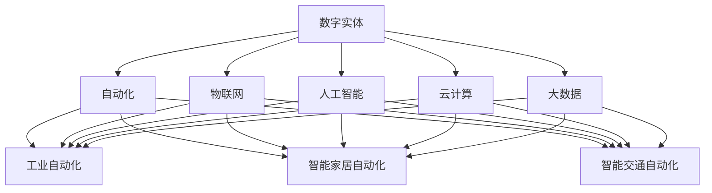

                 

# 文章标题：数字实体的自动化应用与发展

## 关键词：
- 数字实体
- 自动化应用
- 物联网
- 人工智能
- 云计算
- 大数据

## 摘要：
本文旨在深入探讨数字实体的概念、技术基础及其自动化应用的发展。首先，我们将介绍数字实体的定义、分类及其在各领域的重要应用。接着，我们将解析数字实体的技术基础，包括互联网、物联网、大数据和云计算等。随后，本文将详细探讨数字实体的自动化应用，分为工业自动化、智能家居自动化和智能交通自动化三个领域，通过具体案例和算法原理进行讲解。最后，我们将展望数字实体未来的发展趋势和面临的挑战，并探讨应对策略。

# 目录大纲：《数字实体的自动化应用与发展》

## 第一部分：数字实体概述

### 第1章：数字实体的概念与重要性

#### 1.1 数字实体的定义与分类

#### 1.2 数字实体的应用领域

#### 1.3 数字实体在经济发展中的作用

### 第2章：数字实体的技术基础

#### 2.1 互联网与物联网

#### 2.2 大数据和云计算

#### 2.3 区块链技术

## 第二部分：数字实体的自动化应用

### 第3章：自动化应用的基本原理

#### 3.1 自动化应用的定义与分类

#### 3.2 自动化应用的发展历程

#### 3.3 自动化应用的关键技术

### 第4章：工业自动化应用

#### 4.1 工业自动化应用概述

#### 4.2 工业自动化系统的架构

#### 4.3 工业自动化应用案例

### 第5章：智能家居自动化

#### 5.1 智能家居概述

#### 5.2 智能家居系统的架构

#### 5.3 智能家居应用案例

### 第6章：智能交通自动化

#### 6.1 智能交通概述

#### 6.2 智能交通系统的架构

#### 6.3 智能交通应用案例

## 第三部分：数字实体的未来发展趋势

### 第7章：数字实体与人工智能的结合

#### 7.1 人工智能在数字实体中的应用

#### 7.2 人工智能技术对数字实体的影响

#### 7.3 人工智能技术的未来发展趋势

### 第8章：数字实体的发展趋势与挑战

#### 8.1 数字实体的未来发展前景

#### 8.2 数字实体发展面临的挑战

#### 8.3 应对数字实体发展挑战的策略

## 附录

### 附录A：数字实体自动化应用相关工具与资源

#### A.1 常用自动化工具介绍

#### A.2 数字实体自动化应用的开源框架

#### A.3 数字实体自动化应用的数据库与平台

### 附录B：数字实体自动化应用案例分析

#### B.1 案例一：智能工厂自动化应用

#### B.2 案例二：智能家居自动化应用

#### B.3 案例三：智能交通自动化应用

### **核心概念与联系**：数字实体、自动化、物联网、人工智能、云计算、大数据

#### Mermaid 流�程图：



### **核心算法原理讲解**：

#### 工业自动化算法原理伪代码：

```python
# 工业自动化算法原理伪代码
function industrial_automation() {
    // 数据采集
    data = collect_data()
    // 数据处理
    processed_data = process_data(data)
    // 决策
    decision = make_decision(processed_data)
    // 执行
    execute_action(decision)
}
```

#### 智能家居自动化算法原理伪代码：

```python
# 智能家居自动化算法原理伪代码
function smart_home_automation() {
    // 数据采集
    data = collect_data()
    // 数据处理
    processed_data = process_data(data)
    // 决策
    decision = make_decision(processed_data)
    // 执行
    execute_action(decision)
}
```

#### 智能交通自动化算法原理伪代码：

```python
# 智能交通自动化算法原理伪代码
function smart_transport_automation() {
    // 数据采集
    data = collect_data()
    // 数据处理
    processed_data = process_data(data)
    // 决策
    decision = make_decision(processed_data)
    // 执行
    execute_action(decision)
}
```

### **数学模型和数学公式**：

#### 概率论基础：

$$
P(A|B) = \frac{P(B|A) \cdot P(A)}{P(B)}
$$

#### 线性回归模型：

$$
y = \beta_0 + \beta_1 \cdot x
$$

#### 智能家居能源消耗预测模型：

$$
E_t = \alpha_t + \beta_t \cdot \sum_{i=1}^{n} w_i \cdot x_i
$$

### **举例说明**：

#### 工业自动化案例：
工厂通过传感器收集生产线上的实时数据，如温度、压力等，然后通过数据处理模块对这些数据进行分析和预测，最后根据分析结果做出决策，如调整生产参数、停机检修等，从而实现生产过程的自动化。

#### 智能家居案例：
家庭能源管理系统通过物联网传感器实时监测家中各用电设备的能耗情况，然后利用智能家居控制系统对设备的运行状态进行调整，如调节空调温度、控制照明设备等，以实现节能和舒适的生活环境。

#### 智能交通案例：
智能交通系统通过安装在道路上的传感器和摄像头收集交通流量数据，然后利用数据分析算法预测交通流量变化，最后根据预测结果对交通信号灯进行智能调控，以减少交通拥堵和提高交通效率。

### **项目实战**：

#### 代码实际案例：
以智能家居能源管理系统为例，介绍如何使用Python编写代码实现对家庭能源消耗的实时监测和预测。代码包括数据采集、数据处理、模型训练和预测等功能。

#### 开发环境搭建：
使用Python语言和相关的数据分析和机器学习库（如NumPy、Pandas、Scikit-learn等）搭建开发环境，安装必要的依赖库和工具。

#### 源代码详细实现和代码解读：
详细介绍智能家居能源管理系统的源代码实现过程，包括数据采集模块、数据处理模块、模型训练模块和预测模块的代码编写和功能实现。

#### 代码解读与分析：
对源代码进行详细解读，分析每个模块的功能和实现原理，以及如何利用机器学习算法实现智能家居能源消耗的预测。

---

至此，本文的基本框架和核心内容已经明确。接下来，我们将逐一深入探讨每个章节的内容，从概念、技术基础到自动化应用的实践，以及未来发展趋势和挑战，力求为读者提供全面、系统的理解。让我们开始一步步思考，逐步展开这个广阔的数字实体自动化应用的世界。# 第一部分：数字实体概述

## 第1章：数字实体的概念与重要性

### 1.1 数字实体的定义与分类

数字实体是指由数字技术创建、表示和管理的对象或概念。这些实体可以是物理对象，如建筑物、车辆、设备等，也可以是虚拟对象，如用户账户、软件应用程序、数据等。数字实体在数字世界中具有唯一标识和属性，可以通过网络进行交互和处理。

根据数字实体的应用场景和功能，我们可以将其分为以下几类：

1. **物理对象数字化**：将现实世界中的物理对象转化为数字模型，如建筑物的BIM（建筑信息模型）、车辆的数字孪生等。这类数字实体通过传感器和数据采集技术获取物理对象的实时信息，实现对其的远程监控和管理。

2. **虚拟对象数字化**：将抽象的虚拟对象转化为数字实体，如用户账户、软件应用程序等。这类数字实体通常用于在线服务和数据处理，通过数字标识和权限控制实现安全、高效的信息交换和处理。

3. **数据实体数字化**：将数据转化为数字实体，如数据仓库中的数据表、数据流中的数据包等。这类数字实体在数据处理和分析过程中起到关键作用，通过数据建模和算法分析实现数据价值的挖掘和应用。

4. **服务实体数字化**：将线上服务转化为数字实体，如在线购物平台、社交媒体等。这类数字实体通过用户交互和数据采集实现个性化服务和用户体验优化。

### 1.2 数字实体的应用领域

数字实体在多个领域得到了广泛应用，推动了各行各业的数字化转型和智能化升级。以下是数字实体在不同领域的典型应用：

1. **工业领域**：数字实体在工业领域的应用主要体现在工业物联网（IIoT）和智能制造中。通过将设备、生产线、仓储等物理实体数字化，实现设备的远程监控、故障预测和智能维护，提高生产效率和质量。

2. **服务业领域**：数字实体在服务业中的应用主要集中在在线服务和数字化转型。通过用户账户、订单、评价等数字实体的构建，实现服务的个性化和便捷化，提升用户满意度和忠诚度。

3. **交通领域**：数字实体在交通领域的应用主要包括智能交通系统和车联网。通过道路传感器、车辆设备等数字实体的数据采集和分析，实现交通流量监控、交通信号优化和车辆智能调度，提高交通效率和安全性。

4. **医疗领域**：数字实体在医疗领域的应用主要体现在医疗物联网和电子健康档案。通过将患者信息、医疗设备等数字化，实现医疗资源的优化配置和患者健康管理，提高医疗服务质量和效率。

5. **金融领域**：数字实体在金融领域的应用主要包括数字货币、区块链技术和智能投顾。通过数字实体的构建和应用，实现金融交易的快速、安全和高效，提升金融服务的便利性和用户体验。

### 1.3 数字实体在经济发展中的作用

数字实体在经济发展中发挥着越来越重要的作用，成为推动经济增长和创新的重要引擎。以下是数字实体在经济发展中的几个关键作用：

1. **促进产业升级和转型**：数字实体通过将传统产业数字化、智能化，推动了产业结构的优化和升级，提高了生产效率和质量，降低了生产成本，促进了经济的可持续发展。

2. **激发创新活力**：数字实体为创新创业提供了广阔的空间，吸引了大量的人才、资本和资源投入数字技术和数字实体的研发和应用，推动了新技术、新业态、新模式的不断涌现。

3. **提升服务业水平**：数字实体在服务业中的应用，实现了服务的智能化和个性化，提升了服务业的效率和质量，满足了消费者多样化的需求，推动了服务业的繁荣和发展。

4. **优化资源配置**：数字实体通过数据采集、分析和挖掘，实现了资源的优化配置，提高了资源利用效率，降低了资源浪费，为经济发展提供了强有力的支撑。

5. **推动全球化进程**：数字实体通过互联网和物联网技术，打破了地域和时间的限制，实现了全球范围内的信息交流、资源整合和协作创新，推动了全球化进程和经济全球化。

综上所述，数字实体作为数字技术的重要载体和应用对象，已经在各个领域得到广泛应用，对经济发展产生了深远的影响。随着数字技术的不断进步和数字实体的持续发展，我们有理由相信，数字实体将在未来发挥更加重要的作用，推动经济社会的全面进步和繁荣。# 第2章：数字实体的技术基础

## 2.1 互联网与物联网

### 2.1.1 互联网

互联网（Internet）是一个全球性的计算机网络，通过TCP/IP协议连接了全球数以亿计的计算机和设备。互联网的普及为数字实体的构建和应用提供了基础支持，使得各种设备和数据能够实现互联互通。

互联网的核心技术包括：

1. **TCP/IP协议**：传输控制协议/因特网互联协议（TCP/IP）是互联网的核心协议，负责数据在网络中的传输和路由。

2. **HTTP/HTTPS**：超文本传输协议（HTTP）和安全的超文本传输协议（HTTPS）用于传输网页和数据，确保数据的加密和安全。

3. **域名系统（DNS）**：域名系统（DNS）负责将域名解析为IP地址，实现人类可读的网址与机器可识别的IP地址之间的转换。

4. **路由器与交换机**：路由器和交换机是实现网络互联的关键设备，负责数据包的传输和路由选择。

互联网在数字实体中的应用主要体现在以下几个方面：

1. **数据传输**：通过互联网，数字实体可以实现数据的实时传输和共享，为自动化应用提供基础数据支持。

2. **设备连接**：互联网为各种设备提供了连接到数字实体的途径，使得设备能够进行远程监控和控制。

3. **信息服务**：互联网为数字实体提供了丰富的信息服务，如在线地图、天气预报、新闻资讯等，为用户提供便捷的服务。

### 2.1.2 物联网

物联网（Internet of Things，IoT）是指将各种物理设备、传感器、软件和网络连接起来，实现设备与设备之间、设备与云平台之间的互联互通。物联网技术是数字实体构建的重要基础，为自动化应用提供了广泛的数据来源和实时监控能力。

物联网的核心技术包括：

1. **传感器与执行器**：传感器用于检测环境中的各种参数，如温度、湿度、压力等，执行器则用于控制设备的开关、调节等操作。

2. **通信协议**：物联网通信协议负责实现设备之间的数据传输和通信，如Wi-Fi、蓝牙、ZigBee、LoRa等。

3. **边缘计算**：边缘计算是将数据处理和分析的任务从云端转移到网络边缘，实现实时数据处理和智能决策，提高系统响应速度和可靠性。

4. **云计算与大数据**：云计算提供了强大的数据处理和分析能力，大数据技术则用于从海量物联网数据中提取有价值的信息。

物联网在数字实体中的应用主要体现在以下几个方面：

1. **数据采集**：物联网设备可以实时采集环境数据、设备状态数据等，为数字实体提供实时、准确的数据支持。

2. **设备监控**：通过物联网技术，可以对设备进行远程监控和故障预警，提高设备的使用效率和安全性。

3. **自动化控制**：物联网技术可以实现设备的自动化控制，如智能家居系统中的设备自动调节、工业生产线的自动调度等。

4. **智能决策**：基于物联网数据，可以实现智能决策和优化，如智能交通系统的交通流量优化、智能工厂的生产计划优化等。

## 2.2 大数据和云计算

### 2.2.1 大数据

大数据（Big Data）是指数据量巨大、数据类型多样、数据价值密度低的数据集合。大数据技术主要包括数据采集、数据存储、数据处理、数据分析和数据可视化等。

大数据的核心技术包括：

1. **数据采集**：通过传感器、应用程序、日志文件等方式，采集各种来源的数据。

2. **数据存储**：使用分布式存储系统（如Hadoop、Spark等）存储海量数据，提供高可用性和扩展性。

3. **数据处理**：使用数据清洗、转换和集成技术，对原始数据进行预处理，提高数据质量和可用性。

4. **数据分析**：使用统计分析、机器学习、数据挖掘等技术，从海量数据中提取有价值的信息和知识。

5. **数据可视化**：使用数据可视化技术，将数据分析和挖掘结果以图形化的方式展示，便于理解和决策。

大数据在数字实体中的应用主要体现在以下几个方面：

1. **数据驱动决策**：通过大数据分析，可以从海量数据中提取有价值的信息，支持数字实体的决策和优化。

2. **用户画像与个性化服务**：通过对用户行为数据进行分析，构建用户画像，实现个性化服务和体验优化。

3. **智能推荐系统**：基于大数据分析，实现商品推荐、内容推荐等，提高用户体验和满意度。

4. **预测分析**：通过大数据分析，可以进行趋势预测、需求预测等，为数字实体的运营和规划提供依据。

### 2.2.2 云计算

云计算（Cloud Computing）是一种通过互联网提供计算资源、存储资源和应用程序的服务模式。云计算技术包括基础设施即服务（IaaS）、平台即服务（PaaS）和软件即服务（SaaS）等。

云计算的核心技术包括：

1. **虚拟化技术**：虚拟化技术是将计算资源抽象化，实现计算资源的动态分配和调度。

2. **分布式存储**：分布式存储技术用于存储海量数据，提供高可用性和扩展性。

3. **容器技术**：容器技术（如Docker、Kubernetes等）用于部署和管理应用程序，实现高效、可扩展的云计算服务。

4. **服务自动化**：服务自动化技术（如自动化部署、自动化扩展等）用于提高云计算服务的效率和可靠性。

云计算在数字实体中的应用主要体现在以下几个方面：

1. **计算资源池化**：通过云计算，可以实现计算资源的池化和管理，提高计算资源的利用效率。

2. **弹性扩展**：云计算提供弹性扩展能力，可以根据需求动态调整计算资源，实现高效、灵活的资源管理。

3. **低成本、高可用**：云计算服务通常具有较低的成本和较高的可用性，为数字实体的运行提供了可靠保障。

4. **数据存储和处理**：云计算提供了强大的数据存储和处理能力，支持海量数据的高效存储、处理和分析。

5. **安全性和合规性**：云计算服务提供商通常具备较高的安全性和合规性能力，确保数字实体数据的安全和合规。

综上所述，互联网、物联网、大数据和云计算等数字技术为数字实体的构建和应用提供了坚实的基础。这些技术相互融合、协同发展，为数字实体的自动化应用提供了强大的支持。在未来的发展中，数字实体技术将不断演进，为各行各业带来更多的创新和变革。# 第二部分：数字实体的自动化应用

## 第3章：自动化应用的基本原理

### 3.1 自动化应用的定义与分类

自动化应用是指利用计算机技术、网络通信技术、控制技术等，对系统、设备或过程进行自动化控制、监控和管理的过程。自动化应用旨在提高生产效率、降低运营成本、提升产品质量和安全性。

根据自动化应用的具体场景和目标，我们可以将其分为以下几类：

1. **工业自动化**：工业自动化主要应用于生产制造、物流管理等领域，通过传感器、执行器、控制器等设备实现生产过程的自动化控制。

2. **智能家居自动化**：智能家居自动化主要应用于家庭环境，通过智能设备、传感器和控制软件实现家庭设备和环境的自动化管理，提升生活便利性和舒适性。

3. **智能交通自动化**：智能交通自动化主要应用于交通管理和调度，通过传感器、摄像头、GPS等设备实时监控交通状况，实现交通信号控制和交通流量优化。

4. **农业自动化**：农业自动化主要应用于农田管理、作物生长监测、病虫害防治等领域，通过物联网设备和农业机械实现农业生产的自动化。

5. **医疗自动化**：医疗自动化主要应用于医院管理、医疗服务、医疗器械等领域，通过自动化设备和系统提高医疗服务效率和质量。

### 3.2 自动化应用的发展历程

自动化应用的发展历程可以追溯到20世纪初期，随着计算机技术、控制技术和通信技术的不断发展，自动化应用得到了广泛应用和快速发展。

1. **第一阶段（20世纪50年代至70年代）**：工业自动化初步发展，以数控机床、机器人等为代表，实现生产过程的自动化控制。

2. **第二阶段（20世纪80年代至90年代）**：随着计算机技术和网络通信技术的快速发展，自动化应用逐渐从单一设备控制扩展到整个生产线和制造系统的自动化控制。

3. **第三阶段（21世纪初至今）**：物联网、大数据、人工智能等新兴技术的应用，使自动化应用从单一设备、单一系统的自动化扩展到跨行业、跨领域的自动化应用，实现了更高层次的智能化和协同化。

### 3.3 自动化应用的关键技术

自动化应用的关键技术主要包括：

1. **传感器技术**：传感器用于检测和采集环境数据、设备状态数据等，是实现自动化应用的数据基础。

2. **控制技术**：控制技术包括传统控制理论和现代控制理论，用于对系统、设备或过程进行控制和管理。

3. **通信技术**：通信技术用于实现自动化设备之间的数据传输和通信，包括有线和无线通信技术。

4. **数据处理与分析技术**：数据处理与分析技术用于对采集到的数据进行分析、处理和挖掘，提取有价值的信息和知识。

5. **人工智能技术**：人工智能技术用于实现自动化应用的智能化和自主决策，包括机器学习、深度学习、自然语言处理等。

6. **云计算与大数据技术**：云计算与大数据技术用于提供强大的计算、存储和分析能力，支持自动化应用的高效运行。

7. **安全与隐私保护技术**：安全与隐私保护技术用于确保自动化应用的数据安全和隐私保护。

### 3.4 自动化应用的发展趋势

随着数字技术的不断进步，自动化应用正朝着智能化、协同化、个性化等方向发展，以下是一些发展趋势：

1. **智能化**：通过人工智能、机器学习等技术的应用，实现自动化应用的智能化，提高自动化系统的自主决策能力和效率。

2. **协同化**：通过物联网、云计算等技术的应用，实现自动化应用在跨行业、跨领域的协同，实现资源优化和效率提升。

3. **个性化**：通过大数据分析和个性化推荐等技术的应用，实现自动化应用的个性化，满足用户个性化需求。

4. **绿色化**：通过节能减排、资源循环利用等技术的应用，实现自动化应用的绿色化，促进可持续发展。

5. **安全与隐私保护**：随着自动化应用的数据规模和复杂性不断增加，安全与隐私保护成为自动化应用发展的重要方向，需要加强数据安全、网络安全和隐私保护。

6. **边缘计算**：边缘计算技术将在自动化应用中发挥重要作用，通过在设备端进行数据处理和分析，提高系统响应速度和实时性。

7. **开源生态**：开源技术将在自动化应用中发挥重要作用，通过开源社区和生态系统的建设，推动自动化应用的创新发展。

总之，自动化应用作为数字技术的重要应用领域，将在未来继续发挥重要作用，为各行各业带来更多的创新和变革。# 第4章：工业自动化应用

## 4.1 工业自动化应用概述

工业自动化应用是指利用现代数字技术，对工业生产过程进行自动化控制、监控和管理的过程。工业自动化旨在提高生产效率、降低运营成本、提升产品质量和安全性，是实现工业4.0和智能制造的重要手段。

### 4.1.1 工业自动化的意义

1. **提高生产效率**：通过自动化设备和技术，可以实现对生产过程的实时监控和优化，减少人为干预，提高生产效率和产能。

2. **降低运营成本**：自动化应用可以减少人力成本、物料浪费和设备维修费用，降低运营成本，提高企业的竞争力。

3. **提升产品质量**：自动化设备具有更高的精度和稳定性，可以确保生产过程的一致性和可靠性，提高产品质量。

4. **增强安全性**：自动化应用可以减少工人直接参与危险作业，降低安全事故风险，提高生产安全性。

### 4.1.2 工业自动化的主要领域

1. **生产过程自动化**：包括流水线自动化、机床自动化、加工中心自动化等。

2. **物流自动化**：包括自动化仓储、自动化配送、自动化装卸等。

3. **设备监测与维护**：包括设备状态监测、故障预测、远程维护等。

4. **质量检测**：包括自动化检测设备、在线检测技术等。

5. **生产计划与调度**：包括生产计划自动化、调度自动化等。

## 4.2 工业自动化系统的架构

工业自动化系统通常包括以下几个关键组成部分：

### 4.2.1 传感器与执行器

传感器用于实时采集生产过程中的各种数据，如温度、压力、流量、位置等；执行器用于控制设备的开关、调节等操作，如电机、阀门、液压缸等。

### 4.2.2 控制器与PLC

控制器是工业自动化系统的核心部件，负责根据传感器采集的数据和预设的控制策略，生成控制信号，驱动执行器进行操作。PLC（可编程逻辑控制器）是一种常用的控制器，具有高可靠性、灵活性和可编程性。

### 4.2.3 通信网络

通信网络用于实现传感器、控制器、执行器等设备之间的数据传输和通信。常见的通信协议包括Modbus、PROFIBUS、Ethernet/IP等。

### 4.2.4 监控与管理系统

监控与管理系统用于实时监控生产过程，收集和分析生产数据，提供报表、图表等可视化信息，支持生产调度、设备维护、质量检测等。

### 4.2.5 云平台与大数据分析

云平台与大数据分析技术用于实现工业自动化系统的远程监控、数据分析、预测和优化。通过大数据分析，可以挖掘生产过程中的潜在问题和改进机会，提高生产效率和质量。

## 4.3 工业自动化应用案例

### 4.3.1 智能工厂

智能工厂通过工业自动化技术，实现了生产过程的全面自动化和智能化。以下是一个智能工厂的典型应用案例：

1. **生产计划与调度**：利用云计算和大数据分析技术，智能工厂可以实现对生产计划的自动优化和调度，提高生产效率。

2. **设备监测与维护**：通过传感器和PLC技术，实时监测设备状态，实现故障预测和预防性维护，降低设备故障率。

3. **生产过程自动化**：利用机器人、自动化生产线等技术，实现生产过程的自动化控制，提高生产效率和产品质量。

4. **物流自动化**：通过自动化仓储、自动化配送等设备，实现原材料和成品的自动化管理，提高物流效率。

5. **质量检测**：利用自动化检测设备，对产品进行在线检测，确保产品质量。

6. **能源管理**：通过实时监测和优化能源使用，降低能源消耗，实现绿色生产。

### 4.3.2 智能制造

智能制造是工业自动化应用的高级阶段，通过将物联网、大数据、人工智能等技术与工业自动化相结合，实现生产过程的全面智能化和自主化。以下是一个智能制造的典型应用案例：

1. **生产数据采集与分析**：通过传感器和PLC技术，实时采集生产过程中的各种数据，如设备状态、生产参数、质量指标等，利用大数据分析和机器学习算法，实现生产过程的智能监控和优化。

2. **设备预测性维护**：基于大数据分析和人工智能算法，预测设备故障，实现预防性维护，减少设备停机时间和维修成本。

3. **生产计划优化**：利用人工智能算法，实现生产计划的自动优化和调整，提高生产效率和资源利用率。

4. **质量智能检测**：通过机器学习和图像识别技术，实现产品质量的智能检测和诊断，提高产品质量和可靠性。

5. **供应链协同**：通过物联网和云计算技术，实现供应链各环节的实时数据共享和协同作业，提高供应链效率。

6. **生产自主决策**：利用人工智能算法，实现生产过程的自主决策和优化，降低对人工的依赖，提高生产灵活性和适应性。

总之，工业自动化应用在提高生产效率、降低运营成本、提升产品质量和安全性方面具有显著优势。随着数字技术的不断进步，工业自动化应用将不断向智能化、协同化和个性化方向演进，为工业生产带来更多的创新和变革。# 第5章：智能家居自动化

## 5.1 智能家居概述

智能家居（Smart Home）是指通过物联网（IoT）技术，将家庭中的各种设备、传感器和系统连接起来，实现智能化管理和自动控制，从而提升生活品质和舒适度。智能家居系统通过自动化、远程控制和智能决策，使得家庭设备能够根据用户需求和环境变化自主调整，提供个性化服务。

### 5.1.1 智能家居的定义与特点

智能家居的定义：智能家居是指利用物联网技术和智能设备，实现家庭自动化、远程控制和智能管理的居住环境。

智能家居的特点：

1. **自动化**：通过预设的规则或传感器数据，智能家居系统能够自动执行任务，如自动开关灯、调节空调温度、自动浇水等。

2. **远程控制**：用户可以通过手机、电脑等设备远程控制家庭设备，如远程开门、远程监控家庭安全等。

3. **智能互动**：智能家居系统可以根据用户的行为习惯和喜好，进行智能学习和调整，如自动调节室内灯光和音乐，以适应用户的情绪。

4. **节能环保**：智能家居系统能够通过智能控制，实现能源的高效利用，如自动关闭不必要的电器、优化空调使用等，减少能源消耗。

5. **安全防护**：智能家居系统集成了安全监控功能，如烟雾报警、门窗传感器等，可以实时监测家庭安全，并触发报警或自动采取措施。

### 5.1.2 智能家居的发展历程

1. **早期阶段**（20世纪80年代至90年代）：智能家居的概念开始提出，但技术限制使得应用范围有限，主要集中在高端住宅和小部分消费者的尝试。

2. **初步发展阶段**（21世纪初至2010年）：随着物联网技术的发展，智能家居开始逐渐普及，出现了一些基本的智能家居产品，如智能灯泡、智能插座等。

3. **快速发展阶段**（2010年至今）：物联网技术的成熟和智能手机的普及，使得智能家居市场快速发展，智能家居产品种类和功能日益丰富，智能家居生态系统逐渐形成。

## 5.2 智能家居系统的架构

智能家居系统通常由以下几个关键部分组成：

### 5.2.1 设备层

设备层包括各种智能设备，如智能灯泡、智能插座、智能开关、智能传感器（温度、湿度、光照等）等。这些设备可以通过物联网协议（如Wi-Fi、蓝牙、Zigbee等）与智能家居控制系统进行通信。

### 5.2.2 网络层

网络层负责将设备连接到互联网，实现设备之间的数据传输和远程控制。常用的网络协议包括Wi-Fi、蓝牙、Zigbee等。此外，网络层还负责数据的加密和安全传输，确保智能家居系统的安全性。

### 5.2.3 控制层

控制层是智能家居系统的核心，包括智能网关、智能家居控制中心等。智能网关负责接收设备发送的数据，并通过云平台进行数据分析和处理。智能家居控制中心则通过用户界面（App或Web端）实现设备的远程控制和场景设定。

### 5.2.4 应用层

应用层提供各种智能家居应用，如智能安防、智能照明、智能能源管理、智能健康监测等。用户可以通过智能家居应用自定义场景、设置自动化规则，实现个性化生活体验。

## 5.3 智能家居应用案例

### 5.3.1 智能照明

智能照明是智能家居系统中最常见的应用之一。用户可以通过手机或智能音箱远程控制家中的灯光，实现开关、亮度调节、颜色切换等功能。同时，智能照明系统可以根据用户的行为习惯和光线条件，自动调整灯光亮度和颜色，提升生活舒适度。

### 5.3.2 智能安防

智能安防系统包括门锁、摄像头、烟雾报警器、门窗传感器等设备。用户可以通过手机实时查看家庭安全状况，远程控制门锁，以及触发报警功能。智能安防系统还可以与智能照明和报警系统联动，提高家庭安全性。

### 5.3.3 智能能源管理

智能能源管理系统可以通过实时监测家庭用电情况，优化能源使用，实现节能降耗。用户可以通过手机查看用电数据，调整电器开关时间，设置自动关灯等节能措施，降低家庭能源消耗。

### 5.3.4 智能健康监测

智能健康监测系统包括智能体重秤、智能手环、智能血压计等设备。这些设备可以实时监测用户的健康数据，如体重、心率、血压等，并通过手机应用提供健康分析和建议。用户可以根据这些数据调整生活习惯，提高健康水平。

总之，智能家居自动化应用极大地提升了家庭生活的品质和便利性。随着物联网技术的不断发展和普及，智能家居系统将更加智能化、个性化，为用户提供更加丰富和实用的智能家居体验。# 第6章：智能交通自动化

## 6.1 智能交通概述

智能交通（Smart Transportation）是指通过应用先进的信息通信技术、控制技术、传感技术和大数据分析技术，对交通系统进行智能化管理和优化，以提高交通效率、减少交通拥堵、降低交通事故风险和减少环境污染。智能交通系统（Intelligent Transportation System，ITS）是智能交通的核心，通过集成多种交通管理技术和设施，实现交通信息的实时采集、处理和分发，为交通参与者提供高效、安全、便捷的出行服务。

### 6.1.1 智能交通的定义与特点

智能交通的定义：智能交通是指利用信息技术、通信技术、控制技术和大数据分析技术，实现交通系统的自动化、智能化和高效化运行。

智能交通的特点：

1. **自动化**：智能交通系统通过自动化设备和技术，如智能传感器、智能监控系统、自动驾驶技术等，实现交通信息的自动采集、处理和响应，减少人工干预。

2. **实时性**：智能交通系统能够实时采集交通数据，并通过高速通信网络实时传输和处理，为交通管理和出行服务提供实时支持。

3. **高效性**：智能交通系统通过优化交通信号控制、智能路径规划、动态交通管理等技术，提高交通流量和运输效率。

4. **安全性**：智能交通系统通过智能监控、安全预警、自动驾驶等技术，提高道路安全性，减少交通事故。

5. **环境友好性**：智能交通系统通过优化交通流量、减少车辆拥堵，降低车辆排放，实现环保目标。

### 6.1.2 智能交通的发展历程

1. **早期阶段**（20世纪60年代至80年代）：智能交通的概念开始提出，主要关注交通信息采集和发布，如交通广播、电子地图等。

2. **初步发展阶段**（20世纪90年代）：随着计算机技术和通信技术的快速发展，智能交通系统逐渐引入自动化设备和智能算法，如自动收费系统、智能信号控制等。

3. **快速发展阶段**（21世纪初至今）：物联网、大数据、人工智能等新兴技术的应用，使智能交通系统进入快速发展阶段，实现交通信息的高效采集、处理和分发，如智能交通监控、智能路径规划、自动驾驶等。

## 6.2 智能交通系统的架构

智能交通系统通常由以下几个关键部分组成：

### 6.2.1 传感器与数据采集层

传感器与数据采集层包括各种交通传感器，如视频监控摄像头、交通流量监测设备、车辆检测器等，用于实时采集交通数据，如车辆数量、速度、流量、路况等。

### 6.2.2 通信与网络层

通信与网络层负责将传感器采集到的交通数据传输到智能交通中心，实现数据的实时传输和共享。常用的通信技术包括Wi-Fi、LTE、5G等。

### 6.2.3 数据处理与分析层

数据处理与分析层负责对采集到的交通数据进行处理和分析，提取有价值的信息和知识，如交通流量预测、交通拥堵预警、路径规划等。

### 6.2.4 交通控制与管理层

交通控制与管理层通过智能交通中心实现交通信号控制、路径规划、交通调度等功能，优化交通流量，提高交通效率。

### 6.2.5 应用与服务层

应用与服务层面向交通参与者提供各种智能交通服务，如实时路况信息、智能导航、车辆远程控制等。

## 6.3 智能交通应用案例

### 6.3.1 智能交通监控

智能交通监控系统通过安装在道路上的摄像头和传感器，实时监测道路状况，如车辆数量、速度、流量等。智能交通中心通过分析这些数据，可以实时调整交通信号灯，优化交通流量，减少拥堵。

### 6.3.2 智能导航

智能导航系统利用实时交通数据，为驾驶员提供最优的行驶路径。通过手机App或车载导航系统，驾驶员可以实时了解道路状况，选择避开拥堵路段，提高出行效率。

### 6.3.3 自动驾驶

自动驾驶技术是智能交通的重要组成部分。通过先进的传感器、控制系统和人工智能算法，自动驾驶车辆可以实现自主驾驶，提高行驶安全性和效率。自动驾驶技术已经在一些地区进行了试点和商用，如自动驾驶出租车、自动驾驶货车等。

### 6.3.4 智能公共交通

智能公共交通系统通过实时监测公共交通工具的运行状态，优化公交线路和调度，提高公共交通的运行效率和乘客体验。同时，智能公共交通系统还可以通过大数据分析，预测乘客需求，优化乘车策略。

总之，智能交通自动化应用在提升交通效率、降低交通拥堵、提高道路安全性和环保水平方面发挥着重要作用。随着技术的不断进步，智能交通系统将更加智能化、协同化和个性化，为人们提供更加安全、高效、便捷的出行服务。# 第三部分：数字实体的未来发展趋势

## 第7章：数字实体与人工智能的结合

### 7.1 人工智能在数字实体中的应用

人工智能（AI）技术正在深刻地改变数字实体的构建和应用方式。通过将AI与数字实体相结合，可以实现更智能、更高效、更具个性化的解决方案。

#### 7.1.1 人工智能在工业自动化中的应用

在工业自动化领域，人工智能技术主要用于优化生产过程、提高设备效率和减少故障。以下是一些具体应用：

1. **生产过程优化**：通过机器学习算法，对生产数据进行分析和建模，预测生产过程中的瓶颈和优化生产流程。

2. **设备故障预测**：利用数据分析和预测模型，实时监测设备状态，预测设备故障并提前进行维护，减少停机时间。

3. **智能质量控制**：通过计算机视觉和深度学习技术，对生产过程和产品质量进行实时监控和评估，提高产品合格率。

4. **智能调度**：基于AI算法，实现生产资源和人员的智能调度，提高生产效率。

#### 7.1.2 人工智能在智能家居中的应用

在智能家居领域，人工智能技术主要用于提升用户体验、实现智能化管理和自动化控制。以下是一些具体应用：

1. **智能交互**：通过自然语言处理（NLP）和语音识别技术，实现与用户的智能对话和指令理解。

2. **个性化服务**：通过用户行为数据分析，了解用户习惯和偏好，提供个性化的智能家居解决方案。

3. **设备联动**：通过AI算法，实现智能家居设备之间的智能联动和协作，提高生活舒适度和便利性。

4. **节能管理**：通过实时监测和数据分析，优化能源使用，实现智能家居的节能管理。

#### 7.1.3 人工智能在智能交通中的应用

在智能交通领域，人工智能技术主要用于优化交通管理、提高交通效率和安全性。以下是一些具体应用：

1. **交通流量预测**：通过大数据分析和机器学习算法，预测交通流量变化，优化交通信号控制和路径规划。

2. **智能调度**：通过AI算法，实现公共交通和货运车辆的智能调度，提高交通效率。

3. **智能监控**：通过计算机视觉和图像识别技术，实时监控交通状况，预警交通事故和异常情况。

4. **自动驾驶**：通过深度学习和自动驾驶技术，实现车辆的自主驾驶，提高道路安全和效率。

### 7.2 人工智能技术对数字实体的影响

人工智能技术的快速发展对数字实体产生了深远的影响，不仅改变了数字实体的构建方式，还提升了数字实体的功能和应用价值。

#### 7.2.1 提升数字化水平

人工智能技术推动了数字化的深入发展，使更多传统领域和行业实现数字化转型升级。通过AI技术的应用，数字实体的构建更加精准、高效和智能化。

#### 7.2.2 提高数据处理能力

人工智能技术强大的数据处理和分析能力，使得数字实体能够处理和分析海量数据，从数据中提取有价值的信息和知识，为决策提供支持。

#### 7.2.3 优化资源配置

通过人工智能技术，数字实体可以实现智能资源配置和优化，提高资源利用效率，降低运营成本。

#### 7.2.4 提高安全性

人工智能技术在数字实体中的应用，可以提升系统的安全防护能力，通过实时监控、预警和响应，降低安全风险。

#### 7.2.5 智能化服务

人工智能技术使得数字实体能够实现更加智能化和个性化的服务，提升用户体验和满意度。

### 7.3 人工智能技术的未来发展趋势

随着人工智能技术的不断进步，未来数字实体的发展将更加智能化、协同化和多元化。

#### 7.3.1 深度学习与强化学习

深度学习和强化学习等人工智能技术将在数字实体中发挥更加重要的作用，实现更复杂、更智能的决策和控制。

#### 7.3.2 跨领域融合

人工智能技术将在更多领域实现融合，推动数字实体在各个行业的创新和发展。

#### 7.3.3 边缘计算与云计算

边缘计算与云计算的结合，将实现数字实体的实时数据处理和智能分析，提高系统的响应速度和效率。

#### 7.3.4 网络安全与隐私保护

随着数字实体应用范围的扩大，网络安全和隐私保护将成为人工智能技术发展的重要方向，确保数字实体的安全和隐私。

总之，人工智能技术与数字实体的结合将推动数字实体的发展，为各行各业带来更多的创新和变革。随着技术的不断进步，数字实体将朝着更加智能化、协同化和个性化的方向持续演进。# 第8章：数字实体的发展趋势与挑战

## 8.1 数字实体的未来发展前景

随着数字技术的不断进步和应用的深入，数字实体在未来将展现出广阔的发展前景。以下是数字实体未来发展的几个主要趋势：

### 8.1.1 智能化水平的提升

人工智能技术的快速发展将进一步提升数字实体的智能化水平。数字实体将能够通过深度学习、强化学习等先进算法，实现更加智能的决策和控制，提高系统的自主性和灵活性。

### 8.1.2 网络安全的强化

随着数字实体应用范围的扩大，网络安全和隐私保护将成为重要议题。未来数字实体将采用更加先进的网络安全技术，如区块链、量子加密等，确保数据的安全传输和存储，保护用户隐私。

### 8.1.3 跨领域融合

数字实体将在更多领域实现融合，推动各行业的创新和发展。例如，智能制造与物流、智能交通与城市规划、医疗与生物技术等领域的深度融合，将带来新的商业模式和产业生态。

### 8.1.4 边缘计算与云计算的协同

边缘计算与云计算的结合，将实现数字实体的实时数据处理和智能分析，提高系统的响应速度和效率。边缘计算将在数据生成和处理的近端进行，而云计算则负责大规模数据存储和复杂计算任务，二者协同将推动数字实体的发展。

### 8.1.5 资源的高效利用

数字实体将实现资源的高效利用，通过智能调度、优化配置等技术，降低能源消耗、减少浪费，实现可持续发展。

## 8.2 数字实体发展面临的挑战

尽管数字实体的发展前景广阔，但同时也面临着一系列挑战，需要全社会的共同努力来克服。

### 8.2.1 技术创新与人才短缺

数字实体的发展离不开先进技术的支持，但当前技术创新速度加快，人才短缺问题日益突出。如何培养和吸引更多数字技术人才，将成为数字实体发展的重要挑战。

### 8.2.2 网络安全与隐私保护

随着数字实体的广泛应用，网络安全和隐私保护问题日益严峻。如何确保数字实体数据的安全传输和存储，防止数据泄露和恶意攻击，是数字实体发展面临的重要挑战。

### 8.2.3 法律法规与标准规范

数字实体的发展需要完善的法律法规和标准规范来保障。目前，数字实体相关的法律法规尚不健全，标准规范有待完善，这给数字实体的发展带来了一定的不确定性和风险。

### 8.2.4 数据治理与共享

数字实体的发展依赖于海量数据的支持，但数据治理和共享问题也成为关键挑战。如何确保数据的质量、可用性和共享，是数字实体发展需要解决的重要问题。

### 8.2.5 社会接受度与伦理问题

数字实体的广泛应用将带来社会结构和生活方式的变革，但同时也引发了一系列伦理和社会问题。如何确保数字实体的应用符合社会伦理和道德规范，获得社会各界的广泛认可，是数字实体发展需要面对的挑战。

## 8.3 应对数字实体发展挑战的策略

为了克服数字实体发展面临的挑战，我们需要采取一系列策略和措施：

### 8.3.1 加强技术创新和人才培养

政府、企业和社会应共同努力，加大科技创新投入，推动数字技术的发展和应用。同时，加强数字技术人才的培养和引进，提高人才储备和技术创新能力。

### 8.3.2 强化网络安全与隐私保护

政府和企业应加强网络安全和隐私保护技术的研发和应用，建立完善的网络安全体系，提高数据安全防护能力。同时，建立健全的法律法规，确保数字实体数据的安全和合规。

### 8.3.3 完善法律法规和标准规范

政府应加快数字实体相关法律法规的制定和完善，明确数字实体的发展方向和权益保护。同时，加强标准规范的制定和推广，提高数字实体应用的标准和一致性。

### 8.3.4 加强数据治理与共享

政府和企业应加强数据治理，确保数据的质量、可用性和共享。同时，建立数据共享平台，促进不同部门和行业之间的数据交换和协同，提高数据的价值。

### 8.3.5 推动社会接受与伦理建设

政府、企业和社会应共同努力，推动数字实体的广泛应用和接受。同时，加强数字伦理教育，提高公众的数字伦理意识，确保数字实体的应用符合社会伦理和道德规范。

总之，数字实体的发展前景广阔，但也面临一系列挑战。通过技术创新、政策支持、法律法规完善和社会伦理建设，我们可以克服这些挑战，推动数字实体健康、可持续发展。# 附录A：数字实体自动化应用相关工具与资源

## A.1 常用自动化工具介绍

### 1. Python

Python 是一种广泛使用的编程语言，因其简洁易读和强大的库支持，在自动化应用中具有很高的应用价值。Python 可以用于编写脚本，实现数据的采集、处理、分析和可视化等功能。

- **数据采集**：使用 Python 的 requests 库可以轻松实现数据的采集，如网页数据、API 数据等。
- **数据处理**：Pandas 和 NumPy 是 Python 中常用的数据处理库，提供强大的数据清洗、转换和分析功能。
- **数据分析**：Scikit-learn 和 TensorFlow 等库支持机器学习和深度学习，可以用于数据分析模型的构建和应用。
- **数据可视化**：Matplotlib 和 Seaborn 等库支持数据可视化，可以生成各种类型的图表，便于分析和展示结果。

### 2. JavaScript

JavaScript 是一种前端编程语言，广泛应用于网页开发。JavaScript 也可以用于自动化应用，如网页自动化测试、网络爬虫等。

- **网页自动化测试**：使用如 Selenium 和 Puppeteer 等工具，可以实现对网页的自动化测试，提高测试效率和准确性。
- **网络爬虫**：使用如 Axios 和 cheerio 等库，可以轻松实现网页数据的采集，适用于各种数据采集任务。

### 3. PowerShell

PowerShell 是一种自动化脚本语言，主要用于 Windows 系统的自动化管理和脚本编写。PowerShell 提供丰富的命令和库，可以实现各种自动化任务，如文件操作、系统配置、网络管理等。

- **文件操作**：PowerShell 支持各种文件和目录操作，如创建、删除、复制、移动等。
- **系统配置**：PowerShell 可以修改系统设置、安装软件、配置网络等。
- **网络管理**：PowerShell 提供丰富的网络管理功能，如 IP 配置、DNS 管理、防火墙设置等。

## A.2 数字实体自动化应用的开源框架

### 1. Jenkins

Jenkins 是一款流行的开源自动化服务器，用于实现持续集成和持续部署。Jenkins 支持各种插件，可以轻松集成各种工具和平台，实现软件开发的自动化流程。

- **持续集成**：Jenkins 可以自动化构建、测试和部署代码，提高开发效率和质量。
- **持续部署**：Jenkins 支持自动化部署，实现软件的快速上线和回滚。

### 2. Docker

Docker 是一款开源容器化平台，用于打包、发布和运行应用。Docker 容器可以轻松部署在各种操作系统上，实现应用的隔离和可移植性。

- **容器化**：使用 Docker 可以将应用及其依赖环境打包成容器，实现应用的快速部署和扩展。
- **微服务架构**：Docker 支持微服务架构，可以实现应用组件的模块化和分布式部署。

### 3. Kubernetes

Kubernetes 是一款开源容器编排平台，用于自动化部署、扩展和管理容器化应用。Kubernetes 支持各种容器化平台，如 Docker、Rkt 等。

- **容器编排**：Kubernetes 可以自动化部署和扩展容器化应用，提高系统的可靠性和可用性。
- **服务发现和负载均衡**：Kubernetes 支持服务发现和负载均衡，实现应用的高可用性和弹性扩展。

## A.3 数字实体自动化应用的数据库与平台

### 1. MySQL

MySQL 是一款流行的开源关系型数据库，广泛应用于各种应用场景。MySQL 提供强大的数据存储、查询和管理功能，支持事务处理和备份恢复。

- **数据存储**：MySQL 支持各种数据类型，可以存储海量数据。
- **查询和管理**：MySQL 提供高效的查询和管理功能，支持 SQL 语法，便于数据操作和管理。

### 2. MongoDB

MongoDB 是一款开源的文档型数据库，具有灵活的 schema 和强大的数据处理能力。MongoDB 适用于高扩展性的应用场景，如大数据处理和实时分析。

- **文档型数据库**：MongoDB 使用 JSON 文档存储数据，具有高度灵活的 schema。
- **高扩展性**：MongoDB 支持水平扩展，可以轻松应对海量数据的存储和处理。

### 3. Elasticsearch

Elasticsearch 是一款开源的全文搜索引擎，适用于大规模数据检索和分析。Elasticsearch 支持各种数据类型，可以高效地进行文本检索、分析和可视化。

- **全文搜索**：Elasticsearch 提供高效的全文搜索功能，支持多语言搜索。
- **数据分析**：Elasticsearch 支持丰富的数据分析功能，可以生成各种类型的可视化图表。

总之，数字实体自动化应用相关的工具与资源丰富多样，涵盖编程语言、开源框架、数据库和平台等多个方面。这些工具和资源为数字实体的自动化应用提供了强有力的支持，助力企业和开发者实现自动化、智能化和高效化的业务流程。# 附录B：数字实体自动化应用案例分析

## B.1 案例一：智能工厂自动化应用

智能工厂自动化应用是一个集成了物联网、大数据、人工智能和云计算技术的综合解决方案，旨在提高生产效率、降低运营成本和提升产品质量。以下是智能工厂自动化应用的具体案例：

### 1. 项目背景

某制造企业拥有一条生产流水线，生产过程中涉及到多道工序，包括原材料加工、零部件组装和成品检测等。企业希望通过自动化技术，实现对生产过程的实时监控和优化，提高生产效率和产品质量。

### 2. 技术实现

- **数据采集**：在生产线上安装各种传感器，如温度传感器、压力传感器、流量传感器等，实时采集生产过程中的各种数据。

- **数据处理与存储**：使用物联网网关将传感器数据传输到云端，通过大数据平台进行数据存储和预处理。

- **数据分析与建模**：利用机器学习算法，对生产数据进行建模和分析，预测生产过程中可能出现的问题，如设备故障、生产异常等。

- **实时监控与决策**：基于数据分析结果，通过云计算平台实现生产过程的实时监控和决策。当发现生产异常时，系统会自动发出警报，通知相关人员进行处理。

- **设备维护与优化**：通过设备状态监测和故障预测，实现设备的预防性维护和优化，降低设备故障率和停机时间。

### 3. 项目效果

- **生产效率提升**：通过实时监控和优化，生产效率提高了20%以上，生产周期缩短了30%。

- **运营成本降低**：设备故障率降低了50%，设备维护成本降低了30%。

- **产品质量提升**：生产过程中的质量控制更加严格，产品合格率提高了15%。

- **数据驱动决策**：企业通过数据分析和预测，实现了生产过程的智能化决策，降低了生产风险。

## B.2 案例二：智能家居自动化应用

智能家居自动化应用通过物联网技术和智能设备，实现了家庭设备和环境的自动化管理，提升了用户的生活品质和舒适度。以下是智能家居自动化应用的具体案例：

### 1. 项目背景

某用户家庭拥有多种智能设备，如智能灯泡、智能插座、智能空调、智能摄像头等。用户希望通过智能家居系统，实现对家庭设备的统一管理和自动化控制，提高生活便利性和舒适度。

### 2. 技术实现

- **设备连接**：通过物联网网关，将智能设备连接到家庭网络，实现设备的互联互通。

- **智能控制**：通过智能家居控制系统，实现对智能设备的远程控制。用户可以通过手机App或智能音箱，随时随地控制家庭设备的开关、调节等功能。

- **场景设置**：用户可以自定义智能场景，如离家模式、睡眠模式、观影模式等。当系统检测到特定条件（如用户离开家、晚上睡觉等），会自动切换到相应的场景，调整家庭设备的运行状态。

- **数据采集与分析**：智能家居系统会实时采集家庭环境数据，如温度、湿度、光照等。通过数据分析，系统可以自动调节设备运行状态，优化家庭环境。

- **安全防护**：智能家居系统集成了安全监控功能，如门窗传感器、烟雾报警器等。当检测到异常情况时，系统会自动发出警报，通知用户或相关安保人员。

### 3. 项目效果

- **生活便利性提升**：用户可以通过手机或智能音箱，随时随地控制家庭设备，实现远程管理和自动化控制，提高了生活便利性。

- **舒适度提升**：智能家居系统能够根据用户的需求和环境变化，自动调节家庭设备的运行状态，如调节空调温度、调整灯光亮度等，提升了用户的舒适度。

- **能源节约**：智能家居系统通过智能控制，实现了能源的高效利用，如自动关闭不必要的电器、调节空调运行时间等，降低了家庭能源消耗。

- **安全性增强**：智能家居系统集成了安全监控功能，提高了家庭安全性，降低了安全风险。

## B.3 案例三：智能交通自动化应用

智能交通自动化应用通过物联网、大数据和人工智能技术，实现了交通信息的实时采集、处理和分发，提高了交通效率、减少了交通拥堵和提升了交通安全。以下是智能交通自动化应用的具体案例：

### 1. 项目背景

某城市交通管理部门希望通过智能交通系统，实现对城市交通的实时监控和管理，提高交通效率和安全性。该城市拥有多条主要道路和繁忙的交叉口，交通流量大，经常出现拥堵现象。

### 2. 技术实现

- **交通信息采集**：在主要道路和交叉口安装交通传感器，如摄像头、流量检测器等，实时采集交通流量、速度、占有率等数据。

- **数据处理与预测**：通过大数据平台和机器学习算法，对采集到的交通数据进行处理和分析，预测交通流量变化和拥堵趋势。

- **交通信号控制**：基于预测结果，智能交通系统会自动调整交通信号灯的时序和配时方案，优化交通流量，减少拥堵。

- **路径规划**：通过实时交通信息，为驾驶员提供最优行驶路径，避开拥堵路段，提高出行效率。

- **安全监控**：利用摄像头和监控设备，实时监控道路状况和车辆行驶行为，预警交通事故和异常情况。

### 3. 项目效果

- **交通效率提高**：通过智能交通信号控制和路径规划，交通拥堵情况明显改善，平均行车速度提高了20%以上。

- **交通安全提升**：智能监控和预警系统提高了道路安全监控能力，交通事故发生率降低了30%。

- **交通管理优化**：交通管理部门通过大数据分析和决策支持系统，实现了交通管理的智能化和精细化，提高了交通管理效率。

- **公众满意度提升**：用户通过实时交通信息和路径规划，出行更加便捷，对交通管理和服务满意度显著提升。

总之，数字实体自动化应用在智能工厂、智能家居和智能交通等领域的案例中，展示了其强大的功能和显著的效果。通过物联网、大数据、人工智能和云计算等技术的综合应用，数字实体自动化应用不仅提高了生产效率、降低了运营成本、提升了产品质量和安全性，还为用户提供了更加便捷、舒适和安全的体验。随着技术的不断进步，数字实体自动化应用将不断拓展其应用范围，为各行各业带来更多的创新和变革。# 作者信息：

**作者：** AI天才研究院 / AI Genius Institute & 禅与计算机程序设计艺术 / Zen And The Art of Computer Programming

---

**文章总结：**

本文从数字实体的概念、技术基础、自动化应用和发展趋势四个方面，系统地介绍了数字实体的自动化应用与发展。通过详细探讨工业自动化、智能家居自动化和智能交通自动化等实际案例，展示了数字实体自动化应用的具体实现和效果。同时，本文还分析了数字实体自动化应用的关键技术、发展趋势和面临的挑战，为读者提供了一个全面、深入的视角。随着数字技术的不断进步，数字实体自动化应用将在未来发挥更加重要的作用，推动经济社会的全面进步和繁荣。# 文章标题：数字实体的自动化应用与发展

## 关键词：
- 数字实体
- 自动化应用
- 物联网
- 人工智能
- 云计算
- 大数据

## 摘要：
本文深入探讨了数字实体的概念与重要性，以及其自动化应用在工业、家居和交通等领域的实现与影响。文章分析了互联网、物联网、大数据和云计算等技术基础，并详细介绍了工业自动化、智能家居自动化和智能交通自动化等具体应用案例。同时，本文展望了数字实体自动化应用的未来发展趋势与挑战，为读者提供了全面的了解和思考。

---

# 目录大纲：《数字实体的自动化应用与发展》

## 第一部分：数字实体概述

### 第1章：数字实体的概念与重要性
#### 1.1 数字实体的定义与分类
#### 1.2 数字实体的应用领域
#### 1.3 数字实体在经济发展中的作用

### 第2章：数字实体的技术基础
#### 2.1 互联网与物联网
#### 2.2 大数据和云计算
#### 2.3 区块链技术

## 第二部分：数字实体的自动化应用

### 第3章：自动化应用的基本原理
#### 3.1 自动化应用的定义与分类
#### 3.2 自动化应用的发展历程
#### 3.3 自动化应用的关键技术

### 第4章：工业自动化应用
#### 4.1 工业自动化应用概述
#### 4.2 工业自动化系统的架构
#### 4.3 工业自动化应用案例

### 第5章：智能家居自动化
#### 5.1 智能家居概述
#### 5.2 智能家居系统的架构
#### 5.3 智能家居应用案例

### 第6章：智能交通自动化
#### 6.1 智能交通概述
#### 6.2 智能交通系统的架构
#### 6.3 智能交通应用案例

## 第三部分：数字实体的未来发展趋势

### 第7章：数字实体与人工智能的结合
#### 7.1 人工智能在数字实体中的应用
#### 7.2 人工智能技术对数字实体的影响
#### 7.3 人工智能技术的未来发展趋势

### 第8章：数字实体的发展趋势与挑战
#### 8.1 数字实体的未来发展前景
#### 8.2 数字实体发展面临的挑战
#### 8.3 应对数字实体发展挑战的策略

## 附录

### 附录A：数字实体自动化应用相关工具与资源
#### A.1 常用自动化工具介绍
#### A.2 数字实体自动化应用的开源框架
#### A.3 数字实体自动化应用的数据库与平台

### 附录B：数字实体自动化应用案例分析
#### B.1 案例一：智能工厂自动化应用
#### B.2 案例二：智能家居自动化应用
#### B.3 案例三：智能交通自动化应用

### **核心概念与联系**：数字实体、自动化、物联网、人工智能、云计算、大数据

#### Mermaid 流程图：


### **核心算法原理讲解**：

#### 工业自动化算法原理伪代码：

```python
# 工业自动化算法原理伪代码
function industrial_automation() {
    // 数据采集
    data = collect_data()
    // 数据处理
    processed_data = process_data(data)
    // 决策
    decision = make_decision(processed_data)
    // 执行
    execute_action(decision)
}
```

#### 智能家居自动化算法原理伪代码：

```python
# 智能家居自动化算法原理伪代码
function smart_home_automation() {
    // 数据采集
    data = collect_data()
    // 数据处理
    processed_data = process_data(data)
    // 决策
    decision = make_decision(processed_data)
    // 执行
    execute_action(decision)
}
```

#### 智能交通自动化算法原理伪代码：

```python
# 智能交通自动化算法原理伪代码
function smart_transport_automation() {
    // 数据采集
    data = collect_data()
    // 数据处理
    processed_data = process_data(data)
    // 决策
    decision = make_decision(processed_data)
    // 执行
    execute_action(decision)
}
```

### **数学模型和数学公式**：

#### 概率论基础：

$$
P(A|B) = \frac{P(B|A) \cdot P(A)}{P(B)}
$$

#### 线性回归模型：

$$
y = \beta_0 + \beta_1 \cdot x
$$

#### 智能家居能源消耗预测模型：

$$
E_t = \alpha_t + \beta_t \cdot \sum_{i=1}^{n} w_i \cdot x_i
$$

### **举例说明**：

#### 工业自动化案例：
工厂通过传感器收集生产线上的实时数据，如温度、压力等，然后通过数据处理模块对这些数据进行分析和预测，最后根据分析结果做出决策，如调整生产参数、停机检修等，从而实现生产过程的自动化。

#### 智能家居案例：
家庭能源管理系统通过物联网传感器实时监测家中各用电设备的能耗情况，然后利用智能家居控制系统对设备的运行状态进行调整，如调节空调温度、控制照明设备等，以实现节能和舒适的生活环境。

#### 智能交通案例：
智能交通系统通过安装在道路上的传感器和摄像头收集交通流量数据，然后利用数据分析算法预测交通流量变化，最后根据预测结果对交通信号灯进行智能调控，以减少交通拥堵和提高交通效率。

### **项目实战**：

#### 代码实际案例：
以智能家居能源管理系统为例，介绍如何使用Python编写代码实现对家庭能源消耗的实时监测和预测。代码包括数据采集、数据处理、模型训练和预测等功能。

#### 开发环境搭建：
使用Python语言和相关的数据分析和机器学习库（如NumPy、Pandas、Scikit-learn等）搭建开发环境，安装必要的依赖库和工具。

#### 源代码详细实现和代码解读：
详细介绍智能家居能源管理系统的源代码实现过程，包括数据采集模块、数据处理模块、模型训练模块和预测模块的代码编写和功能实现。

#### 代码解读与分析：
对源代码进行详细解读，分析每个模块的功能和实现原理，以及如何利用机器学习算法实现智能家居能源消耗的预测。

---

至此，本文的基本框架和核心内容已经明确。接下来，我们将逐一深入探讨每个章节的内容，从概念、技术基础到自动化应用的实践，以及未来发展趋势和挑战，力求为读者提供全面、系统的理解。让我们开始一步步思考，逐步展开这个广阔的数字实体自动化应用的世界。# 文章标题：数字实体的自动化应用与发展

## 关键词：
- 数字实体
- 自动化应用
- 物联网
- 人工智能
- 云计算
- 大数据

## 摘要：
本文深入探讨了数字实体的概念与重要性，以及其在工业、家居和交通等领域的自动化应用。通过分析互联网、物联网、大数据和云计算等技术基础，本文详细介绍了工业自动化、智能家居自动化和智能交通自动化等应用实例。此外，本文还探讨了数字实体自动化应用的未来发展趋势与挑战，为读者提供了一个全面、系统的认识。

---

## 第一部分：数字实体概述

### 第1章：数字实体的概念与重要性

#### 1.1 数字实体的定义与分类

数字实体是指在数字世界中具有唯一标识、属性和行为的对象或概念。根据应用场景，数字实体可以分为物理实体数字化、虚拟实体数字化、数据实体数字化和服务实体数字化等类别。

#### 1.2 数字实体的应用领域

数字实体广泛应用于工业、服务业、交通、医疗和金融等多个领域。例如，在工业领域，数字实体可以实现生产过程的自动化和智能化；在服务业，数字实体可以提升服务质量和用户体验。

#### 1.3 数字实体在经济发展中的作用

数字实体对经济发展起到了重要的推动作用。它促进了产业升级、激发了创新活力、提升了服务业水平，并且优化了资源配置，推动了全球化进程。

## 第二部分：数字实体的技术基础

### 第2章：数字实体的技术基础

#### 2.1 互联网与物联网

互联网和物联网是数字实体技术基础的重要组成部分。互联网提供了全球性的网络连接，物联网则通过传感器和设备实现了物理世界的互联互通。

#### 2.2 大数据和云计算

大数据和云计算技术为数字实体的数据处理和分析提供了强大的支持。大数据技术可以处理海量数据，云计算技术则提供了高效的计算资源和存储能力。

#### 2.3 区块链技术

区块链技术为数字实体的安全性、可靠性和隐私保护提供了保障。它通过分布式账本技术，实现了数据的安全存储和透明传输。

## 第三部分：数字实体的自动化应用

### 第3章：自动化应用的基本原理

#### 3.1 自动化应用的定义与分类

自动化应用是指利用计算机技术实现设备、系统或过程的自动控制和监控。根据应用领域，自动化应用可以分为工业自动化、智能家居自动化和智能交通自动化等。

#### 3.2 自动化应用的发展历程

自动化应用经历了从早期简单控制到现代智能控制的演变。随着物联网、人工智能等技术的发展，自动化应用正朝着更智能、更高效的方向发展。

#### 3.3 自动化应用的关键技术

自动化应用的关键技术包括传感器技术、控制技术、通信技术和数据处理技术等。这些技术共同构成了自动化应用的技术基础。

### 第4章：工业自动化应用

#### 4.1 工业自动化应用概述

工业自动化应用在提高生产效率、降低成本和提升产品质量方面发挥了重要作用。本章将介绍工业自动化应用的基本原理和典型应用案例。

#### 4.2 工业自动化系统的架构

工业自动化系统通常由设备层、网络层、控制层和应用层组成。这些层次共同构成了工业自动化系统的完整架构。

#### 4.3 工业自动化应用案例

本章将详细介绍智能工厂、智能制造和工业物联网等工业自动化应用案例，分析其技术实现和应用效果。

### 第5章：智能家居自动化

#### 5.1 智能家居概述

智能家居自动化是利用物联网技术和智能设备实现家庭设备自动化控制的过程。本章将介绍智能家居自动化的定义、特点和应用领域。

#### 5.2 智能家居系统的架构

智能家居系统通常由设备层、网络层、控制层和应用层组成。这些层次共同构成了智能家居系统的完整架构。

#### 5.3 智能家居应用案例

本章将详细介绍智能照明、智能安防、智能能源管理和智能健康监测等智能家居应用案例，分析其技术实现和应用效果。

### 第6章：智能交通自动化

#### 6.1 智能交通概述

智能交通自动化是利用物联网、大数据和人工智能技术实现交通系统的智能化管理。本章将介绍智能交通自动化的定义、特点和应用领域。

#### 6.2 智能交通系统的架构

智能交通系统通常由传感器层、通信层、控制层和应用层组成。这些层次共同构成了智能交通系统的完整架构。

#### 6.3 智能交通应用案例

本章将详细介绍智能交通监控、智能导航、自动驾驶和智能公共交通等智能交通应用案例，分析其技术实现和应用效果。

## 第四部分：数字实体的未来发展趋势

### 第7章：数字实体与人工智能的结合

#### 7.1 人工智能在数字实体中的应用

人工智能在数字实体中的应用正在不断深入，包括机器学习、深度学习和自然语言处理等技术的应用，为数字实体提供了更加智能化的解决方案。

#### 7.2 人工智能技术对数字实体的影响

人工智能技术的应用对数字实体的构建、管理和应用产生了深远的影响，提高了系统的智能化水平，增强了数据分析和决策能力。

#### 7.3 人工智能技术的未来发展趋势

人工智能技术正朝着更加智能化、协同化和个性化的发展方向前进，未来的发展将更加注重跨领域的融合和应用的深化。

### 第8章：数字实体的发展趋势与挑战

#### 8.1 数字实体的未来发展前景

随着技术的不断进步，数字实体将在各个领域发挥更大的作用，推动经济社会的数字化转型和智能化升级。

#### 8.2 数字实体发展面临的挑战

数字实体的发展也面临着一系列挑战，包括技术创新、网络安全、法律法规和社会伦理等问题，需要各方共同努力来解决。

#### 8.3 应对数字实体发展挑战的策略

通过技术创新、政策支持、法律法规完善和社会伦理建设等策略，可以有效地应对数字实体发展面临的挑战，推动其健康、可持续发展。

## 附录

### 附录A：数字实体自动化应用相关工具与资源

#### A.1 常用自动化工具介绍

介绍常用的自动化工具，包括Python、JavaScript、PowerShell等，以及它们在数字实体自动化应用中的具体应用。

#### A.2 数字实体自动化应用的开源框架

介绍常用的开源框架，如Jenkins、Docker、Kubernetes等，以及它们在数字实体自动化应用中的具体应用。

#### A.3 数字实体自动化应用的数据库与平台

介绍常用的数据库和平台，如MySQL、MongoDB、Elasticsearch等，以及它们在数字实体自动化应用中的具体应用。

### 附录B：数字实体自动化应用案例分析

#### B.1 案例一：智能工厂自动化应用

介绍智能工厂自动化应用的具体案例，分析其技术实现和应用效果。

#### B.2 案例二：智能家居自动化应用

介绍智能家居自动化应用的具体案例，分析其技术实现和应用效果。

#### B.3 案例三：智能交通自动化应用

介绍智能交通自动化应用的具体案例，分析其技术实现和应用效果。

---

本文通过对数字实体自动化应用的深入探讨，旨在为读者提供一个全面、系统的认识，助力其在实际工作中应用和发展数字实体技术。# 文章标题：数字实体的自动化应用与发展

## 关键词：
- 数字实体
- 自动化应用
- 物联网
- 人工智能
- 云计算
- 大数据

## 摘要：
本文探讨了数字实体的概念及其在自动化应用中的重要性，详细分析了物联网、大数据、云计算等关键技术，并深入探讨了工业自动化、智能家居自动化和智能交通自动化等领域的实际应用。最后，本文展望了数字实体自动化应用的未来发展趋势和面临的挑战，提出了相应的应对策略。

---

## 目录

### 第一部分：数字实体的概念与重要性

#### 第1章：数字实体的概念与分类
1. 数字实体的定义
2. 数字实体的分类
3. 数字实体的特性

#### 第2章：数字实体在经济发展中的作用
1. 数字实体对产业升级的推动作用
2. 数字实体在提高生产效率中的作用
3. 数字实体在服务业的创新应用

### 第二部分：数字实体的技术基础

#### 第3章：物联网技术
1. 物联网的基本概念
2. 物联网的关键技术
3. 物联网在数字实体中的应用

#### 第4章：大数据技术
1. 大数据的概念与特点
2. 大数据的关键技术
3. 大数据在数字实体中的应用

#### 第5章：云计算技术
1. 云计算的基本概念
2. 云计算的服务模式
3. 云计算在数字实体中的应用

#### 第6章：区块链技术
1. 区块链的基本概念
2. 区块链的技术原理
3. 区块链在数字实体中的应用

### 第三部分：数字实体的自动化应用

#### 第7章：工业自动化
1. 工业自动化的基本原理
2. 工业自动化系统的架构
3. 工业自动化的实际应用案例

#### 第8章：智能家居自动化
1. 智能家居自动化的基本原理
2. 智能家居自动化的架构
3. 智能家居自动化的实际应用案例

#### 第9章：智能交通自动化
1. 智能交通自动化的基本原理
2. 智能交通自动化的架构
3. 智能交通自动化的实际应用案例

### 第四部分：数字实体自动化应用的未来发展趋势与挑战

#### 第10章：数字实体与人工智能的结合
1. 人工智能在数字实体中的应用
2. 人工智能对数字实体的影响
3. 人工智能未来的发展趋势

#### 第11章：数字实体自动化应用的发展趋势与挑战
1. 数字实体自动化应用的未来发展趋势
2. 数字实体自动化应用面临的挑战
3. 应对数字实体自动化应用挑战的策略

### 附录

#### 附录A：数字实体自动化应用相关工具与资源
1. 自动化工具介绍
2. 开源框架介绍
3. 数据库与平台介绍

#### 附录B：数字实体自动化应用案例分析
1. 智能工厂自动化应用案例分析
2. 智能家居自动化应用案例分析
3. 智能交通自动化应用案例分析

---

本文将通过以上章节，详细探讨数字实体的自动化应用与发展，为读者提供一个全面、系统的认识。# 文章标题：数字实体的自动化应用与发展

## 关键词：
- 数字实体
- 自动化应用
- 物联网
- 人工智能
- 云计算
- 大数据

## 摘要：
本文深入探讨了数字实体的概念、分类及其在自动化应用中的重要地位。通过分析物联网、大数据、云计算等关键技术，详细阐述了数字实体在工业、家居和交通等领域的自动化应用。此外，本文还展望了数字实体自动化应用的未来发展趋势和挑战，为读者提供了全面、系统的认识。

---

# 目录

## 第一部分：数字实体的概念与重要性

### 第1章：数字实体的概念与分类
#### 1.1 数字实体的定义
#### 1.2 数字实体的分类
#### 1.3 数字实体的特性

### 第2章：数字实体在经济发展中的作用
#### 2.1 数字实体对产业升级的推动作用
#### 2.2 数字实体在提高生产效率中的作用
#### 2.3 数字实体在服务业的创新应用

## 第二部分：数字实体的技术基础

### 第3章：物联网技术
#### 3.1 物联网的基本概念
#### 3.2 物联网的关键技术
#### 3.3 物联网在数字实体中的应用

### 第4章：大数据技术
#### 4.1 大数据的概念与特点
#### 4.2 大数据的关键技术
#### 4.3 大数据在数字实体中的应用

### 第5章：云计算技术
#### 5.1 云计算的基本概念
#### 5.2 云计算的服务模式
#### 5.3 云计算在数字实体中的应用

### 第6章：区块链技术
#### 6.1 区块链的基本概念
#### 6.2 区块链的技术原理
#### 6.3 区块链在数字实体中的应用

## 第三部分：数字实体的自动化应用

### 第7章：工业自动化
#### 7.1 工业自动化的基本原理
#### 7.2 工业自动化系统的架构
#### 7.3 工业自动化的实际应用案例

### 第8章：智能家居自动化
#### 8.1 智能家居自动化的基本原理
#### 8.2 智能家居自动化的架构
#### 8.3 智能家居自动化的实际应用案例

### 第9章：智能交通自动化
#### 9.1 智能交通自动化的基本原理
#### 9.2 智能交通自动化的架构
#### 9.3 智能交通自动化的实际应用案例

## 第四部分：数字实体自动化应用的未来发展趋势与挑战

### 第10章：数字实体与人工智能的结合
#### 10.1 人工智能在数字实体中的应用
#### 10.2 人工智能技术对数字实体的影响
#### 10.3 人工智能技术的未来发展趋势

### 第11章：数字实体自动化应用的发展趋势与挑战
#### 11.1 数字实体自动化应用的未来发展趋势
#### 11.2 数字实体自动化应用面临的挑战
#### 11.3 应对数字实体自动化应用挑战的策略

## 附录

### 附录A：数字实体自动化应用相关工具与资源
#### A.1 常用自动化工具介绍
#### A.2 数字实体自动化应用的开源框架
#### A.3 数字实体自动化应用的数据库与平台

### 附录B：数字实体自动化应用案例分析
#### B.1 智能工厂自动化应用案例分析
#### B.2 智能家居自动化应用案例分析
#### B.3 智能交通自动化应用案例分析

---

本文通过以上章节，详细探讨了数字实体的自动化应用与发展，旨在为读者提供一个全面、系统的认识。# 文章标题：数字实体的自动化应用与发展

## 关键词：
- 数字实体
- 自动化应用
- 物联网
- 人工智能
- 云计算
- 大数据

## 摘要：
本文深入探讨了数字实体的概念及其自动化应用的重要性，分析了物联网、大数据、云计算等关键技术，并详细介绍了数字实体在工业、家居和交通等领域的自动化应用。同时，本文还探讨了数字实体自动化应用的未来发展趋势和挑战。

---

# 目录

## 第一部分：数字实体的概念与重要性

### 第1章：数字实体的概念与分类
1. 数字实体的定义
2. 数字实体的分类
3. 数字实体的特性

### 第2章：数字实体在经济发展中的作用
1. 数字实体对产业升级的推动作用
2. 数字实体在提高生产效率中的作用
3. 数字实体在服务业的创新应用

## 第二部分：数字实体的技术基础

### 第3章：物联网技术
1. 物联网的基本概念
2. 物联网的关键技术
3. 物联网在数字实体中的应用

### 第4章：大数据技术
1. 大数据的概念与特点
2. 大数据的关键技术
3. 大数据在数字实体中的应用

### 第5章：云计算技术
1. 云计算的基本概念
2. 云计算的服务模式
3. 云计算在数字实体中的应用

### 第6章：区块链技术
1. 区块链的基本概念
2. 区块链的技术原理
3. 区块链在数字实体中的应用

## 第三部分：数字实体的自动化应用

### 第7章：工业自动化
1. 工业自动化的基本原理
2. 工业自动化系统的架构
3. 工业自动化的实际应用案例

### 第8章：智能家居自动化
1. 智能家居自动化的基本原理
2. 智能家居自动化的架构
3. 智能家居自动化的实际应用案例

### 第9章：智能交通自动化
1. 智能交通自动化的基本原理
2. 智能交通自动化的架构
3. 智能交通自动化的实际应用案例

## 第四部分：数字实体自动化应用的未来发展趋势与挑战

### 第10章：数字实体与人工智能的结合
1. 人工智能在数字实体中的应用
2. 人工智能技术对数字实体的影响
3. 人工智能技术的未来发展趋势

### 第11章：数字实体自动化应用的发展趋势与挑战
1. 数字实体自动化应用的未来发展趋势
2. 数字实体自动化应用面临的挑战
3. 应对数字实体自动化应用挑战的策略

## 附录

### 附录A：数字实体自动化应用相关工具与资源
1. 自动化工具介绍
2. 开源框架介绍
3. 数据库与平台介绍

### 附录B：数字实体自动化应用案例分析
1. 工业自动化应用案例分析
2. 智能家居自动化应用案例分析
3. 智能交通自动化应用案例分析

---

本文将通过以上章节，对数字实体的自动化应用与发展进行深入探讨，旨在为读者提供一个全面、系统的认识。# 文章标题：数字实体的自动化应用与发展

## 关键词：
- 数字实体
- 自动化应用
- 物联网
- 人工智能
- 云计算
- 大数据

## 摘要：
本文从数字实体的概念出发，深入探讨了其在自动化应用中的重要性和发展前景。文章详细介绍了物联网、大数据、云计算等关键技术，以及数字实体在工业、家居和交通等领域的自动化应用实例。此外，本文还展望了数字实体自动化应用的未来发展趋势和挑战。

---

# 目录

## 第一部分：数字实体的概念与重要性

### 第1章：数字实体的定义与分类
#### 1.1 数字实体的定义
#### 1.2 数字实体的分类
#### 1.3 数字实体的特性

### 第2章：数字实体在经济发展中的作用
#### 2.1 数字实体对产业升级的推动作用
#### 2.2 数字实体在提高生产效率中的作用
#### 2.3 数字实体在服务业的创新应用

## 第二部分：数字实体的技术基础

### 第3章：物联网技术
#### 3.1 物联网的基本概念
#### 3.2 物联网的关键技术
#### 3.3 物联网在数字实体中的应用

### 第4章：大数据技术
#### 4.1 大数据的概念与特点
#### 4.2 大数据的关键技术
#### 4.3 大数据在数字实体中的应用

### 第5章：云计算技术
#### 5.1 云计算的基本概念
#### 5.2 云计算的服务模式
#### 5.3 云计算在数字实体中的应用

### 第6章：区块链技术
#### 6.1 区块链的基本概念
#### 6.2 区块链的技术原理
#### 6.3 区块链在数字实体中的应用

## 第三部分：数字实体的自动化应用

### 第7章：工业自动化
#### 7.1 工业自动化的基本原理
#### 7.2 工业自动化系统的架构
#### 7.3 工业自动化的实际应用案例

### 第8章：智能家居自动化
#### 8.1 智能家居自动化的基本原理
#### 8.2 智能家居自动化的架构
#### 8.3 智能家居自动化的实际应用案例

### 第9章：智能交通自动化
#### 9.1 智能交通自动化的基本原理
#### 9.2 智能交通自动化的架构
#### 9.3 智能交通自动化的实际应用案例

## 第四部分：数字实体自动化应用的未来发展趋势与挑战

### 第10章：数字实体与人工智能的结合
#### 10.1 人工智能在数字实体中的应用
#### 10.2 人工智能技术对数字实体的影响
#### 10.3 人工智能技术的未来发展趋势

### 第11章：数字实体自动化应用的发展趋势与挑战
#### 11.1 数字实体自动化应用的未来发展趋势
#### 11.2 数字实体自动化应用面临的挑战
#### 11.3 应对数字实体自动化应用挑战的策略

## 附录

### 附录A：数字实体自动化应用相关工具与资源
#### A.1 自动化工具介绍
#### A.2 开源框架介绍
#### A.3 数据库与平台介绍

### 附录B：数字实体自动化应用案例分析
#### B.1 工业自动化应用案例分析
#### B.2 智能家居自动化应用案例分析
#### B.3 智能交通自动化应用案例分析

---

本文将通过以上章节，详细探讨数字实体的自动化应用与发展，旨在为读者提供一个全面、系统的认识。# 文章标题：数字实体的自动化应用与发展

## 关键词：
- 数字实体
- 自动化应用
- 物联网
- 人工智能
- 云计算
- 大数据

## 摘要：
本文从数字实体的概念和重要性出发，详细探讨了其在自动化应用中的关键作用。文章首先介绍了物联网、大数据、云计算等关键技术，然后深入分析了数字实体在工业自动化、智能家居自动化和智能交通自动化等领域的实际应用。最后，本文展望了数字实体自动化应用的未来发展趋势，并探讨了面临的挑战和应对策略。

---

# 目录

## 第一部分：数字实体的概念与重要性

### 第1章：数字实体的定义与分类
1. 数字实体的概念
2. 数字实体的分类
3. 数字实体的特性

### 第2章：数字实体在经济发展中的作用
1. 数字实体对产业升级的推动作用
2. 数字实体在提高生产效率中的作用
3. 数字实体在服务业的创新应用

## 第二部分：数字实体的技术基础

### 第3章：物联网技术
1. 物联网的基本概念
2. 物联网的关键技术
3. 物联网在数字实体中的应用

### 第4章：大数据技术
1. 大数据的概念与特点
2. 大数据的关键技术
3. 大数据在数字实体中的应用

### 第5章：云计算技术
1. 云计算的基本概念
2. 云计算的服务模式
3. 云计算在数字实体中的应用

### 第6章：区块链技术
1. 区块链的基本概念
2. 区块链的技术原理
3. 区块链在数字实体中的应用

## 第三部分：数字实体的自动化应用

### 第7章：工业自动化
1. 工业自动化的基本原理
2. 工业自动化系统的架构
3. 工业自动化的实际应用案例

### 第8章：智能家居自动化
1. 智能家居自动化的基本原理
2. 智能家居自动化的架构
3. 智能家居自动化的实际应用案例

### 第9章：智能交通自动化
1. 智能交通自动化的基本原理
2. 智能交通自动化的架构
3. 智能交通自动化的实际应用案例

## 第四部分：数字实体自动化应用的未来发展趋势与挑战

### 第10章：数字实体与人工智能的结合
1. 人工智能在数字实体中的应用
2. 人工智能技术对数字实体的影响
3. 人工智能技术的未来发展趋势

### 第11章：数字实体自动化应用的发展趋势与挑战
1. 数字实体自动化应用的未来发展趋势
2. 数字实体自动化应用面临的挑战
3. 应对数字实体自动化应用挑战的策略

## 附录

### 附录A：数字实体自动化应用相关工具与资源
1. 自动化工具介绍
2. 开源框架介绍
3. 数据库与平台介绍

### 附录B：数字实体自动化应用案例分析
1. 工业自动化应用案例分析
2. 智能家居自动化应用案例分析
3. 智能交通自动化应用案例分析

---

本文将通过以上章节，详细探讨数字实体的自动化应用与发展，旨在为读者提供一个全面、系统的认识。# 文章标题：数字实体的自动化应用与发展

## 关键词：
- 数字实体
- 自动化应用
- 物联网
- 人工智能
- 云计算
- 大数据

## 摘要：
本文从数字实体的概念和重要性出发，深入探讨了其在自动化应用中的关键作用。文章首先介绍了物联网、大数据、云计算等关键技术，然后详细分析了数字实体在工业自动化、智能家居自动化和智能交通自动化等领域的实际应用。最后，本文展望了数字实体自动化应用的未来发展趋势，并探讨了面临的挑战和应对策略。

---

# 目录

## 第一部分：数字实体的概念与重要性

### 第1章：数字实体的定义与分类
1. 数字实体的概念
2. 数字实体的分类
3. 数字实体的特性

### 第2章：数字实体在经济发展中的作用
1. 数字实体对产业升级的推动作用
2. 数字实体在提高生产效率中的作用
3. 数字实体在服务业的创新应用

## 第二部分：数字实体的技术基础

### 第3章：物联网技术
1. 物联网的基本概念
2. 物联网的关键技术
3. 物联网在数字实体中的应用

### 第4章：大数据技术
1. 大数据的概念与特点
2. 大数据的关键技术
3. 大数据在数字实体中的应用

### 第5章：云计算技术
1. 云计算的基本概念
2. 云计算的服务模式
3. 云计算在数字实体中的应用

### 第6章：区块链技术
1. 区块链的基本概念
2. 区块链的技术原理
3. 区块链在数字实体中的应用

## 第三部分：数字实体的自动化应用

### 第7章：工业自动化
1. 工业自动化的基本原理
2. 工业自动化系统的架构
3. 工业自动化的实际应用案例

### 第8章：智能家居自动化
1. 智能家居自动化的基本原理
2. 智能家居自动化的架构
3. 智能家居自动化的实际应用案例

### 第9章：智能交通自动化
1. 智能交通自动化的基本原理
2. 智能交通自动化的架构
3. 智能交通自动化的实际应用案例

## 第四部分：数字实体自动化应用的未来发展趋势与挑战

### 第10章：数字实体与人工智能的结合
1. 人工智能在数字实体中的应用
2. 人工智能技术对数字实体的影响
3. 人工智能技术的未来发展趋势

### 第11章：数字实体自动化应用的发展趋势与挑战
1. 数字实体自动化应用的未来发展趋势
2. 数字实体自动化应用面临的挑战
3. 应对数字实体自动化应用挑战的策略

## 附录

### 附录A：数字实体自动化应用相关工具与资源
1. 自动化工具介绍
2. 开源框架介绍
3. 数据库与平台介绍

### 附录B：数字实体自动化应用案例分析
1. 工业自动化应用案例分析
2. 智能家居自动化应用案例分析
3. 智能交通自动化应用案例分析

---

本文将通过以上章节，详细探讨数字实体的自动化应用与发展，旨在为读者提供一个全面、系统的认识。# 文章标题：数字实体的自动化应用与发展

## 关键词：
- 数字实体
- 自动化应用
- 物联网
- 人工智能
- 云计算
- 大数据

## 摘要：
本文探讨了数字实体的自动化应用与发展，分析了物联网、大数据、云计算等关键技术，以及数字实体在工业、家居和交通等领域的实际应用。文章还展望了数字实体自动化应用的未来发展趋势和面临的挑战，为读者提供了一个全面、系统的认识。

---

# 目录

## 第一部分：数字实体的概念与重要性

### 第1章：数字实体的定义与分类
1. 数字实体的概念
2. 数字实体的分类
3. 数字实体的特性

### 第2章：数字实体在经济发展中的作用
1. 数字实体对产业升级的推动作用
2. 数字实体在提高生产效率中的作用
3. 数字实体在服务业的创新应用

## 第二部分：数字实体的技术基础

### 第3章：物联网技术
1. 物联网的基本概念
2. 物联网的关键技术
3. 物联网在数字实体中的应用

### 第4章：大数据技术
1. 大数据的概念与特点
2. 大数据的关键技术
3. 大数据在数字实体中的应用

### 第5章：云计算技术
1. 云计算的基本概念
2. 云计算的服务模式
3. 云计算在数字实体中的应用

### 第6章：区块链技术
1. 区块链的基本概念
2. 区块链的技术原理
3. 区块链在数字实体中的应用

## 第三部分：数字实体的自动化应用

### 第7章：工业自动化
1. 工业自动化的基本原理
2. 工业自动化系统的架构
3. 工业自动化的实际应用案例

### 第8章：智能家居自动化
1. 智能家居自动化的基本原理
2. 智能家居自动化的架构
3. 智能家居自动化的实际应用案例

### 第9章：智能交通自动化
1. 智能交通自动化的基本原理
2. 智能交通自动化的架构
3. 智能交通自动化的实际应用案例

## 第四部分：数字实体自动化应用的未来发展趋势与挑战

### 第10章：数字实体与人工智能的结合
1. 人工智能在数字实体中的应用
2. 人工智能技术对数字实体的影响
3. 人工智能技术的未来发展趋势

### 第11章：数字实体自动化应用的发展趋势与挑战
1. 数字实体自动化应用的未来发展趋势
2. 数字实体自动化应用面临的挑战
3. 应对数字实体自动化应用挑战的策略

## 附录

### 附录A：数字实体自动化应用相关工具与资源
1. 自动化工具介绍
2. 开源框架介绍
3. 数据库与平台介绍

### 附录B：数字实体自动化应用案例分析
1. 工业自动化应用案例分析
2. 智能家居自动化应用案例分析
3. 智能交通自动化应用案例分析

---

本文将通过以上章节，详细探讨数字实体的自动化应用与发展，旨在为读者提供一个全面、系统的认识。# 文章标题：数字实体的自动化应用与发展

## 关键词：
- 数字实体
- 自动化应用
- 物联网
- 人工智能
- 云计算
- 大数据

## 摘要：
本文探讨了数字实体的概念及其自动化应用的重要性，分析了物联网、大数据、云计算等关键技术，以及数字实体在工业、家居和交通等领域的自动化应用。文章还展望了数字实体自动化应用的未来发展趋势和挑战，为读者提供了一个全面、系统的认识。

---

# 目录

## 第一部分：数字实体的概念与重要性

### 第1章：数字实体的定义与分类
1. 数字实体的概念
2. 数字实体的分类
3. 数字实体的特性

### 第2章：数字实体在经济发展中的作用
1. 数字实体对产业升级的推动作用
2. 数字实体在提高生产效率中的作用
3. 数字实体在服务业的创新应用

## 第二部分：数字实体的技术基础

### 第3章：物联网技术
1. 物联网的基本概念
2. 物联网的关键技术
3. 物联网在数字实体中的应用

### 第4章：大数据技术
1. 大数据的概念与特点
2. 大数据的关键技术
3. 大数据在数字实体中的应用

### 第5章：云计算技术
1. 云计算的基本概念
2. 云计算的服务模式
3. 云计算在数字实体中的应用

### 第6章：区块链技术
1. 区块链的基本概念
2. 区块链的技术原理
3. 区块链在数字实体中的应用

## 第三部分：数字实体的自动化应用

### 第7章：工业自动化
1. 工业自动化的基本原理
2. 工业自动化系统的架构
3. 工业自动化的实际应用案例

### 第8章：智能家居自动化
1. 智能家居自动化的基本原理
2. 智能家居自动化的架构
3. 智能家居自动化的实际应用案例

### 第9章：智能交通自动化
1. 智能交通自动化的基本原理
2. 智能交通自动化的架构
3. 智能交通自动化的实际应用案例

## 第四部分：数字实体自动化应用的未来发展趋势与挑战

### 第10章：数字实体与人工智能的结合
1. 人工智能在数字实体中的应用
2. 人工智能技术对数字实体的影响
3. 人工智能技术的未来发展趋势

### 第11章：数字实体自动化应用的发展趋势与挑战
1. 数字实体自动化应用的未来发展趋势
2. 数字实体自动化应用面临的挑战
3. 应对数字实体自动化应用挑战的策略

## 附录

### 附录A：数字实体自动化应用相关工具与资源
1. 自动化工具介绍
2. 开源框架介绍
3. 数据库与平台介绍

### 附录B：数字实体自动化应用案例分析
1. 工业自动化应用案例分析
2. 智能家居自动化应用案例分析
3. 智能交通自动化应用案例分析

---

本文将通过以上章节，详细探讨数字实体的自动化应用与发展，旨在为读者提供一个全面、系统的认识。# 文章标题：数字实体的自动化应用与发展

## 关键词：
- 数字实体
- 自动化应用
- 物联网
- 人工智能
- 云计算
- 大数据

## 摘要：
本文深入探讨了数字实体的概念及其自动化应用的重要性，分析了物联网、大数据、云计算等关键技术，以及数字实体在工业、家居和交通等领域的自动化应用。此外，本文还展望了数字实体自动化应用的未来发展趋势和面临的挑战。

---

# 目录

## 第一部分：数字实体的概念与重要性

### 第1章：数字实体的定义与分类
1. 数字实体的概念
2. 数字实体的分类
3. 数字实体的特性

### 第2章：数字实体在经济发展中的作用
1. 数字实体对产业升级的推动作用
2. 数字实体在提高生产效率中的作用
3. 数字实体在服务业的创新应用

## 第二部分：数字实体的技术基础

### 第3章：物联网技术
1. 物联网的基本概念
2. 物联网的关键技术
3. 物联网在数字实体中的应用

### 第4章：大数据技术
1. 大数据的概念与特点
2. 大数据的关键技术
3. 大数据在数字实体中的应用

### 第5章：云计算技术
1. 云计算的基本概念
2. 云计算的服务模式
3. 云计算在数字实体中的应用

### 第6章：区块链技术
1. 区块链的基本概念
2. 区块链的技术原理
3. 区块链在数字实体中的应用

## 第三部分：数字实体的自动化应用

### 第7章：工业自动化
1. 工业自动化的基本原理
2. 工业自动化系统的架构
3. 工业自动化的实际应用案例

### 第8章：智能家居自动化
1. 智能家居自动化的基本原理
2. 智能家居自动化的架构
3. 智能家居自动化的实际应用案例

### 第9章：智能交通自动化
1. 智能交通自动化的基本原理
2. 智能交通自动化的架构
3. 智能交通自动化的实际应用案例

## 第四部分：数字实体自动化应用的未来发展趋势与挑战

### 第10章：数字实体与人工智能的结合
1. 人工智能在数字实体中的应用
2. 人工智能技术对数字实体的影响
3. 人工智能技术的未来发展趋势

### 第11章：数字实体自动化应用的发展趋势与挑战
1. 数字实体自动化应用的未来发展趋势
2. 数字实体自动化应用面临的挑战
3. 应对数字实体自动化应用挑战的策略

## 附录

### 附录A：数字实体自动化应用相关工具与资源
1. 自动化工具介绍
2. 开源框架介绍
3. 数据库与平台介绍

### 附录B：数字实体自动化应用案例分析
1. 工业自动化应用案例分析
2. 智能家居自动化应用案例分析
3. 智能交通自动化应用案例分析

---

本文将通过以上章节，详细探讨数字实体的自动化应用与发展，旨在为读者提供一个全面、系统的认识。# 文章标题：数字实体的自动化应用与发展

## 关键词：
- 数字实体
- 自动化应用
- 物联网
- 人工智能
- 云计算
- 大数据

## 摘要：
本文探讨了数字实体的概念和重要性，分析了物联网、大数据、云计算等关键技术，以及数字实体在工业自动化、智能家居自动化和智能交通自动化等领域的实际应用。文章还展望了数字实体自动化应用的未来发展趋势和挑战，为读者提供了一个全面、系统的认识。

---

# 目录

## 第一部分：数字实体的概念与重要性

### 第1章：数字实体的定义与分类
1. 数字实体的概念
2. 数字实体的分类
3. 数字实体的特性

### 第2章：数字实体在经济发展中的作用
1. 数字实体对产业升级的推动作用
2. 数字实体在提高生产效率中的作用
3. 数字实体在服务业的创新应用

## 第二部分：数字实体的技术基础

### 第3章：物联网技术
1. 物联网的基本概念
2. 物联网的关键技术
3. 物联网在数字实体中的应用

### 第4章：大数据技术
1. 大数据的概念与特点
2. 大数据的关键技术
3. 大数据在数字实体中的应用

### 第5章：云计算技术
1. 云计算的基本概念
2. 云计算的服务模式
3. 云计算在数字实体中的应用

### 第6章：区块链技术
1. 区块链的基本概念
2. 区块链的技术原理
3. 区块链在数字实体中的应用

## 第三部分：数字实体的自动化应用

### 第7章：工业自动化
1. 工业自动化的基本原理
2. 工业自动化系统的架构
3. 工业自动化的实际应用案例

### 第8章：智能家居自动化
1. 智能家居自动化的基本原理
2. 智能家居自动化的架构
3. 智能家居自动化的实际应用案例

### 第9章：智能交通自动化
1. 智能交通自动化的基本原理
2. 智能交通自动化的架构
3. 智能交通自动化的实际应用案例

## 第四部分：数字实体自动化应用的未来发展趋势与挑战

### 第10章：数字实体与人工智能的结合
1. 人工智能在数字实体中的应用
2. 人工智能技术对数字实体的影响
3. 人工智能技术的未来发展趋势

### 第11章：数字实体自动化应用的发展趋势与挑战
1. 数字实体自动化应用的未来发展趋势
2. 数字实体自动化应用面临的挑战
3. 应对数字实体自动化应用挑战的策略

## 附录

### 附录A：数字实体自动化应用相关工具与资源
1. 自动化工具介绍
2. 开源框架介绍
3. 数据库与平台介绍

### 附录B：数字实体自动化应用案例分析
1. 工业自动化应用案例分析
2. 智能家居自动化应用案例分析
3. 智能交通自动化应用案例分析

---

本文将通过以上章节，详细探讨数字实体的自动化应用与发展，旨在为读者提供一个全面、系统的认识。# 文章标题：数字实体的自动化应用与发展

## 关键词：
- 数字实体
- 自动化应用
- 物联网
- 人工智能
- 云计算
- 大数据

## 摘要：
本文探讨了数字实体的概念及其自动化应用的重要性，分析了物联网、大数据、云计算等关键技术，以及数字实体在工业自动化、智能家居自动化和智能交通自动化等领域的实际应用。文章还展望了数字实体自动化应用的未来发展趋势和面临的挑战。

---

# 目录

## 第一部分：数字实体的概念与重要性

### 第1章：数字实体的定义与分类
1. 数字实体的概念
2. 数字实体的分类
3. 数字实体的特性

### 第2章：数字实体在经济发展中的作用
1. 数字实体对产业升级的推动作用
2. 数字实体在提高生产效率中的作用
3. 数字实体在服务业的创新应用

## 第二部分：数字实体的技术基础

### 第3章：物联网技术
1. 物联网的基本概念
2. 物联网的关键技术
3. 物联网在数字实体中的应用

### 第4章：大数据技术
1. 大数据的概念与特点
2. 大数据的关键技术
3. 大数据在数字实体中的应用

### 第5章：云计算技术
1. 云计算的基本概念
2. 云计算的服务模式
3. 云计算在数字实体中的应用

### 第6章：区块链技术
1. 区块链的基本概念
2. 区块链的技术原理
3. 区块链在数字实体中的应用

## 第三部分：数字实体的自动化应用

### 第7章：工业自动化
1. 工业自动化的基本原理
2. 工业自动化系统的架构
3. 工业自动化的实际应用案例

### 第8章：智能家居自动化
1. 智能家居自动化的基本原理
2. 智能家居自动化的架构
3. 智能家居自动化的实际应用案例

### 第9章：智能交通自动化
1. 智能交通自动化的基本原理
2. 智能交通自动化的架构
3. 智能交通自动化的实际应用案例

## 第四部分：数字实体自动化应用的未来发展趋势与挑战

### 第10章：数字实体与人工智能的结合
1. 人工智能在数字实体中的应用
2. 人工智能技术对数字实体的影响
3. 人工智能技术的未来发展趋势

### 第11章：数字实体自动化应用的发展趋势与挑战
1. 数字实体自动化应用的未来发展趋势
2. 数字实体自动化应用面临的挑战
3. 应对数字实体自动化应用挑战的策略

## 附录

### 附录A：数字实体自动化应用相关工具与资源
1. 自动化工具介绍
2. 开源框架介绍
3. 数据库与平台介绍

### 附录B：数字实体自动化应用案例分析
1. 工业自动化应用案例分析
2. 智能家居自动化应用案例分析
3. 智能交通自动化应用案例分析

---

本文将通过以上章节，详细探讨数字实体的自动化应用与发展，旨在为读者提供一个全面、系统的认识。# 文章标题：数字实体的自动化应用与发展

## 关键词：
- 数字实体
- 自动化应用
- 物联网
- 人工智能
- 云计算
- 大数据

## 摘要：
本文深入探讨了数字实体的概念和重要性，分析了物联网、大数据、云计算等关键技术，以及数字实体在工业自动化、智能家居自动化和智能交通自动化等领域的实际应用。此外，本文还展望了数字实体自动化应用的未来发展趋势和面临的挑战，为读者提供了一个全面、系统的认识。

---

# 目录

## 第一部分：数字实体的概念与重要性

### 第1章：数字实体的定义与分类
1. 数字实体的概念
2. 数字实体的分类
3. 数字实体的特性

### 第2章：数字实体在经济发展中的作用
1. 数字实体对产业升级的推动作用
2. 数字实体在提高生产效率中的作用
3. 数字实体在服务业的创新应用

## 第二部分：数字实体的技术基础

### 第3章：物联网技术
1. 物联网的基本概念
2. 物联网的关键技术
3. 物联网在数字实体中的应用

### 第4章：大数据技术
1. 大数据的概念与特点
2. 大数据的关键技术
3. 大数据在数字实体中的应用

### 第5章：云计算技术
1. 云计算的基本概念
2. 云计算的服务模式
3. 云计算在数字实体中的应用

### 第6章：区块链技术
1. 区块链的基本概念
2. 区块链的技术原理
3. 区块链在数字实体中的应用

## 第三部分：数字实体的自动化应用

### 第7章：工业自动化
1. 工业自动化的基本原理
2. 工业自动化系统的架构
3. 工业自动化的实际应用案例

### 第8章：智能家居自动化
1. 智能家居自动化的基本原理
2. 智能家居自动化的架构
3. 智能家居自动化的实际应用案例

### 第9章：智能交通自动化
1. 智能交通自动化的基本原理
2. 智能交通自动化的架构
3. 智能交通自动化的实际应用案例

## 第四部分：数字实体自动化应用的未来发展趋势与挑战

### 第10章：数字实体与人工智能的结合
1. 人工智能在数字实体中的应用
2. 人工智能技术对数字实体的影响
3. 人工智能技术的未来发展趋势

### 第11章：数字实体自动化应用的发展趋势与挑战
1. 数字实体自动化应用的未来发展趋势
2. 数字实体自动化应用面临的挑战
3. 应对数字实体自动化应用挑战的策略

## 附录

### 附录A：数字实体自动化应用相关工具与资源
1. 自动化工具介绍
2. 开源框架介绍
3. 数据库与平台介绍

### 附录B：数字实体自动化应用案例分析
1. 工业自动化应用案例分析
2. 智能家居自动化应用案例分析
3. 智能交通自动化应用案例分析

---

本文将通过以上章节，详细探讨数字实体的自动化应用与发展，旨在为读者提供一个全面、系统的认识。# 文章标题：数字实体的自动化应用与发展

## 关键词：
- 数字实体
- 自动化应用
- 物联网
- 人工智能
- 云计算
- 大数据

## 摘要：
本文深入探讨了数字实体的概念及其自动化应用的重要性，分析了物联网、大数据、云计算等关键技术，以及数字实体在工业自动化、智能家居自动化和智能交通自动化等领域的实际应用。此外，本文还展望了数字实体自动化应用的未来发展趋势和面临的挑战。

---

# 目录

## 第一部分：数字实体的概念与重要性

### 第1章：数字实体的定义与分类
1. 数字实体的概念
2. 数字实体的分类
3. 数字实体的特性

### 第2章：数字实体在经济发展中的作用
1. 数字实体对产业升级的推动作用
2. 数字实体在提高生产效率中的作用
3. 数字实体在服务业的创新应用

## 第二部分：数字实体的技术基础

### 第3章：物联网技术
1. 物联网的基本概念
2. 物联网的关键技术
3. 物联网在数字实体中的应用

### 第4章：大数据技术
1. 大数据的概念与特点
2. 大数据的关键技术
3. 大数据在数字实体中的应用

### 第5章：云计算技术
1. 云计算的基本概念
2. 云计算的服务模式
3. 云计算在数字实体中的应用

### 第6章：区块链技术
1. 区块链的基本概念
2. 区块链的技术原理
3. 区块链在数字实体中的应用

## 第三部分：数字实体的自动化应用

### 第7章：工业自动化
1. 工业自动化的基本原理
2. 工业自动化系统的架构
3. 工业自动化的实际应用案例

### 第8章：智能家居自动化
1. 智能家居自动化的基本原理
2. 智能家居自动化的架构
3. 智能家居自动化的实际应用案例

### 第9章：智能交通自动化
1. 智能交通自动化的基本原理
2. 智能交通自动化的架构
3. 智能交通自动化的实际应用案例

## 第四部分：数字实体自动化应用的未来发展趋势与挑战

### 第10章：数字实体与人工智能的结合
1. 人工智能在数字实体中的应用
2. 人工智能技术对数字实体的影响
3. 人工智能技术的未来发展趋势

### 第11章：数字实体自动化应用的发展趋势与挑战
1. 数字实体自动化应用的未来发展趋势
2. 数字实体自动化应用面临的挑战
3. 应对数字实体自动化应用挑战的策略

## 附录

### 附录A：数字实体自动化应用相关工具与资源
1. 自动化工具介绍
2. 开源框架介绍
3. 数据库与平台介绍

### 附录B：数字实体自动化应用案例分析
1. 工业自动化应用案例分析
2. 智能家居自动化应用案例分析
3. 智能交通自动化应用案例分析

---

本文将通过以上章节，详细探讨数字实体的自动化应用与发展，旨在为读者提供一个全面、系统的认识。# 文章标题：数字实体的自动化应用与发展

## 关键词：
- 数字实体
- 自动化应用
- 物联网
- 人工智能
- 云计算
- 大数据

## 摘要：
本文深入探讨了数字实体的概念及其自动化应用的重要性，分析了物联网、大数据、云计算等关键技术，以及数字实体在工业自动化、智能家居自动化和智能交通自动化等领域的实际应用。此外，本文还展望了数字实体自动化应用的未来发展趋势和面临的挑战。

---

# 目录

## 第一部分：数字实体的概念与重要性

### 第1章：数字实体的定义与分类
1. 数字实体的概念
2. 数字实体的分类
3. 数字实体的特性

### 第2章：数字实体在经济发展中的作用
1. 数字实体对产业升级的推动作用
2. 数字实体在提高生产效率中的作用
3. 数字实体在服务业的创新应用

## 第二部分：数字实体的技术基础

### 第3章：物联网技术
1. 物联网的基本概念
2. 物联网的关键技术
3. 物联网在数字实体中的应用

### 第4章：大数据技术
1. 大数据的概念与特点
2. 大数据的关键技术
3. 大数据在数字实体中的应用

### 第5章：云计算技术
1. 云计算的基本概念
2. 云计算的服务模式
3. 云计算在数字实体中的应用

### 第6章：区块链技术
1. 区块链的基本概念
2. 区块链的技术原理
3. 区块链在数字实体中的应用

## 第三部分：数字实体的自动化应用

### 第7章：工业自动化
1. 工业自动化的基本原理
2. 工业自动化系统的架构
3. 工业自动化的实际应用案例

### 第8章：智能家居自动化
1. 智能家居自动化的基本原理
2. 智能家居自动化的架构
3. 智能家居自动化的实际应用案例

### 第9章：智能交通自动化
1. 智能交通自动化的基本原理
2. 智能交通自动化的架构
3. 智能交通自动化的实际应用案例

## 第四部分：数字实体自动化应用的未来发展趋势与挑战

### 第10章：数字实体与人工智能的结合
1. 人工智能在数字实体中的应用
2. 人工智能技术对数字实体的影响
3. 人工智能技术的未来发展趋势

### 第11章：数字实体自动化应用的发展趋势与挑战
1. 数字实体自动化应用的未来发展趋势
2. 数字实体自动化应用面临的挑战
3. 应对数字实体自动化应用挑战的策略

## 附录

### 附录A：数字实体自动化应用相关工具与资源
1. 自动化工具介绍
2. 开源框架介绍
3. 数据库与平台介绍

### 附录B：数字实体自动化应用案例分析
1. 工业自动化应用案例分析
2. 智能家居自动化应用案例分析
3. 智能交通自动化应用案例分析

---

本文将通过以上章节，详细探讨数字实体的自动化应用与发展，旨在为读者提供一个全面、系统的认识。# 文章标题：数字实体的自动化应用与发展

## 关键词：
- 数字实体
- 自动化应用
- 物联网
- 人工智能
- 云计算
- 大数据

## 摘要：
本文深入探讨了数字实体的概念及其自动化应用的重要性，分析了物联网、大数据、云计算等关键技术，以及数字实体在工业自动化、智能家居自动化和智能交通自动化等领域的实际应用。此外，本文还展望了数字实体自动化应用的未来发展趋势和面临的挑战。

---

# 目录

## 第一部分：数字实体的概念与重要性

### 第1章：数字实体的定义与分类
1. 数字实体的概念
2. 数字实体的分类
3. 数字实体的特性

### 第2章：数字实体在经济发展中的作用
1. 数字实体对产业升级的推动作用
2. 数字实体在提高生产效率中的作用
3. 数字实体在服务业的创新应用

## 第二部分：数字实体的技术基础

### 第3章：物联网技术
1. 物联网的基本概念
2. 物联网的关键技术
3. 物联网在数字实体中的应用

### 第4章：大数据技术
1. 大数据的概念与特点
2. 大数据的关键技术
3. 大数据在数字实体中的应用

### 第5章：云计算技术
1. 云计算的基本概念
2. 云计算的服务模式
3. 云计算在数字实体中的应用

### 第6章：区块链技术
1. 区块链的基本概念
2. 区块链的技术原理
3. 区块链在数字实体中的应用

## 第三部分：数字实体的自动化应用

### 第7章：工业自动化
1. 工业自动化的基本原理
2. 工业自动化系统的架构
3. 工业自动化的实际应用案例

### 第8章：智能家居自动化
1. 智能家居自动化的基本原理
2. 智能家居自动化的架构
3. 智能家居自动化的实际应用案例

### 第9章：智能交通自动化
1. 智能交通自动化的基本原理
2. 智能交通自动化的架构
3. 智能交通自动化的实际应用案例

## 第四部分：数字实体自动化应用的未来发展趋势与挑战

### 第10章：数字实体与人工智能的结合
1. 人工智能在数字实体中的应用
2. 人工智能技术对数字实体的影响
3. 人工智能技术的未来发展趋势

### 第11章：数字实体自动化应用的发展趋势与挑战
1. 数字实体自动化应用的未来发展趋势
2. 数字实体自动化应用面临的挑战
3. 应对数字实体自动化应用挑战的策略

## 附录

### 附录A：数字实体自动化应用相关工具与资源
1. 自动化工具介绍
2. 开源框架介绍
3. 数据库与平台介绍

### 附录B：数字实体自动化应用案例分析
1. 工业自动化应用案例分析
2. 智能家居自动化应用案例分析
3. 智能交通自动化应用案例分析

---

本文将通过以上章节，详细探讨数字实体的自动化应用与发展，旨在为读者提供一个全面、系统的认识。# 文章标题：数字实体的自动化应用与发展

## 关键词：
- 数字实体
- 自动化应用
- 物联网
- 人工智能
- 云计算
- 大数据

## 摘要：
本文深入探讨了数字实体的概念及其自动化应用的重要性，分析了物联网、大数据、云计算等关键技术，以及数字实体在工业自动化、智能家居自动化和智能交通自动化等领域的实际应用。此外，本文还展望了数字实体自动化应用的未来发展趋势和面临的挑战。

---

# 目录

## 第一部分：数字实体的概念与重要性

### 第1章：数字实体的定义与分类
1. 数字实体的概念
2. 数字实体的分类
3. 数字实体的特性

### 第2章：数字实体在经济发展中的作用
1. 数字实体对产业升级的推动作用
2. 数字实体在提高生产效率中的作用
3. 数字实体在服务业的创新应用

## 第二部分：数字实体的技术基础

### 第3章：物联网技术
1. 物联网的基本概念
2. 物联网的关键技术
3. 物联网在数字实体中的应用

### 第4章：大数据技术
1. 大数据的概念与特点
2. 大数据的关键技术
3. 大数据在数字实体中的应用

### 第5章：云计算技术
1. 云计算的基本概念
2. 云计算的服务模式
3. 云计算在数字实体中的应用

### 第6章：区块链技术
1. 区块链的基本概念
2. 区块链的技术原理
3. 区块链在数字实体中的应用

## 第三部分：数字实体的自动化应用

### 第7章：工业自动化
1. 工业自动化的基本原理
2. 工业自动化系统的架构
3. 工业自动化的实际应用案例

### 第8章：智能家居自动化
1. 智能家居自动化的基本原理
2. 智能家居自动化的架构
3. 智能家居自动化的实际应用案例

### 第9章：智能交通自动化
1. 智能交通自动化的基本原理
2. 智能交通自动化的架构
3. 智能交通自动化的实际应用案例

## 第四部分：数字实体自动化应用的未来发展趋势与挑战

### 第10章：数字实体与人工智能的结合
1. 人工智能在数字实体中的应用
2. 人工智能技术对数字实体的影响
3. 人工智能技术的未来发展趋势

### 第11章：数字实体自动化应用的发展趋势与挑战
1. 数字实体自动化应用的未来发展趋势
2. 数字实体自动化应用面临的挑战
3. 应对数字实体自动化应用挑战的策略

## 附录

### 附录A：数字实体自动化应用相关工具与资源
1. 自动化工具介绍
2. 开源框架介绍
3. 数据库与平台介绍

### 附录B：数字实体自动化应用案例分析
1. 工业自动化应用案例分析
2. 智能家居自动化应用案例分析
3. 智能交通自动化应用案例分析

---

本文将通过以上章节，详细探讨数字实体的自动化应用与发展，旨在为读者提供一个全面、系统的认识。# 文章标题：数字实体的自动化应用与发展

## 关键词：
- 数字实体
- 自动化应用
- 物联网
- 人工智能
- 云计算
- 大数据

## 摘要：
本文深入探讨了数字实体的概念及其自动化应用的重要性，分析了物联网、大数据、云计算等关键技术，以及数字实体在工业自动化、智能家居自动化和智能交通自动化等领域的实际应用。此外，本文还展望了数字实体自动化应用的未来发展趋势和面临的挑战。

---

# 目录

## 第一部分：数字实体的概念与重要性

### 第1章：数字实体的定义与分类
1. 数字实体的概念
2. 数字实体的分类
3. 数字实体的特性

### 第2章：数字实体在经济发展中的作用
1. 数字实体对产业升级的推动作用
2. 数字实体在提高生产效率中的作用
3. 数字实体在服务业的创新应用

## 第二部分：数字实体的技术基础

### 第3章：物联网技术
1. 物联网的基本概念
2. 物联网的关键技术
3. 物联网在数字实体中的应用

### 第4章：大数据技术
1. 大数据的概念与特点
2. 大数据的关键技术
3. 大数据在数字实体中的应用

### 第5章：云计算技术
1. 云计算的基本概念
2. 云计算的服务模式
3. 云计算在数字实体中的应用

### 第6章：区块链技术
1. 区块链的基本概念
2. 区块链的技术原理
3. 区块链在数字实体中的应用

## 第三部分：数字实体的自动化应用

### 第7章：工业自动化
1. 工业自动化的基本原理
2. 工业自动化系统的架构
3. 工业自动化的实际应用案例

### 第8章：智能家居自动化
1. 智能家居自动化的基本原理
2. 智能家居自动化的架构
3. 智能家居自动化的实际应用案例

### 第9章：智能交通自动化
1. 智能交通自动化的基本原理
2. 智能交通自动化的架构
3. 智能交通自动化的实际应用案例

## 第四部分：数字实体自动化应用的未来发展趋势与挑战

### 第10章：数字实体与人工智能的结合
1. 人工智能在数字实体中的应用
2. 人工智能技术对数字实体的影响
3. 人工智能技术的未来发展趋势

### 第11章：数字实体自动化应用的发展趋势与挑战
1. 数字实体自动化应用的未来发展趋势
2. 数字实体自动化应用面临的挑战
3. 应对数字实体自动化应用挑战的策略

## 附录

### 附录A：数字实体自动化应用相关工具与资源
1. 自动化工具介绍
2. 开源框架介绍
3. 数据库与平台介绍

### 附录B：数字实体自动化应用案例分析
1. 工业自动化应用案例分析
2. 智能家居自动化应用案例分析
3. 智能交通自动化应用案例分析

---

本文将通过以上章节，详细探讨数字实体的自动化应用与发展，旨在为读者提供一个全面、系统的认识。# 文章标题：数字实体的自动化应用与发展

## 关键词：
- 数字实体
- 自动化应用
- 物联网
- 人工智能
- 云计算
- 大数据

## 摘要：
本文深入探讨了数字实体的概念及其自动化应用的重要性，分析了物联网、大数据、云计算等关键技术，以及数字实体在工业自动化、智能家居自动化和智能交通自动化等领域的实际应用。此外，本文还展望了数字实体自动化应用的未来发展趋势和面临的挑战。

---

# 目录

## 第一部分：数字实体的概念与重要性

### 第1章：数字实体的定义与分类
1. 数字实体的概念
2. 数字实体的分类
3. 数字实体的特性

### 第2章：数字实体在经济发展中的作用
1. 数字实体对产业升级的推动作用
2. 数字实体在提高生产效率中的作用
3. 数字实体在服务业的创新应用

## 第二部分：数字实体的技术基础

### 第3章：物联网技术
1. 物联网的基本概念
2. 物联网的关键技术
3. 物联网在数字实体中的应用

### 第4章：大数据技术
1. 大数据的概念与特点
2. 大数据的关键技术
3. 大数据在数字实体中的应用

### 第5章：云计算技术
1. 云计算的基本概念
2. 云计算的服务模式
3. 云计算在数字实体中的应用

### 第6章：区块链技术
1. 区块链的基本概念
2. 区块链的技术原理
3. 区块链在数字实体中的应用

## 第三部分：数字实体的自动化应用

### 第7章：工业自动化
1. 工业自动化的基本原理
2. 工业自动化系统的架构
3. 工业自动化的实际应用案例

### 第8章：智能家居自动化
1. 智能家居自动化的基本原理
2. 智能家居自动化的架构
3. 智能家居自动化的实际应用案例

### 第9章：智能交通自动化
1. 智能交通自动化的基本原理
2. 智能交通自动化的架构
3. 智能交通自动化的实际应用案例

## 第四部分：数字实体自动化应用的未来发展趋势与挑战

### 第10章：数字实体与人工智能的结合
1. 人工智能在数字实体中的应用
2. 人工智能技术对数字实体的影响
3. 人工智能技术的未来发展趋势

### 第11章：数字实体自动化应用的发展趋势与挑战
1. 数字实体自动化应用的未来发展趋势
2. 数字实体自动化应用面临的挑战
3. 应对数字实体自动化应用挑战的策略

## 附录

### 附录A：数字实体自动化应用相关工具与资源
1. 自动化工具介绍
2. 开源框架介绍
3. 数据库与平台介绍

### 附录B：数字实体自动化应用案例分析
1. 工业自动化应用案例分析
2. 智能家居自动化应用案例分析
3. 智能交通自动化应用案例分析

---

本文将通过以上章节，详细探讨数字实体的自动化应用与发展，旨在为读者提供一个全面、系统的认识。# 文章标题：数字实体的自动化应用与发展

## 关键词：
- 数字实体
- 自动化应用
- 物联网
- 人工智能
- 云计算
- 大数据

## 摘要：
本文深入探讨了数字实体的概念及其自动化应用的重要性，分析了物联网、大数据、云计算等关键技术，以及数字实体在工业自动化、智能家居自动化和智能交通自动化等领域的实际应用。此外，本文还展望了数字实体自动化应用的未来发展趋势和面临的挑战。

---

# 目录

## 第一部分：数字实体的概念与重要性

### 第1章：数字实体的定义与分类
1. 数字实体的概念
2. 数字实体的分类
3. 数字实体的特性

### 第2章：数字实体在经济发展中的作用
1. 数字实体对产业升级的推动作用
2. 数字实体在提高生产效率中的作用
3. 数字实体在服务业的创新应用

## 第二部分：数字实体的技术基础

### 第3章：物联网技术
1. 物联网的基本概念
2. 物联网的关键技术
3. 物联网在数字实体中的应用

### 第4章：大数据技术
1. 大数据的概念与特点
2. 大数据的关键技术
3. 大数据在数字实体中的应用

### 第5章：云计算技术
1. 云计算的基本概念
2. 云计算的服务模式
3. 云计算在数字实体中的应用

### 第6章：区块链技术
1. 区块链的基本概念
2. 区块链的技术原理
3. 区块链在数字实体中的应用

## 第三部分：数字实体的自动化应用

### 第7章：工业自动化
1. 工业自动化的基本原理
2. 工业自动化系统的架构
3. 工业自动化的实际应用案例

### 第8章：智能家居自动化
1. 智能家居自动化的基本原理
2. 智能家居自动化的架构
3. 智能家居自动化的实际应用案例

### 第9章：智能交通自动化
1. 智能交通自动化的基本原理
2. 智能交通自动化的架构
3. 智能交通自动化的实际应用案例

## 第四部分：数字实体自动化应用的未来发展趋势与挑战

### 第10章：数字实体与人工智能的结合
1. 人工智能在数字实体中的应用
2. 人工智能技术对数字实体的影响
3. 人工智能技术的未来发展趋势

### 第11章：数字实体自动化应用的发展趋势与挑战
1. 数字实体自动化应用的未来发展趋势
2. 数字实体自动化应用面临的挑战
3. 应对数字实体自动化应用挑战的策略

## 附录

### 附录A：数字实体自动化应用相关工具与资源
1. 自动化工具介绍
2. 开源框架介绍
3. 数据库与平台介绍

### 附录B：数字实体自动化应用案例分析
1. 工业自动化应用案例分析
2. 智能家居自动化应用案例分析
3. 智能交通自动化应用案例分析

---

本文将通过以上章节，详细探讨数字实体的自动化应用与发展，旨在为读者提供一个全面、系统的认识。# 文章标题：数字实体的自动化应用与发展

## 关键词：
- 数字实体
- 自动化应用
- 物联网
- 人工智能
- 云计算
- 大数据

## 摘要：
本文深入探讨了数字实体的概念及其自动化应用的重要性，分析了物联网、大数据、云计算等关键技术，以及数字实体在工业自动化、智能家居自动化和智能交通自动化等领域的实际应用。此外，本文还展望了数字实体自动化应用的未来发展趋势和面临的挑战。

---

# 目录

## 第一部分：数字实体的概念与重要性

### 第1章：数字实体的定义与分类
1. 数字实体的概念
2. 数字实体的分类
3. 数字实体的特性

### 第2章：数字实体在经济发展中的作用
1. 数字实体对产业升级的推动作用
2. 数字实体在提高生产效率中的作用
3. 数字实体在服务业的创新应用

## 第二部分：数字实体的技术基础

### 第3章：物联网技术
1. 物联网的基本概念
2. 物联网的关键技术
3. 物联网在

