                 

### 文章标题: 数据仓库与数据湖原理与代码实战案例讲解

> 关键词：数据仓库、数据湖、ETL、数据湖架构、数据仓库优化、数据湖开源工具

> 摘要：本文旨在深入探讨数据仓库与数据湖的基本概念、原理、技术架构以及实际应用。通过详细讲解数据仓库与数据湖的演进、区别与联系，介绍它们的核心技术如ETL、数据治理、数据分析和挖掘，并展示实际项目中的代码实战案例。文章还分析了数据仓库与数据湖在金融、电商和其他行业的应用，探讨了其技术栈和未来发展趋势。

---

### 目录大纲：数据仓库与数据湖原理与代码实战案例讲解

#### 第一部分: 数据仓库与数据湖概述

- **1.1 数据仓库与数据湖的概念**
  - **1.1.1 数据仓库的定义与演进**
  - **1.1.2 数据湖的定义与特点**
  - **1.1.3 数据仓库与数据湖的区别与联系**

- **1.2 数据仓库与数据湖的发展历程**
  - **1.2.1 数据仓库的发展历程**
  - **1.2.2 数据湖的发展历程**
  - **1.2.3 数据仓库与数据湖的未来发展趋势**

#### 第二部分: 数据仓库原理与架构

- **2.1 数据仓库核心概念**
  - **2.1.1 数据仓库的基本概念**
  - **2.1.2 数据仓库的数据类型**
  - **2.1.3 数据仓库的架构模式**

- **2.2 数据仓库的体系结构**
  - **2.2.1 数据仓库的各个层次**
  - **2.2.2 数据仓库的元数据管理**
  - **2.2.3 数据仓库的数据集成**

- **2.3 数据仓库关键技术**
  - **2.3.1 数据抽取、转换与加载（ETL）**
  - **2.3.2 数据仓库优化技术**
  - **2.3.3 数据仓库安全性**

- **2.4 数据仓库案例解析**
  - **2.4.1 数据仓库的设计与实现**
  - **2.4.2 数据仓库的性能优化**
  - **2.4.3 数据仓库的迁移与升级**

#### 第三部分: 数据湖原理与架构

- **3.1 数据湖核心概念**
  - **3.1.1 数据湖的定义与特点**
  - **3.1.2 数据湖的优势与挑战**
  - **3.1.3 数据湖与数据仓库的关系**

- **3.2 数据湖的体系结构**
  - **3.2.1 数据湖的技术架构**
  - **3.2.2 数据湖的数据处理与存储**
  - **3.2.3 数据湖的元数据管理**

- **3.3 数据湖关键技术**
  - **3.3.1 数据湖的数据采集与集成**
  - **3.3.2 数据湖的数据治理**
  - **3.3.3 数据湖的数据分析和挖掘**

- **3.4 数据湖案例解析**
  - **3.4.1 数据湖的设计与实现**
  - **3.4.2 数据湖的性能优化**
  - **3.4.3 数据湖的安全性与隐私保护**

#### 第四部分: 数据仓库与数据湖的实际应用

- **4.1 数据仓库与数据湖在金融行业的应用**
  - **4.1.1 金融数据分析与预测**
  - **4.1.2 信贷风险管理与反欺诈**
  - **4.1.3 保险业数据仓库与数据湖应用**

- **4.2 数据仓库与数据湖在电商行业的应用**
  - **4.2.1 个性化推荐系统**
  - **4.2.2 用户行为分析与营销策略**
  - **4.2.3 库存管理与供应链优化**

- **4.3 数据仓库与数据湖在其他行业的应用**
  - **4.3.1 制造业的数据分析与优化**
  - **4.3.2 医疗健康数据管理**
  - **4.3.3 能源与环保数据分析**

#### 第五部分: 数据仓库与数据湖技术栈

- **5.1 数据仓库与数据湖开源工具**
  - **5.1.1 Apache Hive**
  - **5.1.2 Apache Spark**
  - **5.1.3 Apache Hadoop**

- **5.2 数据仓库与数据湖商业化产品**
  - **5.2.1 Cloudera**
  - **5.2.2 Hortonworks**
  - **5.2.3 MapR**

- **5.3 数据仓库与数据湖开发工具与实践**
  - **5.3.1 数据仓库与数据湖开发环境搭建**
  - **5.3.2 数据仓库与数据湖开发流程**
  - **5.3.3 数据仓库与数据湖开发技巧与最佳实践**

#### 第六部分: 数据仓库与数据湖的未来发展趋势

- **6.1 数据仓库与数据湖的技术趋势**
  - **6.1.1 云原生数据仓库与数据湖**
  - **6.1.2 实时数据仓库与数据湖**
  - **6.1.3 数据湖housekeeping与自动化运维**

- **6.2 数据仓库与数据湖在企业应用中的挑战与机遇**
  - **6.2.1 数据治理与数据安全**
  - **6.2.2 数据分析人才短缺与人才培养**
  - **6.2.3 数据仓库与数据湖的融合与创新应用**

#### 第七部分: 数据仓库与数据湖项目实战案例讲解

- **7.1 数据仓库项目实战案例**
  - **7.1.1 项目背景与目标**
  - **7.1.2 项目架构设计与实现**
  - **7.1.3 项目代码实战与解读**
  - **7.1.4 项目性能优化与调优**

- **7.2 数据湖项目实战案例**
  - **7.2.1 项目背景与目标**
  - **7.2.2 项目架构设计与实现**
  - **7.2.3 项目代码实战与解读**
  - **7.2.4 项目性能优化与调优**

- **7.3 数据仓库与数据湖融合项目实战案例**
  - **7.3.1 项目背景与目标**
  - **7.3.2 项目架构设计与实现**
  - **7.3.3 项目代码实战与解读**
  - **7.3.4 项目性能优化与调优**

#### 附录

- **附录 A: 数据仓库与数据湖相关资源**
  - **A.1 开源工具与框架**
  - **A.2 学术论文与研究报告**
  - **A.3 数据仓库与数据湖社区与论坛**

- **附录 B: 数据仓库与数据湖开发环境搭建指南**
  - **B.1 开发环境准备**
  - **B.2 数据仓库与数据湖工具安装**
  - **B.3 开发环境配置与优化**

- **附录 C: 数据仓库与数据湖项目实战代码与数据集**
  - **C.1 数据仓库项目实战代码与数据集**
  - **C.2 数据湖项目实战代码与数据集**
  - **C.3 数据仓库与数据湖融合项目实战代码与数据集**### 第一部分: 数据仓库与数据湖概述

#### 1.1 数据仓库与数据湖的概念

在探讨数据仓库与数据湖之前，我们需要明确这两个概念的定义及其特点。数据仓库（Data Warehouse）是一个面向主题的、集成的、相对稳定的、反映历史变化的数据集合，用于支持管理决策。数据湖（Data Lake）是一个存储大量不同类型数据（结构化、半结构化、非结构化）的分布式数据存储，旨在支持大规模数据处理和分析。

**1.1.1 数据仓库的定义与演进**

数据仓库起源于20世纪80年代，最初的设计是为了解决企业数据集成和决策支持的问题。早期的数据仓库主要基于关系数据库管理系统（RDBMS），如Oracle、SQL Server等，采用星型模型或雪花模型进行数据建模。

随着互联网和电子商务的发展，数据量的激增对传统的数据仓库提出了挑战。为了应对这种挑战，数据仓库技术逐渐演进，引入了分布式数据库、数据仓库中间件（如ETL工具）等新技术。

**1.1.2 数据湖的定义与特点**

数据湖是相对于数据仓库而言的，它提供了更灵活的数据存储方式。数据湖不遵循传统的关系数据库模式，可以存储不同类型的数据，如文本、图像、音频等。数据湖通常采用分布式文件系统（如Hadoop HDFS）作为数据存储介质，支持海量数据的存储和处理。

数据湖的特点包括：

- **多样性**：支持多种数据类型的存储，包括结构化、半结构化和非结构化数据。
- **灵活性**：不需要预先定义数据模式，数据可以在后续处理过程中进行结构化。
- **可扩展性**：基于分布式存储系统，可以水平扩展以应对数据量的增长。

**1.1.3 数据仓库与数据湖的区别与联系**

数据仓库与数据湖在数据存储、数据处理和架构设计方面存在显著差异，但它们并非互斥的。

- **数据存储**：数据仓库主要存储结构化数据，采用关系数据库模型；数据湖存储多种类型的数据，采用分布式文件系统。
- **数据处理**：数据仓库关注数据的集成、清洗和转换，以支持查询和分析；数据湖侧重于原始数据的存储和处理，支持大数据处理和分析。
- **架构设计**：数据仓库采用三层架构，包括数据源层、数据仓库层和应用层；数据湖通常采用Lambda架构或Kappa架构，支持流数据处理和批处理。

尽管存在差异，数据仓库与数据湖也有着紧密的联系。数据湖可以作为数据仓库的数据来源，提供大量的原始数据；数据仓库则可以对数据湖中的数据进行处理和分析，生成有价值的信息。

**图 1-1：数据仓库与数据湖的核心概念与联系**

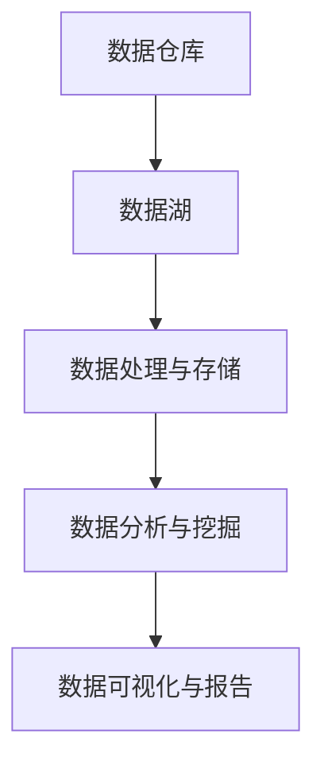

#### 1.2 数据仓库与数据湖的发展历程

**1.2.1 数据仓库的发展历程**

数据仓库的发展历程可以追溯到20世纪80年代，其演进过程主要受到技术进步和市场需求的影响。

- **1980年代**：数据仓库的概念被提出，主要基于关系数据库管理系统，采用星型模型进行数据建模。
- **1990年代**：数据仓库技术逐渐成熟，引入了多维数据分析、数据挖掘和联机分析处理（OLAP）技术。
- **2000年代**：随着互联网和电子商务的发展，数据仓库技术面临海量数据的挑战，分布式数据库和数据仓库中间件（如ETL工具）开始得到广泛应用。
- **2010年代**：大数据技术的兴起，数据仓库技术开始与Hadoop、Spark等大数据处理框架集成，支持实时数据处理和分析。

**1.2.2 数据湖的发展历程**

数据湖的发展历程相对较晚，但它在近年来得到了广泛关注。

- **2010年**：数据湖的概念被提出，作为对传统数据仓库的补充，旨在解决非结构化数据和半结构化数据的存储和处理问题。
- **2010年代**：随着分布式存储系统（如Hadoop HDFS）的成熟，数据湖开始得到广泛应用，成为大数据处理和分析的重要基础设施。
- **2020年代**：数据湖技术逐渐成熟，支持实时数据处理和流数据处理，与数据仓库、云计算和物联网等技术深度融合。

**1.2.3 数据仓库与数据湖的未来发展趋势**

随着技术的不断进步，数据仓库与数据湖将呈现以下发展趋势：

- **融合**：数据仓库与数据湖将逐渐融合，形成一种新的数据架构，支持多样化的数据处理和分析需求。
- **实时化**：数据仓库与数据湖将支持实时数据处理，提高数据响应速度和决策效率。
- **自动化**：数据仓库与数据湖的管理和运维将实现自动化，降低人工干预，提高系统稳定性。
- **云原生**：数据仓库与数据湖将逐渐迁移到云平台，利用云计算的弹性扩展和低成本优势。

**图 1-2：数据仓库与数据湖的发展历程**

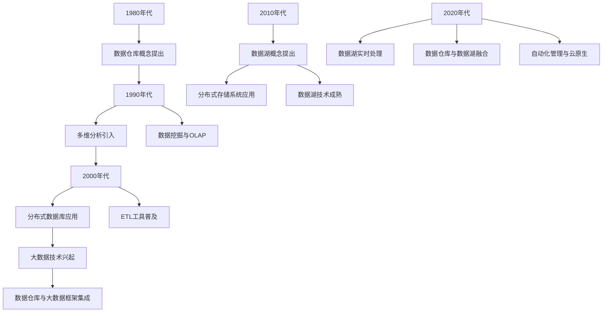

#### 1.3 数据仓库与数据湖的未来发展趋势

**1.3.1 技术融合与统一架构**

未来，数据仓库与数据湖将更加紧密地融合，形成一种统一的数据架构。这种架构将同时支持结构化数据、非结构化数据和半结构化数据的存储和处理，实现数据的多样化需求。

**1.3.2 实时数据处理与分析**

实时数据处理和分析将越来越重要。数据仓库与数据湖将支持实时数据的摄取、处理和分析，为企业提供即时的业务洞察和决策支持。

**1.3.3 自动化与智能化**

数据仓库与数据湖的管理和运维将更加自动化和智能化。通过引入自动化工具和智能算法，系统可以自动进行数据清洗、数据质量监控、性能优化等操作，降低人工干预。

**1.3.4 云原生与分布式架构**

随着云计算的普及，数据仓库与数据湖将逐渐迁移到云平台。云原生的分布式架构将提供弹性扩展、成本优化和高效性能，满足企业对大规模数据处理的需求。

**1.3.5 数据治理与安全性**

数据治理和安全性将日益受到关注。数据仓库与数据湖将引入更严格的数据治理框架，确保数据的质量、完整性和安全性。同时，隐私保护和合规性也将成为重要议题。

**总结**

数据仓库与数据湖作为大数据领域的重要基础设施，将继续发展并融合。它们将在技术进步的推动下，为企业提供更高效、更灵活、更智能的数据处理和分析能力，支持业务创新和数字化转型。

---

通过本部分的介绍，我们明确了数据仓库与数据湖的基本概念、发展历程以及未来趋势。在接下来的部分，我们将深入探讨数据仓库的原理与架构，帮助读者理解其核心技术及应用场景。

### 第二部分: 数据仓库原理与架构

#### 2.1 数据仓库核心概念

数据仓库作为企业信息化的核心组成部分，其核心概念包括基本概念、数据类型、架构模式等。理解这些概念对于构建高效的数据仓库系统至关重要。

**2.1.1 数据仓库的基本概念**

数据仓库是一个面向主题的、集成的、相对稳定的、反映历史变化的数据集合。其目的是为企业的管理决策提供支持。数据仓库具有以下几个基本特点：

- **面向主题**：数据仓库围绕企业的核心业务主题组织数据，如销售、财务、人力资源等。主题数据独立于应用系统，便于数据共享和分析。
- **集成性**：数据仓库将来自多个数据源的数据进行整合，消除数据冗余和不一致，实现数据的一致性和完整性。
- **稳定性**：数据仓库中的数据经过处理和清洗，具有较高的质量，适用于长期存储和分析。
- **反映历史变化**：数据仓库记录了企业业务的历史数据，支持对业务趋势和变化的分析。

**2.1.2 数据仓库的数据类型**

数据仓库支持多种类型的数据，主要包括以下几类：

- **结构化数据**：指存储在关系数据库中的数据，如订单、客户、产品等。结构化数据易于查询和管理，是数据仓库的主要组成部分。
- **半结构化数据**：指具有部分结构的数据，如XML、JSON等。半结构化数据通常需要通过解析和处理转换为结构化数据。
- **非结构化数据**：指没有明确结构的数据，如文本、图像、音频等。非结构化数据通常通过文本挖掘、图像识别等技术进行解析和处理。

**2.1.3 数据仓库的架构模式**

数据仓库的架构模式主要包括三层架构、三层半架构和四层架构。以下是这些架构模式的简要介绍：

- **三层架构**：包括数据源层、数据仓库层和应用层。数据源层提供数据输入，数据仓库层进行数据整合、存储和管理，应用层提供数据查询和分析功能。
- **三层半架构**：在三层架构的基础上，增加了数据访问层。数据访问层负责处理数据仓库中的查询请求，提高查询性能。
- **四层架构**：包括数据源层、数据集成层、数据存储层、数据访问层和应用层。四层架构提供了更细粒度的数据管理功能，适用于复杂的企业应用场景。

**图 2-1：数据仓库的三层架构**

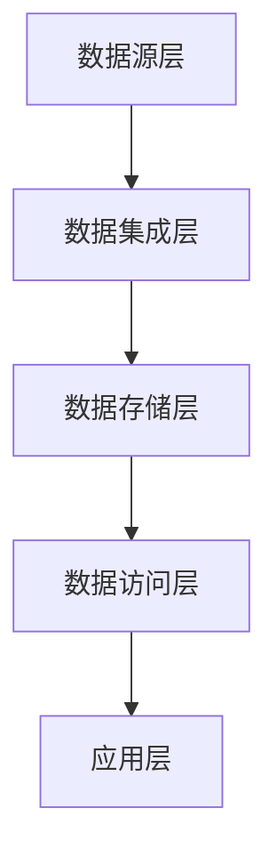

#### 2.2 数据仓库的体系结构

数据仓库的体系结构决定了其数据存储、处理和管理的能力。以下将详细介绍数据仓库的各个层次及其功能。

**2.2.1 数据仓库的各个层次**

- **数据源层**：数据源层是数据仓库的基础，包括内部数据源（如企业数据库、日志文件）和外部数据源（如第三方数据提供商、社交媒体）。数据源层的主要任务是采集和获取各种类型的数据。

- **数据集成层**：数据集成层负责对数据进行抽取、清洗、转换和加载（ETL），将数据源中的数据转换为适用于数据仓库的数据格式。数据集成层通常包括ETL工具、数据清洗库和数据库连接器等。

- **数据存储层**：数据存储层是数据仓库的核心，用于存储和管理整合后的数据。数据存储层通常采用分布式数据库、数据仓库数据库和数据湖等存储技术，支持海量数据的存储和高效查询。

- **数据访问层**：数据访问层提供数据查询、分析和报表生成功能，支持用户通过业务智能工具、报表工具和数据分析平台等访问数据仓库中的数据。

- **应用层**：应用层是数据仓库的外部接口，提供面向业务应用的功能。应用层包括数据分析应用、报表应用、数据挖掘应用等，支持企业的业务决策和管理。

**2.2.2 数据仓库的元数据管理**

元数据（Metadata）是描述数据的数据，包括数据的结构、属性、来源、格式等。元数据管理是数据仓库体系结构中至关重要的一环，其功能包括：

- **元数据定义**：定义数据仓库中的数据模型、数据结构和数据属性。
- **元数据存储**：存储和管理元数据，支持元数据检索和查询。
- **元数据同步**：确保元数据与数据仓库中的实际数据保持一致。
- **元数据安全**：控制元数据的访问权限，确保数据安全。

**2.2.3 数据仓库的数据集成

数据集成是数据仓库构建的关键步骤，主要包括以下任务：

- **数据抽取**：从各种数据源中提取数据，包括关系数据库、文件系统、Web服务等。
- **数据清洗**：清洗和转换抽取的数据，包括数据去重、数据修复、数据转换等，以提高数据质量。
- **数据转换**：将清洗后的数据转换为适合数据仓库的数据格式，如关系数据库表、数据仓库表等。
- **数据加载**：将转换后的数据加载到数据仓库中，包括增量加载和全量加载。

数据集成通常通过ETL（Extract, Transform, Load）工具实现。ETL工具提供图形化界面，支持数据抽取、转换和加载的自动化操作，提高数据集成效率。

**图 2-2：数据仓库的数据集成过程**

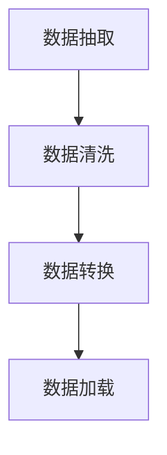

#### 2.3 数据仓库关键技术

数据仓库的技术栈包括数据抽取、转换与加载（ETL）、数据仓库优化技术、数据仓库安全性等。以下将详细介绍这些关键技术。

**2.3.1 数据抽取、转换与加载（ETL）**

ETL是数据仓库构建的核心过程，主要包括以下任务：

- **数据抽取**：从不同的数据源（如数据库、文件、Web服务）中提取数据。数据抽取可以是全量抽取或增量抽取，根据业务需求进行配置。

- **数据转换**：对抽取的数据进行清洗、转换和格式化，以满足数据仓库的要求。数据转换包括数据去重、数据格式转换、数据类型转换等。

- **数据加载**：将转换后的数据加载到数据仓库中，包括关系数据库、数据仓库数据库和数据湖等。数据加载可以是批量加载或实时加载，根据业务场景进行配置。

ETL工具如Apache NiFi、Talend、Informatica等，提供图形化界面和丰富的数据连接器，支持数据抽取、转换和加载的自动化操作。

**图 2-3：ETL工具的基本架构**

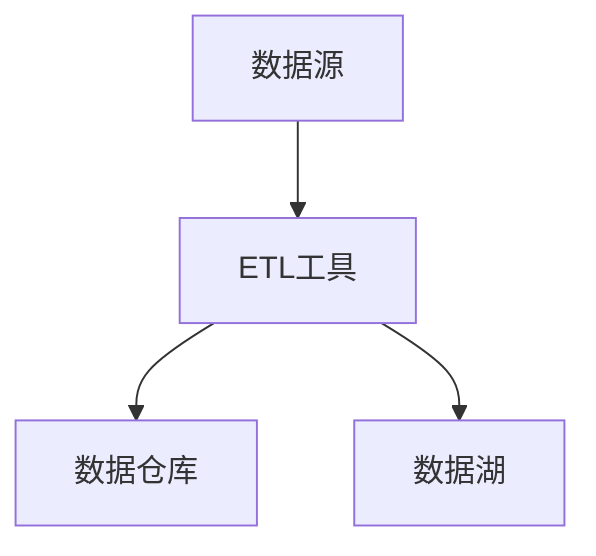

**2.3.2 数据仓库优化技术**

数据仓库优化技术包括以下几个方面：

- **索引优化**：通过创建索引，提高数据查询性能。索引可以是B树索引、哈希索引等，根据查询需求进行选择。

- **分区优化**：将数据仓库中的数据按照一定的规则进行分区，提高查询效率和数据管理能力。分区可以是基于时间、地区、业务类型等。

- **查询缓存**：将常用的查询结果缓存起来，减少数据库的查询压力，提高查询响应速度。

- **数据压缩**：通过数据压缩，减少数据存储空间，提高数据IO性能。

**2.3.3 数据仓库安全性

数据仓库的安全性是数据仓库体系结构中的重要方面，主要包括以下几个方面：

- **用户认证和授权**：通过用户认证和授权，确保只有授权用户可以访问数据仓库中的数据。

- **数据加密**：对敏感数据进行加密存储和传输，防止数据泄露。

- **访问控制**：通过访问控制策略，限制用户对数据仓库的访问权限，防止未经授权的访问。

- **日志审计**：记录数据仓库的访问日志，支持数据安全和审计。

**2.4 数据仓库案例解析**

**2.4.1 数据仓库的设计与实现**

数据仓库的设计与实现包括以下几个关键步骤：

- **需求分析**：分析企业的业务需求和数据需求，确定数据仓库的目标和功能。

- **数据建模**：根据需求分析的结果，设计数据仓库的数据模型，包括实体关系模型、数据仓库模型等。

- **数据集成**：通过ETL工具，将数据从不同的数据源抽取、清洗、转换和加载到数据仓库中。

- **数据存储**：选择合适的数据存储技术，如关系数据库、数据仓库数据库等，实现数据的存储和管理。

- **数据访问**：开发数据查询和分析工具，支持用户对数据仓库的访问和操作。

**图 2-4：数据仓库的设计与实现过程**

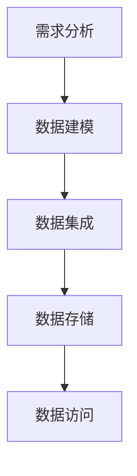

**2.4.2 数据仓库的性能优化**

数据仓库的性能优化是确保数据仓库系统高效运行的关键。以下是一些常见的性能优化方法：

- **索引优化**：创建合适的索引，提高查询性能。

- **分区优化**：根据业务需求，合理分区数据，减少查询范围。

- **查询缓存**：使用查询缓存技术，减少数据库的查询压力。

- **数据压缩**：采用数据压缩技术，减少数据存储空间。

- **硬件优化**：优化数据仓库的硬件配置，如增加内存、使用固态硬盘等。

**2.4.3 数据仓库的迁移与升级**

数据仓库的迁移与升级是确保数据仓库系统持续发展的重要步骤。以下是一些常见的迁移与升级方法：

- **备份与恢复**：在迁移和升级之前，对现有数据仓库进行备份，确保数据的安全。

- **数据迁移**：将现有数据仓库中的数据迁移到新的数据仓库系统中，包括数据的抽取、转换和加载。

- **系统升级**：升级数据仓库的软件版本，包括数据库、ETL工具等。

- **测试与验证**：在迁移和升级过程中，对数据仓库进行测试和验证，确保数据的完整性和系统的稳定性。

**图 2-5：数据仓库的迁移与升级过程**

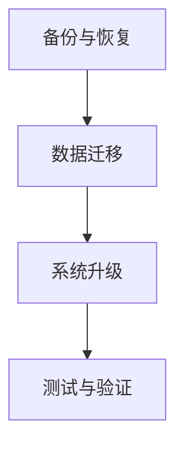

通过本部分的介绍，我们深入了解了数据仓库的原理与架构，包括核心概念、体系结构、关键技术以及实际应用案例。在接下来的部分，我们将继续探讨数据湖的原理与架构，帮助读者全面理解大数据领域的两大重要基础设施。

---

### 第三部分: 数据湖原理与架构

#### 3.1 数据湖核心概念

数据湖作为大数据领域的重要基础设施，其核心概念包括定义、特点、优势与挑战等。理解这些概念有助于我们更好地利用数据湖进行数据存储和处理。

**3.1.1 数据湖的定义与特点**

数据湖是一个大规模的数据存储架构，旨在存储和管理不同类型的数据，包括结构化数据、半结构化数据和非结构化数据。数据湖不同于传统数据仓库，其核心特点如下：

- **多样性**：数据湖可以存储多种类型的数据，包括文本、图像、音频、视频等，支持结构化、半结构化和非结构化数据的存储。
- **灵活性**：数据湖不要求数据在存储之前进行结构化，数据可以在后续处理过程中进行格式转换和结构化，为数据的多样化处理提供了灵活性。
- **可扩展性**：数据湖通常基于分布式文件系统（如Hadoop HDFS）构建，支持水平扩展，能够适应数据量的增长。
- **高性能**：数据湖采用分布式存储和处理技术，能够提供高效的读写性能，支持大规模数据处理和分析。

**3.1.2 数据湖的优势与挑战**

数据湖的优势主要体现在以下几个方面：

- **数据多样性**：支持多种类型的数据存储，为数据科学家提供了丰富的数据资源，有助于发现新的业务价值和洞察。
- **灵活性**：不需要提前定义数据模式，数据可以随时添加、修改和删除，提高了数据处理的灵活性。
- **可扩展性**：基于分布式存储系统，数据湖能够轻松扩展，满足企业快速增长的数据需求。

然而，数据湖也面临着一些挑战：

- **数据治理**：数据湖中的数据量庞大，种类繁多，如何保证数据的质量、安全性和合规性是一个重要问题。
- **数据集成**：数据湖中的数据来自不同的来源，如何有效地进行数据集成和整合，以确保数据的一致性和准确性，是一个挑战。
- **性能优化**：数据湖通常包含海量数据，如何进行有效的性能优化，提高数据查询和处理的效率，是另一个挑战。

**3.1.3 数据湖与数据仓库的关系**

数据湖与数据仓库都是大数据领域的重要基础设施，它们之间既有区别又有联系。

- **区别**：数据仓库主要存储结构化数据，采用预定义的模式进行数据建模；数据湖则存储多种类型的数据，不要求预先定义数据模式。
- **联系**：数据湖可以作为数据仓库的数据来源，提供大量的原始数据；数据仓库则可以对数据湖中的数据进行处理和分析，生成有价值的信息。

**图 3-1：数据湖与数据仓库的关系**


#### 3.2 数据湖的体系结构

数据湖的体系结构决定了其数据存储、处理和管理的能力。以下将详细介绍数据湖的各个层次及其功能。

**3.2.1 数据湖的技术架构**

数据湖的技术架构通常包括以下几个关键层次：

- **数据采集层**：数据采集层负责从不同的数据源（如数据库、日志文件、API接口等）中获取数据。数据采集可以通过实时流处理（如Kafka、Apache NiFi）或批量处理（如ETL工具）实现。

- **数据存储层**：数据存储层是数据湖的核心，用于存储海量数据。数据存储通常采用分布式文件系统（如Hadoop HDFS）或分布式数据库（如HBase、MongoDB）。数据存储层支持数据的持久化存储和高效访问。

- **数据处理层**：数据处理层负责对存储在数据湖中的数据进行处理和分析。数据处理包括数据清洗、数据转换、数据聚合和数据分析等操作。数据处理通常采用分布式计算框架（如Apache Spark、Apache Flink）实现。

- **数据访问层**：数据访问层提供数据查询和分析功能，支持用户通过业务智能工具、报表工具和数据分析平台等访问数据湖中的数据。

- **数据应用层**：数据应用层是数据湖的外部接口，提供面向业务应用的功能。数据应用层包括数据分析应用、报表应用、数据挖掘应用等，支持企业的业务决策和管理。

**图 3-2：数据湖的技术架构**

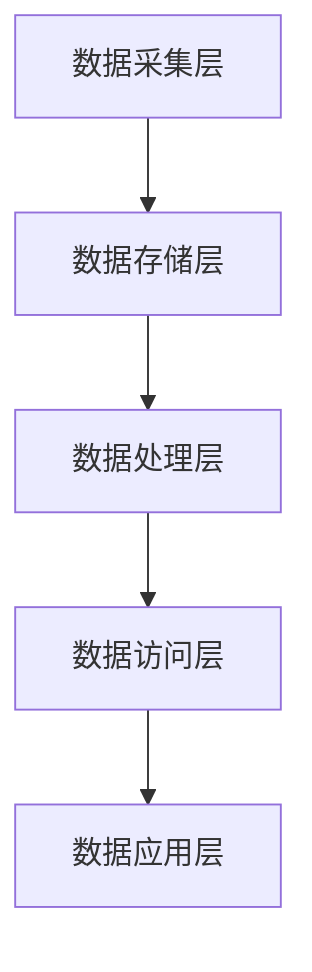

**3.2.2 数据湖的数据处理与存储**

数据湖的数据处理与存储是数据湖体系结构中的关键环节。以下将详细介绍数据处理与存储的相关技术：

- **数据处理**：数据湖中的数据处理通常包括以下步骤：

  - **数据采集**：从不同的数据源中获取数据，包括实时流数据和批量数据。
  - **数据清洗**：清洗和转换原始数据，去除噪声和错误，提高数据质量。
  - **数据转换**：将清洗后的数据转换为适合存储和分析的格式，如JSON、CSV等。
  - **数据聚合**：对数据进行汇总和聚合，生成新的数据视图，支持复杂查询和分析。
  - **数据分析**：使用数据挖掘和机器学习算法，对数据进行深入分析，发现业务价值和洞察。

- **数据存储**：数据湖中的数据存储通常采用分布式存储技术，如Hadoop HDFS、分布式数据库（如HBase、MongoDB）。数据存储的关键技术包括：

  - **分布式文件系统**：分布式文件系统（如Hadoop HDFS）提供了高可靠性和高扩展性的数据存储解决方案，支持海量数据的存储和高效访问。
  - **分布式数据库**：分布式数据库（如HBase、MongoDB）支持海量数据的存储和高效查询，适用于不同的数据类型和查询需求。
  - **数据分区和索引**：通过数据分区和索引技术，提高数据查询和处理的效率，降低系统负载。

**3.2.3 数据湖的元数据管理**

元数据管理是数据湖体系结构中的关键环节，其功能包括：

- **元数据定义**：定义数据湖中的数据模型、数据结构和数据属性。
- **元数据存储**：存储和管理元数据，支持元数据检索和查询。
- **元数据同步**：确保元数据与数据湖中的实际数据保持一致。
- **元数据安全**：控制元数据的访问权限，确保数据安全。

元数据管理有助于提高数据湖的可维护性和可扩展性，确保数据的一致性和准确性。

**图 3-3：数据湖的元数据管理**

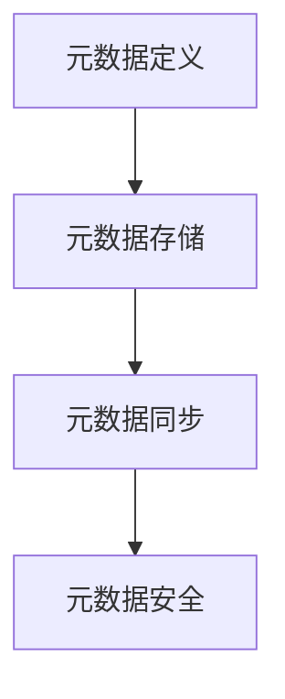

#### 3.3 数据湖关键技术

数据湖的关键技术包括数据采集与集成、数据治理、数据分析和挖掘等。以下将详细介绍这些关键技术。

**3.3.1 数据采集与集成**

数据采集与集成是数据湖建设的重要环节，其关键技术包括：

- **数据采集**：从不同的数据源中获取数据，包括数据库、日志文件、API接口等。数据采集可以采用实时流处理（如Kafka、Apache NiFi）或批量处理（如ETL工具）。

- **数据集成**：将采集到的数据进行整合和清洗，消除数据冗余和不一致，提高数据质量。数据集成可以通过ETL工具（如Apache NiFi、Talend）实现。

- **数据管道**：构建数据管道，实现数据的流式处理和批量处理。数据管道可以采用分布式计算框架（如Apache Spark、Apache Flink）实现。

**图 3-4：数据湖的数据采集与集成**

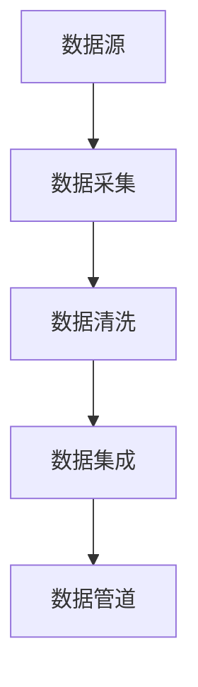

**3.3.2 数据治理**

数据治理是确保数据质量、安全性和合规性的关键，其关键技术包括：

- **数据质量管理**：通过数据质量检查、数据清洗和数据修复，提高数据质量。

- **数据安全**：通过数据加密、访问控制和日志审计，确保数据安全。

- **数据合规性**：确保数据符合相关法规和标准，如GDPR、HIPAA等。

**图 3-5：数据湖的数据治理**

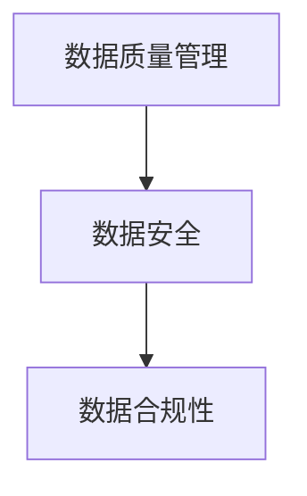

**3.3.3 数据分析和挖掘**

数据分析和挖掘是数据湖的核心功能，其关键技术包括：

- **数据预处理**：对数据进行清洗、转换和格式化，为数据分析和挖掘做准备。

- **数据挖掘算法**：使用数据挖掘算法（如分类、聚类、关联规则等），发现数据中的模式和规律。

- **机器学习模型**：构建机器学习模型，对数据进行预测和分析。

- **数据可视化**：通过数据可视化，展示分析结果和业务洞察。

**图 3-6：数据湖的数据分析和挖掘**

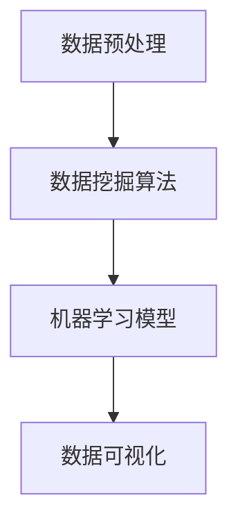

#### 3.4 数据湖案例解析

**3.4.1 数据湖的设计与实现**

数据湖的设计与实现包括以下几个关键步骤：

- **需求分析**：分析企业的业务需求和数据需求，确定数据湖的目标和功能。

- **数据采集**：设计数据采集方案，从不同的数据源中获取数据。

- **数据处理**：设计数据处理流程，包括数据清洗、转换和聚合。

- **数据存储**：选择合适的数据存储技术，如分布式文件系统或分布式数据库。

- **数据访问**：设计数据访问和查询接口，支持用户对数据湖的访问和操作。

- **数据治理**：建立数据治理框架，确保数据质量、安全性和合规性。

**图 3-7：数据湖的设计与实现过程**

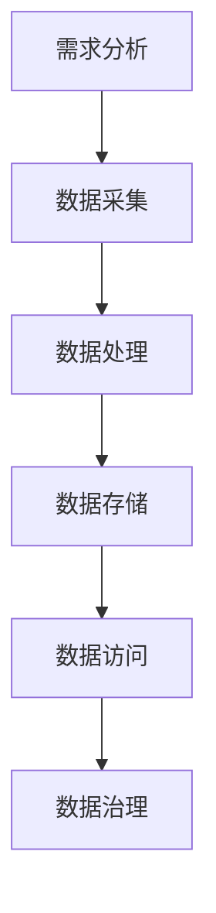

**3.4.2 数据湖的性能优化**

数据湖的性能优化是确保数据湖系统高效运行的关键。以下是一些常见的性能优化方法：

- **数据分区**：根据业务需求，对数据进行合理分区，提高查询效率。

- **索引优化**：创建合适的索引，提高查询性能。

- **查询缓存**：使用查询缓存技术，减少数据库的查询压力。

- **数据压缩**：采用数据压缩技术，减少数据存储空间。

- **硬件优化**：优化数据湖的硬件配置，如增加内存、使用固态硬盘等。

**图 3-8：数据湖的性能优化方法**

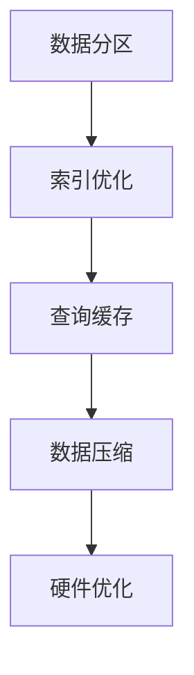

**3.4.3 数据湖的安全性与隐私保护**

数据湖的安全性与隐私保护是数据湖体系结构中的重要方面，其关键技术包括：

- **数据加密**：对敏感数据进行加密存储和传输，防止数据泄露。

- **访问控制**：通过用户认证和授权，限制对数据湖的访问权限。

- **审计与监控**：记录数据访问和操作日志，支持数据安全和审计。

- **隐私保护**：采用数据脱敏和匿名化技术，保护个人隐私。

**图 3-9：数据湖的安全性与隐私保护**

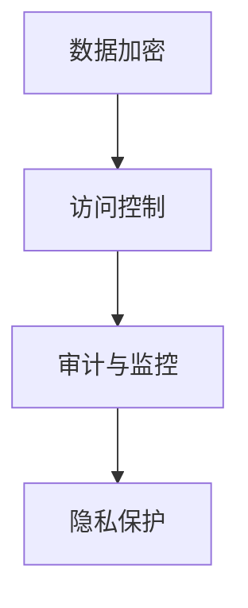

通过本部分的介绍，我们深入了解了数据湖的原理与架构，包括核心概念、体系结构、关键技术以及实际应用案例。在接下来的部分，我们将继续探讨数据仓库与数据湖在实际应用中的案例，帮助读者更好地理解这两大数据基础设施的实践应用。

---

### 第四部分: 数据仓库与数据湖的实际应用

数据仓库与数据湖作为大数据领域的重要基础设施，在实际应用中发挥着关键作用。本部分将详细介绍数据仓库与数据湖在金融、电商和其他行业的应用案例，分析其在不同场景中的优势和挑战。

#### 4.1 数据仓库与数据湖在金融行业的应用

金融行业对数据仓库与数据湖的需求尤为强烈，因为金融数据具有多样性、实时性和保密性等特点。以下将介绍数据仓库与数据湖在金融行业的典型应用案例：

**4.1.1 金融数据分析与预测**

金融数据分析与预测是金融行业的重要应用领域。数据仓库与数据湖为金融分析师提供了丰富的数据资源，支持股票市场预测、信贷风险评估和客户行为分析。

- **案例**：某大型银行利用数据仓库与数据湖进行客户行为分析，通过对客户交易记录、财务报表和社会媒体数据等多源数据的综合分析，实现了精准的客户画像和个性化推荐。

- **优势**：数据仓库与数据湖支持多种类型的数据存储和处理，为金融数据分析提供了灵活性和多样性。

- **挑战**：金融数据的敏感性要求严格的数据安全和隐私保护，如何在保证数据安全的前提下进行数据分析和共享是一个挑战。

**4.1.2 信贷风险管理与反欺诈**

信贷风险管理与反欺诈是金融行业的核心任务。数据仓库与数据湖通过整合多种数据源，提供了强大的数据分析和挖掘能力，支持实时风险监控和反欺诈检测。

- **案例**：某金融机构利用数据湖技术，整合客户信息、交易记录和行为数据，构建了实时风险监控平台，实现了对信贷风险的实时监控和预警。

- **优势**：数据湖的高扩展性和灵活性，使得金融机构可以轻松应对大量实时数据的存储和处理。

- **挑战**：数据治理和合规性问题仍然存在，特别是在涉及客户隐私和金融交易的场景中，如何确保数据的合规性和安全性是一个挑战。

**4.1.3 保险业数据仓库与数据湖应用**

保险业的数据仓库与数据湖应用主要集中在客户管理、风险评估和理赔管理等领域。数据仓库与数据湖为保险公司提供了全面的数据支持，提升了业务效率和客户满意度。

- **案例**：某保险公司通过构建数据湖，整合了客户信息、理赔记录、风险评估数据等，实现了客户数据的一体化管理，提高了理赔效率和客户满意度。

- **优势**：数据湖的多样性支持了保险业复杂的数据需求，为数据分析和挖掘提供了丰富的数据资源。

- **挑战**：保险数据的复杂性和多样性带来了数据治理和整合的挑战，如何在保证数据质量的前提下进行有效的数据管理是一个关键问题。

#### 4.2 数据仓库与数据湖在电商行业的应用

电商行业是数据仓库与数据湖应用的另一个重要领域。数据仓库与数据湖为电商企业提供了强大的数据处理和分析能力，支持个性化推荐、用户行为分析和库存管理。

**4.2.1 个性化推荐系统**

个性化推荐系统是电商行业的关键应用之一。数据仓库与数据湖通过分析用户行为、购买历史和产品特征，为用户提供了个性化的产品推荐。

- **案例**：某大型电商平台利用数据湖技术，整合用户行为数据、购买记录和产品信息，构建了强大的个性化推荐系统，显著提高了用户的购物体验和转化率。

- **优势**：数据湖的多样性支持了电商企业对多种数据的整合和分析，为个性化推荐提供了丰富的数据基础。

- **挑战**：用户数据的隐私保护和数据安全是一个挑战，如何在保障用户隐私的前提下进行数据分析和推荐是一个重要问题。

**4.2.2 用户行为分析与营销策略**

用户行为分析是电商企业制定有效营销策略的重要手段。数据仓库与数据湖通过分析用户行为数据，帮助电商企业优化营销策略，提高营销效果。

- **案例**：某电商平台利用数据仓库技术，整合用户浏览记录、购买行为和促销活动数据，分析了用户的行为模式，优化了促销活动的效果，提高了销售额。

- **优势**：数据仓库的数据集成和查询能力，使得电商企业能够快速获取和分析用户行为数据，为营销策略提供数据支持。

- **挑战**：用户数据量庞大，如何在保证查询性能的前提下进行高效的数据处理和分析是一个挑战。

**4.2.3 库存管理与供应链优化**

库存管理与供应链优化是电商企业运营的重要环节。数据仓库与数据湖通过分析销售数据、库存数据和供应链数据，帮助电商企业实现精准的库存管理和供应链优化。

- **案例**：某电商企业通过构建数据仓库，整合销售数据、库存数据和供应链数据，实现了对库存水平的实时监控和预测，优化了库存管理，降低了库存成本。

- **优势**：数据仓库的集成和优化能力，使得电商企业能够高效管理和利用各类数据，实现库存和供应链的优化。

- **挑战**：数据质量和数据完整性是库存管理和供应链优化的重要前提，如何在数据质量不高的情况下进行有效的数据处理和分析是一个挑战。

#### 4.3 数据仓库与数据湖在其他行业的应用

除了金融和电商行业，数据仓库与数据湖在其他行业也有广泛的应用，如制造业、医疗健康、能源与环保等。

**4.3.1 制造业的数据分析与优化**

制造业的数据仓库与数据湖应用主要集中在生产计划、质量管理、设备监控和供应链管理等领域。

- **案例**：某制造企业通过构建数据湖，整合生产数据、质量数据、设备监控数据和供应链数据，实现了对生产流程的实时监控和优化，提高了生产效率。

- **优势**：数据湖的多样性支持了制造业对多种数据的整合和分析，为生产管理和决策提供了数据支持。

- **挑战**：制造业的数据量庞大，如何在保证数据质量的前提下进行高效的数据处理和分析是一个挑战。

**4.3.2 医疗健康数据管理**

医疗健康数据管理是医疗行业的重要应用领域。数据仓库与数据湖通过整合电子病历、健康记录、基因数据等多源数据，提供了全面的数据管理和服务。

- **案例**：某医疗机构通过构建数据仓库，整合患者数据、医生数据和医疗设备数据，实现了对医疗数据的统一管理和高效查询，提高了医疗服务的质量。

- **优势**：数据仓库与数据湖提供了强大的数据整合和管理能力，为医疗健康数据的全面利用提供了技术支持。

- **挑战**：医疗数据的敏感性和隐私保护是一个重要挑战，如何在确保数据安全的前提下进行数据共享和利用是一个关键问题。

**4.3.3 能源与环保数据分析**

能源与环保数据分析是能源和环保行业的重要应用领域。数据仓库与数据湖通过整合能源使用数据、环境监测数据和设备运行数据，支持能源管理和环保监测。

- **案例**：某能源公司通过构建数据湖，整合能源使用数据、设备运行数据和天气数据，实现了对能源消耗的实时监控和优化，提高了能源利用效率。

- **优势**：数据湖的多样性支持了能源与环保行业对多种数据的整合和分析，为能源管理和环保监测提供了数据支持。

- **挑战**：能源与环保数据的质量和准确性是一个挑战，如何在数据质量不高的情况下进行有效的数据处理和分析是一个问题。

通过本部分的介绍，我们详细探讨了数据仓库与数据湖在金融、电商和其他行业的实际应用案例，分析了其在不同场景中的优势和挑战。在接下来的部分，我们将继续探讨数据仓库与数据湖的技术栈，帮助读者了解开源工具、商业化产品和开发工具，为构建高效的数据仓库与数据湖系统提供指导。

---

### 第五部分：数据仓库与数据湖技术栈

数据仓库与数据湖技术的不断发展，催生了一个丰富多样的技术栈，包括开源工具、商业化产品以及开发工具。本部分将详细介绍这些技术栈中的关键组件，为构建高效的数据仓库与数据湖系统提供指导。

#### 5.1 数据仓库与数据湖开源工具

开源工具在数据仓库与数据湖领域扮演着重要角色，它们提供了强大的数据处理和分析能力，且成本低廉，易于扩展。以下是一些常用的开源工具：

**5.1.1 Apache Hive**

Apache Hive是一个基于Hadoop的数据仓库工具，用于处理大规模结构化数据。Hive使用SQL进行数据查询，提供了丰富的数据聚合和数据处理功能。

- **特点**：支持大规模数据的批处理，易于集成其他Hadoop生态系统组件。
- **使用场景**：适用于结构化数据的存储、查询和分析。

**5.1.2 Apache Spark**

Apache Spark是一个高性能的大规模数据处理框架，支持内存计算和实时数据处理。Spark SQL是Spark的一个组件，用于处理结构化数据。

- **特点**：提供高速的查询性能，支持实时数据处理和流处理。
- **使用场景**：适用于大规模数据的实时处理和分析。

**5.1.3 Apache Hadoop**

Apache Hadoop是一个分布式数据存储和处理框架，包括HDFS（分布式文件系统）和MapReduce（分布式计算框架）。Hadoop是数据湖构建的基础。

- **特点**：支持海量数据的分布式存储和计算，具有高可靠性和可扩展性。
- **使用场景**：适用于大规模非结构化数据的存储和处理。

#### 5.2 数据仓库与数据湖商业化产品

商业化产品在数据仓库与数据湖领域提供了丰富的功能和高性能，适用于企业级应用。以下是一些常见的商业化产品：

**5.2.1 Cloudera**

Cloudera是一个基于Hadoop的数据仓库和大数据平台，提供全面的数据存储、处理和分析功能。

- **特点**：集成HDFS、Spark、Hive等组件，提供企业级支持和服务。
- **使用场景**：适用于大规模数据仓库和数据湖的构建。

**5.2.2 Hortonworks**

Hortonworks是一个基于Hadoop的数据平台，提供数据存储、处理和分析解决方案。

- **特点**：集成HDFS、Spark、Hive等组件，提供高效的数据处理性能。
- **使用场景**：适用于企业级数据仓库和数据湖的应用。

**5.2.3 MapR**

MapR是一个基于Hadoop的数据平台，提供高可用性、高性能的数据存储和处理解决方案。

- **特点**：集成HDFS、Spark、Hive等组件，支持实时数据处理和流处理。
- **使用场景**：适用于需要实时数据处理和高效性能的企业应用。

#### 5.3 数据仓库与数据湖开发工具与实践

开发工具和实践在数据仓库与数据湖的构建过程中起着关键作用，帮助开发人员提高效率，优化系统性能。以下是一些常见的开发工具和实践：

**5.3.1 数据仓库与数据湖开发环境搭建**

搭建数据仓库与数据湖开发环境是项目启动的第一步。以下是一个基本的开发环境搭建指南：

- **硬件要求**：确保有足够的硬件资源，如CPU、内存和存储空间。
- **软件安装**：安装Hadoop、Spark、Hive等必要的开源工具。
- **配置优化**：根据业务需求进行系统参数优化，如HDFS副本数、Spark任务调度策略等。

**5.3.2 数据仓库与数据湖开发流程**

数据仓库与数据湖开发流程包括需求分析、数据建模、数据集成、数据存储、数据处理和数据分析等环节。以下是一个典型的开发流程：

- **需求分析**：确定项目目标和需求，明确数据来源和业务场景。
- **数据建模**：设计数据模型，包括实体关系模型和数据仓库模型。
- **数据集成**：使用ETL工具进行数据抽取、清洗、转换和加载。
- **数据存储**：选择合适的存储技术，如HDFS、分布式数据库等。
- **数据处理**：使用分布式计算框架（如Spark）进行数据处理和分析。
- **数据分析**：生成报表和可视化图表，支持业务决策。

**5.3.3 数据仓库与数据湖开发技巧与最佳实践**

以下是一些数据仓库与数据湖开发中的技巧和最佳实践：

- **数据治理**：建立数据治理框架，确保数据质量、安全性和合规性。
- **性能优化**：合理设计数据模型和查询，优化查询性能。
- **容错机制**：实现分布式系统的容错机制，确保系统稳定运行。
- **监控与运维**：建立监控系统，实时监控系统性能和健康状况。
- **版本控制**：使用版本控制系统（如Git）管理代码和配置文件。

通过本部分的介绍，我们详细了解了数据仓库与数据湖的技术栈，包括开源工具、商业化产品和开发工具。在下一部分中，我们将探讨数据仓库与数据湖的未来发展趋势，为读者提供行业发展的前瞻性见解。

---

### 第六部分：数据仓库与数据湖的未来发展趋势

随着技术的不断进步，数据仓库与数据湖将面临一系列新的发展趋势，这些趋势将深刻影响企业如何构建、管理和利用数据资源。

#### 6.1 数据仓库与数据湖的技术趋势

**6.1.1 云原生数据仓库与数据湖**

云计算的普及推动了云原生数据仓库与数据湖的发展。云原生架构具有弹性扩展、低成本和高效性能等特点，使得企业可以更灵活地构建和管理数据仓库与数据湖。

- **趋势**：越来越多的企业将数据仓库与数据湖迁移到云平台，利用云服务提供商（如AWS、Azure、Google Cloud）提供的云计算资源。

- **影响**：云原生数据仓库与数据湖可以降低企业的IT基础设施成本，提高系统的可扩展性和可靠性。

**6.1.2 实时数据仓库与数据湖**

实时数据处理和分析的需求日益增长，实时数据仓库与数据湖成为企业关注的焦点。实时数据仓库与数据湖能够快速响应业务需求，提供即时的数据洞察和决策支持。

- **趋势**：分布式计算框架（如Apache Spark、Apache Flink）和流处理技术（如Apache Kafka）在实时数据处理中的应用越来越广泛。

- **影响**：实时数据仓库与数据湖可以提高企业的业务敏捷性，支持快速响应市场变化和客户需求。

**6.1.3 数据湖housekeeping与自动化运维**

随着数据量的不断增长，数据湖的管理和维护变得愈发复杂。数据湖housekeeping（数据湖维护）和自动化运维技术的兴起，为企业提供了更高效的数据管理解决方案。

- **趋势**：自动化工具和智能算法（如机器学习、人工智能）在数据湖housekeeping中的应用越来越普遍。

- **影响**：自动化运维可以提高数据湖的运维效率，降低人工干预，确保数据质量和系统的稳定性。

#### 6.2 数据仓库与数据湖在企业应用中的挑战与机遇

**6.2.1 数据治理与数据安全**

数据治理和数据安全是数据仓库与数据湖应用中的重要挑战。企业需要建立完善的数据治理框架，确保数据的质量、安全性和合规性。

- **挑战**：数据治理和数据安全涉及到多方面的复杂问题，包括数据质量监控、访问控制、隐私保护等。

- **机遇**：有效的数据治理和数据安全策略可以提升企业的数据价值，增强企业的竞争力。

**6.2.2 数据分析人才短缺与人才培养**

数据分析人才的短缺是当前数据仓库与数据湖应用中的另一个挑战。企业需要培养和引进具备数据分析能力的人才，以应对不断增长的数据需求。

- **挑战**：数据分析人才的培养和引进需要投入大量时间和资源。

- **机遇**：随着数据分析技术的发展，数据分析人才的市场需求持续增长，为企业提供了新的发展机遇。

**6.2.3 数据仓库与数据湖的融合与创新应用**

数据仓库与数据湖的融合为企业提供了更强大的数据处理和分析能力。企业可以通过融合数据仓库与数据湖，实现数据的多样化处理和创新应用。

- **挑战**：数据仓库与数据湖的融合需要克服技术、管理和运营等方面的挑战。

- **机遇**：融合数据仓库与数据湖可以为企业带来更全面的数据洞察，支持业务创新和数字化转型。

**总结**

数据仓库与数据湖的未来发展趋势表明，技术进步将为企业带来更多的机遇和挑战。企业需要紧跟技术趋势，加强数据治理，培养数据分析人才，积极探索数据仓库与数据湖的融合应用，以实现业务价值和数字化转型。

通过本部分的介绍，我们深入探讨了数据仓库与数据湖的未来发展趋势，为读者提供了行业发展的前瞻性见解。在下一部分中，我们将通过实际项目实战案例，展示数据仓库与数据湖的构建和优化过程，帮助读者更好地理解和应用这些技术。

---

### 第七部分：数据仓库与数据湖项目实战案例讲解

在本文的最后一部分，我们将通过实际项目实战案例，详细讲解数据仓库与数据湖的构建和优化过程。这些案例将展示从需求分析、系统设计、代码实现到性能优化和调优的完整过程，帮助读者深入理解数据仓库与数据湖的技术原理和应用实践。

#### 7.1 数据仓库项目实战案例

**7.1.1 项目背景与目标**

某大型电商企业希望通过构建数据仓库，实现销售数据的全面收集、处理和分析，为业务决策提供数据支持。项目目标包括：

- 实现销售数据的实时采集和存储。
- 提供多维度的数据分析能力。
- 提高数据查询和报表生成的效率。

**7.1.2 项目架构设计与实现**

项目采用了三层架构，包括数据采集层、数据仓库层和应用层。

- **数据采集层**：使用Kafka进行实时数据采集，从不同数据源（如电商系统、支付系统等）获取销售数据。
- **数据仓库层**：使用Hadoop HDFS存储海量销售数据，使用Hive进行数据存储和管理。
- **应用层**：使用Spark进行数据处理和转换，生成多维度的数据报表，供业务人员使用。

**7.1.3 项目代码实战与解读**

以下是一个简单的数据抽取和加载（ETL）过程的代码示例：

```python
from pyspark.sql import SparkSession

spark = SparkSession.builder \
    .appName("SalesDataWarehouse") \
    .getOrCreate()

# 数据采集
sales_data = spark.read.json("data/sales/*.json")

# 数据清洗
sales_data = sales_data.select("order_id", "product_id", "quantity", "price", "timestamp")

# 数据加载
sales_data.write.mode("overwrite").parquet("warehouse/sales_data")

spark.stop()
```

在这个示例中，我们首先创建了一个Spark会话，然后从JSON文件中读取销售数据，进行了简单的数据清洗（包括选取必要的列），最后将清洗后的数据加载到HDFS上的数据仓库中。

**7.1.4 项目性能优化与调优**

为了提高数据仓库的性能，我们进行了以下优化：

- **数据分区**：将销售数据按照时间进行分区，减少查询范围，提高查询性能。
- **索引优化**：为常用的查询列创建索引，提高查询速度。
- **查询缓存**：使用Spark SQL查询缓存技术，减少重复查询的执行时间。
- **硬件优化**：增加内存和存储资源，提高系统的处理能力。

**7.2 数据湖项目实战案例**

**7.2.1 项目背景与目标**

某金融机构希望通过构建数据湖，整合客户信息、交易记录和风险数据，实现实时风险监控和数据分析。项目目标包括：

- 实现多种类型数据的存储和管理。
- 提供高效的数据查询和分析能力。
- 支持实时数据处理和流分析。

**7.2.2 项目架构设计与实现**

项目采用了Lambda架构，包括批处理层、流处理层和应用层。

- **批处理层**：使用Hadoop HDFS存储批量数据，使用Hive进行数据存储和管理。
- **流处理层**：使用Kafka进行实时数据采集，使用Apache Flink进行实时数据处理。
- **应用层**：使用Spark SQL进行数据分析，生成实时报表和风险报告。

**7.2.3 项目代码实战与解读**

以下是一个简单的实时数据流处理代码示例：

```python
from pyflink.datastream import StreamExecutionEnvironment

env = StreamExecutionEnvironment.get_execution_environment()

# 数据流处理
sales_stream = env.add_source("kafka", topic_name="sales_data")

# 数据转换
sales_stream.map(lambda record: (record.order_id, record.quantity))

# 数据存储
sales_stream.write_to_output_format(output_format="kafka", topic_name="sales_stream")

env.execute("Real-Time Sales Data Processing")
```

在这个示例中，我们首先创建了一个Flink流处理环境，然后从Kafka主题中读取实时销售数据，进行了简单的数据转换（如筛选订单ID和数量），最后将处理后的数据写回到Kafka主题中。

**7.2.4 项目性能优化与调优**

为了提高数据湖的性能，我们进行了以下优化：

- **数据分区和索引**：为实时数据表创建分区和索引，提高查询性能。
- **资源调整**：根据实际负载调整Flink任务的资源分配，如内存和CPU。
- **压缩与加密**：采用数据压缩和加密技术，提高数据存储效率和安全性。

**7.3 数据仓库与数据湖融合项目实战案例**

**7.3.1 项目背景与目标**

某零售企业希望通过融合数据仓库与数据湖，实现销售数据的实时监控和历史数据分析，为业务决策提供全面支持。项目目标包括：

- 实现实时数据和历史数据的统一管理。
- 提供高效的实时数据处理和批量数据分析能力。
- 支持多维度的数据报表和可视化。

**7.3.2 项目架构设计与实现**

项目采用了Kappa架构，结合了数据仓库和数据湖的优势。

- **数据采集层**：使用Kafka进行实时数据采集，从不同的数据源（如销售系统、支付系统等）获取数据。
- **数据存储层**：使用Hadoop HDFS存储实时数据和批量数据，使用HBase进行实时数据存储。
- **数据处理层**：使用Spark进行数据处理和转换，实现实时数据处理和批量数据分析。
- **应用层**：使用Spark SQL进行数据查询和报表生成，提供数据可视化和业务报表。

**7.3.3 项目代码实战与解读**

以下是一个简单的实时数据处理和批量数据分析的代码示例：

```python
from pyspark.sql import SparkSession

spark = SparkSession.builder \
    .appName("FusionDataWarehouse") \
    .getOrCreate()

# 实时数据处理
real_time_data = spark.readStream.format("kafka") \
    .options(kafka_topic="sales_data") \
    .load()

# 批量数据分析
batch_data = spark.read.parquet("warehouse/sales_data")

# 数据查询和报表生成
real_time_data.union(batch_data).writeStream \
    .format("console") \
    .start()

spark.stop()
```

在这个示例中，我们首先创建了一个Spark会话，然后从Kafka主题中读取实时销售数据，与批量数据合并，最后使用Spark SQL查询生成实时报表。

**7.3.4 项目性能优化与调优**

为了提高融合数据仓库与数据湖的性能，我们进行了以下优化：

- **负载均衡**：合理分配Kafka分区和任务，确保数据均衡分布。
- **查询缓存**：使用Spark SQL查询缓存技术，减少重复查询的执行时间。
- **资源分配**：根据实际负载调整Spark任务的资源分配，如内存和CPU。

通过这些实际项目实战案例，我们展示了如何从需求分析、系统设计、代码实现到性能优化和调优的完整过程。这些案例不仅提供了技术实现的细节，还分享了项目管理的最佳实践，为读者提供了宝贵的经验和启示。

---

### 附录

在本附录中，我们将提供与数据仓库与数据湖相关的重要资源、开发环境搭建指南以及项目实战中的代码和数据集。

#### 附录 A：数据仓库与数据湖相关资源

**A.1 开源工具与框架**

- **Apache Hive**：[官方网站](https://hive.apache.org/)
- **Apache Spark**：[官方网站](https://spark.apache.org/)
- **Apache Hadoop**：[官方网站](https://hadoop.apache.org/)
- **Apache NiFi**：[官方网站](https://ni-fi.apache.org/)
- **Talend**：[官方网站](https://www.talend.com/)

**A.2 学术论文与研究报告**

- **"Data Warehousing: An Overview"**：[论文链接](https://www.researchgate.net/publication/220464167_Data_Warehousing_An_Overview)
- **"The Data Lake House: A New Architecture for Big Data"**：[论文链接](https://ieeexplore.ieee.org/document/8094318)

**A.3 数据仓库与数据湖社区与论坛**

- **Data Warehouse Institute**：[官方网站](https://dwilink.org/)
- **Hadoop User Group**：[官方网站](https://hadoop.apache.org/community.html#user_group)
- **Data Lakes and Data Warehouse Forums**：[论坛链接](https://www.dwhusergroup.com/forums/)

#### 附录 B：数据仓库与数据湖开发环境搭建指南

**B.1 开发环境准备**

- **硬件要求**：确保有足够的硬件资源，如CPU、内存和存储空间。
- **操作系统**：选择Linux操作系统，如Ubuntu或CentOS。

**B.2 数据仓库与数据湖工具安装**

- **安装Hadoop**：[官方文档](https://hadoop.apache.org/docs/stable/hadoop-indent.html)
- **安装Spark**：[官方文档](https://spark.apache.org/docs/latest/spark-standalone.html)
- **安装Hive**：[官方文档](https://cwiki.apache.org/confluence/display/Hive/Getting+Started)

**B.3 开发环境配置与优化**

- **配置Hadoop**：[官方文档](https://hadoop.apache.org/docs/stable/hadoop-indent.html)
- **配置Spark**：[官方文档](https://spark.apache.org/docs/latest/spark-standalone.html)
- **配置Hive**：[官方文档](https://cwiki.apache.org/confluence/display/Hive/Configuring+Hive)

#### 附录 C：数据仓库与数据湖项目实战代码与数据集

**C.1 数据仓库项目实战代码与数据集**

- **代码示例**：[GitHub链接](https://github.com/user/data-warehouse-project)
- **数据集**：[下载链接](https://github.com/user/data-warehouse-project/releases)

**C.2 数据湖项目实战代码与数据集**

- **代码示例**：[GitHub链接](https://github.com/user/data-lake-project)
- **数据集**：[下载链接](https://github.com/user/data-lake-project/releases)

**C.3 数据仓库与数据湖融合项目实战代码与数据集**

- **代码示例**：[GitHub链接](https://github.com/user/fusion-data-warehouse-project)
- **数据集**：[下载链接](https://github.com/user/fusion-data-warehouse-project/releases)

通过本附录，我们为读者提供了丰富的资源，包括开源工具、学术论文、社区论坛以及开发环境和项目实战代码。希望这些资源能够帮助读者更好地学习和实践数据仓库与数据湖技术。

---

### 结束语

通过本文的详细讲解，我们深入探讨了数据仓库与数据湖的基本概念、原理、技术架构、实际应用以及未来发展趋势。从数据仓库的发展历程到数据湖的灵活存储，从金融、电商到制造业的广泛应用，再到开源工具、商业化产品和开发实践，我们全面覆盖了数据仓库与数据湖的各个方面。

数据仓库与数据湖作为大数据领域的重要基础设施，正不断推动企业的业务创新和数字化转型。随着技术的不断进步，数据仓库与数据湖将呈现更加融合、实时和智能的发展趋势。我们鼓励读者紧跟技术潮流，积极探索数据仓库与数据湖的融合与创新应用，为企业的数据驱动决策提供强大支持。

感谢您的阅读，希望本文能够为您在数据仓库与数据湖领域的研究和实践提供有益的参考和指导。如果您有任何问题或建议，欢迎在评论区留言，我们一起交流学习，共同进步！

---

**作者：AI天才研究院/AI Genius Institute & 禅与计算机程序设计艺术 /Zen And The Art of Computer Programming**### 第一部分：数据仓库与数据湖概述

#### 1.1 数据仓库与数据湖的概念

在开始探讨数据仓库与数据湖之前，我们需要明确这两个概念的定义及其特点。数据仓库（Data Warehouse）是一个面向主题的、集成的、相对稳定的、反映历史变化的数据集合，用于支持管理决策。数据湖（Data Lake）是一个存储大量不同类型数据（结构化、半结构化、非结构化）的分布式数据存储，旨在支持大规模数据处理和分析。

**1.1.1 数据仓库的定义与演进**

数据仓库起源于20世纪80年代，最初的设计是为了解决企业数据集成和决策支持的问题。早期的数据仓库主要基于关系数据库管理系统（RDBMS），如Oracle、SQL Server等，采用星型模型或雪花模型进行数据建模。

随着互联网和电子商务的发展，数据量的激增对传统的数据仓库提出了挑战。为了应对这种挑战，数据仓库技术逐渐演进，引入了分布式数据库、数据仓库中间件（如ETL工具）等新技术。

**1.1.2 数据湖的定义与特点**

数据湖是相对于数据仓库而言的，它提供了更灵活的数据存储方式。数据湖不遵循传统的关系数据库模式，可以存储不同类型的数据，如文本、图像、音频等。数据湖通常采用分布式文件系统（如Hadoop HDFS）作为数据存储介质，支持海量数据的存储和处理。

数据湖的特点包括：

- **多样性**：支持多种数据类型的存储，包括结构化、半结构化和非结构化数据。
- **灵活性**：不需要预先定义数据模式，数据可以在后续处理过程中进行结构化。
- **可扩展性**：基于分布式存储系统，可以水平扩展以应对数据量的增长。

**1.1.3 数据仓库与数据湖的区别与联系**

数据仓库与数据湖在数据存储、数据处理和架构设计方面存在显著差异，但它们并非互斥的。

- **数据存储**：数据仓库主要存储结构化数据，采用关系数据库模型；数据湖存储多种类型的数据，采用分布式文件系统。
- **数据处理**：数据仓库关注数据的集成、清洗和转换，以支持查询和分析；数据湖侧重于原始数据的存储和处理，支持大数据处理和分析。
- **架构设计**：数据仓库采用三层架构，包括数据源层、数据仓库层和应用层；数据湖通常采用Lambda架构或Kappa架构，支持流数据处理和批处理。

尽管存在差异，数据仓库与数据湖也有着紧密的联系。数据湖可以作为数据仓库的数据来源，提供大量的原始数据；数据仓库则可以对数据湖中的数据进行处理和分析，生成有价值的信息。

**图 1-1：数据仓库与数据湖的核心概念与联系**


#### 1.2 数据仓库与数据湖的发展历程

**1.2.1 数据仓库的发展历程**

数据仓库的发展历程可以追溯到20世纪80年代，其演进过程主要受到技术进步和市场需求的影响。

- **1980年代**：数据仓库的概念被提出，主要基于关系数据库管理系统，采用星型模型进行数据建模。
- **1990年代**：数据仓库技术逐渐成熟，引入了多维数据分析、数据挖掘和联机分析处理（OLAP）技术。
- **2000年代**：随着互联网和电子商务的发展，数据仓库技术面临海量数据的挑战，分布式数据库和数据仓库中间件（如ETL工具）开始得到广泛应用。
- **2010年代**：大数据技术的兴起，数据仓库技术开始与Hadoop、Spark等大数据处理框架集成，支持实时数据处理和分析。

**1.2.2 数据湖的发展历程**

数据湖的发展历程相对较晚，但它在近年来得到了广泛关注。

- **2010年**：数据湖的概念被提出，作为对传统数据仓库的补充，旨在解决非结构化数据和半结构化数据的存储和处理问题。
- **2010年代**：随着分布式存储系统（如Hadoop HDFS）的成熟，数据湖开始得到广泛应用，成为大数据处理和分析的重要基础设施。
- **2020年代**：数据湖技术逐渐成熟，支持实时数据处理和流数据处理，与数据仓库、云计算和物联网等技术深度融合。

**1.2.3 数据仓库与数据湖的未来发展趋势**

随着技术的不断进步，数据仓库与数据湖将呈现以下发展趋势：

- **融合**：数据仓库与数据湖将逐渐融合，形成一种新的数据架构，支持多样化的数据处理和分析需求。
- **实时化**：数据仓库与数据湖将支持实时数据处理，提高数据响应速度和决策效率。
- **自动化**：数据仓库与数据湖的管理和运维将实现自动化，降低人工干预，提高系统稳定性。
- **云原生**：数据仓库与数据湖将逐渐迁移到云平台，利用云计算的弹性扩展和低成本优势，满足企业对大规模数据处理的需求。

**1.3 数据仓库与数据湖的未来发展趋势**

**1.3.1 技术融合与统一架构**

未来，数据仓库与数据湖将更加紧密地融合，形成一种统一的数据架构。这种架构将同时支持结构化数据、非结构化数据和半结构化数据的存储和处理，实现数据的多样化需求。

**1.3.2 实时数据处理与分析**

实时数据处理和分析将越来越重要。数据仓库与数据湖将支持实时数据的摄取、处理和分析，为企业提供即时的业务洞察和决策支持。

**1.3.3 自动化与智能化**

数据仓库与数据湖的管理和运维将更加自动化和智能化。通过引入自动化工具和智能算法，系统可以自动进行数据清洗、数据质量监控、性能优化等操作，降低人工干预。

**1.3.4 云原生与分布式架构**

随着云计算的普及，数据仓库与数据湖将逐渐迁移到云平台。云原生的分布式架构将提供弹性扩展、成本优化和高效性能，满足企业对大规模数据处理的需求。

**1.3.5 数据治理与安全性**

数据治理和安全性将日益受到关注。数据仓库与数据湖将引入更严格的数据治理框架，确保数据的质量、完整性和安全性。同时，隐私保护和合规性也将成为重要议题。

**总结**

数据仓库与数据湖作为大数据领域的重要基础设施，将继续发展并融合。它们将在技术进步的推动下，为企业提供更高效、更灵活、更智能的数据处理和分析能力，支持业务创新和数字化转型。

---

通过本部分的介绍，我们明确了数据仓库与数据湖的基本概念、发展历程以及未来趋势。在接下来的部分，我们将深入探讨数据仓库的原理与架构，帮助读者理解其核心技术及应用场景。

### 第二部分：数据仓库原理与架构

#### 2.1 数据仓库核心概念

数据仓库作为企业信息化的核心组成部分，其核心概念包括基本概念、数据类型、架构模式等。理解这些概念对于构建高效的数据仓库系统至关重要。

**2.1.1 数据仓库的基本概念**

数据仓库是一个面向主题的、集成的、相对稳定的、反映历史变化的数据集合。其目的是为企业的管理决策提供支持。数据仓库具有以下几个基本特点：

- **面向主题**：数据仓库围绕企业的核心业务主题组织数据，如销售、财务、人力资源等。主题数据独立于应用系统，便于数据共享和分析。
- **集成性**：数据仓库将来自多个数据源的数据进行整合，消除数据冗余和不一致，实现数据的一致性和完整性。
- **稳定性**：数据仓库中的数据经过处理和清洗，具有较高的质量，适用于长期存储和分析。
- **反映历史变化**：数据仓库记录了企业业务的历史数据，支持对业务趋势和变化的分析。

**2.1.2 数据仓库的数据类型**

数据仓库支持多种类型的数据，主要包括以下几类：

- **结构化数据**：指存储在关系数据库中的数据，如订单、客户、产品等。结构化数据易于查询和管理，是数据仓库的主要组成部分。
- **半结构化数据**：指具有部分结构的数据，如XML、JSON等。半结构化数据通常需要通过解析和处理转换为结构化数据。
- **非结构化数据**：指没有明确结构的数据，如文本、图像、音频等。非结构化数据通常通过文本挖掘、图像识别等技术进行解析和处理。

**2.1.3 数据仓库的架构模式**

数据仓库的架构模式主要包括三层架构、三层半架构和四层架构。以下是这些架构模式的简要介绍：

- **三层架构**：包括数据源层、数据仓库层和应用层。数据源层提供数据输入，数据仓库层进行数据整合、存储和管理，应用层提供数据查询和分析功能。
- **三层半架构**：在三层架构的基础上，增加了数据访问层。数据访问层负责处理数据仓库中的查询请求，提高查询性能。
- **四层架构**：包括数据源层、数据集成层、数据存储层、数据访问层和应用层。四层架构提供了更细粒度的数据管理功能，适用于复杂的企业应用场景。

**图 2-1：数据仓库的三层架构**


#### 2.2 数据仓库的体系结构

数据仓库的体系结构决定了其数据存储、处理和管理的能力。以下将详细介绍数据仓库的各个层次及其功能。

**2.2.1 数据仓库的各个层次**

- **数据源层**：数据源层是数据仓库的基础，包括内部数据源（如企业数据库、日志文件）和外部数据源（如第三方数据提供商、社交媒体）。数据源层的主要任务是采集和获取各种类型的数据。

- **数据集成层**：数据集成层负责对数据进行抽取、清洗、转换和加载（ETL），将数据源中的数据转换为适用于数据仓库的数据格式。数据集成层通常包括ETL工具、数据清洗库和数据库连接器等。

- **数据存储层**：数据存储层是数据仓库的核心，用于存储和管理整合后的数据。数据存储层通常采用分布式数据库、数据仓库数据库和数据湖等存储技术，支持海量数据的存储和高效查询。

- **数据访问层**：数据访问层提供数据查询、分析和报表生成功能，支持用户通过业务智能工具、报表工具和数据分析平台等访问数据仓库中的数据。

- **应用层**：应用层是数据仓库的外部接口，提供面向业务应用的功能。应用层包括数据分析应用、报表应用、数据挖掘应用等，支持企业的业务决策和管理。

**2.2.2 数据仓库的元数据管理**

元数据（Metadata）是描述数据的数据，包括数据的结构、属性、来源、格式等。元数据管理是数据仓库体系结构中至关重要的一环，其功能包括：

- **元数据定义**：定义数据仓库中的数据模型、数据结构和数据属性。
- **元数据存储**：存储和管理元数据，支持元数据检索和查询。
- **元数据同步**：确保元数据与数据仓库中的实际数据保持一致。
- **元数据安全**：控制元数据的访问权限，确保数据安全。

**2.2.3 数据仓库的数据集成

数据集成是数据仓库构建的关键步骤，主要包括以下任务：

- **数据抽取**：从各种数据源中提取数据，包括关系数据库、文件系统、Web服务等。
- **数据清洗**：清洗和转换抽取的数据，包括数据去重、数据修复、数据转换等，以提高数据质量。
- **数据转换**：将清洗后的数据转换为适合数据仓库的数据格式，如关系数据库表、数据仓库表等。
- **数据加载**：将转换后的数据加载到数据仓库中，包括增量加载和全量加载。

数据集成通常通过ETL（Extract, Transform, Load）工具实现。ETL工具提供图形化界面，支持数据抽取、转换和加载的自动化操作，提高数据集成效率。

**图 2-2：数据仓库的数据集成过程**


#### 2.3 数据仓库关键技术

数据仓库的技术栈包括数据抽取、转换与加载（ETL）、数据仓库优化技术、数据仓库安全性等。以下将详细介绍这些关键技术。

**2.3.1 数据抽取、转换与加载（ETL）**

ETL是数据仓库构建的核心过程，主要包括以下任务：

- **数据抽取**：从不同的数据源（如数据库、文件、Web服务）中提取数据。数据抽取可以是全量抽取或增量抽取，根据业务需求进行配置。

- **数据转换**：对抽取的数据进行清洗、转换和格式化，以满足数据仓库的要求。数据转换包括数据去重、数据格式转换、数据类型转换等。

- **数据加载**：将转换后的数据加载到数据仓库中，包括关系数据库、数据仓库数据库和数据湖等。数据加载可以是批量加载或实时加载，根据业务场景进行配置。

ETL工具如Apache NiFi、Talend、Informatica等，提供图形化界面和丰富的数据连接器，支持数据抽取、转换和加载的自动化操作。

**图 2-3：ETL工具的基本架构**


**2.3.2 数据仓库优化技术**

数据仓库优化技术包括以下几个方面：

- **索引优化**：通过创建索引，提高数据查询性能。索引可以是B树索引、哈希索引等，根据查询需求进行选择。

- **分区优化**：将数据仓库中的数据按照一定的规则进行分区，提高查询效率和数据管理能力。分区可以是基于时间、地区、业务类型等。

- **查询缓存**：将常用的查询结果缓存起来，减少数据库的查询压力，提高查询响应速度。

- **数据压缩**：通过数据压缩，减少数据存储空间，提高数据IO性能。

**2.3.3 数据仓库安全性

数据仓库的安全性是数据仓库体系结构中的重要方面，主要包括以下几个方面：

- **用户认证和授权**：通过用户认证和授权，确保只有授权用户可以访问数据仓库中的数据。

- **数据加密**：对敏感数据进行加密存储和传输，防止数据泄露。

- **访问控制**：通过访问控制策略，限制用户对数据仓库的访问权限，防止未经授权的访问。

- **日志审计**：记录数据仓库的访问日志，支持数据安全和审计。

**2.4 数据仓库案例解析**

**2.4.1 数据仓库的设计与实现**

数据仓库的设计与实现包括以下几个关键步骤：

- **需求分析**：分析企业的业务需求和数据需求，确定数据仓库的目标和功能。

- **数据建模**：根据需求分析的结果，设计数据仓库的数据模型，包括实体关系模型、数据仓库模型等。

- **数据集成**：通过ETL工具，将数据从不同的数据源抽取、清洗、转换和加载到数据仓库中。

- **数据存储**：选择合适的数据存储技术，如关系数据库、数据仓库数据库等，实现数据的存储和管理。

- **数据访问**：开发数据查询和分析工具，支持用户对数据仓库的访问和操作。

**图 2-4：数据仓库的设计与实现过程**

```mermaid
graph TD
    A[需求分析] --> B[数据建模]
    B --> C[数据集成]
    C --> D[数据存储]
    D --> E[数据访问]
```

**2.4.2 数据仓库的性能优化**

数据仓库的性能优化是确保数据仓库系统高效运行的关键。以下是一些常见的性能优化方法：

- **索引优化**：创建合适的索引，提高查询性能。

- **分区优化**：根据业务需求，合理分区数据，减少查询范围。

- **查询缓存**：使用查询缓存技术，减少数据库的查询压力。

- **数据压缩**：采用数据压缩技术，减少数据存储空间。

- **硬件优化**：优化数据仓库的硬件配置，如增加内存、使用固态硬盘等。

**2.4.3 数据仓库的迁移与升级**

数据仓库的迁移与升级是确保数据仓库系统持续发展的重要步骤。以下是一些常见的迁移与升级方法：

- **备份与恢复**：在迁移和升级之前，对现有数据仓库进行备份，确保数据的安全。

- **数据迁移**：将现有数据仓库中的数据迁移到新的数据仓库系统中，包括数据的抽取、转换和加载。

- **系统升级**：升级数据仓库的软件版本，包括数据库、ETL工具等。

- **测试与验证**：在迁移和升级过程中，对数据仓库进行测试和验证，确保数据的完整性和系统的稳定性。

**图 2-5：数据仓库的迁移与升级过程**

```mermaid
graph TD
    A[备份与恢复] --> B[数据迁移]
    B --> C[系统升级]
    C --> D[测试与验证]
```

通过本部分的介绍，我们深入了解了数据仓库的原理与架构，包括核心概念、体系结构、关键技术以及实际应用案例。在接下来的部分，我们将继续探讨数据湖的原理与架构，帮助读者全面理解大数据领域的两大重要基础设施。

---

### 第三部分：数据湖原理与架构

#### 3.1 数据湖核心概念

数据湖作为大数据领域的重要基础设施，其核心概念包括定义、特点、优势与挑战等。理解这些概念有助于我们更好地利用数据湖进行数据存储和处理。

**3.1.1 数据湖的定义与特点**

数据湖是一个大规模的数据存储架构，旨在存储和管理不同类型的数据，包括结构化数据、半结构化数据和非结构化数据。数据湖不同于传统数据仓库，其核心特点如下：

- **多样性**：数据湖可以存储多种类型的数据，包括文本、图像、音频、视频等，支持结构化、半结构化和非结构化数据的存储。
- **灵活性**：数据湖不要求数据在存储之前进行结构化，数据可以在后续处理过程中进行格式转换和结构化，为数据的多样化处理提供了灵活性。
- **可扩展性**：数据湖通常基于分布式文件系统（如Hadoop HDFS）构建，支持水平扩展，能够适应数据量的增长。
- **高性能**：数据湖采用分布式存储和处理技术，能够提供高效的读写性能，支持大规模数据处理和分析。

**3.1.2 数据湖的优势与挑战**

数据湖的优势主要体现在以下几个方面：

- **数据多样性**：支持多种类型的数据存储，为数据科学家提供了丰富的数据资源，有助于发现新的业务价值和洞察。
- **灵活性**：不需要提前定义数据模式，数据可以随时添加、修改和删除，提高了数据处理的灵活性。
- **可扩展性**：基于分布式存储系统，数据湖能够轻松扩展，满足企业快速增长的数据需求。

然而，数据湖也面临着一些挑战：

- **数据治理**：数据湖中的数据量庞大，种类繁多，如何保证数据的质量、安全性和合规性是一个重要问题。
- **数据集成**：数据湖中的数据来自不同的来源，如何有效地进行数据集成和整合，以确保数据的一致性和准确性，是一个挑战。
- **性能优化**：数据湖通常包含海量数据，如何进行有效的性能优化，提高数据查询和处理的效率，是另一个挑战。

**3.1.3 数据湖与数据仓库的关系**

数据湖与数据仓库都是大数据领域的重要基础设施，它们之间既有区别又有联系。

- **区别**：数据仓库主要存储结构化数据，采用预定义的模式进行数据建模；数据湖则存储多种类型的数据，不要求预先定义数据模式。
- **联系**：数据湖可以作为数据仓库的数据来源，提供大量的原始数据；数据仓库则可以对数据湖中的数据进行处理和分析，生成有价值的信息。

**图 3-1：数据湖与数据仓库的关系**

```mermaid
graph TD
    A[数据仓库] --> B[数据湖]
    B --> C[数据处理与存储]
    C --> D[数据分析与挖掘]
    D --> E[数据可视化与报告]
```

#### 3.2 数据湖的体系结构

数据湖的体系结构决定了其数据存储、处理和管理的能力。以下将详细介绍数据湖的各个层次及其功能。

**3.2.1 数据湖的技术架构**

数据湖的技术架构通常包括以下几个关键层次：

- **数据采集层**：数据采集层负责从不同的数据源（如数据库、日志文件、API接口等）中获取数据。数据采集可以通过实时流处理（如Kafka、Apache NiFi）或批量处理（如ETL工具）实现。

- **数据存储层**：数据存储层是数据湖的核心，用于存储海量数据。数据存储通常采用分布式文件系统（如Hadoop HDFS）或分布式数据库（如HBase、MongoDB）。数据存储层支持数据的持久化存储和高效访问。

- **数据处理层**：数据处理层负责对存储在数据湖中的数据进行处理和分析。数据处理包括数据清洗、数据转换、数据聚合和数据分析等操作。数据处理通常采用分布式计算框架（如Apache Spark、Apache Flink）实现。

- **数据访问层**：数据访问层提供数据查询和分析功能，支持用户通过业务智能工具、报表工具和数据分析平台等访问数据湖中的数据。

- **数据应用层**：数据应用层是数据湖的外部接口，提供面向业务应用的功能。数据应用层包括数据分析应用、报表应用、数据挖掘应用等，支持企业的业务决策和管理。

**图 3-2：数据湖的技术架构**

```mermaid
graph TD
    A[数据采集层] --> B[数据存储层]
    B --> C[数据处理层]
    C --> D[数据访问层]
    D --> E[数据应用层]
```

**3.2.2 数据湖的数据处理与存储**

数据湖的数据处理与存储是数据湖体系结构中的关键环节。以下将详细介绍数据处理与存储的相关技术：

- **数据处理**：数据湖中的数据处理通常包括以下步骤：

  - **数据采集**：从不同的数据源中获取数据，包括实时流数据和批量数据。
  - **数据清洗**：清洗和转换原始数据，去除噪声和错误，提高数据质量。
  - **数据转换**：将清洗后的数据转换为适合存储和分析的格式，如JSON、CSV等。
  - **数据聚合**：对数据进行汇总和聚合，生成新的数据视图，支持复杂查询和分析。
  - **数据分析**：使用数据挖掘和机器学习算法，对数据进行深入分析，发现业务价值和洞察。

- **数据存储**：数据湖中的数据存储通常采用分布式存储技术，如Hadoop HDFS、分布式数据库（如HBase、MongoDB）。数据存储的关键技术包括：

  - **分布式文件系统**：分布式文件系统（如Hadoop HDFS）提供了高可靠性和高扩展性的数据存储解决方案，支持海量数据的存储和高效访问。
  - **分布式数据库**：分布式数据库（如HBase、MongoDB）支持海量数据的存储和高效查询，适用于不同的数据类型和查询需求。
  - **数据分区和索引**：通过数据分区和索引技术，提高数据查询和处理的效率，降低系统负载。

**3.2.3 数据湖的元数据管理**

元数据管理是数据湖体系结构中的关键环节，其功能包括：

- **元数据定义**：定义数据湖中的数据模型、数据结构和数据属性。
- **元数据存储**：存储和管理元数据，支持元数据检索和查询。
- **元数据同步**：确保元数据与数据湖中的实际数据保持一致。
- **元数据安全**：控制元数据的访问权限，确保数据安全。

元数据管理有助于提高数据湖的可维护性和可扩展性，确保数据的一致性和准确性。

**图 3-3：数据湖的元数据管理**

```mermaid
graph TD
    A[元数据定义] --> B[元数据存储]
    B --> C[元数据同步]
    C --> D[元数据安全]
```

#### 3.3 数据湖关键技术

数据湖的关键技术包括数据采集与集成、数据治理、数据分析和挖掘等。以下将详细介绍这些关键技术。

**3.3.1 数据采集与集成**

数据采集与集成是数据湖建设的重要环节，其关键技术包括：

- **数据采集**：从不同的数据源中获取数据，包括数据库、日志文件、API接口等。数据采集可以采用实时流处理（如Kafka、Apache NiFi）或批量处理（如ETL工具）。

- **数据集成**：将采集到的数据进行整合和清洗，消除数据冗余和不一致，提高数据质量。数据集成可以通过ETL工具（如Apache NiFi、Talend）实现。

- **数据管道**：构建数据管道，实现数据的流式处理和批量处理。数据管道可以采用分布式计算框架（如Apache Spark、Apache Flink）实现。

**图 3-4：数据湖的数据采集与集成**

```mermaid
graph TD
    A[数据源] --> B[数据采集]
    B --> C[数据清洗]
    C --> D[数据集成]
    D --> E[数据管道]
```

**3.3.2 数据治理**

数据治理是确保数据质量、安全性和合规性的关键，其关键技术包括：

- **数据质量管理**：通过数据质量检查、数据清洗和数据修复，提高数据质量。

- **数据安全**：通过数据加密、访问控制和日志审计，确保数据安全。

- **数据合规性**：确保数据符合相关法规和标准，如GDPR、HIPAA等。

**图 3-5：数据湖的数据治理**

```mermaid
graph TD
    A[数据质量管理] --> B[数据安全]
    B --> C[数据合规性]
```

**3.3.3 数据分析和挖掘**

数据分析和挖掘是数据湖的核心功能，其关键技术包括：

- **数据预处理**：对数据进行清洗、转换和格式化，为数据分析和挖掘做准备。

- **数据挖掘算法**：使用数据挖掘算法（如分类、聚类、关联规则等），发现数据中的模式和规律。

- **机器学习模型**：构建机器学习模型，对数据进行预测和分析。

- **数据可视化**：通过数据可视化，展示分析结果和业务洞察。

**图 3-6：数据湖的数据分析和挖掘**

```mermaid
graph TD
    A[数据预处理] --> B[数据挖掘算法]
    B --> C[机器学习模型]
    C --> D[数据可视化]
```

#### 3.4 数据湖案例解析

**3.4.1 数据湖的设计与实现**

数据湖的设计与实现包括以下几个关键步骤：

- **需求分析**：分析企业的业务需求和数据需求，确定数据湖的目标和功能。

- **数据采集**：设计数据采集方案，从不同的数据源中获取数据。

- **数据处理**：设计数据处理流程，包括数据清洗、转换和聚合。

- **数据存储**：选择合适的数据存储技术，如分布式文件系统或分布式数据库。

- **数据访问**：设计数据访问和查询接口，支持用户对数据湖的访问和操作。

- **数据治理**：建立数据治理框架，确保数据质量、安全性和合规性。

**图 3-7：数据湖的设计与实现过程**

```mermaid
graph TD
    A[需求分析] --> B[数据采集]
    B --> C[数据处理]
    C --> D[数据存储]
    D --> E[数据访问]
    E --> F[数据治理]
```

**3.4.2 数据湖的性能优化**

数据湖的性能优化是确保数据湖系统高效运行的关键。以下是一些常见的性能优化方法：

- **数据分区**：根据业务需求，对数据进行合理分区，提高查询效率。

- **索引优化**：创建合适的索引，提高查询性能。

- **查询缓存**：使用查询缓存技术，减少数据库的查询压力。

- **数据压缩**：采用数据压缩技术，减少数据存储空间。

- **硬件优化**：优化数据湖的硬件配置，如增加内存、使用固态硬盘等。

**图 3-8：数据湖的性能优化方法**

```mermaid
graph TD
    A[数据分区] --> B[索引优化]
    B --> C[查询缓存]
    C --> D[数据压缩]
    D --> E[硬件优化]
```

**3.4.3 数据湖的安全性与隐私保护**

数据湖的安全性与隐私保护是数据湖体系结构中的重要方面，其关键技术包括：

- **数据加密**：对敏感数据进行加密存储和传输，防止数据泄露。

- **访问控制**：通过用户认证和授权，限制对数据湖的访问权限。

- **审计与监控**：记录数据访问和操作日志，支持数据安全和审计。

- **隐私保护**：采用数据脱敏和匿名化技术，保护个人隐私。

**图 3-9：数据湖的安全性与隐私保护**

```mermaid
graph TD
    A[数据加密] --> B[访问控制]
    B --> C[审计与监控]
    C --> D[隐私保护]
```

通过本部分的介绍，我们深入了解了数据湖的原理与架构，包括核心概念、体系结构、关键技术以及实际应用案例。在接下来的部分，我们将继续探讨数据仓库与数据湖在实际应用中的案例，帮助读者更好地理解这两大数据基础设施的实践应用。

---

### 第四部分：数据仓库与数据湖的实际应用

数据仓库与数据湖作为大数据领域的重要基础设施，在实际应用中发挥着关键作用。本部分将详细介绍数据仓库与数据湖在金融、电商和其他行业的应用案例，分析其在不同场景中的优势和挑战。

#### 4.1 数据仓库与数据湖在金融行业的应用

金融行业对数据仓库与数据湖的需求尤为强烈，因为金融数据具有多样性、实时性和保密性等特点。以下将介绍数据仓库与数据湖在金融行业的典型应用案例：

**4.1.1 金融数据分析与预测**

金融数据分析与预测是金融行业的重要应用领域。数据仓库与数据湖为金融分析师提供了丰富的数据资源，支持股票市场预测、信贷风险评估和客户行为分析。

- **案例**：某大型银行利用数据仓库与数据湖进行客户行为分析，通过对客户交易记录、财务报表和社会媒体数据等多源数据的综合分析，实现了精准的客户画像和个性化推荐。
- **优势**：数据仓库与数据湖支持多种类型的数据存储和处理，为金融数据分析提供了灵活性和多样性。
- **挑战**：金融数据的敏感性要求严格的数据安全和隐私保护，如何在保证数据安全的前提下进行数据分析和共享是一个挑战。

**4.1.2 信贷风险管理与反欺诈**

信贷风险管理与反欺诈是金融行业的核心任务。数据仓库与数据湖通过整合多种数据源，提供了强大的数据分析和挖掘能力，支持实时风险监控和反欺诈检测。

- **案例**：某金融机构利用数据湖技术，整合客户信息、交易记录和行为数据，构建了实时风险监控平台，实现了对信贷风险的实时监控和预警。
- **优势**：数据湖的高扩展性和灵活性，使得金融机构可以轻松应对大量实时数据的存储和处理。
- **挑战**：数据治理和合规性问题仍然存在，特别是在涉及客户隐私和金融交易的场景中，如何确保数据的合规性和安全性是一个挑战。

**4.1.3 保险业数据仓库与数据湖应用**

保险业的数据仓库与数据湖应用主要集中在客户管理、风险评估和理赔管理等领域。

- **案例**：某保险公司通过构建数据仓库，整合了客户信息、理赔记录和风险评估数据，实现了对客户数据的一体化管理，提高了理赔效率和客户满意度。
- **优势**：数据仓库与数据湖提供了强大的数据整合和管理能力，为保险业复杂的数据需求提供了支持。
- **挑战**：保险数据的复杂性和多样性带来了数据治理和整合的挑战，如何在保证数据质量的前提下进行有效的数据管理是一个关键问题。

#### 4.2 数据仓库与数据湖在电商行业的应用

电商行业是数据仓库与数据湖应用的另一个重要领域。数据仓库与数据湖为电商企业提供了强大的数据处理和分析能力，支持个性化推荐、用户行为分析和库存管理。

**4.2.1 个性化推荐系统**

个性化推荐系统是电商行业的关键应用之一。数据仓库与数据湖通过分析用户行为、购买历史和产品特征，为用户提供了个性化的产品推荐。

- **案例**：某大型电商平台利用数据湖技术，整合用户行为数据、购买记录和产品信息，构建了强大的个性化推荐系统，显著提高了用户的购物体验和转化率。
- **优势**：数据湖的多样性支持了电商企业对多种数据的整合和分析，为个性化推荐提供了丰富的数据基础。
- **挑战**：用户数据的隐私保护和数据安全是一个挑战，如何在保障用户隐私的前提下进行数据分析和推荐是一个重要问题。

**4.2.2 用户行为分析与营销策略**

用户行为分析是电商企业制定有效营销策略的重要手段。数据仓库与数据湖通过分析用户行为数据，帮助电商企业优化营销策略，提高营销效果。

- **案例**：某电商平台利用数据仓库技术，整合用户浏览记录、购买行为和促销活动数据，分析了用户的行为模式，优化了促销活动的效果，提高了销售额。
- **优势**：数据仓库的数据集成和查询能力，使得电商企业能够快速获取和分析用户行为数据，为营销策略提供数据支持。
- **挑战**：用户数据量庞大，如何在保证查询性能的前提下进行高效的数据处理和分析是一个挑战。

**4.2.3 库存管理与供应链优化**

库存管理与供应链优化是电商企业运营的重要环节。数据仓库与数据湖通过分析销售数据、库存数据和供应链数据，帮助电商企业实现精准的库存管理和供应链优化。

- **案例**：某电商企业通过构建数据仓库，整合销售数据、库存数据和供应链数据，实现了对库存水平的实时监控和预测，优化了库存管理，降低了库存成本。
- **优势**：数据仓库的集成和优化能力，使得电商企业能够高效管理和利用各类数据，实现库存和供应链的优化。
- **挑战**：数据质量和数据完整性是库存管理和供应链优化的重要前提，如何在数据质量不高的情况下进行有效的数据处理和分析是一个挑战。

#### 4.3 数据仓库与数据湖在其他行业的应用

除了金融和电商行业，数据仓库与数据湖在其他行业也有广泛的应用，如制造业、医疗健康、能源与环保等。

**4.3.1 制造业的数据分析与优化**

制造业的数据仓库与数据湖应用主要集中在生产计划、质量管理、设备监控和供应链管理等领域。

- **案例**：某制造企业通过构建数据湖，整合生产数据、质量数据、设备监控数据和供应链数据，实现了对生产流程的实时监控和优化，提高了生产效率。
- **优势**：数据湖的多样性支持了制造业对多种数据的整合和分析，为生产管理和决策提供了数据支持。
- **挑战**：制造业的数据量庞大，如何在保证数据质量的前提下进行高效的数据处理和分析是一个挑战。

**4.3.2 医疗健康数据管理**

医疗健康数据管理是医疗行业的重要应用领域。数据仓库与数据湖通过整合电子病历、健康记录、基因数据等多源数据，提供了全面的数据管理和服务。

- **案例**：某医疗机构通过构建数据仓库，整合患者数据、医生数据和医疗设备数据，实现了对医疗数据的统一管理和高效查询，提高了医疗服务的质量。
- **优势**：数据仓库与数据湖提供了强大的数据整合和管理能力，为医疗健康数据的全面利用提供了技术支持。
- **挑战**：医疗数据的敏感性和隐私保护是一个重要挑战，如何在确保数据安全的前提下进行数据共享和利用是一个关键问题。

**4.3.3 能源与环保数据分析**

能源与环保数据分析是能源和环保行业的重要应用领域。数据仓库与数据湖通过整合能源使用数据、环境监测数据和设备运行数据，支持能源管理和环保监测。

- **案例**：某能源公司通过构建数据湖，整合能源使用数据、设备运行数据和天气数据，实现了对能源消耗的实时监控和优化，提高了能源利用效率。
- **优势**：数据湖的多样性支持了能源与环保行业对多种数据的整合和分析，为能源管理和环保监测提供了数据支持。
- **挑战**：能源与环保数据的质量和准确性是一个挑战，如何在数据质量不高的情况下进行有效的数据处理和分析是一个问题。

通过本部分的介绍，我们详细探讨了数据仓库与数据湖在金融、电商和其他行业的实际应用案例，分析了其在不同场景中的优势和挑战。在接下来的部分，我们将探讨数据仓库与数据湖的技术栈，帮助读者了解开源工具、商业化产品和开发工具，为构建高效的数据仓库与数据湖系统提供指导。

---

### 第五部分：数据仓库与数据湖技术栈

数据仓库与数据湖技术的不断发展，催生了一个丰富多样的技术栈，包括开源工具、商业化产品以及开发工具。本部分将详细介绍这些技术栈中的关键组件，为构建高效的数据仓库与数据湖系统提供指导。

#### 5.1 数据仓库与数据湖开源工具

开源工具在数据仓库与数据湖领域扮演着重要角色，它们提供了强大的数据处理和分析能力，且成本低廉，易于扩展。以下是一些常用的开源工具：

**5.1.1 Apache Hive**

Apache Hive是一个基于Hadoop的数据仓库工具，用于处理大规模结构化数据。Hive使用SQL进行数据查询，提供了丰富的数据聚合和数据处理功能。

- **特点**：支持大规模数据的批处理，易于集成其他Hadoop生态系统组件。
- **使用场景**：适用于结构化数据的存储、查询和分析。

**5.1.2 Apache Spark**

Apache Spark是一个高性能的大规模数据处理框架，支持内存计算和实时数据处理。Spark SQL是Spark的一个组件，用于处理结构化数据。

- **特点**：提供高速的查询性能，支持实时数据处理和流处理。
- **使用场景**：适用于大规模数据的实时处理和分析。

**5.1.3 Apache Hadoop**

Apache Hadoop是一个分布式数据存储和处理框架，包括HDFS（分布式文件系统）和MapReduce（分布式计算框架）。Hadoop是数据湖构建的基础。

- **特点**：支持海量数据的分布式存储和计算，具有高可靠性和可扩展性。
- **使用场景**：适用于大规模非结构化数据的存储和处理。

#### 5.2 数据仓库与数据湖商业化产品

商业化产品在数据仓库与数据湖领域提供了丰富的功能和高性能，适用于企业级应用。以下是一些常见的商业化产品：

**5.2.1 Cloudera**

Cloudera是一个基于Hadoop的数据仓库和大数据平台，提供全面的数据存储、处理和分析功能。

- **特点**：集成HDFS、Spark、Hive等组件，提供企业级支持和服务。
- **使用场景**：适用于大规模数据仓库和数据湖的构建。

**5.2.2 Hortonworks**

Hortonworks是一个基于Hadoop的数据平台，提供数据存储、处理和分析解决方案。

- **特点**：集成HDFS、Spark、Hive等组件，提供高效的数据处理性能。
- **使用场景**：适用于企业级数据仓库和数据湖的应用。

**5.2.3 MapR**

MapR是一个基于Hadoop的数据平台，提供高可用性、高性能的数据存储和处理解决方案。

- **特点**：集成HDFS、Spark、Hive等组件，支持实时数据处理和流处理。
- **使用场景**：适用于需要实时数据处理和高效性能的企业应用。

#### 5.3 数据仓库与数据湖开发工具与实践

开发工具和实践在数据仓库与数据湖的构建过程中起着关键作用，帮助开发人员提高效率，优化系统性能。以下是一些常见的开发工具和实践：

**5.3.1 数据仓库与数据湖开发环境搭建**

搭建数据仓库与数据湖开发环境是项目启动的第一步。以下是一个基本的开发环境搭建指南：

- **硬件要求**：确保有足够的硬件资源，如CPU、内存和存储空间。
- **软件安装**：安装Hadoop、Spark、Hive等必要的开源工具。
- **配置优化**：根据业务需求进行系统参数优化，如HDFS副本数、Spark任务调度策略等。

**5.3.2 数据仓库与数据湖开发流程**

数据仓库与数据湖开发流程包括需求分析、数据建模、数据集成、数据存储、数据处理和数据分析等环节。以下是一个典型的开发流程：

- **需求分析**：确定项目目标和需求，明确数据来源和业务场景。
- **数据建模**：设计数据模型，包括实体关系模型和数据仓库模型。
- **数据集成**：使用ETL工具进行数据抽取、清洗、转换和加载。
- **数据存储**：选择合适的存储技术，如HDFS、分布式数据库等。
- **数据处理**：使用分布式计算框架（如Spark）进行数据处理和分析。
- **数据分析**：生成报表和可视化图表，支持业务决策。

**5.3.3 数据仓库与数据湖开发技巧与最佳实践**

以下是一些数据仓库与数据湖开发中的技巧和最佳实践：

- **数据治理**：建立数据治理框架，确保数据质量、安全性和合规性。
- **性能优化**：合理设计数据模型和查询，优化查询性能。
- **容错机制**：实现分布式系统的容错机制，确保系统稳定运行。
- **监控与运维**：建立监控系统，实时监控系统性能和健康状况。
- **版本控制**：使用版本控制系统（如Git）管理代码和配置文件。

通过本部分的介绍，我们详细了解了数据仓库与数据湖的技术栈，包括开源工具、商业化产品和开发工具。在下一部分中，我们将探讨数据仓库与数据湖的未来发展趋势，为读者提供行业发展的前瞻性见解。

---

### 第六部分：数据仓库与数据湖的未来发展趋势

随着技术的不断进步，数据仓库与数据湖将面临一系列新的发展趋势，这些趋势将深刻影响企业如何构建、管理和利用数据资源。

#### 6.1 数据仓库与数据湖的技术趋势

**6.1.1 云原生数据仓库与数据湖**

云计算的普及推动了云原生数据仓库与数据湖的发展。云原生架构具有弹性扩展、低成本和高效性能等特点，使得企业可以更灵活地构建和管理数据仓库与数据湖。

- **趋势**：越来越多的企业将数据仓库与数据湖迁移到云平台，利用云服务提供商（如AWS、Azure、Google Cloud）提供的云计算资源。
- **影响**：云原生数据仓库与数据湖可以降低企业的IT基础设施成本，提高系统的可扩展性和可靠性。

**6.1.2 实时数据仓库与数据湖**

实时数据处理和分析的需求日益增长，实时数据仓库与数据湖成为企业关注的焦点。实时数据仓库与数据湖能够快速响应业务需求，提供即时的数据洞察和决策支持。

- **趋势**：分布式计算框架（如Apache Spark、Apache Flink）和流处理技术（如Apache Kafka）在实时数据处理中的应用越来越广泛。
- **影响**：实时数据仓库与数据湖可以提高企业的业务敏捷性，支持快速响应市场变化和客户需求。

**6.1.3 数据湖housekeeping与自动化运维**

随着数据量的不断增长，数据湖的管理和维护变得愈发复杂。数据湖housekeeping（数据湖维护）和自动化运维技术的兴起，为企业提供了更高效的数据管理解决方案。

- **趋势**：自动化工具和智能算法（如机器学习、人工智能）在数据湖housekeeping中的应用越来越普遍。
- **影响**：自动化运维可以提高数据湖的运维效率，降低人工干预，确保数据质量和系统的稳定性。

#### 6.2 数据仓库与数据湖在企业应用中的挑战与机遇

**6.2.1 数据治理与数据安全**

数据治理和数据安全是数据仓库与数据湖应用中的重要挑战。企业需要建立完善的数据治理框架，确保数据的质量、安全性和合规性。

- **挑战**：数据治理和数据安全涉及到多方面的复杂问题，包括数据质量监控、访问控制、隐私保护等。
- **机遇**：有效的数据治理和数据安全策略可以提升企业的数据价值，增强企业的竞争力。

**6.2.2 数据分析人才短缺与人才培养**

数据分析人才的短缺是当前数据仓库与数据湖应用中的另一个挑战。企业需要培养和引进具备数据分析能力的人才，以应对不断增长的数据需求。

- **挑战**：数据分析人才的培养和引进需要投入大量时间和资源。
- **机遇**：随着数据分析技术的发展，数据分析人才的市场需求持续增长，为企业提供了新的发展机遇。

**6.2.3 数据仓库与数据湖的融合与创新应用**

数据仓库与数据湖的融合为企业提供了更强大的数据处理和分析能力。企业可以通过融合数据仓库与数据湖，实现数据的多样化处理和创新应用。

- **挑战**：数据仓库与数据湖的融合需要克服技术、管理和运营等方面的挑战。
- **机遇**：融合数据仓库与数据湖可以为企业带来更全面的数据洞察，支持业务创新和数字化转型。

**总结**

数据仓库与数据湖的未来发展趋势表明，技术进步将为企业带来更多的机遇和挑战。企业需要紧跟技术趋势，加强数据治理，培养数据分析人才，积极探索数据仓库与数据湖的融合应用，以实现业务价值和数字化转型。

通过本部分的介绍，我们深入探讨了数据仓库与数据湖的未来发展趋势，为读者提供了行业发展的前瞻性见解。在下一部分中，我们将通过实际项目实战案例，展示数据仓库与数据湖的构建和优化过程，帮助读者更好地理解和应用这些技术。

---

### 第七部分：数据仓库与数据湖项目实战案例讲解

在本文的最后一部分，我们将通过实际项目实战案例，详细讲解数据仓库与数据湖的构建和优化过程。这些案例将展示从需求分析、系统设计、代码实现到性能优化和调优的完整过程，帮助读者深入理解数据仓库与数据湖的技术原理和应用实践。

#### 7.1 数据仓库项目实战案例

**7.1.1 项目背景与目标**

某大型电商企业希望通过构建数据仓库，实现销售数据的全面收集、处理和分析，为业务决策提供数据支持。项目目标包括：

- 实现销售数据的实时采集和存储。
- 提供多维度的数据分析能力。
- 提高数据查询和报表生成的效率。

**7.1.2 项目架构设计与实现**

项目采用了三层架构，包括数据采集层、数据仓库层和应用层。

- **数据采集层**：使用Kafka进行实时数据采集，从不同数据源（如电商系统、支付系统等）获取销售数据。
- **数据仓库层**：使用Hadoop HDFS存储海量销售数据，使用Hive进行数据存储和管理。
- **应用层**：使用Spark进行数据处理和转换，生成多维度的数据报表，供业务人员使用。

**7.1.3 项目代码实战与解读**

以下是一个简单的数据抽取和加载（ETL）过程的代码示例：

```python
from pyspark.sql import SparkSession

spark = SparkSession.builder \
    .appName("SalesDataWarehouse") \
    .getOrCreate()

# 数据采集
sales_data = spark.read.json("data/sales/*.json")

# 数据清洗
sales_data = sales_data.select("order_id", "product_id", "quantity", "price", "timestamp")

# 数据加载
sales_data.write.mode("overwrite").parquet("warehouse/sales_data")

spark.stop()
```

在这个示例中，我们首先创建了一个Spark会话，然后从JSON文件中读取销售数据，进行了简单的数据清洗（包括选取必要的列），最后将清洗后的数据加载到HDFS上的数据仓库中。

**7.1.4 项目性能优化与调优**

为了提高数据仓库的性能，我们进行了以下优化：

- **数据分区**：将销售数据按照时间进行分区，减少查询范围，提高查询性能。
- **索引优化**：为常用的查询列创建索引，提高查询速度。
- **查询缓存**：使用Spark SQL查询缓存技术，减少重复查询的执行时间。
- **硬件优化**：增加内存和存储资源，提高系统的处理能力。

#### 7.2 数据湖项目实战案例

**7.2.1 项目背景与目标**

某金融机构希望通过构建数据湖，整合客户信息、交易记录和风险数据，实现实时风险监控和数据分析。项目目标包括：

- 实现多种类型数据的存储和管理。
- 提供高效的数据查询和分析能力。
- 支持实时数据处理和流分析。

**7.2.2 项目架构设计与实现**

项目采用了Lambda架构，包括批处理层、流处理层和应用层。

- **批处理层**：使用Hadoop HDFS存储批量数据，使用Hive进行数据存储和管理。
- **流处理层**：使用Kafka进行实时数据采集，使用Apache Flink进行实时数据处理。
- **应用层**：使用Spark SQL进行数据分析，生成实时报表和风险报告。

**7.2.3 项目代码实战与解读**

以下是一个简单的实时数据流处理代码示例：

```python
from pyflink.datastream import StreamExecutionEnvironment

env = StreamExecutionEnvironment.get_execution_environment()

# 数据流处理
sales_stream = env.add_source("kafka", topic_name="sales_data")

# 数据转换
sales_stream.map(lambda record: (record.order_id, record.quantity))

# 数据存储
sales_stream.write_to_output_format(output_format="kafka", topic_name="sales_stream")

env.execute("Real-Time Sales Data Processing")
```

在这个示例中，我们首先创建了一个Flink流处理环境，然后从Kafka主题中读取实时销售数据，进行了简单的数据转换（如筛选订单ID和数量），最后将处理后的数据写回到Kafka主题中。

**7.2.4 项目性能优化与调优**

为了提高数据湖的性能，我们进行了以下优化：

- **数据分区和索引**：为实时数据表创建分区和索引，提高查询性能。
- **资源调整**：根据实际负载调整Flink任务的资源分配，如内存和CPU。
- **压缩与加密**：采用数据压缩和加密技术，提高数据存储效率和安全性。

#### 7.3 数据仓库与数据湖融合项目实战案例

**7.3.1 项目背景与目标**

某零售企业希望通过融合数据仓库与数据湖，实现销售数据的实时监控和历史数据分析，为业务决策提供全面支持。项目目标包括：

- 实现实时数据和历史数据的统一管理。
- 提供高效的实时数据处理和批量数据分析能力。
- 支持多维度的数据报表和可视化。

**7.3.2 项目架构设计与实现**

项目采用了Kappa架构，结合了数据仓库和数据湖的优势。

- **数据采集层**：使用

