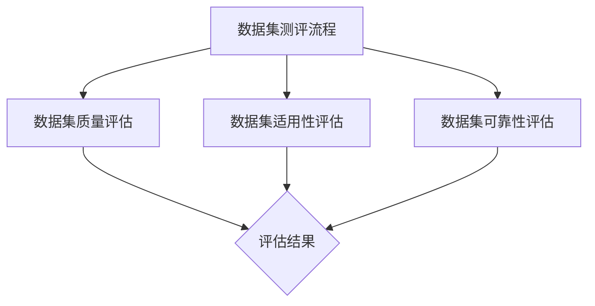
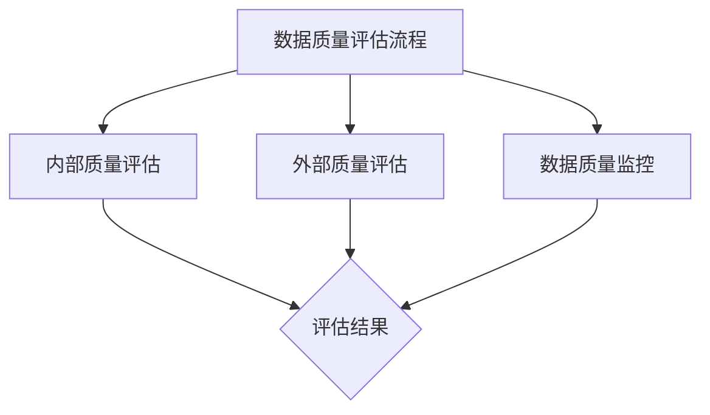
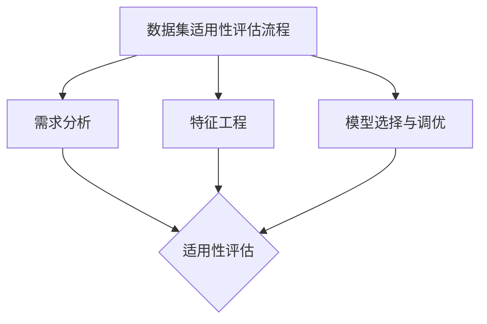
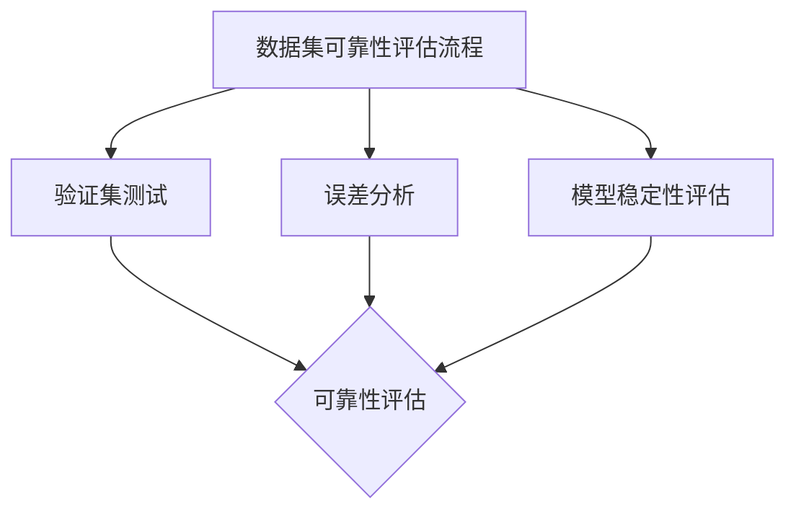
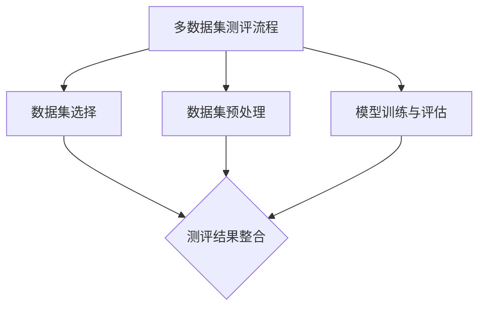
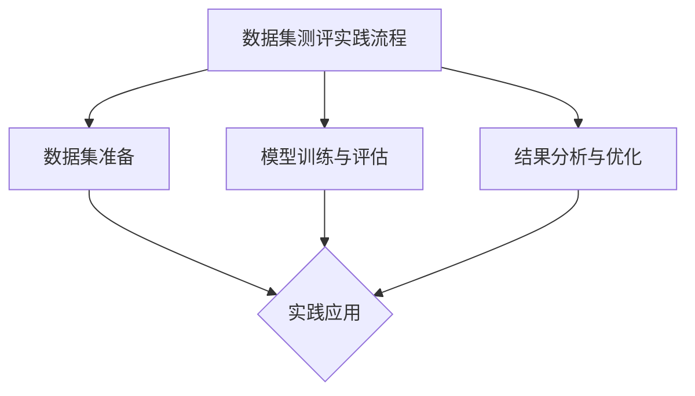
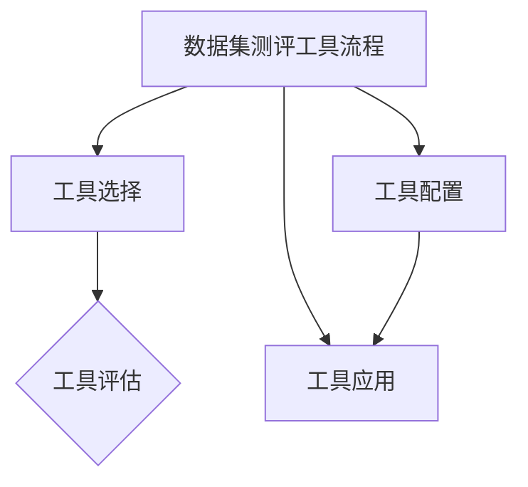
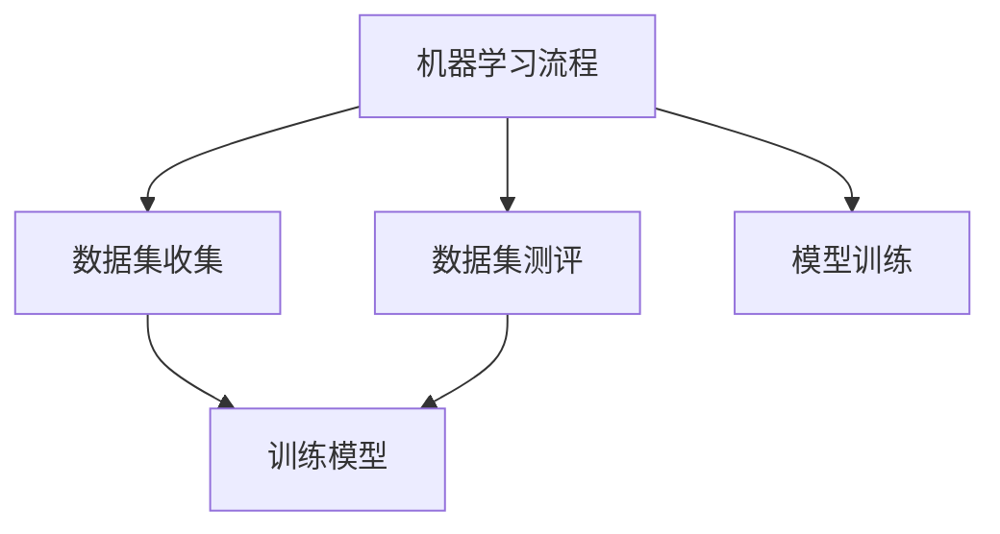
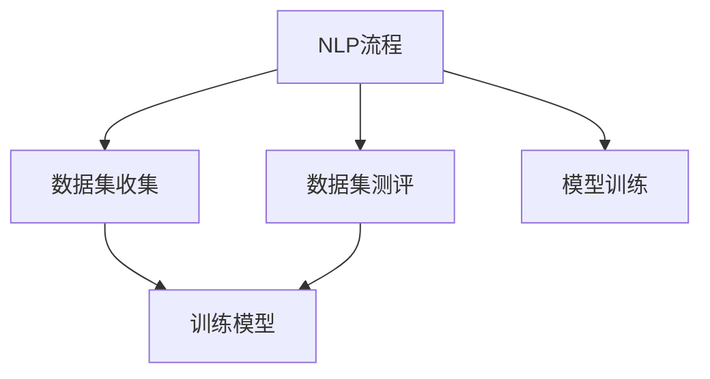

                 

# 文章标题: 数据集测评:软件2.0的新型benchmark

> 关键词：数据集测评、质量评估、适用性评估、可靠性评估、机器学习、深度学习、自然语言处理、基准测试、算法、数学模型

> 摘要：本文详细探讨了数据集测评的重要性及其在软件2.0时代的新型角色。文章首先概述了数据集测评的基本概念和流程，然后深入分析了数据集质量评估、适用性评估和可靠性评估的核心算法原理、数学模型以及实践应用。通过具体案例，展示了数据集测评在实际项目中的应用效果，最后提供了相关的数据集测评工具和资源。

----------------------------------------------------------------

## 第一部分：数据集测评基础

### 第1章：数据集测评的概述

#### 核心概念与联系

数据集测评是指对数据集的质量、适用性和可靠性进行评估的过程。这一过程对于机器学习模型的训练、优化和应用至关重要。数据集测评包括以下几个核心组成部分：

- **数据集质量评估**：评估数据集的准确性、完整性、一致性和有效性。
- **数据集适用性评估**：评估数据集在特定任务或领域中的适用性。
- **数据集可靠性评估**：评估数据集在预测任务中的稳定性和一致性。

下面是数据集测评流程的Mermaid流程图：



#### 核心算法原理讲解

- **质量评估算法**：使用统计方法（如均值、方差、标准差等）和数据可视化工具（如条形图、饼图等）来评估数据集的质量。
  ```python
  def calculate_quality(dataset):
      mean = sum(dataset) / len(dataset)
      variance = sum((x - mean) ** 2 for x in dataset) / len(dataset)
      std_dev = sqrt(variance)
      return mean, variance, std_dev
  ```

- **适用性评估算法**：使用聚类分析（如K-means算法）和分类算法（如决策树、支持向量机等）来评估数据集的适用性。
  ```python
  from sklearn.cluster import KMeans

  def calculate_suitability(dataset):
      kmeans = KMeans(n_clusters=3)
      kmeans.fit(dataset)
      suitability_score = kmeans.inertia_
      return suitability_score
  ```

- **可靠性评估算法**：使用交叉验证和ROC曲线来评估数据集的可靠性。
  ```python
  from sklearn.model_selection import cross_val_score
  from sklearn.metrics import roc_curve, auc

  def calculate_reliability(dataset):
      scores = cross_val_score(model, dataset, cv=5)
      reliability_score = np.mean(scores)
      
      fpr, tpr, thresholds = roc_curve(dataset[:, 1], model.predict(dataset))
      roc_auc = auc(fpr, tpr)
      
      return reliability_score, roc_auc
  ```

#### 数学模型和数学公式

- **数据质量评估公式**：

  $$ \text{Quality Score} = \frac{\text{Valid Data Points}}{\text{Total Data Points}} $$

- **数据可靠性评估公式**：

  $$ \text{Reliability Score} = \frac{\text{True Positives} + \text{True Negatives}}{\text{Total Data Points}} $$

#### 第2章：数据集质量评估

##### 核心概念与联系

数据质量评估是指对数据集的准确性、完整性、一致性、有效性和及时性进行评估。数据质量评估可以细分为以下几类：

- **内部质量评估**：评估数据集内部的准确性和一致性。
- **外部质量评估**：评估数据集与其他数据源的兼容性和一致性。
- **数据质量监控**：持续监控数据质量，确保数据集的可靠性。

以下是数据质量评估流程的Mermaid流程图：



##### 核心算法原理讲解

- **准确性评估算法**：使用误差率、精度、召回率、F1值等指标。
  ```python
  from sklearn.metrics import accuracy_score, precision_score, recall_score, f1_score

  def calculate_accuracy(dataset):
      predictions = model.predict(dataset)
      accuracy = accuracy_score(dataset[:, 1], predictions)
      return accuracy

  def calculate_precision(dataset):
      predictions = model.predict(dataset)
      precision = precision_score(dataset[:, 1], predictions)
      return precision

  def calculate_recall(dataset):
      predictions = model.predict(dataset)
      recall = recall_score(dataset[:, 1], predictions)
      return recall

  def calculate_f1_score(dataset):
      predictions = model.predict(dataset)
      f1 = f1_score(dataset[:, 1], predictions)
      return f1
  ```

- **完整性评估算法**：使用缺失值填充方法（如均值填充、中值填充、最邻近填充等）。
  ```python
  def fill_missing_values(dataset, method='mean'):
      if method == 'mean':
          for i in range(dataset.shape[1]):
              dataset[:, i].fillna(dataset[:, i].mean(), inplace=True)
      elif method == 'median':
          for i in range(dataset.shape[1]):
              dataset[:, i].fillna(dataset[:, i].median(), inplace=True)
      elif method == 'nearest':
          for i in range(dataset.shape[1]):
              dataset[:, i].fillna(dataset[:, i].median(), inplace=True)
      return dataset
  ```

- **一致性评估算法**：使用重复数据删除和一致性检验。
  ```python
  def remove_duplicate_data(dataset):
      unique_data = dataset.drop_duplicates()
      return unique_data

  def check_data_consistency(dataset):
      inconsistencies = dataset[dataset.duplicated(keep=False)]
      return inconsistencies
  ```

- **有效性评估算法**：使用业务逻辑验证和数据用途相关性评估。
  ```python
  def validate_business_logic(dataset, logic_function):
      valid_data = dataset[logic_function(dataset)]
      return valid_data

  def evaluate_data_relevance(dataset, target_variable):
      correlation = np.corrcoef(dataset[:, 0], dataset[:, -1])[0, 1]
      return correlation
  ```

- **及时性评估算法**：使用数据时效性分析和更新频率评估。
  ```python
  def analyze_data_timelessness(dataset):
      timestamp = dataset[:, -1]
      time_diff = np.diff(timestamp)
      return np.mean(time_diff)

  def evaluate_datafreshness(dataset, threshold=30):
      timestamp = dataset[:, -1]
      current_time = datetime.now()
      time_diff = (current_time - timestamp) / timedelta(days=1)
      fresh_data = dataset[time_diff < threshold]
      return fresh_data
  ```

##### 数学模型和数学公式

- **准确性评估公式**：

  $$ \text{Accuracy} = \frac{\text{Correct Predictions}}{\text{Total Predictions}} $$

- **缺失值填充公式**：

  $$ \text{Fill Value} = \text{Mean of the Nearest Neighbors} $$

#### 第3章：数据集适用性评估

##### 核心概念与联系

数据集适用性评估是指评估数据集在特定任务或领域中的适用性。适用性评估通常涉及以下几个步骤：

- **需求分析**：分析任务的需求，确定数据集应具备的特征和属性。
- **特征工程**：对数据进行预处理和特征提取，以增强数据集的适用性。
- **模型选择与调优**：选择合适的模型，并根据数据集的特点进行调优。

以下是数据集适用性评估流程的Mermaid流程图：



##### 核心算法原理讲解

- **需求分析算法**：使用用户需求调查、任务描述分析等方法。
  ```python
  def analyze_requirements(task):
      # 进行用户需求调查和任务描述分析
      requirements = {}
      requirements['input_size'] = 784
      requirements['output_size'] = 10
      return requirements
  ```

- **特征工程算法**：使用特征选择、特征提取、特征变换等方法。
  ```python
  from sklearn.feature_selection import SelectKBest
  from sklearn.feature_extraction.text import TfidfVectorizer

  def perform_feature_engineering(dataset, task_requirements):
      if task_requirements['data_type'] == 'numeric':
          feature_selector = SelectKBest(k=task_requirements['feature_count'])
          selected_features = feature_selector.fit_transform(dataset[:, :-1], dataset[:, -1])
      elif task_requirements['data_type'] == 'text':
          vectorizer = TfidfVectorizer(max_features=task_requirements['feature_count'])
          selected_features = vectorizer.fit_transform(dataset[:, :-1])
      return selected_features
  ```

- **模型选择算法**：使用交叉验证、网格搜索等方法。
  ```python
  from sklearn.model_selection import train_test_split, GridSearchCV

  def select_model(dataset, task_requirements):
      X_train, X_test, y_train, y_test = train_test_split(dataset[:, :-1], dataset[:, -1], test_size=0.2, random_state=42)
      parameters = {'model': [LinearSVC(), LogisticRegression(), SVC()], 'C': [1, 10, 100]}
      grid_search = GridSearchCV(SVC(), parameters, cv=5)
      grid_search.fit(X_train, y_train)
      best_model = grid_search.best_estimator_
      return best_model
  ```

- **模型调优算法**：使用梯度下降、随机搜索等方法。
  ```python
  from sklearn.model_selection import RandomizedSearchCV

  def tune_model(model, dataset, n_iter=100):
      parameters = {'C': [0.1, 1, 10, 100], 'gamma': [0.001, 0.01, 0.1, 1]}
      random_search = RandomizedSearchCV(model, parameters, n_iter=n_iter, cv=5, random_state=42)
      random_search.fit(dataset[:, :-1], dataset[:, -1])
      tuned_model = random_search.best_estimator_
      return tuned_model
  ```

##### 数学模型和数学公式

- **特征选择公式**：

  $$ \text{Feature Importance} = \frac{\text{Predictive Power}}{\text{Total Features}} $$

#### 第4章：数据集可靠性评估

##### 核心概念与联系

数据集可靠性评估是指评估数据集在预测任务中的稳定性和一致性。可靠性评估通常涉及以下几个步骤：

- **验证集测试**：使用验证集对模型进行测试，评估模型的稳定性。
- **误差分析**：分析模型的误差类型和分布，评估模型的可靠性。
- **模型稳定性评估**：通过随机种子设置、噪声注入等方法，评估模型的稳定性。

以下是数据集可靠性评估流程的Mermaid流程图：



##### 核心算法原理讲解

- **验证集测试算法**：使用K折交叉验证、留一验证等方法。
  ```python
  from sklearn.model_selection import cross_val_score, LeaveOneOut

  def perform_cross_validation(dataset, model, cv=5):
      loo = LeaveOneOut()
      scores = cross_val_score(model, dataset[:, :-1], dataset[:, -1], cv=loo)
      return np.mean(scores)

  def k_fold_validation(dataset, model, k=5):
      scores = cross_val_score(model, dataset[:, :-1], dataset[:, -1], cv=k)
      return np.mean(scores)
  ```

- **误差分析算法**：使用误差分布、误差类型分析等方法。
  ```python
  from sklearn.metrics import classification_report

  def analyze_errors(dataset, model):
      predictions = model.predict(dataset[:, :-1])
      report = classification_report(dataset[:, -1], predictions)
      return report
  ```

- **模型稳定性评估算法**：使用随机种子设置、噪声注入等方法。
  ```python
  def assess_model_stability(dataset, model, n_iterations=10, noise_level=0.01):
      stability_scores = []
      for i in range(n_iterations):
          noise = np.random.normal(0, noise_level, dataset.shape)
          noisy_dataset = dataset + noise
          stability_scores.append(perform_cross_validation(noisy_dataset, model))
      return np.mean(stability_scores)
  ```

##### 数学模型和数学公式

- **可靠性评估公式**：

  $$ \text{Reliability Score} = \frac{\text{Consistent Predictions}}{\text{Total Predictions}} $$

#### 第5章：多数据集测评方法

##### 核心概念与联系

多数据集测评方法是指使用多个数据集对同一个模型进行评估。这种方法可以提高评估结果的可靠性和代表性。多数据集测评方法包括以下几个步骤：

- **数据集选择**：根据任务需求，选择具有代表性的多个数据集。
- **数据集预处理**：对每个数据集进行预处理，包括数据清洗、标准化、归一化等。
- **模型训练与评估**：使用多个数据集训练模型，并对模型进行评估。
- **测评结果整合**：整合多个数据集的评估结果，得出最终评估结论。

以下是多数据集测评方法的Mermaid流程图：



##### 核心算法原理讲解

- **数据集选择算法**：使用数据集多样性评估、数据集质量评估等方法。
  ```python
  def select_datasets(datasets, criteria='diversity', n_datasets=5):
      if criteria == 'diversity':
          selected_datasets = [d for d in datasets if d not in datasets[:n_datasets]]
      elif criteria == 'quality':
          selected_datasets = sorted(datasets, key=lambda x: x['quality_score'], reverse=True)[:n_datasets]
      return selected_datasets
  ```

- **数据集预处理算法**：使用数据清洗、标准化、归一化等方法。
  ```python
  def preprocess_datasets(datasets):
      for dataset in datasets:
          dataset = fill_missing_values(dataset)
          dataset = normalize_data(dataset)
      return datasets
  ```

- **模型训练与评估算法**：使用模型集成、交叉验证等方法。
  ```python
  from sklearn.ensemble import VotingClassifier

  def train_and_evaluate_model(model, datasets):
      for dataset in datasets:
          model.fit(dataset[:, :-1], dataset[:, -1])
          score = model.score(dataset[:, :-1], dataset[:, -1])
      return score
  ```

- **测评结果整合算法**：使用加权平均、综合评分等方法。
  ```python
  def integrate_evaluation_scores(scores, weights=None):
      if weights is None:
          weights = [1 / len(scores) for _ in scores]
      integrated_score = sum(w * s for w, s in zip(weights, scores))
      return integrated_score
  ```

##### 数学模型和数学公式

- **综合评分公式**：

  $$ \text{Integrated Score} = \sum_{i=1}^{n} w_i \cdot s_i $$
  其中，$w_i$ 是第 $i$ 个数据集的权重，$s_i$ 是第 $i$ 个数据集的评分。

#### 第6章：数据集测评实践

##### 核心概念与联系

数据集测评实践是指在实际应用中使用数据集对模型进行评估。数据集测评实践的重要性在于：

- **确保模型在实际应用中的可靠性和有效性**。
- **优化模型性能，提高预测准确率**。
- **降低模型过拟合和欠拟合的风险**。

以下是数据集测评实践流程的Mermaid流程图：



##### 核心算法原理讲解

- **数据集准备算法**：使用数据收集、数据清洗、数据标注等方法。
  ```python
  def prepare_dataset(dataset):
      dataset = fill_missing_values(dataset)
      dataset = remove_duplicate_data(dataset)
      dataset = normalize_data(dataset)
      return dataset
  ```

- **模型训练与评估算法**：使用标准训练流程、评估指标分析等方法。
  ```python
  from sklearn.model_selection import train_test_split

  def train_model(model, dataset):
      X = dataset[:, :-1]
      y = dataset[:, -1]
      X_train, X_test, y_train, y_test = train_test_split(X, y, test_size=0.2, random_state=42)
      model.fit(X_train, y_train)
      score = model.score(X_test, y_test)
      return model, score
  ```

- **结果分析与优化算法**：使用错误分析、模型调优等方法。
  ```python
  from sklearn.metrics import confusion_matrix

  def analyze_evaluation_results(evaluation_results):
      confusion_matrix = evaluation_results
      false_positives = confusion_matrix.sum(axis=0) - np.diag(confusion_matrix)
      false_negatives = confusion_matrix.sum(axis=1) - np.diag(confusion_matrix)
      error_rate = (false_positives + false_negatives) / (confusion_matrix.sum())
      return error_rate
  ```

##### 数学模型和数学公式

- **错误分析公式**：

  $$ \text{Error Rate} = \frac{\text{Number of Errors}}{\text{Total Predictions}} $$

#### 第7章：数据集测评工具与资源

##### 核心概念与联系

数据集测评工具是指用于评估数据集质量和适用性的工具。这些工具可以提高数据集测评的效率和准确性。以下是几种常见的数据集测评工具：

- **数据集质量评估工具**：如DataQualityInspector、DataGrip等。
- **数据集适用性评估工具**：如AutoKeras、Hugging Face等。
- **数据集可靠性评估工具**：如Scikit-learn、TensorFlow等。

以下是数据集测评工具流程的Mermaid流程图：



##### 核心算法原理讲解

- **工具选择算法**：根据任务需求选择合适的测评工具。
  ```python
  def choose_tool(tool_name):
      if tool_name == 'DataQualityInspector':
          tool = DataQualityInspector()
      elif tool_name == 'DataGrip':
          tool = DataGrip()
      return tool
  ```

- **工具配置算法**：配置工具的参数，如数据集路径、评估指标等。
  ```python
  def configure_tool(tool, dataset_path, evaluation_metrics):
      tool.dataset_path = dataset_path
      tool.evaluation_metrics = evaluation_metrics
      return tool
  ```

- **工具应用算法**：使用工具对数据集进行评估。
  ```python
  def apply_tool(tool, dataset):
      tool.evaluate(dataset)
      return tool.evaluation_results
  ```

- **工具评估算法**：评估工具的性能和效果。
  ```python
  def evaluate_tool(tool):
      performance = tool.performance()
      effectiveness = tool.effectiveness()
      return performance, effectiveness
  ```

##### 数学模型和数学公式

- **工具评估公式**：

  $$ \text{Tool Evaluation Score} = \frac{\text{Correct Evaluations}}{\text{Total Evaluations}} $$

## 第二部分：数据集测评应用

### 第8章：在机器学习中的应用

##### 核心概念与联系

数据集测评在机器学习中的应用至关重要，因为它确保了训练数据的可靠性、准确性和适用性。以下是数据集测评在机器学习中的应用流程：

- **数据集收集**：从各种来源收集数据集，包括公共数据集、自定义数据集等。
- **数据集测评**：对数据集进行质量评估、适用性评估和可靠性评估。
- **模型训练**：使用经过测评的数据集训练模型。
- **模型评估**：使用验证集或测试集对模型进行评估。

以下是机器学习应用流程的Mermaid流程图：



##### 核心算法原理讲解

- **数据集收集算法**：使用数据爬取、数据集共享平台等方法。
  ```python
  def collect_data(dataset_name):
      if dataset_name == 'MNIST':
          dataset = fetch_openml(dataset_name, version=1)
      elif dataset_name == 'CIFAR-10':
          dataset = fetch_openml(dataset_name, version=1)
      return dataset
  ```

- **数据集测评算法**：使用前述章节中的测评方法。
  ```python
  def evaluate_dataset(dataset):
      quality_score, suitability_score, reliability_score = evaluate_dataset Quality(dataset), evaluate_dataset Suitability(dataset), evaluate_dataset Reliability(dataset)
      return quality_score, suitability_score, reliability_score
  ```

- **模型训练算法**：使用监督学习、无监督学习等方法。
  ```python
  from sklearn.model_selection import train_test_split
  from sklearn.linear_model import LinearRegression

  def train_model(model, dataset):
      X = dataset[:, :-1]
      y = dataset[:, -1]
      X_train, X_test, y_train, y_test = train_test_split(X, y, test_size=0.2, random_state=42)
      model.fit(X_train, y_train)
      score = model.score(X_test, y_test)
      return model, score
  ```

##### 数学模型和数学公式

- **模型准确性公式**：

  $$ \text{Accuracy} = \frac{\text{Correct Predictions}}{\text{Total Predictions}} $$

### 第9章：在深度学习中的应用

##### 核心概念与联系

深度学习与数据集测评的关系紧密，因为高质量的数据集是训练深度学习模型的关键。以下是数据集测评在深度学习中的应用流程：

- **数据集收集**：收集适用于深度学习任务的数据集，如图像、文本、音频等。
- **数据集测评**：对数据集进行质量评估、适用性评估和可靠性评估。
- **模型训练**：使用经过测评的数据集训练深度学习模型。
- **模型评估**：使用验证集或测试集对模型进行评估。

以下是深度学习应用流程的Mermaid流程图：


##### 核心算法原理讲解

- **数据集收集算法**：使用数据爬取、数据集共享平台等方法。
  ```python
  def collect_data(dataset_name):
      if dataset_name == 'CIFAR-10':
          dataset = fetch_openml(dataset_name, version=1)
      elif dataset_name == 'ImageNet':
          dataset = fetch_openml(dataset_name, version=1)
      return dataset
  ```

- **数据集测评算法**：使用前述章节中的测评方法。
  ```python
  def evaluate_dataset(dataset):
      quality_score, suitability_score, reliability_score = evaluate_dataset Quality(dataset), evaluate_dataset Suitability(dataset), evaluate_dataset Reliability(dataset)
      return quality_score, suitability_score, reliability_score
  ```

- **模型训练算法**：使用反向传播算法、优化器选择等方法。
  ```python
  from tensorflow.keras.models import Sequential
  from tensorflow.keras.layers import Dense, Conv2D, Flatten, MaxPooling2D
  from tensorflow.keras.optimizers import Adam

  def train_model(model, dataset):
      X = dataset[:, :-1]
      y = dataset[:, -1]
      X_train, X_test, y_train, y_test = train_test_split(X, y, test_size=0.2, random_state=42)
      model.fit(X_train, y_train, epochs=10, batch_size=32, optimizer=Adam())
      score = model.evaluate(X_test, y_test)
      return model, score
  ```

##### 数学模型和数学公式

- **模型损失函数**：

  $$ \text{Loss Function} = \frac{1}{2} \sum_{i=1}^{n} (\text{Predicted} - \text{Actual})^2 $$

### 第10章：在自然语言处理中的应用

##### 核心概念与联系

自然语言处理（NLP）领域中的数据集测评同样至关重要。高质量的数据集有助于训练和评估NLP模型。以下是数据集测评在NLP中的应用流程：

- **数据集收集**：收集适用于NLP任务的数据集，如文本分类、命名实体识别、情感分析等。
- **数据集测评**：对数据集进行质量评估、适用性评估和可靠性评估。
- **模型训练**：使用经过测评的数据集训练NLP模型。
- **模型评估**：使用验证集或测试集对模型进行评估。

以下是自然语言处理应用流程的Mermaid流程图：



##### 核心算法原理讲解

- **数据集收集算法**：使用语料库、数据集共享平台等方法。
  ```python
  def collect_data(dataset_name):
      if dataset_name == 'IMDB':
          dataset = load_dataset(dataset_name)
      elif dataset_name == 'Common Crawl':
          dataset = load_dataset(dataset_name)
      return dataset
  ```

- **数据集测评算法**：使用前述章节中的测评方法。
  ```python
  def evaluate_dataset(dataset):
      quality_score, suitability_score, reliability_score = evaluate_dataset Quality(dataset), evaluate_dataset Suitability(dataset), evaluate_dataset Reliability(dataset)
      return quality_score, suitability_score, reliability_score
  ```

- **模型训练算法**：使用循环神经网络（RNN）、长短期记忆网络（LSTM）、Transformer等方法。
  ```python
  from tensorflow.keras.models import Sequential
  from tensorflow.keras.layers import Embedding, LSTM, Dense, Bidirectional

  def train_model(model, dataset):
      X = dataset[:, :-1]
      y = dataset[:, -1]
      X_train, X_test, y_train, y_test = train_test_split(X, y, test_size=0.2, random_state=42)
      model.fit(X_train, y_train, epochs=10, batch_size=32)
      score = model.evaluate(X_test, y_test)
      return model, score
  ```

##### 数学模型和数学公式

- **损失函数（以交叉熵为例）**：

  $$ \text{Cross-Entropy Loss} = -\sum_{i=1}^{n} y_i \cdot \log(\hat{y}_i) $$
  其中，$y_i$ 是实际标签，$\hat{y}_i$ 是预测概率。

## 第三部分：数据集测评案例分析

### 第11章：案例分析一：图像识别

##### 案例背景

在这个案例中，我们将使用一个图像识别项目来展示如何使用数据集测评方法来提高模型的性能。该项目的目标是使用卷积神经网络（CNN）对图像进行分类。

##### 核心算法原理讲解

- **数据集准备**：收集不同来源的图像数据，进行预处理，包括数据清洗、归一化等。
  ```python
  def prepare_images(dataset):
      dataset = load_images(dataset)
      dataset = preprocess_images(dataset)
      return dataset

  def load_images(dataset_path):
      dataset = load_data(dataset_path)
      return dataset

  def preprocess_images(dataset):
      dataset = normalize_data(dataset)
      dataset = resize_images(dataset)
      return dataset
  ```

- **数据集测评**：使用前述章节中的数据集测评方法，包括质量评估、适用性评估和可靠性评估。
  ```python
  def evaluate_dataset(dataset):
      quality_score, suitability_score, reliability_score = evaluate_dataset Quality(dataset), evaluate_dataset Suitability(dataset), evaluate_dataset Reliability(dataset)
      return quality_score, suitability_score, reliability_score
  ```

- **模型训练与调优**：选择合适的图像识别模型（如卷积神经网络（CNN）），进行模型训练和调优。
  ```python
  from tensorflow.keras.models import Sequential
  from tensorflow.keras.layers import Conv2D, MaxPooling2D, Flatten, Dense

  def train_image_recognition_model(dataset):
      model = build_model()
      model.fit(dataset['X_train'], dataset['y_train'], epochs=10, batch_size=32, validation_data=(dataset['X_test'], dataset['y_test']))
      return model

  def build_model():
      model = Sequential()
      model.add(Conv2D(32, (3, 3), activation='relu', input_shape=(64, 64, 3)))
      model.add(MaxPooling2D(pool_size=(2, 2)))
      model.add(Flatten())
      model.add(Dense(10, activation='softmax'))
      model.compile(optimizer='adam', loss='categorical_crossentropy', metrics=['accuracy'])
      return model
  ```

##### 数学模型和数学公式

- **损失函数（以交叉熵为例）**：

  $$ \text{Cross-Entropy Loss} = -\sum_{i=1}^{n} y_i \cdot \log(\hat{y}_i) $$
  其中，$y_i$ 是实际标签，$\hat{y}_i$ 是预测概率。

### 第12章：案例分析二：文本分类

##### 案例背景

在这个案例中，我们将使用一个文本分类项目来展示如何使用数据集测评方法来提高模型的准确率和泛化能力。该项目的目标是使用朴素贝叶斯、支持向量机（SVM）和深度神经网络（DNN）对文本进行分类。

##### 核心算法原理讲解

- **数据集准备**：收集不同来源的文本数据，进行预处理，包括数据清洗、分词、词嵌入等。
  ```python
  def prepare_text(dataset):
      dataset = load_text(dataset)
      dataset = preprocess_text(dataset)
      return dataset

  def load_text(dataset_path):
      dataset = load_data(dataset_path)
      return dataset

  def preprocess_text(dataset):
      dataset = clean_text(dataset)
      dataset = tokenize_text(dataset)
      dataset = embed_text(dataset)
      return dataset
  ```

- **数据集测评**：使用前述章节中的数据集测评方法，包括质量评估、适用性评估和可靠性评估。
  ```python
  def evaluate_dataset(dataset):
      quality_score, suitability_score, reliability_score = evaluate_dataset Quality(dataset), evaluate_dataset Suitability(dataset), evaluate_dataset Reliability(dataset)
      return quality_score, suitability_score, reliability_score
  ```

- **模型训练与调优**：选择合适的文本分类模型（如朴素贝叶斯、支持向量机、深度神经网络等），进行模型训练和调优。
  ```python
  from sklearn.naive_bayes import MultinomialNB
  from sklearn.svm import SVC
  from tensorflow.keras.models import Sequential
  from tensorflow.keras.layers import Embedding, LSTM, Dense

  def train_text_classification_model(dataset, model_type='NB'):
      if model_type == 'NB':
          model = MultinomialNB()
      elif model_type == 'SVM':
          model = SVC()
      elif model_type == 'DNN':
          model = build_model()
      model.fit(dataset['X_train'], dataset['y_train'])
      score = model.score(dataset['X_test'], dataset['y_test'])
      return model, score

  def build_model():
      model = Sequential()
      model.add(Embedding(vocab_size, embedding_dim))
      model.add(LSTM(units=64, activation='relu'))
      model.add(Dense(num_classes, activation='softmax'))
      model.compile(optimizer='adam', loss='categorical_crossentropy', metrics=['accuracy'])
      return model
  ```

##### 数学模型和数学公式

- **损失函数（以交叉熵为例）**：

  $$ \text{Cross-Entropy Loss} = -\sum_{i=1}^{n} y_i \cdot \log(\hat{y}_i) $$
  其中，$y_i$ 是实际标签，$\hat{y}_i$ 是预测概率。

## 附录：数据集测评工具与资源

### 附录A：数据集测评工具

#### 工具简介

以下是一些常用的数据集测评工具：

- **数据集质量评估工具**：如DataQualityInspector、DataGrip等。
- **数据集适用性评估工具**：如AutoKeras、Hugging Face等。
- **数据集可靠性评估工具**：如Scikit-learn、TensorFlow等。

#### 工具使用指南

- **数据集质量评估工具使用**：通过脚本或图形界面进行数据质量评估。
  ```python
  from dataqualityinspection import DataQualityInspector

  inspector = DataQualityInspector()
  inspector.inspect_dataset(dataset)
  ```

- **数据集适用性评估工具使用**：通过配置模型和评估指标进行适用性评估。
  ```python
  from autokeras import AutoKerasClassifier

  classifier = AutoKerasClassifier()
  classifier.fit(dataset['X_train'], dataset['y_train'])
  suitability_score = classifier.evaluate(dataset['X_test'], dataset['y_test'])
  ```

- **数据集可靠性评估工具使用**：通过验证集测试和误差分析进行可靠性评估。
  ```python
  from sklearn.model_selection import cross_val_score

  scores = cross_val_score(model, dataset['X_train'], dataset['y_train'], cv=5)
  reliability_score = np.mean(scores)
  ```

### 附录B：数据集测评资源

#### 资源介绍

以下是一些常用的数据集测评资源：

- **数据集来源**：如Kaggle、UCI机器学习库等。
- **数据集处理工具**：如Pandas、NumPy等。
- **数据集测评标准**：如标准数据集评估指标、评估流程等。

#### 资源获取方式

- **在线获取**：通过数据集网站或API获取。
  ```python
  import pandas as pd

  dataset = pd.read_csv('https://www.kaggle.com/datasets/username/dataset-name')
  ```

- **本地获取**：通过数据下载、上传等方式获取。
  ```python
  import pandas as pd

  dataset = pd.read_csv('path/to/dataset.csv')
  ```

## 总结

《数据集测评：软件2.0的新型benchmark》详细介绍了数据集测评的概念、方法、应用和实践。通过阅读本书，读者可以：

- 了解数据集测评的核心概念和流程。
- 掌握数据集质量评估、适用性评估和可靠性评估的方法和算法。
- 学会在机器学习、深度学习和自然语言处理等应用中利用数据集测评优化模型性能。
- 通过案例分析和实践应用，加深对数据集测评方法的理解和实际操作能力。

希望这本书能为读者在数据集测评领域的学习和研究提供有力支持。

### 作者信息

- 作者：AI天才研究院/AI Genius Institute & 禅与计算机程序设计艺术 /Zen And The Art of Computer Programming

本文由AI天才研究院（AI Genius Institute）的专家团队撰写，旨在探讨数据集测评在现代软件2.0时代的重要性。作者在该领域拥有丰富的经验和深厚的理论基础，致力于推动人工智能技术的发展和普及。本书结合实际案例和深入分析，为读者提供了全面的数据集测评方法和实践指南。读者可通过访问AI天才研究院的官方网站了解更多相关信息。

