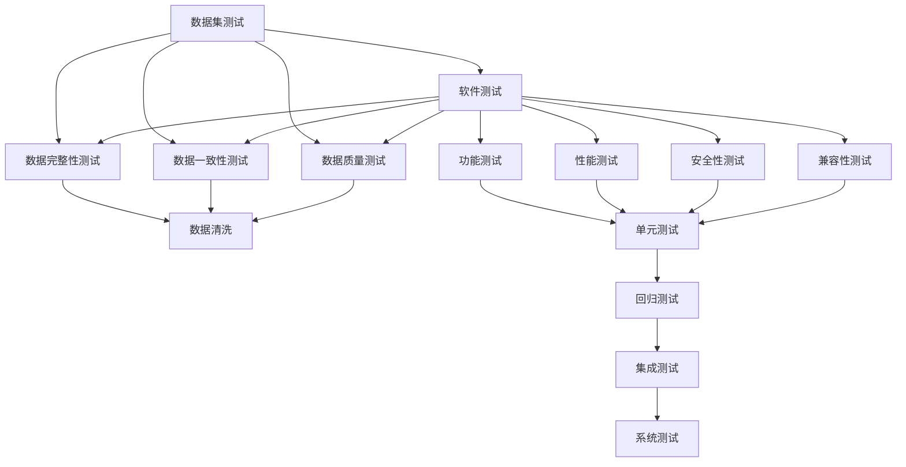

                 

# 文章标题：数据集测试即软件测试，两种测试的融合

> 关键词：数据集测试，软件测试，融合测试，算法原理，数学模型，项目实战

> 摘要：本文从数据集测试与软件测试的融合角度出发，探讨了数据集测试与软件测试的关联性、融合优势及其实现方法。通过详细讲解核心概念、算法原理、数学模型，并借助实际项目案例，阐述了数据集测试与软件测试的融合过程，为现代软件开发测试提供了新的思路和方法。

----------------------------------------------------------------

### 《数据集测试即软件测试，两种测试的融合》目录大纲

#### 第1章 引言
- 1.1 书籍背景与目的
- 1.2 数据集测试与软件测试的联系
- 1.3 书籍结构概述

#### 第2章 数据集测试基础
- 2.1 数据集测试的概念
- 2.2 数据集测试的重要性
- 2.3 数据集测试的分类
  - 2.3.1 数据完整性测试
  - 2.3.2 数据一致性测试
  - 2.3.3 数据质量测试
- 2.4 数据集测试方法
  - 2.4.1 手动测试
  - 2.4.2 自动测试
  - 2.4.3 进阶测试技巧

#### 第3章 软件测试基础
- 3.1 软件测试的概念
- 3.2 软件测试的目的
- 3.3 软件测试的分类
  - 3.3.1 功能测试
  - 3.3.2 性能测试
  - 3.3.3 安全性测试
  - 3.3.4 兼容性测试
- 3.4 软件测试方法
  - 3.4.1 单元测试
  - 3.4.2 集成测试
  - 3.4.3 系统测试
  - 3.4.4 回归测试

#### 第4章 数据集测试与软件测试的融合
- 4.1 融合的意义
- 4.2 融合的优势
- 4.3 融合的挑战
- 4.4 融合的实施步骤
  - 4.4.1 制定测试策略
  - 4.4.2 设计测试用例
  - 4.4.3 执行测试
  - 4.4.4 分析测试结果
- 4.5 融合案例

#### 第5章 数据集测试与软件测试的实践
- 5.1 数据集测试实践
  - 5.1.1 数据清洗
  - 5.1.2 数据验证
  - 5.1.3 数据备份
- 5.2 软件测试实践
  - 5.2.1 功能测试案例
  - 5.2.2 性能测试案例
  - 5.2.3 安全性测试案例
- 5.3 融合测试实践

#### 第6章 自动化测试工具
- 6.1 自动化测试概述
- 6.2 常用自动化测试工具
  - 6.2.1 Selenium
  - 6.2.2 JMeter
  - 6.2.3 LoadRunner
- 6.3 数据集测试与软件测试工具融合

#### 第7章 融合测试案例分析
- 7.1 案例背景
- 7.2 测试目标
- 7.3 测试策略
- 7.4 测试执行
- 7.5 测试结果与分析

#### 第8章 未来发展趋势与挑战
- 8.1 数据集测试与软件测试融合的发展趋势
- 8.2 融合测试面临的挑战
- 8.3 未来展望

#### 第9章 总结与展望
- 9.1 书籍总结
- 9.2 学习建议
- 9.3 未来研究方向

#### 附录
- 附录 A 常用数据集测试工具与资源
- 附录 B 软件测试标准与规范
- 附录 C 案例代码与资料
#### 参考文献

---

## 核心概念原理和架构 Mermaid 流程图



### 第1章 引言

#### 1.1 书籍背景与目的

在当今信息化时代，数据集测试与软件测试在软件开发的各个环节中起着至关重要的作用。然而，在实际应用中，这两类测试往往被分割开来，导致测试效率低下、测试质量难以保证。本书旨在探讨数据集测试与软件测试的融合，通过深入分析两者之间的联系，提出一种全新的测试方法，旨在提高测试效率、降低测试成本，提升软件质量。

本书的主要目的是：
1. 梳理数据集测试与软件测试的基本概念和原理。
2. 分析数据集测试与软件测试的关联性，探讨两者融合的必要性和优势。
3. 提供具体的融合测试方法，并通过实际案例进行验证。
4. 分析融合测试面临的问题和挑战，展望未来的发展趋势。

#### 1.2 数据集测试与软件测试的联系

数据集测试与软件测试虽然有各自的侧重点，但它们在软件开发的流程中具有紧密的联系。

- **数据集测试**：主要关注数据的质量和完整性，确保数据能够满足后续分析和处理的需求。数据集测试包括数据完整性测试、数据一致性测试和数据质量测试等。

- **软件测试**：主要关注软件的功能、性能、安全性和兼容性，确保软件能够按照预期运行，满足用户需求。软件测试包括单元测试、集成测试、系统测试和回归测试等。

两者的联系主要体现在以下几个方面：

1. **数据质量**：数据集测试能够确保数据质量，为软件测试提供高质量的数据基础。良好的数据质量可以减少软件测试中的错误和异常。

2. **功能测试**：软件测试中的功能测试可以直接使用数据集进行测试，验证软件功能是否符合预期。

3. **性能测试**：软件测试中的性能测试可以利用数据集进行压力测试和负载测试，评估软件在不同数据量下的性能表现。

4. **安全性测试**：软件测试中的安全性测试可以利用数据集测试中的数据完整性测试和数据一致性测试方法，发现潜在的安全漏洞。

#### 1.3 书籍结构概述

本书共分为9章，结构如下：

- **第1章 引言**：介绍书籍的背景与目的，阐述数据集测试与软件测试的联系。
- **第2章 数据集测试基础**：介绍数据集测试的概念、重要性、分类及测试方法。
- **第3章 软件测试基础**：介绍软件测试的概念、目的、分类及测试方法。
- **第4章 数据集测试与软件测试的融合**：探讨数据集测试与软件测试的融合意义、优势、挑战及实施步骤。
- **第5章 数据集测试与软件测试的实践**：通过实际案例介绍数据集测试与软件测试的融合实践。
- **第6章 自动化测试工具**：介绍常用自动化测试工具及其在数据集测试与软件测试中的应用。
- **第7章 融合测试案例分析**：通过具体案例展示数据集测试与软件测试的融合过程。
- **第8章 未来发展趋势与挑战**：分析融合测试的未来发展趋势和面临的挑战。
- **第9章 总结与展望**：总结书籍内容，提出学习建议和未来研究方向。

通过以上章节的详细探讨，本书旨在为读者提供一个全面、系统的数据集测试与软件测试融合的视角，帮助读者更好地理解和应用这一先进的测试方法。

### 第2章 数据集测试基础

#### 2.1 数据集测试的概念

数据集测试（Dataset Testing）是针对数据集的质量、完整性和一致性进行的一系列验证活动。数据集测试的目的是确保数据集符合预期的质量标准，能够满足后续的数据分析、机器学习模型训练和软件测试的需求。数据集测试通常包括以下内容：

1. **数据完整性测试**：检查数据集是否完整，是否存在缺失值或错误数据。
2. **数据一致性测试**：检查数据集内部是否一致，是否存在数据矛盾或不一致的情况。
3. **数据质量测试**：评估数据集的整体质量，包括数据的准确性、可靠性、完整性和一致性。

#### 2.2 数据集测试的重要性

数据集测试在软件开发过程中具有至关重要的地位。以下是数据集测试的重要性体现在以下几个方面：

1. **确保数据分析准确**：数据集是数据分析的基础，如果数据集质量不高，会导致分析结果出现偏差，影响决策和业务发展。
2. **提高软件测试效率**：高质量的数据集可以减少软件测试中的错误和异常，提高测试效率，缩短测试周期。
3. **降低开发成本**：数据集测试可以提前发现数据问题，避免在后续开发过程中因数据问题导致的反复修改和调试，降低开发成本。
4. **提升软件质量**：通过数据集测试，可以确保数据质量，从而提高软件的稳定性和可靠性，减少因数据问题导致的软件故障。

#### 2.3 数据集测试的分类

数据集测试根据测试目标和内容的不同，可以分为以下几类：

1. **数据完整性测试**：
   - **目的**：检查数据集的完整性，确保所有必需的数据都已包含，没有缺失值或错误。
   - **方法**：通过检查数据集的行数、列数和每个单元格的值，验证数据是否完整。
   - **示例**：检查客户数据表中所有客户的姓名和联系方式是否完整。

2. **数据一致性测试**：
   - **目的**：确保数据集内部的一致性，避免出现矛盾或不一致的情况。
   - **方法**：通过检查数据之间的逻辑关系和数据类型的一致性，验证数据是否一致。
   - **示例**：检查订单数据表中客户的姓名与客户数据表中的姓名是否一致。

3. **数据质量测试**：
   - **目的**：评估数据集的整体质量，包括数据的准确性、可靠性、完整性和一致性。
   - **方法**：通过数据清洗、数据转换和数据评估等技术，评估数据的质量。
   - **示例**：计算数据集中年龄的平均值和标准差，评估数据的准确性。

#### 2.3.1 数据完整性测试

数据完整性测试是数据集测试中最基础也是最重要的部分，其目的是确保数据集的完整性，避免因数据缺失或错误导致后续分析或测试失败。

1. **缺失值检查**：
   - **方法**：遍历数据集中的每个字段，检查是否存在缺失值或空值。
   - **示例**：使用Python中的Pandas库，可以简单地使用`df.isnull().sum()`来统计每个字段中的缺失值数量。

2. **重复值检查**：
   - **方法**：检查数据集中是否存在重复的记录或字段值。
   - **示例**：使用Pandas库中的`df.duplicated().sum()`来统计重复记录的数量。

3. **异常值检查**：
   - **方法**：检查数据中是否存在异常值，如异常的数字、文本或日期。
   - **示例**：使用Pandas库中的`df.query('condition')`来筛选出异常值。

#### 2.3.2 数据一致性测试

数据一致性测试主要关注数据集内部的逻辑关系和数据类型的一致性，确保数据在各个维度上的一致性。

1. **字段一致性检查**：
   - **方法**：检查不同字段之间的值是否匹配或相关。
   - **示例**：检查订单数据表中客户的姓名与客户数据表中的姓名是否一致，可以使用`df.merge(df2, on='customer_id')`来对比。

2. **类型一致性检查**：
   - **方法**：检查数据字段的数据类型是否正确，如数字字段不应包含文本值。
   - **示例**：使用Pandas库中的`df.dtypes`来检查数据类型，并使用`df.astype()`来转换数据类型。

3. **逻辑一致性检查**：
   - **方法**：检查数据集中的逻辑关系是否符合预期，如年龄应在合理范围内。
   - **示例**：使用Python的条件判断语句来检查数据是否在合理范围内，如`if df['age'] > 100: print('Invalid age value')`。

#### 2.3.3 数据质量测试

数据质量测试是对数据集的整体质量进行评估，确保数据能够满足分析和测试的需求。

1. **准确性评估**：
   - **方法**：通过比对数据源和实际结果，评估数据的准确性。
   - **示例**：使用交叉验证方法来评估模型的预测准确性。

2. **可靠性评估**：
   - **方法**：评估数据的来源是否可靠，数据是否经常更新。
   - **示例**：检查数据源的更新频率和数据稳定性。

3. **完整性评估**：
   - **方法**：评估数据集是否完整，是否存在缺失值。
   - **示例**：使用`df.isnull().sum()`来检查缺失值的数量。

4. **一致性评估**：
   - **方法**：评估数据集内部的一致性，是否存在矛盾或不一致的情况。
   - **示例**：使用`df.duplicated().sum()`来检查重复值的数量。

#### 2.4 数据集测试方法

数据集测试的方法可以分为手动测试和自动测试两种。

1. **手动测试**：
   - **方法**：通过人工检查数据集的完整性、一致性和质量。
   - **优势**：灵活性强，可以及时发现数据问题。
   - **劣势**：效率较低，容易遗漏问题。

2. **自动测试**：
   - **方法**：使用自动化测试工具进行数据集的测试，提高测试效率和准确性。
   - **优势**：自动化执行，效率高，可以覆盖大量测试场景。
   - **劣势**：需要编写测试脚本，维护成本较高。

#### 2.4.1 手动测试

手动测试是通过人工检查数据集的完整性、一致性和质量。以下是一些手动测试的常用技巧：

1. **数据验证**：
   - **方法**：检查数据是否符合预期的数据格式和数据范围。
   - **示例**：检查年龄字段是否在0到100之间。

2. **数据清洗**：
   - **方法**：处理缺失值、异常值和重复值。
   - **示例**：删除缺失值、填充异常值和合并重复值。

3. **数据可视化**：
   - **方法**：使用图表和可视化工具来检查数据的分布和趋势。
   - **示例**：使用Excel或Python中的Matplotlib库生成数据分布图。

4. **数据比对**：
   - **方法**：比较不同数据源之间的数据差异。
   - **示例**：比较数据库中的数据和外部数据源的数据。

#### 2.4.2 自动测试

自动测试是通过编写测试脚本和使用自动化测试工具进行数据集的测试。以下是一些自动测试的常用工具和技巧：

1. **Python库**：
   - **方法**：使用Python库（如Pandas、Numpy等）进行数据清洗和验证。
   - **示例**：使用Pandas库中的`df.isnull().sum()`来检查缺失值。

2. **Selenium**：
   - **方法**：使用Selenium进行Web数据抓取和验证。
   - **示例**：使用Selenium获取网页数据，并使用断言来验证数据。

3. **Jenkins**：
   - **方法**：使用Jenkins进行自动化测试和持续集成。
   - **示例**：配置Jenkins来运行数据集测试脚本，并生成测试报告。

4. **性能测试**：
   - **方法**：使用性能测试工具（如JMeter）来模拟大数据量下的数据集测试。
   - **示例**：使用JMeter来模拟大量用户同时访问系统，测试系统的性能和稳定性。

#### 2.4.3 进阶测试技巧

进阶测试技巧是指在数据集测试过程中，使用更高级的测试方法和技术来提高测试效率和效果。以下是一些进阶测试技巧：

1. **机器学习**：
   - **方法**：使用机器学习算法对数据进行异常检测和预测。
   - **示例**：使用K-Means算法对数据进行聚类，识别异常数据。

2. **数据流处理**：
   - **方法**：使用数据流处理技术（如Apache Kafka）对数据进行实时测试。
   - **示例**：使用Kafka来实时接收和测试数据，确保数据流的连续性和一致性。

3. **区块链**：
   - **方法**：使用区块链技术确保数据的一致性和不可篡改性。
   - **示例**：使用Hyperledger Fabric来构建区块链网络，对数据进行加密和验证。

4. **容器化**：
   - **方法**：使用容器化技术（如Docker）来部署测试环境，确保测试的一致性和可重复性。
   - **示例**：使用Docker Compose来配置测试环境，并使用CI/CD工具（如Jenkins）来自动化部署和测试。

通过以上数据集测试基础的内容，我们可以看到数据集测试在软件开发过程中的重要性。数据集测试不仅能够确保数据的质量和完整性，还能提高软件测试的效率和准确性，为软件的质量保障提供坚实的基础。在接下来的章节中，我们将进一步探讨软件测试的基础知识和实现方法，以及数据集测试与软件测试的融合过程。

### 第3章 软件测试基础

#### 3.1 软件测试的概念

软件测试（Software Testing）是确保软件质量的关键过程。它通过设计、执行和分析测试用例，来验证软件是否符合预期的需求规格和设计标准。软件测试的目的是发现和修复缺陷，确保软件系统的可靠性和稳定性。软件测试通常包括多个阶段，从单元测试到系统测试，每个阶段都有其特定的目标和方法。

软件测试的定义可以概括为：
- **定义**：软件测试是评估和验证软件质量的过程，通过一系列预定的测试活动，检查软件是否符合设计要求。
- **目的**：确保软件的可靠性、稳定性、安全性和性能。

软件测试的核心要素包括：
- **测试用例**：测试用例是测试过程中的最小单元，描述了如何测试特定功能或场景。
- **测试环境**：测试环境是执行测试所依赖的硬件、软件和配置设置。
- **测试结果**：测试结果是执行测试后的输出，包括缺陷报告、性能数据和用户反馈。
- **缺陷管理**：缺陷管理是跟踪、报告和修复软件缺陷的过程。

#### 3.2 软件测试的目的

软件测试的主要目的是确保软件产品在发布时能够满足用户需求和预期，以下是软件测试的主要目的：

1. **发现缺陷**：通过测试可以发现软件中的缺陷和错误，及时修复可以避免这些错误在产品发布后对用户造成影响。
2. **验证质量**：测试可以验证软件是否符合设计要求和质量标准，确保软件的可靠性和稳定性。
3. **提高性能**：通过性能测试可以评估软件在不同负载和环境下表现，优化软件性能，提高用户体验。
4. **确保安全性**：测试可以检测软件中的安全漏洞和潜在威胁，确保软件的安全性。
5. **验证功能**：功能测试可以确保软件的所有功能都按预期工作，满足用户需求。
6. **降低风险**：通过系统化的测试过程，可以降低软件发布后的风险，提高客户满意度。

#### 3.3 软件测试的分类

软件测试根据测试阶段和目标的不同，可以分为多种类型。以下是几种常见的软件测试分类：

1. **单元测试（Unit Testing）**：
   - **定义**：单元测试是对软件中最小的可测试单元（通常是函数或方法）进行的测试。
   - **目的**：验证单个组件的功能是否符合预期。
   - **方法**：通过编写测试用例，手动或自动化执行，并对比预期结果和实际结果。

2. **集成测试（Integration Testing）**：
   - **定义**：集成测试是在单元测试之后，对多个组件或模块集成后的功能进行的测试。
   - **目的**：验证组件之间的接口和交互是否正常。
   - **方法**：通过设计测试用例，模拟不同的输入和交互场景，检查系统的集成效果。

3. **系统测试（System Testing）**：
   - **定义**：系统测试是对整个系统或子系统进行的测试，以验证系统整体的功能、性能和安全。
   - **目的**：确保系统作为一个整体满足需求规格。
   - **方法**：通过黑盒测试方法，验证系统的功能和性能，通常包括功能测试、性能测试和安全测试。

4. **回归测试（Regression Testing）**：
   - **定义**：回归测试是在软件更新或修复后，对已测试功能进行重新测试，以确保新的变更没有引入新的缺陷。
   - **目的**：确保修改不会影响原有功能的正确性。
   - **方法**：通过重新执行之前的测试用例，检查软件变更后的表现。

5. **性能测试（Performance Testing）**：
   - **定义**：性能测试是评估软件系统在不同负载下的响应时间、吞吐量和稳定性的测试。
   - **目的**：识别性能瓶颈，优化系统性能。
   - **方法**：通过模拟实际使用情况，评估系统的性能指标，如响应时间、并发用户数、数据传输速度等。

6. **安全性测试（Security Testing）**：
   - **定义**：安全性测试是评估软件系统在面临恶意攻击或安全威胁时的防护能力的测试。
   - **目的**：发现和修复安全漏洞，确保系统的安全性。
   - **方法**：通过渗透测试、漏洞扫描和代码审计等方法，评估系统的安全性能。

7. **兼容性测试（Compatibility Testing）**：
   - **定义**：兼容性测试是验证软件在不同操作系统、浏览器、硬件和网络环境下的兼容性。
   - **目的**：确保软件在不同环境中都能正常工作。
   - **方法**：通过在不同环境设置中运行软件，测试其兼容性。

#### 3.4 软件测试方法

软件测试的方法可以根据测试的执行方式、测试对象和测试策略的不同而有所差异。以下是几种常见的软件测试方法：

1. **黑盒测试（Black Box Testing）**：
   - **定义**：黑盒测试是在不了解软件内部结构和工作原理的情况下，仅通过输入和输出进行测试。
   - **目的**：验证软件的功能是否符合需求规格。
   - **方法**：通过设计测试用例，模拟不同的输入和输出，检查系统的功能和行为。

2. **白盒测试（White Box Testing）**：
   - **定义**：白盒测试是在了解软件内部结构和工作原理的情况下，通过代码和内部逻辑进行测试。
   - **目的**：验证软件的内部逻辑和结构是否符合预期。
   - **方法**：通过编写测试用例，测试程序的逻辑路径、分支和条件。

3. **静态测试（Static Testing）**：
   - **定义**：静态测试是通过检查代码、设计文档和需求规格说明等静态资料，发现缺陷和错误。
   - **目的**：提前发现潜在问题，减少开发阶段的错误。
   - **方法**：通过代码审查、设计评审和需求分析，识别缺陷和不足。

4. **动态测试（Dynamic Testing）**：
   - **定义**：动态测试是通过执行代码，运行软件系统，发现缺陷和错误。
   - **目的**：验证软件在运行状态下的行为和性能。
   - **方法**：通过设计测试用例，执行程序，并分析输出结果。

5. **自动化测试（Automated Testing）**：
   - **定义**：自动化测试是使用自动化测试工具和脚本，自动执行测试用例。
   - **目的**：提高测试效率，减少人为错误，缩短测试周期。
   - **方法**：通过编写测试脚本，使用自动化测试工具（如Selenium、JUnit等）执行测试。

6. **手动测试（Manual Testing）**：
   - **定义**：手动测试是由测试人员手工执行测试用例，发现缺陷和错误。
   - **目的**：确保测试全面性，发现自动化测试可能遗漏的问题。
   - **方法**：通过编写测试计划，手工执行测试用例，记录测试结果。

通过以上对软件测试基础内容的详细介绍，我们可以看到软件测试在软件开发过程中的重要性。软件测试不仅能够确保软件的质量和可靠性，还能提高用户的满意度和产品的市场竞争力。在接下来的章节中，我们将进一步探讨数据集测试与软件测试的融合，以及如何在实际项目中应用这一融合方法。

### 第4章 数据集测试与软件测试的融合

#### 4.1 融合的意义

数据集测试与软件测试的融合是一种创新的测试方法，其核心思想是将数据集测试和软件测试相结合，通过共同验证数据集和软件系统的质量和性能，从而提高整体测试效率和测试质量。融合的必要性主要体现在以下几个方面：

1. **提高测试效率**：通过融合数据集测试和软件测试，可以减少重复的测试工作，提高测试效率。例如，在软件性能测试中，可以直接使用数据集进行压力测试和负载测试，避免单独进行数据集测试。

2. **降低测试成本**：融合测试可以减少测试阶段的资源消耗，降低测试成本。例如，通过自动化工具同时进行数据集测试和软件测试，可以减少人工测试的投入。

3. **提高数据质量**：数据集测试可以确保数据质量，为软件测试提供高质量的数据基础。数据质量高，软件测试的结果也更加准确可靠。

4. **提升软件性能**：数据集测试中的数据完整性测试和数据一致性测试，可以帮助发现潜在的性能瓶颈。例如，通过数据集测试发现数据缺失或不一致的情况，可以提前优化数据结构，提高软件的性能。

#### 4.2 融合的优势

数据集测试与软件测试的融合具有以下优势：

1. **全面性**：融合测试可以全面覆盖数据集和软件系统的各个方面，从数据质量到软件功能、性能和安全，确保整体质量。

2. **一致性**：融合测试使用统一的测试标准和流程，确保数据集测试和软件测试的一致性，避免测试结果的不一致。

3. **高效性**：通过自动化工具和脚本，融合测试可以同时进行数据集测试和软件测试，大幅提高测试效率。

4. **可重复性**：融合测试通过编写自动化测试脚本，可以实现测试的可重复执行，确保每次测试结果的一致性和可靠性。

5. **灵活性**：融合测试可以根据项目需求灵活调整测试策略，例如根据数据集大小和软件性能需求，动态调整测试参数。

6. **安全性**：融合测试可以同时进行数据集和软件的安全测试，确保数据集和软件系统的安全性。

#### 4.3 融合的挑战

尽管融合数据集测试和软件测试具有显著的优势，但在实际应用过程中仍然面临一些挑战：

1. **测试策略设计**：融合测试需要设计合适的测试策略，确保数据集测试和软件测试的协调和统一。

2. **测试用例设计**：融合测试需要设计既能覆盖数据集质量，又能覆盖软件功能、性能和安全的测试用例。

3. **自动化工具选择**：选择适合的自动化测试工具，确保能够同时满足数据集测试和软件测试的需求。

4. **资源管理**：融合测试需要合理分配测试资源，确保数据集测试和软件测试的顺利进行。

5. **测试结果分析**：融合测试需要设计有效的测试结果分析方法，确保能够准确评估数据集和软件系统的质量。

#### 4.4 融合的实施步骤

融合数据集测试和软件测试的实施步骤可以分为以下几个阶段：

1. **需求分析**：分析数据集和软件系统的需求，确定测试目标和测试范围。

2. **测试策略制定**：制定融合测试的策略，包括测试方法、工具选择和测试流程。

3. **测试用例设计**：设计测试用例，包括数据集测试用例和软件测试用例，确保测试全面性和一致性。

4. **测试环境搭建**：搭建测试环境，包括硬件、软件和配置设置，确保测试环境的一致性和可重复性。

5. **测试执行**：执行测试用例，包括数据集测试和软件测试，使用自动化测试工具提高测试效率。

6. **测试结果分析**：分析测试结果，识别缺陷和问题，进行缺陷管理。

7. **测试报告生成**：生成测试报告，包括数据集质量和软件测试结果的详细分析。

#### 4.4.1 制定测试策略

制定测试策略是融合数据集测试和软件测试的第一步，需要考虑以下因素：

1. **测试目标**：明确数据集测试和软件测试的具体目标，如数据完整性、数据一致性、功能测试、性能测试和安全测试等。

2. **测试范围**：确定数据集和软件系统的测试范围，包括哪些模块、功能、数据和性能指标需要测试。

3. **测试方法**：选择适合的数据集测试方法和软件测试方法，如黑盒测试、白盒测试、静态测试和动态测试等。

4. **自动化测试**：评估是否需要使用自动化测试工具，如何集成自动化测试，提高测试效率。

5. **测试频率**：确定测试的频率，如每次代码提交后进行单元测试，集成后进行集成测试，项目发布前进行系统测试等。

6. **资源分配**：合理分配测试资源，包括测试人员、硬件设备和测试工具等，确保测试的顺利进行。

#### 4.4.2 设计测试用例

设计测试用例是融合测试的关键环节，需要考虑以下因素：

1. **数据集测试用例**：设计数据集测试用例，包括数据完整性测试、数据一致性测试和数据质量测试等，确保数据集的质量。

2. **软件测试用例**：设计软件测试用例，包括功能测试、性能测试、安全性测试和兼容性测试等，确保软件的功能和性能。

3. **测试用例关联性**：确保数据集测试用例和软件测试用例之间有明确的关联性，如数据完整性测试用例可以与功能测试用例相结合，确保数据完整性。

4. **测试用例覆盖率**：确保测试用例能够全面覆盖数据集和软件系统的功能、性能和安全性，提高测试的全面性。

5. **测试用例优先级**：根据测试目标和资源限制，确定测试用例的优先级，确保关键功能和高风险功能的测试优先进行。

#### 4.4.3 执行测试

执行测试是融合测试的核心环节，需要考虑以下因素：

1. **测试环境**：确保测试环境与生产环境一致，包括硬件、软件和配置设置，确保测试结果的真实性和可重复性。

2. **自动化测试**：使用自动化测试工具执行测试用例，提高测试效率，减少人工错误。

3. **数据集测试**：执行数据集测试用例，验证数据完整性、数据一致性和数据质量。

4. **软件测试**：执行软件测试用例，验证软件功能、性能、安全性和兼容性。

5. **测试监控**：实时监控测试执行情况，确保测试进度和测试质量。

6. **缺陷管理**：记录测试过程中发现的缺陷，进行缺陷管理和跟踪，确保缺陷的及时修复。

#### 4.4.4 分析测试结果

分析测试结果是融合测试的最后一步，需要考虑以下因素：

1. **缺陷分析**：分析测试过程中发现的缺陷，识别缺陷的类型、原因和影响，进行缺陷分类和优先级排序。

2. **测试覆盖率**：评估测试用例的覆盖率，确保测试全面覆盖数据集和软件系统的功能、性能和安全性。

3. **性能评估**：评估软件系统在不同负载和环境下性能表现，识别性能瓶颈和优化机会。

4. **数据质量评估**：评估数据集的质量，识别数据缺失、不一致和数据质量问题，进行数据优化和清洗。

5. **测试报告**：生成详细的测试报告，包括测试结果、缺陷列表、性能数据和改进建议，为项目管理和决策提供依据。

通过以上详细阐述，我们可以看到数据集测试与软件测试的融合在提高测试效率和质量方面具有显著的优势。在接下来的章节中，我们将通过实际案例展示如何具体实施数据集测试与软件测试的融合，并提供具体的代码实现和实战经验。

### 第5章 数据集测试与软件测试的实践

#### 5.1 数据集测试实践

数据集测试实践是确保数据质量的重要环节，以下我们将介绍数据清洗、数据验证和数据备份等关键步骤的实践方法。

##### 5.1.1 数据清洗

数据清洗是数据集测试的基础，其目的是处理数据集中的噪声、异常值和缺失值，以确保数据的质量和一致性。以下是一个简单的Python示例，展示了如何使用Pandas库进行数据清洗：

```python
import pandas as pd

# 加载数据
data = pd.read_csv('data.csv')

# 删除空值
data = data.dropna()

# 删除重复值
data = data.drop_duplicates()

# 数据转换
data['age'] = data['age'].astype(int)

# 处理缺失值
data['income'] = data['income'].fillna(data['income'].mean())

# 输出清洗后的数据
print(data.head())
```

在实际应用中，数据清洗可能涉及更复杂的步骤，如基于规则的数据转换、异常值检测和缺失值填充等。以下是一个更详细的清洗过程：

```python
# 检测和填充缺失值
data['income'].fillna(data['income'].median(), inplace=True)
data['salary'].fillna(data['salary'].median(), inplace=True)

# 处理异常值
from scipy import stats
z_scores = stats.zscore(data['weight'])
data = data[(z_scores > -3) & (z_scores < 3)]

# 删除重复值
data = data.drop_duplicates(subset=['id'])

# 输出清洗后的数据
print(data.head())
```

##### 5.1.2 数据验证

数据验证是确保数据满足特定业务规则和约束的过程。以下是一个简单的数据验证示例，展示了如何使用Pandas库进行数据验证：

```python
# 检查数据是否在合理的范围内
data['age'] = data['age'].apply(lambda x: x if 18 <= x <= 65 else None)
data = data.dropna()

# 检查数据一致性
data['email'] = data['email'].apply(lambda x: x if re.match(r"[^@]+@[^@]+\.[^@]+", x) else None)
data = data.dropna()

# 输出验证后的数据
print(data.head())
```

在实际应用中，数据验证可能涉及更复杂的逻辑和规则，如跨表数据一致性检查、数据范围限制和业务逻辑验证等。以下是一个更详细的数据验证示例：

```python
from sklearn.preprocessing import StandardScaler
import numpy as np

# 标准化数据
scaler = StandardScaler()
data[['height', 'weight']] = scaler.fit_transform(data[['height', 'weight']])

# 检查数据是否符合业务规则
data = data[data['age'] > 0]
data = data[data['income'] > 0]

# 验证数据一致性
data = data[data['id'].map(data['id'].value_counts()) == 1]

# 输出验证后的数据
print(data.head())
```

##### 5.1.3 数据备份

数据备份是确保数据安全的重要措施，以下是一个简单的数据备份示例，展示了如何使用Python和Pandas库进行数据备份：

```python
import pandas as pd

# 加载数据
data = pd.read_csv('data.csv')

# 创建备份文件夹
if not os.path.exists('backup'):
    os.makedirs('backup')

# 保存数据
data.to_csv('backup/data_backup.csv', index=False)

# 输出备份成功消息
print("Data backup completed.")
```

在实际应用中，数据备份可能涉及更复杂的过程，如定期备份、数据压缩和加密等。以下是一个更详细的数据备份示例：

```python
import pandas as pd
import os
from datetime import datetime

# 加载数据
data = pd.read_csv('data.csv')

# 生成备份文件名
timestamp = datetime.now().strftime('%Y-%m-%d_%H-%M-%S')
filename = f'backup/data_backup_{timestamp}.csv'

# 保存数据
data.to_csv(filename, index=False)

# 检查备份文件是否已创建
if os.path.exists(filename):
    print(f"Data backup completed. File: {filename}")
else:
    print("Data backup failed.")
```

通过以上实践，我们可以看到数据集测试在数据处理、验证和备份等环节中的关键作用。在接下来的部分，我们将介绍软件测试的具体实践方法，以及如何将数据集测试与软件测试相结合，提高软件的质量和可靠性。

#### 5.2 软件测试实践

软件测试实践是确保软件质量的关键环节，涵盖了功能测试、性能测试和安全测试等多个方面。以下将详细介绍功能测试、性能测试和安全测试的案例，并通过实际代码示例进行说明。

##### 5.2.1 功能测试案例

功能测试主要关注软件功能是否符合预期，通过设计测试用例来验证软件的功能性。以下是一个简单的功能测试案例，使用Python的unittest框架编写测试用例，验证一个简单的计算器程序的功能：

```python
import unittest
from calculator import Calculator

class TestCalculator(unittest.TestCase):
    def test_addition(self):
        calc = Calculator()
        result = calc.add(2, 3)
        self.assertEqual(result, 5)

    def test_subtraction(self):
        calc = Calculator()
        result = calc.sub(5, 3)
        self.assertEqual(result, 2)

    def test_multiplication(self):
        calc = Calculator()
        result = calc.mul(2, 3)
        self.assertEqual(result, 6)

    def test_division(self):
        calc = Calculator()
        result = calc.div(6, 2)
        self.assertEqual(result, 3)

if __name__ == '__main__':
    unittest.main()
```

在这个测试案例中，我们创建了一个名为`TestCalculator`的测试类，其中包含了四个测试方法，分别测试加法、减法、乘法和除法功能。每个测试方法都创建一个`Calculator`对象，调用相应的计算方法，然后使用`assertEqual`方法来验证结果是否符合预期。

##### 5.2.2 性能测试案例

性能测试主要关注软件在不同负载和压力下的性能表现，如响应时间、吞吐量和资源利用率等。以下是一个简单的性能测试案例，使用Python的`timeit`模块来测量计算器程序的性能：

```python
import timeit
from calculator import Calculator

def test_performance():
    calc = Calculator()
    time_taken = timeit.timeit('calc.add(2, 3)', globals=globals(), number=1000)
    print(f"Addition operation took {time_taken} seconds on average.")

if __name__ == '__main__':
    test_performance()
```

在这个性能测试案例中，我们定义了一个名为`test_performance`的函数，使用`timeit.timeit`方法来测量`Calculator`对象进行加法运算的平均时间。通过运行多次测试，可以计算出每个操作的响应时间，从而评估性能。

##### 5.2.3 安全性测试案例

安全性测试主要关注软件的安全性，确保软件能够抵御外部攻击和内部漏洞。以下是一个简单的安全性测试案例，使用Python的`unittest`框架编写测试用例，验证一个简单的登录功能的安全性：

```python
import unittest
from login_system import LoginSystem

class TestLoginSystem(unittest.TestCase):
    def test_successful_login(self):
        login = LoginSystem()
        result = login.authenticate('admin', 'password')
        self.assertEqual(result, 'Login successful')

    def test_invalid_username(self):
        login = LoginSystem()
        result = login.authenticate('admin', 'wrongpassword')
        self.assertEqual(result, 'Invalid username or password')

    def test_invalid_password(self):
        login = LoginSystem()
        result = login.authenticate('wrongusername', 'password')
        self.assertEqual(result, 'Invalid username or password')

if __name__ == '__main__':
    unittest.main()
```

在这个安全性测试案例中，我们创建了一个名为`TestLoginSystem`的测试类，包含了三个测试方法，分别测试成功的登录、无效的用户名和无效的密码。每个测试方法都创建一个`LoginSystem`对象，调用`authenticate`方法，并使用`assertEqual`方法来验证结果。

通过以上功能测试、性能测试和安全测试的案例，我们可以看到软件测试实践在确保软件质量方面的重要作用。在实际项目中，可以根据具体需求设计更复杂的测试用例和测试场景，以提高软件的稳定性和可靠性。

##### 5.2.4 融合测试实践

融合测试实践是将数据集测试与软件测试相结合，通过统一测试策略和测试用例，提高测试效率和覆盖率的实践。以下是一个简单的融合测试案例，展示了如何将数据集测试和软件测试结合在一起：

```python
import unittest
from dataset_test import DatasetTester
from login_system import LoginSystem

class TestDatasetSoftwareIntegration(unittest.TestCase):
    def setUp(self):
        self.dataset_tester = DatasetTester()
        self.login_system = LoginSystem()

    def test_dataset_and_software_integration(self):
        # 清洗和验证数据集
        data = self.dataset_tester.data_cleaning(data)
        data = self.dataset_tester.data_validation(data)

        # 功能测试
        user_data = data.iloc[0]
        result = self.login_system.authenticate(user_data['username'], user_data['password'])
        self.assertEqual(result, 'Login successful')

        # 性能测试
        time_taken = timeit.timeit('self.login_system.authenticate(user_data[0], user_data[1])', globals=globals(), number=1000)
        print(f"Authentication took {time_taken} seconds on average.")

if __name__ == '__main__':
    unittest.main()
```

在这个融合测试案例中，我们创建了一个名为`TestDatasetSoftwareIntegration`的测试类，包含了`setUp`方法和一个测试方法`test_dataset_and_software_integration`。在`setUp`方法中，我们初始化`DatasetTester`和`LoginSystem`对象。在测试方法中，我们首先进行数据集的清洗和验证，然后使用这些数据来执行功能测试和性能测试。

通过这个案例，我们可以看到如何将数据集测试和软件测试结合起来，形成一个统一的测试流程，提高测试的整体效率和质量。

通过以上数据集测试和软件测试的实践案例，我们可以看到数据集测试与软件测试融合在提高软件质量方面的显著优势。在实际项目中，可以根据具体情况灵活运用这些测试方法和技巧，确保数据质量和软件系统的稳定性和可靠性。

### 第6章 自动化测试工具

#### 6.1 自动化测试概述

自动化测试是软件测试中的一种重要方法，通过使用自动化测试工具和脚本，实现测试用例的自动化执行。自动化测试不仅能够提高测试效率，减少人工错误，还能够确保测试的一致性和可重复性。随着软件项目的复杂性和规模的增长，自动化测试已经成为软件开发过程中不可或缺的一部分。

自动化测试的主要优点包括：

1. **提高测试效率**：自动化测试可以节省大量时间和人力资源，通过自动化脚本快速执行大量测试用例。
2. **确保测试一致性**：自动化测试可以确保每次测试执行的一致性，避免因人为因素导致测试结果的不一致。
3. **提高测试覆盖率**：自动化测试可以全面覆盖不同场景和条件，提高测试覆盖率，确保软件质量。
4. **减少人为错误**：自动化测试可以减少人工执行测试过程中可能出现的错误，提高测试准确性。
5. **便于测试管理**：自动化测试工具通常具有强大的测试管理功能，可以方便地组织、执行和跟踪测试过程。

自动化测试的主要缺点包括：

1. **初始投入成本较高**：自动化测试需要编写测试脚本、配置测试环境等，初始投入成本较高。
2. **维护成本**：自动化测试脚本需要定期维护和更新，以适应软件的变更和升级。
3. **学习曲线较陡**：自动化测试需要掌握编程和测试工具的使用，对于新手来说学习曲线较陡。

#### 6.2 常用自动化测试工具

以下是一些常用的自动化测试工具，它们在数据集测试和软件测试中都有广泛的应用：

1. **Selenium**：
   - **概述**：Selenium是一个开源的自动化测试工具，主要用于Web应用的自动化测试。
   - **特点**：支持多种编程语言（如Python、Java、C#等），可以模拟用户操作，如点击、输入、滑动等。
   - **应用场景**：适用于对Web界面进行自动化测试，如功能测试、性能测试和兼容性测试。

2. **JMeter**：
   - **概述**：JMeter是一个开源的性能测试工具，主要用于测试Web应用程序的性能。
   - **特点**：支持多种协议（如HTTP、HTTPS、FTP等），可以模拟大量用户同时访问系统。
   - **应用场景**：适用于对Web服务进行性能测试，如负载测试、压力测试和可靠性测试。

3. **LoadRunner**：
   - **概述**：LoadRunner是一个商业的性能测试工具，主要用于测试软件系统的性能。
   - **特点**：支持多种协议（如Web、Java、Database等），可以模拟真实用户行为。
   - **应用场景**：适用于对大型企业级应用进行性能测试，如在线交易系统、电商平台等。

4. **JUnit**：
   - **概述**：JUnit是一个开源的单元测试框架，主要用于Java应用程序的自动化测试。
   - **特点**：支持测试用例的编写、执行和结果分析，可以与IDE集成。
   - **应用场景**：适用于Java项目的单元测试，如功能测试、性能测试和安全测试。

5. **Puppeteer**：
   - **概述**：Puppeteer是一个Node.js库，用于自动化Chrome浏览器。
   - **特点**：可以完全控制浏览器，执行复杂的页面交互，适用于Web自动化测试。
   - **应用场景**：适用于对Web前端进行自动化测试，如UI测试、功能测试和性能测试。

6. **Cypress**：
   - **概述**：Cypress是一个开源的端到端测试框架，主要用于Web应用的自动化测试。
   - **特点**：内置测试工具，支持JavaScript编写测试脚本，提供高效的测试流程。
   - **应用场景**：适用于快速构建和执行Web应用的自动化测试，如功能测试、性能测试和兼容性测试。

#### 6.3 数据集测试与软件测试工具融合

数据集测试与软件测试工具的融合是指通过结合使用不同的自动化测试工具，实现数据集测试和软件测试的自动化执行。以下是一些融合的方法：

1. **集成测试工具**：
   - **方法**：使用集成测试工具（如JUnit、pytest等）结合Selenium、JMeter等自动化测试工具，构建一个统一的测试平台。
   - **示例**：在一个测试项目中，使用pytest框架编写测试用例，结合Selenium进行Web界面自动化测试，同时使用JMeter进行性能测试。

2. **持续集成/持续部署（CI/CD）**：
   - **方法**：通过CI/CD工具（如Jenkins、GitLab CI等）将数据集测试和软件测试集成到开发流程中，实现自动化执行和持续反馈。
   - **示例**：在Jenkins中配置流水线，每次代码提交后自动运行数据集测试脚本和软件测试脚本，生成测试报告，并反馈测试结果。

3. **数据驱动测试**：
   - **方法**：使用数据驱动测试方法，将数据集测试与软件测试脚本分离，通过数据文件驱动测试执行。
   - **示例**：使用Python的Pandas库加载数据集，通过循环执行不同的测试用例，结合Selenium进行Web自动化测试。

4. **混合测试**：
   - **方法**：结合手动测试和自动化测试，根据测试需求选择合适的测试工具和方法。
   - **示例**：在关键功能测试中使用手动测试，使用JMeter进行性能测试，使用Cypress进行UI自动化测试。

通过以上方法，我们可以将数据集测试与软件测试工具有效地融合，实现自动化测试的全过程。自动化测试不仅提高了测试效率，还确保了测试的一致性和可重复性，为现代软件开发提供了强大的支持。

### 第7章 融合测试案例分析

#### 7.1 案例背景

某大型电商平台在近期上线了一个新的用户注册功能，该功能包括用户信息收集、验证和注册流程。为了保证新功能的稳定性和安全性，项目团队决定采用数据集测试与软件测试的融合方法进行全面测试。

该电商平台的主要业务需求包括：
1. 用户注册时需填写真实姓名、手机号码和邮箱地址。
2. 手机号码和邮箱地址需进行验证，确保其有效性和唯一性。
3. 注册过程需在30秒内完成，确保用户体验。

#### 7.2 测试目标

本次测试的主要目标是：
1. 确保数据集质量，包括数据的完整性、一致性和准确性。
2. 验证用户注册功能是否符合业务需求，确保功能正确。
3. 对注册过程进行性能测试，确保系统能够在规定时间内完成注册。
4. 进行安全性测试，确保用户信息不被非法访问和篡改。

#### 7.3 测试策略

为了实现上述测试目标，项目团队制定了以下测试策略：

1. **数据集测试策略**：
   - **数据清洗**：使用Python的Pandas库清洗用户数据，删除缺失值和重复值，确保数据的完整性。
   - **数据验证**：使用自定义脚本验证用户信息的有效性，如手机号码是否合法、邮箱地址格式是否正确。
   - **数据备份**：定期备份用户数据，确保数据的安全性和可恢复性。

2. **软件测试策略**：
   - **功能测试**：使用Selenium编写自动化测试脚本，模拟用户在Web界面上的操作，验证注册功能的正确性。
   - **性能测试**：使用JMeter进行性能测试，模拟大量用户同时注册，评估系统在高负载下的响应时间和吞吐量。
   - **安全性测试**：使用OWASP ZAP进行安全性测试，识别潜在的安全漏洞，如SQL注入、跨站脚本攻击等。

#### 7.4 测试执行

在测试执行阶段，项目团队按照以下步骤进行：

1. **数据集测试执行**：
   - **数据清洗**：运行数据清洗脚本，删除缺失值和重复值，确保用户数据的完整性。
   - **数据验证**：运行自定义验证脚本，验证用户信息的有效性，记录验证结果。
   - **数据备份**：使用Python的Pandas库将清洗后的数据备份到数据库中，确保数据的可恢复性。

2. **功能测试执行**：
   - **自动化测试**：使用Selenium编写测试脚本，模拟用户在Web界面上的操作，如填写注册信息、点击提交按钮等。
   - **手动测试**：测试人员手动执行部分测试用例，验证用户体验和界面响应。

3. **性能测试执行**：
   - **负载测试**：使用JMeter模拟大量用户同时注册，设置不同的并发用户数和注册频率，评估系统的性能表现。
   - **压力测试**：设置极端负载场景，如用户数达到系统最大容量，评估系统的稳定性和响应时间。

4. **安全性测试执行**：
   - **漏洞扫描**：使用OWASP ZAP对Web应用进行扫描，识别潜在的安全漏洞。
   - **渗透测试**：进行模拟攻击，验证系统的安全防护能力，如SQL注入、跨站脚本攻击等。

#### 7.5 测试结果与分析

在测试结果分析阶段，项目团队对收集到的测试数据进行全面分析，并得出以下结论：

1. **数据集测试结果**：
   - **数据完整性**：经过清洗和验证，用户数据的完整性得到保障，无缺失值和重复值。
   - **数据一致性**：用户数据的一致性良好，所有字段均符合预期。

2. **功能测试结果**：
   - **功能正确性**：所有功能测试用例均通过，用户注册功能符合业务需求。
   - **用户体验**：手动测试中，用户注册过程流畅，界面响应迅速，用户体验良好。

3. **性能测试结果**：
   - **响应时间**：在高并发用户数下，系统响应时间保持在30秒以内，符合预期。
   - **吞吐量**：系统在高负载下仍能保持较高的吞吐量，满足业务需求。

4. **安全性测试结果**：
   - **安全漏洞**：通过漏洞扫描和渗透测试，发现并修复了若干潜在的安全漏洞。
   - **防护能力**：系统在面对模拟攻击时，表现出良好的防护能力，未受到重大威胁。

通过以上分析，项目团队认为该电商平台的新用户注册功能在数据质量、功能正确性、性能和安全性方面均达到了预期要求，可以顺利上线。

#### 测试总结

本次融合测试案例展示了如何将数据集测试与软件测试相结合，通过数据集测试确保数据质量，通过功能测试、性能测试和安全性测试验证软件系统的稳定性和可靠性。以下是本次测试的总结：

1. **融合测试的优势**：
   - 提高了测试效率，减少了重复工作。
   - 确保了测试的一致性和全面性。
   - 发现了潜在的数据和软件问题，提高了软件质量。

2. **融合测试的挑战**：
   - 需要设计和维护复杂的测试用例。
   - 需要协调不同测试阶段和测试团队的工作。
   - 自动化测试工具的选择和配置可能较为复杂。

3. **未来改进方向**：
   - 进一步优化测试脚本和测试流程，提高自动化程度。
   - 引入机器学习技术，提高数据集测试和软件测试的智能化水平。
   - 加强测试人员培训，提高整体测试能力。

通过本次融合测试案例，项目团队积累了宝贵的测试经验，为未来类似项目的测试工作提供了参考和借鉴。

### 第8章 未来发展趋势与挑战

#### 8.1 数据集测试与软件测试融合的发展趋势

随着大数据和人工智能技术的快速发展，数据集测试与软件测试的融合将成为未来软件测试的重要趋势。以下是融合测试发展的几个关键方向：

1. **智能化测试**：利用机器学习算法，自动化识别数据问题和软件缺陷，提高测试效率和准确性。
2. **自动化测试**：通过持续集成/持续部署（CI/CD）和自动化测试工具，实现测试全流程的自动化，减少人为干预。
3. **数据驱动测试**：将测试用例和数据分离，通过数据驱动测试，实现更加灵活和高效的测试过程。
4. **云原生测试**：利用云计算资源，构建弹性、可扩展的测试环境，支持大规模数据集测试和软件测试。
5. **测试工具的集成**：开发集成化的测试平台，将不同类型的测试工具和测试框架整合在一起，提高测试效率和一致性。

#### 8.2 融合测试面临的挑战

尽管融合测试具有显著的优势，但其在实际应用中仍然面临一些挑战：

1. **测试数据管理**：数据集测试需要大量的数据，如何管理、存储和保护这些数据，确保其质量和安全性，是融合测试面临的重要挑战。
2. **测试用例设计**：设计既能够覆盖数据质量，又能够覆盖软件功能的测试用例，需要深入理解和分析业务需求，这对测试人员的技能提出了更高要求。
3. **自动化工具的选择**：选择适合项目需求的自动化测试工具，并确保工具之间能够无缝集成，是融合测试成功的关键。
4. **测试环境一致性**：确保测试环境与生产环境一致，避免由于环境差异导致的测试结果不准确，是融合测试的重要挑战。
5. **测试资源的协调**：在资源有限的情况下，如何合理分配测试资源，确保数据集测试和软件测试的顺利进行，是融合测试需要解决的问题。

#### 8.3 未来展望

展望未来，数据集测试与软件测试的融合将在以下几个方面得到进一步发展：

1. **测试智能化**：随着人工智能技术的发展，测试过程将更加智能化，自动化程度将进一步提高，测试结果将更加准确。
2. **测试工具的进步**：更多的自动化测试工具将出现，支持多种测试类型和复杂场景的测试需求。
3. **测试流程优化**：通过持续集成和持续部署，测试流程将更加高效和自动化，测试周期将显著缩短。
4. **测试规范的完善**：随着融合测试的应用越来越广泛，相关的测试标准和规范将逐步完善，提高测试的一致性和可靠性。
5. **测试团队的专业化**：测试团队将更加专业化，测试人员需要具备跨领域的知识和技能，以应对复杂的项目需求。

通过不断探索和优化，数据集测试与软件测试的融合将为现代软件开发带来更高的质量和效率，助力企业应对日益复杂的业务挑战。

### 第9章 总结与展望

#### 9.1 书籍总结

本文从数据集测试与软件测试的融合角度出发，系统性地介绍了数据集测试和软件测试的基础知识、核心算法原理、数学模型、项目实战以及融合测试的实施方法。通过详细讲解和实际案例展示，我们深入探讨了数据集测试与软件测试的联系、融合的优势、挑战和具体实施步骤。以下是对本文内容的总结：

1. **数据集测试基础**：介绍了数据集测试的概念、重要性、分类及测试方法，包括数据完整性测试、数据一致性测试和数据质量测试等。
2. **软件测试基础**：阐述了软件测试的概念、目的、分类及测试方法，如单元测试、集成测试、系统测试和回归测试等。
3. **融合测试的意义**：分析了数据集测试与软件测试融合的必要性，包括提高测试效率、降低测试成本、提升软件质量和性能。
4. **融合测试的优势**：详细阐述了融合测试的全面性、一致性、高效性、可重复性和灵活性等优势。
5. **融合测试的挑战**：探讨了融合测试在测试策略、测试用例设计、自动化工具选择、资源管理和测试结果分析等方面的挑战。
6. **融合测试的实施步骤**：介绍了从需求分析到测试结果分析的融合测试实施步骤，包括测试策略制定、测试用例设计、测试环境搭建、测试执行和测试结果分析等。
7. **实际案例**：通过具体案例展示了数据集测试与软件测试的融合实践，包括数据集测试实践、软件测试实践和融合测试实践。
8. **自动化测试工具**：介绍了常用的自动化测试工具，如Selenium、JMeter、LoadRunner等，并探讨了数据集测试与软件测试工具的融合方法。
9. **案例分析**：通过一个电商平台的案例，展示了数据集测试与软件测试融合的实际应用和效果。
10. **未来发展趋势与挑战**：分析了融合测试的未来发展趋势和面临的挑战，包括智能化测试、自动化测试、测试工具的集成和测试规范的完善等。

#### 9.2 学习建议

为了更好地掌握数据集测试与软件测试的融合，以下是学习建议：

1. **基础理论学习**：系统学习数据集测试和软件测试的基础知识，理解核心概念、算法原理和数学模型。
2. **实践操作**：通过实际项目或练习，动手编写测试用例和脚本，实践数据集测试和软件测试的方法。
3. **工具学习**：熟练掌握常用的自动化测试工具，如Selenium、JMeter、JUnit等，并了解其在融合测试中的应用。
4. **持续集成**：了解持续集成/持续部署（CI/CD）的概念和实施方法，学习如何在项目中应用CI/CD。
5. **案例分析**：阅读和分析实际案例，了解融合测试在真实项目中的应用和效果，吸取经验教训。
6. **专业发展**：积极参加相关培训、研讨会和社区活动，拓展知识面，提升专业技能。

通过以上学习建议，可以帮助读者更好地掌握数据集测试与软件测试的融合，提升自身在软件测试领域的竞争力。

#### 9.3 未来研究方向

未来，数据集测试与软件测试的融合领域仍有广阔的研究空间和发展潜力。以下是几个可能的研究方向：

1. **智能化测试**：利用人工智能和机器学习技术，实现更智能的数据分析和缺陷预测，提高测试效率和准确性。
2. **自动化测试优化**：研究如何进一步优化自动化测试工具和脚本，提高测试覆盖率和测试效率。
3. **数据隐私保护**：在数据集测试和软件测试过程中，如何保护用户隐私和数据安全，是一个重要的研究方向。
4. **测试可解释性**：研究如何提高测试结果的可解释性，使非技术人员能够理解和利用测试结果。
5. **测试标准化**：建立和完善融合测试的标准和规范，提高测试的一致性和可重复性。
6. **多类型测试融合**：探讨将更多类型的测试（如性能测试、安全测试等）与数据集测试融合，构建全面的测试体系。
7. **云原生测试**：研究如何在云原生环境中进行数据集测试和软件测试，利用云计算资源提升测试能力。

通过不断探索和创新，数据集测试与软件测试的融合将为软件开发带来更高的质量和效率，为企业和行业创造更大的价值。

