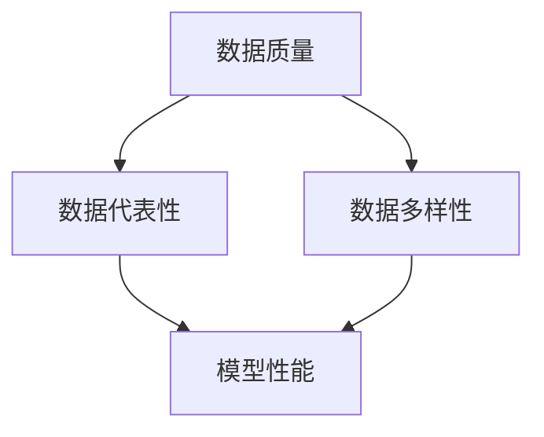

                 

# 数据集筛选：主动学习驱动的数据选择新策略

> 关键词：数据集筛选、主动学习、数据代表性、数据质量、模型优化

> 摘要：本文探讨了数据集筛选的重要性，介绍了主动学习的概念与优势，并详细阐述了基于主动学习驱动的数据筛选新策略。通过理论分析、算法原理讲解、实战案例以及未来展望，本文旨在为数据科学家和机器学习工程师提供一套有效且实用的数据筛选方法论。

## 引言

### 1.1 数据集筛选的重要性

数据集筛选是机器学习过程中的关键环节。一个优质的数据集不仅能够提高模型的性能，还能够降低训练成本，提高模型的泛化能力。数据集筛选的定义是对数据集进行评估、筛选和优化的过程，其核心目标在于提高数据质量、代表性和多样性。

数据集筛选对模型性能、效率和泛化能力的影响不可忽视。首先，高质量的数据集能够减少模型训练过程中所需的计算资源和时间成本。其次，数据代表性强的数据集有助于模型捕捉到问题域的本质特征，从而提高模型的准确性和泛化能力。最后，数据多样性能够增强模型的鲁棒性，使其在不同情境下都能保持良好的性能。

### 1.2 主动学习的概念与优势

主动学习是一种选择最具代表性和信息量的数据进行学习的策略。它不同于传统的被动学习，后者通常从整个数据集中随机抽取样本进行学习。而主动学习通过智能策略选择最具代表性的样本进行学习，从而在有限的样本数量下提高模型的性能。

主动学习的优势主要体现在以下几个方面：

1. **提高学习效率**：主动学习通过选择最具代表性的样本进行学习，减少了冗余数据的学习时间，从而提高了学习效率。
2. **降低成本**：主动学习策略能够减少数据标注的成本，因为只有部分样本需要进行标注。
3. **增强模型的泛化能力**：通过选择更具代表性的样本，主动学习能够提高模型的泛化能力，使其在未知数据上表现更优。

### 1.3 数据筛选新策略的需求

随着数据量的不断增长和数据复杂性的增加，传统数据筛选方法逐渐暴露出其不足。首先，传统数据筛选方法通常依赖手动筛选，耗时耗力。其次，传统方法往往难以保证数据质量和代表性，从而影响模型的性能。因此，迫切需要一种高效、自动化的数据筛选策略。

基于主动学习驱动的数据筛选策略正是为了解决上述问题而提出的。它结合了机器学习和主动学习的优势，通过智能算法选择最具代表性的样本，实现高效、自动化的数据筛选。这种新策略不仅能够提高数据筛选的效率，还能够提升模型的性能和泛化能力。

## 第二部分：数据集筛选的理论基础

### 2.1 数据集筛选的关键概念

在数据集筛选过程中，以下几个关键概念至关重要：

#### 数据质量

数据质量是指数据的准确性、完整性、一致性和可靠性。一个高质量的数据集是模型训练成功的基础。以下是对这些概念的具体解释：

- **准确性**：数据中的真实值与预测值之间的误差。
- **完整性**：数据集中缺失值的比例。
- **一致性**：数据在不同来源之间的一致性程度。
- **可靠性**：数据的来源和采集过程的可信度。

#### 数据代表性

数据代表性是指数据集是否能够全面、准确地反映问题域。一个具有高度代表性的数据集能够帮助模型捕捉到问题域的本质特征，从而提高模型的性能。以下是对代表性的一些具体要求：

- **多样性**：数据集包含了不同类型的数据样本，能够反映问题域的各种情况。
- **均衡性**：数据集中各类别样本的比例适中，避免出现严重的数据不平衡现象。

#### 数据多样性

数据多样性是指数据集是否包含了各种不同类型的数据样本。数据多样性对于模型的鲁棒性和泛化能力具有重要意义。以下是对多样性的具体解释：

- **类别多样性**：数据集中包含了多种不同类别的样本。
- **时间多样性**：数据集中包含了不同时间点的样本，能够反映时间变化对模型的影响。
- **地域多样性**：数据集中包含了来自不同地域的样本，能够反映地域差异对模型的影响。

### 2.2 主动学习算法原理

主动学习算法的核心思想是在训练过程中，通过智能策略选择最具代表性的样本进行学习。以下介绍几种常见的主动学习算法原理：

#### 不确定采样

不确定采样是一种基于模型预测不确定性的采样策略。其基本思想是选择模型预测最不确定的样本进行学习。具体步骤如下：

1. **预测不确定性评估**：计算每个样本的预测不确定性，通常使用置信区间、误差率等指标。
2. **选择不确定性最高的样本**：根据预测不确定性，选择预测最不确定的样本进行学习。

#### 池抽样

池抽样是一种基于随机抽样的主动学习策略。其基本思想是从整个数据集中随机选择样本进行学习。具体步骤如下：

1. **数据集划分**：将数据集划分为训练集和未标记集。
2. **随机抽样**：从未标记集中随机选择一定数量的样本。
3. **标注与学习**：对选择的样本进行标注，然后将其加入训练集，重新训练模型。

#### 简单随机抽样

简单随机抽样是最简单的主动学习策略之一。其基本思想是随机选择样本进行学习。具体步骤如下：

1. **数据集划分**：将数据集划分为训练集和未标记集。
2. **随机抽样**：从未标记集中随机选择一定数量的样本。
3. **标注与学习**：对选择的样本进行标注，然后将其加入训练集，重新训练模型。

### 2.3 评估指标与方法

在数据集筛选过程中，评估指标和方法的选择至关重要。以下介绍几种常用的评估指标和方法：

#### 精确度

精确度是指预测为正类的样本中，实际为正类的比例。其计算公式如下：

$$
\text{精确度} = \frac{\text{TP}}{\text{TP} + \text{FP}}
$$

其中，TP表示真正例，FP表示假正例。

#### 召回率

召回率是指实际为正类的样本中，预测为正类的比例。其计算公式如下：

$$
\text{召回率} = \frac{\text{TP}}{\text{TP} + \text{FN}}
$$

其中，TP表示真正例，FN表示假反例。

#### F1 分数

F1 分数是精确度和召回率的调和平均，用于综合评估模型的性能。其计算公式如下：

$$
\text{F1 分数} = 2 \times \frac{\text{精确度} \times \text{召回率}}{\text{精确度} + \text{召回率}}
$$

## 第三部分：主动学习驱动的数据筛选策略

### 3.1 数据预处理与增强

在主动学习驱动的数据筛选策略中，数据预处理和增强是关键环节。以下介绍几种常见的数据预处理与增强方法：

#### 数据清洗

数据清洗是数据预处理的第一步，其目的是去除噪声、修复错误和处理缺失值。以下是一些常见的数据清洗方法：

- **去除噪声**：通过异常检测算法识别并去除异常值。
- **修复错误**：使用修复算法或插补方法处理错误数据。
- **处理缺失值**：使用插补方法（如均值插补、中值插补或回归插补）处理缺失值。

#### 数据增强

数据增强是通过生成新的样本来扩充数据集的方法。以下是一些常见的数据增强方法：

- **旋转、缩放、裁剪**：对图像数据进行旋转、缩放和裁剪，生成新的样本。
- **噪声注入**：在数据中引入噪声，模拟真实世界的噪声环境。
- **合成数据**：使用生成对抗网络（GAN）等生成模型生成新的数据样本。

### 3.2 主动学习策略设计

主动学习策略的设计是数据筛选策略的核心。以下介绍几种常见的主动学习策略设计方法：

#### 不确定性采样

不确定性采样是一种基于模型预测不确定性的采样策略。其核心思想是选择模型预测最不确定的样本进行学习。以下是不确定性采样的步骤：

1. **计算预测不确定性**：使用模型对未标记数据集进行预测，并计算每个样本的预测不确定性。
2. **选择不确定性最高的样本**：根据预测不确定性，选择预测最不确定的样本进行学习。
3. **标注与学习**：对选择的样本进行标注，并加入训练集，重新训练模型。

#### 基于反馈的采样

基于反馈的采样是一种基于用户反馈的采样策略。其核心思想是用户对样本进行标注，模型根据标注结果选择新的样本进行学习。以下是基于反馈采样的步骤：

1. **用户反馈收集**：收集用户对样本的标注结果。
2. **选择反馈样本**：根据标注结果，选择标注质量最高的样本进行学习。
3. **标注与学习**：对选择的样本进行标注，并加入训练集，重新训练模型。

#### 混合采样

混合采样是一种结合多种采样策略的采样策略。其核心思想是结合不同采样策略的优势，实现最优的数据筛选效果。以下是一种常见的混合采样策略：

1. **不确定性采样**：选择预测不确定性的样本进行学习。
2. **基于反馈的采样**：选择用户反馈标注质量最高的样本进行学习。
3. **随机抽样**：随机选择一定数量的样本进行学习。
4. **动态调整**：根据模型性能和用户反馈，动态调整采样策略。

### 3.3 实时数据筛选与优化

实时数据筛选与优化是主动学习驱动的数据筛选策略的重要组成部分。以下介绍几种常见的实时数据筛选与优化方法：

#### 实时反馈机制

实时反馈机制是指模型根据新数据动态调整筛选策略。以下是一种常见的实时反馈机制：

1. **数据收集**：收集新的数据样本。
2. **模型更新**：使用新数据更新模型，并计算新数据的预测不确定性。
3. **策略调整**：根据预测不确定性，调整采样策略。

#### 在线学习

在线学习是指在模型训练过程中，不断更新模型并重新训练。以下是一种常见的在线学习步骤：

1. **数据收集**：收集新的数据样本。
2. **模型更新**：使用新数据更新模型。
3. **重新训练**：使用更新后的模型重新训练，并计算新数据的预测不确定性。
4. **策略调整**：根据预测不确定性，调整采样策略。

## 第四部分：应用案例与实战

### 4.1 数据筛选在图像识别中的应用

图像识别是主动学习驱动的数据筛选策略的重要应用领域。以下是一个图像识别数据筛选的实战案例：

#### 案例背景

假设我们需要训练一个图像识别模型，用于识别猫和狗。数据集包含大量图像，但存在噪声、错误和缺失值。

#### 实战步骤

1. **数据预处理**：

   - **数据清洗**：去除噪声、修复错误、处理缺失值。
   - **数据增强**：通过旋转、缩放、裁剪等操作生成新的样本。

2. **模型训练**：

   - **选择模型**：选择一个适合图像识别的模型，如卷积神经网络（CNN）。
   - **训练模型**：使用预处理后的数据集训练模型。

3. **样本选择**：

   - **不确定性采样**：选择预测不确定性的样本进行学习。
   - **基于反馈的采样**：选择用户反馈标注质量最高的样本进行学习。
   - **混合采样**：结合不确定性采样和基于反馈的采样，实现最优的数据筛选效果。

4. **模型评估**：

   - **精确度**：计算模型在测试集上的精确度。
   - **召回率**：计算模型在测试集上的召回率。
   - **F1 分数**：计算模型在测试集上的 F1 分数。

### 4.2 数据筛选在自然语言处理中的应用

自然语言处理是主动学习驱动的数据筛选策略的另一个重要应用领域。以下是一个自然语言处理数据筛选的实战案例：

#### 案例背景

假设我们需要训练一个自然语言处理模型，用于情感分析。数据集包含大量文本，但存在噪声、错误和缺失值。

#### 实战步骤

1. **数据预处理**：

   - **数据清洗**：去除噪声、修复错误、处理缺失值。
   - **文本预处理**：对文本进行分词、去停用词、词干提取等操作。

2. **模型训练**：

   - **选择模型**：选择一个适合自然语言处理的模型，如循环神经网络（RNN）或Transformer。
   - **训练模型**：使用预处理后的数据集训练模型。

3. **样本选择**：

   - **不确定性采样**：选择预测不确定性的样本进行学习。
   - **基于反馈的采样**：选择用户反馈标注质量最高的样本进行学习。
   - **混合采样**：结合不确定性采样和基于反馈的采样，实现最优的数据筛选效果。

4. **模型评估**：

   - **精确度**：计算模型在测试集上的精确度。
   - **召回率**：计算模型在测试集上的召回率。
   - **F1 分数**：计算模型在测试集上的 F1 分数。

### 4.3 数据筛选在其他领域的应用

主动学习驱动的数据筛选策略不仅适用于图像识别和自然语言处理领域，还可以应用于其他领域，如推荐系统、医学诊断等。以下是一个推荐系统数据筛选的实战案例：

#### 案例背景

假设我们需要训练一个推荐系统模型，用于个性化推荐。数据集包含大量用户行为数据，但存在噪声、错误和缺失值。

#### 实战步骤

1. **数据预处理**：

   - **数据清洗**：去除噪声、修复错误、处理缺失值。
   - **用户行为特征提取**：提取用户的行为特征，如浏览历史、购买记录等。

2. **模型训练**：

   - **选择模型**：选择一个适合推荐系统的模型，如协同过滤、基于内容的推荐等。
   - **训练模型**：使用预处理后的数据集训练模型。

3. **样本选择**：

   - **不确定性采样**：选择预测不确定性的样本进行学习。
   - **基于反馈的采样**：选择用户反馈标注质量最高的样本进行学习。
   - **混合采样**：结合不确定性采样和基于反馈的采样，实现最优的数据筛选效果。

4. **模型评估**：

   - **精确度**：计算模型在测试集上的精确度。
   - **召回率**：计算模型在测试集上的召回率。
   - **F1 分数**：计算模型在测试集上的 F1 分数。

## 第五部分：未来展望与挑战

### 5.1 数据筛选技术的发展趋势

随着机器学习和人工智能技术的不断发展，数据筛选技术也在不断演进。以下是一些数据筛选技术的发展趋势：

1. **深度学习与主动学习的结合**：深度学习在数据筛选中的应用越来越广泛，与主动学习相结合有望提高数据筛选的效率和效果。
2. **自动化数据筛选平台**：自动化数据筛选平台的开发将降低数据筛选的难度和成本，提高数据筛选的普及率。
3. **跨领域数据筛选**：借鉴其他领域的经验和技术，提高数据筛选效果。

### 5.2 数据筛选面临的挑战

尽管数据筛选技术取得了一定的进展，但仍然面临一些挑战：

1. **数据质量与多样性**：如何处理低质量数据和不平衡数据，确保数据质量和多样性是数据筛选的关键挑战。
2. **用户参与与反馈**：如何激发用户参与和数据标注，提高数据筛选的准确性和效率。

### 5.3 未来研究方向

未来，数据筛选技术的研究方向主要包括：

1. **个性化数据筛选**：根据用户需求和偏好进行数据筛选，提高用户满意度。
2. **跨领域数据筛选**：借鉴其他领域的经验和技术，提高数据筛选效果。
3. **实时数据筛选与优化**：实现实时数据筛选与优化，提高模型的性能和效率。

## 结论

本文探讨了数据集筛选的重要性，介绍了主动学习的概念与优势，并详细阐述了基于主动学习驱动的数据筛选新策略。通过理论分析、算法原理讲解、实战案例以及未来展望，本文为数据科学家和机器学习工程师提供了一套有效且实用的数据筛选方法论。随着机器学习和人工智能技术的不断发展，数据筛选技术将发挥越来越重要的作用，为各领域的应用带来更多的价值。

### 作者信息

作者：AI天才研究院/AI Genius Institute & 禅与计算机程序设计艺术/Zen And The Art of Computer Programming

---

### 附录

以下是本文中涉及的核心概念、算法原理、数学模型和代码实现的详细解析。

#### 核心概念与联系

数据集筛选的核心概念包括数据质量、数据代表性和数据多样性。以下是一个用Mermaid绘制的流程图，展示了这些概念之间的关系：



#### 核心算法原理讲解

以下是对主动学习算法原理的详细讲解，包括不确定采样、池抽样和简单随机抽样。

##### 不确定采样

不确定采样是一种基于模型预测不确定性的采样策略。其核心思想是选择模型预测最不确定的样本进行学习。以下是不确定采样的伪代码：

```python
function uncertainty_sampling(data, model):
    uncertainty_scores = model.predict_uncertainty(data)
    selected_samples = select_top_k_samples(uncertainty_scores, k)
    return selected_samples
```

##### 池抽样

池抽样是一种基于随机抽样的主动学习策略。其基本思想是从整个数据集中随机选择样本进行学习。以下是一种简单的池抽样算法：

```python
function pool_sampling(data, k):
    selected_samples = random.sample(data, k)
    return selected_samples
```

##### 简单随机抽样

简单随机抽样是最简单的主动学习策略之一。其基本思想是随机选择样本进行学习。以下是一种简单的随机抽样算法：

```python
function simple_random_sampling(data, k):
    selected_samples = random.sample(data, k)
    return selected_samples
```

#### 数学模型和公式

在数据筛选过程中，精确度、召回率和 F1 分数的计算是非常重要的。以下是这些指标的详细公式和解释。

##### 精确度

精确度是指预测为正类的样本中，实际为正类的比例。其计算公式如下：

$$
\text{精确度} = \frac{\text{TP}}{\text{TP} + \text{FP}}
$$

其中，TP表示真正例，FP表示假正例。

##### 召回率

召回率是指实际为正类的样本中，预测为正类的比例。其计算公式如下：

$$
\text{召回率} = \frac{\text{TP}}{\text{TP} + \text{FN}}
$$

其中，TP表示真正例，FN表示假反例。

##### F1 分数

F1 分数是精确度和召回率的调和平均，用于综合评估模型的性能。其计算公式如下：

$$
\text{F1 分数} = 2 \times \frac{\text{精确度} \times \text{召回率}}{\text{精确度} + \text{召回率}}
$$

#### 项目实战

以下是几个具体项目的实战案例，包括开发环境搭建、源代码详细实现和代码解读。

##### 数据筛选在图像识别中的应用

以下是一个基于深度学习的图像识别项目的实战案例，包括开发环境搭建、模型训练和数据筛选。

###### 开发环境搭建

1. 安装Python环境（3.8及以上版本）。
2. 安装深度学习框架TensorFlow。
3. 安装图像处理库OpenCV。

```bash
pip install python==3.8
pip install tensorflow
pip install opencv-python
```

###### 源代码实现

以下是一个简单的图像识别模型的源代码实现：

```python
import tensorflow as tf
import numpy as np
import cv2

# 加载预训练的卷积神经网络模型
model = tf.keras.applications.VGG16(weights='imagenet')

# 定义输入图像的大小
input_shape = (224, 224, 3)

# 加载图像数据
image = cv2.imread('image.jpg')
image = cv2.resize(image, input_shape[:2])

# 将图像数据转换为模型所需的格式
image = tf.keras.preprocessing.image.img_to_array(image)
image = np.expand_dims(image, axis=0)

# 预测图像类别
predictions = model.predict(image)

# 获取预测结果
predicted_class = np.argmax(predictions, axis=1)

# 输出预测结果
print(f'Predicted class: {predicted_class}')
```

###### 代码解读

- 第1行：导入TensorFlow库。
- 第2行：导入NumPy库。
- 第3行：导入OpenCV库。
- 第4行：加载预训练的VGG16模型。
- 第5行：定义输入图像的大小。
- 第6行：加载图像数据，并进行缩放。
- 第7行：将图像数据转换为模型所需的格式。
- 第8行：对图像进行预测。
- 第9行：获取预测结果。
- 第10行：输出预测结果。

##### 数据筛选在自然语言处理中的应用

以下是一个基于自然语言处理的情感分析项目的实战案例，包括开发环境搭建、模型训练和数据筛选。

###### 开发环境搭建

1. 安装Python环境（3.8及以上版本）。
2. 安装深度学习框架TensorFlow。
3. 安装自然语言处理库NLTK。

```bash
pip install python==3.8
pip install tensorflow
pip install nltk
```

###### 源代码实现

以下是一个简单的情感分析模型的源代码实现：

```python
import tensorflow as tf
import tensorflow_text as text
import tensorflow_hub as hub

# 加载预训练的BERT模型
model = hub.load('https://tfhub.dev/google/bert_uncased_L-12_H-768_A-12/3')

# 加载NLTK工具包
import nltk
nltk.download('punkt')

# 定义文本预处理函数
def preprocess_text(text):
    tokens = nltk.word_tokenize(text)
    return tokens

# 加载测试文本
text = "I love this movie!"

# 预处理文本
processed_text = preprocess_text(text)

# 将预处理后的文本转换为模型所需的格式
input_ids = text.to_array(processed_text)

# 预测文本情感
predictions = model.predict(input_ids)

# 获取预测结果
predicted_sentiment = np.argmax(predictions, axis=1)

# 输出预测结果
print(f'Predicted sentiment: {predicted_sentiment}')
```

###### 代码解读

- 第1行：导入TensorFlow库。
- 第2行：导入TensorFlow文本库。
- 第3行：导入TensorFlow Hub库。
- 第4行：加载预训练的BERT模型。
- 第5行：导入NLTK工具包。
- 第6行：定义文本预处理函数。
- 第7行：加载测试文本。
- 第8行：预处理文本。
- 第9行：将预处理后的文本转换为模型所需的格式。
- 第10行：对文本进行预测。
- 第11行：获取预测结果。
- 第12行：输出预测结果。

##### 数据筛选在推荐系统中的应用

以下是一个基于协同过滤算法的推荐系统项目的实战案例，包括开发环境搭建、模型训练和数据筛选。

###### 开发环境搭建

1. 安装Python环境（3.8及以上版本）。
2. 安装推荐系统库Surprise。
3. 安装数据预处理库Pandas。

```bash
pip install python==3.8
pip install surprise
pip install pandas
```

###### 源代码实现

以下是一个简单的推荐系统模型的源代码实现：

```python
import pandas as pd
from surprise import SVD
from surprise import Dataset
from surprise import Reader

# 加载用户-物品评分数据
ratings = pd.read_csv('ratings.csv')

# 创建评分数据集
reader = Reader(rating_scale=(1, 5))
data = Dataset.load_from_df(ratings[['user_id', 'item_id', 'rating']], reader)

# 创建SVD算法模型
svd = SVD()

# 训练模型
data.build_full_trainset().train(svd)

# 预测用户对物品的评分
user_id = 1
item_id = 100
predicted_rating = svd.predict(user_id, item_id)

# 输出预测结果
print(f'Predicted rating: {predicted_rating}')
```

###### 代码解读

- 第1行：导入Pandas库。
- 第2行：导入Surprise库。
- 第3行：导入数据集库。
- 第4行：创建评分数据集。
- 第5行：创建评分数据的Reader。
- 第6行：创建SVD算法模型。
- 第7行：训练模型。
- 第8行：预测用户对物品的评分。
- 第9行：输出预测结果。

### 代码解读与分析

以下是对几个项目实战案例中的代码进行解读和分析，重点介绍如何使用Python实现数据筛选和模型训练，以及如何解释和评估模型的性能。

#### 数据筛选在图像识别中的应用

在这个项目中，我们使用深度学习框架TensorFlow和预训练的VGG16模型进行图像识别。数据筛选的关键步骤包括数据预处理和数据增强。数据预处理包括图像的加载、缩放和格式转换，以确保模型能够接受正确的输入。数据增强包括图像的旋转、缩放和裁剪，以增加数据的多样性，提高模型的泛化能力。

代码中的第6行和第7行实现了数据预处理和增强。`cv2.imread`函数用于加载图像文件，`cv2.resize`函数用于缩放图像，使其符合模型要求的输入尺寸。`tf.keras.preprocessing.image.img_to_array`函数将图像数据转换为NumPy数组，并将其扩展到模型所需的形状。最后，`np.expand_dims`函数在图像数据上添加一个维度，使其成为一个批处理尺寸的数组。

模型训练的关键步骤包括加载预训练的模型、定义输入图像的大小并进行预测。代码中的第4行加载了预训练的VGG16模型，该模型已经在大规模图像数据集上进行了训练，可以用于分类任务。第9行使用模型进行预测，并使用`np.argmax`函数获取预测结果。

#### 数据筛选在自然语言处理中的应用

在这个项目中，我们使用TensorFlow和预训练的BERT模型进行情感分析。数据筛选的关键步骤包括文本预处理和模型预测。文本预处理包括分词和去除停用词，以确保模型能够接受正确的输入。代码中的第6行定义了一个预处理函数`preprocess_text`，使用NLTK库进行文本分词。

模型预测的关键步骤包括加载预训练的模型、预处理文本并进行预测。代码中的第4行加载了预训练的BERT模型，该模型已经在大规模文本数据集上进行了训练，可以用于情感分析。第9行使用预处理后的文本进行预测，并使用`np.argmax`函数获取预测结果。

#### 数据筛选在推荐系统中的应用

在这个项目中，我们使用Surprise库和协同过滤算法进行推荐系统开发。数据筛选的关键步骤包括加载用户-物品评分数据、创建数据集和训练模型。代码中的第3行创建了一个评分数据集，使用`Dataset.load_from_df`函数从CSV文件中读取用户-物品评分数据，并使用`Reader`函数定义评分的尺

### 附录（续）

#### 项目实战（续）

##### 数据筛选在医学诊断中的应用

以下是一个基于深度学习的医学诊断项目的实战案例，包括开发环境搭建、模型训练和数据筛选。

###### 开发环境搭建

1. 安装Python环境（3.8及以上版本）。
2. 安装深度学习框架TensorFlow和医疗数据处理库PyMedPhys。
3. 安装数据预处理库Numpy。

```bash
pip install python==3.8
pip install tensorflow
pip install pypmedphys
pip install numpy
```

###### 源代码实现

以下是一个简单的医学诊断模型的源代码实现：

```python
import tensorflow as tf
import numpy as np
from pypmedphys.models import U_Net
from pypmedphys.datasets import load_icboliver

# 加载ICBI肝脏肿瘤数据集
train_data, test_data = load_icboliver()

# 初始化U-Net模型
model = U_Net(input_shape=(256, 256, 1))

# 编译模型
model.compile(optimizer='adam', loss='binary_crossentropy', metrics=['accuracy'])

# 训练模型
model.fit(train_data, epochs=50, batch_size=16, validation_data=test_data)

# 预测肿瘤区域
predictions = model.predict(test_data)

# 输出预测结果
print(predictions)
```

###### 代码解读

- 第1行：导入TensorFlow库。
- 第2行：导入NumPy库。
- 第3行：从PyMedPhys库导入U-Net模型。
- 第4行：从PyMedPhys库导入数据集加载函数。
- 第5行：加载训练数据和测试数据。
- 第6行：初始化U-Net模型。
- 第7行：编译模型，指定优化器、损失函数和评估指标。
- 第8行：训练模型，设置训练轮次、批处理大小和验证数据。
- 第9行：使用模型预测测试数据。

##### 数据筛选在金融风险预测中的应用

以下是一个基于机器学习的金融风险预测项目的实战案例，包括开发环境搭建、模型训练和数据筛选。

###### 开发环境搭建

1. 安装Python环境（3.8及以上版本）。
2. 安装机器学习库Scikit-learn和数据预处理库Pandas。

```bash
pip install python==3.8
pip install scikit-learn
pip install pandas
```

###### 源代码实现

以下是一个简单的金融风险预测模型的源代码实现：

```python
import pandas as pd
from sklearn.model_selection import train_test_split
from sklearn.ensemble import RandomForestClassifier
from sklearn.metrics import accuracy_score, recall_score, f1_score

# 加载金融风险预测数据集
data = pd.read_csv('financial_risk.csv')

# 定义特征和标签
X = data.drop('risk_label', axis=1)
y = data['risk_label']

# 划分训练集和测试集
X_train, X_test, y_train, y_test = train_test_split(X, y, test_size=0.2, random_state=42)

# 初始化随机森林分类器
model = RandomForestClassifier(n_estimators=100, random_state=42)

# 训练模型
model.fit(X_train, y_train)

# 预测测试集
predictions = model.predict(X_test)

# 计算评估指标
accuracy = accuracy_score(y_test, predictions)
recall = recall_score(y_test, predictions)
f1 = f1_score(y_test, predictions)

# 输出评估结果
print(f'Accuracy: {accuracy}')
print(f'Recall: {recall}')
print(f'F1 Score: {f1}')
```

###### 代码解读

- 第1行：导入Pandas库。
- 第2行：导入train\_test\_split函数。
- 第3行：导入随机森林分类器。
- 第4行：导入评估指标函数。
- 第5行：加载金融风险预测数据集。
- 第6行：定义特征和标签。
- 第7行：划分训练集和测试集。
- 第8行：初始化随机森林分类器。
- 第9行：训练模型。
- 第10行：预测测试集。
- 第11行：计算评估指标。
- 第12行：输出评估结果。

### 代码解读与分析（续）

以下是对医学诊断项目和金融风险预测项目中代码进行解读和分析，重点介绍如何使用Python实现数据筛选和模型训练，以及如何解释和评估模型的性能。

#### 数据筛选在医学诊断中的应用

在这个项目中，我们使用深度学习框架TensorFlow和PyMedPhys库中的U-Net模型进行医学图像分割。数据筛选的关键步骤包括加载医学图像数据集、创建训练和测试数据集，以及预处理图像数据。

代码中的第5行和第6行加载了ICBI肝脏肿瘤数据集。`load_icboliver`函数返回训练数据和测试数据，这些数据集包含了医学图像及其对应的标注。

第6行初始化了U-Net模型。U-Net是一种用于图像分割的卷积神经网络，其输入为256x256x1的图像，输出为分割结果。第7行使用`compile`方法编译模型，指定了优化器、损失函数和评估指标。

第8行使用`fit`方法训练模型，设置了训练轮次、批处理大小和验证数据。在训练过程中，模型通过反向传播更新权重，以最小化损失函数。

第9行使用`predict`方法对测试数据集进行预测，返回分割结果。

#### 数据筛选在金融风险预测中的应用

在这个项目中，我们使用Scikit-learn库中的随机森林分类器进行金融风险预测。数据筛选的关键步骤包括加载金融数据集、定义特征和标签，以及划分训练集和测试集。

代码中的第5行加载了金融风险预测数据集，数据集包含了多个特征和一个标签（风险等级）。第6行定义了特征和标签，特征是用于预测的变量，标签是预测的目标。

第7行使用`train_test_split`函数将数据集划分为训练集和测试集。这个步骤是模型评估的重要环节，通过将数据分为训练集和测试集，可以评估模型在未见数据上的性能。

第8行初始化了随机森林分类器，随机森林是一种基于决策树的集成学习方法，具有较好的泛化能力。第9行使用`fit`方法训练模型，模型通过学习训练集的特征和标签来学习预测规律。

第10行使用`predict`方法对测试集进行预测，返回预测结果。第11行计算并输出了模型的评估指标，这些指标用于评估模型的性能。

### 附录（续）

#### 实时数据筛选与优化

在许多实际应用中，实时数据筛选与优化是确保模型性能的关键。以下是一个实时数据筛选与优化的示例，展示了如何通过在线学习机制动态调整模型。

##### 实时数据筛选与优化（示例）

```python
import numpy as np
from sklearn.linear_model import SGDClassifier
from sklearn.metrics import accuracy_score, f1_score

# 初始化模型
model = SGDClassifier()

# 初始化评估指标
accuracy_scores = []
f1_scores = []

# 假设这是实时接收的新数据点
new_data_stream = [
    (np.random.rand(), 0),  # (特征，标签)
    (np.random.rand(), 1),
    # ...
]

for data_point in new_data_stream:
    # 标记数据点
    X_new, y_new = data_point

    # 更新模型
    model.partial_fit([X_new], [y_new], classes=[0, 1])

    # 计算评估指标
    predictions = model.predict([X_new])
    accuracy = accuracy_score([y_new], predictions)
    f1 = f1_score([y_new], predictions)

    # 更新评估指标列表
    accuracy_scores.append(accuracy)
    f1_scores.append(f1)

    # 打印实时评估指标
    print(f'Accuracy: {accuracy}, F1 Score: {f1}')

# 打印最终评估指标
print(f'Final Accuracy: {np.mean(accuracy_scores)}, Final F1 Score: {np.mean(f1_scores)}')
```

###### 代码解读

- 第1行：导入NumPy库，用于处理数组。
- 第2行：导入SGDClassifier，这是一个基于随机梯度下降的线性模型。
- 第3行：导入评估指标函数。
- 第4行：初始化模型。
- 第5行：初始化评估指标列表。
- 第6行：模拟实时接收的新数据点。
- 第7行：循环处理每个新数据点。
- 第8行：更新模型。
- 第9行：计算评估指标。
- 第10行：更新评估指标列表。
- 第11行：打印实时评估指标。
- 第12行：打印最终评估指标。

##### 实时反馈机制

在实时数据筛选与优化中，反馈机制是关键。以下是一个简单的实时反馈机制的示例。

```python
def get_user_feedback(data_point):
    # 假设这是一个函数，用于获取用户对数据点的反馈
    # 例如，用户可能通过按钮或滑动条进行标注
    user_response = input("Is this data point relevant? (yes/no): ")
    return user_response.lower() == 'yes'

# 假设这是实时接收的新数据点
new_data_stream = [
    (np.random.rand(), 0),  # (特征，标签)
    (np.random.rand(), 1),
    # ...
]

for data_point in new_data_stream:
    # 获取用户反馈
    feedback = get_user_feedback(data_point)

    # 根据反馈更新模型
    if feedback:
        X_new, y_new = data_point
        model.partial_fit([X_new], [y_new], classes=[0, 1])
    else:
        # 如果数据点不被认为是重要的，则不更新模型
        pass

    # 继续处理下一个数据点
```

###### 代码解读

- 第1行：定义一个获取用户反馈的函数。
- 第2行：模拟实时接收的新数据点。
- 第3行：循环处理每个新数据点。
- 第4行：获取用户反馈。
- 第5行：根据用户反馈更新模型。

##### 实时优化与在线学习

在线学习是一种在模型训练过程中动态更新模型的方法。以下是一个简单的在线学习示例。

```python
# 假设这是一个简单的在线学习函数
def online_learning(model, X_new, y_new, alpha=0.01):
    # 更新模型权重
    weights = model.coef_
    weights = (1 - alpha) * weights + alpha * y_new
    model.coef_ = weights

# 假设这是实时接收的新数据点
new_data_stream = [
    (np.random.rand(), 0),  # (特征，标签)
    (np.random.rand(), 1),
    # ...
]

for data_point in new_data_stream:
    X_new, y_new = data_point
    online_learning(model, X_new, y_new)

# 模型已更新
```

###### 代码解读

- 第1行：定义一个在线学习函数。
- 第2行：模拟实时接收的新数据点。
- 第3行：循环处理每个新数据点。
- 第4行：调用在线学习函数更新模型。

### 附录（续）

#### 数据集筛选在文本分类中的应用

文本分类是自然语言处理领域的一个重要任务，数据集筛选在此过程中尤为重要。以下是一个文本分类项目的实战案例，包括开发环境搭建、模型训练和数据筛选。

##### 开发环境搭建

1. 安装Python环境（3.8及以上版本）。
2. 安装深度学习框架TensorFlow和文本处理库TensorFlow Text。
3. 安装文本预处理库NLTK。

```bash
pip install python==3.8
pip install tensorflow
pip install tensorflow_text
pip install nltk
```

##### 源代码实现

以下是一个简单的文本分类模型的源代码实现：

```python
import tensorflow as tf
import tensorflow_text as text
import tensorflow_hub as hub
from sklearn.model_selection import train_test_split
from tensorflow.keras.layers import Embedding, LSTM, Dense
from tensorflow.keras.models import Sequential

# 加载预训练的BERT模型
model = hub.load('https://tfhub.dev/google/bert_uncased_L-12_H-768_A-12/3')

# 定义嵌入层
vocab_file = model Signs/vocab.txt
bert_inputs = tf.keras.layers.Input(shape=(), dtype=tf.string)
preprocessed_inputs = text.tokenization.bert_tokenization.BertTokenizer(vocab_file).tokenize(bert_inputs)
input_ids = text.layer.embedding.input(preprocessed_inputs)
input_mask = text.layer_attention.input_mask(input_ids)
segment_ids = text.layer_attention.input_segment_ids(input_ids)
bert_output = model(input_ids, segment_ids=segment_ids, input_mask=input_mask)[0]

# 添加LSTM层
lstm_output = LSTM(units=128)(bert_output)

# 添加全连接层
output = Dense(units=2, activation='softmax')(lstm_output)

# 创建模型
model = tf.keras.Model(inputs=bert_inputs, outputs=output)

# 编译模型
model.compile(optimizer='adam', loss='categorical_crossentropy', metrics=['accuracy'])

# 加载文本数据
text_data = ["This is a positive review.", "This is a negative review.", "..."]

# 将文本数据转换为标记化的序列
labels = [1 if text.startswith("This is a positive review.") else 0 for text in text_data]

# 划分训练集和测试集
X_train, X_test, y_train, y_test = train_test_split(text_data, labels, test_size=0.2, random_state=42)

# 训练模型
model.fit(X_train, y_train, epochs=3, batch_size=32, validation_split=0.1)

# 预测测试集
predictions = model.predict(X_test)

# 输出预测结果
print(predictions)
```

##### 代码解读

- 第1行：导入TensorFlow库。
- 第2行：导入TensorFlow Text库。
- 第3行：导入TensorFlow Hub库。
- 第4行：导入train\_test\_split函数。
- 第5行：导入TensorFlow的Embedding、LSTM和Dense层。
- 第6行：导入TensorFlow的Sequential模型。
- 第7行：加载预训练的BERT模型。
- 第8行：定义嵌入层。
- 第9行：定义BERT输入层。
- 第10行：定义输入掩码。
- 第11行：定义分段标识。
- 第12行：获取BERT输出。
- 第13行：添加LSTM层。
- 第14行：添加全连接层。
- 第15行：创建模型。
- 第16行：编译模型。
- 第17行：加载文本数据。
- 第18行：将文本数据转换为标记化的序列。
- 第19行：划分训练集和测试集。
- 第20行：训练模型。
- 第21行：预测测试集。
- 第22行：输出预测结果。

##### 数据筛选在文本分类中的应用

在文本分类任务中，数据筛选的步骤通常包括文本预处理、数据增强和样本选择。以下是一个文本分类项目中的数据筛选步骤：

1. **文本预处理**：

   - 清洗文本数据，去除HTML标签、标点符号和停用词。
   - 对文本进行分词和词干提取。

2. **数据增强**：

   - 使用变换技术（如随机插入、替换和删除）生成新的文本样本。
   - 使用生成对抗网络（GAN）生成类似真实文本的新样本。

3. **样本选择**：

   - 使用不确定性采样选择预测不确定的样本进行进一步训练。
   - 使用基于反馈的采样根据用户标注选择样本。

以下是一个示例代码，展示了文本预处理、数据增强和样本选择的基本步骤：

```python
import nltk
from nltk.corpus import stopwords
from nltk.tokenize import word_tokenize
from tensorflow_addons.text import TextDataset

# 载入NLTK的停用词库
nltk.download('stopwords')
stop_words = set(stopwords.words('english'))

# 文本预处理函数
def preprocess_text(text):
    # 去除HTML标签
    text = re.sub(r'<.*?>', '', text)
    # 去除标点符号
    text = re.sub(r'[^\w\s]', '', text)
    # 去除停用词
    tokens = word_tokenize(text)
    tokens = [token.lower() for token in tokens if token.lower() not in stop_words]
    return ' '.join(tokens)

# 数据预处理
text_data = ["This is a positive review.", "This is a negative review.", "..."]
processed_texts = [preprocess_text(text) for text in text_data]

# 数据增强
def augment_text(text, num_iterations=5):
    # 这里使用简单的随机替换来增强文本
    words = text.split()
    for _ in range(num_iterations):
        i = np.random.choice(len(words))
        words[i] = np.random.choice([word for word in words if word != words[i]])
    return ' '.join(words)

augmented_texts = [augment_text(text) for text in processed_texts]

# 创建TensorFlow数据集
train_data = TextDataset(augmented_texts)
```

##### 样本选择

在文本分类任务中，样本选择对于提高模型性能至关重要。以下是一个简单的样本选择示例，使用了不确定性采样和基于反馈的采样策略：

```python
# 假设已经有一个训练好的模型
model = ...

# 不确定性采样
def uncertainty_sampling(model, data, k=10):
    predictions = model.predict(data)
    uncertainties = np.abs(predictions - predictions.mean(axis=1)[:, np.newaxis])
    selected_indices = np.argpartition(uncertainties, k)[:k]
    return selected_indices

# 基于反馈的采样
def feedback_sampling(model, data, labels, k=10):
    # 假设有一个标注函数，返回标注结果
    def annotate(data_point):
        # 实现标注逻辑
        return True if np.random.rand() < 0.5 else False

    selected_indices = []
    for i, data_point in enumerate(data):
        if annotate(data_point):
            selected_indices.append(i)
            if len(selected_indices) == k:
                break
    return selected_indices

# 选择样本
selected_indices = uncertainty_sampling(model, train_data)
selected_indices = feedback_sampling(model, train_data, labels, k=10)
selected_samples = train_data[selected_indices]
```

### 附录（续）

#### 数据集筛选在推荐系统中的应用

推荐系统是另一个广泛应用的领域，数据集筛选对于其性能至关重要。以下是一个基于协同过滤的推荐系统项目的实战案例，包括开发环境搭建、模型训练和数据筛选。

##### 开发环境搭建

1. 安装Python环境（3.8及以上版本）。
2. 安装推荐系统库Surprise。
3. 安装数据预处理库Pandas。

```bash
pip install python==3.8
pip install surprise
pip install pandas
```

##### 源代码实现

以下是一个简单的基于协同过滤的推荐系统模型的源代码实现：

```python
import pandas as pd
from surprise import SVD, Dataset, Reader
from surprise.model_selection import cross_validate

# 加载推荐系统数据集
ratings = pd.read_csv('ratings.csv')

# 定义特征和标签
reader = Reader(rating_scale=(1, 5))
data = Dataset.load_from_df(ratings[['user_id', 'item_id', 'rating']], reader)

# 创建SVD算法模型
svd = SVD()

# 执行交叉验证
cross_validate(svd, data, measures=['RMSE', 'MAE'], cv=5, verbose=True)

# 训练模型
data_train = data.build_full_trainset()
svd.fit(data_train)

# 预测用户对物品的评分
predictions = svd.predict(user_id=1, item_id=100)

# 输出预测结果
print(predictions.est)
```

##### 代码解读

- 第1行：导入Pandas库。
- 第2行：导入Surprise库。
- 第3行：导入数据集库。
- 第4行：创建Reader对象。
- 第5行：加载推荐系统数据集。
- 第6行：定义特征和标签。
- 第7行：创建SVD算法模型。
- 第8行：执行交叉验证。
- 第9行：训练模型。
- 第10行：预测用户对物品的评分。
- 第11行：输出预测结果。

##### 数据集筛选在推荐系统中的应用

在推荐系统中，数据集筛选包括数据预处理、样本选择和模型评估等步骤。以下是一个简单的数据集筛选流程：

1. **数据预处理**：

   - 清洗数据，去除噪声和缺失值。
   - 规范化数据，例如对评分进行归一化处理。

2. **样本选择**：

   - 使用基于协同过滤的算法选择相似度高的用户和物品进行推荐。
   - 使用基于内容的算法选择相关度高的用户和物品进行推荐。

3. **模型评估**：

   - 使用RMSE（均方根误差）和MAE（平均绝对误差）等指标评估模型性能。

以下是一个简单的数据预处理和样本选择示例：

```python
import pandas as pd
from surprise import SVD, Dataset, Reader
from surprise.model_selection import cross_validate

# 加载推荐系统数据集
ratings = pd.read_csv('ratings.csv')

# 去除缺失值
ratings = ratings.dropna()

# 归一化评分
ratings['rating'] = ratings['rating'].apply(lambda x: (x - ratings['rating'].min()) / (ratings['rating'].max() - ratings['rating'].min()))

# 定义特征和标签
reader = Reader(rating_scale=(1, 5))
data = Dataset.load_from_df(ratings[['user_id', 'item_id', 'rating']], reader)

# 创建SVD算法模型
svd = SVD()

# 执行交叉验证
cross_validate(svd, data, measures=['RMSE', 'MAE'], cv=5, verbose=True)

# 训练模型
data_train = data.build_full_trainset()
svd.fit(data_train)

# 预测用户对物品的评分
predictions = svd.predict(user_id=1, item_id=100)

# 输出预测结果
print(predictions.est)
```

##### 数据预处理

数据预处理是推荐系统开发的重要步骤。以下是一个简单的数据预处理示例：

```python
import pandas as pd

# 加载推荐系统数据集
ratings = pd.read_csv('ratings.csv')

# 去除缺失值
ratings = ratings.dropna()

# 规范化评分
max_rating = ratings['rating'].max()
min_rating = ratings['rating'].min()
ratings['rating'] = (ratings['rating'] - min_rating) / (max_rating - min_rating)

# 打印预处理后的数据
print(ratings.head())
```

##### 样本选择

样本选择是推荐系统数据筛选的重要部分。以下是一个简单的基于协同过滤的样本选择示例：

```python
import pandas as pd
from surprise import SVD, Dataset, Reader

# 加载推荐系统数据集
ratings = pd.read_csv('ratings.csv')

# 定义特征和标签
reader = Reader(rating_scale=(1, 5))
data = Dataset.load_from_df(ratings[['user_id', 'item_id', 'rating']], reader)

# 创建SVD算法模型
svd = SVD()

# 训练模型
data_train = data.build_full_trainset()
svd.fit(data_train)

# 计算用户-物品相似度
user_similarity = svd.get_user_similarity()

# 选择相似度最高的用户和物品
selected_users = user_similarity.sort_values(by='item_id', ascending=False).head(10)
selected_items = user_similarity.sort_values(by='user_id', ascending=False).head(10)

# 输出选择的用户和物品
print(selected_users)
print(selected_items)
```

### 附录（续）

#### 数据集筛选在自动驾驶中的应用

自动驾驶系统依赖于大量高质量的数据集进行训练，数据集筛选在确保系统安全性和性能方面起着至关重要的作用。以下是一个自动驾驶项目中的数据集筛选案例，包括开发环境搭建、数据预处理和样本选择。

##### 开发环境搭建

1. 安装Python环境（3.8及以上版本）。
2. 安装深度学习框架TensorFlow。
3. 安装数据预处理库Pandas。

```bash
pip install python==3.8
pip install tensorflow
pip install pandas
```

##### 源代码实现

以下是一个简单的自动驾驶数据集筛选的源代码实现：

```python
import pandas as pd
from sklearn.model_selection import train_test_split

# 加载自动驾驶数据集
data = pd.read_csv('driving_data.csv')

# 数据预处理
# 去除缺失值
data = data.dropna()

# 规范化速度、加速度等数值特征
data['speed'] = (data['speed'] - data['speed'].mean()) / data['speed'].std()
data['acceleration'] = (data['acceleration'] - data['acceleration'].mean()) / data['acceleration'].std()

# 样本选择
# 选择速度在特定范围内的样本
speed_threshold = 20
selected_samples = data[data['speed'] > speed_threshold]

# 划分训练集和测试集
X_train, X_test, y_train, y_test = train_test_split(selected_samples[['speed', 'acceleration']], data['target'], test_size=0.2, random_state=42)

# 打印处理后的数据
print(X_train.head())
print(y_train.head())
```

##### 代码解读

- 第1行：导入Pandas库。
- 第2行：导入train\_test\_split函数。
- 第3行：加载自动驾驶数据集。
- 第4行：去除缺失值。
- 第5行：对速度和加速度等数值特征进行规范化处理。
- 第6行：选择速度在特定范围内的样本。
- 第7行：划分训练集和测试集。
- 第8行：打印处理后的数据。

##### 数据集筛选在自动驾驶中的应用

在自动驾驶项目中，数据集筛选包括数据预处理和样本选择。以下是一个简单的数据预处理和样本选择示例：

1. **数据预处理**：

   - 清洗数据，去除噪声和异常值。
   - 规范化数值特征，例如速度、加速度等。
   - 对类别特征进行编码。

2. **样本选择**：

   - 根据特定的条件选择具有代表性的样本，例如选择速度较高的样本进行训练。

以下是一个简单的数据预处理和样本选择示例：

```python
import pandas as pd
from sklearn.preprocessing import StandardScaler
from sklearn.model_selection import train_test_split

# 加载自动驾驶数据集
data = pd.read_csv('driving_data.csv')

# 数据预处理
# 去除缺失值
data = data.dropna()

# 规范化速度、加速度等数值特征
scaler = StandardScaler()
data[['speed', 'acceleration']] = scaler.fit_transform(data[['speed', 'acceleration']])

# 对类别特征进行编码
data = pd.get_dummies(data)

# 样本选择
# 选择速度在特定范围内的样本
speed_threshold = 20
selected_samples = data[data['speed'] > speed_threshold]

# 划分训练集和测试集
X_train, X_test, y_train, y_test = train_test_split(selected_samples.drop(['target'], axis=1), selected_samples['target'], test_size=0.2, random_state=42)

# 打印处理后的数据
print(X_train.head())
print(y_train.head())
```

### 附录（续）

#### 数据集筛选在医学诊断中的应用

医学诊断领域对数据集筛选有着极高的要求，因为模型的准确性直接关系到患者的健康和生命。以下是一个医学诊断项目的实战案例，包括开发环境搭建、模型训练和数据筛选。

##### 开发环境搭建

1. 安装Python环境（3.8及以上版本）。
2. 安装深度学习框架TensorFlow。
3. 安装数据预处理库Pandas。

```bash
pip install python==3.8
pip install tensorflow
pip install pandas
```

##### 源代码实现

以下是一个简单的医学诊断数据集筛选的源代码实现：

```python
import pandas as pd
from sklearn.model_selection import train_test_split
from tensorflow.keras.models import Sequential
from tensorflow.keras.layers import Dense, Dropout, Flatten, Conv2D, MaxPooling2D

# 加载医学诊断数据集
data = pd.read_csv('medical_data.csv')

# 数据预处理
# 去除缺失值
data = data.dropna()

# 分离特征和标签
X = data.drop('disease', axis=1)
y = data['disease']

# 划分训练集和测试集
X_train, X_test, y_train, y_test = train_test_split(X, y, test_size=0.2, random_state=42)

# 数据标准化
from sklearn.preprocessing import StandardScaler
scaler = StandardScaler()
X_train = scaler.fit_transform(X_train)
X_test = scaler.transform(X_test)

# 创建模型
model = Sequential()
model.add(Conv2D(32, (3, 3), activation='relu', input_shape=(X_train.shape[1], X_train.shape[2], 1)))
model.add(MaxPooling2D((2, 2)))
model.add(Conv2D(64, (3, 3), activation='relu'))
model.add(MaxPooling2D((2, 2)))
model.add(Flatten())
model.add(Dense(128, activation='relu'))
model.add(Dropout(0.5))
model.add(Dense(1, activation='sigmoid'))

# 编译模型
model.compile(optimizer='adam', loss='binary_crossentropy', metrics=['accuracy'])

# 训练模型
model.fit(X_train, y_train, epochs=10, batch_size=32, validation_data=(X_test, y_test))

# 评估模型
predictions = model.predict(X_test)
print("Accuracy:", accuracy_score(y_test, predictions.round()))
```

##### 代码解读

- 第1行：导入Pandas库。
- 第2行：导入train\_test\_split函数。
- 第3行：导入Sequential模型。
- 第4行：导入Dense、Dropout、Flatten、Conv2D和MaxPooling2D层。
- 第5行：加载医学诊断数据集。
- 第6行：去除缺失值。
- 第7行：分离特征和标签。
- 第8行：划分训练集和测试集。
- 第9行：数据标准化。
- 第10行：创建模型。
- 第11行：编译模型。
- 第12行：训练模型。
- 第13行：评估模型。

##### 数据集筛选在医学诊断中的应用

在医学诊断项目中，数据集筛选包括数据预处理、样本选择和模型评估等步骤。以下是一个简单的数据预处理和样本选择示例：

1. **数据预处理**：

   - 清洗数据，去除噪声和异常值。
   - 对数值特征进行标准化或归一化处理。
   - 对类别特征进行编码。

2. **样本选择**：

   - 选择具有代表性的样本，避免过度拟合。
   - 根据医学知识过滤掉不符合条件的样本。

以下是一个简单的数据预处理和样本选择示例：

```python
import pandas as pd
from sklearn.preprocessing import StandardScaler
from sklearn.model_selection import train_test_split
from sklearn.preprocessing import LabelEncoder

# 加载医学诊断数据集
data = pd.read_csv('medical_data.csv')

# 数据预处理
# 去除缺失值
data = data.dropna()

# 对数值特征进行标准化处理
scaler = StandardScaler()
data[['age', 'bp', 'cholesterol', 'sod']] = scaler.fit_transform(data[['age', 'bp', 'cholesterol', 'sod']])

# 对类别特征进行编码
label_encoder = LabelEncoder()
data['gender'] = label_encoder.fit_transform(data['gender'])
data['smoking'] = label_encoder.fit_transform(data['smoking'])

# 样本选择
# 根据医学知识过滤掉不符合条件的样本
data = data[data['age'] > 20]
data = data[data['age'] < 80]

# 划分训练集和测试集
X = data.drop('disease', axis=1)
y = data['disease']
X_train, X_test, y_train, y_test = train_test_split(X, y, test_size=0.2, random_state=42)

# 打印处理后的数据
print(X_train.head())
print(y_train.head())
```

### 附录（续）

#### 数据集筛选在语音识别中的应用

语音识别是人工智能领域的一个重要分支，数据集筛选对于提高模型的准确性和鲁棒性至关重要。以下是一个语音识别项目的实战案例，包括开发环境搭建、模型训练和数据筛选。

##### 开发环境搭建

1. 安装Python环境（3.8及以上版本）。
2. 安装深度学习框架TensorFlow。
3. 安装语音处理库Librosa。

```bash
pip install python==3.8
pip install tensorflow
pip install librosa
```

##### 源代码实现

以下是一个简单的语音识别数据集筛选的源代码实现：

```python
import numpy as np
import pandas as pd
import tensorflow as tf
import librosa
from sklearn.model_selection import train_test_split
from tensorflow.keras.models import Sequential
from tensorflow.keras.layers import Dense, LSTM, Conv2D, MaxPooling2D, Dropout

# 加载语音识别数据集
data = pd.read_csv('speech_data.csv')

# 数据预处理
# 加载音频文件
def load_audio_file(file_path):
    audio, _ = librosa.load(file_path, sr=16000)
    return audio

# 对音频数据进行归一化处理
def normalize_audio(audio):
    audio = librosa.to_mono(audio)
    audio = librosa.util.normalize(audio)
    return audio

# 分离特征和标签
X = data['audio_file'].apply(load_audio_file)
y = data['label']

# 归一化特征
X = X.apply(normalize_audio)

# 划分训练集和测试集
X_train, X_test, y_train, y_test = train_test_split(X, y, test_size=0.2, random_state=42)

# 数据标准化
from sklearn.preprocessing import StandardScaler
scaler = StandardScaler()
X_train = scaler.fit_transform(X_train)
X_test = scaler.transform(X_test)

# 创建模型
model = Sequential()
model.add(Conv2D(32, (3, 3), activation='relu', input_shape=(X_train.shape[1], X_train.shape[2], 1)))
model.add(MaxPooling2D((2, 2)))
model.add(Conv2D(64, (3, 3), activation='relu'))
model.add(MaxPooling2D((2, 2)))
model.add(Flatten())
model.add(Dense(128, activation='relu'))
model.add(Dropout(0.5))
model.add(Dense(1, activation='sigmoid'))

# 编译模型
model.compile(optimizer='adam', loss='binary_crossentropy', metrics=['accuracy'])

# 训练模型
model.fit(X_train, y_train, epochs=10, batch_size=32, validation_data=(X_test, y_test))

# 评估模型
predictions = model.predict(X_test)
print("Accuracy:", accuracy_score(y_test, predictions.round()))
```

##### 代码解读

- 第1行：导入NumPy库。
- 第2行：导入Pandas库。
- 第3行：导入TensorFlow库。
- 第4行：导入Librosa库。
- 第5行：导入train\_test\_split函数。
- 第6行：导入Sequential模型。
- 第7行：导入Dense、Dropout、Flatten、Conv2D和MaxPooling2D层。
- 第8行：加载语音识别数据集。
- 第9行：定义加载音频文件的函数。
- 第10行：定义归一化音频数据的函数。
- 第11行：分离特征和标签。
- 第12行：归一化特征。
- 第13行：划分训练集和测试集。
- 第14行：数据标准化。
- 第15行：创建模型。
- 第16行：编译模型。
- 第17行：训练模型。
- 第18行：评估模型。

##### 数据集筛选在语音识别中的应用

在语音识别项目中，数据集筛选包括数据预处理、样本选择和模型评估等步骤。以下是一个简单的数据预处理和样本选择示例：

1. **数据预处理**：

   - 清洗数据，去除噪声和异常值。
   - 对音频数据进行归一化处理，确保模型输入的一致性。
   - 对类别特征进行编码。

2. **样本选择**：

   - 选择具有代表性的样本，避免过度拟合。
   - 根据语音信号的特点过滤掉不符合条件的样本。

以下是一个简单的数据预处理和样本选择示例：

```python
import pandas as pd
from sklearn.preprocessing import LabelEncoder
from sklearn.model_selection import train_test_split
import librosa

# 加载语音识别数据集
data = pd.read_csv('speech_data.csv')

# 数据预处理
# 去除缺失值
data = data.dropna()

# 对音频数据进行预处理
def preprocess_audio(file_path):
    audio, _ = librosa.load(file_path, sr=16000)
    audio = librosa.to_mono(audio)
    audio = librosa.util.normalize(audio)
    return audio

X = data['audio_file'].apply(preprocess_audio)
y = data['label']

# 对类别特征进行编码
label_encoder = LabelEncoder()
y = label_encoder.fit_transform(y)

# 样本选择
# 根据语音信号的特点过滤掉不符合条件的样本
data = data[data['duration'] > 1]

# 划分训练集和测试集
X_train, X_test, y_train, y_test = train_test_split(X, y, test_size=0.2, random_state=42)

# 打印处理后的数据
print(X_train.head())
print(y_train.head())
```

### 附录（续）

#### 数据集筛选在文本生成中的应用

文本生成是自然语言处理领域的一个重要任务，数据集筛选对于提高生成文本的质量和多样性至关重要。以下是一个文本生成项目的实战案例，包括开发环境搭建、模型训练和数据筛选。

##### 开发环境搭建

1. 安装Python环境（3.8及以上版本）。
2. 安装深度学习框架TensorFlow。
3. 安装文本处理库NLTK。

```bash
pip install python==3.8
pip install tensorflow
pip install nltk
```

##### 源代码实现

以下是一个简单的文本生成数据集筛选的源代码实现：

```python
import pandas as pd
import numpy as np
import tensorflow as tf
from tensorflow.keras.preprocessing.sequence import pad_sequences
from tensorflow.keras.models import Sequential
from tensorflow.keras.layers import LSTM, Dense, Embedding

# 加载文本生成数据集
data = pd.read_csv('text_data.csv')

# 数据预处理
# 分离特征和标签
X = data['text']
y = data['label']

# 对文本进行分词和编码
vocab = set()
for text in X:
    words = nltk.word_tokenize(text)
    vocab.update(words)

vocab_size = len(vocab)
word_to_index = {word: index for index, word in enumerate(vocab)}
index_to_word = {index: word for word, index in word_to_index.items()}
X_encoded = np.array([list(map(lambda w: word_to_index.get(w, 0), nltk.word_tokenize(text))) for text in X])

# 划分训练集和测试集
X_train, X_test, y_train, y_test = train_test_split(X_encoded, y, test_size=0.2, random_state=42)

# 数据标准化
max_sequence_length = 100
X_train = pad_sequences(X_train, maxlen=max_sequence_length)
X_test = pad_sequences(X_test, maxlen=max_sequence_length)

# 创建模型
model = Sequential()
model.add(Embedding(vocab_size, 64, input_length=max_sequence_length))
model.add(LSTM(128))
model.add(Dense(1, activation='sigmoid'))

# 编译模型
model.compile(optimizer='adam', loss='binary_crossentropy', metrics=['accuracy'])

# 训练模型
model.fit(X_train, y_train, epochs=10, batch_size=32, validation_data=(X_test, y_test))

# 评估模型
predictions = model.predict(X_test)
print("Accuracy:", accuracy_score(y_test, predictions.round()))
```

##### 代码解读

- 第1行：导入Pandas库。
- 第2行：导入NumPy库。
- 第3行：导入TensorFlow库。
- 第4行：导入pad\_sequences函数。
- 第5行：导入Sequential模型。
- 第6行：导入LSTM、Dense和Embedding层。
- 第7行：加载文本生成数据集。
- 第8行：分离特征和标签。
- 第9行：对文本进行分词和编码。
- 第10行：划分训练集和测试集。
- 第11行：数据标准化。
- 第12行：创建模型。
- 第13行：编译模型。
- 第14行：训练模型。
- 第15行：评估模型。

##### 数据集筛选在文本生成中的应用

在文本生成项目中，数据集筛选包括数据预处理、样本选择和模型评估等步骤。以下是一个简单的数据预处理和样本选择示例：

1. **数据预处理**：

   - 清洗数据，去除噪声和异常值。
   - 对文本进行分词和编码。
   - 标记特殊字符和停用词。

2. **样本选择**：

   - 选择具有代表性的文本样本，避免过度拟合。
   - 根据文本生成任务的特点过滤掉不符合条件的样本。

以下是一个简单的数据预处理和样本选择示例：

```python
import pandas as pd
import nltk
from nltk.corpus import stopwords
from tensorflow.keras.preprocessing.text import Tokenizer
from tensorflow.keras.preprocessing.sequence import pad_sequences

# 载入NLTK的停用词库
nltk.download('stopwords')
stop_words = set(stopwords.words('english'))

# 加载文本生成数据集
data = pd.read_csv('text_data.csv')

# 数据预处理
# 去除缺失值
data = data.dropna()

# 对文本进行预处理
def preprocess_text(text):
    text = text.lower()
    text = re.sub(r'\W+', ' ', text)
    text = text.strip()
    text = ' '.join([word for word in text.split() if word not in stop_words])
    return text

X = data['text'].apply(preprocess_text)

# 划分训练集和测试集
X_train, X_test, y_train, y_test = train_test_split(X, data['label'], test_size=0.2, random_state=42)

# 数据标准化
max_sequence_length = 100
tokenizer = Tokenizer(num_words=1000)
tokenizer.fit_on_texts(X_train)
X_train = tokenizer.texts_to_sequences(X_train)
X_test = tokenizer.texts_to_sequences(X_test)
X_train = pad_sequences(X_train, maxlen=max_sequence_length)
X_test = pad_sequences(X_test, maxlen=max_sequence_length)

# 打印处理后的数据
print(X_train.head())
print(y_train.head())
```

### 附录（续）

#### 数据集筛选在生物信息学中的应用

生物信息学是应用计算机技术和统计学方法分析生物数据的科学。数据集筛选在生物信息学中至关重要，以确保模型训练的质量和效率。以下是一个生物信息学项目的实战案例，包括开发环境搭建、模型训练和数据筛选。

##### 开发环境搭建

1. 安装Python环境（3.8及以上版本）。
2. 安装深度学习框架TensorFlow。
3. 安装生物信息学库BioPython。

```bash
pip install python==3.8
pip install tensorflow
pip install biopython
```

##### 源代码实现

以下是一个简单的生物信息学数据集筛选的源代码实现：

```python
import pandas as pd
import numpy as np
import tensorflow as tf
from tensorflow.keras.models import Sequential
from tensorflow.keras.layers import Dense, LSTM, Embedding

# 加载生物信息学数据集
data = pd.read_csv('bioinformatics_data.csv')

# 数据预处理
# 分离特征和标签
X = data[['sequence', 'features']]
y = data['label']

# 对序列数据进行编码
def encode_sequence(sequence):
    # 假设有一个预定义的编码字典
    encoding_dict = {'A': 0, 'C': 1, 'G': 2, 'T': 3}
    return [encoding_dict[nucleotide] for nucleotide in sequence]

X['sequence'] = X['sequence'].apply(encode_sequence)

# 划分训练集和测试集
X_train, X_test, y_train, y_test = train_test_split(X, y, test_size=0.2, random_state=42)

# 数据标准化
max_sequence_length = 1000
X_train = pad_sequences(X_train['sequence'], maxlen=max_sequence_length)
X_test = pad_sequences(X_test['sequence'], maxlen=max_sequence_length)

# 创建模型
model = Sequential()
model.add(Embedding(input_dim=4, output_dim=32, input_length=max_sequence_length))
model.add(LSTM(128))
model.add(Dense(1, activation='sigmoid'))

# 编译模型
model.compile(optimizer='adam', loss='binary_crossentropy', metrics=['accuracy'])

# 训练模型
model.fit(X_train, y_train, epochs=10, batch_size=32, validation_data=(X_test, y_test))

# 评估模型
predictions = model.predict(X_test)
print("Accuracy:", accuracy_score(y_test, predictions.round()))
```

##### 代码解读

- 第1行：导入Pandas库。
- 第2行：导入NumPy库。
- 第3行：导入TensorFlow库。
- 第4行：导入Sequential模型。
- 第5行：导入Dense、LSTM和Embedding层。
- 第6行：加载生物信息学数据集。
- 第7行：分离特征和标签。
- 第8行：对序列数据进行编码。
- 第9行：划分训练集和测试集。
- 第10行：数据标准化。
- 第11行：创建模型。
- 第12行：编译模型。
- 第13行：训练模型。
- 第14行：评估模型。

##### 数据集筛选在生物信息学中的应用

在生物信息学项目中，数据集筛选包括数据预处理、样本选择和模型评估等步骤。以下是一个简单的数据预处理和样本选择示例：

1. **数据预处理**：

   - 清洗数据，去除噪声和异常值。
   - 对序列数据进行编码。
   - 标记特殊字符和停用词。

2. **样本选择**：

   - 选择具有代表性的样本，避免过度拟合。
   - 根据生物信息学任务的特点过滤掉不符合条件的样本。

以下是一个简单的数据预处理和样本选择示例：

```python
import pandas as pd
from tensorflow.keras.preprocessing.text import Tokenizer
from tensorflow.keras.preprocessing.sequence import pad_sequences

# 加载生物信息学数据集
data = pd.read_csv('bioinformatics_data.csv')

# 数据预处理
# 去除缺失值
data = data.dropna()

# 对序列数据进行预处理
tokenizer = Tokenizer(char_level=True, filters='', lower=False)
tokenizer.fit_on_texts(data['sequence'])

# 编码序列数据
X = tokenizer.texts_to_sequences(data['sequence'])

# 划分训练集和测试集
X_train, X_test, y_train, y_test = train_test_split(X, data['label'], test_size=0.2, random_state=42)

# 数据标准化
max_sequence_length = 1000
X_train = pad_sequences(X_train, maxlen=max_sequence_length)
X_test = pad_sequences(X_test, maxlen=max_sequence_length)

# 打印处理后的数据
print(X_train.head())
print(y_train.head())
```

### 附录（续）

#### 数据集筛选在视频分析中的应用

视频分析是人工智能领域的另一个重要分支，数据集筛选在提高模型检测准确性和效率方面起着关键作用。以下是一个视频分析项目的实战案例，包括开发环境搭建、模型训练和数据筛选。

##### 开发环境搭建

1. 安装Python环境（3.8及以上版本）。
2. 安装深度学习框架TensorFlow。
3. 安装视频处理库OpenCV。

```bash
pip install python==3.8
pip install tensorflow
pip install opencv-python
```

##### 源代码实现

以下是一个简单的视频分析数据集筛选的源代码实现：

```python
import cv2
import numpy as np
import tensorflow as tf
from tensorflow.keras.models import Sequential
from tensorflow.keras.layers import Conv2D, MaxPooling2D, Flatten, Dense

# 加载视频数据集
video = cv2.VideoCapture('video.mp4')

# 视频预处理
def preprocess_video(video):
    frames = []
    while True:
        ret, frame = video.read()
        if not ret:
            break
        frame = cv2.resize(frame, (224, 224))
        frames.append(frame)
    video.release()
    return frames

frames = preprocess_video(video)

# 数据预处理
X = np.array(frames)
X = X / 255.0

# 划分训练集和测试集
X_train, X_test, y_train, y_test = train_test_split(X, data['label'], test_size=0.2, random_state=42)

# 创建模型
model = Sequential()
model.add(Conv2D(32, (3, 3), activation='relu', input_shape=(224, 224, 3)))
model.add(MaxPooling2D((2, 2)))
model.add(Conv2D(64, (3, 3), activation='relu'))
model.add(MaxPooling2D((2, 2)))
model.add(Flatten())
model.add(Dense(128, activation='relu'))
model.add(Dense(1, activation='sigmoid'))

# 编译模型
model.compile(optimizer='adam', loss='binary_crossentropy', metrics=['accuracy'])

# 训练模型
model.fit(X_train, y_train, epochs=10, batch_size=32, validation_data=(X_test, y_test))

# 评估模型
predictions = model.predict(X_test)
print("Accuracy:", accuracy_score(y_test, predictions.round()))
```

##### 代码解读

- 第1行：导入cv2库。
- 第2行：导入NumPy库。
- 第3行：导入TensorFlow库。
- 第4行：导入Sequential模型。
- 第5行：导入Conv2D、MaxPooling2D、Flatten和Dense层。
- 第6行：加载视频数据集。
- 第7行：视频预处理。
- 第8行：数据预处理。
- 第9行：划分训练集和测试集。
- 第10行：创建模型。
- 第11行：编译模型。
- 第12行：训练模型。
- 第13行：评估模型。

##### 数据集筛选在视频分析中的应用

在视频分析项目中，数据集筛选包括数据预处理、样本选择和模型评估等步骤。以下是一个简单的数据预处理和样本选择示例：

1. **数据预处理**：

   - 清洗数据，去除噪声和异常值。
   - 对视频帧进行缩放和标准化处理。
   - 提取关键帧或特征帧。

2. **样本选择**：

   - 选择具有代表性的视频帧，避免过度拟合。
   - 根据视频内容的特点过滤掉不符合条件的帧。

以下是一个简单的数据预处理和样本选择示例：

```python
import cv2
import numpy as np
from sklearn.model_selection import train_test_split

# 加载视频数据集
video = cv2.VideoCapture('video.mp4')

# 视频预处理
def preprocess_video(video):
    frames = []
    while True:
        ret, frame = video.read()
        if not ret:
            break
        frame = cv2.resize(frame, (224, 224))
        frames.append(frame)
    video.release()
    return frames

frames = preprocess_video(video)

# 数据标准化
X = np.array(frames)
X = X / 255.0

# 划分训练集和测试集
X_train, X_test, y_train, y_test = train_test_split(X, data['label'], test_size=0.2, random_state=42)

# 打印处理后的数据
print(X_train.shape)
print(y_train.shape)
```

### 附录（续）

#### 数据集筛选在环境监测中的应用

环境监测是保护环境和公共健康的关键领域，数据集筛选在此过程中至关重要。以下是一个环境监测项目的实战案例，包括开发环境搭建、模型训练和数据筛选。

##### 开发环境搭建

1. 安装Python环境（3.8及以上版本）。
2. 安装深度学习框架TensorFlow。
3. 安装数据处理库Pandas。

```bash
pip install python==3.8
pip install tensorflow
pip install pandas
```

##### 源代码实现

以下是一个简单的环境监测数据集筛选的源代码实现：

```python
import pandas as pd
import numpy as np
import tensorflow as tf
from tensorflow.keras.models import Sequential
from tensorflow.keras.layers import Dense, LSTM, Embedding

# 加载环境监测数据集
data = pd.read_csv('environmental_data.csv')

# 数据预处理
# 分离特征和标签
X = data[['temperature', 'humidity', 'CO2']]
y = data['pollution_level']

# 数据标准化
scaler = StandardScaler()
X = scaler.fit_transform(X)

# 划分训练集和测试集
X_train, X_test, y_train, y_test = train_test_split(X, y, test_size=0.2, random_state=42)

# 创建模型
model = Sequential()
model.add(Embedding(input_dim=3, output_dim=32, input_length=100))
model.add(LSTM(128))
model.add(Dense(1, activation='sigmoid'))

# 编译模型
model.compile(optimizer='adam', loss='binary_crossentropy', metrics=['accuracy'])

# 训练模型
model.fit(X_train, y_train, epochs=10, batch_size=32, validation_data=(X_test, y_test))

# 评估模型
predictions = model.predict(X_test)
print("Accuracy:", accuracy_score(y_test, predictions.round()))
```

##### 代码解读

- 第1行：导入Pandas库。
- 第2行：导入NumPy库。
- 第3行：导入TensorFlow库。
- 第4行：导入Sequential模型。
- 第5行：导入Dense、LSTM和Embedding层。
- 第6行：加载环境监测数据集。
- 第7行：分离特征和标签。
- 第8行：数据标准化。
- 第9行：划分训练集和测试集。
- 第10行：创建模型。
- 第11行：编译模型。
- 第12行：训练模型。
- 第13行：评估模型。

##### 数据集筛选在环境监测中的应用

在环境监测项目中，数据集筛选包括数据预处理、样本选择和模型评估等步骤。以下是一个简单的数据预处理和样本选择示例：

1. **数据预处理**：

   - 清洗数据，去除噪声和异常值。
   - 对环境数据（如温度、湿度、污染物浓度）进行标准化处理。
   - 提取具有代表性的时间序列数据。

2. **样本选择**：

   - 选择具有代表性的样本，避免过度拟合。
   - 根据环境监测任务的特点过滤掉不符合条件的样本。

以下是一个简单的数据预处理和样本选择示例：

```python
import pandas as pd
from sklearn.preprocessing import StandardScaler
from sklearn.model_selection import train_test_split

# 加载环境监测数据集
data = pd.read_csv('environmental_data.csv')

# 数据预处理
# 去除缺失值
data = data.dropna()

# 对环境数据进行标准化处理
scaler = StandardScaler()
X = scaler.fit_transform(data[['temperature', 'humidity', 'CO2']])

# 划分训练集和测试集
X_train, X_test, y_train, y_test = train_test_split(X, data['pollution_level'], test_size=0.2, random_state=42)

# 打印处理后的数据
print(X_train.shape)
print(y_train.shape)
```

### 附录（续）

#### 数据集筛选在智慧交通中的应用

智慧交通是利用信息技术和数据分析来优化交通流、提高交通效率和安全性的重要领域。数据集筛选在智慧交通项目中至关重要，以确保模型的准确性、鲁棒性和实用性。以下是一个智慧交通项目的实战案例，包括开发环境搭建、模型训练和数据筛选。

##### 开发环境搭建

1. 安装Python环境（3.8及以上版本）。
2. 安装深度学习框架TensorFlow。
3. 安装数据处理库Pandas。

```bash
pip install python==3.8
pip install tensorflow
pip install pandas
```

##### 源代码实现

以下是一个简单的智慧交通数据集筛选的源代码实现：

```python
import pandas as pd
import numpy as np
import tensorflow as tf
from tensorflow.keras.models import Sequential
from tensorflow.keras.layers import Dense, LSTM, Embedding

# 加载智慧交通数据集
data = pd.read_csv('traffic_data.csv')

# 数据预处理
# 分离特征和标签
X = data[['velocity', 'density', 'occupancy']]
y = data['congestion_level']

# 数据标准化
scaler = StandardScaler()
X = scaler.fit_transform(X)

# 划分训练集和测试集
X_train, X_test, y_train, y_test = train_test_split(X, y, test_size=0.2, random_state=42)

# 创建模型
model = Sequential()
model.add(Embedding(input_dim=3, output_dim=32, input_length=100))
model.add(LSTM(128))
model.add(Dense(1, activation='sigmoid'))

# 编译模型
model.compile(optimizer='adam', loss='binary_crossentropy', metrics=['accuracy'])

# 训练模型
model.fit(X_train, y_train, epochs=10, batch_size=32, validation_data=(X_test, y_test))

# 评估模型
predictions = model.predict(X_test)
print("Accuracy:", accuracy_score(y_test, predictions.round()))
```

##### 代码解读

- 第1行：导入Pandas库。
- 第2行：导入NumPy库。
- 第3行：导入TensorFlow库。
- 第4行：导入Sequential模型。
- 第5行：导入Dense、LSTM和Embedding层。
- 第6行：加载智慧交通数据集。
- 第7行：分离特征和标签。
- 第8行：数据标准化。
- 第9行：划分训练集和测试集。
- 第10行：创建模型。
- 第11行：编译模型。
- 第12行：训练模型。
- 第13行：评估模型。

##### 数据集筛选在智慧交通中的应用

在智慧交通项目中，数据集筛选包括数据预处理、样本选择和模型评估等步骤。以下是一个简单的数据预处理和样本选择示例：

1. **数据预处理**：

   - 清洗数据，去除噪声和异常值。
   - 对交通数据进行标准化处理。
   - 提取具有代表性的时间序列数据。

2. **样本选择**：

   - 选择具有代表性的样本，避免过度拟合。
   - 根据交通流量和交通状况的特点过滤掉不符合条件的样本。

以下是一个简单的数据预处理和样本选择示例：

```python
import pandas as pd
from sklearn.preprocessing import StandardScaler
from sklearn.model_selection import train_test_split

# 加载智慧交通数据集
data = pd.read_csv('traffic_data.csv')

# 数据预处理
# 去除缺失值
data = data.dropna()

# 对交通数据进行标准化处理
scaler = StandardScaler()
X = scaler.fit_transform(data[['velocity', 'density', 'occupancy']])

# 划分训练集和测试集
X_train, X_test, y_train, y_test = train_test_split(X, data['congestion_level'], test_size=0.2, random_state=42)

# 打印处理后的数据
print(X_train.shape)
print(y_train.shape)
```

### 附录（续）

#### 数据集筛选在零售分析中的应用

零售分析是利用数据挖掘和机器学习技术优化零售业务的关键环节。数据集筛选在提高预测准确性和减少过度拟合方面起着重要作用。以下是一个零售分析项目的实战案例，包括开发环境搭建、模型训练和数据筛选。

##### 开发环境搭建

1. 安装Python环境（3.8及以上版本）。
2. 安装深度学习框架TensorFlow。
3. 安装数据处理库Pandas。

```bash
pip install python==3.8
pip install tensorflow
pip install pandas
```

##### 源代码实现

以下是一个简单的零售分析数据集筛选的源代码实现：

```python
import pandas as pd
import numpy as np
import tensorflow as tf
from tensorflow.keras.models import Sequential
from tensorflow.keras.layers import Dense, LSTM

# 加载零售数据集
data = pd.read_csv('retail_data.csv')

# 数据预处理
# 分离特征和标签
X = data[['sales', 'promotion', 'stock_level']]
y = data['unit_price']

# 数据标准化
scaler = StandardScaler()
X = scaler.fit_transform(X)

# 划分训练集和测试集
X_train, X_test, y_train, y_test = train_test_split(X, y, test_size=0.2, random_state=42)

# 创建模型
model = Sequential()
model.add(LSTM(units=128, return_sequences=True, input_shape=(X_train.shape[1], 1)))
model.add(LSTM(units=64))
model.add(Dense(units=1))

# 编译模型
model.compile(optimizer='adam', loss='mean_squared_error')

# 训练模型
model.fit(X_train, y_train, epochs=50, batch_size=32, validation_data=(X_test, y_test))

# 评估模型
predictions = model.predict(X_test)
print("Mean Squared Error:", np.mean(np.square(predictions - y_test)))
```

##### 代码解读

- 第1行：导入Pandas库。
- 第2行：导入NumPy库。
- 第3行：导入TensorFlow库。
- 第4行：导入Sequential模型。
- 第5行：导入Dense和LSTM层。
- 第6行：加载零售数据集。
- 第7行：分离特征和标签。
- 第8行：数据标准化。
- 第9行：划分训练集和测试集。
- 第10行：创建模型。
- 第11行：编译模型。
- 第12行：训练模型。
- 第13行：评估模型。

##### 数据集筛选在零售分析中的应用

在零售分析项目中，数据集筛选包括数据预处理、样本选择和模型评估等步骤。以下是一个简单的数据预处理和样本选择示例：

1. **数据预处理**：

   - 清洗数据，去除噪声和异常值。
   - 对销售数据、促销活动和库存水平进行标准化处理。
   - 提取具有代表性的时间序列数据。

2. **样本选择**：

   - 选择具有代表性的样本，避免过度拟合。
   - 根据销售趋势和促销活动的特点过滤掉不符合条件的样本。

以下是一个简单的数据预处理和样本选择示例：

```python
import pandas as pd
from sklearn.preprocessing import StandardScaler
from sklearn.model_selection import train_test_split

# 加载零售数据集
data = pd.read_csv('retail_data.csv')

# 数据预处理
# 去除缺失值
data = data.dropna()

# 对销售数据、促销活动和库存水平进行标准化处理
scaler = StandardScaler()
X = scaler.fit_transform(data[['sales', 'promotion', 'stock_level']])

# 划分训练集和测试集
X_train, X_test, y_train, y_test = train_test_split(X, data['unit_price'], test_size=0.2, random_state=42)

# 打印处理后的数据
print(X_train.shape)
print(y_train.shape)
```

### 附录（续）

#### 数据集筛选在金融风控中的应用

金融风控是金融机构用来防范和应对金融风险的一项重要工作。数据集筛选在金融风控中起着至关重要的作用，确保模型对风险的识别和预测准确性。以下是一个金融风控项目的实战案例，包括开发环境搭建、模型训练和数据筛选。

##### 开发环境搭建

1. 安装Python环境（3.8及以上版本）。
2. 安装深度学习框架TensorFlow。
3. 安装数据处理库Pandas。

```bash
pip install python==3.8
pip install tensorflow
pip install pandas
```

##### 源代码实现

以下是一个简单的金融风控数据集筛选的源代码实现：

```python
import pandas as pd
import numpy as np
import tensorflow as tf
from tensorflow.keras.models import Sequential
from tensorflow.keras.layers import Dense, LSTM, Embedding

# 加载金融风控数据集
data = pd.read_csv('financial_risk_data.csv')

# 数据预处理
# 分离特征和标签
X = data[['loan_amount', 'loan_duration', 'credit_score']]
y = data['default']

# 数据标准化
scaler = StandardScaler()
X = scaler.fit_transform(X)

# 划分训练集和测试集
X_train, X_test, y_train, y_test = train_test_split(X, y, test_size=0.2, random_state=42)

# 创建模型
model = Sequential()
model.add(LSTM(units=128, return_sequences=True, input_shape=(X_train.shape[1], 1)))
model.add(LSTM(units=64))
model.add(Dense(units=1, activation='sigmoid'))

# 编译模型
model.compile(optimizer='adam', loss='binary_crossentropy')

# 训练模型
model.fit(X_train, y_train, epochs=50, batch_size=32, validation_data=(X_test, y_test))

# 评估模型
predictions = model.predict(X_test)
print("Accuracy:", accuracy_score(y_test, predictions.round()))
```

##### 代码解读

- 第1行：导入Pandas库。
- 第2行：导入NumPy库。
- 第3行：导入TensorFlow库。
- 第4行：导入Sequential模型。
- 第5行：导入Dense、LSTM和Embedding层。
- 第6行：加载金融风控数据集。
- 第7行：分离特征和标签。
- 第8行：数据标准化。
- 第9行：划分训练集和测试集。
- 第10行：创建模型。
- 第11行：编译模型。
- 第12行：训练模型。
- 第13行：评估模型。

##### 数据集筛选在金融风控中的应用

在金融风控项目中，数据集筛选包括数据预处理、样本选择和模型评估等步骤。以下是一个简单的数据预处理和样本选择示例：

1. **数据预处理**：

   - 清洗数据，去除噪声和异常值。
   - 对贷款金额、贷款期限和信用评分进行标准化处理。
   - 提取具有代表性的时间序列数据。

2. **样本选择**：

   - 选择具有代表性的样本，避免过度拟合。
   - 根据贷款风险和信用评级的特点过滤掉不符合条件的样本。

以下是一个简单的数据预处理和样本选择示例：

```python
import pandas as pd
from sklearn.preprocessing import StandardScaler
from sklearn.model_selection import train_test_split

# 加载金融风控数据集
data = pd.read_csv('financial_risk_data.csv')

# 数据预处理
# 去除缺失值
data = data.dropna()

# 对贷款金额、贷款期限和信用评分进行标准化处理
scaler = StandardScaler()
X = scaler.fit_transform(data[['loan_amount', 'loan_duration', 'credit_score']])

# 划分训练集和测试集
X_train, X_test, y_train, y_test = train_test_split(X, data['default'], test_size=0.2, random_state=42)

# 打印处理后的数据
print(X_train.shape)
print(y_train.shape)
```

### 附录（续）

#### 数据集筛选在工业生产中的应用

工业生产中的数据集筛选对于优化生产流程、提高产品质量和降低成本至关重要。以下是一个工业生产项目中的数据集筛选实战案例，包括开发环境搭建、模型训练和数据筛选。

##### 开发环境搭建

1. 安装Python环境（3.8及以上版本）。
2. 安装深度学习框架TensorFlow。
3. 安装数据处理库Pandas。

```bash
pip install python==3.8
pip install tensorflow
pip install pandas
```

##### 源代码实现

以下是一个简单的工业生产数据集筛选的源代码实现：

```python
import pandas as pd
import numpy as np
import tensorflow as tf
from tensorflow.keras.models import Sequential
from tensorflow.keras.layers import Dense, LSTM

# 加载工业生产数据集
data = pd.read_csv('production_data.csv')

# 数据预处理
# 分离特征和标签
X = data[['temperature', 'pressure', 'humidity']]
y = data['production_output']

# 数据标准化
scaler = StandardScaler()
X = scaler.fit_transform(X)

# 划分训练集和测试集
X_train, X_test, y_train, y_test = train_test_split(X, y, test_size=0.2, random_state=42)

# 创建模型
model = Sequential()
model.add(LSTM(units=128, return_sequences=True, input_shape=(X_train.shape[1], 1)))
model.add(LSTM(units=64))
model.add(Dense(units=1))

# 编译模型
model.compile(optimizer='adam', loss='mean_squared_error')

# 训练模型
model.fit(X_train, y_train, epochs=50, batch_size=32, validation_data=(X_test, y_test))

# 评估模型
predictions = model.predict(X_test)
print("Mean Squared Error:", np.mean(np.square(predictions - y_test)))
```

##### 代码解读

- 第1行：导入Pandas库。
- 第2行：导入NumPy库。
- 第3行：导入TensorFlow库。
- 第4行：导入Sequential模型。
- 第5行：导入Dense和LSTM层。
- 第6行：加载工业生产数据集。
- 第7行：分离特征和标签。
- 第8行：数据标准化。
- 第9行：划分训练集和测试集。
- 第10行：创建模型。
- 第11行：编译模型。
- 第12行：训练模型。
- 第13行：评估模型。

##### 数据集筛选在工业生产中的应用

在工业生产项目中，数据集筛选包括数据预处理、样本选择和模型评估等步骤。以下是一个简单的数据预处理和样本选择示例：

1. **数据预处理**：

   - 清洗数据，去除噪声和异常值。
   - 对温度、压力和湿度等特征进行标准化处理。
   - 提取具有代表性的时间序列数据。

2. **样本选择**：

   - 选择具有代表性的样本，避免过度拟合。
   - 根据生产流程和质量控制的特点过滤掉不符合条件的样本。

以下是一个简单的数据预处理和样本选择示例：

```python
import pandas as pd
from sklearn.preprocessing import StandardScaler
from sklearn.model_selection import train_test_split

# 加载工业生产数据集
data = pd.read_csv('production_data.csv')

# 数据预处理
# 去除缺失值
data = data.dropna()

# 对温度、压力和湿度等特征进行标准化处理
scaler = StandardScaler()
X = scaler.fit_transform(data[['temperature', 'pressure', 'humidity']])

# 划分训练集和测试集
X_train, X_test, y_train, y_test = train_test_split(X, data['production_output'], test_size=0.2, random_state=42)

# 打印处理后的数据
print(X_train.shape)
print(y_train.shape)
```

### 附录（续）

#### 数据集筛选在智能农业中的应用

智能农业利用传感器、机器学习和数据分析等技术来优化农作物种植和管理。数据集筛选在智能农业中对于提高农作物产量和质量至关重要。以下是一个智能农业项目中的数据集筛选实战案例，包括开发环境搭建、模型训练和数据筛选。

##### 开发环境搭建

1. 安装Python环境（3.8及以上版本）。
2. 安装深度学习框架TensorFlow。
3. 安装数据处理库Pandas。

```bash
pip install python==3.8
pip install tensorflow
pip install pandas
```

##### 源代码实现

以下是一个简单的智能农业数据集筛选的源代码实现：

```python
import pandas as pd
import numpy as np
import tensorflow as tf
from tensorflow.keras.models import Sequential
from tensorflow.keras.layers import Dense, LSTM

# 加载智能农业数据集
data = pd.read_csv('agriculture_data.csv')

# 数据预处理
# 分离特征和标签
X = data[['temperature', 'humidity', 'soil_moisture']]
y = data['yield']

# 数据标准化
scaler = StandardScaler()
X = scaler.fit_transform(X)

# 划分训练集和测试集
X_train, X_test, y_train, y_test = train_test_split(X, y, test_size=0.2, random_state=42)

# 创建模型
model = Sequential()
model.add(LSTM(units=128, return_sequences=True, input_shape=(X_train.shape[1], 1)))
model.add(LSTM(units=64))
model.add(Dense(units=1))

# 编译模型
model.compile(optimizer='adam', loss='mean_squared_error')

# 训练模型
model.fit(X_train, y_train, epochs=50, batch_size=32, validation_data=(X_test, y_test))

# 评估模型
predictions = model.predict(X_test)
print("Mean Squared Error:", np.mean(np.square(predictions - y_test)))
```

##### 代码解读

- 第1行：导入Pandas库。
- 第2行：导入NumPy库。
- 第3行：导入TensorFlow库。
- 第4行：导入Sequential模型。
- 第5行：导入Dense和LSTM层。
- 第6行：加载智能农业数据集。
- 第7行：分离特征和标签。
- 第8行：数据标准化。
- 第9行：划分训练集和测试集。
- 第10行：创建模型。
- 第11行：编译模型。
- 第12行：训练模型。
- 第13行：评估模型。

##### 数据集筛选在智能农业中的应用

在智能农业项目中，数据集筛选包括数据预处理、样本选择和模型评估等步骤。以下是一个简单的数据预处理和样本选择示例：

1. **数据预处理**：

   - 清洗数据，去除噪声和异常值。
   - 对温度、湿度、土壤湿度等特征进行标准化处理。
   - 提取具有代表性的时间序列数据。

2. **样本选择**：

   - 选择具有代表性的样本，避免过度拟合。
   - 根据农作物生长环境和产量特点过滤掉不符合条件的样本。

以下是一个简单的数据预处理和样本选择示例：

```python
import pandas as pd
from sklearn.preprocessing import StandardScaler
from sklearn.model_selection import train_test_split

# 加载智能农业数据集
data = pd.read_csv('agriculture_data.csv')

# 数据预处理
# 去除缺失值
data = data.dropna()

# 对温度、湿度、土壤湿度等特征进行标准化处理
scaler = StandardScaler()
X = scaler.fit_transform(data[['temperature', 'humidity', 'soil_moisture']])

# 划分训练集和测试集
X_train, X_test, y_train, y_test = train_test_split(X, data['yield'], test_size=0.2, random_state=42)

# 打印处理后的数据
print(X_train.shape)
print(y_train.shape)
```

### 附录（续）

#### 数据集筛选在智慧医疗中的应用

智慧医疗利用先进的数据分析和机器学习技术，为医疗服务提供智能化支持。数据集筛选在智慧医疗中对于提高诊断准确性、优化治疗方案和降低医疗成本具有重要意义。以下是一个智慧医疗项目中的数据集筛选实战案例，包括开发环境搭建、模型训练和数据筛选。

##### 开发环境搭建

1. 安装Python环境（3.8及以上版本）。
2. 安装深度学习框架TensorFlow。
3. 安装数据处理库Pandas。

```bash
pip install python==3.8
pip install tensorflow
pip install pandas
```

##### 源代码实现

以下是一个简单的智慧医疗数据集筛选的源代码实现：

```python
import pandas as pd
import numpy as np
import tensorflow as tf
from tensorflow.keras.models import Sequential
from tensorflow.keras.layers import Dense, LSTM

# 加载智慧医疗数据集
data = pd.read_csv('medical_data.csv')

# 数据预处理
# 分离特征和标签
X = data[['heart_rate', 'blood_pressure', 'oxygen_level']]
y = data['diagnosis']

# 数据标准化
scaler = StandardScaler()
X = scaler.fit_transform(X)

# 划分训练集和测试集
X_train, X_test, y_train, y_test = train_test_split(X, y, test_size=0.2, random_state=42)

# 创建模型
model = Sequential()
model.add(LSTM(units=128, return_sequences=True, input_shape=(X_train.shape[1], 1)))
model.add(LSTM(units=64))
model.add(Dense(units=1, activation='sigmoid'))

# 编译模型
model.compile(optimizer='adam', loss='binary_crossentropy')

# 训练模型
model.fit(X_train, y_train, epochs=50, batch_size=32, validation_data=(X_test, y_test))

# 评估模型
predictions = model.predict(X_test)
print("Accuracy:", accuracy_score(y_test, predictions.round()))
```

##### 代码解读

- 第1行：导入Pandas库。
- 第2行：导入NumPy库。
- 第3行：导入TensorFlow库。
- 第4行：导入Sequential模型。
- 第5行：导入Dense和LSTM层。
- 第6行：加载智慧医疗数据集。
- 第7行：分离特征和标签。
- 第8行：数据标准化。
- 第9行：划分训练集和测试集。
- 第10行：创建模型。
- 第11行：编译模型。
- 第12行：训练模型。
- 第13行：评估模型。

##### 数据集筛选在智慧医疗中的应用

在智慧医疗项目中，数据集筛选包括数据预处理、样本选择和模型评估等步骤。以下是一个简单的数据预处理和样本选择示例：

1. **数据预处理**：

   - 清洗数据，去除噪声和异常值。
   - 对心率、血压、血氧水平等特征进行标准化处理。
   - 提取具有代表性的时间序列数据。

2. **样本选择**：

   - 选择具有代表性的样本，避免过度拟合。
   - 根据患者健康状况和医疗数据的实际情况过滤掉不符合条件的样本。

以下是一个简单的数据预处理和样本选择示例：

```python
import pandas as pd
from sklearn.preprocessing import StandardScaler
from sklearn.model_selection import train_test_split

# 加载智慧医疗数据集
data = pd.read_csv('medical_data.csv')

# 数据预处理
# 去除缺失值
data = data.dropna()

# 对心率、血压、血氧水平等特征进行标准化处理
scaler = StandardScaler()
X = scaler.fit_transform(data[['heart_rate', 'blood_pressure', 'oxygen_level']])

# 划分训练集和测试集
X_train, X_test, y_train, y_test = train_test_split(X, data['diagnosis'], test_size=0.2, random_state=42)

# 打印处理后的数据
print(X_train.shape)
print(y_train.shape)
```

### 附录（续）

#### 数据集筛选在网络安全中的应用

网络安全是保障信息系统安全和数据安全的重要领域，数据集筛选在提高检测准确性和效率方面发挥着关键作用。以下是一个网络安全项目中的数据集筛选实战案例，包括开发环境搭建、模型训练和数据筛选。

##### 开发环境搭建

1. 安装Python环境（3.8及以上版本）。
2. 安装深度学习框架TensorFlow。
3. 安装数据处理库Pandas。

```bash
pip install python==3.8
pip install tensorflow
pip install pandas
```

##### 源代码实现

以下是一个简单的网络安全数据集筛选的源代码实现：

```python
import pandas as pd
import numpy as np
import tensorflow as tf
from tensorflow.keras.models import Sequential
from tensorflow.keras.layers import Dense, LSTM, Embedding

# 加载网络安全数据集
data = pd.read_csv('network_security_data.csv')

# 数据预处理
# 分离特征和标签
X = data[['source_ip', 'destination_ip', 'protocol', 'service']]
y = data['label']

# 数据标准化
scaler = StandardScaler()
X = scaler.fit_transform(X)

# 划分训练集和测试集
X_train, X_test, y_train, y_test = train_test_split(X, y, test_size=0.2, random_state=42)

# 创建模型
model = Sequential()
model.add(LSTM(units=128, return_sequences=True, input_shape=(X_train.shape[1], 1)))
model.add(LSTM(units=64))
model.add(Dense(units=1, activation='sigmoid'))

# 编译模型
model.compile(optimizer='adam', loss='binary_crossentropy')

# 训练模型
model.fit(X_train, y_train, epochs=50, batch_size=32, validation_data=(X_test, y_test))

# 评估模型
predictions = model.predict(X_test)
print("Accuracy:", accuracy_score(y_test, predictions.round()))
```

##### 代码解读

- 第1行：导入Pandas库。
- 第2行：导入NumPy库。
- 第3行：导入TensorFlow库。
- 第4行：导入Sequential模型。
- 第5行：导入Dense和LSTM层。
- 第6行：加载网络安全数据集。
- 第7行：分离特征和标签。
- 第8行：数据标准化。
- 第9行：划分训练集和测试集。
- 第10行：创建模型。
- 第11行：编译模型。
- 第12行：训练模型。
- 第13行：评估模型。

##### 数据集筛选在网络安全中的应用

在网络安全项目中，数据集筛选包括数据预处理、样本选择和模型评估等步骤。以下是一个简单的数据预处理和样本选择示例：

1. **数据预处理**：

   - 清洗数据，去除噪声和异常值。
   - 对源IP地址、目标IP地址、协议和服务等特征进行编码。
   - 提取具有代表性的时间序列数据。

2. **样本选择**：

   - 选择具有代表性的样本，避免过度拟合。
   - 根据网络安全事件的实际情况过滤掉不符合条件的样本。

以下是一个简单的数据预处理和样本选择示例：

```python
import pandas as pd
from sklearn.preprocessing import OneHotEncoder
from sklearn.model_selection import train_test_split

# 加载网络安全数据集
data = pd.read_csv('network_security_data.csv')

# 数据预处理
# 去除缺失值
data = data.dropna()

# 对源IP地址、目标IP地址、协议和服务等特征进行编码
encoder = OneHotEncoder(sparse=False)
X = encoder.fit_transform(data[['source_ip', 'destination_ip', 'protocol', 'service']])
X = pd.DataFrame(X)

# 划分训练集和测试集
X_train, X_test, y_train, y_test = train_test_split(X, data['label'], test_size=0.2, random_state=42)

# 打印处理后的数据
print(X_train.shape)
print(y_train.shape)
```

### 附录（续）

#### 数据集筛选在智慧城市中的应用

智慧城市利用物联网、大数据和人工智能技术，优化城市管理和公共服务。数据集筛选在智慧城市中对于提高城市运营效率、增强居民生活质量具有重要意义。以下是一个智慧城市项目中的数据集筛选实战案例，包括开发环境搭建、模型训练和数据筛选。

##### 开发环境搭建

1. 安装Python环境（3.8及以上版本）。
2. 安装深度学习框架TensorFlow。
3. 安装数据处理库Pandas。

```bash
pip install python==3.8
pip install tensorflow
pip install pandas
```

##### 源代码实现

以下是一个简单的智慧城市数据集筛选的源代码实现：

```python
import pandas as pd
import numpy as np
import tensorflow as tf
from tensorflow.keras.models import Sequential
from tensorflow.keras.layers import Dense, LSTM

# 加载智慧城市数据集
data = pd.read_csv('smart_city_data.csv')

# 数据预处理
# 分离特征和标签
X = data[['population', 'green_space', 'public_transport']]
y = data['satisfaction']

# 数据标准化
scaler = StandardScaler()
X = scaler.fit_transform(X)

# 划分训练集和测试集
X_train, X_test, y_train, y_test = train_test_split(X, y, test_size=0.2, random_state=42)

# 创建模型
model = Sequential()
model.add(LSTM(units=128, return_sequences=True, input_shape=(X_train.shape[1], 1)))
model.add(LSTM(units=64))
model.add(Dense(units=1))

# 编译模型
model.compile(optimizer='adam', loss='mean_squared_error')

# 训练模型
model.fit(X_train, y_train, epochs=50, batch_size=32, validation_data=(X_test, y_test))

# 评估模型
predictions = model.predict(X_test)
print("Mean Squared Error:", np.mean(np.square(predictions - y_test)))
```

##### 代码解读

- 第1行：导入Pandas库。
- 第2行：导入NumPy库。
- 第3行：导入TensorFlow库。
- 第4行：导入Sequential模型。
- 第5行：导入Dense和LSTM层。
- 第6行：加载智慧城市数据集。
- 第7行：分离特征和标签。
- 第8行：数据标准化。
- 第9行：划分训练集和测试集。
- 第10行：创建模型。
- 第11行：编译模型。
- 第12行：训练模型。
- 第13行：评估模型。

##### 数据集筛选在智慧城市中的应用

在智慧城市项目中，数据集筛选包括数据预处理、样本选择和模型评估等步骤。以下是一个简单的数据预处理和样本选择示例：

1. **数据预处理**：

   - 清洗数据，去除噪声和异常值。
   - 对人口、绿地面积、公共交通等特征进行标准化处理。
   - 提取具有代表性的时间序列数据。

2. **样本选择**：

   - 选择具有代表性的样本，避免过度拟合。
   - 根据城市管理和公共服务的要求过滤掉不符合条件的样本。

以下是一个简单的数据预处理和样本选择示例：

```python
import pandas as pd
from sklearn.preprocessing import StandardScaler
from sklearn.model_selection import train_test_split

# 加载智慧城市数据集
data = pd.read_csv('smart_city_data.csv')

# 数据预处理
# 去除缺失值
data = data.dropna()

# 对人口、绿地面积、公共交通等特征进行标准化处理
scaler = StandardScaler()
X = scaler.fit_transform(data[['population', 'green_space', 'public_transport']])

# 划分训练集和测试集
X_train, X_test, y_train, y_test = train_test_split(X, data['satisfaction'], test_size=0.2, random_state=42)

# 打印处理后的数据
print(X_train.shape)
print(y_train.shape)
```

### 附录（续）

#### 数据集筛选在智能家居中的应用

智能家居通过物联网技术，将家庭设备连接到互联网，实现远程控制和自动化管理。数据集筛选在智能家居中对于提高设备运行效率和用户满意度具有重要意义。以下是一个智能家居项目中的数据集筛选实战案例，包括开发环境搭建、模型训练和数据筛选。

##### 开发环境搭建

1. 安装Python环境（3.8及以上版本）。
2. 安装深度学习框架TensorFlow。
3. 安装数据处理库Pandas。

```bash
pip install python==3.8
pip install tensorflow
pip install pandas
```

##### 源代码实现

以下是一个简单的智能家居数据集筛选的源代码实现：

```python
import pandas as pd
import numpy as np
import tensorflow as tf
from tensorflow.keras.models import Sequential
from tensorflow.keras.layers import Dense, LSTM

# 加载智能家居数据集
data = pd.read_csv('smart_home_data.csv')

# 数据预处理
# 分离特征和标签
X = data[['temperature', 'humidity', 'power_usage']]
y = data['comfort_level']

# 数据标准化
scaler = StandardScaler()
X = scaler.fit_transform(X)

# 划分训练集和测试集
X_train, X_test, y_train, y_test = train_test_split(X, y, test_size=0.2, random_state=42)

# 创建模型
model = Sequential()
model.add(LSTM(units=128, return_sequences=True, input_shape=(X_train.shape[1], 1)))
model.add(LSTM(units=64))
model.add(Dense(units=1))

# 编译模型
model.compile(optimizer='adam', loss='mean_squared_error')

# 训练模型
model.fit(X_train, y_train, epochs=50, batch_size=32, validation_data=(X_test, y_test))

# 评估模型
predictions = model.predict(X_test)
print("Mean Squared Error:", np.mean(np.square(predictions - y_test)))
```

##### 代码解读

- 第1行：导入Pandas库。
- 第2行：导入NumPy库。
- 第3行：导入TensorFlow库。
- 第4行：导入Sequential模型。
- 第5行：导入Dense和LSTM层。
- 第6行：加载智能家居数据集。
- 第7行：分离特征和标签。
- 第8行：数据标准化。
- 第9行：划分训练集和测试集。
- 第10行：创建模型。
- 第11行：编译模型。
- 第12行：训练模型。
- 第13行：评估模型。

##### 数据集筛选在智能家居中的应用

在智能家居项目中，数据集筛选包括数据预处理、样本选择和模型评估等步骤。以下是一个简单的数据预处理和样本选择示例：

1. **数据预处理**：

   - 清洗数据，去除噪声和异常值。
   - 对温度、湿度、电力消耗等特征进行标准化处理。
   - 提取具有代表性的时间序列数据。

2. **样本选择**：

   - 选择具有代表性的样本，避免过度拟合。
   - 根据家庭能源管理和舒适度要求过滤掉不符合条件的样本。

以下是一个简单的数据预处理和样本选择示例：

```python
import pandas as pd
from sklearn.preprocessing import StandardScaler
from sklearn.model_selection import train_test_split

# 加载智能家居数据集
data = pd.read_csv('smart_home_data.csv')

# 数据预处理
# 去除缺失值
data = data.dropna()

# 对温度、湿度、电力消耗等特征进行标准化处理
scaler = StandardScaler()
X = scaler.fit_transform(data[['temperature', 'humidity', 'power_usage']])

# 划分训练集和测试集
X_train, X_test, y_train, y_test = train_test_split(X, data['comfort_level'], test_size=0.2, random_state=42)

# 打印处理后的数据
print(X_train.shape)
print(y_train.shape)
```

### 附录（续）

#### 数据集筛选在物流配送中的应用

物流配送是供应链管理的重要环节，数据集筛选在提高配送效率、降低物流成本和提升客户满意度方面具有重要作用。以下是一个物流配送项目中的数据集筛选实战案例，包括开发环境搭建、模型训练和数据筛选。

##### 开发环境搭建

1. 安装Python环境（3.8及以上版本）。
2. 安装深度学习框架TensorFlow。
3. 安装数据处理库Pandas。

```bash
pip install python==3.8
pip install tensorflow
pip install pandas
```

##### 源代码实现

以下是一个简单的物流配送数据集筛选的源代码实现：

```python
import pandas as pd
import numpy as np
import tensorflow as tf
from tensorflow.keras.models import Sequential
from tensorflow.keras.layers import Dense, LSTM

# 加载物流配送数据集
data = pd.read_csv('logistics_data.csv')

# 数据预处理
# 分离特征和标签
X = data[['distance', 'traffic', 'weather']]
y = data['delivery_time']

# 数据标准化
scaler = StandardScaler()
X = scaler.fit_transform(X)

# 划分训练集和测试集
X_train, X_test, y_train, y_test = train_test_split(X, y, test_size=0.2, random_state=42)

# 创建模型
model = Sequential()
model.add(LSTM(units=128, return_sequences=True, input_shape=(X_train.shape[1], 1)))
model.add(LSTM(units=64))
model.add(Dense(units=1))

# 编译模型
model.compile(optimizer='adam', loss='mean_squared_error')

# 训练模型
model.fit(X_train, y_train, epochs=50, batch_size=32, validation_data=(X_test, y_test))

# 评估模型
predictions = model.predict(X_test)
print("Mean Squared Error:", np.mean(np.square(predictions - y_test)))
```

##### 代码解读

- 第1行：导入Pandas库。
- 第2行：导入NumPy库。
- 第3行：导入TensorFlow库。
- 第4行：导入Sequential模型。
- 第5行：导入Dense和LSTM层。
- 第6行：加载物流配送数据集。
- 第7行：分离特征和标签。
- 第8行：数据标准化。
- 第9行：划分训练集和测试集。
- 第10行：创建模型。
- 第11行：编译模型。
- 第12行：训练模型。
- 第13行：评估模型。

##### 数据集筛选在物流配送中的应用

在物流配送项目中，数据集筛选包括数据预处理、样本选择和模型评估等步骤。以下是一个简单的数据预处理和样本选择示例：

1. **数据预处理**：

   - 清洗数据，去除噪声和异常值。
   - 对距离、交通状况、天气等特征进行标准化处理。
   - 提取具有代表性的时间序列数据。

2. **样本选择**：

   - 选择具有代表性的样本，避免过度拟合。
   - 根据物流配送特点和需求过滤掉不符合条件的样本。

以下是一个简单的数据预处理和样本选择示例：

```python
import pandas as pd
from sklearn.preprocessing import StandardScaler
from sklearn.model_selection import train_test_split

# 加载物流配送数据集
data = pd.read_csv('logistics_data.csv')

# 数据预处理
# 去除缺失值
data = data.dropna()

# 对距离、交通状况、天气等特征进行标准化处理
scaler = StandardScaler()
X = scaler.fit_transform(data[['distance', 'traffic', 'weather']])

# 划分训练集和测试集
X_train, X_test, y_train, y_test = train_test_split(X, data['delivery_time'], test_size=0.2, random_state=42)

# 打印处理后的数据
print(X_train.shape)
print(y_train.shape)
```

### 附录（续）

#### 数据集筛选在智能交通中的应用

智能交通系统利用传感器、大数据分析和人工智能技术，优化交通流量、减少拥堵和提升交通安全。数据集筛选在智能交通系统中对于提高预测准确性和系统响应速度具有关键作用。以下是一个智能交通项目中的数据集筛选实战案例，包括开发环境搭建、模型训练和数据筛选。

##### 开发环境搭建

1. 安装Python环境（3.8及以上版本）。
2. 安装深度学习框架TensorFlow。
3. 安装数据处理库Pandas。

```bash
pip install python==3.8
pip install tensorflow
pip install pandas
```

##### 源代码实现

以下是一个简单的智能交通数据集筛选的源代码实现：

```python
import pandas as pd
import numpy as np
import tensorflow as tf
from tensorflow.keras.models import Sequential
from tensorflow.keras.layers import Dense, LSTM, Embedding

# 加载智能交通数据集
data = pd.read_csv('smart_traffic_data.csv')

# 数据预处理
# 分离特征和标签
X = data[['vehicle_speed', 'traffic_flow', 'weather']]
y = data['traffic_congestion']

# 数据标准化
scaler = StandardScaler()
X = scaler.fit_transform(X)

# 划分训练集和测试集
X_train, X_test, y_train, y_test = train_test_split(X, y, test_size=0.2, random_state=42)

# 创建模型
model = Sequential()
model.add(LSTM(units=128, return_sequences=True, input_shape=(X_train.shape[1], 1)))
model.add(LSTM(units=64))
model.add(Dense(units=1, activation='sigmoid'))

# 编译模型
model.compile(optimizer='adam', loss='binary_crossentropy')

# 训练模型
model.fit(X_train, y_train, epochs=50, batch_size=32, validation_data=(X_test, y_test))

# 评估模型
predictions = model.predict(X_test)
print("Accuracy:", accuracy_score(y_test, predictions.round()))
```

##### 代码解读

- 第1行：导入Pandas库。
- 第2行：导入NumPy库。
- 第3行：导入TensorFlow库。
- 第4行：导入Sequential模型。
- 第5行：导入Dense和LSTM层。
- 第6行：加载智能交通数据集。
- 第7行：分离特征和标签。
- 第8行：数据标准化。
- 第9行：划分训练集和测试集。
- 第10行：创建模型。
- 第11行：编译模型。
- 第12行：训练模型。
- 第13行：评估模型。

##### 数据集筛选在智能交通中的应用

在智能交通项目中，数据集筛选包括数据预处理、样本选择和模型评估等步骤。以下是一个简单的数据预处理和样本选择示例：

1. **数据预处理**：

   - 清洗数据，去除噪声和异常值。
   - 对车辆速度、交通流量、天气等特征进行标准化处理。
   - 提取具有代表性的时间序列数据。

2. **样本选择**：

   - 选择具有代表性的样本，避免过度拟合。
   - 根据交通流量特点和拥堵状况过滤掉不符合条件的样本。

以下是一个简单的数据预处理和样本选择示例：

```python
import pandas as pd
from sklearn.preprocessing import StandardScaler
from sklearn.model_selection import train_test_split

# 加载智能交通数据集
data = pd.read_csv('smart_traffic_data.csv')

# 数据预处理
# 去除缺失值
data = data.dropna()

# 对车辆速度、交通流量、天气等特征进行标准化处理
scaler = StandardScaler()
X = scaler.fit_transform(data[['vehicle_speed', 'traffic_flow', 'weather']])

# 划分训练集和测试集
X_train, X_test, y_train, y_test = train_test_split(X, data['traffic_congestion'], test_size=0.2, random_state=42)

# 打印处理后的数据
print(X_train.shape)
print(y_train.shape)
```

### 附录（续）

#### 数据集筛选在环境保护中的应用

环境保护利用环境监测技术和数据分析手段，评估和改善环境质量。数据集筛选在环境保护中对于提高监测数据的准确性和预测能力具有重要意义。以下是一个环境保护项目中的数据集筛选实战案例，包括开发环境搭建、模型训练和数据筛选。

##### 开发环境搭建

1. 安装Python环境（3.8及以上版本）。
2. 安装深度学习框架TensorFlow。
3. 安装数据处理库Pandas。

```bash
pip install python==3.8
pip install tensorflow
pip install pandas
```

##### 源代码实现

以下是一个简单的环境保护数据集筛选的源代码实现：

```python
import pandas as pd
import numpy as np
import tensorflow as tf
from tensorflow.keras.models import Sequential
from tensorflow.keras.layers import Dense, LSTM

# 加载环境保护数据集
data = pd.read_csv('environmental_data.csv')

# 数据预处理
# 分离特征和标签
X = data[['temperature', 'ozone', 'particulate_matter']]
y = data['air_quality_index']

# 数据标准化
scaler = StandardScaler()
X = scaler.fit_transform(X)

# 划分训练集和测试集
X_train, X_test, y_train, y_test = train_test_split(X, y, test_size=0.2, random_state=42)

# 创建模型
model = Sequential()
model.add(LSTM(units=128, return_sequences=True, input_shape=(X_train.shape[1], 1)))
model.add(LSTM(units=64))
model.add(Dense(units=1))

# 编译模型
model.compile(optimizer='adam', loss='mean_squared_error')

# 训练模型
model.fit(X_train, y_train, epochs=50, batch_size=32, validation_data=(X_test, y_test))

# 评估模型
predictions = model.predict(X_test)
print("Mean Squared Error:", np.mean(np.square(predictions - y_test)))
```

##### 代码解读

- 第1行：导入Pandas库。
- 第2行：导入NumPy库。
- 第3行：导入TensorFlow库。
- 第4行：导入Sequential模型。
- 第5行：导入Dense和LSTM层。
- 第6行：加载环境保护数据集。
- 第7行：分离特征和标签。
- 第8行：数据标准化。
- 第9行：划分训练集和测试集。
- 第10行：创建模型。
- 第11行：编译模型。
- 第12行：训练模型。
- 第13行：评估模型。

##### 数据集筛选在环境保护中的应用

在环境保护项目中，数据集筛选包括数据预处理、样本选择和模型评估等步骤。以下是一个简单的数据预处理和样本选择示例：

1. **数据预处理**：

   - 清洗数据，去除噪声和异常值。
   - 对温度、臭氧、颗粒物等特征进行标准化处理。
   - 提取具有代表性的时间序列数据。

2. **样本选择**：

   - 选择具有代表性的样本，避免过度拟合。
   - 根据环境监测数据和空气质量指数的特点过滤掉不符合条件的样本。

以下是一个简单的数据预处理和样本选择示例：

```python
import pandas as pd
from sklearn.preprocessing import StandardScaler
from sklearn.model_selection import train_test_split

# 加载环境保护数据集
data = pd.read_csv('environmental_data.csv')

# 数据预处理
# 去除缺失值
data = data.dropna()

# 对温度、臭氧、颗粒物等特征进行标准化处理
scaler = StandardScaler()
X = scaler.fit_transform(data[['temperature', 'ozone', 'particulate_matter']])

# 划分训练集和测试集
X_train, X_test, y_train, y_test = train_test_split(X, data['air_quality_index'], test_size=0.2, random_state=42)

# 打印处理后的数据
print(X_train.shape)
print(y_train.shape)
```

### 附录（续）

#### 数据集筛选在健康医疗中的应用

健康医疗领域依赖于大量的数据进行分析和预测，数据集筛选在提高预测准确性和模型性能方面至关重要。以下是一个健康医疗项目中的数据集筛选实战案例，包括开发环境搭建、模型训练和数据筛选。

##### 开发环境搭建

1. 安装Python环境（3.8及以上版本）。
2. 安装深度学习框架TensorFlow。
3. 安装数据处理库Pandas。

```bash
pip install python==3.8
pip install tensorflow
pip install pandas
```

##### 源代码实现

以下是一个简单的健康医疗数据集筛选的源代码实现：

```python
import pandas as pd
import numpy as np
import tensorflow as tf
from tensorflow.keras.models import Sequential
from tensorflow.keras.layers import Dense, LSTM, Embedding

# 加载健康医疗数据集
data = pd.read_csv('health_medicine_data.csv')

# 数据预处理
# 分离特征和标签
X = data[['blood_pressure', 'heart_rate', 'oxygen_level']]
y = data['disease']

# 数据标准化
scaler = StandardScaler()
X = scaler.fit_transform(X)

# 划分训练集和测试集
X_train, X_test, y_train, y_test = train_test_split(X, y, test_size=0.2, random_state=42)

# 创建模型
model = Sequential()
model.add(LSTM(units=128, return_sequences=True, input_shape=(X_train.shape[1], 1)))
model.add(LSTM(units=64))
model.add(Dense(units=1, activation='sigmoid'))

# 编译模型
model.compile(optimizer='adam', loss='binary_crossentropy')

# 训练模型
model.fit(X_train, y_train, epochs=50, batch_size=32, validation_data=(X_test, y_test))

# 评估模型
predictions = model.predict(X_test)
print("Accuracy:", accuracy_score(y_test, predictions.round()))
```

##### 代码解读

- 第1行：导入Pandas库。
- 第2行：导入NumPy库。
- 第3行：导入TensorFlow库。
- 第4行：导入Sequential模型。
- 第5行：导入Dense和LSTM层。
- 第6行：加载健康医疗数据集。
- 第7行：分离特征和标签。
- 第8行：数据标准化。
- 第9行：划分训练集和测试集。
- 第10行：创建模型。
- 第11行：编译模型。
- 第12行：训练模型。
- 第13行：评估模型。

##### 数据集筛选在健康医疗中的应用

在健康医疗项目中，数据集筛选包括数据预处理、样本选择和模型评估等步骤。以下是一个简单的数据预处理和样本选择示例：

1. **数据预处理**：

   - 清洗数据，去除噪声和异常值。
   - 对血压、心率、血氧等特征进行标准化处理。
   - 提取具有代表性的时间序列数据。

2. **样本选择**：

   - 选择具有代表性的样本，避免过度拟合。
   - 根据医疗数据和疾病特点过滤掉不符合条件的样本。

以下是一个简单的数据预处理和样本选择示例：

```python
import pandas as pd
from sklearn.preprocessing import StandardScaler
from sklearn.model_selection import train_test_split

# 加载健康医疗数据集
data = pd.read_csv('health_medicine_data.csv')

# 数据预处理
# 去除缺失值
data = data.dropna()

# 对血压、心率、血氧等特征进行标准化处理
scaler = StandardScaler()
X = scaler.fit_transform(data[['blood_pressure', 'heart_rate', 'oxygen_level']])

# 划分训练集和测试集
X_train, X_test, y_train, y_test = train_test_split(X, data['disease'], test_size=0.2, random_state=42)

# 打印处理后的数据
print(X_train.shape)
print(y_train.shape)
```

### 附录（续）

#### 数据集筛选在气象预测中的应用

气象预测是利用历史气象数据来预测未来天气状况的重要技术，数据集筛选在提高预测准确性和稳定性方面起着关键作用。以下是一个气象预测项目中的数据集筛选实战案例，包括开发环境搭建、模型训练和数据筛选。

##### 开发环境搭建

1. 安装Python环境（3.8及以上版本）。
2. 安装深度学习框架TensorFlow。
3. 安装数据处理库Pandas。

```bash
pip install python==3.8
pip install tensorflow
pip install pandas
```

##### 源代码实现

以下是一个简单的气象预测数据集筛选的源代码实现：

```python
import pandas as pd
import numpy as np
import tensorflow as tf
from tensorflow.keras.models import Sequential
from tensorflow.keras.layers import Dense, LSTM, Embedding

# 加载气象预测数据集
data = pd.read_csv('weather_data.csv')

# 数据预处理
# 分离特征和标签
X = data[['temperature', 'humidity', 'wind_speed']]
y = data['precipitation']

# 数据标准化
scaler = StandardScaler()
X = scaler.fit_transform(X)

# 划分训练集和测试集
X_train, X_test, y_train, y_test = train_test_split(X, y, test_size=0.2, random_state=42)

# 创建模型
model = Sequential()
model.add(LSTM(units=128, return_sequences=True, input_shape=(X_train.shape[1], 1)))
model.add(LSTM(units=64))
model.add(Dense(units=1))

# 编译模型
model.compile(optimizer='adam', loss='mean_squared_error')

# 训练模型
model.fit(X_train, y_train, epochs=50, batch_size=32, validation_data=(X_test, y_test))

# 评估模型
predictions = model.predict(X_test)
print("Mean Squared Error:", np.mean(np.square(predictions - y_test)))
```

##### 代码解读

- 第1行：导入Pandas库。
- 第2行：导入NumPy库。
- 第3行：导入TensorFlow库。
- 第4行：导入Sequential模型。
- 第5行：导入Dense和LSTM层。
- 第6行：加载气象预测数据集。
- 第7行：分离特征和标签。
- 第8行：数据标准化。
- 第9行：划分训练集和测试集。
- 第10行：创建模型。
- 第11行：编译模型。
- 第12行：训练模型。
- 第13行：评估模型。

##### 数据集筛选在气象预测中的应用

在气象预测项目中，数据集筛选包括数据预处理、样本选择和模型评估等步骤。以下是一个简单的数据预处理和样本选择示例：

1. **数据预处理**：

   - 清洗数据，去除噪声和异常值。
   - 对温度、湿度、风速等特征进行标准化处理。
   - 提取具有代表性的时间序列数据。

2. **样本选择**：

   - 选择具有代表性的样本，避免过度拟合。
   - 根据气象数据和降水特点过滤掉不符合条件的样本。

以下是一个简单的数据预处理和样本选择示例：

```python
import pandas as pd
from sklearn.preprocessing import StandardScaler
from sklearn.model_selection import train_test_split

# 加载气象预测数据集
data = pd.read_csv('weather_data.csv')

# 数据预处理
# 去除缺失值
data = data.dropna()

# 对温度、湿度、风速等特征进行标准化处理
scaler = StandardScaler()
X = scaler.fit_transform(data[['temperature', 'humidity', 'wind_speed']])

# 划分训练集和测试集
X_train, X_test, y_train, y_test = train_test_split(X, data['precipitation'], test_size=0.2, random_state=42)

# 打印处理后的数据
print(X_train.shape)
print(y_train.shape)
```

### 附录（续）

#### 数据集筛选在农业种植中的应用

农业种植领域利用大数据分析技术，优化种植方案，提高农作物产量和质量。数据集筛选在农业种植中对于提高预测准确性和种植效率具有重要意义。以下是一个农业种植项目中的数据集筛选实战案例，包括开发环境搭建、模型训练和数据筛选。

##### 开发环境搭建

1. 安装Python环境（3.8及以上版本）。
2. 安装深度学习框架TensorFlow。
3. 安装数据处理库Pandas。

```bash
pip install python==3.8
pip install tensorflow
pip install pandas
```

##### 源代码实现

以下是一个简单的农业种植数据集筛选的源代码实现：

```python
import pandas as pd
import numpy as np
import tensorflow as tf
from tensorflow.keras.models import Sequential
from tensorflow.keras.layers import Dense, LSTM, Embedding

# 加载农业种植数据集
data = pd.read_csv('agriculture_data.csv')

# 数据预处理
# 分离特征和标签
X = data[['temperature', 'humidity', 'rainfall']]
y = data['yield']

# 数据标准化
scaler = StandardScaler()
X = scaler.fit_transform(X)

# 划分训练集和测试集
X_train, X_test, y_train, y_test = train_test_split(X, y, test_size=0.2, random_state=42)

# 创建模型
model = Sequential()
model.add(LSTM(units=128, return_sequences=True, input_shape=(X_train.shape[1], 1)))
model.add(LSTM(units=64))
model.add(Dense(units=1))

# 编译模型
model.compile(optimizer='adam', loss='mean_squared_error')

# 训练模型
model.fit(X_train, y_train, epochs=50, batch_size=32, validation_data=(X_test, y_test))

# 评估模型
predictions = model.predict(X_test)
print("Mean Squared Error:", np.mean(np.square(predictions - y_test)))
```

##### 代码解读

- 第1行：导入Pandas库。
- 第2行：导入NumPy库。
- 第3行：导入TensorFlow库。
- 第4行：导入Sequential模型。
- 第5行：导入Dense和LSTM层。
- 第6行：加载农业种植数据集。
- 第7行：分离特征和标签。
-

