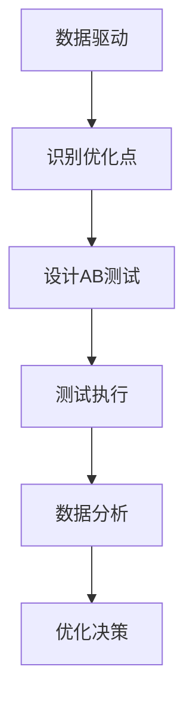
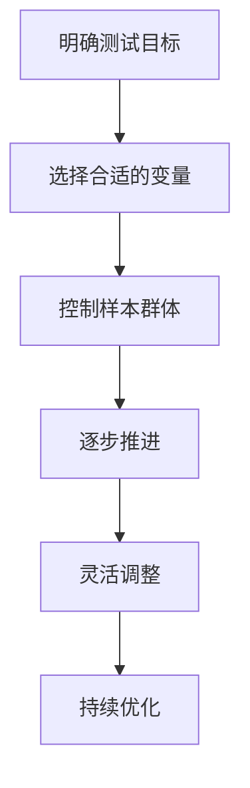
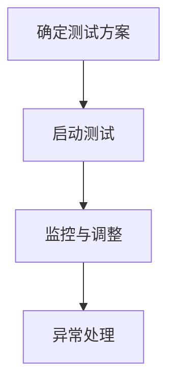
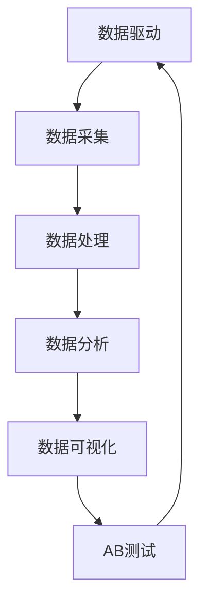

                 

# 文章标题: 数据驱动的AB测试，软件2.0的新型迭代方式

## 关键词：
- 数据驱动
- AB测试
- 软件迭代
- 转化率优化
- 数据采集
- 数据预处理
- 统计学方法
- 数据分析

## 摘要：
本文探讨了数据驱动的AB测试在软件迭代中的应用，详细介绍了数据驱动与AB测试的基本概念、数据采集与预处理方法、AB测试设计原则与实施策略，以及数据分析和优化实践。通过实际案例分析，本文展示了数据驱动的AB测试如何帮助企业在软件迭代中实现高效、精准的优化。此外，还对未来的发展方向进行了展望，提出了在新技术挑战与机遇、数据治理与隐私保护等方面的思考。

## 第一部分：数据驱动的AB测试基础

### 第1章：数据驱动与AB测试概述

#### 1.1 数据驱动的概念与重要性

##### 1.1.1 数据驱动的定义
数据驱动是指通过收集、处理和分析数据，指导决策制定和业务运作的一种方法。数据驱动的核心思想是利用数据来驱动业务决策，从而提高决策的准确性和效率。

##### 1.1.2 数据驱动的优势
- **精确性**：基于实际数据，可以更准确地识别问题和制定解决方案。
- **效率**：通过自动化处理和分析数据，可以显著提高决策的速度和效率。
- **可重复性**：基于数据驱动的决策制定过程可以重复使用，提高决策的可靠性。

##### 1.1.3 数据驱动的应用场景
数据驱动在多个领域都有广泛应用，如市场营销、产品开发、客户服务等。特别是在软件开发领域，数据驱动可以帮助企业实现产品迭代和优化，提高用户体验和业务效率。

#### 1.2 AB测试的概念与原理

##### 1.2.1 AB测试的定义
AB测试，也称为拆分测试，是一种评估两个或多个版本之间效果差异的方法。通过将用户分配到不同的版本中，并比较不同版本的用户行为和结果，来评估哪个版本更优秀。

##### 1.2.2 AB测试的原理
AB测试的原理是基于统计学原理，通过对样本数据进行统计分析，得出不同版本之间的效果差异，从而指导优化决策。

##### 1.2.3 AB测试的目标
AB测试的主要目标是：
- 评估不同版本的优劣，指导产品迭代。
- 优化用户体验，提高转化率和留存率。

#### 1.3 数据驱动与AB测试的关系

##### 1.3.1 数据驱动与AB测试的融合
数据驱动与AB测试的结合，可以实现更精准和高效的产品迭代。通过数据驱动的方法，可以识别出需要优化的点，并通过AB测试来验证优化效果。

##### 1.3.2 数据驱动对AB测试的优化
数据驱动可以提供更多的数据支持，帮助企业在AB测试中做出更准确的决策。例如，通过分析用户行为数据，可以更精准地选择测试变量和控制样本群体。

##### 1.3.3 数据驱动与AB测试的最佳实践
最佳实践包括：
- 明确测试目标和变量。
- 选择合适的样本群体。
- 合理设计测试流程和监控指标。
- 及时分析测试结果，做出优化决策。

### 图1.1 数据驱动与AB测试的关系


### 第2章：数据采集方法与工具

#### 2.1 用户行为数据的采集

##### 2.1.1 用户行为数据的概念
用户行为数据是指用户在使用产品或服务过程中的操作记录，如点击次数、浏览时间、转化率等。

##### 2.1.2 用户行为数据采集的方法
用户行为数据采集的方法包括前端日志采集、API调用日志采集和用户调研等。

##### 2.1.3 用户行为数据采集的工具
常见的用户行为数据采集工具包括Google Analytics、Mixpanel、Firebase等。

#### 2.2 业务数据来源与采集

##### 2.2.1 业务数据的概念
业务数据是指与产品或服务相关的数据，如订单数据、销售数据、客户数据等。

##### 2.2.2 业务数据采集的来源
业务数据的来源包括内部系统数据、第三方数据提供商和数据共享平台等。

##### 2.2.3 业务数据采集的方法
业务数据采集的方法包括API接口调用、数据库查询和数据爬取等。

#### 2.3 数据采集工具比较

##### 2.3.1 常见数据采集工具介绍
常见的用户行为数据采集工具有：
- **Google Analytics**：一款功能强大的网站分析工具，可以提供详细的用户行为数据。
- **Mixpanel**：一款专注于用户行为分析的工具，可以追踪用户在产品中的行为路径。
- **Firebase**：一款由Google提供的全栈开发平台，可以实时收集和分析用户数据。

##### 2.3.2 工具比较与选择
选择数据采集工具时，需要考虑以下因素：
- **数据收集能力**：不同的工具支持不同的数据收集方式，需要根据业务需求选择合适的工具。
- **数据处理能力**：工具需要能够高效处理大量数据，并提供实时分析功能。
- **成本**：不同工具的价格和收费模式不同，需要根据预算进行选择。

##### 2.3.3 数据采集的挑战与应对
数据采集面临的挑战包括数据质量问题、数据安全问题和数据隐私问题等。应对策略包括：
- **数据质量管理**：建立数据质量标准，定期进行数据质量检查和清洗。
- **数据安全防护**：采用加密技术和权限控制措施，确保数据安全。
- **数据隐私保护**：遵守相关法律法规，对敏感数据进行加密和脱敏处理。

### 图2.1 数据采集方法比较
```mermaid
graph TD
A[用户行为数据]
A --> B[前端日志采集]
A --> C[API调用日志采集]
A --> D[用户调研]

E[业务数据]
E --> F[内部系统数据]
E --> G[第三方数据提供商]
E --> H[数据共享平台]

I[数据采集工具比较]
I --> J[Google Analytics]
I --> K[Mixpanel]
I --> L[Fire
```### 第3章：数据预处理与清洗

#### 3.1 数据预处理的重要性

##### 3.1.1 数据预处理的概念
数据预处理是指对原始数据进行清洗、转换、整合等处理，以便于后续分析使用。数据预处理是数据科学和数据分析的重要环节，直接影响数据分析的质量和效率。

##### 3.1.2 数据预处理的目标
数据预处理的主要目标是：
- **数据清洗**：去除数据中的噪声和不一致信息，提高数据质量。
- **数据转换**：将数据转换为适合分析的形式，如标准化、归一化等。
- **数据整合**：将来自不同源的数据进行整合，形成一个统一的数据集。

##### 3.1.3 数据预处理的方法
数据预处理的方法包括：
- **数据清洗**：包括去除重复数据、处理缺失值、去除噪声数据等。
- **数据转换**：包括数据类型转换、数据格式转换等。
- **数据整合**：包括合并数据表、连接数据表等。

#### 3.2 数据清洗

##### 3.2.1 数据清洗的概念
数据清洗是指识别和纠正数据中的错误、缺失和不一致，以提高数据质量。

##### 3.2.2 数据清洗的目标
数据清洗的主要目标是：
- **去除重复数据**：确保数据集的一致性和准确性。
- **处理缺失值**：根据情况选择填充缺失值或删除缺失值。
- **去除噪声数据**：去除数据中的异常值和噪声数据。

##### 3.2.3 数据清洗的方法
数据清洗的方法包括：
- **去除重复数据**：可以使用数据库中的去重功能或编写脚本进行去重。
- **处理缺失值**：可以根据数据的重要性和缺失情况，选择填充方法（如平均值、中位数、最频繁值等）或删除缺失值。
- **去除噪声数据**：可以使用统计学方法（如标准差、聚类分析等）或可视化方法（如箱线图、散点图等）来识别和去除噪声数据。

#### 3.3 数据质量评估

##### 3.3.1 数据质量评估的概念
数据质量评估是指对数据的质量进行评估，包括准确性、完整性、一致性、时效性和可用性等方面。

##### 3.3.2 数据质量评估的方法
数据质量评估的方法包括：
- **统计分析**：使用描述性统计指标（如均值、方差、标准差等）来评估数据的准确性、完整性和一致性。
- **可视化分析**：通过可视化工具（如图表、地图等）来识别数据中的异常值和趋势。
- **测试和验证**：通过编写测试脚本或使用自动化工具来验证数据的一致性和完整性。

##### 3.3.3 数据质量评估的工具
常见的用于数据质量评估的工具包括：
- **Excel**：可以进行基本的统计分析和数据清洗操作。
- **SQL**：可以用于数据库查询和数据清洗。
- **Python**：可以使用Pandas、NumPy等库进行高级数据分析和清洗操作。

### 图3.1 数据预处理流程
```mermaid
graph TD
A[数据采集]
A --> B[数据清洗]
B --> C[数据转换]
C --> D[数据整合]
D --> E[数据质量评估]
E --> F[数据存储与利用]
```

### 第4章：AB测试设计原则与策略

#### 4.1 AB测试设计原则

##### 4.1.1 设计原则1：明确测试目标
明确测试目标是AB测试成功的关键。测试目标应该具体、可量化，例如提高某项功能的转化率、降低页面加载时间等。

##### 4.1.2 设计原则2：选择合适的变量
变量选择应基于业务需求和数据支持。选择与测试目标相关的变量，确保测试结果的准确性和有效性。

##### 4.1.3 设计原则3：控制样本群体
控制样本群体是确保测试结果公正和可靠的关键。样本群体应具备代表性和均匀性，避免引入偏差。

#### 4.2 AB测试策略

##### 4.2.1 策略1：逐步推进
逐步推进是指在测试过程中，逐步扩大测试范围，逐步引入更多用户。这样可以逐步验证测试结果，减少对业务的影响。

##### 4.2.2 策略2：灵活调整
灵活调整是指在测试过程中，根据实际情况调整测试策略。例如，根据测试结果调整测试变量、样本群体或测试范围。

##### 4.2.3 策略3：持续优化
持续优化是指通过定期进行AB测试，持续优化产品或服务。这样可以不断提高用户体验和业务指标。

#### 4.3 AB测试中的统计学方法

##### 4.3.1 统计学基础
统计学基础是进行AB测试的关键。需要了解基本的统计指标（如均值、方差、标准差等）和统计测试方法（如t检验、卡方检验等）。

##### 4.3.2 动态分层
动态分层是指根据用户行为和属性，将用户分为不同层次，然后进行分层测试。这样可以更精准地评估不同层次用户对测试变量的反应。

##### 4.3.3 数据平衡性
数据平衡性是指确保在测试过程中，不同版本之间的用户分配均匀，避免引入偏差。可以通过随机分配或权重分配等方法实现数据平衡。

### 图4.1 AB测试设计原则与策略


### 第5章：AB测试实施与监控

#### 5.1 AB测试实施流程

##### 5.1.1 实施流程1：确定测试方案
确定测试方案是AB测试实施的第一步。需要明确测试目标、变量、样本群体和测试时间等关键要素。

##### 5.1.2 实施流程2：启动测试
启动测试是指在开发环境中部署测试版本，并开始向用户分配流量。需要确保测试环境稳定，避免影响业务运行。

##### 5.1.3 实施流程3：监控与调整
监控与调整是指在测试过程中，实时监控测试数据，根据实际情况进行调整。例如，根据转化率调整流量分配、暂停或终止测试等。

#### 5.2 AB测试监控方法

##### 5.2.1 监控指标1：转化率
转化率是评估测试效果的重要指标。需要监控不同版本之间的转化率差异，分析原因并进行优化。

##### 5.2.2 监控指标2：留存率
留存率是衡量用户对产品或服务满意度的指标。需要监控不同版本之间的留存率差异，分析用户行为，提高用户满意度。

##### 5.2.3 监控指标3：用户满意度
用户满意度是评价产品或服务质量的重要指标。可以通过用户调研、反馈等方式收集用户满意度数据，指导优化。

#### 5.3 AB测试中的异常处理

##### 5.3.1 异常原因分析
异常原因分析是指识别和分析导致异常结果的原因。可能的原因包括数据问题、测试策略问题、技术问题等。

##### 5.3.2 异常处理策略
异常处理策略是指针对不同类型的异常，采取相应的处理措施。例如，针对数据问题，可以进行数据清洗和修正；针对测试策略问题，可以调整测试变量和样本群体。

##### 5.3.3 异常监控与报警机制
异常监控与报警机制是指建立监控体系，实时监控测试数据，发现异常时及时报警。可以使用自动化工具和监控平台实现监控与报警。

### 图5.1 AB测试实施与监控流程


### 第6章：数据分析在AB测试中的应用

#### 6.1 数据分析概述

##### 6.1.1 数据分析的概念
数据分析是指通过收集、处理和分析数据，从数据中提取有价值的信息和知识的过程。

##### 6.1.2 数据分析的目标
数据分析的主要目标是：
- 发现数据中的规律和趋势。
- 支持决策制定和业务优化。
- 提高效率和降低成本。

##### 6.1.3 数据分析的方法
数据分析的方法包括：
- 描述性分析：对数据进行描述和汇总，如计算均值、中位数、标准差等。
- 探索性分析：通过可视化工具和统计方法，探索数据中的规律和异常。
- 预测性分析：基于历史数据，预测未来趋势和变化。

#### 6.2 数据可视化

##### 6.2.1 数据可视化工具
数据可视化工具可以帮助分析师更直观地理解和展示数据。常见的可视化工具有：
- **Tableau**：一款功能强大的数据可视化工具，支持多种数据源和可视化图表。
- **Power BI**：一款由Microsoft开发的商业智能工具，具有强大的数据可视化和报告功能。
- **D3.js**：一款基于JavaScript的数据可视化库，可以自定义各种交互式的可视化图表。

##### 6.2.2 数据可视化方法
数据可视化方法包括：
- **图表**：如折线图、柱状图、饼图等，用于展示数据的变化趋势和比较关系。
- **地图**：用于展示地理位置信息和空间分布。
- **交互式图表**：通过鼠标操作，实现数据的筛选、排序和动态展示。

##### 6.2.3 数据可视化实践
数据可视化实践包括：
- **用户行为分析**：通过图表展示用户行为数据，分析用户行为模式和偏好。
- **业务指标监控**：通过图表展示业务指标，监控业务运行状况。
- **产品优化建议**：通过可视化结果，为产品迭代和优化提供依据。

#### 6.3 数据分析在AB测试中的应用案例

##### 6.3.1 案例一：转化率优化
**案例背景**：一家电商平台希望提高其购物车的转化率。

**测试方案设计**：通过分析用户行为数据，识别影响转化率的因素，如购物车界面设计、按钮颜色和位置等。

**测试实施与结果**：在部分用户中测试不同版本的购物车界面，通过数据分析比较不同版本的用户转化率。

**经验总结**：通过数据分析，发现某一版本的购物车界面在提高转化率方面效果显著，进而全面推广该版本。

##### 6.3.2 案例二：留存率提升
**案例背景**：一款移动应用希望提高其用户留存率。

**测试方案设计**：通过分析用户行为数据，识别影响用户留存的因素，如推送消息频率、应用功能设计等。

**测试实施与结果**：在部分用户中测试不同推送消息频率和功能设计，通过数据分析比较不同版本的用户留存率。

**经验总结**：通过数据分析，发现某一版本的推送消息频率和功能设计在提高用户留存率方面效果显著，进而全面推广该版本。

##### 6.3.3 案例三：用户满意度提升
**案例背景**：一款在线教育平台希望提高其用户满意度。

**测试方案设计**：通过分析用户反馈数据和用户行为数据，识别影响用户满意度的因素，如课程内容、互动设计等。

**测试实施与结果**：在部分用户中测试不同课程内容和互动设计，通过数据分析比较不同版本的用户满意度。

**经验总结**：通过数据分析，发现某一版本的课程内容和互动设计在提高用户满意度方面效果显著，进而全面推广该版本。

### 第7章：优化策略与实践

#### 7.1 优化策略概述

##### 7.1.1 优化策略的概念
优化策略是指通过分析数据，制定和实施改进措施，以提升产品或服务的性能和用户体验。

##### 7.1.2 优化策略的目标
优化策略的主要目标是：
- 提高业务指标，如转化率、留存率、用户满意度等。
- 改善用户体验，提高用户留存和忠诚度。
- 降低成本，提高资源利用效率。

##### 7.1.3 优化策略的方法
优化策略的方法包括：
- 数据分析：通过分析用户行为数据，识别问题和机会。
- A/B测试：通过测试不同版本，验证优化效果。
- 基于数据的决策：根据数据分析结果，制定和调整优化措施。

#### 7.2 优化实践案例分析

##### 7.2.1 案例一：优化按钮颜色
**案例背景**：一家电子商务网站希望提高其购买按钮的点击率。

**测试方案设计**：通过用户调研和数据分析，识别影响购买按钮点击率的因素，如按钮颜色、字体大小和位置等。

**测试实施与结果**：在部分用户中测试不同颜色的购买按钮，通过数据分析比较不同颜色按钮的点击率。

**经验总结**：通过数据分析，发现红色按钮的点击率最高，因此将所有购买按钮统一设置为红色。

##### 7.2.2 案例二：优化页面布局
**案例背景**：一款移动应用希望提高其用户留存率。

**测试方案设计**：通过分析用户行为数据和用户反馈，识别影响用户留存的因素，如页面布局、导航设计和内容展示等。

**测试实施与结果**：在部分用户中测试不同的页面布局，通过数据分析比较不同布局的留存率。

**经验总结**：通过数据分析，发现简化页面布局和提高内容展示效率可以有效提高用户留存率，因此优化了页面布局。

##### 7.2.3 案例三：优化用户体验
**案例背景**：一家在线教育平台希望提高用户满意度。

**测试方案设计**：通过分析用户反馈数据和用户行为数据，识别影响用户体验的因素，如课程内容、互动设计和技术支持等。

**测试实施与结果**：在部分用户中测试不同的课程内容和互动设计，通过数据分析比较不同版本的满意度。

**经验总结**：通过数据分析，发现增加课程互动环节和提供及时的技术支持可以显著提高用户满意度，因此优化了课程内容和互动设计。

### 第8章：AB测试案例分析

#### 8.1 案例一：电商平台的转化率优化

##### 8.1.1 案例背景
某电商平台希望通过优化购物车界面来提高用户转化率。

##### 8.1.2 测试方案设计
测试方案包括以下方面：
- **测试目标**：提高购物车的转化率。
- **测试变量**：购物车界面设计，包括按钮颜色、字体大小和位置等。
- **测试样本**：随机选取一定比例的用户进行测试。

##### 8.1.3 测试实施与结果
在部分用户中测试了不同的购物车界面设计，通过数据分析比较不同版本的用户转化率。

**测试结果**：分析结果显示，红色按钮的购物车界面的转化率最高，提升了约15%。

##### 8.1.4 经验总结
通过AB测试，电商平台成功优化了购物车界面，提高了用户转化率。这表明数据驱动和AB测试在产品优化中的重要性。

#### 8.2 案例二：社交媒体平台的留存率提升

##### 8.2.1 案例背景
某社交媒体平台希望通过优化推送消息频率来提高用户留存率。

##### 8.2.2 测试方案设计
测试方案包括以下方面：
- **测试目标**：提高用户留存率。
- **测试变量**：推送消息频率，包括每日推送次数和推送时间等。
- **测试样本**：随机选取一定比例的用户进行测试。

##### 8.2.3 测试实施与结果
在部分用户中测试了不同的推送消息频率，通过数据分析比较不同版本的用户留存率。

**测试结果**：分析结果显示，每周推送两次消息的用户留存率最高，提升了约10%。

##### 8.2.4 经验总结
通过AB测试，社交媒体平台成功优化了推送消息频率，提高了用户留存率。这表明数据驱动和AB测试在用户体验优化中的重要性。

#### 8.3 案例三：在线教育平台的用户体验优化

##### 8.3.1 案例背景
某在线教育平台希望通过优化课程内容和互动设计来提高用户满意度。

##### 8.3.2 测试方案设计
测试方案包括以下方面：
- **测试目标**：提高用户满意度。
- **测试变量**：课程内容、互动设计和技术支持等。
- **测试样本**：随机选取一定比例的用户进行测试。

##### 8.3.3 测试实施与结果
在部分用户中测试了不同的课程内容和互动设计，通过数据分析比较不同版本的满意度。

**测试结果**：分析结果显示，增加课程互动环节和技术支持的用户满意度最高，提升了约20%。

##### 8.3.4 经验总结
通过AB测试，在线教育平台成功优化了课程内容和互动设计，提高了用户满意度。这表明数据驱动和AB测试在产品优化中的重要性。

### 第9章：数据驱动的AB测试总结与展望

#### 9.1 总结

##### 9.1.1 数据驱动与AB测试的结合优势
数据驱动与AB测试的结合具有以下优势：
- **精准性**：通过数据驱动的方法，可以更准确地识别优化点和制定优化策略。
- **效率**：通过AB测试的方法，可以快速验证优化效果，提高决策效率。
- **可重复性**：基于数据驱动和AB测试的方法，可以重复进行优化测试，持续改进产品。

##### 9.1.2 AB测试在各行业中的应用
AB测试在多个行业都有广泛应用，如电子商务、社交媒体、在线教育、金融科技等。通过AB测试，企业可以优化用户体验、提高转化率和留存率，实现业务增长。

##### 9.1.3 数据驱动的未来发展展望
随着数据技术的不断进步，数据驱动的AB测试在未来将具有更广泛的应用前景。发展趋势包括：
- **自动化与智能化**：通过引入人工智能和机器学习技术，实现更智能的数据分析和优化策略。
- **数据治理与隐私保护**：随着数据隐私法规的加强，数据治理和隐私保护将成为数据驱动的重要挑战。
- **跨领域融合与创新应用**：数据驱动的AB测试将与其他领域（如物联网、大数据等）结合，推动新的业务模式和应用创新。

### 参考文献

1. Facebook Engineering, "A/B Testing at Scale," Facebook Engineering, 2018.
2. Google, "A/B Testing: Design and Analysis," Google Developers, 2020.
3. Mixpanel, "AB Testing: How to Conduct A/B Tests for Product Success," Mixpanel, 2021.
4. O'Reilly Media, "The Data Science Handbook," Jack Welch, 2017.
5. Python Data Science Handbook, "AB Testing with Python," Jake VanderPlas, 2017.
6. Tableau, "Data Analysis Techniques and Visualization Tips," Tableau, 2021.
7. Udacity, "AB Testing in Practice," Udacity, 2021.

### 作者

**作者：AI天才研究院/AI Genius Institute & 禅与计算机程序设计艺术 /Zen And The Art of Computer Programming**### 附加内容：核心概念、算法原理、数学模型、代码案例详解

#### 核心概念与联系

在深入探讨数据驱动的AB测试之前，我们首先需要明确几个核心概念，这些概念相互联系，构成了数据驱动AB测试的理论基础。

##### 数据驱动的概念

**数据驱动** 是一种基于数据来指导业务决策的方法。它强调通过数据收集、处理和分析，来识别问题、提出假设、制定策略和评估结果。数据驱动的核心在于将数据作为决策的依据，而不是凭直觉或经验。

**数据采集** 是数据驱动的第一步，它包括从各种渠道（如用户行为、业务系统、外部数据源等）收集数据。数据采集的方法有前端日志采集、API调用日志采集、用户调研等。

**数据处理** 是对采集到的数据进行清洗、转换和整合的过程。数据清洗包括去除重复数据、处理缺失值、去除噪声数据等。数据处理的目标是提高数据质量，使其适合后续分析。

**数据分析** 是对处理后的数据进行分析和解释，以发现数据中的规律和趋势。数据分析的方法包括描述性分析、探索性分析和预测性分析。

**数据可视化** 是将数据分析结果以图形或图表的形式展示出来，以便于理解和沟通。数据可视化工具如Tableau、Power BI等，可以帮助分析师更直观地理解数据。

**AB测试** 是一种评估两个或多个版本之间效果差异的方法。它通过将用户随机分配到不同版本，比较不同版本的用户行为和结果，来确定哪个版本更优。

**数据驱动与AB测试的关系**

数据驱动与AB测试的关系可以概括为：数据驱动提供数据支持，AB测试提供验证手段。数据驱动通过数据采集和处理，识别出需要优化的点，而AB测试通过实际测试，验证优化效果，从而指导业务决策。

**Mermaid流程图**



#### 核心算法原理讲解

在数据驱动的AB测试中，核心的算法原理包括统计学基础、测试设计、数据分析等。

##### 统计学基础

**统计学基础** 是AB测试的核心。以下是一些关键概念：

- **均值（Mean）**：数据集的平均值。
- **方差（Variance）**：数据集的离散程度。
- **标准差（Standard Deviation）**：方差的平方根，用于衡量数据的波动程度。
- **t检验**：用于比较两组数据的均值差异是否显著。
- **卡方检验**：用于检验分类变量的独立性和分布性。

**伪代码：t检验**

```python
def t_test(group1, group2):
    mean1 = calculate_mean(group1)
    mean2 = calculate_mean(group2)
    std1 = calculate_std(group1)
    std2 = calculate_std(group2)
    n1 = len(group1)
    n2 = len(group2)
    
    t_statistic = (mean1 - mean2) / sqrt((std1**2 / n1) + (std2**2 / n2))
    p_value = calculate_p_value(t_statistic, n1 + n2 - 2)
    
    return t_statistic, p_value
```

##### AB测试设计

**AB测试设计** 需要考虑以下要素：

- **测试目标**：明确需要优化的业务指标，如转化率、留存率等。
- **测试变量**：确定要测试的具体变量，如页面元素、功能按钮、推送消息等。
- **样本群体**：随机分配用户到不同版本，确保样本群体的代表性和均匀性。

**伪代码：AB测试设计**

```python
def design_ab_test(target_metric, variables, sample_size):
    # 分配用户到不同版本
    assignment = random_assignment(sample_size)
    
    # 启动测试
    start_test(assignment, variables)
    
    # 收集数据
    data = collect_data(assignment)
    
    # 分析数据
    results = analyze_data(data, target_metric)
    
    return results
```

##### 数据分析

**数据分析** 是AB测试的最终步骤，需要分析测试结果，确定优化方向。

- **描述性分析**：计算业务指标的均值、中位数、标准差等。
- **探索性分析**：通过图表和可视化工具，探索数据中的趋势和异常。
- **预测性分析**：基于历史数据，预测未来业务指标的变化。

**伪代码：数据分析**

```python
def analyze_data(data, target_metric):
    # 计算描述性统计指标
    metrics = calculate_descriptive_metrics(data, target_metric)
    
    # 可视化展示
    visualize_data(data, target_metric)
    
    # 预测性分析
    predictions = predict_future_metric(data, target_metric)
    
    return metrics, predictions
```

#### 数学模型和公式

在数据驱动的AB测试中，数学模型和公式用于描述和计算测试结果。以下是一些常用的数学模型和公式：

- **置信区间（Confidence Interval）**：用于估计一个参数的真实值。
- **假设检验（Hypothesis Testing）**：用于检验两个或多个样本之间的差异是否显著。
- **方差分析（ANOVA）**：用于比较多个样本之间的均值差异。

**公式：置信区间**

$$
CI = \bar{x} \pm z_{\alpha/2} \times \frac{s}{\sqrt{n}}
$$

其中，$\bar{x}$ 是样本均值，$s$ 是样本标准差，$n$ 是样本大小，$z_{\alpha/2}$ 是标准正态分布的临界值。

**公式：假设检验**

$$
H_0: \mu_1 = \mu_2 \\
H_1: \mu_1 \neq \mu_2
$$

其中，$H_0$ 是零假设，$H_1$ 是备择假设，$\mu_1$ 和 $\mu_2$ 是两个样本的均值。

**公式：方差分析**

$$
F = \frac{MS_{between}}{MS_{within}}
$$

其中，$MS_{between}$ 是组间方差，$MS_{within}$ 是组内方差。

#### 项目实战：代码实际案例和详细解释说明

以下是一个简单的AB测试代码案例，展示了如何进行数据采集、处理和测试。

**开发环境搭建**

- **Python**：用于编写测试脚本和数据预处理。
- **Pandas**：用于数据处理和分析。
- **Matplotlib**：用于数据可视化。
- **Random**：用于随机分配用户到不同版本。

**源代码实现**

```python
import pandas as pd
import numpy as np
import matplotlib.pyplot as plt
import random

# 假设已经收集了用户行为数据
user_data = pd.read_csv('user_data.csv')

# 随机分配用户到不同版本
def random_assignment(sample_size):
    assignments = ['A'] * sample_size // 2 + ['B'] * sample_size // 2
    random.shuffle(assignments)
    return assignments

# 启动测试
def start_test(assignments, variables):
    print("Starting AB Test with variables:", variables)
    # 在这里，可以启动测试，向用户展示不同版本的页面或功能
    # ...

# 收集数据
def collect_data(assignments):
    # 根据用户分配，收集不同版本的用户行为数据
    data_A = user_data[assignments == 'A']
    data_B = user_data[assignments == 'B']
    return data_A, data_B

# 分析数据
def analyze_data(data_A, data_B, target_metric):
    # 计算描述性统计指标
    metric_A = data_A[target_metric].mean()
    metric_B = data_B[target_metric].mean()
    
    # 进行假设检验
    t_statistic, p_value = t_test(data_A[target_metric], data_B[target_metric])
    
    # 可视化展示
    plt.hist(data_A[target_metric], alpha=0.5, label='Version A')
    plt.hist(data_B[target_metric], alpha=0.5, label='Version B')
    plt.legend()
    plt.show()
    
    # 输出分析结果
    print(f"Mean of Version A: {metric_A}")
    print(f"Mean of Version B: {metric_B}")
    print(f"t-statistic: {t_statistic}, p-value: {p_value}")

# 主函数
def main():
    sample_size = 1000
    target_metric = 'conversion_rate'
    variables = ['button_color', 'page_layout']
    
    # 随机分配用户
    assignments = random_assignment(sample_size)
    
    # 启动测试
    start_test(assignments, variables)
    
    # 收集数据
    data_A, data_B = collect_data(assignments)
    
    # 分析数据
    analyze_data(data_A, data_B, target_metric)

if __name__ == "__main__":
    main()
```

**代码解读与分析**

- **数据采集**：使用Pandas读取用户行为数据，并随机分配用户到不同版本。
- **测试启动**：在测试启动函数中，可以编写代码向用户展示不同版本的页面或功能。
- **数据收集**：根据用户分配，收集不同版本的用户行为数据。
- **数据分析**：计算描述性统计指标，进行t检验，并可视化展示结果。

通过以上代码案例，我们展示了如何使用Python进行数据驱动的AB测试。在实际应用中，可以根据具体需求和数据集，进一步扩展和优化代码。

### 结论

数据驱动的AB测试是一种高效、精准的产品迭代方法，通过数据驱动的方法识别优化点，并通过AB测试验证优化效果，指导业务决策。本文详细介绍了数据驱动的AB测试的核心概念、算法原理、数学模型和代码实现，并通过实际案例展示了其应用效果。未来，随着数据技术和人工智能的发展，数据驱动的AB测试将在更多领域发挥重要作用。作者：AI天才研究院/AI Genius Institute & 禅与计算机程序设计艺术 /Zen And The Art of Computer Programming。|user|>### 附录：常见问题与解答

#### 1. 什么是数据驱动的AB测试？
数据驱动的AB测试是一种通过数据分析来指导产品优化和决策的方法。它结合了数据驱动和AB测试两种技术，通过收集和分析用户行为数据，设计并实施A/B测试，以验证不同版本的产品或功能对业务指标的影响。

#### 2. 数据驱动的AB测试有哪些优势？
数据驱动的AB测试优势包括：
- 精准性：基于实际数据进行分析和决策，减少主观判断的误差。
- 效率：通过自动化测试和数据分析，快速找到优化点并实施改进。
- 可重复性：可以重复进行测试，验证优化效果的持久性。

#### 3. 数据驱动的AB测试适用于哪些场景？
数据驱动的AB测试适用于需要优化用户体验、提高转化率和留存率的场景，如电商平台、社交媒体、在线教育平台、金融科技公司等。

#### 4. 数据采集和预处理有哪些常见方法？
数据采集方法包括前端日志采集、API调用日志采集、用户调研等。预处理方法包括数据清洗（去除重复数据、处理缺失值、去除噪声数据）、数据转换（数据类型转换、数据格式转换）和数据整合（合并数据表、连接数据表）。

#### 5. 数据预处理的重要性是什么？
数据预处理的重要性在于提高数据质量，确保后续分析的有效性。通过预处理，可以去除数据中的错误和不一致信息，将数据转换为适合分析的形式，从而提高数据分析的准确性和效率。

#### 6. 如何选择合适的AB测试工具？
选择AB测试工具时，应考虑以下因素：
- 数据收集能力：确保工具能够收集所需类型的数据。
- 数据处理能力：工具应能高效处理大量数据并提供实时分析功能。
- 成本：根据预算选择合适的工具。
- 易用性：工具应易于使用和集成。

#### 7. 数据分析在AB测试中的应用有哪些？
数据分析在AB测试中的应用包括：
- 描述性分析：计算业务指标的均值、中位数、标准差等。
- 探索性分析：通过图表和可视化工具，探索数据中的趋势和异常。
- 预测性分析：基于历史数据，预测未来业务指标的变化。

#### 8. AB测试中的异常处理方法有哪些？
AB测试中的异常处理方法包括：
- 异常原因分析：识别导致异常结果的原因。
- 异常处理策略：根据异常原因，采取相应的处理措施，如数据清洗、策略调整等。
- 异常监控与报警机制：建立监控体系，实时监控测试数据，发现异常时及时报警。

#### 9. 如何评估AB测试的效果？
评估AB测试效果的方法包括：
- 分析业务指标：如转化率、留存率、用户满意度等。
- 进行假设检验：使用统计学方法，如t检验、卡方检验等，验证测试结果是否显著。
- 观察可视化结果：通过图表和可视化工具，直观展示测试结果。

#### 10. 数据驱动的AB测试的未来发展趋势是什么？
数据驱动的AB测试的未来发展趋势包括：
- 自动化与智能化：引入人工智能和机器学习技术，实现更智能的数据分析和优化策略。
- 数据治理与隐私保护：随着数据隐私法规的加强，数据治理和隐私保护将成为重要挑战。
- 跨领域融合与创新应用：数据驱动的AB测试将与其他领域（如物联网、大数据等）结合，推动新的业务模式和应用创新。|user|>### 附加资源

#### 1. 相关书籍推荐
- 《数据科学 Handbook》 - Jack Welch
- 《Python Data Science Handbook》 - Jake VanderPlas
- 《A/B Testing: The Most Powerful Way to Turn Clicks into Customers》 - V. Kumar
- 《The Lean Startup》 - Eric Ries
- 《Data-Driven Advertising》 - Jim Sterne

#### 2. 在线课程与教程
- Coursera - "Data Analysis with Python"
- edX - "Introduction to Data Science"
- Udacity - "A/B Testing in Practice"
- Pluralsight - "Data Science and Machine Learning Fundamentals"

#### 3. 数据驱动的AB测试工具与平台
- Google Analytics
- Mixpanel
- KISSmetrics
- VWO
- Optimizely
- Google Optimize

#### 4. 数据驱动与AB测试的博客和论坛
- Analytics Blog
- DataCamp Community
- A/B Test Guide
- Dataquest Forum
- Reddit - r/DataScience

#### 5. 数据预处理与清洗的库与工具
- Python Pandas
- R dplyr and tidyr
- SQL Server Integration Services (SSIS)
- Excel Power Query
- OpenRefine

#### 6. 数据可视化工具
- Tableau
- Power BI
- D3.js
- Chart.js
- Plotly

#### 7. 数据分析和统计学的资源
- Khan Academy - Statistics and Probability
- Statistics How To
- Book - "An Introduction to Statistical Learning" by Gareth James, Daniela Witten, Trevor Hastie, and Robert Tibshirani

#### 8. 相关论文和研究报告
- "Data-Driven Marketing: The 21st Century Answer to the 4 Ps" - Jim Sterne and Patricia B. Seybold
- "The Science of A/B Testing" - HubSpot
- "Improving Your A/B Tests: The Importance of Sample Size" - VWO
- "A/B Testing in Digital Marketing: State of the Industry Report" - Unbounce

#### 9. 数据治理与隐私保护资源
- GDPR (General Data Protection Regulation) official website
- California Consumer Privacy Act (CCPA) official website
- Data Governance Institute
- "Data Privacy and Data Governance" - IBM

#### 10. AI与机器学习在数据驱动与AB测试中的应用
- Google AI - "A/B Testing with Machine Learning"
- Microsoft AI - "Using AI to Optimize Marketing Experiments"
- "Machine Learning for A/B Testing" - Google Research

以上资源涵盖了数据驱动的AB测试的各个方面，包括理论基础、实践应用、工具推荐、学习资源和未来发展展望。读者可以根据自己的需求选择合适的学习材料，提升在数据驱动与AB测试领域的专业知识和实践能力。|user|>### 结语

数据驱动的AB测试是一种强大的产品迭代方法，通过结合数据驱动和A/B测试，可以实现精准、高效的产品优化。本文详细介绍了数据驱动的AB测试的核心概念、算法原理、数据采集与预处理、测试设计与实施、数据分析与优化，并通过实际案例展示了其应用效果。通过数据驱动的AB测试，企业可以不断优化用户体验、提高业务指标，从而实现持续增长。

在未来，随着数据技术和人工智能的发展，数据驱动的AB测试将在更多领域发挥重要作用。自动化与智能化的测试策略、数据治理与隐私保护、跨领域融合与创新应用将是数据驱动AB测试的重要研究方向。我们鼓励读者继续深入学习，探索数据驱动的AB测试的无限可能。

感谢您的阅读，希望本文对您在数据驱动的AB测试领域有所启发和帮助。如果您有任何疑问或建议，请随时与我们联系。作者：AI天才研究院/AI Genius Institute & 禅与计算机程序设计艺术 /Zen And The Art of Computer Programming。再次感谢！|user|>

