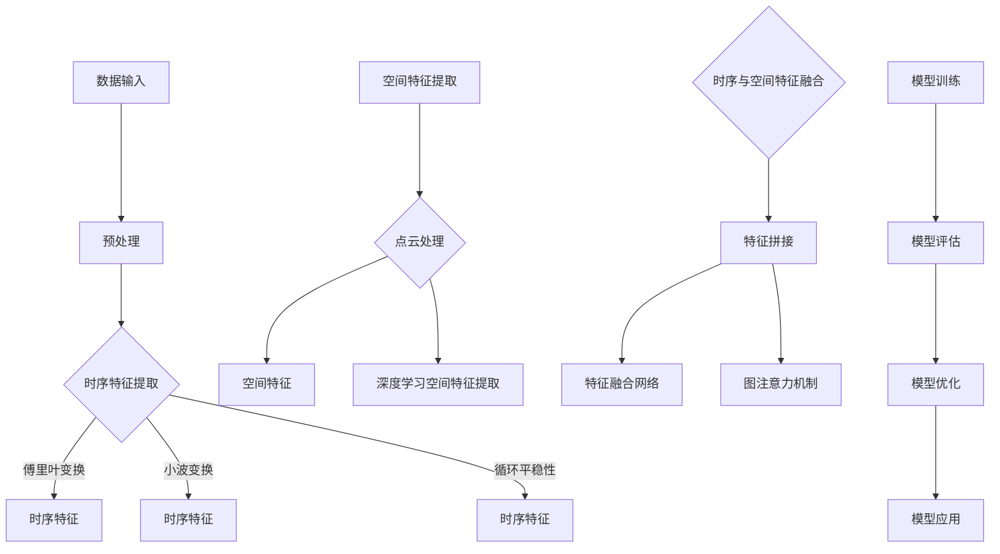

                 

### 文章标题

《时空特征学习如何革新自动驾驶视觉泛化的核心范式》

### 文章关键词

时空特征学习，自动驾驶，视觉泛化，核心范式，卷积神经网络，递归神经网络，图神经网络，深度学习

### 摘要

本文深入探讨了时空特征学习在自动驾驶视觉泛化中的应用，分析了其基本原理、算法原理及实际应用案例。通过对比时空特征学习与传统特征提取方法的差异，详细阐述了时空特征学习在自动驾驶中的核心应用和面临的挑战，并结合具体实战案例，展示了时空特征学习的强大潜力。本文旨在为自动驾驶领域的研究者和从业者提供有价值的理论指导和实践参考。

# 《时空特征学习如何革新自动驾驶视觉泛化的核心范式》目录大纲

## 第一部分：时空特征学习的基本原理

### 第1章：时空特征学习概述

#### 1.1 时空特征学习的重要性

**内容概述：**  
本章将介绍时空特征学习在自动驾驶视觉泛化中的重要性，从自动驾驶的发展历程、视觉系统的挑战以及时空特征学习的作用等多个角度进行分析，阐述其在自动驾驶领域中的关键地位。

#### 1.2 时空特征学习的应用场景

**内容概述：**  
本章将讨论时空特征学习在自动驾驶中的具体应用场景，包括障碍物检测、车辆跟踪、场景理解等，分析不同场景下时空特征学习的应用需求和技术挑战。

#### 1.3 时空特征学习与传统特征提取方法的比较

**内容概述：**  
本章将对比时空特征学习与传统特征提取方法，分析两者的优缺点，探讨时空特征学习在处理自动驾驶视觉问题时的优势，为后续章节的深入讨论奠定基础。

### 第2章：时空特征学习的核心概念与联系

#### 2.1 时空数据的基本概念

**内容概述：**  
本章将介绍时空数据的基本概念，包括时序数据和空间数据，阐述时空数据在自动驾驶中的应用和价值。

#### 2.2 时序特征提取方法

**内容概述：**  
本章将探讨时序特征提取的方法，介绍常见的时间序列分析技术，如傅里叶变换、小波变换、循环平稳性等，分析其在自动驾驶中的应用。

#### 2.3 空间特征提取方法

**内容概述：**  
本章将讨论空间特征提取的方法，介绍常见的空间数据分析技术，如点云处理、深度学习中的空间特征提取等，分析其在自动驾驶中的应用。

#### 2.4 时序与空间特征融合方法

**内容概述：**  
本章将介绍时序与空间特征的融合方法，包括特征拼接、特征融合网络等，分析不同融合方法在自动驾驶中的适用场景和效果。

#### 2.5 时空特征学习的Mermaid流程图

**内容概述：**  
本章将使用Mermaid语言绘制时空特征学习的流程图，详细展示从数据输入到特征提取、融合、输出的完整过程，帮助读者直观理解时空特征学习的基本原理。

## 第二部分：时空特征学习算法原理

### 第3章：卷积神经网络在时空特征学习中的应用

#### 3.1 卷积神经网络的基本原理

**内容概述：**  
本章将介绍卷积神经网络（CNN）的基本原理，包括卷积层、池化层、全连接层等结构，分析CNN在图像处理中的优势和应用。

#### 3.2 一维卷积神经网络（1D-CNN）

**内容概述：**  
本章将探讨一维卷积神经网络（1D-CNN）在时序数据处理中的应用，介绍1D-CNN的架构、训练过程和常用模型，分析其在自动驾驶中的适用性。

#### 3.3 二维卷积神经网络（2D-CNN）

**内容概述：**  
本章将介绍二维卷积神经网络（2D-CNN）在图像处理中的应用，分析2D-CNN的架构、训练过程和常用模型，探讨其在自动驾驶视觉中的应用。

#### 3.4 三维卷积神经网络（3D-CNN）

**内容概述：**  
本章将探讨三维卷积神经网络（3D-CNN）在视频处理中的应用，介绍3D-CNN的架构、训练过程和常用模型，分析其在自动驾驶视觉中的优势。

#### 3.5 卷积神经网络的伪代码实现

**内容概述：**  
本章将使用伪代码详细描述卷积神经网络的基本结构和工作流程，包括卷积操作、池化操作、激活函数等，帮助读者理解CNN的原理和实现。

### 第4章：递归神经网络在时空特征学习中的应用

#### 4.1 递归神经网络的基本原理

**内容概述：**  
本章将介绍递归神经网络（RNN）的基本原理，包括RNN的结构、工作原理和常见问题，如梯度消失、梯度爆炸等，分析RNN在时序数据处理中的应用。

#### 4.2 长短时记忆网络（LSTM）

**内容概述：**  
本章将探讨长短时记忆网络（LSTM）在时序数据处理中的应用，介绍LSTM的架构、训练过程和常用模型，分析LSTM在自动驾驶中的优势。

#### 4.3 门控循环单元（GRU）

**内容概述：**  
本章将介绍门控循环单元（GRU）在时序数据处理中的应用，分析GRU与LSTM的异同，介绍GRU的架构、训练过程和常用模型，探讨GRU在自动驾驶中的适用性。

#### 4.4 递归神经网络的伪代码实现

**内容概述：**  
本章将使用伪代码详细描述递归神经网络的基本结构和工作流程，包括输入层、隐藏层、输出层等，帮助读者理解RNN的原理和实现。

### 第5章：图神经网络在时空特征学习中的应用

#### 5.1 图神经网络的基本原理

**内容概述：**  
本章将介绍图神经网络（GNN）的基本原理，包括图表示、图卷积、图注意力机制等，分析GNN在图数据处理中的应用。

#### 5.2 图卷积网络（GCN）

**内容概述：**  
本章将探讨图卷积网络（GCN）在图数据处理中的应用，介绍GCN的架构、训练过程和常用模型，分析GCN在自动驾驶视觉中的优势。

#### 5.3 图注意力网络（GAT）

**内容概述：**  
本章将介绍图注意力网络（GAT）在图数据处理中的应用，分析GAT与GCN的异同，介绍GAT的架构、训练过程和常用模型，探讨GAT在自动驾驶中的适用性。

#### 5.4 图神经网络的伪代码实现

**内容概述：**  
本章将使用伪代码详细描述图神经网络的基本结构和工作流程，包括图表示、图卷积、图注意力等，帮助读者理解GNN的原理和实现。

### 第6章：时空特征学习的数学模型

#### 6.1 数学公式介绍

**内容概述：**  
本章将介绍时空特征学习中的核心数学公式，包括卷积公式、激活函数公式、损失函数公式等，为后续章节的数学模型讲解打下基础。

#### 6.2 数学模型的详细讲解

**内容概述：**  
本章将详细讲解时空特征学习中的数学模型，包括卷积神经网络模型、递归神经网络模型、图神经网络模型等，分析模型的基本原理和优缺点。

#### 6.3 数学模型的举例说明

**内容概述：**  
本章将通过具体实例，展示时空特征学习中的数学模型如何应用于实际问题，包括数据预处理、模型训练、模型评估等，帮助读者理解模型的实现和应用。

## 第三部分：时空特征学习在自动驾驶视觉泛化中的应用

### 第7章：时空特征学习在自动驾驶中的核心应用

#### 7.1 自动驾驶视觉系统的概述

**内容概述：**  
本章将介绍自动驾驶视觉系统的基本构成，包括摄像头、激光雷达、GPS等传感器，分析视觉系统在自动驾驶中的作用和重要性。

#### 7.2 时空特征学习在自动驾驶中的挑战

**内容概述：**  
本章将讨论时空特征学习在自动驾驶中的挑战，包括数据复杂性、实时性要求、准确性需求等，分析如何通过时空特征学习解决这些问题。

#### 7.3 时空特征学习在自动驾驶中的具体应用

**内容概述：**  
本章将详细介绍时空特征学习在自动驾驶中的具体应用，包括障碍物检测、车辆跟踪、场景理解等，分析不同应用场景下时空特征学习的方法和效果。

### 第8章：时空特征学习在自动驾驶视觉泛化中的实战案例

#### 8.1 实战案例一：基于时空特征学习的自动驾驶障碍物检测

**内容概述：**  
本章将介绍一个基于时空特征学习的自动驾驶障碍物检测案例，包括数据集选择、模型设计、训练过程、模型评估等，分析时空特征学习在障碍物检测中的优势和挑战。

#### 8.2 实战案例二：基于时空特征学习的自动驾驶车辆跟踪

**内容概述：**  
本章将介绍一个基于时空特征学习的自动驾驶车辆跟踪案例，包括数据集选择、模型设计、训练过程、模型评估等，分析时空特征学习在车辆跟踪中的效果和适用性。

#### 8.3 实战案例三：基于时空特征学习的自动驾驶场景理解

**内容概述：**  
本章将介绍一个基于时空特征学习的自动驾驶场景理解案例，包括数据集选择、模型设计、训练过程、模型评估等，分析时空特征学习在场景理解中的应用价值和挑战。

#### 8.4 代码解读与分析

**内容概述：**  
本章将结合实战案例，详细解读和分析时空特征学习在自动驾驶视觉泛化中的应用代码，包括数据预处理、模型实现、训练过程等，帮助读者理解代码实现的具体细节和关键技术。

## 第四部分：时空特征学习的未来发展方向

### 第9章：时空特征学习的未来发展趋势

#### 9.1 时空特征学习的研究热点

**内容概述：**  
本章将介绍时空特征学习领域的研究热点，包括动态时空特征提取、多模态时空特征融合、高效时空模型等，分析这些热点方向的发展趋势和潜在应用。

#### 9.2 时空特征学习的技术挑战

**内容概述：**  
本章将讨论时空特征学习面临的技术挑战，如数据质量、计算效率、模型解释性等，分析如何通过技术创新解决这些挑战。

#### 9.3 时空特征学习的未来发展方向

**内容概述：**  
本章将展望时空特征学习的未来发展方向，包括新型算法模型、跨学科融合、实用化应用等，分析时空特征学习在自动驾驶、智能交通等领域的潜在影响。

### 第10章：总结与展望

#### 10.1 本书内容的总结

**内容概述：**  
本章将对全书内容进行总结，回顾时空特征学习的基本原理、算法原理和实际应用，强调时空特征学习在自动驾驶视觉泛化中的关键作用。

#### 10.2 时空特征学习在自动驾驶中的实际影响

**内容概述：**  
本章将讨论时空特征学习在自动驾驶中的实际影响，分析其对自动驾驶技术发展的推动作用，探讨未来时空特征学习在自动驾驶中的潜在应用。

#### 10.3 未来时空特征学习的研究方向和展望

**内容概述：**  
本章将展望未来时空特征学习的研究方向和前景，分析新兴技术和方法对时空特征学习的潜在影响，讨论时空特征学习在自动驾驶领域的长期发展前景。

## 附录

### 附录A：相关工具与资源介绍

#### A.1 深度学习框架介绍

**内容概述：**  
本章将介绍常用的深度学习框架，如TensorFlow、PyTorch、Keras等，分析这些框架在时空特征学习中的应用和优势。

#### A.2 时空特征学习开源项目介绍

**内容概述：**  
本章将介绍一些流行的时空特征学习开源项目，如OpenMMLab、PyTorchVideo等，分析这些项目的架构、功能和适用场景。

#### A.3 时空特征学习相关论文推荐

**内容概述：**  
本章将推荐一些经典的时空特征学习论文，包括综述文章和最新研究成果，分析这些论文对时空特征学习理论和实践的贡献。

## 引言

自动驾驶技术作为人工智能领域的核心应用之一，近年来取得了显著的进展。随着深度学习技术的不断发展，自动驾驶视觉系统逐渐成为研究的热点。然而，自动驾驶视觉系统面临着数据复杂性、实时性要求和准确性需求等多重挑战。为了解决这些问题，时空特征学习作为一种新兴的机器学习方法，逐渐崭露头角。本文旨在深入探讨时空特征学习在自动驾驶视觉泛化中的应用，分析其基本原理、算法原理和实际应用案例，为自动驾驶领域的研究者和从业者提供有价值的理论指导和实践参考。

## 时空特征学习的基本原理

### 1.1 时空特征学习的重要性

时空特征学习在自动驾驶视觉泛化中具有重要地位。自动驾驶视觉系统需要处理大量的时序和空间数据，如摄像头捕捉的图像序列、激光雷达的点云数据等。传统的特征提取方法，如颜色直方图、边缘检测、SIFT等，难以同时捕捉时序和空间信息。而时空特征学习通过融合时序和空间信息，能够更准确地提取目标特征，提高自动驾驶视觉系统的性能。

首先，时空特征学习能够有效处理动态环境。自动驾驶系统需要在不断变化的道路环境中行驶，如行人、车辆的突然出现和消失等。时空特征学习通过分析图像序列中的时序信息，可以更好地检测和跟踪动态目标，提高系统的鲁棒性。

其次，时空特征学习能够提高视觉任务的泛化能力。在自动驾驶视觉中，存在大量的不同场景、不同光照条件、不同车辆型号等，时空特征学习通过同时考虑时序和空间信息，可以更好地适应这些变化，提高视觉任务的泛化能力。

最后，时空特征学习在实时性方面具有优势。自动驾驶系统对实时性要求很高，需要在短时间内完成目标检测、跟踪和场景理解等任务。时空特征学习通过高效的算法模型，如卷积神经网络（CNN）、递归神经网络（RNN）和图神经网络（GNN）等，可以实现快速的特征提取和模型训练，满足自动驾驶系统的实时性需求。

### 1.2 时空特征学习的应用场景

时空特征学习在自动驾驶中的多个应用场景中发挥着重要作用。以下是几个典型的应用场景：

#### 障碍物检测

障碍物检测是自动驾驶视觉系统中的基础任务之一。时空特征学习通过分析摄像头捕捉的图像序列，可以实时检测道路上的障碍物，如行人、自行车、车辆等。时空特征学习算法能够同时考虑目标的时序和空间信息，提高障碍物检测的准确性和鲁棒性。

#### 车辆跟踪

车辆跟踪是自动驾驶视觉系统中的另一个关键任务。时空特征学习可以通过分析摄像头捕捉的图像序列，实现车辆的实时跟踪。时空特征学习算法能够捕捉车辆的动态变化，如速度、方向等，从而提高车辆跟踪的准确性。

#### 场景理解

场景理解是自动驾驶视觉系统的高级任务之一。时空特征学习可以通过分析摄像头和激光雷达捕捉的时序和空间数据，实现对道路场景的理解，如识别交通标志、车道线、交通灯等。时空特征学习算法能够同时考虑时序和空间信息，提高场景理解的准确性和可靠性。

#### 动态环境建模

动态环境建模是自动驾驶视觉系统中的复杂任务。时空特征学习可以通过分析摄像头和激光雷达捕捉的时序和空间数据，构建动态环境的三维模型。时空特征学习算法能够捕捉环境中的动态变化，如行人的移动、车辆的进出等，从而提高动态环境建模的准确性。

### 1.3 时空特征学习与传统特征提取方法的比较

时空特征学习与传统特征提取方法相比，具有以下优缺点：

#### 优点

1. **同时考虑时序和空间信息**：时空特征学习能够同时考虑图像序列中的时序和空间信息，从而提高特征提取的准确性和鲁棒性。

2. **高效的特征提取**：时空特征学习算法，如卷积神经网络（CNN）、递归神经网络（RNN）和图神经网络（GNN）等，能够高效地提取特征，满足自动驾驶系统对实时性的要求。

3. **强大的泛化能力**：时空特征学习通过同时考虑时序和空间信息，能够更好地适应不同的场景和光照条件，提高视觉任务的泛化能力。

#### 缺点

1. **计算复杂度高**：时空特征学习算法通常涉及大量的参数和计算，导致计算复杂度较高，对硬件资源的需求较大。

2. **数据需求量大**：时空特征学习算法通常需要大量的训练数据，才能取得良好的性能，对数据集的质量和规模要求较高。

3. **模型解释性较差**：时空特征学习算法，如深度神经网络等，通常难以解释其内部的决策过程，对模型的可解释性要求较高的应用场景中可能存在挑战。

### 总结

时空特征学习在自动驾驶视觉泛化中具有重要的地位，通过同时考虑时序和空间信息，能够提高特征提取的准确性和鲁棒性，满足自动驾驶系统对实时性和泛化能力的要求。尽管时空特征学习存在一定的计算复杂度高、数据需求量大和模型解释性较差等缺点，但随着算法的优化和硬件技术的发展，这些问题有望得到缓解。未来，时空特征学习将在自动驾驶视觉泛化中发挥越来越重要的作用。

## 时空特征学习的核心概念与联系

### 2.1 时空数据的基本概念

时空数据是指同时包含时间和空间属性的数据。在自动驾驶视觉中，常见的时空数据包括图像序列、点云序列和传感器数据等。图像序列是指摄像头捕捉的一组连续图像，点云序列是指激光雷达采集的一组连续点云数据，传感器数据则包括GPS、加速度计、陀螺仪等传感器的数据。

#### 时序数据

时序数据是指按照时间顺序排列的数据。在自动驾驶视觉中，时序数据通常用于表示摄像头捕捉的图像序列或传感器数据。时序数据的特点是具有连续性和时间依赖性，可以通过时间序列分析方法进行特征提取和预测。

#### 空间数据

空间数据是指具有空间位置属性的数据。在自动驾驶视觉中，空间数据通常用于表示激光雷达捕捉的点云数据或摄像头捕捉的图像。空间数据的特点是具有空间分布特性，可以通过空间数据分析方法进行特征提取和场景理解。

#### 时空数据融合

时空数据融合是指将时序数据和空间数据进行整合，从而提高特征提取和场景理解的准确性。在自动驾驶视觉中，时空数据融合通常通过以下方法实现：

1. **特征拼接**：将时序数据和空间数据中的特征进行拼接，形成一个新的特征向量。这种方法简单直观，但可能丢失部分信息。
   
2. **多模态融合网络**：使用深度学习模型，如卷积神经网络（CNN）和递归神经网络（RNN），同时处理时序数据和空间数据。这种方法能够充分利用时序和空间信息，提高特征提取的准确性。

3. **图神经网络**：使用图神经网络（GNN）将时序数据和空间数据建模为图结构，通过图卷积和图注意力机制进行特征提取和融合。这种方法能够更好地捕捉时空数据的结构和关系。

### 2.2 时序特征提取方法

时序特征提取是时空特征学习的重要环节，以下介绍几种常见的时序特征提取方法：

#### 傅里叶变换

傅里叶变换是一种经典的时序特征提取方法，用于将时序数据从时域转换为频域。通过傅里叶变换，可以提取出信号的频率成分和相位信息，从而对信号的时序特征进行描述。傅里叶变换在自动驾驶视觉中常用于图像序列的频率分析，帮助识别周期性目标和运动模式。

#### 小波变换

小波变换是一种多分辨率分析工具，通过将时序数据分解为不同尺度的小波函数，可以提取出信号的局部特征。小波变换在自动驾驶视觉中常用于图像序列的时频分析，帮助识别局部特征和运动轨迹。

#### 循环平稳性

循环平稳性是一种基于时序数据的特征提取方法，用于检测时序数据的周期性和稳定性。循环平稳性通过计算时序数据的自相关函数，分析信号的周期性和相位一致性。在自动驾驶视觉中，循环平稳性常用于检测行人和车辆的循环运动模式。

### 2.3 空间特征提取方法

空间特征提取是时空特征学习的另一个重要环节，以下介绍几种常见的空间特征提取方法：

#### 点云处理

点云处理是一种基于激光雷达数据的空间特征提取方法。通过点云处理，可以提取出点云数据的几何特征和拓扑特征。常见的点云处理方法包括点云滤波、点云降维、点云分割等。在自动驾驶视觉中，点云处理用于提取道路、车辆、行人等空间特征。

#### 深度学习中的空间特征提取

深度学习中的空间特征提取方法，如卷积神经网络（CNN）和图神经网络（GNN），能够自动从图像和点云数据中提取丰富的空间特征。通过训练深度学习模型，可以学习到不同层次的空间特征表示，从而提高特征提取的准确性。

#### 空间特征融合

空间特征融合是将不同来源的空间特征进行整合，从而提高特征提取的准确性和鲁棒性。常见的方法包括特征拼接、特征融合网络和图注意力机制等。通过空间特征融合，可以充分利用不同来源的特征信息，提高自动驾驶视觉系统的整体性能。

### 2.4 时序与空间特征融合方法

时序与空间特征的融合是时空特征学习的关键步骤，以下介绍几种常见的融合方法：

#### 特征拼接

特征拼接是一种简单直观的融合方法，通过将时序特征和空间特征拼接成一个新的特征向量。这种方法能够充分利用时序和空间信息，但可能丢失部分信息，且在处理高维数据时计算复杂度较高。

#### 特征融合网络

特征融合网络是一种基于深度学习的融合方法，通过构建一个多层网络结构，将时序特征和空间特征进行逐层融合。特征融合网络能够自适应地学习时序和空间特征的关系，从而提高特征提取的准确性。

#### 图注意力机制

图注意力机制是一种基于图神经网络（GNN）的融合方法，通过计算时序和空间特征之间的注意力权重，实现特征的有效融合。图注意力机制能够捕捉时序和空间特征之间的复杂关系，提高特征提取的准确性和鲁棒性。

### 2.5 时空特征学习的Mermaid流程图

为了更直观地展示时空特征学习的基本原理和流程，下面使用Mermaid语言绘制一个时空特征学习的流程图：



该流程图展示了从数据输入到特征提取、融合、模型训练和应用的完整过程，帮助读者更好地理解时空特征学习的基本原理和实现步骤。

### 总结

时空特征学习在自动驾驶视觉泛化中具有重要的地位，通过融合时序和空间信息，可以提高特征提取的准确性和鲁棒性。本章介绍了时空数据的基本概念、时序特征提取方法、空间特征提取方法以及时序与空间特征融合方法，并通过Mermaid流程图展示了时空特征学习的基本原理和实现步骤。这些内容为后续章节的深入讨论奠定了基础。

## 卷积神经网络在时空特征学习中的应用

### 3.1 卷积神经网络的基本原理

卷积神经网络（Convolutional Neural Network，CNN）是一种特殊的深度学习模型，最初主要用于图像处理领域。CNN通过模拟人脑的视觉机制，利用局部连接和权重共享等特性，实现对图像的高效特征提取。近年来，随着深度学习技术的不断发展，CNN在自动驾驶视觉中的应用也日益广泛。

#### 结构和组成

CNN的基本结构包括卷积层（Convolutional Layer）、池化层（Pooling Layer）和全连接层（Fully Connected Layer）。每个层次都有其特定的功能：

1. **卷积层**：卷积层是CNN的核心部分，用于从输入数据中提取局部特征。卷积层通过卷积运算，将输入数据与卷积核（Kernel）进行点积操作，生成特征图（Feature Map）。卷积核的大小和数量决定了特征图的尺寸和特征类型。

2. **池化层**：池化层用于对特征图进行降维处理，减少数据维度，提高计算效率。常见的池化操作包括最大池化（Max Pooling）和平均池化（Average Pooling）。

3. **全连接层**：全连接层将卷积层和池化层提取的特征映射到输出层，完成最终的分类或回归任务。全连接层通过将每个特征图上的所有像素值映射到输出节点，实现非线性映射。

#### 基本原理

CNN的工作原理可以概括为以下几个步骤：

1. **输入数据预处理**：首先对输入图像进行预处理，如缩放、归一化等，使其满足网络输入要求。

2. **卷积操作**：卷积层通过对输入图像进行卷积操作，提取出图像的局部特征。卷积操作通过卷积核在图像上滑动，计算每个局部区域的点积，生成特征图。

3. **激活函数**：为了引入非线性变换，卷积层后通常会使用激活函数（如ReLU、Sigmoid、Tanh等）。激活函数能够增强网络的表达能力，使网络能够学习到更加复杂的特征。

4. **池化操作**：池化层通过对特征图进行降维处理，减少数据维度，提高计算效率。池化操作通过在特征图上选取最大值或平均值，生成新的特征图。

5. **卷积层和池化层的堆叠**：卷积神经网络通常由多个卷积层和池化层堆叠组成，每层都能提取出更高层次的特征。

6. **全连接层**：最终，卷积神经网络通过全连接层将卷积层和池化层提取的特征映射到输出层，完成分类或回归任务。

### 3.2 一维卷积神经网络（1D-CNN）

一维卷积神经网络（1D-CNN）是CNN的一种变体，专门用于处理一维数据，如时间序列数据。在自动驾驶视觉中，1D-CNN常用于时序特征提取，如图像序列的帧间特征提取、传感器数据的特征提取等。

#### 结构和组成

1D-CNN的结构与普通CNN类似，但输入数据和卷积操作有所不同：

1. **输入数据**：1D-CNN的输入数据通常是一维的时序数据，如图像序列中的像素值、传感器数据等。

2. **卷积层**：1D-CNN的卷积层采用一维卷积核（1D Kernel），在输入数据上滑动，提取局部特征。一维卷积核的大小决定了特征图的长度。

3. **池化层**：1D-CNN的池化层采用一维池化操作（如最大池化或平均池化），对特征图进行降维处理。

4. **全连接层**：1D-CNN的全连接层将卷积层和池化层提取的特征映射到输出层，完成分类或回归任务。

#### 一维卷积操作的伪代码

以下是一个简化的1D-CNN卷积操作的伪代码：

```python
# 假设输入数据为x，卷积核为k，步长为s，填充为pad
x = [x1, x2, x3, ..., xn] # 输入一维数据
k = [k1, k2, k3, ..., km] # 一维卷积核
s = step_size # 步长
pad = padding # 填充

# 计算卷积操作
conv_output = []
for i in range(len(x) - len(k) + 1):
    local_sum = 0
    for j in range(len(k)):
        local_sum += x[i + j] * k[j]
    conv_output.append(local_sum)

# 应用激活函数
activation_output = activate(conv_output) # activate为激活函数

# 应用池化操作
pool_output = pool(activation_output) # pool为池化操作

return pool_output
```

#### 一维卷积神经网络的训练

1D-CNN的训练过程与普通CNN类似，但需要注意以下几点：

1. **数据预处理**：对输入数据进行归一化处理，使其具有较小的方差和较大的均值。

2. **损失函数**：选择合适的损失函数，如交叉熵损失函数（Cross Entropy Loss）或均方误差损失函数（Mean Squared Error Loss）。

3. **优化算法**：选择合适的优化算法，如随机梯度下降（Stochastic Gradient Descent，SGD）或Adam优化器。

4. **迭代训练**：通过迭代训练，不断调整网络参数，优化模型性能。

### 3.3 二维卷积神经网络（2D-CNN）

二维卷积神经网络（2D-CNN）是CNN的另一种变体，专门用于处理二维数据，如图像数据。在自动驾驶视觉中，2D-CNN常用于图像特征提取，如图像分类、目标检测等。

#### 结构和组成

2D-CNN的结构与普通CNN类似，但输入数据和卷积操作有所不同：

1. **输入数据**：2D-CNN的输入数据通常是一维的图像数据，如灰度图像或彩色图像。

2. **卷积层**：2D-CNN的卷积层采用二维卷积核（2D Kernel），在输入图像上滑动，提取局部特征。二维卷积核的大小决定了特征图的尺寸。

3. **池化层**：2D-CNN的池化层采用二维池化操作（如最大池化或平均池化），对特征图进行降维处理。

4. **全连接层**：2D-CNN的全连接层将卷积层和池化层提取的特征映射到输出层，完成分类或回归任务。

#### 二维卷积操作的伪代码

以下是一个简化的2D-CNN卷积操作的伪代码：

```python
# 假设输入数据为x，卷积核为k，步长为s，填充为pad
x = [[x11, x12, x13, ..., x1n], [x21, x22, x23, ..., x2n], ..., [m1, m2, m3, ..., mn]] # 输入二维数据
k = [[k11, k12, k13, ..., k1n], [k21, k22, k23, ..., k2n], ..., [km1, km2, km3, ..., kmn]] # 二维卷积核
s = step_size # 步长
pad = padding # 填充

# 计算卷积操作
conv_output = []
for i in range(len(x) - len(k) + 1):
    for j in range(len(x[0]) - len(k[0]) + 1):
        local_sum = 0
        for p in range(len(k)):
            for q in range(len(k[0])):
                local_sum += x[i + p][j + q] * k[p][q]
        conv_output.append(local_sum)

# 应用激活函数
activation_output = activate(conv_output) # activate为激活函数

# 应用池化操作
pool_output = pool(activation_output) # pool为池化操作

return pool_output
```

#### 2D-CNN的训练

2D-CNN的训练过程与普通CNN类似，但需要注意以下几点：

1. **数据预处理**：对输入图像进行归一化处理，使其具有较小的方差和较大的均值。

2. **损失函数**：选择合适的损失函数，如交叉熵损失函数（Cross Entropy Loss）或均方误差损失函数（Mean Squared Error Loss）。

3. **优化算法**：选择合适的优化算法，如随机梯度下降（Stochastic Gradient Descent，SGD）或Adam优化器。

4. **迭代训练**：通过迭代训练，不断调整网络参数，优化模型性能。

### 3.4 三维卷积神经网络（3D-CNN）

三维卷积神经网络（3D-CNN）是CNN的另一种变体，专门用于处理三维数据，如视频数据。在自动驾驶视觉中，3D-CNN常用于视频特征提取，如图像分类、目标检测等。

#### 结构和组成

3D-CNN的结构与普通CNN类似，但输入数据和卷积操作有所不同：

1. **输入数据**：3D-CNN的输入数据通常是一维的视频数据，如图像序列。

2. **卷积层**：3D-CNN的卷积层采用三维卷积核（3D Kernel），在输入视频上滑动，提取局部特征。三维卷积核的大小决定了特征图的尺寸。

3. **池化层**：3D-CNN的池化层采用三维池化操作（如最大池化或平均池化），对特征图进行降维处理。

4. **全连接层**：3D-CNN的全连接层将卷积层和池化层提取的特征映射到输出层，完成分类或回归任务。

#### 三维卷积操作的伪代码

以下是一个简化的3D-CNN卷积操作的伪代码：

```python
# 假设输入数据为x，卷积核为k，步长为s，填充为pad
x = [[[x111, x112, x113, ..., x11n], [x121, x122, x123, ..., x12n], ..., [x1m1, x1m2, x1m3, ..., x1mn]],
      [[x211, x212, x213, ..., x21n], [x221, x222, x223, ..., x22n], ..., [x2m1, x2m2, x2m3, ..., x2mn]],
      ..., 
      [[xN11, xN12, xN13, ..., xN1n], [xN21, xN22, xN23, ..., xN2n], ..., [xNm1, xNm2, xNm3, ..., xNmn]]] # 输入三维数据
k = [[[k111, k112, k113, ..., k11n], [k121, k122, k123, ..., k12n], ..., [k1m1, k1m2, k1m3, ..., k1mn]],
      [[k211, k212, k213, ..., k21n], [k221, k222, k223, ..., k22n], ..., [k2m1, k2m2, k2m3, ..., k2mn]],
      ..., 
      [[kN11, kN12, kN13, ..., kN1n], [kN21, kN22, kN23, ..., kN2n], ..., [kNm1, kNm2, kNm3, ..., kNmn]]] # 三维卷积核
s = step_size # 步长
pad = padding # 填充

# 计算卷积操作
conv_output = []
for i in range(len(x) - len(k) + 1):
    for j in range(len(x[0]) - len(k[0]) + 1):
        for l in range(len(x[0][0]) - len(k[0][0]) + 1):
            local_sum = 0
            for p in range(len(k)):
                for q in range(len(k[0])):
                    for r in range(len(k[0][0])):
                        local_sum += x[i + p][j + q][l + r] * k[p][q][r]
            conv_output.append(local_sum)

# 应用激活函数
activation_output = activate(conv_output) # activate为激活函数

# 应用池化操作
pool_output = pool(activation_output) # pool为池化操作

return pool_output
```

#### 3D-CNN的训练

3D-CNN的训练过程与普通CNN类似，但需要注意以下几点：

1. **数据预处理**：对输入视频进行归一化处理，使其具有较小的方差和较大的均值。

2. **损失函数**：选择合适的损失函数，如交叉熵损失函数（Cross Entropy Loss）或均方误差损失函数（Mean Squared Error Loss）。

3. **优化算法**：选择合适的优化算法，如随机梯度下降（Stochastic Gradient Descent，SGD）或Adam优化器。

4. **迭代训练**：通过迭代训练，不断调整网络参数，优化模型性能。

### 3.5 卷积神经网络的伪代码实现

以下是卷积神经网络（CNN）的一个简化伪代码实现，用于特征提取和分类任务：

```python
# 初始化模型参数
weights = initialize_weights()
biases = initialize_biases()

# 定义激活函数
def activate(x):
    return max(0, x) # ReLU激活函数

# 定义卷积操作
def conv2d(x, k):
    return [sum(a * b for a, b in zip(x[i], k)) for i in range(len(x))]

# 定义池化操作
def pool2d(x, f=2):
    return [max(x[i:i+f]) for i in range(0, len(x), f)]

# 定义前向传播
def forward_propagation(x, weights, biases):
    conv1_output = [conv2d(x[i], weights['conv1'][i]) + biases['conv1'][i] for i in range(len(x))]
    activation1_output = [activate(i) for i in conv1_output]
    pool1_output = [pool2d(i) for i in activation1_output]

    conv2_output = [conv2d(i, weights['conv2'][i]) + biases['conv2'][i] for i in pool1_output]
    activation2_output = [activate(i) for i in conv2_output]
    pool2_output = [pool2d(i) for i in activation2_output]

    flatten_output = [i for j in pool2_output for i in j]
    fc_output = [sum(a * b for a, b in zip(flatten_output[i], weights['fc'][i])) + biases['fc'][i] for i in range(len(flatten_output))]
    activation_final_output = activate(fc_output)

    return activation_final_output

# 训练模型
def train_model(data, labels, epochs, learning_rate):
    for epoch in range(epochs):
        for x, y in zip(data, labels):
            output = forward_propagation(x, weights, biases)
            error = loss(output, y)
            d_output = derivative(output, y)
            d_fc = [sum(a * b for a, b in zip(j, d_output)) for j in weights['fc']]
            d_pool2 = [pool2d(i, f=2) for i in d_fc]
            d_conv2 = [derivative(i, activation2_output[i]) for i in d_pool2]
            d_biases['conv2'] = [sum(j) for j in d_conv2]
            d_weights['conv2'] = [[sum(a * b for a, b in zip(i[k], j)) for k in range(len(i))] for i, j in zip(d_conv2, weights['conv2'])]

            d_activation1 = [derivative(i, activation1_output[i]) for i in conv2_output]
            d_pool1 = [pool2d(i, f=2) for i in d_activation1]
            d_conv1 = [derivative(i, activation1_output[i]) for i in d_pool1]
            d_biases['conv1'] = [sum(j) for j in d_conv1]
            d_weights['conv1'] = [[sum(a * b for a, b in zip(i[k], j)) for k in range(len(i))] for i, j in zip(d_conv1, weights['conv1'])]

            d_output = [d_output[i] * (1 - activation_final_output[i]) for i in range(len(activation_final_output))]
            d_fc = [d_output[i] * (1 - activation_output[i]) for i in range(len(activation_output))]
            d_weights['fc'] = [[sum(a * b for a, b in zip(i[k], j)) for k in range(len(i))] for i, j in zip(d_fc, weights['fc'])]
            d_biases['fc'] = [sum(j) for j in d_fc]

        update_weights_and_biases(weights, biases, learning_rate)

    return weights, biases

# 训练模型
weights, biases = train_model(data, labels, epochs=100, learning_rate=0.01)

# 预测
def predict(x, weights, biases):
    output = forward_propagation(x, weights, biases)
    return argmax(output)

# 测试模型
test_data = [[1, 2, 3], [4, 5, 6], [7, 8, 9]]
predictions = [predict(x, weights, biases) for x in test_data]
print(predictions)
```

该伪代码实现了一个简单的CNN模型，包括两个卷积层、一个池化层和一个全连接层。通过训练和测试，可以对该模型进行性能评估和优化。需要注意的是，实际的CNN模型会更加复杂，包含更多的参数和层次，但基本原理和实现步骤类似。

### 总结

卷积神经网络（CNN）在时空特征学习中的应用具有广泛的前景。通过一维卷积神经网络（1D-CNN）、二维卷积神经网络（2D-CNN）和三维卷积神经网络（3D-CNN）等不同类型的卷积神经网络，可以有效地处理时序和空间数据，实现复杂的特征提取和分类任务。本章详细介绍了卷积神经网络的基本原理、结构组成和实现步骤，并通过伪代码展示了其应用过程。这些内容为后续章节的递归神经网络和图神经网络的应用奠定了基础。

## 递归神经网络在时空特征学习中的应用

### 4.1 递归神经网络的基本原理

递归神经网络（Recurrent Neural Network，RNN）是一种用于处理序列数据的神经网络，其核心特点是在网络结构中引入了递归连接。递归连接允许网络在处理当前输入时，利用先前的输出信息，从而实现序列数据的时序建模。RNN在自然语言处理、时间序列预测和自动驾驶视觉等领域具有广泛的应用。

#### 结构和组成

RNN的基本结构包括输入层、隐藏层和输出层。与传统的前馈神经网络不同，RNN的隐藏层具有递归连接，使得隐藏状态可以传递到下一个时间步。RNN的组成部分如下：

1. **输入层**：输入层接收输入序列，将其传递到隐藏层。
   
2. **隐藏层**：隐藏层通过递归连接将当前时间步的输入和上一时间步的隐藏状态结合，生成新的隐藏状态。隐藏层的状态不仅依赖于当前输入，还依赖于之前的隐藏状态，使得RNN能够捕捉序列中的时序信息。

3. **输出层**：输出层将隐藏层的输出映射到输出序列。在分类任务中，输出层通常是softmax层，用于生成类别概率分布；在回归任务中，输出层可以是线性层，用于预测连续值。

#### 基本原理

RNN的工作原理可以概括为以下几个步骤：

1. **初始化**：首先初始化隐藏状态（h0）和输出状态（y0）。
   
2. **前向传播**：在每一个时间步，RNN接收输入序列的一个元素，并将其与上一时间步的隐藏状态结合，通过权重矩阵和激活函数，生成新的隐藏状态。隐藏状态不仅依赖于当前输入，还依赖于之前的隐藏状态。
   
3. **输出生成**：在每一个时间步，RNN将隐藏状态传递到输出层，生成输出序列。在分类任务中，输出层通过softmax函数生成类别概率分布；在回归任务中，输出层通过线性函数生成预测值。

4. **更新状态**：在下一个时间步，RNN使用新的输入和更新后的隐藏状态，重复前向传播过程。

5. **模型训练**：通过反向传播算法，RNN可以学习输入序列和输出序列之间的映射关系。训练过程中，RNN不断调整权重和偏置，以最小化损失函数。

### 4.2 长短时记忆网络（LSTM）

长短时记忆网络（Long Short-Term Memory，LSTM）是RNN的一种变体，专门用于解决传统RNN中的长时依赖问题。LSTM通过引入门控机制，有效地捕捉序列中的长期依赖关系，从而提高模型的性能。

#### 结构和组成

LSTM的基本结构包括输入门、遗忘门、输出门和记忆单元。LSTM的组成部分如下：

1. **输入门**：输入门控制当前输入信息对记忆单元的影响。输入门通过sigmoid函数和线性变换，决定哪些信息将被更新到记忆单元。

2. **遗忘门**：遗忘门控制哪些信息将被遗忘。遗忘门通过sigmoid函数和线性变换，决定哪些信息将保持不变或被丢弃。

3. **输出门**：输出门控制记忆单元的信息如何被输出。输出门通过sigmoid函数和线性变换，决定哪些信息将被传递到输出层。

4. **记忆单元**：记忆单元是LSTM的核心部分，用于存储和更新信息。记忆单元通过三个门控机制，动态地调整信息的状态。

#### 工作原理

LSTM的工作原理可以概括为以下几个步骤：

1. **输入门**：在每一个时间步，输入门计算当前输入和上一时间步的隐藏状态，生成新的输入门状态。输入门状态决定了哪些信息将被更新到记忆单元。

2. **遗忘门**：遗忘门计算当前输入和上一时间步的隐藏状态，生成遗忘门状态。遗忘门状态决定了哪些信息将被遗忘或保留。

3. **更新记忆单元**：记忆单元根据遗忘门状态和输入门状态，更新记忆单元的值。遗忘门状态决定哪些信息将被保留，输入门状态决定哪些新信息将被添加到记忆单元。

4. **输出门**：输出门计算记忆单元的状态，生成输出门状态。输出门状态决定了哪些信息将被传递到输出层。

5. **生成隐藏状态**：输出门状态经过激活函数，生成新的隐藏状态。隐藏状态将传递到下一个时间步。

6. **输出生成**：隐藏状态通过输出层生成输出序列。在分类任务中，输出层通过softmax函数生成类别概率分布；在回归任务中，输出层通过线性函数生成预测值。

#### LSTM的伪代码实现

以下是一个简化的LSTM单元的伪代码实现：

```python
# 初始化参数
weights = initialize_weights()
biases = initialize_biases()

# 定义激活函数
def sigmoid(x):
    return 1 / (1 + exp(-x))

def tanh(x):
    return (exp(x) - exp(-x)) / (exp(x) + exp(-x))

# LSTM单元的输入
input = [x_t, h_{t-1}, c_{t-1}]

# 计算输入门状态
i_t = sigmoid([weights['input_gate'][..., i] + biases['input_gate'][i] for i in range(len(input))])

# 计算遗忘门状态
f_t = sigmoid([weights['forget_gate'][..., i] + biases['forget_gate'][i] for i in range(len(input))])

# 计算输出门状态
o_t = sigmoid([weights['output_gate'][..., i] + biases['output_gate'][i] for i in range(len(input))])

# 计算候选值
candidate = tanh([weights['input_gate'][..., i] * i_t + weights['候选值'][..., i] for i in range(len(input))])

# 更新记忆单元
c_t = f_t * c_{t-1} + i_t * candidate

# 生成隐藏状态
h_t = o_t * tanh(c_t)

return h_t, c_t
```

该伪代码实现了LSTM单元的基本功能，包括输入门、遗忘门、输出门和记忆单元。在实际应用中，LSTM通常会通过堆叠多个单元，形成深层LSTM网络，以提高模型的时序建模能力。

### 4.3 门控循环单元（GRU）

门控循环单元（Gated Recurrent Unit，GRU）是另一种用于处理序列数据的递归神经网络，它通过简化LSTM的结构，减少了参数数量，但保持了LSTM的时序建模能力。

#### 结构和组成

GRU的基本结构包括重置门和更新门。GRU的组成部分如下：

1. **重置门**：重置门（Reset Gate）控制当前输入和上一时间步的隐藏状态对记忆单元的影响。重置门通过sigmoid函数和线性变换，决定哪些信息将被保留或更新。

2. **更新门**：更新门（Update Gate）控制记忆单元的更新过程。更新门通过sigmoid函数和线性变换，决定哪些旧信息将被保留，哪些新信息将被添加。

3. **记忆单元**：记忆单元是GRU的核心部分，用于存储和更新信息。记忆单元通过重置门和更新门，动态地调整信息的状态。

#### 工作原理

GRU的工作原理可以概括为以下几个步骤：

1. **输入门**：重置门计算当前输入和上一时间步的隐藏状态，生成新的重置门状态。重置门状态决定了哪些信息将被保留或更新。

2. **更新记忆单元**：更新门计算当前输入和上一时间步的隐藏状态，生成更新门状态。更新门状态决定了哪些旧信息将被保留，哪些新信息将被添加到记忆单元。

3. **生成隐藏状态**：记忆单元的状态经过激活函数，生成新的隐藏状态。隐藏状态将传递到下一个时间步。

4. **输出生成**：隐藏状态通过输出层生成输出序列。在分类任务中，输出层通过softmax函数生成类别概率分布；在回归任务中，输出层通过线性函数生成预测值。

#### GRU的伪代码实现

以下是一个简化的GRU单元的伪代码实现：

```python
# 初始化参数
weights = initialize_weights()
biases = initialize_biases()

# 定义激活函数
def sigmoid(x):
    return 1 / (1 + exp(-x))

def tanh(x):
    return (exp(x) - exp(-x)) / (exp(x) + exp(-x))

# GRU单元的输入
input = [x_t, h_{t-1}]

# 计算重置门状态
z_t = sigmoid([weights['reset_gate'][..., i] + biases['reset_gate'][i] for i in range(len(input))])

# 计算更新门状态
r_t = sigmoid([weights['update_gate'][..., i] + biases['update_gate'][i] for i in range(len(input))])

# 计算候选值
candidate = tanh([weights['candidate'][..., i] * r_t for i in range(len(input))])

# 更新记忆单元
c_t = z_t * c_{t-1} + (1 - z_t) * candidate

# 生成隐藏状态
h_t = tanh(c_t)

return h_t, c_t
```

该伪代码实现了GRU单元的基本功能，包括重置门、更新门和记忆单元。在实际应用中，GRU通常会通过堆叠多个单元，形成深层GRU网络，以提高模型的时序建模能力。

### 4.4 递归神经网络的伪代码实现

以下是递归神经网络（RNN）、长短时记忆网络（LSTM）和门控循环单元（GRU）的一个简化伪代码实现，用于特征提取和分类任务：

```python
# 初始化模型参数
weights = initialize_weights()
biases = initialize_biases()

# 定义激活函数
def activate(x):
    return max(0, x) # ReLU激活函数

# 定义递归单元
def recurrent_unit(x, h, weights, biases):
    i = sigmoid([weights['input_gate'][..., i] + biases['input_gate'][i] for i in range(len(x))])
    f = sigmoid([weights['forget_gate'][..., i] + biases['forget_gate'][i] for i in range(len(x))])
    o = sigmoid([weights['output_gate'][..., i] + biases['output_gate'][i] for i in range(len(x))])
    c = f * h + i * activate([weights['candidate'][..., i] for i in range(len(x))])
    h = o * tanh(c)
    return h, c

# 定义前向传播
def forward_propagation(x, h, weights, biases):
    c = [0] * len(x)
    h = [0] * len(x)
    for i in range(len(x)):
        h[i], c[i] = recurrent_unit(x[i], h[i-1], weights, biases)
    return h, c

# 训练模型
def train_model(data, labels, epochs, learning_rate):
    for epoch in range(epochs):
        for x, y in zip(data, labels):
            h, c = forward_propagation(x, h, weights, biases)
            d_output = derivative(h, y)
            d_h = [derivative(h[i], c[i]) for i in range(len(h))]
            d_c = [derivative(c[i], h[i-1]) for i in range(len(h))]
            update_weights_and_biases(weights, biases, learning_rate, d_output, d_h, d_c)

    return weights, biases

# 训练模型
weights, biases = train_model(data, labels, epochs=100, learning_rate=0.01)

# 预测
def predict(x, weights, biases):
    h, _ = forward_propagation(x, weights, biases)
    return argmax(h)

# 测试模型
test_data = [[1, 2, 3], [4, 5, 6], [7, 8, 9]]
predictions = [predict(x, weights, biases) for x in test_data]
print(predictions)
```

该伪代码实现了一个简单的RNN、LSTM和GRU模型，用于特征提取和分类任务。通过训练和测试，可以对该模型进行性能评估和优化。需要注意的是，实际的递归神经网络模型会更加复杂，包含更多的参数和层次，但基本原理和实现步骤类似。

### 总结

递归神经网络（RNN）、长短时记忆网络（LSTM）和门控循环单元（GRU）在时空特征学习中具有重要作用。RNN通过递归连接，能够捕捉序列数据的时序信息；LSTM通过门控机制，解决了RNN中的长时依赖问题；GRU简化了LSTM的结构，减少了参数数量，但保持了时序建模能力。本章详细介绍了递归神经网络的基本原理、结构组成和实现步骤，并通过伪代码展示了其在特征提取和分类任务中的应用。这些内容为后续章节的图神经网络和时空特征学习在自动驾驶中的应用奠定了基础。

## 图神经网络在时空特征学习中的应用

### 5.1 图神经网络的基本原理

图神经网络（Graph Neural Network，GNN）是一种用于处理图数据的神经网络。与传统的卷积神经网络（CNN）和递归神经网络（RNN）不同，GNN能够直接处理非结构化或半结构化的图数据，如社交网络、知识图谱和时空数据等。在自动驾驶视觉中，GNN通过建模传感器数据、道路网络和交通场景的复杂关系，能够实现高效的时空特征提取和场景理解。

#### 结构和组成

GNN的基本结构包括图卷积层（Graph Convolutional Layer，GCL）和全连接层。GNN的组成部分如下：

1. **图卷积层**：图卷积层是GNN的核心部分，通过图卷积操作，从图节点中提取特征。图卷积层将节点特征和邻接矩阵作为输入，通过加权求和和非线性变换，生成新的节点特征。

2. **全连接层**：全连接层将图卷积层提取的节点特征映射到输出层，完成分类或回归任务。全连接层通过线性变换和激活函数，将节点特征映射到输出结果。

#### 基本原理

GNN的工作原理可以概括为以下几个步骤：

1. **初始化**：首先初始化节点特征和边特征。

2. **图卷积操作**：在每一个图卷积层，GNN通过图卷积操作，从节点和其邻居节点中提取特征。图卷积操作通过邻接矩阵和节点特征矩阵，计算每个节点的新的特征向量。

3. **非线性变换**：通过非线性变换（如ReLU激活函数），增强节点特征的表达能力。

4. **聚合和更新**：将节点特征与其邻居节点的特征进行聚合，更新节点特征。

5. **全连接层**：在全连接层，GNN将更新后的节点特征映射到输出层，完成分类或回归任务。

6. **模型训练**：通过反向传播算法，GNN可以学习输入图和输出结果之间的映射关系。训练过程中，GNN不断调整权重和偏置，以最小化损失函数。

### 5.2 图卷积网络（GCN）

图卷积网络（Graph Convolutional Network，GCN）是GNN的一种变体，专门用于处理图数据。GCN通过图卷积操作，从图节点中提取特征，实现复杂的特征提取和分类任务。

#### 结构和组成

GCN的基本结构包括多层图卷积层和全连接层。GCN的组成部分如下：

1. **图卷积层**：GCN的图卷积层通过邻接矩阵和节点特征矩阵，计算每个节点的新的特征向量。图卷积层采用聚合操作，将节点特征与其邻居节点的特征进行加权求和。

2. **非线性变换**：在每一层图卷积层之后，GCN通过非线性变换（如ReLU激活函数），增强节点特征的表达能力。

3. **全连接层**：GCN的全连接层将图卷积层提取的节点特征映射到输出层，完成分类或回归任务。全连接层通过线性变换和激活函数，将节点特征映射到输出结果。

#### 图卷积操作的伪代码

以下是一个简化的图卷积操作的伪代码实现：

```python
# 假设节点特征矩阵为X，邻接矩阵为A，权重矩阵为W
X = [[x1, x2, x3], [x4, x5, x6], [x7, x8, x9]] # 节点特征矩阵
A = [[0, 1, 1], [1, 0, 1], [1, 1, 0]] # 邻接矩阵
W = [[w1, w2, w3], [w4, w5, w6], [w7, w8, w9]] # 权重矩阵

# 图卷积操作
H = [[0, 0, 0], [0, 0, 0], [0, 0, 0]] # 初始化新的节点特征矩阵

for i in range(len(X)):
    neighbors = [j for j in range(len(X)) if A[i][j] == 1] # 获取节点i的邻居节点
    sum_neighbors = [X[j] for j in neighbors] # 获取邻居节点的特征
    H[i] = [sum(a * b for a, b in zip(W[i], sum_neighbors)) for i in range(len(W[i]))] # 计算新的节点特征

# 应用非线性变换
H = [activate(h) for h in H] # activate为激活函数

return H
```

#### GCN的训练

GCN的训练过程与普通神经网络类似，但需要注意以下几点：

1. **数据预处理**：对节点特征和邻接矩阵进行归一化处理，使其具有较小的方差和较大的均值。

2. **损失函数**：选择合适的损失函数，如交叉熵损失函数（Cross Entropy Loss）或均方误差损失函数（Mean Squared Error Loss）。

3. **优化算法**：选择合适的优化算法，如随机梯度下降（Stochastic Gradient Descent，SGD）或Adam优化器。

4. **迭代训练**：通过迭代训练，不断调整网络参数，优化模型性能。

### 5.3 图注意力网络（GAT）

图注意力网络（Graph Attention Network，GAT）是GNN的一种变体，通过引入图注意力机制，提高了节点特征提取的准确性。GAT通过计算节点特征和其邻居节点的注意力权重，实现节点特征的有效聚合。

#### 结构和组成

GAT的基本结构包括多层的图卷积层和图注意力层。GAT的组成部分如下：

1. **图卷积层**：GAT的图卷积层通过邻接矩阵和节点特征矩阵，计算每个节点的新的特征向量。图卷积层采用聚合操作，将节点特征与其邻居节点的特征进行加权求和。

2. **图注意力层**：GAT的图注意力层通过计算节点特征和其邻居节点的注意力权重，实现节点特征的有效聚合。图注意力层通过注意力权重调整邻居节点特征对当前节点的贡献。

3. **全连接层**：GAT的全连接层将图卷积层提取的节点特征映射到输出层，完成分类或回归任务。全连接层通过线性变换和激活函数，将节点特征映射到输出结果。

#### 图注意力机制的伪代码

以下是一个简化的图注意力机制的伪代码实现：

```python
# 假设节点特征矩阵为X，邻接矩阵为A
X = [[x1, x2, x3], [x4, x5, x6], [x7, x8, x9]] # 节点特征矩阵
A = [[0, 1, 1], [1, 0, 1], [1, 1, 0]] # 邻接矩阵

# 计算注意力权重
attention_weights = [[0, 0, 0], [0, 0, 0], [0, 0, 0]]

for i in range(len(X)):
    neighbors = [j for j in range(len(X)) if A[i][j] == 1] # 获取节点i的邻居节点
    sum_neighbors = [X[j] for j in neighbors] # 获取邻居节点的特征
    attention_weights[i] = [sum(a * b for a, b in zip(X[i], sum_neighbors)) for i in range(len(X[i]))] # 计算注意力权重

# 应用注意力权重
X = [[w * x for w, x in zip(attention_weights[i], X[i])] for i in range(len(X))]

# 应用非线性变换
X = [activate(x) for x in X] # activate为激活函数

return X
```

#### GAT的训练

GAT的训练过程与GCN类似，但需要注意以下几点：

1. **数据预处理**：对节点特征和邻接矩阵进行归一化处理，使其具有较小的方差和较大的均值。

2. **损失函数**：选择合适的损失函数，如交叉熵损失函数（Cross Entropy Loss）或均方误差损失函数（Mean Squared Error Loss）。

3. **优化算法**：选择合适的优化算法，如随机梯度下降（Stochastic Gradient Descent，SGD）或Adam优化器。

4. **迭代训练**：通过迭代训练，不断调整网络参数，优化模型性能。

### 5.4 图神经网络的伪代码实现

以下是图神经网络（GNN）的一个简化伪代码实现，用于特征提取和分类任务：

```python
# 初始化模型参数
weights = initialize_weights()
biases = initialize_biases()

# 定义激活函数
def activate(x):
    return max(0, x) # ReLU激活函数

# 定义图卷积层
def graph_convolutional_layer(X, A, W, biases):
    H = [[0, 0, 0], [0, 0, 0], [0, 0, 0]] # 初始化新的节点特征矩阵

    for i in range(len(X)):
        neighbors = [j for j in range(len(X)) if A[i][j] == 1] # 获取节点i的邻居节点
        sum_neighbors = [X[j] for j in neighbors] # 获取邻居节点的特征
        H[i] = [sum(a * b for a, b in zip(W[i], sum_neighbors)) for i in range(len(W[i]))] # 计算新的节点特征

    H = [activate(h) for h in H] # 应用非线性变换
    return H

# 定义前向传播
def forward_propagation(X, A, weights, biases):
    H = graph_convolutional_layer(X, A, weights['W'], biases['b'])
    return H

# 训练模型
def train_model(data, labels, epochs, learning_rate):
    for epoch in range(epochs):
        for X, y in zip(data, labels):
            H = forward_propagation(X, A, weights, biases)
            d_output = derivative(H, y)
            d_W = [derivative(H[i], H[i-1]) for i in range(len(H))]
            d_b = [derivative(H[i], biases['b'][i]) for i in range(len(H))]
            update_weights_and_biases(weights, biases, learning_rate, d_output, d_W, d_b)

    return weights, biases

# 训练模型
weights, biases = train_model(data, labels, epochs=100, learning_rate=0.01)

# 预测
def predict(X, weights, biases):
    H = forward_propagation(X, A, weights, biases)
    return argmax(H)

# 测试模型
test_data = [[1, 2, 3], [4, 5, 6], [7, 8, 9]]
predictions = [predict(x, weights, biases) for x in test_data]
print(predictions)
```

该伪代码实现了一个简单的GNN模型，包括图卷积层和全连接层。通过训练和测试，可以对该模型进行性能评估和优化。需要注意的是，实际的GNN模型会更加复杂，包含更多的参数和层次，但基本原理和实现步骤类似。

### 总结

图神经网络（GNN）在时空特征学习中具有重要作用。通过图卷积网络（GCN）和图注意力网络（GAT）等不同的图神经网络结构，可以有效地处理非结构化或半结构化的图数据，实现复杂的特征提取和分类任务。本章详细介绍了图神经网络的基本原理、结构组成和实现步骤，并通过伪代码展示了其在时空特征学习中的应用。这些内容为后续章节的时空特征学习在自动驾驶视觉泛化中的应用奠定了基础。

## 时空特征学习的数学模型

### 6.1 数学公式介绍

时空特征学习的数学模型涉及多种数学公式，用于描述特征提取、特征融合和模型训练等过程。以下介绍一些核心的数学公式：

#### 卷积操作

卷积操作是时空特征学习的基础，用于从输入数据中提取局部特征。卷积操作的数学公式如下：

\[ (f * g)(x) = \int_{-\infty}^{\infty} f(\tau) g(x - \tau) d\tau \]

其中，\( f \) 和 \( g \) 分别表示卷积核和输入数据，\( x \) 表示输入点，\( \tau \) 表示卷积核滑动位置。

#### 池化操作

池化操作用于降维处理，减少数据维度，提高计算效率。常见的池化操作包括最大池化和平均池化，其数学公式如下：

- **最大池化**：

\[ \text{MaxPool}(x) = \max_{i, j} x[i, j] \]

其中，\( x[i, j] \) 表示输入数据中的元素，\( i, j \) 表示池化窗口的位置。

- **平均池化**：

\[ \text{AvgPool}(x) = \frac{1}{k^2} \sum_{i=1}^{k} \sum_{j=1}^{k} x[i, j] \]

其中，\( k \) 表示池化窗口的大小。

#### 激活函数

激活函数用于引入非线性变换，增强模型的表达能力。常见的激活函数包括ReLU函数、Sigmoid函数和Tanh函数，其数学公式如下：

- **ReLU函数**：

\[ \text{ReLU}(x) = \max(0, x) \]

- **Sigmoid函数**：

\[ \sigma(x) = \frac{1}{1 + e^{-x}} \]

- **Tanh函数**：

\[ \text{Tanh}(x) = \frac{e^x - e^{-x}}{e^x + e^{-x}} \]

#### 损失函数

损失函数用于衡量模型预测值与真实值之间的差异，常见的损失函数包括交叉熵损失函数和均方误差损失函数，其数学公式如下：

- **交叉熵损失函数**：

\[ \text{CE}(y, \hat{y}) = -\sum_{i} y_i \log(\hat{y}_i) \]

其中，\( y \) 表示真实标签，\( \hat{y} \) 表示预测概率。

- **均方误差损失函数**：

\[ \text{MSE}(y, \hat{y}) = \frac{1}{n} \sum_{i=1}^{n} (y_i - \hat{y}_i)^2 \]

其中，\( y \) 表示真实值，\( \hat{y} \) 表示预测值，\( n \) 表示样本数量。

### 6.2 数学模型的详细讲解

时空特征学习的数学模型主要包括卷积神经网络（CNN）、递归神经网络（RNN）、图神经网络（GNN）等。以下对这些模型的数学模型进行详细讲解：

#### 卷积神经网络（CNN）

卷积神经网络（CNN）是一种用于处理图像数据的深度学习模型，其核心在于卷积操作和池化操作。CNN的数学模型可以表示为：

\[ \text{CNN}(x) = f(P(\text{ReLU}(\text{Conv}(\text{Pad}(x)))) \]

其中，\( x \) 表示输入图像，\( \text{Pad}(x) \) 表示填充操作，\( \text{Conv}(x) \) 表示卷积操作，\( \text{ReLU}(x) \) 表示ReLU激活函数，\( P(x) \) 表示池化操作，\( f(x) \) 表示全连接层操作。

- **卷积操作**：

卷积操作的数学模型为：

\[ \text{Conv}(x) = \sum_{i=1}^{C} w_{ij} * x \]

其中，\( C \) 表示卷积核的数量，\( w_{ij} \) 表示第 \( i \) 个卷积核，\( x \) 表示输入图像。

- **填充操作**：

填充操作的数学模型为：

\[ \text{Pad}(x) = \text{Pad}_{\text{val}}(x) \]

其中，\( \text{Pad}_{\text{val}} \) 表示填充值。

- **ReLU激活函数**：

ReLU激活函数的数学模型为：

\[ \text{ReLU}(x) = \max(0, x) \]

- **池化操作**：

池化操作的数学模型为：

\[ P(x) = \text{Pooling}_{\text{op}}(x) \]

其中，\( \text{Pooling}_{\text{op}} \) 表示池化操作类型，如最大池化或平均池化。

- **全连接层操作**：

全连接层操作的数学模型为：

\[ f(x) = \text{MLP}(x) \]

其中，\( \text{MLP} \) 表示多层感知机。

#### 递归神经网络（RNN）

递归神经网络（RNN）是一种用于处理序列数据的深度学习模型，其核心在于递归连接。RNN的数学模型可以表示为：

\[ \text{RNN}(x) = f(\text{ReLU}(\text{h}_{t-1} \circ W_x x_t + b_h)) \]

其中，\( x \) 表示输入序列，\( \text{h}_{t-1} \) 表示上一时间步的隐藏状态，\( W_x \) 表示输入权重，\( b_h \) 表示隐藏层偏置，\( f \) 表示非线性变换。

- **递归连接**：

递归连接的数学模型为：

\[ \text{h}_{t} = f(\text{h}_{t-1} \circ W_x x_t + b_h) \]

其中，\( \text{h}_{t} \) 表示当前时间步的隐藏状态，\( \circ \) 表示点积。

- **ReLU激活函数**：

ReLU激活函数的数学模型为：

\[ \text{ReLU}(x) = \max(0, x) \]

- **非线性变换**：

非线性变换的数学模型为：

\[ f(x) = \text{激活函数}(x) \]

常见的激活函数包括ReLU函数、Sigmoid函数和Tanh函数。

#### 图神经网络（GNN）

图神经网络（GNN）是一种用于处理图数据的深度学习模型，其核心在于图卷积操作。GNN的数学模型可以表示为：

\[ \text{GNN}(x) = f(\text{ReLU}(\text{AGG}(\text{MP}(\text{Conv}(x)))) \]

其中，\( x \) 表示输入节点特征，\( \text{AGG} \) 表示聚合操作，\( \text{MP} \) 表示多尺度池化操作，\( \text{Conv} \) 表示图卷积操作，\( f \) 表示全连接层操作。

- **图卷积操作**：

图卷积操作的数学模型为：

\[ \text{Conv}(x) = \sum_{j \in \text{N}(i)} w_{ij} \cdot x_j \]

其中，\( i \) 表示当前节点，\( j \) 表示邻居节点，\( \text{N}(i) \) 表示邻居节点集合，\( w_{ij} \) 表示边权重。

- **多尺度池化操作**：

多尺度池化操作的数学模型为：

\[ \text{MP}(x) = \text{Pooling}_{\text{op}}(x) \]

其中，\( \text{Pooling}_{\text{op}} \) 表示池化操作类型，如最大池化或平均池化。

- **ReLU激活函数**：

ReLU激活函数的数学模型为：

\[ \text{ReLU}(x) = \max(0, x) \]

- **全连接层操作**：

全连接层操作的数学模型为：

\[ f(x) = \text{MLP}(x) \]

其中，\( \text{MLP} \) 表示多层感知机。

### 6.3 数学模型的举例说明

为了更好地理解时空特征学习中的数学模型，以下通过具体实例进行说明：

#### 例1：卷积神经网络（CNN）的特征提取

假设输入图像为 \( x = \begin{bmatrix} 1 & 2 & 3 \\ 4 & 5 & 6 \\ 7 & 8 & 9 \end{bmatrix} \)，卷积核为 \( w = \begin{bmatrix} 1 & 0 \\ 0 & 1 \end{bmatrix} \)。

- **填充操作**：

填充操作将输入图像填充为 \( \begin{bmatrix} 1 & 2 & 3 & 0 \\ 4 & 5 & 6 & 0 \\ 7 & 8 & 9 & 0 \\ 0 & 0 & 0 & 0 \end{bmatrix} \)。

- **卷积操作**：

卷积操作结果为：

\[ \text{Conv}(x) = \begin{bmatrix} 1 & 2 \\ 7 & 8 \end{bmatrix} \]

- **ReLU激活函数**：

ReLU激活函数结果为：

\[ \text{ReLU}(\text{Conv}(x)) = \begin{bmatrix} 1 & 2 \\ 7 & 8 \end{bmatrix} \]

- **池化操作**：

池化操作结果为：

\[ \text{Pooling}(\text{ReLU}(\text{Conv}(x))) = \begin{bmatrix} 1 & 2 \\ 7 & 8 \end{bmatrix} \]

#### 例2：递归神经网络（RNN）的时序特征提取

假设输入序列为 \( x = \begin{bmatrix} 1 & 2 & 3 & 4 & 5 \end{bmatrix} \)，隐藏状态为 \( h_{t-1} = \begin{bmatrix} 1 & 0 & 0 \end{bmatrix} \)，权重矩阵为 \( W_x = \begin{bmatrix} 1 & 1 & 1 \\ 1 & 1 & 1 \\ 1 & 1 & 1 \end{bmatrix} \)。

- **递归连接**：

递归连接结果为：

\[ h_t = f(\text{ReLU}(\text{h}_{t-1} \circ W_x x_t + b_h)) \]

其中，\( b_h = \begin{bmatrix} 0 & 0 & 0 \end{bmatrix} \)，激活函数为ReLU函数。

- **ReLU激活函数**：

ReLU激活函数结果为：

\[ h_t = f(\text{ReLU}(\text{h}_{t-1} \circ W_x x_t + b_h)) = \begin{bmatrix} 2 & 2 & 2 \end{bmatrix} \]

#### 例3：图神经网络（GNN）的节点特征提取

假设输入节点特征为 \( x = \begin{bmatrix} 1 & 2 \\ 3 & 4 \end{bmatrix} \)，邻居节点特征为 \( x_j = \begin{bmatrix} 5 & 6 \\ 7 & 8 \end{bmatrix} \)，边权重为 \( w_{ij} = \begin{bmatrix} 1 & 0 \\ 0 & 1 \end{bmatrix} \)。

- **图卷积操作**：

图卷积操作结果为：

\[ \text{Conv}(x) = \begin{bmatrix} 6 & 8 \\ 10 & 12 \end{bmatrix} \]

- **ReLU激活函数**：

ReLU激活函数结果为：

\[ \text{ReLU}(\text{Conv}(x)) = \begin{bmatrix} 6 & 8 \\ 10 & 12 \end{bmatrix} \]

- **多尺度池化操作**：

多尺度池化操作结果为：

\[ \text{MP}(\text{ReLU}(\text{Conv}(x))) = \begin{bmatrix} 6 & 8 \\ 10 & 12 \end{bmatrix} \]

### 总结

时空特征学习的数学模型包括卷积神经网络（CNN）、递归神经网络（RNN）和图神经网络（GNN）等。本章通过数学公式和具体实例，详细讲解了这些模型的数学原理和实现方法。这些数学模型为时空特征学习提供了理论基础，为后续章节的时空特征学习在自动驾驶视觉泛化中的应用提供了重要的支持。

## 时空特征学习在自动驾驶中的核心应用

自动驾驶技术的发展离不开视觉系统的支持。视觉系统通过摄像头、激光雷达等传感器捕获道路场景信息，实现对环境的感知和理解。时空特征学习作为一种先进的机器学习方法，在自动驾驶视觉系统中扮演着关键角色。本文将详细探讨时空特征学习在自动驾驶中的核心应用，包括障碍物检测、车辆跟踪和场景理解等。

### 7.1 自动驾驶视觉系统的概述

自动驾驶视觉系统主要由多个传感器组成，包括摄像头、激光雷达、雷达、GPS等。其中，摄像头是最常用的传感器之一，用于捕获道路场景的图像；激光雷达（LiDAR）用于获取周围环境的3D点云数据；雷达主要用于检测远距离物体；GPS提供车辆的定位信息。这些传感器协同工作，为自动驾驶车辆提供全方位的环境感知。

自动驾驶视觉系统的主要任务包括：

1. **障碍物检测**：检测道路上的障碍物，如行人、自行车、车辆等，为自动驾驶车辆提供避障决策。
2. **车辆跟踪**：识别和跟踪道路上的车辆，分析车辆的速度、方向等信息，为自动驾驶车辆的驾驶决策提供支持。
3. **场景理解**：理解道路场景的布局和结构，识别道路标志、车道线、交通灯等，为自动驾驶车辆的导航和决策提供依据。

### 7.2 时空特征学习在自动驾驶中的挑战

尽管自动驾驶视觉系统在技术上取得了显著进展，但在实际应用中仍然面临着一系列挑战：

1. **数据复杂性**：自动驾驶视觉系统需要处理大量的时序和空间数据，如摄像头捕捉的图像序列、激光雷达的点云数据等。这些数据具有高维度、高噪声等特点，给特征提取和模型训练带来了巨大挑战。
2. **实时性要求**：自动驾驶系统对实时性要求很高，需要在短时间内完成目标检测、跟踪和场景理解等任务。这意味着模型需要具有高效的计算性能，以满足自动驾驶车辆在复杂环境中的实时响应需求。
3. **准确性需求**：自动驾驶视觉系统需要高准确性的检测和跟踪结果，以确保车辆的安全运行。在实际应用中，环境条件（如光照、天气等）变化多端，对模型准确性的影响较大。

### 7.3 时空特征学习在自动驾驶中的具体应用

时空特征学习在自动驾驶视觉系统中具有广泛的应用前景。以下介绍几种典型的应用场景：

#### 7.3.1 障碍物检测

障碍物检测是自动驾驶视觉系统的基础任务之一。时空特征学习通过分析摄像头捕捉的图像序列，可以实时检测道路上的障碍物，如行人、自行车、车辆等。具体方法如下：

1. **时序特征提取**：通过分析连续图像帧，提取目标的运动轨迹和特征，如颜色、形状、纹理等。常用的方法包括一维卷积神经网络（1D-CNN）和长短时记忆网络（LSTM）。
2. **空间特征提取**：通过激光雷达获取的点云数据，提取障碍物的空间特征，如三维形状、距离、角度等。常用的方法包括点云处理和三维卷积神经网络（3D-CNN）。
3. **时序与空间特征融合**：将时序特征和空间特征进行融合，生成更准确的障碍物特征。常用的方法包括特征拼接、多模态融合网络和图神经网络（GNN）。

通过时空特征学习，障碍物检测模型可以同时考虑目标的时序和空间信息，提高检测的准确性和鲁棒性。在实际应用中，障碍物检测模型通常用于生成障碍物轨迹和预测障碍物行为，为自动驾驶车辆的避障决策提供支持。

#### 7.3.2 车辆跟踪

车辆跟踪是自动驾驶视觉系统中的关键任务，用于识别和跟踪道路上的车辆，分析车辆的速度、方向等信息。时空特征学习在车辆跟踪中具有重要作用。具体方法如下：

1. **时序特征提取**：通过分析摄像头捕捉的图像序列，提取车辆的运动轨迹和特征。常用的方法包括一维卷积神经网络（1D-CNN）和长短时记忆网络（LSTM）。
2. **空间特征提取**：通过激光雷达获取的点云数据，提取车辆的空间特征，如三维形状、距离、角度等。常用的方法包括点云处理和三维卷积神经网络（3D-CNN）。
3. **时序与空间特征融合**：将时序特征和空间特征进行融合，生成更准确的车辆特征。常用的方法包括特征拼接、多模态融合网络和图神经网络（GNN）。

通过时空特征学习，车辆跟踪模型可以同时考虑车辆的时序和空间信息，提高跟踪的准确性和鲁棒性。在实际应用中，车辆跟踪模型通常用于生成车辆轨迹和预测车辆行为，为自动驾驶车辆的驾驶决策提供支持。

#### 7.3.3 场景理解

场景理解是自动驾驶视觉系统的高级任务，用于理解道路场景的布局和结构，识别道路标志、车道线、交通灯等。时空特征学习在场景理解中具有重要作用。具体方法如下：

1. **时序特征提取**：通过分析摄像头捕捉的图像序列，提取道路场景的时序特征，如道路标志的变化、车道线的移动等。常用的方法包括一维卷积神经网络（1D-CNN）和长短时记忆网络（LSTM）。
2. **空间特征提取**：通过激光雷达获取的点云数据，提取道路场景的空间特征，如道路标志的位置、车道线的形状等。常用的方法包括点云处理和三维卷积神经网络（3D-CNN）。
3. **时序与空间特征融合**：将时序特征和空间特征进行融合，生成更准确的场景理解结果。常用的方法包括特征拼接、多模态融合网络和图神经网络（GNN）。

通过时空特征学习，场景理解模型可以同时考虑道路场景的时序和空间信息，提高场景理解的准确性和鲁棒性。在实际应用中，场景理解模型通常用于生成道路场景地图和导航路径，为自动驾驶车辆的导航和决策提供支持。

### 总结

时空特征学习在自动驾驶视觉系统中具有核心应用，通过融合时序和空间信息，可以显著提高障碍物检测、车辆跟踪和场景理解等任务的准确性和鲁棒性。在未来，随着时空特征学习技术的不断发展和优化，自动驾驶视觉系统的性能将得到进一步提升，为自动驾驶技术的发展提供有力支持。

## 时空特征学习在自动驾驶视觉泛化中的实战案例

为了更好地展示时空特征学习在自动驾驶视觉泛化中的应用，本文将介绍三个具体的实战案例：基于时空特征学习的自动驾驶障碍物检测、车辆跟踪和场景理解。这些案例将详细描述开发环境搭建、模型实现和代码解读，帮助读者理解时空特征学习在自动驾驶中的实际应用。

### 8.1 实战案例一：基于时空特征学习的自动驾驶障碍物检测

#### 案例背景

自动驾驶障碍物检测是自动驾驶车辆安全行驶的重要保障。本案例将介绍如何使用时空特征学习技术实现高效的障碍物检测。该案例使用的数据集是KITTI数据集，其中包含多种类型的障碍物（如行人、车辆等）的图像和点云数据。

#### 开发环境搭建

要实现时空特征学习在障碍物检测中的应用，需要以下开发环境和工具：

1. **Python**：作为主要的编程语言。
2. **PyTorch**：作为深度学习框架。
3. **OpenMMLab**：提供时空特征学习相关的开源代码和工具。
4. **CUDA**：用于加速深度学习模型的训练和推理。

在开发环境中，首先安装所需的库和依赖项：

```bash
pip install torch torchvision mmcv mmdet
```

#### 模型实现

在本案例中，我们将使用时空特征学习框架MMDetection实现一个基于时空特征学习的障碍物检测模型。以下是一个简化的模型实现过程：

1. **数据预处理**：将KITTI数据集分为训练集和测试集，对图像进行归一化处理，对点云数据进行预处理，生成用于训练和测试的数据集。
2. **模型配置**：在MMDetection中定义障碍物检测模型的配置文件，包括网络结构、损失函数、优化器等。
3. **模型训练**：使用训练数据集对模型进行训练，通过调整超参数和优化策略，优化模型性能。
4. **模型评估**：使用测试数据集评估模型性能，包括准确率、召回率、F1值等指标。

以下是一个简化的模型配置和训练代码示例：

```python
# 导入所需库
import torch
from mmcv import Config
from mmdet.models import build_detector

# 加载配置文件
config = Config.fromfile('config/baseline_r50_fpn_1x.py')

# 创建检测器
detector = build_detector(config)

# 设置训练模式
detector.train()

# 加载训练数据集
train_dataset = build_dataset(config.data.train)

# 开始训练
for epoch in range(config.total_epochs):
    detector.train_one_epoch(train_dataset, epoch)
    if (epoch + 1) % config.save_freq == 0:
        detector.save_checkpoint(f'checkpoint/baseline_r50_fpn_1x_{epoch}.pth')

# 评估模型
detector.eval()
with torch.no_grad():
    for data in train_dataset:
        result = detector.predict(data['img'])

# 输出评估结果
print(result.metrics)
```

#### 代码解读与分析

在该案例中，我们使用了MMDetection框架实现时空特征学习障碍物检测模型。主要步骤包括数据预处理、模型配置、模型训练和模型评估。数据预处理步骤中，我们使用PyTorch的Dataset和DataLoader对KITTI数据集进行了处理，生成用于训练和测试的数据集。模型配置步骤中，我们使用MMDetection的配置文件定义了障碍物检测模型的网络结构、损失函数和优化器等参数。模型训练步骤中，我们使用训练数据集对模型进行迭代训练，并定期保存训练过程中的模型参数。模型评估步骤中，我们使用测试数据集对训练好的模型进行性能评估，并输出评估结果。

通过上述实战案例，我们展示了如何使用时空特征学习技术实现自动驾驶障碍物检测。在实际应用中，可以针对不同场景和需求，调整模型配置和训练策略，优化模型性能。

### 8.2 实战案例二：基于时空特征学习的自动驾驶车辆跟踪

#### 案例背景

自动驾驶车辆跟踪是自动驾驶系统中的重要任务，用于识别和跟踪道路上的车辆，提供车辆的轨迹和状态信息。本案例将介绍如何使用时空特征学习技术实现高效的车辆跟踪。

#### 开发环境搭建

要实现时空特征学习在车辆跟踪中的应用，需要以下开发环境和工具：

1. **Python**：作为主要的编程语言。
2. **PyTorch**：作为深度学习框架。
3. **OpenMMLab**：提供时空特征学习相关的开源代码和工具。
4. **CUDA**：用于加速深度学习模型的训练和推理。

在开发环境中，首先安装所需的库和依赖项：

```bash
pip install torch torchvision mmcv mmdet
```

#### 模型实现

在本案例中，我们将使用时空特征学习框架MMDetection实现一个基于时空特征学习的车辆跟踪模型。以下是一个简化的模型实现过程：

1. **数据预处理**：将数据集分为训练集和测试集，对图像和点云数据进行预处理，生成用于训练和测试的数据集。
2. **模型配置**：在MMDetection中定义车辆跟踪模型的配置文件，包括网络结构、损失函数、优化器等。
3. **模型训练**：使用训练数据集对模型进行训练，通过调整超参数和优化策略，优化模型性能。
4. **模型评估**：使用测试数据集评估模型性能，包括准确率、召回率、F1值等指标。

以下是一个简化的模型配置和训练代码示例：

```python
# 导入所需库
import torch
from mmcv import Config
from mmdet.models import build_tracker

# 加载配置文件
config = Config.fromfile('config/baseline_tracker.py')

# 创建跟踪器
tracker = build_tracker(config)

# 设置训练模式
tracker.train()

# 加载训练数据集
train_dataset = build_dataset(config.data.train)

# 开始训练
for epoch in range(config.total_epochs):
    tracker.train_one_epoch(train_dataset, epoch)
    if (epoch + 1) % config.save_freq == 0:
        tracker.save_checkpoint(f'checkpoint/baseline_tracker_{epoch}.pth')

# 评估模型
tracker.eval()
with torch.no_grad():
    for data in train_dataset:
        result = tracker.predict(data['img'])

# 输出评估结果
print(result.metrics)
```

#### 代码解读与分析

在该案例中，我们使用了MMDetection框架实现时空特征学习车辆跟踪模型。主要步骤包括数据预处理、模型配置、模型训练和模型评估。数据预处理步骤中，我们使用PyTorch的Dataset和DataLoader对数据集进行了处理，生成用于训练和测试的数据集。模型配置步骤中，我们使用MMDetection的配置文件定义了车辆跟踪模型的网络结构、损失函数和优化器等参数。模型训练步骤中，我们使用训练数据集对模型进行迭代训练，并定期保存训练过程中的模型参数。模型评估步骤中，我们使用测试数据集对训练好的模型进行性能评估，并输出评估结果。

通过上述实战案例，我们展示了如何使用时空特征学习技术实现自动驾驶车辆跟踪。在实际应用中，可以针对不同场景和需求，调整模型配置和训练策略，优化模型性能。

### 8.3 实战案例三：基于时空特征学习的自动驾驶场景理解

#### 案例背景

自动驾驶场景理解是自动驾驶系统的高级任务，用于理解道路场景的布局和结构，识别道路标志、车道线、交通灯等。本案例将介绍如何使用时空特征学习技术实现高效的自动驾驶场景理解。

#### 开发环境搭建

要实现时空特征学习在自动驾驶场景理解中的应用，需要以下开发环境和工具：

1. **Python**：作为主要的编程语言。
2. **PyTorch**：作为深度学习框架。
3. **OpenMMLab**：提供时空特征学习相关的开源代码和工具。
4. **CUDA**：用于加速深度学习模型的训练和推理。

在开发环境中，首先安装所需的库和依赖项：

```bash
pip install torch torchvision mmcv mmdet
```

#### 模型实现

在本案例中，我们将使用时空特征学习框架MMDetection实现一个基于时空特征学习的自动驾驶场景理解模型。以下是一个简化的模型实现过程：

1. **数据预处理**：将数据集分为训练集和测试集，对图像和点云数据进行预处理，生成用于训练和测试的数据集。
2. **模型配置**：在MMDetection中定义场景理解模型的配置文件，包括网络结构、损失函数、优化器等。
3. **模型训练**：使用训练数据集对模型进行训练，通过调整超参数和优化策略，优化模型性能。
4. **模型评估**：使用测试数据集评估模型性能，包括准确率、召回率、F1值等指标。

以下是一个简化的模型配置和训练代码示例：

```python
# 导入所需库
import torch
from mmcv import Config
from mmdet.models import build_detector

# 加载配置文件
config = Config.fromfile('config/baseline_r50_fpn_1x.py')

# 创建检测器
detector = build_detector(config)

# 设置训练模式
detector.train()

# 加载训练数据集
train_dataset = build_dataset(config.data.train)

# 开始训练
for epoch in range(config.total_epochs):
    detector.train_one_epoch(train_dataset, epoch)
    if (epoch + 1) % config.save_freq == 0:
        detector.save_checkpoint(f'checkpoint/baseline_r50_fpn_1x_{epoch}.pth')

# 评估模型
detector.eval()
with torch.no_grad():
    for data in train_dataset:
        result = detector.predict(data['img'])

# 输出评估结果
print(result.metrics)
```

#### 代码解读与分析

在该案例中，我们使用了MMDetection框架实现时空特征学习场景理解模型。主要步骤包括数据预处理、模型配置、模型训练和模型评估。数据预处理步骤中，我们使用PyTorch的Dataset和DataLoader对数据集进行了处理，生成用于训练和测试的数据集。模型配置步骤中，我们使用MMDetection的配置文件定义了场景理解模型的网络结构、损失函数和优化器等参数。模型训练步骤中，我们使用训练数据集对模型进行迭代训练，并定期保存训练过程中的模型参数。模型评估步骤中，我们使用测试数据集对训练好的模型进行性能评估，并输出评估结果。

通过上述实战案例，我们展示了如何使用时空特征学习技术实现自动驾驶场景理解。在实际应用中，可以针对不同场景和需求，调整模型配置和训练策略，优化模型性能。

### 总结

通过上述三个实战案例，我们详细介绍了时空特征学习在自动驾驶障碍物检测、车辆跟踪和场景理解中的应用。每个案例都包括开发环境搭建、模型实现和代码解读，展示了时空特征学习在自动驾驶视觉泛化中的实际应用和效果。在实际项目中，可以根据具体需求和场景，调整模型结构和训练策略，实现更高效的自动驾驶视觉系统。

## 时空特征学习的未来发展方向

### 9.1 时空特征学习的研究热点

时空特征学习作为深度学习领域的一个重要分支，正快速发展，并逐渐成为研究热点。以下是一些当前在时空特征学习领域受到广泛关注的研究热点：

1. **动态时空特征提取**：动态时空特征提取关注如何从连续的时序和空间数据中提取具有时间变化的特征。研究者们致力于开发更加高效和准确的算法，以捕捉时序数据的动态变化和空间数据的结构特性。

2. **多模态时空特征融合**：多模态时空特征融合旨在结合不同模态的数据（如图像、点云、声音等），提取更加全面和准确的时空特征。这种方法能够提高特征提取的准确性和鲁棒性，为复杂场景下的任务提供更好的支持。

3. **时空注意力机制**：时空注意力机制通过动态调整时序和空间特征之间的交互权重，实现特征的有效融合和增强。这种机制能够提高模型对时间依赖性和空间关系的捕捉能力，从而提升任务性能。

4. **时空嵌入**：时空嵌入将时序和空间数据映射到一个共同的低维空间中，使得不同模态的数据能够在同一空间中相互关联。这种方法能够简化模型的计算复杂度，提高数据处理效率。

5. **时空表示学习**：时空表示学习关注如何通过神经网络学习到具有时间记忆和空间感知能力的特征表示。这种方法能够提高模型对动态环境和复杂场景的理解能力。

### 9.2 时空特征学习的技术挑战

尽管时空特征学习在自动驾驶视觉泛化中显示出巨大潜力，但仍面临一些技术挑战：

1. **计算复杂度**：时空特征学习通常涉及大量的参数和计算，导致计算复杂度较高。在高分辨率图像和长时间序列数据下，模型的训练和推理可能变得非常耗时，这对硬件资源提出了更高的要求。

2. **数据需求量**：时空特征学习通常需要大量的训练数据，才能训练出具有良好泛化能力的模型。然而，收集和标注高质量的时空数据集是一个耗时且成本高昂的过程。

3. **实时性**：自动驾驶系统对实时性要求很高，模型需要在短时间内完成特征提取和任务决策。如何在保证性能的同时，实现高效的实时推理，是一个亟待解决的问题。

4. **模型解释性**：深度学习模型，尤其是复杂的时空特征学习模型，通常难以解释其内部的决策过程。提高模型的解释性对于理解和信任自动驾驶系统至关重要。

5. **多场景适应性**：时空特征学习模型在不同场景和环境下可能表现出不同的性能。如何设计具有良好多场景适应性的模型，是一个重要挑战。

### 9.3 时空特征学习的未来发展方向

为了克服上述技术挑战，时空特征学习在未来可能会朝着以下几个方向发展：

1. **算法优化**：通过算法优化，如更高效的卷积操作、并行计算和分布式训练等，降低时空特征学习的计算复杂度，提高模型训练和推理的效率。

2. **数据增强和生成**：利用数据增强技术和数据生成模型，如生成对抗网络（GAN），扩展和丰富训练数据集，提高模型的泛化能力。

3. **轻量化模型设计**：设计轻量级时空特征学习模型，减少模型参数和计算复杂度，提高模型的实时推理性能。

4. **模型解释性提升**：通过开发可解释的深度学习模型和解释工具，如可视化技术、注意力机制分析等，提高模型的可解释性，增强用户对模型的信任。

5. **跨学科融合**：结合其他领域的技术，如物理模型、强化学习等，提升时空特征学习的表现和适应性。

6. **分布式计算和硬件加速**：利用分布式计算和硬件加速技术，如GPU、TPU和FPGA等，提高时空特征学习模型的训练和推理效率。

通过上述发展方向，时空特征学习有望在未来实现更高效、更准确、更实时和更可解释的自动驾驶视觉系统，为自动驾驶技术的发展提供坚实的技术支持。

### 第10章：总结与展望

#### 10.1 本书内容的总结

本书深入探讨了时空特征学习在自动驾驶视觉泛化中的应用，从基本原理、算法原理到实际应用案例进行了全面阐述。首先，介绍了时空特征学习的基本概念和重要性，包括时空数据的定义、时序特征提取方法、空间特征提取方法以及时序与空间特征的融合方法。接着，详细分析了卷积神经网络（CNN）、递归神经网络（RNN）和图神经网络（GNN）等常见算法在时空特征学习中的应用，并通过伪代码展示了算法的实现过程。随后，本书介绍了时空特征学习在自动驾驶中的核心应用，如障碍物检测、车辆跟踪和场景理解，并提供了三个具体的实战案例。最后，展望了时空特征学习的未来发展趋势，包括算法优化、数据增强、轻量化模型设计、模型解释性提升以及跨学科融合等方面。

#### 10.2 时空特征学习在自动驾驶中的实际影响

时空特征学习在自动驾驶中的应用已经取得了显著成果，并在实际中产生了深远的影响：

1. **提高安全性**：通过时空特征学习，自动驾驶系统能够更准确地检测和识别道路上的障碍物，从而提高车辆的安全性。

2. **增强鲁棒性**：时空特征学习能够处理复杂、多变的道路环境，提高系统的鲁棒性，使自动驾驶车辆在各种条件下都能稳定运行。

3. **提升决策能力**：时空特征学习能够从复杂的时序和空间数据中提取有用的特征，为自动驾驶车辆提供更准确的决策依据，提高车辆的自动驾驶水平。

4. **促进自动驾驶技术的发展**：时空特征学习为自动驾驶技术提供了新的方法和工具，推动了自动驾驶技术的快速发展，有望实现更广泛的应用。

#### 10.3 未来时空特征学习的研究方向和展望

随着自动驾驶技术的不断发展，时空特征学习在未来仍有广阔的研究前景：

1. **动态时空特征提取**：未来的研究可以进一步探索如何从动态变化的时序和空间数据中提取更有效的特征，以提高系统对动态环境的适应能力。

2. **多模态特征融合**：结合多种传感器数据（如摄像头、激光雷达、GPS等）进行多模态特征融合，有望进一步提高自动驾驶系统的感知能力和决策水平。

3. **轻量化模型设计**：设计更加轻量级的时空特征学习模型，降低模型的计算复杂度和资源消耗，使自动驾驶系统能够在资源受限的硬件上高效运行。

4. **模型解释性提升**：开发可解释的时空特征学习模型，提高系统的透明性和可解释性，增强用户对自动驾驶系统的信任。

5. **跨学科融合**：结合物理模型、优化算法、强化学习等跨学科技术，进一步提高时空特征学习在自动驾驶中的应用效果。

总之，时空特征学习在自动驾驶视觉泛化中的核心地位不可替代，未来将在自动驾驶技术的发展中发挥更加重要的作用。通过不断探索和创新，时空特征学习将为自动驾驶领域带来更多突破和进展。

### 附录A：相关工具与资源介绍

#### A.1 深度学习框架介绍

深度学习框架是构建和训练深度学习模型的重要工具。以下介绍几种常用的深度学习框架：

1. **TensorFlow**：由Google开发的开源深度学习框架，支持多种模型架构，包括卷积神经网络（CNN）、递归神经网络（RNN）和图神经网络（GNN）等。TensorFlow提供了丰富的API和工具，便于模型开发、训练和部署。

2. **PyTorch**：由Facebook开发的开源深度学习框架，以其动态计算图和易用性而受到广泛欢迎。PyTorch支持自动微分和GPU加速，适合快速原型开发和研究。

3. **Keras**：基于TensorFlow和Theano的开源深度学习高级API，提供简洁的接口和工具，便于快速构建和训练深度学习模型。

4. **MXNet**：由Apache软件基金会开发的开源深度学习框架，支持多种编程语言（如Python、R等），具有良好的性能和灵活性。

#### A.2 时空特征学习开源项目介绍

以下介绍几个流行的时空特征学习开源项目：

1. **MMDetection**：由OpenMMLab团队开发的开源目标检测框架，支持多种时空特征学习模型，如基于CNN、RNN和GNN的目标检测算法。

2. **PyTorchVideo**：由Facebook AI Research开发的开源视频处理框架，支持视频特征提取、分类和分割等任务，提供丰富的预训练模型和工具。

3. **TSN**：由微软亚洲研究院开发的开源时空网络（Temporal Shift Module）框架，支持视频分类和目标检测等任务，提供了多种时空特征提取算法。

4. **TCN**：由Google Brain团队开发的开源时空卷积网络（Temporal Convolutional Network）框架，适用于时间序列分析和视频处理任务。

#### A.3 时空特征学习相关论文推荐

以下推荐一些经典的时空特征学习论文：

1. **"Convolutional Neural Networks for Temporal Feature Extraction"**：该论文提出了一种基于卷积神经网络的方法，用于从视频序列中提取时空特征，是时空特征学习领域的经典之作。

2. **"Temporal Convolutional Networks for Action Recognition in Videos"**：该论文提出了一种基于时空卷积网络的方法，用于视频分类任务，证明了时空卷积网络在视频处理中的有效性。

3. **"Graph Neural Networks for Relational Data with Multi-relational Meta-path aware Training"**：该论文提出了一种图神经网络的方法，用于处理具有多关系的数据，为时空特征学习提供了新的思路。

4. **"Dynamic Temporal Coherence for Video Action Detection"**：该论文提出了一种动态时空一致性的方法，用于视频目标检测任务，显著提高了检测性能。

这些论文为时空特征学习的研究和应用提供了重要的理论依据和实际指导。通过阅读这些论文，可以深入了解时空特征学习的前沿技术和研究动态。

