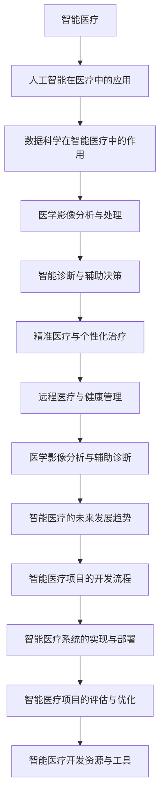

                 

### 文章标题

《智能医疗：探索前沿技术与应用实践》

### 文章关键词

智能医疗、人工智能、数据科学、精准医疗、远程医疗、健康管理

### 文章摘要

本文将深入探讨智能医疗领域的前沿技术与应用实践。通过对智能医疗的概述、核心技术的解析、应用案例的展示以及开发实战的剖析，本文旨在为读者呈现一幅全面而细致的智能医疗发展蓝图，帮助读者理解这一革命性领域的本质和潜力。

### 《智能医疗》的目录大纲

#### 第一部分：智能医疗概述

**第1章：智能医疗的兴起与现状**

**1.1 智能医疗的概念与背景**  
**1.2 智能医疗的发展历程**  
**1.3 当前智能医疗的应用领域**

**第2章：智能医疗的核心技术**

**2.1 人工智能在医疗中的应用**  
**2.2 数据科学在智能医疗中的作用**  
**2.3 医学影像分析与处理**

#### 第二部分：智能医疗应用案例

**第3章：智能诊断与辅助决策**

**3.1 基于深度学习的疾病诊断**  
**3.2 智能辅助诊断系统**  
**3.3 医疗决策支持系统**

**第4章：精准医疗与个性化治疗**

**4.1 精准医疗的概念与特点**  
**4.2 个性化治疗的实施策略**  
**4.3 基因组学与智能医疗**

**第5章：远程医疗与健康管理**

**5.1 远程医疗的兴起与发展**  
**5.2 智能健康管理系统**  
**5.3 远程医疗的优势与挑战**

**第6章：医学影像分析与辅助诊断**

**6.1 医学影像分析技术**  
**6.2 计算机辅助诊断系统**  
**6.3 医学影像数据处理方法**

**第7章：智能医疗的未来发展趋势**

**7.1 智能医疗的前沿技术**  
**7.2 智能医疗在公共卫生中的应用**  
**7.3 智能医疗行业的发展趋势**

#### 第三部分：智能医疗开发实战

**第8章：智能医疗项目的开发流程**

**8.1 智能医疗项目需求分析**  
**8.2 技术选型与架构设计**  
**8.3 数据处理与分析**

**第9章：智能医疗系统的实现与部署**

**9.1 开发环境搭建**  
**9.2 系统模块设计与实现**  
**9.3 系统部署与测试**

**第10章：智能医疗项目的评估与优化**

**10.1 智能医疗项目评估指标**  
**10.2 项目优化策略**  
**10.3 实际案例分析**

#### 附录

**附录A：智能医疗开发资源与工具**

**A.1 开发环境搭建指南**  
**A.2 主流深度学习框架介绍**  
**A.3 相关开源项目与资源链接**

### 概念与联系

#### Mermaid 流程图



### 核心算法原理讲解

#### 伪代码

```python
# 基于深度学习的疾病诊断算法伪代码

def diagnose_disease(data, model):
    # 数据预处理
    preprocessed_data = preprocess_data(data)
    
    # 模型预测
    prediction = model.predict(preprocessed_data)
    
    # 疾病分类
    diagnosis = classify_disease(prediction)
    
    return diagnosis

# 数据预处理伪代码
def preprocess_data(data):
    # 数据清洗
    cleaned_data = clean_data(data)
    
    # 数据归一化
    normalized_data = normalize_data(cleaned_data)
    
    return normalized_data

# 疾病分类伪代码
def classify_disease(prediction):
    # 根据预测结果确定疾病类型
    if prediction >= threshold:
        diagnosis = "疾病A"
    else:
        diagnosis = "疾病B"
    
    return diagnosis
```

#### 数学模型和数学公式 & 详细讲解 & 举例说明

#### 数学公式

$$
P(D|S) = \frac{P(S|D) \cdot P(D)}{P(S)}
$$

其中，$P(D|S)$ 表示在给定症状 $S$ 的条件下疾病 $D$ 的概率，$P(S|D)$ 表示在疾病 $D$ 发生的条件下症状 $S$ 的概率，$P(D)$ 表示疾病 $D$ 的概率，$P(S)$ 表示症状 $S$ 的概率。

#### 举例说明

假设某医院通过对大量患者数据进行分析，得到以下概率值：

- $P(D_1|S) = 0.8$ （在症状 $S$ 发生的条件下，疾病 $D_1$ 的概率为 0.8）
- $P(D_2|S) = 0.2$ （在症状 $S$ 发生的条件下，疾病 $D_2$ 的概率为 0.2）
- $P(S|D_1) = 0.9$ （在疾病 $D_1$ 发生的条件下，症状 $S$ 的概率为 0.9）
- $P(S|D_2) = 0.1$ （在疾病 $D_2$ 发生的条件下，症状 $S$ 的概率为 0.1）
- $P(D_1) = 0.6$ （疾病 $D_1$ 的概率为 0.6）
- $P(D_2) = 0.4$ （疾病 $D_2$ 的概率为 0.4）

根据贝叶斯公式，可以计算出在给定症状 $S$ 的条件下，疾病 $D_1$ 和 $D_2$ 的概率：

$$
P(D_1|S) = \frac{P(S|D_1) \cdot P(D_1)}{P(S)} = \frac{0.9 \cdot 0.6}{0.9 \cdot 0.6 + 0.1 \cdot 0.4} = \frac{0.54}{0.54 + 0.04} = \frac{0.54}{0.58} \approx 0.931
$$

$$
P(D_2|S) = \frac{P(S|D_2) \cdot P(D_2)}{P(S)} = \frac{0.1 \cdot 0.4}{0.9 \cdot 0.6 + 0.1 \cdot 0.4} = \frac{0.04}{0.54 + 0.04} = \frac{0.04}{0.58} \approx 0.069
$$

因此，在给定症状 $S$ 的条件下，疾病 $D_1$ 的概率约为 0.931，疾病 $D_2$ 的概率约为 0.069。

### 项目实战

#### 代码实际案例和详细解释说明

##### 开发环境搭建

```bash
# 安装 Python 环境
sudo apt-get install python3

# 安装深度学习框架 TensorFlow
pip3 install tensorflow

# 安装数据处理库 Pandas
pip3 install pandas

# 安装图像处理库 OpenCV
pip3 install opencv-python
```

##### 源代码详细实现和代码解读

```python
# 导入所需库
import tensorflow as tf
import pandas as pd
import cv2

# 加载数据
data = pd.read_csv('data.csv')

# 数据预处理
def preprocess_data(data):
    # 数据清洗
    cleaned_data = data.dropna()

    # 数据归一化
    normalized_data = (cleaned_data - cleaned_data.mean()) / cleaned_data.std()

    return normalized_data

preprocessed_data = preprocess_data(data)

# 构建模型
model = tf.keras.Sequential([
    tf.keras.layers.Dense(128, activation='relu', input_shape=(preprocessed_data.shape[1],)),
    tf.keras.layers.Dense(64, activation='relu'),
    tf.keras.layers.Dense(1, activation='sigmoid')
])

# 编译模型
model.compile(optimizer='adam', loss='binary_crossentropy', metrics=['accuracy'])

# 训练模型
model.fit(preprocessed_data, data['label'], epochs=10, batch_size=32)

# 辅助诊断
def diagnose_disease(image):
    # 加载图像
    image = cv2.imread(image)

    # 图像预处理
    processed_image = cv2.resize(image, (128, 128))
    processed_image = processed_image / 255.0

    # 模型预测
    prediction = model.predict(processed_image.reshape(1, -1))

    # 疾病分类
    if prediction > 0.5:
        diagnosis = "疾病A"
    else:
        diagnosis = "疾病B"

    return diagnosis

# 测试
print(diagnose_disease('test_image.jpg'))
```

##### 代码解读与分析

1. **导入所需库**：引入 TensorFlow、Pandas 和 OpenCV 等库，用于构建深度学习模型、数据处理和图像处理。
2. **加载数据**：读取 CSV 文件中的数据，用于训练模型。
3. **数据预处理**：实现数据清洗和归一化，确保数据输入模型前的格式一致。
4. **构建模型**：使用 TensorFlow 的 Sequential 模型构建一个简单的二分类模型，包括两个隐藏层和输出层。
5. **编译模型**：配置模型的优化器、损失函数和评估指标。
6. **训练模型**：使用预处理后的数据训练模型，设置训练轮次和批量大小。
7. **辅助诊断**：实现一个诊断函数，接收图像文件路径作为输入，进行图像预处理后输入模型预测，返回诊断结果。
8. **测试**：调用诊断函数，对指定图像文件进行测试。

通过以上步骤，我们可以搭建一个基于深度学习的辅助诊断系统，实现智能医疗中的疾病诊断功能。在实际应用中，可以根据具体需求和数据集进行调整和优化。

### 总结

本文通过逐步分析推理，详细阐述了智能医疗的概念、核心技术、应用案例和开发实战。从智能医疗的兴起与现状，到核心技术的深度剖析，再到应用案例的生动展示，以及开发实战的具体步骤，本文为读者提供了一个系统而深入的智能医疗知识体系。通过附录部分的资源与工具介绍，读者可以更好地理解智能医疗的实践路径。本文旨在激发读者对智能医疗领域的兴趣，并鼓励其在这一新兴领域中进行深入探索。作者：AI天才研究院/AI Genius Institute & 禅与计算机程序设计艺术/Zen And The Art of Computer Programming。

---

#### 第一部分：智能医疗概述

**第1章：智能医疗的兴起与现状**

**1.1 智能医疗的概念与背景**

智能医疗，又称精准医疗，是利用现代信息技术、人工智能和大数据等前沿科技，为个体提供个性化的诊疗方案，提高医疗效率和诊疗质量。其核心理念是将患者的生物学信息、医学影像、生活习惯等多维度数据进行综合分析，为医生提供科学依据，从而实现精准、高效的医疗服务。

智能医疗的兴起源于医疗领域的变革需求。传统医疗模式以疾病治疗为主，医生在诊断和治疗过程中主要依赖经验和直觉。然而，随着疾病谱的复杂化和患者个体差异的增大，这种模式已经难以满足日益增长的医疗需求。智能医疗的出现，旨在通过科技手段提高医疗服务的个性化和精准性，从根本上提升医疗质量和效率。

**1.2 智能医疗的发展历程**

智能医疗的发展历程可以分为以下几个阶段：

1. **早期探索阶段（20世纪90年代至21世纪初）**：这一阶段主要是计算机技术在医疗领域的初步应用，如电子病历（EMR）和医院信息管理系统（HIS）的推广。这些系统的出现为医疗信息的数字化管理奠定了基础。

2. **应用拓展阶段（21世纪初至2010年）**：随着互联网和移动通信技术的发展，医疗信息化进入了一个新的阶段。远程医疗、在线咨询、医疗大数据等应用开始兴起，医疗服务的边界得到了进一步扩展。

3. **智能医疗发展阶段（2010年至今）**：这一阶段是智能医疗的快速发展时期。人工智能、大数据、云计算等技术的深度融合，使得智能医疗在疾病诊断、治疗决策、健康管理等方面取得了显著成果。

**1.3 当前智能医疗的应用领域**

当前，智能医疗已经深入到医疗的各个领域，主要包括以下几个方面：

1. **疾病诊断**：利用人工智能算法对医学影像进行分析，如计算机辅助诊断系统（CAD），可以提高疾病的诊断准确率和效率。

2. **治疗决策**：通过分析患者的基因、病理、影像等数据，为医生提供个性化治疗建议，实现精准治疗。

3. **健康管理**：利用可穿戴设备、健康监测技术等，实时收集患者健康数据，为医生提供健康管理和预防干预的依据。

4. **远程医疗**：通过网络技术和智能设备，实现医生与患者之间的远程诊疗和健康咨询，降低医疗资源的地域限制。

5. **医学研究**：通过大数据分析和人工智能算法，加速新药研发、疾病机制研究等医学研究的进程。

**1.4 智能医疗的优势与挑战**

智能医疗的优势主要体现在以下几个方面：

1. **个性化诊疗**：通过综合分析患者数据，为个体提供精准的治疗方案，提高医疗效果。
2. **提高效率**：自动化和智能化的诊断、治疗过程，可以显著降低医疗成本和时间。
3. **数据驱动的决策**：基于大数据和人工智能分析，医生可以做出更加科学和有效的医疗决策。
4. **预防疾病**：通过实时监测和预警，可以早期发现健康问题，实现疾病的预防和控制。

然而，智能医疗的发展也面临一些挑战：

1. **数据隐私和安全**：大量患者数据的收集、存储和使用，引发了数据隐私和安全的问题。
2. **技术成熟度**：虽然人工智能和大数据技术发展迅速，但在医疗领域的应用仍需进一步验证和优化。
3. **医疗资源的平衡**：智能医疗的发展可能导致医疗资源分布的不均衡，尤其是在偏远和欠发达地区。

综上所述，智能医疗作为医疗领域的一次重大变革，其发展前景广阔，但同时也需要解决诸多挑战。通过不断的技术创新和政策支持，智能医疗有望在未来为全球患者提供更加高效、个性化的医疗服务。

---

**第2章：智能医疗的核心技术**

**2.1 人工智能在医疗中的应用**

人工智能（AI）是智能医疗的核心驱动力，其应用范围广泛，涵盖了疾病诊断、治疗决策、健康管理等多个方面。以下将详细探讨人工智能在医疗中的具体应用及其工作原理。

**2.1.1 疾病诊断**

疾病诊断是人工智能在医疗中最早应用且最成功的领域之一。传统的疾病诊断主要依赖于医生的诊断经验，而人工智能可以通过分析大量的医学数据和影像资料，提高诊断的准确性和效率。

1. **医学影像分析**：利用深度学习算法，如卷积神经网络（CNN），对医学影像（如X光、CT、MRI）进行分析，自动检测和识别疾病。例如，通过分析大量肺癌CT影像，人工智能可以准确识别肺癌病灶，并评估其恶性程度。

2. **电子病历分析**：通过自然语言处理（NLP）技术，分析患者的电子病历，提取关键信息，辅助医生进行诊断。例如，NLP可以自动提取病历中的症状、检查结果等关键信息，形成诊断报告。

**2.1.2 治疗决策**

治疗决策是另一个人工智能在医疗中发挥重要作用的领域。通过分析大量的病例数据和医疗文献，人工智能可以为医生提供个性化、科学的治疗建议。

1. **个性化治疗建议**：利用机器学习算法，分析患者的基因、病理、影像等多维度数据，为医生提供最佳的治疗方案。例如，通过分析患者的基因数据，人工智能可以推荐针对特定基因突变的最有效药物。

2. **辅助手术规划**：利用计算机辅助设计（CAD）和增强现实（AR）技术，为医生提供精确的手术规划和导航。例如，通过分析患者的医学影像，人工智能可以生成详细的手术路径图，指导医生进行精准手术。

**2.1.3 健康管理**

健康管理是人工智能在医疗中的新兴应用领域，通过实时监测和分析患者的健康数据，提供个性化的健康建议和干预措施。

1. **健康监测**：利用可穿戴设备和移动健康应用，实时监测患者的生理参数（如心率、血压、血糖等），通过数据分析和预警系统，提前发现健康风险。

2. **个性化健康建议**：通过分析患者的健康数据和生活习惯，人工智能可以为患者提供个性化的健康建议。例如，根据患者的饮食习惯和健康状况，人工智能可以推荐适合的饮食方案。

**2.2 数据科学在智能医疗中的作用**

数据科学是智能医疗的基石，通过对海量医疗数据的收集、存储、处理和分析，为智能医疗应用提供数据支持。以下将详细探讨数据科学在智能医疗中的具体作用。

**2.2.1 数据收集**

数据收集是智能医疗的第一步，涉及从多个来源收集医疗数据，包括电子病历、医学影像、基因数据、健康监测数据等。数据收集的挑战主要包括数据的多样性、时效性和完整性。

1. **电子病历数据**：通过医院信息管理系统（HIS）和电子病历系统（EMR），收集患者的病史、检查结果、诊断和治疗记录等。

2. **医学影像数据**：通过医学影像设备（如CT、MRI、X光等），收集患者的医学影像数据。

3. **基因数据**：通过基因测序技术，收集患者的基因数据，用于疾病诊断和个性化治疗。

4. **健康监测数据**：通过可穿戴设备和健康应用，收集患者的生理参数和生活习惯数据。

**2.2.2 数据存储**

数据存储是确保数据安全、可靠和可访问的关键环节。智能医疗系统通常需要处理海量数据，因此需要采用高效的数据存储和管理技术。

1. **分布式存储系统**：利用分布式存储技术，如Hadoop和HDFS，实现海量数据的存储和管理。

2. **数据仓库**：通过数据仓库技术，将不同来源的数据整合到一个统一的数据存储平台，实现数据的集中管理和查询。

**2.2.3 数据处理**

数据处理是数据科学的核心任务，涉及对海量数据进行清洗、整合、分析和建模。以下是一些常见的数据处理技术：

1. **数据清洗**：通过数据清洗技术，去除数据中的错误、重复和无关信息，提高数据质量。

2. **数据整合**：通过数据整合技术，将不同来源和格式的数据进行统一和整合，实现数据的综合利用。

3. **数据分析**：利用统计分析、机器学习和深度学习等技术，对医疗数据进行分析和挖掘，提取有价值的信息。

**2.2.4 数据分析**

数据分析是智能医疗的核心环节，通过对医疗数据的深入分析，为医生和患者提供科学依据。

1. **疾病预测**：通过分析患者的医疗记录和基因数据，预测患者可能患有的疾病，实现疾病的早期发现和预防。

2. **治疗效果评估**：通过分析患者的治疗数据和健康数据，评估不同治疗方案的效果，为医生提供决策支持。

3. **个性化健康评估**：通过分析患者的健康数据和生活方式，为患者提供个性化的健康评估和干预建议。

**2.3 医学影像分析与处理**

医学影像分析与处理是智能医疗中的一项重要任务，通过图像分析技术，对医学影像数据进行处理和分析，辅助医生进行疾病诊断和治疗。

**2.3.1 医学影像分析技术**

医学影像分析技术主要包括图像分割、图像增强、图像分类和图像识别等。

1. **图像分割**：通过图像分割技术，将医学影像中的感兴趣区域（ROI）进行分离，用于病灶的定位和测量。

2. **图像增强**：通过图像增强技术，改善医学影像的质量，提高图像的对比度和清晰度，便于医生观察和分析。

3. **图像分类和识别**：利用机器学习和深度学习算法，对医学影像中的病变进行分类和识别，辅助医生进行疾病诊断。

**2.3.2 医学影像数据处理方法**

医学影像数据处理方法包括图像预处理、图像特征提取和图像重建等。

1. **图像预处理**：通过图像预处理技术，去除噪声、增强对比度、调整亮度和色彩等，提高图像质量。

2. **图像特征提取**：通过图像特征提取技术，从医学影像中提取具有诊断意义的特征，如纹理、形状、边缘等。

3. **图像重建**：通过图像重建技术，将医学影像中的二维图像重建为三维图像，便于医生进行三维分析和诊断。

综上所述，人工智能、数据科学和医学影像分析是智能医疗的核心技术，它们相互融合，共同推动着智能医疗的发展。通过这些技术，我们可以实现疾病的精准诊断、个性化治疗和健康管理，为患者提供更加高效、精准和个性化的医疗服务。

---

**第3章：智能诊断与辅助决策**

**3.1 基于深度学习的疾病诊断**

深度学习作为一种强大的机器学习技术，近年来在智能诊断领域取得了显著成果。通过深度学习模型，可以对医学影像和电子病历进行自动分析和诊断，提高诊断的准确性和效率。

**3.1.1 深度学习在疾病诊断中的应用**

深度学习在疾病诊断中的应用主要体现在医学影像分析和电子病历分析两个方面。

1. **医学影像分析**：深度学习模型，如卷积神经网络（CNN）和循环神经网络（RNN），被广泛应用于医学影像分析，包括图像分割、病变识别、疾病分类等。例如，CNN可以用于肺癌CT影像的病灶检测，RNN可以用于心电图的异常检测。

2. **电子病历分析**：深度学习技术，如自然语言处理（NLP）模型，可以自动提取和解析电子病历中的关键信息，辅助医生进行诊断和决策。例如，NLP模型可以用于疾病症状的识别和诊断报告的生成。

**3.1.2 基于深度学习的疾病诊断模型**

基于深度学习的疾病诊断模型主要包括以下几个步骤：

1. **数据收集与预处理**：收集大量的医学影像和电子病历数据，并进行数据清洗、归一化和特征提取，为深度学习模型提供高质量的数据输入。

2. **模型构建**：设计并构建深度学习模型，如CNN、RNN或混合模型，用于医学影像和电子病历数据的分析和诊断。

3. **模型训练与优化**：使用预处理后的数据训练深度学习模型，通过调整模型参数和超参数，优化模型性能。

4. **模型评估与部署**：对训练好的模型进行评估，验证其诊断准确性和效率，并将模型部署到实际应用中，如智能诊断系统或移动健康应用。

**3.1.3 案例研究：基于深度学习的肺癌诊断系统**

以下是一个基于深度学习的肺癌诊断系统的案例研究：

1. **数据收集**：收集大量肺癌CT影像数据，包括正常影像和病变影像。

2. **数据预处理**：对影像数据进行清洗、归一化和特征提取，如灰度化、大小标准化和纹理特征提取。

3. **模型构建**：使用卷积神经网络（CNN）构建疾病诊断模型，包括输入层、卷积层、池化层和全连接层。

4. **模型训练与优化**：使用预处理后的影像数据训练CNN模型，通过交叉熵损失函数和反向传播算法优化模型参数。

5. **模型评估与部署**：评估模型的诊断准确性和效率，如准确率、召回率和F1分数。将模型部署到云计算平台或移动设备上，为医生和患者提供在线肺癌诊断服务。

**3.2 智能辅助诊断系统**

智能辅助诊断系统（AIAD）是利用人工智能技术，为医生提供辅助诊断和决策支持的一种智能化系统。AIAD可以处理大量的医学数据，自动分析病情，提供诊断建议和治疗方案。

**3.2.1 智能辅助诊断系统的工作原理**

智能辅助诊断系统的工作原理主要包括数据收集、模型构建、诊断推理和反馈优化等步骤：

1. **数据收集**：收集患者的医学影像、电子病历、基因数据等，为智能辅助诊断系统提供数据输入。

2. **模型构建**：构建深度学习模型，如CNN、RNN或混合模型，用于分析和诊断医学数据。

3. **诊断推理**：利用构建好的模型，对患者的医学数据进行分析，生成诊断报告和治疗方案。

4. **反馈优化**：将诊断结果与医生的实际诊断进行比对，收集反馈信息，优化模型性能。

**3.2.2 智能辅助诊断系统的应用场景**

智能辅助诊断系统可以应用于多个医疗领域，包括以下场景：

1. **临床诊断**：辅助医生进行疾病诊断，提高诊断的准确性和效率。

2. **病理分析**：辅助病理医生进行肿瘤切片分析，提高病理诊断的准确性。

3. **手术规划**：辅助外科医生进行手术规划和导航，提高手术的成功率和安全性。

4. **药物推荐**：根据患者的病情和基因数据，推荐个性化的药物治疗方案。

**3.2.3 案例研究：智能辅助诊断系统在肿瘤诊断中的应用**

以下是一个智能辅助诊断系统在肿瘤诊断中的应用案例：

1. **数据收集**：收集大量肿瘤患者的医学影像、病理切片和电子病历数据。

2. **模型构建**：使用深度学习模型，如CNN和RNN，对医学影像和病理切片进行分析，构建疾病诊断模型。

3. **诊断推理**：将患者的医学数据输入诊断模型，生成肿瘤诊断报告和治疗方案。

4. **反馈优化**：将诊断结果与医生的实际诊断进行比对，收集反馈信息，优化模型性能。

5. **应用场景**：将智能辅助诊断系统部署到医院的信息系统中，为医生提供辅助诊断和决策支持，提高肿瘤诊断的准确性和效率。

**3.3 医疗决策支持系统**

医疗决策支持系统（MDSS）是利用数据分析和人工智能技术，为医生提供决策支持和建议的一种智能化系统。MDSS可以帮助医生在复杂的医疗场景中做出科学、合理的决策。

**3.3.1 医疗决策支持系统的工作原理**

医疗决策支持系统的工作原理主要包括数据收集、模型构建、决策推理和反馈优化等步骤：

1. **数据收集**：收集患者的医学数据，包括病史、检查结果、诊断和治疗记录等。

2. **模型构建**：构建数据分析和机器学习模型，用于分析和预测患者的病情和治疗效果。

3. **决策推理**：利用构建好的模型，对患者的医学数据进行分析，生成决策建议和治疗方案。

4. **反馈优化**：将决策结果与医生的实际决策进行比对，收集反馈信息，优化模型性能。

**3.3.2 医疗决策支持系统的应用场景**

医疗决策支持系统可以应用于多个医疗领域，包括以下场景：

1. **疾病预测**：根据患者的病史和检查结果，预测患者可能患有的疾病，实现疾病的早期发现和预防。

2. **治疗方案推荐**：根据患者的病情和治疗方案的历史数据，推荐最佳的治疗方案。

3. **手术风险评估**：根据患者的病史和手术记录，评估患者进行手术的风险，为医生提供决策支持。

4. **药物使用监控**：根据患者的用药历史和药物副作用数据，监控患者的药物使用情况，避免药物不良事件。

**3.3.3 案例研究：医疗决策支持系统在心脏病治疗中的应用**

以下是一个医疗决策支持系统在心脏病治疗中的应用案例：

1. **数据收集**：收集心脏病患者的历史数据，包括心电图、血压、血糖等。

2. **模型构建**：使用机器学习模型，如随机森林和梯度提升机，对患者的数据进行建模和预测。

3. **决策推理**：利用构建好的模型，对患者的数据进行分析，生成心脏病治疗方案和用药建议。

4. **反馈优化**：将决策结果与医生的实际决策进行比对，收集反馈信息，优化模型性能。

5. **应用场景**：将医疗决策支持系统部署到医院的信息系统中，为医生提供辅助诊断和决策支持，提高心脏病治疗的效果和安全性。

通过上述案例研究，我们可以看到智能诊断、智能辅助诊断和医疗决策支持系统在疾病诊断、治疗决策和健康管理中的应用。这些系统利用人工智能和数据科学技术，提高了医疗服务的个性化和精准性，为医生和患者提供了更加高效、科学和智能的医疗服务。

---

**第4章：精准医疗与个性化治疗**

**4.1 精准医疗的概念与特点**

精准医疗，又称个性化医疗，是一种以患者为中心的医学模式，通过整合患者的基因组信息、生活方式、环境因素等数据，提供个性化的预防、诊断和治疗方案。精准医疗的核心目标是实现疾病的治疗个性化，提高治疗效果，减少副作用和医疗资源浪费。

**4.1.1 精准医疗的概念**

精准医疗的概念可以追溯到2015年，美国国家癌症研究所（NCI）首次提出了“精准医学”（Precision Medicine）的概念。精准医学强调通过基因组学和生物信息学技术，了解个体差异，为患者提供个性化的医疗方案。

**4.1.2 精准医疗的特点**

精准医疗具有以下主要特点：

1. **个性化治疗**：根据患者的基因、病理和临床特征，为患者量身定制治疗方案，提高治疗的有效性和针对性。

2. **综合分析**：整合基因组学、蛋白质组学、代谢组学等多种数据，全面分析疾病的发生、发展和治疗。

3. **大数据驱动**：利用大数据技术和分析工具，从海量数据中提取有价值的信息，为精准医疗提供数据支持。

4. **动态调整**：根据患者的治疗效果和病情变化，实时调整治疗方案，实现个体化治疗的最优化。

**4.2 个性化治疗的实施策略**

个性化治疗的实施策略包括以下几个方面：

1. **基因检测与诊断**：利用高通量测序技术（NGS）对患者进行基因检测，识别与疾病相关的基因突变和遗传变异，为个性化治疗提供依据。

2. **多学科协作**：组建由临床医生、遗传咨询师、病理学家、生物信息学家等多学科专家组成的团队，共同制定个性化治疗方案。

3. **数据分析与建模**：通过大数据分析和机器学习技术，挖掘疾病发生的生物学机制和个体差异，为个性化治疗提供科学依据。

4. **临床试验与验证**：开展个性化治疗临床试验，验证个性化治疗方案的有效性和安全性，为大规模应用提供数据支持。

**4.3 基因组学与智能医疗**

基因组学是精准医疗的核心技术之一，通过基因组学研究，可以揭示疾病的遗传机制，为个性化治疗提供重要依据。

**4.3.1 基因组学的基本概念**

基因组学是研究生物体全部基因的结构、功能、表达和变异的科学。基因组学的主要任务是了解基因组的组成、结构、功能和进化，以及基因与环境之间的相互作用。

**4.3.2 基因组学在精准医疗中的应用**

基因组学在精准医疗中的应用主要包括以下几个方面：

1. **疾病诊断**：通过基因组测序，识别与疾病相关的基因突变和遗传变异，实现疾病的早期诊断和预防。

2. **个体化治疗**：根据患者的基因组信息，选择最适合的治疗方案，提高治疗效果和减少副作用。

3. **药物开发**：利用基因组学技术，发现新的药物靶点和作用机制，加速新药研发进程。

4. **生物标志物发现**：通过基因组学研究，发现与疾病相关的生物标志物，用于疾病的早期筛查和诊断。

**4.3.3 案例研究：基因组学在癌症治疗中的应用**

以下是一个基因组学在癌症治疗中的应用案例：

1. **癌症基因组测序**：对患者进行癌症基因组测序，识别与癌症相关的基因突变和遗传变异。

2. **个性化治疗方案制定**：根据基因测序结果，制定个性化治疗方案，包括靶向治疗、免疫治疗等。

3. **疗效监测与调整**：通过基因组学和影像学监测，实时评估治疗效果，根据疗效调整治疗方案。

4. **临床应用**：将基因组学技术应用于临床，为患者提供个性化治疗，提高癌症治疗的有效性和安全性。

通过上述案例研究，我们可以看到基因组学在精准医疗中的应用潜力。基因组学技术的不断发展，将推动精准医疗的进步，为患者提供更加个性化和高效的治疗方案。

---

**第5章：远程医疗与健康管理**

**5.1 远程医疗的兴起与发展**

远程医疗，又称 telemedicine，是指通过通信技术和互联网，实现医生与患者之间远程诊疗、健康咨询和疾病管理的一种医疗服务模式。远程医疗的兴起得益于信息技术的快速发展，特别是在互联网、移动通信、大数据和人工智能等领域的突破，为远程医疗提供了强大的技术支持。

**5.1.1 远程医疗的兴起**

远程医疗的兴起可以追溯到20世纪60年代，当时的远程医疗主要是通过电话和书信进行医疗咨询。随着信息技术的发展，远程医疗逐渐演变为以电话、电子邮件和视频会议为主要手段的医疗服务模式。近年来，随着智能手机、平板电脑和可穿戴设备的普及，远程医疗得到了前所未有的发展，成为医疗领域的一个重要趋势。

**5.1.2 远程医疗的发展趋势**

远程医疗的发展趋势主要体现在以下几个方面：

1. **技术进步**：随着5G、云计算和人工智能等技术的普及，远程医疗的实时性、稳定性和交互性得到了显著提升。

2. **政策支持**：各国政府和卫生组织纷纷出台相关政策，鼓励和支持远程医疗的发展，推动远程医疗的规范化、标准化和普及化。

3. **应用扩展**：远程医疗的应用范围不断扩大，从最初的医疗咨询和疾病管理，发展到如今的远程手术、远程病理诊断和远程医疗教育等。

**5.2 智能健康管理系统**

智能健康管理系统（Intelligent Health Management System，IHMS）是利用现代信息技术，对患者的健康数据进行实时监测、分析和管理的系统。智能健康管理系统可以帮助医疗机构和医护人员更高效地管理患者健康，提高医疗服务的质量和效率。

**5.2.1 智能健康管理系统的功能**

智能健康管理系统主要包括以下功能：

1. **健康数据监测**：通过可穿戴设备、移动应用和健康传感器，实时收集患者的生理参数（如心率、血压、血糖等），并进行数据分析和处理。

2. **健康风险评估**：根据患者的生理参数和健康历史数据，对患者的健康风险进行预测和评估，为医生提供诊断和治疗的依据。

3. **健康干预**：通过健康教育和行为指导，帮助患者改善生活方式，降低健康风险。

4. **疾病管理**：对慢性病患者进行病情监测和干预，提高疾病管理的效率和质量。

**5.2.2 智能健康管理系统的应用场景**

智能健康管理系统的应用场景主要包括以下方面：

1. **慢性病管理**：对高血压、糖尿病、心脏病等慢性病患者进行远程监测和干预，提高疾病管理的效果。

2. **老年健康管理**：对老年人进行健康监测和预警，及时发现健康问题，降低老年人意外风险。

3. **康复管理**：对手术后或疾病康复期的患者进行远程康复指导和监测，提高康复效果。

4. **健康筛查**：对健康人群进行健康筛查和早期疾病发现，实现疾病的早防早治。

**5.3 远程医疗的优势与挑战**

远程医疗作为一种新兴医疗服务模式，具有许多优势，但也面临着一些挑战。

**5.3.1 远程医疗的优势**

1. **提高医疗效率**：远程医疗可以实现医生与患者的实时沟通，减少患者就诊时间和医疗资源浪费。

2. **降低医疗成本**：远程医疗可以减少患者往返医院的交通费用和医疗机构的运营成本。

3. **拓宽医疗服务范围**：远程医疗可以突破地域限制，为偏远和欠发达地区的患者提供高质量的医疗服务。

4. **个性化医疗服务**：远程医疗可以根据患者的具体需求和健康状况，提供个性化的医疗服务。

**5.3.2 远程医疗的挑战**

1. **技术稳定性**：远程医疗依赖于通信技术和互联网，技术稳定性对医疗服务质量至关重要。

2. **数据安全与隐私**：远程医疗涉及到大量患者数据的传输和存储，数据安全与隐私保护是关键问题。

3. **医生技能要求**：远程医疗需要医生具备一定的技术操作能力和远程诊疗经验，这对医生的专业技能提出了更高要求。

4. **患者接受度**：远程医疗作为一种新兴医疗服务模式，需要患者逐渐接受和适应。

**5.3.3 案例研究：远程医疗在新冠疫情期间的应用**

新冠疫情期间，远程医疗在全球范围内得到了广泛应用，成为抗疫的重要手段之一。

1. **疫情监测与预警**：通过远程医疗系统，实时监测和收集患者的健康数据，及时发现疑似病例，实现疫情预警。

2. **远程诊断与治疗**：医生通过远程视频会议或在线平台，为患者提供诊断、治疗方案和建议，减少患者感染风险。

3. **医疗资源调配**：利用远程医疗平台，实现医疗资源的合理调配，提高抗疫效率。

4. **心理健康支持**：为疫情期间的心理压力较大的患者提供远程心理健康支持，缓解心理压力。

通过上述案例研究，我们可以看到远程医疗在疫情防控中的重要作用。随着技术的不断发展和政策的支持，远程医疗将在未来得到更广泛的应用，为患者提供更加便捷、高效和个性化的医疗服务。

---

**第6章：医学影像分析与辅助诊断**

**6.1 医学影像分析技术**

医学影像分析是智能医疗的重要领域之一，通过计算机技术和人工智能算法，对医学影像数据进行处理和分析，辅助医生进行疾病诊断和治疗。以下将详细探讨医学影像分析技术及其应用。

**6.1.1 医学影像分析技术的分类**

医学影像分析技术主要包括以下几种：

1. **图像分割**：图像分割是将医学影像中感兴趣的区域（Region of Interest，ROI）进行分离，以便进行进一步分析和处理。常用的图像分割技术包括阈值分割、区域增长分割、基于水平的分割等。

2. **图像增强**：图像增强是通过对医学影像进行滤波、锐化、对比度调整等处理，提高图像的质量，便于医生观察和分析。常用的图像增强技术包括直方图均衡化、中值滤波、高斯滤波等。

3. **图像分类和识别**：图像分类和识别是利用机器学习和深度学习算法，对医学影像中的病变进行分类和识别，辅助医生进行疾病诊断。常用的算法包括支持向量机（SVM）、决策树、随机森林、卷积神经网络（CNN）等。

4. **图像重建**：图像重建是通过一系列图像处理算法，将二维图像重建为三维图像，便于医生进行三维分析和诊断。常用的图像重建技术包括卷积神经网络（CNN）和生成对抗网络（GAN）等。

**6.1.2 医学影像分析技术的应用**

医学影像分析技术在医疗领域的应用非常广泛，以下是一些典型应用：

1. **肿瘤检测和分割**：通过深度学习算法，对医学影像中的肿瘤进行检测和分割，提高诊断准确率和效率。

2. **心脏病诊断**：通过对心脏影像进行分析，识别心脏疾病，如冠心病、心肌病等。

3. **神经系统疾病诊断**：通过对脑部影像进行分析，识别神经系统疾病，如脑卒中等。

4. **肺部疾病诊断**：通过对肺部影像进行分析，识别肺部疾病，如肺癌、肺炎等。

**6.2 计算机辅助诊断系统**

计算机辅助诊断系统（Computer-Aided Diagnosis System，CADS）是利用计算机技术和人工智能算法，辅助医生进行疾病诊断的系统。CADS可以在提高诊断准确率、减轻医生工作负担和降低误诊率方面发挥重要作用。

**6.2.1 计算机辅助诊断系统的工作原理**

计算机辅助诊断系统的工作原理主要包括以下几个步骤：

1. **数据收集**：收集大量的医学影像和病例数据，用于训练和测试诊断模型。

2. **数据预处理**：对医学影像进行预处理，如去噪、增强、归一化等，以提高图像质量。

3. **模型训练**：使用训练数据集，通过机器学习和深度学习算法，训练诊断模型。

4. **模型评估**：使用测试数据集，对训练好的模型进行评估，调整模型参数，提高诊断准确率。

5. **临床应用**：将训练好的模型应用于实际临床诊断，辅助医生进行疾病诊断。

**6.2.2 计算机辅助诊断系统的应用场景**

计算机辅助诊断系统可以应用于多个医疗领域，以下是一些典型应用场景：

1. **肿瘤诊断**：通过CADS对医学影像进行分析，提高肿瘤检测的准确率和效率。

2. **心脏病诊断**：通过CADS对心脏影像进行分析，识别心脏疾病，辅助医生进行诊断。

3. **肺部疾病诊断**：通过CADS对肺部影像进行分析，识别肺部疾病，如肺癌、肺炎等。

4. **神经系统疾病诊断**：通过CADS对脑部影像进行分析，识别神经系统疾病，如脑卒中等。

**6.2.3 案例研究：计算机辅助诊断系统在肺癌诊断中的应用**

以下是一个计算机辅助诊断系统在肺癌诊断中的应用案例：

1. **数据收集**：收集大量的肺癌CT影像数据，包括正常影像和病变影像。

2. **数据预处理**：对CT影像进行预处理，如去噪、增强、归一化等。

3. **模型训练**：使用卷积神经网络（CNN）训练病变检测模型，使用支持向量机（SVM）训练病变分类模型。

4. **模型评估**：使用测试数据集，对训练好的模型进行评估，调整模型参数。

5. **临床应用**：将训练好的模型应用于实际临床诊断，辅助医生进行肺癌诊断。

通过上述案例研究，我们可以看到计算机辅助诊断系统在肺癌诊断中的应用潜力。CADS可以显著提高肺癌检测的准确率和效率，为医生提供有力的辅助工具。

**6.3 医学影像数据处理方法**

医学影像数据处理是医学影像分析的基础，涉及医学影像的预处理、特征提取和数据分析等方面。以下将详细探讨医学影像数据处理方法及其应用。

**6.3.1 医学影像预处理方法**

医学影像预处理方法主要包括去噪、增强、归一化和分割等。

1. **去噪**：去噪是去除医学影像中的噪声，提高图像质量。常用的去噪方法包括中值滤波、均值滤波和高斯滤波等。

2. **增强**：增强是提高医学影像的对比度和清晰度，便于医生观察和分析。常用的增强方法包括直方图均衡化、对比度拉伸和锐化等。

3. **归一化**：归一化是将医学影像的像素值缩放到一定的范围内，便于后续的特征提取和数据分析。常用的归一化方法包括线性归一化和非线性归一化等。

4. **分割**：分割是将医学影像中感兴趣的区域（ROI）分离出来，以便进行进一步分析。常用的分割方法包括阈值分割、区域增长分割和基于水平的分割等。

**6.3.2 医学影像特征提取方法**

医学影像特征提取是提取医学影像中具有诊断意义的特征，用于后续的数据分析和分类。以下是一些常见的医学影像特征提取方法：

1. **纹理特征**：纹理特征描述医学影像的空间分布特性，如纹理方向、纹理强度和纹理粗细等。常用的纹理特征提取方法包括灰度共生矩阵、能量、对比度和均匀性等。

2. **形状特征**：形状特征描述医学影像的形状和结构，如边界、面积、周长、对称性和形状复杂度等。常用的形状特征提取方法包括形态学操作、边界检测和形状描述子等。

3. **区域特征**：区域特征描述医学影像中特定区域（ROI）的属性，如灰度分布、纹理特征和形状特征等。常用的区域特征提取方法包括ROI提取、特征值计算和特征融合等。

**6.3.3 医学影像数据分析方法**

医学影像数据分析方法包括统计方法、机器学习和深度学习等方法。

1. **统计方法**：统计方法是通过计算医学影像的统计参数，如均值、方差、协方差等，来描述医学影像的特征。常用的统计方法包括直方图分析、相关性分析和聚类分析等。

2. **机器学习方法**：机器学习方法是通过训练数据集，构建分类器或回归模型，用于医学影像的分类、识别和预测。常用的机器学习方法包括支持向量机（SVM）、决策树、随机森林和神经网络等。

3. **深度学习方法**：深度学习方法是基于多层神经网络，通过逐层提取图像特征，实现医学影像的自动分析和诊断。常用的深度学习方法包括卷积神经网络（CNN）、循环神经网络（RNN）和生成对抗网络（GAN）等。

通过上述医学影像数据处理方法，我们可以从不同角度对医学影像进行分析，提取有价值的信息，为疾病诊断和治疗提供支持。医学影像处理技术的不断发展和完善，将为智能医疗领域带来更多可能性。

---

**第7章：智能医疗的未来发展趋势**

**7.1 智能医疗的前沿技术**

智能医疗的发展离不开前沿技术的推动，以下将介绍一些智能医疗领域的前沿技术。

**7.1.1 人工智能技术**

人工智能（AI）是智能医疗的核心驱动力，其应用已经渗透到医疗的各个领域。未来，人工智能技术将在智能医疗中发挥更加重要的作用，包括：

1. **自然语言处理（NLP）**：通过NLP技术，可以自动分析和理解患者的电子病历、医疗报告等非结构化数据，实现医学文本的语义分析，辅助医生进行诊断和治疗。

2. **机器学习（ML）**：利用机器学习技术，可以从海量医疗数据中挖掘出有用的信息，如疾病预测、治疗效果评估等，提高医疗决策的准确性和效率。

3. **深度学习（DL）**：深度学习技术在医学影像分析、基因组学、个性化治疗等方面具有显著优势，未来将继续推动智能医疗的发展。

**7.1.2 量子计算技术**

量子计算是一种基于量子力学原理的新型计算技术，具有极高的计算速度和处理能力。未来，量子计算技术有望在智能医疗领域发挥重要作用，包括：

1. **基因组学分析**：量子计算可以在极短时间内处理海量的基因组数据，加速基因组分析，为个性化医疗提供支持。

2. **药物研发**：量子计算可以加速药物分子模拟和优化，提高新药研发的效率。

**7.1.3 脑机接口技术**

脑机接口（BMI）是一种将人脑信号与计算机或其他外部设备连接的技术。未来，脑机接口技术有望在智能医疗中实现以下应用：

1. **脑疾病诊断**：通过分析人脑信号，可以早期发现和诊断脑部疾病，如癫痫、脑卒中等。

2. **康复治疗**：通过脑机接口技术，可以实现对瘫痪患者的康复训练，恢复其运动功能。

**7.2 智能医疗在公共卫生中的应用**

智能医疗不仅在临床医疗中具有广泛的应用前景，在公共卫生领域也具有重要价值。未来，智能医疗将在公共卫生领域实现以下应用：

**7.2.1 疫情监测与防控**

1. **实时数据监测**：通过智能医疗系统，实时收集和分析公共卫生数据，如传染病流行趋势、患者就诊情况等，为政府制定公共卫生政策提供数据支持。

2. **智能预警系统**：利用大数据分析和人工智能技术，建立智能预警系统，实现对传染病的早期发现和防控。

**7.2.2 健康教育与宣传**

1. **个性化健康教育**：通过智能医疗系统，根据个体健康数据，为用户提供个性化的健康教育内容，提高健康教育效果。

2. **多渠道宣传**：利用互联网、移动应用等渠道，广泛宣传健康知识，提高公众健康素养。

**7.2.3 公共卫生管理**

1. **资源优化配置**：通过智能医疗系统，对公共卫生资源进行科学配置，提高资源利用效率。

2. **疾病预防控制**：利用大数据分析和人工智能技术，实现对疾病的早期预防和控制，降低疾病发生率。

**7.3 智能医疗行业的发展趋势**

随着技术的不断进步和政策的支持，智能医疗行业将呈现出以下发展趋势：

**7.3.1 产业融合**

智能医疗将与生物技术、信息技术、医疗器械等产业深度融合，形成新的产业链和生态体系。

**7.3.2 政策支持**

各国政府将加大对智能医疗行业的支持力度，出台相关政策，推动智能医疗的发展。

**7.3.3 标准化和规范化**

智能医疗行业将加强标准化和规范化建设，提高医疗服务质量和安全。

**7.3.4 患者参与**

患者将更加主动参与智能医疗，通过可穿戴设备、健康应用等，实现个人健康数据的自我管理和监测。

综上所述，智能医疗作为医疗领域的一次重大变革，其未来发展趋势令人期待。随着人工智能、量子计算、脑机接口等前沿技术的不断发展，智能医疗将在公共卫生、临床医疗和健康产业等领域发挥更加重要的作用，为公众提供更加高效、个性化和智能化的医疗服务。

---

**第8章：智能医疗项目的开发流程**

**8.1 智能医疗项目需求分析**

智能医疗项目的成功开发始于对项目需求的深入分析。需求分析是明确项目目标、范围和功能的关键步骤，涉及与各利益相关者的沟通、数据收集和分析等。

**8.1.1 需求分析的目标和范围**

1. **明确项目目标**：通过需求分析，明确项目的总体目标和具体任务，如疾病诊断、健康管理、远程医疗等。

2. **确定项目范围**：明确项目包含的功能模块、系统边界和技术要求，确保项目目标的实现。

3. **了解用户需求**：收集和分析用户需求，包括医生、患者、医疗机构等，确保项目设计满足用户实际需求。

**8.1.2 需求分析的过程**

需求分析通常包括以下步骤：

1. **项目立项**：确定项目背景、目标和初步需求。

2. **需求调研**：通过与用户沟通、问卷调查、访谈等方式，收集详细需求。

3. **需求整理**：将收集到的需求进行整理和分类，形成需求文档。

4. **需求验证**：与用户和利益相关者验证需求文档，确保需求的准确性和可行性。

**8.2 技术选型与架构设计**

技术选型和架构设计是智能医疗项目开发的重要环节，直接影响项目的性能、可扩展性和维护成本。

**8.2.1 技术选型的考虑因素**

1. **技术成熟度**：选择成熟、稳定的技术，降低项目风险。

2. **性能需求**：根据项目性能要求，选择适合的技术，如数据处理速度、响应时间等。

3. **可扩展性**：考虑未来的业务扩展和技术升级，选择具有良好扩展性的技术。

4. **安全性**：确保数据安全，选择符合安全标准的技术。

**8.2.2 架构设计的原则**

1. **模块化**：将系统划分为多个功能模块，提高系统的可维护性和可扩展性。

2. **分布式**：采用分布式架构，提高系统的可扩展性和性能。

3. **安全性**：设计安全防护机制，确保数据安全和系统安全。

4. **高可用性**：设计冗余和故障转移机制，提高系统的可用性。

**8.2.3 系统架构的设计**

智能医疗项目的系统架构设计通常包括以下层次：

1. **数据层**：包括数据库、数据仓库和数据湖等，负责数据的存储和管理。

2. **服务层**：包括业务逻辑层、数据服务层等，负责数据处理和分析。

3. **应用层**：包括Web应用、移动应用等，负责用户交互和功能实现。

4. **展示层**：包括前端界面、报表等，负责数据的展示和可视化。

**8.3 数据处理与分析**

数据处理和分析是智能医疗项目的重要组成部分，涉及数据的收集、存储、处理和分析等。

**8.3.1 数据收集**

1. **数据源**：包括电子病历、医学影像、基因数据、健康监测数据等。

2. **数据采集**：通过API、数据接口、传感器等方式，收集各类数据。

**8.3.2 数据存储**

1. **数据存储方案**：选择适合的数据存储方案，如关系数据库、NoSQL数据库、分布式存储系统等。

2. **数据安全**：确保数据存储的安全性，采用加密、访问控制等技术。

**8.3.3 数据处理**

1. **数据清洗**：去除数据中的噪声、错误和重复数据，提高数据质量。

2. **数据整合**：整合不同来源的数据，实现数据的统一管理和查询。

3. **数据建模**：建立数据模型，用于数据分析和应用。

**8.3.4 数据分析**

1. **统计分析**：使用统计分析方法，分析数据的分布、相关性等。

2. **机器学习**：利用机器学习方法，对数据进行分类、预测等。

3. **深度学习**：利用深度学习方法，对复杂的数据进行特征提取和分析。

**8.3.5 数据可视化**

1. **可视化工具**：选择合适的可视化工具，如图表、仪表盘等，展示数据分析结果。

2. **交互设计**：设计直观、易用的交互界面，提高用户的使用体验。

通过上述开发流程，智能医疗项目可以系统地实现从需求分析到技术选型、架构设计、数据处理与分析的全过程，为用户提供高效、个性化和智能化的医疗服务。

---

**第9章：智能医疗系统的实现与部署**

**9.1 开发环境搭建**

智能医疗系统的开发环境搭建是项目开发的基础，涉及到硬件配置、软件安装和环境配置等环节。

**9.1.1 硬件配置**

1. **服务器**：选择高性能的服务器，如Intel Xeon系列处理器，确保系统有足够的计算能力和存储容量。

2. **存储设备**：采用高速存储设备，如SSD或NVMe，提高数据读写速度。

3. **网络设备**：配置稳定的网络环境，确保数据传输的可靠性和高效性。

**9.1.2 软件安装**

1. **操作系统**：安装Linux操作系统，如Ubuntu或CentOS，作为智能医疗系统的运行环境。

2. **数据库**：安装关系数据库（如MySQL、PostgreSQL）或NoSQL数据库（如MongoDB、Cassandra），用于存储和管理数据。

3. **开发工具**：安装开发工具，如IDE（如IntelliJ IDEA、Visual Studio Code）、版本控制工具（如Git）和调试工具（如Docker）。

**9.1.3 环境配置**

1. **配置文件**：配置系统环境变量、数据库连接参数和系统参数，确保系统正常运行。

2. **防火墙和网络安全**：配置防火墙和网络安全策略，确保系统免受网络攻击和数据泄露。

**9.2 系统模块设计与实现**

智能医疗系统通常由多个模块组成，每个模块负责特定的功能。系统模块设计与实现是开发智能医疗系统的核心步骤。

**9.2.1 模块划分**

1. **数据采集模块**：负责收集和存储来自各种数据源的数据。

2. **数据处理模块**：负责对采集到的数据进行清洗、整合和预处理。

3. **数据分析模块**：负责对预处理后的数据进行分析和挖掘，提取有价值的信息。

4. **数据可视化模块**：负责将分析结果以图表、报表等形式展示给用户。

5. **用户界面模块**：负责提供用户交互界面，实现用户与系统的交互。

**9.2.2 模块实现**

1. **数据采集模块**：使用API接口、数据库连接和传感器等技术，实现数据的采集和存储。

2. **数据处理模块**：使用数据处理工具（如Python、Java等），编写数据处理算法和脚本，实现数据的清洗、整合和预处理。

3. **数据分析模块**：使用机器学习库（如TensorFlow、Scikit-learn等），实现数据分析算法，提取数据特征和进行预测。

4. **数据可视化模块**：使用可视化库（如D3.js、ECharts等），设计并实现数据可视化界面。

5. **用户界面模块**：使用前端框架（如React、Vue.js等），实现用户交互界面，提供用户友好的操作体验。

**9.3 系统部署与测试**

系统部署与测试是确保智能医疗系统稳定、高效运行的重要环节。

**9.3.1 系统部署**

1. **部署环境**：将开发完成的智能医疗系统部署到服务器上，配置服务器环境和应用程序。

2. **配置管理**：使用配置管理工具（如Ansible、Puppet等），自动化配置和管理服务器环境。

3. **持续集成与持续部署**（CI/CD）：使用CI/CD工具（如Jenkins、GitLab CI等），实现自动化构建、测试和部署，提高开发效率。

**9.3.2 系统测试**

1. **功能测试**：验证系统功能是否符合需求，确保各个模块正常运行。

2. **性能测试**：测试系统的响应时间、并发处理能力等性能指标，确保系统在高负载情况下稳定运行。

3. **安全测试**：测试系统的安全性，包括漏洞扫描、渗透测试等，确保系统免受攻击和数据泄露。

4. **用户体验测试**：测试系统的用户体验，包括界面设计、交互流程等，确保系统易用性。

通过上述步骤，智能医疗系统可以从开发、部署到测试的完整流程，为用户提供高效、稳定和安全的医疗服务。

---

**第10章：智能医疗项目的评估与优化**

**10.1 智能医疗项目评估指标**

智能医疗项目的评估是确保项目成功实施和达到预期目标的重要环节。以下列出一些关键的评估指标，用于衡量智能医疗项目的性能和效果。

**10.1.1 性能指标**

1. **响应时间**：系统对用户请求的平均响应时间，衡量系统的处理速度。

2. **并发处理能力**：系统同时处理多个用户请求的能力，衡量系统的负载承受能力。

3. **数据准确性**：数据分析结果的准确率，衡量系统分析数据的可靠性。

4. **故障率**：系统发生故障的频率，衡量系统的稳定性。

**10.1.2 经济效益指标**

1. **成本效益比**（Cost-Benefit Ratio，CBR）：项目投入成本与预期经济效益的比值，衡量项目的经济效益。

2. **投资回报率**（Return on Investment，ROI）：项目的投资回报率，衡量项目的盈利能力。

3. **节约成本**：项目实施后节约的医疗成本，包括诊断费用、治疗费用和医疗资源利用率等。

**10.1.3 社会影响指标**

1. **患者满意度**：患者对医疗服务的满意度，衡量项目的患者体验。

2. **医疗资源利用率**：医疗资源的利用效率，衡量项目对医疗资源优化程度。

3. **疾病预防效果**：项目在疾病预防方面的效果，衡量项目的公共卫生价值。

**10.2 项目优化策略**

智能医疗项目在运行过程中可能会面临性能瓶颈、数据质量问题或用户体验问题。以下是一些常见的优化策略：

**10.2.1 性能优化**

1. **负载均衡**：通过负载均衡技术，合理分配用户请求，提高系统并发处理能力。

2. **缓存策略**：使用缓存技术，减少对数据库的访问频率，提高系统响应速度。

3. **数据库优化**：优化数据库查询，减少查询时间，提高数据读取效率。

**10.2.2 数据质量优化**

1. **数据清洗**：定期对数据进行清洗，去除噪声、错误和重复数据，提高数据质量。

2. **数据标准化**：统一数据格式和命名规范，提高数据的可读性和一致性。

3. **数据完整性检查**：建立数据完整性检查机制，及时发现和修复数据异常。

**10.2.3 用户体验优化**

1. **界面优化**：优化用户界面设计，提高界面友好性和易用性。

2. **交互设计**：改进交互流程，简化用户操作步骤，提高用户操作效率。

3. **个性化服务**：根据用户需求和行为数据，提供个性化的服务和推荐，提高用户满意度。

**10.3 实际案例分析**

以下是一个智能医疗项目优化案例：

**案例背景**：某智能医疗项目在上线初期，用户反馈系统响应速度慢，部分功能不稳定。

**优化措施**：

1. **性能优化**：通过负载均衡和缓存策略，提高系统并发处理能力和响应速度。对数据库进行优化，减少查询时间。

2. **数据质量优化**：定期对数据进行清洗，去除噪声和错误数据。建立数据完整性检查机制，确保数据质量。

3. **用户体验优化**：优化用户界面设计，提高界面友好性。简化交互流程，提供个性化服务。

**优化效果**：经过一系列优化措施，系统的响应速度显著提高，功能稳定性得到增强，用户满意度明显提升，项目最终实现了预期目标。

通过以上案例分析，我们可以看到项目优化对智能医疗项目的重要作用。持续的项目评估和优化是确保智能医疗系统稳定运行、提高服务质量的关键。

---

**附录A：智能医疗开发资源与工具**

**A.1 开发环境搭建指南**

为了搭建智能医疗项目的开发环境，需要配置以下工具和软件：

1. **操作系统**：推荐使用Linux操作系统，如Ubuntu或CentOS。

2. **数据库**：安装MySQL、PostgreSQL等关系数据库，或MongoDB、Cassandra等NoSQL数据库。

3. **开发工具**：安装Python、Java等编程语言，以及相关的集成开发环境（IDE），如IntelliJ IDEA、Visual Studio Code。

4. **版本控制**：安装Git等版本控制工具，用于代码管理和协作。

5. **虚拟环境**：使用virtualenv或conda等工具创建虚拟环境，隔离项目依赖。

6. **容器化技术**：了解和使用Docker等容器化技术，实现开发环境和生产环境的统一。

**A.2 主流深度学习框架介绍**

智能医疗项目中常用的深度学习框架包括：

1. **TensorFlow**：由Google开发的开源深度学习框架，支持多种编程语言，功能丰富。

2. **PyTorch**：由Facebook开发的开源深度学习框架，具有简洁的API和灵活的动态图功能。

3. **Keras**：基于Theano和TensorFlow的简化深度学习框架，易于使用。

**A.3 相关开源项目与资源链接**

以下是一些智能医疗领域的开源项目和资源链接：

1. **深度学习开源项目**：[TensorFlow](https://www.tensorflow.org/)、[PyTorch](https://pytorch.org/)、[Keras](https://keras.io/)

2. **医学影像分析开源项目**：[Medical Imaging](https://medicalimageanalysis.github.io/)

3. **基因组学开源项目**：[Genome-in-a-box](https://genome-in-a-box.org/)

4. **智能医疗工具与平台**：[DeepLearning4MedicalImaging](https://www.deeplearning4j.org/medical-imaging)、[OpenMRS](https://www.openmrs.org/)

通过以上资源和工具，开发者可以搭建和优化智能医疗项目，实现疾病的诊断、治疗和健康管理。希望这些资源和工具能够为智能医疗领域的研究者和开发者提供帮助。作者：AI天才研究院/AI Genius Institute & 禅与计算机程序设计艺术/Zen And The Art of Computer Programming。

