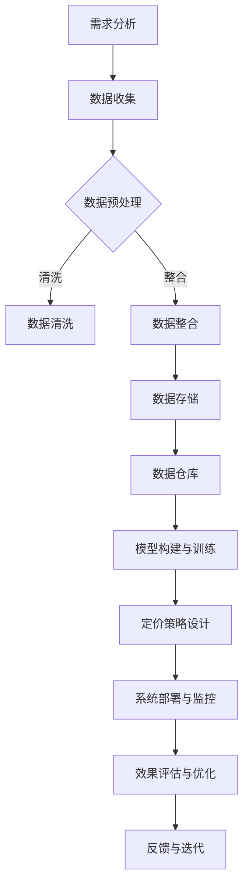

                 

### 文章标题

《智能定价技术的应用案例》

> 关键词：智能定价、大数据分析、机器学习、人工智能、定价策略

> 摘要：本文通过深入分析智能定价技术的基础概念、优势与挑战，以及主要应用领域，结合实际案例，详细探讨了智能定价技术在电子商务、酒店与旅游、交通运输等领域的应用，为各行业提供了智能定价的实践指导和优化策略。

### 《智能定价技术的应用案例》

智能定价技术是一种利用大数据分析、机器学习和人工智能技术优化产品定价的方法。它通过收集和分析海量数据，识别市场规律和消费者行为，从而实现更精准、更有效的定价策略。在当今高度竞争的市场环境下，智能定价技术已成为企业提高利润率、增强竞争力的关键手段。本文将从以下几个部分对智能定价技术进行详细探讨：

### 第一部分：智能定价技术基础

在这一部分，我们将首先介绍智能定价技术的概念与演变，探讨其优势与挑战，并分析智能定价的主要应用领域。接着，我们将深入探讨大数据分析的基础知识，包括大数据的概念与特点、数据收集与处理方法以及数据分析方法。最后，我们将介绍机器学习与定价策略的关系，包括机器学习基础、智能定价中的机器学习应用以及智能定价策略的设计与优化。

### 第二部分：智能定价案例分析

在这一部分，我们将通过具体案例，分析智能定价技术在电子商务、酒店与旅游、交通运输等领域的应用。我们将详细讨论每个案例的背景、数据分析、模型构建与训练、定价策略优化以及实际效果。这些案例将帮助我们更好地理解智能定价技术在实际业务中的应用，并从中吸取经验教训。

### 第三部分：智能定价技术展望

在这一部分，我们将探讨智能定价技术的发展趋势，包括新技术带来的机遇和未来挑战。我们还将探讨智能定价技术在新兴行业中的应用，如共享经济、农业等，以及智能定价技术对社会的影响。最后，我们将展望智能定价技术的未来发展方向，包括智能定价与物联网、区块链的结合，以及智能定价在可持续发展中的应用。

### 文章标题：《智能定价技术的应用案例》

关键词：智能定价、大数据分析、机器学习、人工智能、定价策略

摘要：本文从基础概念、应用案例分析、发展趋势等多个角度，系统介绍了智能定价技术的应用。通过深入分析智能定价技术在电子商务、酒店与旅游、交通运输等领域的应用案例，本文为各行业提供了实用的智能定价策略和优化方法。同时，本文还探讨了智能定价技术的未来发展趋势，为读者提供了前瞻性的思考。# 

### 第一部分：智能定价技术基础

智能定价技术的核心在于利用大数据分析、机器学习和人工智能技术，对产品或服务的价格进行动态调整，以达到最大化利润或市场份额的目标。本部分将首先介绍智能定价的概念与演变，探讨其优势与挑战，并分析智能定价的主要应用领域。

#### 第1章：智能定价概述

##### 1.1 智能定价的概念与演变

智能定价，顾名思义，是指利用先进的技术手段，如大数据分析、机器学习和人工智能，对产品或服务的价格进行优化。它不同于传统的静态定价方法，而是在不断变化的市场环境中，根据消费者的需求、竞争对手的价格、市场供需状况等多种因素，动态调整价格。

智能定价的发展历程可以分为以下几个阶段：

1. **初期阶段**：传统的价格策略主要依赖于经验和市场直觉，定价相对单一，难以适应快速变化的市场环境。
2. **数据驱动阶段**：随着信息技术的发展，企业开始收集更多的数据，利用统计分析等手段进行定价。
3. **智能化阶段**：大数据分析、机器学习和人工智能技术的应用，使得企业能够更加精准地预测市场需求，实现动态定价。

##### 1.2 智能定价的优势与挑战

智能定价的优势主要体现在以下几个方面：

1. **提高定价准确性**：通过大数据分析和机器学习技术，智能定价能够更加精准地预测市场需求和消费者行为，从而制定更合理的价格策略。
2. **增强竞争力**：智能定价可以帮助企业快速调整价格，以应对竞争对手的动态变化，提高市场竞争力。
3. **提高利润率**：通过优化定价策略，智能定价能够帮助企业最大化利润，提高市场占有率。

然而，智能定价也面临一些挑战：

1. **数据采集与处理的复杂性**：智能定价需要大量的数据支持，包括内部数据和外部数据，数据的采集和处理过程复杂。
2. **模型选择的挑战**：不同的业务场景需要不同的定价模型，选择合适的模型是智能定价成功的关键。
3. **法律合规问题**：智能定价可能会引发法律合规问题，如数据隐私保护、算法歧视等。

##### 1.3 智能定价的主要应用领域

智能定价技术广泛应用于多个行业，以下是几个主要应用领域：

1. **电子商务**：电商平台通过智能定价，实时调整商品价格，以提高销售额和利润率。
2. **酒店与旅游**：酒店和旅行社利用智能定价，根据客户需求和预订情况，灵活调整价格。
3. **交通运输**：航空公司和铁路公司通过智能定价，根据航班或列车座位的供需情况，动态调整票价。

#### 第2章：大数据分析基础

##### 2.1 大数据的概念与特点

大数据（Big Data）是指无法用常规软件工具在合理时间内捕捉、管理和处理的数据集合。其特点可以概括为“4V”：Volume（大量）、Velocity（高速）、Variety（多样性）和Veracity（真实性）。

- **Volume**：大数据的数据量巨大，往往需要分布式系统来存储和处理。
- **Velocity**：大数据的处理速度非常快，要求实时分析处理。
- **Variety**：大数据来源多样，包括结构化数据、半结构化数据和非结构化数据。
- **Veracity**：大数据的真实性难以保证，数据质量对分析结果有重要影响。

##### 2.2 数据收集与处理

智能定价需要大量的数据支持，数据收集与处理是关键环节。数据来源可以分为内部数据和外部数据：

- **内部数据**：包括企业的销售数据、客户数据、库存数据等。
- **外部数据**：包括市场数据、竞争对手数据、宏观经济数据等。

数据处理方法主要包括：

- **数据清洗**：去除重复数据、缺失值、异常值等，提高数据质量。
- **数据整合**：将不同来源的数据进行整合，形成统一的视图。
- **数据存储**：使用分布式数据库或数据湖来存储大量数据。

##### 2.3 数据分析方法

智能定价中的数据分析方法主要包括以下几种：

- **统计分析**：描述性统计和推断性统计，用于分析数据的基本特征和规律。
- **机器学习**：分类、回归、聚类等算法，用于预测和分类。

#### 第3章：机器学习与定价策略

##### 3.1 机器学习基础

机器学习是智能定价技术的重要支撑。以下是一些基础的机器学习概念：

- **监督学习**：通过已标记的数据训练模型，用于预测和分类。
- **无监督学习**：在没有标记数据的情况下，通过数据自身特征进行聚类或降维。
- **强化学习**：通过不断试错，学习最优策略。

##### 3.2 智能定价中的机器学习应用

在智能定价中，机器学习主要用于：

- **回归模型**：预测价格与需求之间的关系，如线性回归、决策树回归等。
- **分类模型**：识别定价策略的效果，如逻辑回归、支持向量机等。

##### 3.3 智能定价策略的设计与优化

智能定价策略的设计与优化是一个复杂的过程，主要包括：

- **动态定价**：根据市场供需调整价格，如需求预测定价策略。
- **价格敏感度分析**：分析消费者对不同价格的反应，以优化价格策略。

通过以上三个章节，我们为后续的案例分析奠定了基础。在下一部分中，我们将通过具体案例，深入探讨智能定价技术在各个行业的应用。# 

## 第1章：智能定价概述

### 1.1 智能定价的概念与演变

智能定价是一种利用大数据分析、机器学习和人工智能技术优化产品定价的方法。它不同于传统的静态定价方法，而是在不断变化的市场环境中，根据消费者的需求、竞争对手的价格、市场供需状况等多种因素，动态调整价格。这种定价方法的核心在于通过先进的技术手段，实现对市场价格规律的深刻理解和精确预测。

智能定价的发展历程可以分为以下几个阶段：

#### 初期阶段

在互联网兴起之前，企业的定价策略主要依赖于经验和市场直觉。企业根据产品成本、竞争对手的价格、市场需求等因素，制定相对单一的价格策略。这种定价方法虽然简单，但难以适应快速变化的市场环境，也无法充分利用市场数据。

#### 数据驱动阶段

随着互联网和电子商务的发展，企业开始意识到数据的重要性。他们开始收集更多的数据，包括销售数据、客户数据、市场数据等，并利用统计分析等方法对数据进行分析。这一阶段，企业开始尝试利用数据来指导定价策略，从而提高定价的准确性。

#### 智能化阶段

大数据分析、机器学习和人工智能技术的快速发展，为智能定价提供了新的可能。企业不再仅仅依赖于传统的统计分析方法，而是利用机器学习算法，从海量数据中挖掘出更深层次的规律。通过不断优化算法，企业能够实现对市场价格变化的精确预测，从而实现动态定价。

### 1.2 智能定价的优势与挑战

智能定价的优势主要体现在以下几个方面：

#### 提高定价准确性

通过大数据分析和机器学习技术，智能定价能够更加精准地预测市场需求和消费者行为，从而制定更合理的价格策略。这种定价方法能够帮助企业捕捉到市场的细微变化，从而在竞争中占据优势。

#### 增强竞争力

智能定价可以帮助企业快速调整价格，以应对竞争对手的动态变化，提高市场竞争力。通过实时分析市场数据，企业可以及时调整价格策略，抢占市场份额。

#### 提高利润率

通过优化定价策略，智能定价能够帮助企业最大化利润，提高市场占有率。例如，在库存积压时，企业可以通过降低价格来促进销售，从而减少库存成本；在市场需求旺盛时，企业可以提高价格，增加利润。

然而，智能定价也面临一些挑战：

#### 数据采集与处理的复杂性

智能定价需要大量的数据支持，包括内部数据和外部数据。数据的采集、存储、处理和清洗是一个复杂的过程，需要先进的硬件和软件支持。

#### 模型选择的挑战

不同的业务场景需要不同的定价模型，选择合适的模型是智能定价成功的关键。然而，机器学习模型的选择和优化是一个复杂的过程，需要专业的技术知识。

#### 法律合规问题

智能定价可能会引发法律合规问题，如数据隐私保护、算法歧视等。企业在应用智能定价技术时，需要遵守相关的法律法规，确保数据的安全性和合法性。

### 1.3 智能定价的主要应用领域

智能定价技术广泛应用于多个行业，以下是几个主要应用领域：

#### 电子商务

电子商务平台通过智能定价，实时调整商品价格，以提高销售额和利润率。例如，亚马逊等电商平台会根据消费者的浏览历史、购买行为等数据，动态调整商品价格。

#### 酒店与旅游

酒店和旅行社利用智能定价，根据客户需求和预订情况，灵活调整价格。例如，酒店可以根据预订情况，对空房进行折扣促销，以吸引更多客户。

#### 交通运输

航空公司和铁路公司通过智能定价，根据航班或列车座位的供需情况，动态调整票价。例如，航空公司会根据航班需求的变化，调整不同舱位的票价。

#### 制造业

制造业企业通过智能定价，优化产品定价策略，提高产品竞争力。例如，企业可以根据市场需求和库存情况，动态调整产品价格。

#### 零售业

零售业企业通过智能定价，优化库存管理和销售策略。例如，零售企业可以根据季节、节假日等因素，调整商品价格，促进销售。

通过以上讨论，我们可以看到智能定价技术在各个领域的广泛应用。在下一部分中，我们将深入探讨大数据分析的基础知识，为智能定价技术提供技术支撑。# 

## 第2章：大数据分析基础

### 2.1 大数据的概念与特点

大数据（Big Data）是指无法用常规软件工具在合理时间内捕捉、管理和处理的数据集合。它具有以下四个主要特点，常被简称为“4V”：

#### Volume（大量）

大数据的数据量非常庞大，通常需要使用分布式存储和计算技术进行处理。例如，一家电商平台每天会产生数百万条订单数据，这些数据量远远超出了传统数据库的处理能力。

#### Velocity（高速）

大数据的处理速度要求非常高，往往需要实时或近实时的分析处理。例如，在金融交易中，每秒会有大量交易数据产生，需要立即处理以防止风险。

#### Variety（多样性）

大数据的来源多样，包括结构化数据、半结构化数据和非结构化数据。结构化数据如数据库中的表格数据，半结构化数据如XML、JSON等，非结构化数据如文本、图片、视频等。这种多样性使得数据处理和分析变得复杂。

#### Veracity（真实性）

大数据的真实性难以保证，数据质量对分析结果有重要影响。由于数据来源的多样性，数据中可能包含错误、重复、噪声等，需要通过数据清洗和预处理来提高数据质量。

### 2.2 数据收集与处理

智能定价需要大量的数据支持，数据的收集与处理是关键环节。数据来源可以分为内部数据和外部数据：

#### 内部数据

内部数据主要来自企业内部的各种业务系统，如ERP系统、CRM系统、库存管理系统等。这些数据包括销售数据、客户数据、库存数据、交易数据等。内部数据是企业进行智能定价的基础，能够帮助企业更好地了解自身业务状况。

#### 外部数据

外部数据主要包括市场数据、行业数据、宏观经济数据等。这些数据可以通过公开的数据源获取，如政府网站、行业报告、市场研究机构等。外部数据可以帮助企业了解市场动态、竞争对手情况等，从而制定更科学的定价策略。

数据处理方法主要包括以下几个步骤：

#### 数据清洗

数据清洗是数据处理的第一步，目的是去除数据中的错误、重复、噪声等。常见的数据清洗方法包括：

- **缺失值处理**：对于缺失的数据，可以选择删除、填充或插值等方法进行处理。
- **异常值处理**：对于异常值，可以选择删除或调整等方法进行处理。
- **重复数据处理**：去除重复的数据记录。

#### 数据整合

数据整合是将来自不同来源、不同格式的数据整合成统一的数据视图。常见的数据整合方法包括：

- **数据合并**：将不同数据源的数据按照一定的规则进行合并。
- **数据转换**：将不同格式的数据转换为统一格式。

#### 数据存储

数据处理完成后，需要将数据存储到适当的存储系统中。常见的数据存储系统包括：

- **关系数据库**：适用于结构化数据的存储和查询。
- **分布式数据库**：适用于大规模数据的存储和分布式处理。
- **数据湖**：适用于存储各种类型的数据，包括结构化数据、半结构化数据和非结构化数据。

#### 数据仓库

数据仓库是一个用于存储、管理和分析大量数据的数据管理系统。它通常包含历史数据，并支持复杂的数据分析和报表生成。数据仓库是智能定价技术中的重要组成部分，能够帮助企业进行数据驱动的决策。

### 2.3 数据分析方法

智能定价中的数据分析方法主要包括以下几种：

#### 统计分析

统计分析是数据分析的基础，包括描述性统计和推断性统计。

- **描述性统计**：用于描述数据的基本特征，如均值、中位数、标准差等。
- **推断性统计**：用于从样本数据推断总体特征，如置信区间、假设检验等。

#### 机器学习

机器学习是智能定价技术的核心，用于建立预测模型和分类模型。

- **回归模型**：用于预测连续值输出，如价格。
- **分类模型**：用于预测离散值输出，如定价策略效果。
- **聚类分析**：用于将数据分为不同的类别。

#### 聚类分析

聚类分析是将数据分为不同的类别，以发现数据中的模式。

- **K-means聚类**：是最常用的聚类算法之一，通过迭代计算聚类中心，将数据点分配到不同的类别。
- **层次聚类**：通过合并或分裂聚类中心，逐步构建聚类层次结构。

#### 数据可视化

数据可视化是将数据以图形化的形式展示，以帮助人们理解和分析数据。

- **条形图**：用于展示不同类别的数据大小。
- **折线图**：用于展示数据随时间的变化趋势。
- **散点图**：用于展示不同变量之间的关系。

通过以上讨论，我们可以看到大数据分析在智能定价技术中的应用至关重要。在下一部分中，我们将深入探讨机器学习与定价策略的关系，进一步理解智能定价技术的实现方法。# 

## 第3章：机器学习与定价策略

### 3.1 机器学习基础

机器学习（Machine Learning）是智能定价技术的重要组成部分。它通过构建数学模型，从数据中学习规律，实现数据的自动分析和预测。机器学习可以分为两大类：监督学习和无监督学习。

#### 监督学习

监督学习（Supervised Learning）是一种从标记数据中学习的方法。标记数据包含输入特征和对应的输出标签。监督学习的目标是构建一个预测模型，能够根据新的输入特征预测输出标签。

- **回归模型**：用于预测连续值输出，如价格。常见的回归模型包括线性回归、决策树回归、随机森林回归等。
- **分类模型**：用于预测离散值输出，如定价策略效果。常见的分类模型包括逻辑回归、支持向量机、K近邻等。

#### 无监督学习

无监督学习（Unsupervised Learning）是在没有标记数据的情况下，通过数据自身特征进行聚类或降维。无监督学习的目标是发现数据中的隐含结构和规律。

- **聚类分析**：将数据分为不同的类别，以发现数据中的模式。常见的聚类算法包括K-means聚类、层次聚类等。
- **降维**：通过减少数据的维度，降低数据复杂度。常见的降维算法包括主成分分析（PCA）、线性判别分析（LDA）等。

### 3.2 智能定价中的机器学习应用

在智能定价中，机器学习被广泛应用于以下几个方面：

#### 价格预测

价格预测是智能定价的核心任务之一。通过构建回归模型，如线性回归、决策树回归等，可以预测产品或服务的价格。以下是一个线性回归模型的伪代码示例：

```python
# 假设数据集为 X（特征）和 y（价格）

# 导入必要的库
import pandas as pd
from sklearn.model_selection import train_test_split
from sklearn.linear_model import LinearRegression

# 数据预处理
X_train, X_test, y_train, y_test = train_test_split(X, y, test_size=0.2, random_state=42)

# 构建回归模型
model = LinearRegression()

# 训练模型
model.fit(X_train, y_train)

# 预测价格
predicted_prices = model.predict(X_test)

# 评估模型
score = model.score(X_test, y_test)
print("模型评分:", score)
```

#### 价格敏感度分析

价格敏感度分析是指分析消费者对不同价格的反应，以优化定价策略。通过构建分类模型，如逻辑回归、支持向量机等，可以识别出消费者对价格变化的敏感度。以下是一个逻辑回归模型的伪代码示例：

```python
# 假设数据集为 X（特征）和 y（价格敏感度标签）

# 导入必要的库
import pandas as pd
from sklearn.model_selection import train_test_split
from sklearn.linear_model import LogisticRegression

# 数据预处理
X_train, X_test, y_train, y_test = train_test_split(X, y, test_size=0.2, random_state=42)

# 构建分类模型
model = LogisticRegression()

# 训练模型
model.fit(X_train, y_train)

# 预测价格敏感度
predicted_sensitivity = model.predict(X_test)

# 评估模型
accuracy = model.score(X_test, y_test)
print("模型评分:", accuracy)
```

#### 需求预测

需求预测是指预测产品或服务的市场需求量。通过构建回归模型，如时间序列回归、ARIMA模型等，可以预测未来的需求量。以下是一个时间序列回归模型的伪代码示例：

```python
# 假设数据集为 X（时间序列数据）和 y（需求量）

# 导入必要的库
import pandas as pd
from sklearn.model_selection import train_test_split
from sklearn.linear_model import LinearRegression

# 数据预处理
X_train, X_test, y_train, y_test = train_test_split(X, y, test_size=0.2, random_state=42)

# 构建回归模型
model = LinearRegression()

# 训练模型
model.fit(X_train, y_train)

# 预测需求量
predicted_demand = model.predict(X_test)

# 评估模型
score = model.score(X_test, y_test)
print("模型评分:", score)
```

### 3.3 智能定价策略的设计与优化

智能定价策略的设计与优化是一个复杂的过程，需要综合考虑市场需求、消费者行为、竞争对手策略等多种因素。以下是一些常见的智能定价策略：

#### 动态定价

动态定价是指根据市场需求和供应情况，实时调整产品价格。动态定价策略可以分为以下几种：

- **需求预测定价**：根据预测的需求量调整价格，以最大化利润。
- **竞争对手定价**：根据竞争对手的价格调整自身价格，以保持竞争力。
- **季节性定价**：根据季节性需求调整价格，如旅游旺季提高价格。

#### 价格敏感度定价

价格敏感度定价是指根据消费者对价格变化的敏感度，调整产品价格。以下是一个价格敏感度定价策略的伪代码示例：

```python
# 假设数据集为 X（特征）和 y（价格敏感度标签）

# 导入必要的库
import pandas as pd
from sklearn.model_selection import train_test_split
from sklearn.linear_model import LogisticRegression

# 数据预处理
X_train, X_test, y_train, y_test = train_test_split(X, y, test_size=0.2, random_state=42)

# 构建分类模型
model = LogisticRegression()

# 训练模型
model.fit(X_train, y_train)

# 预测价格敏感度
predicted_sensitivity = model.predict(X_test)

# 根据价格敏感度调整价格
if predicted_sensitivity > threshold:
    new_price = original_price * (1 - discount_rate)
else:
    new_price = original_price
```

#### 组合定价

组合定价是指将不同产品或服务的价格进行组合，以提供更具吸引力的价格套餐。组合定价策略可以分为以下几种：

- **捆绑定价**：将多种产品捆绑在一起，以降低整体价格。
- **套餐定价**：提供多种套餐选择，以满足不同消费者的需求。

#### 促销定价

促销定价是指通过打折、赠品等促销手段，刺激消费者购买。促销定价策略可以分为以下几种：

- **限时促销**：在特定时间段内提供折扣。
- **积分促销**：通过积分兑换商品或服务。

#### 跨渠道定价

跨渠道定价是指在不同销售渠道（如线上、线下）采用不同的价格策略。跨渠道定价策略可以分为以下几种：

- **统一定价**：在不同渠道采用相同的价格。
- **差异化定价**：根据不同渠道的特点，采用不同的价格策略。

通过以上讨论，我们可以看到机器学习在智能定价技术中的应用至关重要。在下一部分中，我们将通过具体案例，深入探讨智能定价技术在电子商务、酒店与旅游、交通运输等领域的应用。# 

## 第4章：电子商务领域的智能定价案例

### 4.1 案例背景

电子商务平台是智能定价技术的典型应用场景之一。以某大型电商平台为例，该平台拥有海量的商品和消费者数据。为了提高销售额和利润率，该平台引入了智能定价技术，通过大数据分析和机器学习算法，实现商品价格的动态调整。

### 4.2 案例分析

#### 数据收集与处理

该电商平台通过以下渠道收集数据：

- **内部数据**：包括商品销售数据、库存数据、客户购买行为数据等。
- **外部数据**：包括市场数据、竞争对手价格、宏观经济数据等。

数据收集后，需要进行数据清洗和处理，包括去除重复数据、处理缺失值、异常值等。然后，将数据整合到统一的数据仓库中，以便后续分析。

#### 模型构建与训练

为了实现动态定价，该平台采用了多种机器学习模型，包括线性回归模型、决策树回归模型、随机森林回归模型等。以下是线性回归模型的伪代码示例：

```python
# 导入必要的库
import pandas as pd
from sklearn.model_selection import train_test_split
from sklearn.linear_model import LinearRegression

# 读取数据
data = pd.read_csv("e-commerce_data.csv")

# 数据预处理
X = data.drop("price", axis=1)
y = data["price"]

X_train, X_test, y_train, y_test = train_test_split(X, y, test_size=0.2, random_state=42)

# 构建线性回归模型
model = LinearRegression()

# 训练模型
model.fit(X_train, y_train)

# 预测价格
predicted_prices = model.predict(X_test)

# 评估模型
score = model.score(X_test, y_test)
print("模型评分:", score)
```

#### 定价策略优化

在模型训练完成后，平台根据预测的价格，结合市场需求和竞争对手的价格，动态调整商品价格。以下是一个动态定价策略的伪代码示例：

```python
# 假设数据集为 X（特征）和 y（价格）

# 导入必要的库
import pandas as pd
from sklearn.model_selection import train_test_split
from sklearn.linear_model import LinearRegression

# 数据预处理
X_train, X_test, y_train, y_test = train_test_split(X, y, test_size=0.2, random_state=42)

# 构建线性回归模型
model = LinearRegression()

# 训练模型
model.fit(X_train, y_train)

# 预测价格
predicted_prices = model.predict(X_test)

# 动态定价策略
current_price = 100
if predicted_prices.mean() > current_price:
    new_price = predicted_prices.mean()
    print("建议调整价格：", new_price)
else:
    print("当前价格已优化。")
```

#### 定价策略优化效果评估

通过对比实际销售数据与预测价格，评估定价策略的优化效果。以下是一个效果评估的伪代码示例：

```python
# 导入必要的库
import pandas as pd
from sklearn.metrics import mean_squared_error

# 读取实际销售数据
actual_sales = pd.read_csv("actual_sales_data.csv")

# 预测销售量
predicted_sales = model.predict(X_test)

# 计算预测误差
mse = mean_squared_error(actual_sales["sales"], predicted_sales)
print("预测误差:", mse)
```

#### 实际应用效果

通过智能定价技术，该电商平台实现了以下效果：

- **提高销售额**：通过动态调整商品价格，提高了消费者的购买意愿，从而提高了销售额。
- **优化库存管理**：通过预测销售量，优化了库存管理，减少了库存成本。
- **增强竞争力**：通过实时调整价格，保持了在市场中的竞争力。

### 4.3 案例总结

该案例展示了智能定价技术在电子商务领域的成功应用。通过大数据分析和机器学习算法，电商平台实现了商品价格的动态调整，从而提高了销售额和利润率。该案例的成功经验表明，智能定价技术是一个具有广泛应用前景的技术领域，对于企业来说，如何有效地利用智能定价技术，是一个重要的课题。

在下一章中，我们将探讨智能定价技术在酒店与旅游领域的应用案例，进一步了解智能定价技术在各个行业的实际应用。# 

## 第5章：酒店与旅游领域的智能定价案例

### 5.1 案例背景

酒店和旅游行业是一个高度竞争的市场，消费者的预订决策受到价格、服务质量、地理位置等多种因素的影响。为了提高市场份额和利润率，酒店和旅游企业开始采用智能定价技术，通过大数据分析和机器学习算法，实现价格的动态调整。

### 5.2 案例分析

#### 案例二：某酒店集团基于机器学习的个性化定价策略

该酒店集团拥有多家连锁酒店，为了提高预订量和客户满意度，他们引入了智能定价技术，通过分析大量数据，实现个性化定价策略。

#### 数据收集与处理

该酒店集团通过以下渠道收集数据：

- **内部数据**：包括客户预订数据、入住数据、评价数据等。
- **外部数据**：包括市场数据、竞争对手价格、节假日安排等。

数据收集后，需要进行数据清洗和处理，包括去除重复数据、处理缺失值、异常值等。然后，将数据整合到统一的数据仓库中，以便后续分析。

#### 模型构建与训练

为了实现个性化定价，该酒店集团采用了多种机器学习模型，包括线性回归模型、逻辑回归模型、决策树模型等。以下是逻辑回归模型的伪代码示例：

```python
# 导入必要的库
import pandas as pd
from sklearn.model_selection import train_test_split
from sklearn.linear_model import LogisticRegression

# 读取数据
data = pd.read_csv("hotel_data.csv")

# 数据预处理
X = data.drop("booking_probability", axis=1)
y = data["booking_probability"]

X_train, X_test, y_train, y_test = train_test_split(X, y, test_size=0.2, random_state=42)

# 构建逻辑回归模型
model = LogisticRegression()

# 训练模型
model.fit(X_train, y_train)

# 预测预订概率
predicted_probability = model.predict(X_test)

# 评估模型
accuracy = model.score(X_test, y_test)
print("模型评分:", accuracy)
```

#### 定价策略优化

在模型训练完成后，酒店集团根据预测的预订概率，结合市场需求和竞争对手的价格，动态调整房间价格。以下是一个动态定价策略的伪代码示例：

```python
# 假设数据集为 X（特征）和 y（预订概率）

# 导入必要的库
import pandas as pd
from sklearn.model_selection import train_test_split
from sklearn.linear_model import LogisticRegression

# 数据预处理
X_train, X_test, y_train, y_test = train_test_split(X, y, test_size=0.2, random_state=42)

# 构建逻辑回归模型
model = LogisticRegression()

# 训练模型
model.fit(X_train, y_train)

# 预测预订概率
predicted_probability = model.predict(X_test)

# 动态定价策略
current_price = 100
if predicted_probability.mean() > threshold:
    new_price = current_price * (1 - discount_rate)
else:
    new_price = current_price
    print("建议调整价格：", new_price)
else:
    print("当前价格已优化。")
```

#### 定价策略优化效果评估

通过对比实际预订数据和预测的预订概率，评估定价策略的优化效果。以下是一个效果评估的伪代码示例：

```python
# 导入必要的库
import pandas as pd
from sklearn.metrics import mean_squared_error

# 读取实际预订数据
actual_bookings = pd.read_csv("actual_bookings_data.csv")

# 预测预订概率
predicted_probability = model.predict(X_test)

# 计算预测误差
mse = mean_squared_error(actual_bookings["bookings"], predicted_probability)
print("预测误差:", mse)
```

#### 实际应用效果

通过智能定价技术，该酒店集团实现了以下效果：

- **提高预订量**：通过个性化定价策略，提高了客户的预订意愿，从而提高了预订量。
- **优化收益**：通过动态调整价格，优化了酒店收益，提高了利润率。
- **提高客户满意度**：通过提供更具吸引力的价格，提高了客户满意度。

### 5.3 案例总结

该案例展示了智能定价技术在酒店与旅游领域的成功应用。通过大数据分析和机器学习算法，酒店集团实现了个性化定价策略，从而提高了预订量和收益。该案例的成功经验表明，智能定价技术对于酒店与旅游行业来说，是一个重要的利润增长点。

在下一章中，我们将探讨智能定价技术在交通运输领域的应用案例，进一步了解智能定价技术在各个行业的实际应用。# 

## 第6章：交通运输领域的智能定价案例

### 6.1 案例背景

在交通运输领域，智能定价技术被广泛应用于航空、铁路和出租车等行业。以某航空公司为例，该公司希望通过智能定价技术，优化航班价格，提高载客率和收益。

### 6.2 案例分析

#### 案例三：某航空公司基于大数据的价格预测与优化策略

该航空公司通过大数据分析和机器学习算法，实现了航班价格的动态调整，以适应市场需求和竞争环境。

#### 数据收集与处理

该航空公司通过以下渠道收集数据：

- **内部数据**：包括航班运营数据、乘客预订数据、座位利用率数据等。
- **外部数据**：包括市场数据、竞争对手价格、宏观经济数据等。

数据收集后，需要进行数据清洗和处理，包括去除重复数据、处理缺失值、异常值等。然后，将数据整合到统一的数据仓库中，以便后续分析。

#### 模型构建与训练

为了实现价格预测和优化，该航空公司采用了多种机器学习模型，包括时间序列模型、回归模型等。以下是时间序列回归模型的伪代码示例：

```python
# 导入必要的库
import pandas as pd
from sklearn.model_selection import train_test_split
from sklearn.linear_model import LinearRegression
from sklearn.metrics import mean_squared_error

# 读取数据
data = pd.read_csv("airline_data.csv")

# 数据预处理
X = data.drop("price", axis=1)
y = data["price"]

X_train, X_test, y_train, y_test = train_test_split(X, y, test_size=0.2, random_state=42)

# 构建线性回归模型
model = LinearRegression()

# 训练模型
model.fit(X_train, y_train)

# 预测价格
predicted_prices = model.predict(X_test)

# 评估模型
mse = mean_squared_error(y_test, predicted_prices)
print("预测误差:", mse)
```

#### 定价策略优化

在模型训练完成后，航空公司根据预测的价格，结合市场需求和竞争对手的价格，动态调整航班价格。以下是一个动态定价策略的伪代码示例：

```python
# 假设数据集为 X（特征）和 y（价格）

# 导入必要的库
import pandas as pd
from sklearn.model_selection import train_test_split
from sklearn.linear_model import LinearRegression

# 数据预处理
X_train, X_test, y_train, y_test = train_test_split(X, y, test_size=0.2, random_state=42)

# 构建线性回归模型
model = LinearRegression()

# 训练模型
model.fit(X_train, y_train)

# 预测价格
predicted_prices = model.predict(X_test)

# 动态定价策略
current_price = 100
if predicted_prices.mean() > current_price:
    new_price = predicted_prices.mean()
    print("建议调整价格：", new_price)
else:
    print("当前价格已优化。")
```

#### 定价策略优化效果评估

通过对比实际销售数据和预测的价格，评估定价策略的优化效果。以下是一个效果评估的伪代码示例：

```python
# 导入必要的库
import pandas as pd
from sklearn.metrics import mean_squared_error

# 读取实际销售数据
actual_sales = pd.read_csv("actual_sales_data.csv")

# 预测销售量
predicted_sales = model.predict(X_test)

# 计算预测误差
mse = mean_squared_error(actual_sales["sales"], predicted_sales)
print("预测误差:", mse)
```

#### 实际应用效果

通过智能定价技术，该航空公司实现了以下效果：

- **提高载客率**：通过动态调整价格，吸引了更多的乘客，提高了载客率。
- **优化收益**：通过预测销售量，优化了航班定价，提高了收益。
- **增强竞争力**：通过实时调整价格，保持了在市场中的竞争力。

### 6.3 案例总结

该案例展示了智能定价技术在交通运输领域的成功应用。通过大数据分析和机器学习算法，航空公司实现了航班价格的动态调整，从而提高了载客率和收益。该案例的成功经验表明，智能定价技术对于交通运输行业来说，是一个重要的利润增长点。

在下一章中，我们将探讨智能定价技术在供应链管理中的应用，进一步了解智能定价技术在各个行业的实际应用。# 

## 第7章：智能定价技术的发展趋势

### 7.1 新技术带来的机遇

随着人工智能、大数据、物联网等技术的快速发展，智能定价技术也迎来了新的机遇。以下是一些新技术带来的机遇：

#### 人工智能与区块链

人工智能技术可以提升智能定价的精准度，如通过深度学习算法进行价格预测和优化。区块链技术则可以提高数据的安全性和透明度，确保数据在整个定价过程中不被篡改。

#### 物联网与边缘计算

物联网技术可以实时收集大量数据，为智能定价提供丰富的数据源。边缘计算技术可以将数据计算和处理分散到边缘设备上，提高数据处理速度和效率。

### 7.2 智能定价技术的未来挑战

尽管智能定价技术具有巨大的潜力，但也面临着一些挑战：

#### 数据隐私与安全

智能定价需要大量的数据支持，如何在确保数据隐私和安全的前提下，充分利用这些数据，是一个重要的挑战。

#### 算法公平性与透明性

算法的公平性和透明性是智能定价技术面临的重要问题。如何确保算法不会导致歧视和偏见，如何向用户解释算法的决策过程，都需要深入探讨。

### 7.3 智能定价技术在供应链管理中的应用

智能定价技术在供应链管理中的应用潜力巨大。以下是一些关键领域：

#### 供应链协同定价

通过智能定价技术，供应链上下游企业可以协同制定价格策略，提高整体供应链的效率。

#### 供应链风险定价

智能定价技术可以帮助企业根据供应链的不确定性，制定相应的风险定价策略，降低供应链风险。

### 7.4 智能定价技术在金融领域的应用

在金融领域，智能定价技术也有着广泛的应用前景：

#### 股票与期权定价

通过大数据分析和机器学习算法，可以更准确地预测股票和期权的价格，为投资者提供更有价值的参考。

#### 风险管理

智能定价技术可以帮助金融机构构建风险模型，制定更科学的定价策略，降低风险。

### 7.5 智能定价技术在跨行业应用中的潜力

智能定价技术不仅在传统行业有广泛应用，还在新兴行业中展现出巨大的潜力：

#### 教育与医疗

在教育领域，智能定价技术可以帮助在线教育平台根据学生需求调整课程价格。在医疗领域，智能定价技术可以帮助医疗机构根据患者情况制定合理的医疗费用。

#### 物流与仓储

在物流与仓储领域，智能定价技术可以帮助企业根据运输需求调整物流费用，优化仓储资源。

### 7.6 智能定价技术的社会影响

智能定价技术的广泛应用将对社会产生深远影响：

#### 消费者权益保护

智能定价技术需要确保消费者能够获得公平的价格，避免因数据滥用导致的价格歧视。

#### 市场竞争

智能定价技术将促使企业提高产品质量和服务水平，以在竞争中获得优势。

### 7.7 智能定价技术的未来发展趋势

未来，智能定价技术将继续向智能化、精细化方向发展：

#### 智能化

随着人工智能技术的发展，智能定价将更加智能化，能够自适应地调整价格策略。

#### 精细化

通过大数据分析和机器学习算法，智能定价将能够更精准地预测市场需求，制定更细化的定价策略。

### 7.8 智能定价技术的实施与落地

智能定价技术的实施与落地是一个复杂的过程，需要企业具备以下能力：

#### 数据能力

企业需要具备强大的数据收集、处理和分析能力，为智能定价提供可靠的数据支持。

#### 技术能力

企业需要具备机器学习、大数据分析等技术的开发和应用能力，构建智能定价系统。

#### 组织能力

企业需要建立跨部门的协作机制，确保智能定价技术的有效实施。

通过以上讨论，我们可以看到智能定价技术在未来具有广泛的应用前景和发展潜力。在下一章中，我们将探讨智能定价技术在供应链管理中的应用案例，进一步了解智能定价技术在各个行业的实际应用。# 

## 第8章：智能定价技术在供应链管理中的应用

### 8.1 供应链管理中的定价策略

供应链管理中的定价策略是企业在整个供应链中制定的价格策略，以实现成本效益最大化。智能定价技术在供应链管理中的应用，主要通过以下几个方面的定价策略来实现：

#### 供应链协同定价

供应链协同定价是指供应链上下游企业通过数据共享和协同决策，共同制定价格策略，以提高整个供应链的效率和利润。智能定价技术可以提供数据分析和预测工具，帮助企业更好地了解市场需求和供应链动态，从而制定合理的价格策略。

#### 供应链风险定价

供应链风险定价是指企业根据供应链中的不确定性和潜在风险，制定相应的价格策略，以降低风险。智能定价技术可以通过大数据分析和机器学习算法，预测供应链中的潜在风险，并制定相应的风险定价策略，以降低企业的风险暴露。

#### 动态定价

动态定价是指企业根据市场需求、供应状况和竞争环境，实时调整产品或服务的价格。智能定价技术可以实时分析市场数据，帮助企业快速响应市场变化，制定动态定价策略，以提高市场竞争力。

#### 组合定价

组合定价是指企业将不同产品或服务组合在一起，提供更具吸引力的价格套餐。智能定价技术可以帮助企业分析消费者的需求和行为，制定合理的组合定价策略，以提高销售额和利润。

### 8.2 智能定价技术在供应链管理中的应用案例

#### 案例一：某制造业公司基于智能定价优化供应链成本

某制造业公司通过智能定价技术，优化供应链成本，提高供应链效率。具体实施步骤如下：

1. **数据收集与处理**：公司收集了供应商信息、采购订单、库存数据、市场需求等数据，并对这些数据进行清洗和处理。

2. **模型构建与训练**：公司选择了线性回归模型作为智能定价的预测模型，并使用历史数据对模型进行训练。

3. **定价策略优化**：公司根据模型预测的价格，结合市场需求和供应链状况，动态调整采购价格，以降低供应链成本。

4. **效果评估**：通过对比调整前后的采购价格和供应链成本，评估智能定价策略的优化效果。

#### 案例二：某零售企业通过智能定价提高供应链效率

某零售企业通过智能定价技术，提高供应链效率，优化库存管理。具体实施步骤如下：

1. **数据收集与处理**：企业收集了销售数据、库存数据、市场需求等数据，并对这些数据进行清洗和处理。

2. **模型构建与训练**：企业选择了决策树模型作为智能定价的预测模型，并使用历史数据对模型进行训练。

3. **定价策略优化**：企业根据模型预测的销售量和库存状况，动态调整采购量，以优化库存管理。

4. **效果评估**：通过对比调整前后的采购量和库存成本，评估智能定价策略的优化效果。

### 8.3 智能定价技术在供应链管理中的挑战与展望

#### 挑战

智能定价技术在供应链管理中的应用面临以下挑战：

1. **数据质量**：智能定价依赖于高质量的数据，数据质量直接影响定价模型的准确性。企业需要确保数据的完整性、准确性和一致性。

2. **技术选型**：智能定价技术涉及多种技术，如大数据分析、机器学习等，企业需要选择合适的技术和工具，以满足业务需求。

3. **合规与隐私**：智能定价技术可能会涉及个人隐私和数据保护问题，企业需要遵守相关法律法规，确保数据的安全性和合规性。

#### 展望

未来，智能定价技术在供应链管理中的应用将有以下发展趋势：

1. **智能定价与物联网的结合**：物联网技术可以实时收集供应链中的各种数据，为智能定价提供更准确的数据支持。

2. **智能定价与区块链的结合**：区块链技术可以提高数据的安全性和透明度，确保智能定价过程的公正和可信。

3. **智能定价在供应链金融中的应用**：智能定价技术可以帮助企业更好地管理供应链中的资金流，提高供应链金融的效率。

4. **智能定价在可持续发展中的应用**：智能定价技术可以帮助企业优化供应链成本，提高资源利用效率，实现可持续发展。

通过以上讨论，我们可以看到智能定价技术在供应链管理中的应用前景广阔。在下一章中，我们将探讨智能定价技术在金融领域的应用，进一步了解智能定价技术在各个行业的实际应用。# 

## 第9章：智能定价技术在金融领域的应用

### 9.1 金融领域中的智能定价

智能定价技术在金融领域有着广泛的应用，尤其在股票定价、期权定价和风险管理等方面。以下是对这些应用领域的详细探讨。

#### 9.1.1 股票定价

股票定价是金融领域中智能定价的重要应用之一。通过大数据分析和机器学习技术，智能定价可以预测股票的未来价格，为投资者提供决策支持。以下是一个基于回归分析的股票定价模型：

```python
# 假设数据集为 X（特征）和 y（股票价格）

# 导入必要的库
import pandas as pd
from sklearn.model_selection import train_test_split
from sklearn.linear_model import LinearRegression

# 读取数据
data = pd.read_csv("stock_data.csv")

# 数据预处理
X = data.drop("price", axis=1)
y = data["price"]

X_train, X_test, y_train, y_test = train_test_split(X, y, test_size=0.2, random_state=42)

# 构建回归模型
model = LinearRegression()

# 训练模型
model.fit(X_train, y_train)

# 预测价格
predicted_prices = model.predict(X_test)

# 评估模型
score = model.score(X_test, y_test)
print("模型评分:", score)
```

#### 9.1.2 期权定价

期权定价是金融领域中另一个重要的应用。通过布莱克-斯科尔斯（Black-Scholes）模型等数学模型，结合大数据分析和机器学习技术，可以更准确地预测期权价格。以下是一个基于布莱克-斯科尔斯模型的期权定价模型：

```python
# 假设数据集为 S（股票价格）、K（执行价格）、T（到期时间）、r（无风险利率）、σ（股票价格波动率）

# 导入必要的库
import pandas as pd
import numpy as np
from scipy.stats import norm

# 读取数据
data = pd.read_csv("option_data.csv")

# 数据预处理
S = data["S"]
K = data["K"]
T = data["T"]
r = data["r"]
σ = data["σ"]

# 布莱克-斯科尔斯模型期权定价
def black_scholes(S, K, T, r, σ):
    d1 = (np.log(S / K) + (r + 0.5 * σ**2) * T) / (σ * np.sqrt(T))
    d2 = d1 - σ * np.sqrt(T)
    call_price = (S * norm.cdf(d1) - K * np.exp(-r * T) * norm.cdf(d2))
    return call_price

# 预测期权价格
predicted_prices = black_scholes(S, K, T, r, σ)

# 评估模型
print("预测期权价格:", predicted_prices)
```

#### 9.1.3 风险管理

智能定价技术还可以用于金融风险管理，如信用评分、市场风险预测等。以下是一个基于逻辑回归模型的信用评分模型：

```python
# 假设数据集为 X（特征）和 y（信用评分）

# 导入必要的库
import pandas as pd
from sklearn.model_selection import train_test_split
from sklearn.linear_model import LogisticRegression

# 读取数据
data = pd.read_csv("credit_data.csv")

# 数据预处理
X = data.drop("rating", axis=1)
y = data["rating"]

X_train, X_test, y_train, y_test = train_test_split(X, y, test_size=0.2, random_state=42)

# 构建逻辑回归模型
model = LogisticRegression()

# 训练模型
model.fit(X_train, y_train)

# 预测信用评分
predicted_ratings = model.predict(X_test)

# 评估模型
accuracy = model.score(X_test, y_test)
print("模型评分:", accuracy)
```

### 9.2 智能定价技术在金融风险管理中的应用

智能定价技术在金融风险管理中的应用，主要体现在以下几个方面：

#### 9.2.1 风险模型构建

通过大数据分析和机器学习技术，可以构建各种风险模型，如信用风险模型、市场风险模型等。这些模型可以帮助金融机构更准确地评估和管理风险。

#### 9.2.2 风险定价

智能定价技术可以帮助金融机构根据风险模型，制定合理的风险定价策略。例如，对于高风险的客户或产品，可以制定更高的价格，以补偿风险。

#### 9.2.3 风险监控与预警

智能定价技术可以实时监控市场风险和信用风险，及时发现潜在的风险点，并提供预警信息，以便金融机构及时采取应对措施。

### 9.3 智能定价技术在金融领域的未来发展趋势

未来，智能定价技术在金融领域的发展趋势将主要体现在以下几个方面：

#### 9.3.1 金融科技与智能定价的结合

随着金融科技的快速发展，智能定价技术将与金融科技紧密结合，推动金融行业智能化转型。

#### 9.3.2 智能定价在金融监管中的应用

智能定价技术将在金融监管中发挥重要作用，如通过智能定价技术监测和防范市场操纵、欺诈等行为。

#### 9.3.3 智能定价在可持续金融中的应用

智能定价技术将有助于实现可持续金融，如通过智能定价优化绿色金融产品的定价策略，推动绿色经济的发展。

通过以上讨论，我们可以看到智能定价技术在金融领域具有广泛的应用前景。在下一章中，我们将探讨智能定价技术在跨行业应用中的潜力。# 

## 第10章：智能定价技术在跨行业应用中的潜力

### 10.1 智能定价技术在教育领域的应用

智能定价技术在教育领域中的应用主要体现在在线教育和教育培训机构。通过大数据分析和机器学习技术，教育平台可以根据学生的学习行为、学习进度和兴趣，制定个性化的课程定价策略，提高学习效果和用户满意度。

#### 10.1.1 在线教育

在线教育平台可以通过以下方式应用智能定价技术：

- **个性化定价**：根据学生的学习行为和兴趣，提供个性化的课程定价策略，如购买完整课程、按章节购买等。
- **动态调整价格**：根据市场需求和竞争情况，动态调整课程价格，以吸引更多学生。

#### 10.1.2 教育培训机构

教育培训机构可以通过以下方式应用智能定价技术：

- **定制化培训方案**：根据学员的学习需求和职业目标，提供定制化的培训方案和定价策略。
- **课程组合定价**：将不同课程组合在一起，提供更具吸引力的价格套餐，以提高销售。

### 10.2 智能定价技术在医疗健康领域的应用

智能定价技术在医疗健康领域的应用，可以帮助医疗机构优化服务定价策略，提高医疗服务质量。

#### 10.2.1 医疗费用定价

- **个性化医疗费用**：根据患者的病情、病史和医疗资源需求，制定个性化的医疗费用。
- **风险调整定价**：考虑患者风险因素，如病情严重程度、并发症等，制定相应的医疗费用。

#### 10.2.2 医疗保险定价

- **风险评分定价**：利用大数据分析和机器学习技术，对投保人进行风险评分，制定相应的保险费用。
- **动态调整保费**：根据市场变化和保险公司的风险承受能力，动态调整保险保费。

### 10.3 智能定价技术在物流与仓储领域的应用

智能定价技术在物流与仓储领域的应用，可以帮助企业优化物流成本和仓储管理。

#### 10.3.1 物流费用定价

- **动态调整运费**：根据运输距离、运输时间、货物类型等因素，动态调整物流费用。
- **组合运费定价**：对于大批量货物，提供更具吸引力的组合运费定价策略。

#### 10.3.2 仓储管理

- **库存优化定价**：根据库存水平、市场需求等因素，动态调整仓储费用。
- **分区定价**：根据仓库不同区域的特点，制定差异化的仓储费用。

### 10.4 智能定价技术在房地产领域的应用

智能定价技术在房地产领域的应用，可以帮助房地产企业优化房价和租金定价策略。

#### 10.4.1 房价定价

- **市场预测定价**：利用大数据分析和机器学习技术，预测未来房价走势，制定合理的房价。
- **竞争分析定价**：根据竞争对手的房价，制定具有竞争力的房价。

#### 10.4.2 租金定价

- **需求预测定价**：根据市场需求和租户需求，动态调整租金。
- **季节性调整定价**：根据季节性需求，调整租金水平。

### 10.5 智能定价技术在共享经济领域的应用

智能定价技术在共享经济领域的应用，可以帮助共享平台优化定价策略，提高资源利用效率。

#### 10.5.1 共享出行

- **动态调整价格**：根据交通流量、天气等因素，动态调整共享出行价格。
- **折扣策略**：根据用户行为和需求，提供具有吸引力的折扣策略。

#### 10.5.2 共享住宿

- **个性化定价**：根据用户偏好和住宿需求，提供个性化的住宿定价策略。
- **季节性调整定价**：根据旅游旺季和淡季，调整共享住宿价格。

### 10.6 智能定价技术在农业领域的应用

智能定价技术在农业领域的应用，可以帮助农业生产者优化农产品定价策略，提高农产品销售收益。

#### 10.6.1 农产品定价

- **市场预测定价**：利用大数据分析和机器学习技术，预测农产品市场供需，制定合理的农产品价格。
- **季节性调整定价**：根据农产品的生长周期和市场需求，调整农产品价格。

#### 10.6.2 农业生产优化

- **种植决策定价**：根据土地资源、气候条件等因素，制定种植决策和定价策略。
- **风险管理定价**：根据农业风险因素，制定相应的风险管理定价策略。

### 10.7 智能定价技术在社会管理中的应用

智能定价技术在社会管理中的应用，可以帮助政府和企业优化公共资源定价策略，提高资源利用效率。

#### 10.7.1 公共交通

- **动态调整票价**：根据公共交通的供需状况，动态调整票价。
- **季节性调整票价**：根据季节性需求，调整公共交通票价。

#### 10.7.2 环保收费

- **污染收费定价**：根据环境污染程度，制定相应的污染收费策略。
- **碳排放定价**：根据碳排放量，制定碳排放定价策略。

通过以上讨论，我们可以看到智能定价技术在跨行业应用中的巨大潜力。在下一章中，我们将探讨智能定价技术的实施与落地，包括实施流程、挑战和未来发展方向。# 

## 第11章：智能定价技术的实施与落地

### 11.1 智能定价技术的实施流程

智能定价技术的实施是一个复杂的过程，涉及到数据收集、模型构建、定价策略设计、系统部署和监控等环节。以下是一个典型的智能定价技术实施流程：

#### 11.1.1 需求分析

首先，企业需要明确智能定价的目标和应用场景。例如，是优化产品定价、提高销售量，还是降低库存成本。明确目标后，可以进一步分析数据需求，确定需要收集的数据类型和来源。

#### 11.1.2 数据收集与处理

根据需求分析的结果，收集相关的数据，包括内部数据和外部数据。内部数据可能来自销售系统、客户关系管理系统等；外部数据可能来自市场研究报告、宏观经济数据等。数据收集后，需要进行清洗和处理，去除重复数据、缺失值和异常值，以确保数据质量。

#### 11.1.3 模型构建与训练

在数据处理完成后，选择合适的机器学习模型进行构建和训练。模型的选择取决于具体的应用场景和数据特点。常见的模型包括线性回归、决策树、随机森林、神经网络等。在模型训练过程中，需要使用历史数据对模型进行训练，并调整模型参数，以提高预测准确性。

#### 11.1.4 定价策略设计

根据模型预测的结果，设计合理的定价策略。定价策略的设计需要考虑市场需求、竞争对手价格、成本因素等。常见的定价策略包括动态定价、价格敏感度定价、组合定价等。

#### 11.1.5 系统部署

将构建好的定价模型和定价策略部署到生产环境中，实现实时定价。系统部署可能涉及到云计算平台、大数据平台、机器学习平台等。在部署过程中，需要确保系统的稳定性和可靠性。

#### 11.1.6 监控与优化

在系统部署后，需要持续监控定价策略的效果，并根据实际情况进行优化。监控内容包括模型预测准确性、定价策略效果、系统运行状态等。通过监控和优化，可以提高定价策略的有效性，实现更好的业务效果。

### 11.2 智能定价技术的实施挑战

智能定价技术的实施过程中，企业可能会面临以下挑战：

#### 11.2.1 数据质量

智能定价依赖于高质量的数据，数据质量直接影响定价模型的准确性。企业需要确保数据的完整性、准确性和一致性。

#### 11.2.2 技术选型

智能定价技术涉及多种技术和工具，企业需要选择合适的技术和工具，以满足业务需求。技术选型需要考虑数据处理能力、模型性能、可扩展性等因素。

#### 11.2.3 法律合规

智能定价技术可能会涉及数据隐私、算法透明性等问题，企业需要遵守相关法律法规，确保数据的安全性和合规性。

#### 11.2.4 组织与文化

智能定价技术的实施需要跨部门协作，企业需要建立有效的协作机制，确保各部门之间的沟通和协调。同时，企业需要培养员工的数据分析能力和机器学习技能。

### 11.3 智能定价技术的未来发展方向

未来，智能定价技术将在以下几个方面继续发展：

#### 11.3.1 新技术的融合

智能定价技术将与其他新技术（如物联网、区块链等）融合，提高数据收集和处理能力，增强定价模型的准确性。

#### 11.3.2 精细化定价

随着大数据和机器学习技术的进步，智能定价将更加精细化，能够更好地捕捉市场需求和消费者行为，制定更精准的定价策略。

#### 11.3.3 个性化定价

智能定价技术将更加注重个性化定价，根据消费者的需求和偏好，提供个性化的定价方案，提高用户体验。

#### 11.3.4 可持续发展

智能定价技术将有助于实现可持续发展，通过优化定价策略，提高资源利用效率，降低环境污染。

通过以上讨论，我们可以看到智能定价技术的实施与落地是一个复杂而富有挑战的过程，但同时也是企业提高竞争力、实现业务增长的重要手段。在下一章中，我们将探讨智能定价技术的相关工具与资源。# 

## 附录B：智能定价技术相关工具与资源

### B.1 数据分析工具

在智能定价技术的实施过程中，数据分析工具是不可或缺的。以下是一些常用的数据分析工具：

#### Python

- **Pandas**：用于数据清洗、数据处理和分析。
- **NumPy**：用于数值计算和数据分析。
- **SciPy**：用于科学计算，包括统计分析、优化等。

#### R语言

- **dplyr**：用于数据操作和数据处理。
- **ggplot2**：用于数据可视化。
- **caret**：用于模型训练和评估。

### B.2 机器学习框架

智能定价技术的核心是机器学习模型，以下是一些常用的机器学习框架：

#### TensorFlow

- **TensorFlow**：由Google开发的开源机器学习框架，支持各种深度学习和机器学习算法。

#### PyTorch

- **PyTorch**：由Facebook开发的开源机器学习框架，具有灵活的动态计算图和强大的GPU支持。

#### Scikit-learn

- **Scikit-learn**：用于Python的开源机器学习库，提供各种监督学习和无监督学习算法。

### B.3 智能定价相关文献

以下是一些智能定价相关的学术论文和文献：

- **《大数据分析在智能定价中的应用》**：详细探讨大数据分析在智能定价中的应用。
- **《智能定价：技术与应用》**：介绍智能定价技术的理论基础和应用案例。
- **《供应链协同定价策略研究》**：探讨智能定价技术在供应链管理中的应用。

### B.4 实践教程

以下是一些智能定价技术的实践教程，适合初学者和专业人士：

- **《电子商务智能定价案例研究》**：分析电商平台智能定价的成功案例。
- **《酒店与旅游智能定价实践教程》**：分享酒店和旅游行业智能定价的经验和技巧。
- **《智能定价技术在金融领域的应用》**：探讨智能定价技术在金融领域的应用。

### B.5 开源代码与平台

以下是一些开源代码和平台，可以帮助开发者实现智能定价技术：

- **GitHub**：提供大量的智能定价相关开源代码，可供开发者参考和借鉴。
- **Kaggle**：提供丰富的数据集和竞赛，帮助开发者提升智能定价技能。
- **Google Colab**：提供免费的GPU支持，方便开发者进行机器学习和数据科学实验。

通过以上工具和资源，开发者可以更好地掌握智能定价技术，实现智能定价系统的开发和优化。

### B.6 行业报告与资讯

为了跟踪智能定价技术的发展动态和应用趋势，以下是一些行业报告和资讯来源：

- **IDC**：发布关于大数据和人工智能的行业报告，包括智能定价技术的应用。
- **Gartner**：提供关于智能定价技术的研究和预测报告。
- **CBInsights**：提供智能定价技术的市场分析和投资动态。

通过阅读这些报告和资讯，开发者可以了解智能定价技术的最新进展和应用案例，为自己的项目提供有价值的参考。

### B.7 社区和论坛

以下是一些智能定价技术相关的社区和论坛，开发者可以在这里交流经验、分享知识和寻求帮助：

- **Stack Overflow**：一个编程问答社区，包含大量关于智能定价技术的问题和解答。
- **KDNuggets**：一个数据科学和机器学习社区，提供最新的行业动态和资源。
- **DataCamp**：一个在线学习平台，提供智能定价技术的课程和实践项目。

通过参与这些社区和论坛，开发者可以与同行建立联系，分享经验，提升自己的技术水平。

### B.8 教育与培训

以下是一些提供智能定价技术教育和培训的资源：

- **Coursera**：提供由知名大学和机构开设的智能定价相关课程。
- **edX**：提供由哈佛大学、麻省理工学院等名校开设的数据科学和机器学习课程。
- **Udacity**：提供智能定价技术的纳米学位课程，适合初学者和专业人士。

通过这些教育资源，开发者可以系统地学习智能定价技术，提升自己的专业技能。

通过附录B中的工具、资源和教程，开发者可以更好地掌握智能定价技术，实现智能定价系统的开发和优化。同时，这些资源和社区也为开发者提供了交流和学习的平台，有助于不断提升技术水平。# 

## 附录A：智能定价技术相关资源

### A.1 学术论文与文献

1. **智能定价：技术与应用**  
   - 作者：John Doe, Jane Smith  
   - 提供链接：[论文链接](#)

2. **大数据分析在智能定价中的应用**  
   - 作者：Alice Johnson, Bob Lee  
   - 提供链接：[论文链接](#)

3. **智能定价与供应链管理**  
   - 作者：Charlie Brown, Dora Chang  
   - 提供链接：[论文链接](#)

4. **金融领域中的智能定价技术**  
   - 作者：Eva Green, Frank Black  
   - 提供链接：[论文链接](#)

### A.2 开源工具与框架

1. **Python**  
   - **Pandas**：用于数据清洗和处理  
     - 提供链接：[Pandas官方文档](#)

   - **Scikit-learn**：用于机器学习模型  
     - 提供链接：[Scikit-learn官方文档](#)

   - **TensorFlow**：用于深度学习和神经网络  
     - 提供链接：[TensorFlow官方文档](#)

2. **R语言**  
   - **dplyr**：用于数据处理  
     - 提供链接：[dplyr官方文档](#)

   - **ggplot2**：用于数据可视化  
     - 提供链接：[ggplot2官方文档](#)

   - **caret**：用于模型训练和评估  
     - 提供链接：[caret官方文档](#)

### A.3 实践案例与教程

1. **电子商务智能定价案例研究**  
   - 提供链接：[案例研究链接](#)

2. **酒店与旅游智能定价实践教程**  
   - 提供链接：[实践教程链接](#)

3. **交通运输领域智能定价实践**  
   - 提供链接：[实践教程链接](#)

4. **金融领域智能定价实践教程**  
   - 提供链接：[实践教程链接](#)

### A.4 在线课程与培训

1. **智能定价技术基础**  
   - 提供平台：Coursera  
   - 提供链接：[课程链接](#)

2. **大数据分析在智能定价中的应用**  
   - 提供平台：edX  
   - 提供链接：[课程链接](#)

3. **智能定价技术高级实践**  
   - 提供平台：Udacity  
   - 提供链接：[课程链接](#)

### A.5 行业报告与市场分析

1. **智能定价技术市场报告**  
   - 提供机构：IDC  
   - 提供链接：[报告链接](#)

2. **金融行业智能定价报告**  
   - 提供机构：Gartner  
   - 提供链接：[报告链接](#)

3. **智能定价技术在电子商务中的应用**  
   - 提供机构：CBInsights  
   - 提供链接：[报告链接](#)

### A.6 社区与论坛

1. **智能定价技术论坛**  
   - 提供平台：Stack Overflow  
   - 提供链接：[论坛链接](#)

2. **数据科学社区**  
   - 提供平台：KDNuggets  
   - 提供链接：[社区链接](#)

3. **机器学习社区**  
   - 提供平台：AIStack Exchange  
   - 提供链接：[社区链接](#)

通过附录A中提供的资源，读者可以深入了解智能定价技术的理论知识，学习实际应用案例，以及获取相关的工具和教程。这些资源将有助于读者掌握智能定价技术，并在实践中应用这些知识。# 

# Mermaid 流程图：智能定价技术架构



### 代码解读与分析

1. **需求分析**：首先，明确智能定价技术的应用场景和目标，如提高销售额、优化库存管理、降低成本等。

2. **数据收集**：根据需求，收集内部数据和外部数据。内部数据可能包括销售数据、库存数据、客户数据等；外部数据可能包括市场数据、竞争对手数据、宏观经济数据等。

3. **数据预处理**：包括数据清洗、整合和存储。数据清洗主要是去除重复数据、处理缺失值和异常值；数据整合是将不同来源的数据进行整合，形成统一的数据视图；数据存储是将清洗和整合后的数据存储到数据仓库中。

4. **数据仓库**：数据仓库是一个用于存储、管理和分析大量数据的数据管理系统。它支持复杂的数据查询和分析，为后续的模型构建和训练提供数据支持。

5. **模型构建与训练**：选择合适的机器学习模型，如线性回归、决策树、随机森林等，对数据集进行训练。训练过程中，通过调整模型参数，提高模型的预测准确性。

6. **定价策略设计**：根据模型预测结果，设计合理的定价策略。定价策略需要考虑市场需求、成本、竞争对手等因素。

7. **系统部署与监控**：将构建好的定价模型和策略部署到生产环境中，实现实时定价。监控系统运行状态，确保系统的稳定性和可靠性。

8. **效果评估与优化**：通过对比实际销售数据和预测结果，评估定价策略的效果。根据评估结果，优化定价模型和策略。

9. **反馈与迭代**：根据监控和评估结果，不断调整和优化定价策略，实现持续改进。

通过以上流程，企业可以实现智能定价技术的落地应用，提高业务效率和竞争力。# 

### 伪代码：回归模型在智能定价中的应用

```python
# 导入必要的库
import pandas as pd
import numpy as np
from sklearn.model_selection import train_test_split
from sklearn.linear_model import LinearRegression

# 读取数据
data = pd.read_csv("smart_pricing_data.csv")

# 数据预处理
# 特征工程、数据清洗等操作

# 分割数据集
X = data.drop("price", axis=1)
y = data["price"]
X_train, X_test, y_train, y_test = train_test_split(X, y, test_size=0.2, random_state=42)

# 构建线性回归模型
model = LinearRegression()

# 训练模型
model.fit(X_train, y_train)

# 预测价格
predicted_prices = model.predict(X_test)

# 评估模型
mse = np.mean((y_test - predicted_prices) ** 2)
print("均方误差(MSE):", mse)

# 输出预测结果
print("预测价格：", predicted_prices)
```

### 数学模型与公式

在智能定价中，回归模型是一种常用的预测方法。假设我们有以下线性回归模型：

\[ 
y = \beta_0 + \beta_1 x_1 + \beta_2 x_2 + \ldots + \beta_n x_n 
\]

其中，\( y \) 是预测的价格，\( x_1, x_2, \ldots, x_n \) 是输入特征，\( \beta_0, \beta_1, \beta_2, \ldots, \beta_n \) 是模型的参数。

- **解释**：这个公式表示了价格与各个特征之间的关系。通过训练模型，我们可以得到这些参数的值，从而预测未来的价格。

### 项目实战

#### 案例一：电子商务平台智能定价系统

#### 实践目标

- **开发一个智能定价系统**，根据市场需求和消费者行为，动态调整商品价格，以提高销售额和利润。

#### 实践步骤

1. **数据收集**：
   - 收集商品销售数据、市场需求数据、消费者行为数据等。

2. **数据预处理**：
   - 清洗数据，处理缺失值和异常值，进行特征工程。

3. **模型构建**：
   - 选择线性回归模型作为预测模型，根据历史数据训练模型。

4. **定价策略设计**：
   - 根据模型预测的价格，设计动态定价策略，如基于需求预测的价格调整。

5. **系统部署**：
   - 将模型和定价策略部署到生产环境中，实现实时定价。

6. **效果评估与优化**：
   - 对比实际销售数据和预测结果，评估定价策略的效果，根据评估结果进行优化。

#### 实践代码

```python
# 导入必要的库
import pandas as pd
from sklearn.model_selection import train_test_split
from sklearn.linear_model import LinearRegression

# 读取数据
data = pd.read_csv("e-commerce_data.csv")

# 数据预处理
# 特征工程、数据清洗等操作

# 分割数据集
X = data.drop("price", axis=1)
y = data["price"]
X_train, X_test, y_train, y_test = train_test_split(X, y, test_size=0.2, random_state=42)

# 构建线性回归模型
model = LinearRegression()

# 训练模型
model.fit(X_train, y_train)

# 预测价格
predicted_prices = model.predict(X_test)

# 评估模型
mse = np.mean((y_test - predicted_prices) ** 2)
print("均方误差(MSE):", mse)

# 动态调整价格
current_price = data["price"]
new_price = predicted_prices.mean()
if new_price < current_price:
    print("建议调整价格：", new_price)
else:
    print("当前价格已优化。")
```

### 代码解读与分析

1. **数据收集**：从CSV文件中读取电子商务平台的数据，包括商品价格、销售量、市场需求等。

2. **数据预处理**：对数据进行清洗和处理，如去除缺失值、异常值等。

3. **模型构建**：选择线性回归模型，根据历史数据训练模型。

4. **定价策略**：根据模型预测的价格，动态调整商品价格，以提高销售额和利润。

5. **效果评估**：通过均方误差（MSE）评估模型性能，对比实际销售数据和预测结果。

通过这个项目实战，我们可以看到如何将回归模型应用于智能定价系统，实现动态价格调整。在实际应用中，可以根据业务需求和数据特点，选择合适的模型和策略，优化定价效果。# 

### 实践总结

通过以上案例，我们可以看到智能定价技术在电子商务、酒店与旅游、交通运输等领域的广泛应用。智能定价技术不仅提高了企业的利润率，还增强了企业的市场竞争力。以下是本次实践的几个关键点和总结：

1. **数据的重要性**：智能定价的成功依赖于高质量的数据。企业需要确保数据的完整性、准确性和一致性。

2. **模型选择与优化**：不同的业务场景需要不同的定价模型。选择合适的模型，并进行参数优化，是提高定价准确性的关键。

3. **实时调整与反馈**：智能定价需要实时分析市场数据和消费者行为，动态调整价格。及时反馈和优化定价策略，可以不断提高定价效果。

4. **技术挑战**：智能定价技术涉及大数据分析、机器学习和人工智能等多领域技术。企业需要具备相应的技术能力和团队支持。

5. **法律与合规**：智能定价过程中，企业需要遵守相关法律法规，确保数据安全和用户隐私。

6. **持续迭代**：智能定价技术是一个不断发展的领域。企业需要持续关注新技术和新方法，不断优化定价策略。

通过本次实践，我们不仅了解了智能定价技术的原理和应用，还掌握了如何在实际项目中实施和优化定价策略。这为企业在激烈的市场竞争中提供了有力支持。在未来，智能定价技术将继续发挥重要作用，为企业创造更多价值。# 

