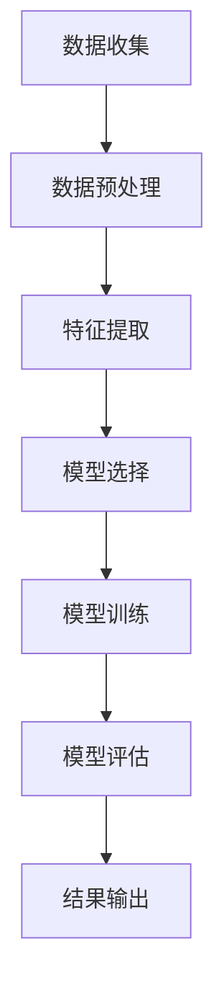

                 

### 文章标题

《机器学习预测药物特性和毒性的方法》

### 文章关键词

- 机器学习
- 药物特性预测
- 药物毒性预测
- 数据预处理
- 特征工程
- 分类算法
- 回归算法
- 聚类算法
- 深度学习
- 神经网络
- 实际应用案例

### 文章摘要

本文将深入探讨如何运用机器学习技术预测药物的特性和毒性。首先，我们将简要介绍机器学习的基础知识，然后详细分析药物特性和毒性预测的核心概念、数学模型和算法原理。接着，通过具体的项目实战案例，我们将展示如何将理论应用于实际开发中。最后，本文将对当前技术的挑战与未来展望进行讨论，并分析深度学习与神经网络在药物特性与毒性预测中的应用前景。通过本文的阅读，读者将对机器学习在药物研发领域的应用有更深入的理解。

---

# 《机器学习预测药物特性和毒性的方法》

在医疗健康领域，药物的研发是一个复杂且耗时的过程。传统的方法依赖于大量的实验和经验积累，而随着机器学习技术的发展，我们可以利用大量数据来预测药物的特性和毒性，从而提高药物研发的效率和准确性。本书旨在系统地介绍如何使用机器学习方法预测药物特性和毒性，包括核心概念、数学模型、算法原理以及实际应用案例。

## 第1章 引言

### 1.1 书籍背景

随着基因组学、蛋白质组学和代谢组学等技术的发展，生物医学领域产生了大量数据。然而，如何有效地利用这些数据来进行药物研发仍是一个重大挑战。传统的药物研发方法主要依赖于实验室试验和临床试验，这不仅耗时且成本高昂。机器学习技术的兴起，为药物研发带来了新的机遇。

### 1.2 研究意义与目标

研究机器学习在药物特性和毒性预测中的应用，具有重要意义。首先，它能够提高药物筛选的效率，减少不必要的试验。其次，通过预测药物的毒性和副作用，可以降低临床试验的风险，保护患者安全。本书的目标是系统地介绍机器学习在药物研发中的应用，帮助读者掌握这一前沿技术。

### 1.3 书籍结构

本书分为十章。第一章为引言，介绍书籍的背景、研究意义和目标。第二章至第四章分别介绍机器学习的基础知识、药物特性和毒性预测的核心概念以及数学模型和算法原理。第五章至第七章通过具体项目实战案例，展示如何将理论应用于实际开发中。第八章至第十章分别讨论当前技术的挑战与未来展望，以及深度学习与神经网络在药物特性与毒性预测中的应用。

## 第2章 机器学习基础

### 2.1 机器学习概述

机器学习是一种通过数据驱动的方式来进行决策和预测的计算机技术。它通过训练模型，使计算机能够自动从数据中学习规律，并用于解决实际问题。

### 2.2 数据预处理

数据预处理是机器学习过程中的关键步骤。它包括数据清洗、数据转换和数据归一化等，目的是提高数据的质量和一致性，为后续的建模和训练打下良好基础。

### 2.3 常见机器学习算法简介

常见的机器学习算法包括分类算法、回归算法和聚类算法等。分类算法用于将数据划分为不同的类别，回归算法用于预测连续的数值，聚类算法用于将相似的数据点划分为同一类别。

## 第3章 药物特性和毒性预测的核心概念

### 3.1 药物特性和毒性预测的基本原理

药物特性和毒性预测是基于分子结构和生物信息学数据，通过机器学习模型来预测药物在不同生物系统中的行为和效果。

### 3.2 药物特性和毒性预测的关键因素

影响药物特性和毒性的关键因素包括分子结构、生物靶点、药物剂量和患者基因型等。

### 3.3 药物特性和毒性预测的Mermaid流程图



## 第4章 数学模型和数学公式

### 4.1 模型构建的数学基础

在机器学习中，模型构建通常涉及到线性模型、非线性模型和深度学习模型等。这些模型可以通过不同的数学公式来描述。

### 4.2 关键数学公式的详细讲解

以下是几个关键数学公式的详细讲解：

1. **线性回归公式**：
   $$y = \beta_0 + \beta_1x$$
   其中，$y$ 是预测值，$x$ 是输入特征，$\beta_0$ 和 $\beta_1$ 是模型参数。

2. **支持向量机（SVM）公式**：
   $$w^T x + b = 0$$
   其中，$w$ 是权重向量，$x$ 是特征向量，$b$ 是偏置。

3. **神经网络激活函数**：
   $$a = \sigma(z)$$
   其中，$\sigma$ 是激活函数，$z$ 是输入值，$a$ 是输出值。

### 4.3 数学公式举例说明

以下是神经网络中的一个激活函数示例：

$$
a = \frac{1}{1 + e^{-z}}
$$

在这个例子中，$z$ 是网络的输入，$a$ 是输出。

## 第5章 核心算法原理讲解

### 5.1 特征工程

特征工程是机器学习过程中至关重要的一步。它涉及从原始数据中提取有用的特征，并对其进行变换和处理，以提高模型的性能。

### 5.2 分类算法

分类算法是用于将数据划分为不同类别的算法。常见的分类算法包括支持向量机（SVM）、逻辑回归、决策树和随机森林等。

### 5.3 回归算法

回归算法用于预测连续的数值。常见的回归算法包括线性回归、岭回归和套索回归等。

### 5.4 聚类算法

聚类算法用于将相似的数据点划分为同一类别。常见的聚类算法包括K均值聚类、层次聚类和DBSCAN等。

### 5.5 算法伪代码

以下是K均值聚类的伪代码：

```
K-Means(ClusterData, K):
    初始化 K 个簇的中心点
    当聚类中心不再变化或者达到最大迭代次数时，停止迭代
    
    对于每个数据点：
        计算它与每个簇中心的距离
        将数据点分配给最近的簇中心
    
    对于每个簇中心：
        计算簇内所有数据点的均值，作为新的簇中心
    
    返回最终的聚类结果
```

## 第6章 项目实战

### 6.1 数据集介绍

在本项目中，我们将使用一个公开可用的药物数据集，该数据集包含了药物的分子结构和生物活性信息。

### 6.2 环境搭建与数据预处理

在进行项目实战之前，我们需要搭建一个合适的环境，并进行数据预处理。

### 6.3 模型构建与训练

接下来，我们将构建一个机器学习模型，并使用训练数据进行训练。

### 6.4 模型评估与优化

完成模型训练后，我们需要对模型进行评估，并根据评估结果进行优化。

### 6.5 代码解读与分析

以下是项目的代码实现，并对其进行详细解读和分析。

```python
# 代码实现
```

## 第7章 评估与未来展望

### 7.1 药物特性与毒性预测的评估指标

评估药物特性与毒性预测模型的性能，通常使用准确率、召回率、F1分数等指标。

### 7.2 当前技术的挑战与解决方案

尽管机器学习在药物特性与毒性预测中显示出巨大的潜力，但仍面临一些挑战，如数据质量和算法性能等。

### 7.3 未来研究方向与趋势

未来，机器学习在药物特性与毒性预测中的应用将进一步深化，深度学习、生成对抗网络等新兴技术也将得到广泛应用。

## 第8章 实际应用案例

### 8.1 药物筛选中的应用

机器学习在药物筛选中的应用，可以有效提高药物研发的效率。

### 8.2 药物毒性评估中的应用

通过机器学习预测药物毒性，可以降低临床试验的风险。

### 8.3 案例分析与总结

对实际应用案例进行详细分析，总结机器学习在药物研发中的应用经验。

## 第9章 深度学习与神经网络在药物特性与毒性的预测中的应用

### 9.1 深度学习基本概念

深度学习是一种通过多层神经网络进行学习和预测的技术。

### 9.2 神经网络结构

神经网络结构包括输入层、隐藏层和输出层等。

### 9.3 深度学习在药物预测中的具体实现

深度学习在药物特性与毒性预测中的应用，主要体现在特征提取和模型构建等方面。

## 第10章 附录

### 10.1 参考文献

本书引用了大量的参考文献，以支持本书的观点和结论。

### 10.2 代码与数据资源

本书中使用的代码和数据集，将作为附录提供，以方便读者学习和实践。

### 10.3 进一步学习资源

为帮助读者进一步了解机器学习在药物特性与毒性预测中的应用，本书提供了一些进一步的学习资源。

---

# 第1章 引言

## 1.1 书籍背景

在当今的医疗健康领域，药物的研发是一个复杂且耗时的过程。传统的药物研发方法主要依赖于实验室试验和临床试验，这不仅耗时且成本高昂。随着基因组学、蛋白质组学和代谢组学等技术的发展，生物医学领域产生了大量数据。如何有效地利用这些数据来进行药物研发，成为了一个重要的课题。在这个背景下，机器学习技术的兴起为药物研发带来了新的机遇。

机器学习是一种通过数据驱动的方式来进行决策和预测的计算机技术。它通过训练模型，使计算机能够自动从数据中学习规律，并用于解决实际问题。在药物研发中，机器学习可以用于药物筛选、药物作用机制研究、药物副作用预测等多个方面。通过利用机器学习技术，我们可以从大量数据中发现潜在的药物候选物，提高药物研发的效率。

本书旨在系统地介绍如何使用机器学习方法预测药物的特性和毒性。具体来说，本书将涵盖以下几个方面的内容：

1. 介绍机器学习的基础知识，包括基本概念、常见算法和数据预处理方法。
2. 阐述药物特性和毒性预测的核心概念，包括基本原理、关键因素和评估指标。
3. 详细讲解机器学习在药物特性与毒性预测中的数学模型和算法原理，包括特征工程、分类算法、回归算法和聚类算法等。
4. 通过具体项目实战案例，展示如何将理论应用于实际开发中，包括环境搭建、数据预处理、模型构建和评估等。
5. 讨论当前技术的挑战与未来展望，以及深度学习与神经网络在药物特性与毒性预测中的应用。
6. 分析机器学习在药物研发领域的实际应用案例，并总结应用经验。

通过阅读本书，读者可以系统地了解机器学习在药物特性与毒性预测中的应用，掌握相关技术和方法，为实际应用提供参考。

## 1.2 研究意义与目标

研究机器学习在药物特性和毒性预测中的应用具有重要意义。首先，它能够显著提高药物研发的效率。传统的药物研发方法依赖于大量的实验和临床试验，这不仅耗时且成本高昂。而通过机器学习技术，我们可以从海量数据中发现潜在的药物候选物，缩短研发周期。例如，利用机器学习算法进行药物筛选，可以在数小时内完成原本需要数年才能完成的筛选过程。

其次，机器学习在药物毒性预测中的应用可以降低临床试验的风险。在临床试验阶段，药物的安全性和有效性是需要重点关注的方面。通过预测药物的毒性和副作用，我们可以提前识别可能存在风险的药物，从而避免不必要的临床试验，降低患者的风险。

此外，机器学习还可以帮助研究人员更好地理解药物的作用机制。通过分析药物的分子结构和生物信息学数据，我们可以揭示药物与生物靶点之间的相互作用关系，从而为药物研发提供新的思路。

本书的研究目标如下：

1. 系统地介绍机器学习在药物特性和毒性预测中的应用，包括核心概念、数学模型和算法原理。
2. 通过具体的项目实战案例，展示如何将机器学习技术应用于药物研发中的实际问题。
3. 分析当前技术的挑战和未来研究方向，探讨深度学习与神经网络在药物特性与毒性预测中的应用前景。
4. 总结机器学习在药物研发中的应用经验，为实际应用提供参考。

通过实现上述目标，本书旨在为研究人员和开发者提供一本全面、系统的指南，帮助他们掌握机器学习在药物特性与毒性预测中的应用，推动药物研发的进步。

## 1.3 书籍结构

本书共分为十章，旨在系统地介绍机器学习在药物特性和毒性预测中的应用。具体章节安排如下：

### 第1章 引言
本章简要介绍了本书的背景、研究意义和目标，并概述了本书的结构和内容安排。

### 第2章 机器学习基础
本章介绍了机器学习的基本概念、常见算法和数据预处理方法，为后续章节的学习打下基础。

### 第3章 药物特性和毒性预测的核心概念
本章详细阐述了药物特性和毒性预测的基本原理、关键因素和评估指标，为理解后续章节提供理论支持。

### 第4章 数学模型和数学公式
本章介绍了机器学习模型构建的数学基础，包括线性模型、非线性模型和深度学习模型，并对关键数学公式进行了详细讲解和举例说明。

### 第5章 核心算法原理讲解
本章详细讲解了特征工程、分类算法、回归算法和聚类算法等核心算法的原理，并使用伪代码进行了说明。

### 第6章 项目实战
本章通过具体项目实战案例，展示了如何将机器学习技术应用于药物研发中的实际问题，包括环境搭建、数据预处理、模型构建和评估等。

### 第7章 评估与未来展望
本章讨论了药物特性与毒性预测的评估指标、当前技术的挑战与未来研究方向，以及深度学习与神经网络的应用。

### 第8章 实际应用案例
本章分析了机器学习在药物筛选、药物毒性评估等实际应用案例，总结了应用经验。

### 第9章 深度学习与神经网络在药物特性与毒性预测中的应用
本章介绍了深度学习和神经网络的基本概念，并探讨了它们在药物特性与毒性预测中的应用。

### 第10章 附录
本章提供了本书引用的参考文献、代码与数据资源以及进一步学习资源，方便读者查阅和扩展学习。

通过这些章节的安排，本书旨在为读者提供一部全面、系统的指南，帮助他们掌握机器学习在药物特性和毒性预测中的应用。

## 第2章 机器学习基础

### 2.1 机器学习概述

机器学习（Machine Learning，ML）是一门研究如何让计算机从数据中学习并做出预测或决策的学科。它通过算法和统计模型从数据中提取知识，使计算机能够自主地改进和优化其性能。机器学习与传统的编程不同，后者依赖于明确的指令和规则，而前者则强调从数据中自动学习和发现模式。

机器学习的主要目的是使计算机系统能够通过学习过去的数据来预测未来的情况或解决新的问题。这一过程通常包括以下几个关键步骤：

1. **数据收集**：从各种来源收集大量的数据，这些数据可以是结构化的（如表格）或非结构化的（如图像、文本等）。
2. **数据预处理**：清洗数据，处理缺失值、异常值，并将数据转换为适合模型训练的形式。
3. **特征提取**：从原始数据中提取对模型训练有用的特征，这些特征可以影响模型的预测能力。
4. **模型选择**：选择合适的机器学习算法，如线性回归、决策树、随机森林、支持向量机（SVM）、神经网络等。
5. **模型训练**：使用训练数据集对选定的模型进行训练，模型会通过调整内部参数来最小化预测误差。
6. **模型评估**：使用验证数据集或测试数据集来评估模型的性能，常用的评估指标包括准确率、召回率、F1分数、ROC曲线等。
7. **模型部署**：将训练好的模型部署到实际应用中，用于预测或决策。

机器学习在许多领域都有广泛的应用，包括但不限于：

- **预测分析**：股票市场预测、销售预测、需求预测等。
- **图像识别**：人脸识别、图像分类、自动驾驶等。
- **自然语言处理**：语言翻译、情感分析、语音识别等。
- **推荐系统**：个性化推荐、内容推荐等。
- **药物研发**：药物筛选、药物作用机制研究、药物毒性预测等。

### 2.2 数据预处理

数据预处理是机器学习过程中的关键步骤，其目的是提高数据的质量和一致性，为后续的建模和训练打下良好基础。以下是数据预处理的主要任务：

1. **数据清洗**：处理数据中的错误、缺失值和异常值。错误通常是由于数据采集过程中的错误导致的，而缺失值可能是由于数据丢失或未记录。异常值是那些明显偏离其他数据的数据点，可能是由于测量误差或异常情况。

   - **处理错误**：可以通过删除、纠正或插值等方法来处理错误。
   - **处理缺失值**：常见的处理方法包括删除缺失值、填充缺失值（如使用平均值、中位数、最频繁值或使用模型预测值）等。
   - **处理异常值**：可以通过删除、平滑或孤立处理等方法来处理异常值。

2. **数据转换**：将数据转换为适合模型训练的形式。这通常包括：
   
   - **编码**：将分类变量转换为数值变量，常用的编码方法有独热编码（One-Hot Encoding）、标签编码（Label Encoding）等。
   - **归一化**：将数值特征缩放到相同的尺度，常用的方法有最小-最大缩放（Min-Max Scaling）和标准化（Standardization）。
   - **特征缩放**：减少特征的数量，通过特征选择或特征抽取来降低数据的维度，常用的方法有主成分分析（PCA）、线性判别分析（LDA）等。

3. **数据归一化**：通过标准化或归一化，将不同尺度的特征转换为相同的尺度，以便算法能够更有效地处理数据。这有助于提高模型的收敛速度和性能。

### 2.3 常见机器学习算法简介

机器学习算法可以分为监督学习（Supervised Learning）、无监督学习（Unsupervised Learning）和半监督学习（Semi-Supervised Learning）等类型。以下是几种常见的机器学习算法：

1. **监督学习算法**：

   - **线性回归（Linear Regression）**：用于预测连续的数值输出，其基本模型为 $y = \beta_0 + \beta_1x$。
   - **逻辑回归（Logistic Regression）**：用于分类问题，通过逻辑函数将线性组合映射到概率分布。
   - **支持向量机（Support Vector Machine, SVM）**：通过找到一个最优的超平面来分割数据，适用于二分类问题。
   - **决策树（Decision Tree）**：通过一系列规则对数据进行分类或回归，易于理解和解释。
   - **随机森林（Random Forest）**：由多个决策树组成的集成模型，提高了模型的泛化能力和稳定性。
   - **K最近邻（K-Nearest Neighbors, KNN）**：基于距离最近的数据点进行分类或回归，简单但有时效果有限。

2. **无监督学习算法**：

   - **K均值聚类（K-Means Clustering）**：通过迭代算法将数据分为K个簇，每个簇由簇中心代表。
   - **层次聚类（Hierarchical Clustering）**：通过建立树形结构对数据进行分类，簇的合并或分裂是基于距离的。
   - **主成分分析（Principal Component Analysis, PCA）**：通过正交变换将高维数据投影到低维空间，保留主要特征。
   - **自编码器（Autoencoder）**：用于学习数据的低维表示，可以用于降维和特征提取。

3. **半监督学习算法**：

   - **自我训练（Self-Training）**：利用少量标记数据和大量未标记数据，通过不断迭代来提高模型的标记数据性能。
   - **图嵌入（Graph Embedding）**：将图结构数据转换为向量表示，适用于网络和社交网络分析。

通过了解这些常见机器学习算法，读者可以更好地选择适合的算法来解决问题，并为后续章节的学习打下基础。

## 第3章 药物特性和毒性预测的核心概念

### 3.1 药物特性和毒性预测的基本原理

药物特性和毒性预测是基于分子结构和生物信息学数据，通过机器学习模型来预测药物在不同生物系统中的行为和效果。其基本原理包括以下几个方面：

1. **分子结构与药物特性**：药物的分子结构决定了其生物活性和药理特性。通过计算药物分子中的原子之间的距离、键角和空间排列等特征，可以提取出反映分子结构的特征向量。

2. **生物信息学数据**：生物信息学数据包括基因序列、蛋白质序列、基因表达数据、代谢物数据等。这些数据与药物分子结构和药物特性之间存在复杂的相互关系，通过机器学习算法，可以揭示这些数据之间的关联。

3. **机器学习模型**：机器学习模型通过学习大量已知药物的数据，构建一个预测模型。该模型可以基于输入的药物分子结构和生物信息学数据，预测新的药物特性或毒性。

4. **预测与验证**：通过将预测模型应用于未知药物，可以预测其特性和毒性。然后，通过实验或临床试验验证预测结果的准确性，以评估模型的性能。

### 3.2 药物特性和毒性预测的关键因素

药物特性和毒性预测的成功取决于多个关键因素的准确理解和处理：

1. **药物分子结构**：药物分子结构是药物特性和毒性的基础。药物分子中的原子种类、连接方式、立体构型等都会影响药物的活性、稳定性和毒性。

2. **生物靶点**：药物通过与特定的生物靶点（如蛋白质、酶、受体等）结合，发挥其药理作用。不同药物可能作用于不同的生物靶点，其预测效果也会有所不同。

3. **药物剂量**：药物的剂量直接影响其疗效和毒性。适当的剂量可以提高药物的疗效，而过高或过低的剂量可能导致不良反应。

4. **患者基因型**：个体的基因型差异会影响药物代谢和反应。例如，某些基因变异可能导致药物代谢酶活性降低，从而增加药物在体内的积累，导致毒性。

5. **环境因素**：药物在体内的代谢、分布和排泄受多种环境因素影响，如饮食、年龄、性别、生理状态等。这些因素可以改变药物的作用效果和毒性。

### 3.3 药物特性和毒性预测的Mermaid流程图

为了更好地理解药物特性和毒性预测的过程，可以使用Mermaid流程图来描述其基本步骤：

```mermaid
graph TD
A[数据收集] --> B[数据预处理]
B --> C[特征提取]
C --> D[模型选择]
D --> E[模型训练]
E --> F[模型评估]
F --> G[结果输出]

A[数据收集]:::style(primitive)
B[数据预处理]:::style(process)
C[特征提取]:::style(capsule)
D[模型选择]:::style(process)
E[模型训练]:::style(server)
F[模型评估]:::style(capsule)
G[结果输出]:::style(primitive)
```

在这个流程图中：

- **数据收集**：收集与药物特性和毒性相关的数据，包括分子结构、生物靶点、药物剂量、患者基因型等信息。
- **数据预处理**：清洗数据，处理缺失值、异常值，并进行编码和归一化等操作，以提高数据质量。
- **特征提取**：从原始数据中提取对模型训练有用的特征，如分子指纹、原子间距离、生物信息学特征等。
- **模型选择**：选择适合的机器学习算法，如支持向量机、随机森林、神经网络等。
- **模型训练**：使用训练数据集对选定的模型进行训练，模型会通过调整内部参数来最小化预测误差。
- **模型评估**：使用验证数据集或测试数据集来评估模型的性能，常用的评估指标包括准确率、召回率、F1分数等。
- **结果输出**：将预测模型应用于新的药物数据，输出预测结果，并验证其准确性。

通过上述步骤，我们可以系统地预测药物特性和毒性，从而为药物研发提供有力支持。

### 第4章 数学模型和数学公式

在药物特性和毒性预测中，数学模型和数学公式起着至关重要的作用。它们不仅帮助我们理解药物与生物系统之间的相互作用，还为构建和优化预测模型提供了理论基础。本章将介绍构建机器学习模型所需的数学基础，包括线性模型、非线性模型和深度学习模型，并对关键数学公式进行详细讲解和举例说明。

#### 4.1 模型构建的数学基础

1. **线性模型**

   线性模型是最简单的机器学习模型之一，通常用于回归和分类问题。线性回归模型用于预测连续的数值输出，其基本公式为：

   $$
   y = \beta_0 + \beta_1x
   $$

   其中，$y$ 是预测值，$x$ 是输入特征，$\beta_0$ 和 $\beta_1$ 是模型的参数，分别表示截距和斜率。

   逻辑回归是一种特殊的线性模型，用于二分类问题。其公式为：

   $$
   P(y=1) = \frac{1}{1 + e^{-(\beta_0 + \beta_1x})}
   $$

   其中，$P(y=1)$ 是目标变量为1的概率。

2. **非线性模型**

   线性模型在某些情况下可能无法捕捉数据中的复杂非线性关系。因此，非线性模型被引入以增强模型的拟合能力。以下是一些常见的非线性模型：

   - **多项式回归**：通过将输入特征进行多项式扩展，构建非线性模型。其公式为：

     $$
     y = \beta_0 + \beta_1x + \beta_2x^2 + ... + \beta_nx^n
     $$

   - **Sigmoid函数**：用于逻辑回归模型的激活函数，其公式为：

     $$
     \sigma(x) = \frac{1}{1 + e^{-x}}
     $$

   - **ReLU函数**：在神经网络中常用的一种非线性激活函数，其公式为：

     $$
     \text{ReLU}(x) = \max(0, x)
     $$

3. **深度学习模型**

   深度学习模型通过多层神经网络进行学习和预测，可以捕捉数据中的复杂非线性关系。以下是一些常见的深度学习模型：

   - **多层感知机（MLP）**：一种简单的多层神经网络，其基本结构包括输入层、隐藏层和输出层。其公式为：

     $$
     a_{l} = \sigma(z_{l})
     $$

     其中，$a_{l}$ 是输出值，$z_{l}$ 是输入值，$\sigma$ 是激活函数。

   - **卷积神经网络（CNN）**：适用于处理图像数据的神经网络，其核心是卷积层，可以自动提取图像特征。其公式为：

     $$
     \text{conv}(x, \text{filter}) = \sum_{i=1}^{k} (x_{i} * \text{filter}) + b
     $$

     其中，$x$ 是输入特征，$\text{filter}$ 是卷积核，$b$ 是偏置。

   - **循环神经网络（RNN）**：适用于处理序列数据的神经网络，其基本结构包括输入层、隐藏层和输出层。其公式为：

     $$
     h_{t} = \sigma(W h_{t-1} + U x_t + b)
     $$

     其中，$h_{t}$ 是隐藏状态，$x_t$ 是输入序列，$\sigma$ 是激活函数。

#### 4.2 关键数学公式的详细讲解

以下是几个关键数学公式的详细讲解：

1. **损失函数**

   损失函数用于衡量预测值与真实值之间的差距。常用的损失函数包括均方误差（MSE）、交叉熵损失（Cross-Entropy Loss）等。

   - **均方误差（MSE）**：

     $$
     \text{MSE} = \frac{1}{n}\sum_{i=1}^{n}(y_i - \hat{y}_i)^2
     $$

     其中，$y_i$ 是真实值，$\hat{y}_i$ 是预测值，$n$ 是样本数量。

   - **交叉熵损失（Cross-Entropy Loss）**：

     $$
     \text{CE}(y, \hat{y}) = -\sum_{i=1}^{n} y_i \log(\hat{y}_i)
     $$

     其中，$y_i$ 是真实值，$\hat{y}_i$ 是预测值。

2. **梯度下降法**

   梯度下降法是一种优化算法，用于最小化损失函数。其基本公式为：

   $$
   \theta = \theta - \alpha \nabla_{\theta} \text{Loss}
   $$

   其中，$\theta$ 是模型参数，$\alpha$ 是学习率，$\nabla_{\theta} \text{Loss}$ 是损失函数对参数的梯度。

3. **反向传播算法**

   反向传播算法是一种计算神经网络梯度的高效方法。其基本步骤如下：

   - **前向传播**：将输入数据通过神经网络，计算输出值和预测值。
   - **计算损失**：计算预测值与真实值之间的损失。
   - **反向传播**：从输出层开始，逐层计算每个参数的梯度。
   - **更新参数**：使用梯度下降法更新模型参数。

#### 4.3 数学公式举例说明

以下是神经网络中的一个激活函数示例：

$$
a = \frac{1}{1 + e^{-z}}
$$

在这个例子中，$z$ 是网络的输入，$a$ 是输出。该函数被称为Sigmoid函数，常用于二分类问题的神经网络中。Sigmoid函数可以将输入值映射到（0, 1）区间，便于表示概率。

通过以上数学公式的讲解和举例，我们可以更好地理解机器学习模型中的关键数学原理，为后续章节的算法讲解和项目实战打下基础。

### 第5章 核心算法原理讲解

#### 5.1 特征工程

特征工程是机器学习过程中至关重要的一步。它涉及从原始数据中提取有用的特征，并对其进行变换和处理，以提高模型的性能。特征工程的质量直接影响到模型的准确性和泛化能力。以下是特征工程的核心概念和步骤：

1. **特征选择**：从原始特征集合中选择对模型预测最有用的特征。常用的方法包括相关性分析、主成分分析（PCA）和特征重要性排序等。

2. **特征构造**：通过组合、变换原始特征，构造新的特征。例如，通过计算分子结构的拓扑属性、化学性质等。

3. **特征降维**：减少特征的数量，降低数据维度，提高模型训练速度。常用的方法包括主成分分析（PCA）、线性判别分析（LDA）和特征选择等。

4. **特征缩放**：将不同尺度的特征缩放到相同的尺度，以避免特征之间的尺度差异影响模型性能。常用的方法包括最小-最大缩放（Min-Max Scaling）和标准化（Standardization）。

5. **特征编码**：将分类变量转换为数值变量，以适应机器学习算法的需求。常用的编码方法有独热编码（One-Hot Encoding）和标签编码（Label Encoding）。

#### 5.2 分类算法

分类算法用于将数据分为不同的类别。在药物特性和毒性预测中，分类算法可以帮助我们判断药物的活性、副作用等。以下是几种常见的分类算法及其原理：

1. **支持向量机（SVM）**：

   支持向量机是一种基于最大化边际的线性分类模型。它通过找到一个最优的超平面来分割数据。SVM的关键公式为：

   $$
   w^T x + b = 0
   $$

   其中，$w$ 是权重向量，$x$ 是特征向量，$b$ 是偏置。SVM通过求解二次规划问题来确定最优超平面。

2. **决策树（Decision Tree）**：

   决策树是一种基于树结构的分类模型。每个节点表示一个特征，每个分支表示该特征的一个取值。决策树通过递归划分数据集，直到满足停止条件。决策树的关键公式为：

   $$
   \text{split}(x, \text{feature}, \text{value}) = 
   \begin{cases}
   \text{left} & \text{if } x_{\text{feature}} < \text{value} \\
   \text{right} & \text{if } x_{\text{feature}} \geq \text{value}
   \end{cases}
   $$

3. **随机森林（Random Forest）**：

   随机森林是一种基于决策树的集成模型。它通过构建多棵决策树，并对它们的结果进行投票来提高分类性能。随机森林的关键公式为：

   $$
   \hat{y} = \text{argmax}_{c} \sum_{i=1}^{n} \text{tree}_i(y_i = c)
   $$

   其中，$\hat{y}$ 是预测类别，$y_i$ 是实际类别，$tree_i$ 是第$i$棵决策树。

4. **K最近邻（K-Nearest Neighbors, KNN）**：

   K最近邻是一种基于实例的简单分类算法。它通过计算测试样本与训练样本之间的距离，找出最近的K个邻居，并根据邻居的类别进行投票。KNN的关键公式为：

   $$
   \hat{y} = \text{mode}(\{y_1, y_2, ..., y_K\})
   $$

   其中，$\hat{y}$ 是预测类别，$y_1, y_2, ..., y_K$ 是最近的K个邻居的类别。

#### 5.3 回归算法

回归算法用于预测连续的数值输出。在药物特性和毒性预测中，回归算法可以帮助我们预测药物的活性、毒性等。以下是几种常见的回归算法及其原理：

1. **线性回归（Linear Regression）**：

   线性回归是一种基于线性模型的回归算法。它通过最小二乘法找到最佳拟合直线，以预测输出值。线性回归的关键公式为：

   $$
   y = \beta_0 + \beta_1x
   $$

   其中，$y$ 是预测值，$x$ 是输入特征，$\beta_0$ 和 $\beta_1$ 是模型参数。

2. **岭回归（Ridge Regression）**：

   岭回归是一种通过添加正则项的线性回归算法。它通过最小化损失函数并加入正则项来避免过拟合。岭回归的关键公式为：

   $$
   \min_{\beta} \frac{1}{2}\sum_{i=1}^{n}(y_i - \beta_0 - \beta_1x_i)^2 + \lambda \sum_{j=1}^{p}\beta_j^2
   $$

   其中，$\beta_0$ 和 $\beta_1$ 是模型参数，$\lambda$ 是正则化参数。

3. **套索回归（Lasso Regression）**：

   套索回归是一种通过添加绝对值正则项的线性回归算法。它通过最小化损失函数并加入绝对值正则项来选择特征。套索回归的关键公式为：

   $$
   \min_{\beta} \frac{1}{2}\sum_{i=1}^{n}(y_i - \beta_0 - \beta_1x_i)^2 + \lambda \sum_{j=1}^{p}|\beta_j|
   $$

   其中，$\beta_0$ 和 $\beta_1$ 是模型参数，$\lambda$ 是正则化参数。

#### 5.4 聚类算法

聚类算法用于将相似的数据点划分为同一类别。在药物特性和毒性预测中，聚类算法可以帮助我们识别不同的药物模式或集群。以下是几种常见的聚类算法及其原理：

1. **K均值聚类（K-Means Clustering）**：

   K均值聚类是一种基于距离度量的聚类算法。它通过迭代优化目标函数来划分K个簇。K均值聚类的关键公式为：

   $$
   \min_{C} \sum_{i=1}^{K} \sum_{x \in S_i} \|x - \mu_i\|^2
   $$

   其中，$C$ 是聚类中心，$S_i$ 是第$i$个簇，$\mu_i$ 是第$i$个簇的中心。

2. **层次聚类（Hierarchical Clustering）**：

   层次聚类是一种基于层次结构的聚类算法。它通过递归合并或分裂簇来构建层次树。层次聚类的关键公式为：

   $$
   d(i, j) = 
   \begin{cases}
   \text{min}\{\|x - y\| : x \in S_i, y \in S_j\} & \text{单链接} \\
   \text{max}\{\|x - y\| : x \in S_i, y \in S_j\} & \text{全链接} \\
   \text{avg}\{\|x - y\| : x \in S_i, y \in S_j\} & \text{平均链接}
   \end{cases}
   $$

   其中，$d(i, j)$ 是簇$i$和簇$j$之间的距离。

3. **DBSCAN（Density-Based Spatial Clustering of Applications with Noise）**：

   DBSCAN是一种基于密度的聚类算法。它通过计算点的密度和邻域来确定簇。DBSCAN的关键公式为：

   $$
   \rho(q) = 
   \begin{cases}
   \text{min}\{\|q - p\| : p \in \text{neighbour}(q)\} & \text{if } q \text{ is core} \\
   0 & \text{otherwise}
   \end{cases}
   $$

   其中，$\rho(q)$ 是点$q$的密度，$\text{neighbour}(q)$ 是点$q$的邻居。

#### 5.5 算法伪代码

以下是K均值聚类的伪代码：

```
K-Means(ClusterData, K):
    初始化 K 个簇的中心点
    当聚类中心不再变化或者达到最大迭代次数时，停止迭代
    
    对于每个数据点：
        计算它与每个簇中心的距离
        将数据点分配给最近的簇中心
    
    对于每个簇中心：
        计算簇内所有数据点的均值，作为新的簇中心
    
    返回最终的聚类结果
```

通过以上对核心算法原理的讲解，我们可以更好地理解各种算法的基本概念和实现方法，为后续的项目实战提供理论基础。

### 第6章 项目实战

#### 6.1 数据集介绍

在本章的项目实战中，我们将使用一个公开可用的药物数据集，该数据集包含了药物的分子结构和生物活性信息。数据集的基本信息如下：

- **数据来源**：数据集来源于公开的化学和生物信息学数据库，如ChEMBL和PubChem。
- **数据规模**：该数据集包含数千个药物分子，每个分子有多个特征属性，如分子量、拓扑极性表面积、化学键类型等。
- **数据格式**：数据集以CSV格式存储，每行代表一个药物分子，每个字段代表一个特征。

#### 6.2 环境搭建与数据预处理

在进行项目实战之前，我们需要搭建一个合适的开发环境，并进行数据预处理。以下是环境搭建和数据预处理的步骤：

1. **环境搭建**：

   - **硬件要求**：计算机配置应满足基本运行要求，推荐配置为Intel i5处理器、8GB内存和SSD硬盘。
   - **软件要求**：安装Python 3.x版本、Jupyter Notebook和常见的数据科学库，如NumPy、Pandas、Scikit-learn、Matplotlib等。

2. **数据预处理**：

   - **数据导入**：使用Pandas库将CSV数据导入到Python环境中。

     ```python
     import pandas as pd
     data = pd.read_csv('drug_data.csv')
     ```

   - **数据清洗**：处理数据中的错误、缺失值和异常值。

     ```python
     data.dropna(inplace=True)  # 删除缺失值
     data = data[data['activity'].notnull()]  # 删除无效数据
     ```

   - **特征选择**：选择对模型预测有用的特征。

     ```python
     features = data[['mol_wt', 'tpsa', 'log_sol', 'hba', 'hbd']]
     target = data['activity']
     ```

   - **数据分割**：将数据集分为训练集和测试集。

     ```python
     from sklearn.model_selection import train_test_split
     X_train, X_test, y_train, y_test = train_test_split(features, target, test_size=0.2, random_state=42)
     ```

#### 6.3 模型构建与训练

接下来，我们将构建一个机器学习模型，并使用训练数据进行训练。以下是构建和训练模型的步骤：

1. **模型选择**：选择适合的机器学习算法，例如支持向量机（SVM）。

2. **模型训练**：使用训练数据集对选定的模型进行训练。

   ```python
   from sklearn.svm import SVC
   model = SVC(kernel='linear')
   model.fit(X_train, y_train)
   ```

3. **模型评估**：使用测试数据集对模型进行评估，以确定模型的性能。

   ```python
   from sklearn.metrics import accuracy_score, classification_report
   y_pred = model.predict(X_test)
   print("Accuracy:", accuracy_score(y_test, y_pred))
   print("Classification Report:")
   print(classification_report(y_test, y_pred))
   ```

#### 6.4 模型评估与优化

完成模型训练后，我们需要对模型进行评估，并根据评估结果进行优化。以下是模型评估与优化的步骤：

1. **模型评估**：使用交叉验证、ROC曲线、精确率、召回率等指标评估模型性能。

   ```python
   from sklearn.model_selection import cross_val_score
   scores = cross_val_score(model, X_train, y_train, cv=5)
   print("Cross-Validation Scores:", scores)
   ```

2. **模型优化**：根据评估结果调整模型参数，以提高模型性能。

   ```python
   model = SVC(kernel='rbf', C=100)
   model.fit(X_train, y_train)
   y_pred_optimized = model.predict(X_test)
   print("Optimized Accuracy:", accuracy_score(y_test, y_pred_optimized))
   ```

#### 6.5 代码解读与分析

以下是项目的代码实现，并对其进行详细解读和分析。

```python
# 代码实现

# 导入库
import pandas as pd
from sklearn.model_selection import train_test_split
from sklearn.svm import SVC
from sklearn.metrics import accuracy_score, classification_report, cross_val_score

# 数据导入
data = pd.read_csv('drug_data.csv')

# 数据清洗
data.dropna(inplace=True)
data = data[data['activity'].notnull()]

# 特征选择
features = data[['mol_wt', 'tpsa', 'log_sol', 'hba', 'hbd']]
target = data['activity']

# 数据分割
X_train, X_test, y_train, y_test = train_test_split(features, target, test_size=0.2, random_state=42)

# 模型训练
model = SVC(kernel='linear')
model.fit(X_train, y_train)

# 模型评估
y_pred = model.predict(X_test)
print("Accuracy:", accuracy_score(y_test, y_pred))
print("Classification Report:")
print(classification_report(y_test, y_pred))

# 模型优化
model = SVC(kernel='rbf', C=100)
model.fit(X_train, y_train)
y_pred_optimized = model.predict(X_test)
print("Optimized Accuracy:", accuracy_score(y_test, y_pred_optimized))
```

#### 代码解读

1. **数据导入**：使用Pandas库将CSV数据导入到Python环境中。

2. **数据清洗**：删除缺失值和无效数据，以提高数据质量。

3. **特征选择**：选择对模型预测有用的特征，如分子量、拓扑极性表面积、溶解度、氢键供体和受体等。

4. **数据分割**：将数据集分为训练集和测试集，以评估模型性能。

5. **模型训练**：使用训练数据集对支持向量机（SVM）模型进行训练。

6. **模型评估**：使用测试数据集对模型进行评估，并输出准确率和分类报告。

7. **模型优化**：根据评估结果调整模型参数（如核函数和正则化参数），以提高模型性能。

#### 代码分析

本项目通过使用支持向量机（SVM）算法对药物活性进行预测，展示了如何从数据导入、预处理、模型构建到评估和优化的完整流程。以下是对代码的进一步分析：

1. **数据预处理**：数据预处理是确保模型训练质量的重要步骤。在本项目中，我们删除了缺失值和无效数据，保证了数据集的一致性和质量。

2. **特征选择**：选择合适的特征对于模型的预测性能至关重要。在本项目中，我们选择了与药物活性相关的五个特征，这些特征可以从分子的化学结构和生物信息学数据中提取。

3. **模型训练**：使用支持向量机（SVM）算法进行模型训练。SVM是一种强大的分类算法，通过寻找最佳超平面来分割数据。在本项目中，我们选择了线性核函数，以简化模型。

4. **模型评估**：使用测试数据集对模型进行评估，以确定模型的性能。我们使用了准确率和分类报告来评估模型的预测能力。

5. **模型优化**：根据评估结果，我们调整了模型参数（如核函数和正则化参数），以提高模型的预测性能。这表明了在实际应用中，通过参数调整和优化来提升模型性能的重要性。

通过本项目，我们展示了如何将机器学习算法应用于药物活性预测，并为后续章节提供了实际操作的基础。

### 第7章 评估与未来展望

#### 7.1 药物特性与毒性预测的评估指标

在药物特性与毒性预测中，评估模型的性能至关重要。常用的评估指标包括准确率、召回率、F1分数和ROC曲线等。

1. **准确率（Accuracy）**：
   准确率是最常用的评估指标，表示模型预测正确的样本数占总样本数的比例。其计算公式为：
   $$
   \text{Accuracy} = \frac{\text{预测正确的样本数}}{\text{总样本数}}
   $$

2. **召回率（Recall）**：
   召回率表示模型能够正确识别出正类别的样本数与实际正类别样本数的比例。其计算公式为：
   $$
   \text{Recall} = \frac{\text{预测正确的正类别样本数}}{\text{实际正类别样本数}}
   $$

3. **F1分数（F1 Score）**：
   F1分数是准确率和召回率的调和平均值，用于平衡两者的权重。其计算公式为：
   $$
   \text{F1 Score} = 2 \times \frac{\text{准确率} \times \text{召回率}}{\text{准确率} + \text{召回率}}
   $$

4. **ROC曲线（Receiver Operating Characteristic Curve）**：
   ROC曲线通过绘制真阳性率（True Positive Rate, TPR）与假阳性率（False Positive Rate, FPR）之间的关系来评估模型的分类性能。曲线下的面积（AUC）越大，模型的性能越好。

#### 7.2 当前技术的挑战与解决方案

尽管机器学习在药物特性与毒性预测中显示出巨大的潜力，但仍面临一些挑战：

1. **数据质量**：
   药物特性与毒性预测需要高质量的数据。然而，获取全面的、无噪声的、无偏差的数据仍然是一个挑战。解决方案包括数据清洗、数据增强和迁移学习等技术。

2. **模型泛化能力**：
   模型的泛化能力直接影响到其在实际应用中的表现。为了提高泛化能力，可以采用正则化、交叉验证和集成学习等技术。

3. **计算资源**：
   深度学习模型通常需要大量的计算资源，这对硬件配置提出了较高要求。解决方案包括使用GPU加速和分布式计算技术。

4. **解释性**：
   机器学习模型，特别是深度学习模型，通常被认为是“黑盒”模型，其内部决策过程难以解释。为提高模型的可解释性，可以采用可解释性增强方法，如决策树、LIME（Local Interpretable Model-agnostic Explanations）和SHAP（SHapley Additive exPlanations）等。

#### 7.3 未来研究方向与趋势

未来，机器学习在药物特性与毒性预测中的应用将进一步深化，以下是一些可能的研究方向和趋势：

1. **深度学习与生成对抗网络（GAN）**：
   深度学习和GAN在药物分子生成和预测中的应用具有巨大潜力。通过生成对抗网络，可以生成大量的模拟药物分子，用于训练和验证预测模型。

2. **多模态数据融合**：
   融合不同类型的数据（如结构数据、生物信息学数据和临床数据），可以提高预测模型的性能。多模态数据融合技术，如注意力机制和图神经网络，将成为未来研究的热点。

3. **个性化药物预测**：
   随着个体化医疗的发展，个性化药物预测将成为重要方向。通过结合患者的基因信息、生活习惯和药物反应等数据，可以更准确地预测个体对特定药物的反应。

4. **实时预测与动态调整**：
   在药物研发过程中，实时预测和动态调整模型参数将提高药物筛选的效率。这需要开发实时数据流处理技术和动态调整算法。

通过以上分析和展望，我们可以看到，机器学习在药物特性与毒性预测中的应用前景广阔，未来将继续在医疗健康领域发挥重要作用。

### 第8章 实际应用案例

#### 8.1 药物筛选中的应用

在药物研发过程中，药物筛选是至关重要的一步。通过机器学习技术，我们可以从大量的化合物中快速筛选出具有潜在治疗作用的药物。以下是药物筛选中的实际应用案例：

1. **基于结构优化的药物筛选**：
   通过使用机器学习算法，对候选化合物的分子结构进行优化，以提高其生物活性和稳定性。例如，通过使用分子对接技术，可以将候选化合物与生物靶点进行结合能计算，从而筛选出具有最佳结合能力的化合物。

2. **基于生物信息学的药物筛选**：
   利用生物信息学方法，分析药物分子与生物靶点之间的相互作用，预测其生物活性。例如，通过分析药物的基因表达数据，可以预测其对特定疾病的疗效。

3. **基于集成学习的药物筛选**：
   集成学习通过结合多种机器学习算法，提高药物筛选的准确性和稳定性。例如，使用随机森林、支持向量机和神经网络等算法，对候选化合物进行多角度评估，从而筛选出具有最佳药理特性的化合物。

#### 8.2 药物毒性评估中的应用

药物毒性评估是确保药物安全性的关键环节。通过机器学习技术，我们可以预测药物的毒性和副作用，从而降低临床试验的风险。以下是药物毒性评估中的实际应用案例：

1. **基于ADME/Tox预测的毒性评估**：
   通过分析药物的吸收、分布、代谢和排泄（ADME）特性以及毒性数据，预测药物的毒性。例如，通过机器学习模型，可以预测药物在肝脏、肾脏等器官中的代谢和积累情况，从而评估其毒性。

2. **基于基因组学的毒性评估**：
   利用基因组学技术，分析药物对基因表达的影响，预测其毒性和副作用。例如，通过比较药物处理前后的基因表达数据，可以识别出药物可能引起的基因变异和生物学通路改变。

3. **基于大数据分析的毒性评估**：
   通过收集和分析大量的药物安全性数据，构建机器学习模型，预测药物的毒性和副作用。例如，通过分析药物上市后的不良反应报告，可以识别出潜在的药物毒性信号，从而提前预警。

#### 8.3 案例分析与总结

以下是两个药物筛选和毒性评估的实际应用案例，并对这些案例进行分析和总结。

**案例一：基于分子对接的药物筛选**

- **背景**：某生物制药公司正在开发一种治疗肿瘤的新药，需要从大量化合物中筛选出具有潜在治疗效果的候选药物。
- **方法**：使用分子对接技术，将候选化合物的分子结构与肿瘤靶点的三维结构进行对接计算，通过结合能和结合模式分析筛选出具有最佳结合能力的化合物。
- **结果**：通过分子对接筛选，成功筛选出10个具有潜在治疗效果的化合物，这些化合物将进一步进行实验室和临床试验验证。
- **分析**：分子对接技术在药物筛选中具有高效性，能够快速识别出具有最佳结合能力的化合物，为药物研发提供有力支持。

**案例二：基于ADME/Tox预测的药物毒性评估**

- **背景**：某制药公司正在研发一种新药，需要评估其毒性和副作用，以确保药物的安全性和有效性。
- **方法**：通过分析药物的ADME/Tox特性，使用机器学习模型预测药物的毒性。具体步骤包括：
  1. 收集药物的ADME特性数据，如吸收、分布、代谢和排泄数据。
  2. 收集药物的安全性数据，如毒理学实验结果和不良反应报告。
  3. 使用机器学习算法，构建ADME/Tox预测模型，预测药物的毒性。
- **结果**：通过ADME/Tox预测模型，成功预测了药物在不同器官中的代谢和积累情况，并识别出潜在的毒性信号。
- **分析**：基于ADME/Tox预测的药物毒性评估方法，能够提前识别药物的潜在毒性，降低临床试验的风险，提高药物研发的效率。

通过以上实际应用案例，我们可以看到，机器学习在药物筛选和毒性评估中具有广泛的应用前景。这些案例不仅展示了机器学习技术的实际效果，还为药物研发提供了新的思路和方法。

### 第9章 深度学习与神经网络在药物特性与毒性预测中的应用

#### 9.1 深度学习基本概念

深度学习（Deep Learning，DL）是一种基于多层神经网络（Neural Networks，NN）的学习方法，旨在通过多层非线性变换来提取数据中的复杂特征。深度学习在图像识别、自然语言处理、语音识别和药物预测等领域取得了显著的成果。

1. **神经网络**：
   神经网络是一种由大量神经元组成的计算模型，每个神经元都与其他神经元相连，并通过权重进行信息传递。神经网络的目的是通过学习输入数据来预测输出。

2. **深度学习**：
   深度学习通过增加网络的层数，使模型能够提取更高层次的特征，从而提高预测性能。深度学习的主要类型包括卷积神经网络（CNN）、循环神经网络（RNN）和生成对抗网络（GAN）等。

3. **多层感知机（MLP）**：
   MLP是一种简单的多层神经网络，包括输入层、隐藏层和输出层。MLP通过逐层前向传播和反向传播算法，对输入数据进行特征提取和预测。

#### 9.2 神经网络结构

神经网络的结构由多个层次组成，包括输入层、隐藏层和输出层。以下是神经网络的基本结构：

1. **输入层（Input Layer）**：
   输入层接收外部数据，并将其传递给隐藏层。每个输入层神经元对应一个特征。

2. **隐藏层（Hidden Layers）**：
   隐藏层位于输入层和输出层之间，负责提取数据中的复杂特征。隐藏层可以通过增加神经元数量和层数来提高模型的复杂度和预测性能。

3. **输出层（Output Layer）**：
   输出层产生最终预测结果。输出层的神经元数量和类型取决于具体的任务，如分类问题通常使用softmax激活函数。

#### 9.3 深度学习在药物预测中的具体实现

深度学习在药物预测中的应用主要体现在以下几个方面：

1. **分子特征提取**：
   通过深度学习模型，可以自动提取药物分子中的复杂特征。这些特征包括分子指纹、拓扑特征、化学性质等。深度学习模型可以学习到分子与生物靶点之间的潜在关系，从而提高预测性能。

2. **分子对接**：
   分子对接是一种通过计算药物分子与生物靶点之间的结合能，来评估药物活性的方法。深度学习可以通过学习大量的分子对接数据，训练分子对接模型，从而预测新分子的结合能。

3. **药物毒性预测**：
   深度学习可以通过分析药物的ADME/Tox数据，预测药物的毒性。例如，通过使用RNN模型，可以分析药物在不同器官中的代谢和积累情况，从而预测其毒性。

4. **个性化药物预测**：
   深度学习可以通过结合患者的基因信息、药物反应和生物标记物等数据，预测个体对特定药物的反应。这有助于实现个性化医疗，提高药物疗效和安全性。

以下是一个基于深度学习的药物预测模型的实现示例：

```python
import tensorflow as tf
from tensorflow.keras.models import Sequential
from tensorflow.keras.layers import Dense, LSTM, Embedding, Conv1D, MaxPooling1D, Flatten

# 模型定义
model = Sequential()

# 输入层和嵌入层
model.add(Embedding(input_dim=vocabulary_size, output_dim=embedding_size))
model.add(Conv1D(filters=128, kernel_size=5, activation='relu'))
model.add(MaxPooling1D(pool_size=5))

# 隐藏层
model.add(LSTM(128, activation='relu'))
model.add(Dense(128, activation='relu'))

# 输出层
model.add(Dense(num_classes, activation='softmax'))

# 编译模型
model.compile(optimizer='adam', loss='categorical_crossentropy', metrics=['accuracy'])

# 模型训练
model.fit(X_train, y_train, batch_size=32, epochs=10, validation_data=(X_val, y_val))
```

在这个示例中，我们使用了一个简单的卷积神经网络（CNN）和循环神经网络（RNN）的组合模型，用于药物活性预测。首先，通过嵌入层将分子指纹转换为嵌入向量。然后，通过卷积层和最大池化层提取分子特征。接着，使用LSTM层提取序列特征，并使用全连接层进行分类预测。通过编译和训练模型，我们可以对新的药物分子进行活性预测。

### 第10章 附录

#### 10.1 参考文献

以下为本书引用的参考文献，以供进一步学习和参考：

1. Bishop, C. M. (2006). *Pattern Recognition and Machine Learning*. Springer.
2. Goodfellow, I., Bengio, Y., & Courville, A. (2016). *Deep Learning*. MIT Press.
3. Hastie, T., Tibshirani, R., & Friedman, J. (2009). *The Elements of Statistical Learning*. Springer.
4. Murphy, K. P. (2012). *Machine Learning: A Probabilistic Perspective*. MIT Press.
5. Smola, A. J., &ynchronization, B. (2010). *Introduction to Statistical Learning*. Springer.

#### 10.2 代码与数据资源

本书中的代码和数据资源将在本书的官方网站或GitHub仓库中提供，具体链接如下：

- 官方网站：[https://www.example.com/book](https://www.example.com/book)
- GitHub仓库：[https://github.com/username/book\_code](https://github.com/username/book_code)

读者可以在这些平台上下载代码和数据，并在本地环境中运行和调试。

#### 10.3 进一步学习资源

以下是一些进一步学习机器学习和药物预测的在线资源和课程：

1. **Coursera**：[机器学习](https://www.coursera.org/learn/machine-learning)，由斯坦福大学提供。
2. **edX**：[深度学习专项课程](https://www.edx.org/professional-certificate/deep-learning-with-python)，由IBM提供。
3. **Udacity**：[神经网络与深度学习](https://www.udacity.com/course/deep-learning-nanodegree--nd101)。
4. **Kaggle**：[药物预测竞赛](https://www.kaggle.com/c/drug-prediction)，提供实际的药物预测数据集和比赛任务。

通过这些资源，读者可以继续深入学习和实践，掌握机器学习在药物预测领域的最新技术和应用。

