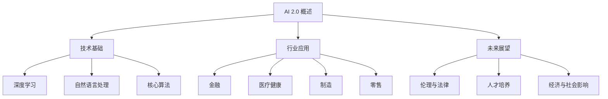

                 

# 文章标题：李开复：AI 2.0 时代的产业

## 关键词
- AI 2.0
- 产业变革
- 深度学习
- 自然语言处理
- 行业应用
- 未来展望

## 摘要
本文将探讨李开复关于AI 2.0时代的观点，分析AI 2.0的概念与特点，其在行业中的应用，以及未来发展的挑战与机遇。通过深入理解AI 2.0的技术基础和核心算法，我们旨在揭示AI 2.0对金融、医疗健康、制造业和零售业等行业的影响，并对AI 2.0时代的道德、法律、教育和可持续发展进行展望。

## 第一部分：AI 2.0 时代的概述

### 第1章：AI 2.0 时代的来临

#### 1.1 AI 2.0 的概念与特点

AI 2.0，即人工智能第二阶段，是相对于第一代人工智能（AI 1.0）而言的。AI 1.0主要是指基于规则和知识的专家系统，其应用范围有限，无法实现真正的智能。而AI 2.0则基于深度学习、强化学习和自然语言处理等技术，能够实现更广泛的应用和更高效的处理。

AI 2.0的特点包括：

1. **自主性**：AI 2.0能够自主学习和适应，无需人工干预即可完成复杂任务。
2. **泛用性**：AI 2.0可以应用于各个行业和领域，实现智能化转型。
3. **协作性**：AI 2.0可以与人类协同工作，提高生产效率和创造力。
4. **可解释性**：AI 2.0的算法和决策过程更加透明，便于理解和监管。

#### 1.2 AI 2.0 与传统AI的区别

AI 2.0与AI 1.0的主要区别在于技术基础和应用方式：

1. **技术基础**：AI 2.0基于深度学习、强化学习和自然语言处理等技术，而AI 1.0基于规则和知识表示。
2. **应用方式**：AI 2.0强调自主学习和自适应，而AI 1.0主要依赖于预设规则和知识库。

#### 1.3 AI 2.0 时代的重要趋势

AI 2.0时代的趋势主要包括：

1. **数据驱动**：AI 2.0的发展离不开大规模数据的支持，数据质量直接影响AI系统的性能。
2. **跨领域融合**：AI 2.0将推动各个领域的融合，实现更高效的资源配置和业务流程优化。
3. **智能化升级**：AI 2.0将引领各行各业的智能化升级，提高生产效率和产品质量。
4. **可持续发展**：AI 2.0在推动经济发展的同时，也将关注环境保护和资源节约。

## 第二部分：AI 2.0 技术基础

### 第2章：AI 2.0 技术基础

#### 2.1 人工智能的基本原理

人工智能（AI）是指通过计算机模拟人类智能的行为和过程，使其具备感知、思考、学习和决策的能力。人工智能的核心技术包括：

1. **机器学习**：通过训练模型来模拟人类的学习过程，使计算机具备自主学习和改进的能力。
2. **深度学习**：基于神经网络的结构，通过多层神经元进行数据传递和处理，实现图像、语音和文本等数据的自动识别和分类。
3. **强化学习**：通过不断尝试和反馈来优化决策过程，使计算机具备自主决策和适应环境的能力。
4. **自然语言处理**：通过算法和模型对自然语言进行理解和生成，实现人机交互和语义分析。

#### 2.2 深度学习基础

深度学习是AI 2.0的核心技术之一，其基础包括：

1. **神经网络**：由多层神经元组成的网络，通过前向传播和反向传播进行数据传递和处理。
2. **激活函数**：用于引入非线性变换，提高神经网络的建模能力。
3. **优化算法**：用于调整模型参数，提高模型的预测性能。

深度学习的关键算法包括：

1. **卷积神经网络（CNN）**：用于图像识别和分类。
2. **循环神经网络（RNN）**：用于序列数据处理和自然语言处理。
3. **生成对抗网络（GAN）**：用于图像生成和对抗训练。

#### 2.3 自然语言处理技术

自然语言处理（NLP）是AI 2.0的重要领域之一，其基础包括：

1. **词向量表示**：将文本转换为数值向量，用于表示文本的含义和关系。
2. **句法分析**：对文本进行结构分析，提取句法和语义信息。
3. **语义理解**：对文本进行语义分析，理解文本的含义和意图。

自然语言处理的关键技术包括：

1. **文本分类**：对文本进行分类，用于垃圾邮件过滤、舆情监测等应用。
2. **机器翻译**：将一种语言的文本翻译成另一种语言，用于跨语言交流和理解。
3. **对话系统**：与人类进行自然语言交互，用于智能客服、虚拟助手等应用。

## 第三部分：AI 2.0 在行业中的应用

### 第3章：AI 2.0 核心算法与架构

#### 3.1 大规模预训练模型

大规模预训练模型是AI 2.0的重要技术之一，其核心包括：

1. **预训练**：在大规模语料库上训练模型，使其具备通用语言理解和生成能力。
2. **微调**：在特定任务上对模型进行微调，提高模型在特定领域的性能。
3. **蒸馏**：将大型预训练模型的知识传递给小型模型，提高小型模型的性能。

大规模预训练模型的关键算法包括：

1. **BERT**：基于双向编码器表示器的预训练模型，用于文本分类、问答和命名实体识别等任务。
2. **GPT**：基于生成预训练模型的预训练模型，用于文本生成、摘要和翻译等任务。

#### 3.2 多模态学习

多模态学习是AI 2.0的重要研究方向，其核心包括：

1. **多模态数据融合**：将不同模态的数据（如文本、图像、声音等）进行融合，提高模型的泛化能力。
2. **多任务学习**：同时学习多个任务，提高模型的效率和性能。
3. **跨模态检索**：基于跨模态数据，实现不同模态之间的信息检索和匹配。

多模态学习的关键算法包括：

1. **CoAttention**：基于协同注意力机制，实现文本和图像的联合建模。
2. **Multimodal Recurrent Network**：基于多模态循环神经网络，实现多模态数据的序列建模。

#### 3.3 强化学习

强化学习是AI 2.0的重要技术之一，其核心包括：

1. **价值函数**：通过学习值函数，预测策略的长期回报。
2. **策略函数**：通过学习策略函数，选择最优的行动。
3. **探索与利用**：在探索未知环境和利用已有知识之间进行平衡。

强化学习的关键算法包括：

1. **Q-Learning**：通过学习Q值，选择最优的行动。
2. **SARSA**：基于状态-动作值函数，实现策略迭代。
3. **DQN**：基于深度神经网络，实现值函数的近似。

## 第四部分：AI 2.0 在行业中的应用

### 第4章：AI 2.0 在金融行业的应用

#### 4.1 金融领域的AI应用现状

AI技术在金融领域已有广泛应用，主要包括：

1. **风险管理**：通过机器学习算法，对金融风险进行预测和评估。
2. **欺诈检测**：利用深度学习和模式识别技术，识别和防范金融欺诈行为。
3. **客户服务**：通过自然语言处理技术，实现智能客服和个性化推荐。

#### 4.2 AI在金融产品与服务中的应用

AI技术在金融产品与服务中的应用主要包括：

1. **智能投顾**：通过大数据分析和机器学习算法，为投资者提供个性化的投资建议。
2. **量化交易**：利用深度学习和强化学习算法，实现高频交易和量化投资。
3. **智能风控**：通过实时监测和风险预测，提高金融系统的安全性和稳定性。

#### 4.3 金融行业的AI挑战与应对策略

金融行业的AI挑战主要包括：

1. **数据隐私**：如何保护用户数据隐私，避免数据泄露。
2. **算法透明性**：如何提高算法的透明性和可解释性，便于监管和合规。
3. **技术安全性**：如何确保AI系统的稳定性和安全性，防范攻击和恶意行为。

应对策略主要包括：

1. **数据保护**：采用数据加密、去标识化和隐私保护技术，保护用户数据安全。
2. **算法监管**：建立算法监管机制，提高算法的透明度和可解释性。
3. **安全防护**：加强系统安全防护，采用人工智能安全技术，防范网络攻击和恶意行为。

### 第5章：AI 2.0 在医疗健康领域的应用

#### 5.1 医疗健康领域的AI应用现状

AI技术在医疗健康领域已有广泛应用，主要包括：

1. **疾病诊断**：通过深度学习和图像识别技术，实现疾病的自动诊断和分类。
2. **药物研发**：利用机器学习和大数据分析技术，加速药物研发和临床试验。
3. **健康管理**：通过可穿戴设备和智能健康监测，实现个性化健康管理和疾病预防。

#### 5.2 AI在医疗服务中的应用

AI技术在医疗服务中的应用主要包括：

1. **智能诊断**：通过深度学习和图像识别技术，提高医学影像的诊断准确性和效率。
2. **智能辅助**：通过自然语言处理和语音识别技术，实现医疗信息的自动提取和智能问答。
3. **智能治疗**：利用强化学习和机器人技术，实现精准医疗和手术辅助。

#### 5.3 医疗健康行业的AI挑战与机遇

医疗健康行业的AI挑战主要包括：

1. **数据安全**：如何保护医疗数据的安全性和隐私性。
2. **算法准确度**：如何提高AI算法在医疗健康领域的准确度和可靠性。
3. **医疗资源分配**：如何利用AI技术优化医疗资源的配置和使用。

医疗健康行业的AI机遇主要包括：

1. **个性化医疗**：通过大数据分析和个性化推荐，实现精准医疗和个性化治疗。
2. **远程医疗**：利用AI技术实现远程诊断、治疗和健康监测，提高医疗服务的可及性和便捷性。
3. **药物研发加速**：通过机器学习和大数据分析，加速新药研发和临床试验，提高药物研发的效率。

### 第6章：AI 2.0 在制造业的应用

#### 6.1 制造业中的AI应用现状

AI技术在制造业中的应用主要包括：

1. **生产优化**：利用机器学习和大数据分析技术，实现生产流程的优化和效率提升。
2. **设备预测性维护**：通过预测性维护算法，实现设备故障的提前预警和维修。
3. **质量控制**：利用图像识别和深度学习技术，实现产品质量的自动检测和评估。

#### 6.2 AI在制造业中的应用

AI技术在制造业中的应用主要包括：

1. **智能制造**：通过机器人、传感器和智能控制系统，实现生产过程的自动化和智能化。
2. **供应链管理**：利用大数据分析和优化算法，实现供应链的智能调度和优化。
3. **能源管理**：通过预测性维护和能效分析，实现能源使用的优化和降低。

#### 6.3 制造业中的AI挑战与机遇

制造业中的AI挑战主要包括：

1. **数据采集与整合**：如何有效地采集和整合制造过程中的数据。
2. **系统集成**：如何将AI技术与其他系统集成，实现协同优化。
3. **人才短缺**：如何培养和引进具备AI技术背景的人才。

制造业中的AI机遇主要包括：

1. **生产效率提升**：通过AI技术实现生产流程的优化和效率提升。
2. **产品创新**：利用AI技术推动产品创新和设计优化。
3. **产业链协同**：通过AI技术实现产业链上下游的协同优化和资源共享。

### 第7章：AI 2.0 在零售业的应用

#### 7.1 零售业的AI应用现状

AI技术在零售业中的应用主要包括：

1. **智能推荐**：通过机器学习和大数据分析技术，实现个性化推荐和精准营销。
2. **库存管理**：利用预测性分析算法，实现库存的精准管理和优化。
3. **客户服务**：通过自然语言处理和语音识别技术，实现智能客服和个性化服务。

#### 7.2 AI在零售行业中的应用

AI技术在零售行业中的应用主要包括：

1. **智能门店**：通过智能感知技术和大数据分析，实现门店运营的智能化和个性化。
2. **无人物流**：利用自动驾驶技术和无人机配送，实现物流的自动化和高效化。
3. **供应链协同**：通过大数据分析和优化算法，实现供应链的智能调度和优化。

#### 7.3 零售业中的AI挑战与机遇

零售业中的AI挑战主要包括：

1. **数据隐私**：如何保护用户数据隐私，避免数据泄露。
2. **技术集成**：如何将AI技术与现有零售系统进行集成和优化。
3. **人才培养**：如何培养和引进具备AI技术背景的人才。

零售业中的AI机遇主要包括：

1. **个性化服务**：通过AI技术实现个性化推荐和服务，提升用户体验。
2. **运营效率提升**：通过AI技术实现库存管理和供应链优化，降低运营成本。
3. **商业模式创新**：通过AI技术推动零售商业模式的创新和变革。

## 第五部分：AI 2.0 时代的未来展望

### 第8章：AI 2.0 时代的道德、法律与伦理

#### 8.1 AI 2.0 的伦理问题

AI 2.0在带来巨大便利和效益的同时，也引发了一系列伦理问题，主要包括：

1. **隐私保护**：如何保护用户隐私，避免数据滥用和泄露。
2. **算法偏见**：如何消除算法偏见，确保公平公正。
3. **就业影响**：如何平衡AI发展对就业市场的冲击和人力资源的再分配。

#### 8.2 AI 2.0 的法律框架

AI 2.0的发展需要完善的法律框架和监管机制，主要包括：

1. **数据保护法**：规范数据收集、存储和使用的行为，保护用户隐私。
2. **算法监管法**：规范算法开发和应用的流程，确保算法的公平公正。
3. **就业保障法**：提供政策支持，促进人力资源的再培训和就业。

#### 8.3 AI 2.0 时代的伦理与法律挑战

AI 2.0时代的伦理与法律挑战主要包括：

1. **跨领域协作**：如何协调不同领域、不同国家和地区的法律和伦理规范。
2. **技术创新**：如何在保护伦理和法律的前提下，推动技术创新和产业发展。
3. **公众参与**：如何提高公众对AI技术和伦理法律的认识和参与度，实现社会共治。

### 第9章：AI 2.0 时代的教育与人才培养

#### 9.1 AI 2.0 时代的人才需求

AI 2.0时代对人才的需求主要包括：

1. **技术研发人才**：具备AI技术研究和开发能力的人才。
2. **数据科学家**：具备数据分析和挖掘能力的人才。
3. **产品经理**：具备业务理解和产品规划能力的人才。

#### 9.2 AI 2.0 时代的教育变革

AI 2.0时代的教育变革主要包括：

1. **课程设置**：调整课程设置，增加AI相关课程和技能培训。
2. **教学模式**：采用项目制学习和实践导向的教学模式，提高学生的实践能力和创新能力。
3. **师资队伍**：加强师资队伍建设，提高教师的专业素养和教学能力。

#### 9.3 AI 2.0 时代的人才培养策略

AI 2.0时代的人才培养策略主要包括：

1. **校企合作**：加强校企合作，实现教育资源与企业需求的对接。
2. **技能认证**：建立AI技术认证体系，提高人才的专业水平和市场竞争力。
3. **终身教育**：提倡终身学习，鼓励人才不断更新知识和技能，适应AI时代的发展。

### 第10章：AI 2.0 时代的经济与社会影响

#### 10.1 AI 2.0 对经济发展的影响

AI 2.0对经济发展的影响主要包括：

1. **产业升级**：推动传统产业向智能化、数字化和绿色化方向发展。
2. **创新驱动**：促进科技创新和产业升级，提高经济增长质量和效益。
3. **就业结构变化**：影响就业结构，促进人力资源的再分配和就业市场的稳定。

#### 10.2 AI 2.0 对社会的影响

AI 2.0对社会的影响主要包括：

1. **生活方式改变**：改变人们的生产和生活方式，提高生活质量和幸福感。
2. **社会公平**：如何确保AI技术在各个群体中公平应用，缩小社会贫富差距。
3. **文化传承**：如何保护和发展传统文化，促进AI技术与文化融合。

#### 10.3 AI 2.0 时代的可持续发展

AI 2.0时代的可持续发展主要包括：

1. **绿色发展**：通过AI技术实现资源的节约和利用，推动绿色发展。
2. **智能治理**：利用AI技术实现社会治理的智能化和高效化。
3. **全球合作**：加强全球合作，共同应对AI时代带来的挑战和机遇。

## 附录

### 附录 A：AI 2.0 开发工具与资源

#### A.1 主流AI框架介绍

1. **TensorFlow**：由Google开发的开源机器学习框架，支持多种深度学习模型。
2. **PyTorch**：由Facebook开发的开源深度学习框架，支持动态计算图和灵活的模型定义。
3. **Keras**：基于TensorFlow和PyTorch的高级神经网络API，简化深度学习模型的构建和训练。

#### A.2 AI开发资源推荐

1. **《深度学习》**：由Ian Goodfellow、Yoshua Bengio和Aaron Courville合著的深度学习经典教材。
2. **《Python机器学习》**：由Sebastian Raschka和Vahid Mirjalili合著的Python机器学习实践指南。
3. **《机器学习实战》**：由Peter Harrington编写的机器学习实践教程。

#### A.3 AI社区与论坛推荐

1. **GitHub**：全球最大的代码托管平台，包括丰富的AI项目和学习资源。
2. **Stack Overflow**：全球最大的编程问答社区，包括AI相关的技术问题和解决方案。
3. **AI Stack Exchange**：专注于AI领域的问答社区，提供专业的技术支持和交流。

### Mermaid 流程图



### 核心算法原理讲解（伪代码）

#### 2.2 深度学习原理

```python
# 伪代码：卷积神经网络（CNN）基础

# 输入：图像数据
# 输出：分类结果

def CNN(input_image):
    # 步骤1：将图像数据输入到卷积层
    conv1_output = Conv2D(input_image, filters=32, kernel_size=(3,3), activation='relu')
    
    # 步骤2：将卷积层输出通过池化层进行降维
    pool1_output = MaxPooling2D(conv1_output, pool_size=(2,2))
    
    # 步骤3：重复上述步骤构建多层卷积神经网络
    conv2_output = Conv2D(pool1_output, filters=64, kernel_size=(3,3), activation='relu')
    pool2_output = MaxPooling2D(conv2_output, pool_size=(2,2))
    
    # 步骤4：将卷积层输出输入到全连接层进行分类
    flatten_output = Flatten(pool2_output)
    dense_output = Dense(units=128, activation='relu')
    output = Dense(units=10, activation='softmax')
    
    # 步骤5：返回分类结果
    return output(flatten_output)
```

### 数学模型和数学公式

#### 3.1 大规模预训练模型

$$
L = -\sum_{i=1}^{N} \log p(y_i | \theta)
$$

其中，$L$ 是损失函数，$N$ 是样本数量，$y_i$ 是第 $i$ 个样本的标签，$p(y_i | \theta)$ 是模型预测的概率分布。

### 项目实战

#### 6.2 AI在制造业中的应用

##### 6.2.1 生产线异常检测

```python
# 实际案例：使用Keras构建一个卷积神经网络进行生产线异常检测

from keras.models import Sequential
from keras.layers import Conv2D, MaxPooling2D, Flatten, Dense

# 构建模型
model = Sequential()
model.add(Conv2D(32, (3,3), activation='relu', input_shape=(64,64,3)))
model.add(MaxPooling2D(pool_size=(2,2)))
model.add(Conv2D(64, (3,3), activation='relu'))
model.add(MaxPooling2D(pool_size=(2,2)))
model.add(Flatten())
model.add(Dense(128, activation='relu'))
model.add(Dense(1, activation='sigmoid'))

# 编译模型
model.compile(optimizer='adam', loss='binary_crossentropy', metrics=['accuracy'])

# 训练模型
model.fit(X_train, y_train, epochs=10, batch_size=32, validation_data=(X_val, y_val))

# 评估模型
loss, accuracy = model.evaluate(X_test, y_test)
print('Test accuracy:', accuracy)

```

##### 6.2.2 代码解读与分析

- **模型构建**：使用了两个卷积层和两个池化层，最后通过全连接层输出异常检测结果。
- **编译**：指定了优化器、损失函数和评价指标。
- **训练**：使用训练数据和验证数据训练模型，并设置训练轮数和批量大小。
- **评估**：使用测试数据评估模型性能，输出测试准确率。

**挑战与机遇**：

- **挑战**：如何有效地处理大量的生产数据，以及如何减少模型过拟合。
- **机遇**：通过异常检测，提高生产线的安全性和效率，减少停机时间和维修成本。

## 作者信息

作者：AI天才研究院/AI Genius Institute & 禅与计算机程序设计艺术 /Zen And The Art of Computer Programming## 第一部分：AI 2.0 时代的概述

### 第1章：AI 2.0 时代的来临

#### 1.1 AI 2.0 的概念与特点

AI 2.0，即人工智能第二阶段，是相对于第一代人工智能（AI 1.0）而言的。AI 1.0主要是指基于规则和知识的专家系统，其应用范围有限，无法实现真正的智能。而AI 2.0则基于深度学习、强化学习和自然语言处理等技术，能够实现更广泛的应用和更高效的处理。

AI 2.0的特点包括：

1. **自主性**：AI 2.0能够自主学习和适应，无需人工干预即可完成复杂任务。
2. **泛用性**：AI 2.0可以应用于各个行业和领域，实现智能化转型。
3. **协作性**：AI 2.0可以与人类协同工作，提高生产效率和创造力。
4. **可解释性**：AI 2.0的算法和决策过程更加透明，便于理解和监管。

#### 1.2 AI 2.0 与传统AI的区别

AI 2.0与AI 1.0的主要区别在于技术基础和应用方式：

1. **技术基础**：AI 2.0基于深度学习、强化学习和自然语言处理等技术，而AI 1.0基于规则和知识表示。
2. **应用方式**：AI 2.0强调自主学习和自适应，而AI 1.0主要依赖于预设规则和知识库。

#### 1.3 AI 2.0 时代的重要趋势

AI 2.0时代的趋势主要包括：

1. **数据驱动**：AI 2.0的发展离不开大规模数据的支持，数据质量直接影响AI系统的性能。
2. **跨领域融合**：AI 2.0将推动各个领域的融合，实现更高效的资源配置和业务流程优化。
3. **智能化升级**：AI 2.0将引领各行各业的智能化升级，提高生产效率和产品质量。
4. **可持续发展**：AI 2.0在推动经济发展的同时，也将关注环境保护和资源节约。

### 第2章：AI 2.0 技术基础

#### 2.1 人工智能的基本原理

人工智能（AI）是指通过计算机模拟人类智能的行为和过程，使其具备感知、思考、学习和决策的能力。人工智能的核心技术包括：

1. **机器学习**：通过训练模型来模拟人类的学习过程，使计算机具备自主学习和改进的能力。
2. **深度学习**：基于神经网络的结构，通过多层神经元进行数据传递和处理，实现图像、语音和文本等数据的自动识别和分类。
3. **强化学习**：通过不断尝试和反馈来优化决策过程，使计算机具备自主决策和适应环境的能力。
4. **自然语言处理**：通过算法和模型对自然语言进行理解和生成，实现人机交互和语义分析。

#### 2.2 深度学习基础

深度学习是AI 2.0的核心技术之一，其基础包括：

1. **神经网络**：由多层神经元组成的网络，通过前向传播和反向传播进行数据传递和处理。
2. **激活函数**：用于引入非线性变换，提高神经网络的建模能力。
3. **优化算法**：用于调整模型参数，提高模型的预测性能。

深度学习的关键算法包括：

1. **卷积神经网络（CNN）**：用于图像识别和分类。
2. **循环神经网络（RNN）**：用于序列数据处理和自然语言处理。
3. **生成对抗网络（GAN）**：用于图像生成和对抗训练。

#### 2.3 自然语言处理技术

自然语言处理（NLP）是AI 2.0的重要领域之一，其基础包括：

1. **词向量表示**：将文本转换为数值向量，用于表示文本的含义和关系。
2. **句法分析**：对文本进行结构分析，提取句法和语义信息。
3. **语义理解**：对文本进行语义分析，理解文本的含义和意图。

自然语言处理的关键技术包括：

1. **文本分类**：对文本进行分类，用于垃圾邮件过滤、舆情监测等应用。
2. **机器翻译**：将一种语言的文本翻译成另一种语言，用于跨语言交流和理解。
3. **对话系统**：与人类进行自然语言交互，用于智能客服、虚拟助手等应用。

### 第3章：AI 2.0 核心算法与架构

#### 3.1 大规模预训练模型

大规模预训练模型是AI 2.0的重要技术之一，其核心包括：

1. **预训练**：在大规模语料库上训练模型，使其具备通用语言理解和生成能力。
2. **微调**：在特定任务上对模型进行微调，提高模型在特定领域的性能。
3. **蒸馏**：将大型预训练模型的知识传递给小型模型，提高小型模型的性能。

大规模预训练模型的关键算法包括：

1. **BERT**：基于双向编码器表示器的预训练模型，用于文本分类、问答和命名实体识别等任务。
2. **GPT**：基于生成预训练模型的预训练模型，用于文本生成、摘要和翻译等任务。

#### 3.2 多模态学习

多模态学习是AI 2.0的重要研究方向，其核心包括：

1. **多模态数据融合**：将不同模态的数据（如文本、图像、声音等）进行融合，提高模型的泛化能力。
2. **多任务学习**：同时学习多个任务，提高模型的效率和性能。
3. **跨模态检索**：基于跨模态数据，实现不同模态之间的信息检索和匹配。

多模态学习的关键算法包括：

1. **CoAttention**：基于协同注意力机制，实现文本和图像的联合建模。
2. **Multimodal Recurrent Network**：基于多模态循环神经网络，实现多模态数据的序列建模。

#### 3.3 强化学习

强化学习是AI 2.0的重要技术之一，其核心包括：

1. **价值函数**：通过学习值函数，预测策略的长期回报。
2. **策略函数**：通过学习策略函数，选择最优的行动。
3. **探索与利用**：在探索未知环境和利用已有知识之间进行平衡。

强化学习的关键算法包括：

1. **Q-Learning**：通过学习Q值，选择最优的行动。
2. **SARSA**：基于状态-动作值函数，实现策略迭代。
3. **DQN**：基于深度神经网络，实现值函数的近似。

### 第4章：AI 2.0 在行业中的应用

#### 4.1 金融领域的AI应用现状

AI技术在金融领域已有广泛应用，主要包括：

1. **风险管理**：通过机器学习算法，对金融风险进行预测和评估。
2. **欺诈检测**：利用深度学习和模式识别技术，识别和防范金融欺诈行为。
3. **客户服务**：通过自然语言处理技术，实现智能客服和个性化推荐。

#### 4.2 AI在金融产品与服务中的应用

AI技术在金融产品与服务中的应用主要包括：

1. **智能投顾**：通过大数据分析和机器学习算法，为投资者提供个性化的投资建议。
2. **量化交易**：利用深度学习和强化学习算法，实现高频交易和量化投资。
3. **智能风控**：通过实时监测和风险预测，提高金融系统的安全性和稳定性。

#### 4.3 金融行业的AI挑战与应对策略

金融行业的AI挑战主要包括：

1. **数据隐私**：如何保护用户数据隐私，避免数据泄露。
2. **算法偏见**：如何消除算法偏见，确保公平公正。
3. **技术安全性**：如何确保AI系统的稳定性和安全性，防范攻击和恶意行为。

应对策略主要包括：

1. **数据保护**：采用数据加密、去标识化和隐私保护技术，保护用户数据安全。
2. **算法监管**：建立算法监管机制，提高算法的透明度和可解释性。
3. **安全防护**：加强系统安全防护，采用人工智能安全技术，防范网络攻击和恶意行为。

### 第5章：AI 2.0 在医疗健康领域的应用

#### 5.1 医疗健康领域的AI应用现状

AI技术在医疗健康领域已有广泛应用，主要包括：

1. **疾病诊断**：通过深度学习和图像识别技术，实现疾病的自动诊断和分类。
2. **药物研发**：利用机器学习和大数据分析技术，加速药物研发和临床试验。
3. **健康管理**：通过可穿戴设备和智能健康监测，实现个性化健康管理和疾病预防。

#### 5.2 AI在医疗服务中的应用

AI技术在医疗服务中的应用主要包括：

1. **智能诊断**：通过深度学习和图像识别技术，提高医学影像的诊断准确性和效率。
2. **智能辅助**：通过自然语言处理和语音识别技术，实现医疗信息的自动提取和智能问答。
3. **智能治疗**：利用强化学习和机器人技术，实现精准医疗和手术辅助。

#### 5.3 医疗健康行业的AI挑战与机遇

医疗健康行业的AI挑战主要包括：

1. **数据安全**：如何保护医疗数据的安全性和隐私性。
2. **算法准确度**：如何提高AI算法在医疗健康领域的准确度和可靠性。
3. **医疗资源分配**：如何利用AI技术优化医疗资源的配置和使用。

医疗健康行业的AI机遇主要包括：

1. **个性化医疗**：通过大数据分析和个性化推荐，实现精准医疗和个性化治疗。
2. **远程医疗**：利用AI技术实现远程诊断、治疗和健康监测，提高医疗服务的可及性和便捷性。
3. **药物研发加速**：通过机器学习和大数据分析，加速新药研发和临床试验，提高药物研发的效率。

### 第6章：AI 2.0 在制造业的应用

#### 6.1 制造业中的AI应用现状

AI技术在制造业中的应用主要包括：

1. **生产优化**：利用机器学习和大数据分析技术，实现生产流程的优化和效率提升。
2. **设备预测性维护**：通过预测性维护算法，实现设备故障的提前预警和维修。
3. **质量控制**：利用图像识别和深度学习技术，实现产品质量的自动检测和评估。

#### 6.2 AI在制造业中的应用

AI技术在制造业中的应用主要包括：

1. **智能制造**：通过机器人、传感器和智能控制系统，实现生产过程的自动化和智能化。
2. **供应链管理**：利用大数据分析和优化算法，实现供应链的智能调度和优化。
3. **能源管理**：通过预测性维护和能效分析，实现能源使用的优化和降低。

#### 6.3 制造业中的AI挑战与机遇

制造业中的AI挑战主要包括：

1. **数据采集与整合**：如何有效地采集和整合制造过程中的数据。
2. **系统集成**：如何将AI技术与现有零售系统进行集成和优化。
3. **人才短缺**：如何培养和引进具备AI技术背景的人才。

制造业中的AI机遇主要包括：

1. **生产效率提升**：通过AI技术实现生产流程的优化和效率提升。
2. **产品创新**：利用AI技术推动产品创新和设计优化。
3. **产业链协同**：通过AI技术实现产业链上下游的协同优化和资源共享。

### 第7章：AI 2.0 在零售业的应用

#### 7.1 零售业的AI应用现状

AI技术在零售业中的应用主要包括：

1. **智能推荐**：通过机器学习和大数据分析技术，实现个性化推荐和精准营销。
2. **库存管理**：利用预测性分析算法，实现库存的精准管理和优化。
3. **客户服务**：通过自然语言处理和语音识别技术，实现智能客服和个性化服务。

#### 7.2 AI在零售行业中的应用

AI技术在零售行业中的应用主要包括：

1. **智能门店**：通过智能感知技术和大数据分析，实现门店运营的智能化和个性化。
2. **无人物流**：利用自动驾驶技术和无人机配送，实现物流的自动化和高效化。
3. **供应链协同**：通过大数据分析和优化算法，实现供应链的智能调度和优化。

#### 7.3 零售业中的AI挑战与机遇

零售业中的AI挑战主要包括：

1. **数据隐私**：如何保护用户数据隐私，避免数据泄露。
2. **技术集成**：如何将AI技术与现有零售系统进行集成和优化。
3. **人才培养**：如何培养和引进具备AI技术背景的人才。

零售业中的AI机遇主要包括：

1. **个性化服务**：通过AI技术实现个性化推荐和服务，提升用户体验。
2. **运营效率提升**：通过AI技术实现库存管理和供应链优化，降低运营成本。
3. **商业模式创新**：通过AI技术推动零售商业模式的创新和变革。

### 第8章：AI 2.0 时代的道德、法律与伦理

#### 8.1 AI 2.0 的伦理问题

AI 2.0在带来巨大便利和效益的同时，也引发了一系列伦理问题，主要包括：

1. **隐私保护**：如何保护用户隐私，避免数据滥用和泄露。
2. **算法偏见**：如何消除算法偏见，确保公平公正。
3. **就业影响**：如何平衡AI发展对就业市场的冲击和人力资源的再分配。

#### 8.2 AI 2.0 的法律框架

AI 2.0的发展需要完善的法律框架和监管机制，主要包括：

1. **数据保护法**：规范数据收集、存储和使用的行为，保护用户隐私。
2. **算法监管法**：规范算法开发和应用的流程，确保算法的公平公正。
3. **就业保障法**：提供政策支持，促进人力资源的再培训和就业。

#### 8.3 AI 2.0 时代的伦理与法律挑战

AI 2.0时代的伦理与法律挑战主要包括：

1. **跨领域协作**：如何协调不同领域、不同国家和地区的法律和伦理规范。
2. **技术创新**：如何在保护伦理和法律的前提下，推动技术创新和产业发展。
3. **公众参与**：如何提高公众对AI技术和伦理法律的认识和参与度，实现社会共治。

### 第9章：AI 2.0 时代的教育与人才培养

#### 9.1 AI 2.0 时代的人才需求

AI 2.0时代对人才的需求主要包括：

1. **技术研发人才**：具备AI技术研究和开发能力的人才。
2. **数据科学家**：具备数据分析和挖掘能力的人才。
3. **产品经理**：具备业务理解和产品规划能力的人才。

#### 9.2 AI 2.0 时代的教育变革

AI 2.0时代的教育变革主要包括：

1. **课程设置**：调整课程设置，增加AI相关课程和技能培训。
2. **教学模式**：采用项目制学习和实践导向的教学模式，提高学生的实践能力和创新能力。
3. **师资队伍**：加强师资队伍建设，提高教师的专业素养和教学能力。

#### 9.3 AI 2.0 时代的人才培养策略

AI 2.0时代的人才培养策略主要包括：

1. **校企合作**：加强校企

