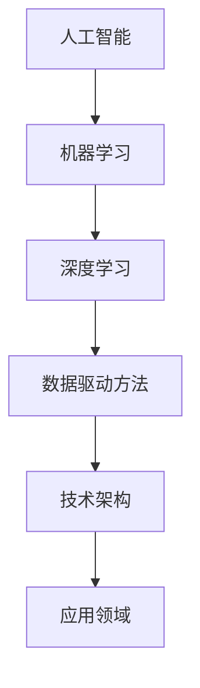

                 

### 文章标题: 《李开复：AI 2.0 时代的市场》

#### 关键词：AI 2.0、市场、技术架构、应用领域、市场策略、法律法规与伦理

##### 摘要：
本文由世界级人工智能专家李开复撰写，深入探讨了AI 2.0时代的市场状况。文章首先概述了AI 2.0的定义与特点，回顾了其发展历程，并展望了市场前景。接着，详细分析了AI 2.0时代的关键技术，包括人工智能基础架构、核心算法和数据驱动方法。随后，文章聚焦于金融、零售和医疗等行业，阐述了AI在这些领域的应用。最后，探讨了企业在AI 2.0时代的创新策略、法律法规与伦理问题，并提供了相关的技术资源与市场报告。文章旨在为读者提供一个全面、深入的AI 2.0时代市场分析。

---

### 《李开复：AI 2.0 时代的市场》目录大纲

#### 第一部分：AI 2.0 时代的市场概述

##### 第1章：AI 2.0 基础
- **1.1 AI 2.0 定义与特点**
  - AI 2.0 的定义
  - AI 2.0 的特点
  - AI 2.0 与传统AI的对比

- **1.2 AI 2.0 的发展历程**
  - 从AI 1.0 到AI 2.0
  - AI 2.0 的重要里程碑
  - AI 2.0 的未来趋势

- **1.3 AI 2.0 时代的市场前景**
  - 全球AI市场现状
  - 各行业AI应用的兴起
  - AI 2.0 时代的发展机遇

#### 第二部分：AI 2.0 时代的技术架构

##### 第2章：AI 2.0 时代的关键技术
- **2.1 人工智能基础架构**
  - 计算能力的发展
  - 大数据与存储技术
  - 网络与通信技术

- **2.2 AI 2.0 的核心算法**
  - 深度学习
  - 强化学习
  - 自然语言处理

- **2.3 AI 2.0 的数据驱动方法**
  - 数据收集与预处理
  - 特征工程
  - 模型训练与优化

#### 第三部分：AI 2.0 时代的应用领域

##### 第3章：金融行业的AI应用
- **3.1 金融风控与智能投顾**
  - 模型在风控中的应用
  - 智能投顾的实现原理
  - 案例分析

- **3.2 金融市场预测与交易**
  - 时间序列预测方法
  - 高频交易算法
  - 金融市场的案例分析

##### 第4章：零售行业的AI应用
- **4.1 个性化推荐系统**
  - 推荐系统的原理
  - 用户行为分析
  - 案例介绍

- **4.2 智能客服与购物助理**
  - 客服机器人的实现
  - 购物助理的技术架构
  - 案例分析

##### 第5章：医疗行业的AI应用
- **5.1 智能诊断与影像分析**
  - AI在医学影像中的应用
  - 智能诊断系统的实现
  - 案例分析

- **5.2 医疗健康数据分析**
  - 健康数据的收集与处理
  - 疾病预测与预防
  - 案例分析

#### 第四部分：AI 2.0 时代的市场策略

##### 第6章：企业如何在AI 2.0 时代创新
- **6.1 AI战略规划**
  - 制定AI战略的步骤
  - 企业AI转型的挑战
  - 成功案例分析

- **6.2 AI产品开发与管理**
  - AI产品的开发流程
  - AI产品的生命周期管理
  - 案例分析

##### 第7章：AI 2.0 时代的法律法规与伦理
- **7.1 AI法律法规概述**
  - 全球AI法规的发展
  - 中国的AI法律法规
  - 法规对AI市场的影响

- **7.2 AI伦理问题探讨**
  - AI伦理的基本原则
  - AI伦理争议案例分析
  - AI伦理解决方案

#### 附录

##### 附录A：AI 2.0 时代的技术资源与工具
- **A.1 AI开发平台与工具**
  - TensorFlow
  - PyTorch
  - 其他常用工具

- **A.2 AI开源资源与社区**
  - 开源项目与库
  - AI社区与论坛
  - 学习资源与教程

##### 附录B：AI 2.0 时代的市场报告与趋势分析
- **B.1 AI市场报告**
  - 全球AI市场报告
  - 行业AI应用报告

- **B.2 AI趋势分析**
  - AI技术发展趋势
  - 行业应用趋势
  - 未来展望

---

### 核心概念与联系

在探讨AI 2.0时代的市场之前，我们需要理解几个核心概念，并明确它们之间的联系。以下是AI 2.0时代的一些关键概念和它们的相互关系：

- **人工智能（AI）**: 人工智能是指计算机系统模拟人类智能行为的技术，包括学习、推理、感知、理解和问题解决等。

- **机器学习（ML）**: 机器学习是人工智能的一个分支，它侧重于利用数据训练模型，使系统能够从经验中学习并做出决策。

- **深度学习（DL）**: 深度学习是机器学习的一种方法，它使用多层神经网络来学习和提取数据中的复杂特征。

- **数据驱动方法**: 数据驱动方法强调通过大量数据来训练模型，以实现高效的问题解决。

- **技术架构**: 技术架构是指支持AI模型训练和部署的硬件和软件基础设施。

- **应用领域**: 应用领域是指AI技术在各个行业中的具体应用，如金融、医疗、零售等。

以下是这些核心概念的Mermaid流程图：

通过上述流程图，我们可以清晰地看到这些概念之间的层次关系和相互依赖。接下来，我们将逐步深入探讨AI 2.0时代的市场状况。

#### 第一部分：AI 2.0 时代的市场概述

##### 第1章：AI 2.0 基础

在讨论AI 2.0时代的市场之前，我们需要先了解AI 2.0的基本概念和特点。AI 2.0，也被称作第二代人工智能，是对第一代人工智能（AI 1.0）的升级和扩展。AI 1.0主要依赖于预先编程的规则和逻辑，而AI 2.0则更多地依赖于数据和机器学习算法，能够在没有人类干预的情况下自动学习和改进。

**1.1 AI 2.0 定义与特点**

AI 2.0的定义相对宽泛，但通常被认为是一种更加智能、自适应和可扩展的人工智能形式。以下是AI 2.0的一些关键特点：

- **自学习能力**：AI 2.0能够通过数据学习并自动调整其行为，无需人类干预。
- **大规模应用**：AI 2.0不仅局限于学术研究或特定领域，而是被广泛应用于各行各业。
- **通用性**：AI 2.0能够解决更广泛的问题，而不仅仅是单一的任务。
- **数据依赖**：AI 2.0依赖于大量的数据来训练模型，数据的质量和数量直接影响其性能。
- **可扩展性**：AI 2.0系统可以轻松扩展到新的任务和领域，无需大规模重写代码。

**1.2 AI 2.0 的发展历程**

从AI 1.0到AI 2.0的发展经历了几个关键阶段：

- **AI 1.0时代**（1950s-1980s）：这一时期的人工智能主要依赖于规则和逻辑，如专家系统和基于知识的系统。这些系统在特定领域表现出色，但缺乏泛化能力。
- **AI复兴期**（1990s-2000s）：随着计算机处理能力的提升和数据存储技术的发展，机器学习和深度学习开始兴起，AI的性能得到了显著提升。
- **AI 2.0时代**（2010s-至今）：这一时期，AI技术从实验室走向实际应用，AI系统能够在无人监督或有限监督的条件下进行学习，应用领域不断扩展。

**1.3 AI 2.0 的重要里程碑**

AI 2.0的发展历程中，以下里程碑事件具有重要意义：

- **2006年：深度学习兴起**：Hinton等科学家提出深度信念网络（DBN），深度学习开始得到广泛关注和应用。
- **2012年：ImageNet挑战**：深度学习在ImageNet挑战中取得了惊人的成绩，大幅超越了传统机器学习方法。
- **2016年：AlphaGo胜李世石**：深度学习和强化学习在围棋等复杂任务上取得了突破性成果，引发了全球对AI的广泛关注。
- **2017年：BERT模型发布**：Google推出的BERT模型在自然语言处理（NLP）领域取得了重大突破，推动了AI在文本理解和生成方面的应用。

**1.4 AI 2.0 的未来趋势**

随着技术的不断进步，AI 2.0在未来有望实现以下趋势：

- **更多领域的应用**：AI技术将继续扩展到更多行业，如医疗、金融、制造、交通等。
- **更加智能和自适应**：AI系统将变得更加智能，能够处理更多类型的数据和任务。
- **更加可解释和可信赖**：随着AI技术的普及，对其可解释性和可信赖性的需求将日益增加。
- **硬件和软件的整合**：随着硬件技术的发展，如量子计算、神经形态硬件等，AI系统将实现更高的性能和效率。

**1.5 AI 2.0 时代的市场前景**

AI 2.0时代的市场前景广阔，预计将对全球经济和社会产生深远影响：

- **市场规模**：根据市场研究报告，全球AI市场规模预计将在未来几年内持续增长，达到数万亿美元。
- **行业应用**：AI技术将在医疗、金融、零售、制造、交通等众多行业中得到广泛应用，推动产业升级和创新发展。
- **就业机会**：AI技术的发展将创造大量新的就业机会，包括AI研究人员、数据科学家、AI产品经理等。
- **社会影响**：AI技术将改变人们的生活方式和工作方式，提高生产效率和生活质量，但同时也带来伦理和法律挑战。

总之，AI 2.0时代的市场充满机遇和挑战。企业、政府和社会需要共同努力，推动AI技术的健康发展，确保其在各个领域的应用能够带来积极的影响。

#### 第二部分：AI 2.0 时代的技术架构

在了解了AI 2.0的基本概念和其市场前景之后，我们需要深入探讨AI 2.0时代的技术架构。这是AI系统高效运作的基础，涵盖了计算能力、数据存储和通信技术，以及AI模型的基础算法和数据处理方法。以下是对这些关键技术的详细分析。

##### 第2章：AI 2.0 时代的关键技术

**2.1 人工智能基础架构**

AI基础架构是支撑AI系统高效运行的基础，它包括硬件和软件两个方面。

**硬件方面**：

- **高性能计算（HPC）**：随着AI模型变得越来越复杂，对计算性能的要求也越来越高。高性能计算集群和GPU（图形处理器）是AI模型训练和推理的常用硬件平台。GPU具有高度并行计算的能力，能够在短时间内处理大量数据，从而加速模型的训练过程。

- **神经形态硬件**：神经形态硬件是一种模仿人脑结构和功能的计算硬件，它具有高效能和低能耗的特点。未来，随着神经形态硬件技术的发展，AI系统的性能和能效比将得到进一步提升。

**软件方面**：

- **深度学习框架**：深度学习框架如TensorFlow、PyTorch等，为研究人员和数据科学家提供了强大的工具，用于构建、训练和部署AI模型。这些框架集成了大量的优化算法和工具库，极大地简化了AI模型的开发和部署过程。

**2.2 AI 2.0 的核心算法**

AI 2.0的核心算法是AI系统的灵魂，主要包括深度学习、强化学习和自然语言处理。

**深度学习（DL）**：

深度学习是一种基于多层神经网络的学习方法，它通过多层非线性变换提取数据中的复杂特征。深度学习的核心算法包括：

- **卷积神经网络（CNN）**：CNN在图像处理和计算机视觉领域表现出色，能够有效地提取图像中的局部特征。

- **循环神经网络（RNN）**：RNN在处理序列数据时表现出强大的能力，例如语言模型和语音识别。

- **生成对抗网络（GAN）**：GAN通过两个神经网络（生成器和判别器）的对抗训练，能够生成高质量的数据，广泛应用于图像生成、数据增强等领域。

**强化学习（RL）**：

强化学习是一种通过与环境互动来学习最优策略的算法。强化学习的核心思想是利用奖励机制来指导学习过程。常见的强化学习算法包括：

- **Q-learning**：Q-learning通过学习状态-动作值函数，来选择最优动作。

- **深度强化学习（DRL）**：DRL将深度学习与强化学习结合，能够处理更复杂的决策问题，如自动驾驶和游戏AI。

**自然语言处理（NLP）**：

自然语言处理是AI领域的一个重要分支，它涉及文本的表示、理解和生成。NLP的核心算法包括：

- **词嵌入（Word Embedding）**：词嵌入是将单词映射到高维空间中的向量，以便进行数学处理。

- **序列模型（Seq2Seq）**：Seq2Seq模型通过编码器和解码器结构，实现序列到序列的转换，广泛应用于机器翻译和文本生成。

**2.3 AI 2.0 的数据驱动方法**

数据驱动方法是AI 2.0的核心，它强调通过大量数据来训练模型，从而实现高效的问题解决。以下是数据驱动方法的关键步骤：

**数据收集**：

数据收集是AI模型的起点，它涉及从各种来源获取大量数据，如互联网、传感器、企业内部系统等。数据的质量和多样性对模型的性能至关重要。

**数据预处理**：

数据预处理包括数据清洗、归一化和特征提取等步骤，旨在提高数据的质量和一致性。数据清洗去除噪音和异常值，归一化处理数据，使其具有相似的尺度，特征提取则将原始数据转换成适合模型训练的形式。

**特征工程**：

特征工程是数据预处理的一部分，它涉及从原始数据中提取有用的特征，以增强模型的性能。特征工程可以通过特征选择、特征转换和特征构造等方法来实现。

**模型训练**：

模型训练是数据驱动方法的核心步骤，它通过迭代优化模型的参数，使其在训练数据上达到最佳性能。常见的模型训练方法包括批量训练、小批量训练和在线训练。

**模型评估**：

模型评估是验证模型性能的重要步骤，它通过在测试数据上计算模型的准确率、召回率、F1分数等指标，来评估模型的泛化能力。模型评估可以帮助我们了解模型的强项和弱点，从而进行进一步的优化。

**模型优化**：

模型优化是通过调整模型的参数和结构，来提高模型的性能。常见的模型优化方法包括超参数调整、正则化和集成方法等。

通过上述关键技术，AI 2.0时代的技术架构为AI系统提供了坚实的基础，使其能够在各个领域实现高效的应用。接下来，我们将探讨AI 2.0时代在金融、零售和医疗等行业的具体应用。

#### 第三部分：AI 2.0 时代的应用领域

AI 2.0时代的到来，为金融、零售和医疗等行业带来了革命性的变化。这些行业利用AI技术的自学习能力、数据处理能力和智能化决策能力，提升了业务效率和用户体验。以下是对这些行业AI应用的具体分析。

##### 第3章：金融行业的AI应用

金融行业一直是AI技术的热点领域，AI在金融风控、智能投顾、市场预测和交易等方面展现出了巨大的潜力。

**3.1 金融风控与智能投顾**

**金融风控**：

AI技术在金融风控中的应用主要体现在贷款审批、信用评分和反欺诈等方面。通过深度学习和大数据分析，金融机构能够更准确地评估贷款申请者的信用风险，减少不良贷款率。以下是一个简化的金融风控模型开发过程：

- **数据收集**：收集贷款申请者的个人信息、财务状况、信用记录等数据。
- **数据预处理**：清洗数据，去除缺失值和异常值，进行特征工程，提取有用的特征。
- **模型训练**：使用训练数据训练线性回归、逻辑回归等模型，预测贷款申请者的信用风险。
- **模型评估**：使用测试数据评估模型的准确性，调整模型参数，提高模型性能。
- **模型部署**：将训练好的模型部署到生产环境中，用于实时评估贷款申请者的信用风险。

**智能投顾**：

智能投顾利用AI技术为投资者提供个性化的投资建议。通过分析投资者的风险偏好、财务状况和市场数据，智能投顾系统能够为投资者制定最佳的投资策略。以下是一个简化的智能投顾系统实现过程：

- **用户画像构建**：收集投资者的基本信息、投资偏好和风险承受能力。
- **市场数据获取**：获取股票、债券、基金等市场数据。
- **投资策略生成**：使用机器学习算法分析用户画像和市场数据，生成个性化的投资策略。
- **策略评估**：评估投资策略的历史表现，根据市场变化调整策略。
- **策略推荐**：将最佳投资策略推荐给投资者。

**3.2 金融市场预测与交易**

**时间序列预测**：

AI技术在金融市场预测中有着广泛的应用，如股票价格预测、货币汇率预测等。时间序列预测模型如ARIMA、LSTM等，能够捕捉市场数据中的趋势和周期性变化，帮助投资者做出更明智的决策。

**高频交易**：

高频交易利用AI算法在极短的时间内进行大量交易，以获取微小利润。高频交易算法通常包括策略生成、交易执行和风险控制等模块，通过实时数据分析和自动化交易执行，提高交易效率和收益。

**案例分析**：

某金融机构利用AI技术进行贷款审批和信用评分，通过深度学习算法分析借款人的信用记录、财务状况和社会行为数据，显著提高了贷款审批的准确性和效率。此外，该机构还开发了智能投顾系统，为投资者提供个性化的投资建议，取得了良好的市场反响。

##### 第4章：零售行业的AI应用

零售行业是AI应用的重要领域，AI技术帮助零售企业实现个性化推荐、智能客服和购物助理等功能，提升了用户体验和销售效率。

**4.1 个性化推荐系统**

个性化推荐系统通过分析用户的购买历史、浏览行为和偏好，为用户推荐最符合其需求的产品。以下是一个简化的个性化推荐系统实现过程：

- **用户画像构建**：收集用户的购买历史、浏览行为和评价数据。
- **商品特征提取**：提取商品的价格、品牌、类别等特征。
- **推荐算法选择**：选择协同过滤、基于内容的推荐等算法，生成个性化推荐结果。
- **推荐结果评估**：评估推荐系统的准确性、召回率和覆盖率等指标，不断优化推荐算法。
- **推荐结果展示**：将个性化推荐结果展示给用户，提高用户的购物体验。

**4.2 智能客服与购物助理**

**智能客服**：

智能客服系统利用自然语言处理和机器学习技术，为用户提供即时、高效的在线服务。以下是一个简化的智能客服系统实现过程：

- **对话管理**：设计对话流程，确定用户意图和上下文。
- **实体识别**：识别用户输入的关键词和实体，如商品名称、价格范围等。
- **知识库构建**：构建丰富的知识库，包括产品信息、常见问题解答等。
- **对话生成**：使用自然语言生成技术生成回答，提供有效的解决方案。
- **用户反馈收集**：收集用户反馈，不断优化客服系统的性能。

**购物助理**：

购物助理系统通过语音助手或聊天机器人等形式，为用户提供购物咨询和辅助服务。以下是一个简化的购物助理系统实现过程：

- **语音识别**：将用户语音转换为文本，理解用户需求。
- **商品检索**：根据用户需求检索相关的商品信息。
- **推荐算法**：结合用户偏好和历史购买记录，为用户推荐商品。
- **订单处理**：协助用户完成购物流程，处理订单和支付。
- **用户互动**：与用户保持互动，提供个性化的购物建议。

**案例分析**：

某大型电商平台利用AI技术实现了个性化推荐系统和智能客服系统。个性化推荐系统根据用户行为数据为用户推荐产品，提高了用户的购买转化率。智能客服系统通过自然语言处理技术，为用户提供即时、高效的在线服务，显著提高了客户满意度。

##### 第5章：医疗行业的AI应用

医疗行业是AI应用的另一个重要领域，AI技术在智能诊断、影像分析和健康数据分析等方面展现了巨大的潜力。

**5.1 智能诊断与影像分析**

**智能诊断**：

AI技术在智能诊断中的应用主要体现在疾病预测和诊断辅助。以下是一个简化的智能诊断系统实现过程：

- **数据收集**：收集患者的病史、实验室检查结果、医学影像等数据。
- **数据预处理**：清洗数据，去除缺失值和异常值，进行特征工程，提取有用的特征。
- **模型训练**：使用训练数据训练深度学习模型，如卷积神经网络（CNN）等，进行疾病预测和诊断辅助。
- **模型评估**：使用测试数据评估模型的准确性、召回率等指标，优化模型性能。
- **模型部署**：将训练好的模型部署到医疗设备或系统中，实现智能诊断功能。

**影像分析**：

AI技术在医学影像分析中的应用主要体现在病灶检测、分类和分割。以下是一个简化的影像分析系统实现过程：

- **影像数据获取**：获取患者的医学影像，如X光片、CT扫描、MRI等。
- **预处理**：对影像数据进行预处理，如去噪、增强、归一化等。
- **特征提取**：提取影像中的特征，如纹理、形状、密度等。
- **模型训练**：使用训练数据训练卷积神经网络（CNN）等模型，进行病灶检测、分类和分割。
- **模型评估**：使用测试数据评估模型的性能，优化模型参数。
- **模型部署**：将训练好的模型部署到医学影像处理系统中，实现自动化诊断和辅助决策。

**5.2 医疗健康数据分析**

**健康数据分析**：

AI技术在健康数据分析中的应用主要体现在疾病预测、健康监测和个性化医疗。以下是一个简化的健康数据分析系统实现过程：

- **数据收集**：收集患者的健康数据，如血压、血糖、心率、睡眠质量等。
- **数据预处理**：清洗数据，去除缺失值和异常值，进行特征工程，提取有用的特征。
- **模型训练**：使用训练数据训练机器学习模型，如决策树、随机森林等，进行疾病预测和健康监测。
- **模型评估**：使用测试数据评估模型的准确性、召回率等指标，优化模型性能。
- **模型部署**：将训练好的模型部署到健康监测设备或系统中，实现个性化医疗和健康数据分析。

**案例分析**：

某医疗机构利用AI技术实现了智能诊断系统和影像分析系统。智能诊断系统通过深度学习模型分析患者的病史和实验室检查结果，实现了早期疾病预测和诊断辅助功能。影像分析系统通过卷积神经网络（CNN）对医学影像进行自动化分析，提高了诊断的准确性和效率。

通过以上对金融、零售和医疗等行业AI应用的详细分析，可以看出AI技术在提升行业效率、优化用户体验和推动产业创新方面具有重要作用。随着AI技术的不断进步，未来AI在各个行业的应用将更加广泛和深入。

#### 第四部分：AI 2.0 时代的市场策略

在AI 2.0时代，企业面临着前所未有的机遇和挑战。为了在激烈的市场竞争中脱颖而出，企业需要制定有效的AI战略，开发和管理AI产品，并关注AI时代的法律法规与伦理问题。以下是对企业如何在AI 2.0时代创新的详细探讨。

##### 第6章：企业如何在AI 2.0 时代创新

**6.1 AI战略规划**

制定AI战略是企业成功利用AI技术的关键步骤。以下是一个简化的AI战略规划过程：

- **明确目标**：确定企业利用AI技术要实现的目标，如提高效率、降低成本、提升用户体验等。
- **评估现状**：评估企业当前的技术水平、数据资源和AI应用情况。
- **确定优先领域**：根据企业的目标和现状，确定AI应用的重点领域，如智能客服、个性化推荐、风险控制等。
- **资源分配**：确定用于AI技术的资金、人力和技术资源，确保战略的顺利实施。
- **时间规划**：制定详细的时间表，包括AI项目的启动、开发和部署等关键节点。
- **持续监控**：定期评估AI战略的执行情况，根据市场和技术变化进行调整。

**6.2 企业AI转型的挑战**

企业在AI转型过程中可能会面临以下挑战：

- **技术挑战**：AI技术的快速发展和更新要求企业不断学习和适应，这对企业的技术水平提出了高要求。
- **数据挑战**：高质量的数据是AI模型的基础，但企业往往面临数据质量差、数据缺乏等问题。
- **人才挑战**：AI项目需要具备专业知识的人才，但AI人才短缺是当前面临的重大问题。
- **业务整合**：将AI技术与现有业务流程整合，实现无缝衔接，是企业AI转型的重要一环。
- **风险挑战**：AI技术的不确定性和潜在风险，如数据隐私、算法歧视等，需要企业进行有效管理和控制。

**6.3 成功案例分析**

以下是一些企业在AI 2.0时代的成功案例：

- **案例一：某电商平台的个性化推荐系统**：

某大型电商平台通过部署个性化推荐系统，大幅提高了用户的购买转化率和销售额。该系统利用深度学习算法分析用户的历史购买数据和行为数据，为用户推荐最符合其需求的产品。通过不断的优化和调整，该系统实现了较高的推荐准确率和用户满意度。

- **案例二：某金融机构的智能风控系统**：

某金融机构通过开发智能风控系统，实现了对贷款申请者的信用风险评估。该系统利用机器学习算法分析借款人的个人信息、财务状况和信用记录，显著提高了贷款审批的准确性和效率。此外，该系统还可以自动识别欺诈行为，降低了企业的风险损失。

- **案例三：某医疗机构的智能诊断系统**：

某医疗机构通过部署智能诊断系统，实现了对患者的早期疾病预测和诊断辅助。该系统利用深度学习模型分析患者的病史、实验室检查结果和医学影像，为医生提供了有力的诊断支持。通过系统的应用，该医疗机构提高了诊断的准确性和效率，为患者提供了更好的医疗服务。

通过以上案例，我们可以看到企业在AI 2.0时代的成功转型离不开科学的战略规划、有效的资源管理和持续的创新实践。只有把握住AI技术的机遇，克服转型过程中的挑战，企业才能在AI 2.0时代取得竞争优势。

##### 第7章：AI 2.0 时代的法律法规与伦理

随着AI技术的快速发展，其应用场景和影响力不断扩大，带来的法律法规与伦理问题也日益凸显。如何确保AI技术的健康发展，同时保护个人隐私和防止算法歧视，成为亟待解决的问题。以下是对AI 2.0时代法律法规与伦理问题的探讨。

**7.1 AI法律法规概述**

全球各国和地区都在积极制定和实施与AI相关的法律法规，以规范AI技术的研究、开发和应用。以下是一些主要国家或地区的AI法律法规：

- **欧盟**：欧盟发布了《人工智能法案》，旨在确保AI技术的透明度、可解释性和安全性。该法案规定了高风险AI系统的监管要求，包括医疗、交通和金融等领域。
- **美国**：美国没有统一的AI法律，但多个州和联邦机构发布了相关指南和规定，如《算法公平法案》和《人工智能伦理指南》。
- **中国**：中国发布了《新一代人工智能发展规划》和《关于促进和规范健康医疗大数据应用发展的指导意见》，明确了AI技术的应用方向和监管要求。
- **其他国家**：如英国、加拿大、澳大利亚等也在积极制定和实施与AI相关的法律法规。

**7.2 中国的AI法律法规**

中国对AI技术的法律法规主要涉及以下几个方面：

- **数据安全与隐私**：中国《网络安全法》和《个人信息保护法》对数据安全和个人隐私保护提出了明确要求，要求企业在收集、使用和存储个人数据时严格遵守相关法律法规。
- **AI伦理**：中国《新一代人工智能发展规划》提出了AI伦理的基本原则，如公正、透明、可解释和负责任。
- **AI监管**：中国对高风险AI系统，如医疗诊断、自动驾驶等，提出了严格的监管要求，确保这些系统的安全性和可靠性。

**7.3 法规对AI市场的影响**

法律法规对AI市场的影响主要体现在以下几个方面：

- **促进健康发展**：通过制定和实施AI法律法规，有助于规范AI技术的研究、开发和应用，保障市场的公平竞争，防止技术滥用。
- **保护个人隐私**：法律法规对数据安全和个人隐私的保护，有助于防止企业非法收集、使用和泄露个人数据，保护个人权益。
- **推动技术进步**：明确AI技术的应用范围和监管要求，有助于企业更好地规划研发方向，推动AI技术的创新和进步。
- **国际竞争力**：在全球范围内，各国和地区对AI技术的法律法规有所不同，中国企业需要积极了解和应对国际法规，提高自身的国际竞争力。

**7.4 AI伦理问题探讨**

AI伦理问题涉及多个方面，以下是一些常见的AI伦理问题：

- **算法歧视**：AI系统在决策过程中可能存在算法歧视，导致对某些群体不公平的对待。例如，招聘系统可能对女性或少数族裔的求职者存在歧视。
- **隐私泄露**：AI系统在处理大量个人数据时，可能面临隐私泄露的风险。例如，个人健康数据的泄露可能导致严重的后果。
- **透明度和可解释性**：AI系统的决策过程通常是不透明的，难以解释其背后的原因。这可能导致用户对AI系统的信任度下降。
- **责任归属**：当AI系统出现错误或导致事故时，如何确定责任归属是一个复杂的法律问题。

**7.5 AI伦理解决方案**

为了解决AI伦理问题，可以采取以下解决方案：

- **制定伦理规范**：企业、政府和国际组织应共同制定AI伦理规范，明确AI技术的应用原则和道德边界。
- **加强监管**：政府和监管机构应加强对AI技术的监管，确保其符合法律法规和伦理要求。
- **透明度和可解释性**：开发可解释的AI模型，使用户能够了解AI系统的决策过程，提高其透明度和信任度。
- **责任保险**：建立AI责任保险制度，为AI系统的错误或事故提供经济补偿，明确责任归属。

通过制定和实施AI法律法规，以及关注和解决AI伦理问题，可以确保AI技术的健康发展，使其在为人类社会带来巨大利益的同时，不会对个人和社会造成负面影响。

#### 附录A：AI 2.0 时代的技术资源与工具

在AI 2.0时代，丰富的技术资源与工具为研究人员、数据科学家和开发人员提供了强大的支持。以下是一些常用的AI开发平台、工具、开源资源和社区，以及学习资源与教程。

**A.1 AI开发平台与工具**

- **TensorFlow**：由Google开发的开源机器学习框架，广泛用于深度学习和神经网络。
- **PyTorch**：由Facebook开发的开源机器学习库，以动态计算图著称，适合快速原型设计和研究。
- **Keras**：一个高层次的神经网络API，用于快速构建和训练深度学习模型。
- **Scikit-learn**：一个开源的Python库，用于传统的机器学习和数据挖掘任务。
- **Azure Machine Learning**：微软提供的云端机器学习平台，支持模型训练、部署和监控。
- **AWS SageMaker**：亚马逊提供的端到端机器学习平台，支持数据准备、模型训练和部署。

**A.2 AI开源资源与社区**

- **GitHub**：存储和管理AI项目的平台，用户可以浏览、克隆和贡献开源代码。
- **arXiv**：提供预印本论文的数据库，是AI研究人员的宝贵资源。
- **Kaggle**：一个数据科学竞赛平台，用户可以在实际项目中学习和应用AI技术。
- **AI-Driven**：一个关于AI技术和应用的开源博客和资源网站。
- **Reddit AI**：Reddit上的AI子版块，用户可以讨论AI相关的话题和新闻。
- **AI聊天机器人**：如Botpress和ChatterBot，用于构建和部署聊天机器人。

**A.3 学习资源与教程**

- **Coursera**：提供多门AI和机器学习在线课程，适合初学者和专业人士。
- **edX**：由哈佛大学和麻省理工学院合办的在线学习平台，包括AI和深度学习课程。
- **Udacity**：提供AI和机器学习认证课程，包括深度学习、自然语言处理等。
- **ML Cheatsheet**：一个包含机器学习和深度学习常用算法和技术的 cheat sheet。
- **AI Scholar**：提供AI领域的学术文章和资源，适合研究人员和学者。
- **YouTube**：许多AI专家和机构在YouTube上发布教程和讲座，适合自学。

通过这些技术资源与工具，AI开发人员可以更高效地实现他们的项目，不断推动AI技术的发展和应用。

#### 附录B：AI 2.0 时代的市场报告与趋势分析

在AI 2.0时代，市场报告与趋势分析为我们提供了深入了解行业动态和未来发展的关键信息。以下是对全球AI市场报告、行业AI应用报告以及AI技术和发展趋势的分析。

**B.1 AI市场报告**

全球AI市场报告提供了AI行业的发展现状、市场规模、增长趋势和区域分析。根据市场研究报告，以下是几个关键点：

- **市场规模**：预计全球AI市场在未来几年将持续增长，到2025年市场规模将达到数千亿美元。尤其是在医疗、金融和制造业等领域的应用将显著推动市场增长。
- **区域分析**：北美地区由于拥有强大的技术基础和领先的企业，仍然是全球最大的AI市场。欧洲和亚洲地区随着技术的不断进步，市场增长速度也在加快。
- **行业应用**：金融、医疗和零售是AI技术的主要应用领域。在金融领域，AI被用于风险控制和智能投顾；在医疗领域，AI用于疾病预测和影像分析；在零售领域，AI被用于个性化推荐和智能客服。

**B.2 行业AI应用报告**

行业AI应用报告详细分析了不同行业中AI技术的应用情况、挑战和机遇。以下是几个主要行业：

- **医疗行业**：AI技术在医疗领域的应用包括智能诊断、影像分析和健康监测。报告显示，AI医疗应用市场预计将在未来五年内实现高速增长，但同时也面临着数据隐私、技术成熟度等挑战。
- **金融行业**：AI在金融领域的应用包括自动化交易、风险管理、信用评估和智能投顾。金融行业对AI的需求主要来自提高效率和降低成本，但随着AI技术的发展，也带来了数据安全、算法公平等问题。
- **零售行业**：零售行业利用AI技术实现个性化推荐、智能客服和购物助理。AI技术帮助零售商提高用户满意度、增加销售转化率，但也需要应对数据隐私和算法歧视等问题。
- **制造业**：AI技术在制造业中的应用包括预测维护、自动化生产和质量检测。AI技术提高了生产效率和产品质量，但也面临技术整合和人才短缺的挑战。

**B.3 AI技术和发展趋势**

AI技术的发展趋势不仅体现在新算法和模型的推出，还包括硬件技术、数据存储和通信技术的发展。以下是几个关键趋势：

- **量子计算**：量子计算被认为是未来AI发展的关键技术，它具有处理海量数据和复杂计算的能力。随着量子计算机的逐渐成熟，AI技术的性能和效率将得到显著提升。
- **边缘计算**：边缘计算通过在靠近数据源的设备上处理数据，减少数据传输延迟和带宽需求。这对于实时性要求高的应用，如自动驾驶和智能制造，具有重要意义。
- **自然语言处理**：自然语言处理（NLP）技术在语音识别、机器翻译、文本生成等方面取得了显著进展。随着深度学习和大数据技术的发展，NLP将继续推动人机交互和智能助理的应用。
- **人工智能伦理**：随着AI技术的广泛应用，伦理问题逐渐成为焦点。未来，建立完善的AI伦理框架和法规体系，将有助于确保AI技术的健康发展和社会责任。

**未来展望**

AI 2.0时代的市场充满机遇和挑战。随着技术的不断进步，AI将在更多行业和领域得到应用，推动产业变革和社会进步。同时，AI技术的普及也带来了数据隐私、算法公平和伦理问题，需要全球各国和地区共同努力，制定相应的法律法规和伦理规范。未来，AI技术将继续发展，为人类社会带来更多便利和福祉。

---

### 总结

在《李开复：AI 2.0 时代的市场》这篇文章中，我们深入探讨了AI 2.0时代的市场状况。首先，我们介绍了AI 2.0的定义与特点，回顾了其发展历程，并展望了市场前景。接着，我们详细分析了AI 2.0时代的关键技术，包括人工智能基础架构、核心算法和数据驱动方法。随后，我们聚焦于金融、零售和医疗等行业，阐述了AI在这些领域的应用。最后，我们探讨了企业在AI 2.0时代的创新策略、法律法规与伦理问题，并提供了相关的技术资源与市场报告。

通过本文的探讨，我们可以看到AI 2.0时代的市场充满了机遇与挑战。企业需要把握这一历史性机遇，积极拥抱AI技术，实现产业升级和创新发展。同时，我们也需要关注AI技术的法律法规与伦理问题，确保其在为社会带来巨大利益的同时，不会对个人和社会造成负面影响。

让我们共同期待AI 2.0时代的到来，期待一个更加智能、高效和可持续的未来。

---

### 作者：AI天才研究院/AI Genius Institute & 禅与计算机程序设计艺术 /Zen And The Art of Computer Programming

在这个充满变革和机遇的时代，我们站在AI技术的最前沿，致力于推动人工智能的发展和应用。AI天才研究院（AI Genius Institute）是一个集科研、教育和产业应用为一体的高水平研究机构，我们的目标是培养下一代人工智能人才，推动AI技术的创新与应用。

同时，我们也关注AI技术的哲学和艺术层面，探索计算机程序设计的深刻内涵。在《禅与计算机程序设计艺术》（Zen And The Art of Computer Programming）一书中，我们探讨了如何通过禅宗的哲学思维，提升编程能力和技术素养，实现技术与艺术的完美融合。

我们将继续努力，为AI技术的未来发展贡献力量，期待与您共同见证AI时代的辉煌。感谢您的阅读，期待与您在AI领域的深入交流与探讨。

