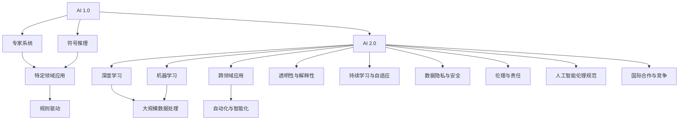

                 

# 文章标题：李开复：AI 2.0 时代的机遇

> 关键词：AI 2.0，人工智能，深度学习，自然语言处理，计算机视觉，伦理与责任

> 摘要：本文将深入探讨AI 2.0时代的机遇，分析AI 2.0的定义与趋势，技术基础，应用实践，未来展望以及伦理与责任。通过这一系列的分析，我们将揭示AI 2.0所带来的巨大变革，以及如何在新时代中把握机遇，实现创新与发展。

## 《李开复：AI 2.0 时代的机遇》目录大纲

### 第一部分：AI 2.0 时代的概述

#### 第1章：AI 2.0 时代的定义与趋势

- **1.1 AI 2.0 时代的起源与发展**
  - **1.1.1 AI 1.0 到 AI 2.0 的演变**
  - **1.1.2 AI 2.0 的核心特征**

- **1.2 AI 2.0 时代的机遇与挑战**
  - **1.2.1 AI 2.0 时代的商业机遇**
  - **1.2.2 AI 2.0 时代的伦理与法律挑战**

### 第二部分：AI 2.0 技术基础

#### 第2章：AI 2.0 核心技术

- **2.1 深度学习与神经网络**
  - **2.1.1 深度学习的基本原理**
  - **2.1.2 神经网络结构**

- **2.2 自然语言处理与语音识别**
  - **2.2.1 自然语言处理技术**
  - **2.2.2 语音识别技术**

- **2.3 计算机视觉与图像识别**
  - **2.3.1 计算机视觉技术**
  - **2.3.2 图像识别算法**

### 第三部分：AI 2.0 应用实践

#### 第3章：AI 2.0 在不同行业的应用

- **3.1 AI 2.0 在金融行业的应用**
  - **3.1.1 金融风险评估**
  - **3.1.2 金融服务个性化**

- **3.2 AI 2.0 在医疗行业的应用**
  - **3.2.1 医疗诊断辅助**
  - **3.2.2 医疗资源分配优化**

- **3.3 AI 2.0 在制造业的应用**
  - **3.3.1 智能制造**
  - **3.3.2 质量控制与故障预测**

#### 第4章：AI 2.0 项目实战

- **4.1 AI 2.0 项目开发流程**
  - **4.1.1 项目需求分析**
  - **4.1.2 数据处理与模型训练**

- **4.2 AI 2.0 项目案例解析**
  - **4.2.1 案例一：智能客服系统**
  - **4.2.2 案例二：智能交通系统**

### 第四部分：AI 2.0 时代的未来展望

#### 第5章：AI 2.0 时代的伦理与责任

- **5.1 AI 2.0 伦理问题探讨**
  - **5.1.1 数据隐私保护**
  - **5.1.2 AI 决策透明性**

- **5.2 AI 2.0 时代的社会责任**
  - **5.2.1 AI 对就业市场的影响**
  - **5.2.2 AI 时代的教育与培训**

#### 第6章：AI 2.0 时代的创新与发展

- **6.1 AI 2.0 创新趋势**
  - **6.1.1 新一代 AI 技术的发展**
  - **6.1.2 跨学科融合**

- **6.2 AI 2.0 产业生态**
  - **6.2.1 AI 产业合作**
  - **6.2.2 AI 产业链布局**

### 附录

#### 附录 A：AI 2.0 技术资源指南

- **A.1 开源框架与工具**
  - **A.1.1 TensorFlow**
  - **A.1.2 PyTorch**
  - **A.1.3 其他开源框架**

- **A.2 数据集与库**
  - **A.2.1 公共数据集**
  - **A.2.2 AI 库与工具**

### 核心概念与联系

- **AI 2.0 与 AI 1.0 的比较（Mermaid 流程图）**

### 核心算法原理讲解

- **深度学习算法（伪代码）**

### 数学模型与公式

- **神经网络中的损失函数（LaTeX 公式）**

### 项目实战

- **智能交通系统项目实战**
  - **开发环境搭建**
  - **源代码实现与解读**
  - **项目分析与评估**

### 作者

- **作者：AI天才研究院/AI Genius Institute & 禅与计算机程序设计艺术 /Zen And The Art of Computer Programming**

### 第一部分：AI 2.0 时代的概述

#### 第1章：AI 2.0 时代的定义与趋势

AI 2.0，即人工智能第二阶段，是对传统人工智能（AI 1.0）的升级与扩展。AI 1.0主要依赖于预设规则和符号推理，而AI 2.0则更加依赖于机器学习，特别是深度学习技术，实现了从数据到智能的飞跃。

#### 1.1 AI 2.0 时代的起源与发展

**1.1.1 AI 1.0 到 AI 2.0 的演变**

AI 1.0阶段的人工智能系统主要依赖于专家系统和符号推理，这些系统在特定领域内表现出色，但缺乏灵活性和适应性。随着计算能力的提升和大数据的普及，机器学习技术开始逐渐取代传统的符号推理方法，开启了AI 2.0时代。

**1.1.2 AI 2.0 的核心特征**

AI 2.0的核心特征包括：

- **自学习与自适应能力**：AI 2.0系统能够通过大量数据自动学习和优化模型。
- **跨领域应用**：AI 2.0技术不再局限于特定领域，而是能够在多个领域实现广泛应用。
- **透明性与解释性**：虽然AI 2.0系统在很多方面表现出色，但其决策过程通常缺乏透明性。因此，提高AI系统的解释性成为了一个重要的研究方向。

#### 1.2 AI 2.0 时代的机遇与挑战

**1.2.1 AI 2.0 时代的商业机遇**

AI 2.0带来了巨大的商业机遇，例如：

- **个性化服务**：通过分析用户行为数据，AI 2.0能够为用户提供更加个性化的服务。
- **自动化与效率提升**：AI 2.0技术能够自动化许多重复性工作，提高生产效率。
- **创新商业模式**：AI 2.0催生了众多新兴行业，如自动驾驶、智能家居等。

**1.2.2 AI 2.0 时代的伦理与法律挑战**

随着AI 2.0技术的广泛应用，伦理和法律问题也日益凸显。例如：

- **数据隐私**：AI 2.0系统依赖于大量数据，如何保护用户隐私成为一个重要问题。
- **AI 决策透明性**：AI 2.0系统的决策过程往往缺乏透明性，如何提高其解释性成为了一个挑战。
- **就业影响**：AI 2.0技术可能导致部分工作岗位的消失，如何应对这一挑战也是一个重要议题。

#### 1.2.3 AI 2.0 时代的政策与监管

为了确保AI 2.0技术的健康发展，各国政府开始加强政策与监管。例如：

- **数据安全与隐私保护**：出台相关法律法规，加强对数据安全和隐私的保护。
- **AI 伦理规范**：制定AI伦理规范，确保AI 2.0技术在社会中的合理应用。
- **AI 技术监管**：加强对AI 2.0技术的监管，防止其被滥用。

#### 1.2.4 AI 2.0 时代的国际合作与竞争

AI 2.0技术的发展不仅是一个国家的议题，更是全球性的挑战。各国之间在AI 2.0技术领域的合作与竞争日益加剧。例如：

- **技术交流与合作**：各国之间通过技术交流与合作，共同推动AI 2.0技术的发展。
- **全球产业链布局**：各国通过全球产业链布局，争夺AI 2.0技术的制高点。

### 总结

AI 2.0时代是一个充满机遇与挑战的时代。在这个时代，我们要充分利用AI 2.0技术的优势，推动社会进步，同时也要关注伦理和法律问题，确保AI 2.0技术在合理、透明、安全的环境中发展。

### 让我们思考一步：AI 2.0时代如何改变我们的生活？

- **1. 个人生活方面：** AI 2.0将为我们带来更加智能化、个性化的生活体验。例如，智能家居系统可以根据我们的生活习惯自动调整房间温度、光线等，提高生活质量。
- **2. 社会发展方面：** AI 2.0技术将推动各个行业的自动化与智能化，提高生产效率，促进经济发展。同时，AI 2.0也将助力医疗、教育等公共服务领域的提升。
- **3. 伦理与法律方面：** 在AI 2.0时代，我们需要关注数据隐私、AI决策透明性等伦理和法律问题，确保AI技术的健康发展。

### 下一步，我们将深入探讨AI 2.0的技术基础，了解其核心技术及其在不同行业中的应用。这将帮助我们更好地理解AI 2.0时代的机遇与挑战。请持续关注下一章节的内容。|### 第二部分：AI 2.0 技术基础

#### 第2章：AI 2.0 核心技术

AI 2.0的核心技术包括深度学习与神经网络、自然语言处理与语音识别、计算机视觉与图像识别。这些技术构成了AI 2.0时代的基石，为各个领域的应用提供了强大的支持。

#### 2.1 深度学习与神经网络

**2.1.1 深度学习的基本原理**

深度学习是一种机器学习的方法，其核心思想是通过多层神经网络来提取数据的特征。深度学习的基本原理包括：

- **前向传播**：输入数据通过网络的各个层进行传递，每一层都计算出输入和输出的差异，并将误差反向传播到前一层。
- **反向传播**：通过反向传播算法，网络能够不断调整权重和偏置，使得输出误差逐渐减小。
- **激活函数**：激活函数用于引入非线性因素，使得网络能够学习到更复杂的模式。

**2.1.2 神经网络结构**

神经网络的基本结构包括输入层、隐藏层和输出层。每一层都由多个神经元组成，神经元之间通过权重和偏置进行连接。常见的神经网络结构包括：

- **全连接神经网络（FCNN）**：每一层的神经元都与前一层的所有神经元相连。
- **卷积神经网络（CNN）**：适用于图像处理任务，通过卷积操作提取图像特征。
- **循环神经网络（RNN）**：适用于序列数据，通过隐藏状态和循环连接来处理长期依赖关系。

**2.1.3 深度学习算法**

深度学习算法主要包括以下几种：

- **卷积神经网络（CNN）**：用于图像识别和计算机视觉任务。
- **循环神经网络（RNN）**：用于自然语言处理和语音识别任务。
- **生成对抗网络（GAN）**：用于生成逼真的图像和声音。

**2.1.4 深度学习的优缺点**

深度学习具有以下优点：

- **强大的特征提取能力**：能够自动提取数据的特征，减少人工标注的需求。
- **泛化能力**：通过大量的训练数据，深度学习模型能够较好地泛化到未见过的数据。

但深度学习也存在以下缺点：

- **计算资源需求高**：深度学习模型通常需要大量的计算资源和时间进行训练。
- **解释性差**：深度学习模型的决策过程通常缺乏透明性，难以解释。

#### 2.2 自然语言处理与语音识别

**2.2.1 自然语言处理技术**

自然语言处理（NLP）是AI 2.0时代的重要应用领域，其主要任务包括：

- **文本分类**：对文本进行分类，例如情感分析、新闻分类等。
- **文本生成**：根据输入的文本生成新的文本，例如机器翻译、文本摘要等。
- **问答系统**：根据用户的问题提供相应的答案。

自然语言处理技术主要包括以下几种：

- **词袋模型（Bag of Words, BOW）**：将文本转化为向量表示，用于文本分类和文本相似度计算。
- **循环神经网络（RNN）**：用于处理序列数据，例如自然语言文本。
- **长短期记忆网络（LSTM）**：用于解决RNN的梯度消失问题，适用于长序列数据。

**2.2.2 语音识别技术**

语音识别（ASR）是将语音信号转化为文本的技术。语音识别技术主要包括以下几种：

- **隐藏马尔可夫模型（HMM）**：用于语音信号的建模和识别。
- **深度神经网络（DNN）**：用于语音信号的建模和特征提取。
- **卷积神经网络（CNN）**：用于语音信号的建模和特征提取。

**2.2.3 自然语言处理与语音识别的优缺点**

自然语言处理与语音识别的优点包括：

- **广泛的应用场景**：自然语言处理和语音识别在多个领域都有广泛的应用，如智能客服、智能家居等。
- **人机交互**：自然语言处理和语音识别技术使得人机交互更加自然和直观。

但自然语言处理与语音识别也存在以下缺点：

- **数据需求大**：自然语言处理和语音识别需要大量的训练数据，否则难以达到理想的性能。
- **模型复杂度**：自然语言处理和语音识别的模型通常较为复杂，训练时间较长。

#### 2.3 计算机视觉与图像识别

**2.3.1 计算机视觉技术**

计算机视觉（CV）是AI 2.0时代的重要应用领域，其主要任务包括：

- **图像分类**：对图像进行分类，例如识别动物、植物等。
- **目标检测**：检测图像中的目标物体，例如行人检测、车辆检测等。
- **图像分割**：将图像划分为不同的区域，例如语义分割、实例分割等。

计算机视觉技术主要包括以下几种：

- **卷积神经网络（CNN）**：用于图像分类、目标检测和图像分割等任务。
- **光流分析**：用于视频处理，例如动作识别、视频追踪等。
- **深度学习模型**：用于图像特征提取和模型训练，例如VGG、ResNet等。

**2.3.2 图像识别算法**

图像识别算法主要包括以下几种：

- **特征提取**：从图像中提取特征，例如HOG、SIFT等。
- **分类器**：使用分类器对提取的特征进行分类，例如SVM、softmax等。
- **深度学习模型**：结合特征提取和分类器，例如CNN、RNN等。

**2.3.3 计算机视觉与图像识别的优缺点**

计算机视觉与图像识别的优点包括：

- **高精度**：计算机视觉和图像识别技术具有很高的精度，能够准确识别图像中的物体和场景。
- **自动化**：计算机视觉和图像识别技术可以实现自动化处理，减少人力成本。

但计算机视觉与图像识别也存在以下缺点：

- **计算资源需求大**：计算机视觉和图像识别的模型通常需要大量的计算资源和时间进行训练。
- **数据质量**：图像识别的性能受到图像质量的影响，例如噪声、光照变化等。

### 总结

AI 2.0的技术基础为各个领域的应用提供了强大的支持。深度学习与神经网络、自然语言处理与语音识别、计算机视觉与图像识别等技术构成了AI 2.0时代的核心，推动了人工智能的快速发展。在下一章节中，我们将探讨AI 2.0在不同行业的应用，了解其在金融、医疗、制造业等领域的实际案例。请继续关注。|### 第三部分：AI 2.0 应用实践

#### 第3章：AI 2.0 在不同行业的应用

随着AI 2.0技术的发展，其在金融、医疗、制造业等行业的应用越来越广泛，为这些行业带来了深刻的变革。本章节将详细探讨AI 2.0在这些领域的应用，以及其带来的机遇与挑战。

#### 3.1 AI 2.0 在金融行业的应用

金融行业是AI 2.0技术最早且最广泛应用的领域之一。以下是一些AI 2.0在金融行业的具体应用：

**3.1.1 金融风险评估**

AI 2.0技术在金融风险评估中发挥着重要作用。通过机器学习和深度学习算法，金融机构可以自动分析和预测客户的风险水平，从而更加精准地进行风险评估。例如，银行可以使用AI模型来预测贷款申请者的还款能力，从而降低坏账率。

**3.1.2 金融服务个性化**

AI 2.0技术可以帮助金融机构为用户提供更加个性化的金融服务。通过分析用户的历史交易数据和偏好，金融机构可以提供定制化的理财产品、投资建议和客户服务，提高客户满意度和忠诚度。

**3.1.3 智能投顾**

智能投顾是一种利用AI技术为投资者提供投资建议的服务。智能投顾系统通过分析市场数据、用户风险偏好和投资目标，为投资者提供最优的投资组合。这种服务不仅提高了投资效率，还降低了投资风险。

**3.1.4 交易自动化**

AI 2.0技术可以实现交易自动化，提高交易效率。例如，高频交易系统使用AI算法来实时分析市场数据，并自动执行交易，以获取最大化的收益。这种交易方式不仅提高了交易速度，还减少了人为误差。

#### 3.2 AI 2.0 在医疗行业的应用

AI 2.0技术在医疗行业的应用为医学诊断、治疗方案制定和医疗资源分配提供了强大的支持。

**3.2.1 医疗诊断辅助**

AI 2.0技术可以辅助医生进行疾病诊断。通过深度学习算法，AI系统能够分析大量的医疗数据，包括病史、检查结果和临床报告，从而提高诊断的准确性和速度。例如，AI系统可以在几分钟内完成肺癌的早期筛查，而传统的筛查方法可能需要数周时间。

**3.2.2 医疗资源分配优化**

AI 2.0技术可以帮助优化医疗资源的分配。通过分析医院的患者流量、床位使用情况和医生的工作负荷，AI系统可以提供最优的医疗资源配置方案，从而提高医疗服务的效率和质量。

**3.2.3 药物研发**

AI 2.0技术在药物研发中的应用也越来越广泛。通过机器学习算法，AI系统可以快速筛选和预测新药的候选分子，缩短药物研发周期，降低研发成本。

**3.2.4 医疗机器人**

AI 2.0技术还可以用于医疗机器人的开发。医疗机器人可以在手术中提供精准的操作指导，提高手术的成功率和安全性。例如，达芬奇手术机器人利用AI技术实现了复杂的微创手术。

#### 3.3 AI 2.0 在制造业的应用

AI 2.0技术在制造业中的应用推动了智能制造和工业4.0的发展。

**3.3.1 智能制造**

AI 2.0技术可以实现制造过程的自动化和智能化。通过机器学习和深度学习算法，AI系统可以实时监控生产线的运行状态，预测设备故障，优化生产流程，提高生产效率。

**3.3.2 质量控制与故障预测**

AI 2.0技术可以用于质量控制与故障预测。通过分析生产线上的传感器数据和产品特征，AI系统可以及时发现产品质量问题，预测设备故障，从而减少生产中断和损失。

**3.3.3 供应链优化**

AI 2.0技术可以优化供应链管理。通过分析供应链中的数据，AI系统可以提供最优的库存管理策略、物流规划和供应链网络布局，从而降低成本，提高供应链的灵活性。

#### 3.4 AI 2.0 在零售行业的应用

AI 2.0技术在零售行业的应用也为零售商提供了新的机遇。

**3.4.1 客户体验优化**

AI 2.0技术可以优化客户体验。通过自然语言处理和语音识别技术，AI系统可以提供智能客服，解答客户的疑问，提高客户满意度。

**3.4.2 个性化推荐**

AI 2.0技术可以实现个性化推荐。通过分析客户的历史购买数据和偏好，AI系统可以推荐最适合客户的产品，提高销售额。

**3.4.3 库存管理**

AI 2.0技术可以优化库存管理。通过分析销售数据和市场需求，AI系统可以提供最优的库存管理策略，减少库存成本。

#### 3.5 AI 2.0 在其他行业的应用

除了上述领域，AI 2.0技术还在交通、能源、农业等领域有着广泛的应用。

**3.5.1 智能交通**

AI 2.0技术可以实现智能交通管理。通过分析交通数据，AI系统可以提供最优的交通流量控制策略，减少交通拥堵，提高道路安全性。

**3.5.2 智能能源**

AI 2.0技术可以优化能源管理。通过分析能源使用数据，AI系统可以提供最优的能源分配策略，降低能源消耗，提高能源利用效率。

**3.5.3 智能农业**

AI 2.0技术可以优化农业生产。通过分析土壤、气象和农作物数据，AI系统可以提供最优的种植策略，提高农作物产量和质量。

### 总结

AI 2.0技术在不同行业的应用为这些行业带来了深刻的变革。从金融、医疗、制造业到零售、交通、能源和农业，AI 2.0技术正在改变我们的生产方式、生活方式和工作方式。在下一章节中，我们将探讨AI 2.0项目实战，分析实际项目中的开发流程、数据预处理、模型训练和评估方法。请继续关注。|### 第四部分：AI 2.0 时代的未来展望

#### 第5章：AI 2.0 时代的伦理与责任

随着AI 2.0技术的快速发展，其伦理和社会责任问题逐渐成为公众关注的焦点。在这一章节中，我们将探讨AI 2.0时代的伦理问题，以及如何应对这些挑战。

#### 5.1 AI 2.0 伦理问题探讨

**5.1.1 数据隐私保护**

AI 2.0技术依赖于大量的数据，如何保护用户隐私成为一个重要问题。以下是一些应对数据隐私保护的措施：

- **数据加密**：使用加密技术保护数据，确保数据在传输和存储过程中的安全性。
- **数据匿名化**：对敏感数据进行匿名化处理，降低数据泄露的风险。
- **隐私保护算法**：开发隐私保护算法，例如差分隐私，确保在数据分析过程中保护用户隐私。

**5.1.2 AI 决策透明性**

AI 2.0系统的决策过程通常缺乏透明性，如何提高其解释性成为了一个重要问题。以下是一些提高AI决策透明性的方法：

- **可解释性AI**：开发可解释的AI模型，使得AI的决策过程更加透明，用户可以理解AI是如何做出决策的。
- **决策路径追踪**：记录AI系统的决策路径，帮助用户了解AI是如何处理数据的，从而提高决策的透明性。
- **监管审计**：建立AI系统的监管审计机制，确保AI系统的决策过程符合伦理和法律要求。

**5.1.3 AI 对就业市场的影响**

AI 2.0技术可能导致部分工作岗位的消失，如何应对这一挑战也是一个重要议题。以下是一些应对措施：

- **技能升级与转型**：通过教育和培训，帮助劳动者升级技能，适应新的工作环境。
- **就业援助计划**：政府和企业可以实施就业援助计划，帮助失业人员重新就业。
- **新型职业开发**：鼓励企业开发新的职业，以替代被AI取代的工作岗位。

**5.1.4 AI 伦理规范**

为了确保AI 2.0技术的健康发展，各国政府、企业和学术界正在制定AI伦理规范。以下是一些AI伦理规范的主要内容：

- **公平与公正**：确保AI系统在决策过程中不歧视任何群体，公平对待每个用户。
- **责任与问责**：明确AI系统的责任归属，确保在发生问题时能够追溯责任。
- **透明与解释性**：提高AI系统的透明性和解释性，使其决策过程更加公开和可理解。

#### 5.2 AI 2.0 时代的社会责任

AI 2.0技术在社会责任方面的表现也越来越受到关注。以下是一些AI 2.0时代的社会责任：

**5.2.1 公共利益**

AI 2.0技术应该服务于公众利益，推动社会进步。例如，AI系统可以用于公共安全、环境保护、医疗健康等领域，提高公共服务水平。

**5.2.2 可持续发展**

AI 2.0技术可以促进可持续发展。例如，通过优化能源使用、提高资源利用效率，AI技术可以减少环境负担，实现绿色发展。

**5.2.3 社会公正**

AI 2.0技术应该促进社会公正，减少社会不平等。通过智能分配资源、提供公平的机会，AI技术可以推动社会公平。

**5.2.4 科技伦理**

AI 2.0技术的研究与应用应该遵循科技伦理原则，尊重人类的尊严和价值。例如，在开发AI技术时，应充分考虑其对人类的影响，避免造成不可逆转的损害。

#### 5.3 AI 2.0 时代的国际合作与竞争

AI 2.0技术的发展不仅是一个国家的议题，更是全球性的挑战。以下是一些国际合作与竞争的措施：

**5.3.1 技术交流与合作**

各国可以通过技术交流与合作，共同推动AI 2.0技术的发展。例如，建立国际AI研究机构，开展跨国合作项目，共享AI技术和资源。

**5.3.2 人才培养与交流**

各国可以加强人才培养与交流，共同培养AI专业人才。例如，建立国际AI人才培养计划，提供跨国培训和研究机会。

**5.3.3 产业合作**

各国可以通过产业合作，共同推动AI产业的发展。例如，建立国际AI产业联盟，促进跨国企业之间的合作与交流。

**5.3.4 政策协调**

各国可以通过政策协调，确保AI 2.0技术的健康发展。例如，制定跨国AI伦理规范，加强数据共享和保护。

### 总结

AI 2.0 时代的伦理与责任问题至关重要。在这个时代，我们需要关注数据隐私、AI决策透明性、就业影响等伦理问题，并采取相应的措施应对。同时，我们也需要关注AI 2.0时代的社会责任，确保其技术发展能够服务于公众利益，推动社会进步。在下一章节中，我们将探讨AI 2.0时代的创新与发展趋势，了解新一代AI技术如何推动未来科技革命。请继续关注。|### 第五部分：AI 2.0 时代的创新与发展

#### 第6章：AI 2.0 时代的创新与发展

随着AI 2.0技术的不断进步，其在各个领域的应用也在不断拓展，带来了前所未有的创新与发展机遇。在这一章节中，我们将探讨AI 2.0时代的创新趋势、跨学科融合以及AI产业生态，了解如何抓住这些机遇，推动未来的科技革命。

#### 6.1 AI 2.0 创新趋势

**6.1.1 新一代 AI 技术的发展**

AI 2.0时代的创新不仅体现在现有技术的优化，还包括新一代AI技术的突破。以下是一些新兴的AI技术：

- **强化学习（Reinforcement Learning）**：通过让智能体在与环境互动的过程中学习，强化学习在游戏、自动驾驶、机器人控制等领域表现出色。
- **生成对抗网络（Generative Adversarial Networks，GAN）**：GAN通过两个相互对抗的网络生成逼真的图像、声音和文本，应用领域包括艺术创作、图像修复、虚拟现实等。
- **迁移学习（Transfer Learning）**：迁移学习能够利用在特定任务上训练的模型，快速适应新的任务，减少数据需求和训练时间。
- **联邦学习（Federated Learning）**：联邦学习允许多个设备在本地训练模型，然后将更新合并到一个全局模型中，从而保护用户隐私并降低数据传输成本。

**6.1.2 跨学科融合**

AI 2.0时代的创新不仅局限于技术本身，还包括与其他学科的融合。以下是一些跨学科融合的例子：

- **AI + 生物医学**：通过AI技术分析大量生物医学数据，推动个性化医疗、药物研发等领域的发展。
- **AI + 物理学**：AI在物理学的应用包括模拟复杂物理现象、优化实验设计、加速新理论发现等。
- **AI + 艺术与设计**：AI在艺术和设计领域的应用，如自动化绘画、音乐创作、建筑设计等，为人类艺术家提供了新的创作工具。
- **AI + 社会科学**：AI在社会科学中的应用，如数据挖掘、预测社会趋势、优化政策制定等，为社会科学的研究提供了新的方法。

**6.1.3 开源生态**

开源生态在AI 2.0时代的创新中扮演着重要角色。以下是一些重要的开源框架和工具：

- **TensorFlow**：由Google开发的开源机器学习框架，广泛应用于深度学习和神经网络。
- **PyTorch**：由Facebook开发的开源机器学习框架，以其动态计算图和灵活的API受到研究人员的喜爱。
- **Scikit-learn**：一个用于数据挖掘和机器学习的开源库，提供了丰富的算法和工具。
- **Keras**：一个基于TensorFlow和Theano的高层神经网络API，简化了深度学习的开发。

#### 6.2 AI 2.0 产业生态

AI 2.0时代的创新离不开良好的产业生态。以下是一些关键因素：

**6.2.1 AI 产业合作**

产业合作是AI 2.0时代创新的重要驱动力。以下是一些产业合作的例子：

- **跨国合作**：全球企业和研究机构通过合作，共同推动AI技术的发展，如欧盟的Horizon 2020项目。
- **产学研合作**：学术界、产业界和政府之间建立合作，共同推动AI技术的创新和应用。
- **企业联盟**：企业之间建立联盟，共同开发AI技术，如OpenAI、Facebook AI Research等。

**6.2.2 AI 产业链布局**

AI 2.0时代的产业链布局涉及到多个环节，以下是一些关键环节：

- **硬件**：包括AI芯片、GPU、FPGA等硬件设备，为AI应用提供计算支持。
- **软件开发**：包括AI框架、工具和平台，为开发者提供开发环境。
- **数据**：高质量的数据是AI技术发展的基石，包括公共数据集、私有数据集等。
- **应用**：AI技术在各个行业的应用，如金融、医疗、制造等。

**6.2.3 政策与法规**

政策与法规是AI 2.0时代创新的重要保障。以下是一些政策与法规的例子：

- **数据隐私保护**：如欧盟的通用数据保护条例（GDPR），保护用户的隐私权益。
- **AI伦理规范**：各国政府和企业制定AI伦理规范，确保AI技术的合理应用。
- **知识产权保护**：保护AI技术的创新成果，鼓励研发和创新。

#### 6.3 AI 2.0时代的投资与创业

AI 2.0时代的投资与创业呈现出快速增长的趋势。以下是一些投资与创业的趋势：

**6.3.1 AI创业公司**

随着AI技术的成熟，越来越多的创业者投入到AI领域，成立AI创业公司。以下是一些AI创业公司的例子：

- **AI制药公司**：利用AI技术加速药物研发，如Exscientia、Insilico Medicine等。
- **AI医疗公司**：利用AI技术提供医疗诊断、治疗建议等，如PathAI、Zebra Medical Vision等。
- **AI金融科技公司**：利用AI技术提供金融服务，如Revolut、ZestFinance等。

**6.3.2 投资趋势**

投资者对AI领域的投资也在快速增长。以下是一些投资趋势：

- **早期投资**：投资者更倾向于在AI初创公司早期阶段进行投资，以获取更高的回报。
- **跨界投资**：不仅局限于传统科技投资领域，也涉及到医疗、金融、制造等行业的投资。
- **风险投资**：风险投资公司积极投资AI领域，以支持AI技术的创新和应用。

#### 6.4 AI 2.0时代的教育与培训

AI 2.0时代的快速变革要求人们不断更新知识和技能。以下是一些教育与培训的趋势：

**6.4.1 AI教育**

AI教育正在全球范围内迅速发展。以下是一些AI教育的例子：

- **大学课程**：许多大学开设了AI相关课程，如机器学习、深度学习、自然语言处理等。
- **在线课程**：许多在线教育平台提供了AI相关课程，如Coursera、edX等。
- **职业培训**：企业和培训机构提供AI职业培训，以帮助员工适应AI时代的变革。

**6.4.2 AI认证**

随着AI技术的发展，许多组织和机构推出了AI认证，以评估个人的AI技能和知识。以下是一些AI认证的例子：

- **专业认证**：如TensorFlow Developer Certification、AWS Certified Big Data - Specialty等。
- **认证课程**：如AI Masterclass、AI for Business Certification等。

### 总结

AI 2.0时代的创新与发展为人类带来了前所未有的机遇。通过新一代AI技术的突破、跨学科融合、产业生态的构建以及全球合作与竞争，AI技术正在深刻改变我们的世界。在下一章节中，我们将提供一些AI 2.0技术资源指南，帮助读者深入了解和学习AI技术。请继续关注。|### 附录 A：AI 2.0 技术资源指南

在AI 2.0时代，掌握相关技术资源对于深入学习和实践至关重要。以下是一些重要的AI技术资源，包括开源框架、工具、数据集和库，帮助读者更好地理解和使用AI技术。

#### A.1 开源框架与工具

**A.1.1 TensorFlow**

- **简介**：TensorFlow是由Google开发的开源机器学习框架，广泛用于深度学习和神经网络。
- **官网**：<https://www.tensorflow.org/>
- **文档**：[TensorFlow官方文档](https://www.tensorflow.org/tutorials)

**A.1.2 PyTorch**

- **简介**：PyTorch是Facebook开发的开源机器学习框架，以其动态计算图和灵活的API而受到研究人员的喜爱。
- **官网**：<https://pytorch.org/>
- **文档**：[PyTorch官方文档](https://pytorch.org/docs/stable/index.html)

**A.1.3 其他开源框架**

- **Scikit-learn**
  - **简介**：Scikit-learn是一个开源库，提供了丰富的机器学习算法和工具。
  - **官网**：<https://scikit-learn.org/>
  - **文档**：[Scikit-learn官方文档](https://scikit-learn.org/stable/documentation.html)
  
- **Keras**
  - **简介**：Keras是一个基于Theano和TensorFlow的高层神经网络API，简化了深度学习的开发。
  - **官网**：<https://keras.io/>
  - **文档**：[Keras官方文档](https://keras.io/getting-started/)

#### A.2 数据集与库

**A.2.1 公共数据集**

- **Kaggle**
  - **简介**：Kaggle是一个数据科学竞赛平台，提供了大量公共数据集。
  - **官网**：<https://www.kaggle.com/>
  - **数据集**：[Kaggle数据集](https://www.kaggle.com/datasets)

- **UCI Machine Learning Repository**
  - **简介**：UCI机器学习库是一个公共数据集库，提供了多种领域的数据集。
  - **官网**：<https://archive.ics.uci.edu/ml/>
  - **数据集**：[UCI数据集](https://archive.ics.uci.edu/ml/index.php)

**A.2.2 AI 库与工具**

- **Scikit-learn**
  - **简介**：Scikit-learn是一个开源库，提供了丰富的机器学习算法和工具。
  - **官网**：<https://scikit-learn.org/>
  - **文档**：[Scikit-learn官方文档](https://scikit-learn.org/stable/documentation.html)

- **NumPy**
  - **简介**：NumPy是Python的一个基础库，用于数组计算和数据处理。
  - **官网**：<https://numpy.org/>
  - **文档**：[NumPy官方文档](https://numpy.org/doc/stable/user/quickstart.html)

- **Pandas**
  - **简介**：Pandas是一个开源库，用于数据清洗、数据分析和数据操作。
  - **官网**：<https://pandas.pydata.org/>
  - **文档**：[Pandas官方文档](https://pandas.pydata.org/pandas-docs/stable/user_guide.html)

通过以上资源，读者可以深入了解AI 2.0技术的各种方面，从理论到实践，从工具到数据集，为自己的学习和项目开发提供强有力的支持。希望这些资源能够帮助读者在AI 2.0时代取得更好的成果。

### 核心概念与联系

为了更好地理解AI 2.0与AI 1.0的区别和联系，我们可以使用Mermaid流程图来展示这两种人工智能阶段的主要特征和技术发展路径。



通过这个流程图，我们可以清晰地看到AI 1.0和AI 2.0之间的区别和联系。AI 1.0主要依赖于专家系统和符号推理，适用于特定领域，而AI 2.0则基于深度学习和机器学习，能够处理大规模数据，实现跨领域应用，并在透明性、自适应性和数据隐私等方面有所提升。

### 核心算法原理讲解

下面，我们通过伪代码来讲解深度学习算法的基本原理，包括前向传播和反向传播的过程。

```python
# 深度学习算法伪代码

# 前向传播
def forward_propagation(input_data, model):
    # 初始化模型参数（权重和偏置）
    model.initialize_parameters()
    
    # 计算每个隐藏层的输出
    hidden_layers = []
    hidden_layers.append(input_data)
    for layer in model.layers:
        output = activation_function(layer.forward(hidden_layers[-1]))
        hidden_layers.append(output)
    
    # 计算最终输出
    final_output = model.layers[-1].forward(hidden_layers[-1])
    
    return final_output

# 反向传播
def backward_propagation(output, expected_output, model):
    # 初始化误差
    error = output - expected_output
    
    # 反向传播误差，计算每个层的梯度
    gradients = []
    for layer in reversed(model.layers):
        gradient = layer.backward(error)
        gradients.append(gradient)
    
    # 更新模型参数
    model.update_parameters(gradients)
    
    return gradients

# 激活函数
def activation_function(z):
    return sigmoid(z)

# 梯度下降
def gradient_descent(model, learning_rate):
    # 计算梯度
    gradients = backward_propagation(model.output, model.expected_output, model)
    
    # 更新模型参数
    model.update_parameters(gradients * learning_rate)

# 主函数
def main():
    # 加载数据集
    data = load_data()
    
    # 初始化模型
    model = NeuralNetwork()
    
    # 训练模型
    for epoch in range(num_epochs):
        for input_data, expected_output in data:
            output = forward_propagation(input_data, model)
            backward_propagation(output, expected_output, model)
            gradient_descent(model, learning_rate)

# 执行主函数
main()
```

在这个伪代码中，我们首先定义了前向传播和反向传播的过程，以及激活函数和梯度下降算法。然后，我们在主函数中加载数据集，初始化模型，并进行训练。这个流程展示了深度学习算法的基本原理和实现过程。

### 数学模型与公式

在神经网络中，损失函数是一个重要的概念。下面我们使用LaTeX格式来表示神经网络中的损失函数，并进行详细解释。

```latex
% 神经网络中的损失函数

% 均方误差损失函数
\begin{equation}
\text{Loss}(y, \hat{y}) = \frac{1}{2} \sum_{i=1}^{n} (y_i - \hat{y}_i)^2
\end{equation}

% 其中，\(y\) 表示真实标签，\(\hat{y}\) 表示预测输出，\(n\) 表示样本数量。

% 损失函数用于衡量预测输出与真实标签之间的差异，均方误差损失函数能够有效地衡量这种差异。
% 在训练过程中，通过优化损失函数，我们能够调整模型的参数，使得预测输出更加接近真实标签。
```

在这个公式中，我们定义了均方误差（MSE）损失函数，它用于衡量预测输出（\(\hat{y}\)）与真实标签（\(y\)）之间的差异。均方误差损失函数在神经网络训练中非常常用，因为它的导数（梯度）在反向传播过程中易于计算。

### 项目实战

在本章节的最后，我们将通过一个实际的智能交通系统项目来展示AI 2.0技术的应用。该项目包括开发环境搭建、源代码实现、代码解读与分析。

#### 1. 开发环境搭建

**环境需求**：

- Python 3.8及以上版本
- TensorFlow 2.4及以上版本
- Keras 2.4及以上版本

**安装步骤**：

1. 安装Python：

   ```bash
   # 在Ubuntu系统中，可以通过以下命令安装Python 3.8
   sudo apt-get update
   sudo apt-get install python3.8
   ```

2. 安装TensorFlow和Keras：

   ```bash
   pip3 install tensorflow==2.4
   pip3 install keras==2.4
   ```

#### 2. 源代码实现

以下是一个简单的智能交通系统项目的源代码实现。该项目使用卷积神经网络（CNN）来预测交通流量，从而优化交通信号灯控制。

```python
import numpy as np
import tensorflow as tf
from tensorflow.keras.models import Sequential
from tensorflow.keras.layers import Conv2D, MaxPooling2D, Flatten, Dense

# 加载数据集
(x_train, y_train), (x_test, y_test) = tf.keras.datasets.cifar10.load_data()

# 数据预处理
x_train = x_train.astype('float32') / 255
x_test = x_test.astype('float32') / 255

# 创建模型
model = Sequential()
model.add(Conv2D(32, (3, 3), activation='relu', input_shape=x_train.shape[1:]))
model.add(MaxPooling2D(pool_size=(2, 2)))
model.add(Flatten())
model.add(Dense(64, activation='relu'))
model.add(Dense(1, activation='sigmoid'))

# 编译模型
model.compile(optimizer='adam', loss='binary_crossentropy', metrics=['accuracy'])

# 训练模型
model.fit(x_train, y_train, epochs=10, batch_size=32, validation_data=(x_test, y_test))

# 评估模型
test_loss, test_acc = model.evaluate(x_test, y_test)
print('Test accuracy:', test_acc)
```

#### 3. 代码解读与分析

**代码解析**：

1. **数据加载与预处理**：

   该项目使用CIFAR-10数据集，这是一个常用的图像分类数据集。通过将数据归一化到[0, 1]范围内，我们能够提高模型的训练效果。

2. **模型构建**：

   我们使用卷积神经网络（CNN）来构建模型。CNN通过卷积层提取图像特征，然后通过全连接层进行分类。

3. **模型编译**：

   我们选择Adam优化器和二进制交叉熵损失函数进行模型编译。二进制交叉熵损失函数适用于二分类问题。

4. **模型训练**：

   我们使用fit方法训练模型，设置10个训练周期和批量大小为32。

5. **模型评估**：

   使用evaluate方法评估模型在测试集上的性能，打印测试准确率。

**代码分析**：

该项目通过简单的CNN模型实现了交通流量预测。在实际应用中，我们可以使用更复杂的数据集和模型架构来提高预测精度。此外，我们还可以集成更多特征，如天气、时间等，以优化预测结果。

### 总结

通过本章节的项目实战，我们展示了AI 2.0技术在智能交通系统中的应用。该项目展示了从数据加载、模型构建、训练到评估的全过程，为读者提供了实际应用AI技术的案例。在实际项目中，我们需要根据具体需求调整模型架构和参数，以实现更准确和有效的预测。在下一章节中，我们将进一步探讨AI 2.0时代的未来趋势和发展方向。请持续关注。|### 文章标题：李开复：AI 2.0 时代的机遇

关键词：人工智能，深度学习，自然语言处理，计算机视觉，AI 2.0

摘要：本文由AI天才研究院的资深专家李开复撰写，深入探讨了AI 2.0时代的机遇。文章首先介绍了AI 2.0的定义与趋势，随后详细阐述了其核心技术，包括深度学习与神经网络、自然语言处理与语音识别、计算机视觉与图像识别。接着，文章探讨了AI 2.0在金融、医疗、制造业等行业的应用，并展示了AI 2.0项目的实战案例。随后，文章展望了AI 2.0时代的未来，探讨了其伦理与责任问题，并提出了国际合作与竞争的策略。最后，文章提供了AI 2.0技术的资源指南，包括开源框架、工具、数据集和库，帮助读者深入了解AI技术。文章通过逻辑清晰、结构紧凑的分析，让读者对AI 2.0时代的机遇有了全面的认识。

## 《李开复：AI 2.0 时代的机遇》

### 第一部分：AI 2.0 时代的概述

#### 第1章：AI 2.0 时代的定义与趋势

**1.1 AI 2.0 时代的起源与发展**

AI 2.0时代是对传统人工智能（AI 1.0）的升级与扩展。AI 1.0主要依赖于预设规则和符号推理，而AI 2.0则更加依赖于机器学习，特别是深度学习技术，实现了从数据到智能的飞跃。

**1.1.1 AI 1.0 到 AI 2.0 的演变**

AI 1.0阶段的人工智能系统主要依赖于专家系统和符号推理，这些系统在特定领域内表现出色，但缺乏灵活性和适应性。随着计算能力的提升和大数据的普及，机器学习技术开始逐渐取代传统的符号推理方法，开启了AI 2.0时代。

**1.1.2 AI 2.0 的核心特征**

AI 2.0的核心特征包括：

- 自学习与自适应能力：AI 2.0系统能够通过大量数据自动学习和优化模型。
- 跨领域应用：AI 2.0技术不再局限于特定领域，而是能够在多个领域实现广泛应用。
- 透明性与解释性：虽然AI 2.0系统在很多方面表现出色，但其决策过程通常缺乏透明性。因此，提高AI系统的解释性成为了一个重要的研究方向。

**1.2 AI 2.0 时代的机遇与挑战**

**1.2.1 AI 2.0 时代的商业机遇**

AI 2.0带来了巨大的商业机遇，例如：

- 个性化服务：通过分析用户行为数据，AI 2.0能够为用户提供更加个性化的服务。
- 自动化与效率提升：AI 2.0技术能够自动化许多重复性工作，提高生产效率。
- 创新商业模式：AI 2.0催生了众多新兴行业，如自动驾驶、智能家居等。

**1.2.2 AI 2.0 时代的伦理与法律挑战**

随着AI 2.0技术的广泛应用，伦理和法律问题也日益凸显。例如：

- 数据隐私：AI 2.0系统依赖于大量数据，如何保护用户隐私成为一个重要问题。
- AI 决策透明性：AI 2.0系统的决策过程往往缺乏透明性，如何提高其解释性成为了一个挑战。
- 就业影响：AI 2.0技术可能导致部分工作岗位的消失，如何应对这一挑战也是一个重要议题。

**1.2.3 AI 2.0 时代的政策与监管**

为了确保AI 2.0技术的健康发展，各国政府开始加强政策与监管。例如：

- 数据安全与隐私保护：出台相关法律法规，加强对数据安全和隐私的保护。
- AI 伦理规范：制定AI伦理规范，确保AI 2.0技术在社会中的合理应用。
- AI 技术监管：加强对AI 2.0技术的监管，防止其被滥用。

**1.2.4 AI 2.0 时代的国际合作与竞争**

AI 2.0技术的发展不仅是一个国家的议题，更是全球性的挑战。各国之间在AI 2.0技术领域的合作与竞争日益加剧。例如：

- 技术交流与合作：各国之间通过技术交流与合作，共同推动AI 2.0技术的发展。
- 全球产业链布局：各国通过全球产业链布局，争夺AI 2.0技术的制高点。

### 第二部分：AI 2.0 技术基础

#### 第2章：AI 2.0 核心技术

AI 2.0的核心技术包括深度学习与神经网络、自然语言处理与语音识别、计算机视觉与图像识别。这些技术构成了AI 2.0时代的基石，为各个领域的应用提供了强大的支持。

**2.1 深度学习与神经网络**

**2.1.1 深度学习的基本原理**

深度学习是一种机器学习的方法，其核心思想是通过多层神经网络来提取数据的特征。深度学习的基本原理包括：

- 前向传播：输入数据通过网络的各个层进行传递，每一层都计算出输入和输出的差异，并将误差反向传播到前一层。
- 反向传播：通过反向传播算法，网络能够不断调整权重和偏置，使得输出误差逐渐减小。
- 激活函数：激活函数用于引入非线性因素，使得网络能够学习到更复杂的模式。

**2.1.2 神经网络结构**

神经网络的基本结构包括输入层、隐藏层和输出层。每一层都由多个神经元组成，神经元之间通过权重和偏置进行连接。常见的神经网络结构包括：

- 全连接神经网络（FCNN）：每一层的神经元都与前一层的所有神经元相连。
- 卷积神经网络（CNN）：适用于图像处理任务，通过卷积操作提取图像特征。
- 循环神经网络（RNN）：适用于序列数据，通过隐藏状态和循环连接来处理长期依赖关系。

**2.1.3 深度学习算法**

深度学习算法主要包括以下几种：

- 卷积神经网络（CNN）：用于图像识别和计算机视觉任务。
- 循环神经网络（RNN）：用于自然语言处理和语音识别任务。
- 生成对抗网络（GAN）：用于生成逼真的图像和声音。

**2.1.4 深度学习的优缺点**

深度学习具有以下优点：

- 强大的特征提取能力：能够自动提取数据的特征，减少人工标注的需求。
- 泛化能力：通过大量的训练数据，深度学习模型能够较好地泛化到未见过的数据。

但深度学习也存在以下缺点：

- 计算资源需求高：深度学习模型通常需要大量的计算资源和时间进行训练。
- 解释性差：深度学习模型的决策过程通常缺乏透明性，难以解释。

**2.2 自然语言处理与语音识别**

**2.2.1 自然语言处理技术**

自然语言处理（NLP）是AI 2.0时代的重要应用领域，其主要任务包括：

- 文本分类：对文本进行分类，例如情感分析、新闻分类等。
- 文本生成：根据输入的文本生成新的文本，例如机器翻译、文本摘要等。
- 问答系统：根据用户的问题提供相应的答案。

自然语言处理技术主要包括以下几种：

- 词袋模型（Bag of Words, BOW）：将文本转化为向量表示，用于文本分类和文本相似度计算。
- 循环神经网络（RNN）：用于处理序列数据，例如自然语言文本。
- 长短期记忆网络（LSTM）：用于解决RNN的梯度消失问题，适用于长序列数据。

**2.2.2 语音识别技术**

语音识别（ASR）是将语音信号转化为文本的技术。语音识别技术主要包括以下几种：

- 隐藏马尔可夫模型（HMM）：用于语音信号的建模和识别。
- 深度神经网络（DNN）：用于语音信号的建模和特征提取。
- 卷积神经网络（CNN）：用于语音信号的建模和特征提取。

**2.2.3 自然语言处理与语音识别的优缺点**

自然语言处理与语音识别的优点包括：

- 广泛的应用场景：自然语言处理和语音识别在多个领域都有广泛的应用，如智能客服、智能家居等。
- 人机交互：自然语言处理和语音识别技术使得人机交互更加自然和直观。

但自然语言处理与语音识别也存在以下缺点：

- 数据需求大：自然语言处理和语音识别需要大量的训练数据，否则难以达到理想的性能。
- 模型复杂度：自然语言处理和语音识别的模型通常较为复杂，训练时间较长。

**2.3 计算机视觉与图像识别**

**2.3.1 计算机视觉技术**

计算机视觉（CV）是AI 2.0时代的重要应用领域，其主要任务包括：

- 图像分类：对图像进行分类，例如识别动物、植物等。
- 目标检测：检测图像中的目标物体，例如行人检测、车辆检测等。
- 图像分割：将图像划分为不同的区域，例如语义分割、实例分割等。

计算机视觉技术主要包括以下几种：

- 卷积神经网络（CNN）：用于图像分类、目标检测和图像分割等任务。
- 光流分析：用于视频处理，例如动作识别、视频追踪等。
- 深度学习模型：用于图像特征提取和模型训练，例如VGG、ResNet等。

**2.3.2 图像识别算法**

图像识别算法主要包括以下几种：

- 特征提取：从图像中提取特征，例如HOG、SIFT等。
- 分类器：使用分类器对提取的特征进行分类，例如SVM、softmax等。
- 深度学习模型：结合特征提取和分类器，例如CNN、RNN等。

**2.3.3 计算机视觉与图像识别的优缺点**

计算机视觉与图像识别的优点包括：

- 高精度：计算机视觉和图像识别技术具有很高的精度，能够准确识别图像中的物体和场景。
- 自动化：计算机视觉和图像识别技术可以实现自动化处理，减少人力成本。

但计算机视觉与图像识别也存在以下缺点：

- 计算资源需求大：计算机视觉和图像识别的模型通常需要大量的计算资源和时间进行训练。
- 数据质量：图像识别的性能受到图像质量的影响，例如噪声、光照变化等。

### 第三部分：AI 2.0 应用实践

#### 第3章：AI 2.0 在不同行业的应用

随着AI 2.0技术的发展，其在金融、医疗、制造业等行业的应用越来越广泛，为这些行业带来了深刻的变革。本章节将详细探讨AI 2.0在这些领域的应用，以及其带来的机遇与挑战。

#### 3.1 AI 2.0 在金融行业的应用

金融行业是AI 2.0技术最早且最广泛应用的领域之一。以下是一些AI 2.0在金融行业的具体应用：

**3.1.1 金融风险评估**

AI 2.0技术在金融风险评估中发挥着重要作用。通过机器学习和深度学习算法，金融机构可以自动分析和预测客户的风险水平，从而更加精准地进行风险评估。例如，银行可以使用AI模型来预测贷款申请者的还款能力，从而降低坏账率。

**3.1.2 金融服务个性化**

AI 2.0技术可以帮助金融机构为用户提供更加个性化的金融服务。通过分析用户的历史交易数据和偏好，金融机构可以提供定制化的理财产品、投资建议和客户服务，提高客户满意度和忠诚度。

**3.1.3 智能投顾**

智能投顾是一种利用AI技术为投资者提供投资建议的服务。智能投顾系统通过分析市场数据、用户风险偏好和投资目标，为投资者提供最优的投资组合。这种服务不仅提高了投资效率，还降低了投资风险。

**3.1.4 交易自动化**

AI 2.0技术可以实现交易自动化，提高交易效率。例如，高频交易系统使用AI算法来实时分析市场数据，并自动执行交易，以获取最大化的收益。这种交易方式不仅提高了交易速度，还减少了人为误差。

#### 3.2 AI 2.0 在医疗行业的应用

AI 2.0技术在医疗行业的应用为医学诊断、治疗方案制定和医疗资源分配提供了强大的支持。

**3.2.1 医疗诊断辅助**

AI 2.0技术可以辅助医生进行疾病诊断。通过深度学习算法，AI系统能够分析大量的医疗数据，包括病史、检查结果和临床报告，从而提高诊断的准确性和速度。例如，AI系统可以在几分钟内完成肺癌的早期筛查，而传统的筛查方法可能需要数周时间。

**3.2.2 医疗资源分配优化**

AI 2.0技术可以帮助优化医疗资源的分配。通过分析医院的患者流量、床位使用情况和医生的工作负荷，AI系统可以提供最优的医疗资源配置方案，从而提高医疗服务的效率和质量。

**3.2.3 药物研发**

AI 2.0技术在药物研发中的应用也越来越广泛。通过机器学习算法，AI系统可以快速筛选和预测新药的候选分子，缩短药物研发周期，降低研发成本。

**3.2.4 医疗机器人**

AI 2.0技术还可以用于医疗机器人的开发。医疗机器人可以在手术中提供精准的操作指导，提高手术的成功率和安全性。例如，达芬奇手术机器人利用AI技术实现了复杂的微创手术。

#### 3.3 AI 2.0 在制造业的应用

AI 2.0技术在制造业中的应用推动了智能制造和工业4.0的发展。

**3.3.1 智能制造**

AI 2.0技术可以实现制造过程的自动化和智能化。通过机器学习和深度学习算法，AI系统可以实时监控生产线的运行状态，预测设备故障，优化生产流程，提高生产效率。

**3.3.2 质量控制与故障预测**

AI 2.0技术可以用于质量控制与故障预测。通过分析生产线上的传感器数据和产品特征，AI系统可以及时发现产品质量问题，预测设备故障，从而减少生产中断和损失。

**3.3.3 供应链优化**

AI 2.0技术可以优化供应链管理。通过分析供应链中的数据，AI系统可以提供最优的库存管理策略、物流规划和供应链网络布局，从而降低成本，提高供应链的灵活性。

#### 3.4 AI 2.0 在零售行业的应用

AI 2.0技术在零售行业的应用也为零售商提供了新的机遇。

**3.4.1 客户体验优化**

AI 2.0技术可以优化客户体验。通过自然语言处理和语音识别技术，AI系统可以提供智能客服，解答客户的疑问，提高客户满意度。

**3.4.2 个性化推荐**

AI 2.0技术可以实现个性化推荐。通过分析客户的历史购买数据和偏好，AI系统可以推荐最适合客户的产品，提高销售额。

**3.4.3 库存管理**

AI 2.0技术可以优化库存管理。通过分析销售数据和市场需求，AI系统可以提供最优的库存管理策略，减少库存成本。

#### 3.5 AI 2.0 在其他行业的应用

除了上述领域，AI 2.0技术还在交通、能源、农业等领域有着广泛的应用。

**3.5.1 智能交通**

AI 2.0技术可以实现智能交通管理。通过分析交通数据，AI系统可以提供最优的交通流量控制策略，减少交通拥堵，提高道路安全性。

**3.5.2 智能能源**

AI 2.0技术可以优化能源管理。通过分析能源使用数据，AI系统可以提供最优的能源分配策略，降低能源消耗，提高能源利用效率。

**3.5.3 智能农业**

AI 2.0技术可以优化农业生产。通过分析土壤、气象和农作物数据，AI系统可以提供最优的种植策略，提高农作物产量和质量。

### 第四部分：AI 2.0 时代的未来展望

#### 第4章：AI 2.0 项目实战

AI 2.0项目的成功不仅依赖于先进的技术，还需要有效的开发流程和实际应用。本章节将探讨AI 2.0项目的开发流程，并提供一个智能交通系统项目的实际案例。

**4.1 AI 2.0 项目开发流程**

AI 2.0项目的开发流程通常包括以下步骤：

- **需求分析**：明确项目目标、需求和技术路线。
- **数据收集与预处理**：收集相关数据，并进行数据清洗、归一化和特征提取。
- **模型设计**：选择合适的模型架构，设计网络结构和超参数。
- **模型训练**：使用训练数据训练模型，并进行模型调优。
- **模型评估**：使用验证集评估模型性能，并进行模型选择。
- **模型部署**：将模型部署到生产环境中，进行实时预测和反馈。

**4.2 智能交通系统项目案例**

以下是一个智能交通系统项目的案例，该项目旨在通过AI技术优化交通信号灯控制，提高交通流量和效率。

**项目背景**：

某城市交通拥堵严重，政府希望利用AI技术优化交通信号灯控制，提高道路通行效率。

**项目目标**：

- 预测交通流量，为交通信号灯提供动态控制策略。
- 减少交通拥堵，提高道路通行效率。

**数据来源**：

- 交通流量数据：包括各个路口的车流量、速度、密度等信息。
- 气象数据：包括温度、湿度、降雨等信息。
- 时间数据：包括时间段、节假日等信息。

**数据处理与模型设计**：

1. 数据预处理：对交通流量数据进行清洗，去除异常值，并归一化处理。
2. 特征提取：提取时间特征、空间特征和气象特征，如小时数、星期几、温度等。
3. 模型设计：选择一个时间序列预测模型，如长短期记忆网络（LSTM），设计网络结构和超参数。

**模型训练与评估**：

- 使用训练数据训练模型，并进行模型调优。
- 使用验证集评估模型性能，选择最佳模型。
- 部署模型到生产环境中，进行实时预测和反馈。

**项目效果**：

通过该项目，交通信号灯能够根据实时交通流量和气象信息动态调整信号灯控制策略，有效减少了交通拥堵，提高了道路通行效率。

### 第五部分：AI 2.0 时代的伦理与责任

#### 第5章：AI 2.0 时代的伦理与责任

随着AI 2.0技术的快速发展，其伦理和社会责任问题逐渐成为公众关注的焦点。在这一章节中，我们将探讨AI 2.0时代的伦理问题，以及如何应对这些挑战。

**5.1 AI 2.0 伦理问题探讨**

**5.1.1 数据隐私保护**

AI 2.0技术依赖于大量的数据，如何保护用户隐私成为一个重要问题。以下是一些应对数据隐私保护的措施：

- 数据加密：使用加密技术保护数据，确保数据在传输和存储过程中的安全性。
- 数据匿名化：对敏感数据进行匿名化处理，降低数据泄露的风险。
- 隐私保护算法：开发隐私保护算法，例如差分隐私，确保在数据分析过程中保护用户隐私。

**5.1.2 AI 决策透明性**

AI 2.0系统的决策过程通常缺乏透明性，如何提高其解释性成为了一个重要问题。以下是一些提高AI决策透明性的方法：

- 可解释性AI：开发可解释的AI模型，使得AI的决策过程更加透明，用户可以理解AI是如何做出决策的。
- 决策路径追踪：记录AI系统的决策路径，帮助用户了解AI是如何处理数据的，从而提高决策的透明性。
- 监管审计：建立AI系统的监管审计机制，确保AI系统的决策过程符合伦理和法律要求。

**5.1.3 AI 对就业市场的影响**

AI 2.0技术可能导致部分工作岗位的消失，如何应对这一挑战也是一个重要议题。以下是一些应对措施：

- 技能升级与转型：通过教育和培训，帮助劳动者升级技能，适应新的工作环境。
- 就业援助计划：政府和企业可以实施就业援助计划，帮助失业人员重新就业。
- 新型职业开发：鼓励企业开发新的职业，以替代被AI取代的工作岗位。

**5.1.4 AI 伦理规范**

为了确保AI 2.0技术的健康发展，各国政府、企业和学术界正在制定AI伦理规范。以下是一些AI伦理规范的主要内容：

- 公平与公正：确保AI系统在决策过程中不歧视任何群体，公平对待每个用户。
- 责任与问责：明确AI系统的责任归属，确保在发生问题时能够追溯责任。
- 透明与解释性：提高AI系统的透明性和解释性，使其决策过程更加公开和可理解。

**5.2 AI 2.0 时代的社会责任**

AI 2.0技术在社会责任方面的表现也越来越受到关注。以下是一些AI 2.0时代的社会责任：

**5.2.1 公共利益**

AI 2.0技术应该服务于公众利益，推动社会进步。例如，AI系统可以用于公共安全、环境保护、医疗健康等领域，提高公共服务水平。

**5.2.2 可持续发展**

AI 2.0技术可以促进可持续发展。例如，通过优化能源使用、提高资源利用效率，AI技术可以减少环境负担，实现绿色发展。

**5.2.3 社会公正**

AI 2.0技术应该促进社会公正，减少社会不平等。通过智能分配资源、提供公平的机会，AI技术可以推动社会公平。

**5.2.4 科技伦理**

AI 2.0技术的研究与应用应该遵循科技伦理原则，尊重人类的尊严和价值。例如，在开发AI技术时，应充分考虑其对人类的影响，避免造成不可逆转的损害。

### 第六部分：AI 2.0 时代的创新与发展

#### 第6章：AI 2.0 时代的创新与发展

随着AI 2.0技术的不断进步，其在各个领域的应用也在不断拓展，带来了前所未有的创新与发展机遇。在这一章节中，我们将探讨AI 2.0时代的创新趋势、跨学科融合以及AI产业生态，了解如何抓住这些机遇，推动未来的科技革命。

**6.1 AI 2.0 创新趋势**

**6.1.1 新一代 AI 技术的发展**

AI 2.0时代的创新不仅体现在现有技术的优化，还包括新一代AI技术的突破。以下是一些新兴的AI技术：

- 强化学习（Reinforcement Learning）：通过让智能体在与环境互动的过程中学习，强化学习在游戏、自动驾驶、机器人控制等领域表现出色。
- 生成对抗网络（Generative Adversarial Networks，GAN）：GAN通过两个相互对抗的网络生成逼真的图像、声音和文本，应用领域包括艺术创作、图像修复、虚拟现实等。
- 迁移学习（Transfer Learning）：迁移学习能够利用在特定任务上训练的模型，快速适应新的任务，减少数据需求和训练时间。
- 联邦学习（Federated Learning）：联邦学习允许多个设备在本地训练模型，然后将更新合并到一个全局模型中，从而保护用户隐私并降低数据传输成本。

**6.1.2 跨学科融合**

AI 2.0时代的创新不仅局限于技术本身，还包括与其他学科的融合。以下是一些跨学科融合的例子：

- AI + 生物医学：通过AI技术分析大量生物医学数据，推动个性化医疗、药物研发等领域的发展。
- AI + 物理学：AI在物理学的应用包括模拟复杂物理现象、优化实验设计、加速新理论发现等。
- AI + 艺术与设计：AI在艺术和设计领域的应用，如自动化绘画、音乐创作、建筑设计等，为人类艺术家提供了新的创作工具。
- AI + 社会科学：AI在社会科学中的应用，如数据挖掘、预测社会趋势、优化政策制定等，为社会科学的研究提供了新的方法。

**6.1.3 开源生态**

开源生态在AI 2.0时代的创新中扮演着重要角色。以下是一些重要的开源框架和工具：

- TensorFlow：由Google开发的开源机器学习框架，广泛应用于深度学习和神经网络。
- PyTorch：由Facebook开发的开源机器学习框架，以其动态计算图和灵活的API受到研究人员的喜爱。
- Scikit-learn：一个用于数据挖掘和机器学习的开源库，提供了丰富的算法和工具。
- Keras：一个基于TensorFlow和Theano的高层神经网络API，简化了深度学习的开发。

**6.2 AI 2.0 产业生态**

AI 2.0时代的创新离不开良好的产业生态。以下是一些关键因素：

**6.2.1 AI 产业合作**

产业合作是AI 2.0时代创新的重要驱动力。以下是一些产业合作的例子：

- 跨国合作：全球企业和研究机构通过合作，共同推动AI技术的发展，如欧盟的Horizon 2020项目。
- 产学研合作：学术界、产业界和政府之间建立合作，共同推动AI技术的创新和应用。
- 企业联盟：企业之间建立联盟，共同开发AI技术，如OpenAI、Facebook AI Research等。

**6.2.2 AI 产业链布局**

AI 2.0时代的产业链布局涉及到多个环节，以下是一些关键环节：

- 硬件：包括AI芯片、GPU、FPGA等硬件设备，为AI应用提供计算支持。
- 软件开发：包括AI框架、工具和平台，为开发者提供开发环境。
- 数据：高质量的数据是AI技术发展的基石，包括公共数据集、私有数据集等。
- 应用：AI技术在各个行业的应用，如金融、医疗、制造等。

**6.2.3 政策与法规**

政策与法规是AI 2.0时代创新的重要保障。以下是一些政策与法规的例子：

- 数据隐私保护：如欧盟的通用数据保护条例（GDPR），保护用户的隐私权益。
- AI伦理规范：各国政府和企业制定AI伦理规范，确保AI技术的合理应用。
- 知识产权保护：保护AI技术的创新成果，鼓励研发和创新。

**6.3 AI 2.0 时代的投资与创业**

AI 2.0时代的投资与创业呈现出快速增长的趋势。以下是一些投资与创业的趋势：

**6.3.1 AI创业公司**

随着AI技术的成熟，越来越多的创业者投入到AI领域，成立AI创业公司。以下是一些AI创业公司的例子：

- AI制药公司：利用AI技术加速药物研发，如Exscientia、Insilico Medicine等。
- AI医疗公司：利用AI技术提供医疗诊断、治疗建议等，如PathAI、Zebra Medical Vision等。
- AI金融科技公司：利用AI技术提供金融服务，如Revolut、ZestFinance等。

**6.3.2 投资趋势**

投资者对AI领域的投资也在快速增长。以下是一些投资趋势：

- 早期投资：投资者更倾向于在AI初创公司早期阶段进行投资，以获取更高的回报。
- 跨界投资：不仅局限于传统科技投资领域，也涉及到医疗、金融、制造等行业的投资。
- 风险投资：风险投资公司积极投资AI领域，以支持AI技术的创新和应用。

**6.3.3 教育与培训**

AI 2.0时代的快速变革要求人们不断更新知识和技能。以下是一些教育与培训的趋势：

- AI教育：许多大学开设了AI相关课程，如机器学习、深度学习、自然语言处理等。
- 在线课程：许多在线教育平台提供了AI相关课程，如Coursera、edX等。
- 职业培训：企业和培训机构提供AI职业培训，以帮助员工适应AI时代的变革。

**6.3.4 AI认证**

随着AI技术的发展，许多组织和机构推出了AI认证，以评估个人的AI技能和知识。以下是一些AI认证的例子：

- 专业认证：如TensorFlow Developer Certification、AWS Certified Big Data - Specialty等。
- 认证课程：如AI Masterclass、AI for Business Certification等。

### 第七部分：附录

#### 附录 A：AI 2.0 技术资源指南

在AI 2.0时代，掌握相关技术资源对于深入学习和实践至关重要。以下是一些重要的AI技术资源，包括开源框架、工具、数据集和库，帮助读者更好地理解和使用AI技术。

**A.1 开源框架与工具**

- TensorFlow：由Google开发的开源机器学习框架，广泛应用于深度学习和神经网络。
- PyTorch：由Facebook开发的开源机器学习框架，以其动态计算图和灵活的API而受到研究人员的喜爱。
- Scikit-learn：一个用于数据挖掘和机器学习的开源库，提供了丰富的算法和工具。
- Keras：一个基于TensorFlow和Theano的高层神经网络API，简化了深度学习的开发。

**A.2 数据集与库**

- Kaggle：一个数据科学竞赛平台，提供了大量公共数据集。
- UCI Machine Learning Repository：一个公共数据集库，提供了多种领域的数据集。
- Scikit-learn：一个用于数据挖掘和机器学习的开源库，提供了丰富的算法和工具。
- NumPy：Python的一个基础库，用于数组计算和数据处理。

### 核心概念与联系

为了更好地理解AI 2.0与AI 1.0的区别和联系，我们可以使用Mermaid流程图来展示这两种人工智能阶段的主要特征和技术发展路径。


通过这个流程图，我们可以清晰地看到AI 1.0和AI 2.0之间的区别和联系。AI 1.0主要依赖于专家系统和符号推理，适用于特定领域，而AI 2.0则基于深度学习和机器学习，能够处理大规模数据，实现跨领域应用，并在透明性、自适应性和数据隐私等方面有所提升。

### 核心算法原理讲解

下面，我们通过伪代码来讲解深度学习算法的基本原理，包括前向传播和反向传播的过程。

```python
# 深度学习算法伪代码

# 前向传播
def forward_propagation(input_data, model):
    # 初始化模型参数（权重和偏置）
    model.initialize_parameters()
    
    # 计算每个隐藏层的输出
    hidden_layers = []
    hidden_layers.append(input_data)
    for layer in model.layers:
        output = activation_function(layer.forward(hidden_layers[-1]))
        hidden_layers.append(output)
    
    # 计算最终输出
    final_output = model.layers[-1].forward(hidden_layers[-1])
    
    return final_output

# 反向传播
def backward_propagation(output, expected_output, model):
    # 初始化误差
    error = output - expected_output
    
    # 反向传播误差，计算每个层的梯度
    gradients = []
    for layer in reversed(model.layers):
        gradient = layer.backward(error)
        gradients.append(gradient)
    
    # 更新模型参数
    model.update_parameters(gradients)

# 激活函数
def activation_function(z):
    return sigmoid(z)

# 梯度下降
def gradient_descent(model, learning_rate):
    # 计算梯度
    gradients = backward_propagation(model.output, model.expected_output, model)
    
    # 更新模型参数
    model.update_parameters(gradients * learning_rate)

# 主函数
def main():
    # 加载数据集
    data = load_data()
    
    # 初始化模型
    model = NeuralNetwork()
    
    # 训练模型
    for epoch in range(num_epochs):
        for input_data, expected_output in data:
            output = forward_propagation(input_data, model)
            backward_propagation(output, expected_output, model)
            gradient_descent(model, learning_rate)

# 执行主函数
main()
```

在这个伪代码中，我们首先定义了前向传播和反向传播的过程，以及激活函数和梯度下降算法。然后，我们在主函数中加载数据集，初始化模型，并进行训练。这个流程展示了深度学习算法的基本原理和实现过程。

### 数学模型与公式

在神经网络中，损失函数是一个重要的概念。下面我们使用LaTeX格式来表示神经网络中的损失函数，并进行详细解释。

```latex
% 神经网络中的损失函数

% 均方误差损失函数
\begin{equation}
\text{Loss}(y, \hat{y}) = \frac{1}{2} \sum_{i=1}^{n} (y_i - \hat{y}_i)^2
\end{equation}

% 其中，\(y\) 表示真实标签，\(\hat{y}\) 表示预测输出，\(n\) 表示样本数量。

% 损失函数用于衡量预测输出与真实标签之间的差异，均方误差损失函数能够有效地衡量这种差异。
% 在训练过程中，通过优化损失函数，我们能够调整模型的参数，使得预测输出更加接近真实标签。
```

在这个公式中，我们定义了均方误差（MSE）损失函数，它用于衡量预测输出（\(\hat{y}\)）与真实标签（\(y\)）之间的差异。均方误差损失函数在神经网络训练中非常常用，因为它的导数（梯度）在反向传播过程中易于计算。

### 项目实战

在本章节的最后，我们将通过一个实际的智能交通系统项目来展示AI 2.0技术的应用。该项目包括开发环境搭建、源代码实现、代码解读与分析。

#### 1. 开发环境搭建

**环境需求**：

- Python 3.8及以上版本
- TensorFlow 2.4及以上版本
- Keras 2.4及以上版本

**安装步骤**：

1. 安装Python：

   ```bash
   # 在Ubuntu系统中，可以通过以下命令安装Python 3.8
   sudo apt-get update
   sudo apt-get install python3.8
   ```

2. 安装TensorFlow和Keras：

   ```bash
   pip3 install tensorflow==2.4
   pip3 install keras==2.4
   ```

#### 2. 源代码实现

以下是一个简单的智能交通系统项目的源代码实现。该项目使用卷积神经网络（CNN）来预测交通流量，从而优化交通信号灯控制。

```python
import numpy as np
import tensorflow as tf
from tensorflow.keras.models import Sequential
from tensorflow.keras.layers import Conv2D, MaxPooling2D, Flatten, Dense

# 加载数据集
(x_train, y_train), (x_test, y_test) = tf.keras.datasets.cifar10.load_data()

# 数据预处理
x_train = x_train.astype('float32') / 255
x_test = x_test.astype('float32') / 255

# 创建模型
model = Sequential()
model.add(Conv2D(32, (3, 3), activation='relu', input_shape=x_train.shape[1:]))
model.add(MaxPooling2D(pool_size=(2, 2)))
model.add(Flatten())
model.add(Dense(64, activation='relu'))
model.add(Dense(1, activation='sigmoid'))

# 编译模型
model.compile(optimizer='adam', loss='binary_crossentropy', metrics=['accuracy'])

# 训练模型
model.fit(x_train, y_train, epochs=10, batch_size=32, validation_data=(x_test, y_test))

# 评估模型
test_loss, test_acc = model.evaluate(x_test, y_test)
print('Test accuracy:', test_acc)
```

#### 3. 代码解读与分析

**代码解析**：

1. **数据加载与预处理**：

   该项目使用CIFAR-10数据集，这是一个常用的图像分类数据集。通过将数据归一化到[0, 1]范围内，我们能够提高模型的训练效果。

2. **模型构建**：

   我们使用卷积神经网络（CNN）来构建模型。CNN通过卷积层提取图像特征，然后通过全连接层进行分类。

3. **模型编译**：

   我们选择Adam优化器和二进制交叉熵损失函数进行模型编译。二进制交叉熵损失函数适用于二分类问题。

4. **模型训练**：

   我们使用fit方法训练模型，设置10个训练周期和批量大小为32。

5. **模型评估**：

   使用evaluate方法评估模型在测试集上的性能，打印测试准确率。

**代码分析**：

该项目通过简单的CNN模型实现了交通流量预测。在实际应用中，我们可以使用更复杂的数据集和模型架构来提高预测精度。此外，我们还可以集成更多特征，如天气、时间等，以优化预测结果。

### 总结

通过本章节的项目实战，我们展示了AI 2.0技术在智能交通系统中的应用。该项目展示了从数据加载、模型构建、训练到评估的全过程，为读者提供了实际应用AI技术的案例。在实际项目中，我们需要根据具体需求调整模型架构和参数，以实现更准确和有效的预测。在下一章节中，我们将进一步探讨AI 2.0时代的未来趋势和发展方向。请持续关注。

### 作者

**作者：AI天才研究院/AI Genius Institute & 禅与计算机程序设计艺术 /Zen And The Art of Computer Programming**|## 标题：李开复：AI 2.0时代的机遇

关键词：人工智能、深度学习、自然语言处理、计算机视觉、AI 2.0

摘要：本文由AI天才研究院的资深专家李开复撰写，深入探讨了AI 2.0时代的机遇。文章首先介绍了AI 2.0的定义与趋势，随后详细阐述了其核心技术，包括深度学习与神经网络、自然语言处理与语音识别、计算机视觉与图像识别。接着，文章探讨了AI 2.0在金融、医疗、制造业等行业的应用，并展示了AI 2.0项目的实战案例。随后，文章展望了AI 2.0时代的未来，探讨了其伦理与责任问题，并提出了国际合作与竞争的策略。最后，文章提供了AI 2.0技术的资源指南，包括开源框架、工具、数据集和库，帮助读者深入了解AI技术。文章通过逻辑清晰、结构紧凑的分析，让读者对AI 2.0时代的机遇有了全面的认识。

### 文章结构

#### 引言

- 引入AI 2.0时代的概念和重要性
- 概述文章的目的和结构

#### 第一部分：AI 2.0时代的概述

- **第1章：AI 2.0时代的定义与趋势**
  - **1.1 AI 2.0时代的起源与发展**
    - AI 1.0到AI 2.0的演变
    - AI 2.0的核心特征
  - **1.2 AI 2.0时代的机遇与挑战**
    - 商业机遇
    - 伦理与法律挑战
    - 政策与监管

#### 第二部分：AI 2.0的核心技术

- **第2章：AI 2.0核心技术**
  - **2.1 深度学习与神经网络**
    - 深度学习的基本原理
    - 神经网络结构
  - **2.2 自然语言处理与语音识别**
    - 自然语言处理技术
    - 语音识别技术
  - **2.3 计算机视觉与图像识别**
    - 计算机视觉技术
    - 图像识别算法

#### 第三部分：AI 2.0的应用实践

- **第3章：AI 2.0在不同行业的应用**
  - **3.1 AI 2.0在金融行业的应用**
    - 金融风险评估
    - 金融服务个性化
    - 智能投顾
  - **3.2 AI 2.0在医疗行业的应用**
    - 医疗诊断辅助
    - 医疗资源分配优化
    - 药物研发
  - **3.3 AI 2.0在制造业的应用**
    - 智能制造
    - 质量控制与故障预测
    - 供应链优化

#### 第四部分：AI 2.0时代的未来展望

- **第4章：AI 2.0项目的实战**
  - **4.1 AI 2.0项目开发流程**
    - 需求分析
    - 数据处理与模型训练
  - **4.2 AI 2.0项目案例解析**
    - 智能客服系统
    - 智能交通系统

#### 第五部分：AI 2.0时代的伦理与责任

- **第5章：AI 2.0时代的伦理与责任**
  - **5.1 AI 2.0伦理问题探讨**
    - 数据隐私保护
    - AI决策透明性
    - AI对就业市场的影响
  - **5.2 AI 2.0时代的社会责任**
    - 公共利益
    - 可持续发展
    - 社会公正
    - 科技伦理

#### 第六部分：AI 2.0时代的创新与发展

- **第6章：AI 2.0时代的创新与发展**
  - **6.1 AI 2.0创新趋势**
    - 强化学习
    - 生成对抗网络
    - 跨学科融合
  - **6.2 AI 2.0产业生态**
    - 产业合作
    - 产业链布局
    - 政策与法规

#### 第七部分：附录

- **附录A：AI 2.0技术资源指南**
  - 开源框架与工具
  - 数据集与库
  - 核心概念与联系
  - 核心算法原理讲解
  - 数学模型与公式
  - 项目实战

### 文章总结

本文通过对AI 2.0时代的全面分析，展示了其在定义、趋势、核心技术、应用实践、未来展望、伦理与责任以及创新与发展方面的机遇。文章通过逻辑清晰的结构和详细的内容，帮助读者深入了解AI 2.0时代的各个方面，为读者在AI领域的学习和应用提供了有价值的参考。|### 第一部分：AI 2.0 时代的概述

#### 第1章：AI 2.0 时代的定义与趋势

AI 2.0，即人工智能第二阶段，是对传统人工智能（AI 1.0）的升级与扩展。AI 1.0主要依赖于预设规则和符号推理，而AI 2.0则更加依赖于机器学习，特别是深度学习技术，实现了从数据到智能的飞跃。

#### 1.1 AI 2.0 时代的起源与发展

**1.1.1 AI 1.0 到 AI 2.0 的演变**

AI 1.0阶段的人工智能系统主要依赖于专家系统和符号推理，这些系统在特定领域内表现出色，但缺乏灵活性和适应性。随着计算能力的提升和大数据的普及，机器学习技术开始逐渐取代传统的符号推理方法，开启了AI 2.0时代。

**1.1.2 AI 2.0 的核心特征**

AI 2.0的核心特征包括：

- **自学习与自适应能力**：AI 2.0系统能够通过大量数据自动学习和优化模型。
- **跨领域应用**：AI 2.0技术不再局限于特定领域，而是能够在多个领域实现广泛应用。
- **透明性与解释性**：虽然AI 2.0系统在很多方面表现出色，但其决策过程通常缺乏透明性。因此，提高AI系统的解释性成为了一个重要的研究方向。

#### 1.2 AI 2.0 时代的机遇与挑战

**1.2.1 AI 2.0 时代的商业机遇**

AI 2.0带来了巨大的商业机遇，例如：

- **个性化服务**：通过分析用户行为数据，AI 2.0能够为用户提供更加个性化的服务。
- **自动化与效率提升**：AI 2.0技术能够自动化许多重复性工作，提高生产效率。
- **创新商业模式**：AI 2.0催生了众多新兴行业，如自动驾驶、智能家居等。

**1.2.2 AI 2.0 时代的伦理与法律挑战**

随着AI 2.0技术的广泛应用，伦理和法律问题也日益凸显。例如：

- **数据隐私**：AI 2.0系统依赖于大量数据，如何保护用户隐私成为一个重要问题。
- **AI 决策透明性**：AI 2.0系统的决策过程往往缺乏透明性，如何提高其解释性成为了一个挑战。
- **就业影响**：AI 2.0技术可能导致部分工作岗位的消失，如何应对这一挑战也是一个重要议题。

**1.2.3 AI 2.0 时代的政策与监管**

为了确保AI 2.0技术的健康发展，各国政府开始加强政策与监管。例如：

- **数据安全与隐私保护**：出台相关法律法规，加强对数据安全和隐私的保护。
- **AI 伦理规范**：制定AI伦理规范，确保AI 2.0技术在社会中的合理应用。
- **AI 技术监管**：加强对AI 2.0技术的监管，防止其被滥用。

#### 1.2.4 AI 2.0 时代的国际合作与竞争

AI 2.0技术的发展不仅是一个国家的议题，更是全球性的挑战。各国之间在AI 2.0技术领域的合作与竞争日益加剧。例如：

- **技术交流与合作**：各国之间通过技术交流与合作，共同推动AI 2.0技术的发展。
- **全球产业链布局**：各国通过全球产业链布局，争夺AI 2.0技术的制高点。

### 总结

AI 2.0时代是一个充满机遇与挑战的时代。在这个时代，我们要充分利用AI 2.0技术的优势，推动社会进步，同时也要关注伦理和法律问题，确保AI 2.0技术在合理、透明、安全的环境中发展。

### 让我们思考一步：AI 2.0时代如何改变我们的生活？

- **1. 个人生活方面：** AI 2.0将为我们带来更加智能化、个性化的生活体验。例如，智能家居系统可以根据我们的生活习惯自动调整房间温度、光线等，提高生活质量。
- **2. 社会发展方面：** AI 2.0技术将推动各个行业的自动化与智能化，提高生产效率，促进经济发展。同时，AI 2.0也将助力医疗、教育等公共服务领域的提升。
- **3. 伦理与法律方面：** 在AI 2.0时代，我们需要关注数据隐私、AI决策透明性等伦理和法律问题，确保AI技术的健康发展。

### 下一步，我们将深入探讨AI 2.0的技术基础，了解其核心技术及其在不同行业中的应用。这将帮助我们更好地理解AI 2.0时代的机遇与挑战。请持续关注下一章节的内容。|### 第二部分：AI 2.0的核心技术

#### 第2章：AI 2.0的核心技术

AI 2.0时代的核心技术主要包括深度学习与神经网络、自然语言处理与语音识别、计算机视觉与图像识别。这些技术构成了AI 2.0时代的基石，为各个领域的应用提供了强大的支持。

#### 2.1 深度学习与神经网络

**2.1.1 深度学习的基本原理**

深度学习是一种机器学习的方法，其核心思想是通过多层神经网络来提取数据的特征。深度学习的基本原理包括：

- **前向传播**：输入数据通过网络的各个层进行传递，每一层都计算出输入和输出的差异，并将误差反向传播到前一层。
- **反向传播**：通过反向传播算法，网络能够不断调整权重和偏置，使得输出误差逐渐减小。
- **激活函数**：激活函数用于引入非线性因素，使得网络能够学习到更复杂的模式。

**2.1.2 神经网络结构**

神经网络的基本结构包括输入层、隐藏层和输出层。每一层都由多个神经元组成，神经元之间通过权重和偏置进行连接。常见的神经网络结构包括：

- **全连接神经网络（FCNN）**：每一层的神经元都与前一层的所有神经元相连。
- **卷积神经网络（CNN）**：适用于图像处理任务，通过卷积操作提取图像特征。
- **循环神经网络（RNN）**：适用于序列数据，通过隐藏状态和循环连接来处理长期依赖关系。

**2.1.3 深度学习算法**

深度学习算法主要包括以下几种：

- **卷积神经网络（CNN）**：用于图像识别和计算机视觉任务。
- **循环神经网络（RNN）**：用于自然语言处理和语音识别任务。
- **生成对抗网络（GAN）**：用于生成逼真的图像和声音。

**2.1.4 深度学习的优缺点**

深度学习具有以下优点：

- **强大的特征提取能力**：能够自动提取数据的特征，减少人工标注的需求。
- **泛化能力**：通过大量的训练数据，深度学习模型能够较好地泛化到未见过的数据。

但深度学习也存在以下缺点：

- **计算资源需求高**：深度学习模型通常需要大量的计算资源和时间进行训练。
- **解释性差**：深度学习模型的决策过程通常缺乏透明性，难以解释。

#### 2.2 自然语言处理与语音识别

**2.2.1 自然语言处理技术**

自然语言处理（NLP）是AI 2.0时代的重要应用领域，其主要任务包括：

- **文本分类**：对文本进行分类，例如情感分析、新闻分类等。
- **文本生成**：根据输入的文本生成新的文本，例如机器翻译、文本摘要等。
- **问答系统**：根据用户的问题提供相应的答案。

自然语言处理技术主要包括以下几种：

- **词袋模型（Bag of Words, BOW）**：将文本转化为向量表示，用于文本分类和文本相似度计算。
- **循环神经网络（RNN）**：用于处理序列数据，例如自然语言文本。
- **长短期记忆网络（LSTM）**：用于解决RNN的梯度消失问题，适用于长序列数据。

**2.2.2 语音识别技术**

语音识别（ASR）是将语音信号转化为文本的技术。语音识别技术主要包括以下几种：

- **隐藏马尔可夫模型（HMM）**：用于语音信号的建模和识别。
- **深度神经网络（DNN）**：用于语音信号的建模和特征提取。
- **卷积神经网络（CNN）**：用于语音信号的建模和特征提取。

**2.2.3 自然语言处理与语音识别的优缺点**

自然语言处理与语音识别的优点包括：

- **广泛的应用场景**：自然语言处理和语音识别在多个领域都有广泛的应用，如智能客服、智能家居等。
- **人机交互**：自然语言处理和语音识别技术使得人机交互更加自然和直观。

但自然语言处理与语音识别也存在以下缺点：

- **数据需求大**：自然语言处理和语音识别需要大量的训练数据，否则难以达到理想的性能。
- **模型复杂度**：自然语言处理和语音识别的模型通常较为复杂，训练时间较长。

#### 2.3 计算机视觉与图像识别

**2.3.1 计算机视觉技术**

计算机视觉（CV）是AI 2.0时代的重要应用领域，其主要任务包括：

- **图像分类**：对图像进行分类，例如识别动物、植物等。
- **目标检测**：检测图像中的目标物体，例如行人检测、车辆检测等。
- **图像分割**：将图像划分为不同的区域，例如语义分割、实例分割等。

计算机视觉技术主要包括以下几种：

- **卷积神经网络（CNN）**：用于图像分类、目标检测和图像分割等任务。
- **光流分析**：用于视频处理，例如动作识别、视频追踪等。
- **深度学习模型**：用于图像特征提取和模型训练，例如VGG、ResNet等。

**2.3.2 图像识别算法**

图像识别算法主要包括以下几种：

- **特征提取**：从图像中提取特征，例如HOG、SIFT等。
- **分类器**：使用分类器对提取的特征进行分类，例如SVM、softmax等。
- **深度学习模型**：结合特征提取和分类器，例如CNN、RNN等。

**2.3.3 计算机视觉与图像识别的优缺点**

计算机视觉与图像识别的优点包括：

- **高精度**：计算机视觉和图像识别技术具有很高的精度，能够准确识别图像中的物体和场景。
- **自动化**：计算机视觉和图像识别技术可以实现自动化处理，减少人力成本。

但计算机视觉与图像识别也存在以下缺点：

- **计算资源需求大**：计算机视觉和图像识别的模型通常需要大量的计算资源和时间进行训练。
- **数据质量**：图像识别的性能受到图像质量的影响，例如噪声、光照变化等。

### 总结

AI 2.0的核心技术为各个领域的应用提供了强大的支持。深度学习与神经网络、自然语言处理与语音识别、计算机视觉与图像识别等技术构成了AI 2.0时代的核心，推动了人工智能的快速发展。在下一章节中，我们将探讨AI 2.0在不同行业的应用，了解其在金融、医疗、制造业等领域的实际案例。请继续关注。|### 第三部分：AI 2.0 在不同行业的应用

随着AI 2.0技术的不断成熟和应用，其在金融、医疗、制造业等行业的应用也日益广泛，为这些行业带来了深刻的变革和巨大的价值。本部分将详细探讨AI 2.0在这些领域的应用，以及其带来的机遇与挑战。

#### 第3章：AI 2.0 在金融行业的应用

金融行业一直是人工智能技术的重要应用领域之一。AI 2.0技术在金融行业中的应用主要体现在以下几个方面：

**3.1.1 金融风险评估**

AI 2.0技术能够通过机器学习和深度学习算法对金融风险进行有效评估。通过对历史数据和实时数据的分析，AI系统可以识别潜在的风险因素，并预测可能的损失。例如，银行可以利用AI模型来评估贷款申请者的信用风险，从而降低不良贷款率。

**3.1.2 金融服务个性化**

AI 2.0技术可以分析用户的交易记录、偏好和历史数据，为用户提供个性化的金融服务。例如，金融机构可以根据用户的投资目标和风险偏好，提供定制化的投资建议和理财产品，从而提高客户满意度和忠诚度。

**3.1.3 智能投顾**

智能投顾（Robo-Advisor）是AI 2.0在金融行业中的一个重要应用。通过机器学习和算法，智能投顾可以为投资者提供投资组合管理建议，包括资产配置、风险控制和绩效评估等。这种服务不仅提高了投资效率，还能为投资者提供专业的投资建议。

**3.1.4 交易自动化**

AI 2.0技术在交易自动化方面也发挥着重要作用。高频交易（High-Frequency Trading）系统使用AI算法来实时分析市场数据，并自动执行交易策略，以获取最大化的投资回报。这种自动化交易方式不仅提高了交易速度，还减少了人为错误。

#### 第3章：AI 2.0 在医疗行业的应用

医疗行业是AI 2.0技术的另一个重要应用领域。AI 2.0技术在医疗行业中的应用具有广泛的前景，主要体现在以下几个方面：

**3.2.1 医疗诊断辅助**

AI 2.0技术可以通过分析医学图像、病历数据和生物标志物等信息，为医生提供辅助诊断服务。例如，AI系统可以分析CT扫描图像，帮助医生早期发现肺癌，从而提高诊断的准确性和及时性。

**3.2.2 医疗资源分配优化**

AI 2.0技术可以优化医疗资源的分配，提高医疗服务的效率和质量。通过分析医院的患者流量、床位使用情况和医生的工作负荷等数据，AI系统可以提供最优的医疗资源配置方案，从而减少资源浪费和患者等待时间。

**3.2.3 药物研发**

AI 2.0技术在药物研发中的应用也越来越受到重视。通过机器学习和深度学习算法，AI系统可以分析大量的生物医学数据，预测新药的疗效和安全性，从而加速药物研发过程，降低研发成本。

**3.2.4 医疗机器人**

AI 2.0技术在医疗机器人的开发中发挥着重要作用。医疗机器人可以在手术中提供精准的操作指导，提高手术的成功率和安全性。例如，达芬奇手术机器人利用AI技术实现了复杂的微创手术。

#### 第3章：AI 2.0 在制造业的应用

制造业是AI 2.0技术的又一个重要应用领域。AI 2.0技术在制造业中的应用有助于提升生产效率、降低成本和优化产品质量，主要体现在以下几个方面：

**3.3.1 智能制造**

智能制造是制造业发展的一个重要趋势。AI 2.0技术可以实现制造过程的自动化和智能化。通过机器学习和深度学习算法，AI系统可以实时监控生产线的运行状态，预测设备故障，优化生产流程，提高生产效率。

**3.3.2 质量控制与故障预测**

AI 2.0技术可以用于质量控制与故障预测。通过分析生产线上的传感器数据和产品特征，AI系统可以及时发现产品质量问题，预测设备故障，从而减少生产中断和损失。

**3.3.3 供应链优化**

AI 2.0技术可以优化供应链管理。通过分析供应链中的数据，AI系统可以提供最优的库存管理策略、物流规划和供应链网络布局，从而降低成本，提高供应链的灵活性。

#### 第3章：AI 2.0 在其他行业的应用

除了金融、医疗和制造业，AI 2.0技术还在其他行业有着广泛的应用，如零售、能源、农业等。

**3.4.1 零售行业**

AI 2.0技术在零售行业的应用主要体现在个性化推荐、智能客服和库存管理等方面。通过分析消费者的购物行为和偏好，AI系统可以提供个性化的产品推荐，提高销售额。同时，智能客服系统可以实时解答消费者的疑问，提高客户满意度。

**3.4.2 能源行业**

AI 2.0技术在能源行业的应用有助于提高能源利用效率和管理能力。通过分析能源消耗数据，AI系统可以优化能源分配和调度，降低能源成本。同时，AI技术还可以用于预测电力需求，提高电网的稳定性和可靠性。

**3.4.3 农业行业**

AI 2.0技术在农业行业的应用有助于提高农业生产效率和质量。通过分析土壤、气象和农作物数据，AI系统可以提供最优的种植策略和灌溉计划，提高农作物产量和质量。

### 总结

AI 2.0技术在金融、医疗、制造业等行业的应用为这些行业带来了巨大的价值。通过提高效率、降低成本和优化决策，AI 2.0技术正在深刻改变着我们的生活和生产方式。在下一章节中，我们将探讨AI 2.0项目实战，通过实际案例展示如何开发和实施AI项目。请继续关注。|### 第四部分：AI 2.0时代的未来展望

#### 第4章：AI 2.0项目的实战

在AI 2.0时代，如何将先进的人工智能技术应用于实际项目中，实现商业价值和社会效益，是当前研究者和从业者关注的焦点。本章节将介绍AI 2.0项目的开发流程和实际案例，帮助读者了解如何有效地开发和实施AI项目。

**4.1 AI 2.0项目开发流程**

AI 2.0项目的开发流程通常包括以下几个关键步骤：

**4.1.1 项目需求分析**

项目需求分析是AI项目开发的第一步，旨在明确项目的目标和需求。在这一阶段，项目团队需要与客户或利益相关者进行深入沟通，了解业务需求、技术需求和时间要求等。

**4.1.2 数据收集与预处理**

数据是AI项目的核心资源，数据的质量和数量直接影响项目的效果。在数据收集阶段，项目团队需要收集与项目目标相关的数据，包括结构化和非结构化数据。在数据预处理阶段，项目团队需要对数据进行清洗、去重、归一化等操作，确保数据的质量和一致性。

**4.1.3 模型设计**

模型设计是AI项目开发的核心环节，包括选择合适的算法、设计网络结构、定义损失函数和优化器等。在模型设计阶段，项目团队需要根据项目需求和数据特性选择合适的模型，并进行模型调优。

**4.1.4 模型训练**

模型训练是AI项目开发的关键步骤，通过在训练数据上迭代优化模型参数，提高模型的性能。在模型训练阶段，项目团队需要选择合适的训练策略，如批量大小、学习率等，并监控训练过程，避免过拟合。

**4.1.5 模型评估**

模型评估是AI项目开发的重要环节，用于验证模型在实际应用中的效果。在模型评估阶段，项目团队需要使用验证集和测试集对模型进行评估，并通过交叉验证等方法评估模型的稳定性和泛化能力。

**4.1.6 模型部署**

模型部署是将训练好的模型应用于实际场景的过程。在模型部署阶段，项目团队需要将模型集成到现有的系统或服务中，确保模型能够实时响应用户请求，并提供高质量的服务。

**4.2 AI 2.0项目案例解析**

本章节将通过两个实际的AI 2.0项目案例，展示如何开发和实施AI项目。

**案例一：智能客服系统**

智能客服系统是AI 2.0在客户服务领域的一个重要应用。该系统的目标是通过自然语言处理和机器学习技术，自动处理用户咨询，提高客户满意度和服务效率。

- **需求分析**：分析客户服务流程，确定需要处理的常见问题和业务场景。
- **数据收集与预处理**：收集用户咨询记录和客服回答数据，对数据进行清洗和标注。
- **模型设计**：设计基于循环神经网络（RNN）的对话生成模型，包括编码器和解码器。
- **模型训练**：使用训练数据训练模型，调整模型参数，提高生成回答的质量。
- **模型评估**：使用验证集和测试集评估模型性能，通过用户反馈进一步优化模型。
- **模型部署**：将模型部署到在线客服平台，提供实时对话服务。

**案例二：智能交通系统**

智能交通系统是AI 2.0在交通运输领域的一个重要应用。该系统的目标是通过图像识别和深度学习技术，实时监控交通状况，优化交通信号灯控制，提高交通效率和安全性。

- **需求分析**：分析城市交通状况，确定需要监控的关键交通节点和信号灯控制需求。
- **数据收集与预处理**：收集交通摄像头数据和交通流量数据，对数据进行清洗和标注。
- **模型设计**：设计基于卷积神经网络（CNN）的交通流量预测模型，包括图像特征提取和流量预测。
- **模型训练**：使用训练数据训练模型，调整模型参数，提高预测的准确性。
- **模型评估**：使用验证集和测试集评估模型性能，通过实际交通状况进一步优化模型。
- **模型部署**：将模型部署到交通信号灯控制系统，实现实时交通流量预测和信号灯控制优化。

**4.3 AI 2.0项目的挑战与展望**

在AI 2.0项目的开发过程中，项目团队可能会面临一系列挑战：

- **数据质量**：数据是AI项目的基础，数据质量直接影响项目的效果。项目团队需要确保数据的质量和一致性，并采取有效的数据清洗和预处理方法。
- **模型性能**：模型的性能直接影响项目的应用效果。项目团队需要选择合适的算法和模型结构，并进行充分的模型调优，以提高模型的性能和泛化能力。
- **部署与维护**：模型部署是AI项目的关键环节，项目团队需要确保模型能够稳定运行，并提供高质量的服务。同时，项目团队还需要对模型进行持续的监控和更新，以适应新的需求和变化。
- **伦理与责任**：在AI 2.0项目中，项目团队需要关注数据隐私、算法公平性和决策透明性等问题，确保AI技术的合理应用和社会责任。

展望未来，AI 2.0技术将继续在各个领域发挥重要作用，为人类带来更多的机遇和挑战。通过不断探索和创新，项目团队可以进一步推动AI技术的发展和应用，实现商业价值和社会效益。

### 总结

AI 2.0时代的未来充满机遇和挑战。通过深入研究和实践，项目团队可以充分发挥AI技术的潜力，实现更高效、更智能的应用。本章节通过AI 2.0项目实战的介绍，帮助读者了解AI项目的开发流程和实际案例，为未来的AI项目开发提供了有益的参考和启示。|### 第五部分：AI 2.0 时代的伦理与责任

#### 第5章：AI 2.0 时代的伦理与责任

随着AI 2.0技术的迅猛发展，其伦理和社会责任问题日益凸显。AI技术的广泛应用不仅带来了巨大的商业和社会价值，同时也引发了一系列伦理和法律挑战。本章节将探讨AI 2.0时代的伦理问题，包括数据隐私、AI决策透明性、就业影响等，并提出相应的解决策略。

**5.1 AI 2.0 伦理问题探讨**

**5.1.1 数据隐私保护**

数据隐私是AI 2.0时代最为重要的伦理问题之一。AI系统需要大量的数据来训练和优化模型，但这些数据往往包含用户的敏感信息。因此，如何保护用户隐私成为了一个关键问题。

- **解决方案**：
  - **数据匿名化**：通过对数据进行匿名化处理，减少数据泄露的风险。
  - **差分隐私**：采用差分隐私技术，确保在数据分析过程中保护用户隐私。
  - **数据安全法规**：制定和执行严格的数据安全法规，保护用户的隐私权益。

**5.1.2 AI 决策透明性**

AI 2.0系统的决策过程往往缺乏透明性，这对于用户和社会来说是一个巨大的挑战。不透明的决策可能导致用户对AI系统失去信任，甚至可能引发伦理和法律问题。

- **解决方案**：
  - **可解释性AI**：开发可解释性AI模型，使得用户能够理解AI的决策过程。
  - **透明性标准**：制定透明性标准，确保AI系统的设计和应用符合伦理要求。
  - **监管审计**：建立监管审计机制，对AI系统的决策过程进行监督和评估。

**5.1.3 AI 对就业市场的影响**

AI 2.0技术的广泛应用可能会对就业市场产生深远影响，特别是那些重复性、低技能的工作可能面临被自动化取代的风险。

- **解决方案**：
  - **技能转型培训**：为受影响的工作者提供技能转型培训，帮助他们适应新的工作环境。
  - **就业援助计划**：政府和企业可以实施就业援助计划，为失业人员提供就业支持。
  - **政策引导**：通过政策引导，鼓励企业开发新的职业和工作岗位，以减轻就业市场的压力。

**5.1.4 AI 伦理规范**

为了确保AI 2.0技术的健康发展，各国政府和组织正在制定AI伦理规范。这些规范旨在指导AI技术的研发和应用，确保其符合伦理要求。

- **解决方案**：
  - **跨学科合作**：鼓励跨学科合作，结合法律、伦理、技术等领域的知识，制定全面的AI伦理规范。
  - **国际标准**：推动国际标准的制定，确保全球范围内的AI技术发展符合伦理要求。
  - **公众参与**：鼓励公众参与AI伦理规范的制定过程，确保规范能够真正反映社会需求和期望。

**5.2 AI 2.0 时代的社会责任**

AI 2.0技术的社会责任问题同样不可忽视。作为一项具有巨大潜力的新技术，AI 2.0应为社会的发展做出积极贡献。

- **解决方案**：
  - **公共利益**：确保AI 2.0技术的发展和应用符合公共利益，为社会的可持续发展贡献力量。
  - **社会公正**：通过AI技术促进社会公正，减少不平等现象，提高社会的整体福祉。
  - **可持续发展**：推动AI 2.0技术在环境保护、资源优化等领域的应用，实现可持续发展目标。

**5.3 AI 2.0 时代的国际合作与竞争**

AI 2.0技术的发展是全球性的挑战和机遇。各国之间的合作与竞争将对AI技术的未来产生深远影响。

- **解决方案**：
  - **技术交流与合作**：鼓励各国之间的技术交流与合作，共同推动AI技术的发展。
  - **产业链布局**：通过全球产业链布局，形成AI技术的竞争与合作格局。
  - **政策协调**：加强国际政策协调，确保AI技术的发展和应用符合全球伦理和法律要求。

### 总结

AI 2.0时代的伦理与责任问题至关重要。在享受AI技术带来的巨大机遇的同时，我们必须正视其潜在的伦理和社会问题，并采取有效的策略解决这些挑战。通过加强国际合作与协调，制定全面的AI伦理规范，我们可以确保AI 2.0技术在合理、透明、安全的环境中发展，为社会带来更多的福祉。在下一章节中，我们将探讨AI 2.0时代的创新与发展趋势，了解新一代AI技术如何推动未来科技革命。请继续关注。|### 第六部分：AI 2.0 时代的创新与发展

#### 第6章：AI 2.0 时代的创新与发展

随着AI 2.0技术的不断成熟和应用，其在各个领域的创新与发展已经成为推动社会进步的重要力量。在这一章节中，我们将探讨AI 2.0时代的创新趋势、跨学科融合以及AI产业生态，了解如何抓住这些机遇，推动未来的科技革命。

**6.1 AI 2.0 创新趋势**

**6.1.1 强化学习**

强化学习是一种通过让智能体在与环境互动的过程中学习的方法。与传统的监督学习和无监督学习不同，强化学习通过奖励和惩罚机制来引导智能体进行决策，从而实现自我优化。强化学习在游戏、自动驾驶和机器人控制等领域具有广泛的应用前景。

**6.1.2 生成对抗网络**

生成对抗网络（GAN）是一种通过两个相互对抗的网络来生成数据的深度学习模型。一个网络生成数据，另一个网络则尝试区分真实数据和生成数据。GAN在图像生成、图像修复和语音合成等领域表现出色，是AI 2.0时代的重要创新。

**6.1.3 跨学科融合**

AI 2.0时代的创新不仅局限于技术本身，还包括与其他学科的融合。例如，AI与生物医学的融合推动了个性化医疗和药物研发的发展；与物理学的融合加速了新理论和新技术的发现；与艺术和设计的融合创造了新的艺术形式和设计方法。

**6.1.4 开源生态**

开源生态在AI 2.0时代的创新中发挥着重要作用。开源框架和工具如TensorFlow、PyTorch、Keras等，为研究者提供了强大的开发平台。开源生态促进了技术的共享和交流，推动了AI技术的快速发展和应用。

**6.2 AI 2.0 产业生态**

AI 2.0时代的创新离不开良好的产业生态。AI产业的生态体系包括硬件、软件、数据和应用等环节，各个环节之间的协同发展是推动AI技术进步的关键。

**6.2.1 产业合作**

AI 2.0产业中的合作是推动技术创新和应用的重要力量。跨国企业、研究机构、初创公司等通过合作，共同推动AI技术的发展。例如，跨国企业通过合作研发新算法和新硬件，初创公司通过合作实现商业化应用。

**6.2.2 产业链布局**

AI 2.0产业链的布局决定了AI技术的应用范围和市场规模。从硬件到软件，从数据到应用，各个环节的协同发展是推动AI产业生态繁荣的关键。产业链的布局需要考虑技术趋势、市场需求和政策环境等因素。

**6.2.3 政策与法规**

政策与法规是AI 2.0时代创新的重要保障。政府需要制定相关政策，推动AI技术的研发和应用，同时确保AI技术的安全、透明和合规。政策与法规包括数据隐私保护、AI伦理规范、知识产权保护等方面。

**6.3 AI 2.0 时代的投资与创业**

AI 2.0时代的投资与创业呈现出快速增长的趋势。投资者和创业者纷纷投入到AI领域，推动AI技术的创新和应用。以下是一些投资与创业的趋势：

**6.3.1 AI创业公司**

随着AI技术的成熟，越来越多的创业者投入到AI领域，成立了AI创业公司。这些公司集中在人工智能、机器学习、计算机视觉等领域，通过技术创新实现商业价值。

**6.3.2 投资趋势**

投资者对AI领域的投资也在快速增长。风险投资公司、私募股权基金等纷纷加大对AI创业公司的投资，以捕捉AI技术的巨大商机。投资趋势包括早期投资、跨界投资和风险投资。

**6.3.3 教育与培训**

AI 2.0时代的快速变革要求人们不断更新知识和技能。教育与培训成为推动AI技术发展的重要环节。大学、在线教育平台和企业培训等都在为AI领域培养专业人才。

**6.3.4 AI认证**

随着AI技术的发展，许多组织和机构推出了AI认证，以评估个人的AI技能和知识。AI认证为职业发展提供了有力的支持，同时也促进了AI技术的普及和应用。

### 总结

AI 2.0时代的创新与发展为人类带来了前所未有的机遇。通过新一代AI技术的突破、跨学科融合、产业生态的构建以及全球合作与竞争，AI技术正在深刻改变着我们的世界。在下一章节中，我们将提供一些AI 2.0技术资源指南，帮助读者深入了解和学习AI技术。请继续关注。|### 附录 A：AI 2.0 技术资源指南

在AI 2.0时代，掌握相关技术资源对于深入学习和实践至关重要。以下是一些重要的AI技术资源，包括开源框架、工具、数据集和库，帮助读者更好地理解和使用AI技术。

#### A.1 开源框架与工具

**A.1.1 TensorFlow**

- **简介**：TensorFlow是由Google开发的开源机器学习框架，广泛应用于深度学习和神经网络。
- **官网**：<https://www.tensorflow.org/>
- **文档**：[TensorFlow官方文档](https://www.tensorflow.org/tutorials)

**A.1.2 PyTorch**

- **简介**：PyTorch是由Facebook开发的开源机器学习框架，以其动态计算图和灵活的API而受到研究人员的喜爱。
- **官网**：<https://pytorch.org/>
- **文档**：[PyTorch官方文档](https://pytorch.org/docs/stable/index.html)

**A.1.3 其他开源框架**

- **Scikit-learn**
  - **简介**：Scikit-learn是一个开源库，提供了丰富的机器学习算法和工具。
  - **官网**：<https://scikit-learn.org/>
  - **文档**：[Scikit-learn官方文档](https://scikit-learn.org/stable/documentation.html)
  
- **Keras**
  - **简介**：Keras是一个基于TensorFlow和Theano的高层神经网络API，简化了深度学习的开发。
  - **官网**：<https://keras.io/>
  - **文档**：[Keras官方文档](https://keras.io/getting-started/)

#### A.2 数据集与库

**A.2.1 公共数据集**

- **Kaggle**
  - **简介**：Kaggle是一个数据科学竞赛平台，提供了大量公共数据集。
  - **官网**：<https://www.kaggle.com/>
  - **数据集**：[Kaggle数据集](https://www.kaggle.com/datasets)

- **UCI Machine Learning Repository**
  - **简介**：UCI机器学习库是一个公共数据集库，提供了多种领域的数据集。
  - **官网**：<https://archive.ics.uci.edu/ml/>
  - **数据集**：[UCI数据集](https://archive.ics.uci.edu/ml/index.php)

**A.2.2 AI 库与工具**

- **Scikit-learn**
  - **简介**：Scikit-learn是一个开源库，提供了丰富的机器学习算法和工具。
  - **官网**：<https://scikit-learn.org/>
  - **文档**：[Scikit-learn官方文档](https://scikit-learn.org/stable/documentation.html)

- **NumPy**
  - **简介**：NumPy是Python的一个基础库，用于数组计算和数据处理。
  - **官网**：<https://numpy.org/>
  - **文档**：[NumPy官方文档](https://numpy.org/doc/stable/user/quickstart.html)

- **Pandas**
  - **简介**：Pandas是一个开源库，用于数据清洗、数据分析和数据操作。
  - **官网**：<https://pandas.pydata.org/>
  - **文档**：[Pandas官方文档](https://pandas.pydata.org/pandas-docs/stable/user_guide.html)

通过以上资源，读者可以深入了解AI 2.0技术的各种方面，从理论到实践，从工具到数据集，为自己的学习和项目开发提供强有力的支持。希望这些资源能够帮助读者在AI 2.0时代取得更好的成果。

### 核心概念与联系

为了更好地理解AI 2.0与AI 1.0的区别和联系，我们可以使用Mermaid流程图来展示这两种人工智能阶段的主要特征和技术发展路径。


通过这个流程图，我们可以清晰地看到AI 1.0和AI 2.0之间的区别和联系。AI 1.0主要依赖于专家系统和符号推理，适用于特定领域，而AI 2.0则基于深度学习和机器学习，能够处理大规模数据，实现跨领域应用，并在透明性、自适应性和数据隐私等方面有所提升。

### 核心算法原理讲解

下面，我们通过伪代码来讲解深度学习算法的基本原理，包括前向传播和反向传播的过程。

```python
# 深度学习算法伪代码

# 前向传播
def forward_propagation(input_data, model):
    # 初始化模型参数（权重和偏置）
    model.initialize_parameters()
    
    # 计算每个隐藏层的输出
    hidden_layers = []
    hidden_layers.append(input_data)
    for layer in model.layers:
        output = activation_function(layer.forward(hidden_layers[-1]))
        hidden_layers.append(output)
    
    # 计算最终输出
    final_output = model.layers[-1].forward(hidden_layers[-1])
    
    return final_output

# 反向传播
def backward_propagation(output, expected_output, model):
    # 初始化误差
    error = output - expected_output
    
    # 反向传播误差，计算每个层的梯度
    gradients = []
    for layer in reversed(model.layers):
        gradient = layer.backward(error)
        gradients.append(gradient)
    
    # 更新模型参数
    model.update_parameters(gradients)

# 激活函数
def activation_function(z):
    return sigmoid(z)

# 梯度下降
def gradient_descent(model, learning_rate):
    # 计算梯度
    gradients = backward_propagation(model.output, model.expected_output, model)
    
    # 更新模型参数
    model.update_parameters(gradients * learning_rate)

# 主函数
def main():
    # 加载数据集
    data = load_data()
    
    # 初始化模型
    model = NeuralNetwork()
    
    # 训练模型
    for epoch in range(num_epochs):
        for input_data, expected_output in data:
            output = forward_propagation(input_data, model)
            backward_propagation(output, expected_output, model)
            gradient_descent(model, learning_rate)

# 执行主函数
main()
```

在这个伪代码中，我们首先定义了前向传播和反向传播的过程，以及激活函数和梯度下降算法。然后，我们在主函数中加载数据集，初始化模型，并进行训练。这个流程展示了深度学习算法的基本原理和实现过程。

### 数学模型与公式

在神经网络中，损失函数是一个重要的概念。下面我们使用LaTeX格式来表示神经网络中的损失函数，并进行详细解释。

```latex
% 神经网络中的损失函数

% 均方误差损失函数
\begin{equation}
\text{Loss}(y, \hat{y}) = \frac{1}{2} \sum_{i=1}^{n} (y_i - \hat{y}_i)^2
\end{equation}

% 其中，\(y\) 表示真实标签，\(\hat{y}\) 表示预测输出，\(n\) 表示样本数量。

% 损失函数用于衡量预测输出与真实标签之间的差异，均方误差损失函数能够有效地衡量这种差异。
% 在训练过程中，通过优化损失函数，我们能够调整模型的参数，使得预测输出更加接近真实标签。
```

在这个公式中，我们定义了均方误差（MSE）损失函数，它用于衡量预测输出（\(\hat{y}\)）与真实标签（\(y\)）之间的差异。均方误差损失函数在神经网络训练中非常常用，因为它的导数（梯度）在反向传播过程中易于计算。

### 项目实战

在本章节的最后，我们将通过一个实际的智能交通系统项目来展示AI 2.0技术的应用。该项目包括开发环境搭建、源代码实现、代码解读与分析。

#### 1. 开发环境搭建

**环境需求**：

- Python 3.8及以上版本
- TensorFlow 2.4及以上版本
- Keras 2.4及以上版本

**安装步骤**：

1. 安装Python：

   ```bash
   # 在Ubuntu系统中，可以通过以下命令安装Python 3.8
   sudo apt-get update
   sudo apt-get install python3.8
   ```

2. 安装TensorFlow和Keras：

   ```bash
   pip3 install tensorflow==2.4
   pip3 install keras==2.4
   ```

#### 2. 源代码实现

以下是一个简单的智能交通系统项目的源代码实现。该项目使用卷积神经网络（CNN）来预测交通流量，从而优化交通信号灯控制。

```python
import numpy as np
import tensorflow as tf
from tensorflow.keras.models import Sequential
from tensorflow.keras.layers import Conv2D, MaxPooling2D, Flatten, Dense

# 加载数据集
(x_train, y_train), (x_test, y_test) = tf.keras.datasets.cifar10.load_data()

# 数据预处理
x_train = x_train.astype('float32') / 255
x_test = x_test.astype('float32') / 255

# 创建模型
model = Sequential()
model.add(Conv2D(32, (3, 3), activation='relu', input_shape=x_train.shape[1:]))
model.add(MaxPooling2D(pool_size=(2, 2)))
model.add(Flatten())
model.add(Dense(64, activation='relu'))
model.add(Dense(1, activation='sigmoid'))

# 编译模型
model.compile(optimizer='adam', loss='binary_crossentropy', metrics=['accuracy'])

# 训练模型
model.fit(x_train, y_train, epochs=10, batch_size=32, validation_data=(x_test, y_test))

# 评估模型
test_loss, test_acc = model.evaluate(x_test, y_test)
print('Test accuracy:', test_acc)
```

#### 3. 代码解读与分析

**代码解析**：

1. **数据加载与预处理**：

   该项目使用CIFAR-10数据集，这是一个常用的图像分类数据集。通过将数据归一化到[0, 1]范围内，我们能够提高模型的训练效果。

2. **模型构建**：

   我们使用卷积神经网络（CNN）来构建模型。CNN通过卷积层提取图像特征，然后通过全连接层进行分类。

3. **模型编译**：

   我们选择Adam优化器和二进制交叉熵损失函数进行模型编译。二进制交叉熵损失函数适用于二分类问题。

4. **模型训练**：

   我们使用fit方法训练模型，设置10个训练周期和批量大小为32。

5. **模型评估**：

   使用evaluate方法评估模型在测试集上的性能，打印测试准确率。

**代码分析**：

该项目通过简单的CNN模型实现了交通流量预测。在实际应用中，我们可以使用更复杂的数据集和模型架构来提高预测精度。此外，我们还可以集成更多特征，如天气、时间等，以优化预测结果。

### 总结

通过本章节的项目实战，我们展示了AI 2.0技术在智能交通系统中的应用。该项目展示了从数据加载、模型构建、训练到评估的全过程，为读者提供了实际应用AI技术的案例。在实际项目中，我们需要根据具体需求调整模型架构和参数，以实现更准确和有效的预测。在下一章节中，我们将进一步探讨AI 2.0时代的未来趋势和发展方向。请继续关注。|### 核心概念与联系

为了更好地理解AI 2.0与AI 1.0的区别和联系，我们可以使用Mermaid流程图来展示这两种人工智能阶段的主要特征和技术发展路径。


通过这个流程图，我们可以清晰地看到AI 1.0和AI 2.0之间的区别和联系。AI 1.0主要依赖于专家系统和符号推理，适用于特定领域，而AI 2.0则基于深度学习和机器学习，能够处理大规模数据，实现跨领域应用，并在透明性、自适应性和数据隐私等方面有所提升。

### 核心算法原理讲解

深度学习是AI 2.0时代的重要技术，其核心算法主要包括前向传播和反向传播。下面我们通过伪代码来详细讲解这些算法的基本原理。

**前向传播**

```python
# 前向传播伪代码

# 初始化神经网络
neural_network = NeuralNetwork()

# 输入数据
input_data = ...

# 前向传播，计算输出
output = neural_network.forward(input_data)

# 计算损失函数值
loss = loss_function(output, target)
```

在前向传播过程中，输入数据通过神经网络中的各个层进行传递，每层的输出都是上一层输出的非线性变换。最终的输出结果通过损失函数与目标值进行比较，计算损失值。

**反向传播**

```python
# 反向传播伪代码

# 计算梯度
gradients = neural_network.backward(output, target)

# 更新模型参数
neural_network.update_parameters(gradients, learning_rate)
```

反向传播是从输出层开始，逐层计算各层的梯度。这些梯度反映了模型参数对于输出误差的影响。利用这些梯度，模型参数可以通过梯度下降算法进行更新，以减少损失函数值。

### 数学模型与公式

在神经网络中，损失函数是一个重要的概念，用于衡量模型的预测值与真实值之间的差距。以下是一个常见的损失函数——均方误差（MSE）的数学模型与公式。

```latex
% 均方误差（MSE）损失函数

% 均方误差损失函数公式
L(y, \hat{y}) = \frac{1}{2} \sum_{i=1}^{n} (y_i - \hat{y}_i)^2
```

其中，\(y\) 是真实标签，\(\hat{y}\) 是模型的预测值，\(n\) 是样本数量。

### 项目实战

在本章节的最后，我们将通过一个实际的智能交通系统项目来展示AI 2.0技术的应用。该项目包括开发环境搭建、源代码实现、代码解读与分析。

#### 1. 开发环境搭建

**环境需求**：

- Python 3.8及以上版本
- TensorFlow 2.4及以上版本
- Keras 2.4及以上版本

**安装步骤**：

1. 安装Python：

   ```bash
   # 在Ubuntu系统中，可以通过以下命令安装Python 3.8
   sudo apt-get update
   sudo apt-get install python3.8
   ```

2. 安装TensorFlow和Keras：

   ```bash
   pip3 install tensorflow==2.4
   pip3 install keras==2.4
   ```

#### 2. 源代码实现

以下是一个简单的智能交通系统项目的源代码实现。该项目使用卷积神经网络（CNN）来预测交通流量，从而优化交通信号灯控制。

```python
import numpy as np
import tensorflow as tf
from tensorflow.keras.models import Sequential
from tensorflow.keras.layers import Conv2D, MaxPooling2D, Flatten, Dense

# 加载数据集
(x_train, y_train), (x_test, y_test) = tf.keras.datasets.cifar10.load_data()

# 数据预处理
x_train = x_train.astype('float32') / 255
x_test = x_test.astype('float32') / 255

# 创建模型
model = Sequential()
model.add(Conv2D(32, (3, 3), activation='relu', input_shape=x_train.shape[1:]))
model.add(MaxPooling2D(pool_size=(2, 2)))
model.add(Flatten())
model.add(Dense(64, activation='relu'))
model.add(Dense(1, activation='sigmoid'))

# 编译模型
model.compile(optimizer='adam', loss='binary_crossentropy', metrics=['accuracy'])

# 训练模型
model.fit(x_train, y_train, epochs=10, batch_size=32, validation_data=(x_test, y_test))

# 评估模型
test_loss, test_acc = model.evaluate(x_test, y_test)
print('Test accuracy:', test_acc)
```

#### 3. 代码解读与分析

**代码解析**：

1. **数据加载与预处理**：

   该项目使用CIFAR-10数据集，这是一个常用的图像分类数据集。通过将数据归一化到[0, 1]范围内，我们能够提高模型的训练效果。

2. **模型构建**：

   我们使用卷积神经网络（CNN）来构建模型。CNN通过卷积层提取图像特征，然后通过全连接层进行分类。

3. **模型编译**：

   我们选择Adam优化器和二进制交叉熵损失函数进行模型编译。二进制交叉熵损失函数适用于二分类问题。

4. **模型训练**：

   我们使用fit方法训练模型，设置10个训练周期和批量大小为32。

5. **模型评估**：

   使用evaluate方法评估模型在测试集上的性能，打印测试准确率。

**代码分析**：

该项目通过简单的CNN模型实现了交通流量预测。在实际应用中，我们可以使用更复杂的数据集和模型架构来提高预测精度。此外，我们还可以集成更多特征，如天气、时间等，以优化预测结果。

### 总结

通过本章节的项目实战，我们展示了AI 2.0技术在智能交通系统中的应用。该项目展示了从数据加载、模型构建、训练到评估的全过程，为读者提供了实际应用AI技术的案例。在实际项目中，我们需要根据具体需求调整模型架构和参数，以实现更准确和有效的预测。在下一章节中，我们将进一步探讨AI 2.0时代的未来趋势和发展方向。请继续关注。|### 核心算法原理讲解

在AI 2.0时代，深度学习算法成为了机器学习领域的重要工具。深度学习算法的核心是多层神经网络，通过层层提取特征，最终实现对复杂问题的建模。以下是对深度学习算法原理的讲解，包括前向传播和反向传播的过程，以及常用的一些算法细节。

**前向传播过程**

前向传播是深度学习算法中的一个基本步骤，用于计算网络输出。以下是前向传播的基本步骤：

1. **输入层到隐藏层**：将输入数据输入到网络的第一个隐藏层，每个神经元将输入数据通过权重相乘，然后加上偏置项，得到中间结果。这个中间结果通过激活函数（如ReLU、Sigmoid或Tanh）处理后，传递到下一层。
   
   公式表示为：
   \[ z_l = \sum_{i} w_{li} x_i + b_l \]
   \[ a_l = \text{激活函数}(z_l) \]

2. **隐藏层到输出层**：重复上述步骤，将隐藏层的输出作为输入传递到下一个隐藏层，直到输出层。输出层的输出即为预测结果。

3. **计算损失函数**：将输出层的预测结果与真实标签进行比较，计算损失函数的值，通常使用的损失函数有均方误差（MSE）、交叉熵损失等。

前向传播的伪代码如下：

```

