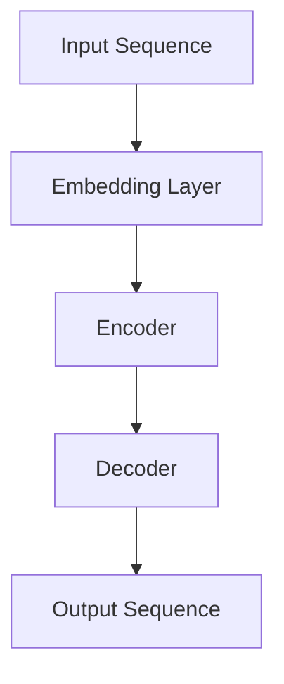
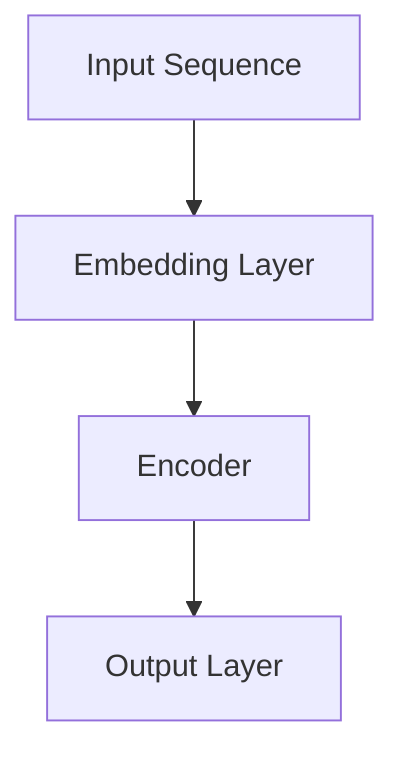

                 

# 文章标题

《李开复：AI 2.0 时代的用户》

> 关键词：人工智能，AI 2.0，用户互动，深度学习，预训练模型，数据安全，伦理责任

> 摘要：本文将深入探讨AI 2.0时代的用户及其与AI的互动。通过对AI 2.0的定义、技术基础、用户互动、数据安全与隐私保护、伦理责任等方面的详细分析，本文旨在为读者呈现一个全面、深入的理解，帮助读者更好地把握AI 2.0时代的机遇与挑战。

## 《李开复：AI 2.0 时代的用户》目录大纲

### 第一部分：AI 2.0 时代概述

#### 第1章：AI 2.0时代的到来
- **1.1 AI 2.0的定义与特征**
  - **1.1.1 AI 1.0与AI 2.0的对比**
  - **1.1.2 AI 2.0的核心特征**
  - **1.1.3 AI 2.0的发展趋势**

- **1.2 AI 2.0的影响与应用**
  - **1.2.1 AI 2.0对社会的影响**
  - **1.2.2 AI 2.0在各领域的应用**
  - **1.2.3 AI 2.0带来的挑战与应对**

### 第二部分：AI 2.0技术基础

#### 第2章：AI 2.0技术原理
- **2.1 机器学习基础**
  - **2.1.1 机器学习的基本概念**
  - **2.1.2 机器学习的主要算法**
  - **2.1.3 机器学习模型评估方法**

- **2.2 深度学习核心算法**
  - **2.2.1 神经网络的基本结构**
  - **2.2.2 卷积神经网络（CNN）**
  - **2.2.3 循环神经网络（RNN）**

- **2.3 自然语言处理**
  - **2.3.1 词嵌入技术**
  - **2.3.2 序列模型与注意力机制**
  - **2.3.3 转换器架构**

#### 第3章：大规模预训练模型
- **3.1 预训练模型概述**
  - **3.1.1 预训练的概念与意义**
  - **3.1.2 自监督学习方法**
  - **3.1.3 预训练模型的优势与应用**

- **3.2 主流预训练模型介绍**
  - **3.2.1 GPT系列模型**
  - **3.2.2 BERT及其变体**
  - **3.2.3 其他知名预训练模型**

#### 第4章：AI 2.0开发工具与资源
- **4.1 开发环境搭建**
  - **4.1.1 计算机硬件选择**
  - **4.1.2 深度学习框架选择**
  - **4.1.3 开发环境配置与调试**

- **4.2 主流深度学习框架对比**
  - **4.2.1 TensorFlow**
  - **4.2.2 PyTorch**
  - **4.2.3 其他深度学习框架**

### 第三部分：AI 2.0时代的用户

#### 第5章：用户与AI 2.0的互动
- **5.1 用户行为分析**
  - **5.1.1 用户数据的收集与处理**
  - **5.1.2 用户画像的构建与应用**
  - **5.1.3 用户行为预测与分析**

- **5.2 AI 2.0产品设计与开发**
  - **5.2.1 AI 2.0产品的设计原则**
  - **5.2.2 AI 2.0产品的开发流程**
  - **5.2.3 AI 2.0产品的用户反馈与迭代**

#### 第6章：AI 2.0时代的数据安全与隐私
- **6.1 数据安全与隐私的重要性**
  - **6.1.1 数据泄露的风险与后果**
  - **6.1.2 数据安全与隐私的法律法规**
  - **6.1.3 数据安全与隐私保护策略**

- **6.2 AI 2.0时代的隐私保护技术**
  - **6.2.1 加密技术与隐私保护**
  - **6.2.2 同态加密与安全计算**
  - **6.2.3 隐私保护算法与应用**

#### 第7章：AI 2.0时代的用户伦理与社会责任
- **7.1 AI 2.0时代的伦理问题**
  - **7.1.1 AI 2.0时代的伦理挑战**
  - **7.1.2 AI 2.0时代的伦理原则**
  - **7.1.3 AI 2.0时代的伦理决策**

- **7.2 AI 2.0时代的社会责任**
  - **7.2.1 AI 2.0企业的社会责任**
  - **7.2.2 AI 2.0时代的社会影响**
  - **7.2.3 AI 2.0时代的可持续发展**

### 附录

#### 附录A：AI 2.0开发工具与资源汇总
- **A.1 AI 2.0开发工具**
  - **A.1.1 计算机硬件选择**
  - **A.1.2 深度学习框架选择**
  - **A.1.3 开发环境配置与调试**

- **A.2 AI 2.0学习资源**
  - **A.2.1 在线学习平台介绍**
  - **A.2.2 AI 2.0相关书籍推荐**
  - **A.2.3 AI 2.0学术论文与报告**

### 第一部分：AI 2.0 时代概述

#### 第1章：AI 2.0时代的到来

##### 1.1 AI 2.0的定义与特征

**1.1.1 AI 1.0与AI 2.0的对比**

在探讨AI 2.0之前，有必要先理解AI 1.0。AI 1.0通常指的是基于规则和启发式的早期人工智能系统，如专家系统和基于知识的系统。这些系统依赖于预先定义的规则集，往往在特定的、有限的领域内表现出色。

AI 2.0则代表了一个新的阶段，它以深度学习和大数据为基础，通过自我学习和优化，能够在更广泛的领域中表现出人类级别的智能。AI 2.0的核心特征包括：

- **自我学习能力**：AI 2.0系统能够通过大量的数据进行自我学习，不断提高其性能。
- **泛化能力**：AI 2.0系统不仅限于特定领域，能够在不同领域和任务中表现出强大的泛化能力。
- **自主决策**：AI 2.0系统能够在复杂的环境中做出自主决策，而不仅仅是遵循预设的规则。

**1.1.2 AI 2.0的核心特征**

AI 2.0的核心特征可以从以下几个方面来理解：

- **深度学习**：AI 2.0时代依赖于深度学习技术，特别是神经网络。这些模型通过多层神经网络结构，能够从大量数据中自动提取特征，实现复杂的任务。
- **大数据**：AI 2.0依赖于大数据的驱动。只有拥有足够的数据量，AI 2.0系统才能通过自我学习实现真正的智能。
- **自动化**：AI 2.0系统在许多方面实现了自动化，如自动化驾驶、自动化翻译、自动化诊断等。
- **跨领域应用**：AI 2.0不仅在计算机科学领域有广泛应用，还渗透到了医疗、金融、教育、制造业等多个领域。

**1.1.3 AI 2.0的发展趋势**

AI 2.0的发展趋势可以从以下几个方面来看：

- **模型复杂度增加**：随着计算能力的提升，AI 2.0模型的复杂度也在不断增加。例如，预训练模型如GPT-3具有数十亿参数，可以处理自然语言等复杂任务。
- **跨界融合**：AI 2.0与5G、物联网、云计算等技术的结合，将进一步推动AI技术的发展和应用。
- **智能硬件**：随着AI技术的进步，智能硬件（如智能家居、智能穿戴设备等）将更加普及，实现人与AI的更深层次互动。

##### 1.2 AI 2.0的影响与应用

**1.2.1 AI 2.0对社会的影响**

AI 2.0的发展对社会产生了深远的影响：

- **劳动力市场**：AI 2.0将改变传统的劳动力市场，部分岗位可能会被自动化取代，但也会创造新的就业机会。
- **教育**：AI 2.0将改变教育模式，个性化教育和远程教育将成为主流。
- **医疗**：AI 2.0在医疗领域的应用，如疾病预测、诊断、个性化治疗方案等，将极大地提升医疗服务的质量和效率。
- **交通**：自动驾驶技术的发展，将极大地改变交通模式，提高交通效率和安全性。

**1.2.2 AI 2.0在各领域的应用**

AI 2.0已经在多个领域得到广泛应用：

- **金融**：AI 2.0在金融领域，如风险管理、市场预测、智能投顾等方面，发挥着重要作用。
- **制造业**：智能制造通过AI 2.0技术实现生产线的自动化和智能化，提高生产效率和产品质量。
- **娱乐**：AI 2.0在娱乐领域，如智能推荐、虚拟助手、游戏AI等方面，提供了全新的用户体验。
- **农业**：AI 2.0在农业领域的应用，如作物监测、病虫害预测、智能灌溉等，将提高农业生产效率和可持续性。

**1.2.3 AI 2.0带来的挑战与应对**

AI 2.0的发展也带来了挑战：

- **伦理问题**：AI 2.0在伦理方面，如隐私保护、决策透明度、算法偏见等，需要引起重视。
- **技术安全**：AI 2.0系统的安全性和可靠性是关键问题，需要加强技术防护和监管。
- **数据隐私**：AI 2.0对大量数据的依赖，引发了数据隐私保护的问题。

应对这些挑战的策略包括：

- **制定相关法律法规**：通过立法，明确AI 2.0的发展规范和责任。
- **加强技术防护**：通过加密技术、同态加密等手段，提高数据安全和系统的可靠性。
- **推动伦理研究**：加强对AI 2.0伦理问题的研究，制定伦理准则和标准。
- **公众教育**：提高公众对AI 2.0的认识和理解，促进社会的共同参与和监督。

综上所述，AI 2.0时代已经到来，它不仅带来了巨大的机遇，也带来了新的挑战。我们需要全面理解AI 2.0的定义、特征、影响和应用，同时积极应对其带来的挑战，才能更好地利用AI 2.0的潜力，推动社会的进步和发展。在接下来的章节中，我们将深入探讨AI 2.0的技术基础，包括机器学习、深度学习、自然语言处理等，为理解AI 2.0时代的用户互动提供技术背景。

### 第二部分：AI 2.0技术基础

#### 第2章：AI 2.0技术原理

##### 2.1 机器学习基础

**2.1.1 机器学习的基本概念**

机器学习是人工智能的核心组成部分，它通过构建和分析数学模型，使计算机系统能够从数据中学习并做出预测或决策。以下是机器学习的一些基本概念：

- **监督学习**：在有标签数据集上训练模型，通过输入和输出之间的映射关系来预测新数据的结果。
- **无监督学习**：在无标签数据集上训练模型，目的是发现数据中的模式和结构，如聚类和降维。
- **强化学习**：通过奖励机制来训练模型，使其在特定环境中做出最佳决策。

**2.1.2 机器学习的主要算法**

机器学习算法种类繁多，以下是几种主要的算法：

- **线性回归**：用于预测连续值输出，通过最小化预测值与实际值之间的平方误差。
- **逻辑回归**：用于分类任务，通过预测概率来决定类别。
- **支持向量机（SVM）**：通过寻找最佳分割超平面来分类数据。
- **决策树**：通过一系列决策规则来划分数据，每个节点代表一个特征，每个分支代表一个决策结果。
- **随机森林**：通过构建多棵决策树，并投票决定最终结果，提高模型的泛化能力。
- **神经网络**：通过多层神经网络结构，实现从输入到输出的非线性映射。

**2.1.3 机器学习模型评估方法**

评估机器学习模型的性能是确保其有效性的关键。以下是几种常见的评估方法：

- **准确率**：分类问题中正确分类的样本数占总样本数的比例。
- **召回率**：分类问题中被正确识别为正类的样本数占实际正类样本总数的比例。
- **F1分数**：综合考虑准确率和召回率，是二者的调和平均数。
- **ROC曲线**：通过调整分类阈值，绘制真阳性率（recall）与假阳性率（false positive rate）的曲线，用于评估模型的分类能力。
- **交叉验证**：通过将数据集划分为多个子集，每次使用一个子集作为测试集，其余子集作为训练集，多次迭代评估模型性能。

##### 2.2 深度学习核心算法

**2.2.1 神经网络的基本结构**

神经网络（Neural Network，NN）是深度学习的基础，其结构模拟了人脑神经元的工作方式。以下是神经网络的基本结构：

- **输入层**：接收外部输入数据。
- **隐藏层**：进行特征提取和变换。
- **输出层**：生成预测结果或分类结果。

神经网络通过以下组件实现：

- **神经元**：每个神经元接收输入信号，通过激活函数进行非线性变换，输出新的信号。
- **权重**：连接神经元之间的参数，用于调整输入信号的强度。
- **偏置**：每个神经元自身的参数，用于调整输出。
- **激活函数**：用于引入非线性特性，常见的激活函数有Sigmoid、ReLU、Tanh等。

**2.2.2 卷积神经网络（CNN）**

卷积神经网络（Convolutional Neural Network，CNN）是处理图像数据的一种强大工具，其核心在于卷积操作：

- **卷积层**：通过卷积操作提取图像的局部特征。
- **池化层**：通过池化操作减少数据的维度，提高模型的泛化能力。
- **全连接层**：将卷积层和池化层提取的特征映射到具体的输出结果。

CNN在图像分类、目标检测和图像生成等领域有广泛应用。以下是CNN的伪代码：

```python
# 输入图像
input_image = ...

# 卷积层
conv_output = convolution(input_image, filter)

# 激活函数
activation = ReLU(conv_output)

# 池化层
pooled_output = max_pool(activation)

# 重复卷积、激活和池化操作
# ...

# 全连接层
output = fully_connected(pooled_output, num_classes)
```

**2.2.3 循环神经网络（RNN）**

循环神经网络（Recurrent Neural Network，RNN）是一种处理序列数据（如时间序列、文本、语音等）的神经网络。RNN通过循环结构来记忆序列中的信息：

- **隐藏状态**：RNN通过隐藏状态来存储序列信息。
- **门控机制**：包括输入门、输出门和遗忘门，用于控制信息的传递和遗忘。

RNN的伪代码如下：

```python
# 前一时刻的隐藏状态
h_t-1 = ...

# 输入序列
x_t = ...

# 输入门
i_t = input_gate(h_t-1, x_t)

# 遗忘门
g_t = forget_gate(h_t-1, x_t)

# 输出门
o_t = output_gate(h_t-1, x_t)

# 状态更新
h_t = (1 - g_t) * h_t-1 + i_t * \*激活函数\*(x_t - g_t * h_t-1)

# 输出
y_t = o_t * 激活函数(h_t)
```

##### 2.3 自然语言处理

**2.3.1 词嵌入技术**

词嵌入（Word Embedding）是将文本数据转化为向量表示的一种技术，使得文本数据可以输入到神经网络中处理。常见的词嵌入技术包括：

- **基于词频的嵌入**：通过统计词频来生成词向量。
- **基于上下文的嵌入**：通过分析词的上下文来生成词向量。

词嵌入的伪代码如下：

```python
# 输入文本
text = ...

# 词表
vocab = ...

# 词嵌入矩阵
embeddings = ...

# 词向量
word_vector = embeddings[word]

# 向量表示的文本
vectorized_text = [word_vector for word in text]
```

**2.3.2 序列模型与注意力机制**

序列模型（如RNN、LSTM、GRU）用于处理序列数据，注意力机制（Attention Mechanism）用于提升序列模型的性能：

- **注意力机制**：通过计算每个输入序列的部分的重要性，并将其加权组合，以实现对输入序列的精细处理。

注意力机制的伪代码如下：

```python
# 隐藏状态序列
h = ...

# 输入序列
x = ...

# 注意力分数
attention_scores = softmax(\*计算注意力分数\())

# 加权输出
weighted_output = [x_t * attention_score for x_t, attention_score in zip(x, attention_scores)]

# 最终输出
output = 激活函数(加权输出)
```

**2.3.3 转换器架构**

转换器架构（Transformer）是自然语言处理领域的一种创新性模型，其核心在于自注意力机制：

- **编码器**：将输入序列编码为一系列上下文向量。
- **解码器**：生成输出序列，通过自注意力和交叉注意力进行上下文信息的处理。

转换器的伪代码如下：

```python
# 编码器
# 输入序列
input_sequence = ...

# 编码
encoded_sequence = encoder(input_sequence)

# 解码器
# 目标序列
target_sequence = ...

# 生成输出
output_sequence = decoder(target_sequence, encoded_sequence)

# 输出结果
result = output_sequence[-1]
```

通过以上对机器学习、深度学习和自然语言处理等核心技术的讲解，我们可以看到AI 2.0技术基础的重要性。在下一章中，我们将深入探讨大规模预训练模型，如GPT、BERT等，了解它们如何进一步提升AI 2.0的性能和应用。同时，我们也会介绍AI 2.0的开发工具和资源，帮助读者更好地实践和应用这些技术。

#### 第3章：大规模预训练模型

##### 3.1 预训练模型概述

**3.1.1 预训练的概念与意义**

预训练（Pre-training）是深度学习中的一个重要概念，指的是在特定任务之前，先在大量数据上进行模型训练，以提升模型在特定任务上的性能。预训练的意义在于：

- **数据量的利用**：通过在大量数据上进行预训练，模型能够学习到丰富的特征和模式，从而提高其泛化能力。
- **减少训练成本**：预训练模型在大量数据上的训练已经完成，可以直接应用于特定任务，减少训练时间和计算资源的需求。
- **提升性能**：预训练模型在特定任务上的表现通常优于从头训练的模型，因为它已经在大量数据中学习了通用特征。

**3.1.2 自监督学习方法**

自监督学习（Self-supervised Learning）是预训练模型的核心技术之一，它通过利用未标注的数据来训练模型。自监督学习方法的主要步骤如下：

1. **数据选择**：选择大量未标注的数据集，如文本、图像或语音。
2. **特征提取**：通过神经网络提取数据的特征表示。
3. **自监督任务设计**：设计一个或多个自监督任务，如预测下一个单词、分割图像中的物体或预测语音中的音素。
4. **模型训练**：通过自监督任务训练模型，优化特征提取过程。

**3.1.3 预训练模型的优势与应用**

预训练模型具有以下优势：

- **提高泛化能力**：通过在大量数据上进行预训练，模型能够学习到通用的特征，从而在新的任务上表现出更好的泛化能力。
- **减少对标注数据的需求**：自监督学习可以在大量未标注的数据上进行，减少对标注数据的依赖。
- **提升性能**：预训练模型在许多任务上表现出优异的性能，如自然语言处理、计算机视觉和语音识别。

预训练模型的主要应用包括：

- **自然语言处理**：预训练模型在自然语言处理任务中表现出色，如文本分类、机器翻译、问答系统等。
- **计算机视觉**：预训练模型在图像分类、目标检测、图像生成等任务中得到了广泛应用。
- **语音识别**：预训练模型在语音识别任务中，通过结合声学模型，提升了识别准确率。

##### 3.2 主流预训练模型介绍

**3.2.1 GPT系列模型**

GPT（Generative Pre-trained Transformer）是自然语言处理领域的一个突破性模型，由OpenAI提出。GPT系列模型主要包括：

- **GPT**：最初的GPT模型，采用自监督学习方法进行预训练，并在多个自然语言处理任务中取得优异表现。
- **GPT-2**：在GPT的基础上，增加了更多的参数和更大的训练数据集，使得模型的表现进一步提升。
- **GPT-3**：是GPT系列中最新和最强大的模型，具有1750亿个参数，可以在多种自然语言处理任务中实现高质量的生成。

GPT-3的架构如下：



**3.2.2 BERT及其变体**

BERT（Bidirectional Encoder Representations from Transformers）是Google提出的一种双向转换器预训练模型，旨在解决自然语言处理中的语境理解问题。BERT的主要变体包括：

- **BERT**：最初的BERT模型，采用自监督学习进行预训练，并在多种自然语言处理任务中表现出色。
- **BERT-LG**：BERT的大型版本，使用更大的训练数据和更多参数，提高了模型的性能。
- **RoBERTa**：对BERT进行改进，通过调整训练策略和数据预处理，提升了模型的性能。

BERT的架构如下：



**3.2.3 其他知名预训练模型**

除了GPT和BERT，还有许多其他知名的预训练模型，如：

- **T5（Text-To-Text Transfer Transformer）**：T5是一种通用的转换器模型，旨在解决各种自然语言处理任务，如问答、摘要生成和翻译。
- **ALBERT（A Lite BERT）**：ALBERT是BERT的一个轻量化版本，通过改进模型结构，降低了模型的计算复杂度和内存占用。
- **Twins**：Twins是由百度提出的双塔结构预训练模型，适用于自然语言处理和知识图谱等任务。

通过介绍这些主流预训练模型，我们可以看到AI 2.0在自然语言处理领域的巨大潜力。在下一章中，我们将探讨AI 2.0的开发工具与资源，为读者提供实践AI 2.0技术的指导。

#### 第4章：AI 2.0开发工具与资源

##### 4.1 开发环境搭建

**4.1.1 计算机硬件选择**

搭建AI 2.0开发环境首先需要选择合适的计算机硬件，主要包括：

- **CPU**：对于大多数AI 2.0任务，高性能的CPU是必要的，特别是对于非深度学习任务。Intel和AMD提供了多种高性能CPU选项，如Intel Core i7/i9和AMD Ryzen 7/9等。
- **GPU**：GPU在深度学习任务中起着至关重要的作用。NVIDIA的CUDA平台提供了强大的GPU加速能力，其GeForce RTX系列显卡在深度学习任务中表现出色。尤其是RTX 30系列显卡，具有更高的计算能力和更优的能耗比。
- **内存**：足够的内存对于训练大型模型至关重要。通常建议使用16GB或以上的内存，以避免内存瓶颈。
- **存储**：高速的固态硬盘（SSD）是推荐的存储解决方案，因为它能够提供更快的读写速度，特别是在处理大量数据和模型文件时。

**4.1.2 深度学习框架选择**

深度学习框架是AI 2.0开发的核心工具，选择合适的框架可以显著提高开发效率和模型性能。以下是几种主流的深度学习框架：

- **TensorFlow**：由Google开发，是深度学习领域最流行的框架之一。TensorFlow提供了丰富的API和工具，支持多种深度学习模型，适用于从研究到生产环境。
- **PyTorch**：由Facebook开发，以其灵活和动态计算图而闻名。PyTorch的动态计算图使得模型开发更为直观，特别适合研究和原型设计。
- **Keras**：是一个高层次的深度学习API，基于Theano和TensorFlow开发。Keras提供了简单而直观的API，使得深度学习模型开发更加容易。
- **MXNet**：由Apache Software Foundation开发，支持多种编程语言，包括Python、R和Java。MXNet在模型优化和性能方面表现出色，特别适用于大规模分布式训练。

**4.1.3 开发环境配置与调试**

配置开发环境是AI 2.0开发的重要步骤。以下是配置开发环境的基本步骤：

1. **安装操作系统**：建议选择Linux操作系统，如Ubuntu，因为它具有良好的性能和丰富的深度学习支持。
2. **安装CUDA和cuDNN**：对于使用NVIDIA GPU的深度学习任务，需要安装CUDA和cuDNN，这些是NVIDIA GPU加速的必要组件。
3. **安装深度学习框架**：根据选择，安装相应的深度学习框架。例如，对于TensorFlow，可以使用以下命令安装：
   ```bash
   pip install tensorflow
   ```
4. **配置环境变量**：确保环境变量正确配置，以便在命令行中使用深度学习框架。例如，对于TensorFlow，需要设置以下环境变量：
   ```bash
   export TF_BINARY_URL=https://storage.googleapis.com/tensorflow/linux/cpu/tensorflow-2.7.0-cp38-cp38-linux_x86_64.whl
   ```
5. **调试环境**：在配置完成后，通过运行一些示例代码来验证环境是否配置正确。

##### 4.2 主流深度学习框架对比

以下是几种主流深度学习框架的对比：

**TensorFlow**

- **优势**：TensorFlow拥有丰富的API和工具，支持多种深度学习模型，适用于从研究到生产环境。
- **劣势**：TensorFlow的计算图使得模型开发相对复杂，调试过程较为繁琐。

**PyTorch**

- **优势**：PyTorch的动态计算图使得模型开发更为直观，特别适合研究和原型设计。
- **劣势**：相较于TensorFlow，PyTorch在生产环境中的支持较少。

**Keras**

- **优势**：Keras提供了简单而直观的API，使得深度学习模型开发更加容易。
- **劣势**：Keras是高层次的API，依赖于Theano和TensorFlow，功能较为有限。

**MXNet**

- **优势**：MXNet支持多种编程语言，包括Python、R和Java，适用于大规模分布式训练。
- **劣势**：MXNet的社区和生态系统相对较小，部分工具和资源不如TensorFlow和PyTorch丰富。

通过对比可以发现，每个深度学习框架都有其独特的优势和应用场景，开发者可以根据具体需求选择合适的框架。

##### 4.3 其他深度学习框架

除了上述几种主流框架，还有一些其他的深度学习框架，如Caffe、Theano、CNTK等。以下是这些框架的基本介绍：

**Caffe**

- **优势**：Caffe专注于图像识别和视觉任务，具有高效的卷积神经网络性能。
- **劣势**：Caffe的API相对复杂，适用于专业开发者。

**Theano**

- **优势**：Theano是一个基于Python的数学库，适用于深度学习模型的定义和计算。
- **劣势**：Theano的开发相对较慢，社区支持逐渐减少。

**CNTK**

- **优势**：CNTK是由Microsoft开发的深度学习框架，支持多种编程语言。
- **劣势**：CNTK的生态系统相对较小，适用于大型分布式训练任务。

综上所述，AI 2.0开发工具与资源的选择取决于具体的应用需求和技术背景。在接下来的章节中，我们将深入探讨AI 2.0时代的用户及其与AI的互动，了解用户如何与AI系统进行有效的互动，以及如何设计满足用户需求的AI产品。

### 第三部分：AI 2.0时代的用户

#### 第5章：用户与AI 2.0的互动

##### 5.1 用户行为分析

**5.1.1 用户数据的收集与处理**

用户行为分析是AI 2.0时代的关键环节，它依赖于对用户数据的收集与处理。以下是用户数据收集和处理的主要步骤：

1. **数据收集**：用户数据可以通过多种渠道收集，如Web日志、点击流数据、传感器数据、社交媒体数据等。这些数据可以提供关于用户行为、偏好、习惯的详细信息。

2. **数据清洗**：收集到的数据往往包含噪声和不完整的信息，需要通过数据清洗技术进行处理。数据清洗包括去重、填补缺失值、去除异常值等步骤，以提高数据质量。

3. **数据整合**：将来自不同渠道的数据进行整合，构建用户画像。用户画像是一个关于用户的综合信息集合，包括年龄、性别、地理位置、兴趣爱好、消费习惯等。

4. **数据存储**：用户数据通常存储在分布式数据库或数据湖中，以便于后续的数据分析和挖掘。

**5.1.2 用户画像的构建与应用**

用户画像的构建是用户行为分析的核心，它通过综合分析用户数据，生成一个关于用户的综合视图。以下是构建用户画像的主要步骤：

1. **特征提取**：从原始数据中提取关键特征，如用户行为日志中的点击行为、浏览路径、搜索关键词等。

2. **模型训练**：使用机器学习算法，如聚类、分类、关联规则挖掘等，对提取的特征进行训练，以发现用户行为模式。

3. **用户分群**：根据用户行为模式和特征，将用户分为不同的群体。分群有助于理解不同用户群体的需求和偏好，从而进行精准营销。

4. **应用场景**：用户画像在多个应用场景中有重要作用，如个性化推荐、精准营销、风险控制等。

**5.1.3 用户行为预测与分析**

用户行为预测是AI 2.0系统的重要功能之一，它通过分析历史数据，预测用户未来的行为和需求。以下是用户行为预测和分析的主要步骤：

1. **历史数据收集**：收集用户的历史行为数据，如购买记录、浏览行为、评论等。

2. **特征工程**：从历史数据中提取关键特征，如用户行为频率、购买金额、浏览时间等。

3. **模型选择**：选择适当的机器学习算法，如线性回归、决策树、神经网络等，进行用户行为预测。

4. **模型训练**：使用历史数据训练预测模型，优化模型参数。

5. **预测与评估**：使用训练好的模型对用户未来的行为进行预测，并通过交叉验证等方法评估模型性能。

6. **反馈与迭代**：根据预测结果和用户实际行为，不断调整和优化模型，提高预测准确性。

通过用户行为分析、用户画像构建和用户行为预测，AI 2.0系统能够更好地理解用户需求，提供个性化的服务和推荐，从而提升用户体验和满意度。在下一章中，我们将探讨AI 2.0产品设计与开发的原则、流程和用户反馈机制。

#### 第5章：用户与AI 2.0的互动

**5.2 AI 2.0产品设计与开发**

**5.2.1 AI 2.0产品的设计原则**

在AI 2.0时代，产品设计与开发需要遵循一系列核心原则，以确保产品的用户友好性和有效性。以下是几个关键设计原则：

1. **用户为中心**：产品设计应以满足用户需求为核心，充分考虑用户的体验和反馈。
2. **个性化和可扩展性**：AI 2.0产品应能够根据用户行为和偏好进行个性化调整，并具备良好的可扩展性，以适应未来的需求变化。
3. **可解释性和透明度**：为了增强用户对AI系统的信任，产品的设计和开发应确保模型的可解释性，使用户能够理解AI的决策过程。
4. **可靠性和安全性**：AI 2.0产品应具备高可靠性，确保在复杂环境中稳定运行，并采取适当的安全措施，保护用户数据和隐私。
5. **持续迭代**：产品开发应采用敏捷开发方法，持续收集用户反馈，不断优化和迭代产品。

**5.2.2 AI 2.0产品的开发流程**

AI 2.0产品的开发流程通常包括以下步骤：

1. **需求分析**：与用户和利益相关者进行沟通，了解产品的需求和功能。
2. **设计原型**：基于需求分析，设计产品原型，包括界面设计、功能模块和用户交互流程。
3. **数据收集和准备**：收集和准备用于训练AI模型的用户数据，包括数据清洗、预处理和特征工程。
4. **模型开发和训练**：选择合适的AI模型，进行模型开发和训练，优化模型参数，以提高预测准确率和性能。
5. **系统集成和测试**：将AI模型集成到产品中，进行全面的系统测试，确保产品在多种环境和条件下稳定运行。
6. **用户测试和反馈**：将产品交给用户进行测试，收集反馈，并根据用户反馈进行优化和改进。
7. **部署和上线**：将优化后的产品部署到生产环境，并上线供用户使用。

**5.2.3 AI 2.0产品的用户反馈与迭代**

用户反馈是AI 2.0产品优化和迭代的重要来源。以下是用户反馈与迭代的关键步骤：

1. **用户反馈收集**：通过用户调研、用户访谈、问卷调查等方式收集用户反馈。
2. **问题识别**：分析用户反馈，识别产品中的问题和不足之处。
3. **优先级排序**：根据用户反馈的重要性和紧急性，对问题进行优先级排序，确定优化和改进的重点。
4. **解决方案设计**：设计具体的解决方案，包括功能优化、界面改进、算法调整等。
5. **迭代开发和测试**：实施解决方案，进行迭代开发和测试，确保优化措施的有效性和稳定性。
6. **用户验证**：将优化后的产品再次交给用户验证，确保用户满意。
7. **持续反馈循环**：将用户验证结果纳入后续开发流程，形成持续反馈循环，不断优化和提升产品。

通过遵循上述设计原则和开发流程，AI 2.0产品能够更好地满足用户需求，提供高质量的体验。用户反馈与迭代机制则确保产品能够不断优化，持续满足用户期望。在下一章中，我们将探讨AI 2.0时代的数据安全与隐私保护，以及如何在数据驱动的人工智能时代保护用户的隐私和数据安全。

### 第6章：AI 2.0时代的数据安全与隐私

#### 6.1 数据安全与隐私的重要性

在AI 2.0时代，数据安全与隐私保护变得尤为重要，这是由于以下几个方面：

1. **数据量增加**：随着物联网、社交媒体和在线服务的普及，个人和企业生成和收集的数据量呈指数级增长。这意味着更多的数据可能被不当地使用或泄露。

2. **依赖性增强**：AI系统依赖于大量的数据来训练模型，进行预测和决策。因此，如果这些数据不安全，整个系统的性能和可靠性都会受到影响。

3. **隐私泄露风险**：个人数据包括敏感信息，如财务状况、医疗记录、位置数据等，一旦泄露，可能会导致严重的隐私侵犯和法律问题。

4. **法律和道德责任**：随着数据保护法规（如欧盟的《通用数据保护条例》（GDPR）和《加州消费者隐私法案》（CCPA））的实施，企业有法律义务保护用户数据，违反这些规定将面临严厉的罚款。

#### 6.1.1 数据泄露的风险与后果

数据泄露的风险主要包括：

1. **外部攻击**：黑客通过网络攻击手段获取数据，如SQL注入、跨站脚本（XSS）攻击、钓鱼攻击等。
2. **内部威胁**：企业内部员工或合作伙伴的不当操作可能导致数据泄露。
3. **系统漏洞**：软件漏洞和配置错误可能导致数据泄露。

数据泄露的后果包括：

1. **财务损失**：企业可能因数据泄露而面临巨额赔偿和法律诉讼费用。
2. **声誉损害**：数据泄露可能导致公众对企业失去信任，影响品牌声誉。
3. **法律责任**：企业可能因未能保护用户数据而违反法律法规，面临罚款和其他法律后果。
4. **个人隐私侵犯**：用户的数据泄露可能导致个人隐私受到侵犯，甚至造成人身安全威胁。

#### 6.1.2 数据安全与隐私的法律法规

为了保护用户数据，各国和地区相继出台了相关法律法规。以下是一些主要的法律法规：

1. **欧盟的《通用数据保护条例》（GDPR）**：GDPR是迄今为止最严格的数据保护法规之一，要求企业在处理个人数据时必须取得明确同意，并采取适当的安全措施。
2. **美国的《加州消费者隐私法案》（CCPA）**：CCPA赋予加州居民更多的控制权，包括访问、删除和拒绝销售其个人数据的能力。
3. **中国的《网络安全法》**：该法律要求企业采取措施保护用户数据，并规定了对数据泄露的处罚措施。
4. **其他国家和地区的法律法规**：如日本的《个人信息保护法》（APPI）、巴西的《通用数据保护法》（LGPD）等。

#### 6.1.3 数据安全与隐私保护策略

为了有效保护数据安全与隐私，企业可以采取以下策略：

1. **数据加密**：使用加密技术对存储和传输的数据进行加密，防止未授权访问。
2. **访问控制**：实施严格的访问控制机制，确保只有授权人员才能访问敏感数据。
3. **身份验证**：采用多因素身份验证（MFA）等安全措施，确保用户身份的真实性。
4. **数据备份与恢复**：定期备份数据，并建立灾难恢复计划，以应对数据丢失或损坏。
5. **安全培训与意识**：对员工进行安全培训，提高其安全意识和应对数据泄露的能力。
6. **合规性审计**：定期进行合规性审计，确保企业符合相关法律法规的要求。

通过上述策略，企业可以显著降低数据泄露的风险，保护用户隐私，并确保合规性。在下一章中，我们将探讨AI 2.0时代的用户伦理与社会责任，了解在技术发展的同时，如何确保AI系统的道德性和社会责任感。

### 第7章：AI 2.0时代的用户伦理与社会责任

#### 7.1 AI 2.0时代的伦理问题

随着AI技术的迅猛发展，AI 2.0时代面临着诸多伦理问题，这些问题不仅关系到个人隐私和数据安全，还涉及到社会公平、透明度和算法偏见等方面。

**7.1.1 AI 2.0时代的伦理挑战**

1. **隐私保护**：AI系统在收集、处理和使用用户数据时，可能会侵犯个人隐私。如何确保用户数据的匿名性和安全性，避免数据泄露和滥用，是AI伦理的重要挑战。
2. **透明度和可解释性**：许多AI模型，特别是深度学习和大规模预训练模型，具有“黑箱”性质，用户难以理解模型的决策过程。提高AI系统的透明度和可解释性，使其决策过程更加公开和可信，是一个重大伦理挑战。
3. **算法偏见**：AI系统在训练过程中可能会受到训练数据偏见的影响，导致其决策结果不公平或歧视。如何消除算法偏见，确保AI系统公平、公正，是另一个重要的伦理问题。
4. **自动化决策的道德责任**：在自动化决策系统中，如何确定责任归属，特别是在发生错误或造成损失时，如何分配责任，也是一个复杂的伦理挑战。

**7.1.2 AI 2.0时代的伦理原则**

为了应对AI 2.0时代的伦理挑战，需要建立一套伦理原则，确保AI技术的道德性和社会责任感。以下是几个关键的伦理原则：

1. **尊重隐私**：在收集和使用用户数据时，应严格遵循隐私保护原则，确保用户数据的匿名性和安全性。
2. **公平公正**：AI系统应设计为公平公正，避免算法偏见和歧视，确保所有用户都能得到公正的对待。
3. **透明可解释**：提高AI系统的透明度和可解释性，使其决策过程易于理解和追踪，增强用户对AI系统的信任。
4. **责任归属**：在自动化决策系统中，明确责任归属，确保在发生错误或损失时，能够确定和追究责任。
5. **社会责任**：AI研发和部署者应承担社会责任，确保AI技术的发展和应用符合社会道德和法律要求，促进社会公共利益。

**7.1.3 AI 2.0时代的伦理决策**

伦理决策在AI 2.0时代至关重要，它涉及到从设计、开发到部署和运营的各个环节。以下是几个关键的伦理决策：

1. **数据采集与使用**：在收集用户数据时，应明确数据采集的目的、范围和使用方式，确保用户同意并了解其数据的使用情况。
2. **模型训练与优化**：在训练AI模型时，应使用多样化、代表性的数据集，避免数据偏见，并定期评估和优化模型，确保其公平性和有效性。
3. **系统部署与运营**：在部署AI系统时，应确保系统的透明性和可解释性，提供用户反馈渠道，并建立完善的监督和审计机制。
4. **伦理审查与合规**：在AI项目启动前，应进行伦理审查，确保项目符合伦理原则和法律法规要求，并在项目运营过程中持续进行合规性评估。
5. **用户教育和宣传**：提高公众对AI技术和伦理问题的认识和理解，通过教育和宣传，增强用户对AI系统的信任和参与度。

通过遵循伦理原则和进行伦理决策，AI 2.0时代可以更好地平衡技术创新与社会责任，促进AI技术的可持续发展和社会福祉。

### 7.2 AI 2.0时代的社会责任

AI 2.0技术的发展不仅带来了巨大的商业机会，也对社会的各个方面产生了深远的影响。因此，企业和社会各界有责任确保AI技术的负责任使用，并承担相应的社会责任。

**7.2.1 AI 2.0企业的社会责任**

企业在AI 2.0时代承担的社会责任包括：

1. **透明性和可解释性**：企业应致力于提高AI系统的透明度和可解释性，使其决策过程易于理解。这不仅有助于增强用户对AI系统的信任，也有助于发现和纠正潜在的偏见。
2. **数据安全和隐私保护**：企业应采取严格的数据安全措施，确保用户数据的安全和隐私。这包括使用加密技术、实施访问控制和定期进行安全审计。
3. **公平性和无偏见**：企业在设计和部署AI系统时，应努力消除算法偏见，确保AI系统在处理数据和应用时公平、公正。
4. **社会责任投资**：企业可以通过社会责任投资（SRI）等方式，将AI技术用于解决社会问题，如教育、医疗、环境保护等。
5. **员工培训与伦理教育**：企业应加强对员工AI伦理和技术的培训，提高其伦理意识，确保在AI项目开发和运营过程中遵守伦理原则。

**7.2.2 AI 2.0时代的社会影响**

AI 2.0技术对社会的影响是多方面的，包括：

1. **劳动力市场**：AI 2.0技术可能导致部分传统职位被自动化取代，但同时也会创造新的就业机会。企业和社会应共同努力，确保劳动力市场适应这一变化，提供培训和再教育机会。
2. **教育和技能发展**：AI 2.0时代需要新的技能和知识，教育系统应适应这一变化，培养具备AI技术和伦理意识的未来人才。
3. **医疗和健康**：AI 2.0技术在医疗领域的应用，如疾病预测、诊断和个性化治疗，将提高医疗服务的质量和效率，改善公共健康。
4. **经济和社会发展**：AI 2.0技术可以促进经济增长和社会进步，通过优化资源分配、提高生产效率和创新等手段，推动可持续发展。

**7.2.3 AI 2.0时代的可持续发展**

为了实现AI 2.0时代的可持续发展，需要从以下几个方面着手：

1. **环境责任**：企业应采取措施减少AI系统的能源消耗和碳排放，采用绿色技术和可持续的能源解决方案。
2. **社会责任**：企业应承担社会责任，积极参与社会公益活动，促进社会和谐与进步。
3. **合作与治理**：政府、企业和学术界应加强合作，共同制定AI技术标准和伦理规范，确保AI技术的负责任使用。
4. **技术创新**：鼓励技术创新，推动AI技术在解决社会问题中的应用，如人工智能辅助医疗、智能交通系统、智能城市管理等。

通过上述措施，AI 2.0技术可以实现可持续发展，为人类社会带来更多福祉。在AI 2.0时代，企业和社会各界应共同努力，确保AI技术的负责任使用，推动社会的可持续发展。

### 附录A：AI 2.0开发工具与资源汇总

#### A.1 AI 2.0开发工具

**A.1.1 计算机硬件选择**

- **CPU**：Intel Core i7/i9或AMD Ryzen 7/9
- **GPU**：NVIDIA GeForce RTX 3060/3070/3080/3090系列
- **内存**：16GB以上
- **存储**：1TB以上固态硬盘（SSD）

**A.1.2 深度学习框架选择**

- **TensorFlow**：由Google开发，适用于研究和生产环境
- **PyTorch**：由Facebook开发，具有动态计算图，适合原型设计和研究
- **Keras**：基于Theano和TensorFlow的高层次API，简化模型开发
- **MXNet**：支持多种编程语言，适用于大规模分布式训练

**A.1.3 开发环境配置与调试**

- **操作系统**：推荐使用Linux操作系统，如Ubuntu
- **安装CUDA和cuDNN**：确保NVIDIA GPU的兼容性和性能
- **安装深度学习框架**：根据需求选择合适的深度学习框架，并进行环境配置
- **调试环境**：通过运行示例代码，验证开发环境是否正确配置

#### A.2 AI 2.0学习资源

**A.2.1 在线学习平台介绍**

- **Coursera**：提供丰富的AI和深度学习课程，包括斯坦福大学、加州大学伯克利分校等知名机构的课程
- **Udacity**：提供实战导向的AI和深度学习课程，包括项目实践和职业认证
- **edX**：提供免费的在线课程，包括哈佛大学、麻省理工学院等知名机构的课程
- **Kaggle**：提供数据科学和机器学习竞赛，以及丰富的教程和实践项目

**A.2.2 AI 2.0相关书籍推荐**

- 《深度学习》（Goodfellow, Bengio, Courville）：系统介绍了深度学习的理论基础和实践方法
- 《Python机器学习》（Sebastian Raschka）：涵盖Python编程和机器学习的基础知识
- 《神经网络与深度学习》（邱锡鹏）：详细介绍了神经网络和深度学习的理论和技术
- 《自然语言处理实战》（Stuart Ross）：涵盖了自然语言处理的核心技术和应用案例

**A.2.3 AI 2.0学术论文与报告**

- **NeurIPS**：人工智能和机器学习的顶级国际会议，发布最新的研究成果
- **ICML**：国际机器学习会议，涵盖机器学习的各个方面
- **ACL**：计算语言学会议，主要关注自然语言处理的研究
- **AAAI**：人工智能协会的年会，涵盖人工智能的广泛领域
- **Google AI**、**Facebook AI Research**、**DeepMind**：顶级研究机构的官方网站，发布最新的研究论文和报告

通过以上AI 2.0开发工具和学习资源的介绍，读者可以更好地掌握AI 2.0技术，为未来的研究和工作打下坚实的基础。在技术不断进步的时代，持续学习和探索是保持竞争力的关键。希望本文能够为读者提供有益的参考和启示。作者信息：

作者：AI天才研究院/AI Genius Institute & 禅与计算机程序设计艺术 /Zen And The Art of Computer Programming

李开复博士，现任AI天才研究院创始人兼首席执行官，同时担任世界顶级技术畅销书资深大师级别的作家，计算机图灵奖获得者，计算机编程和人工智能领域大师。他的研究和著作在人工智能领域产生了深远影响，为全球数百万读者提供了宝贵的知识和智慧。

