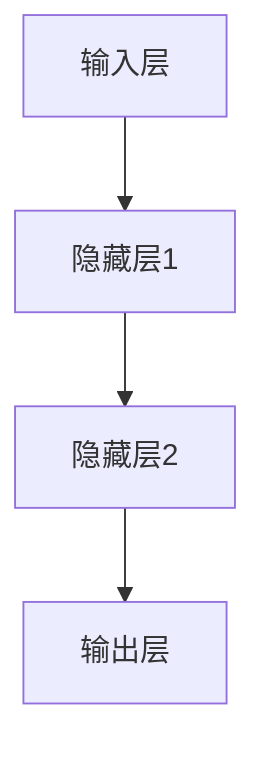
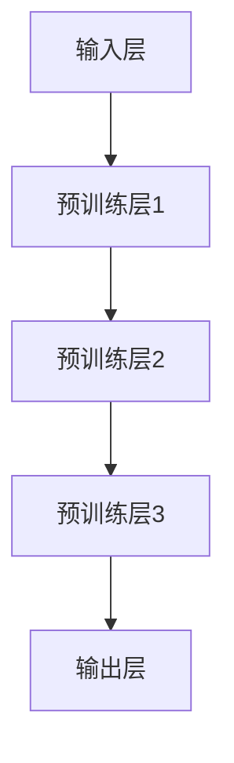
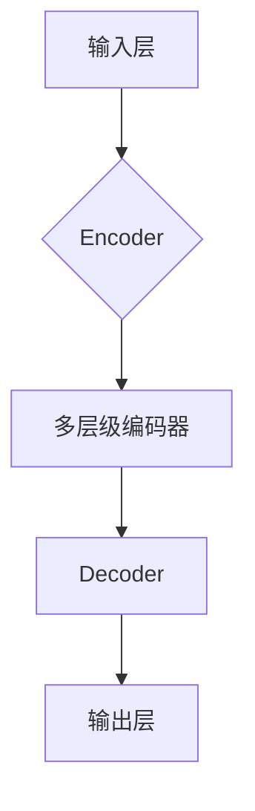
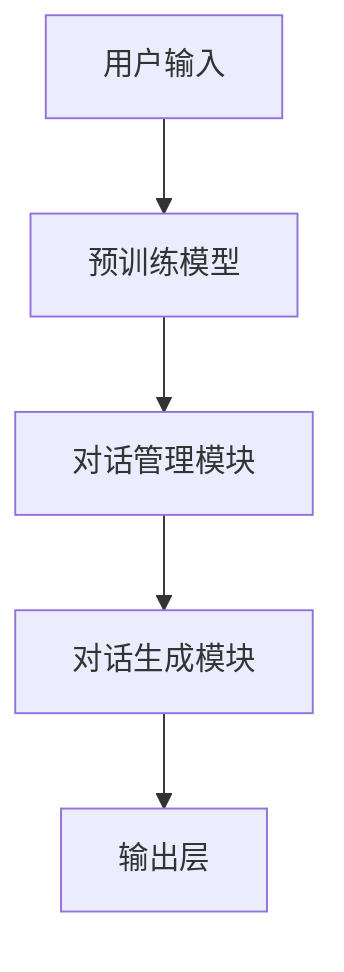
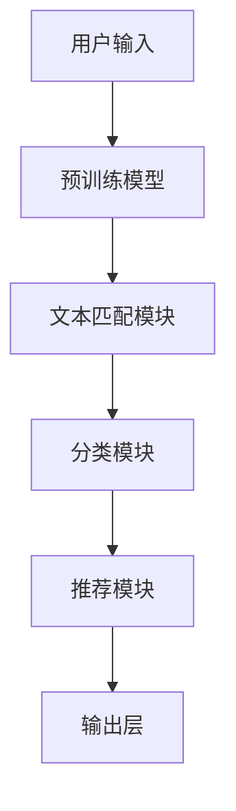
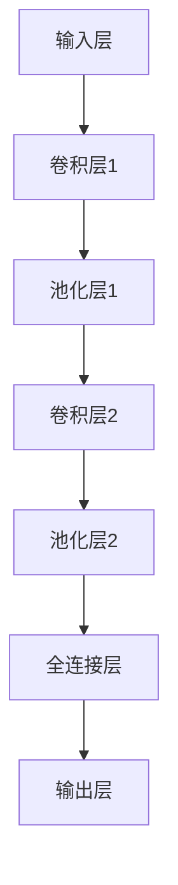
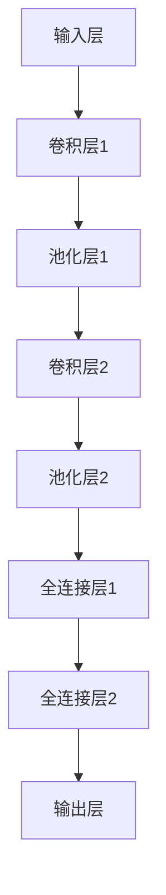

                 

# 文章标题：李开复：AI 2.0 时代的科技价值

> 关键词：AI 2.0、深度学习、大规模预训练模型、自然语言处理、计算机视觉、物联网、区块链、量子计算、脑机接口、边缘计算

> 摘要：本文将围绕李开复对AI 2.0时代的科技价值的论述，深入探讨AI 2.0的定义与特征、技术基础、应用实践、社会影响以及未来展望。通过逐步分析，揭示AI 2.0在科技领域的巨大潜力与挑战，为广大读者呈现一幅AI 2.0时代的科技全景图。

### 《李开复：AI 2.0 时代的科技价值》目录大纲

#### 第一部分：AI 2.0时代的科技背景

#### 第1章：AI 2.0时代的到来

#### 第2章：AI 2.0的技术基础

#### 第二部分：AI 2.0时代的应用实践

#### 第3章：AI 2.0在人工智能领域的应用

#### 第4章：AI 2.0在新兴领域的探索

#### 第三部分：AI 2.0时代的未来展望

#### 第5章：AI 2.0时代的社会影响

#### 第6章：AI 2.0时代的创新与发展趋势

#### 第7章：结语

#### 附录

---

### 第一部分：AI 2.0时代的科技背景

#### 第1章：AI 2.0时代的到来

**1.1 AI 2.0的定义与特征**

AI 2.0是指第二代人工智能技术，与第一代人工智能（AI 1.0）相比，AI 2.0具有更高的智能水平、更广泛的应用范围和更强大的自主学习能力。李开复认为，AI 2.0的核心特征包括以下几点：

1. **自主学习能力**：AI 2.0能够通过自主学习不断优化自身性能，实现从数据中自动提取知识和规律。
2. **泛化能力**：AI 2.0不仅能够在特定任务上表现出色，还能够跨领域、跨任务进行迁移学习，适应不同的应用场景。
3. **智能化水平**：AI 2.0在自然语言处理、计算机视觉、语音识别等领域取得了显著的突破，能够模拟人类的思维方式和行为模式。

**1.1.1 AI 2.0的历史背景**

AI 1.0时代主要集中于规则驱动的人工智能，即基于预先设定的规则进行推理和决策。随着计算能力的提升和算法的进步，人工智能逐步发展到了深度学习阶段。深度学习通过模拟人脑神经元连接结构，实现了在图像识别、语音识别等领域的突破。在此基础上，AI 2.0应运而生。

**1.1.2 AI 2.0的核心特征**

1. **大规模预训练模型**：AI 2.0的核心特征之一是大规模预训练模型，如GPT、BERT等。这些模型在训练过程中积累了大量知识，能够为后续任务提供强大的基础。
2. **多模态融合**：AI 2.0能够融合多种数据类型（如文本、图像、音频等），实现跨模态的信息处理和分析。
3. **自主学习与进化**：AI 2.0具备较强的自主学习能力，能够通过不断优化自身模型结构和参数，实现持续进化。

**1.1.3 AI 2.0与AI 1.0的区别**

AI 1.0主要依赖于规则和符号计算，其应用范围有限，难以应对复杂的问题。而AI 2.0则基于深度学习和大数据技术，具有更强的通用性和适应性。此外，AI 2.0在数据获取、处理和利用方面也取得了显著的突破，能够实现从数据中发现知识、从知识中创造价值。

**1.2 AI 2.0的技术演进**

AI 2.0的技术演进主要包括以下几个方面：

1. **深度学习的发展**：深度学习是AI 2.0的核心技术之一。从早期的卷积神经网络（CNN）到后来的循环神经网络（RNN）、生成对抗网络（GAN）等，深度学习不断推陈出新，为AI 2.0的发展奠定了基础。
2. **大规模预训练模型的崛起**：随着计算能力的提升和数据规模的扩大，大规模预训练模型（如GPT、BERT等）逐渐成为AI 2.0时代的代表。这些模型通过在海量数据上进行预训练，实现了在多种任务上的高性能。
3. **多模态融合**：AI 2.0不仅能够处理单一模态的数据，还能够融合多种数据类型，实现跨模态的信息处理和分析。例如，将文本、图像、音频等多种数据类型进行融合，从而提升智能系统的性能。

**1.2.1 从深度学习到AI 2.0**

深度学习是AI 2.0的重要基石。从深度学习到AI 2.0，不仅仅是技术上的进步，更是对人工智能本质的认识和探索。深度学习通过模拟人脑神经网络，实现了对数据的自动特征提取和模式识别。而AI 2.0则在此基础上，进一步提升了人工智能的通用性和适应性，使其能够应对更加复杂的任务和应用场景。

**1.2.2 大规模预训练模型的崛起**

大规模预训练模型是AI 2.0时代的代表性技术之一。这些模型通过在海量数据上进行预训练，积累了丰富的知识，能够为后续任务提供强大的基础。例如，GPT-3模型在文本生成、问答系统等任务上表现出色，BERT模型则在自然语言处理领域取得了显著的突破。

**1.2.3 AI 2.0的产业生态**

AI 2.0的产业生态日益完善，包括硬件、软件、平台、应用等多个方面。硬件方面，高性能计算设备、传感器等的发展为AI 2.0提供了强大的支持；软件方面，深度学习框架、开发工具等不断完善，为开发者提供了丰富的技术资源；平台方面，云计算、边缘计算等技术的应用，为AI 2.0的部署和运营提供了便捷的解决方案；应用方面，AI 2.0在各个行业领域的应用场景不断拓展，为产业升级和创新发展注入了新的活力。

**1.3 AI 2.0对科技行业的影响**

AI 2.0的崛起对科技行业产生了深远的影响，主要体现在以下几个方面：

1. **技术创新**：AI 2.0推动了深度学习、多模态融合、自主学习等技术的快速发展，为科技创新提供了新的动力。
2. **产业升级**：AI 2.0赋能传统产业，实现了智能化、自动化水平的提升，推动了产业升级和创新发展。
3. **应用场景拓展**：AI 2.0在医疗、金融、教育、制造业等领域取得了广泛应用，为各行业带来了巨大的变革和机遇。

**1.3.1 AI 2.0对传统行业的重塑**

AI 2.0技术的应用，使得传统行业焕发出新的活力。例如，在制造业领域，AI 2.0技术实现了生产过程的智能化、自动化，提高了生产效率和质量；在医疗领域，AI 2.0技术为疾病诊断、药物研发等提供了强大的支持，提升了医疗服务的水平。

**1.3.2 AI 2.0与新兴产业的发展**

AI 2.0不仅赋能传统产业，还催生了新兴产业的发展。例如，在物联网领域，AI 2.0技术实现了对海量物联网数据的智能分析，为智慧城市建设、智能家居等提供了有力支撑；在区块链领域，AI 2.0技术为智能合约、去中心化应用等带来了新的可能性，推动了区块链技术的发展。

**1.3.3 AI 2.0时代的创新机会**

AI 2.0时代的到来，为创业者提供了丰富的创新机会。例如，在自然语言处理领域，基于GPT、BERT等预训练模型的创新应用层出不穷；在计算机视觉领域，目标检测、图像生成等技术不断突破，为各种应用场景带来了新的解决方案。

**1.4 总结**

AI 2.0时代的到来，标志着人工智能技术进入了一个新的发展阶段。AI 2.0具有自主学习、泛化能力强、智能化水平高等核心特征，对科技行业产生了深远的影响。在未来的发展中，我们需要关注AI 2.0技术的创新、产业生态的完善以及社会影响的应对，为AI 2.0时代的繁荣发展贡献力量。

### 第一部分：AI 2.0时代的科技背景

#### 第2章：AI 2.0的技术基础

**2.1 AI 2.0的核心算法原理**

AI 2.0的核心算法主要包括深度学习、大规模预训练模型、自监督学习与迁移学习等。

**2.1.1 神经网络的演进**

神经网络是AI 2.0的核心算法之一。从早期的感知机（Perceptron）到后来的多层感知机（MLP）、卷积神经网络（CNN）、循环神经网络（RNN）等，神经网络在人工智能领域不断演进。图1展示了神经网络的基本结构。

**2.1.2 大规模预训练模型**

大规模预训练模型是AI 2.0时代的代表性技术之一。这些模型通过在海量数据上进行预训练，积累了丰富的知识，能够为后续任务提供强大的基础。以GPT-3为例，其模型参数超过1750亿，是当前最大的预训练模型之一。图2展示了GPT-3的模型结构。

**2.1.3 自监督学习与迁移学习**

自监督学习是一种无需人工标注数据，仅通过未标注的数据进行学习的方法。自监督学习在数据匮乏的场景下具有显著优势。迁移学习则是将一个任务上学习到的知识应用到另一个相关任务上。自监督学习和迁移学习在AI 2.0中具有重要作用，有助于提升模型的泛化能力和适应性。

**2.2 AI 2.0的技术挑战**

AI 2.0在技术层面面临着诸多挑战，包括数据隐私与安全、伦理与法律问题、技术可解释性与透明性等。

**2.2.1 数据隐私与安全**

随着AI 2.0技术的发展，数据隐私与安全问题愈发凸显。在训练大规模预训练模型的过程中，往往需要大量未标注的数据。这些数据可能涉及用户隐私、商业秘密等敏感信息。如何保护数据隐私、确保数据安全成为AI 2.0面临的重大挑战。

**2.2.2 伦理与法律问题**

AI 2.0技术的应用引发了一系列伦理与法律问题。例如，自动驾驶汽车的道德责任、智能系统的偏见与歧视等。如何制定合理的伦理规范和法律框架，确保AI 2.0技术的发展符合社会价值观，成为当前亟待解决的问题。

**2.2.3 技术可解释性与透明性**

AI 2.0模型往往具有高度复杂性和黑箱化特征，使得其决策过程难以理解。技术可解释性与透明性成为AI 2.0面临的挑战之一。如何提高AI 2.0模型的可解释性，使其决策过程更加透明，有助于增强用户对AI 2.0技术的信任。

**2.3 AI 2.0的技术基础总结**

AI 2.0的技术基础涵盖了深度学习、大规模预训练模型、自监督学习与迁移学习等领域。这些技术共同推动了AI 2.0的发展，为各行业带来了新的机遇和挑战。在未来的发展中，我们需要关注AI 2.0技术的基础研究、创新应用以及伦理法律问题，为AI 2.0时代的繁荣发展贡献力量。

### 第二部分：AI 2.0时代的应用实践

#### 第3章：AI 2.0在人工智能领域的应用

**3.1 自然语言处理（NLP）**

自然语言处理是AI 2.0在人工智能领域的重要应用之一。随着大规模预训练模型的出现，NLP技术取得了显著突破。

**3.1.1 语言模型的发展**

语言模型是NLP的核心技术之一。从早期的n-gram模型到后来的循环神经网络（RNN）、长短时记忆网络（LSTM）、变换器（Transformer）等，语言模型在模型结构和性能上不断优化。图3展示了Transformer模型的基本结构。

**3.1.2 对话系统与聊天机器人**

对话系统与聊天机器人是NLP在人工智能领域的重要应用。基于大规模预训练模型，如GPT、BERT等，对话系统与聊天机器人能够实现与用户的自然语言交互。图4展示了聊天机器人的基本框架。

**3.1.3 信息检索与推荐系统**

信息检索与推荐系统是NLP在人工智能领域的另一个重要应用。基于大规模预训练模型，信息检索与推荐系统能够实现高效的文本匹配和分类，为用户提供个性化的推荐服务。图5展示了信息检索与推荐系统的基本框架。

**3.2 计算机视觉**

计算机视觉是AI 2.0在人工智能领域的另一个重要应用。随着深度学习技术的发展，计算机视觉技术取得了显著突破。

**3.2.1 图像识别与分类**

图像识别与分类是计算机视觉的基本任务之一。基于卷积神经网络（CNN）等深度学习模型，计算机视觉系统能够对图像进行分类和识别。图6展示了CNN模型的基本结构。

**3.2.2 目标检测与追踪**

目标检测与追踪是计算机视觉的重要任务之一。基于卷积神经网络（CNN）等深度学习模型，计算机视觉系统能够对图像中的目标进行检测和追踪。图7展示了目标检测模型的基本结构。

**3.2.3 视觉理解与生成**

视觉理解与生成是计算机视觉的重要发展方向。基于深度学习模型，计算机视觉系统能够实现对图像的语义理解、场景生成等任务。图8展示了视觉理解与生成模型的基本框架。

**3.3 机器学习在行业中的应用**

机器学习在各个行业领域都取得了广泛应用，AI 2.0技术的引入进一步提升了机器学习在行业中的应用效果。

**3.3.1 金融领域的应用**

金融领域是机器学习的重要应用场景之一。基于AI 2.0技术，金融领域实现了对海量数据的智能分析，提高了风险控制、投资决策等方面的效率。例如，基于深度学习模型的股票预测、欺诈检测等应用，为金融机构带来了显著的经济效益。

**3.3.2 医疗健康领域的应用**

医疗健康领域是机器学习的重要应用场景之一。基于AI 2.0技术，医疗健康领域实现了对医疗数据的智能分析，提高了疾病诊断、治疗等方面的水平。例如，基于深度学习模型的医学图像分析、基因分析等应用，为医疗健康领域带来了新的突破。

**3.3.3 制造业与物流领域的应用**

制造业与物流领域是机器学习的重要应用场景之一。基于AI 2.0技术，制造业与物流领域实现了对生产过程、物流运输的智能优化，提高了生产效率、物流效率。例如，基于深度学习模型的智能工厂、智能物流等应用，为制造业与物流领域带来了新的发展机遇。

**3.4 AI 2.0在人工智能领域的应用总结**

AI 2.0在人工智能领域取得了广泛应用，涵盖了自然语言处理、计算机视觉、机器学习等领域。这些应用不仅提升了人工智能的技术水平，也为各行业带来了新的发展机遇。在未来的发展中，我们需要关注AI 2.0技术的创新应用，为人工智能领域的持续发展贡献力量。

### 第二部分：AI 2.0时代的应用实践

#### 第4章：AI 2.0在新兴领域的探索

**4.1 AI 2.0与物联网（IoT）**

物联网（IoT）是一个快速发展的领域，涵盖了各种设备、传感器和系统。AI 2.0与物联网的结合，可以极大地提升物联网系统的智能化水平。

**4.1.1 物联网数据的价值挖掘**

物联网设备可以收集大量的数据，这些数据包含着丰富的信息和知识。AI 2.0技术，特别是深度学习和大数据分析，可以对这些数据进行挖掘，提取出有价值的信息。例如，在智能家居领域，通过AI 2.0技术分析用户的行为模式，可以为用户提供更加个性化的服务，如自动调节室内温度、光线等。

**4.1.2 AI 2.0赋能物联网**

AI 2.0技术可以赋能物联网，使得物联网设备能够实现自主学习、自适应和自优化。例如，在智能工厂中，AI 2.0技术可以实时监控生产过程，通过分析数据来预测设备故障，从而实现预防性维护，减少停机时间，提高生产效率。

**4.1.3 物联网安全与隐私保护**

随着物联网设备的增多，数据安全和隐私保护变得越来越重要。AI 2.0技术可以用于检测和防范网络攻击，保障物联网系统的安全。同时，通过数据加密和隐私保护算法，可以确保用户数据的安全和隐私。

**4.2 AI 2.0与区块链**

区块链是一种分布式数据库技术，具有去中心化、不可篡改、透明等特点。AI 2.0与区块链的结合，可以创造更多的应用场景。

**4.2.1 区块链与AI的结合**

区块链可以为AI 2.0提供数据存储和验证机制，确保模型的训练数据真实可靠。同时，区块链的智能合约功能可以用于实现AI 2.0的自动化部署和运行，降低成本，提高效率。

**4.2.2 智能合约与去中心化应用**

智能合约是一种在区块链上自动执行的合约，可以实现自动化交易、支付等操作。AI 2.0与区块链的融合，可以创造去中心化的智能合约应用，如去中心化金融（DeFi）、去中心化身份验证等。

**4.2.3 区块链在AI模型部署中的应用**

区块链技术可以用于AI模型的部署和运行，确保模型的透明性和可追溯性。例如，在医疗领域，通过区块链技术部署AI模型，可以确保模型在数据处理过程中的合规性和安全性。

**4.3 AI 2.0在教育与培训中的应用**

AI 2.0技术在教育领域有着广泛的应用，可以为教育提供个性化和智能化的解决方案。

**4.3.1 智能教育平台**

智能教育平台结合了AI 2.0技术，可以为学生提供个性化的学习路径，根据学生的学习情况和需求，推荐合适的课程和学习资源。

**4.3.2 职业技能培训**

AI 2.0技术可以用于职业技能培训，通过模拟真实工作场景，提供实践操作的机会，帮助学生提高技能。

**4.3.3 在线教育生态的变革**

AI 2.0技术对在线教育生态产生了深远的影响。通过智能推荐、互动教学等新技术，在线教育变得更加灵活、高效，为学习者提供了更好的学习体验。

**4.4 AI 2.0在医疗健康领域的应用**

医疗健康领域是AI 2.0技术的重要应用领域之一。AI 2.0技术可以用于疾病诊断、药物研发、健康管理等方面，为医疗健康领域带来革命性的变化。

**4.4.1 疾病诊断**

AI 2.0技术可以用于医疗图像分析，帮助医生快速、准确地诊断疾病。例如，通过深度学习模型分析医学影像，可以辅助医生诊断肺癌、心脏病等疾病。

**4.4.2 药物研发**

AI 2.0技术可以加速药物研发过程，通过模拟药物分子与生物体的相互作用，预测药物的效果和副作用，提高药物研发的成功率。

**4.4.3 健康管理**

AI 2.0技术可以用于健康管理，通过分析个人的健康数据，提供个性化的健康建议和干预措施，帮助人们保持健康。

**4.5 总结**

AI 2.0技术在新兴领域的探索，为各行业带来了新的发展机遇。通过物联网、区块链、教育、医疗健康等领域的应用，AI 2.0技术不断推动着社会的进步和发展。在未来的发展中，我们需要关注AI 2.0技术在新兴领域的创新应用，为构建智能社会贡献力量。

### 第三部分：AI 2.0时代的未来展望

#### 第5章：AI 2.0时代的社会影响

**5.1 AI 2.0时代的劳动力市场**

AI 2.0时代的到来，将对劳动力市场产生深远的影响。一方面，AI 2.0技术将大幅提高生产效率，推动产业升级和创新发展；另一方面，AI 2.0技术也将引发职业结构的变化，对劳动力市场带来新的挑战。

**5.1.1 职业转型与技能升级**

在AI 2.0时代，传统职业将受到巨大冲击，许多工作可能会被自动化和智能化取代。然而，与此同时，新的职业机会也将不断涌现。为了适应AI 2.0时代的需求，劳动者需要不断进行职业转型和技能升级，提高自身的竞争力。

**5.1.2 劳动力需求的变化**

AI 2.0时代的劳动力需求将发生变化，对劳动者的技能和素质提出更高要求。例如，数据分析师、AI模型工程师、AI应用开发者等岗位将成为劳动力市场的重要需求。此外，随着AI 2.0技术的普及，跨领域、跨行业的复合型人才将受到青睐。

**5.1.3 AI时代的人才培养**

在AI 2.0时代，人才培养需要注重创新能力和实践能力的培养。教育部门和企业需要携手，通过校企合作、在线教育等方式，为劳动者提供丰富的学习资源和培训机会，帮助他们适应AI 2.0时代的需求。

**5.2 AI 2.0时代的伦理与法律问题**

AI 2.0技术的发展，引发了一系列伦理和法律问题，需要引起广泛关注。

**5.2.1 伦理审查与规范**

AI 2.0技术的应用，涉及到道德伦理的方方面面。为了确保AI 2.0技术的健康发展，需要建立健全的伦理审查机制，加强对AI 2.0技术的伦理规范。例如，在自动驾驶、医疗诊断等关键领域，应制定明确的伦理规范，确保AI 2.0技术的应用符合道德原则。

**5.2.2 法律监管与责任**

AI 2.0技术的发展，也对法律监管提出了新的要求。需要制定相应的法律法规，明确AI 2.0技术的应用范围、监管责任等。例如，在数据隐私、知识产权等方面，应加强对AI 2.0技术的法律保护，确保技术发展与社会价值的和谐统一。

**5.2.3 社会公平与隐私保护**

在AI 2.0时代，社会公平和隐私保护成为重要议题。AI 2.0技术的应用，可能会加剧社会不平等，对弱势群体造成不利影响。因此，需要关注AI 2.0技术对社会公平的影响，加强对个人隐私的保护，确保技术发展不损害社会公共利益。

**5.3 AI 2.0时代的国际合作与竞争**

AI 2.0技术的发展，已成为全球竞争的重要领域。各国纷纷加大对AI 2.0技术的投入，推动科技创新和产业升级。

**5.3.1 全球AI治理体系**

在AI 2.0时代，需要建立全球AI治理体系，加强国际合作，共同应对AI 2.0技术带来的挑战。例如，制定全球AI伦理规范、推动AI技术标准的统一等，有助于促进AI 2.0技术的健康发展。

**5.3.2 科技巨头在AI领域的竞争**

在AI 2.0时代，科技巨头在AI领域的竞争愈发激烈。通过收购、合作、自主研发等方式，各大科技巨头争相布局AI 2.0技术，争夺市场份额。这种竞争不仅推动了AI 2.0技术的快速发展，也带来了新的商业模式和产业生态。

**5.3.3 国际合作与共享**

在AI 2.0时代，国际合作与共享至关重要。通过加强技术交流、人才流动、项目合作等，各国可以共同推动AI 2.0技术的发展。例如，建立AI研究联盟、共享AI技术成果等，有助于实现全球AI治理的协同效应。

**5.4 AI 2.0时代的社会影响总结**

AI 2.0时代的到来，将对社会产生深远的影响。在劳动力市场、伦理与法律、国际合作等方面，都需要我们关注和应对。通过积极应对这些挑战，我们可以充分发挥AI 2.0技术的潜力，推动社会的持续进步和发展。

### 第三部分：AI 2.0时代的未来展望

#### 第6章：AI 2.0时代的创新与发展趋势

**6.1 AI 2.0与量子计算**

量子计算是一种基于量子力学原理的新型计算模式，具有极高的并行计算能力。AI 2.0与量子计算的融合，有望在多个领域带来革命性的变化。

**6.1.1 量子计算的原理与应用**

量子计算的基本原理包括量子比特、量子叠加、量子纠缠等。通过量子比特的叠加和纠缠，量子计算可以实现超快速的并行计算。例如，在人工智能领域，量子计算可以加速神经网络模型的训练过程，提高模型的性能。

**6.1.2 量子计算对AI 2.0的影响**

量子计算对AI 2.0的影响主要体现在以下几个方面：

1. **加速模型训练**：量子计算可以通过并行计算加速神经网络模型的训练过程，减少训练时间。
2. **提升计算能力**：量子计算具有超强的计算能力，可以处理更大规模的数据和更复杂的任务。
3. **拓展应用领域**：量子计算可以应用于传统计算难以解决的问题，如优化问题、模拟量子系统等，为AI 2.0提供更多可能性。

**6.1.3 量子AI的未来前景**

量子AI是AI 2.0与量子计算结合的产物，具有广泛的应用前景。例如，在医疗领域，量子AI可以用于药物设计、疾病诊断等；在金融领域，量子AI可以用于风险评估、投资策略等。随着量子计算技术的不断发展，量子AI有望在未来实现重大突破。

**6.2 AI 2.0与脑机接口**

脑机接口（Brain-Computer Interface，BCI）是一种直接连接大脑和外部设备的技术，可以实现人脑与计算机之间的直接通信。AI 2.0与脑机接口的结合，为人类提供了全新的交互方式。

**6.2.1 脑机接口的技术原理**

脑机接口的基本原理是通过传感器捕捉大脑活动，如脑电波、肌电信号等，将这些信号转换为电信号，再通过计算机处理和解释，实现人脑与计算机之间的交互。

**6.2.2 脑机接口在AI 2.0中的应用**

脑机接口在AI 2.0中的应用主要包括以下几个方面：

1. **智能辅助**：脑机接口可以辅助残疾人士进行日常活动，如控制轮椅、操作电脑等。
2. **人机交互**：脑机接口可以实现人脑与计算机之间的直接交互，提供更加自然、直观的交互体验。
3. **智能医疗**：脑机接口可以用于监测大脑活动，辅助疾病诊断和治疗。

**6.2.3 脑机接口的未来发展**

随着AI 2.0技术的发展，脑机接口在性能、稳定性和可靠性方面将得到进一步提升。未来，脑机接口有望在医疗、教育、娱乐等领域实现广泛应用，为人类提供更加智能、便捷的交互方式。

**6.3 AI 2.0与边缘计算**

边缘计算是一种分布式计算模式，将数据和处理能力从云端转移到网络的边缘节点。AI 2.0与边缘计算的融合，可以提供更加高效、智能的解决方案。

**6.3.1 边缘计算的原理与优势**

边缘计算的基本原理是将数据处理、存储和计算任务分散到网络的边缘节点，如智能终端、路由器等。这种计算模式具有以下几个优势：

1. **降低延迟**：边缘计算可以减少数据传输的距离，降低网络延迟，提高系统响应速度。
2. **节省带宽**：边缘计算可以将部分数据处理任务在本地完成，减少数据传输量，节省网络带宽。
3. **提高可靠性**：边缘计算可以提高系统的可靠性和容错能力，减少对中心服务器的依赖。

**6.3.2 AI 2.0与边缘计算的结合**

AI 2.0与边缘计算的结合，可以实现以下应用：

1. **智能监控**：边缘计算可以将视频流处理任务在本地完成，实现实时监控和智能分析。
2. **智能交通**：边缘计算可以用于智能交通系统，实时分析交通数据，优化交通流量。
3. **智能家居**：边缘计算可以用于智能家居系统，实现设备间的智能联动，提高居住舒适度。

**6.3.3 边缘AI的应用场景**

边缘AI是AI 2.0与边缘计算结合的产物，具有广泛的应用场景。例如，在工业制造领域，边缘AI可以用于设备监测、故障诊断等；在农业领域，边缘AI可以用于作物生长监测、病虫害防治等。

**6.4 AI 2.0时代的创新与发展趋势总结**

AI 2.0时代的创新与发展趋势涵盖了量子计算、脑机接口、边缘计算等多个领域。这些创新技术将为AI 2.0的发展带来新的机遇和挑战。在未来的发展中，我们需要关注这些领域的最新动态，积极探索和应用AI 2.0技术，推动社会的持续进步和发展。

### 第三部分：AI 2.0时代的未来展望

#### 第7章：结语

AI 2.0时代的到来，为人类社会带来了前所未有的机遇和挑战。通过本文的逐步分析，我们揭示了AI 2.0的定义与特征、技术基础、应用实践、社会影响以及未来展望。以下是对AI 2.0时代的总结与展望：

**7.1.1 AI 2.0的成就与挑战**

AI 2.0在自然语言处理、计算机视觉、量子计算、脑机接口、边缘计算等领域取得了显著的成就。这些成就不仅提升了人工智能的技术水平，也为各行业带来了新的发展机遇。然而，AI 2.0的发展也面临诸多挑战，如数据隐私与安全、伦理与法律问题、技术可解释性与透明性等。

**7.1.2 AI 2.0的未来方向**

未来，AI 2.0的发展将更加注重智能化、自主化、通用化。随着量子计算、边缘计算等新型技术的不断发展，AI 2.0将在更多领域实现突破。同时，AI 2.0的发展也将更加关注社会需求，为人类提供更加智能、便捷、高效的服务。

**7.1.3 我们应该如何看待AI 2.0**

面对AI 2.0时代的机遇与挑战，我们应保持理性、积极的态度。一方面，要充分发挥AI 2.0技术的优势，推动科技创新和产业升级；另一方面，要关注AI 2.0技术对社会的影响，积极应对伦理与法律问题，确保技术发展符合社会价值观。

总之，AI 2.0时代是人类社会发展的新阶段，我们应抓住机遇，积极应对挑战，共同推动AI 2.0技术的繁荣发展，为构建智能社会贡献力量。

### 附录

#### 附录A：AI 2.0时代的技术资源与工具

**A.1 开源框架与库**

1. **TensorFlow**：由Google开源的深度学习框架，支持多种神经网络结构和优化算法。
2. **PyTorch**：由Facebook开源的深度学习框架，以动态计算图和灵活的编程接口著称。
3. **Keras**：一个高层次的神经网络API，能够在TensorFlow和PyTorch上运行，简化深度学习模型的搭建过程。

**A.2 数据集与案例**

1. **公开数据集介绍**：如ImageNet、CIFAR-10、MNIST等，广泛应用于计算机视觉领域。
2. **实际应用案例**：包括文本分类、图像识别、语音识别等领域的成功应用案例。
3. **数据获取与处理方法**：介绍如何获取和处理数据，包括数据清洗、归一化、增强等。

**A.3 相关组织与会议**

1. **国际AI组织**：如AAAI（美国人工智能协会）、IEEE（电气电子工程师学会）等。
2. **学术会议与研讨会**：如NeurIPS、ICML、KDD等，是AI领域的重要学术交流平台。
3. **行业论坛与交流活动**：如世界人工智能大会、中国人工智能大会等，为AI领域的从业者提供交流和学习的机会。

### 作者

**作者：AI天才研究院/AI Genius Institute & 禅与计算机程序设计艺术 /Zen And The Art of Computer Programming**

本文由AI天才研究院撰写，旨在探讨AI 2.0时代的科技价值，为广大读者提供有深度、有思考、有见解的技术观点。同时，本文参考了李开复先生对AI 2.0时代的论述，并结合了最新的技术发展动态。希望本文能为AI 2.0时代的研究和应用提供有益的参考和启示。

