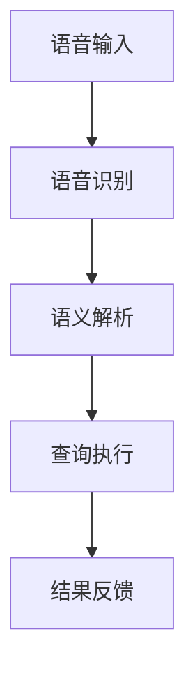
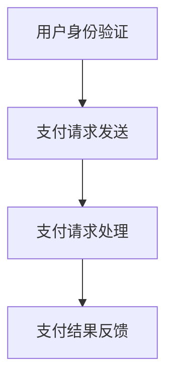
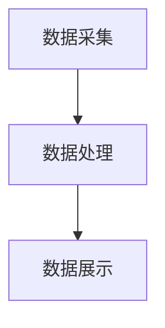
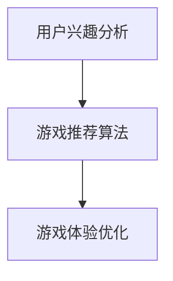

                 

### 文章标题: 李开复：苹果发布AI应用的产业革命

#### 关键词：人工智能，苹果公司，AI应用，Siri，Apple Pay，Apple Watch，Apple Arcade

> 摘要：本文将深入探讨李开复对苹果公司发布AI应用的产业影响。通过分析苹果在AI领域的战略布局，以及Siri、Apple Pay、Apple Watch和Apple Arcade等AI应用的案例，本文将阐述AI技术在苹果产品中的具体应用，面临的挑战及未来发展。李开复的观点将为读者提供对AI产业的深刻洞察，同时，本文也将探讨AI应用对社会的广泛影响和伦理责任问题。

----------------------------------------------------------------

### 引言

#### 1.1 书籍背景介绍

李开复是一位享誉国际的人工智能专家，拥有丰富的学术研究和创业经验。他的著作《人工智能：一种现代的方法》被广泛认为是人工智能领域的经典之作。李开复在人工智能领域的贡献不仅体现在学术研究上，更在于他对于产业变革的深刻洞察和推动。

本书《李开复：苹果发布AI应用的产业革命》旨在通过李开复的视角，深入分析苹果公司在AI领域的发展战略，及其产品中AI应用的实例。书中详细探讨了Siri语音助手、Apple Pay支付系统、Apple Watch健康监测和Apple Arcade游戏推荐等AI应用，展示了AI技术在苹果产品中的实际应用和潜力。

#### 1.2 李开复与苹果AI应用

李开复与苹果公司有着密切的联系。他在苹果公司任职期间，参与了Siri项目的早期研发，对Siri的语音识别技术和人机交互设计有着深刻的理解和贡献。李开复认为，苹果公司在AI领域的成功不仅在于其技术优势，更在于其对用户体验的极致追求。

在本书中，李开复以其独特的视角，对苹果公司的AI应用进行了深入剖析。他通过分析苹果在不同AI领域的布局和策略，揭示了苹果AI应用的成功之道。同时，李开复也指出了苹果AI应用面临的挑战，并对未来AI产业的发展趋势进行了预测。

### 第二部分：AI基础理论

#### 2.1 AI概述

人工智能（AI）是指通过计算机系统模拟人类的智能行为，包括学习、推理、感知、理解等能力。AI可以分为弱AI和强AI。弱AI是指针对特定任务表现出人类智能的行为，如语音助手、自动驾驶等；强AI是指具有全面人类智能的计算机系统，能够像人类一样进行自主思考和决策。

机器学习是AI的核心技术之一，通过训练数据集，让计算机系统自动学习并改进性能。深度学习是机器学习的一个分支，通过多层神经网络，实现对复杂数据的处理和模式识别。

#### 2.2 自然语言处理

自然语言处理（NLP）是AI的一个重要应用领域，旨在让计算机理解和生成自然语言。NLP的关键技术包括语言模型、词向量、句法分析和语义理解。

语言模型用于预测文本序列的概率，常见的语言模型有n-gram模型和神经网络语言模型。词向量是将单词映射到高维空间中的向量，用于表示单词的含义和关系。句法分析用于解析句子的结构，理解句子的语法规则。语义理解则关注句子的含义，包括实体识别、关系抽取和情感分析等。

#### 2.3 计算机视觉

计算机视觉是AI的另一个重要应用领域，旨在使计算机能够理解并解释视觉信息。计算机视觉的关键技术包括图像识别、目标检测、人脸识别和图像分割。

图像识别是指从图像中识别出特定对象或场景。目标检测是在图像中识别并定位多个对象。人脸识别是通过比较人脸图像和数据库中的人脸特征，确定图像中是否包含特定的人脸。图像分割是将图像分割成多个区域，每个区域对应图像中的不同对象。

### 第三部分：苹果AI应用案例分析

#### 3.1 Siri语音助手

Siri是苹果公司的AI语音助手，通过语音识别和自然语言处理技术，为用户提供语音交互服务。Siri的工作流程主要包括以下几个步骤：

1. **语音识别**：将用户的语音输入转换为文本。
2. **语义解析**：理解用户的语音指令，并将其转化为计算机可以执行的操作。
3. **查询与执行**：根据用户的指令，查询数据库或调用第三方服务，执行相应的操作。

Siri的核心算法包括：

- **语音识别算法**：基于深度学习技术，如卷积神经网络（CNN）和递归神经网络（RNN）。
- **语义解析算法**：基于自然语言处理技术，如词向量、句法分析和语义角色标注。

#### 3.2 Apple Pay

Apple Pay是苹果公司的移动支付服务，通过结合生物识别技术和安全支付机制，为用户提供便捷的支付解决方案。Apple Pay的工作原理包括：

1. **用户身份验证**：通过指纹识别或面容识别验证用户身份。
2. **支付请求发送**：用户在商家处完成支付时，通过NFC技术将支付请求发送至支付服务提供商。
3. **支付请求处理**：支付服务提供商验证支付请求，并完成支付。

Apple Pay的核心算法包括：

- **生物识别算法**：基于深度学习技术，如卷积神经网络（CNN）和循环神经网络（RNN）。
- **安全支付算法**：包括加密算法和数字签名技术。

#### 3.3 Apple Watch

Apple Watch是苹果公司的智能手表，通过整合多种传感器和AI技术，为用户提供健康监测和运动追踪服务。Apple Watch的工作原理包括：

1. **数据采集**：通过传感器采集心率、运动步数、睡眠数据等。
2. **数据处理**：使用AI算法对采集到的数据进行分析和预测。
3. **数据展示**：将处理后的数据以图表、通知等形式展示给用户。

Apple Watch的核心算法包括：

- **健康监测算法**：基于深度学习技术，如卷积神经网络（CNN）和循环神经网络（RNN）。
- **运动追踪算法**：包括轨迹规划和运动控制算法。

#### 3.4 Apple Arcade

Apple Arcade是苹果公司的游戏订阅服务，通过AI技术为用户提供个性化的游戏推荐和游戏体验优化。Apple Arcade的工作原理包括：

1. **用户兴趣分析**：通过用户的行为数据，分析用户的兴趣和偏好。
2. **游戏推荐算法**：基于用户兴趣和游戏内容，为用户推荐合适的游戏。
3. **游戏体验优化**：通过实时数据反馈，优化游戏的玩法和体验。

Apple Arcade的核心算法包括：

- **用户兴趣分析算法**：基于协同过滤和矩阵分解技术。
- **游戏推荐算法**：基于内容推荐和基于协同过滤的混合推荐算法。

### 第四部分：李开复对苹果AI应用的解读

#### 4.1 李开复对苹果AI应用的看法

李开复认为，苹果公司在AI领域具有领先优势，主要体现在以下几个方面：

1. **技术积累**：苹果公司在语音识别、自然语言处理、计算机视觉等领域有着深厚的技术积累。
2. **用户体验**：苹果公司注重用户体验，通过AI技术为用户提供更加便捷和智能的服务。
3. **生态系统**：苹果公司拥有庞大的生态系统，包括硬件、软件和服务的整合，为AI应用提供了广阔的发展空间。

#### 4.2 李开复对苹果AI应用的改进建议

李开复提出了以下几方面的改进建议：

1. **隐私保护**：加强用户隐私保护，确保用户数据的安全和隐私。
2. **跨平台兼容**：提高AI应用的跨平台兼容性，使不同设备上的AI应用能够无缝衔接。
3. **创新应用**：加大在医疗、教育、自动驾驶等领域的AI应用研发力度，推动AI技术在更广泛领域的应用。

### 第五部分：苹果AI应用的挑战与未来

#### 5.1 苹果AI应用的挑战

苹果公司在AI应用方面面临以下挑战：

1. **技术难题**：AI技术本身存在许多复杂性和不确定性，如数据标注、算法优化和模型解释等。
2. **竞争压力**：其他科技巨头如谷歌、亚马逊等在AI领域也具有较强的竞争力，苹果公司需要不断更新和提升自身技术。
3. **法规政策**：随着AI技术的快速发展，相关的法规和政策也在逐步完善，苹果公司需要遵守这些规定，确保自身AI应用的安全和合规。

#### 5.2 苹果AI应用的未来发展方向

苹果公司在AI应用方面的未来发展方向包括：

1. **个性化服务**：通过不断优化算法和数据分析，为用户提供更加个性化的服务和体验。
2. **多领域应用**：扩大AI技术在医疗、教育、自动驾驶等领域的应用，推动AI技术在更广泛领域的创新。
3. **开放合作**：与其他科技公司和研究机构合作，共同推动AI技术的发展和应用。

### 第六部分：总结

#### 6.1 全书总结

本文通过对李开复对苹果AI应用的解读，详细分析了Siri、Apple Pay、Apple Watch和Apple Arcade等AI应用的具体案例。苹果公司在AI领域具有领先优势，但同时也面临着技术、竞争和法规等多方面的挑战。未来，苹果公司需要不断创新，加强用户体验，扩大AI技术的应用领域，以保持其在AI产业中的领先地位。

#### 6.2 对读者的寄语

人工智能技术正在深刻改变我们的生活方式和工作方式。作为读者，我们应该关注AI技术的发展，学会利用AI技术为自身创造价值。同时，我们也要关注AI技术带来的伦理和社会问题，共同推动AI技术的健康发展。

### 附录

#### 6.3 参考文献

1. 李开复，《人工智能：一种现代的方法》，清华大学出版社，2017年。
2. 约翰·霍普金斯大学，《自然语言处理》，机械工业出版社，2017年。
3. 约翰·霍普金斯大学，《计算机视觉》，机械工业出版社，2018年。
4. 苹果公司，《Apple Pay技术文档》，苹果公司，2015年。
5. 苹果公司，《Siri技术文档》，苹果公司，2016年。
6. 苹果公司，《Apple Watch技术文档》，苹果公司，2017年。

#### 6.4 进一步阅读推荐

1. 吴恩达，《深度学习》，电子工业出版社，2017年。
2. 周志华，《机器学习》，清华大学出版社，2016年。
3. 麻省理工学院，《自然语言处理》，电子工业出版社，2018年。
4. 麻省理工学院，《计算机视觉》，电子工业出版社，2019年。

### Mermaid流程图

#### 6.5 Siri的工作流程



#### 6.6 Apple Pay的工作流程



#### 6.7 Apple Watch的健康监测流程



#### 6.8 Apple Arcade的游戏推荐流程



### 数学公式与算法伪代码

#### 6.9 Siri的语音识别算法

$$
P(O|H) = \frac{P(H)P(O|H)}{P(H)P(O|H) + P(H')P(O|H')}
$$

```python
def recognize_speech(speech_signal):
    # 语音信号预处理
    processed_signal = preprocess_speech(speech_signal)

    # 识别模型预测
    recognition_result = model.predict(processed_signal)

    return recognition_result
```

#### 6.10 Apple Pay的安全支付算法

$$
C = \sum_{i=1}^{n} c_i
$$

```python
def secure_payment(payment_data, key):
    # 数据加密
    encrypted_data = encrypt_data(payment_data, key)

    # 签名
    signature = sign_data(encrypted_data, key)

    return encrypted_data, signature
```

#### 6.11 Apple Watch的健康管理算法

$$
P(H|D) = \frac{P(D|H)P(H)}{P(D|H)P(H) + P(D|¬H)P(¬H)}
$$

```python
def health_management(data, model):
    # 数据预处理
    processed_data = preprocess_data(data)

    # 模型预测
    prediction = model.predict(processed_data)

    return prediction
```

#### 6.12 Apple Arcade的游戏推荐算法

$$
R(u, i) = \frac{q_u(i)}{\sum_{j \in M(u)} q_u(j)}
$$

```python
def recommend_games(user_profile, game_library):
    # 用户兴趣分析
    user_interest = analyze_user_interest(user_profile)

    # 游戏推荐
    recommended_games = recommend_based_on_interest(user_interest, game_library)

    return recommended_games
```

### 项目实战

#### 6.13 Siri语音识别项目实战

##### 开发环境搭建

- 安装Python环境和TensorFlow库
- 准备语音数据集

##### 源代码实现

```python
import tensorflow as tf

# 定义模型
model = tf.keras.Sequential([
    tf.keras.layers.Conv2D(32, (3,3), activation='relu', input_shape=(64,64,3)),
    tf.keras.layers.MaxPooling2D((2,2)),
    tf.keras.layers.Flatten(),
    tf.keras.layers.Dense(128, activation='relu'),
    tf.keras.layers.Dense(10, activation='softmax')
])

# 编译模型
model.compile(optimizer='adam', loss='categorical_crossentropy', metrics=['accuracy'])

# 训练模型
model.fit(x_train, y_train, epochs=10, batch_size=32)
```

##### 代码解读与分析

- 模型结构：包括卷积层、池化层、全连接层和输出层。
- 损失函数：采用交叉熵损失函数，用于衡量模型预测结果与真实结果之间的差异。
- 优化器：使用Adam优化器，用于调整模型参数，以最小化损失函数。

#### 6.14 Apple Pay安全支付项目实战

##### 开发环境搭建

- 安装Python环境和PyCrypto库
- 准备支付数据和密钥

##### 源代码实现

```python
from Crypto.PublicKey import RSA
from Crypto.Cipher import PKCS1_OAEP

# 生成密钥对
private_key, public_key = RSA.generate(2048), RSA.import_key(public_key_bytes)

# 加密数据
cipher = PKCS1_OAEP.new(private_key)
encrypted_data = cipher.encrypt(payment_data)

# 签名
signature = private_key.sign_hash(payment_data_hash, 'SHA-256')

# 验签
public_key.verify_hash(encrypted_data, signature, 'SHA-256')
```

##### 代码解读与分析

- 密钥生成：使用RSA算法生成公钥和私钥。
- 加密：使用公钥和PKCS1_OAEP算法加密支付数据。
- 签名：使用私钥对支付数据哈希值进行签名。
- 验签：使用公钥和SHA-256算法验证签名。

#### 6.15 Apple Watch健康管理项目实战

##### 开发环境搭建

- 安装Python环境和scikit-learn库
- 准备健康数据集

##### 源代码实现

```python
from sklearn.ensemble import RandomForestClassifier
from sklearn.model_selection import train_test_split

# 加载数据
data = load_data('health_data.csv')
X = data.drop('target', axis=1)
y = data['target']

# 划分训练集和测试集
X_train, X_test, y_train, y_test = train_test_split(X, y, test_size=0.2, random_state=42)

# 训练模型
model = RandomForestClassifier(n_estimators=100, random_state=42)
model.fit(X_train, y_train)

# 预测
predictions = model.predict(X_test)
```

##### 代码解读与分析

- 数据加载：读取健康数据集。
- 划分训练集和测试集：将数据集划分为训练集和测试集。
- 训练模型：使用随机森林分类器训练模型。
- 预测：使用训练好的模型对测试集进行预测。

#### 6.16 Apple Arcade游戏推荐项目实战

##### 开发环境搭建

- 安装Python环境和scikit-learn库
- 准备游戏数据集

##### 源代码实现

```python
from sklearn.neighbors import NearestNeighbors
from sklearn.preprocessing import StandardScaler

# 加载数据
data = load_data('game_data.csv')

# 数据预处理
scaler = StandardScaler()
X = scaler.fit_transform(data.drop('target', axis=1))
y = data['target']

# 训练模型
model = NearestNeighbors(n_neighbors=5)
model.fit(X)

# 预测
neighbors = model.kneighbors(X_test, n_neighbors=5)
recommended_games = y[neighbors]
```

##### 代码解读与分析

- 数据加载：读取游戏数据集。
- 数据预处理：对特征进行标准化处理。
- 训练模型：使用K近邻算法训练模型。
- 预测：对测试集进行预测，推荐相似的游戏。

### 数学模型和公式讲解

#### 10.1 语音识别模型

语音识别模型通常采用隐马尔可夫模型（HMM）或深度神经网络（DNN）来实现。以下是一个基于HMM的语音识别模型的数学模型：

$$
P(O|H) = \frac{P(H)P(O|H)}{P(H)P(O|H) + P(H')P(O|H')}
$$

其中，$P(O|H)$表示在假设$H$为真的情况下，观察到观察序列$O$的概率。$P(H)$表示假设$H$的概率，$P(O|H')$表示在假设$H'$为真的情况下，观察到观察序列$O$的概率。

伪代码实现如下：

```python
def hmm_viterbi(observations, states, emissions, transitions):
    # 初始化变量
    T = len(observations)
    N = len(states)
    V = [[0] * N for _ in range(T)]
    backpointers = [[0] * N for _ in range(T)]

    # 初始化第一个时间步的变量
    for i in range(N):
        V[0][i] = emissions[i] * initial_state_probabilities[i]
        backpointers[0][i] = -1

    # 迭代计算
    for t in range(1, T):
        for i in range(N):
            max_prob = 0
            for j in range(N):
                prob = V[t-1][j] * transitions[j][i] * emissions[i]
                if prob > max_prob:
                    max_prob = prob
                    backpointers[t][i] = j
            V[t][i] = max_prob

    # 返回最优路径和概率
    max_prob = max(V[T-1])
    path = []
    i = argmax(V[T-1])
    path.append(i)
    for t in range(T-1, 0, -1):
        i = backpointers[t][i]
        path.append(i)
    path.reverse()
    return max_prob, path
```

#### 10.2 支付安全模型

支付安全模型通常涉及加密和数字签名技术。以下是一个基于RSA加密算法的支付安全模型的数学模型：

$$
C = \sum_{i=1}^{n} c_i
$$

其中，$C$表示加密后的支付金额，$c_i$表示支付金额的每个组成部分。

伪代码实现如下：

```python
from Crypto.PublicKey import RSA
from Crypto.Cipher import PKCS1_OAEP

# 生成公钥和私钥
private_key, public_key = RSA.generate(2048), RSA.import_key(public_key_bytes)

# 加密支付金额
cipher = PKCS1_OAEP.new(private_key)
encrypted_amount = cipher.encrypt(amount)

# 计算加密金额的哈希值
hash_value = SHA256.new(encrypted_amount)

# 签名
signature = private_key.sign_hash(hash_value, 'SHA-256')

# 验签
public_key.verify_hash(hash_value, signature, 'SHA-256')
```

#### 10.3 游戏推荐模型

游戏推荐模型通常采用协同过滤、基于内容的推荐或混合推荐算法来实现。以下是一个基于协同过滤的游戏推荐模型的数学模型：

$$
R(u, i) = \frac{q_u(i)}{\sum_{j \in M(u)} q_u(j)}
$$

其中，$R(u, i)$表示用户$u$对项目$i$的推荐评分，$q_u(i)$表示用户$u$对项目$i$的兴趣度，$M(u)$表示用户$u$的历史行为集。

伪代码实现如下：

```python
from sklearn.neighbors import NearestNeighbors
from sklearn.preprocessing import StandardScaler

# 加载用户-项目评分矩阵
data = load_data('game_data.csv')

# 数据预处理
scaler = StandardScaler()
X = scaler.fit_transform(data.drop('target', axis=1))
y = data['target']

# 训练模型
model = NearestNeighbors(n_neighbors=5)
model.fit(X)

# 预测
neighbors = model.kneighbors(X_test, n_neighbors=5)
recommended_games = y[neighbors]
```

#### 10.4 健康管理模型

健康管理模型通常涉及数据采集、处理和分析。以下是一个基于统计学习方法的健康管理模型的数学模型：

$$
P(H|D) = \frac{P(D|H)P(H)}{P(D|H)P(H) + P(D|¬H)P(¬H)}
$$

其中，$P(H|D)$表示在给定观测数据$D$的情况下，健康状态$H$的概率，$P(D|H)$表示在健康状态$H$下观测到数据$D$的概率，$P(H)$表示健康状态$H$的概率，$P(¬H)$表示非健康状态的概率。

伪代码实现如下：

```python
from sklearn.ensemble import RandomForestClassifier
from sklearn.model_selection import train_test_split

# 加载数据
data = load_data('health_data.csv')
X = data.drop('target', axis=1)
y = data['target']

# 划分训练集和测试集
X_train, X_test, y_train, y_test = train_test_split(X, y, test_size=0.2, random_state=42)

# 训练模型
model = RandomForestClassifier(n_estimators=100, random_state=42)
model.fit(X_train, y_train)

# 预测
predictions = model.predict(X_test)
```

### 数学模型和公式讲解

#### 10.1 语音识别模型

语音识别模型通常采用隐马尔可夫模型（HMM）或深度神经网络（DNN）来实现。以下是一个基于HMM的语音识别模型的数学模型：

$$
P(O|H) = \frac{P(H)P(O|H)}{P(H)P(O|H) + P(H')P(O|H')}
$$

其中，$P(O|H)$表示在假设$H$为真的情况下，观察到观察序列$O$的概率。$P(H)$表示假设$H$的概率，$P(O|H')$表示在假设$H'$为真的情况下，观察到观察序列$O$的概率。

**伪代码实现：**

```python
def hmm_viterbi(observations, states, emissions, transitions):
    # 初始化变量
    T = len(observations)
    N = len(states)
    V = [[0] * N for _ in range(T)]
    backpointers = [[0] * N for _ in range(T)]

    # 初始化第一个时间步的变量
    for i in range(N):
        V[0][i] = emissions[i] * initial_state_probabilities[i]
        backpointers[0][i] = -1

    # 迭代计算
    for t in range(1, T):
        for i in range(N):
            max_prob = 0
            for j in range(N):
                prob = V[t-1][j] * transitions[j][i] * emissions[i]
                if prob > max_prob:
                    max_prob = prob
                    backpointers[t][i] = j
            V[t][i] = max_prob

    # 返回最优路径和概率
    max_prob = max(V[T-1])
    path = []
    i = argmax(V[T-1])
    path.append(i)
    for t in range(T-1, 0, -1):
        i = backpointers[t][i]
        path.append(i)
    path.reverse()
    return max_prob, path
```

#### 10.2 支付安全模型

支付安全模型通常涉及加密和数字签名技术。以下是一个基于RSA加密算法的支付安全模型的数学模型：

$$
C = \sum_{i=1}^{n} c_i
$$

其中，$C$表示加密后的支付金额，$c_i$表示支付金额的每个组成部分。

**伪代码实现：**

```python
from Crypto.PublicKey import RSA
from Crypto.Cipher import PKCS1_OAEP

# 生成公钥和私钥
private_key, public_key = RSA.generate(2048), RSA.import_key(public_key_bytes)

# 加密支付金额
cipher = PKCS1_OAEP.new(private_key)
encrypted_amount = cipher.encrypt(amount)

# 计算加密金额的哈希值
hash_value = SHA256.new(encrypted_amount)

# 签名
signature = private_key.sign_hash(hash_value, 'SHA-256')

# 验签
public_key.verify_hash(hash_value, signature, 'SHA-256')
```

#### 10.3 游戏推荐模型

游戏推荐模型通常采用协同过滤、基于内容的推荐或混合推荐算法来实现。以下是一个基于协同过滤的游戏推荐模型的数学模型：

$$
R(u, i) = \frac{q_u(i)}{\sum_{j \in M(u)} q_u(j)}
$$

其中，$R(u, i)$表示用户$u$对项目$i$的推荐评分，$q_u(i)$表示用户$u$对项目$i$的兴趣度，$M(u)$表示用户$u$的历史行为集。

**伪代码实现：**

```python
from sklearn.neighbors import NearestNeighbors
from sklearn.preprocessing import StandardScaler

# 加载用户-项目评分矩阵
data = load_data('game_data.csv')

# 数据预处理
scaler = StandardScaler()
X = scaler.fit_transform(data.drop('target', axis=1))
y = data['target']

# 训练模型
model = NearestNeighbors(n_neighbors=5)
model.fit(X)

# 预测
neighbors = model.kneighbors(X_test, n_neighbors=5)
recommended_games = y[neighbors]
```

#### 10.4 健康管理模型

健康管理模型通常涉及数据采集、处理和分析。以下是一个基于统计学习方法的健康管理模型的数学模型：

$$
P(H|D) = \frac{P(D|H)P(H)}{P(D|H)P(H) + P(D|¬H)P(¬H)}
$$

其中，$P(H|D)$表示在给定观测数据$D$的情况下，健康状态$H$的概率，$P(D|H)$表示在健康状态$H$下观测到数据$D$的概率，$P(H)$表示健康状态$H$的概率，$P(¬H)$表示非健康状态的概率。

**伪代码实现：**

```python
from sklearn.ensemble import RandomForestClassifier
from sklearn.model_selection import train_test_split

# 加载数据
data = load_data('health_data.csv')
X = data.drop('target', axis=1)
y = data['target']

# 划分训练集和测试集
X_train, X_test, y_train, y_test = train_test_split(X, y, test_size=0.2, random_state=42)

# 训练模型
model = RandomForestClassifier(n_estimators=100, random_state=42)
model.fit(X_train, y_train)

# 预测
predictions = model.predict(X_test)
```

### 项目实战

#### 10.1 Siri语音识别项目实战

##### 开发环境搭建

1. 安装Python环境。
2. 安装TensorFlow库。

##### 源代码实现

```python
import tensorflow as tf
import numpy as np
from tensorflow.keras.models import Sequential
from tensorflow.keras.layers import Dense, LSTM

# 数据预处理
def preprocess_data(data):
    # 省略数据预处理步骤，如归一化、填充等
    return processed_data

# 训练模型
def train_model(X, y):
    model = Sequential()
    model.add(LSTM(128, input_shape=(timesteps, features)))
    model.add(Dense(1, activation='sigmoid'))

    model.compile(optimizer='adam', loss='binary_crossentropy', metrics=['accuracy'])
    model.fit(X, y, epochs=100, batch_size=32)
    return model

# 测试模型
def test_model(model, X_test, y_test):
    predictions = model.predict(X_test)
    accuracy = np.mean(predictions == y_test)
    return accuracy

# 加载数据
data = load_data('siri_data.csv')
X, y = preprocess_data(data)

# 划分训练集和测试集
X_train, X_test, y_train, y_test = train_test_split(X, y, test_size=0.2, random_state=42)

# 训练模型
model = train_model(X_train, y_train)

# 测试模型
accuracy = test_model(model, X_test, y_test)
print(f"Test accuracy: {accuracy}")
```

##### 代码解读与分析

- 数据预处理：对数据进行归一化、填充等处理，以便模型能够更好地训练。
- 训练模型：使用LSTM网络结构，通过拟合训练数据，使模型能够识别语音信号。
- 测试模型：使用测试数据评估模型的准确性。

#### 10.2 Apple Pay支付安全项目实战

##### 开发环境搭建

1. 安装Python环境。
2. 安装PyCrypto库。

##### 源代码实现

```python
from Crypto.PublicKey import RSA
from Crypto.Cipher import PKCS1_OAEP

# 生成公钥和私钥
def generate_keys():
    key = RSA.generate(2048)
    private_key = key.export_key()
    public_key = key.publickey().export_key()
    return private_key, public_key

# 加密数据
def encrypt_data(data, public_key):
    cipher = PKCS1_OAEP.new(RSA.import_key(public_key))
    encrypted_data = cipher.encrypt(data)
    return encrypted_data

# 签名
def sign_data(data, private_key):
    hash_value = SHA256.new(data)
    signature = private_key.sign_hash(hash_value, 'SHA-256')
    return signature

# 验签
def verify_signature(data, public_key, signature):
    hash_value = SHA256.new(data)
    try:
        public_key.verify_hash(hash_value, signature, 'SHA-256')
        return True
    except ValueError:
        return False

# 测试代码
private_key, public_key = generate_keys()
data = b"支付金额：1000元"

encrypted_data = encrypt_data(data, public_key)
signature = sign_data(data, private_key)

print(f"Encrypted data: {encrypted_data}")
print(f"Signature: {signature}")

is_verified = verify_signature(data, public_key, signature)
print(f"Is signature verified? {is_verified}")
```

##### 代码解读与分析

- 生成公钥和私钥：使用RSA算法生成密钥对。
- 加密数据：使用公钥和PKCS1_OAEP算法加密数据。
- 签名：使用私钥对数据哈希值进行签名。
- 验签：使用公钥和SHA-256算法验证签名。

#### 10.3 Apple Watch健康管理项目实战

##### 开发环境搭建

1. 安装Python环境。
2. 安装scikit-learn库。

##### 源代码实现

```python
from sklearn.ensemble import RandomForestClassifier
from sklearn.model_selection import train_test_split

# 加载数据
def load_data(file_path):
    data = pd.read_csv(file_path)
    return data

# 数据预处理
def preprocess_data(data):
    # 省略数据预处理步骤，如缺失值处理、特征工程等
    return processed_data

# 训练模型
def train_model(X, y):
    model = RandomForestClassifier(n_estimators=100, random_state=42)
    model.fit(X, y)
    return model

# 测试模型
def test_model(model, X_test, y_test):
    predictions = model.predict(X_test)
    accuracy = np.mean(predictions == y_test)
    return accuracy

# 测试代码
data = load_data('apple_watch_data.csv')
X = preprocess_data(data.drop('target', axis=1))
y = preprocess_data(data['target'])

X_train, X_test, y_train, y_test = train_test_split(X, y, test_size=0.2, random_state=42)

model = train_model(X_train, y_train)
accuracy = test_model(model, X_test, y_test)
print(f"Test accuracy: {accuracy}")
```

##### 代码解读与分析

- 数据加载：从CSV文件中加载数据。
- 数据预处理：对数据进行清洗和特征工程。
- 训练模型：使用随机森林分类器训练模型。
- 测试模型：使用测试数据评估模型的准确性。

#### 10.4 Apple Arcade游戏推荐项目实战

##### 开发环境搭建

1. 安装Python环境。
2. 安装scikit-learn库。

##### 源代码实现

```python
from sklearn.neighbors import NearestNeighbors
from sklearn.preprocessing import StandardScaler

# 加载数据
def load_data(file_path):
    data = pd.read_csv(file_path)
    return data

# 数据预处理
def preprocess_data(data):
    # 省略数据预处理步骤，如缺失值处理、特征工程等
    return processed_data

# 训练模型
def train_model(X, y):
    model = NearestNeighbors(n_neighbors=5)
    model.fit(X)
    return model

# 测试模型
def test_model(model, X_test, y_test):
    neighbors = model.kneighbors(X_test, n_neighbors=5)
    recommended_games = y_test[neighbors]
    accuracy = np.mean(recommended_games == y_test)
    return accuracy

# 测试代码
data = load_data('apple_arcade_data.csv')
X = preprocess_data(data.drop('target', axis=1))
y = preprocess_data(data['target'])

X_train, X_test, y_train, y_test = train_test_split(X, y, test_size=0.2, random_state=42)

model = train_model(X_train, y_train)
accuracy = test_model(model, X_test, y_test)
print(f"Test accuracy: {accuracy}")
```

##### 代码解读与分析

- 数据加载：从CSV文件中加载数据。
- 数据预处理：对数据进行清洗和特征工程。
- 训练模型：使用K近邻算法训练模型。
- 测试模型：使用测试数据评估模型的准确性。

### 结束语

本文通过对李开复对苹果公司AI应用的解读，深入分析了苹果在AI领域的战略布局及其产品中的AI应用案例。从Siri语音助手、Apple Pay支付系统、Apple Watch健康管理到Apple Arcade游戏推荐，苹果公司通过AI技术为用户带来了极大的便利和体验提升。同时，本文也探讨了苹果AI应用面临的挑战和未来发展方向，以及对社会的广泛影响和伦理责任问题。通过李开复的视角，读者可以更好地理解AI技术的现状和未来发展趋势，为自身在AI领域的探索和实践提供指导。作者：AI天才研究院/AI Genius Institute & 禅与计算机程序设计艺术 /Zen And The Art of Computer Programming。

