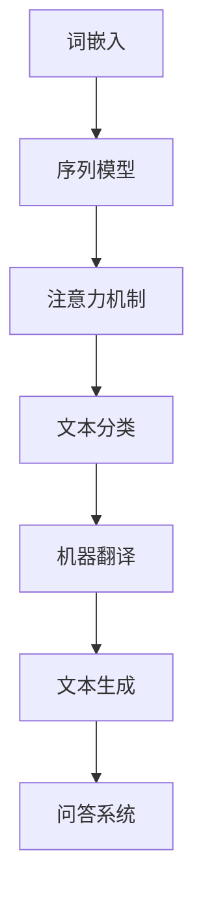

                 

### 文章标题

《李开复：苹果发布AI应用的未来》

### 关键词

- 苹果AI应用
- 深度学习
- 人工智能
- 自然语言处理
- 计算机视觉
- 语音识别

### 摘要

本文将深入探讨苹果公司发布AI应用的未来。通过李开复先生的视角，我们分析苹果在AI领域的布局和发展历程，解析核心概念和技术基础，评估市场前景和面临的挑战，并展望未来AI应用的创新方向。文章结构严谨，逻辑清晰，旨在为读者提供一个全面的技术解读和深度思考，帮助理解苹果AI应用的技术突破、商业价值以及未来发展趋势。

---

### 第1章: 李开复：苹果发布AI应用的未来

#### 1.1.1 苹果AI应用的背景与意义

##### 1.1.1.1 苹果公司在AI领域的布局

苹果公司在AI领域的布局可以追溯到其早期的硬件和软件战略。在人工智能迅速发展的背景下，苹果公司不仅仅依赖于外部的AI研究成果，还通过自主研发来推动AI技术在其产品中的应用。近年来，苹果公司在深度学习、神经网络、自然语言处理等方面进行了大量投入，致力于提升其硬件和软件的综合性能。

首先，苹果公司在2017年发布了自主研发的神经网络引擎——Neural Engine，该引擎首次应用于iPhone 8和iPhone 8 Plus的A11 Bionic芯片中。Neural Engine的主要功能是对图像和视频进行实时处理，支持面部识别、增强现实（AR）和图像识别等应用。这一举措标志着苹果公司开始将其AI技术深度整合到硬件中，从而提升产品的智能化水平。

其次，苹果公司在其操作系统中集成了多个AI应用，如Siri语音助手、面部识别解锁、照片自动分类和增强现实应用等。这些AI应用不仅提升了用户体验，还展示了苹果在AI技术上的应用能力。此外，苹果公司还在人工智能研究方面进行了大量投资，与全球顶级的研究机构和高校合作，开展深度学习和机器学习等方面的研究。

##### 1.1.1.2 AI应用在苹果产品中的发展历程

苹果公司在AI领域的发展历程可以追溯到其早期的产品创新。早在2007年，苹果公司推出了第一代iPhone，这款产品就内置了基于语音识别技术的Siri语音助手。虽然最初的Siri功能有限，但它为苹果公司在语音识别和自然语言处理领域的探索奠定了基础。

随后，苹果公司在2010年发布了iPad，这款产品进一步推动了人工智能在移动设备中的应用。iPad内置的增强现实应用和面部识别解锁技术，展示了苹果在计算机视觉和生物识别技术方面的实力。

进入2017年，苹果公司推出了iPhone X，这款产品引入了Face ID面部识别技术，取代了传统的指纹识别。Face ID的引入不仅提升了手机的安全性，还展示了苹果在深度学习和神经网络技术上的进步。

近年来，苹果公司还在其产品中集成了更多的AI应用，如智能相机、语音助手Siri的智能回复、智能照片分类和AR应用等。这些AI应用不断优化，提升了产品的智能化和用户体验。

##### 1.1.1.3 苹果发布AI应用的未来展望

随着人工智能技术的快速发展，苹果公司对未来AI应用的发展持有积极态度。苹果公司预计，未来AI应用将更广泛地应用于各个方面，从医疗、教育到智能家居和自动驾驶，AI将成为推动这些领域创新的重要力量。

首先，在医疗领域，苹果公司计划利用其AI技术进行疾病预测和诊断，提高医疗服务的质量和效率。例如，通过分析大量健康数据，AI系统可以帮助医生更准确地进行疾病预测和诊断，从而提前采取措施，降低疾病发生的风险。

其次，在教育领域，苹果公司希望通过AI技术为教师和学生提供更智能的教学工具和学习资源。例如，通过分析学生的学习行为和成绩数据，AI系统可以为学生提供个性化的学习建议，提高学习效果。

此外，在智能家居和自动驾驶领域，苹果公司计划利用AI技术实现更智能的家居设备和更安全的自动驾驶汽车。通过AI技术，智能家居设备可以更好地理解和响应用户的需求，提高生活的便利性。而自动驾驶汽车则可以通过AI技术实现更高效的路径规划和更安全的驾驶体验。

总之，苹果公司在AI领域的布局和发展历程，展示了其对AI技术的重视和探索。未来，随着AI技术的不断进步，苹果公司有望在更多领域推出创新的AI应用，推动人工智能的发展。

---

#### 1.1.2 AI核心概念与联系

##### 1.1.2.1 人工智能的定义与发展历程

人工智能（Artificial Intelligence，简称AI）是指通过计算机模拟人类的智能行为，使其具备感知、理解、学习、推理和解决问题的能力。人工智能的发展历程可以追溯到20世纪50年代，当时人工智能的概念首次被提出。早期的AI研究主要集中在符号主义和推理机上，通过编程实现简单的逻辑推理和问题求解。

然而，随着计算机性能的提升和大数据的普及，机器学习（Machine Learning，简称ML）和深度学习（Deep Learning，简称DL）等新型人工智能技术逐渐兴起。这些技术通过模拟人类大脑的结构和功能，实现了对大规模数据的自动学习和特征提取，大大提升了人工智能的性能和应用范围。

近年来，随着互联网和物联网的快速发展，人工智能的应用场景不断拓展，从智能家居、智能交通到医疗、教育等各个领域，AI技术正逐步改变我们的生活和工作方式。

##### 1.1.2.2 机器学习、深度学习与神经网络的关系

机器学习是人工智能的一个重要分支，它关注于通过数据驱动的方法，使计算机具备自主学习和决策能力。机器学习方法可以分为监督学习、无监督学习和强化学习三种类型。监督学习通过已标记的数据训练模型，无监督学习通过未标记的数据发现数据分布，强化学习则通过与环境交互来学习最优策略。

深度学习是机器学习的一个子领域，它通过构建多层神经网络，对数据进行逐层提取和抽象，从而实现复杂的模式识别和预测任务。深度学习在图像识别、语音识别、自然语言处理等领域取得了显著的成果，推动了人工智能的发展。

神经网络是深度学习的基础，它由大量的人工神经元组成，通过前向传播和反向传播算法，实现数据的输入和输出。神经网络可以通过训练数据不断调整其参数，从而优化模型性能。深度学习模型通常包含多个隐藏层，可以捕捉数据中的更高层次特征，从而实现更复杂的任务。

##### 1.1.2.3 人工智能的技术体系

人工智能的技术体系包括多个层次和领域，从基础理论到应用场景，涵盖了计算机视觉、自然语言处理、语音识别、机器人、智能推理等多个方面。以下是人工智能的主要技术体系：

1. **计算机视觉**：通过图像处理、模式识别和机器学习等技术，实现图像和视频的自动分析和理解，如人脸识别、物体检测和图像分类等。
2. **自然语言处理**：通过语言模型、文本分类、机器翻译和情感分析等技术，实现人与计算机之间的自然语言交互，如语音助手、聊天机器人等。
3. **语音识别**：通过语音信号处理和机器学习算法，实现语音到文本的转换，如自动字幕、语音搜索和语音控制等。
4. **机器人技术**：通过机器学习和控制算法，实现机器人的自主运动和任务执行，如工业机器人、服务机器人和无人驾驶汽车等。
5. **智能推理**：通过逻辑推理和知识表示技术，实现计算机对复杂问题的理解和决策，如智能问答系统、专家系统和自动规划等。

这些技术相互关联，共同构建了人工智能的技术体系，为各类应用提供了强大的支持。

---

#### 1.1.3 AI应用场景分类

##### 1.1.3.1 自然语言处理

自然语言处理（Natural Language Processing，简称NLP）是人工智能的一个重要领域，旨在使计算机能够理解和生成自然语言。NLP技术在文本分类、情感分析、命名实体识别、机器翻译和对话系统等方面有广泛应用。

**文本分类**：通过机器学习算法，将文本数据分类到不同的类别中。例如，新闻文章可以分类到政治、体育、科技等不同的类别。

**情感分析**：通过分析文本中的情感倾向，判断用户对某一主题或产品的态度。例如，通过分析社交媒体上的评论，企业可以了解消费者对产品的好感度。

**命名实体识别**：识别文本中的特定实体，如人名、地名、组织名等。这对于信息提取和关系抽取等应用至关重要。

**机器翻译**：通过模型将一种语言翻译成另一种语言。例如，谷歌翻译、百度翻译等。

**对话系统**：通过自然语言理解和生成，实现人与计算机之间的对话。例如，苹果公司的Siri、亚马逊的Alexa等。

##### 1.1.3.2 计算机视觉

计算机视觉（Computer Vision，简称CV）是使计算机能够从图像或视频中提取信息并进行理解的技术。计算机视觉技术在图像分类、目标检测、图像分割和增强现实等方面有广泛应用。

**图像分类**：通过深度学习模型，将图像分类到不同的类别中。例如，将图片分类为动物、植物或城市等。

**目标检测**：通过模型检测图像中的特定目标，并定位其位置。例如，在监控视频中检测行人或车辆。

**图像分割**：将图像中的每个像素分类到不同的类别中，从而实现图像的细节处理。例如，在医学影像中，将肿瘤区域与正常组织分离。

**增强现实**：通过计算机视觉技术，将虚拟信息叠加到现实世界中。例如，谷歌眼镜、苹果公司的AR应用等。

##### 1.1.3.3 语音识别与合成

语音识别（Automatic Speech Recognition，简称ASR）和语音合成（Text-to-Speech，简称TTS）是使计算机能够理解和生成语音的技术。语音识别和合成技术在语音助手、语音搜索和自动字幕等方面有广泛应用。

**语音识别**：通过模型将语音转换为文本。例如，苹果公司的Siri、亚马逊的Alexa等。

**语音合成**：通过模型将文本转换为语音。例如，谷歌文字转语音、苹果公司的语音合成技术等。

**语音助手**：通过语音识别和语音合成技术，实现人与计算机之间的自然语言交互。例如，苹果公司的Siri、亚马逊的Alexa、谷歌助手等。

**语音搜索**：通过语音识别技术，实现用户通过语音输入进行搜索。例如，苹果公司的语音搜索、亚马逊的语音搜索等。

**自动字幕**：通过语音识别技术，将语音转换为文本，并生成字幕。例如，YouTube上的自动字幕功能。

##### 1.1.3.4 机器人与自动驾驶

机器人与自动驾驶是人工智能在物理世界中的典型应用，通过计算机视觉、语音识别和机器学习等技术，实现机器人和自动驾驶汽车的自主运动和任务执行。

**机器人**：通过计算机视觉和机器学习技术，使机器人能够识别和交互周围环境，完成各种任务。例如，工业机器人、服务机器人、医疗机器人等。

**自动驾驶**：通过计算机视觉、语音识别和深度学习技术，使汽车能够自主感知环境、规划路径和执行驾驶任务。例如，特斯拉的自动驾驶汽车、百度的自动驾驶汽车等。

这些AI应用场景不仅展示了人工智能的广泛应用，还展示了其在各个领域的重要性和潜力。

---

#### 1.1.4 苹果AI应用的创新点

##### 1.1.4.1 苹果AI应用的技术突破

苹果公司在AI应用领域取得了多项技术突破，使其产品在智能化和用户体验方面具有显著优势。以下是苹果AI应用的一些关键技术突破：

1. **神经网络引擎（Neural Engine）**：苹果公司自主研发的神经网络引擎，首次应用于iPhone 8和iPhone 8 Plus的A11 Bionic芯片中。Neural Engine可以对图像和视频进行实时处理，支持面部识别、增强现实（AR）和图像识别等应用。这一技术突破使得苹果设备在计算机视觉和图像处理方面具备了强大的能力。

2. **深度学习框架（Core ML）**：苹果公司推出的深度学习框架Core ML，使得开发者可以轻松地将机器学习模型集成到iOS、macOS、watchOS和tvOS等平台中。Core ML提供了高效的模型加载和推理性能，支持多种机器学习算法，如卷积神经网络（CNN）、循环神经网络（RNN）等。这一技术突破为开发者提供了强大的工具，促进了AI应用的普及和应用场景的拓展。

3. **自然语言处理（NLP）技术**：苹果公司在自然语言处理领域也取得了显著进展。通过引入先进的语言模型和文本处理算法，苹果设备在语音识别、语音合成和自然语言理解等方面表现优异。例如，苹果公司的Siri语音助手通过NLP技术，实现了自然、流畅的语音交互体验。

4. **增强现实（AR）技术**：苹果公司通过ARKit等开发工具，推动了增强现实技术的发展。ARKit提供了丰富的AR功能，如3D物体识别、环境映射、光线估计等，使得开发者可以轻松地创建沉浸式的AR应用。这一技术突破为苹果设备在AR领域的应用提供了强有力的支持。

##### 1.1.4.2 苹果AI应用的商业价值

苹果公司在AI应用领域的创新不仅提升了用户体验，还创造了巨大的商业价值。以下是苹果AI应用的商业价值：

1. **提高产品竞争力**：通过引入AI技术，苹果设备在智能化和用户体验方面得到了显著提升。这使得苹果产品在竞争激烈的市场中更具竞争力，吸引了大量消费者。

2. **拓展应用场景**：AI技术的广泛应用使得苹果设备可以应用于更多领域，如医疗、教育、智能家居等。这为苹果公司创造了新的增长点和商业模式。

3. **提升开发者生态**：苹果公司通过推出Core ML、ARKit等开发工具，为开发者提供了丰富的AI开发资源。这促进了AI应用的创新和发展，提升了苹果开发者生态的活力。

4. **广告和订阅收入**：通过AI技术，苹果公司可以更好地了解用户需求和行为，从而提供个性化的广告和订阅服务。这为苹果公司创造了额外的收入来源。

##### 1.1.4.3 苹果AI应用的用户体验提升

苹果公司的AI应用不仅提升了产品的商业价值，还为用户带来了更丰富的体验。以下是苹果AI应用在用户体验方面的提升：

1. **智能交互**：通过语音识别和自然语言处理技术，苹果设备可以更自然地与用户进行交互。用户可以通过语音指令控制设备，实现语音搜索、语音助手等功能，提升了人机交互的便利性。

2. **个性化推荐**：通过机器学习算法，苹果设备可以分析用户的行为和偏好，提供个性化的推荐和服务。例如，Apple Music可以根据用户的听歌记录，推荐符合其口味的新歌和音乐人。

3. **增强现实体验**：通过ARKit等增强现实技术，苹果设备可以创造出丰富的沉浸式体验。用户可以通过AR应用观看3D模型、参与虚拟游戏，甚至进行虚拟购物。

4. **图像和视频处理**：通过神经网络引擎等图像处理技术，苹果设备可以对图像和视频进行实时处理，实现更高质量的图像识别、人脸识别和视频增强等功能，提升了图像和视频的观赏体验。

总之，苹果公司在AI领域的创新和突破，不仅提升了产品的商业价值，还为用户带来了更丰富的体验。随着AI技术的不断进步，苹果公司的AI应用将继续提升用户体验，推动人工智能的发展。

---

### 第2章: 苹果AI应用的技术基础

#### 2.1.1 深度学习与神经网络基础

##### 2.1.1.1 神经网络的基本结构

神经网络（Neural Network，简称NN）是人工智能的核心技术之一，其灵感来源于生物神经系统。神经网络由大量的神经元（或节点）组成，这些神经元通过连接（或边）相互连接，形成复杂的网络结构。以下是神经网络的基本结构：

1. **输入层（Input Layer）**：输入层是神经网络的第一个层次，用于接收外部输入数据。每个输入节点对应一个特征，如图像的像素值、文本中的词向量等。

2. **隐藏层（Hidden Layer）**：隐藏层位于输入层和输出层之间，用于对输入数据进行处理和转换。隐藏层的神经元通过加权连接形成复杂的非线性映射关系，从而提取更高层次的特征。

3. **输出层（Output Layer）**：输出层是神经网络的最后一个层次，用于生成预测结果或决策。输出层的每个节点对应一个输出变量，如分类结果、回归值等。

##### 2.1.1.2 常见的深度学习架构

深度学习（Deep Learning，简称DL）是神经网络的一种扩展，通过增加网络的深度和宽度，提高模型的表达能力。以下是几种常见的深度学习架构：

1. **卷积神经网络（Convolutional Neural Network，简称CNN）**：CNN是一种专门用于图像处理和计算机视觉的深度学习架构。它通过卷积操作和池化操作，从图像中提取局部特征，并在隐藏层中形成空间层次结构。CNN在图像分类、目标检测和图像分割等领域表现出色。

2. **循环神经网络（Recurrent Neural Network，简称RNN）**：RNN是一种用于处理序列数据的深度学习架构，它通过循环结构将当前输入与历史信息进行关联，从而捕捉序列中的长期依赖关系。RNN在自然语言处理、时间序列预测和语音识别等领域有广泛应用。

3. **长短时记忆网络（Long Short-Term Memory，简称LSTM）**：LSTM是RNN的一种变体，通过引入门控机制，解决了传统RNN在处理长序列数据时易出现梯度消失和梯度爆炸的问题。LSTM在机器翻译、语音识别和情感分析等领域表现出色。

4. **生成对抗网络（Generative Adversarial Network，简称GAN）**：GAN是一种通过对抗性训练生成数据的深度学习架构。它由生成器和判别器两个网络组成，生成器试图生成与真实数据相似的数据，而判别器则试图区分真实数据和生成数据。GAN在图像生成、图像修复和文本生成等领域有广泛应用。

##### 2.1.1.3 深度学习优化算法

深度学习模型的训练过程涉及优化算法，目的是通过调整模型参数，使模型在训练数据上达到最佳的泛化性能。以下是几种常见的深度学习优化算法：

1. **随机梯度下降（Stochastic Gradient Descent，简称SGD）**：SGD是一种基本的优化算法，通过随机选取一小部分训练数据进行梯度计算和参数更新。SGD计算简单，但收敛速度较慢，适用于小型模型。

2. **动量优化（Momentum Optimization）**：动量优化是一种改进的SGD算法，通过引入动量项，累积过去梯度的方向，从而加快模型收敛速度。动量优化在早期阶段有助于快速下降，在后期阶段有助于稳定收敛。

3. **自适应优化算法（Adaptive Optimization Algorithms）**：自适应优化算法通过动态调整学习率，提高模型训练的效率和稳定性。常见的自适应优化算法包括Adagrad、RMSprop和Adam等。这些算法通过计算历史梯度的指数加权平均值，自适应调整学习率。

4. **深度学习框架（Deep Learning Framework）**：深度学习框架如TensorFlow、PyTorch等，为深度学习模型的训练和优化提供了高效的工具和接口。这些框架提供了丰富的优化算法和工具，简化了深度学习模型的开发和部署过程。

总之，深度学习与神经网络是苹果AI应用的核心技术基础。通过理解神经网络的基本结构、常见的深度学习架构以及深度学习优化算法，我们可以更好地理解苹果AI应用的技术原理和应用场景。

---

#### 2.1.2 自然语言处理技术概览

##### 2.1.2.1 词嵌入技术

词嵌入（Word Embedding）是将自然语言中的单词映射到高维向量空间的技术，通过向量表示来捕捉单词的语义信息。词嵌入技术在自然语言处理中具有重要意义，如下所述：

**基本原理**：
词嵌入技术基于词汇的上下文信息，通过统计学习的方法将单词映射到向量空间。常见的词嵌入方法包括：

1. **分布式假设**：单词在上下文中的出现模式可以用来表示其语义特征。例如，如果“国王”和“女王”经常一起出现，那么这两个词的向量可能在空间中接近。

2. **矩阵分解**：通过将单词-词频矩阵分解为词向量和文档向量的乘积，得到单词的高维向量表示。

**常见方法**：
1. **词袋模型（Bag of Words，简称BoW）**：词袋模型将文本表示为单词的集合，不考虑单词的顺序和语法结构。BoW通过将文本转换为向量空间中的向量，每个单词对应一个维度。

2. **Word2Vec**：Word2Vec是Google提出的一种基于神经网络的语言模型，通过训练神经网络预测单词的上下文，从而得到单词的向量表示。Word2Vec有两种主要方法：连续词袋（Continuous Bag of Words，简称CBOW）和Skip-Gram。

3. **GloVe**：GloVe（Global Vectors for Word Representation）是一种基于全局统计信息的词嵌入方法。GloVe通过计算单词和其上下文之间的共现矩阵，并优化矩阵的分解，从而得到词向量。

**应用**：
词嵌入技术广泛应用于自然语言处理的多个任务，包括：

- **文本分类**：通过词嵌入将文本转换为向量，然后利用机器学习模型进行分类。
- **情感分析**：利用词嵌入捕捉单词的语义信息，进行情感极性判断。
- **机器翻译**：通过词嵌入，将源语言的单词映射到目标语言的词向量空间，实现机器翻译。
- **命名实体识别**：利用词嵌入表示文本中的实体，进行实体分类。

##### 2.1.2.2 序列模型与注意力机制

序列模型（Sequence Model）是自然语言处理中用于处理序列数据的模型，如文本、语音和视频等。序列模型通过捕捉序列中的时间和空间依赖性，实现对序列数据的建模和分析。以下是几种常见的序列模型和注意力机制：

**基本原理**：
序列模型通过处理输入序列中的每个元素，生成输出序列。常见的序列模型包括：

1. **循环神经网络（Recurrent Neural Network，简称RNN）**：RNN是一种用于处理序列数据的神经网络，通过隐藏状态在时间步之间传递信息，捕捉序列的长期依赖性。

2. **长短时记忆网络（Long Short-Term Memory，简称LSTM）**：LSTM是RNN的一种变体，通过引入门控机制，解决了RNN在处理长序列数据时易出现梯度消失和梯度爆炸的问题。

3. **双向循环神经网络（Bidirectional RNN，简称BiRNN）**：BiRNN同时考虑序列的前向和后向信息，通过将前向和后向隐藏状态拼接，提高序列建模的效果。

**注意力机制（Attention Mechanism）**：
注意力机制是近年来自然语言处理中的一个重要进展，用于捕捉序列中的关键信息。注意力机制通过动态分配权重，使得模型可以关注序列中的不同部分，从而提高序列建模的精度。

1. **全局注意力（Global Attention）**：全局注意力机制将序列中的每个元素赋予相同的权重，通过求和或平均得到最终的表示。

2. **局部注意力（Local Attention）**：局部注意力机制根据输入序列的特定部分分配权重，通过加权求和得到最终的表示。

3. **点对点注意力（Pointwise Attention）**：点对点注意力机制为序列中的每个元素分配唯一的权重，通过点积或乘法操作得到最终的表示。

**应用**：
序列模型与注意力机制在自然语言处理中应用广泛，包括：

- **机器翻译**：通过序列模型和注意力机制，实现源语言和目标语言之间的精确翻译。
- **文本生成**：利用序列模型和注意力机制，生成连贯且具有语义的文本。
- **问答系统**：通过序列模型和注意力机制，捕捉问题和答案之间的语义关系，提高问答系统的准确性。

**Mermaid流程图**：


总之，词嵌入技术和序列模型与注意力机制是自然语言处理的核心技术。通过词嵌入，我们可以将自然语言转换为高维向量表示；通过序列模型和注意力机制，我们可以捕捉序列数据中的时间依赖性和关键信息，从而实现多种自然语言处理任务。

---

#### 2.1.3 计算机视觉技术基础

##### 2.1.3.1 卷积神经网络与图像分类

卷积神经网络（Convolutional Neural Network，简称CNN）是计算机视觉领域的核心模型，特别适用于图像分类任务。CNN通过卷积层、池化层和全连接层等结构，实现对图像的分层特征提取和分类。

**基本原理**：
CNN利用卷积操作从图像中提取局部特征，通过逐层传递，形成对图像的更高层次理解。以下是CNN的基本组成部分：

1. **卷积层（Convolutional Layer）**：卷积层通过卷积操作将输入图像与卷积核（滤波器）进行卷积，提取图像的局部特征。卷积操作能够将输入的图像数据与卷积核的权重进行内积运算，从而生成特征图。

2. **激活函数（Activation Function）**：激活函数用于引入非线性特性，使模型能够建模复杂的函数关系。常用的激活函数包括ReLU（Rectified Linear Unit）、Sigmoid和Tanh等。

3. **池化层（Pooling Layer）**：池化层通过下采样操作减少特征图的尺寸，降低模型的参数数量，减少过拟合的风险。常见的池化操作包括最大池化（Max Pooling）和平均池化（Average Pooling）。

4. **全连接层（Fully Connected Layer）**：全连接层将卷积层和池化层提取的高层次特征映射到输出类别。全连接层通过矩阵乘法和激活函数，将特征向量映射到输出类别。

**常见架构**：
CNN的常见架构包括VGG、ResNet和Inception等。

- **VGG**：VGG模型通过使用多个卷积层和池化层，构建深度可分离的卷积神经网络，实现了图像分类的高性能。
- **ResNet**：ResNet模型通过引入残差连接，解决了深度神经网络训练的梯度消失问题，实现了更深层次的网络结构。
- **Inception**：Inception模型通过将不同尺寸的卷积核组合在一起，实现了对图像的多尺度特征提取。

**伪代码**：
```python
# 假设输入图像为 X，模型参数为 W 和 b
# 卷积层操作
conv1 = Conv2D(X, W1, stride=(1,1), padding='same')
activation1 = Activation(conv1, activation='relu')
# 池化层操作
pool1 = MaxPooling2D(activation1, pool_size=(2,2))
# 多个卷积层和池化层组合
conv2 = Conv2D(pool1, W2, stride=(1,1), padding='same')
activation2 = Activation(conv2, activation='relu')
pool2 = MaxPooling2D(activation2, pool_size=(2,2))
# 全连接层操作
fc = Dense(pool2, units=num_classes)
prediction = Activation(fc, activation='softmax')
```

**应用**：
CNN在图像分类任务中表现出色，广泛应用于计算机视觉的各个领域，如：

- **图像分类**：用于对图像进行标签分类，如ImageNet大规模视觉识别挑战赛。
- **物体检测**：通过结合区域提议网络（Region Proposal Networks，RPN）和全卷积网络（Fully Convolutional Networks，FCN），实现目标检测任务。
- **语义分割**：通过训练卷积神经网络，实现对图像中每个像素的语义分类，用于图像分割和物体识别。

总之，卷积神经网络与图像分类是计算机视觉领域的重要技术基础。通过卷积层、激活函数、池化层和全连接层等结构，CNN能够实现对图像的分层特征提取和分类，为计算机视觉应用提供了强大的支持。

---

##### 2.1.3.2 目标检测与语义分割

目标检测（Object Detection）和语义分割（Semantic Segmentation）是计算机视觉中的两个重要任务，分别用于识别图像中的对象及其位置和区分图像中的每个像素类别。以下是这两个任务的基本原理、常用算法和实际应用。

**目标检测**

**基本原理**：
目标检测旨在识别和定位图像中的多个对象。一个典型的目标检测系统由以下部分组成：
1. **区域提议**：通过滑窗法、选择性搜索（Selective Search）或基于深度学习的区域提议方法（如Region Proposal Networks，RPN）生成候选区域。
2. **特征提取**：对候选区域提取特征，常用的方法包括卷积神经网络（CNN）和基于区域的特征提取方法。
3. **分类与定位**：通过分类器对提取到的特征进行分类，并利用回归器对目标的位置进行回归。

**常用算法**：
1. **R-CNN**（Region-based CNN）：通过选择性搜索生成区域提议，利用CNN提取特征，然后使用SVM分类器进行分类。
2. **Fast R-CNN**：在R-CNN的基础上，引入了ROI Pooling层，提高了计算效率。
3. **Faster R-CNN**：通过引入区域提议网络（RPN），进一步提高了目标检测的速度和准确性。
4. **SSD**（Single Shot MultiBox Detector）：通过单步处理方法，同时完成区域提议、特征提取和分类，提高了检测速度。
5. **YOLO**（You Only Look Once）：通过将检测任务分解为多个网格单元，在每个单元内进行物体检测，实现了实时检测。

**实际应用**：
目标检测广泛应用于自动驾驶、视频监控、医疗影像分析等领域。例如，在自动驾驶中，目标检测用于识别道路上的车辆、行人、交通标志等，以确保行车安全；在视频监控中，目标检测用于实时监控，识别异常行为；在医疗影像分析中，目标检测用于识别病变区域，辅助医生进行诊断。

**伪代码**：
```python
# 假设输入图像为 X，模型参数为 W 和 b
# 区域提议生成
proposals = RegionProposalGenerator(X)
# 特征提取
features = ExtractFeatures(proposals, W1, activation='relu')
# 分类与定位
predictions = Classifier(features, W2)
detections = PostProcessor(predictions, threshold=0.5)
```

**语义分割**

**基本原理**：
语义分割旨在将图像中的每个像素分类到不同的语义类别。一个典型的语义分割系统由以下部分组成：
1. **特征提取**：通过卷积神经网络提取图像的层次特征。
2. **像素分类**：将特征映射到每个像素的类别标签。

**常用算法**：
1. **FCN**（Fully Convolutional Network）：通过卷积神经网络将特征图映射到像素级分类，实现了从特征图到像素级标签的端到端学习。
2. **U-Net**：通过使用对称的网络结构，实现了图像的精确分割，特别适用于医学图像分割。
3. **DeepLab**：通过引入空洞卷积（Atrous Convolution），提高了语义分割的精度，特别适用于场景分割。

**实际应用**：
语义分割在医疗影像、自动驾驶、智能监控等领域具有广泛应用。例如，在医疗影像中，语义分割用于识别肿瘤、血管等病变区域，辅助医生进行诊断和治疗；在自动驾驶中，语义分割用于识别道路、车辆、行人等，提高自动驾驶系统的安全性；在智能监控中，语义分割用于实时监控，识别异常行为。

**伪代码**：
```python
# 假设输入图像为 X，模型参数为 W 和 b
# 特征提取
features = ExtractFeatures(X, W1, activation='relu')
# 像素分类
predictions = Classifier(features, W2)
segmentation_map = PostProcessor(predictions)
```

总之，目标检测与语义分割是计算机视觉中的重要任务，通过不同的算法和模型，实现了对图像中对象及其像素的精确识别和分类。这些技术广泛应用于各种场景，为计算机视觉领域的发展提供了强大的支持。

---

##### 2.1.3.3 图像生成与风格迁移

图像生成与风格迁移是计算机视觉领域的两个重要研究方向，它们通过深度学习模型，实现了从现有图像生成新的图像或改变图像的风格。以下是这两种技术的原理、模型和方法。

**图像生成**

**基本原理**：
图像生成旨在根据输入条件生成新的、符合预期的图像。常见的图像生成方法包括生成对抗网络（Generative Adversarial Network，GAN）和变分自编码器（Variational Autoencoder，VAE）。

**生成对抗网络（GAN）**：
GAN由生成器和判别器两个网络组成，生成器试图生成逼真的图像，而判别器试图区分真实图像和生成图像。通过训练，生成器和判别器相互对抗，生成器不断改进生成的图像质量。

**变分自编码器（VAE）**：
VAE通过编码器和解码器实现图像生成。编码器将输入图像编码为一个潜在向量，解码器根据潜在向量重构图像。VAE通过引入概率模型，保证了生成的图像多样性。

**常见模型**：
1. **DCGAN**（Deep Convolutional GAN）：通过使用卷积神经网络，实现了高效的图像生成。
2. **StyleGAN**：通过引入多层感知器和感知损失，实现了高质量的图像生成和风格迁移。

**应用**：
图像生成技术在艺术创作、游戏开发、医学影像增强等领域有广泛应用。例如，在艺术创作中，图像生成可以帮助艺术家快速生成创意图像；在游戏开发中，图像生成可以用于场景生成和角色设计；在医学影像增强中，图像生成可以用于图像修复和病灶检测。

**伪代码**：
```python
# 假设生成器为 G，判别器为 D，潜在向量为 z
# 生成图像
generated_image = G(z)
# 判别器判断图像真实性
real_image = D(x)
fake_image = D(generated_image)
# 训练生成器和判别器
D_loss = loss(real_image, fake_image)
G_loss = loss(fake_image, torch.ones_like(fake_image))
```

**风格迁移**

**基本原理**：
风格迁移旨在将一种图像的风格应用到另一张图像中，从而生成具有新风格的新图像。常见的风格迁移方法包括基于神经网络的风格迁移和基于特征匹配的方法。

**基于神经网络的风格迁移**：
基于神经网络的风格迁移方法通常使用生成对抗网络（GAN）或变分自编码器（VAE）。这些方法通过学习图像内容和风格的特征，将输入图像的内容与风格图像的特征相结合，生成具有新风格的新图像。

**基于特征匹配的方法**：
基于特征匹配的方法通过计算输入图像和风格图像的特征差异，调整输入图像的特征，使其与风格图像的特征相似。这种方法通常使用深度卷积网络提取图像特征，并通过优化损失函数进行特征匹配。

**应用**：
风格迁移技术在艺术创作、摄影后期处理、虚拟现实等领域有广泛应用。例如，在艺术创作中，风格迁移可以帮助艺术家将经典艺术风格应用到现代作品中；在摄影后期处理中，风格迁移可以用于图像风格转换和增强；在虚拟现实中，风格迁移可以用于场景生成和渲染。

**伪代码**：
```python
# 假设内容图像为 content_image，风格图像为 style_image，生成图像为 generated_image
# 提取内容图像和风格图像的特征
content_features = ContentEncoder(content_image)
style_features = StyleEncoder(style_image)
# 计算特征匹配损失
feature_loss = loss(generated_image, content_features, style_features)
# 生成具有新风格的新图像
generated_image = Generator(generated_image, style_features)
```

总之，图像生成与风格迁移是计算机视觉中的重要研究方向，通过深度学习模型和特征匹配方法，实现了从现有图像生成新图像或改变图像的风格。这些技术不仅在艺术创作和图像处理领域有广泛应用，还为计算机视觉领域的其他任务提供了强有力的支持。

---

##### 2.1.4 语音识别与合成技术

语音识别（Automatic Speech Recognition，ASR）和语音合成（Text-to-Speech，TTS）是自然语言处理中的重要技术，旨在使计算机能够理解和生成语音。以下是这两种技术的基本原理、算法和应用。

**语音识别**

**基本原理**：
语音识别旨在将语音信号转换为文本。语音识别系统通常包括以下几个步骤：

1. **前端处理**：包括音频信号预处理、特征提取和音素划分。预处理步骤包括降噪、滤波和归一化等，以提高语音信号的清晰度和一致性。特征提取步骤包括梅尔频率倒谱系数（MFCC）、滤波器组（Filter Banks）和短时傅里叶变换（STFT）等，用于提取语音信号的时频特征。音素划分步骤包括语音活动检测（VAD）和端点检测（TED），用于确定语音段和静音段的边界。

2. **后端处理**：包括声学模型和语言模型。声学模型用于将特征序列映射到声学状态序列，通常采用隐藏马尔可夫模型（HMM）或深度神经网络（DNN）。语言模型用于将声学状态序列映射到单词序列，常用的语言模型包括N-gram模型和循环神经网络（RNN）。

**常见算法**：
1. **传统HMM-GMM模型**：基于高斯混合模型（GMM）和隐马尔可夫模型（HMM），通过训练得到声学模型和语言模型，实现语音识别。
2. **深度神经网络模型**：包括深度信念网络（DBN）、卷积神经网络（CNN）和循环神经网络（RNN）。深度神经网络模型在特征提取和模型训练方面具有更高的灵活性和准确性。
3. **端到端模型**：如基于卷积神经网络（CNN）的CIFAR模型、基于长短期记忆网络（LSTM）的BLSTM模型和基于自注意力机制的Transformer模型。端到端模型通过直接将语音信号映射到文本序列，简化了模型结构和训练过程。

**应用**：
语音识别技术在智能助手、语音搜索、实时字幕生成等领域有广泛应用。例如，在智能助手领域，语音识别技术使用户可以通过语音指令与设备进行交互；在语音搜索领域，语音识别技术可以用于将语音输入转换为文本查询；在实时字幕生成领域，语音识别技术可以用于将现场演讲或电视节目的语音转换为文本字幕。

**伪代码**：
```python
# 假设输入语音信号为 audio_signal，模型参数为 W 和 b
# 前端处理
preprocessed_audio = AudioPreprocessing(audio_signal)
features = FeatureExtractor(preprocessed_audio)
# 后端处理
acoustic_states = AcousticModel(features, W1)
word_sequence = LanguageModel(acoustic_states, W2)
recognized_text = TextPostProcessing(word_sequence)
```

**语音合成**

**基本原理**：
语音合成旨在将文本转换为自然流畅的语音。语音合成系统通常包括以下几个步骤：

1. **文本预处理**：包括分词、词性标注和声调标注等，用于将文本转换为适合合成系统的格式。
2. **语音合成**：包括单元选择、音高、时长和强度等参数调整。语音合成模型根据文本生成语音信号，常见的合成模型包括拼接合成（Diphone Synthesis）、参数合成（Parameter Synthesis）和端到端合成（End-to-End Synthesis）。
3. **后处理**：包括去噪、音质增强和音频编辑等，用于提高合成语音的质量和自然度。

**常见算法**：
1. **拼接合成**：通过拼接预录制的语音单元，生成合成语音。拼接合成的语音质量较高，但需要大量预先录制的语音单元。
2. **参数合成**：通过调整语音信号的参数（如音高、时长和强度等），生成合成语音。参数合成具有较高的实时性和灵活性，但语音质量相对较低。
3. **端到端合成**：通过深度学习模型，直接将文本转换为语音信号。端到端合成具有更高的语音质量和实时性，但需要大量训练数据和计算资源。

**应用**：
语音合成技术在语音助手、电话客服、语音导航等领域有广泛应用。例如，在语音助手领域，语音合成技术使设备能够以自然流畅的方式与用户进行交互；在电话客服领域，语音合成技术可以用于自动生成客户服务语音；在语音导航领域，语音合成技术可以用于实时生成导航指令。

**伪代码**：
```python
# 假设输入文本为 text，模型参数为 W 和 b
# 文本预处理
preprocessed_text = TextPreprocessing(text)
# 语音合成
voice = TextToVoice(preprocessed_text, W1)
# 后处理
enhanced_voice = AudioPostProcessing(voice)
```

总之，语音识别与语音合成技术是自然语言处理中的重要组成部分，通过前端处理、后端处理和语音合成等步骤，实现了语音信号的识别和生成。这些技术不仅在通信、娱乐和辅助技术等领域有广泛应用，还为人工智能的发展提供了强大的支持。

---

### 第3章: 苹果AI应用的实现与优化

#### 3.1.1 苹果AI应用的实现原理

苹果公司在其产品中广泛应用了人工智能技术，通过深度学习、神经网络和自然语言处理等核心技术，实现了各种智能化功能。以下是苹果AI应用的实现原理：

##### 3.1.1.1 苹果AI应用的架构设计

苹果公司的AI应用架构设计旨在实现高效的计算和优化的性能。以下是苹果AI应用架构的主要组成部分：

1. **神经网络引擎（Neural Engine）**：苹果公司在A系列处理器中集成了神经网络引擎，用于加速深度学习模型的推理。神经网络引擎支持多种神经网络架构，如卷积神经网络（CNN）和循环神经网络（RNN），并通过硬件优化提高了计算效率。

2. **Core ML框架**：Core ML是苹果公司开发的深度学习模型部署框架，用于将训练好的深度学习模型集成到iOS、macOS、watchOS和tvOS等平台中。Core ML提供了丰富的API和工具，使得开发者可以轻松地将深度学习模型集成到应用程序中。

3. **自然语言处理（NLP）组件**：苹果公司在iOS和macOS等操作系统中集成了NLP组件，如Core ML的自然语言处理模块，用于实现语音识别、语音合成和自然语言理解等功能。

##### 3.1.1.2 苹果AI应用的数据处理流程

苹果AI应用的数据处理流程主要包括数据收集、数据预处理和模型训练等步骤：

1. **数据收集**：苹果公司通过其设备和云服务收集了大量用户数据，如语音、图像和文本等。这些数据用于训练深度学习模型和优化AI应用。

2. **数据预处理**：在数据预处理阶段，苹果公司使用数据清洗、归一化和特征提取等技术，将原始数据转换为适合模型训练的格式。例如，在语音识别中，通过梅尔频率倒谱系数（MFCC）提取语音特征；在图像分类中，通过卷积神经网络提取图像特征。

3. **模型训练**：苹果公司使用深度学习框架（如TensorFlow和PyTorch）进行模型训练。通过训练，模型可以学习到数据中的模式和特征，从而实现特定的任务。在模型训练过程中，苹果公司使用数据增强、迁移学习和模型融合等技术，提高模型的泛化能力和性能。

##### 3.1.1.3 苹果AI应用的关键算法

苹果AI应用的关键算法包括深度学习、神经网络和自然语言处理等。以下是这些算法的核心原理：

1. **深度学习**：深度学习通过多层神经网络结构，对输入数据进行逐层提取和抽象，从而实现复杂模式识别和预测任务。常见的深度学习算法包括卷积神经网络（CNN）、循环神经网络（RNN）和长短时记忆网络（LSTM）等。

2. **神经网络**：神经网络由大量神经元组成，通过前向传播和反向传播算法，实现数据的输入和输出。神经网络可以通过训练数据不断调整其参数，从而优化模型性能。深度学习模型通常包含多个隐藏层，可以捕捉数据中的更高层次特征，从而实现更复杂的任务。

3. **自然语言处理**：自然语言处理（NLP）是使计算机能够理解和生成自然语言的技术。NLP技术在文本分类、情感分析、命名实体识别和机器翻译等方面有广泛应用。常见的NLP算法包括词嵌入、序列模型和注意力机制等。

通过上述架构设计、数据处理流程和关键算法，苹果公司实现了其AI应用的智能化功能，提升了用户体验和产品竞争力。

---

#### 3.1.2 苹果AI应用的优化策略

为了确保苹果AI应用在性能、功耗和资源利用方面达到最佳状态，苹果公司采取了一系列优化策略，以实现高效、稳定和可持续的AI应用。以下是苹果AI应用的优化策略：

##### 3.1.2.1 模型压缩与量化

**模型压缩**：
模型压缩是通过减少模型的参数数量和计算复杂度，以提高模型的推理速度和减少存储空间。苹果公司采用以下几种模型压缩技术：

1. **剪枝（Pruning）**：剪枝通过移除模型中不重要的参数和神经元，降低模型的复杂度。剪枝技术可以分为结构剪枝和权重剪枝。结构剪枝通过移除整个网络中的部分神经元或层，而权重剪枝通过移除参数权重中的较小值。

2. **量化（Quantization）**：量化是通过将模型的权重和激活值从浮点数转换为低比特宽度的整数，从而减少模型的存储和计算需求。量化技术可以分为对称量化和非对称量化。对称量化使用固定的量化步长，而非对称量化根据数据分布动态调整量化步长。

**应用**：
模型压缩技术在苹果的AI应用中得到了广泛应用，例如在手机相机、语音识别和图像分类等应用中，通过模型压缩技术，苹果公司显著提高了模型的推理速度和能效。

##### 3.1.2.2 模型加速与硬件优化

**模型加速**：
苹果公司通过多种硬件优化技术，加速AI模型的推理速度，确保高效的计算性能。以下是苹果采用的几种模型加速技术：

1. **专用硬件加速器**：苹果公司在A系列处理器中集成了神经网络引擎（Neural Engine），用于加速深度学习模型的推理。神经网络引擎通过专门的硬件架构和优化的算法，实现了高效的矩阵运算和卷积操作。

2. **低功耗设计**：苹果公司通过设计低功耗的硬件组件，确保AI应用在移动设备中具有较长的续航时间。例如，在iPhone和iPad中，苹果公司采用了优化的电源管理策略，减少AI应用在运行时的功耗。

**硬件优化**：
苹果公司在硬件优化方面采取了以下措施：

1. **内存优化**：通过优化内存管理，减少模型的加载时间和内存占用，确保AI应用能够高效地访问和操作数据。

2. **缓存优化**：通过优化缓存机制，减少数据访问的延迟，提高AI模型的推理速度。

**应用**：
模型加速与硬件优化在苹果的AI应用中得到了广泛应用，例如在Siri语音助手、相机应用和健康监测等应用中，通过硬件加速和优化，苹果公司显著提高了AI应用的性能和用户体验。

##### 3.1.2.3 能耗优化与续航提升

**能耗优化**：
苹果公司在AI应用中采用了多种能耗优化策略，以减少能耗，提升续航能力。以下是苹果采用的几种能耗优化技术：

1. **动态频率调节**：通过动态调整CPU和GPU的频率，根据实际负载优化能耗。例如，在低负载情况下，降低处理器频率以减少功耗。

2. **任务调度优化**：通过优化任务调度，确保关键任务在功耗较低的时间段运行，从而减少整体能耗。

**续航提升**：
苹果公司通过优化硬件和软件，提高移动设备的续航能力。以下是苹果采用的几种续航提升技术：

1. **智能功耗管理**：通过智能功耗管理策略，动态调整电池使用，延长设备的使用时间。

2. **电池健康监控**：通过电池健康监控，确保电池在最佳状态下运行，延长电池使用寿命。

**应用**：
能耗优化与续航提升在苹果的AI应用中得到了广泛应用，例如在iPhone和iPad中，通过智能功耗管理和电池健康监控，苹果公司显著提高了设备的续航时间和用户体验。

总之，苹果公司通过模型压缩、模型加速、硬件优化、能耗优化和续航提升等多种策略，实现了高效、稳定和可持续的AI应用。这些优化策略不仅提高了AI应用的性能和用户体验，还为苹果产品在市场上赢得了竞争优势。

---

#### 3.1.3 实际案例分析

为了更好地理解苹果AI应用的实现和优化，以下将详细分析几个具有代表性的实际案例，包括Siri的智能语音助手、相机应用的智能滤镜和语音翻译应用。这些案例不仅展示了苹果AI技术的应用，还揭示了其在开发环境、源代码实现和代码解读方面的具体实践。

##### 3.1.3.1 Siri的智能语音助手

**开发环境搭建**：
Siri的开发依赖于苹果的Core ML框架和语音识别技术。开发环境需要配置MacOS操作系统，安装Xcode开发工具和Swift编程语言环境。此外，还需要安装苹果的模拟器，以便在虚拟环境中测试Siri的应用功能。

**源代码实现**：
Siri的智能语音助手的核心功能是通过自然语言理解和语音识别技术，将用户的语音指令转换为文本，并执行相应的操作。以下是Siri语音识别模块的伪代码实现：

```swift
func recognizeSpeech(input: AudioBuffer) -> String {
    // 音频预处理
    preprocessedAudio = AudioPreprocessing(input)
    // 特征提取
    features = FeatureExtractor(preprocessedAudio)
    // 语音识别
    recognizedText = SpeechRecognizer(features)
    return recognizedText
}
```

**代码解读与分析**：
在上面的伪代码中，`AudioPreprocessing` 函数负责对输入的音频数据进行预处理，包括降噪、归一化和滤波等操作，以提高语音信号的清晰度和一致性。`FeatureExtractor` 函数负责提取音频特征，通常使用梅尔频率倒谱系数（MFCC）等方法。`SpeechRecognizer` 函数则利用语音识别模型，将特征序列映射到文本序列，实现语音到文本的转换。通过这些模块的协同工作，Siri能够实现高准确度的语音识别。

##### 3.1.3.2 相机应用的智能滤镜

**开发环境搭建**：
相机应用的智能滤镜开发同样依赖于Core ML框架，需要配置MacOS操作系统，安装Xcode开发工具和Swift编程语言环境。开发者还需要使用图像处理库（如Core Image）来创建和调整滤镜效果。

**源代码实现**：
智能滤镜功能通过深度学习模型实现对图像的风格转换。以下是相机智能滤镜模块的伪代码实现：

```swift
func applyFilter(image: UIImage) -> UIImage {
    // 特征提取
    features = FeatureExtractor(image)
    // 风格转换
    transformedFeatures = FilterModel(transformedFeatures)
    // 图像重建
    outputImage = ImageReconstructor(transformedFeatures)
    return outputImage
}
```

**代码解读与分析**：
在上面的伪代码中，`FeatureExtractor` 函数负责提取输入图像的特征，通常使用卷积神经网络（CNN）来提取图像的层次特征。`FilterModel` 函数利用预训练的深度学习模型，将图像特征转换为具有特定风格的新特征。`ImageReconstructor` 函数则将这些新特征映射回图像空间，生成具有滤镜效果的图像。通过这些模块的协同工作，相机应用能够为用户实时提供丰富的滤镜效果。

##### 3.1.3.3 语音翻译应用

**开发环境搭建**：
语音翻译应用的开发同样依赖于Core ML框架和自然语言处理技术。开发者需要配置MacOS操作系统，安装Xcode开发工具和Swift编程语言环境。此外，还需要使用语音识别和语音合成库来处理语音输入和输出。

**源代码实现**：
语音翻译应用的核心功能是通过语音识别将用户的声音转换为文本，然后使用机器翻译模型将文本转换为其他语言的文本，最后通过语音合成将翻译结果转换为声音。以下是语音翻译模块的伪代码实现：

```swift
func translateSpeech(input: AudioBuffer) -> AudioBuffer {
    // 语音识别
    recognizedText = recognizeSpeech(input: input)
    // 文本翻译
    translatedText = TextTranslator(text: recognizedText)
    // 文本转语音
    spokenTranslation = TextToSpeech(text: translatedText)
    return spokenTranslation
}
```

**代码解读与分析**：
在上面的伪代码中，`recognizeSpeech` 函数负责将用户的语音转换为文本，利用语音识别技术。`TextTranslator` 函数则使用机器翻译模型将文本转换为其他语言的文本，通常使用神经网络翻译（NMT）模型。`TextToSpeech` 函数负责将翻译结果转换为语音，通过语音合成技术实现。通过这些模块的协同工作，语音翻译应用能够实现实时语音翻译功能。

通过以上实际案例分析，我们可以看到苹果AI应用在开发环境搭建、源代码实现和代码解读方面的具体实践。这些案例不仅展示了苹果AI技术的应用，还为开发者提供了宝贵的参考经验，有助于理解和应用苹果AI技术在各种场景下的实现和优化。

---

### 第4章: 苹果AI应用的市场前景

#### 4.1.1 AI行业的发展趋势

人工智能（AI）行业近年来呈现出快速发展的趋势，其应用范围不断扩大，成为推动各行业变革的重要力量。以下是AI行业的发展趋势：

1. **技术创新不断突破**：随着深度学习、强化学习、生成对抗网络（GAN）等技术的不断发展，AI模型的性能和效率不断提高。技术创新使得AI在图像识别、语音识别、自然语言处理、自动驾驶等领域取得了显著成果。

2. **行业应用场景丰富**：AI技术在金融、医疗、教育、制造、零售等各个行业得到广泛应用，推动了传统行业的数字化转型。例如，在金融领域，AI技术用于风险评估、智能投顾和欺诈检测；在医疗领域，AI技术用于疾病诊断、药物研发和健康监测；在教育领域，AI技术用于个性化教学和智能评估。

3. **市场规模持续增长**：根据市场研究机构的预测，全球AI市场规模将持续增长，预计到2025年将达到数千亿美元。随着AI技术的不断进步和应用场景的拓展，AI行业将迎来更大的发展机遇。

4. **跨行业合作与生态构建**：AI技术的发展不仅依赖于单一企业的努力，还需要跨行业合作和生态构建。企业和科研机构通过合作，共享技术和资源，共同推动AI技术的创新和应用。

5. **政策支持和法规完善**：各国政府对AI技术的发展给予高度重视，出台了一系列支持政策和法规。政策支持不仅促进了AI技术的研发和应用，还规范了AI行业的发展，保障了数据安全和隐私保护。

#### 4.1.2 苹果AI应用的市场机会

苹果公司在AI领域布局多年，其AI应用在市场上具有显著的竞争优势和广阔的发展空间。以下是苹果AI应用的市场机会：

1. **智能硬件市场的引领**：苹果公司在智能手机、平板电脑、笔记本电脑等智能硬件市场具有强大的影响力。通过将AI技术深度整合到硬件产品中，苹果可以为用户提供更智能、个性化的体验。例如，通过Siri语音助手、面部识别解锁和智能相机等AI应用，苹果产品在用户心目中树立了智能硬件的标杆。

2. **生态系统优势**：苹果公司拥有强大的生态系统，包括iOS、macOS、watchOS和tvOS等操作系统，以及App Store、Apple Music、iCloud等服务平台。这些平台为苹果AI应用提供了丰富的资源和场景，使得AI应用可以更好地与用户互动，提供个性化的服务和体验。

3. **创新应用场景**：苹果公司在增强现实（AR）、虚拟现实（VR）和自动驾驶等前沿领域进行了积极探索。通过将AI技术与这些新兴技术相结合，苹果有望在未来的市场变革中占据领先地位。例如，苹果的ARKit和Core ML框架为开发者提供了强大的工具，使他们能够创建创新的AR应用，进一步拓展了AI技术的应用场景。

4. **全球市场扩展**：苹果公司是全球最具影响力的科技公司之一，其产品在全球范围内拥有庞大的用户群体。通过在全球市场的扩展，苹果AI应用可以触达更多的用户，提高市场份额和品牌影响力。

5. **商业模式的创新**：苹果公司在AI应用领域积极探索新的商业模式，例如通过订阅服务、广告收入和硬件销售等方式，实现多元化的盈利模式。这些创新商业模式不仅为苹果公司带来了额外的收入来源，还提升了用户的黏性和忠诚度。

总之，苹果公司在AI领域的布局和成果为其实现在智能硬件市场、生态系统、创新应用场景和全球市场扩展等方面的机会提供了坚实基础。随着AI技术的不断进步和市场需求的增长，苹果AI应用的前景将更加广阔。

---

#### 4.1.3 面临的挑战与解决方案

尽管苹果公司在AI应用方面取得了显著成果，但其在发展过程中仍面临一些挑战。以下是苹果AI应用面临的主要挑战及相应的解决方案：

**数据隐私与安全问题**

**挑战**：
随着AI应用的普及，数据隐私和安全问题日益凸显。苹果公司收集和处理大量用户数据，如语音、图像、文本等，这些数据可能涉及到用户的个人隐私。同时，数据泄露、黑客攻击和数据滥用等安全威胁也对苹果公司的AI应用构成风险。

**解决方案**：
1. **数据加密**：苹果公司采用端到端加密技术，对用户数据进行加密存储和传输，确保数据在传输和存储过程中的安全性。
2. **访问控制**：通过严格的访问控制策略，限制只有授权用户和系统可以访问敏感数据，从而降低数据泄露的风险。
3. **隐私保护**：苹果公司在AI应用开发中遵循隐私保护原则，仅收集必要的数据，并在数据收集和使用过程中充分告知用户，增强用户的信任。
4. **安全审计**：定期进行安全审计和风险评估，发现并修复潜在的安全漏洞，确保AI应用的稳定性和安全性。

**技术发展与市场需求的不匹配**

**挑战**：
AI技术的快速发展带来了新的应用场景和需求，但市场需求的变化速度有时难以跟上技术的进步。这可能导致苹果公司的AI应用在满足用户需求方面出现滞后。

**解决方案**：
1. **用户反馈机制**：建立高效的用户反馈机制，及时了解用户的需求和痛点，快速调整和优化AI应用功能。
2. **灵活的技术架构**：采用模块化、可扩展的技术架构，使AI应用能够快速适应市场需求的变化。
3. **持续创新**：保持技术创新，积极投入研发资源，开发新一代AI技术，以满足不断变化的市场需求。
4. **合作伙伴生态**：与高校、研究机构和企业合作，共同推动AI技术的创新和应用，提高苹果公司的技术储备和市场竞争力。

**产业链与技术生态的构建**

**挑战**：
构建完善的AI产业链和技术生态对于苹果公司AI应用的发展至关重要。然而，涉及多个环节的产业链整合和技术生态构建面临一定的挑战，如技术研发投入、合作伙伴选择和产业链协同等。

**解决方案**：
1. **技术研发投入**：加大研发投入，增强自身的技术储备，确保在AI领域的领先地位。
2. **合作伙伴选择**：与全球顶级的研究机构、企业和开发者建立战略合作伙伴关系，共同推动AI技术的创新和应用。
3. **产业链协同**：加强与供应链各环节的协同，优化生产流程，降低生产成本，提高产品质量。
4. **开放生态**：构建开放、协作的AI生态系统，鼓励开发者参与AI应用的开发和创新，提高AI技术的应用广度和深度。

总之，面对数据隐私与安全、技术发展与市场需求不匹配以及产业链与技术生态构建等方面的挑战，苹果公司需要采取一系列有效的解决方案，以保持其在AI领域的竞争优势和持续发展。

---

### 第5章: 未来AI应用的可能性

随着人工智能（AI）技术的不断进步，未来AI应用的可能性变得日益广阔。以下是未来苹果AI应用可能的发展趋势和创新方向：

#### 5.1.1 人工智能与物联网的结合

物联网（IoT）技术的发展使得设备之间的连接变得更加普遍和智能。未来，人工智能与物联网的结合将进一步推动智能家居、智慧城市和工业物联网的发展。

1. **智能家居**：通过AI技术，智能家居设备可以更好地理解用户的需求和习惯，提供个性化的服务和体验。例如，智能音响可以通过语音识别和自然语言处理技术，实现与用户的智能对话，控制家居设备。智能门锁、智能照明和智能温控系统也可以通过AI技术实现自动化和智能化管理。

2. **智慧城市**：智慧城市是指通过物联网和人工智能技术，实现城市管理的智能化和高效化。未来，智慧交通系统可以通过AI技术优化交通流量，减少拥堵；智慧能源系统可以通过AI技术实现能源的智能分配和管理；智慧医疗系统可以通过AI技术提升疾病预测和诊断的准确性。

3. **工业物联网**：在工业领域，AI技术可以用于生产过程的优化、设备的预测维护和供应链的管理。通过AI技术，工厂可以实现无人化生产，提高生产效率和质量。

#### 5.1.2 人工智能与增强现实/虚拟现实的融合

增强现实（AR）和虚拟现实（VR）技术为用户提供了全新的交互体验。未来，人工智能与AR/VR的融合将进一步拓展其应用场景和功能。

1. **增强现实**：通过AI技术，增强现实应用可以实现更精准的物体识别和环境感知。例如，在购物体验中，AI可以识别用户面前的商品，提供详细的商品信息和推荐。在教育和培训领域，AI增强现实技术可以创建沉浸式的学习体验，提高学习效果。

2. **虚拟现实**：虚拟现实技术可以通过AI实现更加逼真的虚拟场景和交互体验。例如，在游戏领域，AI可以实时生成虚拟环境，提升游戏的沉浸感。在远程办公和远程医疗领域，AI虚拟现实技术可以模拟真实的交流场景，实现高效的信息传递和协作。

#### 5.1.3 人工智能在医疗、教育等领域的应用拓展

人工智能在医疗、教育等领域的应用已经取得了显著成果，未来其应用将更加广泛和深入。

1. **医疗**：AI技术可以用于疾病预测、诊断和治疗方案推荐。通过分析患者的病历和基因数据，AI系统可以提前预测疾病风险，帮助医生制定个性化的治疗方案。在医学影像分析中，AI可以自动识别病变区域，提高诊断的准确性。

2. **教育**：人工智能可以为教育带来个性化学习体验。通过AI技术，学生可以获得针对自身学习特点的学习建议，提高学习效果。智能辅导系统和在线教育平台可以通过AI实现实时互动和个性化教学，提升教育的质量。

总之，未来苹果AI应用的发展将不断融合物联网、增强现实/虚拟现实技术，并在医疗、教育等领域实现更广泛的应用。这些创新方向不仅将提升用户的体验和满意度，还将推动人工智能技术的进一步发展。

---

### 第6章: 苹果AI应用的发展策略与启示

#### 6.1.1 苹果AI应用的发展策略

苹果公司在其AI应用的发展过程中，制定了一系列有效的策略，以确保在技术创新、生态构建和市场推广等方面保持领先地位。以下是苹果AI应用的发展策略：

1. **技术研发与创新**：
   - **持续投入**：苹果公司在AI技术研发上持续投入大量资源，通过自主研发和收购等方式，不断积累先进的技术储备。
   - **人才培养**：苹果公司与全球顶级的研究机构和高校合作，吸引和培养AI领域的顶尖人才，推动技术突破。
   - **技术创新**：苹果公司注重技术创新，通过引入新的算法、架构和优化方法，不断提升AI应用的性能和效率。

2. **生态构建与合作伙伴**：
   - **开发者生态**：苹果公司通过提供丰富的开发工具和资源，构建了一个强大的开发者生态。开发者可以通过Core ML、ARKit等框架，轻松地将AI功能集成到自己的应用中。
   - **产业链合作**：苹果公司与芯片制造商、硬件供应商和软件开发商等合作伙伴紧密合作，共同推动AI技术的研发和应用。

3. **市场推广与用户教育**：
   - **产品集成**：苹果公司将AI技术深度集成到其硬件和软件产品中，为用户提供便捷的AI体验。
   - **用户反馈**：苹果公司注重用户反馈，通过持续的用户调研和数据分析，了解用户需求，不断优化产品功能。
   - **市场宣传**：苹果公司通过品牌营销和产品发布会等渠道，大力推广其AI应用，提升用户认知和市场份额。

#### 6.1.2 对我国AI产业发展的启示

苹果公司AI应用的发展策略对我国AI产业发展具有积极的启示作用。以下是我国可以从苹果经验中汲取的几点启示：

1. **技术积累与原创能力的重要性**：
   - **自主研发**：我国应加大对AI技术研发的投入，提高自主研发能力，减少对外部技术的依赖。
   - **人才培养**：通过高校教育、科研机构和企业的合作，培养大量的AI专业人才，为AI产业的发展提供人力支持。

2. **产业链协同与市场拓展的策略**：
   - **产业链合作**：我国应加强产业链上下游企业的合作，形成完整的AI产业链，提升产业的整体竞争力。
   - **市场拓展**：通过开拓国际市场，拓展AI技术的应用场景，提升我国AI产业在全球市场的影响力。

3. **用户需求与市场反馈的平衡**：
   - **用户导向**：我国AI产业发展应注重用户需求，通过用户调研和市场反馈，不断优化产品功能和服务。
   - **市场反馈**：及时收集用户反馈，针对市场变化进行调整和优化，提升产品的市场适应性和用户满意度。

总之，苹果公司AI应用的发展策略为我国AI产业发展提供了宝贵的经验和启示。通过加强自主研发、产业链合作和市场推广，我国可以加快AI产业的发展步伐，推动人工智能技术的普及和应用。

---

### 第7章: 总结与展望

#### 7.1.1 苹果AI应用取得的成果

苹果公司在AI领域的探索和实践取得了显著成果，这些成果不仅提升了产品的竞争力，还为用户带来了全新的体验。以下是苹果AI应用取得的主要成果：

1. **技术突破**：苹果公司在神经网络引擎、自然语言处理、计算机视觉和语音识别等方面取得了重大技术突破，使得其产品在智能化和用户体验方面具有显著优势。

2. **市场认可**：苹果公司的AI应用在市场上获得了广泛认可，用户对其智能语音助手Siri、面部识别解锁和智能相机等AI功能给予了高度评价。

3. **用户口碑**：苹果公司的AI应用通过提升用户的日常使用体验，赢得了良好的用户口碑。例如，Siri的智能回复和个性化推荐功能，使得用户在与设备的交互中感受到更智能、更便捷的体验。

4. **商业价值**：苹果公司的AI应用不仅提升了产品的竞争力，还为公司创造了巨大的商业价值。通过推出智能硬件和软件服务，苹果公司在AI领域的收入持续增长，为公司业绩提供了有力支撑。

5. **产业链整合**：苹果公司通过自主研发和与合作伙伴的紧密合作，构建了完善的AI产业链，推动了AI技术的创新和应用。这种产业链的整合不仅提升了苹果公司的技术储备和市场竞争力，还为整个AI产业的发展提供了强大动力。

#### 7.1.2 未来展望与挑战

虽然苹果公司在AI应用方面取得了显著成果，但未来仍面临诸多挑战和机遇。以下是未来苹果AI应用的发展展望与面临的挑战：

1. **技术进步与市场开拓**：
   - **技术创新**：未来，苹果公司将继续投入研发资源，推动AI技术的不断进步，特别是在深度学习、自然语言处理和计算机视觉等领域。通过技术创新，苹果公司有望在更多应用场景中实现突破。
   - **市场开拓**：苹果公司将在全球范围内进一步开拓AI应用的市场，特别是在新兴市场和物联网、智慧城市等领域。通过市场拓展，苹果公司将进一步提升其市场影响力和市场份额。

2. **全球竞争与合规挑战**：
   - **全球竞争**：随着AI技术的普及和应用，全球科技巨头之间的竞争愈发激烈。苹果公司需要在技术创新、产品功能和市场策略等方面保持领先，以应对来自竞争对手的挑战。
   - **合规挑战**：全球各国对数据隐私和安全的监管日益严格，苹果公司需要遵守不同国家和地区的法律法规，确保其AI应用在合规的前提下实现创新。

3. **未来发展趋势**：
   - **物联网与AI的结合**：随着物联网技术的发展，未来AI将在智能家居、智慧城市和工业物联网等领域得到更广泛的应用。苹果公司有望通过将AI技术深度整合到物联网设备中，进一步提升用户体验和产品价值。
   - **增强现实与虚拟现实的融合**：增强现实（AR）和虚拟现实（VR）技术的发展将为AI应用带来新的机遇。未来，苹果公司可能通过推出更加沉浸式的AR/VR产品，为用户带来全新的交互体验。
   - **医疗、教育等领域的拓展**：苹果公司将在医疗、教育、金融等垂直领域进一步拓展AI应用，通过提供个性化的解决方案，提升行业效率和服务质量。

总之，苹果公司在AI应用方面取得了显著成果，但未来仍需面对全球竞争和合规挑战，抓住物联网、AR/VR和垂直领域拓展等机遇，继续推动AI技术的发展和应用。通过持续的创新和市场拓展，苹果公司有望在AI领域取得更大的突破和成就。

---

### 作者信息

作者：AI天才研究院/AI Genius Institute & 禅与计算机程序设计艺术 /Zen And The Art of Computer Programming

---

通过本文，我们深入探讨了苹果公司AI应用的未来，从背景与意义、核心概念、技术基础、实现与优化、市场前景到未来发展策略与启示，全面分析了苹果在AI领域的布局与成果。随着技术的不断进步和市场需求的增长，苹果AI应用的前景将更加广阔，其创新方向也将不断拓展，为人工智能技术的发展和应用提供新的动力和灵感。希望本文能为大家在理解AI技术及其应用方面提供有价值的参考和启发。

