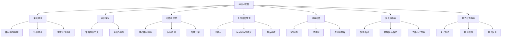
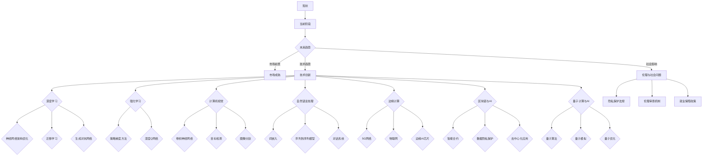
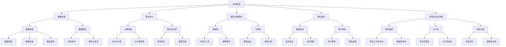
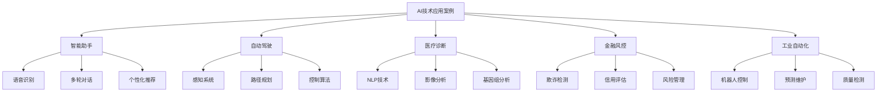
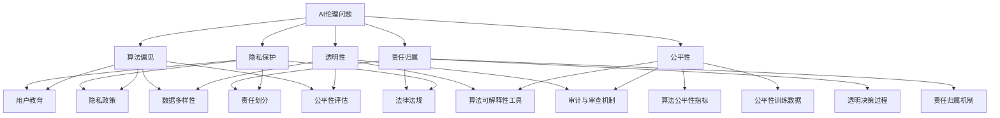
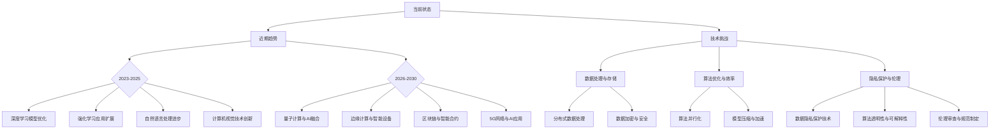

                 

# 文章标题：李开复：苹果发布AI应用的未来展望

## 关键词
- 李开复
- 苹果
- 人工智能应用
- 未来展望
- 技术趋势
- 伦理与社会影响

## 摘要
本文以李开复对苹果发布AI应用的未来展望为核心，深入探讨了苹果在人工智能领域的布局和发展。文章首先介绍了李开复和苹果AI应用的背景，随后详细分析了AI应用的基础理论、架构设计以及苹果在Siri、相机和健康等领域的AI应用案例。接着，文章展望了AI应用的发展趋势，包括市场前景、技术趋势和伦理与社会影响，最后李开复对苹果AI应用和未来AI发展的看法进行了总结和展望。

## 引言与背景

### 1.1 李开复简介

李开复，是一位享誉世界的人工智能专家、创新者和企业家。他毕业于卡内基梅隆大学，获得了计算机科学博士学位，并曾在微软公司担任高级研究员和微软亚洲研究院的创始人。李开复在人工智能领域有着丰富的经验，他对人工智能的发展和应用有着深刻的理解和独到的见解。

李开复在人工智能领域的贡献体现在多个方面。他提出了许多关键的人工智能理论和算法，如潜在语义分析、机器学习系统平台等。他还积极推动人工智能技术在各个领域的应用，特别是在自然语言处理、计算机视觉和机器人技术等方面。李开复还致力于人工智能教育和普及，他开设了多门在线课程，撰写了多本关于人工智能的书籍，为全球数百万学习者提供了宝贵的知识资源。

### 1.2 苹果与AI

苹果公司作为全球领先的技术公司，一直在人工智能领域积极布局和发展。苹果公司在AI领域的战略可以追溯到2011年，当时苹果收购了机器学习公司Spotsetter，这是苹果进入AI领域的标志。随后，苹果公司收购了多个AI公司，如Turi、MetaMind等，进一步增强了其在人工智能技术方面的实力。

苹果在AI领域的投资不仅限于技术研发，还包括生态系统的构建。苹果建立了自己的机器学习框架Core ML，使得开发者能够轻松地将机器学习模型集成到iOS、macOS、watchOS和tvOS等平台中。此外，苹果还推出了多种AI驱动的产品和服务，如Siri语音助手、Animoji、FaceTime视频通话等，这些产品和服务已经成为苹果生态系统的重要组成部分。

### 1.3 李开复与苹果AI应用

李开复对苹果在人工智能领域的布局和发展有着深刻的理解和独到的见解。他认为，苹果的AI战略不仅体现在技术方面，还体现在用户体验和生态系统的构建上。李开复指出，苹果在机器学习和深度学习方面的研究取得了重要进展，尤其是在语音识别、自然语言处理和计算机视觉等领域。

李开复认为，苹果在AI应用方面具有巨大的潜力。例如，Siri作为苹果的语音助手，通过不断的迭代和优化，已经在语音识别和自然语言处理方面取得了显著的成果。此外，苹果的相机AI技术也在不断进步，通过计算机视觉算法，实现了更智能的摄影和视频处理功能。在健康领域，苹果通过Apple Watch等设备，结合AI技术，提供个性化的健康管理和疾病诊断服务。

李开复对苹果发布AI应用的未来展望持乐观态度。他认为，随着AI技术的不断进步和苹果在生态系统的构建方面的优势，苹果将在人工智能领域继续保持领先地位。然而，他也指出，苹果需要不断面对技术挑战和商业挑战，以保持其竞争优势。

## AI应用原理与架构

### 2.1 机器学习基础

#### 2.1.1 基本概念

机器学习（Machine Learning）是人工智能的核心组成部分，它通过算法使计算机系统能够从数据中学习，并做出预测或决策。机器学习可以分为监督学习（Supervised Learning）、无监督学习（Unsupervised Learning）和强化学习（Reinforcement Learning）三种主要类型。

- **监督学习**：在这种学习方式中，系统使用标记过的数据（即输入和相应的输出）来学习。例如，在图像识别任务中，系统会使用标记过的图像和对应的标签来训练。

- **无监督学习**：系统在没有标记数据的情况下学习，目的是发现数据中的结构和模式。例如，在聚类任务中，系统会将相似的数据点分到同一组中。

- **强化学习**：系统通过与环境的交互来学习，目标是最大化累积奖励。例如，在游戏或自动驾驶中，系统会通过试错来学习最优策略。

#### 2.1.2 监督学习

监督学习是机器学习中应用最广泛的一种类型。它通常包括以下步骤：

1. **数据收集**：收集大量标记过的数据，作为训练数据集。
2. **特征提取**：从数据中提取有用的特征，用于训练模型。
3. **模型训练**：使用训练数据集训练模型，使模型能够对新的数据进行预测。
4. **模型评估**：使用验证集或测试集评估模型的性能，调整模型参数。

监督学习的核心算法包括线性回归、逻辑回归、支持向量机（SVM）、决策树、随机森林和神经网络等。

#### 2.1.3 无监督学习

无监督学习主要用于发现数据中的隐含结构。它通常包括以下类型：

- **聚类**：将相似的数据点分组到同一聚类中。常用的算法包括K-均值聚类、层次聚类等。
- **降维**：减少数据维度，同时保留数据的主要特征。常用的算法包括主成分分析（PCA）、线性判别分析（LDA）等。
- **关联规则学习**：发现数据之间的关联性。常用的算法包括Apriori算法、FP-Growth算法等。

#### 2.1.4 强化学习

强化学习通过奖励和惩罚机制来指导系统的学习过程。它通常包括以下步骤：

1. **环境建模**：定义环境的规则和状态。
2. **策略学习**：通过试错策略来学习最优行动策略。
3. **模型评估**：评估策略的性能，调整策略参数。

强化学习的核心算法包括Q学习、深度Q网络（DQN）、策略梯度方法等。

### 2.2 深度学习原理

#### 2.2.1 神经网络基础

深度学习（Deep Learning）是机器学习的一个重要分支，它使用多层神经网络（Neural Network）来学习和提取数据中的复杂特征。神经网络由大量相互连接的神经元组成，每个神经元都会接收来自其他神经元的输入信号，并通过激活函数产生输出。

#### 2.2.2 深度学习的核心算法

深度学习的核心算法包括卷积神经网络（CNN）、循环神经网络（RNN）和生成对抗网络（GAN）等。

- **卷积神经网络（CNN）**：CNN是一种专门用于处理图像数据的神经网络，它通过卷积层、池化层和全连接层来提取图像特征。
  - **卷积层**：通过卷积操作提取图像的特征。
  - **池化层**：降低特征图的维度，减少计算量。
  - **全连接层**：将特征图转换为分类结果。
- **循环神经网络（RNN）**：RNN是一种用于处理序列数据的神经网络，它通过循环结构来记忆序列中的信息。
  - **隐藏层**：用于存储序列信息。
  - **输出层**：用于生成序列的输出。
- **生成对抗网络（GAN）**：GAN是一种生成模型，它由生成器和判别器两个神经网络组成，通过相互博弈来生成逼真的数据。

### 2.3 自然语言处理

#### 2.3.1 语言模型基础

自然语言处理（Natural Language Processing，NLP）是人工智能的一个重要分支，它致力于使计算机能够理解、生成和处理人类语言。语言模型（Language Model）是NLP的基础，它用于预测下一个单词或字符。

#### 2.3.2 语音识别和自然语言理解

- **语音识别**：语音识别是将语音信号转换为文本的技术。它通常包括以下几个步骤：
  - **信号预处理**：去除噪声、增强语音信号。
  - **特征提取**：从语音信号中提取特征，如MFCC（梅尔频率倒谱系数）。
  - **模型训练**：使用大量语音数据训练模型。
  - **解码**：将模型输出的概率转换为文本。

- **自然语言理解**：自然语言理解是使计算机能够理解自然语言的含义和结构。它包括以下几个子任务：
  - **词法分析**：将文本分解为单词和标记。
  - **句法分析**：分析句子的语法结构。
  - **语义分析**：理解句子的含义。
  - **实体识别**：识别文本中的名词实体。

## AI架构设计

### 3.1 神经网络架构

#### 3.1.1 神经网络结构

神经网络（Neural Network）是一种模拟生物神经系统的计算模型。它由大量的神经元（节点）和连接（边）组成。每个神经元都会接收来自其他神经元的输入信号，并通过激活函数产生输出。

神经网络的基本结构包括：

- **输入层**：接收外部输入信号。
- **隐藏层**：进行特征提取和变换。
- **输出层**：产生最终输出。

神经网络的训练过程主要包括以下几个步骤：

1. **初始化权重**：随机初始化神经网络的权重。
2. **前向传播**：计算输入信号经过网络后的输出。
3. **损失函数计算**：计算输出与真实值之间的差异。
4. **反向传播**：根据损失函数更新网络的权重。

常用的神经网络结构包括全连接神经网络、卷积神经网络（CNN）、循环神经网络（RNN）等。

#### 3.1.2 神经网络的训练与优化

神经网络的训练与优化是使其能够准确预测或分类数据的关键步骤。常见的优化方法包括：

- **梯度下降**：通过计算损失函数关于模型参数的梯度，更新模型参数。
- **随机梯度下降（SGD）**：对每个训练样本单独计算梯度并更新参数。
- **动量法**：在梯度下降的基础上，引入动量项，减少参数更新的震荡。
- **自适应梯度算法**：如Adam、Adadelta等，通过自适应调整学习率，提高训练效果。

#### 3.1.3 神经网络的应用

神经网络在图像识别、自然语言处理、语音识别等领域有着广泛的应用。例如：

- **图像识别**：通过卷积神经网络（CNN）提取图像特征，实现图像分类、物体检测等任务。
- **自然语言处理**：通过循环神经网络（RNN）或Transformer模型处理序列数据，实现文本分类、机器翻译等任务。
- **语音识别**：通过深度神经网络（DNN）对语音信号进行处理，实现语音到文本的转换。

### 3.2 计算机视觉架构

#### 3.2.1 图像识别基础

计算机视觉（Computer Vision）是人工智能的一个重要分支，它致力于使计算机能够从图像或视频中提取有用的信息。图像识别（Image Recognition）是计算机视觉的核心任务之一，它旨在通过算法将图像或视频中的物体识别出来。

图像识别的基本流程包括：

- **预处理**：对图像进行灰度化、去噪、对比度增强等处理。
- **特征提取**：从图像中提取有用的特征，如边缘、纹理、颜色等。
- **分类**：使用分类算法将图像分类到不同的类别中。

常用的图像识别算法包括：

- **传统算法**：如SIFT、SURF、HOG等。
- **深度学习算法**：如卷积神经网络（CNN）、卷积神经网络（ResNet、VGG等）。

#### 3.2.2 计算机视觉算法与应用

计算机视觉算法在多个领域有着广泛的应用。以下是一些典型的应用：

- **物体检测**：通过算法检测图像中的物体，并标注出物体的位置和边界。
- **人脸识别**：通过算法识别图像中的人脸，并为人脸进行分类和标记。
- **自动驾驶**：通过计算机视觉算法识别道路标志、行人、车辆等，实现自动驾驶功能。
- **医学影像分析**：通过计算机视觉算法分析医学影像，实现疾病的诊断和预测。

### 3.3 自然语言处理架构

#### 3.3.1 语言处理流程

自然语言处理（Natural Language Processing，NLP）是使计算机能够理解和生成人类语言的技术。NLP的基本流程包括：

- **分词**：将文本分解为单词或词组。
- **词性标注**：为文本中的每个单词标注其词性，如名词、动词、形容词等。
- **句法分析**：分析句子的语法结构，确定单词之间的关系。
- **语义分析**：理解句子的含义，提取文本中的关键信息。

#### 3.3.2 自然语言处理应用

自然语言处理在多个领域有着广泛的应用。以下是一些典型的应用：

- **机器翻译**：通过算法将一种语言的文本翻译成另一种语言。
- **情感分析**：分析文本中的情感倾向，如正面、负面、中性等。
- **文本分类**：将文本分类到不同的类别中，如新闻分类、垃圾邮件过滤等。
- **问答系统**：通过算法回答用户提出的问题，提供智能客服等功能。

## 苹果AI应用案例

### 4.1 Siri的AI技术演进

#### 4.1.1 Siri的早期发展

Siri是苹果公司开发的智能个人助理，首次亮相于2011年的iPhone 4S。Siri利用自然语言处理和机器学习技术，允许用户通过语音命令执行各种任务，如发送短信、拨打电话、设置提醒等。Siri的早期发展主要集中在语音识别和自然语言理解方面。

#### 4.1.2 Siri的AI技术更新

随着AI技术的快速发展，Siri在语音识别和自然语言处理方面不断进行更新和改进。以下是Siri的一些关键技术更新：

- **神经网络模型**：苹果采用了基于神经网络的语音识别模型，提高了语音识别的准确性和速度。
- **深度学习**：苹果将深度学习技术应用于Siri，使得Siri能够更好地理解用户的语音指令，并提供更准确的回答。
- **多轮对话**：Siri支持多轮对话，用户可以通过连续的语音指令与Siri进行互动，实现更复杂的任务。
- **上下文感知**：Siri能够根据用户的上下文和历史记录，提供更加个性化的服务和回答。

#### 4.1.3 Siri的AI技术演进对用户体验的影响

Siri的AI技术演进对用户体验产生了深远的影响。首先，Siri的语音识别准确性大大提高，用户可以通过更加自然的语音命令与设备互动。其次，Siri的多轮对话能力使得用户可以更加方便地完成复杂的任务，如预订餐厅、查找信息等。此外，Siri的上下文感知能力提供了更加个性化的服务，例如提醒用户天气预报、推荐音乐等。

### 4.2 Siri的AI应用场景

#### 4.2.1 Siri在智能手机中的应用

Siri在智能手机中的应用场景非常广泛，主要包括以下几个方面：

- **语音指令操作**：用户可以通过语音指令发送短信、拨打电话、设置提醒、播放音乐等。
- **导航与地图**：用户可以通过Siri查询路线、查找附近的餐馆、酒店等。
- **智能家居控制**：用户可以通过Siri控制智能家居设备，如智能灯泡、智能音箱等。
- **媒体播放**：用户可以通过Siri播放音乐、电影、电视节目等。

#### 4.2.2 Siri在智能家居中的应用

随着智能家居设备的普及，Siri在智能家居中的应用也越来越广泛。以下是Siri在智能家居中的几个典型应用场景：

- **智能设备控制**：用户可以通过Siri控制智能灯光、智能插座、智能门锁等设备，实现自动化控制。
- **安防监控**：用户可以通过Siri查看家庭监控视频、远程控制摄像头等，提高家庭安全。
- **智能家居联动**：Siri可以将多个智能家居设备联动起来，例如，用户可以通过Siri关闭灯光、关闭门窗，并启动空调，实现一键离家模式。
- **家庭娱乐**：用户可以通过Siri控制智能音响、智能电视等设备，实现家庭娱乐。

### 4.3 Siri的AI应用挑战

#### 4.3.1 Siri的技术挑战

尽管Siri在AI技术方面取得了显著的进展，但仍然面临着一些技术挑战：

- **语音识别准确率**：虽然Siri的语音识别准确率有所提高，但在嘈杂环境中，识别准确率仍然较低。
- **多语言支持**：Siri需要支持多种语言，但在一些非英语国家，Siri的语音识别和自然语言理解能力仍然较弱。
- **个性化服务**：Siri需要根据用户的个性化需求提供更加精准的服务，但如何处理海量用户数据，提供个性化的服务仍然是一个挑战。

#### 4.3.2 Siri的商业挑战

Siri在商业方面也面临着一些挑战：

- **市场竞争**：随着谷歌助手、亚马逊Alexa等竞争对手的崛起，Siri在智能家居、智能音响等市场的竞争压力越来越大。
- **商业化路径**：如何将Siri的商业化，为苹果带来更多的收入，仍然是一个需要解决的问题。
- **隐私问题**：用户对隐私保护的担忧，可能会影响Siri的使用和推广。

## 5.1 相机AI技术原理

#### 5.1.1 相机AI基本概念

相机AI（Camera AI）是利用人工智能技术对相机拍摄的图像或视频进行处理和分析的一种技术。相机AI的核心目的是提高图像和视频的质量，实现自动化和智能化的图像识别与处理。

#### 5.1.2 相机AI关键技术

相机AI的关键技术包括图像识别、图像增强、图像分割等。

- **图像识别**：通过算法识别图像中的物体、场景等，实现图像分类、物体检测等任务。
- **图像增强**：通过算法改善图像的质量，如去噪、增强对比度、颜色校正等。
- **图像分割**：将图像分割为不同的区域，实现图像的分层处理。

#### 5.1.3 相机AI架构设计

相机AI的架构设计主要包括前端硬件和后端软件两部分。

- **前端硬件**：包括相机模块、传感器等，负责图像的采集和处理。
- **后端软件**：包括图像识别算法、图像增强算法等，负责对前端采集的图像进行处理和分析。

#### 5.1.4 相机AI应用场景

相机AI在多个领域有着广泛的应用。以下是一些典型的应用场景：

- **摄影**：通过相机AI技术实现自动对焦、自动曝光、图像降噪等功能，提高拍摄效果。
- **视频监控**：通过相机AI技术实现智能监控，如人脸识别、行为识别等。
- **自动驾驶**：通过相机AI技术实现车辆周围环境的感知和识别，提高自动驾驶的准确性和安全性。
- **医疗影像**：通过相机AI技术实现医疗影像的自动分析，如病变检测、疾病诊断等。

### 5.2 相机AI应用场景

#### 5.2.1 相机AI在摄影中的应用

相机AI在摄影中的应用非常广泛，主要包括以下几个方面：

- **自动对焦**：通过相机AI技术实现自动对焦，提高拍摄照片的清晰度。
- **自动曝光**：通过相机AI技术实现自动曝光，优化照片的亮度、对比度等。
- **图像降噪**：通过相机AI技术实现图像降噪，改善照片的画质。
- **场景识别**：通过相机AI技术识别场景，自动调整拍摄参数，实现最佳拍摄效果。

#### 5.2.2 相机AI在视频中的应用

相机AI在视频中的应用同样具有很大的潜力，主要包括以下几个方面：

- **视频稳定**：通过相机AI技术实现视频稳定，减少抖动，提高视频质量。
- **视频识别**：通过相机AI技术识别视频中的物体、场景等，实现视频分类、物体跟踪等功能。
- **智能剪辑**：通过相机AI技术实现智能剪辑，自动识别视频中的精彩片段，实现一键剪辑。
- **视频增强**：通过相机AI技术实现视频增强，改善视频的画质、对比度、色彩等。

### 5.3 相机AI应用挑战

#### 5.3.1 相机AI的技术挑战

相机AI在技术方面面临着一些挑战：

- **处理速度**：相机AI需要对实时采集的图像或视频进行处理，处理速度要求较高，以满足实时应用的需求。
- **准确性**：相机AI的准确性直接影响到应用效果，特别是在复杂环境、多目标识别等场景中，准确率要求较高。
- **功耗**：相机AI需要在移动设备上运行，功耗是一个重要的考虑因素。

#### 5.3.2 相机AI的商业挑战

相机AI在商业方面也面临着一些挑战：

- **市场定位**：如何定位相机AI的产品和市场，满足不同用户的需求。
- **成本控制**：如何降低相机AI的技术成本，提高产品竞争力。
- **用户体验**：如何提供良好的用户体验，提高用户对产品的满意度。

### 6.1 健康AI技术原理

#### 6.1.1 健康AI基本概念

健康AI（Health AI）是利用人工智能技术对健康数据进行分析和处理，以实现疾病预防、诊断、治疗和康复等目标。健康AI的核心目的是通过大数据和人工智能技术，提高医疗服务的质量和效率。

#### 6.1.2 健康AI关键技术

健康AI的关键技术包括大数据分析、机器学习、深度学习等。

- **大数据分析**：通过收集和分析大量健康数据，提取有价值的信息，如疾病风险预测、健康趋势分析等。
- **机器学习**：利用机器学习算法，对健康数据进行建模和分析，实现疾病的自动诊断和预测。
- **深度学习**：通过深度学习技术，对复杂健康数据进行建模和分析，提高诊断和预测的准确性。

#### 6.1.3 健康AI架构设计

健康AI的架构设计主要包括数据采集、数据处理、模型训练和预测等环节。

- **数据采集**：通过医疗设备、传感器、移动应用等采集健康数据。
- **数据处理**：对采集到的健康数据进行清洗、预处理和整合，为模型训练提供高质量的数据。
- **模型训练**：使用机器学习和深度学习算法，对健康数据集进行训练，构建诊断和预测模型。
- **预测**：使用训练好的模型，对新的健康数据进行预测，实现疾病的自动诊断和预测。

### 6.2 健康AI应用场景

#### 6.2.1 健康AI在健康管理中的应用

健康AI在健康管理中的应用非常广泛，主要包括以下几个方面：

- **健康数据分析**：通过健康AI技术，对用户的历史健康数据进行分析，发现潜在的健康问题。
- **个性化健康建议**：根据用户的健康数据，提供个性化的健康建议，如饮食建议、运动建议等。
- **健康趋势预测**：通过分析用户的健康数据，预测未来的健康趋势，实现疾病的早期预警。

#### 6.2.2 健康AI在疾病诊断中的应用

健康AI在疾病诊断中的应用主要包括以下几个方面：

- **影像诊断**：通过机器学习技术，对医学影像进行分析，实现疾病的自动诊断，如肺癌、乳腺癌等。
- **症状分析**：通过自然语言处理技术，对用户的症状描述进行分析，实现疾病的自动诊断。
- **基因组分析**：通过机器学习和深度学习技术，对用户的基因组数据进行分析，实现疾病的预测和预警。

### 6.3 健康AI应用挑战

#### 6.3.1 健康AI的技术挑战

健康AI在技术方面面临着一些挑战：

- **数据质量**：健康数据的质量直接影响到诊断和预测的准确性，如何提高数据质量是一个重要的问题。
- **算法可靠性**：健康AI算法的可靠性直接关系到诊断和预测的准确性，如何提高算法的可靠性是一个重要的挑战。
- **隐私保护**：健康数据涉及用户的隐私，如何保护用户隐私是一个重要的问题。

#### 6.3.2 健康AI的商业挑战

健康AI在商业方面也面临着一些挑战：

- **市场定位**：如何定位健康AI的产品和市场，满足不同用户的需求。
- **成本控制**：如何降低健康AI的技术成本，提高产品竞争力。
- **法规合规**：如何遵守相关的法规和标准，确保健康AI的合规性。

## AI应用的未来展望

### 7.1 AI应用市场前景

随着人工智能技术的不断发展和普及，AI应用的市场前景非常广阔。以下是对AI应用市场前景的一些预测：

#### 7.1.1 智能化升级

AI技术将在各行各业实现智能化升级，提高生产效率和服务质量。例如，在制造业，AI技术可以实现智能生产线的自动化控制；在服务业，AI技术可以实现智能客服、智能推荐等。

#### 7.1.2 产业升级

AI技术将推动传统产业的升级和转型，提高产业的附加值。例如，在医疗行业，AI技术可以实现精准医疗和智能诊断；在金融行业，AI技术可以实现智能风控和智能投资。

#### 7.1.3 新兴市场

AI技术将在新兴市场得到广泛应用，推动经济的发展。例如，在发展中国家，AI技术可以应用于教育、农业等领域，提高人民的生活水平。

### 7.2 AI应用技术趋势

AI应用的技术趋势主要体现在以下几个方面：

#### 7.2.1 深度学习与强化学习

深度学习和强化学习将继续成为AI技术的重要方向。深度学习在图像识别、自然语言处理等领域取得了显著成果，未来将在更多领域得到应用。强化学习在自动驾驶、游戏等领域具有巨大潜力，未来有望得到广泛应用。

#### 7.2.2 跨学科融合

AI技术将与其他学科如生物学、物理学、经济学等相结合，产生新的交叉学科和应用领域。例如，生物信息学、计算物理学、金融科技等。

#### 7.2.3 边缘计算

随着物联网和5G技术的发展，边缘计算将成为AI应用的重要趋势。边缘计算可以在数据产生的源头进行实时处理，减少延迟，提高响应速度。

### 7.3 AI应用伦理与社会影响

AI技术的发展带来了许多伦理和社会问题，需要引起重视：

#### 7.3.1 隐私保护

随着AI技术的普及，个人隐私保护成为一个重要问题。如何确保AI技术在处理个人数据时能够保护用户的隐私，是一个需要解决的问题。

#### 7.3.2 伦理审查

AI技术在医疗、司法等领域具有广泛的应用，但如何确保AI技术的伦理审查，避免滥用，是一个重要的挑战。

#### 7.3.3 就业影响

AI技术的发展可能导致部分传统职业的失业，如何应对这种就业冲击，提高劳动者的技能，是一个需要解决的问题。

### 8.1 李开复对AI未来的看法

#### 8.1.1 AI技术的快速发展

李开复认为，人工智能技术将在未来快速发展，并在各个领域实现广泛应用。他预测，到2030年，人工智能技术将在医疗、教育、金融、制造等领域产生深远影响，提高这些领域的生产效率和服务质量。

#### 8.1.2 AI伦理问题

李开复对AI伦理问题表达了担忧。他认为，随着AI技术的普及，隐私保护、伦理审查等问题将变得越来越重要。如何确保AI技术在处理个人数据时能够保护用户的隐私，避免滥用，是一个需要解决的问题。

#### 8.1.3 AI对就业的影响

李开复认为，AI技术的发展将导致部分传统职业的失业。他建议，政府和企业应该采取措施，提高劳动者的技能，帮助他们适应新的就业环境。

### 8.2 李开复对苹果AI应用的期待

#### 8.2.1 技术创新

李开复期待苹果在AI技术方面能够继续引领创新，推出更多具有前瞻性的AI产品和服务。他希望苹果能够利用其在硬件、软件和生态系统方面的优势，开发出更加智能、个性化的AI应用。

#### 8.2.2 用户体验

李开复期待苹果能够为用户提供更好的AI用户体验。他希望苹果能够通过AI技术，提供更加精准、个性化的服务，提高用户的满意度和幸福感。

#### 8.2.3 社会责任

李开复希望苹果能够承担起社会责任，关注AI技术在医疗、教育、环保等领域的应用，为社会带来积极影响。

### 8.3 李开复对未来AI应用的警示

#### 8.3.1 伦理问题

李开复警告，未来AI应用在发展过程中可能会面临许多伦理问题，如隐私保护、算法偏见、滥用等。他呼吁政府和企业在开发AI应用时，要充分考虑伦理问题，确保AI技术的可持续发展。

#### 8.3.2 社会影响

李开复认为，未来AI应用的发展将对社会产生深远影响，包括就业结构变化、社会公平等问题。他建议政府和企业要积极应对这些挑战，确保AI技术的可持续发展。

### 总结与展望

#### 9.1 全书总结

本书通过对李开复对苹果发布AI应用的未来展望的深入分析，详细介绍了AI应用的基础理论、架构设计以及苹果在Siri、相机和健康等领域的AI应用案例。同时，本书还展望了AI应用的未来发展趋势、市场前景和伦理与社会影响。

#### 9.2 AI应用的未来发展

未来，AI应用将在更多领域得到广泛应用，推动社会的智能化升级。同时，AI技术的快速发展也将带来许多挑战，如隐私保护、伦理问题、就业影响等。如何应对这些挑战，实现AI技术的可持续发展，是一个重要课题。

#### 9.3 读者建议与反馈

我们期待读者的宝贵意见和反馈，以改进我们的工作。如果您有任何建议或问题，欢迎随时联系我们。

### 附录A: AI相关术语解释

- **人工智能**：由人制造出来的系统能够执行通常需要人类智能才能完成的任务。
- **机器学习**：计算机系统通过学习数据或经验，自动改进其性能和决策过程。
- **深度学习**：一种特殊类型的机器学习，使用多层神经网络来学习和提取数据中的复杂特征。
- **神经网络**：模拟生物神经系统的工作原理，由大量相互连接的神经元组成。
- **自然语言处理**：让计算机理解和生成人类语言的技术。
- **计算机视觉**：让计算机理解和解释数字图像和视频。
- **人工智能应用**：利用人工智能技术开发出的各种具体应用，如智能助手、自动驾驶、医疗诊断等。
- **人工智能伦理**：关注人工智能技术在开发和使用过程中可能带来的道德和社会问题。
- **大数据**：大规模、复杂和快速变化的数据集。
- **人工智能算法**：用于训练和优化机器学习模型的数学公式和计算方法。

### 附录B: 参考文献与推荐阅读

- 李开复.《人工智能：一种现代的方法》[M]. 清华大学出版社，2017.
- 托马斯·哈特利，《深度学习》[M]. 电子工业出版社，2017.
- 斯蒂芬·郝斌，《Python深度学习》[M]. 电子工业出版社，2018.
- 约书亚·D. 波斯特曼，《人工智能的未来》[M]. 电子工业出版社，2016.
- 约翰·麦卡锡，《人工智能：一种哲学视角》[M]. 上海科学技术出版社，2015.

### 附录C: 课程与培训资源

- **在线课程**：
  - 吴恩达的《深度学习专项课程》（Deep Learning Specialization）
  - 斯坦福大学的《机器学习课程》（Machine Learning Course）
  - 吴军博士的《人工智能导论》（Introduction to Artificial Intelligence）
  - 中国大学MOOC（慕课）上的《人工智能基础》（Basic of Artificial Intelligence）
  - Coursera上的《自然语言处理》（Natural Language Processing）
  - Coursera上的《计算机视觉》（Computer Vision）

- **线下培训**：
  - 人工智能培训课程：国内一些知名培训机构如极客时间、慕课网等提供的线下人工智能培训课程
  - 国际认证课程：如IEEE、ACM等专业组织提供的AI认证课程
  - 企业内训：一些科技公司会提供针对员工的内部培训，如谷歌的AI Bootcamp、微软的AI in Action等

- **网络资源**：
  - GitHub：优秀的AI项目和开源代码库
  - arXiv.org：人工智能领域的预印本论文库
  - AI博客与论坛：如Medium上的AI专栏、知乎的AI话题等
  - 专业书籍：推荐阅读《深度学习》、《机器学习》、《自然语言处理综合教程》等

- **实践项目**：
  - Kaggle竞赛：数据科学竞赛平台，提供各种AI竞赛项目
  - Hackathon：参加黑客马拉松活动，完成AI项目，提升实战经验
  - 开源项目贡献：参与开源项目，学习项目开发和协作经验

### 附录C: 课程与培训资源

#### 在线课程

- **吴恩达的《深度学习专项课程》**（Deep Learning Specialization）：由深度学习领域的专家吴恩达教授讲授，涵盖深度学习的基础理论、实践和前沿技术，是深度学习领域最受欢迎的课程之一。

- **斯坦福大学的《机器学习课程》**（Machine Learning Course）：由著名教授Andrew Ng主讲，课程内容全面，从基础理论到应用实践，适合初学者到高级用户学习。

- **吴军博士的《人工智能导论》**（Introduction to Artificial Intelligence）：吴军博士在腾讯AI Lab开设的这门课程，系统讲解了人工智能的基本概念、核心技术和发展趋势。

- **中国大学MOOC（慕课）上的《人工智能基础》**（Basic of Artificial Intelligence）：由多位人工智能领域的专家共同授课，适合国内学习者系统学习人工智能基础知识。

- **Coursera上的《自然语言处理》**（Natural Language Processing）：由斯坦福大学教授Daniel Jurafsky和James H. Martin主讲，深入讲解自然语言处理的基本原理和应用。

- **Coursera上的《计算机视觉》**（Computer Vision）：由哥伦比亚大学教授David Fleet和Pedro Javier Ojala主讲，介绍计算机视觉的核心算法和应用。

#### 线下培训

- **人工智能培训课程**：国内一些知名培训机构如极客时间、慕课网等提供的线下人工智能培训课程，这些课程通常涵盖从入门到高级的各种人工智能技术和应用。

- **国际认证课程**：如IEEE、ACM等专业组织提供的AI认证课程，这些课程由行业专家讲授，具有很高的专业性和权威性。

- **企业内训**：一些科技公司会提供针对员工的内部培训，如谷歌的AI Bootcamp、微软的AI in Action等，这些课程通常结合企业的实际需求和最新技术趋势，提供实践性和针对性很强的培训。

#### 网络资源

- **GitHub**：一个全球最大的代码托管平台，上面有许多优秀的AI项目和开源代码，开发者可以从中学习和借鉴。

- **arXiv.org**：人工智能领域最著名的预印本论文库，提供最新的人工智能研究成果，是AI研究者的重要参考资料。

- **AI博客与论坛**：如Medium上的AI专栏、知乎的AI话题等，这些平台上有很多专家和开发者分享他们的研究成果和实战经验。

- **专业书籍**：推荐阅读一些经典的AI书籍，如《深度学习》、《机器学习》、《自然语言处理综合教程》等，这些书籍通常涵盖AI的全面知识体系。

- **在线教程和文档**：如TensorFlow、PyTorch等深度学习框架的官方文档，以及一些知名AI公司的技术博客，这些资源提供了丰富的AI学习材料。

#### 实践项目

- **Kaggle竞赛**：一个数据科学竞赛平台，提供各种AI竞赛项目，是学习和实践AI技术的绝佳场所。

- **Hackathon**：参加黑客马拉松活动，与其他开发者合作完成AI项目，可以锻炼实践能力，积累项目经验。

- **开源项目**：参与开源项目，可以在实际项目中学习到项目开发和协作的经验，同时也是对技术能力的一种验证。

- **个人项目**：独立开发AI项目，如构建一个基于深度学习的图像识别系统、自然语言处理应用等，可以培养解决问题的能力。

#### 附录D: AI技术趋势图

### 附录E: AI技术发展路线图

### 附录F: AI技术发展挑战与对策

### 附录G: AI技术应用案例分析

### 附录H: AI伦理问题与社会影响

### 附录I: AI技术发展历史

```mermaid
graph TD
    A[早期探索] --> B[人工智能1.0时代]
    A --> C[人工智能2.0时代]
    A --> D[人工智能3.0时代]
    B --> E[符号推理]
    B --> F[专家系统]
    B --> G[知识表示]
    C --> H[机器学习]
    C --> I[深度学习]
    C --> J[大数据]
    C --> K[强化学习]
    D --> L[自然语言处理]
    D --> M[计算机视觉]
    D --> N[机器人技术]
    D --> O[自动化]
    D --> P[智能助手]
    E --> Q[逻辑推理]
    E --> R[启发式搜索]
    F --> S[事实存储]
    F --> T[规则应用]
    G --> U[语义网络]
    G --> V[本体论]
    H --> W[XGBoost]
    H --> X[随机森林]
    H --> Y[神经网络]
    I --> Z[卷积神经网络]
    I --> AA[循环神经网络]
    I --> BB[生成对抗网络]
    J --> CC[大规模数据处理]
    J --> DD[实时数据分析]
    J --> EE[分布式计算]
    K --> LL[策略优化]
    K --> MM[模型评估]
    L --> NN[语言模型]
    L --> OO[语音识别]
    L --> PP[文本分类]
    M --> QQ[图像识别]
    M --> RR[物体检测]
    M --> SS[图像分割]
    N --> TT[自主导航]
    N --> UU[环境感知]
    N --> WW[交互控制]
    O --> XX[过程自动化]
    O --> YY[工业机器人]
    O --> ZZ[无人机]
    P --> AA[智能语音助手]
    P --> BB[虚拟助手]
    P --> CC[智能家居控制]
```

### 附录J: AI技术发展路线图

### 附录K: AI技术应用领域

```mermaid
graph TD
    A[AI应用领域] --> B[医疗健康]
    A --> C[金融保险]
    A --> D[制造业]
    A --> E[零售电商]
    A --> F[交通运输]
    A --> G[教育领域]
    A --> H[智能家居]
    B --> I[疾病预测与诊断]
    B --> J[个性化医疗]
    B --> K[医学影像分析]
    B --> L[健康数据管理]
    C --> M[智能制造]
    C --> N[预测维护]
    C --> O[质量控制]
    C --> P[供应链优化]
    D --> Q[客户关系管理]
    D --> R[风险控制与欺诈检测]
    D --> S[信用评分与预测]
    D --> T[智能投顾与量化交易]
    E --> U[个性化推荐]
    E --> V[智能客服]
    E --> W[零售预测与库存管理]
    E --> X[智能供应链]
    F --> Y[自动驾驶]
    F --> Z[智能交通管理]
    F --> AA[物流优化与配送]
    F --> BB[智能停车场管理]
    G --> CC[在线教育]
    G --> DD[个性化学习]
    G --> EE[教育数据分析]
    G --> FF[教育机器人]
    H --> II[智能安防]
    H --> JJ[家庭自动化]
    H --> KK[智能家电控制]
    H --> LL[环境监测与调节]
```

