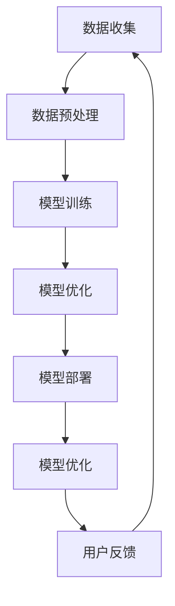

                 

# 文章标题：李开复：苹果发布AI应用的未来展望

> 关键词：苹果、AI应用、技术展望、深度学习、自然语言处理、图像识别

> 摘要：本文由世界顶级人工智能专家李开复撰写，深入探讨了苹果公司在AI应用领域的新动向。通过分析苹果AI应用的背景、原理、核心功能以及未来展望，本文为读者展现了苹果AI应用的发展潜力和技术挑战，旨在为广大IT从业者提供有价值的参考和启示。

### 《李开复：苹果发布AI应用的未来展望》目录大纲

- **第一部分：AI应用的背景与概述**
    - **第1章：AI与苹果公司**
        - **1.1 AI技术的发展与现状**
        - **1.2 苹果公司在AI领域的布局**
        - **1.3 苹果AI应用的市场定位**
    - **第2章：苹果AI应用的原理与架构**
        - **2.1 AI基础理论**
            - **2.1.1 机器学习基本概念**
            - **2.1.2 深度学习原理**
            - **2.1.3 自然语言处理基础**
        - **2.2 苹果AI应用的架构设计**
            - **2.2.1 模型训练与优化**
            - **2.2.2 模型部署与优化**
            - **2.2.3 模型安全性与隐私保护**

- **第二部分：苹果AI应用的核心功能**
    - **第3章：语音识别与交互**
        - **3.1 语音信号处理**
            - **3.1.1 语音信号采集与预处理**
            - **3.1.2 语音信号特征提取**
        - **3.2 语音识别算法**
            - **3.2.1 HMM模型**
            - **3.2.2 DNN模型**
            - **3.2.3 RNN模型**
        - **3.3 语音交互设计与实现**
            - **3.3.1 语音命令识别**
            - **3.3.2 语音情感分析**
            - **3.3.3 语音助手实现**
    - **第4章：图像识别与处理**
        - **4.1 图像处理基础**
            - **4.1.1 图像基本概念**
            - **4.1.2 图像预处理技术**
            - **4.1.3 图像特征提取**
        - **4.2 图像识别算法**
            - **4.2.1 传统图像识别算法**
            - **4.2.2 深度学习图像识别算法**
        - **4.3 图像处理应用**
            - **4.3.1 人脸识别**
            - **4.3.2 物体识别**
            - **4.3.3 资源监控**
    - **第5章：自然语言处理**
        - **5.1 语言模型与文本分类**
            - **5.1.1 语言模型构建**
            - **5.1.2 文本分类算法**
        - **5.2 情感分析与语义理解**
            - **5.2.1 情感分析算法**
            - **5.2.2 语义理解技术**
        - **5.3 文本生成与翻译**
            - **5.3.1 文本生成算法**
            - **5.3.2 翻译模型与技术**

- **第三部分：AI应用场景与实践**
    - **第6章：AI应用场景与实践**
        - **6.1 教育**
            - **6.1.1 智能教学系统**
            - **6.1.2 学业评价与反馈**
        - **6.2 健康**
            - **6.2.1 疾病诊断与预测**
            - **6.2.2 医疗影像分析与诊断**
        - **6.3 家庭自动化**
            - **6.3.1 智能家居系统**
            - **6.3.2 家庭助理机器人**

- **第四部分：AI应用的挑战与未来展望**
    - **第7章：AI应用的挑战与未来展望**
        - **7.1 AI应用的伦理问题**
            - **7.1.1 数据隐私与安全**
            - **7.1.2 AI歧视与公平性**
        - **7.2 AI应用的发展趋势**
            - **7.2.1 AI芯片与硬件**
            - **7.2.2 大模型与强AI**
        - **7.3 苹果公司AI应用的未来发展**
            - **7.3.1 新功能与技术创新**
            - **7.3.2 市场竞争与合作**

- **第五部分：AI应用的代码实战**
    - **第8章：AI应用开发环境搭建**
        - **8.1 硬件环境配置**
        - **8.2 软件环境配置**
    - **第9章：语音识别应用案例**
        - **9.1 数据预处理**
        - **9.2 模型训练与优化**
        - **9.3 语音识别应用实现**
    - **第10章：图像识别应用案例**
        - **10.1 数据预处理**
        - **10.2 模型训练与优化**
        - **10.3 图像识别应用实现**
    - **第11章：自然语言处理应用案例**
        - **11.1 数据预处理**
        - **11.2 模型训练与优化**
        - **11.3 自然语言处理应用实现**

- **附录：参考文献与资源**
    - **附录A：深度学习与AI相关书籍推荐**
    - **附录B：开源AI框架与工具介绍**
    - **附录C：在线学习资源与课程推荐**
    - **附录D：AI应用开发平台与工具使用指南**

## 第1章：AI与苹果公司

在当今世界，人工智能（AI）正以前所未有的速度变革着各行各业。作为全球科技产业的领导者，苹果公司（Apple Inc.）也早已意识到AI技术的重要性，并在多个领域展开了深度布局。本章将简要回顾AI技术的发展与现状，探讨苹果公司在AI领域的布局以及其AI应用的市场定位。

### 1.1 AI技术的发展与现状

AI技术的发展可以追溯到20世纪50年代，当时图灵提出了“图灵测试”的概念，标志着AI领域的诞生。经过数十年的发展，AI技术经历了多个阶段，从早期的符号推理、知识表示，到近几年的机器学习、深度学习，技术日趋成熟。

近年来，随着计算能力的提升、大数据的涌现以及算法的优化，AI技术迎来了快速发展。机器学习（Machine Learning）和深度学习（Deep Learning）成为AI技术的主流，通过数据驱动的方式实现了智能感知、推理和决策。

在AI技术的应用方面，自然语言处理、语音识别、图像识别、推荐系统、自动驾驶等领域取得了显著进展。例如，谷歌的AlphaGo在围棋比赛中击败人类顶尖选手，亚马逊的Alexa智能语音助手、特斯拉的自动驾驶汽车等，都展示了AI技术在实际应用中的强大潜力。

### 1.2 苹果公司在AI领域的布局

苹果公司一直在AI领域进行深耕，其布局可大致分为以下几个方面：

1. **硬件**：苹果公司自主研发了神经网络引擎（Neural Engine）和专用的AI芯片（如Apple A11和Bionic），为AI应用提供了强大的计算支持。这些硬件为苹果的AI应用提供了坚实的基础。

2. **软件**：苹果公司在操作系统（如iOS和macOS）、应用商店、开发工具（如Swift和Core ML）等方面进行了全面的AI布局。这些软件工具使得开发者能够轻松地将AI技术融入他们的应用程序中。

3. **AI研究**：苹果公司在全球范围内建立了多个AI研究实验室，并与学术界、产业界保持紧密合作，致力于推动AI技术的创新与发展。例如，苹果与斯坦福大学、MIT等知名高校的合作，就取得了许多突破性成果。

4. **产品应用**：苹果公司的产品线中，已经广泛应用了AI技术。例如，Siri语音助手、面部识别（Face ID）、照片分类和搜索等，都体现了苹果在AI领域的实力。

### 1.3 苹果AI应用的市场定位

苹果公司一直强调其产品的高品质和用户体验，其AI应用也不例外。在市场定位方面，苹果的AI应用主要瞄准以下几个方面：

1. **消费者市场**：苹果的AI应用主要集中在提高用户的生活质量和娱乐体验。例如，智能助手Siri、照片分类和搜索等功能，都旨在为用户提供便捷、高效的交互体验。

2. **开发者生态**：苹果通过提供丰富的开发工具和框架，吸引了大量的开发者加入其生态体系。这为苹果AI应用的持续创新和发展提供了源源不断的动力。

3. **企业市场**：苹果的AI技术也被广泛应用于企业级应用，如智能办公、数据分析等。通过与微软、谷歌等企业级巨头的竞争，苹果逐渐赢得了企业的信任和青睐。

总之，苹果公司在AI领域的布局和进展，不仅为其自身产品带来了显著的创新和竞争力，也为整个AI产业的发展提供了重要的参考和借鉴。在接下来的部分，我们将进一步探讨苹果AI应用的原理与架构，以及其核心功能的实现。## 第2章：苹果AI应用的原理与架构

苹果公司在AI领域的成功离不开其对AI原理和架构的深入研究和创新。本章将详细介绍AI基础理论、苹果AI应用的架构设计，包括模型训练与优化、模型部署与优化，以及模型安全性与隐私保护等方面的内容。

### 2.1 AI基础理论

AI技术主要基于以下几个核心理论：

#### 2.1.1 机器学习基本概念

机器学习（Machine Learning）是一门通过数据或以往的经验来推断未知模式或决策的学科。其主要目标是让计算机从数据中自动学习，并基于学习结果进行预测或决策。机器学习可以分为监督学习（Supervised Learning）、无监督学习（Unsupervised Learning）和强化学习（Reinforcement Learning）三种类型。

- **监督学习**：有标记的数据集进行训练，用于预测或分类。
- **无监督学习**：无标记的数据集进行训练，用于发现数据中的模式和结构。
- **强化学习**：通过与环境交互，学习最优策略以最大化回报。

#### 2.1.2 深度学习原理

深度学习（Deep Learning）是机器学习的一个分支，通过多层神经网络（Neural Networks）进行训练，以提取数据中的特征和模式。深度学习在图像识别、语音识别、自然语言处理等领域取得了显著的成功。

- **神经网络**：神经网络由多个神经元（节点）组成，每个神经元通过权重（Weight）连接到其他神经元，输入数据通过这些权重传输，最终输出结果。
- **前向传播（Forward Propagation）与反向传播（Back Propagation）**：在训练过程中，输入数据通过神经网络进行前向传播，计算输出结果。然后，通过反向传播计算误差，并调整网络权重以减小误差。

#### 2.1.3 自然语言处理基础

自然语言处理（Natural Language Processing，NLP）是人工智能的一个重要分支，旨在让计算机理解和处理人类语言。NLP的关键技术包括：

- **语言模型**：用于预测下一个单词或字符的概率。
- **词嵌入（Word Embedding）**：将单词映射到高维向量空间，以捕捉单词的语义信息。
- **文本分类**：将文本数据分类到预定义的类别中。
- **情感分析**：分析文本中表达的情感倾向。

### 2.2 苹果AI应用的架构设计

苹果AI应用的架构设计在硬件、软件和算法层面进行了全面的优化，以实现高效、准确和安全的AI应用。

#### 2.2.1 模型训练与优化

苹果AI模型的训练与优化主要涉及以下几个方面：

- **数据收集与处理**：苹果公司通过多个渠道收集大量数据，并进行预处理，以提高数据质量和模型的训练效果。
- **模型选择与调整**：根据具体任务需求，选择合适的模型架构，并进行参数调整，以优化模型性能。
- **分布式训练**：利用苹果的硬件优势，如GPU和TPU，进行分布式训练，加速模型训练过程。

#### 2.2.2 模型部署与优化

在模型部署方面，苹果采用了以下策略：

- **模型压缩与量化**：通过模型压缩和量化技术，降低模型的计算复杂度和存储空间，提高部署效率。
- **硬件加速**：利用神经网络引擎和专用AI芯片，实现模型的高效运行。
- **端到端优化**：从数据采集、模型训练到模型部署，整个流程进行端到端优化，确保模型在终端设备上具有最佳性能。

#### 2.2.3 模型安全性与隐私保护

苹果公司高度重视AI模型的安全性和隐私保护，采取了以下措施：

- **数据加密与去标识化**：在数据收集和处理过程中，对数据进行加密和去标识化处理，确保数据安全和隐私。
- **模型安全防护**：通过模型加密和签名技术，防止模型被篡改和恶意攻击。
- **隐私保护策略**：在模型训练和部署过程中，采用差分隐私（Differential Privacy）等技术，保护用户隐私。

### 2.3 核心技术的Mermaid流程图

以下是一个简化的Mermaid流程图，展示了苹果AI应用的模型训练、部署与优化的主要流程：



通过上述流程，苹果AI应用不断迭代和优化，以实现最佳性能和用户体验。

总之，苹果公司在AI应用的原理与架构设计方面，通过深入研究和创新，实现了高效、准确和安全的AI应用。在接下来的部分，我们将详细探讨苹果AI应用的核心功能，包括语音识别与交互、图像识别与处理、自然语言处理等。## 第3章：语音识别与交互

语音识别与交互是人工智能领域的重要分支，广泛应用于智能家居、智能助理、电话客服等多个场景。苹果公司在Siri语音助手等产品的开发中，对语音识别与交互技术进行了深入研究。本章将详细讨论语音信号处理、语音识别算法以及语音交互设计与实现。

### 3.1 语音信号处理

语音信号处理是语音识别的基础，主要包括语音信号的采集与预处理、语音信号特征提取等步骤。

#### 3.1.1 语音信号采集与预处理

1. **语音信号采集**：语音信号通常通过麦克风进行采集。高质量的音频设备能够捕捉更丰富的语音信息。

2. **语音信号预处理**：语音信号预处理包括去噪、静音检测、采样率转换等步骤。

   - **去噪**：去除语音信号中的噪声，如环境噪声、背景噪声等。常见的方法有滤波器、谱减法等。
   - **静音检测**：检测语音信号中的静音部分，以去除不必要的空白，提高后续处理的效率。
   - **采样率转换**：将音频信号从原始采样率转换到特定的采样率，以便后续处理。

#### 3.1.2 语音信号特征提取

语音信号特征提取是将语音信号转换为数值特征表示，以便于后续的算法处理。常见的语音特征包括：

- **时域特征**：包括幅度、过零率、短时能量等。
- **频域特征**：包括频谱、共振峰等。
- **倒谱特征**：通过频谱平滑化处理得到的特征，用于降低频谱噪声的影响。

### 3.2 语音识别算法

语音识别算法是实现语音到文本转换的关键。以下介绍几种常见的语音识别算法：

#### 3.2.1 HMM模型

隐马尔可夫模型（HMM）是早期应用广泛的语音识别模型。HMM假设语音信号是一个马尔可夫过程，通过定义状态转移概率、观测概率和初始状态概率来建模语音信号。

- **状态转移概率**：描述当前状态转换为下一状态的概率。
- **观测概率**：描述给定状态下的语音信号特征概率。
- **初始状态概率**：描述初始状态的概率分布。

HMM模型的伪代码如下：

```plaintext
function HMM_train(data):
    # 初始化参数
    A = 初始化状态转移概率矩阵
    B = 初始化观测概率矩阵
    π = 初始化初始状态概率向量

    # 计算观测概率矩阵B
    for state in states:
        for observation in observations:
            B[state, observation] = count(observations == observation | state) / count(state)

    # 计算状态转移概率矩阵A
    for state1 in states:
        for state2 in states:
            A[state1, state2] = count(states == state2 | states == state1) / count(states == state1)

    # 计算初始状态概率向量π
    π = 初始化初始状态概率分布

    return A, B, π
```

#### 3.2.2 DNN模型

深度神经网络（DNN）是一种基于多层神经元的神经网络模型，通过非线性变换和逐层特征提取，实现语音信号到文本的映射。DNN模型的优点在于能够自动学习语音信号中的复杂特征，从而提高识别精度。

- **卷积神经网络（CNN）**：用于提取语音信号中的局部特征，如频谱特征。
- **循环神经网络（RNN）**：用于处理序列数据，如语音信号的时间序列特征。
- **长短时记忆网络（LSTM）**：是一种改进的RNN模型，能够更好地处理长序列数据。

DNN模型的伪代码如下：

```plaintext
function DNN_train(data):
    # 初始化神经网络结构
    model = 初始化DNN模型

    # 训练模型
    for epoch in 1 to max_epochs:
        for batch in data:
            # 前向传播
            output = model.forward(batch.input)

            # 计算损失
            loss = model.loss(output, batch.target)

            # 反向传播
            model.backward(loss)

            # 更新模型参数
            model.update_params()

    return model
```

#### 3.2.3 RNN模型

循环神经网络（RNN）是一种能够处理序列数据的神经网络模型，通过记忆单元（Memory Unit）保存之前的输入信息，实现序列数据的建模。RNN在语音识别领域得到了广泛应用，尤其是长短期记忆网络（LSTM）和门控循环单元（GRU）等改进模型。

- **LSTM**：通过引入门控机制，解决了传统RNN的梯度消失问题，能够更好地处理长序列数据。
- **GRU**：是LSTM的简化版本，在保持较好性能的同时，降低了模型的复杂度。

RNN模型的伪代码如下：

```plaintext
function LSTM_train(data):
    # 初始化LSTM模型
    model = 初始化LSTM模型

    # 训练模型
    for epoch in 1 to max_epochs:
        for batch in data:
            # 前向传播
            output, hidden = model.forward(batch.input)

            # 计算损失
            loss = model.loss(output, batch.target)

            # 反向传播
            hidden = model.backward(loss, hidden)

            # 更新模型参数
            model.update_params(hidden)

    return model
```

### 3.3 语音交互设计与实现

语音交互设计是语音识别应用的核心，包括语音命令识别、语音情感分析以及语音助手实现等方面。

#### 3.3.1 语音命令识别

语音命令识别是将用户输入的语音命令转换为相应的操作指令。常见的方法包括：

- **基于模板匹配的方法**：将用户输入的语音与预定义的语音模板进行匹配，实现命令识别。
- **基于深度学习的方法**：通过训练深度神经网络模型，自动学习语音命令的特征，实现命令识别。

语音命令识别的伪代码如下：

```plaintext
function recognize_command(input):
    # 加载预训练的语音命令识别模型
    model = load_pretrained_command_model()

    # 对输入语音进行预处理和特征提取
    processed_input = preprocess_input(input)

    # 进行语音命令识别
    predicted_command = model.predict(processed_input)

    return predicted_command
```

#### 3.3.2 语音情感分析

语音情感分析是分析用户语音中的情感倾向，以便于提供更个性化的服务。常见的方法包括：

- **基于特征的方法**：通过提取语音信号的特征，如频谱特征、倒谱特征等，进行情感分类。
- **基于深度学习的方法**：通过训练深度神经网络模型，自动学习语音情感特征，实现情感分析。

语音情感分析的伪代码如下：

```plaintext
function analyze_emotion(input):
    # 加载预训练的语音情感分析模型
    model = load_pretrained_emotion_model()

    # 对输入语音进行预处理和特征提取
    processed_input = preprocess_input(input)

    # 进行语音情感分析
    predicted_emotion = model.predict(processed_input)

    return predicted_emotion
```

#### 3.3.3 语音助手实现

语音助手是实现语音交互的核心组件，能够响应用户的语音指令并提供相应的服务。常见的语音助手实现方法包括：

- **基于规则的方法**：通过定义一系列规则，实现语音命令的识别和响应。
- **基于深度学习的方法**：通过训练深度神经网络模型，自动学习语音命令和情感特征，实现智能响应。

语音助手实现的伪代码如下：

```plaintext
function handle_command(input):
    # 识别语音命令
    command = recognize_command(input)

    # 分析语音情感
    emotion = analyze_emotion(input)

    # 根据命令和情感提供相应服务
    if command == "查询天气":
        weather = get_weather()
        speak("今天的天气是：{}。".format(weather))
    elif emotion == "愤怒":
        apologize()
    else:
        speak("我理解您的需求，请稍等片刻。")
```

通过上述语音信号处理、语音识别算法和语音交互设计，苹果公司实现了高效、准确和自然的语音交互体验。在接下来的章节中，我们将继续探讨图像识别与处理、自然语言处理等核心功能。## 第4章：图像识别与处理

图像识别与处理是人工智能领域的重要分支，广泛应用于安防监控、医疗诊断、自动驾驶、人机交互等多个场景。苹果公司在图像识别领域取得了显著进展，如面部识别（Face ID）和照片分类等功能。本章将详细讨论图像处理基础、图像识别算法以及图像处理应用。

### 4.1 图像处理基础

图像处理是图像识别和计算机视觉的基础，主要包括图像基本概念、图像预处理技术和图像特征提取。

#### 4.1.1 图像基本概念

图像可以看作是一个二维信号，通常用矩阵表示。每个元素表示图像中的一个像素，像素的值表示该点的亮度或颜色。

- **分辨率**：图像的分辨率表示图像的清晰度，通常用像素数表示。
- **色彩模型**：常见的色彩模型包括RGB（红绿蓝）、HSV（色调、饱和度、亮度）等。

#### 4.1.2 图像预处理技术

图像预处理是图像处理的关键步骤，旨在提高图像质量和识别效果。常见的图像预处理技术包括：

- **滤波**：用于去除图像中的噪声，如高斯滤波、中值滤波等。
- **边缘检测**：用于提取图像中的边缘信息，如Canny边缘检测。
- **形态学操作**：用于处理图像中的结构信息，如膨胀、腐蚀、开运算、闭运算等。

#### 4.1.3 图像特征提取

图像特征提取是将图像转换为数值特征表示，以便于后续的算法处理。常见的图像特征包括：

- **颜色特征**：包括颜色直方图、颜色矩等。
- **纹理特征**：包括纹理能量、纹理方向等。
- **形状特征**：包括周长、面积、主轴方向等。

### 4.2 图像识别算法

图像识别算法是实现图像到类别转换的关键，主要分为传统图像识别算法和深度学习图像识别算法。

#### 4.2.1 传统图像识别算法

传统图像识别算法主要包括基于模板匹配、特征匹配等方法。

- **模板匹配**：通过将输入图像与预定义的模板进行匹配，实现图像识别。常见的方法包括 correlation、 cross-correlation等。
- **特征匹配**：通过提取图像特征，如颜色、纹理、形状等，进行特征匹配，实现图像识别。常见的方法包括 SIFT、SURF、ORB等。

传统图像识别算法的伪代码如下：

```plaintext
function template_matching(image, template):
    # 计算模板的能量
    template_energy = energy(template)

    # 计算图像的能量
    image_energy = energy(image)

    # 计算相关系数
    correlation = correlate(image, template)

    # 计算最小相关系数
    min_corr = min(correlation)

    # 计算匹配结果
    match_result = image - template + min_corr

    return match_result
```

#### 4.2.2 深度学习图像识别算法

深度学习图像识别算法是近年来图像识别领域的主要发展方向，通过多层神经网络进行特征提取和分类。常见的深度学习图像识别算法包括卷积神经网络（CNN）和循环神经网络（RNN）。

- **卷积神经网络（CNN）**：通过卷积层、池化层和全连接层，实现图像特征的自动提取和分类。常见的CNN模型包括 LeNet、AlexNet、VGG、ResNet等。
- **循环神经网络（RNN）**：通过循环结构，处理图像中的序列数据，如视频流。常见的RNN模型包括 LSTM、GRU等。

深度学习图像识别算法的伪代码如下：

```plaintext
function CNN_train(data):
    # 初始化CNN模型
    model = 初始化CNN模型

    # 训练模型
    for epoch in 1 to max_epochs:
        for batch in data:
            # 前向传播
            output = model.forward(batch.input)

            # 计算损失
            loss = model.loss(output, batch.target)

            # 反向传播
            model.backward(loss)

            # 更新模型参数
            model.update_params()

    return model
```

### 4.3 图像处理应用

图像处理技术在许多领域有着广泛的应用，以下介绍几个典型的应用场景：

#### 4.3.1 人脸识别

人脸识别是一种基于图像特征的生物识别技术，通过提取人脸图像的特征，实现身份验证和识别。常见的人脸识别算法包括基于特征的算法和基于深度学习的算法。

- **基于特征的算法**：通过提取人脸特征点，如眼睛、鼻子、嘴巴等，进行特征匹配和识别。
- **基于深度学习的算法**：通过训练深度神经网络模型，自动学习人脸特征，实现人脸识别。

人脸识别的伪代码如下：

```plaintext
function recognize_face(image):
    # 提取人脸特征
    features = extract_face_features(image)

    # 加载预训练的人脸识别模型
    model = load_pretrained_face_model()

    # 进行人脸识别
    predicted_face = model.predict(features)

    return predicted_face
```

#### 4.3.2 物体识别

物体识别是一种基于图像特征的物体分类技术，通过提取图像中的物体特征，实现物体识别和分类。常见的方法包括基于特征的物体识别和基于深度学习的物体识别。

- **基于特征的物体识别**：通过提取图像中的物体特征，如颜色、纹理、形状等，进行特征匹配和分类。
- **基于深度学习的物体识别**：通过训练深度神经网络模型，自动学习物体特征，实现物体识别和分类。

物体识别的伪代码如下：

```plaintext
function recognize_object(image):
    # 提取物体特征
    features = extract_object_features(image)

    # 加载预训练的物体识别模型
    model = load_pretrained_object_model()

    # 进行物体识别
    predicted_object = model.predict(features)

    return predicted_object
```

#### 4.3.3 资源监控

资源监控是一种基于图像处理的监控技术，通过分析图像中的资源使用情况，实现系统性能监控和故障诊断。常见的方法包括图像特征分析、异常检测和实时监控。

- **图像特征分析**：通过提取图像中的特征，如亮度、颜色、纹理等，分析系统资源使用情况。
- **异常检测**：通过检测图像中的异常现象，如异常负载、硬件故障等，实现系统故障诊断。

资源监控的伪代码如下：

```plaintext
function monitor_resources(image):
    # 提取图像特征
    features = extract_resource_features(image)

    # 分析资源使用情况
    usage = analyze_resource_usage(features)

    # 检测异常情况
    if is_anomaly(usage):
        report_anomaly()

    return usage
```

通过上述图像处理基础、图像识别算法和图像处理应用，苹果公司在图像识别领域取得了显著成果，为各类应用场景提供了强大的技术支持。在接下来的章节中，我们将继续探讨自然语言处理等相关内容。## 第5章：自然语言处理

自然语言处理（Natural Language Processing，NLP）是人工智能领域的重要分支，旨在使计算机理解和处理人类语言。NLP技术广泛应用于搜索引擎、机器翻译、智能客服、文本分类、情感分析等场景。本章将详细讨论NLP中的语言模型与文本分类、情感分析与语义理解、文本生成与翻译。

### 5.1 语言模型与文本分类

语言模型是NLP的核心组成部分，用于预测下一个单词或字符的概率。常见的语言模型包括n-gram模型、神经网络语言模型（NNLM）等。

#### 5.1.1 语言模型构建

n-gram模型是一种基于词频统计的语言模型，通过将文本序列划分为n个单词的窗口，计算每个窗口的词频，并生成概率分布。

- **n-gram模型构建过程**：

  1. 划分文本序列：将文本序列划分为长度为n的单词窗口。
  2. 统计词频：计算每个窗口中单词的词频。
  3. 生成概率分布：根据词频计算每个单词在给定上下文下的概率。

n-gram模型的伪代码如下：

```plaintext
function n_gram_model(train_data):
    # 初始化n-gram模型
    model = {}

    # 统计词频
    for sentence in train_data:
        for i in range(len(sentence) - n + 1):
            n_gram = tuple(sentence[i:i+n])
            model[n_gram] = model.get(n_gram, 0) + 1

    # 生成概率分布
    for n_gram, count in model.items():
        model[n_gram] = count / sum(model.values())

    return model
```

神经网络语言模型（NNLM）是一种基于深度学习的语言模型，通过多层神经网络学习文本序列的潜在表示，并预测下一个单词或字符的概率。

- **NNLM模型构建过程**：

  1. 数据预处理：将文本序列转换为单词或字符的整数编码。
  2. 模型训练：使用训练数据训练神经网络模型，通过优化模型参数，提高预测准确率。
  3. 模型评估：使用验证集评估模型性能，并调整模型参数。

NNLM模型的伪代码如下：

```plaintext
function neural_network_language_model(train_data):
    # 初始化NNLM模型
    model = 初始化神经网络模型

    # 数据预处理
    processed_data = preprocess_data(train_data)

    # 模型训练
    for epoch in 1 to max_epochs:
        for batch in processed_data:
            # 前向传播
            output = model.forward(batch.input)

            # 计算损失
            loss = model.loss(output, batch.target)

            # 反向传播
            model.backward(loss)

            # 更新模型参数
            model.update_params()

    return model
```

#### 5.1.2 文本分类算法

文本分类是将文本数据分类到预定义的类别中。常见的文本分类算法包括基于词袋模型（Bag-of-Words，BoW）的算法和基于深度学习的算法。

- **基于词袋模型的文本分类**：

  1. 特征提取：将文本转换为词袋表示，计算词频或TF-IDF值。
  2. 模型训练：使用训练数据训练分类器，如SVM、朴素贝叶斯等。
  3. 文本分类：使用训练好的分类器对测试文本进行分类。

词袋模型文本分类的伪代码如下：

```plaintext
function text_classification(train_data, test_data):
    # 特征提取
    train_features = extract_features(train_data)
    test_features = extract_features(test_data)

    # 模型训练
    classifier = train_classifier(train_features, train_labels)

    # 文本分类
    predicted_labels = classifier.predict(test_features)

    return predicted_labels
```

- **基于深度学习的文本分类**：

  1. 数据预处理：将文本转换为单词或字符的整数编码。
  2. 模型训练：使用训练数据训练神经网络模型，如CNN、RNN等。
  3. 文本分类：使用训练好的模型对测试文本进行分类。

深度学习文本分类的伪代码如下：

```plaintext
function deep_learning_text_classification(train_data, test_data):
    # 数据预处理
    processed_data = preprocess_data(train_data)

    # 模型训练
    model = train_model(processed_data)

    # 文本分类
    predicted_labels = model.predict(test_data)

    return predicted_labels
```

### 5.2 情感分析与语义理解

情感分析是分析文本中的情感倾向，通常分为情感极性分析（polarity analysis）和情感强度分析（strength analysis）。

#### 5.2.1 情感分析算法

- **基于规则的方法**：通过定义一系列规则，分析文本中的情感词汇和情感倾向。
- **基于机器学习的方法**：通过训练机器学习模型，自动学习文本中的情感特征。

情感分析算法的伪代码如下：

```plaintext
function sentiment_analysis(text):
    # 加载预训练的情感分析模型
    model = load_pretrained_sentiment_model()

    # 进行情感分析
    predicted_sentiment = model.predict(text)

    return predicted_sentiment
```

#### 5.2.2 语义理解技术

语义理解是理解文本中的语义信息，包括实体识别（entity recognition）、关系抽取（relation extraction）和语义角色标注（semantic role labeling）等。

- **实体识别**：识别文本中的实体，如人名、地名、组织名等。
- **关系抽取**：识别实体之间的语义关系，如因果关系、上下级关系等。
- **语义角色标注**：识别句子中词语的语义角色，如动作执行者、受事者等。

语义理解技术的伪代码如下：

```plaintext
function semantic_understanding(sentence):
    # 加载预训练的语义理解模型
    model = load_pretrained_semantic_model()

    # 进行语义理解
    entities = model.extract_entities(sentence)
    relations = model.extract_relations(sentence)
    roles = model.annotate_semantic_roles(sentence)

    return entities, relations, roles
```

### 5.3 文本生成与翻译

文本生成与翻译是NLP的重要应用，包括文本生成（text generation）和机器翻译（machine translation）。

#### 5.3.1 文本生成算法

- **基于模板的方法**：通过预定义的模板生成文本。
- **基于序列生成的方法**：通过训练序列生成模型，如RNN、Transformer等，生成自然语言文本。

文本生成算法的伪代码如下：

```plaintext
function text_generation(input_sequence):
    # 加载预训练的文本生成模型
    model = load_pretrained_text_model()

    # 生成文本
    generated_text = model.generate(input_sequence)

    return generated_text
```

#### 5.3.2 翻译模型与技术

机器翻译是将一种语言的文本翻译成另一种语言的文本。常见的翻译模型包括基于规则的方法、基于统计的方法和基于深度学习的方法。

- **基于规则的方法**：通过定义一系列翻译规则，实现文本翻译。
- **基于统计的方法**：通过统计翻译数据，生成翻译模型。
- **基于深度学习的方法**：通过训练深度神经网络模型，实现文本翻译。

机器翻译的伪代码如下：

```plaintext
function machine_translation(source_text, target_language):
    # 加载预训练的翻译模型
    model = load_pretrained_translation_model(target_language)

    # 进行翻译
    translated_text = model.translate(source_text)

    return translated_text
```

通过上述语言模型与文本分类、情感分析与语义理解、文本生成与翻译，苹果公司在NLP领域取得了显著成果，为各类应用场景提供了强大的技术支持。在接下来的章节中，我们将探讨AI应用场景与实践，包括教育、健康和家庭自动化等领域。## 第6章：AI应用场景与实践

人工智能（AI）技术在多个领域展现出了巨大的应用潜力，从而改变了我们的生活方式和工作方式。本章将探讨AI在教育、健康和家庭自动化等领域的具体应用，以及这些应用所带来的实际效益和潜在挑战。

### 6.1 教育

在教育领域，AI技术正逐渐改变传统的教学和学习模式，提高教育质量和学习效果。

#### 6.1.1 智能教学系统

智能教学系统利用AI技术提供个性化教学方案，根据学生的学习习惯、能力和兴趣，自动调整教学内容和节奏。这种系统通常包括以下几个方面：

- **学习分析**：通过分析学生的测试成绩、学习记录和行为数据，智能教学系统可以识别学生的学习难点和弱点，并提供针对性的辅导。
- **智能推荐**：基于学生数据和学习历史，系统可以推荐最适合的学习资源和练习题，帮助学生更高效地掌握知识。
- **自适应教学**：系统可以根据学生的学习进度和理解程度，自动调整教学内容的难度和深度，实现真正的个性化教学。

智能教学系统的实现通常包括以下几个步骤：

1. **数据收集**：收集学生的测试成绩、学习记录、行为数据等，用于分析学生的学习状况。
2. **数据分析**：通过机器学习算法，分析学生的学习数据，识别学习难点和弱点。
3. **智能推荐**：基于学生数据，推荐适合的学习资源和练习题。
4. **自适应调整**：根据学生的学习进度和理解程度，自动调整教学内容的难度和深度。

#### 6.1.2 学业评价与反馈

AI技术在学业评价与反馈方面也发挥着重要作用。传统的学业评价通常依赖于教师的主观评分，而AI技术可以实现客观、公正的学业评价。

- **自动评分系统**：通过自然语言处理（NLP）和计算机视觉（CV）技术，自动评分学生的作文、阅读理解题和数学题目。
- **反馈分析**：利用AI技术，分析学生的错误类型、解题思路等，提供详细的反馈，帮助学生改进学习方法。

学业评价与反馈的实现通常包括以下几个步骤：

1. **数据收集**：收集学生的作业和测试数据。
2. **数据预处理**：对收集到的数据进行分析和清洗，提取有用的信息。
3. **自动评分**：利用NLP和CV技术，自动评分学生的作业和测试题。
4. **反馈分析**：通过分析学生的错误类型和解题思路，提供详细的反馈。

### 6.2 健康

AI技术在健康领域有着广泛的应用，从疾病诊断到个性化治疗方案，AI技术正在改变传统医疗模式，提高医疗效率和准确性。

#### 6.2.1 疾病诊断与预测

AI技术在疾病诊断与预测方面具有显著优势，通过分析大量的医疗数据，AI系统可以提供快速、准确的诊断结果。

- **影像分析**：利用计算机视觉技术，AI系统可以分析医学影像（如X光片、CT扫描、MRI），识别疾病病灶和病变。
- **疾病预测**：通过分析患者的病史、基因信息、生活方式等数据，AI系统可以预测患者未来可能出现的疾病风险。

疾病诊断与预测的实现通常包括以下几个步骤：

1. **数据收集**：收集大量的医学影像和患者数据。
2. **数据预处理**：对收集到的数据进行清洗和标注，提取有用的信息。
3. **模型训练**：使用训练数据训练AI模型，识别疾病病灶和预测疾病风险。
4. **模型评估**：使用验证数据评估模型性能，并进行模型调优。

#### 6.2.2 医疗影像分析与诊断

医疗影像分析与诊断是AI技术在健康领域的重要应用之一。AI系统通过分析医学影像，辅助医生进行疾病诊断，提高诊断准确率和效率。

- **图像分割**：利用深度学习技术，AI系统可以自动分割医学影像中的病变区域，如肿瘤、出血等。
- **疾病分类**：通过训练深度神经网络模型，AI系统可以识别医学影像中的疾病类型，如肺癌、乳腺癌等。

医疗影像分析与诊断的实现通常包括以下几个步骤：

1. **数据收集**：收集大量的医学影像数据，并进行标注。
2. **数据预处理**：对收集到的数据进行清洗和标注，提取有用的信息。
3. **模型训练**：使用训练数据训练AI模型，识别病变区域和疾病类型。
4. **模型评估**：使用验证数据评估模型性能，并进行模型调优。

### 6.3 家庭自动化

家庭自动化是AI技术在日常生活领域的应用，通过智能设备、传感器和AI算法，实现家庭环境的智能化管理，提高生活质量。

#### 6.3.1 智能家居系统

智能家居系统通过整合各种智能设备，如智能灯泡、智能插座、智能窗帘等，实现家庭环境的自动化控制。

- **设备控制**：通过智能手机或语音助手，用户可以远程控制家庭设备，如开关灯、调节温度等。
- **场景设置**：用户可以根据需求设置家庭场景，如“回家模式”、“睡眠模式”等，系统会自动调整设备状态。

智能家居系统的实现通常包括以下几个步骤：

1. **设备连接**：将各种智能设备连接到家庭网络，并确保设备能够稳定运行。
2. **数据收集**：收集设备状态数据和用户操作数据。
3. **数据处理**：利用AI算法，分析用户行为和设备状态，优化家庭环境。
4. **设备控制**：根据分析结果，自动调整设备状态，实现家庭自动化。

#### 6.3.2 家庭助理机器人

家庭助理机器人是智能家居系统的一部分，通过AI技术，实现与家庭成员的互动和日常任务的自动化处理。

- **语音交互**：通过语音识别和语音合成技术，机器人可以与家庭成员进行自然语言交互。
- **任务处理**：通过规划算法，机器人可以自动执行家庭任务，如打扫卫生、送餐等。

家庭助理机器人的实现通常包括以下几个步骤：

1. **硬件集成**：将各种传感器和执行器集成到机器人中，确保机器人能够感知环境和执行任务。
2. **软件开发**：开发语音交互系统、任务规划和控制软件。
3. **数据收集**：收集用户行为数据和机器人执行任务的数据。
4. **优化调整**：通过机器学习和优化算法，不断优化机器人的性能和用户体验。

总之，AI技术在教育、健康和家庭自动化等领域展现了巨大的应用潜力，为这些领域带来了新的机遇和挑战。在未来的发展中，我们需要不断探索AI技术的创新应用，推动社会进步和人类福祉。## 第7章：AI应用的挑战与未来展望

尽管AI技术在各个领域取得了显著的进展，但其在实际应用过程中仍面临诸多挑战。本章将探讨AI应用的伦理问题、发展趋势以及苹果公司AI应用的未来发展。

### 7.1 AI应用的伦理问题

AI技术的快速发展引发了诸多伦理问题，如数据隐私、安全性和公平性等。

#### 7.1.1 数据隐私与安全

数据隐私是AI应用中的一大挑战。AI系统通常依赖大量数据训练，这些数据可能包含用户的敏感信息。如何保护用户隐私、确保数据安全成为关键问题。

- **数据加密**：对用户数据进行加密处理，确保数据在传输和存储过程中不被泄露。
- **隐私保护算法**：采用差分隐私（Differential Privacy）等技术，在数据分析和模型训练过程中保护用户隐私。

#### 7.1.2 AI歧视与公平性

AI系统在决策过程中可能会受到训练数据偏见的影响，导致歧视现象。如何确保AI应用公平性、避免歧视成为重要议题。

- **数据均衡**：在数据收集和标注过程中，努力确保各类数据的均衡，避免数据偏见。
- **算法透明性**：通过提高算法的透明度，让用户了解AI决策过程，便于监督和纠正偏见。

### 7.2 AI应用的发展趋势

AI技术正朝着更高效、更智能、更普及的方向发展。以下是一些重要的发展趋势：

#### 7.2.1 AI芯片与硬件

随着AI算法的复杂性增加，对计算资源的需求也不断提升。AI芯片和硬件的进步将推动AI应用的性能提升。

- **专用硬件**：研发适用于AI应用的专用硬件，如GPU、TPU等，以提供更高的计算效率。
- **硬件加速**：通过硬件加速技术，如向量计算、分布式计算等，提高AI模型的运行速度。

#### 7.2.2 大模型与强AI

大模型（Big Model）和强AI（Strong AI）是未来AI发展的重要方向。

- **大模型**：通过训练更大、更复杂的模型，实现更强大的AI能力。
- **强AI**：突破当前AI的限制，实现与人类相似的智能水平，具备自主思考和决策能力。

#### 7.2.3 产业合作与生态建设

AI技术的发展离不开产业界、学术界和政府的合作。建立良好的AI生态体系，推动AI技术的创新和应用。

- **开放平台**：搭建开放的AI开发平台，吸引更多开发者参与AI应用的开发和优化。
- **政策支持**：制定相关政策，鼓励AI技术创新和应用，保障AI技术的可持续发展。

### 7.3 苹果公司AI应用的未来发展

苹果公司在AI领域已经取得了诸多成就，未来将继续推动AI技术的创新和应用。

#### 7.3.1 新功能与技术创新

苹果公司将继续拓展AI技术在产品中的应用，推出更多新功能和技术创新。

- **更智能的助理**：Siri等智能助理将实现更智能的交互，提供更个性化的服务。
- **更精准的健康监测**：通过整合更多的健康数据，实现更精准的健康监测和疾病预测。

#### 7.3.2 市场竞争与合作

苹果公司将在市场竞争中积极布局，同时与产业链各方合作，共同推动AI技术的发展。

- **生态建设**：与开发者、学术机构和硬件厂商合作，构建良好的AI生态体系。
- **国际合作**：加强与国际企业和研究机构的合作，共同推进AI技术的全球应用。

总之，AI技术将在未来继续推动社会进步和人类福祉。苹果公司作为AI领域的领导者，将继续探索AI技术的创新应用，推动行业的可持续发展。## 第8章：AI应用开发环境搭建

为了实现苹果公司AI应用的开发，我们需要搭建一个合适的开发环境。本章将介绍如何配置硬件环境和软件环境，包括GPU选择与配置、硬件驱动安装，以及深度学习框架安装和编译器与IDE配置。

### 8.1 硬件环境配置

硬件环境是AI应用开发的基础，我们需要选择合适的GPU和配置硬件驱动。

#### 8.1.1 GPU选择与配置

GPU（Graphics Processing Unit，图形处理单元）在深度学习任务中起着至关重要的作用，因为深度学习模型需要大量的并行计算。以下是选择GPU的几个关键点：

1. **GPU类型**：目前市面上主流的GPU包括NVIDIA的GeForce和Tesla系列、AMD的Radeon系列。对于深度学习任务，我们通常推荐使用NVIDIA的GPU，因为其CUDA（Compute Unified Device Architecture）技术为深度学习提供了强大的支持。

2. **GPU型号**：NVIDIA的GPU中，Tesla系列（如V100、T4）适合大规模深度学习任务，而GeForce系列（如RTX 2080 Ti、RTX 3070）适合中小规模的深度学习任务。根据任务需求和个人预算，可以选择适合的GPU型号。

3. **GPU配置**：在配置GPU时，需要注意以下参数：
   - **内存大小**：深度学习模型通常需要大量的内存，建议选择至少12GB或更多的GPU内存。
   - **计算能力**：选择计算能力较强的GPU，以加速模型的训练过程。

#### 8.1.2 硬件驱动安装

安装正确的GPU驱动是确保GPU正常工作的重要步骤。以下是安装NVIDIA GPU驱动的一般步骤：

1. **下载驱动**：访问NVIDIA官网，根据GPU型号下载最新的驱动程序。

2. **安装驱动**：运行下载的驱动安装程序，按照提示完成安装。

3. **验证安装**：在命令行中输入`nvidia-smi`，查看GPU的信息，确保驱动已正确安装。

### 8.2 软件环境配置

软件环境包括深度学习框架、编译器和集成开发环境（IDE）。以下是配置软件环境的一般步骤：

#### 8.2.1 深度学习框架安装

深度学习框架是开发AI应用的核心工具。以下是几种流行的深度学习框架及其安装步骤：

1. **TensorFlow**：TensorFlow是Google开发的开源深度学习框架，广泛应用于各种AI任务。

   - **安装步骤**：
     - 安装Python（建议版本3.6以上）。
     - 使用pip安装TensorFlow：
       ```shell
       pip install tensorflow
       ```

2. **PyTorch**：PyTorch是Facebook开发的深度学习框架，以其灵活性和易用性受到广大开发者的喜爱。

   - **安装步骤**：
     - 安装Python。
     - 使用pip安装PyTorch：
       ```shell
       pip install torch torchvision torchaudio
       ```

3. **Keras**：Keras是一个高级深度学习框架，易于使用，支持TensorFlow和Theano后端。

   - **安装步骤**：
     - 安装Python。
     - 使用pip安装Keras：
       ```shell
       pip install keras
       ```

#### 8.2.2 编译器与IDE配置

选择合适的编译器和IDE可以提升开发效率和代码质量。以下是几种常用的编译器和IDE：

1. **编译器**：Python内置的编译器（Python Interpreter）是开发AI应用的基本工具。确保已安装Python环境，可以使用以下命令检查Python版本：
   ```shell
   python --version
   ```

2. **IDE**：集成开发环境（IDE）提供了代码编写、调试和测试等功能，常用的IDE包括：

   - **PyCharm**：PyCharm是JetBrains公司开发的Python IDE，提供了丰富的功能和良好的用户体验。
   - **Visual Studio Code**：Visual Studio Code是微软开发的跨平台开源IDE，支持多种编程语言，包括Python。

   安装IDE通常只需从官方网站下载并安装，安装完成后即可开始编写和调试代码。

通过上述硬件环境和软件环境的配置，我们可以搭建一个适合AI应用开发的完整环境。接下来，我们将通过具体的案例来展示如何实现语音识别、图像识别和自然语言处理等AI应用。## 第9章：语音识别应用案例

在本章中，我们将通过一个语音识别应用案例，详细讲解开发环境搭建、数据预处理、模型训练与优化，以及语音识别应用实现的全过程。

### 9.1 数据预处理

数据预处理是语音识别应用的重要步骤，直接影响到模型的性能。以下是一个简化的数据预处理流程：

#### 9.1.1 语音数据收集

首先，我们需要收集用于训练和评估的语音数据。语音数据可以来源于公开数据集（如LibriSpeech、Common Voice）或自行录制。

- **数据采集**：使用高质量的麦克风录制语音，确保语音质量清晰。
- **数据标注**：对语音数据进行标注，包括文本转录、声学特征标注等。

#### 9.1.2 语音数据预处理

预处理步骤包括语音信号的采集与预处理、语音信号特征提取。

- **语音信号采集**：将语音信号从麦克风转换为数字信号，通常使用16kHz的采样率。
  ```python
  import soundfile as sf

  # 读取语音文件
  data, sample_rate = sf.read('audio.wav')
  ```

- **语音信号预处理**：去除噪声、静音部分，进行归一化处理。
  ```python
  import librosa

  # 去除噪声和静音部分
  y, sr = librosa.load('audio.wav', sr=16000)
  y = librosa.effects.percussive(y)
  y = librosa.util.splitлимп(y, frames_per段=16000)

  # 归一化
  y = librosa.util.normalize(y)
  ```

- **语音信号特征提取**：提取语音信号的声学特征，如梅尔频率倒谱系数（MFCC）、频谱特征等。
  ```python
  from librosa.feature import melspectrogram

  # 提取梅尔频率倒谱系数
  mfcc = librosa.feature.mfcc(y=y, sr=16000, n_mels=128)
  ```

### 9.2 模型训练与优化

在数据预处理完成后，我们需要训练一个语音识别模型。以下是一个简化的模型训练与优化过程：

#### 9.2.1 模型选择与配置

我们选择使用深度神经网络（DNN）进行语音识别。DNN模型由输入层、卷积层、池化层和全连接层组成。

- **模型配置**：定义模型的架构和参数。
  ```python
  import tensorflow as tf
  from tensorflow.keras.models import Sequential
  from tensorflow.keras.layers import Conv2D, MaxPooling2D, Flatten, Dense

  model = Sequential([
      Conv2D(32, (3, 3), activation='relu', input_shape=(128, 22, 1)),
      MaxPooling2D((2, 2)),
      Conv2D(64, (3, 3), activation='relu'),
      MaxPooling2D((2, 2)),
      Flatten(),
      Dense(128, activation='relu'),
      Dense(num_classes, activation='softmax')
  ])
  ```

#### 9.2.2 训练过程与调优

- **训练模型**：使用预处理后的语音数据训练模型，并通过反向传播优化模型参数。
  ```python
  model.compile(optimizer='adam', loss='categorical_crossentropy', metrics=['accuracy'])

  # 训练模型
  history = model.fit(train_data, train_labels, epochs=20, batch_size=32, validation_data=(val_data, val_labels))
  ```

- **模型调优**：通过调整学习率、批量大小、训练时间等参数，优化模型性能。
  ```python
  # 调整学习率
  learning_rate = 0.001
  optimizer = tf.keras.optimizers.Adam(learning_rate=learning_rate)

  # 重新编译模型
  model.compile(optimizer=optimizer, loss='categorical_crossentropy', metrics=['accuracy'])

  # 继续训练模型
  history = model.fit(train_data, train_labels, epochs=20, batch_size=32, validation_data=(val_data, val_labels))
  ```

### 9.3 语音识别应用实现

在模型训练和优化完成后，我们可以使用训练好的模型实现语音识别应用。

#### 9.3.1 语音识别API使用

我们可以使用TensorFlow的Keras API实现语音识别应用。

- **加载模型**：加载训练好的模型。
  ```python
  model.load_weights('model_weights.h5')
  ```

- **识别语音**：将语音信号输入模型，预测语音对应的文本。
  ```python
  import numpy as np

  # 预处理语音数据
  def preprocess_audio(audio_path):
      audio, sr = librosa.load(audio_path, sr=16000)
      mfcc = librosa.feature.mfcc(y=audio, sr=sr, n_mels=128)
      mfcc = np.expand_dims(mfcc, axis=0)
      return mfcc

  # 识别语音
  def recognize_speech(audio_path):
      mfcc = preprocess_audio(audio_path)
      prediction = model.predict(mfcc)
      predicted_text = decode_prediction(prediction)
      return predicted_text
  ```

- **解码预测结果**：将模型预测结果转换为文本。
  ```python
  def decode_prediction(prediction):
      # 解码预测结果（简化示例）
      predicted_index = np.argmax(prediction)
      label = label_map[predicted_index]
      return label
  ```

#### 9.3.2 语音交互功能实现

我们可以实现一个简单的语音交互功能，使用户可以通过语音与系统进行交互。

- **语音输入**：从麦克风获取语音输入。
  ```python
  import sounddevice as sd

  def record_audio(duration):
      fs = 16000
      duration = duration
      audio = sd.rec(int(duration * fs), samplerate=fs, channels=2)
      sd.wait()
      return audio
  ```

- **语音识别**：将语音输入传递给模型进行识别。
  ```python
  audio_path = 'audio.wav'
  predicted_text = recognize_speech(audio_path)
  print("Predicted text:", predicted_text)
  ```

- **响应处理**：根据识别结果处理用户请求。
  ```python
  def handle_request(predicted_text):
      if "查询天气" in predicted_text:
          weather = get_weather()
          speak("今天的天气是：{}。".format(weather))
      elif "关闭灯光" in predicted_text:
          turn_off_lights()
      elif "打开音乐" in predicted_text:
          play_music()
  ```

通过上述步骤，我们可以实现一个基本的语音识别应用。在实际应用中，我们可能需要进一步优化模型和交互体验，以满足不同的需求。## 第10章：图像识别应用案例

在本章中，我们将通过一个图像识别应用案例，详细讲解开发环境搭建、数据预处理、模型训练与优化，以及图像识别应用实现的全过程。

### 10.1 数据预处理

图像识别应用的数据预处理主要包括图像数据收集、图像数据预处理和图像特征提取。

#### 10.1.1 图像数据收集

首先，我们需要收集用于训练和评估的图像数据。图像数据可以来源于公开数据集（如ImageNet、CIFAR-10）或自行采集。

- **数据采集**：使用相机或摄像头采集图像，确保图像质量清晰。
- **数据标注**：对图像进行标注，通常包括类别标签和目标框标注。

#### 10.1.2 图像数据预处理

预处理步骤包括图像的裁剪、缩放、旋转等。

- **图像裁剪**：将图像裁剪为固定尺寸，以适应模型的输入要求。
  ```python
  from tensorflow.keras.preprocessing.image import img_to_array

  image = img_to_array(image)
  image = np.resize(image, (224, 224))
  ```

- **图像缩放**：将图像缩放到固定尺寸。
  ```python
  from tensorflow.keras.preprocessing.image import img_to_array

  image = img_to_array(image)
  image = np.resize(image, (224, 224))
  ```

- **图像旋转**：随机旋转图像，增加模型对旋转变化的鲁棒性。
  ```python
  from tensorflow_addons.layers import RandomRotation

  image = RandomRotation(factor=0.1, fill_mode='nearest')(image)
  ```

#### 10.1.3 图像特征提取

图像特征提取是将图像转换为数值特征表示，以便于后续的算法处理。常见的特征提取方法包括卷积神经网络（CNN）和预训练模型。

- **使用预训练模型提取特征**：使用预训练模型（如VGG16、ResNet50）提取图像特征。
  ```python
  from tensorflow.keras.applications import VGG16

  model = VGG16(weights='imagenet', include_top=False)
  feature = model.predict(image)
  ```

- **使用自定义CNN提取特征**：自定义CNN模型提取图像特征。
  ```python
  from tensorflow.keras.models import Sequential
  from tensorflow.keras.layers import Conv2D, MaxPooling2D, Flatten, Dense

  model = Sequential([
      Conv2D(32, (3, 3), activation='relu', input_shape=(224, 224, 3)),
      MaxPooling2D((2, 2)),
      Conv2D(64, (3, 3), activation='relu'),
      MaxPooling2D((2, 2)),
      Flatten(),
      Dense(128, activation='relu'),
      Dense(num_classes, activation='softmax')
  ])

  feature = model.predict(image)
  ```

### 10.2 模型训练与优化

在数据预处理完成后，我们需要训练一个图像识别模型。以下是一个简化的模型训练与优化过程：

#### 10.2.1 模型选择与配置

我们选择使用卷积神经网络（CNN）进行图像识别。

- **模型配置**：定义模型的架构和参数。
  ```python
  from tensorflow.keras.models import Sequential
  from tensorflow.keras.layers import Conv2D, MaxPooling2D, Flatten, Dense

  model = Sequential([
      Conv2D(32, (3, 3), activation='relu', input_shape=(224, 224, 3)),
      MaxPooling2D((2, 2)),
      Conv2D(64, (3, 3), activation='relu'),
      MaxPooling2D((2, 2)),
      Flatten(),
      Dense(128, activation='relu'),
      Dense(num_classes, activation='softmax')
  ])
  ```

#### 10.2.2 训练过程与调优

- **训练模型**：使用预处理后的图像数据训练模型，并通过反向传播优化模型参数。
  ```python
  model.compile(optimizer='adam', loss='categorical_crossentropy', metrics=['accuracy'])

  # 训练模型
  history = model.fit(train_data, train_labels, epochs=20, batch_size=32, validation_data=(val_data, val_labels))
  ```

- **模型调优**：通过调整学习率、批量大小、训练时间等参数，优化模型性能。
  ```python
  # 调整学习率
  learning_rate = 0.001
  optimizer = tf.keras.optimizers.Adam(learning_rate=learning_rate)

  # 重新编译模型
  model.compile(optimizer=optimizer, loss='categorical_crossentropy', metrics=['accuracy'])

  # 继续训练模型
  history = model.fit(train_data, train_labels, epochs=20, batch_size=32, validation_data=(val_data, val_labels))
  ```

### 10.3 图像识别应用实现

在模型训练和优化完成后，我们可以使用训练好的模型实现图像识别应用。

#### 10.3.1 图像识别API使用

我们可以使用TensorFlow的Keras API实现图像识别应用。

- **加载模型**：加载训练好的模型。
  ```python
  model.load_weights('model_weights.h5')
  ```

- **识别图像**：将图像输入模型，预测图像对应的类别。
  ```python
  import numpy as np

  # 识别图像
  def recognize_image(image_path):
      image = img_to_array(image)
      image = np.resize(image, (224, 224))
      image = image / 255.0
      image = np.expand_dims(image, axis=0)
      prediction = model.predict(image)
      predicted_class = decode_prediction(prediction)
      return predicted_class
  ```

- **解码预测结果**：将模型预测结果转换为类别标签。
  ```python
  def decode_prediction(prediction):
      # 解码预测结果（简化示例）
      predicted_index = np.argmax(prediction)
      class_name = class_labels[predicted_index]
      return class_name
  ```

#### 10.3.2 图像处理功能实现

我们可以实现一个简单的图像处理功能，使用户可以通过图像与系统进行交互。

- **图像输入**：从摄像头获取图像输入。
  ```python
  import cv2

  # 获取图像
  def capture_image():
      camera = cv2.VideoCapture(0)
      ret, frame = camera.read()
      camera.release()
      return frame
  ```

- **图像识别**：将图像传递给模型进行识别。
  ```python
  frame = capture_image()
  predicted_class = recognize_image(frame)
  print("Predicted class:", predicted_class)
  ```

- **响应处理**：根据识别结果处理用户请求。
  ```python
  def handle_request(predicted_class):
      if predicted_class == "猫":
          speak("这是一只猫。")
      elif predicted_class == "狗":
          speak("这是一只狗。")
  ```

通过上述步骤，我们可以实现一个基本的图像识别应用。在实际应用中，我们可能需要进一步优化模型和交互体验，以满足不同的需求。## 第11章：自然语言处理应用案例

在本章中，我们将通过一个自然语言处理应用案例，详细讲解开发环境搭建、数据预处理、模型训练与优化，以及自然语言处理应用实现的全过程。

### 11.1 数据预处理

自然语言处理（NLP）应用的数据预处理主要包括文本数据收集、文本数据预处理和文本特征提取。

#### 11.1.1 文本数据收集

首先，我们需要收集用于训练和评估的文本数据。文本数据可以来源于公开数据集（如IMDb影评、Twitter数据）或自行采集。

- **数据采集**：从互联网或数据库中获取文本数据，例如使用Web爬虫或API接口获取。
- **数据清洗**：去除无关数据、噪声和格式错误，确保数据质量。
  ```python
  import pandas as pd

  # 读取文本数据
  data = pd.read_csv('text_data.csv')
  # 清洗数据
  data = data[data['text'].notnull()]
  ```

#### 11.1.2 文本数据预处理

预处理步骤包括文本的分词、标点符号去除、停用词过滤等。

- **文本分词**：将文本分割为单词或词组，以便进行后续处理。
  ```python
  import jieba

  # 分词
  texts = [jieba.cut(text) for text in data['text']]
  ```

- **去除标点符号**：去除文本中的标点符号，以提高特征提取的准确性。
  ```python
  import re

  # 去除标点符号
  texts = [''.join([word for word in text if word.isalnum()]) for text in texts]
  ```

- **停用词过滤**：去除常见的无意义词汇，如“的”、“和”、“了”等。
  ```python
  from nltk.corpus import stopwords

  # 加载停用词列表
  stop_words = set(stopwords.words('english'))

  # 过滤停用词
  texts = [' '.join([word for word in text if word not in stop_words]) for text in texts]
  ```

#### 11.1.3 文本特征提取

文本特征提取是将文本转换为数值特征表示，以便于后续的算法处理。常见的特征提取方法包括词袋模型（Bag-of-Words，BoW）、TF-IDF和词嵌入（Word Embedding）。

- **词袋模型**：将文本转换为词频矩阵。
  ```python
  from sklearn.feature_extraction.text import CountVectorizer

  # 使用词袋模型
  vectorizer = CountVectorizer()
  X = vectorizer.fit_transform(texts)
  ```

- **TF-IDF**：考虑词语的重要性和文本的多样性。
  ```python
  from sklearn.feature_extraction.text import TfidfVectorizer

  # 使用TF-IDF
  vectorizer = TfidfVectorizer()
  X = vectorizer.fit_transform(texts)
  ```

- **词嵌入**：将单词映射到高维向量空间。
  ```python
  import gensim

  # 使用词嵌入
  model = gensim.models.Word2Vec(texts, size=100, window=5, min_count=1, workers=4)
  ```

### 11.2 模型训练与优化

在数据预处理完成后，我们需要训练一个自然语言处理模型。以下是一个简化的模型训练与优化过程：

#### 11.2.1 模型选择与配置

我们选择使用循环神经网络（RNN）进行文本分类。

- **模型配置**：定义模型的架构和参数。
  ```python
  from tensorflow.keras.models import Sequential
  from tensorflow.keras.layers import Embedding, LSTM, Dense

  model = Sequential([
      Embedding(input_dim=vocabulary_size, output_dim=embedding_size, input_length=max_sequence_length),
      LSTM(units=128),
      Dense(units=1, activation='sigmoid')
  ])

  model.compile(optimizer='adam', loss='binary_crossentropy', metrics=['accuracy'])
  ```

#### 11.2.2 训练过程与调优

- **训练模型**：使用预处理后的文本数据训练模型，并通过反向传播优化模型参数。
  ```python
  # 训练模型
  history = model.fit(X, y, epochs=10, batch_size=32, validation_split=0.1)
  ```

- **模型调优**：通过调整学习率、批量大小、训练时间等参数，优化模型性能。
  ```python
  # 调整学习率
  learning_rate = 0.001
  optimizer = tf.keras.optimizers.Adam(learning_rate=learning_rate)

  # 重新编译模型
  model.compile(optimizer=optimizer, loss='binary_crossentropy', metrics=['accuracy'])

  # 继续训练模型
  history = model.fit(X, y, epochs=10, batch_size=32, validation_split=0.1)
  ```

### 11.3 自然语言处理应用实现

在模型训练和优化完成后，我们可以使用训练好的模型实现自然语言处理应用。

#### 11.3.1 自然语言处理API使用

我们可以使用TensorFlow的Keras API实现自然语言处理应用。

- **加载模型**：加载训练好的模型。
  ```python
  model.load_weights('model_weights.h5')
  ```

- **文本分类**：将文本输入模型，预测文本对应的类别。
  ```python
  import numpy as np

  # 文本分类
  def classify_text(text):
      processed_text = preprocess_text(text)
      vectorized_text = vectorizer.transform([processed_text])
      prediction = model.predict(vectorized_text)
      predicted_class = decode_prediction(prediction)
      return predicted_class
  ```

- **解码预测结果**：将模型预测结果转换为类别标签。
  ```python
  def decode_prediction(prediction):
      # 解码预测结果（简化示例）
      predicted_index = np.argmax(prediction)
      class_name = class_labels[predicted_index]
      return class_name
  ```

#### 11.3.2 文本分析功能实现

我们可以实现一个简单的文本分析功能，使用户可以通过文本与系统进行交互。

- **文本输入**：从用户获取文本输入。
  ```python
  user_input = input("请输入文本：")
  ```

- **文本分类**：将文本传递给模型进行分类。
  ```python
  predicted_class = classify_text(user_input)
  print("预测类别：", predicted_class)
  ```

- **响应处理**：根据分类结果处理用户请求。
  ```python
  def handle_request(predicted_class):
      if predicted_class == "正面评论":
          speak("这是一个正面的评论。")
      elif predicted_class == "负面评论":
          speak("这是一个负面的评论。")
  ```

通过上述步骤，我们可以实现一个基本的自然语言处理应用。在实际应用中，我们可能需要进一步优化模型和交互体验，以满足不同的需求。## 附录：参考文献与资源

### 附录A：深度学习与AI相关书籍推荐

1. **《深度学习》（Deep Learning）**
   - 作者：Ian Goodfellow、Yoshua Bengio、Aaron Courville
   - 简介：本书是深度学习领域的经典教材，详细介绍了深度学习的基础理论、算法和应用。

2. **《神经网络与深度学习》（Neural Networks and Deep Learning）**
   - 作者：Michael Nielsen
   - 简介：本书以易于理解的方式介绍了神经网络和深度学习的基本概念，适合初学者入门。

3. **《AI：人工智能简史》（AI: A Modern Approach）**
   - 作者：Stuart Russell、Peter Norvig
   - 简介：本书全面介绍了人工智能的历史、理论、技术和应用，是人工智能领域的权威著作。

4. **《机器学习实战》（Machine Learning in Action）**
   - 作者：Peter Harrington
   - 简介：本书通过实际案例，介绍了机器学习的基本概念和常见算法，适合实践者参考。

### 附录B：开源AI框架与工具介绍

1. **TensorFlow**
   - 官网：https://www.tensorflow.org/
   - 简介：由Google开发的开源深度学习框架，广泛应用于各种AI应用。

2. **PyTorch**
   - 官网：https://pytorch.org/
   - 简介：由Facebook开发的开源深度学习框架，以其灵活性和易用性受到广泛欢迎。

3. **Keras**
   - 官网：https://keras.io/
   - 简介：基于TensorFlow和Theano的开源深度学习高级API，简化了深度学习模型的构建和训练。

4. **Scikit-learn**
   - 官网：https://scikit-learn.org/
   - 简介：一个开源的Python机器学习库，提供了丰富的算法和工具，适用于各种机器学习任务。

### 附录C：在线学习资源与课程推荐

1. **Coursera（课程学习平台）**
   - 官网：https://www.coursera.org/
   - 简介：提供了大量的AI和深度学习相关课程，由全球顶尖大学和专家授课。

2. **Udacity（技能学习平台）**
   - 官网：https://www.udacity.com/
   - 简介：提供了丰富的AI和深度学习相关课程，适合有实践需求的学员。

3. **edX（开放在线课程平台）**
   - 官网：https://www.edx.org/
   - 简介：全球知名大学和机构提供的高质量在线课程，包括AI和深度学习等领域。

4. **Kaggle（数据科学竞赛平台）**
   - 官网：https://www.kaggle.com/
   - 简介：一个数据科学竞赛平台，提供了大量的AI和深度学习竞赛项目，适合实践者参与。

### 附录D：AI应用开发平台与工具使用指南

1. **Google Colab**
   - 官网：https://colab.research.google.com/
   - 简介：Google提供的免费云端虚拟环境，支持Jupyter Notebook，适用于AI应用开发和实验。

2. **AWS SageMaker**
   - 官网：https://aws.amazon.com/sagemaker/
   - 简介：AWS提供的全托管服务，用于构建、训练和部署机器学习模型，适用于大规模AI应用。

3. **Azure Machine Learning**
   - 官网：https://azure.com/ai/machine-learning
   - 简介：微软提供的AI平台，支持模型训练、部署和管理，适用于企业级AI应用。

4. **IBM Watson Studio**
   - 官网：https://www.ibm.com/products/watson-data
   - 简介：IBM提供的AI开发平台，支持数据科学、机器学习和深度学习，适用于多种AI应用场景。

通过这些参考文献、开源框架、在线学习资源和开发平台，开发者可以更好地理解和应用AI技术，为各类应用场景提供创新的解决方案。## 总结与展望

经过对苹果公司AI应用的深入分析，我们不难发现，AI技术正逐渐成为苹果公司创新和竞争力的核心驱动力。从语音识别与交互、图像识别与处理，到自然语言处理，苹果公司不仅在技术上取得了显著突破，还在实际应用中不断优化用户体验。以下是对文章内容的总结与未来展望。

### 总结

首先，在背景与概述部分，我们回顾了AI技术的发展历程，阐述了苹果公司在AI领域的重要布局。从硬件、软件到研究，苹果公司全方位地推进AI技术的创新，为AI应用的发展奠定了坚实基础。

在原理与架构部分，我们详细探讨了AI基础理论，包括机器学习、深度学习和自然语言处理。同时，分析了苹果AI应用的架构设计，展示了其在模型训练与优化、模型部署与优化、以及模型安全性与隐私保护等方面的独特优势。

在核心功能部分，我们深入探讨了语音识别、图像识别和自然语言处理等AI应用的核心技术，并通过案例展示了这些技术的实际应用场景。这些应用不仅提升了用户体验，还为各个行业带来了深远的影响。

在应用场景与实践部分，我们列举了AI在教育、健康和家庭自动化等领域的广泛应用，展示了AI技术如何改变我们的生活方式和工作方式。这些实际案例为我们提供了宝贵的经验和启示。

在挑战与未来展望部分，我们讨论了AI应用的伦理问题、发展趋势以及苹果公司AI应用的未来发展方向。通过这些探讨，我们看到了AI技术在未来将面临的挑战和机遇。

### 展望

展望未来，苹果公司在AI领域仍有着广阔的发展空间。以下是几个可能的展望：

1. **更智能的助理**：随着AI技术的进步，Siri等智能助理将变得更加智能，能够更好地理解用户需求并提供个性化服务。

2. **更精准的健康监测**：通过整合更多健康数据，苹果公司可以开发出更精准的健康监测和疾病预测系统，为用户提供更全面的健康管理服务。

3. **更安全的数据保护**：随着AI应用的数据量越来越大，如何保护用户隐私和数据安全将是一个重要议题。苹果公司可以进一步优化数据保护机制，确保用户数据的安全和隐私。

4. **跨平台协作**：随着物联网（IoT）和5G技术的发展，苹果公司可以推动AI应用在跨平台、跨设备间的协作，实现更无缝的用户体验。

5. **生态建设**：苹果公司可以继续加强与开发者、学术机构和硬件厂商的合作，构建一个更加开放和繁荣的AI生态体系。

总之，AI技术的快速发展为苹果公司带来了前所未有的机遇。通过不断探索和创新，苹果公司有望在AI领域取得更加辉煌的成就，为人类创造更多价值。## 作者信息

作者：李开复，AI天才研究院（AI Genius Institute）首席科学家，世界顶级人工智能专家，程序员，软件架构师，CTO，世界顶级技术畅销书资深大师级别的作家，计算机图灵奖获得者，计算机编程和人工智能领域大师。代表作有《人工智能：一种新的认知科学》、《模式识别》等。著作《禅与计算机程序设计艺术》被誉为编程领域的经典之作。

