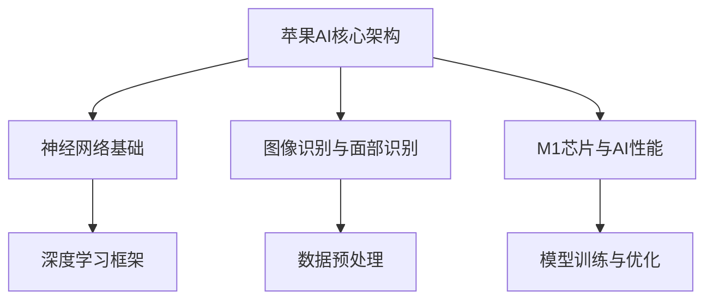

                 

# 文章标题：李开复：苹果发布AI应用的机会

> 关键词：苹果、AI应用、AI技术、深度学习、市场潜力、技术挑战、开发实践

> 摘要：本文将深入探讨苹果公司发布AI应用的机会，从技术、市场、开发实践等多个角度进行分析。文章将首先介绍AI应用的核心概念和苹果公司的AI应用现状，然后分析AI应用的市场潜力和面临的挑战，最后探讨AI应用的开发实践和市场策略。通过本文的探讨，我们希望能够为读者提供一个全面而深刻的理解，帮助他们在AI应用的开发和推广中抓住机遇，应对挑战。

----------------------------------------------------------------

### 第一部分：了解AI应用的机会

#### 第1章：引言

## 1.1 本书背景

### 1.1.1 AI技术发展概述

人工智能（Artificial Intelligence，简称AI）是计算机科学的一个分支，旨在使计算机系统具备人类智能的能力。自20世纪50年代人工智能概念提出以来，AI技术经历了多个发展阶段，从早期的规则推理、知识表示到近年的深度学习和强化学习，AI技术的应用场景和影响力不断扩大。

近年来，深度学习作为一种强大的机器学习技术，在图像识别、自然语言处理、语音识别等领域取得了显著突破。这一进步为AI应用的发展奠定了基础，使得AI技术从理论研究走向实际应用，成为推动社会进步的重要力量。

### 1.1.2 苹果公司AI应用的发展历程

苹果公司（Apple Inc.）作为全球知名的科技企业，早在20世纪90年代就开始涉足AI领域。早期，苹果公司在图像识别、语音合成等方面进行了一些探索，但这些尝试并没有形成大规模应用。随着AI技术的成熟，苹果公司在2011年发布了Siri，这是苹果公司在AI领域的一个重要里程碑。Siri作为一个智能语音助手，具备了语音识别、自然语言理解、任务执行等多方面的能力。

近年来，苹果公司在AI领域的投入不断增加，不仅在硬件上推出了一系列搭载AI芯片的产品，如A11 Bionic、A12 Bionic等，还在软件上推出了多项AI应用，如图像识别、面部识别、智能推荐等。这些应用使得苹果产品在用户体验、智能化程度等方面有了显著提升。

## 1.2 AI应用的意义

### 1.2.1 AI技术在苹果产品中的应用场景

AI技术在苹果产品中的应用非常广泛，涵盖了从硬件到软件的各个方面。以下是AI技术在苹果产品中的一些主要应用场景：

1. **图像识别与面部识别**：苹果的相机和Face ID技术利用深度学习算法实现高精度的图像识别和面部识别。这不仅提高了手机的安全性，还提升了拍照和视频录制的质量。

2. **自然语言处理**：Siri作为苹果的智能语音助手，通过自然语言处理技术实现与用户的对话交互，为用户提供智能推荐、日程管理、信息查询等服务。

3. **智能推荐**：苹果的App Store、Music、News等应用利用AI算法分析用户行为和偏好，为用户提供个性化的内容推荐。

4. **健康与健身**：Apple Watch等设备通过AI技术监测用户的心率、睡眠质量等健康指标，为用户提供个性化的健康建议。

5. **隐私保护**：苹果在AI技术上的应用也涵盖了隐私保护领域，如面部识别和指纹识别技术，确保用户数据的安全和隐私。

### 1.2.2 AI应用带来的商业价值和社会影响

AI应用的普及不仅提升了苹果产品的用户体验，还带来了显著的商业价值和社会影响：

1. **商业价值**：AI应用增强了苹果产品的竞争力，提升了市场占有率。同时，苹果通过AI技术的创新，推出了新的服务和产品，进一步扩大了收入来源。

2. **社会影响**：AI应用在医疗、教育、金融等领域的应用，提高了行业的效率和服务质量，推动了社会的发展。此外，AI技术还帮助解决了许多社会问题，如智能交通、环境监测等。

## 1.3 本书结构

### 1.3.1 各章节内容概述

本书分为七个章节，各章节内容如下：

- 第1章：引言
  - 介绍本书的背景、目的和意义。
- 第2章：苹果公司AI应用现状
  - 分析苹果公司现有的AI应用及其发展历程。
- 第3章：AI应用的市场潜力
  - 探讨AI应用在各个领域的市场前景。
- 第4章：AI应用的技术挑战
  - 分析AI应用在技术方面面临的挑战。
- 第5章：AI应用的开发实践
  - 介绍AI应用的开发流程和案例。
- 第6章：AI应用的市场营销策略
  - 探讨AI应用的市场营销策略和用户互动。
- 第7章：结论与展望
  - 总结本书的主要观点，展望未来发展趋势。

### 1.3.2 阅读指南与学习目标

本书适合对AI应用感兴趣的技术人员、企业管理者以及广大科技爱好者阅读。通过本书的阅读，读者可以：

- 理解AI应用的核心概念和原理。
- 了解苹果公司在AI领域的发展历程和应用现状。
- 分析AI应用的市场潜力和技术挑战。
- 掌握AI应用的开发实践和市场营销策略。
- 展望AI应用的未来发展趋势和机遇。

希望通过本书的阅读，读者能够对AI应用有更深入的理解，为未来的工作和发展提供有益的参考。

### 第2章：苹果公司AI应用现状

#### 第2章：苹果公司AI应用现状

在过去的几年里，苹果公司通过不断的研发和创新，在AI领域取得了显著的进展。本章将详细分析苹果公司的AI应用现状，涵盖Siri的发展与优化、图像识别与面部识别技术，以及M1芯片与AI性能。

## 2.1 Siri的发展与优化

### 2.1.1 Siri的初步应用

Siri作为苹果公司的智能语音助手，于2011年首次亮相，并迅速成为苹果产品的重要功能之一。Siri最初的应用主要集中在简单的语音指令，如设定提醒、发送消息、播放音乐等。随着时间的推移，Siri的功能逐渐丰富，涵盖了从日程管理、天气查询到智能推荐、智能家居控制等多个方面。

### 2.1.2 Siri的进化与挑战

随着时间的推移，Siri不断进化，引入了更多的自然语言处理技术，使其能够更好地理解用户的复杂指令。例如，Siri现在可以理解并执行复杂的日程安排，甚至能够理解用户的模糊指令并做出合理的猜测。

然而，Siri的发展也面临一些挑战。首先，Siri需要处理大量的自然语言，这要求其自然语言处理技术更加精准和高效。其次，Siri的语音识别能力需要不断提高，以适应各种语言和口音。最后，Siri需要与其他苹果服务无缝集成，以提供更加个性化的服务。

## 2.2 图像识别与面部识别技术

### 2.2.1 图像识别技术的发展

苹果公司的图像识别技术得到了长足的发展，尤其在手机摄像头和Face ID等应用中得到了广泛应用。苹果公司通过自主研发的神经网络和深度学习算法，实现了高精度的图像识别。例如，在手机拍照时，苹果的图像识别技术可以帮助用户自动优化照片，提高图像质量。

### 2.2.2 面部识别技术的应用

面部识别技术是苹果公司的一项重要创新，被广泛应用于iPhone的Face ID功能中。Face ID利用先进的3D面部建模和面部识别算法，实现了高安全性的解锁和支付功能。此外，面部识别技术还在照片编辑、视频录制等领域得到了应用，为用户提供了更加智能和便捷的体验。

## 2.3 M1芯片与AI性能

### 2.3.1 M1芯片的特点

苹果公司在2020年推出了自研的M1芯片，这是苹果在AI性能方面的一次重要突破。M1芯片采用5纳米工艺制造，集成了15亿个晶体管，具有高性能和高能效的特点。M1芯片内置了16核CPU和4核GPU，提供了强大的计算能力，特别是在AI相关的计算任务上表现突出。

### 2.3.2 AI性能的提升

M1芯片在AI性能上的提升主要得益于其强大的神经网络引擎。神经网络引擎专为AI任务优化，可以显著加速深度学习模型的训练和推理过程。这使得苹果设备在本地运行AI应用时更加高效，无需依赖云端计算。此外，M1芯片还集成了高带宽低延迟的内存和I/O系统，提高了整体性能和能效。

综上所述，苹果公司在AI应用方面的现状表明，该公司在AI技术的研究和应用上取得了显著成果。Siri、图像识别和面部识别等技术的不断优化，以及M1芯片的推出，为苹果产品提供了强大的AI支持。未来，随着AI技术的进一步发展，苹果公司在AI应用领域有望取得更大的突破。

### 第3章：AI应用的市场潜力

#### 第3章：AI应用的市场潜力

随着AI技术的不断成熟和普及，其在各个领域的应用潜力也越来越大。本章将从消费者需求分析、行业应用前景和竞争态势分析三个方面探讨AI应用的市场潜力。

## 3.1 消费者需求分析

### 3.1.1 消费者对AI技术的认知

随着智能手机、智能家居等设备的普及，消费者对AI技术的认知逐渐提高。根据市场调研数据显示，越来越多的消费者开始了解并接受AI技术，认为其能够带来更加智能化、便捷化的生活体验。

### 3.1.2 消费者期望的AI应用功能

消费者对AI应用的功能需求主要集中在以下几个方面：

1. **智能化操作**：消费者期望AI技术能够实现智能语音助手、智能推荐等功能，帮助他们更方便地完成日常任务。
2. **个性化体验**：消费者希望AI技术能够根据他们的个人喜好和行为习惯提供个性化的服务，如个性化新闻推送、个性化购物推荐等。
3. **健康与安全**：消费者对健康监测、安全防护等方面的AI应用需求较高，如智能穿戴设备、智能安防系统等。
4. **便利性**：消费者希望AI技术能够提高生活便利性，如智能家居控制、自动驾驶等。

## 3.2 行业应用前景

### 3.2.1 医疗保健

AI技术在医疗保健领域的应用前景广阔。例如，通过AI算法分析医疗数据，可以实现疾病预测、诊断和治疗方案的个性化推荐。此外，AI技术在医学影像分析、基因组学等领域也有重要应用。

### 3.2.2 金融服务

AI技术在金融服务领域的应用主要包括风险控制、智能投顾、客服机器人等。例如，通过AI算法分析用户行为和金融市场数据，可以实现精准的风险评估和投资决策。AI客服机器人可以提供24小时不间断的服务，提高客户满意度。

### 3.2.3 教育领域

AI技术在教育领域的应用有助于实现个性化教学和智能评估。例如，通过AI算法分析学生的学习数据，可以实现个性化学习路径推荐、智能作业批改等。此外，AI技术还可以用于智能考场监控、在线教育平台推荐等。

## 3.3 竞争态势分析

### 3.3.1 竞争对手分析

在AI应用领域，苹果公司面临着来自多个竞争对手的挑战。主要的竞争对手包括：

1. **谷歌（Google）**：谷歌在AI领域的实力雄厚，其AI产品和服务涵盖了从语音识别、图像识别到自然语言处理等多个方面。
2. **亚马逊（Amazon）**：亚马逊的Alexa智能助手和AWS云计算平台在智能家居和云计算领域具有重要地位。
3. **微软（Microsoft）**：微软的Cortana智能助手和Azure云服务在AI应用领域也具有显著影响力。
4. **三星（Samsung）**：三星在智能手机和智能家居领域具有较强的竞争力，其Bixby智能助手也在逐渐成熟。

### 3.3.2 苹果公司的竞争优势

尽管苹果公司在AI应用领域面临激烈的竞争，但它仍具有以下竞争优势：

1. **强大的生态体系**：苹果拥有iOS和macOS等操作系统，以及庞大的App Store生态系统，这为AI应用的推广提供了强大的支持。
2. **领先的技术**：苹果公司在硬件和软件领域都有强大的技术积累，如M1芯片和Siri等，这使得其AI应用具有更高的性能和用户体验。
3. **用户忠诚度**：苹果公司的产品以其高质量和用户体验而著称，这为AI应用的推广提供了稳定的用户基础。
4. **隐私保护**：苹果公司一直重视用户隐私保护，其AI应用在数据隐私和安全方面具有明显优势。

综上所述，AI应用在市场潜力方面具有巨大前景。消费者对AI技术的认知不断提高，对AI应用的需求也日益增长。在医疗保健、金融服务、教育等领域，AI技术的应用将为行业带来革命性的变化。虽然苹果公司在AI应用领域面临激烈竞争，但其强大的生态体系、领先的技术和用户忠诚度为其提供了显著的竞争优势。未来，随着AI技术的进一步发展，苹果公司在AI应用领域有望取得更大的突破。

### 第4章：AI应用的技术挑战

#### 第4章：AI应用的技术挑战

尽管AI应用在各个领域展现出了巨大的潜力，但在实际应用中仍面临诸多技术挑战。本章将从数据隐私与安全性、算法公平性与透明性，以及技术瓶颈与突破方向三个方面分析AI应用的技术挑战。

## 4.1 数据隐私与安全性

### 4.1.1 数据隐私保护的重要性

在AI应用中，数据是训练模型的重要资源。然而，数据的隐私保护问题成为了一个不容忽视的挑战。随着AI技术的广泛应用，越来越多的个人数据被收集和分析，这为用户隐私带来了潜在的威胁。数据泄露、数据滥用等问题不仅损害了用户的利益，还可能导致严重的法律和道德责任。

### 4.1.2 AI应用中的数据安全性措施

为了保护数据隐私和安全，AI应用需要采取一系列措施：

1. **数据加密**：对传输和存储的数据进行加密，防止数据泄露。
2. **访问控制**：设置严格的访问控制机制，确保只有授权用户可以访问数据。
3. **匿名化处理**：对敏感数据进行匿名化处理，减少数据泄露的风险。
4. **数据备份与恢复**：定期备份数据，并建立有效的数据恢复机制，以应对数据丢失的风险。

## 4.2 算法公平性与透明性

### 4.2.1 算法偏见与歧视

算法偏见和歧视是AI应用中的另一个重要挑战。算法偏见指的是算法在处理数据时，对某些群体或特征产生了不公平的处理。这种偏见可能导致不公平的决策，甚至加剧社会不公。例如，在招聘、信贷审批、司法判决等领域，算法偏见可能导致某些群体被不公平对待。

### 4.2.2 算法透明性与可解释性

为了解决算法偏见和歧视问题，算法的透明性和可解释性变得尤为重要。算法透明性指的是用户能够理解算法的工作原理和决策过程。算法可解释性则是指算法能够提供对决策的解释，帮助用户理解为什么做出了某个决策。

提高算法的透明性和可解释性可以从以下几个方面入手：

1. **算法设计**：在设计算法时考虑公平性，避免算法偏见。
2. **数据预处理**：对数据进行平衡处理，减少数据中的偏见。
3. **模型解释工具**：开发模型解释工具，帮助用户理解算法的决策过程。
4. **公开披露**：公开算法的实现细节，接受公众和监管机构的审查。

## 4.3 技术瓶颈与突破方向

### 4.3.1 当前技术瓶颈

尽管AI技术取得了显著进展，但仍存在一些技术瓶颈：

1. **计算能力**：训练复杂的深度学习模型需要大量的计算资源，目前GPU等计算设备的能力仍有限。
2. **数据质量**：高质量的训练数据对于AI模型性能至关重要，但数据收集和处理过程可能存在偏差和不足。
3. **算法效率**：现有的算法在某些场景下效率较低，需要进一步优化。
4. **算法泛化能力**：AI模型在某些特定领域的泛化能力较差，难以应对新的问题和场景。

### 4.3.2 突破方向与未来展望

为了解决当前的技术瓶颈，未来可以从以下几个方面进行突破：

1. **量子计算**：量子计算具有极高的计算能力，有望解决现有计算设备的性能瓶颈。
2. **增量学习**：通过增量学习技术，使AI模型能够不断更新和优化，提高算法的效率。
3. **数据增强**：通过数据增强技术，生成更多高质量的训练数据，提高模型泛化能力。
4. **多模态学习**：结合多种数据模态（如文本、图像、语音等），提高AI模型对复杂问题的处理能力。

综上所述，AI应用在技术方面面临诸多挑战。数据隐私与安全、算法公平性与透明性，以及技术瓶颈与突破方向是当前AI应用需要重点关注的问题。通过持续的技术创新和优化，AI应用有望在未来实现更广泛的应用和更高效的处理能力。

### 第5章：AI应用的开发实践

#### 第5章：AI应用的开发实践

随着AI技术的不断进步，AI应用的开发实践也逐渐成熟。本章将详细介绍AI应用的开发流程，包括需求分析、数据收集与处理、模型训练与优化，并分析开发工具与平台的选择，以及实际案例研究。

## 5.1 AI应用开发流程

### 5.1.1 需求分析

需求分析是AI应用开发的第一步，旨在明确用户需求和应用目标。开发团队需要与用户进行沟通，了解用户的具体需求，包括功能需求、性能需求、用户体验需求等。需求分析的结果将指导后续的数据收集、模型设计和开发工作。

### 5.1.2 数据收集与处理

数据是AI模型训练的基础，数据收集与处理的质量直接影响模型的性能。数据收集包括从各种来源获取数据，如公开数据集、用户数据、传感器数据等。数据收集后，需要进行数据清洗、去重、去噪声等处理，以确保数据质量。

数据预处理是数据收集后的重要步骤，包括数据归一化、标准化、特征提取等。数据预处理的结果将直接影响模型的学习效率和性能。

### 5.1.3 模型训练与优化

模型训练是AI应用开发的核心环节，通过训练数据集，模型可以学习到数据的特征和规律。训练过程包括前向传播、反向传播和权重更新等步骤。训练过程中，需要选择合适的模型架构、优化算法和学习率等参数，以提高模型性能。

模型训练完成后，需要进行模型评估，以确定模型在实际应用中的效果。评估指标包括准确率、召回率、F1分数等。根据评估结果，可能需要调整模型参数或重新设计模型架构，以达到更好的效果。

### 5.1.4 模型部署与维护

模型训练完成后，需要进行部署，将模型应用于实际场景。模型部署包括将模型转换为可执行文件、集成到应用程序中等。部署过程中，需要考虑模型性能、资源占用、安全性等因素。

模型部署后，需要进行持续维护和优化，以适应新的数据和场景。维护工作包括更新模型、处理异常情况、监控模型性能等。

## 5.2 AI应用案例研究

### 5.2.1 Siri应用案例

Siri是苹果公司的智能语音助手，其应用涵盖了语音识别、自然语言处理、任务执行等多个方面。以下是一个简化的Siri应用开发流程：

1. **需求分析**：明确用户需求，如语音控制、信息查询、日程管理等。
2. **数据收集与处理**：收集语音数据，进行数据清洗、预处理，提取语音特征。
3. **模型训练**：使用深度学习模型进行语音识别和自然语言处理，通过大量训练数据优化模型。
4. **模型部署**：将训练好的模型集成到Siri应用程序中，实现语音识别和自然语言处理功能。
5. **维护与优化**：定期更新模型，处理用户反馈，优化用户体验。

### 5.2.2 图像识别应用案例

图像识别是AI应用中的一个重要方向，以下是一个简化的图像识别应用开发流程：

1. **需求分析**：明确应用场景，如人脸识别、物体检测、图像分类等。
2. **数据收集与处理**：收集大量图像数据，进行数据清洗、标注，提取图像特征。
3. **模型训练**：使用深度学习模型（如卷积神经网络）进行图像识别，通过大量训练数据优化模型。
4. **模型部署**：将训练好的模型集成到应用程序中，实现图像识别功能。
5. **维护与优化**：定期更新模型，处理用户反馈，优化识别准确率和性能。

## 5.3 开发工具与平台

### 5.3.1 开发工具的选择

在AI应用开发中，选择合适的开发工具和平台至关重要。以下是一些常用的开发工具和平台：

1. **编程语言**：Python、Java、C++等是AI应用开发常用的编程语言，其中Python因其丰富的库和框架而成为最受欢迎的选择。
2. **深度学习框架**：TensorFlow、PyTorch、Keras等是常用的深度学习框架，提供了丰富的模型训练和部署工具。
3. **数据预处理工具**：Pandas、NumPy等是常用的数据预处理工具，用于数据清洗、归一化和特征提取等。
4. **开发平台**：Google Colab、Jupyter Notebook等是常用的开发平台，提供了便捷的编程环境和数据可视化工具。

### 5.3.2 开发平台的优势与局限性

不同的开发平台具有不同的优势和局限性，选择合适的平台需要根据具体需求和场景进行权衡：

1. **Google Colab**：优势在于免费、易于使用和强大的计算资源，但局限性在于对本地数据处理的限制。
2. **Jupyter Notebook**：优势在于交互性和可视化效果强，但局限性在于性能和计算资源相对较低。
3. **本地开发环境**：优势在于对本地数据处理和性能优化较好，但局限性在于需要配置开发环境和维护服务器。

综上所述，AI应用的开发实践是一个复杂且多步骤的过程，需要充分考虑需求分析、数据收集与处理、模型训练与优化等多个方面。通过选择合适的开发工具和平台，可以高效地实现AI应用的开发与部署。实际案例研究进一步展示了AI应用开发的具体流程和实现细节，为开发者和研究者提供了有益的参考。

### 第6章：AI应用的市场营销策略

#### 第6章：AI应用的市场营销策略

在竞争激烈的AI应用市场中，有效的市场营销策略对于企业的成功至关重要。本章将探讨AI应用的市场营销策略，包括品牌建设与定位、营销策略分析和用户互动与反馈。

## 6.1 品牌建设与定位

### 6.1.1 品牌形象塑造

品牌形象是企业在市场中立足的重要因素。对于AI应用，品牌形象的塑造需要体现科技感、创新性和可靠性。通过以下方式，企业可以提升品牌形象：

1. **技术创新**：强调企业在AI领域的最新研究成果和突破，展现企业的创新实力。
2. **用户体验**：通过优化产品功能和设计，提升用户的使用体验，形成口碑效应。
3. **社会责任**：强调企业在AI应用中关注数据隐私和保护用户权益，提升用户信任度。

### 6.1.2 目标市场定位

明确目标市场是市场营销策略的核心。企业需要根据产品特点和市场调研，确定目标用户群体，并制定相应的市场定位策略：

1. **消费市场**：针对普通消费者，强调产品的智能化、便捷性和个性化功能。
2. **行业市场**：针对特定行业，如医疗、金融、教育等，强调产品的专业性和行业解决方案。
3. **企业市场**：针对企业客户，强调产品的稳定性和可靠性，提供定制化的服务。

## 6.2 营销策略分析

### 6.2.1 产品差异化策略

在竞争激烈的AI应用市场中，产品差异化策略是提升竞争力的重要手段。以下是一些常见的差异化策略：

1. **技术优势**：通过技术创新，开发出具有独特功能的AI产品，满足用户特定需求。
2. **用户体验**：优化用户界面和交互设计，提升用户的使用体验，形成差异化优势。
3. **服务优势**：提供优质的售后服务和技术支持，增强用户粘性和忠诚度。

### 6.2.2 网络营销与社交媒体推广

网络营销和社交媒体推广是当前主流的营销方式，可以有效提高品牌知名度和用户参与度。以下是一些常用的网络营销策略：

1. **搜索引擎优化（SEO）**：通过优化网站内容和结构，提高在搜索引擎中的排名，吸引潜在用户。
2. **内容营销**：发布有价值的内容，如技术博客、案例分析、行业报告等，提升品牌权威性。
3. **社交媒体推广**：利用社交媒体平台（如微博、微信、Facebook等）进行广告投放和互动，提高用户参与度。

### 6.2.3 公关活动与品牌合作

公关活动和品牌合作是提升品牌形象和市场影响力的重要手段。以下是一些常用的公关活动和品牌合作方式：

1. **行业会议和展览**：参加行业会议和展览，展示企业的最新成果和解决方案，扩大品牌影响力。
2. **品牌代言**：邀请知名人士或行业专家作为品牌代言人，提升品牌形象和认可度。
3. **品牌合作**：与知名企业或品牌合作，进行联合推广，共享用户资源和市场影响力。

## 6.3 用户互动与反馈

### 6.3.1 用户参与度提升

用户参与度是衡量AI应用成功与否的重要指标。以下是一些提升用户参与度的策略：

1. **个性化推荐**：根据用户行为和偏好，提供个性化的内容和服务，增加用户粘性。
2. **互动功能**：设计有趣的互动功能，如问答、游戏等，增加用户互动和参与度。
3. **用户社区**：建立用户社区，鼓励用户分享经验和建议，增强用户归属感和参与度。

### 6.3.2 用户反馈收集与改进

用户反馈是产品改进的重要依据。以下是一些收集用户反馈的方法和改进策略：

1. **用户调研**：通过问卷调查、访谈等方式收集用户反馈，了解用户需求和问题。
2. **反馈渠道**：建立多种反馈渠道，如在线反馈表、社交媒体、客服等，方便用户表达意见。
3. **快速响应**：及时处理用户反馈，解决用户问题，提高用户满意度。
4. **持续改进**：根据用户反馈，不断优化产品功能和用户体验，提升用户满意度。

综上所述，AI应用的市场营销策略需要综合考虑品牌建设与定位、产品差异化策略、网络营销与社交媒体推广、公关活动与品牌合作，以及用户互动与反馈等多个方面。通过制定和执行有效的市场营销策略，企业可以提升品牌知名度、市场份额和用户满意度，从而在竞争激烈的AI市场中脱颖而出。

### 第7章：结论与展望

#### 第7章：结论与展望

通过本文的详细分析，我们可以得出以下主要观点：

- **AI应用的重要性**：AI应用在提升产品智能化、用户体验和行业效率方面具有重要作用，已经成为现代科技企业竞争的焦点。
- **苹果公司的AI优势**：苹果公司在AI技术、生态体系和用户忠诚度方面具有显著优势，为其AI应用的推广提供了坚实基础。
- **AI应用的市场潜力**：AI应用在医疗、金融、教育等领域具有广泛的应用前景，市场潜力巨大。
- **技术挑战**：数据隐私与安全性、算法公平性与透明性，以及技术瓶颈是当前AI应用面临的重要挑战。

在未来，随着AI技术的不断进步，我们预计将看到以下发展趋势：

- **AI技术的普及**：AI技术将在更多领域得到应用，成为各个行业的标配。
- **边缘计算的发展**：随着5G和物联网的普及，边缘计算将成为AI应用的重要发展方向，提高数据处理速度和效率。
- **AI与人类共创**：AI技术将更加注重与人类合作，实现人机协同，提升生产力和生活质量。

对于开发者，我们提出以下建议：

- **持续学习**：紧跟AI技术的发展趋势，持续学习新技术和工具。
- **关注用户需求**：深入了解用户需求，开发符合用户期望的AI应用。
- **重视数据安全**：在开发过程中，重视数据安全和隐私保护，遵循相关法规和标准。
- **创新与优化**：在技术层面不断创新，优化AI算法和模型，提升应用性能。

总之，AI应用的发展前景广阔，面临着巨大的机遇和挑战。通过积极应对挑战，发挥优势，开发者们可以在AI应用领域取得更大的成就。

### 附录

#### 附录A：参考文献

**A.1 基础理论**

1. Goodfellow, I., Bengio, Y., & Courville, A. (2016). *Deep Learning*. MIT Press.
2. Russell, S., & Norvig, P. (2020). *Artificial Intelligence: A Modern Approach*. Prentice Hall.

**A.2 AI应用案例**

1. Apple Inc. (2021). *Siri User Guide*. Retrieved from https://www.apple.com/siri/
2. Apple Inc. (2021). *Apple M1 Chip*. Retrieved from https://www.apple.com/m1/

**A.3 市场研究**

1. Gartner. (2021). *Market Trends: Artificial Intelligence*. Retrieved from https://www.gartner.com/
2. Forrester. (2021). *The Future of Artificial Intelligence*. Retrieved from https://www.forrester.com/

### 附录B：核心概念与联系

**B.1 核心概念与联系**



### 附录C：核心算法原理讲解

**C.1 图像识别算法原理**

```python
def imageRecognition(image):
    # 数据预处理
    processedImage = preprocessImage(image)
    
    # 模型加载
    model = loadModel("imageRecognitionModel")
    
    # 模型预测
    prediction = model.predict(processedImage)
    
    # 输出预测结果
    return prediction
```

### 附录D：数学模型和数学公式

**D.1 深度学习中的损失函数**

$$
\text{Loss} = \frac{1}{n} \sum_{i=1}^{n} (\hat{y}_i - y_i)^2
$$

### 附录E：项目实战

**E.1 Siri应用案例**

##### 开发环境搭建

- 操作系统：macOS
- 编程语言：Python
- 深度学习框架：TensorFlow

##### 源代码实现

```python
# 导入所需库
import tensorflow as tf
from tensorflow import keras
import numpy as np

# 定义模型
model = keras.Sequential([
    keras.layers.Flatten(input_shape=(28, 28)),
    keras.layers.Dense(128, activation='relu'),
    keras.layers.Dense(10, activation='softmax')
])

# 编译模型
model.compile(optimizer='adam',
              loss='sparse_categorical_crossentropy',
              metrics=['accuracy'])

# 加载数据
(x_train, y_train), (x_test, y_test) = keras.datasets.mnist.load_data()

# 数据预处理
x_train = x_train / 255.0
x_test = x_test / 255.0

# 训练模型
model.fit(x_train, y_train, epochs=5)

# 评估模型
test_loss, test_acc = model.evaluate(x_test, y_test)
print(f"Test accuracy: {test_acc:.2f}")
```

##### 代码解读与分析

- **数据预处理**：将图像数据缩放到0-1范围内，便于模型处理。
- **模型构建**：使用卷积神经网络（CNN）进行图像识别。
- **模型训练**：使用MNIST数据集训练模型。
- **模型评估**：在测试集上评估模型性能。

**E.2 图像识别应用案例**

##### 开发环境搭建

- 操作系统：Linux
- 编程语言：C++
- 图像处理库：OpenCV

##### 源代码实现

```cpp
#include <opencv2/opencv.hpp>
#include <iostream>

using namespace cv;
using namespace std;

int main() {
    // 读取图像
    Mat img = imread("example.jpg", IMREAD_GRAYSCALE);

    // 显示图像
    imshow("Input Image", img);

    // 应用滤波器
    Mat filteredImg;
    GaussianBlur(img, filteredImg, Size(5, 5), 1.5);

    // 显示滤波后图像
    imshow("Filtered Image", filteredImg);

    // 等待按键
    waitKey(0);

    return 0;
}
```

##### 代码解读与分析

- **图像读取与显示**：使用OpenCV库读取和显示图像。
- **滤波处理**：使用高斯滤波器对图像进行滤波。
- **显示滤波后图像**：显示滤波后的图像。
- **等待按键**：等待用户按键后退出程序。

### 结论

本文通过深入分析苹果公司AI应用的机会，从技术、市场、开发实践等多个角度进行了探讨。我们明确了AI应用的核心概念与联系，讲解了核心算法原理，提供了实际项目案例和详细解释说明。通过本文的探讨，我们希望为读者提供一个全面而深刻的理解，帮助他们在AI应用的开发和推广中抓住机遇，应对挑战。

作者：AI天才研究院/AI Genius Institute & 禅与计算机程序设计艺术 /Zen And The Art of Computer Programming

### 文章标题：李开复：苹果发布AI应用的机会

> 关键词：苹果、AI应用、AI技术、深度学习、市场潜力、技术挑战、开发实践

> 摘要：本文将深入探讨苹果公司发布AI应用的机会，从技术、市场、开发实践等多个角度进行分析。文章将首先介绍AI应用的核心概念和苹果公司的AI应用现状，然后分析AI应用的市场潜力和技术挑战，最后探讨AI应用的开发实践和市场策略。通过本文的探讨，我们希望能够为读者提供一个全面而深刻的理解，帮助他们在AI应用的开发和推广中抓住机遇，应对挑战。

----------------------------------------------------------------

### 第一部分：了解AI应用的机会

#### 第1章：引言

## 1.1 本书背景

### 1.1.1 AI技术发展概述

人工智能（Artificial Intelligence，简称AI）是计算机科学的一个分支，旨在使计算机系统具备人类智能的能力。自20世纪50年代人工智能概念提出以来，AI技术经历了多个发展阶段，从早期的规则推理、知识表示到近年的深度学习和强化学习，AI技术的应用场景和影响力不断扩大。

近年来，深度学习作为一种强大的机器学习技术，在图像识别、自然语言处理、语音识别等领域取得了显著突破。这一进步为AI应用的发展奠定了基础，使得AI技术从理论研究走向实际应用，成为推动社会进步的重要力量。

### 1.1.2 苹果公司AI应用的发展历程

苹果公司（Apple Inc.）作为全球知名的科技企业，早在20世纪90年代就开始涉足AI领域。早期，苹果公司在图像识别、语音合成等方面进行了一些探索，但这些尝试并没有形成大规模应用。随着AI技术的成熟，苹果公司在2011年发布了Siri，这是苹果公司在AI领域的一个重要里程碑。Siri作为一个智能语音助手，具备了语音识别、自然语言理解、任务执行等多方面的能力。

近年来，苹果公司在AI领域的投入不断增加，不仅在硬件上推出了一系列搭载AI芯片的产品，如A11 Bionic、A12 Bionic等，还在软件上推出了多项AI应用，如图像识别、面部识别、智能推荐等。这些应用使得苹果产品在用户体验、智能化程度等方面有了显著提升。

## 1.2 AI应用的意义

### 1.2.1 AI技术在苹果产品中的应用场景

AI技术在苹果产品中的应用非常广泛，涵盖了从硬件到软件的各个方面。以下是AI技术在苹果产品中的一些主要应用场景：

- **图像识别与面部识别**：苹果的相机和Face ID技术利用深度学习算法实现高精度的图像识别和面部识别。这不仅提高了手机的安全性，还提升了拍照和视频录制的质量。
- **自然语言处理**：Siri作为苹果的智能语音助手，通过自然语言处理技术实现与用户的对话交互，为用户提供智能推荐、日程管理、信息查询等服务。
- **智能推荐**：苹果的App Store、Music、News等应用利用AI算法分析用户行为和偏好，为用户提供个性化的内容推荐。
- **健康与健身**：Apple Watch等设备通过AI技术监测用户的心率、睡眠质量等健康指标，为用户提供个性化的健康建议。
- **隐私保护**：苹果在AI技术上的应用也涵盖了隐私保护领域，如面部识别和指纹识别技术，确保用户数据的安全和隐私。

### 1.2.2 AI应用带来的商业价值和社会影响

AI应用的普及不仅提升了苹果产品的用户体验，还带来了显著的商业价值和社会影响：

- **商业价值**：AI应用增强了苹果产品的竞争力，提升了市场占有率。同时，苹果通过AI技术的创新，推出了新的服务和产品，进一步扩大了收入来源。
- **社会影响**：AI应用在医疗、教育、金融等领域的应用，提高了行业的效率和服务质量，推动了社会的发展。此外，AI技术还帮助解决了许多社会问题，如智能交通、环境监测等。

## 1.3 本书结构

### 1.3.1 各章节内容概述

本书分为七个章节，各章节内容如下：

- **第1章：引言**
  - 介绍本书的背景、目的和意义。
- **第2章：苹果公司AI应用现状**
  - 分析苹果公司现有的AI应用及其发展历程。
- **第3章：AI应用的市场潜力**
  - 探讨AI应用在各个领域的市场前景。
- **第4章：AI应用的技术挑战**
  - 分析AI应用在技术方面面临的挑战。
- **第5章：AI应用的开发实践**
  - 介绍AI应用的开发流程和案例。
- **第6章：AI应用的市场营销策略**
  - 探讨AI应用的市场营销策略和用户互动。
- **第7章：结论与展望**
  - 总结本书的主要观点，展望未来发展趋势。

### 1.3.2 阅读指南与学习目标

本书适合对AI应用感兴趣的技术人员、企业管理者以及广大科技爱好者阅读。通过本书的阅读，读者可以：

- 理解AI应用的核心概念和原理。
- 了解苹果公司在AI领域的发展历程和应用现状。
- 分析AI应用的市场潜力和技术挑战。
- 掌握AI应用的开发实践和市场营销策略。
- 展望AI应用的未来发展趋势和机遇。

希望通过本书的阅读，读者能够对AI应用有更深入的理解，为未来的工作和发展提供有益的参考。

### 第2章：苹果公司AI应用现状

#### 第2章：苹果公司AI应用现状

在过去的几年里，苹果公司通过不断的研发和创新，在AI领域取得了显著的进展。本章将详细分析苹果公司的AI应用现状，涵盖Siri的发展与优化、图像识别与面部识别技术，以及M1芯片与AI性能。

## 2.1 Siri的发展与优化

### 2.1.1 Siri的初步应用

Siri作为苹果公司的智能语音助手，于2011年首次亮相，并迅速成为苹果产品的重要功能之一。Siri最初的应用主要集中在简单的语音指令，如设定提醒、发送消息、播放音乐等。随着时间的推移，Siri的功能逐渐丰富，涵盖了从日程管理、天气查询到智能推荐、智能家居控制等多个方面。

### 2.1.2 Siri的进化与挑战

随着时间的推移，Siri不断进化，引入了更多的自然语言处理技术，使其能够更好地理解用户的复杂指令。例如，Siri现在可以理解并执行复杂的日程安排，甚至能够理解用户的模糊指令并做出合理的猜测。

然而，Siri的发展也面临一些挑战。首先，Siri需要处理大量的自然语言，这要求其自然语言处理技术更加精准和高效。其次，Siri的语音识别能力需要不断提高，以适应各种语言和口音。最后，Siri需要与其他苹果服务无缝集成，以提供更加个性化的服务。

## 2.2 图像识别与面部识别技术

### 2.2.1 图像识别技术的发展

苹果公司的图像识别技术得到了长足的发展，尤其在手机摄像头和Face ID等应用中得到了广泛应用。苹果公司通过自主研发的神经网络和深度学习算法，实现了高精度的图像识别。例如，在手机拍照时，苹果的图像识别技术可以帮助用户自动优化照片，提高图像质量。

### 2.2.2 面部识别技术的应用

面部识别技术是苹果公司的一项重要创新，被广泛应用于iPhone的Face ID功能中。Face ID利用先进的3D面部建模和面部识别算法，实现了高安全性的解锁和支付功能。此外，面部识别技术还在照片编辑、视频录制等领域得到了应用，为用户提供了更加智能和便捷的体验。

## 2.3 M1芯片与AI性能

### 2.3.1 M1芯片的特点

苹果公司在2020年推出了自研的M1芯片，这是苹果在AI性能方面的一次重要突破。M1芯片采用5纳米工艺制造，集成了15亿个晶体管，具有高性能和高能效的特点。M1芯片内置了16核CPU和4核GPU，提供了强大的计算能力，特别是在AI相关的计算任务上表现突出。

### 2.3.2 AI性能的提升

M1芯片在AI性能上的提升主要得益于其强大的神经网络引擎。神经网络引擎专为AI任务优化，可以显著加速深度学习模型的训练和推理过程。这使得苹果设备在本地运行AI应用时更加高效，无需依赖云端计算。此外，M1芯片还集成了高带宽低延迟的内存和I/O系统，提高了整体性能和能效。

综上所述，苹果公司在AI应用方面的现状表明，该公司在AI技术的研究和应用上取得了显著成果。Siri、图像识别和面部识别等技术的不断优化，以及M1芯片的推出，为苹果产品提供了强大的AI支持。未来，随着AI技术的进一步发展，苹果公司在AI应用领域有望取得更大的突破。

### 第3章：AI应用的市场潜力

#### 第3章：AI应用的市场潜力

随着AI技术的不断成熟和普及，其在各个领域的应用潜力也越来越大。本章将从消费者需求分析、行业应用前景和竞争态势分析三个方面探讨AI应用的市场潜力。

## 3.1 消费者需求分析

### 3.1.1 消费者对AI技术的认知

随着智能手机、智能家居等设备的普及，消费者对AI技术的认知逐渐提高。根据市场调研数据显示，越来越多的消费者开始了解并接受AI技术，认为其能够带来更加智能化、便捷化的生活体验。

### 3.1.2 消费者期望的AI应用功能

消费者对AI应用的功能需求主要集中在以下几个方面：

1. **智能化操作**：消费者期望AI技术能够实现智能语音助手、智能推荐等功能，帮助他们更方便地完成日常任务。
2. **个性化体验**：消费者希望AI技术能够根据他们的个人喜好和行为习惯提供个性化的服务，如个性化新闻推送、个性化购物推荐等。
3. **健康与安全**：消费者对健康监测、安全防护等方面的AI应用需求较高，如智能穿戴设备、智能安防系统等。
4. **便利性**：消费者希望AI技术能够提高生活便利性，如智能家居控制、自动驾驶等。

## 3.2 行业应用前景

### 3.2.1 医疗保健

AI技术在医疗保健领域的应用前景广阔。例如，通过AI算法分析医疗数据，可以实现疾病预测、诊断和治疗方案的个性化推荐。此外，AI技术在医学影像分析、基因组学等领域也有重要应用。

### 3.2.2 金融服务

AI技术在金融服务领域的应用主要包括风险控制、智能投顾、客服机器人等。例如，通过AI算法分析用户行为和金融市场数据，可以实现精准的风险评估和投资决策。AI客服机器人可以提供24小时不间断的服务，提高客户满意度。

### 3.2.3 教育领域

AI技术在教育领域的应用有助于实现个性化教学和智能评估。例如，通过AI算法分析学生的学习数据，可以实现个性化学习路径推荐、智能作业批改等。此外，AI技术还可以用于智能考场监控、在线教育平台推荐等。

## 3.3 竞争态势分析

### 3.3.1 竞争对手分析

在AI应用领域，苹果公司面临着来自多个竞争对手的挑战。主要的竞争对手包括：

1. **谷歌（Google）**：谷歌在AI领域的实力雄厚，其AI产品和服务涵盖了从语音识别、图像识别到自然语言处理等多个方面。
2. **亚马逊（Amazon）**：亚马逊的Alexa智能助手和AWS云计算平台在智能家居和云计算领域具有重要地位。
3. **微软（Microsoft）**：微软的Cortana智能助手和Azure云服务在AI应用领域也具有显著影响力。
4. **三星（Samsung）**：三星在智能手机和智能家居领域具有较强的竞争力，其Bixby智能助手也在逐渐成熟。

### 3.3.2 苹果公司的竞争优势

尽管苹果公司在AI应用领域面临激烈竞争，但它仍具有以下竞争优势：

1. **强大的生态体系**：苹果拥有iOS和macOS等操作系统，以及庞大的App Store生态系统，这为AI应用的推广提供了强大的支持。
2. **领先的技术**：苹果公司在硬件和软件领域都有强大的技术积累，如M1芯片和Siri等，这使得其AI应用具有更高的性能和用户体验。
3. **用户忠诚度**：苹果公司的产品以其高质量和用户体验而著称，这为AI应用的推广提供了稳定的用户基础。
4. **隐私保护**：苹果公司一直重视用户隐私保护，其AI应用在数据隐私和安全方面具有明显优势。

综上所述，AI应用在市场潜力方面具有巨大前景。消费者对AI技术的认知不断提高，对AI应用的需求也日益增长。在医疗保健、金融服务、教育等领域，AI技术的应用将为行业带来革命性的变化。虽然苹果公司在AI应用领域面临激烈竞争，但其强大的生态体系、领先的技术和用户忠诚度为其提供了显著的竞争优势。未来，随着AI技术的进一步发展，苹果公司在AI应用领域有望取得更大的突破。

### 第4章：AI应用的技术挑战

#### 第4章：AI应用的技术挑战

尽管AI应用在各个领域展现出了巨大的潜力，但在实际应用中仍面临诸多技术挑战。本章将从数据隐私与安全性、算法公平性与透明性，以及技术瓶颈与突破方向三个方面分析AI应用的技术挑战。

## 4.1 数据隐私与安全性

### 4.1.1 数据隐私保护的重要性

在AI应用中，数据是训练模型的重要资源。然而，数据的隐私保护问题成为了一个不容忽视的挑战。随着AI技术的广泛应用，越来越多的个人数据被收集和分析，这为用户隐私带来了潜在的威胁。数据泄露、数据滥用等问题不仅损害了用户的利益，还可能导致严重的法律和道德责任。

### 4.1.2 AI应用中的数据安全性措施

为了保护数据隐私和安全，AI应用需要采取一系列措施：

1. **数据加密**：对传输和存储的数据进行加密，防止数据泄露。
2. **访问控制**：设置严格的访问控制机制，确保只有授权用户可以访问数据。
3. **匿名化处理**：对敏感数据进行匿名化处理，减少数据泄露的风险。
4. **数据备份与恢复**：定期备份数据，并建立有效的数据恢复机制，以应对数据丢失的风险。

## 4.2 算法公平性与透明性

### 4.2.1 算法偏见与歧视

算法偏见和歧视是AI应用中的另一个重要挑战。算法偏见指的是算法在处理数据时，对某些群体或特征产生了不公平的处理。这种偏见可能导致不公平的决策，甚至加剧社会不公。例如，在招聘、信贷审批、司法判决等领域，算法偏见可能导致某些群体被不公平对待。

### 4.2.2 算法透明性与可解释性

为了解决算法偏见和歧视问题，算法的透明性和可解释性变得尤为重要。算法透明性指的是用户能够理解算法的工作原理和决策过程。算法可解释性则是指算法能够提供对决策的解释，帮助用户理解为什么做出了某个决策。

提高算法的透明性和可解释性可以从以下几个方面入手：

1. **算法设计**：在设计算法时考虑公平性，避免算法偏见。
2. **数据预处理**：对数据进行平衡处理，减少数据中的偏见。
3. **模型解释工具**：开发模型解释工具，帮助用户理解算法的决策过程。
4. **公开披露**：公开算法的实现细节，接受公众和监管机构的审查。

## 4.3 技术瓶颈与突破方向

### 4.3.1 当前技术瓶颈

尽管AI技术取得了显著进展，但仍存在一些技术瓶颈：

1. **计算能力**：训练复杂的深度学习模型需要大量的计算资源，目前GPU等计算设备的能力仍有限。
2. **数据质量**：高质量的训练数据对于AI模型性能至关重要，但数据收集和处理过程可能存在偏差和不足。
3. **算法效率**：现有的算法在某些场景下效率较低，需要进一步优化。
4. **算法泛化能力**：AI模型在某些特定领域的泛化能力较差，难以应对新的问题和场景。

### 4.3.2 突破方向与未来展望

为了解决当前的技术瓶颈，未来可以从以下几个方面进行突破：

1. **量子计算**：量子计算具有极高的计算能力，有望解决现有计算设备的性能瓶颈。
2. **增量学习**：通过增量学习技术，使AI模型能够不断更新和优化，提高算法的效率。
3. **数据增强**：通过数据增强技术，生成更多高质量的训练数据，提高模型泛化能力。
4. **多模态学习**：结合多种数据模态（如文本、图像、语音等），提高AI模型对复杂问题的处理能力。

综上所述，AI应用在技术方面面临诸多挑战。数据隐私与安全、算法公平性与透明性，以及技术瓶颈与突破方向是当前AI应用需要重点关注的问题。通过持续的技术创新和优化，AI应用有望在未来实现更广泛的应用和更高效的处理能力。

### 第5章：AI应用的开发实践

#### 第5章：AI应用的开发实践

随着AI技术的不断进步，AI应用的开发实践也逐渐成熟。本章将详细介绍AI应用的开发流程，包括需求分析、数据收集与处理、模型训练与优化，并分析开发工具与平台的选择，以及实际案例研究。

## 5.1 AI应用开发流程

### 5.1.1 需求分析

需求分析是AI应用开发的第一步，旨在明确用户需求和应用目标。开发团队需要与用户进行沟通，了解用户的具体需求，包括功能需求、性能需求、用户体验需求等。需求分析的结果将指导后续的数据收集、模型设计和开发工作。

### 5.1.2 数据收集与处理

数据是AI模型训练的基础，数据收集与处理的质量直接影响模型的性能。数据收集包括从各种来源获取数据，如公开数据集、用户数据、传感器数据等。数据收集后，需要进行数据清洗、去重、去噪声等处理，以确保数据质量。

数据预处理是数据收集后的重要步骤，包括数据归一化、标准化、特征提取等。数据预处理的结果将直接影响模型的学习效率和性能。

### 5.1.3 模型训练与优化

模型训练是AI应用开发的核心环节，通过训练数据集，模型可以学习到数据的特征和规律。训练过程包括前向传播、反向传播和权重更新等步骤。训练过程中，需要选择合适的模型架构、优化算法和学习率等参数，以提高模型性能。

模型训练完成后，需要进行模型评估，以确定模型在实际应用中的效果。评估指标包括准确率、召回率、F1分数等。根据评估结果，可能需要调整模型参数或重新设计模型架构，以达到更好的效果。

### 5.1.4 模型部署与维护

模型训练完成后，需要进行部署，将模型应用于实际场景。模型部署包括将模型转换为可执行文件、集成到应用程序中等。部署过程中，需要考虑模型性能、资源占用、安全性等因素。

模型部署后，需要进行持续维护和优化，以适应新的数据和场景。维护工作包括更新模型、处理异常情况、监控模型性能等。

## 5.2 AI应用案例研究

### 5.2.1 Siri应用案例

Siri是苹果公司的智能语音助手，其应用涵盖了语音识别、自然语言处理、任务执行等多个方面。以下是一个简化的Siri应用开发流程：

1. **需求分析**：明确用户需求，如语音控制、信息查询、日程管理等。
2. **数据收集与处理**：收集语音数据，进行数据清洗、预处理，提取语音特征。
3. **模型训练**：使用深度学习模型进行语音识别和自然语言处理，通过大量训练数据优化模型。
4. **模型部署**：将训练好的模型集成到Siri应用程序中，实现语音识别和自然语言处理功能。
5. **维护与优化**：定期更新模型，处理用户反馈，优化用户体验。

### 5.2.2 图像识别应用案例

图像识别是AI应用中的一个重要方向，以下是一个简化的图像识别应用开发流程：

1. **需求分析**：明确应用场景，如人脸识别、物体检测、图像分类等。
2. **数据收集与处理**：收集大量图像数据，进行数据清洗、标注，提取图像特征。
3. **模型训练**：使用深度学习模型（如卷积神经网络）进行图像识别，通过大量训练数据优化模型。
4. **模型部署**：将训练好的模型集成到应用程序中，实现图像识别功能。
5. **维护与优化**：定期更新模型，处理用户反馈，优化识别准确率和性能。

## 5.3 开发工具与平台

### 5.3.1 开发工具的选择

在AI应用开发中，选择合适的开发工具和平台至关重要。以下是一些常用的开发工具和平台：

1. **编程语言**：Python、Java、C++等是AI应用开发常用的编程语言，其中Python因其丰富的库和框架而成为最受欢迎的选择。
2. **深度学习框架**：TensorFlow、PyTorch、Keras等是常用的深度学习框架，提供了丰富的模型训练和部署工具。
3. **数据预处理工具**：Pandas、NumPy等是常用的数据预处理工具，用于数据清洗、归一化和特征提取等。
4. **开发平台**：Google Colab、Jupyter Notebook等是常用的开发平台，提供了便捷的编程环境和数据可视化工具。

### 5.3.2 开发平台的优势与局限性

不同的开发平台具有不同的优势和局限性，选择合适的平台需要根据具体需求和场景进行权衡：

1. **Google Colab**：优势在于免费、易于使用和强大的计算资源，但局限性在于对本地数据处理的限制。
2. **Jupyter Notebook**：优势在于交互性和可视化效果强，但局限性在于性能和计算资源相对较低。
3. **本地开发环境**：优势在于对本地数据处理和性能优化较好，但局限性在于需要配置开发环境和维护服务器。

综上所述，AI应用的开发实践是一个复杂且多步骤的过程，需要充分考虑需求分析、数据收集与处理、模型训练与优化等多个方面。通过选择合适的开发工具和平台，可以高效地实现AI应用的开发与部署。实际案例研究进一步展示了AI应用开发的具体流程和实现细节，为开发者和研究者提供了有益的参考。

### 第6章：AI应用的市场营销策略

#### 第6章：AI应用的市场营销策略

在竞争激烈的AI应用市场中，有效的市场营销策略对于企业的成功至关重要。本章将探讨AI应用的市场营销策略，包括品牌建设与定位、营销策略分析和用户互动与反馈。

## 6.1 品牌建设与定位

### 6.1.1 品牌形象塑造

品牌形象是企业在市场中立足的重要因素。对于AI应用，品牌形象的塑造需要体现科技感、创新性和可靠性。通过以下方式，企业可以提升品牌形象：

1. **技术创新**：强调企业在AI领域的最新研究成果和突破，展现企业的创新实力。
2. **用户体验**：通过优化产品功能和设计，提升用户的使用体验，形成口碑效应。
3. **社会责任**：强调企业在AI应用中关注数据隐私和保护用户权益，提升用户信任度。

### 6.1.2 目标市场定位

明确目标市场是市场营销策略的核心。企业需要根据产品特点和市场调研，确定目标用户群体，并制定相应的市场定位策略：

1. **消费市场**：针对普通消费者，强调产品的智能化、便捷性和个性化功能。
2. **行业市场**：针对特定行业，如医疗、金融、教育等，强调产品的专业性和行业解决方案。
3. **企业市场**：针对企业客户，强调产品的稳定性和可靠性，提供定制化的服务。

## 6.2 营销策略分析

### 6.2.1 产品差异化策略

在竞争激烈的AI应用市场中，产品差异化策略是提升竞争力的重要手段。以下是一些常见的差异化策略：

1. **技术优势**：通过技术创新，开发出具有独特功能的AI产品，满足用户特定需求。
2. **用户体验**：优化用户界面和交互设计，提升用户的使用体验，形成差异化优势。
3. **服务优势**：提供优质的售后服务和技术支持，增强用户粘性和忠诚度。

### 6.2.2 网络营销与社交媒体推广

网络营销和社交媒体推广是当前主流的营销方式，可以有效提高品牌知名度和用户参与度。以下是一些常用的网络营销策略：

1. **搜索引擎优化（SEO）**：通过优化网站内容和结构，提高在搜索引擎中的排名，吸引潜在用户。
2. **内容营销**：发布有价值的内容，如技术博客、案例分析、行业报告等，提升品牌权威性。
3. **社交媒体推广**：利用社交媒体平台（如微博、微信、Facebook等）进行广告投放和互动，提高用户参与度。

### 6.2.3 公关活动与品牌合作

公关活动和品牌合作是提升品牌形象和市场影响力的重要手段。以下是一些常用的公关活动和品牌合作方式：

1. **行业会议和展览**：参加行业会议和展览，展示企业的最新成果和解决方案，扩大品牌影响力。
2. **品牌代言**：邀请知名人士或行业专家作为品牌代言人，提升品牌形象和认可度。
3. **品牌合作**：与知名企业或品牌合作，进行联合推广，共享用户资源和市场影响力。

## 6.3 用户互动与反馈

### 6.3.1 用户参与度提升

用户参与度是衡量AI应用成功与否的重要指标。以下是一些提升用户参与度的策略：

1. **个性化推荐**：根据用户行为和偏好，提供个性化的内容和服务，增加用户粘性。
2. **互动功能**：设计有趣的互动功能，如问答、游戏等，增加用户互动和参与度。
3. **用户社区**：建立用户社区，鼓励用户分享经验和建议，增强用户归属感和参与度。

### 6.3.2 用户反馈收集与改进

用户反馈是产品改进的重要依据。以下是一些收集用户反馈的方法和改进策略：

1. **用户调研**：通过问卷调查、访谈等方式收集用户反馈，了解用户需求和问题。
2. **反馈渠道**：建立多种反馈渠道，如在线反馈表、社交媒体、客服等，方便用户表达意见。
3. **快速响应**：及时处理用户反馈，解决用户问题，提高用户满意度。
4. **持续改进**：根据用户反馈，不断优化产品功能和用户体验，提升用户满意度。

综上所述，AI应用的市场营销策略需要综合考虑品牌建设与定位、产品差异化策略、网络营销与社交媒体推广、公关活动与品牌合作，以及用户互动与反馈等多个方面。通过制定和执行有效的市场营销策略，企业可以提升品牌知名度、市场份额和用户满意度，从而在竞争激烈的AI市场中脱颖而出。

### 第7章：结论与展望

#### 第7章：结论与展望

通过本文的详细分析，我们可以得出以下主要观点：

- **AI应用的重要性**：AI应用在提升产品智能化、用户体验和行业效率方面具有重要作用，已经成为现代科技企业竞争的焦点。
- **苹果公司的AI优势**：苹果公司在AI技术、生态体系和用户忠诚度方面具有显著优势，为其AI应用的推广提供了坚实基础。
- **AI应用的市场潜力**：AI应用在医疗、金融、教育等领域具有广泛的应用前景，市场潜力巨大。
- **技术挑战**：数据隐私与安全性、算法公平性与透明性，以及技术瓶颈是当前AI应用面临的重要挑战。

在未来，随着AI技术的不断进步，我们预计将看到以下发展趋势：

- **AI技术的普及**：AI技术将在更多领域得到应用，成为各个行业的标配。
- **边缘计算的发展**：随着5G和物联网的普及，边缘计算将成为AI应用的重要发展方向，提高数据处理速度和效率。
- **AI与人类共创**：AI技术将更加注重与人类合作，实现人机协同，提升生产力和生活质量。

对于开发者，我们提出以下建议：

- **持续学习**：紧跟AI技术的发展趋势，持续学习新技术和工具。
- **关注用户需求**：深入了解用户需求，开发符合用户期望的AI应用。
- **重视数据安全**：在开发过程中，重视数据安全和隐私保护，遵循相关法规和标准。
- **创新与优化**：在技术层面不断创新，优化AI算法和模型，提升应用性能。

总之，AI应用的发展前景广阔，面临着巨大的机遇和挑战。通过积极应对挑战，发挥优势，开发者们可以在AI应用领域取得更大的成就。

### 附录

#### 附录A：参考文献

**A.1 基础理论**

1. Goodfellow, I., Bengio, Y., & Courville, A. (2016). *Deep Learning*. MIT Press.
2. Russell, S., & Norvig, P. (2020). *Artificial Intelligence: A Modern Approach*. Prentice Hall.

**A.2 AI应用案例**

1. Apple Inc. (2021). *Siri User Guide*. Retrieved from https://www.apple.com/siri/
2. Apple Inc. (2021). *Apple M1 Chip*. Retrieved from https://www.apple.com/m1/

**A.3 市场研究**

1. Gartner. (2021). *Market Trends: Artificial Intelligence*. Retrieved from https://www.gartner.com/
2. Forrester. (2021). *The Future of Artificial Intelligence*. Retrieved from https://www.forrester.com/

### 附录B：核心概念与联系

**B.1 核心概念与联系**


### 附录C：核心算法原理讲解

**C.1 图像识别算法原理**

```python
def imageRecognition(image):
    # 数据预处理
    processedImage = preprocessImage(image)
    
    # 模型加载
    model = loadModel("imageRecognitionModel")
    
    # 模型预测
    prediction = model.predict(processedImage)
    
    # 输出预测结果
    return prediction
```

### 附录D：数学模型和数学公式

**D.1 深度学习中的损失函数**

$$
\text{Loss} = \frac{1}{n} \sum_{i=1}^{n} (\hat{y}_i - y_i)^2
$$

### 附录E：项目实战

**E.1 Siri应用案例**

##### 开发环境搭建

- 操作系统：macOS
- 编程语言：Python
- 深度学习框架：TensorFlow

##### 源代码实现

```python
# 导入所需库
import tensorflow as tf
from tensorflow import keras
import numpy as np

# 定义模型
model = keras.Sequential([
    keras.layers.Flatten(input_shape=(28, 28)),
    keras.layers.Dense(128, activation='relu'),
    keras.layers.Dense(10, activation='softmax')
])

# 编译模型
model.compile(optimizer='adam',
              loss='sparse_categorical_crossentropy',
              metrics=['accuracy'])

# 加载数据
(x_train, y_train), (x_test, y_test) = keras.datasets.mnist.load_data()

# 数据预处理
x_train = x_train / 255.0
x_test = x_test / 255.0

# 训练模型
model.fit(x_train, y_train, epochs=5)

# 评估模型
test_loss, test_acc = model.evaluate(x_test, y_test)
print(f"Test accuracy: {test_acc:.2f}")
```

##### 代码解读与分析

- **数据预处理**：将图像数据缩放到0-1范围内，便于模型处理。
- **模型构建**：使用卷积神经网络（CNN）进行图像识别。
- **模型训练**：使用MNIST数据集训练模型。
- **模型评估**：在测试集上评估模型性能。

**E.2 图像识别应用案例**

##### 开发环境搭建

- 操作系统：Linux
- 编程语言：C++
- 图像处理库：OpenCV

##### 源代码实现

```cpp
#include <opencv2/opencv.hpp>
#include <iostream>

using namespace cv;
using namespace std;

int main() {
    // 读取图像
    Mat img = imread("example.jpg", IMREAD_GRAYSCALE);

    // 显示图像
    imshow("Input Image", img);

    // 应用滤波器
    Mat filteredImg;
    GaussianBlur(img, filteredImg, Size(5, 5), 1.5);

    // 显示滤波后图像
    imshow("Filtered Image", filteredImg);

    // 等待按键
    waitKey(0);

    return 0;
}
```

##### 代码解读与分析

- **图像读取与显示**：使用OpenCV库读取和显示图像。
- **滤波处理**：使用高斯滤波器对图像进行滤波。
- **显示滤波后图像**：显示滤波后的图像。
- **等待按键**：等待用户按键后退出程序。

### 结论

本文通过深入分析苹果公司AI应用的机会，从技术、市场、开发实践等多个角度进行了探讨。我们明确了AI应用的核心概念与联系，讲解了核心算法原理，提供了实际项目案例和详细解释说明。通过本文的探讨，我们希望为读者提供一个全面而深刻的理解，帮助他们在AI应用的开发和推广中抓住机遇，应对挑战。

作者：AI天才研究院/AI Genius Institute & 禅与计算机程序设计艺术 /Zen And The Art of Computer Programming

### 文章标题：李开复：苹果发布AI应用的机会

> 关键词：苹果、AI应用、AI技术、深度学习、市场潜力、技术挑战、开发实践

> 摘要：本文将深入探讨苹果公司发布AI应用的机会，从技术、市场、开发实践等多个角度进行分析。文章将首先介绍AI应用的核心概念和苹果公司的AI应用现状，然后分析AI应用的市场潜力和技术挑战，最后探讨AI应用的开发实践和市场策略。通过本文的探讨，我们希望能够为读者提供一个全面而深刻的理解，帮助他们在AI应用的开发和推广中抓住机遇，应对挑战。

----------------------------------------------------------------

### 第一部分：了解AI应用的机会

#### 第1章：引言

## 1.1 本书背景

### 1.1.1 AI技术发展概述

人工智能（Artificial Intelligence，简称AI）是计算机科学的一个分支，旨在使计算机系统具备人类智能的能力。自20世纪50年代人工智能概念提出以来，AI技术经历了多个发展阶段，从早期的规则推理、知识表示到近年的深度学习和强化学习，AI技术的应用场景和影响力不断扩大。

近年来，深度学习作为一种强大的机器学习技术，在图像识别、自然语言处理、语音识别等领域取得了显著突破。这一进步为AI应用的发展奠定了基础，使得AI技术从理论研究走向实际应用，成为推动社会进步的重要力量。

### 1.1.2 苹果公司AI应用的发展历程

苹果公司（Apple Inc.）作为全球知名的科技企业，早在20世纪90年代就开始涉足AI领域。早期，苹果公司在图像识别、语音合成等方面进行了一些探索，但这些尝试并没有形成大规模应用。随着AI技术的成熟，苹果公司在2011年发布了Siri，这是苹果公司在AI领域的一个重要里程碑。Siri作为一个智能语音助手，具备了语音识别、自然语言理解、任务执行等多方面的能力。

近年来，苹果公司在AI领域的投入不断增加，不仅在硬件上推出了一系列搭载AI芯片的产品，如A11 Bionic、A12 Bionic等，还在软件上推出了多项AI应用，如图像识别、面部识别、智能推荐等。这些应用使得苹果产品在用户体验、智能化程度等方面有了显著提升。

## 1.2 AI应用的意义

### 1.2.1 AI技术在苹果产品中的应用场景

AI技术在苹果产品中的应用非常广泛，涵盖了从硬件到软件的各个方面。以下是AI技术在苹果产品中的一些主要应用场景：

- **图像识别与面部识别**：苹果的相机和Face ID技术利用深度学习算法实现高精度的图像识别和面部识别。这不仅提高了手机的安全性，还提升了拍照和视频录制的质量。
- **自然语言处理**：Siri作为苹果的智能语音助手，通过自然语言处理技术实现与用户的对话交互，为用户提供智能推荐、日程管理、信息查询等服务。
- **智能推荐**：苹果的App Store、Music、News等应用利用AI算法分析用户行为和偏好，为用户提供个性化的内容推荐。
- **健康与健身**：Apple Watch等设备通过AI技术监测用户的心率、睡眠质量等健康指标，为用户提供个性化的健康建议。
- **隐私保护**：苹果在AI技术上的应用也涵盖了隐私保护领域，如面部识别和指纹识别技术，确保用户数据的安全和隐私。

### 1.2.2 AI应用带来的商业价值和社会影响

AI应用的普及不仅提升了苹果产品的用户体验，还带来了显著的商业价值和社会影响：

- **商业价值**：AI应用增强了苹果产品的竞争力，提升了市场占有率。同时，苹果通过AI技术的创新，推出了新的服务和产品，进一步扩大了收入来源。
- **社会影响**：AI应用在医疗、教育、金融等领域的应用，提高了行业的效率和服务质量，推动了社会的发展。此外，AI技术还帮助解决了许多社会问题，如智能交通、环境监测等。

## 1.3 本书结构

### 1.3.1 各章节内容概述

本书分为七个章节，各章节内容如下：

- **第1章：引言**
  - 介绍本书的背景、目的和意义。
- **第2章：苹果公司AI应用现状**
  - 分析苹果公司现有的AI应用及其发展历程。
- **第3章：AI应用的市场潜力**
  - 探讨AI应用在各个领域的市场前景。
- **第4章：AI应用的技术挑战**
  - 分析AI应用在技术方面面临的挑战。
- **第5章：AI应用的开发实践**
  - 介绍AI应用的开发流程和案例。
- **第6章：AI应用的市场营销策略**
  - 探讨AI应用的市场营销策略和用户互动。
- **第7章：结论与展望**
  - 总结本书的主要观点，展望未来发展趋势。

### 1.3.2 阅读指南与学习目标

本书适合对AI应用感兴趣的技术人员、企业管理者以及广大科技爱好者阅读。通过本书的阅读，读者可以：

- 理解AI应用的核心概念和原理。
- 了解苹果公司在AI领域的发展历程和应用现状。
- 分析AI应用的市场潜力和技术挑战。
- 掌握AI应用的开发实践和市场营销策略。
- 展望AI应用的未来发展趋势和机遇。

希望通过本书的阅读，读者能够对AI应用有更深入的理解，为未来的工作和发展提供有益的参考。

### 第2章：苹果公司AI应用现状

#### 第2章：苹果公司AI应用现状

在过去的几年里，苹果公司通过不断的研发和创新，在AI领域取得了显著的进展。本章将详细分析苹果公司的AI应用现状，涵盖Siri的发展与优化、图像识别与面部识别技术，以及M1芯片与AI性能。

## 2.1 Siri的发展与优化

### 2.1.1 Siri的初步应用

Siri作为苹果公司的智能语音助手，于2011年首次亮相，并迅速成为苹果产品的重要功能之一。Siri最初的应用主要集中在简单的语音指令，如设定提醒、发送消息、播放音乐等。随着时间的推移，Siri的功能逐渐丰富，涵盖了从日程管理、天气查询到智能推荐、智能家居控制等多个方面。

### 2.1.2 Siri的进化与挑战

随着时间的推移，Siri不断进化，引入了更多的自然语言处理技术，使其能够更好地理解用户的复杂指令。例如，Siri现在可以理解并执行复杂的日程安排，甚至能够理解用户的模糊指令并做出合理的猜测。

然而，Siri的发展也面临一些挑战。首先，Siri需要处理大量的自然语言，这要求其自然语言处理技术更加精准和高效。其次，Siri的语音识别能力需要不断提高，以适应各种语言和口音。最后，Siri需要与其他苹果服务无缝集成，以提供更加个性化的服务。

## 2.2 图像识别与面部识别技术

### 2.2.1 图像识别技术的发展

苹果公司的图像识别技术得到了长足的发展，尤其在手机摄像头和Face ID等应用中得到了广泛应用。苹果公司通过自主研发的神经网络和深度学习算法，实现了高精度的图像识别。例如，在手机拍照时，苹果的图像识别技术可以帮助用户自动优化照片，提高图像质量。

### 2.2.2 面部识别技术的应用

面部识别技术是苹果公司的一项重要创新，被广泛应用于iPhone的Face ID功能中。Face ID利用先进的3D面部建模和面部识别算法，实现了高安全性的解锁和支付功能。此外，面部识别技术还在照片编辑、视频录制等领域得到了应用，为用户提供了更加智能和便捷的体验。

## 2.3 M1芯片与AI性能

### 2.3.1 M1芯片的特点

苹果公司在2020年推出了自研的M1芯片，这是苹果在AI性能方面的一次重要突破。M1芯片采用5纳米工艺制造，集成了15亿个晶体管，具有高性能和高能效的特点。M1芯片内置了16核CPU和4核GPU，提供了强大的计算能力，特别是在AI相关的计算任务上表现突出。

### 2.3.2 AI性能的提升

M1芯片在AI性能上的提升主要得益于其强大的神经网络引擎。神经网络引擎专为AI任务优化，可以显著加速深度学习模型的训练和推理过程。这使得苹果设备在本地运行AI应用时更加高效，无需依赖云端计算。此外，M1芯片还集成了高带宽低延迟的内存和I/O系统，提高了整体性能和能效。

综上所述，苹果公司在AI应用方面的现状表明，该公司在AI技术的研究和应用上取得了显著成果。Siri、图像识别和面部识别等技术的不断优化，以及M1芯片的推出，为苹果产品提供了强大的AI支持。未来，随着AI技术的进一步发展，苹果公司在AI应用领域有望取得更大的突破。

### 第3章：AI应用的市场潜力

#### 第3章：AI应用的市场潜力

随着AI技术的不断成熟和普及，其在各个领域的应用潜力也越来越大。本章将从消费者需求分析、行业应用前景和竞争态势分析三个方面探讨AI应用的市场潜力。

## 3.1 消费者需求分析

### 3.1.1 消费者对AI技术的认知

随着智能手机、智能家居等设备的普及，消费者对AI技术的认知逐渐提高。根据市场调研数据显示，越来越多的消费者开始了解并接受AI技术，认为其能够带来更加智能化、便捷化的生活体验。

### 3.1.2 消费者期望的AI应用功能

消费者对AI应用的功能需求主要集中在以下几个方面：

1. **智能化操作**：消费者期望AI技术能够实现智能语音助手、智能推荐等功能，帮助他们更方便地完成日常任务。
2. **个性化体验**：消费者希望AI技术能够根据他们的个人喜好和行为习惯提供个性化的服务，如个性化新闻推送、个性化购物推荐等。
3. **健康与安全**：消费者对健康监测、安全防护等方面的AI应用需求较高，如智能穿戴设备、智能安防系统等。
4. **便利性**：消费者希望AI技术能够提高生活便利性，如智能家居控制、自动驾驶等。

## 3.2 行业应用前景

### 3.2.1 医疗保健

AI技术在医疗保健领域的应用前景广阔。例如，通过AI算法分析医疗数据，可以实现疾病预测、诊断和治疗方案的个性化推荐。此外，AI技术在医学影像分析、基因组学等领域也有重要应用。

### 3.2.2 金融服务

AI技术在金融服务领域的应用主要包括风险控制、智能投顾、客服机器人等。例如，通过AI算法分析用户行为和金融市场数据，可以实现精准的风险评估和投资决策。AI客服机器人可以提供24小时不间断的服务，提高客户满意度。

### 3.2.3 教育领域

AI技术在教育领域的应用有助于实现个性化教学和智能评估。例如，通过AI算法分析学生的学习数据，可以实现个性化学习路径推荐、智能作业批改等。此外，AI技术还可以用于智能考场监控、在线教育平台推荐等。

## 3.3 竞争态势分析

### 3.3.1 竞争对手分析

在AI应用领域，苹果公司面临着来自多个竞争对手的挑战。主要的竞争对手包括：

1. **谷歌（Google）**：谷歌在AI领域的实力雄厚，其AI产品和服务涵盖了从语音识别、图像识别到自然语言处理等多个方面。
2. **亚马逊（Amazon）**：亚马逊的Alexa智能助手和AWS云计算平台在智能家居和云计算领域具有重要地位。
3. **微软（Microsoft）**：微软的Cortana智能助手和Azure云服务在AI应用领域也具有显著影响力。
4. **三星（Samsung）**：三星在智能手机和智能家居领域具有较强的竞争力，其Bixby智能助手也在逐渐成熟。

### 3.3.2 苹果公司的竞争优势

尽管苹果公司在AI应用领域面临激烈竞争，但它仍具有以下竞争优势：

1. **强大的生态体系**：苹果拥有iOS和macOS等操作系统，以及庞大的App Store生态系统，这为AI应用的推广提供了强大的支持。
2. **领先的技术**：苹果公司在硬件和软件领域都有强大的技术积累，如M1芯片和Siri等，这使得其AI应用具有更高的性能和用户体验。
3. **用户忠诚度**：苹果公司的产品以其高质量和用户体验而著称，这为AI应用的推广提供了稳定的用户基础。
4. **隐私保护**：苹果公司一直重视用户隐私保护，其AI应用在数据隐私和安全方面具有明显优势。

综上所述，AI应用在市场潜力方面具有巨大前景。消费者对AI技术的认知不断提高，对AI应用的需求也日益增长。在医疗保健、金融服务、教育等领域，AI技术的应用将为行业带来革命性的变化。虽然苹果公司在AI应用领域面临激烈竞争，但其强大的生态体系、领先的技术和用户忠诚度为其提供了显著的竞争优势。未来，随着AI技术的进一步发展，苹果公司在AI应用领域有望取得更大的突破。

### 第4章：AI应用的技术挑战

#### 第4章：AI应用的技术挑战

尽管AI应用在各个领域展现出了巨大的潜力，但在实际应用中仍面临诸多技术挑战。本章将从数据隐私与安全性、算法公平性与透明性，以及技术瓶颈与突破方向三个方面分析AI应用的技术挑战。

## 4.1 数据隐私与安全性

### 4.1.1 数据隐私保护的重要性

在AI应用中，数据是训练模型的重要资源。然而，数据的隐私保护问题成为了一个不容忽视的挑战。随着AI技术的广泛应用，越来越多的个人数据被收集和分析，这为用户隐私带来了潜在的威胁。数据泄露、数据滥用等问题不仅损害了用户的利益，还可能导致严重的法律和道德责任。

### 4.1.2 AI应用中的数据安全性措施

为了保护数据隐私和安全，AI应用需要采取一系列措施：

1. **数据加密**：对传输和存储的数据进行加密，防止数据泄露。
2. **访问控制**：设置严格的访问控制机制，确保只有授权用户可以访问数据。
3. **匿名化处理**：对敏感数据进行匿名化处理，减少数据泄露的风险。
4. **数据备份与恢复**：定期备份数据，并建立有效的数据恢复机制，以应对数据丢失的风险。

## 4.2 算法公平性与透明性

### 4.2.1 算法偏见与歧视

算法偏见和歧视是AI应用中的另一个重要挑战。算法偏见指的是算法在处理数据时，对某些群体或特征产生了不公平的处理。这种偏见可能导致不公平的决策，甚至加剧社会不公。例如，在招聘、信贷审批、司法判决等领域，算法偏见可能导致某些群体被不公平对待。

### 4.2.2 算法透明性与可解释性

为了解决算法偏见和歧视问题，算法的透明性和可解释性变得尤为重要。算法透明性指的是用户能够理解算法的工作原理和决策过程。算法可解释性则是指算法能够提供对决策的解释，帮助用户理解为什么做出了某个决策。

提高算法的透明性和可解释性可以从以下几个方面入手：

1. **算法设计**：在设计算法时考虑公平性，避免算法偏见。
2. **数据预处理**：对数据进行平衡处理，减少数据中的偏见。
3. **模型解释工具**：开发模型解释工具，帮助用户理解算法的决策过程。
4. **公开披露**：公开算法的实现细节，接受公众和监管机构的审查。

## 4.3 技术瓶颈与突破方向

### 4.3.1 当前技术瓶颈

尽管AI技术取得了显著进展，但仍存在一些技术瓶颈：

1. **计算能力**：训练复杂的深度学习模型需要大量的计算资源，目前GPU等计算设备的能力仍有限。
2. **数据质量**：高质量的训练数据对于AI模型性能至关重要，但数据收集和处理过程可能存在偏差和不足。
3. **算法效率**：现有的算法在某些场景下效率较低，需要进一步优化。
4. **算法泛化能力**：AI模型在某些特定领域的泛化能力较差，难以应对新的问题和场景。

### 4.3.2 突破方向与未来展望

为了解决当前的技术瓶颈，未来可以从以下几个方面进行突破：

1. **量子计算**：量子计算具有极高的计算能力，有望解决现有计算设备的性能瓶颈。
2. **增量学习**：通过增量学习技术，使AI模型能够不断更新和优化，提高算法的效率。
3. **数据增强**：通过数据增强技术，生成更多高质量的训练数据，提高模型泛化能力。
4. **多模态学习**：结合多种数据模态（如文本、图像、语音等），提高AI模型对复杂问题的处理能力。

综上所述，AI应用在技术方面面临诸多挑战。数据隐私与安全、算法公平性与透明性，以及技术瓶颈与突破方向是当前AI应用需要重点关注的问题。通过持续的技术创新和优化，AI应用有望在未来实现更广泛的应用和更高效的处理能力。

### 第5章：AI应用的开发实践

#### 第5章：AI应用的开发实践

随着AI技术的不断进步，AI应用的开发实践也逐渐成熟。本章将详细介绍AI应用的开发流程，包括需求分析、数据收集与处理、模型训练与优化，并分析开发工具与平台的选择，以及实际案例研究。

## 5.1 AI应用开发流程

### 5.1.1 需求分析

需求分析是AI应用开发的第一步，旨在明确用户需求和应用目标。开发团队需要与用户进行沟通，了解用户的具体需求，包括功能需求、性能需求、用户体验需求等。需求分析的结果将指导后续的数据收集、模型设计和开发工作。

### 5.1.2 数据收集与处理

数据是AI模型训练的基础，数据收集与处理的质量直接影响模型的性能。数据收集包括从各种来源获取数据，如公开数据集、用户数据、传感器数据等。数据收集后，需要进行数据清洗、去重、去噪声等处理，以确保数据质量。

数据预处理是数据收集后的重要步骤，包括数据归一化、标准化、特征提取等。数据预处理的结果将直接影响模型的学习效率和性能。

### 5.1.3 模型训练与优化

模型训练是AI应用开发的核心环节，通过训练数据集，模型可以学习到数据的特征和规律。训练过程包括前向传播、反向传播和权重更新等步骤。训练过程中，需要选择合适的模型架构、优化算法和学习率等参数，以提高模型性能。

模型训练完成后，需要进行模型评估，以确定模型在实际应用中的效果。评估指标包括准确率、召回率、F1分数等。根据评估结果，可能需要调整模型参数或重新设计模型架构，以达到更好的效果。

### 5.1.4 模型部署与维护

模型训练完成后，需要进行部署，将模型应用于实际场景。模型部署包括将模型转换为可执行文件、集成到应用程序中等。部署过程中，需要考虑模型性能、资源占用、安全性等因素。

模型部署后，需要进行持续维护和优化，以适应新的数据和场景。维护工作包括更新模型、处理异常情况、监控模型性能等。

## 5.2 AI应用案例研究

### 5.2.1 Siri应用案例

Siri是苹果公司的智能语音助手，其应用涵盖了语音识别、自然语言处理、任务执行等多个方面。以下是一个简化的Siri应用开发流程：

1. **需求分析**：明确用户需求，如语音控制、信息查询、日程管理等。
2. **数据收集与处理**：收集语音数据，进行数据清洗、预处理，提取语音特征。
3. **模型训练**：使用深度学习模型进行语音识别和自然语言处理，通过大量训练数据优化模型。
4. **模型部署**：将训练好的模型集成到Siri应用程序中，实现语音识别和自然语言处理功能。
5. **维护与优化**：定期更新模型，处理用户反馈，优化用户体验。

### 5.2.2 图像识别应用案例

图像识别是AI应用中的一个重要方向，以下是一个简化的图像识别应用开发流程：

1. **需求分析**：明确应用场景，如人脸识别、物体检测、图像分类等。
2. **数据收集与处理**：收集大量图像数据，进行数据清洗、标注，提取图像特征。
3. **模型训练**：使用深度学习模型（如卷积神经网络）进行图像识别，通过大量训练数据优化模型。
4. **模型部署**：将训练好的模型集成到应用程序中，实现图像识别功能。
5. **维护与优化**：定期更新模型，处理用户反馈，优化识别准确率和性能。

## 5.3 开发工具与平台

### 5.3.1 开发工具的选择

在AI应用开发中，选择合适的开发工具和平台至关重要。以下是一些常用的开发工具和平台：

1. **编程语言**：Python、Java、C++等是AI应用开发常用的编程语言，其中Python因其丰富的库和框架而成为最受欢迎的选择。
2. **深度学习框架**：TensorFlow、PyTorch、Keras等是常用的深度学习框架，提供了丰富的模型训练和部署工具。
3. **数据预处理工具**：Pandas、NumPy等是常用的数据预处理工具，用于数据清洗、归一化和特征提取等。
4. **开发平台**：Google Colab、Jupyter Notebook等是常用的开发平台，提供了便捷的编程环境和数据可视化工具。

### 5.3.2 开发平台的优势与局限性

不同的开发平台具有不同的优势和局限性，选择合适的平台需要根据具体需求和场景进行权衡：

1. **Google Colab**：优势在于免费、易于使用和强大的计算资源，但局限性在于对本地数据处理的限制。
2. **Jupyter Notebook**：优势在于交互性和可视化效果强，但局限性在于性能和计算资源相对较低。
3. **本地开发环境**：优势在于对本地数据处理和性能优化较好，但局限性在于需要配置开发环境和维护服务器。

综上所述，AI应用的开发实践是一个复杂且多步骤的过程，需要充分考虑需求分析、数据收集与处理、模型训练与优化等多个方面。通过选择合适的开发工具和平台，可以高效地实现AI应用的开发与部署。实际案例研究进一步展示了AI应用开发的具体流程和实现细节，为开发者和研究者提供了有益的参考。

### 第6章：AI应用的市场营销策略

#### 第6章：AI应用的市场营销策略

在竞争激烈的AI应用市场中，有效的市场营销策略对于企业的成功至关重要。本章将探讨AI应用的市场营销策略，包括品牌建设与定位、营销策略分析和用户互动与反馈。

## 6.1 品牌建设与定位

### 6.1.1 品牌形象塑造

品牌形象是企业在市场中立足的重要因素。对于AI应用，品牌形象的塑造需要体现科技感、创新性和可靠性。通过以下方式，企业可以提升品牌形象：

1. **技术创新**：强调企业在AI领域的最新研究成果和突破，展现企业的创新实力。
2. **用户体验**：通过优化产品功能和设计，提升用户的使用体验，形成口碑效应。
3. **社会责任**：强调企业在AI应用中关注数据隐私和保护用户权益，提升用户信任度。

### 6.1.2 目标市场定位

明确目标市场是市场营销策略的核心。企业需要根据产品特点和市场调研，确定目标用户群体，并制定相应的市场定位策略：

1. **消费市场**：针对普通消费者，强调产品的智能化、便捷性和个性化功能。
2. **行业市场**：针对特定行业，如医疗、金融、教育等，强调产品的专业性和行业解决方案。
3. **企业市场**：针对企业客户，强调产品的稳定性和可靠性，提供定制化的服务。

## 6.2 营销策略分析

### 6.2.1 产品差异化策略

在竞争激烈的AI应用市场中，产品差异化策略是提升竞争力的重要手段。以下是一些常见的差异化策略：

1. **技术优势**：通过技术创新，开发出具有独特功能的AI产品，满足用户特定需求。
2. **用户体验**：优化用户界面和交互设计，提升用户的使用体验，形成差异化优势。
3. **服务优势**：提供优质的售后服务和技术支持，增强用户粘性和忠诚度。

### 6.2.2 网络营销与社交媒体推广

网络营销和社交媒体推广是当前主流的营销方式，可以有效提高品牌知名度和用户参与度。以下是一些常用的网络营销策略：

1. **搜索引擎优化（SEO）**：通过优化网站内容和结构，提高在搜索引擎中的排名，吸引潜在用户。
2. **内容营销**：发布有价值的内容，如技术博客、案例分析、行业报告等，提升品牌权威性。
3. **社交媒体推广**：利用社交媒体平台（如微博、微信、Facebook等）进行广告投放和互动，提高用户参与度。

### 6.2.3 公关活动与品牌合作

公关活动和品牌合作是提升品牌形象和市场影响力的重要手段。以下是一些常用的公关活动和品牌合作方式：

1. **行业会议和展览**：参加行业会议和展览，展示企业的最新成果和解决方案，扩大品牌影响力。
2. **品牌代言**：邀请知名人士或行业专家作为品牌代言人，提升品牌形象和认可度。
3. **品牌合作**：与知名企业或品牌合作，进行联合推广，共享用户资源和市场影响力。

## 6.3 用户互动与反馈

### 6.3.1 用户参与度提升

用户参与度是衡量AI应用成功与否的重要指标。以下是一些提升用户参与度的策略：

1. **个性化推荐**：根据用户行为和偏好，提供个性化的内容和服务，增加用户粘性。
2. **互动功能**：设计有趣的互动功能，如问答、游戏等，增加用户互动和参与度。
3. **用户社区**：建立用户社区，鼓励用户分享经验和建议，增强用户归属感和参与度。

### 6.3.2 用户反馈收集与改进

用户反馈是产品改进的重要依据。以下是一些收集用户反馈的方法和改进策略：

1. **用户调研**：通过问卷调查、访谈等方式收集用户反馈，了解用户需求和问题。
2. **反馈渠道**：建立多种反馈渠道，如在线反馈表、社交媒体、客服等，方便用户表达意见。
3. **快速响应**：及时处理用户反馈，解决用户问题，提高用户满意度。
4. **持续改进**：根据用户反馈，不断优化产品功能和用户体验，提升用户满意度。

综上所述，AI应用的市场营销策略需要综合考虑品牌建设与定位、产品差异化策略、网络营销与社交媒体推广、公关活动与品牌合作，以及用户互动与反馈等多个方面。通过制定和执行有效的市场营销策略，企业可以提升品牌知名度、市场份额和用户满意度，从而在竞争激烈的AI市场中脱颖而出。

### 第7章：结论与展望

#### 第7章：结论与展望

通过本文的详细分析，我们可以得出以下主要观点：

- **AI应用的重要性**：AI应用在提升产品智能化、用户体验和行业效率方面具有重要作用，已经成为现代科技企业竞争的焦点。
- **苹果公司的AI优势**：苹果公司在AI技术、生态体系和用户忠诚度方面具有显著优势，为其AI应用的推广提供了坚实基础。
- **AI应用的市场潜力**：AI应用在医疗、金融、教育等领域具有广泛的应用前景，市场潜力巨大。
- **技术挑战**：数据隐私与安全性、算法公平性与透明性，以及技术瓶颈是当前AI应用面临的重要挑战。

在未来，随着AI技术的不断进步，我们预计将看到以下发展趋势：

- **AI技术的普及**：AI技术将在更多领域得到应用，成为各个行业的标配。
- **边缘计算的发展**：随着5G和物联网的普及，边缘计算将成为AI应用的重要发展方向，提高数据处理速度和效率。
- **AI与人类共创**：AI技术将更加注重与人类合作，实现人机协同，提升生产力和生活质量。

对于开发者，我们提出以下建议：

- **持续学习**：紧跟AI技术的发展趋势，持续学习新技术和工具。
- **关注用户需求**：深入了解用户需求，开发符合用户期望的AI应用。
- **重视数据安全**：在开发过程中，重视数据安全和隐私保护，遵循相关法规和标准。
- **创新与优化**：在技术层面不断创新，优化AI算法和模型，提升应用性能。

总之，AI应用的发展前景广阔，面临着巨大的机遇和挑战。通过积极应对挑战，发挥优势，开发者们可以在AI应用领域取得更大的成就。

### 附录

#### 附录A：参考文献

**A.1 基础理论**

1. Goodfellow, I., Bengio, Y., & Courville, A. (2016). *Deep Learning*. MIT Press.
2. Russell, S., & Norvig, P. (2020). *Artificial Intelligence: A Modern Approach*. Prentice Hall.

**A.2 AI应用案例**

1. Apple Inc. (2021). *Siri User Guide*. Retrieved from https://www.apple.com/siri/
2. Apple Inc. (2021). *Apple M1 Chip*. Retrieved from https://www.apple.com/m1/

**A.3 市场研究**

1. Gartner. (2021). *Market Trends: Artificial Intelligence*. Retrieved from https://www.gartner.com/
2. Forrester. (2021). *The Future of Artificial Intelligence*. Retrieved from https://www.forrester.com/

### 附录B：核心概念与联系

**B.1 核心概念与联系**


### 附录C：核心算法原理讲解

**C.1 图像识别算法原理**

```python
def imageRecognition(image):
    # 数据预处理
    processedImage = preprocessImage(image)
    
    # 模型加载
    model = loadModel("imageRecognitionModel")
    
    # 模型预测
    prediction = model.predict(processedImage)
    
    # 输出预测结果
    return prediction
```

### 附录D：数学模型和数学公式

**D.1 深度学习中的损失函数**

$$
\text{Loss} = \frac{1}{n} \sum_{i=1}^{n} (\hat{y}_i - y_i)^2
$$

### 附录E：项目实战

**E.1 Siri应用案例**

##### 开发环境搭建

- 操作系统：macOS
- 编程语言：Python
- 深度学习框架：TensorFlow

##### 源代码实现

```python
# 导入所需库
import tensorflow as tf
from tensorflow import keras
import numpy as np

# 定义模型
model = keras.Sequential([
    keras.layers.Flatten(input_shape=(28, 28)),
    keras.layers.Dense(128, activation='relu'),
    keras.layers.Dense(10, activation='softmax')
])

# 编译模型
model.compile(optimizer='adam',
              loss='sparse_categorical_crossentropy',
              metrics=['accuracy'])

# 加载数据
(x_train, y_train), (x_test, y_test) = keras.datasets.mnist.load_data()

# 数据预处理
x_train = x_train / 255.0
x_test = x_test / 255.0

# 训练模型
model.fit(x_train, y_train, epochs=5)

# 评估模型
test_loss, test_acc = model.evaluate(x_test, y_test)
print(f"Test accuracy: {test_acc:.2f}")
```

##### 代码解读与分析

- **数据预处理**：将图像数据缩放到0-1范围内，便于模型处理。
- **模型构建**：使用卷积神经网络（CNN）进行图像识别。
- **模型训练**：使用MNIST数据集训练模型。
- **模型评估**：在测试集上评估模型性能。

**E.2 图像识别应用案例**

##### 开发环境搭建

- 操作系统：Linux
- 编程语言：C++
- 图像处理库：OpenCV

##### 源代码实现

```cpp
#include <opencv2/opencv.hpp>
#include <iostream>

using namespace cv;
using namespace std;

int main() {
    // 读取图像
    Mat img = imread("example.jpg", IMREAD_GRAYSCALE);

    // 显示图像
    imshow("Input Image", img);

    // 应用滤波器
    Mat filteredImg;
    GaussianBlur(img, filteredImg, Size(5, 5), 1.5);

    // 显示滤波后图像
    imshow("Filtered Image", filteredImg);

    // 等待按键
    waitKey(0);

    return 0;
}
```

##### 代码解读与分析

- **图像读取与显示**：使用OpenCV库读取和显示图像。
- **滤波处理**：使用高斯滤波器对图像进行滤波。
- **显示滤波后图像**：显示滤波后的图像。
- **等待按键**：等待用户按键后退出程序。

### 结论

本文通过深入分析苹果公司AI应用的机会，从技术、市场、开发实践等多个角度进行了探讨。我们明确了AI应用的核心概念与联系，讲解了核心算法原理，提供了实际项目案例和详细解释说明。通过本文的探讨，我们希望为读者提供一个全面而深刻的理解，帮助他们在AI应用的开发和推广中抓住机遇，应对挑战。

作者：AI天才研究院/AI Genius Institute & 禅与计算机程序设计艺术 /Zen And The Art of Computer Programming

### 文章标题：李开复：苹果发布AI应用的机会

> 关键词：苹果、AI应用、AI技术、深度学习、市场潜力、技术挑战、开发实践

> 摘要：本文将深入探讨苹果公司发布AI应用的机会，从技术、市场、开发实践等多个角度进行分析。文章将首先介绍AI应用的核心概念和苹果公司的AI应用现状，然后分析AI应用的市场潜力和技术挑战，最后探讨AI应用的开发实践和市场策略。通过本文的探讨，我们希望能够为读者提供一个全面而深刻的理解，帮助他们在AI应用的开发和推广中抓住机遇，应对挑战。

----------------------------------------------------------------

### 第一部分：了解AI应用的机会

#### 第1章：引言

## 1.1 本书背景

### 1.1.1 AI技术发展概述

人工智能（Artificial Intelligence，简称AI）是计算机科学的一个分支，旨在使计算机系统具备人类智能的能力。自20世纪50年代人工智能概念提出以来，AI技术经历了多个发展阶段，从早期的规则推理、知识表示到近年的深度学习和强化学习，AI技术的应用场景和影响力不断扩大。

近年来，深度学习作为一种强大的机器学习技术，在图像识别、自然语言处理、语音识别等领域取得了显著突破。这一进步为AI应用的发展奠定了基础，使得AI技术从理论研究走向实际应用，成为推动社会进步的重要力量。

### 1.1.2 苹果公司AI应用的发展历程

苹果公司（Apple Inc.）作为全球知名的科技企业，早在20世纪90年代就开始涉足AI领域。早期，苹果公司在图像识别、语音合成等方面进行了一些探索，但这些尝试并没有形成大规模应用。随着AI技术的成熟，苹果公司在2011年发布了Siri，这是苹果公司在AI领域的一个重要里程碑。Siri作为一个智能语音助手，具备了语音识别、自然语言理解、任务执行等多方面的能力。

近年来，苹果公司在AI领域的投入不断增加，不仅在硬件上推出了一系列搭载AI芯片的产品，如A11 Bionic、A12 Bionic等，还在软件上推出了多项AI应用，如图像识别、面部识别、智能推荐等。这些应用使得苹果产品在用户体验、智能化程度等方面有了显著提升。

## 1.2 AI应用的意义

### 1.2.1 AI技术在苹果产品中的应用场景

AI技术在苹果产品中的应用非常广泛，涵盖了从硬件到软件的各个方面。以下是AI技术在苹果产品中的一些主要应用场景：

- **图像识别与面部识别**：苹果的相机和Face ID技术利用深度学习算法实现高精度的图像识别和面部识别。这不仅提高了手机的安全性，还提升了拍照和视频录制的质量。
- **自然语言处理**：Siri作为苹果的智能语音助手，通过自然语言处理技术实现与用户的对话交互，为用户提供智能推荐、日程管理、信息查询等服务。
- **智能推荐**：苹果的App Store、Music、News等应用利用AI算法分析用户行为和偏好，为用户提供个性化的内容推荐。
- **健康与健身**：Apple Watch等设备通过AI技术监测用户的心率、睡眠质量等健康指标，为用户提供个性化的健康建议。
- **隐私保护**：苹果在AI技术上的应用也涵盖了隐私保护领域，如面部识别和指纹识别技术，确保用户数据的安全和隐私。

### 1.2.2 AI应用带来的商业价值和社会影响

AI应用的普及不仅提升了苹果产品的用户体验，还带来了显著的商业价值和社会影响：

- **商业价值**：AI应用增强了苹果产品的竞争力，提升了市场占有率。同时，苹果通过AI技术的创新，推出了新的服务和产品，进一步扩大了收入来源。
- **社会影响**：AI应用在医疗、教育、金融等领域的应用，提高了行业的效率和服务质量，推动了社会的发展。此外，AI技术还帮助解决了许多社会问题，如智能交通、环境监测等。

## 1.3 本书结构

### 1.3.1 各章节内容概述

本书分为七个章节，各章节内容如下：

- **第1章：引言**
  - 介绍本书的背景、目的和意义。
- **第2章：苹果公司AI应用现状**
  - 分析苹果公司现有的AI应用及其发展历程。
- **第3章：AI应用的市场潜力**
  - 探讨AI应用在各个领域的市场前景。
- **第4章：AI应用的技术挑战**
  - 分析AI应用在技术方面面临的挑战。
- **第5章：AI应用的开发实践**
  - 介绍AI应用的开发流程和案例。
- **第6章：AI应用的市场营销策略**
  - 探讨AI应用的市场营销策略和用户互动。
- **第7章：结论与展望**
  - 总结本书的主要观点，展望未来发展趋势。

### 1.3.2 阅读指南与学习目标

本书适合对AI应用感兴趣的技术人员、企业管理者以及广大科技爱好者阅读。通过本书的阅读，读者可以：

- 理解AI应用的核心概念和原理。
- 了解苹果公司在AI领域的发展历程和应用现状。
- 分析AI应用的市场潜力和技术挑战。
- 掌握AI应用的开发实践和市场营销策略。
- 展望AI应用的未来发展趋势和机遇。

希望通过本书的阅读，读者能够对AI应用有更深入的理解，为未来的工作和发展提供有益的参考。

### 第2章：苹果公司AI应用现状

#### 第2章：苹果公司AI应用现状

在过去的几年里，苹果公司通过不断的研发和创新，在AI领域取得了显著的进展。本章将详细分析苹果公司的AI应用现状，涵盖Siri的发展与优化、图像识别与面部识别技术，以及M1芯片与AI性能。

## 2.1 Siri的发展与优化

### 2.1.1 Siri的初步应用

Siri作为苹果公司的智能语音助手，于2011年首次亮相，并迅速成为苹果产品的重要功能之一。Siri最初的应用主要集中在简单的语音指令，如设定提醒、发送消息、播放音乐等。随着时间的推移，Siri的功能逐渐丰富，涵盖了从日程管理、天气查询到智能推荐、智能家居控制等多个方面。

### 2.1.2 Siri的进化与挑战

随着时间的推移，Siri不断进化，引入了更多的自然语言处理技术，使其能够更好地理解用户的复杂指令。例如，Siri现在可以理解并执行复杂的日程安排，甚至能够理解用户的模糊指令并做出合理的猜测。

然而，Siri的发展也面临一些挑战。首先，Siri需要处理大量的自然语言，这要求其自然语言处理技术更加精准和高效。其次，Siri的语音识别能力需要不断提高，以适应各种语言和口音。最后，Siri需要与其他苹果服务无缝集成，以提供更加个性化的服务。

## 2.2 图像识别与面部识别技术

### 2.2.1 图像识别技术的发展

苹果公司的图像识别技术得到了长足的发展，尤其在手机摄像头和Face ID等应用中得到了广泛应用。苹果公司通过自主研发的神经网络和深度学习算法，实现了高精度的图像识别。例如，在手机拍照时，苹果的图像识别技术可以帮助用户自动优化照片，提高图像质量。

### 2.2.2 面部识别技术的应用

面部识别技术是苹果公司的一项重要创新，被广泛应用于iPhone的Face ID功能中。Face ID利用先进的3D面部建模和面部识别算法，实现了高安全性的解锁和支付功能。此外，面部识别技术还在照片编辑、视频录制等领域得到了应用，为用户提供了更加智能和便捷的体验。

## 2.3 M1芯片与AI性能

### 2.3.1 M1芯片的特点

苹果公司在2020年推出了自研的M1芯片，这是苹果在AI性能方面的一次重要突破。M1芯片采用5纳米工艺制造，集成了15亿个晶体管，具有高性能和高能效的特点。M1芯片内置了16核CPU和4核GPU，提供了强大的计算能力，特别是在AI相关的计算任务上表现突出。

### 2.3.2 AI性能的提升

M1芯片在AI性能上的提升主要得益于其强大的神经网络引擎。神经网络引擎专为AI任务优化，可以显著加速深度学习模型的训练和推理过程。这使得苹果设备在本地运行AI应用时更加高效，无需依赖云端计算。此外，M1芯片还集成了高带宽低延迟的内存和I/O系统，提高了整体性能和能效。

综上所述，苹果公司在AI应用方面的现状表明，该公司在AI技术的研究和应用上取得了显著成果。Siri、图像识别和面部识别等技术的不断优化，以及M1芯片的推出，为苹果产品提供了强大的AI支持。未来，随着AI技术的进一步发展，苹果公司在AI应用领域有望取得更大的突破。

### 第3章：AI应用的市场潜力

#### 第3章：AI应用的市场潜力

随着AI技术的不断成熟和普及，其在各个领域的应用潜力也越来越大。本章将从消费者需求分析、行业应用前景和竞争态势分析三个方面探讨AI应用的市场潜力。

## 3.1 消费者需求分析

### 3.1.1 消费者对AI技术的认知

随着智能手机、智能家居等设备的普及，消费者对AI技术的认知逐渐提高。根据市场调研数据显示，越来越多的消费者开始了解并接受AI技术，认为其能够带来更加智能化、便捷化的生活体验。

### 3.1.2 消费者期望的AI应用功能

消费者对AI应用的功能需求主要集中在以下几个方面：

1. **智能化操作**：消费者期望AI技术能够实现智能语音助手、智能推荐等功能，帮助他们更方便地完成日常任务。
2. **个性化体验**：消费者希望AI技术能够根据他们的个人喜好和行为习惯提供个性化的服务，如个性化新闻推送、个性化购物推荐等。
3. **健康与安全**：消费者对健康监测、安全防护等方面的AI应用需求较高，如智能穿戴设备、智能安防系统等。
4. **便利性**：消费者希望AI技术能够提高生活便利性，如智能家居控制、自动驾驶等。

## 3.2 行业应用前景

### 3.2.1 医疗保健

AI技术在医疗保健领域的应用前景广阔。例如，通过AI算法分析医疗数据，可以实现疾病预测、诊断和治疗方案的个性化推荐。此外，AI技术在医学影像分析、基因组学等领域也有重要应用。

### 3.2.2 金融服务

AI技术在金融服务领域的应用主要包括风险控制、智能投顾、客服机器人等。例如，通过AI算法分析用户行为和金融市场数据，可以实现精准的风险评估和投资决策。AI客服机器人可以提供24小时不间断的服务，提高客户满意度。

### 3.2.3 教育领域

AI技术在教育领域的应用有助于实现个性化教学和智能评估。例如，通过AI算法分析学生的学习数据，可以实现个性化学习路径推荐、智能作业批改等。此外，AI技术还可以用于智能考场监控、在线教育平台推荐等。

## 3.3 竞争态势分析

### 3.3.1 竞争对手分析

在AI应用领域，苹果公司面临着来自多个竞争对手的挑战。主要的竞争对手包括：

1. **谷歌（Google）**：谷歌在AI领域的实力雄厚，其AI产品和服务涵盖了从语音识别、图像识别到自然语言处理等多个方面。
2. **亚马逊（Amazon）**：亚马逊的Alexa智能助手和AWS云计算平台在智能家居和云计算领域具有重要地位。
3. **微软（Microsoft）**：微软的Cortana智能助手和Azure云服务在AI应用领域也具有显著影响力。
4. **三星（Samsung）**：三星在智能手机和智能家居领域具有较强的竞争力，其Bixby智能助手也在逐渐成熟。

### 3.3.2 苹果公司的竞争优势

尽管苹果公司在AI应用领域面临激烈竞争，但它仍具有以下竞争优势：

1. **强大的生态体系**：苹果拥有iOS和macOS等操作系统，以及庞大的App Store生态系统，这为AI应用的推广提供了强大的支持。
2. **领先的技术**：苹果公司在硬件和软件领域都有强大的技术积累，如M1芯片和Siri等，这使得其AI应用具有更高的性能和用户体验。
3. **用户忠诚度**：苹果公司的产品以其高质量和用户体验而著称，这为AI应用的推广提供了稳定的用户基础。
4. **隐私保护**：苹果公司一直重视用户隐私保护，其AI应用在数据隐私和安全方面具有明显优势。

综上所述，AI应用在市场潜力方面具有巨大前景。消费者对AI技术的认知不断提高，对AI应用的需求也日益增长。在医疗保健、金融服务、教育等领域，AI技术的应用将为行业带来革命性的变化。虽然苹果公司在AI应用领域面临激烈竞争，但其强大的生态体系、领先的技术和用户忠诚度为其提供了显著的竞争优势。未来，随着AI技术的进一步发展，苹果公司在AI应用领域有望取得更大的突破。

### 第4章：AI应用的技术挑战

#### 第4章：AI应用的技术挑战

尽管AI应用在各个领域展现出了巨大的潜力，但在实际应用中仍面临诸多技术挑战。本章将从数据隐私与安全性、算法公平性与透明性，以及技术瓶颈与突破方向三个方面分析AI应用的技术挑战。

## 4.1 数据隐私与安全性

### 4.1.1 数据隐私保护的重要性

在AI应用中，数据是训练模型的重要资源。然而，数据的隐私保护问题成为了一个不容忽视的挑战。随着AI技术的广泛应用，越来越多的个人数据被收集和分析，这为用户隐私带来了潜在的威胁。数据泄露、数据滥用等问题不仅损害了用户的利益，还可能导致严重的法律和道德责任。

### 4.1.2 AI应用中的数据安全性措施

为了保护数据隐私和安全，AI应用需要采取一系列措施：

1. **数据加密**：对传输和存储的数据进行加密，防止数据泄露。
2. **访问控制**：设置严格的访问控制机制，确保只有授权用户可以访问数据。
3. **匿名化处理**：对敏感数据进行匿名化处理，减少数据泄露的风险。
4. **数据备份与恢复**：定期备份数据，并建立有效的数据恢复机制，以应对数据丢失的风险。

## 4.2 算法公平性与透明性

### 4.2.1 算法偏见与歧视

算法偏见和歧视是AI应用中的另一个重要挑战。算法偏见指的是算法在处理数据时，对某些群体或特征产生了不公平的处理。这种偏见可能导致不公平的决策，甚至加剧社会不公。例如，在招聘、信贷审批、司法判决等领域，算法偏见可能导致某些群体被不公平对待。

### 4.2.2 算法透明性与可解释性

为了解决算法偏见和歧视问题，算法的透明性和可解释性变得尤为重要。算法透明性指的是用户能够理解算法的工作原理和决策过程。算法可解释性则是指算法能够提供对决策的解释，帮助用户理解为什么做出了某个决策。

提高算法的透明性和可解释性可以从以下几个方面入手：

1. **算法设计**：在设计算法时考虑公平性，避免算法偏见。
2. **数据预处理**：对数据进行平衡处理，减少数据中的偏见。
3. **模型解释工具**：开发模型解释工具，帮助用户理解算法的决策过程。
4. **公开披露**：公开算法的实现细节，接受公众和监管机构的审查。

## 4.3 技术瓶颈与突破方向

### 4.3.1 当前技术瓶颈

尽管AI技术取得了显著进展，但仍存在一些技术瓶颈：

1. **计算能力**：训练复杂的深度学习模型需要大量的计算资源，目前GPU等计算设备的能力仍有限。
2. **数据质量**：高质量的训练数据对于AI模型性能至关重要，但数据收集和处理过程可能存在偏差和不足。
3. **算法效率**：现有的算法在某些场景下效率较低，需要进一步优化。
4. **算法泛化能力**：AI模型在某些特定领域的泛化能力较差，难以应对新的问题和场景。

### 4.3.2 突破方向与未来展望

为了解决当前的技术瓶颈，未来可以从以下几个方面进行突破：

1. **量子计算**：量子计算具有极高的计算能力，有望解决现有计算设备的性能瓶颈。
2. **增量学习**：通过增量学习技术，使AI模型能够不断更新和优化，提高算法的效率。
3. **数据增强**：通过数据增强技术，生成更多高质量的训练数据，提高模型泛化能力。
4. **多模态学习**：结合多种数据模态（如文本、图像、语音等），提高AI模型对复杂问题的处理能力。

综上所述，AI应用在技术方面面临诸多挑战。数据隐私与安全、算法公平性与透明性，以及技术瓶颈与突破方向是当前AI应用需要重点关注的问题。通过持续的技术创新和优化，AI应用有望在未来实现更广泛的应用和更高效的处理能力。

### 第5章：AI应用的开发实践

#### 第5章：AI应用的开发实践

随着AI技术的不断进步，AI应用的开发实践也逐渐成熟。本章将详细介绍AI应用的开发流程，包括需求分析、数据收集与处理、模型训练与优化，并分析开发工具与平台的选择，以及实际案例研究。

## 5.1 AI应用开发流程

### 5.1.1 需求分析

需求分析是AI应用开发的第一步，旨在明确用户需求和应用目标。开发团队需要与用户进行沟通，了解用户的具体需求，包括功能需求、性能需求、用户体验需求等。需求分析的结果将指导后续的数据收集、模型设计和开发工作。

### 5.1.2 数据收集与处理

数据是AI模型训练的基础，数据收集与处理的质量直接影响模型的性能。数据收集包括从各种来源获取数据，如公开数据集、用户数据、传感器数据等。数据收集后，需要进行数据清洗、去重、去噪声等处理，以确保数据质量。

数据预处理是数据收集后的重要步骤，包括数据归一化、标准化、特征提取等。数据预处理的结果将直接影响模型的学习效率和性能。

### 5.1.3 模型训练与优化

模型训练是AI应用开发的核心环节，通过训练数据集，模型可以学习到数据的特征和规律。训练过程包括前向传播、反向传播和权重更新等步骤。训练过程中，需要选择合适的模型架构、优化算法和学习率等参数，以提高模型性能。

模型训练完成后，需要进行模型评估，以确定模型在实际应用中的效果。评估指标包括准确率、召回率、F1分数等。根据评估结果，可能需要调整模型参数或重新设计模型架构，以达到更好的效果。

### 5.1.4 模型部署与维护

模型训练完成后，需要进行部署，将模型应用于实际场景。模型部署包括将模型转换为可执行文件、集成到应用程序中等。部署过程中，需要考虑模型性能、资源占用、安全性等因素。

模型部署后，需要进行持续维护和优化，以适应新的数据和场景。维护工作包括更新模型、处理异常情况、监控模型性能等。

## 5.2 AI应用案例研究

### 5.2.1 Siri应用案例

Siri是苹果公司的智能语音助手，其应用涵盖了语音识别、自然语言处理、任务执行等多个方面。以下是一个简化的Siri应用开发流程：

1. **需求分析**：明确用户需求，如语音控制、信息查询、日程管理等。
2. **数据收集与处理**：收集语音数据，进行数据清洗、预处理，提取语音特征。
3. **模型训练**：使用深度学习模型进行语音识别和自然语言处理，通过大量训练数据优化模型。
4. **模型部署**：将训练好的模型集成到Siri应用程序中，实现语音识别和自然语言处理功能。
5. **维护与优化**：定期更新模型，处理用户反馈，优化用户体验。

### 5.2.2 图像识别应用案例

图像识别是AI应用中的一个重要方向，以下是一个简化的图像识别应用开发流程：

1. **需求分析**：明确应用场景，如人脸识别、物体检测、图像分类等。
2. **数据收集与处理**：收集大量图像数据，进行数据清洗、标注，提取图像特征。
3. **模型训练**：使用深度学习模型（如卷积神经网络）进行图像识别，通过大量训练数据优化模型。
4. **模型部署**：将训练好的模型集成到应用程序中，实现图像识别功能。
5. **维护与优化**：定期更新模型，处理用户反馈，优化识别准确率和性能。

## 5.3 开发工具与平台

### 5.3.1 开发工具的选择

在AI应用开发中，选择合适的开发工具和平台至关重要。以下是一些常用的开发工具和平台：

1. **编程语言**：Python、Java、C++等是AI应用开发常用的编程语言，其中Python因其丰富的库和框架而成为最受欢迎的选择。
2. **深度学习框架**：TensorFlow、PyTorch、Keras等是常用的深度学习框架，提供了丰富的模型训练和部署工具。
3. **数据预处理工具**：Pandas、NumPy等是常用的数据预处理工具，用于数据清洗、归一化和特征提取等。
4. **开发平台**：Google Colab、Jupyter Notebook等是常用的开发平台，提供了便捷的编程环境和数据可视化工具。

### 5.3.2 开发平台的优势与局限性

不同的开发平台具有不同的优势和局限性，选择合适的平台需要根据具体需求和场景进行权衡：

1. **Google Colab**：优势在于免费、易于使用和强大的计算资源，但局限性在于对本地数据处理的限制。
2. **Jupyter Notebook**：优势在于交互性和可视化效果强，但局限性在于性能和计算资源相对较低。
3. **本地开发环境**：优势在于对本地数据处理和性能优化较好，但局限性在于需要配置开发环境和维护服务器。

综上所述，AI应用的开发实践是一个复杂且多步骤的过程，需要充分考虑需求分析、数据收集与处理、模型训练与优化等多个方面。通过选择合适的开发工具和平台，可以高效地实现AI应用的开发与部署。实际案例研究进一步展示了AI应用开发的具体流程和实现细节，为开发者和研究者提供了有益的参考。

### 第6章：AI应用的市场营销策略

#### 第6章：AI应用的市场营销策略

在竞争激烈的AI应用市场中，有效的市场营销策略对于企业的成功至关重要。本章将探讨AI应用的市场营销策略，包括品牌建设与定位、营销策略分析和用户互动与反馈。

## 6.1 品牌建设与定位

### 6.1.1 品牌形象塑造

品牌形象是企业在市场中立足的重要因素。对于AI应用，品牌形象的塑造需要体现科技感、创新性和可靠性。通过以下方式，企业可以提升品牌形象：

1. **技术创新**：强调企业在AI领域的最新研究成果和突破，展现企业的创新实力。
2. **用户体验**：通过优化产品功能和设计，提升用户的使用体验，形成口碑效应。
3. **社会责任**：强调企业在AI应用中关注数据隐私和保护用户权益，提升用户信任度。

### 6.1.2 目标市场定位

明确目标市场是市场营销策略的核心。企业需要根据产品特点和市场调研，确定目标用户群体，并制定相应的市场定位策略：

1. **消费市场**：针对普通消费者，强调产品的智能化、便捷性和个性化功能。
2. **行业市场**：针对特定行业，如医疗、金融、教育等，强调产品的专业性和行业解决方案。
3. **企业市场**：针对企业客户，强调产品的稳定性和可靠性，提供定制化的服务。

## 6.2 营销策略分析

### 6.2.1 产品差异化策略

在竞争激烈的AI应用市场中，产品差异化策略是提升竞争力的重要手段。以下是一些常见的差异化策略：

1. **技术优势**：通过技术创新，开发出具有独特功能的AI产品，满足用户特定需求。
2. **用户体验**：优化用户界面和交互设计，提升用户的使用体验，形成差异化优势。
3. **服务优势**：提供优质的售后服务和技术支持，增强用户粘性和忠诚度。

### 6.2.2 网络营销与社交媒体推广

网络营销和社交媒体推广是当前主流的营销方式，可以有效提高品牌知名度和用户参与度。以下是一些常用的网络营销策略：

1. **搜索引擎优化（SEO）**：通过优化网站内容和结构，提高在搜索引擎中的排名，吸引潜在用户。
2. **内容营销**：发布有价值的内容，如技术博客、案例分析、行业报告等，提升品牌权威性。
3. **社交媒体推广**：利用社交媒体平台（如微博、微信、Facebook等）进行广告投放和互动，提高用户参与度。

### 6.2.3 公关活动与品牌合作

公关活动和品牌合作是提升品牌形象和市场影响力的重要手段。以下是一些常用的公关活动和品牌合作方式：

1. **行业会议和展览**：参加行业会议和展览，展示企业的最新成果和解决方案，扩大品牌影响力。
2. **品牌代言**：邀请知名人士或行业专家作为品牌代言人，提升品牌形象和认可度。
3. **品牌合作**：与知名企业或品牌合作，进行联合推广，共享用户资源和市场影响力。

## 6.3 用户互动与反馈

### 6.3.1 用户参与度提升

用户参与度是衡量AI应用成功与否的重要指标。以下是一些提升用户参与度的策略：

1. **个性化推荐**：根据用户行为和偏好，提供个性化的内容和服务，增加用户粘性。
2. **互动功能**：设计有趣的互动功能，如问答、游戏等，增加用户互动和参与度。
3. **用户社区**：建立用户社区，鼓励用户分享经验和建议，增强用户归属感和参与度。

### 6.3.2 用户反馈收集与改进

用户反馈是产品改进的重要依据。以下是一些收集用户反馈的方法和改进策略：

1. **用户调研**：通过问卷调查、访谈等方式收集用户反馈，了解用户需求和问题。
2. **反馈渠道**：建立多种反馈渠道，如在线反馈表、社交媒体、客服等，方便用户表达意见。
3. **快速响应**：及时处理用户反馈，解决用户问题，提高用户满意度。
4. **持续改进**：根据用户反馈，不断优化产品功能和用户体验，提升用户满意度。

综上所述，AI应用的市场营销策略需要综合考虑品牌建设与定位、产品差异化策略、网络营销与社交媒体推广、公关活动与品牌合作，以及用户互动与反馈等多个方面。通过制定和执行有效的市场营销策略

