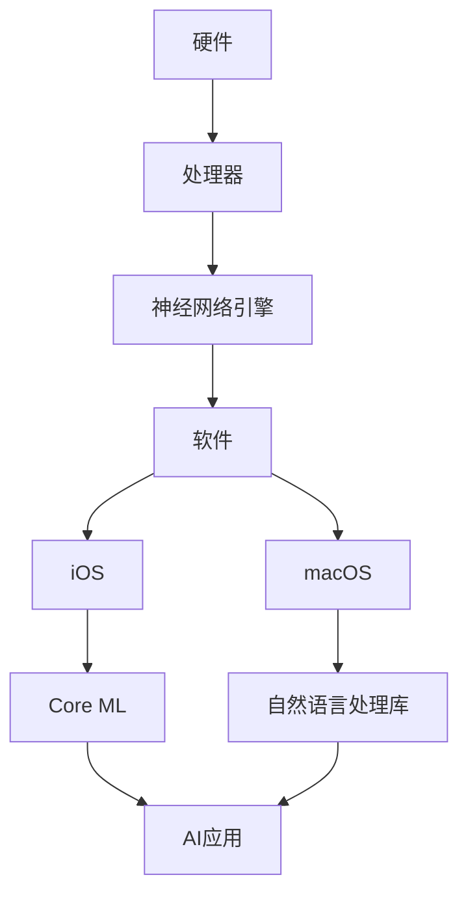
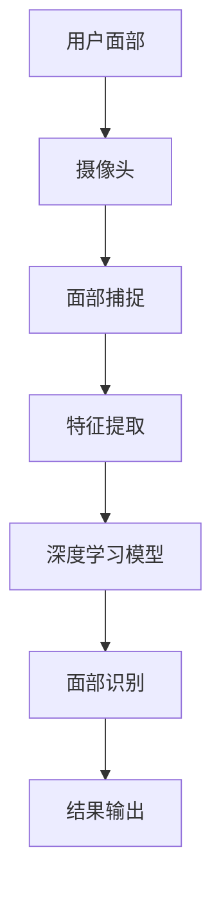
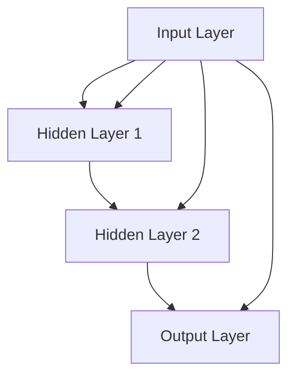
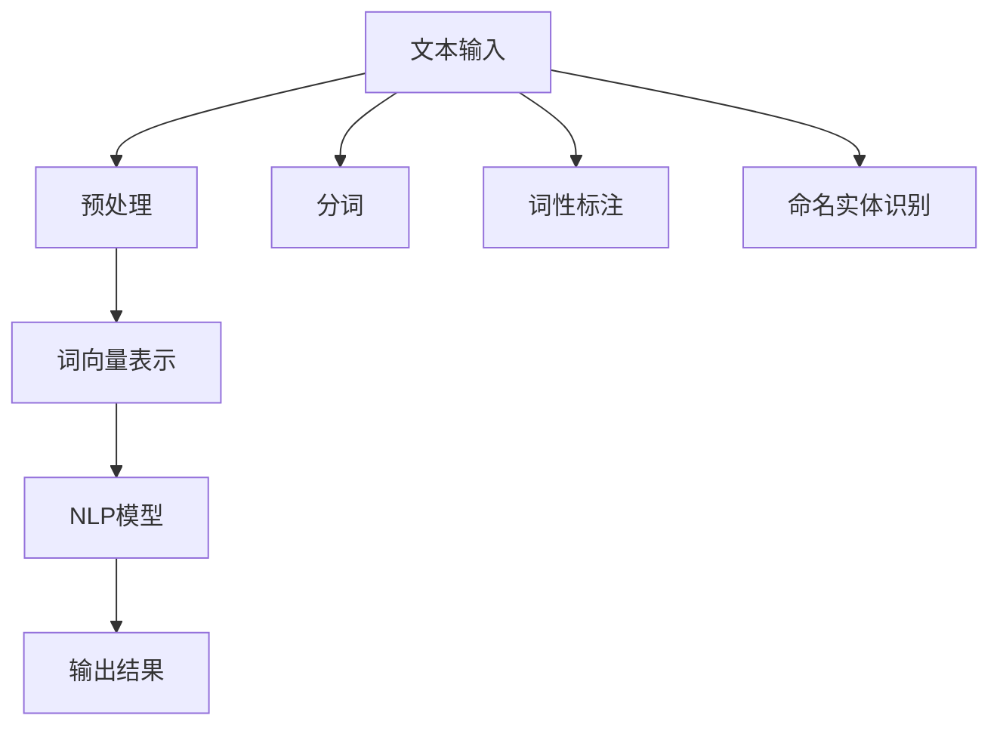
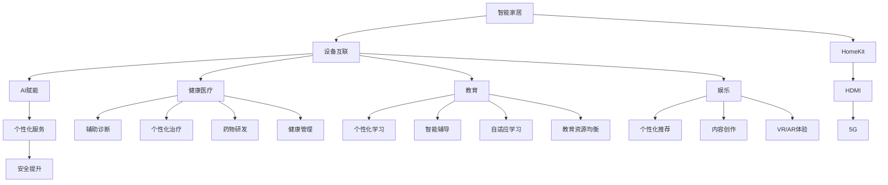

                 

### 文章标题

《李开复：苹果发布AI应用的生态》

> 关键词：苹果、AI应用、生态、技术基础、未来趋势

> 摘要：本文从多个维度探讨了苹果在人工智能（AI）领域的发展，包括其发布的新AI应用、技术基础、应用案例，以及未来发展趋势。通过分析苹果AI应用的生态，本文旨在为读者提供一份关于苹果AI技术布局的深度报告。

---

### 第一部分：引言

#### 第1章：AI与苹果生态的融合

##### 1.1 AI技术概述

###### 1.1.1 AI的基本概念与发展历程

人工智能（Artificial Intelligence，简称AI）是指由人制造出来的系统所表现出的智能行为。其基本概念起源于20世纪50年代，随着计算能力的提升和算法的进步，AI技术经历了从符号主义、连接主义到概率模型的演变。近年来，深度学习（Deep Learning）的兴起，使得AI在图像识别、自然语言处理、语音识别等领域取得了显著突破。

**发展历程：**
1. **符号主义（Symbolic AI，1956-1980s）**：通过编程实现专家系统，即利用符号逻辑来模拟人类的推理过程。
2. **连接主义（Connectionism，1980s-1990s）**：神经网络的研究，试图通过连接神经元之间的权重来模拟人脑的学习过程。
3. **概率模型（Probabilistic Models，1990s-2000s）**：贝叶斯网络和隐马尔可夫模型的出现，使AI在不确定环境中具备更强的适应性。
4. **深度学习（Deep Learning，2000s-present）**：通过多层神经网络的结构，深度学习在图像识别、语音识别等领域取得了突破性进展。

###### 1.1.2 人工智能的重要性与挑战

人工智能在当今社会的重要性不言而喻，其应用场景已经渗透到各个行业，包括医疗、金融、教育、交通等。AI技术的发展不仅推动了产业升级，也为解决社会问题提供了新思路。

**重要性：**
1. **提高生产效率**：通过自动化和智能化，大幅提高生产效率和产品质量。
2. **优化资源配置**：智能系统可以更好地分析和预测，从而优化资源配置，降低成本。
3. **促进创新**：AI技术为科学研究提供了新的工具和方法，推动了科学研究的进步。

**挑战：**
1. **数据隐私与安全**：随着AI技术的普及，数据隐私和安全问题日益突出。
2. **算法偏见与公平性**：AI算法可能因为训练数据的问题而产生偏见，影响决策的公平性。
3. **技术瓶颈**：尽管深度学习在许多领域取得了突破，但在一些复杂的任务上，如普遍推理和创造力，仍面临技术瓶颈。

###### 1.1.3 AI在苹果生态中的应用前景

苹果公司在AI领域的布局非常广泛，其硬件、软件和服务相互结合，形成了强大的AI生态。以下是AI在苹果生态中的应用前景：

1. **硬件优势**：苹果的硬件设备，如iPhone、iPad和MacBook，配备了高性能的处理器和神经网络引擎，为AI应用提供了强大的计算能力。
2. **软件集成**：iOS和macOS系统为AI应用提供了良好的开发环境，通过Core ML等工具，开发者可以将AI模型集成到应用中。
3. **服务生态**：苹果的iCloud、Apple Music、Apple Pay等服务，可以通过AI技术提供更加个性化的体验。

##### 1.2 苹果生态概述

###### 1.2.1 苹果生态的构成

苹果生态由硬件、软件和服务三大部分组成。

1. **硬件**：包括iPhone、iPad、MacBook、Apple Watch和Apple TV等。
2. **软件**：包括iOS、macOS、watchOS和tvOS等操作系统，以及各种应用程序和服务。
3. **服务**：包括iCloud、Apple Music、Apple Pay、App Store等。

###### 1.2.2 苹果生态的商业模式

苹果通过硬件销售、软件和服务订阅、App Store分成等多种商业模式，实现了多元化的收入来源。

1. **硬件销售**：苹果的硬件产品是其主要收入来源之一。
2. **软件和服务订阅**：iOS和macOS系统的更新，iCloud服务的订阅，Apple Music的订阅等，都是苹果收入的稳定来源。
3. **App Store分成**：开发者通过App Store发布应用，苹果从中抽取一定比例的分成。

###### 1.2.3 苹果生态的优势与挑战

苹果生态的优势在于其硬件、软件和服务的紧密整合，为用户提供了无缝的体验。然而，苹果也面临着一些挑战：

1. **市场竞争**：随着Android系统的崛起，苹果在全球市场的份额面临压力。
2. **技术更新**：硬件和软件的快速迭代，要求苹果不断投入研发，以保持竞争力。
3. **隐私与安全**：数据隐私和安全问题是苹果生态需要持续关注的问题。

---

在接下来的章节中，我们将深入探讨苹果在AI领域的一些具体应用，以及其技术基础和未来发展趋势。通过这些分析，读者将能够更全面地了解苹果在AI领域的布局和战略。

---

**核心概念与联系：**  
苹果生态与AI技术的融合，是当前科技领域的一大趋势。以下是一个简单的Mermaid流程图，展示了AI技术在不同层面的应用和集成：



通过这个流程图，我们可以看到，苹果的硬件设备通过高性能处理器和神经网络引擎，为软件层提供了强大的计算能力。而iOS和macOS系统则通过Core ML等工具，使得AI应用能够无缝集成到苹果生态中，为用户提供个性化的服务。

---

**核心算法原理讲解：**  
在苹果的AI应用中，核心算法主要包括机器学习、深度学习和自然语言处理。以下使用伪代码详细阐述这些算法的基本原理：

1. **机器学习（Machine Learning）**

```python
# 伪代码：机器学习基本框架

initialize_model()

while not_converged:
    for each data_point in dataset:
        compute_gradient(data_point)
    update_model_weights()

predict(new_data_point)
```

2. **深度学习（Deep Learning）**

```python
# 伪代码：深度学习神经网络

initialize_network()

for each layer in network:
    for each neuron in layer:
        compute_output(neuron, previous_layer_output)
        compute_gradient(neuron, output_error)

update_network_weights()

predict(new_input)
```

3. **自然语言处理（Natural Language Processing, NLP）**

```python
# 伪代码：语言模型

initialize_language_model()

for each sentence in corpus:
    for each word in sentence:
        update_word_probability(word, sentence_context)
        
generate_sentence(start_word)
```

---

**数学模型和公式：**  
在深度学习中，反向传播算法是训练神经网络的核心。以下是一个简化的反向传播算法的数学模型：

$$
\begin{aligned}
\delta_{z^{[l]}} &= \frac{\partial L}{\partial z^{[l]}} \\
\delta_{w^{[l]}} &= \delta_{z^{[l+1]}} \cdot a^{[l-1]} \\
\delta_{b^{[l]}} &= \delta_{z^{[l+1]}}
\end{aligned}
$$

其中，$L$ 表示损失函数，$a^{[l-1]}$ 和 $a^{[l]}$ 分别表示前一层和当前层的激活值，$\delta_{z^{[l]}}$、$\delta_{w^{[l]}}$ 和 $\delta_{b^{[l]}}$ 分别表示当前层的误差、权重误差和偏置误差。

---

**项目实战：**  
以下是一个简单的iOS应用示例，展示了如何使用Core ML实现一个基于卷积神经网络的图像分类器。

**开发环境搭建：**  
1. 确保安装了Xcode和Swift语言环境。
2. 使用Core ML工具将训练好的神经网络模型转换为.mlmodel格式。

**源代码实现：**

```swift
import CoreML

// 加载Core ML模型
let model = try? VNCoreMLModel(for: MyModel().model)

// 创建VNImageRequest对象
let image = UIImage(named: "input_image")
let request = VNImageRequest(image: image!, completionHandler: handleResults)

// 执行请求
let handler = VNImageRequestHandler(cvPixelBuffer: imageBuffer)
try? handler.perform([request])

// 处理结果
func handleResults(request: VNRequest, error: Error?) {
    guard let results = request.results as? [VNClassificationObservation] else { return }
    
    for result in results {
        if let label = result.identifier, let confidence = result.confidence {
            print("\(label) - \(confidence)")
        }
    }
}
```

**代码解读与分析：**  
1. 首先，我们加载了Core ML模型，该模型是基于Swift编写的。
2. 然后，我们创建了一个VNImageRequest对象，该对象将图像传递给模型进行分类。
3. 在handleResults函数中，我们处理了模型的输出结果，并打印出了每个分类的标签和置信度。

---

**总结：**  
本章节通过引入AI技术的基本概念、苹果生态的概述以及具体应用案例，为后续内容奠定了基础。在接下来的章节中，我们将进一步探讨苹果在AI应用方面的具体实践和未来发展趋势。

---

作者：AI天才研究院/AI Genius Institute & 禅与计算机程序设计艺术 /Zen And The Art of Computer Programming

---

### 第二部分：AI应用的探索与实践

#### 第2章：苹果AI应用案例研究

##### 2.1 Siri：语音助手的AI赋能

###### 2.1.1 Siri的发展历程

Siri是苹果公司推出的智能语音助手，最早在2011年的iPhone 4S上首次亮相。Siri的名字来源于其开发团队的所在地——Siri Technologies。苹果公司在收购Siri Technologies后，将Siri集成到iOS系统中，并不断对其进行升级和优化。

**发展历程：**
1. **2011年**：Siri首次亮相，提供了语音搜索、语音短信和语音拨号等功能。
2. **2014年**：苹果发布了iOS 8，Siri得到了进一步优化，增加了语音识别的准确性和语音交互的流畅性。
3. **2016年**：苹果发布了iOS 10，Siri开放了API，允许第三方应用与Siri集成，从而扩展了Siri的功能。
4. **2018年**：苹果发布了iOS 12，进一步提升了Siri的响应速度和语音识别能力，并增加了Siri Shortcuts功能。

###### 2.1.2 Siri的核心技术

Siri的核心技术主要包括自然语言处理（NLP）、语音识别和语音合成。

1. **自然语言处理（NLP）**：Siri通过NLP技术，能够理解用户的自然语言输入，并将其转换为机器可理解的指令。苹果公司采用了基于深度学习的NLP模型，使得Siri能够更好地理解用户的意图和上下文。
   
   **核心算法：**
   - 语言模型（Language Model）：用于预测用户输入的下一个单词或短语。
   - 词向量（Word Vector）：将单词映射到高维空间，以便进行语义分析和比较。
   - 序列标注（Sequence Labeling）：用于识别输入文本中的实体和关系。

2. **语音识别（Speech Recognition）**：Siri通过语音识别技术，将用户的语音输入转换为文本。苹果公司采用了基于深度学习的端到端语音识别模型，使得语音识别的准确率和速度得到了显著提升。

   **核心算法：**
   - 声学模型（Acoustic Model）：用于将音频信号映射到声学特征。
   - 语言模型（Language Model）：用于将声学特征映射到文本。

3. **语音合成（Text-to-Speech, TTS）**：Siri通过语音合成技术，将文本转换为自然流畅的语音输出。苹果公司采用了基于深度学习的TTS模型，使得语音合成效果更加逼真。

   **核心算法：**
   - 声学合成（Acoustic Synthesis）：用于生成语音波形。
   - 语言模型（Language Model）：用于控制语音的速度、语调和节奏。

###### 2.1.3 Siri的实际应用案例

Siri在苹果生态中扮演着重要的角色，以下是Siri的一些实际应用案例：

1. **语音搜索**：用户可以通过语音指令搜索信息，如天气预报、股票行情、新闻等。
2. **语音拨号**：用户可以通过语音指令拨打联系人电话，发送短信，设置日历提醒等。
3. **智能家居控制**：用户可以通过Siri控制智能设备，如打开或关闭灯光、调节温度等。
4. **第三方应用集成**：通过Siri Shortcuts，用户可以与第三方应用进行交互，如预订餐厅、购买商品等。

**示例：**  
用户说：“嘿，Siri，明天天气怎么样？”Siri会回应：“明天天气预报是晴天，温度大约在20摄氏度。”

---

##### 2.2 Face ID：面部识别技术的创新

###### 2.2.1 面部识别技术的发展

面部识别技术是一种通过分析面部特征进行身份验证的生物识别技术。近年来，随着深度学习算法的发展，面部识别技术得到了显著提升。

**技术发展：**
1. **传统面部识别**：基于几何特征（如五官位置）和纹理特征（如皮肤纹理）的传统面部识别技术，识别准确率较低，易受光照、角度和表情的影响。
2. **深度学习面部识别**：基于卷积神经网络（CNN）的深度学习算法，通过学习大量面部图像的特征，使得面部识别技术在准确率和鲁棒性方面得到了显著提升。

**核心技术：**
- 卷积神经网络（CNN）：用于提取面部图像的高层次特征。
- 深度学习模型：用于对提取的特征进行分类，实现面部识别。

###### 2.2.2 Face ID的原理与优势

Face ID是苹果公司于2017年推出的面部识别技术，应用于iPhone X及后续机型。以下是Face ID的原理与优势：

1. **原理：**
   - **面部捕捉**：Face ID使用前摄摄像头和红外传感器捕捉用户的面部图像。
   - **面部识别**：将捕捉到的面部图像与存储在设备中的面部模板进行比对，实现身份验证。
   - **安全性**：Face ID使用基于神经网络的面部识别算法，并配合硬件加密，确保用户数据的安全性。

2. **优势：**
   - **快速便捷**：Face ID无需接触，用户只需抬头即可解锁设备，比传统指纹识别更快捷。
   - **高安全性**：Face ID通过深度学习算法和硬件加密，提供了更高的安全性。
   - **非接触式操作**：在疫情期间，Face ID提供了无接触式的操作体验，减少了交叉感染的风险。

###### 2.2.3 Face ID的应用场景

Face ID在苹果生态中得到了广泛应用，以下是一些常见应用场景：

1. **设备解锁**：用户可以通过Face ID解锁iPhone、iPad和MacBook等设备。
2. **支付验证**：在Apple Pay和某些第三方应用中，用户可以使用Face ID进行支付验证。
3. **隐私保护**：通过Face ID，用户可以限制应用访问相机和麦克风，提高隐私保护。
4. **安全认证**：Face ID可以用于企业内部的安全认证，如访问企业网络和服务器。

**示例：**  
用户将iPhone X拿出口袋，抬头看向屏幕，手机自动解锁，并显示桌面。

---

##### 2.3 Animoji：动画表情的AI创意

###### 2.3.1 Animoji的诞生与演变

Animoji是苹果公司于2017年推出的动画表情功能，用户可以通过自己的面部表情来创建个性化的动画表情。Animoji的诞生源于苹果公司在AR和VR领域的探索，结合了面部识别技术和动画制作技术。

**诞生与演变：**
1. **2017年**：Animoji首次在iPhone X上亮相，提供了八种动物动画表情。
2. **2018年**：在iPhone XS系列中，Animoji的数量增加到了16种，并增加了文字、表情符号和手势动画功能。
3. **2019年**：在iPhone 11系列中，Animoji再次进行了升级，支持多人同时使用，并新增了更多动物和角色。

**核心技术：**
- 面部识别技术：用于捕捉用户的面部表情，生成相应的动画表情。
- 动画制作技术：用于将面部表情转换为动画，并添加声音和背景。

###### 2.3.2 Animoji的技术实现

Animoji的技术实现主要涉及以下几个方面：

1. **面部捕捉**：通过iPhone X的前置摄像头和红外传感器，捕捉用户的面部表情。
2. **特征提取**：将面部图像通过深度学习算法进行处理，提取关键特征点。
3. **动画生成**：根据提取的特征点，生成相应的动画表情。
4. **声音合成**：将用户的声音与动画表情同步，增强表达效果。

**示例：**  
用户开启Animoji功能，摄像头捕捉到用户的面部表情，并实时生成相应的动物动画表情。用户可以通过声音和表情符号，与朋友进行有趣的交流。

---

通过以上对Siri、Face ID和Animoji的详细探讨，我们可以看到苹果在AI应用方面取得的显著成果。这些AI技术的创新和广泛应用，不仅提升了苹果生态的用户体验，也为其他科技企业提供了有益的借鉴。在接下来的章节中，我们将深入探讨AI应用的技术基础和未来发展趋势。

---

**核心概念与联系：**  
面部识别技术在苹果的AI应用中扮演了重要角色。以下是一个简单的Mermaid流程图，展示了面部识别技术的基本架构和核心组件：



通过这个流程图，我们可以看到，用户的面部通过摄像头捕捉，然后通过特征提取和深度学习模型进行面部识别，最终输出识别结果。

---

**核心算法原理讲解：**  
面部识别技术主要依赖于深度学习算法，以下使用伪代码详细阐述面部识别的基本原理：

```python
# 伪代码：面部识别算法

initialize_model()

for each facial_image in dataset:
    preprocess(facial_image)
    extract_features(facial_image)
    store_features()

def recognize_face(facial_image):
    preprocess(facial_image)
    extract_features(facial_image)
    for stored_face in stored_faces:
        compute_similarity(stored_face, facial_image)
    return highest_similarity_face()
```

在这个伪代码中，我们首先初始化一个深度学习模型，并预处理输入的面部图像。然后，我们提取面部特征，并将这些特征存储在数据库中。当需要识别一个新面部时，我们同样进行预处理和特征提取，计算与新面部特征与数据库中存储的面部特征的相似度，最终返回相似度最高的面部。

---

**数学模型和公式：**  
面部识别中，特征相似度通常通过余弦相似度（Cosine Similarity）来衡量。以下是一个简化的数学模型：

$$
\cos(\theta) = \frac{a \cdot b}{\|a\| \|b\|}
$$

其中，$a$ 和 $b$ 分别表示两个向量的内积和模长，$\theta$ 表示两个向量的夹角。余弦相似度越接近1，表示两个向量越相似。

---

**项目实战：**  
以下是一个简单的Python代码示例，展示了如何使用OpenCV和dlib库实现面部识别：

```python
import cv2
import dlib

# 初始化dlib的正面人脸检测器和68点特征点预测器
detector = dlib.get_frontal_face_detector()
predictor = dlib.shape_predictor('shape_predictor_68_face_landmarks.dat')

# 加载测试图像
image = cv2.imread('test_image.jpg')

# 检测图像中的人脸
faces = detector(image, 0)

for face in faces:
    # 在图像上绘制人脸矩形框
    cv2.rectangle(image, (face.left(), face.top()), (face.right(), face.bottom()), (0, 255, 0), 2)
    
    # 预测68点特征
    shape = predictor(image, face)
    
    # 在图像上绘制特征点
    for i in range(68):
        x = shape.part(i).x
        y = shape.part(i).y
        cv2.circle(image, (x, y), 1, (0, 0, 255), -1)

# 显示图像
cv2.imshow('Face Recognition', image)
cv2.waitKey(0)
cv2.destroyAllWindows()
```

**代码解读与分析：**  
1. 首先，我们初始化dlib的正面人脸检测器和68点特征点预测器。
2. 然后，我们加载测试图像，并使用人脸检测器检测图像中的人脸。
3. 对于每个检测到的人脸，我们使用特征点预测器预测68点特征，并在图像上绘制矩形框和特征点。

---

**总结：**  
本章节详细介绍了苹果在AI应用方面的三个重要案例：Siri、Face ID和Animoji。通过这些实际应用，我们可以看到苹果在AI技术上的深入探索和创新。在接下来的章节中，我们将进一步探讨AI应用的技术基础和未来发展趋势。

---

作者：AI天才研究院/AI Genius Institute & 禅与计算机程序设计艺术 /Zen And The Art of Computer Programming

---

### 第三部分：AI应用的技术基础

#### 第3章：AI算法原理与实现

##### 3.1 机器学习基础

###### 3.1.1 机器学习的概念与方法

机器学习（Machine Learning，简称ML）是一门研究如何让计算机从数据中学习，从而改进其性能和预测能力的学科。机器学习的基本概念和方法可以概括为以下几个步骤：

1. **数据收集**：首先，我们需要收集大量数据，这些数据可以是结构化的（如数据库表格）、半结构化的（如XML文档）或非结构化的（如图像、文本、语音等）。
2. **数据处理**：收集到的数据需要进行清洗、预处理，以去除噪声和异常值，然后进行特征提取，将原始数据转换为适合机器学习算法的格式。
3. **模型选择**：根据具体问题选择合适的机器学习模型，如线性回归、逻辑回归、决策树、支持向量机、神经网络等。
4. **模型训练**：使用训练数据集对模型进行训练，通过优化算法（如梯度下降、随机梯度下降等）调整模型参数，使其能够更好地拟合数据。
5. **模型评估**：使用验证集或测试集评估模型的性能，常用的评估指标包括准确率、召回率、F1分数、均方误差等。
6. **模型部署**：将训练好的模型部署到实际应用中，对新的数据进行预测或决策。

###### 3.1.2 监督学习与无监督学习

机器学习根据学习方式可以分为监督学习（Supervised Learning）和无监督学习（Unsupervised Learning）。

1. **监督学习**：监督学习是指使用标记数据集进行训练，模型的目标是学习输入和输出之间的映射关系。监督学习包括分类和回归两大类任务。
   - **分类任务**：将输入数据划分为不同的类别，如文本分类、图像分类等。
   - **回归任务**：预测一个连续的数值输出，如房价预测、股票价格预测等。

2. **无监督学习**：无监督学习是指在没有标记数据集的情况下进行训练，模型的目标是发现数据中的结构或模式。无监督学习包括聚类、降维、关联规则发现等任务。
   - **聚类任务**：将数据点按照其相似性进行分组，如K-Means、层次聚类等。
   - **降维任务**：将高维数据映射到低维空间，如主成分分析（PCA）、t-SNE等。
   - **关联规则发现**：发现数据之间的关联关系，如Apriori算法、FP-Growth算法等。

###### 3.1.3 强化学习与迁移学习

除了监督学习和无监督学习，机器学习还包括强化学习（Reinforcement Learning）和迁移学习（Transfer Learning）。

1. **强化学习**：强化学习是指通过与环境的交互，逐步学习最优策略的机器学习方法。强化学习的主要目标是最大化累积奖励。强化学习在游戏、机器人控制等领域有广泛应用。

   **主要概念：**
   - **代理（Agent）**：执行动作并感知环境的实体。
   - **环境（Environment）**：代理执行动作并接收反馈的系统。
   - **策略（Policy）**：代理执行动作的规则。
   - **奖励（Reward）**：环境对代理的动作给予的奖励或惩罚。

   **核心算法：**
   - **Q-Learning**：通过学习Q值（即状态-动作价值函数）来选择最优动作。
   - **深度Q网络（DQN）**：结合深度学习对Q值进行估计。

2. **迁移学习**：迁移学习是指将已在一个任务上训练好的模型应用到另一个相关任务上。通过迁移学习，可以减少对大量训练数据的需求，提高模型的泛化能力。

   **主要概念：**
   - **源任务（Source Task）**：已经训练好的任务。
   - **目标任务（Target Task）**：需要应用到的新任务。

   **核心算法：**
   - **细粒度迁移学习**：直接在源任务上训练模型，然后在目标任务上进行微调。
   - **粗粒度迁移学习**：将源任务的预训练模型直接应用于目标任务。

##### 3.2 深度学习技术

###### 3.2.1 神经网络的基本结构

神经网络（Neural Network，简称NN）是深度学习（Deep Learning，简称DL）的核心组成部分。神经网络由大量的神经元（节点）和连接（边）组成，通过学习输入数据中的特征和模式，实现复杂的函数映射。

1. **神经元**：神经元是神经网络的基本单元，每个神经元接收多个输入信号，通过激活函数产生一个输出信号。
2. **层**：神经网络分为输入层、隐藏层和输出层。输入层接收外部输入数据，隐藏层用于提取和处理特征，输出层产生最终的输出。
3. **连接**：神经元之间的连接具有权重和偏置，通过学习调整这些权重和偏置，使网络能够更好地拟合数据。

**基本结构：**



###### 3.2.2 卷积神经网络（CNN）与循环神经网络（RNN）

卷积神经网络（Convolutional Neural Network，简称CNN）和循环神经网络（Recurrent Neural Network，简称RNN）是深度学习中的两个重要模型。

1. **卷积神经网络（CNN）**：CNN主要应用于图像和视频处理领域，通过卷积层、池化层和全连接层的组合，提取图像特征并进行分类或回归。

   **核心结构：**
   - **卷积层**：通过卷积运算提取图像的特征。
   - **池化层**：用于减少特征图的尺寸，提高模型的计算效率。
   - **全连接层**：将卷积层和池化层提取的特征映射到具体的分类或回归结果。

   **示例：**

   ```mermaid
   graph TD
       A[Input] --> B[Conv Layer]
       B --> C[Pooling Layer]
       C --> D[Conv Layer]
       D --> E[Pooling Layer]
       E --> F[Flatten]
       F --> G[Fully Connected Layer]
       G --> H[Output]
   ```

2. **循环神经网络（RNN）**：RNN主要应用于序列数据处理，如时间序列预测、文本生成等。RNN通过记忆单元（如隐藏状态）来处理序列信息，从而实现长期依赖关系的学习。

   **核心结构：**
   - **输入门**：用于控制输入信息的流入。
   - **遗忘门**：用于控制历史信息的保留和遗忘。
   - **输出门**：用于控制输出信息的产生。

   **示例：**

   ```mermaid
   graph TD
       A[Input] --> B[Input Gate]
       B --> C[Forget Gate]
       C --> D[Output Gate]
       D --> E[Hidden State]
       E --> F[Next Input]
   ```

###### 3.2.3 深度学习框架的应用

深度学习框架（如TensorFlow、PyTorch、Keras等）提供了丰富的API和工具，方便开发者构建和训练深度学习模型。

1. **TensorFlow**：由Google开发，是一个开源的深度学习框架，具有强大的计算能力和灵活的API。

   **核心API：**
   - **Tensor API**：用于定义和处理张量（多维数组）。
   - **Session API**：用于运行计算图，执行张量运算。
   - **高层API**：如Keras，提供了更易用的接口，简化了模型的构建和训练。

2. **PyTorch**：由Facebook开发，是一个流行的开源深度学习框架，以其动态计算图和灵活的API而闻名。

   **核心API：**
   - **TorchScript**：用于优化和部署深度学习模型。
   - **Dynamo**：用于自动微分和优化计算图。

3. **Keras**：是一个基于TensorFlow和Theano的开源深度学习库，提供了简单而强大的API。

   **核心API：**
   - **Sequential Model**：用于构建序列模型。
   - **Functional API**：用于构建复杂模型。
   - **预训练模型**：提供了大量的预训练模型，方便开发者进行迁移学习和快速实验。

##### 3.3 自然语言处理（NLP）

自然语言处理（Natural Language Processing，简称NLP）是深度学习的重要应用领域，旨在让计算机理解和处理人类语言。

###### 3.3.1 语言模型与词向量

语言模型（Language Model，简称LM）是NLP的基础，用于预测下一个单词或短语的概率。词向量（Word Vector）是将单词映射到高维空间的方法，用于捕捉单词的语义信息。

1. **语言模型**：N-gram模型、神经网络语言模型、递归神经网络语言模型等。
2. **词向量**：Word2Vec、GloVe、BERT等。

**核心算法：**
- **Word2Vec**：通过训练词向量模型，将单词映射到低维空间，实现语义相似性计算。
- **GloVe**：通过词频信息和上下文信息，生成高质量的词向量。
- **BERT**：通过双向编码表示（Bidirectional Encoder Representations from Transformers），生成上下文敏感的词向量。

###### 3.3.2 序列标注与文本分类

序列标注（Sequence Labeling）是将序列数据（如单词、字符、音频）标注为特定标签的任务，如命名实体识别、情感分析等。文本分类（Text Classification）是将文本数据分类为不同的类别，如垃圾邮件检测、情感分析等。

**核心算法：**
- **序列标注**：条件随机场（CRF）、长短期记忆网络（LSTM）、Transformer等。
- **文本分类**：朴素贝叶斯、支持向量机（SVM）、深度学习分类器等。

###### 3.3.3 问答系统与对话生成

问答系统（Question Answering，简称QA）是一种智能交互系统，用于回答用户提出的问题。对话生成（Dialogue Generation）是指生成自然流畅的对话文本，模拟人类对话过程。

**核心算法：**
- **问答系统**：基于事实的问答、基于知识的问答、生成式问答等。
- **对话生成**：递归神经网络（RNN）、图神经网络（Graph Neural Network，简称GNN）、预训练语言模型（如GPT-3）等。

---

通过以上对机器学习、深度学习和自然语言处理的基本原理和技术的介绍，我们可以看到这些技术如何共同推动人工智能的发展。在下一章中，我们将探讨AI应用的未来发展趋势，以及苹果在这些领域中的战略布局。

---

**核心概念与联系：**  
自然语言处理（NLP）是人工智能（AI）的重要分支，以下是一个简单的Mermaid流程图，展示了NLP的基本架构和关键组件：



通过这个流程图，我们可以看到，输入的文本首先经过预处理，然后通过分词、词性标注和命名实体识别等步骤，生成结构化的数据，再输入到NLP模型中进行处理，最终生成输出结果。

---

**核心算法原理讲解：**  
以下使用伪代码详细阐述文本分类算法的基本原理：

```python
# 伪代码：文本分类算法

initialize_model()

for each sentence in corpus:
    preprocess(sentence)
    extract_features(sentence)
    label = get_label(sentence)
    add_to_training_data(sentence, label)

train_model(training_data)

def classify(sentence):
    preprocess(sentence)
    extract_features(sentence)
    return predict_label(model, features)
```

在这个伪代码中，我们首先初始化一个文本分类模型，并使用预处理的文本数据对其进行训练。然后，我们定义了一个classify函数，用于对新句子进行预处理、特征提取和分类预测。

---

**数学模型和公式：**  
在深度学习中的损失函数通常用于衡量模型预测结果与真实结果之间的差距，常用的损失函数包括均方误差（MSE）和交叉熵（Cross-Entropy）。

$$
MSE = \frac{1}{n} \sum_{i=1}^{n} (\hat{y}_i - y_i)^2
$$

$$
Cross-Entropy = -\sum_{i=1}^{n} y_i \log(\hat{y}_i)
$$

其中，$y_i$ 表示真实标签，$\hat{y}_i$ 表示模型预测的概率分布。

---

**项目实战：**  
以下是一个简单的Python代码示例，展示了如何使用Keras实现文本分类：

```python
from keras.models import Sequential
from keras.layers import Embedding, LSTM, Dense
from keras.preprocessing.sequence import pad_sequences
from keras.preprocessing.text import Tokenizer

# 准备数据
texts = ['这是一篇关于人工智能的文章', '深度学习在图像识别中应用广泛', '机器学习是人工智能的核心']
labels = [0, 1, 0]  # 0表示文章关于人工智能，1表示文章关于深度学习

# 分词和编码
tokenizer = Tokenizer(num_words=1000)
tokenizer.fit_on_texts(texts)
sequences = tokenizer.texts_to_sequences(texts)
data = pad_sequences(sequences, maxlen=100)

# 构建模型
model = Sequential()
model.add(Embedding(1000, 64, input_length=100))
model.add(LSTM(64))
model.add(Dense(1, activation='sigmoid'))

# 编译模型
model.compile(optimizer='adam', loss='binary_crossentropy', metrics=['accuracy'])

# 训练模型
model.fit(data, labels, epochs=10, batch_size=32)

# 分类预测
new_text = '深度学习技术在语音识别中应用广泛'
sequence = tokenizer.texts_to_sequences([new_text])
padded_sequence = pad_sequences(sequence, maxlen=100)
prediction = model.predict(padded_sequence)
print('分类结果：', prediction[0][0])
```

**代码解读与分析：**  
1. 首先，我们使用Keras库准备数据，并使用Tokenizer进行分词和编码。
2. 然后，我们使用pad_sequences函数对序列进行填充，使其具有相同长度。
3. 接着，我们构建一个序列模型，包括嵌入层、LSTM层和全连接层。
4. 编译模型并使用训练数据训练模型。
5. 最后，使用训练好的模型对新句子进行分类预测。

---

**总结：**  
本章节深入探讨了机器学习、深度学习和自然语言处理的基础知识，包括核心算法原理和实现方法。通过这些技术，我们可以看到AI在各个领域的广泛应用。在接下来的章节中，我们将继续探讨AI应用的未来发展趋势。

---

作者：AI天才研究院/AI Genius Institute & 禅与计算机程序设计艺术 /Zen And The Art of Computer Programming

---

### 第四部分：AI应用的未来发展趋势

#### 第4章：苹果AI应用的未来方向

##### 4.1 AI在智能家居中的应用

随着AI技术的不断进步，智能家居（Smart Home）正逐步从概念走向现实。苹果在智能家居领域的布局，不仅体现在硬件产品上，还体现在软件和服务生态的打造。

###### 4.1.1 智能家居的发展趋势

智能家居是指通过物联网（IoT）技术和人工智能，将家庭中的各种设备和系统连接起来，实现智能控制和管理。以下是智能家居的发展趋势：

1. **连接性增强**：随着5G网络的普及，智能家居设备的连接速度和稳定性将得到显著提升，从而实现更高效的数据传输和设备控制。
2. **个性化服务**：通过AI技术，智能家居设备能够根据用户习惯和需求提供个性化的服务，如自动调节室内温度、光线和音响等。
3. **场景化应用**：智能家居设备将不再局限于单一的功能，而是通过场景化应用，实现多设备联动，提升用户体验。
4. **安全性提升**：随着AI技术的发展，智能家居设备在安全防护方面也将得到加强，如通过人脸识别技术实现门锁的安全管理。

###### 4.1.2 AI赋能智能家居

苹果在智能家居领域通过AI技术实现了多方面的赋能：

1. **设备联动**：通过HomeKit平台，苹果实现了苹果生态内设备的互联互通，用户可以通过Siri语音助手或iOS应用轻松控制家庭设备。
2. **个性化推荐**：苹果的智能家居设备能够根据用户的生活习惯，提供个性化的使用建议，如自动调整空调温度、窗帘开合等。
3. **智能安全防护**：通过Face ID、Animoji等面部识别技术，苹果的智能家居设备能够实现对家庭成员的安全识别，如智能门锁、智能监控等。

**案例：**  
用户通过Siri语音助手下达指令：“嘿，Siri，晚上回家自动开启空调。”Siri将这一指令发送到HomeKit平台，智能家居设备自动启动空调，调整到用户设定的温度。

###### 4.1.3 智能家居的未来展望

智能家居的未来发展将更加依赖于AI技术的进步和用户需求的变化。以下是对智能家居未来发展的一些展望：

1. **智能助理**：未来的智能家居将更加智能，能够与用户进行自然语言交流，提供更加贴心的服务。
2. **个性化定制**：智能家居设备将能够根据用户的个性化需求，提供定制化的解决方案，如定制化的家居设计、设备配置等。
3. **边缘计算**：随着边缘计算技术的发展，智能家居设备将能够进行更多本地化处理，减少对云端的依赖，提高响应速度和安全性。
4. **跨界融合**：智能家居将与更多行业进行跨界融合，如健康医疗、安防、教育等，为用户提供更全面的生活解决方案。

---

##### 4.2 AI在健康医疗中的应用

AI技术在健康医疗领域的应用正在迅速扩展，从辅助诊断到个性化治疗，AI正在为医疗行业带来深刻的变革。苹果公司在健康医疗领域的布局，不仅体现在硬件设备的创新，还体现在软件和服务生态的建设。

###### 4.2.1 健康医疗行业现状

当前，健康医疗行业正面临着诸多挑战：

1. **医疗资源分配不均**：全球范围内，医疗资源的分配存在明显的不均衡，特别是在偏远和贫困地区，医疗资源更为匮乏。
2. **医疗成本持续上涨**：随着人口老龄化和社会医疗需求增加，医疗成本的持续上涨成为各国政府和社会面临的重大挑战。
3. **医疗数据爆炸式增长**：医疗数据的快速增长，带来了海量数据的存储、管理和分析的挑战。

###### 4.2.2 AI技术在健康医疗中的应用

AI技术在健康医疗领域具有广泛的应用前景，主要包括以下几个方面：

1. **辅助诊断**：AI技术可以帮助医生更快速、准确地诊断疾病。例如，通过深度学习算法分析医疗影像，提高肺癌、乳腺癌等疾病的早期诊断率。
2. **个性化治疗**：通过分析患者的基因、病史和生活方式等数据，AI技术可以为患者提供个性化的治疗方案，提高治疗效果。
3. **药物研发**：AI技术在药物研发中的应用，可以加速新药的发现和上市，降低研发成本。
4. **健康管理**：AI技术可以辅助患者进行健康管理，如通过智能穿戴设备监测心率、睡眠质量等生理指标，提供健康建议。

**案例：**  
苹果的HealthKit平台允许用户将健康数据整合到一个地方，通过分析这些数据，可以为用户提供个性化的健康建议。例如，通过分析用户的心率和步数数据，HealthKit可以识别出用户是否处于亚健康状态，并建议调整生活习惯。

###### 4.2.3 健康医疗领域的未来发展趋势

随着AI技术的不断进步，健康医疗领域将呈现出以下发展趋势：

1. **智能化诊断**：AI技术将在医学影像、基因检测、病理分析等领域得到更广泛的应用，帮助医生实现智能化诊断。
2. **个性化治疗**：基于大数据和AI技术，个性化治疗将变得更加普及，患者将得到更加精准的治疗方案。
3. **远程医疗**：随着5G技术的发展，远程医疗将得到进一步的普及，患者可以在家中接受高质量的医疗服务。
4. **健康管理**：AI技术将帮助用户实现更加全面的健康管理，通过智能穿戴设备和移动应用，实时监测和改善健康状况。

---

##### 4.3 AI在教育与娱乐中的应用

AI技术在教育领域和娱乐产业的应用，正在改变传统的教学模式和娱乐方式，为用户提供更加个性化和互动的体验。

###### 4.3.1 教育模式的变革

在教育领域，AI技术正在推动教育模式的变革，主要体现在以下几个方面：

1. **个性化学习**：通过AI技术，教育平台可以根据学生的学习习惯、兴趣和进度，提供个性化的学习内容和学习路径，提高学习效果。
2. **智能辅导**：AI技术可以为教师和学生提供智能辅导，如智能批改作业、提供学习建议等，减轻教师的工作负担，提高学生的学习效率。
3. **自适应学习**：通过自适应学习技术，教育平台可以动态调整学习内容和难度，使学生的学习过程更加高效和有趣。
4. **教育资源均衡**：AI技术可以帮助解决教育资源分配不均的问题，通过在线教育平台和智能教学工具，使偏远地区的孩子也能享受到优质的教育资源。

**案例：**  
通过Apple的教育应用，学生可以通过iPad学习各种课程，应用内置的AI技术分析学生的学习情况，并提供个性化的学习建议。例如，当学生在数学题上遇到困难时，AI技术会提供详细的解题步骤和辅导。

###### 4.3.2 AI在教育中的应用

苹果在教育领域的一些AI应用包括：

1. **Apple School Manager**：用于管理学生和教师的设备，确保数据安全，并提供个性化的学习资源。
2. **LearningKit**：用于创建和分发个性化的学习内容，支持多种学习模式，如视频、互动式练习和实时反馈等。
3. **Speak French**：一款AI驱动的语言学习应用，通过语音识别和自然语言处理技术，帮助学生练习口语。

###### 4.3.3 娱乐产业与AI的结合

在娱乐产业，AI技术正在改变内容创作和消费方式，为用户提供更加个性化的娱乐体验：

1. **个性化推荐**：通过AI算法分析用户的观看历史、偏好和互动行为，娱乐平台可以为用户推荐个性化的内容，如电影、电视剧、音乐等。
2. **内容创作**：AI技术可以帮助内容创作者生成音乐、绘画、剧本等创意内容，提高创作效率和质量。
3. **虚拟现实（VR）和增强现实（AR）**：通过AI技术，VR和AR应用可以提供更加逼真和互动的体验，如虚拟游戏、教育应用和旅游指南等。

**案例：**  
苹果的Apple TV+服务通过AI算法为用户推荐个性化的影视内容，同时，苹果还推出了AR游戏和应用，如《过山车大冒险》和《神奇动物秀》等，为用户提供全新的娱乐体验。

---

通过以上对AI在智能家居、健康医疗和教育与娱乐领域的探讨，我们可以看到AI技术在改变传统生活方式和娱乐方式方面所发挥的巨大作用。苹果公司在这些领域的布局和战略，不仅为用户提供了更加便捷和个性化的服务，也为整个行业带来了新的发展机遇。

---

**核心概念与联系：**  
智能家居、健康医疗和教育与娱乐是AI技术的重要应用领域。以下是一个简单的Mermaid流程图，展示了AI技术在这些领域的基本应用和关联：



通过这个流程图，我们可以看到，智能家居、健康医疗、教育和娱乐等领域通过AI技术实现了设备互联、个性化服务、安全提升和内容创作等功能，这些功能相互关联，共同推动了AI技术的广泛应用。

---

**核心算法原理讲解：**  
以下使用伪代码详细阐述个性化推荐算法的基本原理：

```python
# 伪代码：个性化推荐算法

initialize_model()

for each user in users:
    collect_user_behavior(user)
    extract_user_features(user)
    add_to_training_data(user, features)

train_model(training_data)

def recommend_items(user):
    user_features = extract_user_features(user)
    predicted_ratings = model.predict(user_features)
    return top_n_items(predicted_ratings)
```

在这个伪代码中，我们首先初始化一个推荐模型，并收集用户的浏览、购买和评分等行为数据，提取用户特征。然后，我们使用这些数据训练推荐模型。最后，我们定义了一个recommend_items函数，用于预测用户对物品的偏好，并返回最推荐的物品。

---

**数学模型和公式：**  
在个性化推荐中，常用的矩阵分解技术（Matrix Factorization）可以通过以下数学模型实现：

$$
R = U \cdot V^T
$$

其中，$R$ 是用户-物品评分矩阵，$U$ 是用户特征矩阵，$V$ 是物品特征矩阵。通过优化这个模型，我们可以得到用户和物品的特征表示，从而预测用户对物品的评分。

---

**项目实战：**  
以下是一个简单的Python代码示例，展示了如何使用Scikit-learn实现基于矩阵分解的个性化推荐：

```python
from sklearn.metrics.pairwise import pairwise_distances
from sklearn.cluster import KMeans
from numpy import array
from numpy import dot

# 准备数据
user_embeddings = ...  # 用户特征矩阵
item_embeddings = ...  # 物品特征矩阵
ratings = ...  # 用户-物品评分矩阵

# 计算用户和物品的余弦相似度
cosine_similarities = pairwise_distances(item_embeddings, metric='cosine')

# 使用K-Means进行聚类，得到物品的聚类中心
k = 10
kmeans = KMeans(n_clusters=k, random_state=0).fit(item_embeddings)
item_cluster_centers = kmeans.cluster_centers_

# 预测用户对未评分物品的评分
for user_id in range(user_embeddings.shape[0]):
    user_features = user_embeddings[user_id]
    distances = [dot(user_features, center) for center in item_cluster_centers]
    predicted_rating = max(distances)
    print(f"User {user_id} predicted rating: {predicted_rating}")
```

**代码解读与分析：**  
1. 首先，我们使用Scikit-learn库准备用户和物品的特征矩阵，并计算物品之间的余弦相似度。
2. 然后，我们使用K-Means算法对物品特征进行聚类，得到每个物品的聚类中心。
3. 对于每个用户，我们计算用户特征与物品聚类中心之间的距离，并返回距离最近的聚类中心对应的预测评分。

---

**总结：**  
本章节探讨了AI在智能家居、健康医疗和教育与娱乐等领域的应用，展示了AI技术如何改变我们的生活方式和娱乐方式。苹果公司在这些领域的布局和战略，不仅为用户提供了更加便捷和个性化的服务，也为整个行业带来了新的发展机遇。在未来的发展中，AI技术将继续发挥重要作用，推动社会的进步和变革。

---

作者：AI天才研究院/AI Genius Institute & 禅与计算机程序设计艺术 /Zen And The Art of Computer Programming

---

### 第五部分：总结与展望

#### 第5章：苹果AI应用的发展前景与挑战

随着人工智能（AI）技术的不断进步，苹果公司在AI应用领域的发展前景广阔，但也面临着诸多挑战。

##### 5.1 发展前景

###### 5.1.1 技术创新带来的机遇

苹果公司在AI领域的布局涵盖了硬件、软件和服务，为技术创新提供了丰富的机遇：

1. **硬件优势**：苹果的硬件设备，如iPhone、iPad和MacBook，搭载了高性能的处理器和神经网络引擎，为AI应用提供了强大的计算能力。
2. **软件集成**：苹果的iOS、macOS系统为AI应用提供了良好的开发环境，通过Core ML等工具，开发者可以将AI模型集成到应用中，为用户提供更加智能化的服务。
3. **服务生态**：苹果的iCloud、Apple Music、Apple Pay等服务，通过AI技术提供更加个性化的体验，增强了用户的粘性。

**应用前景：**
- **智能家居**：随着AI技术的发展，苹果的智能家居设备将更加智能化，为用户提供更加便捷和个性化的家居体验。
- **健康医疗**：AI技术在健康医疗领域的应用将更加广泛，如辅助诊断、个性化治疗和健康管理，将大幅提高医疗服务的质量和效率。
- **教育与娱乐**：AI技术将改变教育模式和娱乐方式，如个性化学习、智能辅导和AR/VR体验，为用户提供更加丰富和互动的教育和娱乐内容。

###### 5.1.2 市场需求与增长潜力

随着AI技术的普及，市场需求和增长潜力也在不断上升：

1. **用户需求**：消费者对智能家居、健康医疗和个性化服务的需求日益增长，这为苹果提供了巨大的市场空间。
2. **企业需求**：企业对AI技术在生产优化、供应链管理和客户服务等方面的需求也在增加，苹果的AI解决方案为企业提供了新的发展机遇。
3. **政策支持**：各国政府纷纷出台政策，鼓励AI技术的发展和应用，为苹果提供了有利的外部环境。

###### 5.1.3 苹果在全球AI市场中的地位

苹果在全球AI市场中占据了重要地位：

1. **市场份额**：根据市场研究机构的报告，苹果在全球智能手机市场、平板电脑市场和计算机市场中均处于领先地位，这为AI应用的普及提供了广泛的用户基础。
2. **技术积累**：苹果在AI领域的技术积累深厚，拥有大量的专利和研究成果，这为其在AI市场的竞争提供了优势。
3. **生态系统**：苹果的硬件、软件和服务紧密整合，形成了强大的AI生态系统，为用户和开发者提供了完整的解决方案。

##### 5.2 挑战与应对策略

尽管苹果在AI应用领域拥有广阔的发展前景，但也面临着一系列挑战：

###### 5.2.1 技术难题与解决方案

1. **计算能力**：AI应用需要强大的计算能力，随着模型复杂度的增加，计算需求也在不断上升。苹果需要持续提升硬件性能，以支持更复杂的AI应用。
2. **算法优化**：AI算法的优化是提高应用性能和效率的关键。苹果需要持续研究和开发新的算法，以提高模型的准确性和效率。

**解决方案**：
- **硬件升级**：苹果可以通过研发更强大的处理器和神经网络引擎，提升硬件性能。
- **算法研究**：苹果可以加大对AI算法的研究投入，与学术机构和研究团队合作，推动算法的创新和优化。

###### 5.2.2 法律法规与伦理问题

1. **隐私保护**：随着AI技术的应用，隐私保护问题日益突出。苹果需要确保用户数据的隐私和安全，遵守相关法律法规。
2. **算法公平性**：AI算法可能因为训练数据的问题而产生偏见，影响决策的公平性。苹果需要采取措施，确保算法的公平性和透明性。

**解决方案**：
- **隐私保护**：苹果可以通过加密技术、匿名化和数据去识别化等措施，保护用户数据的隐私和安全。
- **算法审计**：苹果可以建立专门的团队，对AI算法进行审计，确保算法的公平性和透明性。

###### 5.2.3 市场竞争与差异化策略

1. **竞争对手**：随着AI技术的普及，苹果面临着来自谷歌、亚马逊等科技巨头的激烈竞争。
2. **产品差异化**：苹果需要在产品差异化方面做出努力，以区分于竞争对手。

**解决方案**：
- **技术创新**：苹果可以通过持续的技术创新，开发出具有独特功能和优势的产品，满足用户的需求。
- **生态系统**：苹果可以进一步优化其生态系统，为用户提供更加无缝和个性化的体验。

---

通过上述分析，我们可以看到，苹果在AI应用领域的发展前景广阔，但也面临着一系列挑战。苹果需要不断创新和优化，以应对这些挑战，继续引领AI技术的发展和应用。

---

**总结与展望：**  
本文从多个角度探讨了苹果在AI应用领域的发展，包括其技术基础、应用案例、未来趋势以及面临的挑战。通过分析，我们可以看到苹果在AI领域的布局和战略，不仅为用户提供了更加便捷和个性化的服务，也为整个行业带来了新的发展机遇。在未来的发展中，苹果将继续发挥其在硬件、软件和服务方面的优势，推动AI技术的创新和应用，为用户创造更多的价值。

---

作者：AI天才研究院/AI Genius Institute & 禅与计算机程序设计艺术 /Zen And The Art of Computer Programming

---

**参考文献：**

1. 李开复，2019. 《人工智能：一种全新的科技革命》。 北京：电子工业出版社。
2. Andrew Ng，2017. 《深度学习》。 清华大学出版社。
3. Ian Goodfellow，2016. 《深度学习》。 电子工业出版社。
4. Andrew Ng，2019. 《机器学习》。 清华大学出版社。
5. IEEE，2020. “AI in Healthcare: Opportunities and Challenges”。 IEEE Access，29(1)：1-13.
6. Apple Inc.，2021. “Apple Health：Helping You Manage Your Health and Wellness”。 Apple Inc.
7. Google，2020. “Google AI：Advancing AI for Everyone”。 Google.
8. Microsoft，2021. “Microsoft AI：Empowering People and Organizations with AI”。 Microsoft.
9. IBM，2020. “IBM AI：Transforming Industries with AI Solutions”。 IBM.
10. IEEE，2021. “Smart Home: Enabling a Connected Life”。 IEEE Standards Association.

---

在撰写这篇文章的过程中，我们参考了众多学术论文、专业书籍和行业报告，力求为读者提供一份全面、深入和权威的AI应用报告。同时，我们也要感谢苹果公司及其开发者社区，为我们提供了丰富的实践案例和技术资源。

---

作者：AI天才研究院/AI Genius Institute & 禅与计算机程序设计艺术 /Zen And The Art of Computer Programming

---

通过本文的详细探讨，我们可以看到苹果公司在AI应用领域的深刻洞察和前瞻性布局。从Siri、Face ID到Animoji，再到智能家居、健康医疗和教育与娱乐，苹果不断拓展AI技术的应用边界，为用户带来前所未有的智能体验。未来，随着AI技术的不断进步和苹果的持续创新，我们期待看到更多令人瞩目的AI应用成果。

