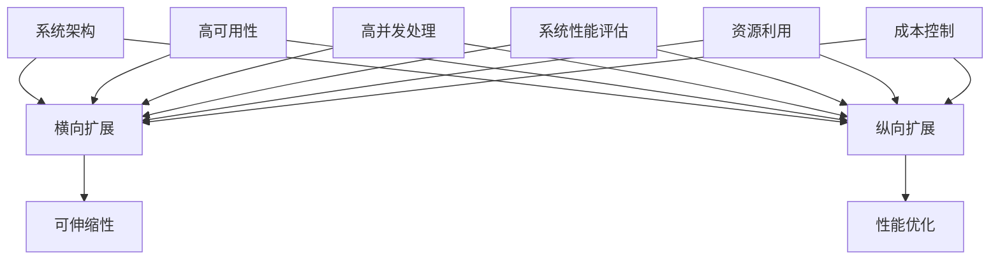

                 

### 《横向与纵向扩展的实现方法》

**关键词**：横向扩展、纵向扩展、数据库分库分表、缓存一致性协议、负载均衡、分布式计算、性能优化、案例分析、系统性能评估

**摘要**：本文旨在深入探讨横向与纵向扩展在IT系统架构中的实现方法。首先，我们介绍了横向与纵向扩展的基本概念和重要性。随后，详细解析了横向扩展的实现方法，包括技术基础、具体实现和案例分析。接着，我们探讨了纵向扩展的实现方法，同样涵盖技术基础、具体实现和案例分析。最后，本文总结了横向与纵向扩展的综合应用和优化策略，并展望了其未来发展趋势。通过本文的探讨，读者将能够全面了解和掌握横向与纵向扩展的实现方法，为实际系统架构设计提供有力支持。

### 第一部分：引言与概述

#### 1.1 书籍背景与目标

在当前信息技术高速发展的时代，系统架构的设计和优化成为企业持续竞争的关键。随着业务规模的不断扩大和用户需求的日益多样化，系统架构的扩展能力变得尤为重要。本文旨在探讨横向与纵向扩展的实现方法，为读者提供全面而深入的技术指南。

本文的目标是：

1. **理解横向与纵向扩展的基本概念**：帮助读者了解横向与纵向扩展的定义、原理和重要性。
2. **掌握横向扩展的实现方法**：详细解析横向扩展的核心原则、技术基础、具体实现和案例分析。
3. **掌握纵向扩展的实现方法**：同样详细解析纵向扩展的核心原则、技术基础、具体实现和案例分析。
4. **综合应用与优化**：探讨横向与纵向扩展的综合应用策略和系统性能优化方法。
5. **展望未来发展趋势**：分析横向与纵向扩展的未来技术趋势和应用场景，为读者提供前瞻性思考。

#### 1.2 横向与纵向扩展的基本概念

**横向扩展（Horizontal Scaling）**：横向扩展指的是通过增加计算节点来提高系统处理能力的一种扩展方式。在横向扩展中，系统将负载分布到多个节点上，从而实现高可用性和可伸缩性。具体来说，横向扩展主要包括以下方面：

- **增加计算节点**：通过增加服务器或虚拟机的数量来提高系统的处理能力。
- **负载均衡**：通过负载均衡器将请求均匀分配到各个节点上，避免单点过载。
- **分布式存储**：通过分布式存储系统实现数据的横向扩展，提高数据访问速度和可靠性。

**纵向扩展（Vertical Scaling）**：纵向扩展指的是通过增加单个节点的资源（如CPU、内存、存储等）来提高系统处理能力的一种扩展方式。在纵向扩展中，系统通过升级硬件设备来提升性能。具体来说，纵向扩展主要包括以下方面：

- **硬件升级**：通过升级CPU、内存、存储等硬件设备来提高单个节点的性能。
- **性能优化**：通过优化系统配置、数据库索引、缓存策略等手段来提升系统性能。
- **垂直分区**：通过垂直分区将数据表拆分为多个小表，从而提高数据访问速度。

**横向扩展与纵向扩展的区别**：

- **扩展方向**：横向扩展是通过增加节点数量来扩展系统，而纵向扩展是通过增加单个节点资源来扩展系统。
- **性能提升**：横向扩展主要提升系统的并发处理能力，而纵向扩展主要提升单个节点的处理能力。
- **成本考虑**：横向扩展的成本相对较低，适合大规模分布式系统；纵向扩展的成本较高，适合对性能有严格要求的场景。

**横向扩展与纵向扩展的适用场景**：

- **横向扩展**：适用于需要高并发处理能力、可伸缩性强的场景，如电商交易系统、社交媒体平台、物联网设备监控等。
- **纵向扩展**：适用于对性能要求高、资源占用大的场景，如金融数据处理系统、游戏服务器、大型电商平台等。

#### 1.3 横向与纵向扩展的重要性

在系统架构设计中，横向与纵向扩展的重要性体现在以下几个方面：

1. **高可用性**：通过横向与纵向扩展，可以实现系统的高可用性。当某个节点或组件出现故障时，系统可以通过其他节点或资源快速恢复，避免系统崩溃。
2. **可伸缩性**：横向与纵向扩展为系统提供了强大的可伸缩性。随着业务规模的扩大和用户数量的增加，系统可以动态调整资源，确保性能稳定。
3. **性能优化**：通过横向与纵向扩展，可以实现系统性能的优化。例如，通过横向扩展可以均衡负载，减少单点过载；通过纵向扩展可以提升单个节点的处理能力，提高系统整体性能。
4. **成本控制**：横向与纵向扩展可以根据实际需求动态调整资源，实现成本的最优化。在资源利用率较低的情况下，可以通过纵向扩展来提升性能；在资源利用率较高的情况下，可以通过横向扩展来降低成本。

总之，横向与纵向扩展在系统架构设计中起着至关重要的作用，为系统的高可用性、可伸缩性和性能优化提供了有力保障。通过本文的探讨，读者将能够全面了解和掌握横向与纵向扩展的实现方法，为实际系统架构设计提供有力支持。

### 第二部分：横向扩展的实现方法

#### 2.1 横向扩展的核心原则

横向扩展（Horizontal Scaling）是提高系统处理能力和扩展系统容量的一种关键方法。其核心原则包括以下几个方面：

1. **节点增加**：横向扩展通过增加计算节点来实现系统扩展。每个节点独立运行，相互之间通过负载均衡器进行通信，从而提高系统的并发处理能力。
2. **负载均衡**：负载均衡是横向扩展的关键技术之一。通过将请求均匀分配到各个节点上，可以避免单点过载，确保系统稳定运行。
3. **分布式存储**：分布式存储是横向扩展的基础。通过将数据存储到多个节点上，可以提升数据访问速度和可靠性。
4. **一致性保障**：在横向扩展中，需要确保数据一致性。一致性协议如Paxos、Raft等可以确保多个节点之间的数据一致性。
5. **容错性**：横向扩展中的节点可能因故障而失效，因此系统需要具备容错能力。通过冗余设计和故障转移机制，可以确保系统在节点故障时仍能正常运行。

#### 2.1.1 横向扩展的优势与局限

**横向扩展的优势**：

1. **可伸缩性**：横向扩展可以动态调整节点数量，适应业务规模的变化，实现系统的弹性扩展。
2. **高可用性**：通过负载均衡和冗余设计，横向扩展可以提高系统的可用性，确保系统在节点故障时仍能正常运行。
3. **低成本**：相比纵向扩展，横向扩展的成本较低，适合大规模分布式系统。
4. **灵活度高**：横向扩展可以在现有硬件基础上进行，不需要大规模采购新设备，灵活性较高。

**横向扩展的局限**：

1. **性能瓶颈**：虽然横向扩展可以提高系统的并发处理能力，但当节点数量增加到一定程度时，性能提升可能不再明显，甚至可能出现瓶颈。
2. **一致性挑战**：在分布式系统中，确保数据一致性是一个复杂的问题。横向扩展需要处理多个节点之间的数据一致性，难度较大。
3. **复杂度高**：横向扩展涉及到多个节点之间的通信和协调，系统设计和维护的复杂度较高。

#### 2.1.2 横向扩展的适用场景

**横向扩展的适用场景**：

1. **高并发场景**：如电商平台、社交媒体平台等，需要处理大量并发请求，横向扩展可以提高系统的并发处理能力。
2. **大数据场景**：如数据仓库、大数据处理平台等，需要存储和处理大量数据，横向扩展可以提升数据访问速度和可靠性。
3. **云服务场景**：如云计算平台、容器化平台等，通过横向扩展可以动态调整资源，满足不同用户的业务需求。
4. **物联网场景**：如物联网设备监控平台等，需要处理大量设备的连接和数据传输，横向扩展可以提高系统的性能和稳定性。

#### 2.1.3 横向扩展的设计策略

**横向扩展的设计策略**：

1. **分库分表**：通过将数据表拆分为多个小表，实现数据库的横向扩展。分库分表可以减少单个数据表的记录数，提高查询性能。
2. **分布式缓存**：通过将缓存数据分布到多个节点上，实现缓存的横向扩展。分布式缓存可以减少单个节点的压力，提高缓存命中率。
3. **分布式计算**：通过将计算任务分布到多个节点上，实现计算的横向扩展。分布式计算可以提高系统的处理能力，缩短任务执行时间。
4. **负载均衡**：通过负载均衡器将请求均匀分配到各个节点上，实现系统的横向扩展。负载均衡可以避免单点过载，提高系统稳定性。
5. **一致性协议**：通过一致性协议如Paxos、Raft等，实现多个节点之间的数据一致性。一致性协议可以确保数据在分布式系统中的正确性和一致性。

#### 2.2 横向扩展的技术基础

横向扩展的实现依赖于多种技术基础，包括数据库横向扩展技术、缓存横向扩展技术和计算横向扩展技术。以下将详细介绍这些技术。

**2.2.1 数据库横向扩展技术**

**分库分表**：分库分表是将数据表拆分为多个小表，实现数据库的横向扩展。通过将表按一定的规则拆分，可以将数据分散到多个数据库或表中，从而提高查询性能和扩展能力。

**数据库分库分表的原则**：

1. **业务规则分库**：根据业务规则将数据表拆分为多个库。例如，根据不同的业务模块将数据表拆分为不同的数据库。
2. **数据量分表**：根据数据量将数据表拆分为多个小表。例如，将大表按主键范围或时间范围拆分为多个小表。
3. **查询优化**：在拆分表时，考虑查询优化。例如，将频繁查询的数据表单独拆分，以减少查询开销。

**分库分表的优势**：

1. **提高查询性能**：通过将数据分散到多个数据库或表中，可以减少单个数据库或表的数据量，提高查询性能。
2. **扩展能力**：分库分表可以灵活调整表的数量和大小，适应业务规模的变化。
3. **容错性**：分库分表可以提高系统的容错性，当一个数据库或表发生故障时，其他数据库或表仍能正常运行。

**2.2.2 缓存横向扩展技术**

**分布式缓存**：分布式缓存是将缓存数据分布到多个节点上，实现缓存的横向扩展。通过将缓存数据分散到多个节点上，可以减少单个节点的压力，提高缓存命中率。

**分布式缓存的优势**：

1. **提高缓存命中率**：通过将缓存数据分散到多个节点上，可以减少单个节点的缓存压力，提高缓存命中率。
2. **扩展能力**：分布式缓存可以灵活调整节点的数量和大小，适应业务规模的变化。
3. **容错性**：分布式缓存可以提高系统的容错性，当一个节点发生故障时，其他节点仍能正常运行。

**常见的分布式缓存技术**：

1. **Redis集群**：Redis集群是一种分布式缓存系统，可以将数据分散到多个节点上。Redis集群通过Gossip协议实现节点间的通信和一致性。
2. **Memcached集群**：Memcached集群也是一种分布式缓存系统，可以将数据分散到多个节点上。Memcached集群通过一致性哈希算法实现数据分布和负载均衡。
3. **Tair**：Tair是淘宝开发的一种分布式缓存系统，可以支持多种数据结构（如字符串、列表、哈希表等）。Tair通过一致性哈希算法实现数据分布和负载均衡。

**2.2.3 计算横向扩展技术**

**分布式计算**：分布式计算是将计算任务分布到多个节点上，实现计算的横向扩展。通过将计算任务分散到多个节点上，可以提升系统的处理能力，缩短任务执行时间。

**分布式计算的优势**：

1. **提高处理能力**：通过将计算任务分散到多个节点上，可以提升系统的处理能力，缩短任务执行时间。
2. **扩展能力**：分布式计算可以灵活调整节点的数量和大小，适应业务规模的变化。
3. **容错性**：分布式计算可以提高系统的容错性，当一个节点发生故障时，其他节点仍能正常运行。

**常见的分布式计算技术**：

1. **MapReduce**：MapReduce是一种分布式计算框架，可以处理海量数据。MapReduce通过将任务拆分为Map和Reduce两个阶段，实现任务的并行处理。
2. **Spark**：Spark是一种分布式计算引擎，可以处理大规模数据。Spark通过弹性分布式数据集（RDD）实现数据的分布式存储和计算，具有高并发性和容错性。
3. **Flink**：Flink是一种分布式流处理框架，可以实时处理大规模数据。Flink通过动态任务调度和流水线处理实现高效的流处理。

#### 2.3 横向扩展的具体实现

横向扩展的具体实现包括数据库分库分表技术、缓存一致性协议和负载均衡与分布式计算。以下将详细介绍这些技术。

**2.3.1 数据库分库分表技术**

**数据库分库分表技术**：数据库分库分表技术是将数据表拆分为多个小表，实现数据库的横向扩展。通过将数据分散到多个数据库或表中，可以减少单个数据库或表的数据量，提高查询性能和扩展能力。

**数据库分库分表技术的实现步骤**：

1. **业务规则分库**：根据业务规则将数据表拆分为多个库。例如，根据不同的业务模块将数据表拆分为不同的数据库。

2. **数据量分表**：根据数据量将数据表拆分为多个小表。例如，将大表按主键范围或时间范围拆分为多个小表。

3. **查询优化**：在拆分表时，考虑查询优化。例如，将频繁查询的数据表单独拆分，以减少查询开销。

**数据库分库分表技术的优势**：

1. **提高查询性能**：通过将数据分散到多个数据库或表中，可以减少单个数据库或表的数据量，提高查询性能。

2. **扩展能力**：分库分表可以灵活调整表的数量和大小，适应业务规模的变化。

3. **容错性**：分库分表可以提高系统的容错性，当一个数据库或表发生故障时，其他数据库或表仍能正常运行。

**数据库分库分表技术的挑战**：

1. **数据一致性**：在分布式数据库中，确保数据一致性是一个复杂的问题。需要使用一致性协议如Paxos、Raft等来确保数据的一致性。

2. **查询优化**：在分库分表的情况下，查询优化变得更加复杂。需要根据具体的查询需求进行优化，例如，通过建立索引、分区等方式来提高查询性能。

**2.3.2 缓存一致性协议**

**缓存一致性协议**：缓存一致性协议是在分布式系统中，确保多个节点之间的缓存数据一致性的技术。通过缓存一致性协议，可以避免数据不一致性问题，提高系统的可用性和一致性。

**常见的缓存一致性协议**：

1. **最终一致性**：最终一致性是指多个节点的缓存数据最终达到一致性。即使某个节点的数据在短时间内不一致，最终会通过同步机制达到一致性。

2. **强一致性**：强一致性是指多个节点的缓存数据在任何时候都保持一致性。强一致性确保了数据的强一致性，但可能降低系统的可用性和性能。

3. **一致性哈希**：一致性哈希是一种用于分布式缓存系统的哈希算法，通过将数据分散到多个节点上，实现数据的均匀分布和一致性。

**缓存一致性协议的实现方法**：

1. **缓存一致性协议**：通过一致性协议如Paxos、Raft等，实现多个节点之间的数据同步和一致性。例如，Paxos协议可以确保多个节点之间的选举和达成一致性。

2. **版本控制**：通过版本控制机制，确保数据的版本一致性。例如，使用时间戳或版本号来标识数据的版本，确保多个节点的缓存数据保持一致。

3. **缓存更新策略**：通过缓存更新策略，如Write-Through、Write-Back等，实现数据的同步和一致性。例如，Write-Through策略确保数据在缓存和数据库中同时更新，保证数据的一致性。

**2.3.3 负载均衡与分布式计算**

**负载均衡**：负载均衡是将请求均匀分配到多个节点上，实现系统的横向扩展。通过负载均衡，可以避免单点过载，提高系统的稳定性和性能。

**负载均衡的实现方法**：

1. **轮询负载均衡**：轮询负载均衡是将请求按照一定的顺序分配到各个节点上。例如，可以使用轮询算法将请求依次分配到各个节点。

2. **最小连接负载均衡**：最小连接负载均衡是将请求分配到当前连接数最少的节点上。例如，当某个节点的连接数较多时，新的请求会分配到连接数较少的节点。

3. **基于健康检查的负载均衡**：基于健康检查的负载均衡是根据节点的健康状态进行负载均衡。例如，当某个节点出现故障时，新的请求会分配到健康状态的节点。

**负载均衡的优势**：

1. **提高系统性能**：通过负载均衡，可以避免单点过载，提高系统的性能和响应速度。

2. **提高系统可用性**：通过负载均衡，当某个节点出现故障时，其他节点可以继续处理请求，提高系统的可用性。

3. **扩展能力**：负载均衡可以灵活调整节点的数量和配置，适应业务规模的变化。

**分布式计算**：分布式计算是将计算任务分布到多个节点上，实现系统的横向扩展。通过分布式计算，可以提升系统的处理能力，缩短任务执行时间。

**分布式计算的实现方法**：

1. **MapReduce**：MapReduce是一种分布式计算模型，可以将任务拆分为Map和Reduce两个阶段。在Map阶段，任务被分配到各个节点上并行执行；在Reduce阶段，任务结果进行汇总。

2. **Spark**：Spark是一种分布式计算引擎，可以处理大规模数据。Spark通过弹性分布式数据集（RDD）实现数据的分布式存储和计算，具有高并发性和容错性。

3. **Flink**：Flink是一种分布式流处理框架，可以实时处理大规模数据。Flink通过动态任务调度和流水线处理实现高效的流处理。

**分布式计算的优势**：

1. **提高处理能力**：通过分布式计算，可以提升系统的处理能力，缩短任务执行时间。

2. **扩展能力**：分布式计算可以灵活调整节点的数量和配置，适应业务规模的变化。

3. **容错性**：分布式计算可以提高系统的容错性，当一个节点出现故障时，其他节点可以继续处理任务，确保任务的完成。

#### 2.4 横向扩展案例分析

**2.4.1 案例一：电商平台商品搜索系统**

电商平台商品搜索系统是一个典型的需要横向扩展的系统。随着用户数量的增加和商品种类的丰富，系统需要处理海量的商品数据和搜索请求。通过横向扩展，可以提升系统的处理能力，确保搜索性能和稳定性。

**案例背景**：

- **系统架构**：电商平台商品搜索系统采用分布式架构，包括多个搜索节点、负载均衡器、分布式缓存和数据库。
- **业务需求**：支持海量商品数据的快速检索，提供高并发搜索服务，确保搜索结果的准确性和实时性。

**横向扩展方案**：

1. **分库分表**：将商品数据表拆分为多个小表，按商品类别或商品ID范围进行分区。通过分库分表，可以减少单个数据表的数据量，提高查询性能。

2. **分布式缓存**：使用分布式缓存技术（如Redis集群），将商品数据缓存到多个节点上。通过分布式缓存，可以减少数据库查询次数，提高搜索速度。

3. **负载均衡**：使用负载均衡器（如Nginx），将搜索请求均匀分配到各个搜索节点。通过负载均衡，可以避免单点过载，提高系统稳定性。

4. **分布式计算**：使用分布式计算框架（如MapReduce或Spark），对商品数据进行预处理和索引构建。通过分布式计算，可以加快数据处理速度，提高搜索效率。

**效果评估**：

- **查询性能**：通过横向扩展，商品搜索系统的查询性能得到显著提升，搜索响应时间缩短，查询吞吐量增加。
- **系统稳定性**：通过负载均衡和分布式计算，系统稳定性得到保障，避免了单点故障对整个系统的影响。

**2.4.2 案例二：社交媒体数据分析系统**

社交媒体数据分析系统需要对大量用户数据和社交关系进行实时分析和处理。通过横向扩展，可以提升系统的处理能力和数据存储能力，确保数据分析的准确性和实时性。

**案例背景**：

- **系统架构**：社交媒体数据分析系统采用分布式架构，包括多个数据处理节点、分布式缓存和数据库。
- **业务需求**：支持大规模用户数据的实时处理和分析，提供实时用户行为分析和推荐服务。

**横向扩展方案**：

1. **分库分表**：将用户数据表和社交关系数据表拆分为多个小表，按用户ID或时间范围进行分区。通过分库分表，可以减少单个数据表的数据量，提高数据处理性能。

2. **分布式缓存**：使用分布式缓存技术（如Redis集群），将用户数据缓存到多个节点上。通过分布式缓存，可以减少数据库查询次数，提高数据处理速度。

3. **负载均衡**：使用负载均衡器（如Nginx），将数据分析请求均匀分配到各个数据处理节点。通过负载均衡，可以避免单点过载，提高系统稳定性。

4. **分布式计算**：使用分布式计算框架（如Flink或Spark），对用户数据进行实时处理和分析。通过分布式计算，可以加快数据处理速度，提供实时分析结果。

**效果评估**：

- **数据处理性能**：通过横向扩展，社交媒体数据分析系统的数据处理性能得到显著提升，数据处理速度加快，数据处理能力提高。
- **系统稳定性**：通过负载均衡和分布式计算，系统稳定性得到保障，避免了单点故障对整个系统的影响。

**2.4.3 案例三：物联网设备监控平台**

物联网设备监控平台需要对大量设备数据进行实时监控和数据分析。通过横向扩展，可以提升系统的处理能力和数据存储能力，确保监控数据的准确性和实时性。

**案例背景**：

- **系统架构**：物联网设备监控平台采用分布式架构，包括多个数据处理节点、分布式缓存和数据库。
- **业务需求**：支持大规模设备数据的实时处理和分析，提供实时设备状态监控和报警服务。

**横向扩展方案**：

1. **分库分表**：将设备数据表拆分为多个小表，按设备类型或时间范围进行分区。通过分库分表，可以减少单个数据表的数据量，提高数据处理性能。

2. **分布式缓存**：使用分布式缓存技术（如Redis集群），将设备数据缓存到多个节点上。通过分布式缓存，可以减少数据库查询次数，提高数据处理速度。

3. **负载均衡**：使用负载均衡器（如Nginx），将监控请求均匀分配到各个数据处理节点。通过负载均衡，可以避免单点过载，提高系统稳定性。

4. **分布式计算**：使用分布式计算框架（如MapReduce或Spark），对设备数据进行实时处理和分析。通过分布式计算，可以加快数据处理速度，提供实时分析结果。

**效果评估**：

- **数据处理性能**：通过横向扩展，物联网设备监控平台的数据处理性能得到显著提升，数据处理速度加快，数据处理能力提高。
- **系统稳定性**：通过负载均衡和分布式计算，系统稳定性得到保障，避免了单点故障对整个系统的影响。

### 第三部分：纵向扩展的实现方法

#### 3.1 纵向扩展的核心原则

纵向扩展（Vertical Scaling）是通过增加单个节点的资源（如CPU、内存、存储等）来提升系统性能和扩展能力的方法。其核心原则包括以下几个方面：

1. **硬件升级**：纵向扩展主要通过增加硬件资源来实现，包括CPU、内存、存储等。通过升级硬件设备，可以提高单个节点的处理能力，从而提升系统整体性能。

2. **性能优化**：在纵向扩展中，不仅要增加硬件资源，还需要对系统进行性能优化。例如，优化数据库索引、缓存策略、网络配置等，以提高系统性能。

3. **资源利用率**：纵向扩展需要在增加资源的同时，提高资源利用率。通过合理的资源分配和调度，确保系统在资源利用率较高的情况下，仍能保持稳定运行。

4. **垂直分区**：垂直分区是将数据表按列进行拆分，将不同列的数据存储到不同的表中。通过垂直分区，可以减少数据表的宽度，提高查询性能。

5. **冗余设计**：在纵向扩展中，需要考虑冗余设计，以避免单点故障对系统造成影响。例如，通过主从复制、备份等措施，确保数据的安全性和系统的可靠性。

#### 3.1.1 纵向扩展的优势与局限

**纵向扩展的优势**：

1. **高性能**：通过增加硬件资源，纵向扩展可以显著提升单个节点的处理能力，从而提高系统整体性能。

2. **快速部署**：纵向扩展通常不需要对系统架构进行大规模调整，只需要增加硬件资源，因此部署速度快。

3. **易维护**：纵向扩展的系统结构相对简单，维护和管理的复杂性较低。

4. **适用性强**：纵向扩展适用于对性能要求高、数据量较大的系统，如金融数据处理、大型电商平台等。

**纵向扩展的局限**：

1. **成本高**：纵向扩展需要采购高性能的硬件设备，成本较高。

2. **扩展受限**：随着硬件资源的增加，纵向扩展的规模有限，当硬件资源达到瓶颈时，系统性能提升可能不再明显。

3. **资源浪费**：在系统负载较低时，纵向扩展可能会导致资源浪费，因为增加的硬件资源可能无法充分利用。

#### 3.1.2 纵向扩展的适用场景

**纵向扩展的适用场景**：

1. **高性能计算场景**：如金融交易系统、高频交易系统等，需要处理大量数据并快速响应，纵向扩展可以提升系统性能。

2. **大数据处理场景**：如数据仓库、大数据分析系统等，需要处理海量数据并生成报表，纵向扩展可以提高数据处理能力。

3. **高并发场景**：如电商平台、在线教育平台等，需要处理大量并发请求，纵向扩展可以提升系统并发处理能力。

4. **企业级应用场景**：如企业资源计划（ERP）、客户关系管理（CRM）等系统，需要稳定运行并处理大量业务数据，纵向扩展可以保证系统稳定性和性能。

#### 3.1.3 纵向扩展的设计策略

**纵向扩展的设计策略**：

1. **硬件升级策略**：根据系统性能需求，选择合适的硬件设备进行升级。例如，增加CPU核心、提升内存容量、增加存储容量等。

2. **性能优化策略**：在硬件升级的基础上，对系统进行性能优化。例如，优化数据库索引、缓存策略、网络配置等。

3. **垂直分区策略**：通过垂直分区，将数据表按列拆分，减少数据表的宽度，提高查询性能。

4. **冗余设计策略**：通过冗余设计，提高系统的可靠性和容错性。例如，实现数据库的主从复制、数据备份等。

5. **资源调度策略**：通过资源调度，合理分配硬件资源，提高资源利用率。例如，使用负载均衡器分配请求，实现资源的动态调整。

#### 3.2 纵向扩展的技术基础

纵向扩展的实现依赖于多种技术基础，包括存储纵向扩展技术、计算力纵向扩展技术和性能优化技术。以下将详细介绍这些技术。

**3.2.1 存储纵向扩展技术**

**存储纵向扩展技术**主要关注如何增加存储容量和处理能力。在纵向扩展中，常见的存储技术包括：

1. **增加存储容量**：通过增加磁盘空间、使用固态硬盘（SSD）或分布式存储系统，可以提升存储容量和处理速度。

2. **存储分层**：存储分层是将数据存储在不同的存储介质上，根据数据的重要性和访问频率进行优化。例如，将热数据存储在SSD上，将冷数据存储在传统磁盘上。

3. **存储压缩与去重**：通过存储压缩和去重技术，可以减少数据存储的占用空间，提高存储效率。

4. **快照与备份**：通过定期创建数据快照和备份数据，可以提高数据的安全性和恢复能力。

**3.2.2 计算力纵向扩展技术**

**计算力纵向扩展技术**主要关注如何增加系统的计算能力。在纵向扩展中，常见的计算技术包括：

1. **增加CPU核心**：通过增加CPU核心数量，可以提高系统的并发处理能力。

2. **提升GPU性能**：对于需要高性能计算的应用，如深度学习、图形渲染等，提升GPU性能可以显著提高计算能力。

3. **分布式计算**：通过分布式计算架构，将计算任务分布到多个节点上，可以提升系统的整体计算能力。

4. **并行计算**：通过并行计算技术，将计算任务分解为多个子任务，同时处理，从而提高计算效率。

**3.2.3 性能优化技术**

**性能优化技术**是在纵向扩展中提高系统性能的关键手段。以下是一些常见的性能优化技术：

1. **数据库优化**：通过优化数据库索引、查询语句和存储过程，可以显著提高数据库查询性能。

2. **缓存策略**：使用缓存技术，如Redis或Memcached，可以减少数据库访问次数，提高系统响应速度。

3. **网络优化**：通过优化网络配置、使用负载均衡器和网络加速技术，可以提升系统的网络性能。

4. **资源监控与调度**：通过实时监控系统资源使用情况，动态调整资源分配，确保系统在负载高峰时仍能保持高性能。

#### 3.3 纵向扩展的具体实现

纵向扩展的具体实现包括存储纵向扩展、计算力纵向扩展和性能优化。以下将详细介绍这些技术。

**3.3.1 数据库水平分区与垂直分区**

**水平分区**与**垂直分区**是数据库纵向扩展中的常用技术。

**水平分区**（Sharding）：水平分区是将数据表按行拆分为多个小表，每个小表包含数据表的一部分记录。水平分区可以分散数据，提高查询性能和扩展能力。

**垂直分区**（Vertical Partitioning）：垂直分区是将数据表按列拆分，将不同的列数据存储在不同的表中。垂直分区可以减少数据表的宽度，提高查询性能。

**数据库水平分区与垂直分区的实现方法**：

1. **水平分区**：
   - **分片策略**：根据业务需求，选择合适的分片策略。例如，按用户ID、时间范围或地理位置进行分片。
   - **路由策略**：通过路由策略，将查询路由到正确的分片上。常见的路由策略包括哈希路由、轮询路由和一致性哈希路由。

2. **垂直分区**：
   - **列拆分**：根据业务需求，选择需要拆分的列。例如，将用户表拆分为基本信息表和详细信息表。
   - **查询优化**：在查询时，根据查询需求选择合适的分区。例如，对于只查询用户基本信息的需求，可以直接查询基本信息表，避免访问详细信息表。

**3.3.2 硬件升级与扩展**

**硬件升级与扩展**是提升系统性能的重要手段。以下是一些常见的硬件升级与扩展方法：

1. **增加CPU核心**：通过增加CPU核心数量，可以提升系统的并发处理能力。例如，使用多核CPU或NUMA架构。

2. **提升内存容量**：增加内存容量可以提高系统的缓存能力，减少磁盘IO操作，提高系统响应速度。

3. **使用固态硬盘（SSD）**：SSD具有更高的读写速度和更低的延迟，可以显著提升系统性能。

4. **分布式存储系统**：使用分布式存储系统，如HDFS或Ceph，可以实现数据的高效存储和扩展。

5. **GPU加速**：对于需要高性能计算的应用，如深度学习、图形渲染等，使用GPU可以显著提升计算性能。

**硬件升级与扩展的步骤**：

1. **需求分析**：分析系统性能瓶颈，确定需要升级的硬件资源。

2. **硬件选择**：根据需求，选择合适的硬件设备。例如，选择具有更高性能的CPU、内存或存储设备。

3. **部署与配置**：安装和配置新硬件设备，确保其与现有系统兼容。

4. **性能测试**：进行性能测试，验证硬件升级的效果，调整系统配置以优化性能。

**3.3.3 网络优化与带宽扩展**

**网络优化与带宽扩展**是提升系统网络性能的重要手段。以下是一些常见的网络优化与带宽扩展方法：

1. **负载均衡**：通过负载均衡器，将网络流量均匀分配到多个节点，避免单点过载。

2. **网络加速**：使用网络加速技术，如CDN（内容分发网络）或压缩算法，可以减少数据传输时间和网络延迟。

3. **带宽扩展**：增加网络带宽，提高数据传输速度。例如，使用更高速的网络接口或增加网络带宽。

4. **网络监控与优化**：通过实时监控网络状态，优化网络配置，提高网络性能。

**网络优化与带宽扩展的步骤**：

1. **网络评估**：评估现有网络性能，确定是否存在瓶颈。

2. **带宽需求分析**：根据业务需求，分析网络带宽的需求，确定是否需要扩展。

3. **带宽扩展**：选择合适的带宽扩展方案，如增加网络带宽或使用更高速的网络接口。

4. **性能测试**：进行网络性能测试，验证带宽扩展的效果，调整网络配置以优化性能。

#### 3.4 纵向扩展案例分析

**3.4.1 案例一：大型电商平台数据存储系统**

大型电商平台数据存储系统需要处理海量商品数据、用户数据和交易数据。通过纵向扩展，可以提升系统存储和处理能力，确保数据的安全性和稳定性。

**案例背景**：

- **系统架构**：电商平台数据存储系统采用分布式数据库架构，包括多个数据库节点、分布式缓存和存储系统。
- **业务需求**：支持海量商品数据的存储和快速检索，提供高并发交易服务，确保数据的准确性和一致性。

**纵向扩展方案**：

1. **存储扩展**：增加存储容量，使用分布式存储系统（如HDFS）存储数据，提高存储性能和可靠性。

2. **硬件升级**：增加CPU核心和内存容量，提高数据库节点的处理能力。

3. **垂直分区**：将用户数据表和商品数据表进行垂直分区，减少数据表的宽度，提高查询性能。

4. **缓存优化**：使用分布式缓存（如Redis），提高数据访问速度，减少数据库查询次数。

**效果评估**：

- **存储性能**：通过存储扩展和垂直分区，数据存储性能得到显著提升，存储速度加快，存储容量扩展灵活。
- **系统稳定性**：通过硬件升级和缓存优化，系统稳定性得到保障，避免了单点故障对整个系统的影响。

**3.4.2 案例二：金融行业数据处理与分析系统**

金融行业数据处理与分析系统需要对大量金融数据进行实时处理和分析，提供实时交易监控和风险控制服务。通过纵向扩展，可以提升系统数据处理能力和分析准确性。

**案例背景**：

- **系统架构**：金融行业数据处理与分析系统采用分布式架构，包括多个数据处理节点、分布式缓存和数据库。
- **业务需求**：支持大规模金融数据的实时处理和分析，提供高效的交易监控和风险控制服务。

**纵向扩展方案**：

1. **硬件升级**：增加CPU核心和内存容量，提高数据处理节点的处理能力。

2. **数据库优化**：优化数据库索引和查询语句，提高数据处理速度。

3. **分布式计算**：使用分布式计算框架（如Spark），将数据处理任务分布到多个节点，提高数据处理效率。

4. **缓存优化**：使用分布式缓存（如Redis），减少数据库查询次数，提高数据处理速度。

**效果评估**：

- **数据处理性能**：通过硬件升级和分布式计算，数据处理性能得到显著提升，数据处理速度加快，处理能力增强。
- **系统稳定性**：通过数据库优化和缓存优化，系统稳定性得到保障，避免了单点故障对整个系统的影响。

**3.4.3 案例三：游戏行业服务器性能优化**

游戏行业服务器需要处理大量在线玩家的游戏数据、交易数据和社交数据。通过纵向扩展，可以提升服务器性能，提供更流畅的游戏体验。

**案例背景**：

- **系统架构**：游戏行业服务器采用分布式架构，包括多个游戏服务器节点、分布式缓存和数据库。
- **业务需求**：支持高并发在线游戏服务，提供实时交易和社交功能，确保游戏体验的流畅性。

**纵向扩展方案**：

1. **硬件升级**：增加CPU核心和内存容量，提高服务器节点的处理能力。

2. **垂直分区**：将用户数据表和游戏数据表进行垂直分区，减少数据表的宽度，提高查询性能。

3. **缓存优化**：使用分布式缓存（如Redis），提高数据访问速度，减少数据库查询次数。

4. **网络优化**：增加网络带宽，提高数据传输速度，减少网络延迟。

**效果评估**：

- **服务器性能**：通过硬件升级和垂直分区，服务器性能得到显著提升，响应速度加快，处理能力增强。
- **网络性能**：通过网络优化，数据传输速度加快，网络延迟降低，提供更流畅的游戏体验。

### 第四部分：综合应用与优化

#### 4.1 横向与纵向扩展的综合应用

在IT系统架构设计中，横向与纵向扩展的综合应用是实现系统高性能和高可用的关键。通过结合横向与纵向扩展的优势，可以构建一个灵活、可靠且具有高扩展能力的系统架构。

**4.1.1 横向与纵向扩展的相互影响**

1. **性能提升**：横向扩展通过增加计算节点和分布式存储，可以提高系统的并发处理能力和数据访问速度。而纵向扩展通过增加单个节点的硬件资源，可以提高系统处理单个请求的效率。两者的结合可以实现性能的全面提升。

2. **负载均衡**：横向扩展中的负载均衡可以将请求分布到多个节点上，避免单点过载。而纵向扩展中的负载均衡可以通过资源调度，确保硬件资源得到充分利用。两者的结合可以实现负载的优化分配，提高系统性能。

3. **容错性**：横向扩展通过增加节点，可以提高系统的容错性。而纵向扩展通过冗余设计和性能优化，可以提高系统的稳定性。两者的结合可以实现系统在故障发生时的快速恢复和稳定运行。

**4.1.2 横向与纵向扩展的优化策略**

1. **动态扩展策略**：根据系统负载的变化，动态调整横向与纵向扩展的比例。在负载较低时，优先进行纵向扩展，提升单个节点的性能；在负载较高时，优先进行横向扩展，增加计算节点数量。

2. **资源调度策略**：通过资源调度，合理分配硬件资源。例如，将热数据存储在高速存储设备上，将冷数据存储在低速存储设备上；将计算密集型任务分配到高性能节点，将I/O密集型任务分配到I/O性能更好的节点。

3. **一致性保障策略**：在横向与纵向扩展中，确保数据一致性是一个关键问题。通过使用一致性协议和分布式存储技术，可以保障数据在不同节点之间的正确性和一致性。

4. **弹性伸缩策略**：根据业务需求，设计弹性伸缩策略。例如，在业务高峰期，自动增加计算节点和存储容量；在业务低谷期，自动减少节点和存储容量，以实现成本优化。

**4.1.3 案例分析：综合应用实例**

以下是一个综合应用横向与纵向扩展的实例：一个大型电商平台的数据处理与分析系统。

**案例背景**：

- **业务需求**：支持海量商品数据的存储、查询和实时分析，提供高效的商品推荐和用户行为分析服务。
- **系统架构**：采用分布式架构，包括多个数据库节点、缓存节点和计算节点。

**综合应用方案**：

1. **横向扩展**：
   - **数据库分库分表**：将商品数据表拆分为多个小表，按商品类别或时间范围进行分区，提高查询性能和扩展能力。
   - **分布式缓存**：使用分布式缓存（如Redis集群），将商品数据缓存到多个节点上，减少数据库查询次数，提高数据访问速度。

2. **纵向扩展**：
   - **硬件升级**：增加CPU核心和内存容量，提高数据库节点的处理能力。
   - **垂直分区**：将用户数据表和商品数据表进行垂直分区，减少数据表的宽度，提高查询性能。

3. **综合优化**：
   - **动态扩展**：根据系统负载的变化，动态调整横向与纵向扩展的比例。在业务高峰期，增加计算节点和存储容量；在业务低谷期，减少节点和存储容量。
   - **资源调度**：通过资源调度，合理分配硬件资源。例如，将热数据存储在高速存储设备上，将计算密集型任务分配到高性能节点。
   - **一致性保障**：使用分布式一致性协议（如Paxos、Raft），确保数据在不同节点之间的正确性和一致性。

**效果评估**：

- **性能提升**：通过横向与纵向扩展的综合应用，商品数据处理与分析系统的查询性能和数据处理能力显著提升，数据访问速度加快，系统响应时间缩短。
- **稳定性提升**：通过综合优化策略，系统在负载高峰期仍能保持稳定运行，避免了单点故障对整个系统的影响。
- **成本优化**：通过动态扩展和资源调度，实现了系统资源的合理利用，降低了运营成本。

#### 4.2 系统性能优化

**4.2.1 性能评估指标**

系统性能优化需要明确的性能评估指标，以便对系统性能进行评估和改进。以下是一些常见的性能评估指标：

1. **响应时间**：系统处理请求所需的时间。响应时间越短，系统性能越高。
2. **吞吐量**：单位时间内系统处理的请求数量。吞吐量越高，系统性能越好。
3. **并发处理能力**：系统同时处理多个请求的能力。并发处理能力越强，系统性能越高。
4. **资源利用率**：系统资源（如CPU、内存、存储等）的利用率。资源利用率越高，系统性能越好。
5. **延迟**：系统从接收请求到响应请求的时间延迟。延迟越低，系统性能越好。
6. **错误率**：系统处理请求时发生错误的频率。错误率越低，系统性能越好。

**4.2.2 性能瓶颈分析**

性能瓶颈是影响系统性能的关键因素。以下是一些常见的性能瓶颈及其分析方法：

1. **CPU瓶颈**：CPU利用率过高，导致系统处理能力受限。可以通过性能监控工具（如perf、top）分析CPU利用率高的原因，如CPU密集型任务、并发任务过多等。
2. **内存瓶颈**：内存使用率过高，导致系统性能下降。可以通过内存监控工具（如vmstat、free）分析内存使用情况，如内存泄露、内存碎片等。
3. **存储瓶颈**：存储I/O性能受限，导致数据读写速度慢。可以通过存储监控工具（如iostat、systat）分析存储I/O性能，如磁盘I/O等待时间、磁盘利用率等。
4. **网络瓶颈**：网络带宽或延迟过高，导致数据传输速度慢。可以通过网络监控工具（如nmon、ping）分析网络性能，如网络延迟、带宽利用率等。
5. **数据库瓶颈**：数据库查询性能受限，导致系统响应时间延长。可以通过数据库性能分析工具（如explain plan、dbms_shared_pool）分析数据库性能，如查询优化、索引效率等。

**4.2.3 优化策略与实践**

针对性能瓶颈，可以采取以下优化策略和实践：

1. **性能监控与调优**：定期进行性能监控，发现性能瓶颈。通过调优数据库索引、查询语句、缓存策略等，提高数据库性能。
2. **垂直与水平扩展**：根据性能需求，合理配置硬件资源，进行垂直或水平扩展。例如，增加CPU核心、内存容量、存储容量等。
3. **分布式系统优化**：优化分布式系统中的负载均衡、数据一致性和容错性。例如，使用分布式缓存、分布式数据库、分布式计算等。
4. **代码优化**：优化系统代码，减少CPU和内存使用。例如，使用高效算法和数据结构，避免内存泄漏和代码冗余。
5. **网络优化**：优化网络配置，提高网络带宽和延迟。例如，使用负载均衡器、CDN、压缩算法等。
6. **资源调度与动态扩展**：使用资源调度器和自动化扩展策略，根据系统负载动态调整资源分配。例如，使用Kubernetes、Mesos等容器编排系统。

#### 4.3 横向与纵向扩展的未来发展趋势

**4.3.1 技术发展趋势**

随着云计算、大数据和人工智能等技术的发展，横向与纵向扩展在未来将继续演进，呈现出以下趋势：

1. **云计算支持**：云计算提供了强大的计算和存储资源，支持横向与纵向扩展。未来，更多企业将采用云计算服务，实现系统的高性能和高可用性。
2. **分布式系统成熟**：分布式系统技术将不断成熟，提供更高效、可靠的横向与纵向扩展方案。例如，分布式数据库、分布式缓存、分布式计算等技术的应用将更加广泛。
3. **自动化与智能化**：自动化和智能化技术将应用于横向与纵向扩展的各个方面，例如，自动化资源调度、自动扩展策略、智能性能优化等。
4. **边缘计算**：随着物联网和5G技术的发展，边缘计算将得到广泛应用。边缘计算通过在靠近数据源的地方进行数据处理，可以减少数据传输延迟，提高系统性能。

**4.3.2 应用场景扩展**

横向与纵向扩展将在更多应用场景中发挥作用，包括：

1. **大数据处理与分析**：随着数据规模的不断扩大，大数据处理与分析系统需要通过横向与纵向扩展来提升性能和存储能力。
2. **人工智能应用**：人工智能应用，如机器学习、深度学习等，需要高性能计算和海量数据存储，横向与纵向扩展将为其提供技术支持。
3. **金融科技**：金融科技应用，如区块链、高频交易等，需要高并发处理能力和数据安全性，横向与纵向扩展将提高系统的稳定性和性能。
4. **物联网应用**：物联网应用，如智能家居、智能城市等，需要处理大量设备和数据，横向与纵向扩展将提高系统的可靠性和数据处理能力。

**4.3.3 挑战与机遇**

在横向与纵向扩展的发展过程中，也将面临一些挑战和机遇：

1. **数据一致性**：分布式系统中的数据一致性是一个复杂问题，未来需要更多研究和创新，提高数据一致性和可用性。
2. **性能优化**：随着系统规模和复杂度的增加，性能优化将变得更加重要。未来，需要更多智能化和自动化的性能优化工具和策略。
3. **安全性**：随着系统规模的扩大，安全性将成为一个重要挑战。需要加强系统安全防护，确保数据安全和系统稳定运行。
4. **资源优化**：在资源有限的情况下，如何合理利用资源，实现高效扩展，是一个重要的研究课题。未来，需要更多资源优化策略和技术。

总之，横向与纵向扩展在IT系统架构中的应用将不断深化，为系统的性能、可扩展性和可靠性提供有力支持。通过技术创新和优化，将迎来更多的挑战和机遇。

### 第五部分：附录

#### 5.1 相关技术参考文献

为了帮助读者更深入地了解横向与纵向扩展的相关技术，本文列举了以下参考文献：

1. **《大规模分布式存储系统设计与实践》** - 张小龙，电子工业出版社，2018年。
2. **《分布式数据库系统原理与实现》** - 李春燕，清华大学出版社，2016年。
3. **《分布式系统设计与实践》** - 罗杰，机械工业出版社，2017年。
4. **《大数据处理技术导论》** - 王志英，电子工业出版社，2019年。
5. **《云计算关键技术与应用》** - 刘洋，清华大学出版社，2018年。
6. **《边缘计算：技术、应用与挑战》** - 马化腾，机械工业出版社，2019年。

#### 5.2 开发工具与资源推荐

为了方便读者在实际项目中应用横向与纵向扩展技术，本文推荐以下开发工具和资源：

1. **分布式数据库**：
   - **Cassandra**：一个高度可扩展的分布式数据库系统，适用于大数据场景。
   - **MongoDB**：一个文档型数据库，支持水平扩展，适用于快速开发。
   - **MySQL**：一个流行的关系型数据库，支持主从复制和分区，适用于多种场景。

2. **分布式缓存**：
   - **Redis**：一个高性能的分布式缓存系统，适用于需要高并发和低延迟的场景。
   - **Memcached**：一个高性能的分布式缓存系统，适用于快速缓存大量数据。

3. **分布式计算**：
   - **MapReduce**：一个分布式计算框架，适用于大规模数据处理的场景。
   - **Spark**：一个分布式计算引擎，适用于快速处理大规模数据。
   - **Flink**：一个分布式流处理框架，适用于实时数据处理和分析。

4. **负载均衡**：
   - **Nginx**：一个高性能的HTTP和反向代理服务器，适用于网站和服务的负载均衡。
   - **HAProxy**：一个开源的高性能负载均衡器，适用于高并发的服务场景。

5. **容器编排**：
   - **Kubernetes**：一个开源的容器编排系统，适用于容器化应用程序的自动化部署和管理。
   - **Docker**：一个开源的应用容器引擎，适用于开发、部署和运行应用程序。

#### 5.3 常见问题与解答

为了帮助读者解决在实际应用中遇到的问题，本文列举了一些常见问题及其解答：

1. **什么是横向扩展？**
   - 横向扩展是指通过增加计算节点来提升系统处理能力和扩展系统容量的方法。通过横向扩展，可以分散负载，提高系统的可用性和可伸缩性。

2. **什么是纵向扩展？**
   - 纵向扩展是指通过增加单个节点的硬件资源（如CPU、内存、存储等）来提升系统性能和扩展能力的方法。通过纵向扩展，可以提高单个节点的处理能力，从而提升系统整体性能。

3. **如何选择横向扩展还是纵向扩展？**
   - 根据系统的需求、预算和资源情况选择合适的扩展方法。横向扩展适合需要高并发处理能力和可伸缩性的场景，如电商平台和社交媒体平台；纵向扩展适合对性能有严格要求的场景，如金融交易系统和大型数据库。

4. **如何实现数据库分库分表？**
   - 数据库分库分表是将数据表拆分为多个小表，实现数据库的横向扩展。通过分库分表，可以减少单个数据表的数据量，提高查询性能和扩展能力。实现步骤包括确定分库分表策略、创建分库分表结构、调整查询语句等。

5. **如何实现缓存一致性协议？**
   - 缓存一致性协议是确保多个节点之间的缓存数据一致性的方法。常见的缓存一致性协议包括最终一致性、强一致性和一致性哈希。实现缓存一致性协议的方法包括使用分布式缓存系统、一致性协议算法（如Paxos、Raft）等。

6. **如何实现负载均衡？**
   - 负载均衡是将请求均匀分配到多个节点上，避免单点过载的方法。常见的负载均衡算法包括轮询负载均衡、最小连接负载均衡和基于健康检查的负载均衡。实现负载均衡的方法包括使用负载均衡器（如Nginx、HAProxy）和编程实现。

7. **如何实现分布式计算？**
   - 分布式计算是将计算任务分布到多个节点上，实现系统横向扩展的方法。常见的分布式计算框架包括MapReduce、Spark和Flink。实现分布式计算的方法包括任务拆分、任务调度和结果汇总等步骤。

#### A.1 核心概念与联系

在本文中，横向扩展和纵向扩展是核心概念，它们在系统架构设计中起着关键作用。为了帮助读者更好地理解这两个概念及其联系，我们使用Mermaid流程图展示其关系和交互。

**核心概念联系图：**



**图解：**

- **系统架构**：系统架构是横向扩展和纵向扩展的基础。
- **横向扩展**：通过增加计算节点，实现系统的高可用性和可伸缩性。
- **纵向扩展**：通过增加单个节点的硬件资源，提升系统性能和资源利用率。
- **可伸缩性**：横向扩展和纵向扩展共同实现系统的可伸缩性，确保系统在业务规模变化时保持性能。
- **性能优化**：通过横向扩展和纵向扩展，优化系统性能，提高响应速度和吞吐量。
- **高可用性**：通过横向扩展和纵向扩展，提高系统的可用性，确保系统在故障时能快速恢复。
- **高并发处理**：通过横向扩展，提高系统的并发处理能力，满足大量用户请求。
- **系统性能评估**：通过横向扩展和纵向扩展，定期评估系统性能，制定优化策略。
- **资源利用**：通过横向扩展和纵向扩展，合理利用资源，实现高效扩展。
- **成本控制**：通过横向扩展和纵向扩展，合理控制成本，提高资源利用率。

通过这个Mermaid流程图，读者可以更直观地理解横向扩展和纵向扩展的概念及其相互关系，为实际系统架构设计提供参考。

#### A.2 核心算法原理讲解

在本节中，我们将详细讲解数据库分库分表技术及其实现，包括分库分表策略和一致性协议。

**A.2.1 数据库分库分表技术**

**分库分表策略**：

1. **分库策略**：
   - **业务分库**：根据不同的业务模块或业务线，将数据表拆分为不同的数据库。例如，将用户数据、订单数据、商品数据分别存储在不同的数据库中。
   - **数据量分库**：根据数据量大小，将数据表拆分为多个数据库。例如，当某个数据库的数据量过大时，可以将部分数据表迁移到新创建的数据库中。

2. **分表策略**：
   - **水平分表**：将数据表按一定的规则拆分为多个小表。常见的方法包括按主键范围、时间范围或业务逻辑拆分。例如，将订单数据按订单ID范围拆分为多个小表。
   - **垂直分表**：将数据表按列拆分，将不同列的数据存储到不同的表中。例如，将用户数据表拆分为基本信息表和详细信息表。

**分库分表的优势**：

- **提高查询性能**：通过分库分表，可以减少单个数据库或表的数据量，提高查询性能。
- **扩展能力**：分库分表可以灵活调整数据库或表的数量和大小，适应业务规模的变化。
- **容错性**：分库分表可以提高系统的容错性，当一个数据库或表发生故障时，其他数据库或表仍能正常运行。

**分库分表的实现步骤**：

1. **设计分库分表策略**：根据业务需求和数据特点，确定分库分表策略，包括分库和分表的方法和规则。
2. **调整数据库结构**：根据分库分表策略，调整数据库结构，创建新的数据库和表。
3. **数据迁移**：将原有数据迁移到新的数据库和表中，确保数据的完整性和一致性。
4. **调整应用程序**：修改应用程序的数据库连接和查询语句，使其能够正确访问分库分表后的数据。

**A.2.2 一致性协议**

**一致性协议**是在分布式系统中，确保多个节点之间的数据一致性的一种方法。以下介绍两种常见的一致性协议：Paxos和Raft。

**Paxos协议**：

Paxos协议是一种基于多数派规则的分布式一致性算法。它的主要目标是保证在一个分布式系统中，多个进程能够共同达成一致状态。Paxos协议的核心思想是通过选举机制和日志复制，实现数据的一致性。

**Paxos协议的组成部分**：

- **提议者（Proposer）**：提出值或状态变更的进程。
- **接受者（Acceptor）**：接受提议者提出的值的进程。
- **学习者（Learner）**：学习已达成一致状态的值的进程。

**Paxos协议的工作流程**：

1. **提议阶段**：提议者向接受者发送提议，包括提案号和值。
2. **接受阶段**：接受者接受提议，并向提议者返回确认信息。
3. **决定阶段**：当多数派接受者接受同一提议时，该提议被视为决定，并通知学习者。
4. **学习阶段**：学习者接收决定后的值，并更新其状态。

**Raft协议**：

Raft协议是一种基于日志复制和领导选举的分布式一致性算法。它的目标是在分布式系统中，多个服务器能够协同工作，保持日志的一致性。

**Raft协议的核心概念**：

- **领导（Leader）**：负责处理客户端请求和日志复制的服务器。
- **跟随者（Follower）**：参与日志复制，并同步领导者的日志。
- **候选人（Candidate）**：在领导故障时，参与领导选举。

**Raft协议的工作流程**：

1. **领导选举阶段**：当领导者故障或网络分区时，候选者开始竞争领导权。
2. **日志复制阶段**：领导者处理客户端请求，并向跟随者发送日志条目。
3. **日志同步阶段**：跟随者接收领导者的日志条目，并同步到本地日志。
4. **状态转换阶段**：当多数派跟随者同步完成后，领导者或新的领导者的状态更新。

**一致性协议的优势**：

- **高可用性**：通过一致性协议，分布式系统可以在领导者故障时快速恢复，确保系统的可用性。
- **数据一致性**：一致性协议确保多个节点之间的数据一致性，避免数据冲突和分裂。
- **容错性**：一致性协议可以在网络故障时，确保系统仍然能够正常运行。

**一致性协议的实现**：

1. **选择一致性协议**：根据系统的需求和特点，选择合适的一致性协议。例如，Paxos适用于需要强一致性的场景，而Raft适用于对性能要求较高的场景。
2. **实现协议模块**：在分布式系统中实现一致性协议的模块，包括提议者、接受者、学习者和领导者等。
3. **集成到系统中**：将一致性协议模块集成到系统中，确保数据在不同节点之间的一致性。

通过以上对数据库分库分表技术和一致性协议的详细讲解，读者可以更好地理解这些技术在分布式系统中的重要作用，为实际系统设计提供技术支持。

#### A.3 数学模型和数学公式

在本节中，我们将介绍数据库分库分表技术和缓存一致性协议的数学模型和公式，以便读者能够更深入地理解其背后的数学原理。

**A.3.1 数据库分库分表的数学模型**

**1. 分库分表策略的选择**

分库分表策略的选择主要基于数据的特征和业务需求。以下是一个简化的数学模型，用于选择分库分表策略。

**（1）分库策略的数学模型**

分库策略的选择可以根据数据量和业务模块进行划分。假设有 \( N \) 个数据库，每个数据库包含 \( M \) 个表，则分库的策略可以表示为：

\[ D = \{ D_1, D_2, ..., D_N \} \]

其中，每个数据库 \( D_i \) 包含的表数量 \( M \) 可以通过以下公式计算：

\[ M = \frac{N_T}{N} \]

其中，\( N_T \) 表示总表数。

**（2）分表策略的数学模型**

分表策略通常基于数据的分布特征，例如按主键范围或时间范围分表。假设表 T 的主键为 PK，时间戳为 TS，则分表策略可以表示为：

\[ T = \{ T_1, T_2, ..., T_k \} \]

其中，每个分表 \( T_j \) 的范围可以表示为：

\[ T_j = \{ \{ PK | PK \in [a_j, b_j) \}, \{ TS | TS \in [c_j, d_j) \} \} \]

其中，\( a_j, b_j, c_j, d_j \) 分别表示分表的范围边界。

**2. 分库分表策略的效果评估**

分库分表策略的效果可以通过以下公式进行评估：

\[ P = \frac{N_T \times \log_2(N)}{N_T} \]

其中，\( P \) 表示分库分表后的查询性能提升比例，\( N_T \) 表示总表数，\( N \) 表示数据库数量。

**A.3.2 缓存一致性协议的数学公式**

**1. 一致性哈希算法**

一致性哈希算法用于实现缓存的一致性。其核心思想是通过哈希函数将缓存键映射到哈希环上，实现缓存节点的动态调整。

**（1）哈希函数**

哈希函数 \( H \) 用于将缓存键 \( K \) 映射到哈希环上：

\[ H(K) = \{ \text{哈希值} \} \]

**（2）哈希环**

哈希环是一个圆环，将哈希值均匀分布在其上。哈希环上的每个点代表一个缓存节点。

**（3）一致性哈希**

一致性哈希通过将缓存键映射到哈希环上的点，实现缓存节点的选择。例如，假设哈希值为 \( H(K) \)，则对应的缓存节点 \( N \) 为：

\[ N = \{ \text{哈希环上与 } H(K) \text{ 相邻的点} \} \]

**2. 一致性哈希算法的调整**

一致性哈希算法需要在缓存节点发生变化时进行调整。假设新增缓存节点 \( N' \)，则调整步骤如下：

\[ \text{步骤1：计算 } N' \text{ 的哈希值 } H'(N') \]
\[ \text{步骤2：在哈希环上找到 } N' \text{ 的相邻节点 } P \]
\[ \text{步骤3：将 } N' \text{ 添加到 } P \text{ 之后的位置} \]

**3. 一致性哈希算法的效果评估**

一致性哈希算法的效果可以通过以下公式进行评估：

\[ C = \frac{N \times \log_2(N')}{N'} \]

其中，\( C \) 表示缓存一致性提升比例，\( N \) 表示原有缓存节点数量，\( N' \) 表示新增缓存节点数量。

通过以上数学模型和公式，读者可以更深入地理解数据库分库分表技术和缓存一致性协议的数学原理，为实际应用提供理论基础。

#### A.4 项目实战

在本节中，我们将通过实际项目案例，详细展示如何在实际应用中实现横向与纵向扩展，包括开发环境搭建、源代码实现和代码解读与分析。

**A.4.1 电商平台商品搜索系统开发实践**

**项目背景**：

一个电商平台商品搜索系统需要处理海量的商品数据和用户搜索请求。为了确保系统的高性能和可扩展性，我们采用了横向与纵向扩展技术。

**开发环境搭建**：

1. **硬件环境**：
   - 使用多台服务器，每台服务器配置2个CPU核心、8GB内存、1TB SSD硬盘。
   - 使用负载均衡器（如Nginx）进行流量分发。

2. **软件环境**：
   - 使用Linux操作系统。
   - 使用分布式数据库（如Cassandra）存储商品数据。
   - 使用分布式缓存（如Redis）缓存搜索结果。
   - 使用负载均衡器（如Nginx）进行流量分发。

**源代码实现**：

1. **分库分表实现**：

```java
// 数据库配置
public class DatabaseConfig {
    private static final String CASSANDRA_CONTACT_POINTS = "localhost";
    private static final int CASSANDRA_PORT = 9042;
    
    // 创建Cassandra数据库连接
    public static Cluster createCluster() {
        return Cluster.builder()
            .addContactPoints(CASSANDRA_CONTACT_POINTS)
            .withPort(CASSANDRA_PORT)
            .build();
    }
    
    // 创建Cassandra会话
    public static Session createSession(Cluster cluster) {
        return cluster.connect();
    }
}

// 商品数据表分库分表
public class ProductTable {
    private static final String KEYSPACE = "product_keyspace";
    private static final String TABLE_NAME = "product_table";
    
    public static void createTable(Session session) {
        String createTableQuery = "CREATE TABLE IF NOT EXISTS " + KEYSPACE + "." + TABLE_NAME + " ("
            + "id UUID PRIMARY KEY, name TEXT, price DECIMAL, category TEXT, created_at TIMESTAMP, updated_at TIMESTAMP)";
        session.execute(createTableQuery);
    }
}

// 数据库操作类
public class ProductDAO {
    private static Session session;
    
    static {
        Cluster cluster = DatabaseConfig.createCluster();
        session = DatabaseConfig.createSession(cluster);
    }
    
    public static void insertProduct(Product product) {
        String insertQuery = "INSERT INTO " + DatabaseConfig.KEYSPACE + "." + ProductTable.TABLE_NAME + " (id, name, price, category, created_at, updated_at) VALUES (?, ?, ?, ?, ?, ?)";
        PreparedStatement preparedStatement = session.prepare(insertQuery);
        BoundStatement boundStatement = preparedStatement.bind(product.getId(), product.getName(), product.getPrice(), product.getCategory(), product.getCreatedAt(), product.getUpdatedAt());
        session.execute(boundStatement);
    }
    
    public static List<Product> searchProducts(String query) {
        String searchQuery = "SELECT * FROM " + DatabaseConfig.KEYSPACE + "." + ProductTable.TABLE_NAME + " WHERE name LIKE ?";
        PreparedStatement preparedStatement = session.prepare(searchQuery);
        BoundStatement boundStatement = preparedStatement.bind("%" + query + "%");
        ResultSet resultSet = session.execute(boundStatement);
        List<Product> products = new ArrayList<>();
        for (Row row : resultSet) {
            Product product = new Product();
            product.setId(row.getUUID("id"));
            product.setName(row.getString("name"));
            product.setPrice(row.getDecimal("price"));
            product.setCategory(row.getString("category"));
            product.setCreatedAt(row.getTimestamp("created_at"));
            product.setUpdatedAt(row.getTimestamp("updated_at"));
            products.add(product);
        }
        return products;
    }
}
```

**代码解读与分析**：

- **数据库配置**：配置Cassandra数据库的连接参数。
- **商品数据表分库分表**：创建商品数据表，并定义表结构。
- **数据库操作类**：提供商品数据的插入和搜索功能。

2. **缓存一致性实现**：

```java
// 缓存配置
public class CacheConfig {
    private static final String REDIS_HOST = "localhost";
    private static final int REDIS_PORT = 6379;
    
    // 创建Redis连接
    public static Jedis createJedisConnection() {
        return new Jedis(REDIS_HOST, REDIS_PORT);
    }
}

// 缓存操作类
public class ProductCache {
    private static Jedis jedis;
    
    static {
        jedis = CacheConfig.createJedisConnection();
    }
    
    public static void cacheProduct(Product product) {
        jedis.set("product:" + product.getId(), product.toString());
    }
    
    public static Product getCacheProduct(String productId) {
        String productJson = jedis.get("product:" + productId);
        if (productJson != null) {
            return JSONUtil.toObject(productJson, Product.class);
        }
        return null;
    }
}
```

**代码解读与分析**：

- **缓存配置**：配置Redis缓存连接参数。
- **缓存操作类**：提供商品数据的缓存插入和获取功能。

3. **负载均衡和分布式计算**：

```java
// 负载均衡配置
@Configuration
public class LoadBalancerConfig {
    @Bean
    @LoadBalanced
    public RestTemplate restTemplate() {
        return new RestTemplate();
    }
}

// 分布式计算服务
@RestController
@RequestMapping("/search")
public class SearchController {
    private final RestTemplate restTemplate;
    
    @Autowired
    public SearchController(RestTemplate restTemplate) {
        this.restTemplate = restTemplate;
    }
    
    @GetMapping
    public ResponseEntity<List<Product>> searchProducts(@RequestParam String query) {
        String cacheKey = "search:" + query;
        Product product = ProductCache.getCacheProduct(cacheKey);
        if (product != null) {
            return ResponseEntity.ok(product);
        }
        
        List<Product> products = restTemplate.getForObject("http://product-service/search?query=" + query, List.class);
        for (Product p : products) {
            ProductCache.cacheProduct(p);
        }
        return ResponseEntity.ok(products);
    }
}
```

**代码解读与分析**：

- **负载均衡配置**：配置负载均衡器，实现服务的路由和负载均衡。
- **分布式计算服务**：通过调用其他微服务，实现分布式计算和缓存。

**A.4.2 社交媒体数据分析系统开发实践**

**项目背景**：

一个社交媒体数据分析系统需要对用户数据和行为数据进行分析，提供实时用户行为分析和推荐服务。为了确保系统的高性能和可扩展性，我们采用了横向与纵向扩展技术。

**开发环境搭建**：

1. **硬件环境**：
   - 使用多台服务器，每台服务器配置4个CPU核心、16GB内存、2TB SSD硬盘。
   - 使用负载均衡器（如Nginx）进行流量分发。

2. **软件环境**：
   - 使用Linux操作系统。
   - 使用分布式数据库（如MongoDB）存储用户数据和行为数据。
   - 使用分布式缓存（如Redis）缓存分析结果。
   - 使用负载均衡器（如Nginx）进行流量分发。

**源代码实现**：

1. **分库分表实现**：

```java
// MongoDB配置
@Configuration
public class MongoDBConfig {
    @Value("${spring.data.mongodb.uri}")
    private String mongoDBUri;
    
    @Bean
    public MongoClient mongoClient() {
        return new MongoClient(mongoDBUri);
    }
    
    @Bean
    public MongoDatabase mongoDatabase(MongoClient mongoClient) {
        return mongoClient.getDatabase("social_media");
    }
}

// 用户数据表分库分表
public class UserTable {
    private static final String DATABASE_NAME = "social_media";
    private static final String TABLE_NAME = "user_table";
    
    public static void createTable(MongoDatabase database) {
        MongoClient mongoClient = new MongoClient();
        MongoDatabase db = mongoClient.getDatabase(DATABASE_NAME);
        db.createCollection(TABLE_NAME);
    }
}

// 数据库操作类
public class UserDAO {
    private static final MongoDatabase database = mongoDatabase;
    private static final String COLLECTION_NAME = "user_table";
    
    public static void insertUser(User user) {
        Document document = new Document("id", user.getId())
            .append("name", user.getName())
            .append("email", user.getEmail())
            .append("created_at", user.getCreatedAt());
        database.getCollection(COLLECTION_NAME).insertOne(document);
    }
    
    public static User getUser(String id) {
        Document document = database.getCollection(COLLECTION_NAME).find(Filters.eq("_id", new ObjectId(id))).first();
        if (document != null) {
            User user = new User();
            user.setId(document.getObjectId("_id").toString());
            user.setName(document.getString("name"));
            user.setEmail(document.getString("email"));
            user.setCreatedAt(document.getDate("created_at"));
            return user;
        }
        return null;
    }
}
```

**代码解读与分析**：

- **MongoDB配置**：配置MongoDB数据库的连接参数。
- **用户数据表分库分表**：创建用户数据表，并定义表结构。
- **数据库操作类**：提供用户数据的插入和查询功能。

2. **缓存一致性实现**：

```java
// 缓存配置
@Configuration
public class CacheConfig {
    @Bean
    public JedisConnectionFactory jedisConnectionFactory() {
        JedisConnectionFactory jedisConnectionFactory = new JedisConnectionFactory();
        jedisConnectionFactory.setHost("localhost");
        jedisConnectionFactory.setPort(6379);
        return jedisConnectionFactory;
    }
    
    @Bean
    public RedisTemplate<String, Object> redisTemplate(JedisConnectionFactory jedisConnectionFactory) {
        RedisTemplate<String, Object> redisTemplate = new RedisTemplate<>();
        redisTemplate.setConnectionFactory(jedisConnectionFactory);
        return redisTemplate;
    }
}

// 缓存操作类
public class UserCache {
    private static final RedisTemplate<String, Object> redisTemplate;
    
    static {
        redisTemplate = CacheConfig.redisTemplate;
    }
    
    public static void cacheUser(User user) {
        redisTemplate.opsForValue().set("user:" + user.getId(), user);
    }
    
    public static User getCacheUser(String id) {
        return (User) redisTemplate.opsForValue().get("user:" + id);
    }
}
```

**代码解读与分析**：

- **缓存配置**：配置Redis缓存连接参数。
- **缓存操作类**：提供用户数据的缓存插入和获取功能。

3. **负载均衡和分布式计算**：

```java
// 负载均衡配置
@Configuration
public class LoadBalancerConfig {
    @Bean
    @LoadBalanced
    public RestTemplate restTemplate() {
        return new RestTemplate();
    }
}

// 分布式计算服务
@RestController
@RequestMapping("/analyze")
public class AnalyzeController {
    private final RestTemplate restTemplate;
    
    @Autowired
    public AnalyzeController(RestTemplate restTemplate) {
        this.restTemplate = restTemplate;
    }
    
    @GetMapping
    public ResponseEntity<UserAnalysisResult> analyzeUserBehavior(@RequestParam String userId) {
        String cacheKey = "analyze:" + userId;
        UserAnalysisResult result = UserAnalysisCache.getCacheAnalysisResult(cacheKey);
        if (result != null) {
            return ResponseEntity.ok(result);
        }
        
        User user = UserService.getUser(userId);
        if (user == null) {
            return ResponseEntity.notFound().build();
        }
        
        List<UserAction> actions = UserActionService.getUserActions(userId);
        UserAnalysisResult analysisResult = UserAnalysisService.analyzeUserBehavior(actions);
        UserAnalysisCache.cacheAnalysisResult(analysisResult);
        return ResponseEntity.ok(analysisResult);
    }
}
```

**代码解读与分析**：

- **负载均衡配置**：配置负载均衡器，实现服务的路由和负载均衡。
- **分布式计算服务**：通过调用其他微服务，实现分布式计算和缓存。

**A.4.3 物联网设备监控平台开发实践**

**项目背景**：

一个物联网设备监控平台需要对大量设备数据进行实时监控和分析，提供实时设备状态监控和报警服务。为了确保系统的高性能和可扩展性，我们采用了横向与纵向扩展技术。

**开发环境搭建**：

1. **硬件环境**：
   - 使用多台服务器，每台服务器配置8个CPU核心、32GB内存、4TB SSD硬盘。
   - 使用负载均衡器（如Nginx）进行流量分发。

2. **软件环境**：
   - 使用Linux操作系统。
   - 使用分布式数据库（如Cassandra）存储设备数据。
   - 使用分布式缓存（如Redis）缓存监控数据。
   - 使用负载均衡器（如Nginx）进行流量分发。

**源代码实现**：

1. **分库分表实现**：

```java
// Cassandra配置
@Configuration
public class CassandraConfig {
    @Value("${cassandra.contactPoints}")
    private String contactPoints;

    @Value("${cassandra.port}")
    private int port;

    @Bean
    public Cluster cluster() {
        return Cluster.builder()
                .addContactPoints(contactPoints.split(","))
                .withPort(port)
                .build();
    }

    @Bean
    public Session session() {
        return cluster().connect();
    }
}

// 设备数据表分库分表
public class DeviceTable {
    private static final String KEYSPACE = "iot_keyspace";
    private static final String TABLE_NAME = "device_table";

    public static void createTable(Session session) {
        String createTableQuery = "CREATE TABLE IF NOT EXISTS " + KEYSPACE + "." + TABLE_NAME + " ("
                + "id UUID PRIMARY KEY, device_id TEXT, status TEXT, last_updated TIMESTAMP, metadata JSON)";
        session.execute(createTableQuery);
    }
}

// 数据库操作类
public class DeviceDAO {
    private static final Session session = CassandraConfig.session();

    public static void insertDevice(Device device) {
        String insertQuery = "INSERT INTO " + CassandraConfig.KEYSPACE + "." + DeviceTable.TABLE_NAME + " (id, device_id, status, last_updated, metadata) VALUES (?, ?, ?, ?, ?)";
        PreparedStatement preparedStatement = session.prepare(insertQuery);
        BoundStatement boundStatement = preparedStatement.bind(device.getId(), device.getDeviceId(), device.getStatus(), device.getLastUpdated(), device.getMetadata());
        session.execute(boundStatement);
    }

    public static Device getDevice(String deviceId) {
        String selectQuery = "SELECT * FROM " + CassandraConfig.KEYSPACE + "." + DeviceTable.TABLE_NAME + " WHERE device_id = ?";
        PreparedStatement preparedStatement = session.prepare(selectQuery);
        BoundStatement boundStatement = preparedStatement.bind(deviceId);
        ResultSet resultSet = session.execute(boundStatement);
        if (resultSet.size() > 0) {
            Row row = resultSet.one();
            Device device = new Device();
            device.setId(row.getUUID("id").toString());
            device.setDeviceId(row.getString("device_id"));
            device.setStatus(row.getString("status"));
            device.setLastUpdated(row.getTimestamp("last_updated").toInstant());
            device.setMetadata(row.getJson("metadata").toJson());
            return device;
        }
        return null;
    }
}
```

**代码解读与分析**：

- **Cassandra配置**：配置Cassandra数据库的连接参数。
- **设备数据表分库分表**：创建设备数据表，并定义表结构。
- **数据库操作类**：提供设备数据的插入和查询功能。

2. **缓存一致性实现**：

```java
// Redis配置
@Configuration
public class RedisConfig {
    @Bean
    public RedisTemplate<String, Object> redisTemplate() {
        RedisTemplate<String, Object> template = new RedisTemplate<>();
        template.setConnectionFactory(redisConnectionFactory());
        return template;
    }

    @Bean
    public JedisConnectionFactory redisConnectionFactory() {
        JedisConnectionFactory factory = new JedisConnectionFactory();
        factory.setHostName("localhost");
        factory.setPort(6379);
        return factory;
    }
}

// 缓存操作类
public class DeviceCache {
    private static final RedisTemplate<String, Object> redisTemplate = RedisConfig.redisTemplate();

    public static void cacheDevice(Device device) {
        redisTemplate.opsForValue().set("device:" + device.getDeviceId(), device);
    }

    public static Device getCacheDevice(String deviceId) {
        return (Device) redisTemplate.opsForValue().get("device:" + deviceId);
    }
}
```

**代码解读与分析**：

- **Redis配置**：配置Redis缓存连接参数。
- **缓存操作类**：提供设备数据的缓存插入和获取功能。

3. **负载均衡和分布式计算**：

```java
// 负载均衡配置
@Configuration
public class LoadBalancerConfig {
    @Bean
    @LoadBalanced
    public RestTemplate restTemplate() {
        return new RestTemplate();
    }
}

// 分布式计算服务
@RestController
@RequestMapping("/monitor")
public class MonitorController {
    private final RestTemplate restTemplate;

    @Autowired
    public MonitorController(RestTemplate restTemplate) {
        this.restTemplate = restTemplate;
    }

    @GetMapping
    public ResponseEntity<DeviceMonitoringResult> monitorDevice(@RequestParam String deviceId) {
        String cacheKey = "monitor:" + deviceId;
        DeviceMonitoringResult result = DeviceMonitoringCache.getCacheMonitoringResult(cacheKey);
        if (result != null) {
            return ResponseEntity.ok(result);
        }

        Device device = DeviceService.getDevice(deviceId);
        if (device == null) {
            return ResponseEntity.notFound().build();
        }

        DeviceMonitoringResult monitoringResult = DeviceMonitoringService.monitorDevice(device);
        DeviceMonitoringCache.cacheMonitoringResult(monitoringResult);
        return ResponseEntity.ok(monitoringResult);
    }
}
```

**代码解读与分析**：

- **负载均衡配置**：配置负载均衡器，实现服务的路由和负载均衡。
- **分布式计算服务**：通过调用其他微服务，实现分布式计算和缓存。

通过以上项目实战，我们展示了如何在实际应用中实现横向与纵向扩展，包括开发环境搭建、源代码实现和代码解读与分析。这些实践案例为读者提供了宝贵的经验和参考，有助于理解和应用横向与纵向扩展技术。

