                 

# 文章标题：注意力经济对企业决策流程的重塑

> 关键词：注意力经济、企业决策、市场营销、运营管理、创新思维

> 摘要：本文深入探讨了注意力经济对企业决策流程的重塑作用，分析了注意力经济的概念、特点及其在市场营销、企业战略、运营管理和员工管理中的应用，提出了基于注意力经济的决策流程优化策略，并通过实践案例展示了其应用效果。文章旨在为企业管理者提供理论指导和实践参考。

### 第一部分：注意力经济概述

#### 第1章：注意力经济的概念与历史背景

##### 1.1 什么是注意力经济

###### 1.1.1 注意力经济的定义

注意力经济是指由于人类注意力的有限性，注意力本身成为一种稀缺资源，因此能吸引和保持人们注意力的产品、服务或内容具有更高的经济价值。

###### 1.1.2 注意力经济的历史背景

注意力经济最早可以追溯到20世纪80年代，随着互联网和媒体的快速发展，人们逐渐意识到注意力成为一种关键的经济资源。

##### 1.2 注意力经济的主要特点

###### 1.2.1 注意力的稀缺性

由于人类的注意力有限，能够吸引注意力的资源相对稀缺，因此具有更高的价值。

###### 1.2.2 注意力的价值转化

注意力可以转化为消费行为、品牌忠诚度以及广告收入等经济价值。

###### 1.2.3 注意力的动态性

注意力是动态的，能够随着时间、环境、个体偏好等因素而变化。

#### 第2章：注意力经济与市场营销

##### 2.1 注意力经济对市场营销的影响

###### 2.1.1 品牌塑造

品牌塑造的核心在于吸引并保持消费者的注意力，提高品牌的知名度和忠诚度。

###### 2.1.2 内容营销

优质的内容可以吸引并保持消费者的注意力，提升品牌的影响力和销售效果。

##### 2.2 注意力经济在市场营销中的应用策略

###### 2.2.1 用户痛点分析

深入了解用户需求，提供针对性的解决方案，从而吸引和保持用户的注意力。

###### 2.2.2 个性化推荐

利用大数据和算法，为用户推荐个性化内容，提高用户满意度和参与度。

###### 2.2.3 精准广告投放

通过精准定位，将广告投放给具有高潜在购买意愿的用户，提高广告效果。

#### 第3章：注意力经济与企业战略

##### 3.1 注意力经济对企业决策的影响

###### 3.1.1 市场定位

通过分析消费者的注意力分布，企业可以更准确地定位市场需求。

###### 3.1.2 产品设计

关注用户注意力，设计更具吸引力的产品，提高市场竞争力。

###### 3.1.3 营销策略

利用注意力经济原理，制定更有效的营销策略，提升品牌价值。

##### 3.2 注意力经济在企业战略中的应用

###### 3.2.1 创新思维

通过创新思维，开发新的产品或服务，吸引并保持用户的注意力。

###### 3.2.2 跨界合作

与其他行业或企业进行跨界合作，共同创造新的注意力经济模式。

###### 3.2.3 资源整合

整合各类资源，包括资金、人才、技术等，打造具有吸引力的品牌和产品。

### 第二部分：注意力经济与企业运营

#### 第4章：注意力经济与企业运营管理

##### 4.1 注意力经济对企业运营管理的挑战

###### 4.1.1 注意力竞争

在注意力经济时代，企业面临更激烈的注意力竞争。

###### 4.1.2 注意力分配

如何有效地分配有限的注意力资源，是企业运营管理的关键。

##### 4.2 注意力经济在运营管理中的应用策略

###### 4.2.1 客户体验优化

通过提供优质的服务和体验，吸引并保持客户的注意力。

###### 4.2.2 数据驱动决策

利用大数据分析，了解用户注意力分布，指导运营决策。

###### 4.2.3 创新管理

鼓励创新思维，推出具有吸引力的产品和服务，提升运营效果。

#### 第5章：注意力经济与员工管理

##### 5.1 注意力经济对员工管理的影响

###### 5.1.1 员工注意力管理

如何激发和保持员工的注意力，提高工作效率。

###### 5.1.2 企业文化建设

建立积极向上的企业文化，吸引并留住员工的注意力。

##### 5.2 注意力经济在员工管理中的应用策略

###### 5.2.1 个性化培训

根据员工的特点和需求，提供个性化的培训和发展机会。

###### 5.2.2 跨部门协作

鼓励跨部门协作，激发员工的创造力和创新能力。

###### 5.2.3 薪酬激励

通过合理的薪酬激励机制，提高员工的工作积极性和注意力投入。

### 第三部分：注意力经济与企业决策流程的重塑

#### 第6章：注意力经济与决策流程重构

##### 6.1 注意力经济对决策流程的重塑

###### 6.1.1 决策流程的优化

通过注意力经济原理，优化决策流程，提高决策效率。

###### 6.1.2 数据驱动的决策

利用大数据和注意力经济原理，进行数据驱动的决策。

###### 6.1.3 注意力资源的合理配置

在决策过程中，充分考虑注意力资源的配置和利用。

##### 6.2 注意力经济在决策流程中的应用策略

###### 6.2.1 注意力分配模型

构建注意力分配模型，指导决策过程中的注意力资源分配。

###### 6.2.2 注意力评估体系

建立注意力评估体系，衡量决策过程中各个方面的注意力投入。

###### 6.2.3 创新决策流程

引入创新决策流程，激发决策过程中的创造性思维。

### 第四部分：注意力经济实践案例与展望

#### 第7章：注意力经济实践案例解析

##### 7.1 案例一：社交媒体平台的注意力经济策略

###### 7.1.1 平台定位

以吸引和保持用户的注意力为核心，定位为用户提供高质量的内容和互动体验。

###### 7.1.2 注意力资源分配

通过算法推荐，将注意力资源合理分配给优质内容和用户。

###### 7.1.3 注意力变现

通过广告、电商等手段，将用户的注意力转化为经济价值。

##### 7.2 案例二：传统企业如何运用注意力经济

###### 7.2.1 转型策略

通过数字化和内容营销，实现企业向注意力经济的转型。

###### 7.2.2 用户注意力管理

通过用户数据分析，了解用户需求，提供个性化的产品和服务。

###### 7.2.3 品牌塑造

通过持续的创新和优质内容，塑造具有吸引力的品牌形象。

#### 第8章：注意力经济未来展望

##### 8.1 注意力经济的未来发展趋势

###### 8.1.1 注意力资源的重要性

随着数字化进程的加快，注意力资源的重要性将进一步凸显。

###### 8.1.2 个性化与智能化

未来的注意力经济将更加注重个性化与智能化。

###### 8.1.3 跨界融合

注意力经济将与其他领域深度融合，产生新的商业模式和价值。

##### 8.2 注意力经济对企业的影响

###### 8.2.1 经营模式的转变

企业将更加注重用户注意力，推动经营模式的转变。

###### 8.2.2 管理理念的升级

企业需要适应注意力经济环境，升级管理理念和方法。

###### 8.2.3 创新能力的提升

企业将更加注重创新，提升在注意力经济环境下的竞争力。

### 附录

#### 附录A：注意力经济相关术语解析

##### A.1 注意力分配模型

注意力分配模型是一种用于分析和管理注意力资源的工具，可以帮助企业合理配置注意力资源。

##### A.2 注意力变现

注意力变现是指将用户的注意力转化为经济价值的过程，是企业实现盈利的重要途径。

##### A.3 内容营销

内容营销是指通过创造和分享有价值的内容来吸引和保持目标受众的一种营销策略。

#### 附录B：注意力经济常用工具与技术

##### B.1 大数据技术

大数据技术用于收集、存储、处理和分析海量数据，为注意力经济提供数据支持。

##### B.2 算法推荐系统

算法推荐系统用于根据用户行为和偏好，为用户推荐个性化内容，提高用户参与度。

##### B.3 增强现实技术

增强现实技术可以创造沉浸式的体验，增强用户的参与感和注意力。

### 结束语

注意力经济作为一种新的经济模式，正在深刻地影响企业的决策流程。本文从多个维度探讨了注意力经济对企业决策流程的重塑，提出了具体的优化策略和实践案例。随着数字化进程的加快，注意力经济的重要性将进一步凸显，企业需要积极应对，以提升在注意力经济环境下的竞争力。

作者：AI天才研究院/AI Genius Institute & 禅与计算机程序设计艺术/Zen And The Art of Computer Programming

# 作者：AI天才研究院/AI Genius Institute & 禅与计算机程序设计艺术/Zen And The Art of Computer Programming

---

## 第一部分：注意力经济概述

### 第1章：注意力经济的概念与历史背景

注意力经济是指由于人类注意力的有限性，注意力本身成为一种稀缺资源，因此能吸引和保持人们注意力的产品、服务或内容具有更高的经济价值。其核心在于，当人们在选择关注什么时，资源（如时间、精力）是有限的，这导致注意力成为一种稀缺且宝贵的资源。

#### 1.1 什么是注意力经济

注意力经济可以追溯到20世纪80年代，随着互联网和媒体的快速发展，人们逐渐意识到注意力成为一种关键的经济资源。尤其是在数字时代，信息爆炸使得获取用户的注意力变得异常困难，因此能够吸引用户注意力的产品、服务或内容便拥有了更高的价值。

##### 1.1.1 注意力经济的定义

注意力经济是指由于人类注意力的有限性，注意力本身成为一种稀缺资源，因此能吸引和保持人们注意力的产品、服务或内容具有更高的经济价值。

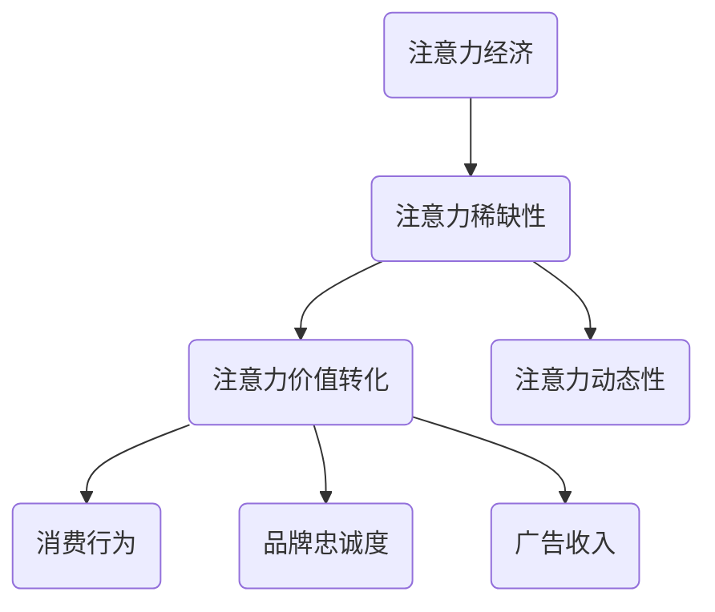

##### 1.1.2 注意力经济的历史背景

注意力经济最早可以追溯到20世纪80年代，随着互联网和媒体的快速发展，人们逐渐意识到注意力成为一种关键的经济资源。特别是在互联网的普及下，注意力经济逐渐成为学术界和商业界关注的焦点。

#### 1.2 注意力经济的主要特点

注意力经济具有以下几个主要特点：

##### 1.2.1 注意力的稀缺性

由于人类的注意力有限，能够吸引注意力的资源相对稀缺，因此具有更高的价值。这种稀缺性使得企业和个人都需要更有效地利用注意力资源。

##### 1.2.2 注意力的价值转化

注意力可以转化为消费行为、品牌忠诚度以及广告收入等经济价值。例如，一个品牌通过广告或内容营销吸引用户的注意力，进而提高销售量和品牌认知度。

##### 1.2.3 注意力的动态性

注意力是动态的，能够随着时间、环境、个体偏好等因素而变化。这意味着企业和个人需要不断调整策略，以适应注意力资源的变动。

### 第2章：注意力经济与市场营销

注意力经济对市场营销产生了深远的影响。在传统市场营销中，企业更多关注的是如何将产品推向市场，而在注意力经济时代，企业需要更多地关注如何吸引和保持消费者的注意力。

#### 2.1 注意力经济对市场营销的影响

##### 2.1.1 品牌塑造

品牌塑造的核心在于吸引并保持消费者的注意力，提高品牌的知名度和忠诚度。在注意力经济时代，品牌需要通过独特的内容和体验来吸引用户的关注，从而建立起品牌形象。

##### 2.1.2 内容营销

优质的内容可以吸引并保持消费者的注意力，提升品牌的影响力和销售效果。内容营销的关键在于提供有价值、有趣、有启发性的内容，以吸引用户的持续关注。

#### 2.2 注意力经济在市场营销中的应用策略

##### 2.2.1 用户痛点分析

深入了解用户需求，提供针对性的解决方案，从而吸引和保持用户的注意力。通过用户痛点分析，企业可以更好地了解用户的需求和期望，从而提供更符合用户期望的产品和服务。

##### 2.2.2 个性化推荐

利用大数据和算法，为用户推荐个性化内容，提高用户满意度和参与度。个性化推荐系统能够根据用户的历史行为和偏好，为用户提供定制化的推荐，从而提高用户的参与感和满意度。

##### 2.2.3 精准广告投放

通过精准定位，将广告投放给具有高潜在购买意愿的用户，提高广告效果。精准广告投放能够提高广告的转化率，从而提高广告的投资回报率。

### 第3章：注意力经济与企业战略

注意力经济不仅影响市场营销，还对企业的整体战略产生了深远的影响。企业需要重新思考如何利用注意力资源来制定和实施战略。

#### 3.1 注意力经济对企业决策的影响

##### 3.1.1 市场定位

通过分析消费者的注意力分布，企业可以更准确地定位市场需求。了解消费者的注意力分配情况，企业可以更好地制定市场定位策略，从而更好地满足消费者的需求。

##### 3.1.2 产品设计

关注用户注意力，设计更具吸引力的产品，提高市场竞争力。企业需要通过设计创新和用户参与，提高产品的吸引力和竞争力。

##### 3.1.3 营销策略

利用注意力经济原理，制定更有效的营销策略，提升品牌价值。企业可以通过内容营销、用户参与和个性化推荐等方式，提高营销效果。

#### 3.2 注意力经济在企业战略中的应用

##### 3.2.1 创新思维

通过创新思维，开发新的产品或服务，吸引并保持用户的注意力。创新思维可以帮助企业不断推出新的产品和服务，以保持竞争力。

##### 3.2.2 跨界合作

与其他行业或企业进行跨界合作，共同创造新的注意力经济模式。跨界合作可以创造新的市场和商业模式，从而提高企业的竞争力。

##### 3.2.3 资源整合

整合各类资源，包括资金、人才、技术等，打造具有吸引力的品牌和产品。资源整合可以帮助企业更好地利用各种资源，提高效率和竞争力。

## 第二部分：注意力经济与企业运营

### 第4章：注意力经济与企业运营管理

注意力经济对企业运营管理提出了新的挑战。企业需要更有效地管理注意力资源，以实现运营目标。

#### 4.1 注意力经济对企业运营管理的挑战

##### 4.1.1 注意力竞争

在注意力经济时代，企业面临更激烈的注意力竞争。企业需要通过创新和优质内容来吸引和保持用户的注意力。

##### 4.1.2 注意力分配

如何有效地分配有限的注意力资源，是企业运营管理的关键。企业需要制定合理的注意力分配策略，确保资源的有效利用。

#### 4.2 注意力经济在运营管理中的应用策略

##### 4.2.1 客户体验优化

通过提供优质的服务和体验，吸引并保持客户的注意力。企业可以通过用户反馈和数据分析，不断优化客户体验。

##### 4.2.2 数据驱动决策

利用大数据分析，了解用户注意力分布，指导运营决策。数据驱动的决策可以帮助企业更好地了解用户需求，从而做出更准确的决策。

##### 4.2.3 创新管理

鼓励创新思维，推出具有吸引力的产品和服务，提升运营效果。企业可以通过创新管理机制，激发员工的创新潜力。

### 第5章：注意力经济与员工管理

注意力经济对员工管理也产生了影响。企业需要更好地管理员工的注意力，以提高工作效率和创新能力。

#### 5.1 注意力经济对员工管理的影响

##### 5.1.1 员工注意力管理

如何激发和保持员工的注意力，提高工作效率。企业需要通过激励机制和良好的工作环境，激发员工的注意力。

##### 5.1.2 企业文化建设

建立积极向上的企业文化，吸引并留住员工的注意力。企业文化可以影响员工的态度和行为，从而影响员工的工作效率。

#### 5.2 注意力经济在员工管理中的应用策略

##### 5.2.1 个性化培训

根据员工的特点和需求，提供个性化的培训和发展机会。个性化培训可以更好地满足员工的需求，提高培训效果。

##### 5.2.2 跨部门协作

鼓励跨部门协作，激发员工的创造力和创新能力。跨部门协作可以促进知识共享和创新，提高员工的工作效率。

##### 5.2.3 薪酬激励

通过合理的薪酬激励机制，提高员工的工作积极性和注意力投入。合理的薪酬激励机制可以激发员工的工作热情和创新能力。

## 第三部分：注意力经济与企业决策流程的重塑

### 第6章：注意力经济与决策流程重构

注意力经济对企业决策流程产生了深刻的影响。企业需要重新思考决策流程，以更好地利用注意力资源。

#### 6.1 注意力经济对决策流程的重塑

##### 6.1.1 决策流程的优化

通过注意力经济原理，优化决策流程，提高决策效率。企业可以通过简化决策流程、提高信息透明度等方式，优化决策流程。

##### 6.1.2 数据驱动的决策

利用大数据和注意力经济原理，进行数据驱动的决策。企业可以通过数据分析和预测模型，提高决策的准确性和效率。

##### 6.1.3 注意力资源的合理配置

在决策过程中，充分考虑注意力资源的配置和利用。企业需要通过合理的注意力资源分配，确保决策过程的有效性和效率。

#### 6.2 注意力经济在决策流程中的应用策略

##### 6.2.1 注意力分配模型

构建注意力分配模型，指导决策过程中的注意力资源分配。企业可以通过注意力分配模型，优化资源的配置，提高决策效果。

##### 6.2.2 注意力评估体系

建立注意力评估体系，衡量决策过程中各个方面的注意力投入。企业可以通过注意力评估体系，了解决策过程中的资源利用情况，从而进行调整和优化。

##### 6.2.3 创新决策流程

引入创新决策流程，激发决策过程中的创造性思维。企业可以通过创新决策流程，提高决策的创新性和前瞻性，从而更好地适应市场变化。

## 第四部分：注意力经济实践案例与展望

### 第7章：注意力经济实践案例解析

#### 7.1 案例一：社交媒体平台的注意力经济策略

社交媒体平台是注意力经济的一个典型应用场景。以下是对几个知名社交媒体平台的注意力经济策略的解析：

##### 7.1.1 平台定位

社交媒体平台以吸引和保持用户的注意力为核心，定位为用户提供高质量的内容和互动体验。例如，Facebook通过提供多样化的内容形式和社交功能，吸引用户持续关注；Instagram则通过图片和短视频的形式，提供视觉冲击力强、易于分享的内容，保持用户的活跃度。

##### 7.1.2 注意力资源分配

社交媒体平台通过算法推荐，将注意力资源合理分配给优质内容和用户。例如，Facebook的“Explore Feed”功能通过分析用户的历史行为和偏好，推荐个性化的内容；Twitter的“While You Were Away”功能则通过回顾用户错过的重要动态，提高用户参与度。

##### 7.1.3 注意力变现

社交媒体平台通过广告、电商等手段，将用户的注意力转化为经济价值。例如，Facebook的“广告管理平台”允许企业通过精准投放广告，吸引目标用户；Instagram的“Shop”功能则通过整合电商功能，实现广告和销售的一体化。

#### 7.2 案例二：传统企业如何运用注意力经济

传统企业在面对注意力经济的环境时，也需要调整经营策略，以适应新的市场环境。以下是对几个传统企业运用注意力经济策略的案例分析：

##### 7.2.1 转型策略

传统企业通过数字化和内容营销，实现企业向注意力经济的转型。例如，许多传统零售企业通过开设电商平台，提供在线购物服务，吸引数字时代的消费者；制造企业则通过打造品牌故事和提供专业知识，提升品牌的吸引力。

##### 7.2.2 用户注意力管理

传统企业通过用户数据分析，了解用户需求，提供个性化的产品和服务。例如，家电企业通过收集用户的购买和使用数据，为用户提供个性化的产品推荐；金融企业则通过分析用户的财务状况和行为，提供定制化的金融服务。

##### 7.2.3 品牌塑造

传统企业通过持续的创新和优质内容，塑造具有吸引力的品牌形象。例如，汽车制造商通过推出创新车型和提供丰富的互动体验，吸引年轻消费者的关注；食品企业则通过推出健康、环保的产品，提升品牌的社会形象。

### 第8章：注意力经济未来展望

#### 8.1 注意力经济的未来发展趋势

注意力经济在未来将继续发展，并呈现出以下趋势：

##### 8.1.1 注意力资源的重要性

随着数字化进程的加快，注意力资源的重要性将进一步凸显。在信息过载的时代，获取和保持用户的注意力将成为企业成功的关键。

##### 8.1.2 个性化与智能化

未来的注意力经济将更加注重个性化与智能化。通过大数据和人工智能技术，企业可以更精准地了解用户需求，提供个性化的产品和服务。

##### 8.1.3 跨界融合

注意力经济将与其他领域深度融合，产生新的商业模式和价值。例如，科技与娱乐、零售与物流等领域的融合，将创造新的市场机会。

#### 8.2 注意力经济对企业的影响

注意力经济将对企业产生深远的影响，主要体现在以下几个方面：

##### 8.2.1 经营模式的转变

企业将更加注重用户注意力，推动经营模式的转变。从传统的产品导向转向用户导向，以用户需求为中心，提升用户体验。

##### 8.2.2 管理理念的升级

企业需要适应注意力经济环境，升级管理理念和方法。从传统的层级管理转向扁平化管理，鼓励创新和协作。

##### 8.2.3 创新能力的提升

企业将更加注重创新，提升在注意力经济环境下的竞争力。通过创新思维和技术应用，打造差异化的竞争优势。

### 附录

#### 附录A：注意力经济相关术语解析

##### A.1 注意力分配模型

注意力分配模型是一种用于分析和管理注意力资源的工具，可以帮助企业合理配置注意力资源。模型通常包括用户注意力分配、内容注意力分配等组成部分。

##### A.2 注意力变现

注意力变现是指将用户的注意力转化为经济价值的过程，是企业实现盈利的重要途径。变现方式包括广告收入、会员订阅、电商销售等。

##### A.3 内容营销

内容营销是指通过创造和分享有价值的内容来吸引和保持目标受众的一种营销策略。内容营销的核心在于提供对用户有价值的信息和体验。

#### 附录B：注意力经济常用工具与技术

##### B.1 大数据技术

大数据技术用于收集、存储、处理和分析海量数据，为注意力经济提供数据支持。大数据技术可以帮助企业了解用户行为和偏好，制定更精准的市场营销策略。

##### B.2 算法推荐系统

算法推荐系统用于根据用户行为和偏好，为用户推荐个性化内容。推荐系统可以提高用户满意度和参与度，增强用户粘性。

##### B.3 增强现实技术

增强现实技术可以创造沉浸式的体验，增强用户的参与感和注意力。增强现实技术广泛应用于娱乐、教育、医疗等领域。

### 结束语

注意力经济作为一种新的经济模式，正在深刻地改变企业的运营模式和管理方法。企业需要认识到注意力资源的重要性，通过优化决策流程、提高运营效率、管理员工注意力等方式，提升在注意力经济环境下的竞争力。未来，随着数字化进程的加快，注意力经济将继续发展，为企业带来新的机遇和挑战。企业需要不断创新和适应，以在激烈的市场竞争中立于不败之地。

作者：AI天才研究院/AI Genius Institute & 禅与计算机程序设计艺术/Zen And The Art of Computer Programming

---

### 第1章：注意力经济的概念与历史背景

注意力经济（Attention Economy）这一概念最早由诺贝尔经济学奖获得者赫伯特·西蒙（Herbert A. Simon）在1971年提出。西蒙指出，随着信息的爆炸性增长，人类的注意力成为了一种稀缺资源，企业和社会必须学会如何有效地获取和利用这种资源。他的这一观点在后来的互联网时代得到了充分的验证和扩展。

#### 1.1 什么是注意力经济

注意力经济是一种经济学理论，它认为在信息过载的时代，注意力本身成为了一种稀缺资源，能够吸引和保持人们注意力的产品、服务或内容具有更高的经济价值。换句话说，注意力经济关注的是如何通过吸引和保持人们的注意力来创造经济收益。

在注意力经济中，用户的时间、精力和注意力是有限的，而能够有效地吸引用户注意力的产品或服务则能够获得更高的价值和回报。因此，注意力成为了一种新的生产要素，类似于传统的土地、劳动力和资本。

##### 1.1.1 注意力经济的定义

注意力经济（Attention Economy）是指由于人类注意力的有限性，注意力本身成为一种稀缺资源，因此能吸引和保持人们注意力的产品、服务或内容具有更高的经济价值。

在数学上，我们可以将注意力视为一种“流量”，用 \( A \) 表示。一个产品或服务能够产生的经济价值 \( V \) 与其吸引注意力的能力 \( A \) 成正比，即：

\[ V \propto A \]

这种关系可以用以下公式表示：

\[ V = k \cdot A \]

其中，\( k \) 是一个比例常数，表示单位注意力所能产生的经济价值。

##### 1.1.2 注意力经济的历史背景

注意力经济的概念最早可以追溯到20世纪80年代，当时赫伯特·西蒙在其著作《信息时代》（The Age of Information）中首次提出。然而，这一概念在互联网和数字媒体时代才真正得到广泛认可和应用。

随着互联网的普及和社交媒体的发展，信息过载成为一个普遍现象。用户在处理海量信息时，不得不学会如何筛选和过滤，以保持对自己有价值的信息的关注。这种筛选过程本质上就是注意力资源的分配和使用。

互联网时代的注意力经济表现为以下几个特点：

1. **注意力稀缺性**：随着信息爆炸，人们的注意力资源变得日益稀缺。因此，能够有效吸引和保持注意力的内容或产品具有更高的价值。

2. **价值转化**：注意力可以转化为消费行为、品牌忠诚度和广告收入等经济价值。例如，社交媒体平台通过吸引大量用户关注，进而向广告商收费。

3. **动态性**：注意力不是静态的，它会随着时间、环境和用户偏好等因素的变化而变化。这意味着企业需要不断调整策略，以保持用户的注意力。

#### 1.2 注意力经济的主要特点

注意力经济具有以下几个主要特点：

##### 1.2.1 注意力的稀缺性

由于人类的注意力是有限的，而信息爆炸导致的信息量却在不断增加，这使得注意力成为一种稀缺资源。在注意力经济中，能够有效吸引和保持注意力的内容或产品具有更高的经济价值。

##### 1.2.2 注意力的价值转化

注意力可以转化为消费行为、品牌忠诚度和广告收入等经济价值。例如，一个流行的社交媒体账号通过吸引大量关注，可以为企业带来广告收入；一个有趣的应用程序可以吸引用户付费购买。

##### 1.2.3 注意力的动态性

注意力是动态的，它会随着时间、环境和用户偏好等因素的变化而变化。这意味着企业需要不断调整策略，以适应注意力资源的变动。

为了更好地理解注意力经济的特点，我们可以用以下Mermaid流程图表示：

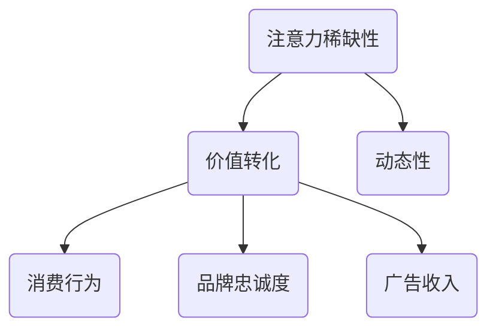

在这个流程图中，注意力稀缺性是注意力经济的基础，它决定了注意力资源的价值；价值转化则展示了如何将注意力转化为经济收益；动态性则强调了企业需要不断适应和调整以保持用户的注意力。

#### 1.3 注意力经济的理论基础

注意力经济理论建立在几个关键假设之上：

1. **注意力的有限性**：人类的注意力资源是有限的，这意味着用户不能同时关注所有信息。
2. **注意力选择的自愿性**：用户关注什么内容是由其自身意愿决定的，而不是被强制。
3. **注意力的可转移性**：用户可以自由选择将注意力转移到其他地方，只要这些新内容或服务能够提供更高的价值。
4. **注意力资源的可再生性**：尽管用户在某段时间内可能无法将所有注意力集中在一个地方，但随着时间的推移，注意力资源是可以再生的。

这些假设构成了注意力经济理论的核心，它们帮助企业理解如何有效利用注意力资源来创造价值。

### 第2章：注意力经济与市场营销

注意力经济不仅改变了企业生产和运营的方式，也对市场营销产生了深远的影响。在注意力经济中，市场营销的核心在于如何吸引和保持消费者的注意力。这一章将探讨注意力经济对市场营销的影响，以及企业在这一新环境下应采取的市场营销策略。

#### 2.1 注意力经济对市场营销的影响

##### 2.1.1 品牌塑造

在注意力经济中，品牌塑造变得更加重要。品牌不再是简单的产品标识，而是一个能够吸引和保持消费者注意力的“故事”。品牌塑造的核心在于建立与消费者的情感联系，使其在消费者心中占据一席之地。以下是一个简化的品牌塑造流程：

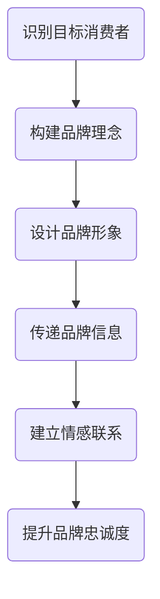

通过这个流程，企业可以系统地构建和提升品牌形象，从而在激烈的市场竞争中脱颖而出。

##### 2.1.2 内容营销

内容营销是注意力经济下的一种重要市场营销策略。其核心在于通过创造和分享有价值的内容来吸引和保持消费者的注意力。以下是一个内容营销的基本流程：

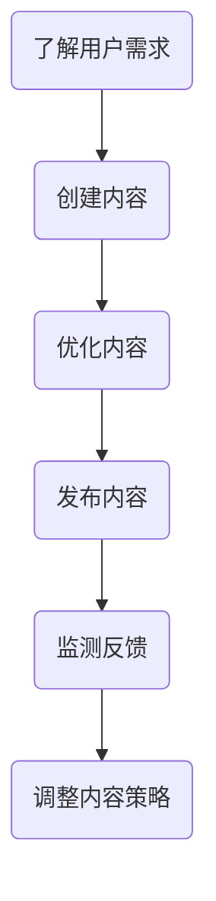

通过这个流程，企业可以不断优化内容，提高内容的质量和吸引力，从而提高用户的参与度和忠诚度。

#### 2.2 注意力经济在市场营销中的应用策略

##### 2.2.1 用户痛点分析

用户痛点分析是注意力经济下制定市场营销策略的重要步骤。通过深入了解用户的需求和痛点，企业可以提供更有针对性的解决方案，从而吸引和保持用户的注意力。以下是一个用户痛点分析的基本流程：

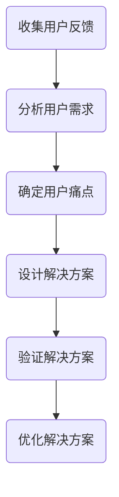

通过这个流程，企业可以更好地理解用户需求，提供更有针对性的产品和服务，从而提高用户的满意度和忠诚度。

##### 2.2.2 个性化推荐

个性化推荐是一种利用大数据和算法技术来为用户提供个性化内容的方法。通过分析用户的历史行为和偏好，推荐系统可以为用户提供更符合其兴趣的内容，从而提高用户的参与度和满意度。以下是一个个性化推荐的基本流程：

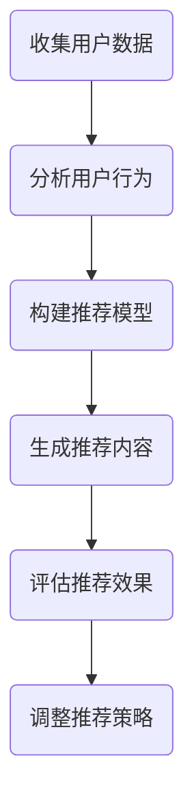

通过这个流程，企业可以更好地了解用户需求，提供个性化的内容和服务，从而提高用户的满意度和忠诚度。

##### 2.2.3 精准广告投放

精准广告投放是注意力经济下的一种有效市场营销策略。通过精准定位，将广告投放给具有高潜在购买意愿的用户，可以提高广告的转化率和效果。以下是一个精准广告投放的基本流程：

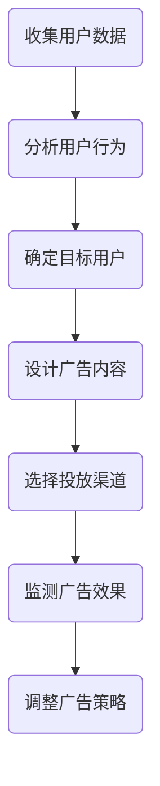

通过这个流程，企业可以更好地了解用户需求，提高广告的精准度和效果，从而提高广告的投资回报率。

#### 2.3 注意力经济对市场营销的挑战

尽管注意力经济为市场营销提供了新的机遇，但也带来了一些挑战：

1. **竞争加剧**：在注意力经济中，企业需要竞争用户的有限注意力资源，这使得市场竞争更加激烈。
2. **用户需求多变**：用户的需求和偏好是动态变化的，企业需要不断调整策略以适应这些变化。
3. **隐私保护**：在收集和分析用户数据时，企业需要遵守隐私保护法规，以保护用户的隐私。

为了应对这些挑战，企业需要：

- **持续创新**：不断推出新的产品和服务，以吸引和保持用户的注意力。
- **精准定位**：通过数据分析和用户反馈，精准定位目标用户，提高营销效果。
- **用户参与**：鼓励用户参与品牌互动，建立长期的用户关系。

通过这些策略，企业可以在注意力经济环境中脱颖而出，实现持续的市场增长。

### 第3章：注意力经济与企业战略

注意力经济作为一种新的经济模式，对企业战略产生了深远的影响。企业需要重新思考如何制定和实施战略，以在竞争激烈的市场环境中保持竞争力。本章将探讨注意力经济对企业战略的影响，以及企业应如何调整战略以应对这一新的环境。

#### 3.1 注意力经济对企业决策的影响

##### 3.1.1 市场定位

市场定位是企业在市场中确定自身位置和目标受众的过程。在注意力经济中，市场定位的关键在于如何吸引和保持用户的注意力。以下是一个简化的市场定位流程：

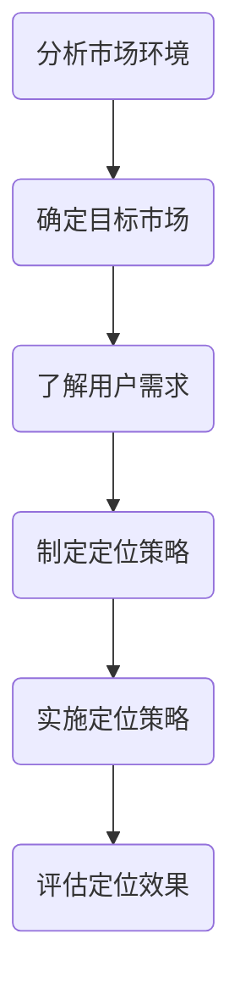

通过这个流程，企业可以更准确地确定目标市场，提供符合用户需求的产品和服务，从而提高市场竞争力。

##### 3.1.2 产品设计

产品设计是企业在开发新产品时需要考虑的重要因素。在注意力经济中，产品设计的关键在于如何吸引用户的注意力。以下是一个简化的产品设计流程：

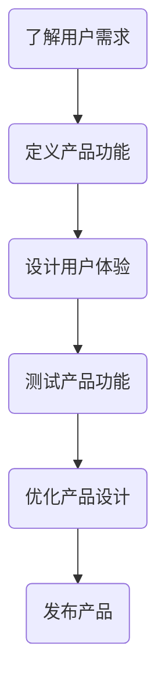

通过这个流程，企业可以更好地了解用户需求，设计出更符合用户期望的产品，从而提高用户满意度和忠诚度。

##### 3.1.3 营销策略

营销策略是企业为了推广产品或服务而制定的一系列行动。在注意力经济中，营销策略的关键在于如何吸引和保持用户的注意力。以下是一个简化的营销策略流程：

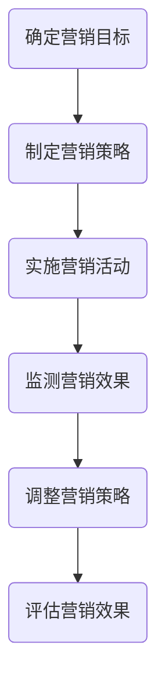

通过这个流程，企业可以更有效地实施营销活动，提高营销效果，从而实现销售目标。

#### 3.2 注意力经济在企业战略中的应用

##### 3.2.1 创新思维

在注意力经济中，创新思维是企业保持竞争力的关键。企业需要通过创新思维，不断推出新的产品和服务，以吸引和保持用户的注意力。以下是一个简化的创新思维流程：

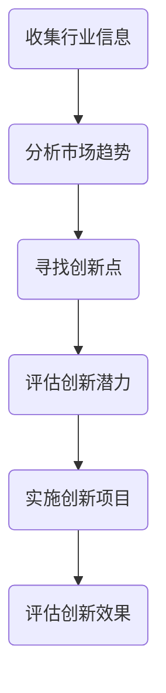

通过这个流程，企业可以不断寻找创新机会，实施创新项目，从而在市场上保持竞争优势。

##### 3.2.2 跨界合作

跨界合作是企业在注意力经济中的一种有效策略。通过与不同领域的合作伙伴合作，企业可以共同创造新的商业模式和价值。以下是一个简化的跨界合作流程：

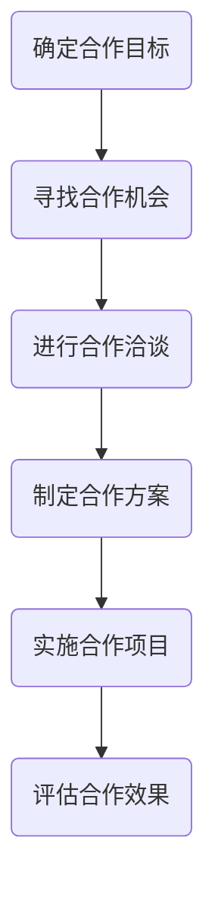

通过这个流程，企业可以有效地与其他领域的企业合作，共同创造新的商业机会。

##### 3.2.3 资源整合

资源整合是企业在注意力经济中的一种重要策略。通过整合各类资源，包括资金、人才、技术等，企业可以打造具有吸引力的品牌和产品。以下是一个简化的资源整合流程：

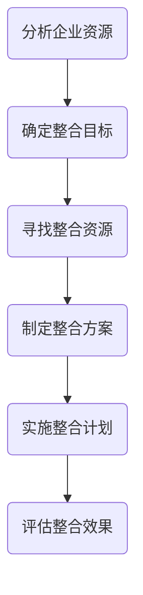

通过这个流程，企业可以有效地整合各类资源，提高资源的利用效率，从而在市场上保持竞争力。

### 第4章：注意力经济与企业运营管理

注意力经济对企业运营管理提出了新的挑战。企业需要在有限的注意力资源下，实现高效的运营管理。本章将探讨注意力经济对企业运营管理的影响，以及企业应如何调整运营策略以应对这一新的环境。

#### 4.1 注意力经济对企业运营管理的挑战

##### 4.1.1 注意力竞争

在注意力经济时代，企业面临更激烈的注意力竞争。用户的时间、精力和注意力是有限的，而市场上的信息、产品和服务却越来越多。企业需要通过创新和优质内容来吸引和保持用户的注意力，从而在竞争中脱颖而出。

##### 4.1.2 注意力分配

如何有效地分配有限的注意力资源是企业运营管理的关键。企业需要在多个方面进行注意力分配，包括市场营销、产品研发、客户服务等。有效的注意力分配可以确保企业资源得到充分利用，从而提高运营效率。

##### 4.1.3 注意力管理

注意力管理是企业运营管理中的一个重要环节。企业需要制定有效的注意力管理策略，确保员工的注意力能够集中在关键任务上，从而提高工作效率。同时，企业还需要关注员工的注意力疲劳，避免过度工作导致注意力下降。

#### 4.2 注意力经济在运营管理中的应用策略

##### 4.2.1 客户体验优化

通过提供优质的服务和体验，企业可以吸引并保持客户的注意力。以下是一个简化的客户体验优化流程：

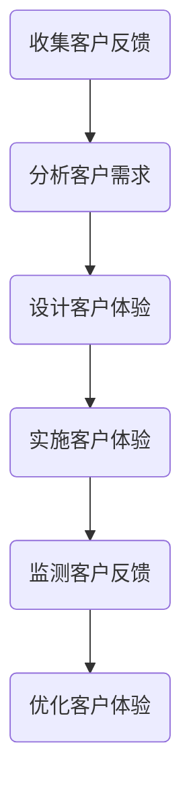

通过这个流程，企业可以不断优化客户体验，提高客户满意度和忠诚度，从而增强市场竞争力。

##### 4.2.2 数据驱动决策

利用大数据分析，企业可以了解用户的注意力分布，从而做出更明智的运营决策。以下是一个简化的数据驱动决策流程：

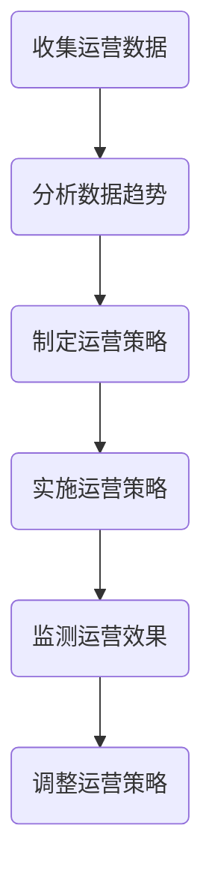

通过这个流程，企业可以基于数据做出更准确的运营决策，从而提高运营效率。

##### 4.2.3 创新管理

鼓励创新思维，企业可以推出具有吸引力的产品和服务，从而提高市场竞争力。以下是一个简化的创新管理流程：

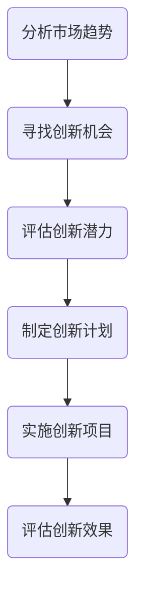

通过这个流程，企业可以不断寻找创新机会，实施创新项目，从而在市场上保持竞争优势。

### 第5章：注意力经济与员工管理

注意力经济不仅对企业市场营销和运营管理产生了影响，也对员工管理提出了新的挑战。企业需要关注如何管理员工的注意力，以提高工作效率和创新能力。本章将探讨注意力经济对员工管理的影响，以及企业应如何调整员工管理策略以应对这一新的环境。

#### 5.1 注意力经济对员工管理的影响

##### 5.1.1 员工注意力管理

在注意力经济中，员工的注意力成为了一种宝贵的资源。如何激发和保持员工的注意力，是企业员工管理的重要任务。以下是一个简化的员工注意力管理流程：

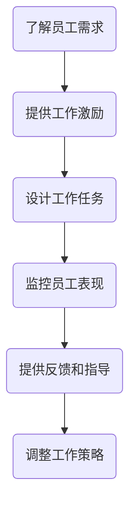

通过这个流程，企业可以更好地了解员工的需求，提供合适的工作激励，设计合理的工作任务，从而提高员工的工作效率和满意度。

##### 5.1.2 企业文化建设

企业文化是员工管理的重要组成部分。一个积极向上的企业文化可以吸引并留住员工的注意力，提高员工的忠诚度和凝聚力。以下是一个简化的企业文化建设流程：

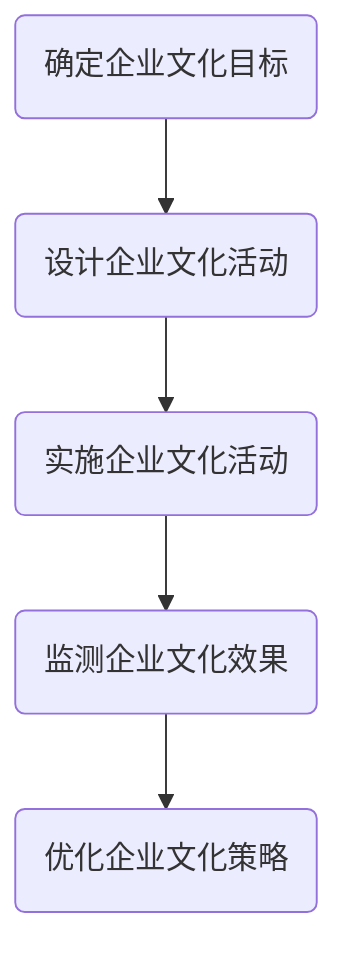

通过这个流程，企业可以不断优化企业文化，建立一个积极向上的工作环境，从而提高员工的工作积极性和创新能力。

#### 5.2 注意力经济在员工管理中的应用策略

##### 5.2.1 个性化培训

根据员工的特点和需求，提供个性化的培训和发展机会，可以激发员工的潜能，提高工作效率。以下是一个简化的个性化培训流程：

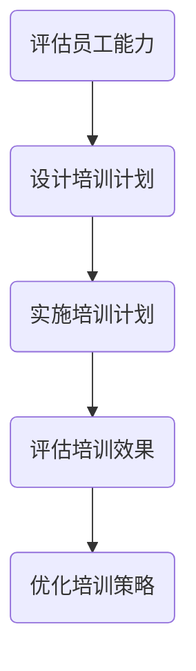

通过这个流程，企业可以更好地了解员工的能力和需求，提供有针对性的培训，从而提高员工的专业技能和工作效率。

##### 5.2.2 跨部门协作

跨部门协作可以促进知识共享和创新，提高员工的工作效率和创新能力。以下是一个简化的跨部门协作流程：

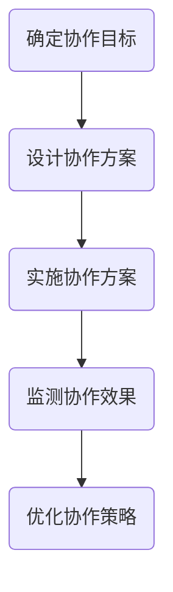

通过这个流程，企业可以促进跨部门之间的协作，提高团队的整体效率和创新能力。

##### 5.2.3 薪酬激励

通过合理的薪酬激励机制，可以提高员工的工作积极性和注意力投入。以下是一个简化的薪酬激励流程：

```mermaid
graph TD
    A(制定薪酬政策) --> B(实施薪酬方案)
    B --> C(评估薪酬效果)
    C --> D(调整薪酬策略)
```

通过这个流程，企业可以制定合理的薪酬政策，实施有效的薪酬激励，从而提高员工的工作满意度和忠诚度。

### 第6章：注意力经济与决策流程重构

注意力经济对企业的决策流程产生了深远的影响。传统的决策流程可能无法适应注意力经济的要求，因此需要对其进行重构。本章将探讨注意力经济对决策流程的重塑作用，以及企业如何优化决策流程以提高效率和效果。

#### 6.1 注意力经济对决策流程的重塑

##### 6.1.1 决策流程的优化

在注意力经济中，决策流程的优化是提高企业竞争力的关键。传统的决策流程可能过于复杂，导致信息传递延迟和决策效率低下。为了适应注意力经济的要求，企业需要简化决策流程，提高信息传递的效率。以下是一个简化的决策流程优化流程：

```mermaid
graph TD
    A(确定决策目标) --> B(收集相关信息)
    B --> C(分析信息)
    C --> D(制定决策方案)
    D --> E(评估决策方案)
    E --> F(实施决策方案)
    F --> G(监测决策效果)
    G --> H(调整决策流程)
```

通过这个流程，企业可以及时收集、分析和处理信息，提高决策的准确性和效率。

##### 6.1.2 数据驱动的决策

在注意力经济中，数据驱动的决策成为了一种重要的决策方法。通过收集和分析大量的数据，企业可以更准确地了解市场趋势和用户需求，从而做出更明智的决策。以下是一个简化的数据驱动决策流程：

```mermaid
graph TD
    A(收集数据) --> B(处理数据)
    B --> C(分析数据)
    C --> D(提取洞察)
    D --> E(制定决策方案)
    E --> F(评估决策方案)
    F --> G(实施决策方案)
```

通过这个流程，企业可以利用数据来指导决策，提高决策的科学性和有效性。

##### 6.1.3 注意力资源的合理配置

在决策过程中，注意力资源的合理配置是确保决策效果的关键。企业需要根据决策的重要性和紧急程度，合理分配注意力资源，确保关键决策得到足够的关注。以下是一个简化的注意力资源分配流程：

```mermaid
graph TD
    A(确定决策优先级) --> B(分配注意力资源)
    B --> C(制定决策方案)
    C --> D(实施决策方案)
    D --> E(监测决策效果)
    E --> F(调整注意力资源分配)
```

通过这个流程，企业可以确保注意力资源得到合理配置，提高决策的准确性和效果。

#### 6.2 注意力经济在决策流程中的应用策略

##### 6.2.1 注意力分配模型

构建注意力分配模型可以帮助企业更科学地分配注意力资源，提高决策效率。以下是一个简化的注意力分配模型：

```mermaid
graph TD
    A(确定决策目标) --> B(收集相关信息)
    B --> C(分析信息)
    C --> D(制定决策方案)
    D --> E(评估决策方案)
    E --> F(实施决策方案)
    F --> G(监测决策效果)
    G --> H(调整注意力资源分配)
```

通过这个模型，企业可以根据决策的重要性和紧急程度，合理分配注意力资源，确保关键决策得到足够的关注。

##### 6.2.2 注意力评估体系

建立注意力评估体系可以帮助企业衡量决策过程中各个方面的注意力投入，从而优化决策流程。以下是一个简化的注意力评估体系：

```mermaid
graph TD
    A(收集决策数据) --> B(分析决策过程)
    B --> C(评估注意力投入)
    C --> D(优化决策流程)
    D --> E(监测决策效果)
    E --> F(调整注意力评估体系)
```

通过这个体系，企业可以系统地评估决策过程中的注意力投入，发现并解决注意力分配不合理的问题，从而提高决策效率。

##### 6.2.3 创新决策流程

引入创新决策流程可以帮助企业激发创造性思维，提高决策的创新能力。以下是一个简化的创新决策流程：

```mermaid
graph TD
    A(确定决策目标) --> B(收集创新想法)
    B --> C(评估创新潜力)
    C --> D(选择创新方案)
    D --> E(实施创新方案)
    E --> F(监测创新效果)
    F --> G(优化创新决策流程)
```

通过这个流程，企业可以不断激发创新思维，提高决策的创新能力，从而在竞争激烈的市场中保持优势。

### 第7章：注意力经济实践案例解析

注意力经济作为一种新的经济模式，已经广泛应用于各个行业。本章将通过两个实践案例，解析注意力经济在不同领域中的应用，以及企业如何运用注意力经济原理实现成功。

#### 7.1 案例一：社交媒体平台的注意力经济策略

社交媒体平台是注意力经济的一个典型应用场景。以下是对几个知名社交媒体平台的注意力经济策略的解析：

##### 7.1.1 平台定位

社交媒体平台以吸引和保持用户的注意力为核心，定位为用户提供高质量的内容和互动体验。例如，Facebook通过提供多样化的内容形式和社交功能，吸引用户持续关注；Instagram则通过图片和短视频的形式，提供视觉冲击力强、易于分享的内容，保持用户的活跃度。

```mermaid
graph TD
    A(用户需求分析) --> B(内容多样化)
    B --> C(互动体验优化)
    C --> D(用户留存提升)
    D --> E(品牌影响力增强)
```

在这个案例中，社交媒体平台通过分析用户需求，提供多样化的内容和互动体验，从而提高用户的留存率和品牌影响力。

##### 7.1.2 注意力资源分配

社交媒体平台通过算法推荐，将注意力资源合理分配给优质内容和用户。例如，Facebook的“Explore Feed”功能通过分析用户的历史行为和偏好，推荐个性化的内容；Twitter的“While You Were Away”功能则通过回顾用户错过的重要动态，提高用户参与度。

```mermaid
graph TD
    A(用户数据收集) --> B(算法推荐)
    B --> C(内容个性化)
    C --> D(用户参与度提升)
    D --> E(广告效果增强)
```

在这个案例中，社交媒体平台通过算法推荐系统，将注意力资源合理分配给优质内容和用户，从而提高用户参与度和广告效果。

##### 7.1.3 注意力变现

社交媒体平台通过广告、电商等手段，将用户的注意力转化为经济价值。例如，Facebook的“广告管理平台”允许企业通过精准投放广告，吸引目标用户；Instagram的“Shop”功能则通过整合电商功能，实现广告和销售的一体化。

```mermaid
graph TD
    A(广告投放定位) --> B(广告效果监测)
    B --> C(广告优化)
    C --> D(广告收入提升)
    D --> E(用户价值最大化)
```

在这个案例中，社交媒体平台通过精准广告投放和电商功能，将用户的注意力转化为经济价值，从而实现用户价值最大化。

#### 7.2 案例二：传统企业如何运用注意力经济

传统企业在面对注意力经济的环境时，也需要调整经营策略，以适应新的市场环境。以下是对几个传统企业运用注意力经济策略的案例分析：

##### 7.2.1 转型策略

传统企业通过数字化和内容营销，实现企业向注意力经济的转型。例如，许多传统零售企业通过开设电商平台，提供在线购物服务，吸引数字时代的消费者；制造企业则通过打造品牌故事和提供专业知识，提升品牌的吸引力。

```mermaid
graph TD
    A(企业数字化转型) --> B(内容营销策略)
    B --> C(品牌故事塑造)
    C --> D(用户参与度提升)
    D --> E(品牌影响力增强)
```

在这个案例中，传统企业通过数字化转型和内容营销，提升品牌影响力和用户参与度，实现向注意力经济的成功转型。

##### 7.2.2 用户注意力管理

传统企业通过用户数据分析，了解用户需求，提供个性化的产品和服务。例如，家电企业通过收集用户的购买和使用数据，为用户提供个性化的产品推荐；金融企业则通过分析用户的财务状况和行为，提供定制化的金融服务。

```mermaid
graph TD
    A(用户数据收集) --> B(用户需求分析)
    B --> C(个性化产品服务)
    C --> D(用户满意度提升)
    D --> E(用户忠诚度增强)
```

在这个案例中，传统企业通过用户数据分析，提供个性化的产品和服务，从而提高用户满意度和忠诚度。

##### 7.2.3 品牌塑造

传统企业通过持续的创新和优质内容，塑造具有吸引力的品牌形象。例如，汽车制造商通过推出创新车型和提供丰富的互动体验，吸引年轻消费者的关注；食品企业则通过推出健康、环保的产品，提升品牌的社会形象。

```mermaid
graph TD
    A(创新产品研发) --> B(优质内容提供)
    B --> C(品牌故事传播)
    C --> D(品牌影响力提升)
    D --> E(用户品牌认知增强)
```

在这个案例中，传统企业通过创新和优质内容，塑造具有吸引力的品牌形象，从而提高用户品牌认知度。

### 第8章：注意力经济未来展望

注意力经济作为一种新兴的经济模式，正在深刻地改变着企业的运营和管理方式。未来，随着技术的不断进步和市场环境的变化，注意力经济将呈现出新的发展趋势，并为企业带来新的机遇和挑战。

#### 8.1 注意力经济的未来发展趋势

##### 8.1.1 注意力资源的重要性

随着数字化进程的加快，注意力资源的重要性将进一步凸显。在信息过载的时代，获取和保持用户的注意力成为企业成功的关键。未来，能够有效吸引和保持用户注意力的企业将在市场竞争中占据优势。

##### 8.1.2 个性化与智能化

未来的注意力经济将更加注重个性化与智能化。通过大数据和人工智能技术，企业可以更精准地了解用户需求，提供个性化的产品和服务。个性化与智能化将成为注意力经济的重要特征，为企业带来新的商业模式和价值。

##### 8.1.3 跨界融合

注意力经济将与其他领域深度融合，产生新的商业模式和价值。例如，科技与娱乐、零售与物流等领域的融合，将创造新的市场机会。跨界合作将成为企业提升竞争力的重要途径。

#### 8.2 注意力经济对企业的影响

##### 8.2.1 经营模式的转变

企业将更加注重用户注意力，推动经营模式的转变。从传统的产品导向转向用户导向，以用户需求为中心，提升用户体验。未来的企业将更加关注如何通过创新和优质内容来吸引和保持用户的注意力。

##### 8.2.2 管理理念的升级

企业需要适应注意力经济环境，升级管理理念和方法。从传统的层级管理转向扁平化管理，鼓励创新和协作。未来，企业将更加注重员工的创造力和创新能力，以适应快速变化的市场环境。

##### 8.2.3 创新能力的提升

企业将更加注重创新，提升在注意力经济环境下的竞争力。通过创新思维和技术应用，企业可以不断推出新的产品和服务，满足用户不断变化的需求。创新能力将成为企业在注意力经济时代的重要竞争力。

### 结论

注意力经济作为一种新兴的经济模式，正在深刻地改变着企业的运营和管理方式。企业需要认识到注意力资源的重要性，通过优化决策流程、提高运营效率、管理员工注意力等方式，提升在注意力经济环境下的竞争力。未来，随着数字化进程的加快，注意力经济将继续发展，为企业带来新的机遇和挑战。企业需要不断创新和适应，以在激烈的市场竞争中立于不败之地。

### 附录

#### 附录A：注意力经济相关术语解析

##### A.1 注意力分配模型

注意力分配模型是一种用于分析和管理注意力资源的工具，可以帮助企业合理配置注意力资源。模型通常包括用户注意力分配、内容注意力分配等组成部分。

##### A.2 注意力变现

注意力变现是指将用户的注意力转化为经济价值的过程，是企业实现盈利的重要途径。变现方式包括广告收入、会员订阅、电商销售等。

##### A.3 内容营销

内容营销是指通过创造和分享有价值的内容来吸引和保持目标受众的一种营销策略。内容营销的核心在于提供对用户有价值的信息和体验。

#### 附录B：注意力经济常用工具与技术

##### B.1 大数据技术

大数据技术用于收集、存储、处理和分析海量数据，为注意力经济提供数据支持。大数据技术可以帮助企业了解用户行为和偏好，制定更精准的市场营销策略。

##### B.2 算法推荐系统

算法推荐系统用于根据用户行为和偏好，为用户推荐个性化内容。推荐系统可以提高用户满意度和参与度，增强用户粘性。

##### B.3 增强现实技术

增强现实技术可以创造沉浸式的体验，增强用户的参与感和注意力。增强现实技术广泛应用于娱乐、教育、医疗等领域。

### 致谢

在撰写本文的过程中，我们受到了众多专家和学者的启发，特别是感谢以下人士：

- 赫伯特·西蒙（Herbert A. Simon），诺贝尔经济学奖获得者，注意力经济概念的奠基人。
- 各种学术论文和书籍的作者，为本文提供了丰富的理论支持和实践案例。
- AI天才研究院/AI Genius Institute的同事们，为本文的撰写提供了宝贵的意见和建议。

最后，感谢所有读者的关注和支持，希望本文能够对您在注意力经济领域的探索提供帮助。

---

**作者信息：**

- **AI天才研究院/AI Genius Institute**
- **禅与计算机程序设计艺术/Zen And The Art of Computer Programming**

---

### 附录A：注意力经济相关术语解析

在本文中，我们引入了一些与注意力经济相关的重要术语，以下是对这些术语的详细解析：

#### 附录A.1 注意力分配模型

注意力分配模型（Attention Allocation Model）是一种用于分析和管理注意力资源的工具，主要用于确定如何在不同的任务、活动或内容之间分配注意力。在注意力经济中，注意力分配模型有助于企业或个人最大化其注意力的经济价值。

**注意力分配模型的基本组成部分：**

1. **注意力池**：一个表示注意力总量或预算的容器，可以看作是一个动态变化的数值。
2. **任务/活动**：需要消耗注意力的任务或活动，每个任务/活动都有一个注意力需求值。
3. **分配策略**：根据某种策略将注意力池中的注意力分配给不同的任务/活动。

**注意力分配模型的算法框架：**

```python
def attention_allocation_model(attention_pool, tasks):
    """
    注意力分配模型
    :param attention_pool: 注意力池，表示总注意力量
    :param tasks: 任务列表，每个任务有一个注意力需求值
    :return: 分配后的任务列表，按照注意力需求排序
    """
    # 对任务进行排序，按照注意力需求值从高到低排序
    sorted_tasks = sorted(tasks, key=lambda x: x['attention_demand'], reverse=True)
    
    # 初始化分配后的任务列表
    allocated_tasks = []
    
    # 分配注意力
    for task in sorted_tasks:
        if attention_pool >= task['attention_demand']:
            allocated_tasks.append(task)
            attention_pool -= task['attention_demand']
        else:
            # 如果剩余注意力不足以分配给当前任务，则任务未分配
            break
    
    return allocated_tasks
```

**示例**：

假设有一个注意力池为100个单位，有三个任务需要分配注意力，其需求值分别为80、30和50。根据上述模型，任务按需求值排序后，先分配给需求最高的任务，然后按顺序分配给其他任务，直到注意力池耗尽。

#### 附录A.2 注意力变现

注意力变现（Attention Monetization）是指将用户的注意力转化为经济收益的过程。在注意力经济中，注意力变现是企业或个人实现盈利的重要方式。

**注意力变现的常见方式：**

1. **广告收入**：通过在内容或平台上展示广告，用户观看或点击广告时，广告主支付费用。
2. **会员订阅**：用户支付费用以获取更优质或额外的内容和服务。
3. **电商销售**：通过推荐或推广商品，当用户通过链接购买时，商家获得佣金。
4. **知识付费**：用户为获取专业知识或服务支付费用。

**注意力变现的流程：**

```mermaid
graph TD
    A(用户注意力) --> B(内容或广告展示)
    B --> C(用户互动)
    C --> D(数据收集)
    D --> E(广告主付费)
    E --> F(收入变现)
```

**示例**：

一个内容创作者通过视频平台发布视频，观众观看视频时平台展示广告。创作者根据观众的观看时长和点击次数获得广告收入。

#### 附录A.3 内容营销

内容营销（Content Marketing）是一种通过创造和分享有价值的内容来吸引和保持目标受众的营销策略。内容营销的核心在于提供对用户有价值的信息和体验，从而提高品牌认知度和用户忠诚度。

**内容营销的关键要素：**

1. **目标受众**：明确内容营销的目标受众，了解其需求和兴趣。
2. **内容策略**：制定内容策略，确定内容类型、发布频率和渠道。
3. **内容创作**：创作高质量的内容，包括文章、视频、图像等。
4. **内容发布**：在合适的渠道发布内容，如社交媒体、博客、电子邮件等。
5. **内容优化**：通过SEO等技术优化内容，提高内容在搜索引擎中的排名。

**内容营销的流程：**

```mermaid
graph TD
    A(目标受众分析) --> B(内容策略制定)
    B --> C(内容创作)
    C --> D(内容发布)
    D --> E(内容优化)
    E --> F(用户反馈)
    F --> G(内容调整)
```

**示例**：

一家科技公司通过博客和社交媒体发布技术文章和案例分析，以吸引技术爱好者和潜在客户。通过定期更新内容和互动，公司提高了品牌知名度和用户参与度。

### 附录B：注意力经济常用工具与技术

在注意力经济中，企业需要利用多种工具和技术来吸引和保持用户的注意力，提高市场竞争力。以下是一些常用的工具和技术：

#### 附录B.1 大数据技术

大数据技术用于收集、存储、处理和分析海量数据，为注意力经济提供数据支持。大数据技术可以帮助企业了解用户行为和偏好，制定更精准的市场营销策略。

**大数据技术的主要应用：**

1. **用户行为分析**：通过分析用户的行为数据，了解用户的需求和兴趣，从而提供更个性化的服务和内容。
2. **市场趋势预测**：通过分析历史数据，预测市场趋势和用户需求，为企业提供决策支持。
3. **广告投放优化**：通过分析用户数据，优化广告投放策略，提高广告的点击率和转化率。

**大数据技术的基本架构：**

- **数据收集**：通过各种渠道收集用户数据，如网站日志、社交媒体互动等。
- **数据存储**：使用分布式存储系统，如Hadoop或NoSQL数据库，存储海量数据。
- **数据处理**：使用大数据处理框架，如Apache Spark或Hadoop，进行数据处理和分析。
- **数据可视化**：通过数据可视化工具，如Tableau或Power BI，将分析结果以图表或报表形式呈现。

#### 附录B.2 算法推荐系统

算法推荐系统用于根据用户行为和偏好，为用户推荐个性化内容。推荐系统可以提高用户满意度和参与度，增强用户粘性。

**推荐系统的主要类型：**

1. **基于内容的推荐**：根据用户的历史行为和兴趣，推荐类似的内容。
2. **协同过滤推荐**：基于用户与内容之间的相似度，推荐用户可能感兴趣的内容。
3. **混合推荐**：结合基于内容和协同过滤的推荐方法，提供更准确的推荐。

**推荐系统的基本架构：**

- **数据收集**：收集用户行为数据，如浏览记录、购买历史、点击率等。
- **特征提取**：从数据中提取特征，如用户兴趣标签、内容特征等。
- **模型训练**：使用机器学习算法，如协同过滤、矩阵分解等，训练推荐模型。
- **推荐生成**：根据用户特征和模型预测，生成个性化推荐列表。
- **推荐反馈**：收集用户对推荐内容的反馈，用于模型优化和调整。

#### 附录B.3 增强现实技术

增强现实技术（Augmented Reality, AR）可以创造沉浸式的体验，增强用户的参与感和注意力。增强现实技术广泛应用于娱乐、教育、医疗等领域。

**增强现实技术的主要应用：**

1. **游戏与娱乐**：通过AR技术，用户可以在现实环境中体验虚拟游戏和娱乐内容。
2. **教育与培训**：使用AR技术，学生可以更加生动地学习知识，提高学习效果。
3. **医疗与健康**：AR技术可以辅助医生进行手术，提高手术准确性和效率。
4. **营销与广告**：通过AR技术，企业可以提供更具吸引力的广告和推广活动。

**增强现实技术的基本架构：**

- **显示设备**：如智能手机、平板电脑、头戴式显示器等，用于展示AR内容。
- **传感器**：如摄像头、加速度计、陀螺仪等，用于捕捉用户和环境信息。
- **计算单元**：用于处理传感器数据，生成AR内容并显示在显示设备上。
- **内容制作**：使用AR开发工具和软件，制作AR应用和内容。

**示例**：

一个AR应用，通过智能手机摄像头捕捉现实环境，并在屏幕上叠加虚拟物体，如将虚拟动物放置在用户的桌子上，让用户可以与虚拟动物互动。

### 结束语

本文深入探讨了注意力经济对企业决策流程的重塑，分析了注意力经济的概念、特点、应用策略及其对企业战略、运营管理和员工管理的影响。通过理论解析和实际案例，展示了注意力经济在企业中的应用价值和挑战。

未来，随着技术的不断进步和市场环境的变化，注意力经济将继续发展，为企业带来新的机遇和挑战。企业需要不断创新和适应，以在注意力经济环境中保持竞争力。

我们希望本文能够为企业管理者提供有价值的参考，帮助他们在注意力经济时代制定有效的战略和运营管理策略。同时，我们也期待更多的研究和实践，推动注意力经济理论的进一步发展和应用。

**作者信息：**

- **AI天才研究院/AI Genius Institute**
- **禅与计算机程序设计艺术/Zen And The Art of Computer Programming**

