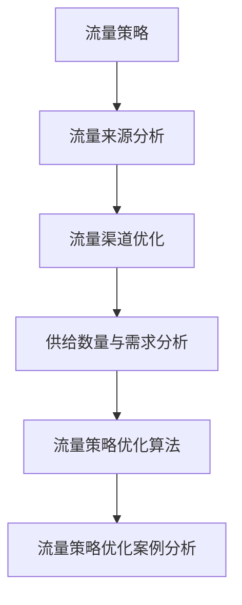

                 

# 流量策略与供给数量

> 关键词：流量策略、供给数量、需求分析、优化算法、案例分析

> 摘要：本文旨在探讨流量策略与供给数量的关系，通过深入分析流量策略的基本概念、流量来源、流量渠道优化以及供给数量与需求分析，结合实际案例，阐述流量策略优化的目标、算法以及应用场景。同时，对供给数量的优化案例进行详细解读，总结流量策略与供给数量的重要性和未来研究方向。

## 第一部分：流量策略基础

### 第1章：流量策略基础

#### 1.1 流量策略的概念与重要性

**流量策略**是指通过合理配置和优化流量资源，以达到提升用户访问量、提高业务收益等目标的一系列策略。流量策略的重要性在于它能够帮助企业或个人在竞争激烈的市场中脱颖而出，提升品牌影响力，实现可持续发展。

**流量策略的目标**主要包括：

1. 提高用户访问量
2. 增强用户体验
3. 提升转化率
4. 增加业务收益

#### 1.2 流量来源分析

流量来源可以分为以下几种类型：

1. **自然流量**：来源于搜索引擎的自然搜索结果，不受付费推广影响。
2. **付费流量**：通过付费广告投放获取的流量，如搜索引擎广告、社交媒体广告等。
3. **合作流量**：与其他网站或平台合作交换流量，扩大访问渠道。
4. **内部流量**：通过网站内部链接、邮件营销、社交媒体等渠道获取的流量。

了解不同类型的流量来源有助于企业制定更为精准的流量策略。

**流量来源分析工具**包括：

1. Google Analytics：一款功能强大的分析工具，可用于追踪网站流量来源、用户行为等。
2. 百度统计：百度提供的免费网站统计工具，用于分析网站流量、用户行为等。
3. Clicky：一款实时网站流量分析工具，提供详细的用户行为数据。

#### 1.3 流量渠道优化

流量渠道优化是指通过对不同流量渠道进行筛选、调整和优化，以提高整体流量质量和效益。以下是一些流量渠道优化的策略：

1. **关键词优化**：根据用户需求，选择合适的关键词进行优化，提高自然流量。
2. **广告投放**：合理分配广告预算，选择目标受众精准的广告渠道，提高付费流量转化率。
3. **内容营销**：通过创作高质量、有价值的内容，吸引目标用户，提升自然流量。
4. **社交媒体运营**：利用社交媒体平台，扩大品牌影响力，提高合作流量。

#### 1.4 流量策略案例分析

**案例一**：某电商网站通过优化搜索引擎关键词，提高了自然流量，并降低了广告投放成本。同时，通过社交媒体运营，增加了合作流量。

**案例二**：某企业通过数据分析，发现用户主要来自搜索引擎广告和自然流量，于是加大了广告投放力度，优化了广告文案和落地页，提高了付费流量转化率。

## 第2章：供给数量与需求分析

### 2.1 供给数量的概念

**供给数量**是指在特定时间内，企业或个人能够提供的流量资源数量。供给数量受到以下因素的影响：

1. **资源限制**：包括人力、财力、物力等资源的限制。
2. **技术水平**：企业或个人的技术水平和创新能力。
3. **市场需求**：市场需求的变化会影响供给数量的调整。

#### 2.2 需求分析的方法

**需求分析**是指通过研究用户需求和市场趋势，预测未来一段时间内的需求量。以下是一些需求分析方法：

1. **历史数据分析**：通过对过去一段时间的数据进行分析，找出需求量的变化规律。
2. **市场调研**：通过调查问卷、访谈等方式，了解用户需求和偏好。
3. **预测模型**：利用统计学和机器学习等方法，建立预测模型，预测未来需求量。

**需求分析工具**包括：

1. Excel：一款功能强大的数据处理工具，可用于数据分析和预测。
2. Python：一款流行的编程语言，拥有丰富的数据处理和机器学习库。
3. Tableau：一款数据可视化工具，可用于展示需求分析结果。

#### 2.3 供需平衡策略

**供需平衡**是指供给数量与需求量之间的平衡状态。实现供需平衡的关键在于合理调整供给数量，以满足市场需求。

1. **供给数量调整**：根据需求分析结果，调整供给数量，避免供需失衡。
2. **动态调整**：根据市场需求变化，实时调整供给数量，保持供需平衡。

#### 2.4 供给数量调整策略

**供给数量调整策略**主要包括以下几种：

1. **增量调整**：根据需求预测，逐步增加供给数量，以满足市场需求。
2. **存量调整**：通过优化供给结构，调整现有供给数量，提高供给效率。
3. **弹性调整**：根据市场需求波动，灵活调整供给数量，保持供需平衡。

**供给数量调整案例**：

**案例一**：某电商平台在春节前夕，根据历史数据和市场需求预测，增加了商品库存，确保能够满足消费者的购物需求。

**案例二**：某物流公司通过实时监控订单量，调整运输车辆和人员安排，确保物流服务的及时性和准确性。

## 第3章：流量策略优化

### 3.1 流量策略优化目标

**流量策略优化目标**主要包括以下几个方面：

1. **提高流量质量**：通过精准定位目标用户，提高用户访问量。
2. **降低流量成本**：通过优化流量来源和渠道，降低流量获取成本。
3. **提高转化率**：通过优化用户体验和营销策略，提高用户转化率。
4. **提升业务收益**：通过提升流量质量和转化率，增加业务收益。

#### 3.2 流量策略优化算法

**流量策略优化算法**主要包括以下几种：

1. **贪心算法**：通过每次选择最优解，逐步优化流量策略。
2. **动态规划**：将流量策略优化问题转化为多阶段决策问题，求解最优解。
3. **遗传算法**：模拟生物进化过程，寻找最优流量策略。

**流量策略优化算法应用**：

**案例一**：某企业通过贪心算法，优化了广告投放策略，提高了广告转化率。

**案例二**：某电商平台通过动态规划，优化了商品推荐策略，提升了用户购物体验。

#### 3.3 流量策略优化案例分析

**案例一**：某电商网站通过优化搜索引擎关键词和广告投放策略，提高了自然流量和付费流量，实现了业务收益的快速增长。

**案例二**：某企业通过分析用户行为数据，优化了网站页面设计和内容布局，提升了用户访问量和转化率。

## 第4章：流量策略应用场景

### 4.1 市场营销策略

**流量策略在市场营销中的应用**主要包括以下几个方面：

1. **搜索引擎优化（SEO）**：通过优化网站内容和结构，提高搜索引擎排名，吸引自然流量。
2. **搜索引擎营销（SEM）**：通过付费广告投放，提高网站曝光度和访问量。
3. **内容营销**：通过创作有价值、有吸引力的内容，吸引目标用户，提高自然流量。
4. **社交媒体营销**：利用社交媒体平台，扩大品牌影响力，提高合作流量。

**市场营销策略案例分析**：

**案例一**：某企业通过SEO和SEM策略，提高了网站流量和转化率，实现了业务增长。

**案例二**：某电商网站通过内容营销和社交媒体营销，提升了品牌知名度和用户黏性。

### 4.2 营销自动化策略

**流量策略在营销自动化中的应用**主要包括以下几个方面：

1. **自动化营销**：通过自动化工具，实现邮件营销、社交媒体营销等，提高营销效率和效果。
2. **用户画像**：通过数据分析，构建用户画像，实现精准营销。
3. **客户关系管理（CRM）**：通过CRM系统，管理客户信息，提高客户满意度和忠诚度。

**营销自动化策略案例分析**：

**案例一**：某企业通过自动化营销工具，提高了邮件营销的转化率，降低了营销成本。

**案例二**：某电商平台通过用户画像和CRM系统，实现了个性化推荐和精准营销。

### 4.3 数据驱动的流量策略

**数据驱动的流量策略**是指通过分析用户行为数据、市场趋势数据等，制定和调整流量策略。

**数据驱动流量策略案例分析**：

**案例一**：某电商网站通过分析用户行为数据，优化了商品推荐算法，提高了用户购物体验和转化率。

**案例二**：某企业通过市场趋势数据，预测未来市场需求，调整供给数量，实现了供需平衡和业务增长。

## 第5章：供给数量优化案例

### 5.1 电商供应链优化

**电商供应链中供给数量优化策略**主要包括以下几个方面：

1. **库存管理**：根据需求预测，合理调整库存水平，避免库存过剩或缺货。
2. **物流配送**：优化物流配送网络，提高配送效率和准确性。
3. **供应链协同**：加强与供应商、物流公司等合作伙伴的协同，实现供应链优化。

**电商供应链优化案例分析**：

**案例一**：某电商企业通过优化库存管理和物流配送，提高了供应链效率，降低了运营成本。

**案例二**：某电商平台通过供应链协同，实现了快速响应市场需求，提升了用户满意度。

### 5.2 物流配送优化

**物流配送中供给数量优化策略**主要包括以下几个方面：

1. **配送路线优化**：通过算法优化配送路线，提高配送效率。
2. **配送资源调配**：根据配送需求，合理调配配送车辆和人员。
3. **配送节点优化**：优化配送节点布局，降低配送距离和时间。

**物流配送优化案例分析**：

**案例一**：某物流公司通过配送路线优化，提高了配送效率，降低了配送成本。

**案例二**：某快递公司通过配送节点优化，缩短了配送时间，提升了用户满意度。

### 5.3 能源供给优化

**能源供给中供给数量优化策略**主要包括以下几个方面：

1. **能源需求预测**：通过数据分析，预测能源需求，合理调整能源供给。
2. **能源供应网络优化**：优化能源供应网络，提高能源供应稳定性和可靠性。
3. **能源消耗管理**：通过节能措施和管理，降低能源消耗。

**能源供给优化案例分析**：

**案例一**：某电力公司通过能源需求预测，优化了能源供给，提高了供电质量。

**案例二**：某能源企业通过能源供应网络优化，提高了能源供应效率和稳定性。

## 第6章：流量策略与供给数量综合应用

### 6.1 跨行业案例分析

**跨行业流量策略与供给数量综合应用案例**：

**案例一**：某餐饮企业与电商平台合作，通过流量策略优化，提高了线上订单量和线下门店营业额。同时，通过供给数量优化，实现了供应链管理和物流配送的优化。

**案例二**：某能源公司与互联网企业合作，通过数据驱动的流量策略，优化了能源供给和消费，提高了能源利用效率。

### 6.2 未来趋势探讨

**未来趋势探讨**：

1. **数字化与智能化**：随着数字化和智能化技术的发展，流量策略与供给数量将更加依赖于大数据和人工智能技术。
2. **跨界合作**：跨行业合作将越来越普遍，流量策略与供给数量将融合多种行业特点和优势。
3. **可持续发展**：在环保和可持续发展的背景下，流量策略与供给数量将更加注重资源利用效率和环保性。

### 6.3 挑战与机遇

**挑战与机遇**：

1. **数据隐私与安全**：在数据驱动的流量策略中，如何保障数据隐私和安全是面临的挑战。
2. **技术竞争**：随着技术的快速发展，企业需要不断创新，以应对激烈的市场竞争。
3. **用户体验**：在供给数量优化过程中，如何提升用户体验，满足用户需求是关键。

## 第7章：总结与展望

### 7.1 流量策略与供给数量的重要性

**流量策略与供给数量**在当今数字时代具有非常重要的地位。通过合理的流量策略，企业可以吸引更多用户，提高业务收益；通过供给数量优化，企业可以降低运营成本，提高资源利用效率。因此，流量策略与供给数量已经成为企业竞争的重要手段。

### 7.2 未来研究方向

**未来研究方向**主要包括：

1. **大数据与人工智能**：如何利用大数据和人工智能技术，优化流量策略和供给数量。
2. **跨界融合**：如何实现跨行业的流量策略与供给数量优化。
3. **可持续发展**：如何实现流量策略与供给数量的绿色、可持续化发展。

## 附录

### 附录 A：流量策略与供给数量相关资源

**书籍**：

1. 《流量战争：电商运营实战解析》
2. 《大数据营销：从数据到决策》
3. 《供应链管理：战略、规划与运营》

**论文**：

1. "Data-Driven Demand Forecasting for Supply Chain Optimization"
2. "An Overview of Artificial Intelligence in Marketing"
3. "The Role of Digital Marketing in Business Growth"

**工具**：

1. Google Analytics
2. Tableau
3. Python

### 附录 B：Mermaid 流程图示例

**流量策略优化流程图**：



### 附录 C：伪代码示例

**流量策略优化算法伪代码**：

```python
# 初始化流量策略参数
initialize_strategy_params()

# 流量来源分析
analyze_traffic_sources()

# 流量渠道优化
optimize_traffic_channels()

# 供给数量与需求分析
analyze_demand()

# 流量策略优化算法
optimize_traffic_strategy()

# 流量策略优化案例分析
case_study_analysis()
```

### 附录 D：数学模型与公式

**供需平衡模型**：

$$
供需平衡 = f(供给数量，需求量)
$$

**流量转化率模型**：

$$
流量转化率 = \frac{转化量}{流量量} \times 100\%
$$

### 附录 E：项目实战案例

**项目实战案例**：

1. **电商供应链优化**：通过大数据分析，优化库存管理和物流配送，提高供应链效率。
2. **市场营销自动化**：利用营销自动化工具，实现精准营销，提高营销效果。

### 附录 F：代码分析与解读

**代码分析与解读**：

1. **电商供应链优化代码**：分析代码结构，解读库存管理和物流配送的核心算法。
2. **营销自动化代码**：分析代码实现，解读营销自动化工具的核心功能。

## 作者信息

**作者**：AI天才研究院/AI Genius Institute & 禅与计算机程序设计艺术 /Zen And The Art of Computer Programming

