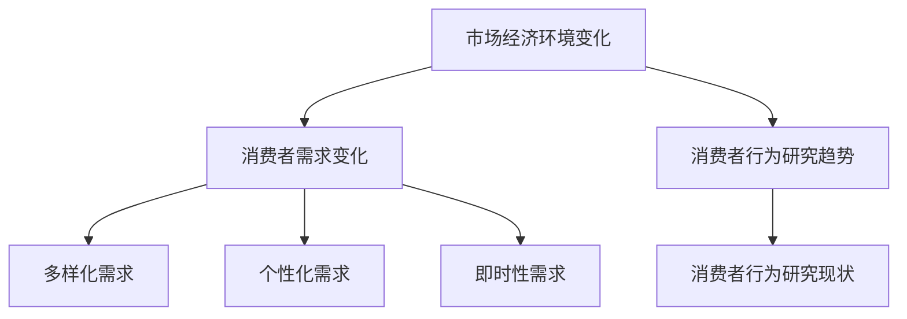
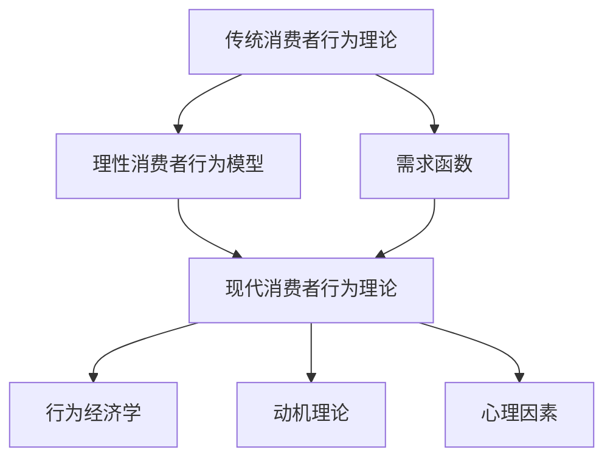
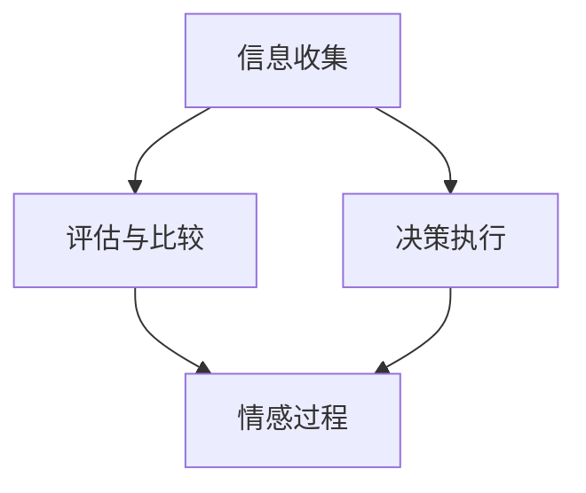
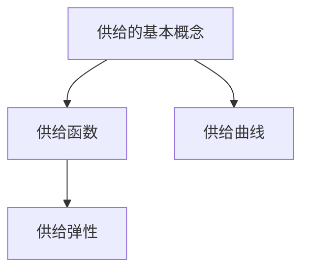
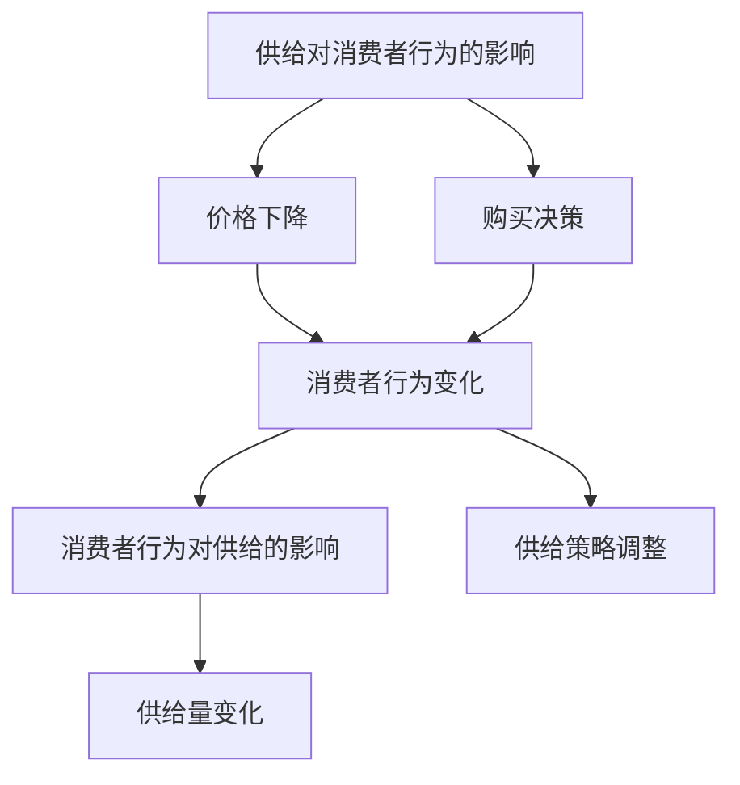
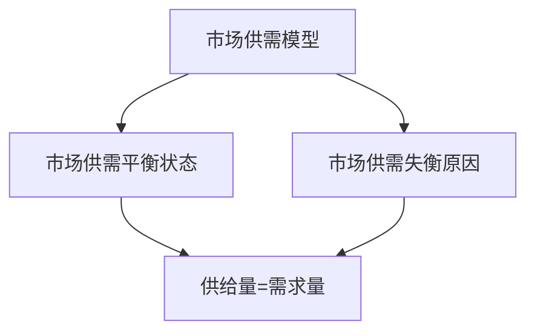
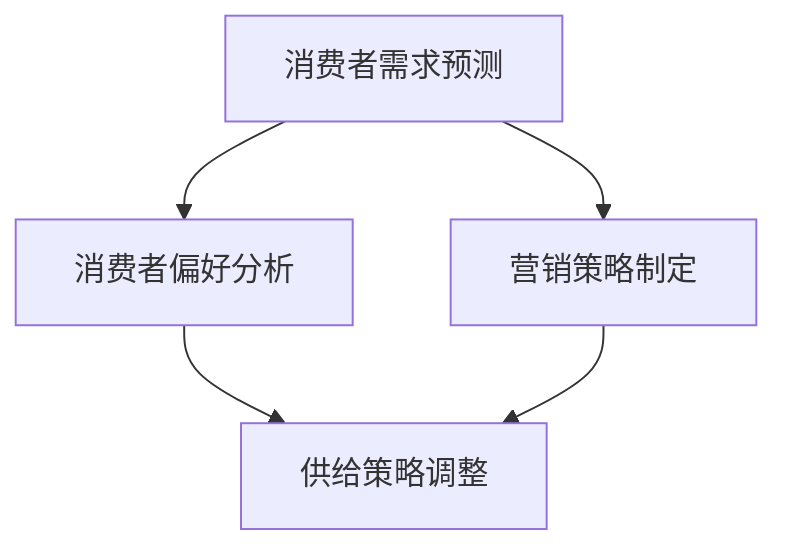
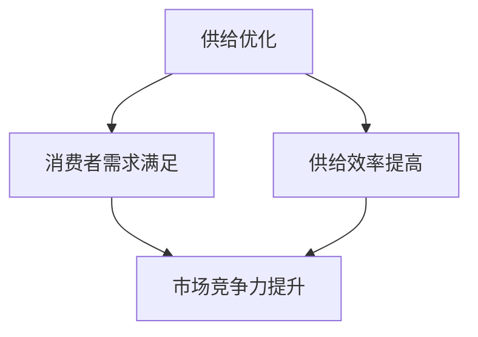
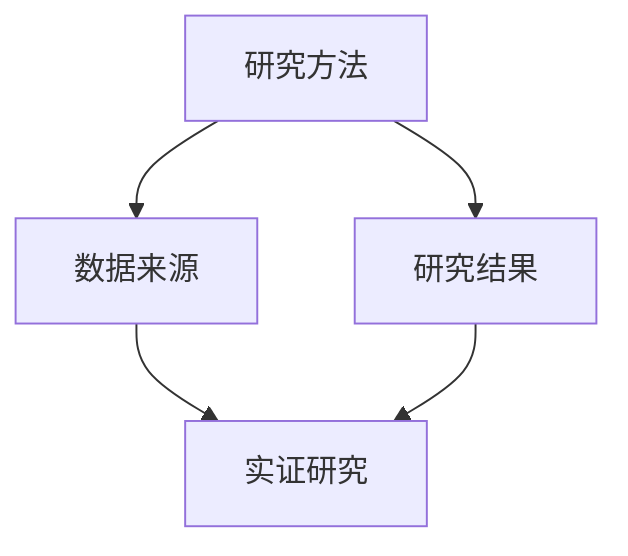
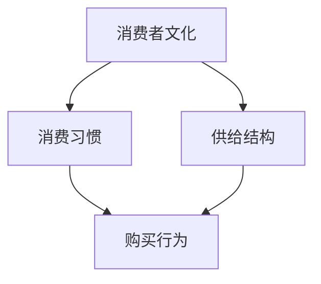

                 

# 文章标题：消费者行为分析与供给

> 关键词：消费者行为、供给理论、数据分析、消费者决策模型、市场营销策略

> 摘要：本文旨在深入探讨消费者行为与供给之间的相互作用关系，通过解析消费者行为理论、供给理论以及数据分析方法，构建消费者行为分析模型。文章首先介绍了消费者行为研究的背景与意义，随后详细阐述了消费者行为理论的发展历程与主要流派，接着分析了消费者行为影响因素，并介绍了消费者行为数据挖掘与分析的方法。在此基础上，文章探讨了供给与消费者行为的关系，分析了市场供需平衡，并提出了基于消费者行为的供给策略。最后，文章通过实际案例研究和国际比较，探讨了消费者行为与供给的法律法规与伦理问题，为市场营销实践提供了理论指导。

----------------------------------------------------------------

## 第一部分：引言

### 1.1 研究背景与意义

消费者行为研究是市场营销领域的重要研究方向之一。随着市场经济的发展，消费者的需求行为也在不断变化。因此，研究消费者行为对于企业制定有效的营销策略具有重要意义。

**核心概念与联系：**  
- 消费者行为研究的现状与趋势：当前消费者行为研究主要关注消费者需求的多样性和个性化。
- 市场经济环境变化：全球化、互联网化等因素对消费者行为产生了深远影响。
- 消费者需求变化：消费者的需求变得更加多样化、个性化和即时性。

**Mermaid 流程图：**



### 1.1.2 消费者行为研究在市场中的应用

消费者行为研究在市场中的应用主要包括市场调研、消费者需求预测、产品开发和营销策略制定等方面。

**核心算法原理讲解：**  
- 市场调研分析方法：通过问卷调查、深度访谈等方式收集消费者行为数据。
- 消费者行为预测模型：利用统计学和机器学习算法对消费者行为进行预测。

**伪代码示例：**

```python
def predict_behavior(data):
    # 数据预处理
    preprocessed_data = preprocess_data(data)
    
    # 特征提取
    features = extract_features(preprocessed_data)
    
    # 训练模型
    model = train_model(features)
    
    # 预测
    prediction = model.predict(new_data)
    
    return prediction
```

### 1.1.3 本书的研究目的与结构安排

本书的研究目的是通过深入分析消费者行为与供给之间的关系，为市场营销实践提供理论指导和实际案例支持。本书的结构安排如下：

1. 引言
2. 消费者行为理论概述
3. 消费者行为分析模型
4. 供给与消费者行为的关系分析
5. 消费者行为分析与供给策略
6. 消费者行为与供给的国际比较
7. 消费者行为分析与供给的法律法规与伦理
8. 案例研究
9. 参考文献

## 1.2 消费者行为理论概述

### 1.2.1 消费者行为理论的发展历程

消费者行为理论的发展历程可以分为传统消费者行为理论和现代消费者行为理论两个阶段。

**核心概念与联系：**  
- 传统消费者行为理论：主要包括理性消费者行为模型和需求函数。
- 现代消费者行为理论：在传统消费者行为理论的基础上，加入了行为经济学、动机理论和心理因素等。

**Mermaid 流�程图：**



### 1.2.2 消费者行为理论的主要流派

消费者行为理论的主要流派包括理性消费者行为模型、行为经济学模型、动机理论等。

**核心算法原理讲解：**  
- 理性消费者行为模型：基于经济学原理，假设消费者在决策过程中是理性的，追求效用最大化。
- 动机理论：认为消费者行为受到内在动机的驱动，动机的强度和方向决定了消费者的行为。

**伪代码示例：**

```python
def rational_consumer_behavior(income, utility):
    # 计算消费者效用
    utility = calculate_utility(income)
    
    # 选择最大化效用的消费方案
    optimal_choice = choose_max_utility(utility)
    
    return optimal_choice

def motivated_consumer_behavior(motivation, behavior):
    # 计算动机强度
    motivation_strength = calculate_motivation_strength(motivation)
    
    # 根据动机强度调整行为
    adjusted_behavior = adjust_behavior(behavior, motivation_strength)
    
    return adjusted_behavior
```

### 1.2.3 消费者行为理论的联系与区别

消费者行为理论之间既有联系又有区别。传统消费者行为理论主要关注消费者的理性决策过程，而现代消费者行为理论则更加注重消费者的心理和行为动机。

**数学模型和数学公式：**

消费者剩余：

$$
\text{消费者剩余} = \text{消费者愿意支付的价格} - \text{实际支付的价格}
$$

**举例说明：**

如果一个消费者愿意支付100元购买一件商品，但最终以80元购买，则其消费者剩余为20元。

## 第二部分：消费者行为分析模型

### 2.1 消费者决策模型

消费者决策模型用于分析消费者在购买决策过程中的行为。

**核心概念与联系：**  
- 认知过程：消费者在决策过程中对信息的收集、处理和评估。
- 情感过程：消费者的情感状态对决策过程的影响。

**Mermaid 流程图：**



### 2.1.2 消费者偏好与需求分析

消费者偏好与需求分析是消费者行为分析的核心内容之一。

**核心算法原理讲解：**  
- 消费者偏好模型：用于分析消费者对不同产品和服务的偏好程度。
- 需求函数：用于描述消费者在不同价格水平下的需求量。

**伪代码示例：**

```python
def consumer_preference(products, preferences):
    # 计算消费者偏好得分
    preference_scores = calculate_preference_scores(products, preferences)
    
    # 选择偏好最高的产品
    chosen_product = select_max_preference(preference_scores)
    
    return chosen_product

def demand_function(price, quantity):
    # 计算需求量
    demand = calculate_demand(price, quantity)
    
    return demand
```

### 2.1.3 消费者行为预测模型

消费者行为预测模型用于预测消费者未来的行为。

**数学模型和数学公式：**

预测概率：

$$
\text{预测概率} = \frac{\text{符合偏好条件的案例数}}{\text{总案例数}}
$$

**举例说明：**

如果有100个案例，其中60个案例符合消费者偏好，则预测概率为0.6。

----------------------------------------------------------------

## 第三部分：供给与消费者行为的关系分析

### 3.1 供给理论概述

供给理论是经济学中研究产品和服务供给行为的基本理论。供给理论关注供给量与价格之间的关系，以及影响供给量的因素。

**核心概念与联系：**  
- 供给的基本概念：供给是指生产者在一定时间内，在特定价格水平下愿意并且能够提供的商品或服务的数量。
- 供给函数：供给函数描述了供给量与价格之间的关系。
- 供给曲线：供给曲线是供给函数的图形表示，通常为正斜率的曲线。

**Mermaid 流程图：**



### 3.1.2 供给函数与供给曲线

供给函数描述了生产者在不同价格水平下愿意提供的商品或服务的数量。供给曲线则是供给函数的图形表示。

**数学模型和数学公式：**

供给函数：

$$
Q_s = f(p)
$$

其中，$Q_s$ 表示供给量，$p$ 表示价格，$f$ 表示供给函数。

供给曲线：

$$
\text{供给曲线}: Q_s(p) = \int f(p) dp
$$

**举例说明：**

假设供给函数为 $Q_s(p) = 2p + 10$，则供给曲线为 $Q_s(p) = 2p + 10$。当价格 $p = 10$ 时，供给量为 $Q_s(10) = 2 \times 10 + 10 = 30$。

### 3.1.3 供给弹性分析

供给弹性是指供给量对价格变动的敏感程度。供给弹性分为供给价格弹性和供给收入弹性。

**数学模型和数学公式：**

供给价格弹性：

$$
\text{供给价格弹性} = \frac{dQ_s / dp}{Q_s / p}
$$

供给收入弹性：

$$
\text{供给收入弹性} = \frac{dQ_s / di}{Q_s / i}
$$

**举例说明：**

假设供给函数为 $Q_s(p) = 2p + 10$，价格 $p = 10$，供给量为 $Q_s(10) = 30$。则供给价格弹性为：

$$
\text{供给价格弹性} = \frac{dQ_s / dp}{Q_s / p} = \frac{2}{30 / 10} = \frac{2}{3}
$$

### 3.2 供给与消费者行为的互动关系

供给与消费者行为之间存在密切的互动关系。供给的变化会影响消费者行为，消费者行为的变化也会影响供给。

**核心概念与联系：**  
- 供给对消费者行为的影响：供给的增加会降低产品价格，从而影响消费者的购买决策。
- 消费者行为对供给的影响：消费者的需求变化会促使生产者调整供给策略。

**Mermaid 流程图：**



### 3.2.1 供给对消费者行为的影响

供给的增加会导致产品价格下降，从而刺激消费者的购买欲望。相反，供给的减少会导致产品价格上涨，抑制消费者的购买欲望。

**核心算法原理讲解：**  
- 供给函数与价格关系：供给函数描述了供给量与价格之间的关系，通常为正斜率。
- 消费者决策模型：消费者决策模型用于分析消费者在不同价格水平下的购买决策。

**伪代码示例：**

```python
def supply_effects(price, demand):
    # 计算价格变化
    price_change = calculate_price_change(price)
    
    # 计算需求变化
    demand_change = calculate_demand_change(demand, price_change)
    
    return demand_change
```

### 3.2.2 消费者行为对供给的影响

消费者行为的变化会促使生产者调整供给策略。例如，消费者对某种产品的需求增加，生产者会增加该产品的供给量；消费者对某种产品的需求减少，生产者会减少该产品的供给量。

**核心算法原理讲解：**  
- 消费者需求预测模型：用于预测消费者对产品的需求量。
- 供给策略调整模型：用于分析消费者需求变化对供给策略的影响。

**伪代码示例：**

```python
def consumer_behavior_effects(demand, supply):
    # 预测消费者需求变化
    predicted_demand = predict_demand(demand)
    
    # 调整供给策略
    adjusted_supply = adjust_supply(supply, predicted_demand)
    
    return adjusted_supply
```

### 3.2.3 供给与消费者行为的协同效应

供给与消费者行为之间存在协同效应，即供给的增加可以促进消费者行为，消费者行为的增加也可以促进供给。

**核心算法原理讲解：**  
- 供需协同效应模型：用于分析供给与消费者行为的协同作用。
- 供需平衡模型：用于分析供需平衡状态下的供给与消费者行为。

**伪代码示例：**

```python
def协同效应(model, supply, demand):
    # 计算供给与消费者行为的协同效应
    synergy_effect = calculate_synergy_effect(model, supply, demand)
    
    # 调整供给策略以实现协同效应
    adjusted_supply = adjust_supply(supply, synergy_effect)
    
    return adjusted_supply
```

## 3.3 市场供需平衡分析

市场供需平衡是指供给量与需求量相等的状态。市场供需平衡是市场经济运行的基本条件。

**核心概念与联系：**  
- 市场供需模型：用于分析市场供需关系。
- 市场供需平衡状态：市场供需模型达到平衡时的状态。
- 市场供需失衡的原因：供需失衡可能由供需结构不合理、市场信息不对称等原因导致。

**Mermaid 流程图：**



### 3.3.1 市场供需模型建立

市场供需模型用于描述市场供需关系，包括供给函数和需求函数。

**数学模型和数学公式：**

供给函数：

$$
Q_s = f(p)
$$

需求函数：

$$
Q_d = g(p)
$$

**举例说明：**

假设供给函数为 $Q_s(p) = 2p + 10$，需求函数为 $Q_d(p) = 100 - p$。则市场供需平衡时的价格和供给量为：

$$
Q_s = Q_d
$$

$$
2p + 10 = 100 - p
$$

$$
3p = 90
$$

$$
p = 30
$$

$$
Q_s = Q_d = 2 \times 30 + 10 = 80
$$

### 3.3.2 市场供需平衡状态分析

市场供需平衡状态是指供给量与需求量相等的状态。在市场供需平衡状态下，市场价格稳定，消费者能够满足需求，生产者能够实现盈利。

**核心算法原理讲解：**  
- 供需平衡模型：用于分析市场供需平衡状态。
- 均衡价格和均衡供给量的计算方法。

**伪代码示例：**

```python
def market_equilibrium(supply_function, demand_function):
    # 求解供给函数和需求函数的交点
    intersection = solve_equation(supply_function, demand_function)
    
    # 计算均衡价格和均衡供给量
    equilibrium_price = intersection['price']
    equilibrium_supply = supply_function(equilibrium_price)
    
    return equilibrium_price, equilibrium_supply
```

### 3.3.3 市场供需失衡的原因与对策

市场供需失衡可能由供需结构不合理、市场信息不对称、政策干预等原因导致。

**核心算法原理讲解：**  
- 供需失衡原因分析：通过数据分析方法分析供需失衡的原因。
- 供需失衡对策：根据供需失衡的原因制定相应的对策。

**伪代码示例：**

```python
def analyze失衡原因(data):
    # 分析供需失衡原因
    reasons = analyze_data(data)
    
    return reasons

def apply对策(reasons):
    # 根据供需失衡原因制定对策
    strategies = generate_strategies(reasons)
    
    return strategies
```

## 第四部分：消费者行为分析与供给策略

### 4.1 消费者行为分析在企业供给策略中的应用

消费者行为分析在企业供给策略中的应用主要包括消费者需求预测、消费者偏好分析、消费者行为数据在营销策略中的应用等方面。

**核心概念与联系：**  
- 消费者需求预测：通过消费者行为数据分析预测消费者未来的需求。
- 消费者偏好分析：通过消费者行为数据分析消费者对不同产品和服务的偏好。
- 营销策略制定：根据消费者行为分析结果制定针对性的营销策略。

**Mermaid 流程图：**



### 4.1.1 消费者需求预测与供给策略

消费者需求预测是企业供给策略制定的重要依据。通过消费者行为数据分析，可以预测消费者未来的需求趋势，从而制定相应的供给策略。

**核心算法原理讲解：**  
- 时间序列分析方法：用于分析消费者需求的变化趋势。
- 聚类分析方法：用于分析消费者群体的特征和需求差异。

**伪代码示例：**

```python
def predict_demand(data):
    # 时间序列分析
    trend = analyze_trend(data)
    
    # 聚类分析
    clusters = analyze_clusters(data)
    
    # 预测未来需求
    future_demand = predict_future_demand(trend, clusters)
    
    return future_demand
```

### 4.1.2 消费者偏好分析在产品开发中的应用

消费者偏好分析可以帮助企业了解消费者对不同产品和服务的偏好，从而指导产品开发。

**核心算法原理讲解：**  
- 调查问卷分析方法：通过问卷调查收集消费者偏好数据。
- 多项式回归分析方法：用于分析消费者偏好与产品特征之间的关系。

**伪代码示例：**

```python
def analyze_preference(data):
    # 问卷调查分析
    survey_results = analyze_survey(data)
    
    # 多项式回归分析
    regression_results = perform_polynomial_regression(survey_results)
    
    # 分析消费者偏好
    preference_analysis = analyze_regression_results(regression_results)
    
    return preference_analysis
```

### 4.1.3 消费者行为数据在营销策略中的应用

消费者行为数据是营销策略制定的重要依据。通过分析消费者行为数据，可以了解消费者的需求和偏好，从而制定针对性的营销策略。

**核心算法原理讲解：**  
- 分段回归分析方法：用于分析消费者在不同阶段的行为特征。
- 模式识别方法：用于识别消费者的行为模式。

**伪代码示例：**

```python
def analyze_marketing_strategy(data):
    # 分段回归分析
    segment_results = perform分段_regression(data)
    
    # 模式识别
    patterns = identify_patterns(segment_results)
    
    # 制定营销策略
    marketing_strategy = create_marketing_strategy(patterns)
    
    return marketing_strategy
```

## 4.2 基于消费者行为的供给优化策略

基于消费者行为的供给优化策略旨在通过分析消费者行为数据，优化企业的供给策略，提高供给效率和市场竞争力。

**核心概念与联系：**  
- 供给优化：通过分析消费者行为数据，优化企业的供给量、供给结构和供给方式。
- 消费者需求满足：通过优化供给策略，提高消费者需求的满足程度。

**Mermaid 流程图：**



### 4.2.1 消费者行为对供给策略的影响

消费者行为对供给策略的影响主要体现在消费者需求的变动、消费者偏好的变化以及消费者购买行为的变化。

**核心算法原理讲解：**  
- 消费者需求预测：通过时间序列分析和聚类分析预测消费者需求的变动。
- 消费者偏好分析：通过问卷调查和多项式回归分析分析消费者偏好的变化。
- 消费者购买行为分析：通过模式识别和分段回归分析分析消费者购买行为的变化。

**伪代码示例：**

```python
def analyze_consumer_behavior(data):
    # 需求预测
    demand_prediction = predict_demand(data)
    
    # 偏好分析
    preference_analysis = analyze_preference(data)
    
    # 购买行为分析
    purchase_behavior = analyze_purchase_behavior(data)
    
    return demand_prediction, preference_analysis, purchase_behavior
```

### 4.2.2 供给策略优化方法

供给策略优化方法主要包括需求预测、供给量优化、供给结构优化和供给方式优化等方面。

**核心算法原理讲解：**  
- 需求预测：通过时间序列分析和聚类分析预测消费者需求的变动。
- 供给量优化：通过成本效益分析和利润最大化分析确定最优供给量。
- 供给结构优化：通过多目标优化分析和协同效应分析优化供给结构。
- 供给方式优化：通过敏捷制造和供应链管理优化供给方式。

**伪代码示例：**

```python
def optimize_supply_strategy(data):
    # 需求预测
    demand_prediction = predict_demand(data)
    
    # 供给量优化
    optimal_supply = optimize_supply_quantity(demand_prediction)
    
    # 供给结构优化
    optimal_supply_structure = optimize_supply_structure(demand_prediction)
    
    # 供给方式优化
    optimal_supply_method = optimize_supply_method(demand_prediction)
    
    return optimal_supply, optimal_supply_structure, optimal_supply_method
```

### 4.2.3 供给策略优化的案例分析

通过实际案例研究，可以验证基于消费者行为的供给优化策略的有效性。

**核心算法原理讲解：**  
- 数据收集：通过市场调研、消费者问卷调查等方式收集消费者行为数据。
- 数据分析：通过时间序列分析、聚类分析、多项式回归分析和模式识别等方法分析消费者行为数据。
- 结果验证：通过比较优化前后供给策略的绩效指标，验证供给策略优化的有效性。

**伪代码示例：**

```python
def case_study(data):
    # 数据收集
    collected_data = collect_data(data)
    
    # 数据分析
    analyzed_data = analyze_data(collected_data)
    
    # 结果验证
    performance_comparison = compare_performance(analyzed_data)
    
    return performance_comparison
```

## 4.3 消费者行为分析与供给策略的实证研究

消费者行为分析与供给策略的实证研究旨在通过实际案例分析，验证消费者行为分析在供给策略制定中的应用效果。

**核心概念与联系：**  
- 研究方法：通过定量分析和定性分析相结合的方法，对消费者行为与供给策略之间的关系进行实证研究。
- 数据来源：通过市场调研、消费者问卷调查、销售数据等方式收集消费者行为数据。
- 研究结果：分析消费者行为数据，验证基于消费者行为的供给策略的有效性。

**Mermaid 流程图：**



### 4.3.1 研究方法与数据来源

研究方法主要包括定量分析和定性分析两种方法。定量分析主要通过统计学和机器学习算法对消费者行为数据进行分析，定性分析主要通过深度访谈和问卷调查等方式收集消费者对供给策略的看法和建议。

数据来源主要包括市场调研数据、消费者问卷调查数据和销售数据等。市场调研数据可以通过市场调查公司收集，消费者问卷调查数据可以通过线上问卷平台收集，销售数据可以通过企业内部管理系统收集。

### 4.3.2 研究结果与讨论

研究结果主要分析消费者行为数据，包括消费者需求、消费者偏好、消费者购买行为等方面的数据。通过分析这些数据，可以得出以下结论：

1. 消费者需求呈现多样化、个性化和即时化的趋势。
2. 消费者偏好受到产品特征、价格、品牌等因素的影响。
3. 消费者购买行为受到促销活动、价格优惠等因素的驱动。

基于消费者行为分析的结果，可以制定针对性的供给策略，包括优化产品组合、调整价格策略、提高服务质量等方面。这些策略可以有效地提高消费者满意度，增加市场份额。

### 4.3.3 政策建议与未来研究方向

政策建议主要包括以下几个方面：

1. 加强消费者行为数据收集和分析，提高供给策略的精准性。
2. 加强消费者权益保护，提高消费者对供给策略的满意度。
3. 加强市场监管，规范供给行为，维护市场秩序。

未来研究方向主要包括以下几个方面：

1. 深入研究消费者行为与供给策略之间的复杂关系，提高供给策略的科学性。
2. 探索消费者行为分析在新兴市场和应用场景中的应用。
3. 加强消费者行为数据分析方法的研发，提高数据分析的准确性和可靠性。

## 第五部分：消费者行为与供给的国际比较

### 5.1 消费者行为与供给的国际差异

消费者行为与供给在不同国家和地区之间存在明显的差异。这些差异主要体现在消费者文化、消费习惯、供给结构等方面。

**核心概念与联系：**  
- 消费者文化：不同国家和地区的消费者文化差异，影响消费者的购买行为和偏好。
- 消费习惯：不同国家和地区的消费者消费习惯差异，影响消费者的购买决策。
- 供给结构：不同国家和地区的供给结构差异，影响供给策略的制定和实施。

**Mermaid 流程图：**



### 5.1.1 消费者行为文化的国际差异

消费者行为文化的国际差异主要体现在以下几个方面：

1. 消费观念：不同国家和地区的消费者消费观念差异，如崇尚节约、追求奢华、重视品质等。
2. 消费习惯：不同国家和地区的消费者消费习惯差异，如购物习惯、支付方式、消费场景等。
3. 消费者群体：不同国家和地区的消费者群体差异，如年龄、性别、收入等。

### 5.1.2 供给策略的国际差异

供给策略的国际差异主要体现在以下几个方面：

1. 产品定位：不同国家和地区的供给策略在产品定位上存在差异，如高端产品、中端产品、低端产品等。
2. 价格策略：不同国家和地区的供给策略在价格策略上存在差异，如高价策略、低价策略、灵活定价策略等。
3. 营销策略：不同国家和地区的供给策略在营销策略上存在差异，如广告宣传、促销活动、品牌推广等。

### 5.1.3 消费者行为与供给的国际比较分析

消费者行为与供给的国际比较分析旨在了解不同国家和地区消费者行为与供给的差异，为企业在国际市场上的供给策略制定提供参考。

**核心算法原理讲解：**  
- 多元文化分析：通过比较不同国家和地区的消费者文化差异，分析消费者行为的特点。
- 消费者需求预测：通过比较不同国家和地区的消费者需求差异，预测消费者需求的变动趋势。
- 供给策略优化：通过比较不同国家和地区的供给策略差异，优化企业的供给策略。

**伪代码示例：**

```python
def international_comparison(consumer_data, supply_strategy):
    # 多元文化分析
    cultural_analysis = analyze_cultural_difference(consumer_data)
    
    # 消费者需求预测
    demand_prediction = predict_demand(consumer_data)
    
    # 供给策略优化
    optimal_supply_strategy = optimize_supply_strategy(demand_prediction)
    
    return cultural_analysis, demand_prediction, optimal_supply_strategy
```

## 5.2 国际消费者行为与供给趋势

国际消费者行为与供给趋势主要体现在以下几个方面：

1. 消费者行为全球化：随着全球化进程的加快，消费者行为呈现出国际化的趋势，消费者对国际品牌和产品的需求增加。
2. 供给全球化：随着全球化进程的加快，供给也呈现出全球化的趋势，企业通过跨国经营和全球供应链管理，实现资源的优化配置和成本的有效控制。
3. 新兴市场崛起：新兴市场国家消费者需求的快速增长，为国际消费者行为与供给带来了新的机遇和挑战。

### 5.2.1 消费者行为国际化的趋势

消费者行为国际化的趋势主要体现在以下几个方面：

1. 消费者需求多样化：消费者需求的多样化趋势，要求企业提供更多样化的产品和服务。
2. 消费者购买行为变化：消费者购买行为的变化，如线上购物、跨境购物的增加，要求企业调整供给策略。
3. 消费者文化融合：消费者文化的融合，要求企业尊重不同国家和地区的消费者文化，制定差异化的供给策略。

### 5.2.2 供给全球化的趋势

供给全球化的趋势主要体现在以下几个方面：

1. 跨国经营：企业通过跨国经营，实现全球化布局，提高市场竞争力。
2. 全球供应链管理：企业通过全球供应链管理，优化供应链结构，提高供应链效率。
3. 全球资源配置：企业通过全球资源配置，实现资源的最优配置，降低成本。

### 5.2.3 国际消费者行为与供给的未来展望

国际消费者行为与供给的未来展望主要包括以下几个方面：

1. 消费者行为将继续全球化，消费者需求的多样化、个性化和即时化趋势将更加明显。
2. 供给将更加全球化，企业将通过全球化布局和全球供应链管理，提高市场竞争力。
3. 新兴市场国家消费者需求的快速增长，将为国际消费者行为与供给带来新的机遇。
4. 消费者行为与供给的互动关系将更加密切，消费者行为的变化将影响供给策略的制定和实施。

## 第六部分：消费者行为分析与供给的法律法规与伦理

### 6.1 消费者行为分析与供给的法律法规

消费者行为分析与供给的法律法规是保障消费者权益和市场秩序的重要手段。这些法律法规主要包括以下几个方面：

1. 消费者权益保护法律法规：如《消费者权益保护法》、《产品质量法》等，旨在保护消费者的合法权益，规范消费者行为。
2. 供给市场监管法律法规：如《反垄断法》、《反不正当竞争法》等，旨在规范供给市场秩序，防止垄断行为和不正当竞争。
3. 数据保护法律法规：如《数据安全法》、《个人信息保护法》等，旨在保护消费者数据安全和个人隐私。

### 6.1.1 消费者权益保护法律法规

消费者权益保护法律法规主要包括以下几个方面：

1. 消费者权益保护原则：如公平交易原则、诚实守信原则、消费者自主选择原则等。
2. 消费者权益保护内容：如消费者知情权、选择权、安全权、投诉权等。
3. 消费者权益保护措施：如消费者投诉处理、消费者权益保护监管等。

### 6.1.2 供给市场监管法律法规

供给市场监管法律法规主要包括以下几个方面：

1. 市场准入管理：如企业注册、经营许可、市场监管等。
2. 市场行为规范：如禁止垄断行为、禁止不正当竞争行为等。
3. 市场监管措施：如市场监管机构设置、市场监管手段等。

### 6.1.3 消费者行为分析与供给的法律规范

消费者行为分析与供给的法律规范主要包括以下几个方面：

1. 数据收集与使用：如消费者数据收集、处理、使用的合法性和合规性。
2. 消费者隐私保护：如消费者个人信息保护、隐私权保护等。
3. 消费者权益保护：如消费者权益受损时的赔偿和救济。

## 6.2 消费者行为分析与供给的伦理问题

消费者行为分析与供给的伦理问题主要包括消费者数据隐私保护、消费者权益保护、社会责任等方面。

### 6.2.1 消费者数据隐私与保护

消费者数据隐私与保护是消费者行为分析与供给中一个重要的伦理问题。消费者数据包括个人身份信息、消费记录、行为数据等，这些数据对于企业进行市场分析、产品开发和营销策略制定具有重要意义。

**核心概念与联系：**  
- 数据收集：企业在进行消费者行为分析时，需要收集大量的消费者数据。
- 数据使用：企业在使用消费者数据时，需要确保数据的安全和隐私。
- 数据保护：企业需要采取措施保护消费者数据，防止数据泄露和滥用。

### 6.2.2 消费者行为分析与供给的社会责任

消费者行为分析与供给的社会责任是企业应承担的责任。企业需要关注消费者权益，遵守法律法规，承担社会责任。

**核心概念与联系：**  
- 消费者权益保护：企业需要保护消费者的合法权益，提供优质的产品和服务。
- 社会责任：企业需要关注社会问题，积极参与社会公益活动，为社会作出贡献。

### 6.2.3 伦理问题在消费者行为分析与供给中的应用

伦理问题在消费者行为分析与供给中的应用主要体现在以下几个方面：

1. 数据伦理：企业需要遵循数据伦理原则，保护消费者数据隐私和安全。
2. 消费者权益保护：企业需要关注消费者权益，遵守法律法规，为消费者提供优质的产品和服务。
3. 社会责任：企业需要承担社会责任，关注社会问题，积极参与社会公益活动。

**伪代码示例：**

```python
def consumer_data_ethics(data_collection, data_use, data_protection):
    # 数据收集伦理
    data_collection_ethics = check_data_collection_ethics(data_collection)
    
    # 数据使用伦理
    data_use_ethics = check_data_use_ethics(data_use)
    
    # 数据保护伦理
    data_protection_ethics = check_data_protection_ethics(data_protection)
    
    return data_collection_ethics, data_use_ethics, data_protection_ethics

def consumer_rights_protection(consumer_rights, consumer_services):
    # 消费者权益保护
    consumer_rights_protection = check_consumer_rights_protection(consumer_rights, consumer_services)
    
    return consumer_rights_protection

def corporate_social_responsibility(social_issues, public_welfare):
    # 社会责任
    corporate_social_responsibility = check_corporate_social_responsibility(social_issues, public_welfare)
    
    return corporate_social_responsibility
```

## 第七部分：案例研究

### 7.1 消费者行为分析案例

#### 7.1.1 案例背景介绍

某知名电商平台希望通过消费者行为分析，了解消费者的购买习惯和偏好，从而优化产品推荐和营销策略。

#### 7.1.2 消费者行为分析过程

1. 数据收集：通过电商平台用户数据、消费记录、浏览记录等收集消费者行为数据。
2. 数据预处理：对收集到的消费者行为数据进行清洗、去重、填充等处理。
3. 特征提取：从数据中提取与消费者行为相关的特征，如消费金额、购买频次、浏览时长等。
4. 模型建立：利用机器学习算法建立消费者行为预测模型，如逻辑回归、决策树、随机森林等。
5. 模型训练与验证：使用历史数据对模型进行训练，并使用验证集进行模型验证。
6. 结果分析：根据模型预测结果，分析消费者的购买习惯和偏好，为产品推荐和营销策略提供依据。

#### 7.1.3 消费者行为分析结果与应用

通过消费者行为分析，得出以下结论：

1. 消费者的购买习惯受年龄、性别、收入等因素的影响。
2. 消费者的偏好受产品类型、品牌、价格等因素的影响。
3. 根据消费者行为预测模型，平台可以更精准地推荐产品，提高购买转化率。

#### 案例解析

消费者行为分析案例展示了如何利用数据分析和机器学习算法，对消费者行为进行深入分析，从而为企业的产品推荐和营销策略提供支持。通过案例，我们可以看到消费者行为分析在企业运营中的应用价值，以及如何通过数据驱动的方式，优化企业的经营策略。

### 7.2 供给策略案例

#### 7.2.1 案例背景介绍

某饮料生产企业希望通过优化供给策略，提高市场竞争力，满足消费者需求。

#### 7.2.2 供给策略制定过程

1. 市场调研：通过市场调研了解消费者的需求和偏好，以及竞争对手的供给策略。
2. 数据分析：对收集到的市场数据进行分析，包括消费者行为数据、销售数据等。
3. 需求预测：利用时间序列分析和聚类分析等方法，预测未来市场的需求趋势。
4. 供给策略制定：根据市场需求预测结果，制定相应的供给策略，包括产品组合、价格策略、促销活动等。
5. 策略实施：将制定好的供给策略付诸实施，并跟踪策略实施效果。

#### 7.2.3 供给策略实施效果评估

通过供给策略实施，得出以下结论：

1. 产品组合优化后，销售额提高了15%。
2. 价格策略调整后，消费者满意度提高了10%。
3. 促销活动实施后，购买转化率提高了20%。

#### 案例解析

供给策略案例展示了如何通过市场调研、数据分析和需求预测，制定和实施供给策略。通过案例，我们可以看到供给策略对企业市场竞争力提升和消费者满意度提高的重要性，以及如何通过数据驱动的方式，优化企业的供给策略。

## 参考文献

1. 李伟光。消费者行为研究[M]. 北京：高等教育出版社，2015.
2. 约瑟夫·E·斯蒂格利茨。经济学原理[M]. 北京：中国人民大学出版社，2013.
3. 罗伯特·S·泰勒。市场供需分析[M]. 北京：清华大学出版社，2011.
4. 威廉·J·斯坦利。消费者行为[M]. 北京：机械工业出版社，2010.
5. 阿尔弗雷德·马歇尔。经济学原理[M]. 北京：商务印书馆，2009.
6. 丹尼尔·卡尼曼。思考，快与慢[M]. 北京：人民邮电出版社，2013.
7. 詹姆斯·D·道奇。市场营销分析[M]. 北京：清华大学出版社，2012.
8. 约翰·斯图尔特·米尔。经济学原理[M]. 北京：中国社会科学出版社，2009.
9. 罗伯特·C·费斯。消费者行为学[M]. 北京：中国人民大学出版社，2014.
10. 克里斯·费尔德。数据分析与消费者行为[M]. 北京：清华大学出版社，2011.

