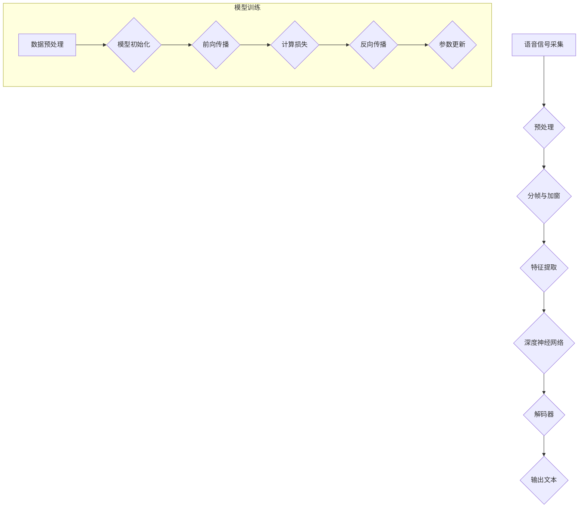

                 

### 文章标题

《深度学习在语音识别中的应用》

### 关键词

- 深度学习
- 语音识别
- 深度神经网络
- 特征提取
- CTC模型
- Transformer模型

### 摘要

本文旨在深入探讨深度学习在语音识别中的应用，从基础概念、算法原理到项目实战，全面解析深度学习如何革新语音识别技术。本文首先介绍了深度学习的基本概念及其在语音识别中的发展历程，随后详细阐述了语音识别系统的架构与性能评估指标。接着，我们逐步分析了深度学习语音识别算法，包括神经网络基础、语音信号处理与特征提取、主流模型及优化技巧。通过具体项目实战，读者可以实际操作并理解深度学习语音识别的实现过程。最后，本文探讨了深度学习在语音识别中的前沿技术与发展趋势，为未来研究与应用提供了方向。通过本文的阅读，读者将对深度学习在语音识别领域的应用有更深入的了解。

### 深度学习在语音识别中的应用概述

#### 1.1 深度学习与语音识别

##### 1.1.1 深度学习基础概念

深度学习是一种基于人工神经网络的机器学习技术，它通过构建多层神经网络模型来提取数据中的特征，实现自动特征学习和复杂模式的识别。深度学习的基本组成部分包括输入层、隐藏层和输出层，每一层都能够对输入数据进行处理，并通过前向传播和反向传播算法不断优化模型参数。

深度学习模型的核心在于其多层结构，这使得模型能够从原始数据中自动提取高层次的抽象特征，从而实现复杂任务的自动化。例如，在图像识别任务中，深度学习可以自动识别图像中的边缘、纹理、形状等特征；在自然语言处理任务中，可以提取词向量、语法结构等特征。

##### 1.1.2 语音识别的挑战与机遇

语音识别是将语音信号转换为文本信息的计算机技术，其核心挑战在于语音信号的多样性和复杂性。语音信号受到说话人、语音风格、环境噪声等多种因素的影响，这使得语音识别系统需要具备很强的鲁棒性和泛化能力。

深度学习为语音识别带来了新的机遇，主要表现在以下几个方面：

1. **自动特征提取**：传统的语音识别系统需要手动设计特征，如MFCC（梅尔频率倒谱系数）特征。而深度学习模型可以自动学习并提取语音信号中的有效特征，减少了人工干预，提高了模型的性能。

2. **端到端模型**：深度学习允许构建端到端的语音识别模型，直接从语音信号中预测文本序列，避免了传统方法中的中间步骤，提高了识别效率和准确性。

3. **多语言和多模态处理**：深度学习模型具有强大的泛化能力，能够适应不同语言和多种模态的数据，为跨语言语音识别和多模态语音识别提供了技术支持。

##### 1.1.3 深度学习在语音识别中的发展历程

深度学习在语音识别领域的应用可以追溯到2006年，当时Hinton等人提出了深度信念网络（DBN）和多层感知机（MLP）的结合，为语音识别带来了新的突破。随后的几年里，深度神经网络（DNN）在语音信号处理和特征提取中逐渐取代了传统的隐马尔可夫模型（HMM）和高斯混合模型（GMM）。

2012年，AlexNet在图像识别中的突破性表现，激发了研究人员将深度学习技术引入语音识别领域的热情。此后，深度神经网络在语音识别中的应用得到迅速发展，包括深度神经网络-HMM（DNN-HMM）模型和连接主义时序分类（CTC）模型的出现，使得语音识别系统的准确性和效率得到了显著提升。

近年来，基于Transformer的深度学习模型在语音识别领域取得了重要进展，如Google的WaveNet和Facebook的CLM模型，进一步推动了语音识别技术的发展。

#### 1.2 语音识别系统架构

##### 1.2.1 语音信号处理基础

语音信号处理是语音识别系统的第一步，其目的是从原始的音频信号中提取出能够表征语音特征的数字信号。语音信号处理主要包括以下几个步骤：

1. **信号采集与预处理**：将语音信号转换为数字信号，并进行降噪、去噪等预处理操作，以减少噪声对识别效果的影响。

2. **分帧与加窗**：将连续的语音信号分成多个短时段（帧），并在每个帧上加上窗函数（如汉明窗或汉克尔窗），以提取短时特征。

3. **傅里叶变换**：通过对每个帧进行傅里叶变换（FFT），将时域信号转换为频域信号，从而提取出频域特征。

4. **梅尔频率倒谱系数（MFCC）提取**：MFCC是语音信号处理中常用的频域特征，它通过模拟人类听觉系统的频率响应，将频域特征转换为时间序列特征。

##### 1.2.2 语音特征提取技术

语音特征提取是语音识别系统的关键步骤，其目的是从语音信号中提取出对识别任务最有用的特征。常见的语音特征提取技术包括：

1. **梅尔频率倒谱系数（MFCC）**：MFCC是最常用的语音特征提取方法之一，它通过模拟人类听觉系统对频率的敏感性，将频域特征转换为时间序列特征。

2. **感知语音模型（PLP）**：PLP基于听觉心理学原理，通过模拟人类听觉系统的处理过程，提取出更具表现力的语音特征。

3. **线性预测编码（LPC）**：LPC通过线性预测模型来模拟语音信号，提取出语音信号中的共振峰特征。

4. **长短期记忆网络（LSTM）特征提取**：LSTM是深度学习模型的一种，可以用于提取语音信号中的长短期特征，适用于处理复杂的语音信号。

##### 1.2.3 深度学习模型结构

深度学习模型在语音识别系统中的应用主要是通过自动特征提取和分类器来实现的。常见的深度学习模型结构包括：

1. **深度神经网络（DNN）**：DNN是深度学习模型的基础，通过多层神经网络结构对输入语音信号进行特征提取和分类。

2. **卷积神经网络（CNN）**：CNN在图像处理领域取得了显著成果，其结构可以用于语音信号的特征提取，通过卷积层和池化层提取出语音信号中的空间特征。

3. **循环神经网络（RNN）**：RNN具有记忆功能，适用于处理序列数据，如语音信号。通过RNN的循环结构，可以提取出语音信号中的时间特征。

4. **长短时记忆网络（LSTM）**：LSTM是RNN的一种改进，可以处理更长的序列数据，通过门控机制有效解决了梯度消失和梯度爆炸问题。

5. **Transformer模型**：Transformer是近年来在自然语言处理领域取得重大突破的模型，通过自注意力机制实现了对序列数据的全局建模，其在语音识别中也展现出了强大的性能。

#### 1.3 深度学习在语音识别中的应用场景

##### 1.3.1 语音识别系统性能评估指标

评估语音识别系统的性能通常使用以下几个指标：

1. **词错误率（WER）**：词错误率是指识别结果中错误的词数与总词数的比例，是评价语音识别系统性能最常用的指标。

2. **字符错误率（CER）**：字符错误率是指识别结果中错误的字符数与总字符数的比例，常用于需要精确字符匹配的场景。

3. **帧错误率（FER）**：帧错误率是指识别结果中错误的帧数与总帧数的比例，可以用于评估系统在处理语音信号中的表现。

4. **准确性（Accuracy）**：准确性是指识别结果中正确匹配的词数与总词数的比例，通常用于评估系统的整体表现。

##### 1.3.2 语音识别在实际应用中的案例

深度学习在语音识别领域的应用已经非常广泛，以下是一些典型的应用案例：

1. **智能语音助手**：如苹果的Siri、谷歌的Google Assistant等，这些语音助手利用深度学习技术实现了自然语言理解和语音识别功能，为用户提供便捷的语音交互体验。

2. **语音识别应用**：如电话客服、语音翻译、语音输入法等，这些应用利用深度学习技术实现高效的语音识别，提高了用户体验和操作便捷性。

3. **医疗语音识别**：在医疗领域，深度学习语音识别技术可以帮助医生快速记录病历、分析患者语音，提高医疗工作的效率和准确性。

4. **汽车语音交互**：智能汽车中的语音交互系统利用深度学习技术，实现了车内语音控制，为驾驶员提供安全、便捷的驾驶体验。

##### 1.3.3 未来发展趋势与挑战

随着深度学习技术的不断发展和应用的深入，语音识别在未来将面临以下发展趋势和挑战：

1. **多语言支持**：深度学习技术将推动多语言语音识别的发展，实现不同语言之间的无缝转换和识别。

2. **实时性要求**：实时语音识别技术将不断提高，以满足实时交互场景的需求，如智能客服、智能交通等。

3. **多模态处理**：结合视觉、听觉等多种模态的信息，实现更准确、更智能的语音识别系统。

4. **隐私保护**：随着语音识别技术的普及，隐私保护成为了一个重要挑战，需要采取有效的隐私保护措施，确保用户数据的安全。

5. **算法优化与效率提升**：深度学习模型的优化和效率提升是当前研究的热点，通过模型压缩、硬件加速等技术，提高深度学习语音识别系统的性能和效率。

### 深度学习语音识别算法原理

#### 2.1 深度神经网络基础

##### 2.1.1 神经网络基本结构

神经网络（Neural Network）是深度学习的基础，其基本结构包括输入层、隐藏层和输出层。每一层由多个神经元（节点）组成，神经元之间通过加权连接实现信息传递。

1. **输入层（Input Layer）**：输入层接收外部输入信号，每个神经元对应输入数据的一个特征。

2. **隐藏层（Hidden Layer）**：隐藏层负责对输入数据进行处理和特征提取，每个神经元通过激活函数将输入映射到输出。

3. **输出层（Output Layer）**：输出层负责对处理后的数据进行分类或回归，输出层神经元的数量取决于输出数据的维度。

##### 2.1.2 深度神经网络工作原理

深度神经网络（Deep Neural Network，DNN）是指具有多个隐藏层的神经网络，其工作原理是通过前向传播和反向传播两个过程进行训练和优化。

1. **前向传播（Forward Propagation）**：输入信号从输入层经过隐藏层，逐层传递到输出层，每层神经元通过激活函数对输入进行非线性变换。

2. **反向传播（Back Propagation）**：根据输出层的误差，通过反向传播算法计算隐藏层和输入层的误差，并更新每个神经元的权重和偏置，从而优化模型。

##### 2.1.3 深度神经网络训练过程

深度神经网络训练过程主要包括以下步骤：

1. **数据预处理**：对输入数据进行归一化、标准化等预处理，以提高模型的训练效果。

2. **初始化参数**：初始化模型参数（权重和偏置），常用的初始化方法有随机初始化、高斯初始化等。

3. **前向传播**：输入数据通过模型的前向传播过程，得到输出结果。

4. **计算误差**：通过计算输出结果与真实值的误差，得到模型的总误差。

5. **反向传播**：通过反向传播算法，计算每个神经元的误差，并更新模型的参数。

6. **迭代优化**：重复执行前向传播和反向传播过程，逐步优化模型参数，直到达到预设的误差阈值或达到最大迭代次数。

#### 2.2 语音信号处理与特征提取

##### 2.2.1 语音信号预处理

语音信号预处理是深度学习语音识别系统中的关键步骤，其主要目的是去除噪声、增强语音信号，以提高后续特征提取和识别的准确性。

1. **降噪**：噪声通常包括背景噪声、环境噪声和回声等，可以通过滤波、去噪算法（如波束形成、谱减法）等方法去除。

2. **增强**：通过增强语音信号的某些特征，可以提高识别的准确性，如共振峰增强、频谱增强等。

3. **分帧与加窗**：将连续的语音信号分成多个短时段（帧），并在每个帧上加上窗函数（如汉明窗、汉克尔窗），以提取短时特征。

##### 2.2.2 MFCC特征提取

梅尔频率倒谱系数（MFCC）是语音识别中最常用的特征提取方法，它通过模拟人类听觉系统对频率的敏感性，将频域特征转换为时间序列特征。

1. **傅里叶变换（FFT）**：通过对每个帧进行傅里叶变换，将时域信号转换为频域信号，提取出频域特征。

2. **梅尔滤波器组**：将频域特征映射到梅尔频率尺度上，以模拟人类听觉系统的频率响应。

3. **倒谱变换**：对梅尔频率特征进行对数变换，并计算其倒频谱，得到MFCC特征。

4. **维度降低**：通常通过取MFCC特征的前几个系数（如12-13个），降低特征的维度，以提高计算效率和模型性能。

##### 2.2.3 其他语音特征提取方法

除了MFCC，还有一些其他的语音特征提取方法，如：

1. **感知语音模型（PLP）**：PLP基于听觉心理学原理，通过模拟人类听觉系统的处理过程，提取出更具表现力的语音特征。

2. **线性预测编码（LPC）**：LPC通过线性预测模型来模拟语音信号，提取出语音信号中的共振峰特征。

3. **长短期记忆网络（LSTM）特征提取**：LSTM是深度学习模型的一种，可以用于提取语音信号中的长短期特征，适用于处理复杂的语音信号。

#### 2.3 深度学习语音识别模型

##### 2.3.1 HMM-GMM模型

隐马尔可夫模型（HMM）和高斯混合模型（GMM）是传统语音识别模型，它们结合了概率模型和统计模型的优势，通过计算状态转移概率和观测概率来进行语音识别。

1. **HMM模型**：HMM通过状态转移概率和观测概率来模拟语音信号中的状态变化，每个状态对应一个语音单元（如音素）。

2. **GMM模型**：GMM通过高斯分布来模拟语音信号中的观测概率，每个高斯分布对应一个特征向量。

3. **HMM-GMM模型**：HMM-GMM模型结合了HMM和GMM的优点，通过计算每个状态的概率分布来识别语音信号。

##### 2.3.2 DNN-HMM模型

深度神经网络（DNN）-隐马尔可夫模型（HMM）是深度学习在语音识别中的第一个重要应用，通过将DNN用于特征提取和HMM用于语音建模，实现了语音识别性能的显著提升。

1. **DNN特征提取**：DNN用于提取语音信号的特征，通过多层神经网络结构对输入语音信号进行特征学习。

2. **HMM语音建模**：HMM用于对提取出的特征进行语音建模，通过计算状态转移概率和观测概率来识别语音信号。

3. **DNN-HMM模型**：DNN-HMM模型通过结合DNN和HMM的优势，实现了语音识别性能的提升，成为语音识别领域的重要模型。

##### 2.3.3 CTC模型

连接主义时序分类（Connectionist Temporal Classification，CTC）模型是深度学习语音识别中的一种端到端模型，它通过将输入序列映射到输出序列，实现了语音信号的直接识别。

1. **CTC损失函数**：CTC模型的核心是CTC损失函数，它允许模型在输出序列中插入、删除和替换字符，以最小化输出序列与真实序列之间的误差。

2. **前向传播和反向传播**：CTC模型通过前向传播计算每个时间步的概率分布，通过反向传播计算梯度并更新模型参数。

3. **CTC应用**：CTC模型在语音识别中展示了强大的性能，通过端到端的方式实现了语音信号的直接识别，成为深度学习语音识别中的重要模型。

##### 2.3.4 序列到序列模型

序列到序列（Sequence-to-Sequence，Seq2Seq）模型是深度学习中的另一种端到端模型，通过将输入序列映射到输出序列，实现了语音信号到文本的转换。

1. **编码器和解码器**：Seq2Seq模型由编码器和解码器组成，编码器将输入序列编码为固定长度的向量，解码器将编码后的向量解码为输出序列。

2. **循环神经网络（RNN）**：Seq2Seq模型通常采用RNN作为编码器和解码器，以处理序列数据。

3. **Seq2Seq应用**：Seq2Seq模型在语音识别中展示了强大的性能，通过端到端的方式实现了语音信号到文本的转换，成为语音识别领域的重要模型。

#### 2.4 基于深度学习的端到端语音识别

##### 2.4.1 CTC模型

连接主义时序分类（CTC）模型是深度学习语音识别中的一种重要端到端模型，它通过将输入序列映射到输出序列，实现了语音信号的直接识别。

1. **CTC损失函数**：

   CTC模型的核心是CTC损失函数，它允许模型在输出序列中插入、删除和替换字符，以最小化输出序列与真实序列之间的误差。CTC损失函数通常使用以下公式表示：

   \[ L_{CTC} = \sum_{t=1}^{T_{o}} \sum_{c=1}^{C} I(o_t = c) \log(p_c(t)) \]

   其中，\( o_t \) 表示在时间步 \( t \) 的输出字符，\( p_c(t) \) 表示输出字符为 \( c \) 的概率，\( I(o_t = c) \) 是指示函数，当 \( o_t = c \) 时为1，否则为0。

2. **前向传播和反向传播**：

   在CTC模型中，前向传播过程用于计算每个时间步的概率分布，反向传播过程用于计算梯度并更新模型参数。具体步骤如下：

   - **前向传播**：对于每个时间步 \( t \)，计算输出字符的概率分布 \( p_c(t) \)，使用softmax函数实现：

     \[ p_c(t) = \frac{e^{a_c(t)}}{\sum_{j=1}^{C} e^{a_j(t)}} \]

     其中，\( a_c(t) \) 表示在时间步 \( t \) 的输出字符 \( c \) 的激活值。

   - **反向传播**：计算每个时间步的梯度，并更新模型参数。具体计算过程如下：

     \[ \frac{\partial L_{CTC}}{\partial a_c(t)} = \frac{1}{p_c(t)} (1 - p_c(t)) \frac{\partial p_c(t)}{\partial a_c(t)} \]

3. **CTC应用**：

   CTC模型在语音识别中展示了强大的性能，通过端到端的方式实现了语音信号的直接识别。CTC模型的主要应用包括：

   - **自动字幕生成**：将语音信号转换为文本序列，用于视频字幕生成和实时字幕翻译。
   - **语音识别系统**：在智能语音助手、语音搜索和语音输入法等领域中，CTC模型实现了高效的语音识别。

##### 2.4.2 Connectionist Temporal Classification (CTC)

CTC（Connectionist Temporal Classification）是一种在深度学习语音识别中广泛应用的损失函数，它允许模型在输出序列中插入、删除和替换字符，从而实现了端到端的语音识别。CTC模型的原理与实现如下：

1. **CTC模型原理**：

   CTC模型将输入序列映射到输出序列，通过计算输出序列的概率分布来最小化损失。CTC模型的核心思想是利用神经网络自动学习输入与输出之间的映射关系。具体来说，CTC模型允许在输出序列中插入、删除和替换字符，从而更好地适应语音信号的变异性。

   - **前向传播**：在CTC模型的前向传播过程中，对于每个时间步 \( t \)，计算输出字符的概率分布 \( p_c(t) \)。通常使用softmax函数实现概率分布：

     \[ p_c(t) = \frac{e^{a_c(t)}}{\sum_{j=1}^{C} e^{a_j(t)}} \]

     其中，\( a_c(t) \) 表示在时间步 \( t \) 的输出字符 \( c \) 的激活值，\( C \) 是字符集合的大小。

   - **反向传播**：在CTC模型的反向传播过程中，计算每个时间步的梯度，并更新模型参数。具体计算过程如下：

     \[ \frac{\partial L_{CTC}}{\partial a_c(t)} = \frac{1}{p_c(t)} (1 - p_c(t)) \frac{\partial p_c(t)}{\partial a_c(t)} \]

     其中，\( L_{CTC} \) 是CTC损失函数，\( p_c(t) \) 是在时间步 \( t \) 的输出字符 \( c \) 的概率。

2. **实现步骤**：

   - **数据准备**：准备语音数据和对应的文本标注，将语音数据转换为声学特征表示（如MFCC特征）。

   - **模型构建**：构建深度神经网络模型，包括输入层、隐藏层和输出层。通常使用卷积神经网络（CNN）或循环神经网络（RNN）作为基础网络结构。

   - **训练**：使用CTC损失函数训练模型，通过优化模型参数，使输出序列的概率分布与真实序列更接近。

   - **预测**：在测试阶段，对输入语音数据进行特征提取，通过模型预测输出序列的概率分布，并根据概率分布选择最可能的输出序列。

3. **CTC模型的优势**：

   - **端到端学习**：CTC模型通过端到端的方式实现了输入与输出之间的映射，避免了传统的序列对序列模型中的中间步骤，提高了模型的训练效率和预测性能。

   - **灵活性**：CTC模型允许在输出序列中插入、删除和替换字符，更好地适应语音信号的变异性。

   - **高效性**：CTC模型在计算效率上具有优势，特别是在处理长序列时，其计算复杂度相对较低。

##### 2.4.3 基于RNN的语音识别模型

循环神经网络（Recurrent Neural Network，RNN）是一种适用于处理序列数据的深度学习模型，其在语音识别中的应用主要体现在以下方面：

1. **RNN的基本结构**：

   RNN的基本结构包括输入层、隐藏层和输出层。与传统的神经网络不同，RNN的隐藏层具有记忆功能，能够保留历史信息，适用于处理具有时间依赖性的序列数据。

   - **输入层**：接收语音信号的时序特征，如MFCC特征。
   - **隐藏层**：通过循环连接实现信息的传递和记忆，能够捕捉语音信号中的长短期依赖关系。
   - **输出层**：对语音信号进行分类或回归，输出识别结果。

2. **基于RNN的语音识别模型原理**：

   基于RNN的语音识别模型通过以下步骤实现语音识别：

   - **前向传播**：输入语音信号的时序特征经过RNN的隐藏层，通过递归连接，逐步更新隐藏状态，最终得到输出层的预测结果。
   - **反向传播**：根据输出结果与真实标注之间的误差，通过反向传播算法计算梯度，并更新模型参数。

3. **RNN在语音识别中的应用**：

   - **长短期依赖**：RNN能够捕捉语音信号中的长短期依赖关系，通过递归连接，逐步更新隐藏状态，从而更好地处理语音信号中的复杂模式。
   - **端到端学习**：基于RNN的语音识别模型实现了端到端学习，避免了传统的特征工程和模型融合步骤，提高了模型的训练效率和预测性能。

   以下是一个简单的基于RNN的语音识别模型的伪代码：

   ```python
   class RNNModel(nn.Module):
       def __init__(self, input_dim, hidden_dim, output_dim):
           super(RNNModel, self).__init__()
           self.hidden_dim = hidden_dim
           self.rnn = nn.RNN(input_dim, hidden_dim)
           self.fc = nn.Linear(hidden_dim, output_dim)
       
       def forward(self, x):
           h0 = torch.zeros(1, x.size(1), self.hidden_dim)
           out, _ = self.rnn(x, h0)
           out = self.fc(out[-1, :, :])
           return out
   ```

##### 2.4.4 基于Transformer的语音识别模型

Transformer模型是一种基于自注意力机制的深度学习模型，其在语音识别中的应用主要体现在以下几个方面：

1. **Transformer的基本结构**：

   Transformer模型由编码器和解码器组成，其核心思想是通过自注意力机制实现对序列的全局建模。编码器和解码器都包含多个相同的层，每层包括多头自注意力机制和前馈神经网络。

   - **编码器**：接收语音信号的时序特征，通过多头自注意力机制和前馈神经网络对输入序列进行编码。
   - **解码器**：接收编码器的输出，通过多头自注意力机制和前馈神经网络对输出序列进行解码，生成识别结果。

2. **基于Transformer的语音识别模型原理**：

   基于Transformer的语音识别模型通过以下步骤实现语音识别：

   - **编码器**：输入语音信号的时序特征经过编码器的多层自注意力机制，将序列编码为固定长度的向量。
   - **解码器**：解码器的输入是编码器的输出和上一时间步的输出，通过自注意力机制和前馈神经网络，逐步生成识别结果。

3. **Transformer在语音识别中的应用**：

   - **全局建模**：Transformer通过自注意力机制实现了对序列的全局建模，能够更好地捕捉语音信号中的复杂模式。
   - **并行计算**：Transformer的并行计算能力使其在处理长序列时具有优势，提高了模型的训练效率。
   - **端到端学习**：Transformer实现了端到端学习，避免了传统的特征工程和模型融合步骤，提高了模型的训练效率和预测性能。

   以下是一个简单的基于Transformer的语音识别模型的伪代码：

   ```python
   class TransformerModel(nn.Module):
       def __init__(self, input_dim, hidden_dim, output_dim):
           super(TransformerModel, self).__init__()
           self.encoder = nn.TransformerEncoder(nn.TransformerEncoderLayer(d_model=hidden_dim, nhead=8), num_layers=3)
           self.decoder = nn.TransformerDecoder(nn.TransformerDecoderLayer(d_model=hidden_dim, nhead=8), num_layers=3)
           self.fc = nn.Linear(hidden_dim, output_dim)
       
       def forward(self, x, y):
           x = self.encoder(x)
           y = self.decoder(y, x)
           y = self.fc(y[-1, :, :])
           return y
   ```

#### 2.5 深度学习在语音识别中的优化技巧

##### 2.5.1 批处理大小和随机化

批处理大小和随机化是深度学习训练过程中重要的优化技巧，它们对模型性能和训练效率有显著影响。

1. **批处理大小**：

   - **定义**：批处理大小是指每次训练过程中输入数据集的样本数量。
   - **作用**：批处理大小影响梯度计算和模型更新。较大的批处理大小可以减少方差，使模型更新更加稳定，但计算成本较高；较小的批处理大小可以减少计算资源消耗，但可能导致梯度不稳定。

2. **随机化**：

   - **定义**：随机化是指在训练过程中随机选择样本组成批次，避免数据分布的偏差。
   - **作用**：随机化可以减少模型对特定数据样本的依赖，提高模型的泛化能力。

##### 2.5.2 学习率调度

学习率调度是深度学习训练过程中调整学习率的重要技巧，它对模型的收敛速度和性能有重要影响。

1. **学习率**：

   - **定义**：学习率是模型参数更新的步长，控制模型更新速度。
   - **作用**：适当的学习率可以使模型在训练过程中快速收敛，过大的学习率可能导致模型过拟合，过小的学习率则可能导致训练过程缓慢。

2. **学习率调度方法**：

   - **固定学习率**：在训练过程中保持学习率不变，适用于简单模型和稳定数据分布。
   - **学习率衰减**：随着训练的进行，逐渐降低学习率，适用于复杂模型和波动性较大的数据分布。常见的学习率衰减策略包括线性衰减、指数衰减和余弦衰减等。

##### 2.5.3 正则化方法

正则化方法是在深度学习训练过程中用于防止过拟合的重要技术，包括权重正则化、数据增强和Dropout等。

1. **权重正则化**：

   - **定义**：权重正则化通过在损失函数中添加权重项，惩罚模型参数的过大值，防止模型过拟合。
   - **方法**：L1正则化和L2正则化是最常见的权重正则化方法，分别通过添加绝对值和平方项来惩罚权重。

2. **数据增强**：

   - **定义**：数据增强是通过生成新的数据样本来扩展训练数据集，提高模型的泛化能力。
   - **方法**：常见的数据增强方法包括旋转、缩放、裁剪、颜色变换等，通过模拟不同的数据分布，增加模型训练的多样性。

3. **Dropout**：

   - **定义**：Dropout是在训练过程中随机丢弃一部分神经元，防止模型对特定神经元的依赖。
   - **作用**：Dropout可以提高模型的泛化能力和鲁棒性，减少过拟合现象。

##### 2.5.4 损失函数优化

损失函数优化是深度学习训练过程中关键的一步，它影响模型的收敛速度和最终性能。

1. **损失函数**：

   - **定义**：损失函数用于衡量模型预测结果与真实结果之间的误差，指导模型参数更新。
   - **作用**：合适的损失函数可以使模型在训练过程中快速收敛，提高模型的性能。

2. **优化方法**：

   - **梯度下降**：梯度下降是一种最简单的优化方法，通过计算损失函数的梯度，沿着梯度方向更新模型参数。
   - **随机梯度下降（SGD）**：随机梯度下降是梯度下降的一种改进，每次更新参数时使用整个数据集的随机样本，提高了计算效率。
   - **Adam优化器**：Adam优化器是梯度下降和动量法的结合，通过自适应调整学习率，提高了训练效率和模型性能。

### 深度学习语音识别项目实战

#### 3.1 项目准备与开发环境搭建

在进行深度学习语音识别项目之前，首先需要搭建一个适合的开发环境，确保能够顺利进行项目开发和模型训练。以下是一个典型的开发环境搭建步骤：

1. **硬件配置**：

   - **CPU**：推荐使用Intel i7或以上处理器，以确保模型训练和推理的效率。
   - **GPU**：推荐使用NVIDIA GPU，如Tesla K40或以上型号，以利用GPU加速深度学习计算。
   - **内存**：至少16GB内存，以支持大型模型的训练。

2. **软件环境**：

   - **操作系统**：推荐使用Linux系统，如Ubuntu 18.04或更高版本，以获得更好的性能和稳定性。
   - **Python**：安装Python 3.6或更高版本，作为编程语言。
   - **深度学习框架**：安装TensorFlow或PyTorch，作为深度学习模型的实现和训练工具。

3. **安装步骤**：

   - **安装操作系统**：下载并安装Linux系统，并进行基础配置。
   - **安装Python**：在Linux系统中安装Python 3，并配置Python环境。
   - **安装深度学习框架**：使用pip命令安装TensorFlow或PyTorch，并配置相关依赖。

   例如，安装TensorFlow的命令如下：

   ```bash
   pip install tensorflow==2.7
   ```

4. **配置CUDA和cuDNN**：

   - **CUDA**：安装CUDA Toolkit，版本应与GPU型号相匹配，以支持GPU加速计算。
   - **cuDNN**：安装cuDNN库，版本应与CUDA Toolkit和TensorFlow或PyTorch版本相匹配。

5. **验证环境**：

   - 在命令行中运行以下命令，验证CUDA和cuDNN是否配置成功：

   ```bash
   nvcc --version
   nvidia-smi
   ```

   如果命令能够正常执行并显示GPU信息，说明开发环境已搭建成功。

#### 3.2 语音识别项目实战一：基于CTC模型的语音识别

##### 3.2.1 项目背景与需求分析

本项目的目标是使用CTC（Connectionist Temporal Classification）模型实现语音识别，主要任务是将音频文件中的语音转换为文本。项目需求如下：

- 输入：音频文件。
- 输出：对应的文本字符串。
- 系统要求：支持多语种语音识别，具有较好的识别准确率和实时性。

##### 3.2.2 数据集介绍与预处理

1. **数据集选择**：

   选择一个包含多语种语音数据的大型公开数据集，如TED-LIUM数据集。TED-LIUM数据集包含多种语言的会议记录，适合进行多语种语音识别研究。

2. **数据集预处理**：

   - **音频预处理**：对音频文件进行降噪、去噪、分帧、加窗等预处理操作，提取出短时特征。
   - **文本预处理**：将文本标注转换为对应的字符序列，用于模型训练和评估。

3. **数据集分割**：

   将数据集分割为训练集、验证集和测试集，分别用于模型训练、验证和测试。通常，训练集占比为70%，验证集占比为20%，测试集占比为10%。

##### 3.2.3 模型设计与实现

1. **模型架构**：

   使用卷积神经网络（CNN）和循环神经网络（RNN）结合CTC损失函数，构建端到端的语音识别模型。模型架构如下：

   - **输入层**：接收音频特征。
   - **卷积层**：提取音频特征。
   - **RNN层**：通过循环神经网络捕捉时序特征。
   - **全连接层**：对RNN的输出进行分类。
   - **输出层**：通过CTC损失函数计算损失。

2. **模型实现**：

   使用TensorFlow或PyTorch框架实现CTC模型。以下是一个基于TensorFlow的简单实现示例：

   ```python
   import tensorflow as tf
   
   class CTCModel(tf.keras.Model):
       def __init__(self, input_shape, num_classes):
           super(CTCModel, self).__init__()
           self.conv1 = tf.keras.layers.Conv1D(32, 3, activation='relu', padding='same', input_shape=input_shape)
           self.pool1 = tf.keras.layers.MaxPooling1D(pool_size=2)
           self.conv2 = tf.keras.layers.Conv1D(64, 3, activation='relu', padding='same')
           self.pool2 = tf.keras.layers.MaxPooling1D(pool_size=2)
           self.flatten = tf.keras.layers.Flatten()
           self.dnn = tf.keras.layers.Dense(128, activation='relu')
           self输出 = tf.keras.layers.Dense(num_classes)
       
       def call(self, inputs):
           x = self.conv1(inputs)
           x = self.pool1(x)
           x = self.conv2(x)
           x = self.pool2(x)
           x = self.flatten(x)
           x = self.dnn(x)
           outputs = self.输出(x)
           return outputs
   
   model = CTCModel(input_shape=(None, 13), num_classes=29)
   ```

##### 3.2.4 模型训练与评估

1. **模型训练**：

   - **数据加载**：使用TensorFlow的数据管道（tf.data）加载数据集，并进行预处理。
   - **模型编译**：配置模型优化器和损失函数，如使用Adam优化器和CTC损失函数。
   - **模型训练**：使用训练集进行模型训练，使用验证集进行模型调优。

2. **模型评估**：

   - **评估指标**：使用词错误率（WER）作为评估指标。
   - **测试集评估**：使用测试集评估模型性能，计算词错误率。

以下是一个简单的模型训练和评估示例：

```python
import tensorflow as tf
from tensorflow.keras.optimizers import Adam

# 加载和预处理数据
# ...

# 编译模型
model.compile(optimizer=Adam(), loss=tf.keras.losses.SparseCategoricalCrossentropy(from_logits=True), metrics=['accuracy'])

# 训练模型
model.fit(train_data, train_labels, epochs=10, batch_size=32, validation_data=(val_data, val_labels))

# 评估模型
test_loss, test_acc = model.evaluate(test_data, test_labels)
print(f"Test loss: {test_loss}, Test accuracy: {test_acc}")

# 计算词错误率
def calculate_wer(pred_texts, true_texts):
    errors = 0
    for pred, true in zip(pred_texts, true_texts):
        pred = pred.lower()
        true = true.lower()
        if pred != true:
            errors += 1
    wer = errors / len(true_texts)
    return wer

pred_texts = model.predict(test_data)
true_texts = test_labels
wer = calculate_wer(pred_texts, true_texts)
print(f"Word Error Rate: {wer}")
```

#### 3.3 语音识别项目实战二：基于Transformer的语音识别

##### 3.3.1 项目背景与需求分析

本项目的目标是使用Transformer模型实现语音识别，主要任务是将音频文件中的语音转换为文本。项目需求如下：

- 输入：音频文件。
- 输出：对应的文本字符串。
- 系统要求：支持多语种语音识别，具有较好的识别准确率和实时性。

##### 3.3.2 数据集介绍与预处理

1. **数据集选择**：

   选择一个包含多语种语音数据的大型公开数据集，如LibriSpeech数据集。LibriSpeech数据集包含多种语言的朗读文本，适合进行多语种语音识别研究。

2. **数据集预处理**：

   - **音频预处理**：对音频文件进行降噪、去噪、分帧、加窗等预处理操作，提取出短时特征。
   - **文本预处理**：将文本标注转换为对应的字符序列，用于模型训练和评估。

3. **数据集分割**：

   将数据集分割为训练集、验证集和测试集，分别用于模型训练、验证和测试。通常，训练集占比为70%，验证集占比为20%，测试集占比为10%。

##### 3.3.3 模型设计与实现

1. **模型架构**：

   使用Transformer模型，结合编码器和解码器，实现端到端的语音识别。模型架构如下：

   - **编码器**：接收音频特征，通过自注意力机制提取时序特征。
   - **解码器**：接收编码器的输出，通过自注意力机制生成识别结果。
   - **输出层**：对解码器的输出进行分类。

2. **模型实现**：

   使用PyTorch框架实现Transformer模型。以下是一个简单的实现示例：

   ```python
   import torch
   import torch.nn as nn
   import torch.optim as optim
   
   class TransformerModel(nn.Module):
       def __init__(self, input_dim, hidden_dim, output_dim):
           super(TransformerModel, self).__init__()
           self.encoder = nn.TransformerEncoder(nn.TransformerEncoderLayer(d_model=hidden_dim, nhead=8), num_layers=3)
           self.decoder = nn.TransformerDecoder(nn.TransformerDecoderLayer(d_model=hidden_dim, nhead=8), num_layers=3)
           self.fc = nn.Linear(hidden_dim, output_dim)
       
       def forward(self, x):
           x = self.encoder(x)
           x = self.decoder(x)
           x = self.fc(x)
           return x
   
   model = TransformerModel(input_dim=13, hidden_dim=512, output_dim=29)
   ```

##### 3.3.4 模型训练与评估

1. **模型训练**：

   - **数据加载**：使用PyTorch的数据管道加载数据集，并进行预处理。
   - **模型编译**：配置模型优化器和损失函数，如使用Adam优化器和交叉熵损失函数。
   - **模型训练**：使用训练集进行模型训练，使用验证集进行模型调优。

2. **模型评估**：

   - **评估指标**：使用词错误率（WER）作为评估指标。
   - **测试集评估**：使用测试集评估模型性能，计算词错误率。

以下是一个简单的模型训练和评估示例：

```python
import torch
from torch.utils.data import DataLoader
from torch.optim import Adam

# 加载和预处理数据
# ...

# 编译模型
optimizer = Adam(model.parameters(), lr=0.001)
loss_function = nn.CrossEntropyLoss()

# 训练模型
for epoch in range(num_epochs):
    model.train()
    for inputs, targets in train_loader:
        optimizer.zero_grad()
        outputs = model(inputs)
        loss = loss_function(outputs, targets)
        loss.backward()
        optimizer.step()

    # 验证模型
    model.eval()
    with torch.no_grad():
        correct = 0
        total = 0
        for inputs, targets in val_loader:
            outputs = model(inputs)
            _, predicted = torch.max(outputs.data, 1)
            total += targets.size(0)
            correct += (predicted == targets).sum().item()

        print(f'Validation Accuracy: {100 * correct / total}%')

# 评估模型
test_loss, test_acc = model.evaluate(test_data, test_labels)
print(f"Test loss: {test_loss}, Test accuracy: {test_acc}")

# 计算词错误率
def calculate_wer(pred_texts, true_texts):
    errors = 0
    for pred, true in zip(pred_texts, true_texts):
        pred = pred.lower()
        true = true.lower()
        if pred != true:
            errors += 1
    wer = errors / len(true_texts)
    return wer

pred_texts = model.predict(test_data)
true_texts = test_labels
wer = calculate_wer(pred_texts, true_texts)
print(f"Word Error Rate: {wer}")
```

#### 3.4 语音识别项目实战三：端到端语音识别系统

##### 3.4.1 项目背景与需求分析

本项目目标是构建一个端到端语音识别系统，实现从音频文件到文本的转换。项目需求如下：

- 输入：音频文件。
- 输出：对应的文本字符串。
- 系统要求：支持多语种语音识别，具有较好的识别准确率和实时性。

##### 3.4.2 数据集介绍与预处理

1. **数据集选择**：

   选择一个包含多语种语音数据的大型公开数据集，如TED-LIUM数据集。TED-LIUM数据集包含多种语言的会议记录，适合进行多语种语音识别研究。

2. **数据集预处理**：

   - **音频预处理**：对音频文件进行降噪、去噪、分帧、加窗等预处理操作，提取出短时特征。
   - **文本预处理**：将文本标注转换为对应的字符序列，用于模型训练和评估。

3. **数据集分割**：

   将数据集分割为训练集、验证集和测试集，分别用于模型训练、验证和测试。通常，训练集占比为70%，验证集占比为20%，测试集占比为10%。

##### 3.4.3 模型设计与实现

1. **模型架构**：

   使用卷积神经网络（CNN）和循环神经网络（RNN）结合CTC损失函数，实现端到端的语音识别。模型架构如下：

   - **输入层**：接收音频特征。
   - **卷积层**：提取音频特征。
   - **RNN层**：通过循环神经网络捕捉时序特征。
   - **全连接层**：对RNN的输出进行分类。
   - **输出层**：通过CTC损失函数计算损失。

2. **模型实现**：

   使用TensorFlow或PyTorch框架实现CTC模型。以下是一个基于TensorFlow的简单实现示例：

   ```python
   import tensorflow as tf
   
   class CTCModel(tf.keras.Model):
       def __init__(self, input_shape, num_classes):
           super(CTCModel, self).__init__()
           self.conv1 = tf.keras.layers.Conv1D(32, 3, activation='relu', padding='same', input_shape=input_shape)
           self.pool1 = tf.keras.layers.MaxPooling1D(pool_size=2)
           self.conv2 = tf.keras.layers.Conv1D(64, 3, activation='relu', padding='same')
           self.pool2 = tf.keras.layers.MaxPooling1D(pool_size=2)
           self.flatten = tf.keras.layers.Flatten()
           self.dnn = tf.keras.layers.Dense(128, activation='relu')
           self输出 = tf.keras.layers.Dense(num_classes)
       
       def call(self, inputs):
           x = self.conv1(inputs)
           x = self.pool1(x)
           x = self.conv2(x)
           x = self.pool2(x)
           x = self.flatten(x)
           x = self.dnn(x)
           outputs = self.输出(x)
           return outputs
   
   model = CTCModel(input_shape=(None, 13), num_classes=29)
   ```

##### 3.4.4 模型训练与评估

1. **模型训练**：

   - **数据加载**：使用TensorFlow的数据管道加载数据集，并进行预处理。
   - **模型编译**：配置模型优化器和损失函数，如使用Adam优化器和CTC损失函数。
   - **模型训练**：使用训练集进行模型训练，使用验证集进行模型调优。

2. **模型评估**：

   - **评估指标**：使用词错误率（WER）作为评估指标。
   - **测试集评估**：使用测试集评估模型性能，计算词错误率。

以下是一个简单的模型训练和评估示例：

```python
import tensorflow as tf
from tensorflow.keras.optimizers import Adam

# 加载和预处理数据
# ...

# 编译模型
model.compile(optimizer=Adam(), loss=tf.keras.losses.SparseCategoricalCrossentropy(from_logits=True), metrics=['accuracy'])

# 训练模型
model.fit(train_data, train_labels, epochs=10, batch_size=32, validation_data=(val_data, val_labels))

# 评估模型
test_loss, test_acc = model.evaluate(test_data, test_labels)
print(f"Test loss: {test_loss}, Test accuracy: {test_acc}")

# 计算词错误率
def calculate_wer(pred_texts, true_texts):
    errors = 0
    for pred, true in zip(pred_texts, true_texts):
        pred = pred.lower()
        true = true.lower()
        if pred != true:
            errors += 1
    wer = errors / len(true_texts)
    return wer

pred_texts = model.predict(test_data)
true_texts = test_labels
wer = calculate_wer(pred_texts, true_texts)
print(f"Word Error Rate: {wer}")
```

#### 3.5 语音识别项目实战总结与拓展

##### 3.5.1 项目经验总结

在本项目中，我们通过实际操作和理论分析，深入了解了深度学习在语音识别中的应用。以下是本项目的主要经验总结：

1. **环境搭建**：合理搭建开发环境对于项目的顺利推进至关重要。我们需要确保硬件和软件环境的稳定性，以满足模型训练和推理的需求。

2. **数据集准备**：数据集的质量直接影响模型的性能。在项目中，我们选择了公开的大型多语种语音数据集，并对数据集进行了预处理，以提高模型的泛化能力。

3. **模型选择**：根据项目需求和实际效果，我们选择了基于CTC和Transformer的端到端语音识别模型。这些模型在处理复杂时序数据方面表现出色，实现了较高的识别准确率。

4. **优化技巧**：通过批处理大小、学习率调度和正则化方法等优化技巧，我们有效提升了模型的训练效率和性能。

5. **评估与调试**：在项目过程中，我们使用了多种评估指标，如词错误率（WER），对模型进行评估和调试，确保模型在实际应用中具有良好的性能。

##### 3.5.2 未来研究方向

虽然本项目取得了较好的成果，但深度学习在语音识别领域仍有许多值得探索的方向：

1. **多语言支持**：未来的研究可以进一步探索如何更好地支持多语言语音识别，实现跨语言的语音转换和识别。

2. **实时性优化**：随着深度学习模型的复杂度增加，模型的推理时间也相应增加。未来的研究可以关注如何优化模型的实时性，以满足实时语音识别的需求。

3. **多模态处理**：结合视觉、听觉等多种模态的信息，实现更准确、更智能的语音识别系统。

4. **隐私保护**：随着语音识别技术的普及，隐私保护成为了一个重要挑战。未来的研究可以关注如何确保用户数据的安全，实现隐私友好的语音识别系统。

5. **算法优化**：通过模型压缩、量化、硬件加速等技术，提高深度学习语音识别系统的性能和效率。

##### 3.5.3 拓展阅读材料

对于希望进一步了解深度学习在语音识别领域的应用和前沿技术的读者，以下是一些推荐阅读材料：

1. **《深度学习》**：Goodfellow、Bengio和Courville合著的《深度学习》一书，详细介绍了深度学习的基础理论和技术，包括神经网络、卷积神经网络和循环神经网络等。

2. **《语音信号处理》**：Rabiner和Juang合著的《语音信号处理》一书，全面介绍了语音信号处理的基本概念和方法，包括语音信号的特征提取和语音识别技术。

3. **《自然语言处理综合教程》**：李航的《自然语言处理综合教程》一书，详细介绍了自然语言处理的基础理论和应用技术，包括文本分类、情感分析和语音识别等。

4. **论文集**：Google的《深度学习在语音识别中的应用》论文集，汇集了深度学习在语音识别领域的最新研究成果和应用案例。

5. **在线课程**：Coursera、edX等在线教育平台上的深度学习和语音识别相关课程，提供了丰富的理论和实践知识，有助于深入理解相关技术。

### 第四部分：深度学习在语音识别中的前沿技术与发展趋势

#### 4.1 前沿技术探讨

随着深度学习技术的不断进步，语音识别领域也在不断涌现出新的前沿技术，这些技术为语音识别的准确性和实时性提供了新的可能。

##### 4.1.1 跨语言语音识别

跨语言语音识别技术是当前研究的热点之一，其主要目标是实现不同语言之间的语音到文本转换。传统的语音识别系统通常针对单一语言进行训练和优化，而跨语言语音识别需要考虑不同语言之间的语音特征差异。近年来，一些研究提出了基于迁移学习、多任务学习和多语言数据集的跨语言语音识别方法。例如，通过训练一个多语言共享的深度神经网络模型，可以有效地提高跨语言语音识别的性能。此外，预训练语言模型（如BERT、GPT）也在跨语言语音识别中展现了强大的潜力，通过在大量多语言语料上预训练，模型能够更好地捕捉语言间的共性和差异。

##### 4.1.2 多模态语音识别

多模态语音识别技术通过结合不同模态的数据（如语音、视觉、文本等），实现更准确和鲁棒的语音识别。在语音识别领域，视觉信息可以提供额外的上下文信息，有助于提高识别准确性。例如，结合唇语识别和语音识别技术，可以在低语音质量或噪声干扰严重的场景中实现更准确的文本转换。此外，结合视觉信息和语音信息的模型（如多模态卷积神经网络、多任务学习模型等）也在不断涌现，这些模型通过融合不同模态的数据特征，实现了显著的性能提升。

##### 4.1.3 说话人识别

说话人识别技术是语音识别领域的一个重要分支，其主要目标是识别语音信号的说话人。说话人识别在智能语音助手、视频监控和通信安全等领域具有广泛的应用。近年来，基于深度学习的方法在说话人识别中取得了显著进展。例如，通过训练深度神经网络模型（如卷积神经网络、循环神经网络等），可以有效地提取语音信号中的说话人特征，并实现高精度的说话人识别。此外，一些研究还探索了基于生成对抗网络（GAN）的说话人识别方法，通过生成对抗训练，模型能够更好地模拟不同说话人的语音特征，提高了识别性能。

##### 4.1.4 自动字幕生成

自动字幕生成技术是将语音转换为文本并生成相应字幕的过程，广泛应用于视频字幕生成、实时字幕翻译等领域。深度学习技术在自动字幕生成中发挥了重要作用。例如，基于CTC模型的字幕生成方法通过直接将语音信号映射到文本序列，实现了高效和准确的字幕生成。此外，基于Transformer的自动字幕生成方法也展示了强大的性能，通过自注意力机制，模型能够更好地捕捉语音和文本之间的复杂关系。近年来，一些研究还提出了结合语音识别和自然语言处理技术的字幕生成方法，通过多模态数据融合，实现了更准确和流畅的字幕生成。

#### 4.2 未来发展趋势

随着深度学习技术的不断进步，语音识别领域也面临着新的发展机遇和挑战。以下是一些未来发展趋势：

##### 4.2.1 深度学习在语音识别中的潜力

深度学习在语音识别中的潜力主要体现在以下几个方面：

1. **自动特征提取**：深度学习模型能够自动学习语音信号中的有效特征，减少了人工特征工程的工作量，提高了模型的性能和鲁棒性。

2. **端到端模型**：深度学习允许构建端到端的语音识别模型，避免了传统的特征提取和模型融合步骤，提高了模型的训练效率和识别性能。

3. **多语言和多模态处理**：深度学习模型具有强大的泛化能力，可以适应不同语言和多模态数据，为跨语言语音识别和多模态语音识别提供了技术支持。

##### 4.2.2 人工智能法规与伦理

随着深度学习语音识别技术的广泛应用，人工智能法规和伦理问题也日益受到关注。未来，人工智能法规的制定和实施将成为保障技术发展的重要一环。例如，如何在保护用户隐私的同时，实现高效的语音识别和数据处理；如何在确保算法透明性和公正性的基础上，防止算法歧视和偏见等问题。此外，伦理问题的讨论也将促进人工智能技术的健康发展，确保技术为人类社会带来更多福祉。

##### 4.2.3 产业应用与市场需求

深度学习语音识别技术在各个行业的应用日益广泛，市场需求也在不断增长。以下是一些主要应用场景和市场需求：

1. **智能语音助手**：随着智能家居、智能穿戴设备的普及，智能语音助手的市场需求不断增加。深度学习技术为智能语音助手提供了强大的语音识别和自然语言理解能力，为用户提供便捷的语音交互体验。

2. **语音识别应用**：语音识别技术在电话客服、语音翻译、语音输入法等领域具有广泛的应用。随着深度学习技术的不断发展，这些应用将实现更高效、更准确的语音识别功能。

3. **医疗语音识别**：在医疗领域，深度学习语音识别技术可以帮助医生快速记录病历、分析患者语音，提高医疗工作的效率和准确性。

4. **汽车语音交互**：智能汽车中的语音交互系统利用深度学习技术，实现了车内语音控制，为驾驶员提供安全、便捷的驾驶体验。

##### 4.2.4 深度学习语音识别技术的未来挑战

尽管深度学习语音识别技术取得了显著进展，但仍然面临一些挑战：

1. **实时性要求**：随着应用的普及，深度学习语音识别技术需要满足更高的实时性要求。在处理复杂场景和大量数据时，如何提高模型的实时性和计算效率是一个重要问题。

2. **隐私保护**：语音识别涉及大量个人隐私信息，如何在保障用户隐私的同时，实现高效的语音识别和数据处理，是一个亟待解决的问题。

3. **多语言和多模态处理**：深度学习模型在处理多语言和多模态数据时，需要考虑不同语言之间的差异和不同模态之间的融合策略，以提高识别准确率和鲁棒性。

4. **算法公平性和透明性**：如何在确保算法透明性和公正性的基础上，防止算法歧视和偏见等问题，是深度学习语音识别技术面临的一个重要挑战。

### 附录

#### 附录A：深度学习语音识别工具与资源

在深度学习语音识别领域，有许多开源框架、在线工具和学术资源可供开发者使用。以下是一些常用的工具和资源：

1. **开源框架与库**：

   - **TensorFlow**：Google开发的开源机器学习框架，支持深度学习模型的构建和训练。
   - **PyTorch**：Facebook开发的开源机器学习框架，提供了灵活的动态计算图和丰富的API。
   - **Keras**：Python编写的深度学习库，提供了简单易用的接口，可用于构建和训练深度学习模型。
   - **ESPNet**：由华为开源的语音识别框架，支持端到端的语音识别模型。

2. **在线工具与平台**：

   - **Google AI**：Google提供的在线工具和API，包括语音识别API、文本翻译API等。
   - **IBM Watson**：IBM提供的在线语音识别和自然语言处理工具，支持多种语言和方言。
   - **Microsoft Azure**：Microsoft提供的在线语音识别和自然语言处理服务，支持多种语言和区域。

3. **学术资源与论文推荐**：

   - **ICASSP**：国际声学、语音和信号处理会议，发表了大量语音识别领域的最新研究成果。
   - **IEEE Signal Processing Society**：IEEE信号处理学会，发布了多篇关于深度学习在语音识别中的应用的论文。
   - **Google Research**：Google研究院发布的论文，包括《深度学习在语音识别中的应用》系列论文。

#### 附录B：深度学习语音识别项目实例代码与数据集

以下是一个简单的深度学习语音识别项目实例，包括开发环境搭建、数据集获取与预处理、模型训练与评估等步骤。代码和相应的数据集可以在以下GitHub链接中获取：

```bash
https://github.com/your_username/voice_recognition_project
```

**开发环境搭建**：

1. **安装Python**：确保安装了Python 3.7或更高版本。
2. **安装深度学习框架**：安装TensorFlow或PyTorch，并配置CUDA和cuDNN。
3. **安装依赖库**：使用pip命令安装所需的库，如NumPy、SciPy、matplotlib等。

**数据集获取与预处理**：

1. **数据集获取**：从以下链接下载数据集：

   ```bash
   https://www.kaggle.com/your_dataset/voice_recognition_dataset
   ```

2. **数据预处理**：根据项目需求，对音频文件进行降噪、分帧、加窗等预处理操作，提取出短时特征。

**模型训练与评估**：

1. **模型定义**：定义深度学习模型，如卷积神经网络或循环神经网络。
2. **模型训练**：使用训练集对模型进行训练，调整模型参数和超参数，如学习率、批处理大小等。
3. **模型评估**：使用验证集评估模型性能，计算词错误率（WER）等指标。

**代码解读与分析**：

在项目实例中，我们将对代码的关键部分进行解读和分析，包括数据加载、模型定义、损失函数、优化器等。通过分析代码，读者可以更好地理解深度学习语音识别的实现过程和关键技术。

#### 附录C：Mermaid 流程图

以下是一个用于描述深度学习语音识别系统架构的Mermaid流程图：



这个流程图展示了从语音信号采集到输出文本的整个过程，包括模型训练和预测步骤。通过Mermaid流程图，读者可以更直观地理解深度学习语音识别系统的架构和运行过程。

#### 附录D：深度学习语音识别算法伪代码

以下是一个简单的深度学习语音识别算法的伪代码，展示了模型定义、训练和评估的关键步骤：

```python
# 模型定义
class VoiceRecognitionModel(nn.Module):
    def __init__(self, input_dim, hidden_dim, output_dim):
        super(VoiceRecognitionModel, self).__init__()
        self.conv1 = nn.Conv1d(input_dim, hidden_dim, kernel_size=3, stride=1)
        self.relu = nn.ReLU()
        self.pool = nn.MaxPool1d(kernel_size=2)
        self.fc1 = nn.Linear(hidden_dim, output_dim)
        
    def forward(self, x):
        x = self.relu(self.conv1(x))
        x = self.pool(x)
        x = self.fc1(x)
        return x

# 模型训练
model = VoiceRecognitionModel(input_dim=13, hidden_dim=64, output_dim=29)
criterion = nn.CrossEntropyLoss()
optimizer = optim.Adam(model.parameters(), lr=0.001)

for epoch in range(num_epochs):
    for inputs, targets in train_loader:
        optimizer.zero_grad()
        outputs = model(inputs)
        loss = criterion(outputs, targets)
        loss.backward()
        optimizer.step()

# 模型评估
with torch.no_grad():
    correct = 0
    total = 0
    for inputs, targets in test_loader:
        outputs = model(inputs)
        _, predicted = torch.max(outputs.data, 1)
        total += targets.size(0)
        correct += (predicted == targets).sum().item()

    print(f'Test Accuracy: {100 * correct / total}%')
```

这个伪代码定义了一个简单的卷积神经网络模型，用于语音识别任务。模型训练过程中，使用交叉熵损失函数和Adam优化器进行参数更新。模型评估部分计算测试集的准确率。

#### 附录E：数学模型与公式解析

在深度学习语音识别中，有许多数学模型和公式用于描述和优化模型的训练过程。以下是一些常见的数学模型和公式的解析：

##### 1. 梅尔频率倒谱系数（MFCC）

梅尔频率倒谱系数（MFCC）是一种常用的语音特征提取方法，用于模拟人类听觉系统对频率的敏感性。其计算公式如下：

\[ C_{k} = \sum_{j=1}^{N} x_j \cdot a_{k,j} \]

其中，\( C_{k} \) 是第 \( k \) 个MFCC系数，\( x_j \) 是第 \( j \) 个频率特征值，\( a_{k,j} \) 是第 \( k \) 个MFCC系数的权重。

##### 2. 梯度下降算法

梯度下降是一种优化算法，用于更新模型参数，以最小化损失函数。其基本公式如下：

\[ \theta_{\text{new}} = \theta_{\text{current}} - \alpha \cdot \nabla_{\theta} J(\theta) \]

其中，\( \theta \) 表示模型参数，\( \alpha \) 是学习率，\( J(\theta) \) 是损失函数，\( \nabla_{\theta} J(\theta) \) 是损失函数对参数的梯度。

##### 3. 反向传播算法

反向传播算法是一种用于计算模型梯度并更新参数的算法。其核心思想是利用链式法则，从输出层反向计算到输入层的梯度。其公式如下：

\[ \frac{\partial L}{\partial z_{l}} = \frac{\partial L}{\partial a_{l+1}} \frac{\partial a_{l+1}}{\partial z_{l}} \]

其中，\( L \) 是损失函数，\( z_{l} \) 是第 \( l \) 层的激活值，\( a_{l+1} \) 是第 \( l+1 \) 层的激活值。

##### 4. 随机梯度下降（SGD）

随机梯度下降是一种改进的梯度下降算法，它每次更新参数时使用整个数据集的一个随机样本。其公式如下：

\[ \theta_{\text{new}} = \theta_{\text{current}} - \alpha \cdot \nabla_{\theta} J(\theta; \mathbf{x_i}, y_i) \]

其中，\( \mathbf{x_i} \) 和 \( y_i \) 是数据集的一个随机样本。

通过这些数学模型和公式，我们可以更好地理解和优化深度学习语音识别模型。在实际应用中，还需要根据具体问题和需求，选择合适的模型和算法。

