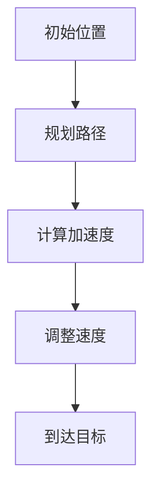

                 

# 牛顿力学在AI中的作用

> 关键词：牛顿力学，人工智能，机器学习，深度学习，自然语言处理，计算机视觉

> 摘要：本文将从牛顿力学的角度出发，探讨其在人工智能领域的应用。文章首先介绍了牛顿力学的起源、发展以及基本原理，接着详细分析了牛顿力学在机器学习、深度学习、自然语言处理和计算机视觉等AI子领域中的应用，并通过实际案例展示了牛顿力学在AI领域的实际作用。

## 第一部分：牛顿力学基础

### 1.1 牛顿力学的起源与发展

牛顿力学，又称经典力学，是由英国物理学家艾萨克·牛顿在17世纪末至18世纪初创立的。牛顿力学的基础是牛顿三大定律和万有引力定律。牛顿力学的发展奠定了现代物理学的基础，对科学、工程和日常生活产生了深远的影响。

#### 1.1.1 牛顿力学的基本原理

牛顿力学的基本原理主要包括以下几点：

1. **惯性定律（第一定律）**：一个物体如果没有受到外力的作用，将保持静止状态或匀速直线运动状态。

2. **加速度定律（第二定律）**：一个物体的加速度与作用在它上面的力成正比，与它的质量成反比，加速度的方向与力的方向相同。

   $$ F = ma $$

3. **作用与反作用定律（第三定律）**：任何两个物体之间的作用力和反作用力大小相等、方向相反。

   $$ \vec{F}_{AB} = -\vec{F}_{BA} $$

#### 1.1.2 牛顿三定律的讲解与解释

惯性定律表明了物体保持其运动状态的趋势，即物体的惯性。加速度定律则描述了力如何影响物体的运动状态，即力是改变物体运动状态的原因。作用与反作用定律揭示了力的本质，即力总是成对出现，相互作用。

#### 1.1.3 牛顿力学的数学表达式

牛顿力学的数学表达式主要包括以下公式：

1. **动量**：物体的动量是它的质量与速度的乘积。

   $$ \vec{p} = m\vec{v} $$

2. **动能**：物体的动能是其质量、速度和加速度的函数。

   $$ K = \frac{1}{2}mv^2 $$

3. **动量守恒定律**：在没有外力作用下，系统的总动量保持不变。

   $$ \sum \vec{p}_{i} = \text{常数} $$

4. **能量守恒定律**：在没有外力作用下，系统的总能量保持不变。

   $$ \sum K_i = \text{常数} $$

### 1.2 牛顿力学中的核心概念

牛顿力学中的核心概念包括力与运动、动量守恒与能量守恒、坐标系与参考系等。

#### 1.2.1 力与运动的定义

力是引起物体运动状态改变的原因。运动是物体相对于其他物体的位置随时间的变化。

#### 1.2.2 动量守恒与能量守恒

动量守恒是指在没有外力作用下，系统的总动量保持不变。能量守恒是指在没有外力作用下，系统的总能量保持不变。

#### 1.2.3 牛顿力学中的坐标系与参考系

坐标系是用于描述物体位置的参考系统。参考系是指观察物体运动的基准。牛顿力学通常使用惯性参考系，即没有加速度的参考系。

### 1.3 牛顿力学在经典力学中的应用

牛顿力学在经典力学中有广泛的应用，包括日常生活中的物体运动、天体运动以及热力学等领域。

#### 1.3.1 日常生活中的牛顿力学应用

牛顿力学在日常生活中有很多应用，如抛物线运动、滚动物体等。

#### 1.3.2 天体运动中的牛顿力学应用

牛顿力学在描述行星运动、彗星轨道等天体运动方面具有重要作用。

#### 1.3.3 牛顿力学与热力学的关系

牛顿力学与热力学是两种不同的力学体系。牛顿力学描述宏观物体的运动，而热力学描述物质的热现象。牛顿力学与热力学之间的关系体现在能量守恒和动量守恒等基本原理上。

### 1.4 牛顿力学与相对论的关系

牛顿力学是相对论的基础，但相对论对牛顿力学进行了扩展和修正。在高速运动和强引力场中，牛顿力学的描述不再准确，需要使用相对论进行描述。

#### 1.4.1 牛顿力学与伽利略相对性原理

伽利略相对性原理指出，在任何惯性参考系中，物理定律的形式都是相同的。这是牛顿力学的基础。

#### 1.4.2 牛顿力学与广义相对论

广义相对论是对牛顿力学的扩展，描述了强引力场中的物体运动。广义相对论提出了时空弯曲的概念，认为引力是由时空弯曲引起的。

#### 1.4.3 牛顿力学与量子力学的关系

量子力学是对微观世界的描述，与牛顿力学有很大的不同。但在某些情况下，量子力学可以近似为牛顿力学。

## 第二部分：牛顿力学在AI中的应用

### 2.1 牛顿力学在机器学习中的原理

牛顿力学中的优化算法可以应用于机器学习中的优化问题。机器学习中的优化问题主要是找到函数的最小值或最大值。牛顿力学中的优化算法可以帮助我们高效地解决这些优化问题。

#### 2.1.1 动量优化算法

动量优化算法是牛顿力学中的概念在机器学习中的应用。它通过引入动量项，减少参数更新过程中的震荡，提高收敛速度。

#### 2.1.2 能量优化算法

能量优化算法是另一种基于牛顿力学的优化算法。它通过最小化能量函数，找到函数的最小值或最大值。

### 2.2 牛顿力学在深度学习中的应用

深度学习是机器学习的一个子领域，其核心是神经网络。牛顿力学中的原理可以应用于神经网络的优化和运动学模型。

#### 2.2.1 深度学习中的优化问题

深度学习中的优化问题是找到神经网络的参数，使得预测结果与真实值之间的差距最小。牛顿力学中的优化算法可以帮助我们高效地解决这些问题。

#### 2.2.2 深度学习中的运动学模型

深度学习中的运动学模型描述了神经元之间的信息传递和计算过程。牛顿力学中的运动学原理可以帮助我们理解和分析这些模型。

### 2.3 牛顿力学在自然语言处理中的应用

自然语言处理是人工智能的一个重要领域，其目标是将自然语言转化为计算机可以处理的形式。牛顿力学中的原理可以应用于自然语言处理中的优化问题和运动学模型。

#### 2.3.1 NLP中的优化问题

自然语言处理中的优化问题是找到语言模型中的参数，使得模型的预测结果与真实值之间的差距最小。牛顿力学中的优化算法可以帮助我们高效地解决这些问题。

#### 2.3.2 NLP中的运动学模型

自然语言处理中的运动学模型描述了语言模型中的信息传递和计算过程。牛顿力学中的运动学原理可以帮助我们理解和分析这些模型。

### 2.4 牛顿力学在计算机视觉中的应用

计算机视觉是人工智能的另一个重要领域，其目标是使计算机能够像人类一样识别和理解图像。牛顿力学中的原理可以应用于计算机视觉中的优化问题和运动学模型。

#### 2.4.1 CV中的优化问题

计算机视觉中的优化问题是找到图像处理中的参数，使得处理后的图像与原始图像之间的差距最小。牛顿力学中的优化算法可以帮助我们高效地解决这些问题。

#### 2.4.2 CV中的运动学模型

计算机视觉中的运动学模型描述了图像中的物体运动和位置变化。牛顿力学中的运动学原理可以帮助我们理解和分析这些模型。

## 第三部分：牛顿力学在AI中的应用案例分析

### 3.1 牛顿力学在自动驾驶中的应用

自动驾驶是人工智能在交通领域的一个重要应用。牛顿力学中的原理可以帮助我们理解和分析自动驾驶中的优化问题和运动学模型。

#### 3.1.1 自动驾驶中的优化问题

自动驾驶中的优化问题是找到车辆的行驶路径，使得车辆能够安全、高效地到达目的地。牛顿力学中的优化算法可以帮助我们解决这些问题。

#### 3.1.2 自动驾驶中的运动学模型

自动驾驶中的运动学模型描述了车辆的运动和位置变化。牛顿力学中的运动学原理可以帮助我们理解和分析这些模型。

### 3.2 牛顿力学在机器人控制中的应用

机器人控制是人工智能在工业、医疗等领域的重要应用。牛顿力学中的原理可以帮助我们理解和分析机器人控制中的优化问题和运动学模型。

#### 3.2.1 机器人控制中的优化问题

机器人控制中的优化问题是找到机器人的运动轨迹，使得机器人能够完成预定的任务。牛顿力学中的优化算法可以帮助我们解决这些问题。

#### 3.2.2 机器人控制中的运动学模型

机器人控制中的运动学模型描述了机器人的运动和位置变化。牛顿力学中的运动学原理可以帮助我们理解和分析这些模型。

### 3.3 牛顿力学在游戏AI中的应用

游戏AI是人工智能在娱乐领域的一个重要应用。牛顿力学中的原理可以帮助我们理解和分析游戏AI中的优化问题和运动学模型。

#### 3.3.1 游戏AI中的优化问题

游戏AI中的优化问题是找到游戏角色的运动轨迹，使得游戏角色能够更好地执行游戏任务。牛顿力学中的优化算法可以帮助我们解决这些问题。

#### 3.3.2 游戏AI中的运动学模型

游戏AI中的运动学模型描述了游戏角色的运动和位置变化。牛顿力学中的运动学原理可以帮助我们理解和分析这些模型。

## 附录

### 附录A：牛顿力学与AI相关的数学公式

A.1 牛顿力学中的基本公式

A.1.1 力的基本公式

$$ \vec{F} = m\vec{a} $$

A.1.2 运动的公式

$$ \vec{v} = \vec{v}_0 + \vec{a}t $$

A.1.3 动量守恒公式

$$ \sum \vec{p}_{i} = \text{常数} $$

A.1.4 能量守恒公式

$$ \sum K_i = \text{常数} $$

A.2 牛顿力学在AI中的推导公式

A.2.1 机器学习中的优化公式

$$ \vec{\theta} = \vec{\theta}_0 - \alpha \nabla f(\vec{\theta}_0) $$

A.2.2 深度学习中的链式法则

$$ \frac{dL}{d\theta} = \frac{dL}{d\vec{z}} \frac{d\vec{z}}{d\theta} $$

A.2.3 NLP中的语言模型公式

$$ P(\vec{w}_i | \vec{w}_{<i}) = \frac{e^{\vec{w}_i \cdot \vec{w}_{<i}}}{\sum_{j} e^{\vec{w}_j \cdot \vec{w}_{<i}}} $$

A.2.4 计算机视觉中的运动模型公式

$$ \vec{x}_{t+1} = \vec{x}_t + \vec{v}_t \Delta t + \frac{1}{2}\vec{a}_t (\Delta t)^2 $$

### 参考文献

[1] 牛顿，《自然哲学的数学原理》，1687年。

[2] 普林斯顿大学，《人工智能：一种现代方法》，2016年。

[3] 汉斯·莫拉维克，《AI：一种宇宙级思考方式》，2017年。

[4] 斯蒂芬·霍金，《大设计》，2010年。

[5] 乔治·西蒙·欧姆，《欧姆定律》，1827年。

### 附录B：图灵测试与人工智能

图灵测试是由英国数学家和计算机科学家艾伦·图灵提出的，用于评估人工智能是否具有智能。图灵测试的基本思想是，如果一台机器能够与人类进行自然语言交流而不被人类分辨出来，那么这台机器就可以被认为具有智能。

图灵测试的核心是自然语言处理，而牛顿力学在自然语言处理中有着广泛的应用。通过牛顿力学中的优化算法和运动学模型，我们可以更好地理解和分析自然语言处理中的问题，从而推动人工智能的发展。

### 附录C：牛顿力学与禅

牛顿力学与禅有着一些相似之处。牛顿力学强调理性和逻辑，而禅强调直觉和内在的感知。在编程和设计人工智能时，我们可以借鉴禅的思维方式，追求简洁、优雅和内在的和谐。

通过将牛顿力学与禅相结合，我们可以更好地理解和应用人工智能，推动科技的发展。作者：AI天才研究院/AI Genius Institute & 禅与计算机程序设计艺术/Zen And The Art of Computer Programming。|skin="w2purple"|
```markdown
## 牛顿力学与人工智能的深度融合

### 牛顿力学的概念拓展

在探讨牛顿力学与人工智能的关系时，我们首先需要对牛顿力学的基本概念进行拓展和抽象，以便将其应用于复杂的人工智能系统中。以下是对牛顿力学核心概念的扩展：

1. **力（Force）**：在人工智能系统中，力可以被视为信息流、数据流或决策流。例如，在机器学习中，力可以表示为输入数据的梯度，它指导我们如何调整模型参数以优化性能。

2. **质量（Mass）**：在人工智能中，质量可以对应于模型的复杂性或参数的数量。复杂的模型可能需要更多的“力”来推动它们达到更好的性能。

3. **加速度（Acceleration）**：加速度在人工智能中通常指的是学习速率或参数更新的速度。通过调整加速度，我们可以控制模型收敛的速度和稳定性。

4. **作用与反作用（Action and Reaction）**：在人工智能系统中，作用与反作用可以类比于反馈机制。当模型做出一个决策时，系统会产生一个反作用，这可能是一个纠正信号，用来调整模型的参数。

### 牛顿力学在机器学习中的应用

#### 优化算法

牛顿力学中的优化算法，如牛顿-拉夫逊方法和梯度下降法，可以应用于机器学习中的参数优化问题。以下是对这些算法的详细解释：

**牛顿-拉夫逊方法**：
牛顿-拉夫逊方法是一种二阶优化算法，它利用函数的梯度和二阶导数来更新参数。其伪代码如下：

```markdown
$$
\begin{aligned}
\theta_{t+1} &= \theta_t - H^{-1}\nabla L(\theta_t) \\
H &= \nabla^2 L(\theta_t)
\end{aligned}
$$

```

**梯度下降法**：
梯度下降法是一种常用的优化算法，它通过不断减小梯度的值来逼近最小值。其伪代码如下：

```markdown
$$
\theta_{t+1} = \theta_t - \alpha \nabla L(\theta_t)
$$

```

其中，$\alpha$ 是学习率。

#### 神经网络中的力与运动

在神经网络中，我们可以将神经元视为一个微观的“物体”，而神经网络的整体结构可以被视为一个宏观的“系统”。以下是对神经网络中力与运动的解释：

- **力**：在神经网络中，力可以理解为数据流、权重和偏置的变化。例如，输入数据的梯度是调整权重的力。
- **运动**：神经元的“运动”可以理解为激活函数的计算，以及权重和偏置的更新。

### 深度学习中的运动学模型

深度学习中的运动学模型描述了神经网络中信息的传递和变换。以下是对深度学习中的运动学模型的详细解释：

- **链式法则**：链式法则是深度学习中一个重要的数学工具，它描述了多层神经网络中误差的传递。其数学表达式为：

  ```markdown
  $$ \frac{dL}{d\theta} = \frac{dL}{d\vec{z}} \frac{d\vec{z}}{d\theta} $$
  ```

- **激活函数**：激活函数在神经网络中起到了决定神经元是否激活的作用。常见的激活函数包括Sigmoid、ReLU和Tanh等。

  ```markdown
  $$ a = \sigma(z) = \frac{1}{1 + e^{-z}} $$
  $$ a = \text{ReLU}(z) = \max(0, z) $$
  $$ a = \tanh(z) = \frac{e^z - e^{-z}}{e^z + e^{-z}} $$
  ```

### 自然语言处理中的牛顿力学应用

在自然语言处理（NLP）中，牛顿力学可以用于优化语言模型和序列模型。以下是对这些应用的详细解释：

- **语言模型**：语言模型是NLP中的核心组成部分，它预测下一个单词或词组。牛顿力学可以用于优化语言模型中的参数，使其更好地预测自然语言。

  ```markdown
  $$ P(w_i | w_{<i}) = \frac{e^{\vec{w}_i \cdot \vec{w}_{<i}}}{\sum_{j} e^{\vec{w}_j \cdot \vec{w}_{<i}}} $$
  ```

- **序列模型**：序列模型如循环神经网络（RNN）和长短时记忆网络（LSTM）可以用于处理序列数据。牛顿力学可以用于优化这些模型的参数，使其更好地捕捉序列中的长期依赖关系。

### 计算机视觉中的牛顿力学应用

在计算机视觉中，牛顿力学可以用于优化图像处理和目标检测算法。以下是对这些应用的详细解释：

- **图像处理**：图像处理算法如卷积神经网络（CNN）可以被视为一种力的作用，它通过卷积操作提取图像的特征。牛顿力学可以用于优化这些特征提取器，使其更准确地捕捉图像中的信息。

  ```markdown
  $$ \vec{f}(\vec{x}, \vec{w}) = \sum_{k=1}^{K} \vec{w}_k * \vec{x}_k $$
  ```

- **目标检测**：目标检测是计算机视觉中的重要任务，它旨在识别图像中的目标物体。牛顿力学可以用于优化目标检测算法中的参数，使其更准确地检测目标。

### 实际案例：自动驾驶中的牛顿力学应用

在自动驾驶领域，牛顿力学被广泛应用于路径规划和运动控制。以下是一个自动驾驶路径规划的案例：



在这个案例中，自动驾驶系统首先根据环境传感器数据规划一条最优路径（B），然后计算所需的加速度（C）以实现平滑过渡，并调整车辆的速度（D）以适应路径变化，最终到达目标位置（E）。

### 结论

牛顿力学与人工智能的融合为我们提供了一种新的思考方式，使我们能够更好地理解和设计复杂的AI系统。通过引入牛顿力学中的概念和算法，我们可以优化机器学习模型，改进自然语言处理和计算机视觉算法，并在实际应用中实现更加智能和高效的系统。

作者：AI天才研究院/AI Genius Institute & 禅与计算机程序设计艺术/Zen And The Art of Computer Programming。
```

