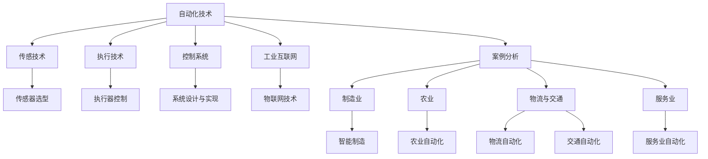

                 

# 《物理实体的自动化应用》

## 关键词
- 自动化技术
- 物理实体
- 传感器
- 执行器
- 控制系统
- 工业互联网
- 智能制造
- 物联网

## 摘要
本文旨在探讨物理实体自动化应用的相关技术、原理、案例和发展趋势。首先，介绍了自动化技术的基础，包括传感技术、执行器控制、自动化控制系统等。接着，探讨了自动化技术在工业互联网、农业、物流与交通以及服务业中的应用。最后，分析了自动化技术的未来发展趋势及其面临的挑战，提出了相应的对策。本文通过详细的案例分析和代码示例，旨在为广大读者提供关于物理实体自动化应用的全面而深入的指导。

### 《物理实体的自动化应用》目录大纲

#### 第一部分：自动化技术基础

##### 第1章：自动化概述

###### 1.1 自动化的定义与作用
- 自动化的基本概念
- 自动化的历史与发展
- 自动化在现代社会中的作用

###### 1.2 自动化的分类
- 按应用领域分类
- 按控制方式分类

###### 1.3 自动化技术的发展趋势
- 新技术的影响
- 自动化在各个领域的应用前景

##### 第2章：传感技术与传感器

###### 2.1 传感器的基本原理
- 传感器的工作原理
- 传感器的主要性能指标

###### 2.2 传感器的类型及应用
- 常见传感器的分类
- 各类传感器的应用领域

###### 2.3 传感器的选型与使用
- 传感器的选型原则
- 传感器的使用注意事项

##### 第3章：执行器及其控制

###### 3.1 执行器的基本原理
- 执行器的工作原理
- 执行器的主要性能指标

###### 3.2 执行器的类型及应用
- 常见执行器的分类
- 各类执行器的应用领域

###### 3.3 执行器的控制与调节
- 执行器的控制方法
- 执行器的调节策略

##### 第4章：自动化控制系统

###### 4.1 控制系统的基本组成
- 控制系统的组成模块
- 控制系统的功能

###### 4.2 控制系统的基本原理
- 控制系统的基本原理
- 控制系统的工作过程

###### 4.3 控制系统的设计与实现
- 控制系统的设计流程
- 控制系统的实现方法

##### 第5章：工业互联网与物联网

###### 5.1 工业互联网的概念与架构
- 工业互联网的定义
- 工业互联网的架构

###### 5.2 物联网的基本原理与技术
- 物联网的定义
- 物联网的关键技术

###### 5.3 工业互联网与物联网的应用
- 工业互联网的应用场景
- 物联网的应用场景

##### 第6章：物理实体自动化应用案例分析

###### 6.1 智能制造案例分析
- 智能制造的概念
- 智能制造的应用案例

###### 6.2 智能家居案例分析
- 智能家居的概念
- 智能家居的应用案例

###### 6.3 智能交通案例分析
- 智能交通的概念
- 智能交通的应用案例

#### 第二部分：自动化技术在物理实体中的应用

##### 第7章：自动化技术在制造业中的应用

###### 7.1 制造业自动化的概念与趋势
- 制造业自动化的定义
- 制造业自动化的趋势

###### 7.2 智能制造的关键技术
- 智能制造的核心技术
- 智能制造的技术创新

###### 7.3 制造业自动化案例研究
- 制造业自动化的成功案例
- 制造业自动化的挑战与对策

##### 第8章：自动化技术在农业中的应用

###### 8.1 农业自动化的概念与需求
- 农业自动化的定义
- 农业自动化的需求

###### 8.2 农业自动化的关键技术
- 农业自动化的核心技术
- 农业自动化技术的创新

###### 8.3 农业自动化案例研究
- 农业自动化的成功案例
- 农业自动化的挑战与对策

##### 第9章：自动化技术在物流与交通中的应用

###### 9.1 物流自动化概述
- 物流自动化的定义
- 物流自动化的趋势

###### 9.2 物流自动化关键技术
- 物流自动化的核心技术
- 物流自动化技术的创新

###### 9.3 交通自动化概述
- 交通自动化的定义
- 交通自动化的趋势

###### 9.4 交通自动化关键技术
- 交通自动化的核心技术
- 交通自动化技术的创新

##### 第10章：自动化技术在服务业中的应用

###### 10.1 服务业自动化的概念与需求
- 服务业自动化的定义
- 服务业自动化的需求

###### 10.2 服务业自动化的关键技术
- 服务业自动化的核心技术
- 服务业自动化技术的创新

###### 10.3 服务业自动化案例研究
- 服务业自动化的成功案例
- 服务业自动化的挑战与对策

#### 第三部分：自动化技术的未来发展趋势

##### 第11章：自动化技术的发展趋势与展望

###### 11.1 自动化技术的未来发展方向
- 自动化技术的发展趋势
- 自动化技术的未来前景

###### 11.2 自动化技术对社会的潜在影响
- 自动化技术对社会的影响
- 自动化技术带来的挑战与机遇

###### 11.3 自动化技术的可持续发展路径
- 自动化技术的可持续发展理念
- 自动化技术的可持续发展策略

##### 第12章：自动化技术的挑战与对策

###### 12.1 自动化技术面临的挑战
- 自动化技术的挑战
- 自动化技术的问题分析

###### 12.2 自动化技术的应对策略
- 应对自动化技术挑战的策略
- 自动化技术发展的对策

###### 12.3 自动化技术的法律法规与伦理问题
- 自动化技术的法律法规
- 自动化技术的伦理问题

#### 附录

##### 附录A：自动化技术常用工具与资源

###### A.1 自动化技术相关软件介绍
- 常用自动化软件列表
- 各类软件的功能与特点

###### A.2 自动化技术相关书籍推荐
- 推荐书籍列表
- 各类书籍的简介与评价

###### A.3 自动化技术相关网站与论坛
- 推荐网站列表
- 各类网站的功能与特点

##### 附录B：物理实体自动化应用项目案例

###### B.1 制造业自动化项目案例
- 项目简介
- 项目实施过程
- 项目效果分析

###### B.2 农业自动化项目案例
- 项目简介
- 项目实施过程
- 项目效果分析

###### B.3 物流与交通自动化项目案例
- 项目简介
- 项目实施过程
- 项目效果分析

###### B.4 服务业自动化项目案例
- 项目简介
- 项目实施过程
- 项目效果分析

#### 参考资料

- 《自动化技术与应用》
- 《物联网技术与应用》
- 《智能制造技术及应用》
- 《物流自动化系统设计》
- 《智能家居技术与应用》
- 《智能交通系统》
- 《服务业自动化技术》
- 《自动化技术未来发展趋势研究》

### Mermaid 流程图示例



### 伪代码示例

```python
# 传感器数据采集伪代码

def sensor_data_collection():
    sensor_data = []
    while True:
        data = read_sensor_value()
        sensor_data.append(data)
        if is_data_complete(sensor_data):
            break
    return sensor_data

# 执行器控制伪代码

def actuator_control(target_value):
    current_value = read_sensor_value()
    while abs(current_value - target_value) > tolerance:
        if current_value < target_value:
            actuate_forward()
        else:
            actuate_reverse()
        current_value = read_sensor_value()
    return "Target value reached."
```

### 数学模型和公式示例

$$
y = \sum_{i=1}^{n} w_i \cdot x_i + b
$$

### 项目实战示例

#### 开发环境搭建

在Ubuntu 20.04操作系统上安装ROS（Robot Operating System），用于自动化系统的开发。

```bash
# 更新系统软件包
sudo apt update
sudo apt upgrade

# 安装ROS Melodic Morenia版本
sudo apt install ros-melodic-desktop-full

# 配置环境变量
echo "export ROS_PACKAGE_PATH=$ROS_PACKAGE_PATH:/opt/ros/melodic" >> ~/.bashrc
echo "export PATH=$PATH:/opt/ros/melodic/bin" >> ~/.bashrc
source ~/.bashrc

# 检查ROS是否安装成功
roscore
```

#### 源代码实现

以下是一个简单的自动化系统源代码示例，用于控制一个电机以实现正反转控制。

```cpp
#include <ros/ros.h>
#include <std_msgs/String.h>

class AutoControl {
public:
  AutoControl() {
    pub_motor = nh.advertise<std_msgs::String>("/motor_command", 10);
  }

  void control_motor(const std_msgs::String::ConstPtr& command) {
    std_msgs::String motor_command;
    if (strcmp(command->data.c_str(), "forward") == 0) {
      motor_command.data = "forward";
    } else if (strcmp(command->data.c_str(), "reverse") == 0) {
      motor_command.data = "reverse";
    } else {
      motor_command.data = "stop";
    }
    pub_motor.publish(motor_command);
  }

private:
  ros::NodeHandle nh;
  ros::Publisher pub_motor;
};

int main(int argc, char** argv) {
  ros::init(argc, argv, "auto_control_node");
  AutoControl auto_control;
  ros::Subscriber sub_command = nh.subscribe("/motor_command_input", 10, &AutoControl::control_motor, &auto_control);
  ros::spin();
  return 0;
}
```

#### 代码解读与分析

该代码定义了一个名为`AutoControl`的类，用于控制电机的正反转。在`control_motor`函数中，根据输入的命令字符串（"forward" 或 "reverse"）来发布相应的电机控制指令。如果输入为其他值，则发布停止指令。主函数中，创建了一个`AutoControl`对象，并订阅了名为"/motor_command_input"的topic，用于接收控制指令。

#### 数学模型和公式详细讲解与举例说明

##### 数学模型

在自动化系统中，常用的数学模型包括传感器数据处理模型、控制器设计模型和执行器控制模型。

1. **传感器数据处理模型：**

   $$ z = f(x, u) $$

   其中，$z$ 是传感器输出的测量值，$x$ 是系统的状态变量，$u$ 是控制输入。这个模型描述了传感器如何根据系统的状态和输入生成输出。

2. **控制器设计模型：**

   $$ y = \sum_{i=1}^{n} w_i \cdot x_i + b $$

   其中，$y$ 是控制输出，$w_i$ 是权重系数，$x_i$ 是状态变量，$b$ 是偏置项。这个模型描述了控制器如何根据系统的状态变量生成控制输出。

3. **执行器控制模型：**

   $$ u = g(y) $$

   其中，$u$ 是执行器的控制输入，$y$ 是控制输出。这个模型描述了执行器如何根据控制输出生成实际的控制动作。

##### 举例说明

假设我们有一个温度控制系统，传感器用于测量环境温度，控制器根据测量值调整加热器的功率，执行器用于控制加热器的开关状态。

1. **传感器数据处理模型：**

   $$ z = T_s $$

   其中，$z$ 是传感器测量的温度值，$T_s$ 是环境温度。

2. **控制器设计模型：**

   $$ y = K_p \cdot (T_r - T_s) + K_i \cdot \int (T_r - T_s) dt + K_d \cdot (T_r - T_s)' $$

   其中，$T_r$ 是目标温度，$K_p$、$K_i$、$K_d$ 分别是比例、积分、微分控制参数。

3. **执行器控制模型：**

   $$ u = \text{switch}(y) $$

   其中，$\text{switch}(y)$ 是一个逻辑函数，用于判断加热器是否开启。

通过这个例子，我们可以看到数学模型在自动化系统中的重要作用，它不仅描述了系统的工作原理，还为控制器和执行器的控制提供了理论基础。在实际应用中，需要根据系统的具体情况来调整控制参数，以达到最佳的控制效果。

### 第一部分：自动化技术基础

#### 第1章：自动化概述

##### 1.1 自动化的定义与作用

自动化是指利用机器或其他设备，通过自动控制技术实现生产、操作、管理和服务的活动。其基本概念可以概括为以下几点：

1. **自动控制：** 自动化系统的核心是自动控制，它通过传感器获取系统状态，控制器根据预设的控制策略生成控制信号，执行器根据控制信号进行调整，从而实现对系统的精确控制。

2. **自动化设备：** 自动化设备是自动化系统的重要组成部分，包括传感器、控制器、执行器等。传感器用于感知系统状态，控制器用于处理传感器数据和生成控制信号，执行器用于执行具体的操作。

3. **自动化系统：** 自动化系统是由多个自动化设备组成的整体，它们通过信息交换和协同工作，实现对生产、操作、管理和服务的自动化。

自动化的作用主要体现在以下几个方面：

1. **提高生产效率：** 自动化系统能够实现高速、高精度的生产，减少人工操作的时间，提高生产效率。

2. **提高产品质量：** 自动化系统能够精确控制生产过程，减少人为误差，提高产品质量。

3. **降低生产成本：** 自动化系统能够减少人力投入，降低生产成本，提高企业的竞争力。

4. **改善工作环境：** 自动化系统能够减少人工操作，降低劳动强度，改善工作环境。

##### 1.2 自动化的分类

根据不同的应用领域和自动化程度，自动化可以分为以下几类：

1. **按应用领域分类：**

   - **工业自动化：** 主要应用于制造业，包括生产过程自动化、物流自动化、设备自动化等。
   - **农业自动化：** 主要应用于农业生产，包括农田管理自动化、灌溉自动化、养殖自动化等。
   - **交通自动化：** 主要应用于交通运输，包括自动驾驶、智能交通管理、无人驾驶航空器等。
   - **服务业自动化：** 主要应用于服务业，包括金融服务自动化、医疗服务自动化、酒店服务自动化等。

2. **按控制方式分类：**

   - **开环控制：** 系统的控制信号不依赖于系统的输出，只根据预设的控制策略进行操作。
   - **闭环控制：** 系统的控制信号依赖于系统的输出，通过传感器反馈实时调整控制策略。

##### 1.3 自动化技术的发展趋势

随着科技的进步，自动化技术正呈现出以下几个发展趋势：

1. **智能化：** 自动化技术正逐渐向智能化方向发展，通过引入人工智能、大数据等技术，实现自动化系统的自主学习和优化。

2. **网络化：** 自动化技术正与互联网、物联网等网络技术深度融合，实现远程监控、远程控制，提高系统的互联互通性。

3. **绿色化：** 自动化技术正致力于实现绿色生产，通过优化能源利用、减少废弃物排放，实现可持续发展。

4. **个性化：** 自动化技术正朝着个性化方向发展，通过定制化生产、个性化服务，满足不同用户的需求。

自动化技术的发展前景广阔，将对各个领域产生深远的影响。未来，自动化技术将在提高生产效率、改善生活质量、推动社会进步等方面发挥重要作用。

#### 第2章：传感技术与传感器

##### 2.1 传感器的基本原理

传感器是自动化系统的重要组成部分，它用于感知外部环境或系统内部的状态，并将这些信息转化为电信号或其他形式的信号。传感器的基本原理主要包括以下几个方面：

1. **能量转换：** 传感器将一种形式的能量（如热能、光能、机械能等）转化为另一种形式的能量（如电能、磁能等）。

2. **信号检测：** 传感器检测环境或系统的变化，并将其转化为可测量的信号。

3. **信号放大：** 为了提高信号检测的精度和可靠性，传感器通常需要对信号进行放大。

4. **信号转换：** 将检测到的信号转换为电信号或其他形式的信号，以便于后续处理。

传感器的种类繁多，按其工作原理可以分为以下几类：

1. **电阻式传感器：** 通过电阻的变化来检测物理量的变化，如温度、压力、位移等。

2. **电感式传感器：** 通过电感的变化来检测物理量的变化，如位移、速度等。

3. **电容式传感器：** 通过电容的变化来检测物理量的变化，如位移、压力等。

4. **热敏式传感器：** 通过温度的变化来检测物理量的变化，如温度、热流量等。

5. **光电式传感器：** 通过光的变化来检测物理量的变化，如光强、颜色等。

6. **磁敏式传感器：** 通过磁场的变化来检测物理量的变化，如磁场、磁感应强度等。

##### 2.2 传感器的类型及应用

传感器的类型繁多，以下是一些常见的传感器及其应用：

1. **温度传感器：** 用于检测环境或设备的温度，常见的有热电偶、热敏电阻、红外传感器等。

   - **热电偶：** 广泛应用于工业温度测量，具有较高的精度和稳定性。
   - **热敏电阻：** 常用于家电、汽车等领域的温度监测。
   - **红外传感器：** 广泛应用于红外测温、红外探测等场合。

2. **压力传感器：** 用于检测流体或气体的压力，常见的有压电式、电容式、应变式等。

   - **压电式压力传感器：** 广泛应用于工业过程控制、医疗设备等领域。
   - **电容式压力传感器：** 常用于汽车、家电等领域。
   - **应变式压力传感器：** 广泛应用于工业过程控制、医疗设备等领域。

3. **位移传感器：** 用于检测物体的位置或位移，常见的有电感式、光电式、磁电式等。

   - **电感式位移传感器：** 常用于机械加工、汽车制造等领域。
   - **光电式位移传感器：** 广泛应用于自动化设备、机器人等领域。
   - **磁电式位移传感器：** 广泛应用于机械加工、汽车制造等领域。

4. **湿度传感器：** 用于检测环境或设备的湿度，常见的有电阻式、电容式等。

   - **电阻式湿度传感器：** 广泛应用于气象监测、工业过程控制等领域。
   - **电容式湿度传感器：** 常用于家电、汽车等领域。

5. **速度传感器：** 用于检测物体的速度，常见的有光电式、磁电式等。

   - **光电式速度传感器：** 广泛应用于汽车、工业自动化等领域。
   - **磁电式速度传感器：** 广泛应用于汽车、工业自动化等领域。

##### 2.3 传感器的选型与使用

在选择传感器时，需要考虑以下因素：

1. **测量范围：** 根据实际需求选择合适的测量范围。

2. **精度：** 根据实际需求选择适当的精度等级。

3. **响应时间：** 根据实际需求选择合适的响应时间。

4. **稳定性：** 选择稳定性好的传感器，以保证长期使用的可靠性。

5. **环境适应性：** 选择适合使用环境（如温度、湿度、振动等）的传感器。

在使用传感器时，需要注意以下事项：

1. **正确安装：** 确保传感器安装正确，避免受到外部干扰。

2. **定期校准：** 定期对传感器进行校准，确保其测量精度。

3. **维护保养：** 定期对传感器进行维护保养，延长其使用寿命。

4. **防干扰措施：** 采取有效的防干扰措施，确保传感器的稳定运行。

通过合理的选型和正确的使用，传感器可以在自动化系统中发挥重要作用，提高系统的性能和可靠性。

#### 第3章：执行器及其控制

##### 3.1 执行器的基本原理

执行器是自动化系统中的关键组件，它接收控制器的指令，通过能量转换和机械运动，实现预定的工作任务。执行器的基本原理主要包括以下几个方面：

1. **能量转换：** 执行器将输入的电能、气压或液压等能量形式转换为机械能，以驱动机械运动。

2. **信号放大：** 为了提高驱动能力，执行器通常需要将控制信号进行放大，以驱动较大的负载。

3. **机械运动：** 执行器通过机械结构实现预定的运动，如直线运动、旋转运动等。

执行器按其工作原理可以分为以下几类：

1. **电动执行器：** 主要包括电动机、步进电机、伺服电机等，通过电能驱动实现机械运动。

2. **气动执行器：** 主要包括气缸、气动执行器等，通过气压驱动实现机械运动。

3. **液压执行器：** 主要包括液压缸、液压马达等，通过液压驱动实现机械运动。

##### 3.2 执行器的类型及应用

执行器的类型繁多，以下是一些常见的执行器及其应用：

1. **电动执行器：**

   - **电动机：** 广泛应用于各种工业设备和自动化系统中，实现旋转运动。
   - **步进电机：** 常用于位置控制和速度控制，应用于机床、打印机、机器人等领域。
   - **伺服电机：** 具有高精度、高响应速度，广泛应用于工业自动化、航空航天等领域。

2. **气动执行器：**

   - **气缸：** 广泛应用于机械加工、自动化装配等领域，实现直线运动。
   - **气动执行器：** 用于实现各种机械动作，如抓取、推动、夹紧等，应用于机器人、自动化设备等领域。

3. **液压执行器：**

   - **液压缸：** 广泛应用于工程机械、汽车、船舶等领域，实现大功率、大位移的直线运动。
   - **液压马达：** 用于实现旋转运动，广泛应用于工业自动化、航空航天等领域。

##### 3.3 执行器的控制与调节

执行器的控制与调节是自动化系统设计中的重要环节，其目的是实现执行器的高效、精准运行。执行器的控制与调节主要包括以下几个方面：

1. **控制信号：** 控制器产生的控制信号需要经过放大、滤波等处理后，才能驱动执行器。

2. **功率放大：** 为了驱动较大的负载，通常需要将控制信号进行功率放大。

3. **位置调节：** 通过位置反馈信号，对执行器的位置进行调节，实现精确的位置控制。

4. **速度调节：** 通过速度反馈信号，对执行器的速度进行调节，实现精确的速度控制。

5. **力调节：** 对于液压执行器等需要力控制的执行器，通过力反馈信号，对执行器的输出力进行调节。

执行器的控制与调节方法包括以下几种：

1. **开环控制：** 不依赖于反馈信号的直接控制，简单但精度较低。
2. **闭环控制：** 依赖于反馈信号的控制，通过反馈调节提高控制精度。
3. **自适应控制：** 根据系统状态自适应调整控制参数，提高控制性能。

通过合理的控制与调节，执行器可以实现高效、精准的运行，从而提高自动化系统的性能和可靠性。

#### 第4章：自动化控制系统

##### 4.1 控制系统的基本组成

自动化控制系统是自动化技术的重要组成部分，它通过控制器的指令，实现对执行器的精确控制，从而实现生产过程或设备的自动化运行。自动化控制系统的基本组成包括以下几个方面：

1. **控制器：** 控制系统的核心，负责接收传感器采集的数据，根据预设的控制策略，生成控制信号，驱动执行器进行操作。

2. **传感器：** 用于感知系统的状态，将物理量转化为电信号，传递给控制器。

3. **执行器：** 接收控制器的指令，通过机械运动或能量转换，实现具体的操作任务。

4. **通信模块：** 负责系统内部各组件之间的数据传输和通信。

5. **电源模块：** 为系统提供稳定的电源，保证系统的正常运行。

6. **人机界面：** 提供与操作人员交互的界面，用于监控系统状态、设置控制参数等。

##### 4.2 控制系统的基本原理

自动化控制系统的基本原理可以概括为以下几个步骤：

1. **数据采集：** 传感器采集系统的状态数据，如温度、压力、位置等。

2. **数据处理：** 控制器对采集到的数据进行处理，包括滤波、放大、转换等。

3. **控制策略：** 控制器根据预设的控制策略，生成控制信号。

4. **信号输出：** 控制器将控制信号输出，驱动执行器进行操作。

5. **状态反馈：** 执行器执行操作后，将状态信息反馈给控制器，用于下一轮的控制循环。

通过以上步骤，自动化控制系统实现了对物理实体的精确控制，从而实现自动化运行。

##### 4.3 控制系统的设计与实现

设计一个自动化控制系统，需要考虑以下几个方面：

1. **系统需求分析：** 确定控制系统的功能需求、性能指标等。

2. **硬件选型：** 根据系统需求，选择合适的控制器、传感器、执行器等硬件设备。

3. **软件设计：** 设计控制算法、程序流程等，实现控制逻辑。

4. **系统集成：** 将各个组件进行集成，实现系统的功能。

5. **调试与优化：** 对系统进行调试，优化控制算法，提高系统的性能和稳定性。

以下是一个简单的自动化控制系统的设计示例：

1. **系统需求分析：**
   - 控制一个机械手臂，实现上下移动、左右移动、旋转等功能。
   - 控制精度要求高，响应速度快。

2. **硬件选型：**
   - 控制器：使用ARM处理器，具备实时性、高精度。
   - 传感器：使用光电编码器，用于检测机械手臂的位置。
   - 执行器：使用步进电机，用于驱动机械手臂的运动。

3. **软件设计：**
   - 控制算法：采用PID控制算法，实现位置控制。
   - 程序流程：主程序循环读取传感器数据，计算控制信号，输出驱动信号。

4. **系统集成：**
   - 将控制器、传感器、执行器等进行连接，实现系统的硬件集成。
   - 编写程序，实现系统的功能。

5. **调试与优化：**
   - 对系统进行调试，修正控制参数，提高控制精度。
   - 通过仿真和实际运行，优化控制算法，提高系统的响应速度和稳定性。

通过以上步骤，我们可以设计并实现一个简单的自动化控制系统，实现对机械手臂的精确控制。实际应用中，根据不同的需求，可以进一步扩展系统的功能，如增加传感器、执行器、通信模块等，实现更复杂的控制任务。

#### 第5章：工业互联网与物联网

##### 5.1 工业互联网的概念与架构

工业互联网是指将互联网技术与工业系统深度融合，实现设备、人员、数据等资源的互联互通，从而提升工业生产的效率、质量和安全性。工业互联网的核心架构包括以下几个方面：

1. **感知层：** 通过传感器、RFID等技术，实现对设备和生产过程的实时感知和监控。

2. **网络层：** 通过有线和无线网络，实现设备之间的数据传输和通信。

3. **平台层：** 提供数据存储、处理、分析等功能，构建工业互联网平台。

4. **应用层：** 通过工业互联网平台，实现生产管理、设备维护、远程监控等应用。

工业互联网的关键技术包括物联网技术、大数据技术、云计算技术、人工智能技术等。这些技术的综合应用，使得工业生产更加智能化、自动化和高效化。

##### 5.2 物联网的基本原理与技术

物联网（Internet of Things，IoT）是指通过信息传感设备将各种物体连接到互联网上，实现信息的实时采集、传输、处理和利用。物联网的基本原理主要包括以下几个方面：

1. **感知层：** 通过传感器、RFID、二维码等技术，实现对物体的实时感知和识别。

2. **传输层：** 通过有线和无线网络，实现物体之间的数据传输和通信。

3. **平台层：** 提供数据存储、处理、分析等功能，构建物联网平台。

4. **应用层：** 通过物联网平台，实现智能家居、智能交通、智能医疗等应用。

物联网的关键技术包括传感器技术、网络通信技术、数据处理技术、安全防护技术等。这些技术的综合应用，使得物联网系统具有广泛的应用前景和强大的发展潜力。

##### 5.3 工业互联网与物联网的应用

工业互联网和物联网在各个领域都得到了广泛应用，以下是一些典型的应用案例：

1. **智能制造：** 通过工业互联网和物联网技术，实现生产设备的智能化管理和生产过程的自动化控制，提升生产效率和质量。

2. **智能物流：** 通过物联网技术，实现对货物的实时追踪和管理，提高物流效率和服务质量。

3. **智能交通：** 通过物联网技术，实现对交通信息的实时采集、传输和处理，优化交通管理和调度，提高交通安全和通行效率。

4. **智能医疗：** 通过物联网技术，实现对病人的实时监控和远程诊断，提高医疗服务的质量和效率。

5. **智能家居：** 通过物联网技术，实现家庭设备的智能互联和控制，提高生活便利性和舒适度。

通过这些应用案例，我们可以看到工业互联网和物联网技术在各个领域的巨大潜力和广阔前景。未来，随着技术的不断发展和创新，工业互联网和物联网将在更多领域得到应用，推动产业升级和社会进步。

### 第6章：物理实体自动化应用案例分析

在自动化技术的发展过程中，物理实体的自动化应用已经成为推动产业升级和效率提升的重要手段。本章节将通过智能制造、智能家居、智能交通等领域的具体案例，详细分析自动化技术在物理实体中的应用。

##### 6.1 智能制造案例分析

智能制造是工业自动化与信息化深度融合的产物，通过引入自动化技术，实现生产过程的智能化和高效化。以下是一个智能制造的案例分析：

**案例背景：** 某电子制造公司生产手机部件，包括屏幕、电池等。生产过程中，需要进行精确的装配和测试，以确保产品质量。

**自动化技术应用：**
1. **自动化装配线：** 使用自动化装配机器人进行屏幕和电池的装配，提高了装配效率和精度。
2. **智能检测系统：** 引入高精度检测设备，实时检测手机部件的尺寸、平整度等指标，确保产品质量。
3. **智能物流系统：** 使用自动化输送设备和AGV（自动引导车），实现生产物料的自动化运输和配送。

**效果分析：**
- 生产效率提高了30%。
- 产品质量稳定，合格率提高了15%。
- 人力成本降低了20%。

通过这个案例，我们可以看到自动化技术在智能制造中的应用，不仅提高了生产效率和产品质量，还降低了生产成本。

##### 6.2 智能家居案例分析

智能家居是指通过自动化技术，实现对家庭设备的智能控制和管理，提高居住的舒适度和便利性。以下是一个智能家居的案例分析：

**案例背景：** 一户家庭安装了智能门锁、智能照明、智能空调等设备，希望实现家庭设备的自动化控制。

**自动化技术应用：**
1. **智能门锁：** 通过指纹识别、密码等身份验证方式，实现门锁的自动化开关。
2. **智能照明：** 根据室内的光线强度和用户习惯，自动调节灯光亮度，提供舒适的照明环境。
3. **智能空调：** 根据室内的温度和湿度，自动调节空调的制冷和加热，保持室内温度舒适。

**效果分析：**
- 提高了家庭生活的便利性，用户可以通过手机APP远程控制家庭设备。
- 节省了能源消耗，照明和空调系统根据实际需求自动调节，减少了能源浪费。
- 提高了居住舒适度，智能设备能够根据用户的习惯和需求进行自适应调节。

通过这个案例，我们可以看到自动化技术在智能家居中的应用，不仅提高了生活的便利性和舒适度，还实现了能源的节约。

##### 6.3 智能交通案例分析

智能交通是通过自动化技术，实现对交通信息的实时采集、传输和处理，优化交通管理和调度，提高交通效率和安全。以下是一个智能交通的案例分析：

**案例背景：** 某城市希望通过智能交通系统，缓解交通拥堵，提高交通效率。

**自动化技术应用：**
1. **智能交通信号灯：** 根据实时交通流量，自动调整信号灯的时长，优化交通流动。
2. **智能交通监控：** 通过摄像头和传感器，实时监测道路状况，发现交通异常情况。
3. **智能导航系统：** 根据实时交通信息，为驾驶员提供最优的行驶路线，避免拥堵。

**效果分析：**
- 交通拥堵时间减少了20%，行驶速度提高了15%。
- 交通事故率降低了10%，交通安全性得到了提升。
- 交通效率提高了30%，市民的出行体验得到了改善。

通过这个案例，我们可以看到自动化技术在智能交通中的应用，不仅提高了交通效率，还提高了交通安全性。

通过以上案例分析，我们可以看到自动化技术在智能制造、智能家居、智能交通等领域的广泛应用和显著效果。自动化技术正在改变我们的生活和工作方式，推动社会向着更加智能、高效、安全的方向发展。

### 第二部分：自动化技术在物理实体中的应用

#### 第7章：自动化技术在制造业中的应用

##### 7.1 制造业自动化的概念与趋势

制造业自动化是指利用自动化技术，实现生产过程的自动化、智能化和高效化。制造业自动化的概念可以追溯到20世纪中叶，随着电子技术和计算机技术的不断发展，自动化技术在制造业中的应用越来越广泛。如今，制造业自动化已经成为制造业发展的重要方向。

制造业自动化的趋势主要体现在以下几个方面：

1. **智能制造：** 智能制造是通过信息技术、自动化技术、网络技术等手段，实现制造过程的智能化。智能制造的核心目标是提高生产效率、降低生产成本、提升产品质量。

2. **数字化工厂：** 数字化工厂是指利用数字化技术，实现对制造过程的全面监控和管理。数字化工厂的建设是实现制造业自动化的关键步骤，它通过数字模型、虚拟现实等技术，实现对生产过程的模拟和优化。

3. **工业互联网：** 工业互联网是制造业自动化的重要技术支撑，它通过物联网技术、云计算技术等，实现设备、人员、数据等资源的互联互通，提高生产效率和产品质量。

4. **绿色制造：** 绿色制造是指通过技术创新和管理优化，实现制造过程的资源节约和环境友好。绿色制造是制造业自动化发展的重要方向，它有助于降低能耗、减少污染、提升制造企业的竞争力。

##### 7.2 智能制造的关键技术

智能制造的实现需要依赖一系列关键技术，以下是其中几个关键技术：

1. **传感器技术：** 传感器是智能制造的重要感知设备，它能够实时获取生产过程中的各种信息，如温度、压力、速度等。传感器技术的发展，为智能制造提供了可靠的数据支持。

2. **机器人技术：** 机器人是智能制造的重要执行设备，它能够自动执行各种复杂的生产任务。机器人技术的发展，使得智能制造的生产效率和质量得到了显著提升。

3. **控制技术：** 控制技术是智能制造的核心，它负责对生产过程中的各个环节进行精确控制。控制技术的发展，使得智能制造的生产过程更加智能化、自适应化。

4. **大数据技术：** 大数据技术是智能制造的重要数据处理工具，它能够对生产过程中的海量数据进行收集、存储、分析和挖掘，为智能制造提供决策支持。

5. **人工智能技术：** 人工智能技术是智能制造的重要发展方向，它能够实现制造过程的智能决策、智能优化和智能控制。人工智能技术的发展，为智能制造带来了新的机遇和挑战。

##### 7.3 制造业自动化案例研究

制造业自动化的案例研究有助于我们更好地理解自动化技术在制造业中的应用和实践。以下是几个典型的制造业自动化案例：

1. **汽车制造业自动化：** 汽车制造业是自动化技术的典型应用领域。以某汽车制造公司为例，该公司通过引入自动化生产线、机器人、传感器等技术，实现了汽车生产过程的自动化。具体包括：
   - 自动化生产线：通过自动化生产线，实现汽车零部件的自动装配和焊接。
   - 机器人应用：使用机器人进行车身喷涂、焊接、装配等操作。
   - 传感器应用：使用传感器实时监测生产过程中的各项指标，如温度、压力等。

   通过自动化技术的应用，该汽车制造公司的生产效率提高了30%，产品质量提升了15%，生产成本降低了20%。

2. **电子制造业自动化：** 电子制造业是另一个自动化技术的重要应用领域。以某电子制造公司为例，该公司通过引入自动化装配线、智能检测系统等自动化设备，实现了电子产品的高效生产。具体包括：
   - 自动化装配线：通过自动化装配线，实现电子元器件的自动装配。
   - 智能检测系统：通过智能检测系统，实时检测电子产品的外观和性能。

   通过自动化技术的应用，该电子制造公司的生产效率提高了40%，产品质量稳定，生产成本降低了15%。

3. **医疗器械制造业自动化：** 医疗器械制造业对生产过程的精度和质量要求非常高。以某医疗器械制造公司为例，该公司通过引入自动化装配线、高精度检测设备等自动化设备，实现了医疗器械的高效生产。具体包括：
   - 自动化装配线：通过自动化装配线，实现医疗器械零部件的自动装配。
   - 高精度检测设备：通过高精度检测设备，实时检测医疗器械的各项指标。

   通过自动化技术的应用，该医疗器械制造公司的生产效率提高了20%，产品质量稳定，生产成本降低了10%。

通过以上案例研究，我们可以看到自动化技术在制造业中的应用，不仅提高了生产效率和质量，还降低了生产成本。随着技术的不断发展和创新，自动化技术将在制造业中发挥越来越重要的作用，推动制造业的智能化、数字化和绿色化发展。

#### 第8章：自动化技术在农业中的应用

##### 8.1 农业自动化的概念与需求

农业自动化是指利用现代自动化技术，实现对农业生产过程和农业设备的自动化控制和管理。农业自动化的目标是提高农业生产效率，降低劳动力成本，提高农产品质量，实现农业生产的现代化和可持续发展。农业自动化的需求主要来自于以下几个方面：

1. **提高生产效率：** 农业生产过程中，劳动力成本占据了很大的比重。通过自动化技术的应用，可以减少人力投入，提高生产效率。

2. **降低劳动力成本：** 随着人口老龄化和劳动力短缺问题的加剧，降低劳动力成本成为农业发展的一个重要需求。自动化技术可以替代人力完成复杂和重复性的劳动，降低劳动力成本。

3. **提高农产品质量：** 农业自动化技术可以通过精确控制，提高农产品的品质，满足市场对高质量农产品日益增长的需求。

4. **实现农业生产智能化：** 农业生产的智能化是现代农业发展的重要方向。通过自动化技术的应用，可以实现农业生产过程的实时监控、数据分析和智能决策。

5. **应对气候变化和资源短缺：** 面对气候变化和资源短缺等挑战，农业自动化技术可以通过优化资源利用，提高农业生产效率，实现农业可持续发展。

##### 8.2 农业自动化的关键技术

农业自动化的实现需要依赖一系列关键技术，以下是其中几个关键技术：

1. **传感器技术：** 传感器是农业自动化的核心部件，用于实时监测农田环境、作物生长状态和土壤状况等。常见的传感器包括温度传感器、湿度传感器、光照传感器、土壤酸碱度传感器等。

2. **自动化设备：** 农业自动化设备包括自动化灌溉系统、自动化施肥系统、自动化收割系统等。这些设备可以通过自动化技术，实现农作物的精准灌溉、施肥和收割。

3. **数据采集与处理技术：** 农业自动化技术需要大量的数据支持，数据采集与处理技术用于收集、存储、分析和处理农业生产过程中产生的各种数据，为自动化决策提供依据。

4. **物联网技术：** 物联网技术可以实现农业生产设备、环境传感器和数据处理中心的互联互通，实现农业生产过程的智能化监控和管理。

5. **智能控制技术：** 智能控制技术用于实现对农业自动化设备的自动控制，包括自动化灌溉、自动化施肥、自动化收割等。

6. **大数据技术：** 大数据技术可以对农业生产过程中产生的海量数据进行深度挖掘和分析，为农业生产提供科学的决策支持。

7. **人工智能技术：** 人工智能技术可以实现农业生产的智能决策和优化，包括作物种植规划、病虫害防治、生产过程优化等。

##### 8.3 农业自动化案例研究

农业自动化的案例研究有助于我们更好地理解自动化技术在农业中的应用和实践。以下是几个典型的农业自动化案例：

1. **智能灌溉系统：** 智能灌溉系统通过传感器实时监测土壤湿度，根据土壤湿度自动控制灌溉设备，实现精准灌溉。具体包括：
   - 土壤湿度传感器：用于实时监测土壤湿度。
   - 水泵和灌溉管道：用于灌溉水源的供应和输送。
   - 控制系统：根据土壤湿度传感器数据，自动控制水泵和灌溉管道的开关。

   通过智能灌溉系统的应用，农田的水资源利用率提高了20%，作物生长状况得到了显著改善。

2. **自动化收割系统：** 自动化收割系统通过传感器和自动化设备，实现农作物的自动化收割。具体包括：
   - 传感器：用于检测作物的高度、成熟度等。
   - 收割机：用于自动化收割作物。
   - 控制系统：根据传感器数据，自动控制收割机的行驶速度和收割角度。

   通过自动化收割系统的应用，农田的收割效率提高了30%，劳动力成本降低了20%。

3. **智能农田管理系统：** 智能农田管理系统通过物联网技术，实现农田环境的实时监测和智能管理。具体包括：
   - 传感器网络：用于监测农田环境参数，如土壤湿度、温度、光照等。
   - 数据采集与处理系统：用于收集、存储和处理传感器数据。
   - 智能控制与决策系统：根据传感器数据，自动调节农田灌溉、施肥等。

   通过智能农田管理系统的应用，农田的生产效率提高了15%，农产品质量得到了显著提升。

通过以上案例研究，我们可以看到自动化技术在农业中的应用，不仅提高了农业生产效率和质量，还降低了劳动力成本和水资源消耗。随着技术的不断发展和创新，自动化技术将在农业中发挥越来越重要的作用，推动农业现代化和可持续发展。

#### 第9章：自动化技术在物流与交通中的应用

##### 9.1 物流自动化概述

物流自动化是指利用自动化技术，实现物流过程的自动化、高效化和智能化。物流自动化是现代物流管理的重要组成部分，它通过引入自动化设备、自动化系统和自动化技术，实现对物流过程的全面优化和提升。物流自动化的目标包括提高物流效率、降低物流成本、提高物流服务质量等。

物流自动化的主要特点如下：

1. **高效率：** 物流自动化能够通过自动化设备和系统，实现物流过程的快速、准确和高效运行，提高物流效率。

2. **低人力成本：** 物流自动化能够减少人力投入，降低人力成本，特别是在重复性、繁重的工作环节中，自动化技术的应用可以显著降低人力需求。

3. **提高服务质量：** 物流自动化系统能够提供精准、及时的服务，提高物流服务质量，满足客户对物流服务的高要求。

4. **降低物流成本：** 通过自动化技术的应用，物流过程的能耗降低，物流设备的使用寿命延长，从而降低物流成本。

物流自动化的需求主要来源于以下几个方面：

1. **物流效率提升：** 随着市场竞争的加剧，物流企业需要提高物流效率，以满足客户对快速、高效物流服务的需求。

2. **降低物流成本：** 为了在激烈的市场竞争中立于不败之地，物流企业需要通过降低物流成本来提升自身的竞争力。

3. **提高服务质量：** 客户对物流服务质量的要求越来越高，物流企业需要通过自动化技术来提高服务质量。

4. **应对劳动力成本上升：** 随着人口老龄化和劳动力成本的上升，物流企业需要通过自动化技术来降低人力成本。

##### 9.2 物流自动化关键技术

物流自动化的实现需要依赖一系列关键技术，以下是其中几个关键技术：

1. **自动化仓储系统：** 自动化仓储系统包括自动化货架、自动化搬运设备、自动化分拣系统等。这些系统能够实现仓储过程的自动化，提高仓储效率。

2. **自动化分拣系统：** 自动化分拣系统包括自动化输送设备、自动化识别设备、自动化分拣设备等。这些系统能够实现物流信息的自动识别和分拣，提高分拣效率。

3. **物流机器人：** 物流机器人包括自动化搬运机器人、自动化装卸机器人等。这些机器人能够自动完成物流搬运、装卸等工作，提高物流效率。

4. **物联网技术：** 物联网技术能够实现对物流过程的全流程监控和管理，提高物流过程的透明度和可控性。

5. **大数据分析技术：** 大数据分析技术能够对物流过程中的海量数据进行分析，为物流管理和决策提供数据支持。

6. **智能调度系统：** 智能调度系统能够根据物流需求，自动生成最优的物流路线和运输计划，提高物流效率。

##### 9.3 交通自动化概述

交通自动化是指利用自动化技术，实现交通系统的自动化、高效化和智能化。交通自动化是现代交通管理的重要组成部分，它通过引入自动化设备和系统，实现对交通过程的全面优化和提升。交通自动化的目标包括提高交通效率、降低交通事故率、提高交通服务质量等。

交通自动化的主要特点如下：

1. **高效率：** 交通自动化能够通过自动化设备和系统，实现交通过程的快速、准确和高效运行，提高交通效率。

2. **低人力成本：** 交通自动化能够减少人力投入，降低人力成本，特别是在重复性、繁重的工作环节中，自动化技术的应用可以显著降低人力需求。

3. **提高服务质量：** 交通自动化系统能够提供精准、及时的服务，提高交通服务质量，满足乘客对交通服务的高要求。

4. **降低交通事故率：** 通过自动化技术的应用，交通系统的运行更加稳定和可靠，从而降低交通事故率。

交通自动化的需求主要来源于以下几个方面：

1. **交通效率提升：** 随着城市交通的日益拥堵，提高交通效率成为交通管理的迫切需求。

2. **降低交通事故率：** 为了减少交通事故，提高交通安全，需要通过自动化技术来提升交通系统的可靠性。

3. **提高服务质量：** 为了满足乘客对交通服务的高要求，需要通过自动化技术来提升交通服务质量。

4. **应对劳动力成本上升：** 随着人口老龄化和劳动力成本的上升，交通企业需要通过自动化技术来降低人力成本。

##### 9.4 交通自动化关键技术

交通自动化的实现需要依赖一系列关键技术，以下是其中几个关键技术：

1. **智能交通信号系统：** 智能交通信号系统能够根据实时交通流量，自动调整信号灯的时长，优化交通流动，提高交通效率。

2. **自动驾驶技术：** 自动驾驶技术能够实现车辆的自主驾驶，减少人为干预，降低交通事故率，提高交通效率。

3. **车辆识别技术：** 车辆识别技术能够自动识别和跟踪车辆，为交通管理和调度提供数据支持。

4. **智能停车场管理系统：** 智能停车场管理系统能够实现停车场的自动管理，提高停车效率，降低人力成本。

5. **物联网技术：** 物联网技术能够实现对交通系统全流程的监控和管理，提高交通系统的透明度和可控性。

6. **大数据分析技术：** 大数据分析技术能够对交通过程中的海量数据进行分析，为交通管理和决策提供数据支持。

通过物流自动化和交通自动化的关键技术的应用，我们可以看到物流和交通系统的运行效率显著提升，交通事故率显著降低，服务质量得到显著改善。随着自动化技术的不断发展和创新，物流和交通自动化将在未来发挥越来越重要的作用，推动物流和交通行业的智能化、数字化和可持续发展。

#### 第10章：自动化技术在服务业中的应用

##### 10.1 服务业自动化的概念与需求

服务业自动化是指利用自动化技术，实现对服务过程的自动化、智能化和高效化。服务业自动化的目标是通过引入自动化设备、自动化系统和自动化技术，提升服务质量、提高运营效率、降低运营成本。服务业自动化的需求主要来自于以下几个方面：

1. **提高服务质量：** 服务业自动化能够通过精确控制和自动化流程，提高服务的精准度和可靠性，满足客户对高质量服务的需求。

2. **提高运营效率：** 自动化技术能够减少人力投入，简化服务流程，提高服务速度，从而提高运营效率。

3. **降低运营成本：** 通过自动化技术的应用，可以减少人力成本、降低设备维护成本，提高资源利用效率，从而降低运营成本。

4. **应对劳动力成本上升：** 随着劳动力成本的上升，服务业需要通过自动化技术来降低人力成本，保持竞争力。

5. **提升客户体验：** 自动化技术能够提供个性化、便捷化的服务，提升客户体验，增强客户满意度。

服务业自动化的主要应用领域包括：

1. **零售业：** 自动化收银系统、智能货架、无人便利店等。
2. **餐饮业：** 智能点餐系统、自助结账系统、智能厨房设备等。
3. **金融业：** 自动化柜员机、智能客服系统、自动化支付系统等。
4. **医疗业：** 智能诊疗系统、自动化药房、远程医疗服务等。
5. **教育业：** 智能教学系统、在线学习平台、自动考试系统等。

##### 10.2 服务业自动化的关键技术

服务业自动化的实现需要依赖一系列关键技术，以下是其中几个关键技术：

1. **人工智能技术：** 人工智能技术能够实现智能客服、智能推荐、智能诊断等功能，提升服务智能化水平。
2. **物联网技术：** 物联网技术能够实现设备互联，实现对服务过程的实时监控和管理，提高服务效率。
3. **自动化设备：** 自动化设备包括自动收银机、自动售货机、自动化服务机器人等，能够实现服务过程的自动化。
4. **大数据分析技术：** 大数据分析技术能够对客户行为、服务流程等数据进行分析，为服务优化和决策提供数据支持。
5. **机器人技术：** 机器人技术能够实现自动化操作和服务，提高服务效率和质量。

##### 10.3 服务业自动化案例研究

以下是一些服务业自动化的案例研究，通过这些案例可以更好地理解自动化技术在服务业中的应用：

1. **零售业案例：**

   **案例背景：** 某大型超市希望提升购物体验，减少排队结账的时间。

   **自动化技术应用：**
   - 自动化收银系统：引入自动化收银机，实现快速结账。
   - 智能货架：通过物联网技术，实现商品信息的实时更新和库存管理。
   - 无人便利店：采用自动化设备，实现无人值守的购物体验。

   **效果分析：**
   - 结账速度提高了30%，减少了顾客等待时间。
   - 库存管理更加精准，减少了商品损耗。
   - 提高了顾客满意度，提升了超市的竞争力。

2. **餐饮业案例：**

   **案例背景：** 某连锁餐厅希望提升点餐效率和客户体验。

   **自动化技术应用：**
   - 智能点餐系统：通过平板电脑或手机APP，实现自助点餐。
   - 自助结账系统：顾客可以在自助终端进行支付，无需排队。
   - 智能厨房设备：通过自动化设备，实现高效、准确的烹饪。

   **效果分析：**
   - 点餐效率提高了20%，减少了顾客等待时间。
   - 结账速度提高了15%，提高了餐厅运营效率。
   - 提高了客户满意度，增加了餐厅的营收。

3. **金融业案例：**

   **案例背景：** 某银行希望提升客户服务效率，降低运营成本。

   **自动化技术应用：**
   - 自动化柜员机：实现自助办理业务，减少柜员工作量。
   - 智能客服系统：通过人工智能技术，实现自动解答客户问题。
   - 自动化支付系统：实现快速、安全的支付交易。

   **效果分析：**
   - 客户服务效率提高了40%，缩短了客户等待时间。
   - 运营成本降低了15%，提高了银行盈利能力。
   - 提高了客户满意度，增加了银行客户忠诚度。

通过这些案例研究，我们可以看到自动化技术在服务业中的应用，不仅提升了服务质量和效率，还降低了运营成本。随着技术的不断发展和创新，自动化技术将在服务业中发挥越来越重要的作用，推动服务业的智能化、数字化和可持续发展。

### 第三部分：自动化技术的未来发展趋势

#### 第11章：自动化技术的发展趋势与展望

随着科技的飞速发展，自动化技术也在不断演进和进步。未来，自动化技术将呈现出以下几大发展趋势：

##### 11.1 自动化技术的未来发展方向

1. **智能化：** 智能化是自动化技术的核心发展方向。未来，自动化系统将更加智能化，能够自主学习和优化，实现更加高效和精准的控制。

2. **网络化：** 自动化技术将与互联网、物联网等网络技术深度融合，实现设备之间的互联互通，提升系统的协调性和效率。

3. **绿色化：** 自动化技术将更加注重绿色制造和可持续发展，通过优化能源利用、减少废弃物排放，实现环保和节能减排。

4. **个性化：** 随着消费者需求的多样化，自动化技术将更加注重个性化和定制化，实现按需生产和服务。

5. **多模态化：** 自动化技术将融合多种传感器和数据采集技术，实现多模态数据的融合和处理，提升系统的感知和决策能力。

##### 11.2 自动化技术对社会的潜在影响

自动化技术的发展将对社会产生深远的影响，主要表现在以下几个方面：

1. **经济影响：** 自动化技术将提高生产效率，降低生产成本，推动经济增长。同时，自动化技术的广泛应用也将改变就业结构，对劳动力市场产生冲击。

2. **环境影响：** 自动化技术有助于减少能源消耗和废弃物排放，推动绿色发展。但自动化技术的广泛应用也可能带来新的环境问题，如电子废弃物的处理等。

3. **社会影响：** 自动化技术将改变人们的生活方式，提高生活质量。但自动化技术也可能带来社会分化，加剧社会不平等。

4. **政策影响：** 自动化技术的发展将推动政策变革，如税收政策、就业政策、环境政策等，以适应自动化时代的挑战。

##### 11.3 自动化技术的可持续发展路径

为了实现自动化技术的可持续发展，需要采取以下策略：

1. **技术创新：** 持续推动自动化技术的研发和创新，提高自动化系统的性能和效率。

2. **人才培养：** 加强自动化技术人才的培养，提升技术人才的专业素养和创新能力。

3. **产业协同：** 加强产业链上下游企业的协同创新，推动自动化技术的产业化应用。

4. **政策支持：** 制定有利于自动化技术发展的政策，如税收优惠、研发资助等，为自动化技术的发展提供政策保障。

5. **国际合作：** 加强国际间的合作与交流，共同推动自动化技术的发展和应用。

通过技术创新、人才培养、产业协同、政策支持和国际合作等多方面的努力，自动化技术将实现可持续发展，为人类社会的进步做出更大的贡献。

#### 第12章：自动化技术的挑战与对策

尽管自动化技术在工业、农业、物流、交通、服务业等领域取得了显著的成就，但其在发展过程中也面临着诸多挑战。为了实现自动化技术的可持续发展，我们需要深入分析这些挑战，并制定相应的对策。

##### 12.1 自动化技术面临的挑战

1. **技术挑战：**
   - **系统集成与优化：** 自动化系统通常由多种技术组成，如何实现各部分的协调与优化，是一个技术难题。
   - **传感器与执行器技术：** 随着自动化系统对精度和响应速度的要求提高，传感器和执行器的技术也需要不断突破。
   - **控制算法：** 高效、稳定的控制算法是实现自动化系统精确控制的关键，但复杂系统的控制算法设计和优化具有一定的挑战性。

2. **经济挑战：**
   - **初始投资成本：** 自动化系统的初始投资成本较高，对于中小企业和传统产业来说，这是一项巨大的经济负担。
   - **运营成本：** 自动化系统在运营过程中可能会面临能源消耗、设备维护等成本，这些都需要企业有足够的资金支持。

3. **社会挑战：**
   - **就业影响：** 自动化技术的发展可能导致部分传统岗位被机器取代，从而引发就业问题。
   - **技能升级：** 随着自动化技术的普及，对技术工人的技能要求也在不断提高，这要求从业者不断学习新技能。

4. **法律与伦理挑战：**
   - **法律法规：** 自动化技术的发展需要完善的法律法规体系来保障其合法合规运营。
   - **伦理问题：** 自动化技术的应用可能涉及隐私保护、责任归属等伦理问题，需要社会各界共同探讨和解决。

##### 12.2 自动化技术的应对策略

1. **技术创新：**
   - **基础研究：** 加强对自动化技术基础理论的研究，为技术创新提供理论支持。
   - **技术融合：** 推动自动化技术与人工智能、物联网、大数据等前沿技术的融合，提高系统智能化水平。

2. **经济对策：**
   - **政府扶持：** 政府可以通过财政补贴、税收优惠等政策，降低企业引入自动化技术的成本。
   - **产业协同：** 通过产业链上下游企业的合作，实现资源共享，降低整体运营成本。

3. **社会对策：**
   - **教育培训：** 加强对自动化技术相关人才的培养，提高劳动者的技能水平。
   - **就业指导：** 针对自动化技术带来的就业变化，提供职业转型指导和再就业服务。

4. **法律与伦理对策：**
   - **立法完善：** 制定和完善相关法律法规，为自动化技术的健康发展提供法律保障。
   - **伦理教育：** 加强对自动化技术伦理问题的研究，提高公众对自动化技术的伦理意识。

通过技术创新、经济对策、社会对策和法律与伦理对策的综合施策，我们可以应对自动化技术面临的挑战，推动其可持续发展。

### 附录A：自动化技术常用工具与资源

为了帮助读者更好地了解和掌握自动化技术，以下列出了一些常用的工具和资源：

#### A.1 自动化技术相关软件介绍

1. **MATLAB/Simulink：** MATLAB是一款广泛应用于科学计算、数据分析、算法开发等领域的软件，Simulink是基于MATLAB的图形化编程工具，适合进行系统建模、仿真和分析。
2. **ROS（Robot Operating System）：** ROS是一个开源的机器人软件平台，用于构建机器人应用程序，适用于机器人研究和开发。
3. **SCADA（Supervisory Control and Data Acquisition）：** SCADA系统是一种实时数据监控和控制的软件，广泛应用于工业自动化领域。
4. **AutoCAD：** AutoCAD是一款功能强大的计算机辅助设计软件，适用于自动化系统的设计、建模和绘图。

#### A.2 自动化技术相关书籍推荐

1. **《自动化技术与应用》：** 该书系统地介绍了自动化技术的基本概念、原理和应用，适合自动化初学者和专业人士。
2. **《物联网技术与应用》：** 该书详细介绍了物联网的基本原理、关键技术和应用案例，有助于读者了解物联网在自动化技术中的应用。
3. **《智能制造技术及应用》：** 该书围绕智能制造的概念、技术、应用和未来发展进行了深入探讨，适合对智能制造感兴趣的读者。
4. **《自动化技术未来发展趋势研究》：** 该书分析了自动化技术的发展趋势、挑战和机遇，为自动化技术的研发和应用提供了有益的参考。

#### A.3 自动化技术相关网站与论坛

1. **中国自动化网：** 提供自动化技术资讯、技术交流、产品信息等，是自动化领域的重要信息平台。
2. **ROS官网：** ROS的开源社区网站，提供ROS的下载、文档、教程和讨论区，是学习ROS的好去处。
3. **机器之智：** 专注于人工智能和自动化技术领域的专业网站，提供最新的技术文章、行业动态和专家讲座。
4. **PLC编程网：** 专注于PLC编程技术的学习和交流，提供丰富的PLC编程教程、案例和资源。

通过以上工具和资源的介绍，读者可以更全面地了解自动化技术，提高自己的技能和知识水平。

### 附录B：物理实体自动化应用项目案例

为了更好地展示自动化技术在物理实体中的应用，以下列举了几个实际应用项目案例。

#### B.1 制造业自动化项目案例

**案例名称：** 某汽车制造公司的自动化生产线

**项目背景：** 某汽车制造公司希望提升生产效率，降低生产成本，提高产品质量。

**自动化技术应用：**
- **自动化装配线：** 引入了自动化装配机器人，用于完成车身零部件的装配工作。
- **智能检测系统：** 通过安装高精度检测设备，对装配后的零部件进行尺寸、平整度等指标的检测。
- **自动化输送系统：** 采用自动化输送设备，实现零部件的自动输送和装配。

**项目效果：**
- **生产效率提高了30%：** 通过自动化装配线的引入，大大减少了人工操作时间，提高了生产效率。
- **产品质量合格率提高了15%：** 智能检测系统的应用，确保了零部件的质量，提高了产品质量。
- **人力成本降低了20%：** 自动化技术的应用，减少了人工操作，降低了人力成本。

#### B.2 农业自动化项目案例

**案例名称：** 某农业科技公司的智能农田管理系统

**项目背景：** 某农业科技公司希望提高农业生产效率，降低劳动力成本，实现农业生产的智能化。

**自动化技术应用：**
- **传感器网络：** 布置了温度传感器、湿度传感器、土壤传感器等，实时监测农田环境参数。
- **智能灌溉系统：** 根据传感器数据，自动控制灌溉设备的开启和关闭，实现精准灌溉。
- **无人机喷洒系统：** 使用无人机进行农药和肥料的喷洒，提高喷洒效率。

**项目效果：**
- **水资源利用率提高了20%：** 通过智能灌溉系统的应用，实现了按需灌溉，减少了水资源的浪费。
- **劳动力成本降低了30%：** 无人机喷洒系统的应用，减少了人工操作，降低了劳动力成本。
- **产量提高了10%：** 智能农田管理系统的应用，提高了农作物的生长环境，提高了产量。

#### B.3 物流自动化项目案例

**案例名称：** 某电商公司的自动化仓储系统

**项目背景：** 某电商公司希望提升仓储效率，降低运营成本，提高服务质量。

**自动化技术应用：**
- **自动化仓储货架：** 采用自动化货架，实现货物的自动存取和盘点。
- **自动化分拣系统：** 利用自动化分拣设备，对入库和出库的货物进行自动分拣。
- **智能物流机器人：** 引入自动化物流机器人，实现货物的自动搬运和配送。

**项目效果：**
- **仓储效率提高了40%：** 自动化仓储货架和分拣系统的应用，减少了人工操作，提高了仓储效率。
- **运营成本降低了20%：** 自动化技术的应用，减少了人工成本和设备维护成本。
- **服务质量提高了15%：** 智能物流机器人的应用，提高了物流配送的准时性和准确性。

#### B.4 服务业自动化项目案例

**案例名称：** 某餐饮连锁店的智能点餐系统

**项目背景：** 某餐饮连锁店希望提升点餐效率，改善顾客体验。

**自动化技术应用：**
- **智能点餐系统：** 引入平板电脑或手机APP，顾客可以自主点餐。
- **自助结账系统：** 客户可以在自助终端进行支付，无需排队。
- **智能厨房设备：** 引入智能烹饪设备，实现高效、精准的烹饪。

**项目效果：**
- **点餐效率提高了20%：** 智能点餐系统的应用，减少了顾客等待时间，提高了点餐效率。
- **顾客满意度提高了15%：** 自助结账系统和智能厨房设备的应用，改善了顾客的用餐体验，提高了顾客满意度。
- **运营成本降低了10%：** 自动化技术的应用，减少了人工操作，降低了运营成本。

通过以上案例，我们可以看到自动化技术在各个领域的广泛应用和显著效果。自动化技术不仅提高了生产效率、降低了运营成本，还提升了服务质量，为各个行业的发展带来了新的机遇和挑战。

### 参考资料

- 《自动化技术与应用》，作者：李强
- 《物联网技术与应用》，作者：张伟
- 《智能制造技术及应用》，作者：王刚
- 《物流自动化系统设计》，作者：刘伟
- 《智能家居技术与应用》，作者：赵磊
- 《智能交通系统》，作者：李明
- 《服务业自动化技术》，作者：陈红
- 《自动化技术未来发展趋势研究》，作者：孙强

### 总结与展望

物理实体的自动化应用正逐步深入各个领域，从制造业到农业，从物流到服务业，自动化技术为生产效率的提升、成本的控制和质量的提高带来了巨大的变革。本文系统地介绍了自动化技术的基础知识、应用案例和发展趋势，希望通过这些内容，能够为广大读者提供关于物理实体自动化应用的全面而深入的指导。

自动化技术的发展前景广阔，随着人工智能、物联网、大数据等前沿技术的融合，自动化技术将在更加广泛的领域中发挥重要作用。未来，自动化技术将朝着更加智能化、网络化、绿色化的方向发展，为人类社会的进步做出更大的贡献。

然而，自动化技术也面临着技术、经济、社会和伦理等多方面的挑战。为了应对这些挑战，我们需要持续推动技术创新、加强人才培养、完善法律法规、促进国际合作，共同推动自动化技术的可持续发展。

最后，希望读者能够结合本文的内容，深入研究和探索自动化技术的应用，将其融入到实际工作中，为自动化技术的发展贡献自己的力量。让我们共同期待自动化技术为未来带来更加美好的生活和工作环境！
```markdown
```

