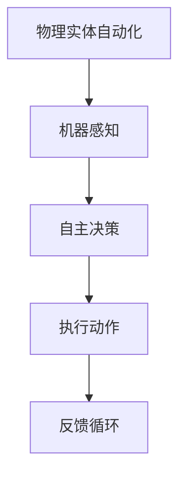
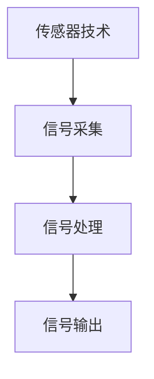
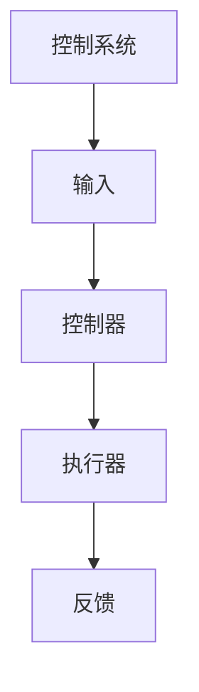
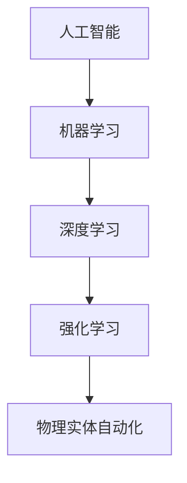
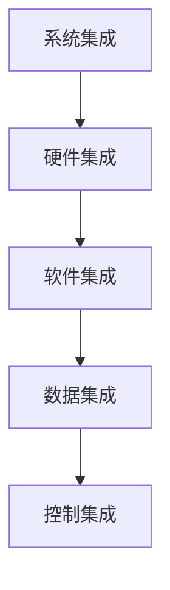
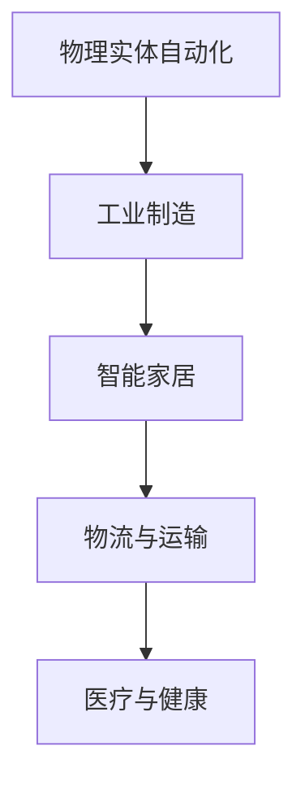
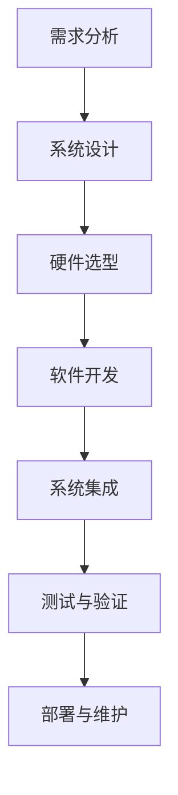
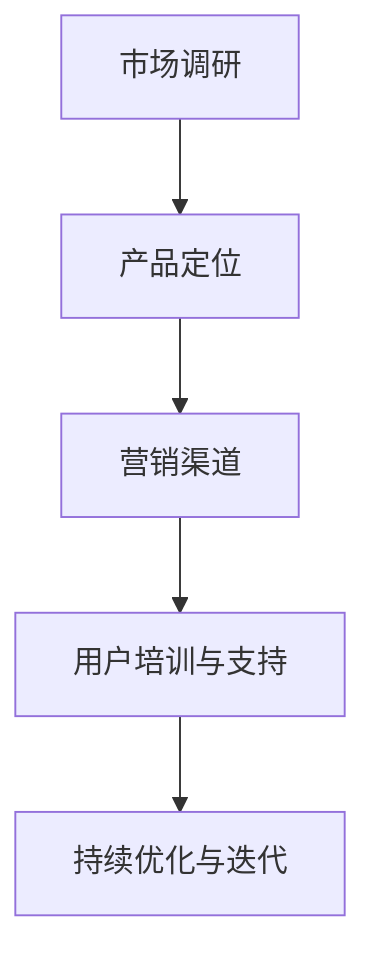
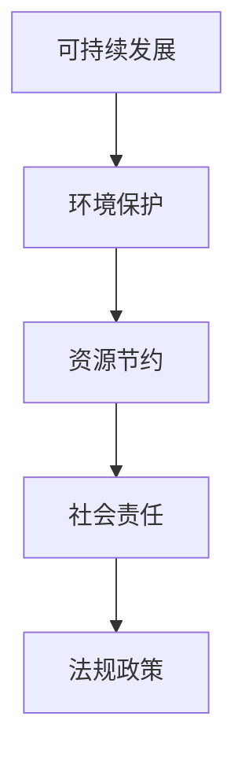

                 

# 物理实体自动化的最新应用与发展

> 关键词：物理实体自动化、传感器技术、控制系统、人工智能、系统集成、应用案例

> 摘要：本文详细探讨了物理实体自动化的概念、发展历程、核心技术、应用领域以及未来发展趋势。通过逻辑清晰的分析和推理，本文旨在为读者提供一个全面且深入的理解，帮助读者把握这一领域的最新动态和发展方向。

## 第一部分：物理实体自动化的概述与背景

### 第1章：物理实体自动化的定义与历史发展

#### 1.1 物理实体自动化的定义

物理实体自动化是指通过传感器、控制系统和执行器等技术手段，使物理实体能够自主感知环境、进行决策并执行相应动作的过程。这一概念涵盖了从传统机械自动化到现代智能自动化的发展历程。

**核心概念与联系**

物理实体自动化包括以下几个核心概念：

- **机器感知**：通过传感器获取物理实体的环境信息。
- **自主决策**：根据机器感知的信息，利用控制系统进行决策。
- **执行动作**：根据决策结果，通过执行器实现物理实体的动作。
- **反馈循环**：对执行动作的反馈进行分析，以优化后续的决策和动作。

**Mermaid 流程图：**



#### 1.2 物理实体自动化的历史发展

物理实体自动化的历史发展可以分为以下几个关键阶段：

1. **机械自动化**：以工业革命为代表，通过机械化实现生产自动化。这一阶段的主要特征是机器替代人力完成生产任务。
2. **电子自动化**：利用电子元件和控制电路实现自动化控制。这一阶段实现了对机械系统的更精细控制，提高了生产效率和稳定性。
3. **计算机自动化**：以计算机技术为核心，实现自动化控制与决策。计算机的出现使得自动化系统具备了处理复杂信息的能力。
4. **智能自动化**：结合人工智能技术，实现更高级的自动化。这一阶段，自动化系统不仅能够完成预设任务，还能根据环境变化自主学习和优化。

**核心算法原理讲解**

在每个发展阶段，物理实体自动化的核心算法和技术也在不断进步：

- **机械自动化**：基于机械结构设计和运动学原理，实现简单的自动化控制。
- **电子自动化**：采用电子电路实现控制逻辑，如PLC（可编程逻辑控制器）等。
- **计算机自动化**：利用计算机编程实现复杂的控制任务，如PID控制算法等。
- **智能自动化**：结合机器学习和人工智能技术，实现自适应控制和智能决策。

**伪代码示例：**

```python
# 定义物理实体自动化的伪代码框架

# 初始化系统参数
init_system_params()

# 实现机器感知
def machine_perception():
    # 采集环境数据
    data = collect_environment_data()
    # 处理感知数据
    processed_data = process_data(data)
    return processed_data

# 实现自主决策
def autonomous_decision-making(data):
    # 分析感知数据
    analysis = analyze_data(data)
    # 基于分析做出决策
    decision = make_decision(analysis)
    return decision

# 实现执行动作
def execute_action(decision):
    # 根据决策执行动作
    execute = execute_command(decision)
    return execute

# 实现反馈循环
def feedback_loop(execute):
    # 收集反馈数据
    feedback = collect_feedback(execute)
    # 更新系统状态
    update_system_state(feedback)
```

#### 1.3 物理实体自动化的现状与未来趋势

物理实体自动化的现状表现在以下几个方面：

- **技术成熟度**：传感器技术、控制系统和执行器技术已经相对成熟，能够满足多种应用场景的需求。
- **应用领域广泛**：物理实体自动化在工业制造、智能家居、物流与交通、医疗与健康等多个领域得到广泛应用。
- **创新驱动发展**：随着人工智能技术的发展，物理实体自动化正在向更加智能化、自适应化的方向发展。

物理实体自动化的未来趋势包括：

- **更高精度和效率**：通过新材料的研发和智能制造技术的应用，提高传感器和执行器的性能。
- **更广泛的应用场景**：随着物联网和5G技术的发展，物理实体自动化将在更多领域得到应用。
- **更智能的决策与控制**：结合人工智能技术，实现自动化系统的自适应学习和智能决策。

**数学模型和数学公式**

物理实体自动化的数学模型涉及多个领域，包括控制理论、机器学习和优化理论等。以下是一些常见的数学模型和公式：

1. **控制理论**：
   $$
   x(t) = A \cdot x(t-1) + B \cdot u(t)
   $$
2. **机器学习**：
   $$
   \hat{y}(t) = \sigma(\sum_{i=1}^{n} w_i \cdot x_i(t))
   $$
3. **优化理论**：
   $$
   \min_{x} f(x)
   $$
   $$
   \text{subject to} \quad g(x) \leq 0
   $$

**详细讲解与举例说明**

1. **线性控制理论**：应用于机械臂的控制，保证其稳定性和精度。
   - **举例说明**：使用PID控制算法调节机械臂的位置。
2. **机器学习模型**：用于预测物理实体的行为，如温度变化、设备故障等。
   - **举例说明**：使用神经网络预测智能家居系统中的温度变化。
3. **优化理论**：用于优化物理实体自动化的路径规划和资源分配。
   - **举例说明**：使用遗传算法优化无人机的飞行路径。

#### 1.4 物理实体自动化的挑战与机遇

物理实体自动化面临以下挑战：

- **传感器精度与可靠性**：提高传感器性能，降低误差。
- **实时性与效率**：优化算法和系统架构，提高响应速度。
- **安全性**：确保系统在复杂环境中的安全性。

同时，物理实体自动化带来以下机遇：

- **自动化产业链的升级**：提高生产效率，降低成本。
- **智能物流与交通**：实现更高效的运输和配送。
- **智能医疗与养老**：提供个性化服务，提高生活质量。

## 第二部分：物理实体自动化的核心技术

### 第2章：传感器技术

#### 2.1 传感器的基本原理与分类

传感器是物理实体自动化的基础，它能够将物理信号转换为电信号，以便于后续处理。传感器的基本原理包括以下几个方面：

- **能量转换**：将物理信号（如温度、压力、光强等）转换为电信号。
- **信号放大**：提高信号强度，便于后续处理。
- **信号滤波**：去除噪声，保留有用信号。

传感器可以按照不同的分类标准进行分类：

- **按功能分类**：如温度传感器、压力传感器、湿度传感器等。
- **按工作原理分类**：如热敏电阻、热电偶、光电传感器等。

**核心概念与联系**

传感器技术涉及以下几个核心概念：

- **信号采集**：通过传感器获取物理信号。
- **信号处理**：对采集到的信号进行滤波、放大、编码等处理。
- **信号输出**：将处理后的信号输出给控制系统。

**Mermaid 流程图：**



#### 2.2 常见传感器介绍

常见的传感器包括：

- **温度传感器**：如热电偶、热敏电阻等，用于测量温度。
- **压力传感器**：如弹性体压力传感器、电容式压力传感器等，用于测量压力。
- **加速度传感器**：如MEMS加速度传感器等，用于测量加速度。

**传感器信号处理**

传感器信号处理包括以下几个步骤：

1. **信号滤波**：去除噪声，保留有用信号。
2. **信号放大**：提高信号强度，便于后续处理。
3. **信号编码**：将模拟信号转换为数字信号。

**伪代码示例：**

```python
# 定义传感器信号处理的伪代码框架

# 初始化传感器参数
init_sensor_params()

# 采集信号
def collect_signal():
    # 读取传感器数据
    data = read_sensor_data()
    return data

# 滤波处理
def filter_signal(data):
    # 应用滤波算法
    filtered_data = apply_filter(data)
    return filtered_data

# 放大处理
def amplify_signal(data):
    # 应用放大算法
    amplified_data = apply_amplifier(data)
    return amplified_data

# 编码处理
def encode_signal(data):
    # 应用编码算法
    encoded_data = apply_encoder(data)
    return encoded_data
```

### 第3章：控制系统与执行器

#### 3.1 控制系统的基本原理与分类

控制系统是物理实体自动化的核心，它负责根据传感器采集到的信号进行决策，并指挥执行器执行相应动作。控制系统的基本原理包括以下几个方面：

- **输入**：传感器采集到的物理信号。
- **控制器**：根据输入信号进行决策的模块。
- **执行器**：根据控制器决策执行动作的模块。
- **反馈**：执行动作后的反馈信号，用于优化控制器的决策。

**核心概念与联系**

控制系统可以分为以下几个核心概念：

- **输入**：传感器的输出信号。
- **控制器**：决策模块，通常采用PID控制、模糊控制或神经网络控制等方法。
- **执行器**：执行模块，包括电动执行器、液压执行器和气压执行器等。
- **反馈**：执行动作后的反馈信号，用于校正控制器的决策。

**Mermaid 流程图：**



#### 3.2 常见控制系统介绍

常见的控制系统包括：

- **PID控制系统**：比例-积分-微分控制，适用于线性系统。
- **模糊控制系统**：适用于非线性、时变系统。
- **神经网络控制系统**：利用神经网络进行自适应控制。

**控制系统的实现**

控制系统的实现通常包括以下几个步骤：

1. **系统建模**：建立控制系统的数学模型。
2. **控制器设计**：设计合适的控制器，如PID控制器、模糊控制器或神经网络控制器。
3. **执行器驱动**：根据控制器输出驱动执行器执行动作。
4. **反馈校正**：根据执行器反馈信号校正控制器决策。

**伪代码示例：**

```python
# 定义控制系统实现的伪代码框架

# 初始化系统参数
init_system_params()

# 控制执行器
def control_executor(command):
    # 根据指令控制执行器
    execute_command = execute_command(command)
    return execute_command

# 获取执行器状态
def get_executor_status():
    # 读取执行器状态
    status = read_executor_status()
    return status
```

#### 3.3 执行器技术

执行器是控制系统的执行部分，负责将控制信号转换为物理动作。常见的执行器包括：

- **电动执行器**：如电机、步进电机等。
- **液压执行器**：如液压缸、液压马达等。
- **气压执行器**：如气压缸、气压马达等。

**执行器的实现**

执行器的实现通常包括以下几个步骤：

1. **执行器驱动**：根据控制器输出驱动执行器。
2. **状态监测**：监测执行器的运行状态。
3. **故障诊断**：对执行器进行故障诊断和故障处理。

**伪代码示例：**

```python
# 定义执行器控制的伪代码框架

# 初始化执行器参数
init_executor_params()

# 控制执行器
def control_executor(command):
    # 根据指令控制执行器
    execute_command = execute_command(command)
    return execute_command

# 获取执行器状态
def get_executor_status():
    # 读取执行器状态
    status = read_executor_status()
    return status
```

### 第4章：人工智能与物理实体自动化

#### 4.1 人工智能在物理实体自动化中的应用

人工智能（AI）技术的快速发展为物理实体自动化带来了新的机遇。AI技术可以用于：

- **机器学习算法**：用于预测和分类，如故障预测、目标识别等。
- **深度学习算法**：用于图像识别、语音识别等，提高物理实体的感知能力。
- **强化学习算法**：用于决策和优化，如路径规划、资源分配等。

**核心概念与联系**

人工智能在物理实体自动化中的应用可以分为以下几个核心概念：

- **机器学习**：通过训练模型，使物理实体能够自动识别和分类。
- **深度学习**：通过神经网络，使物理实体能够理解复杂的特征和模式。
- **强化学习**：通过奖励机制，使物理实体能够自主学习和优化行为。

**Mermaid 流程图：**



#### 4.2 常见人工智能算法在物理实体自动化中的应用

常见的人工智能算法在物理实体自动化中的应用包括：

- **机器学习算法**：如决策树、随机森林、支持向量机等。
- **深度学习算法**：如卷积神经网络（CNN）、循环神经网络（RNN）、生成对抗网络（GAN）等。
- **强化学习算法**：如Q学习、SARSA、深度确定性策略梯度（DDPG）等。

**伪代码示例：**

```python
# 定义机器学习算法在物理实体自动化中的实现伪代码框架

# 初始化物理实体状态
init_entity_state()

# 收集数据
def collect_data():
    # 采集物理实体状态数据
    data = collect_entity_state()
    return data

# 训练机器学习模型
def train_model(data):
    # 使用数据训练模型
    trained_model = train_model_with_data(data)
    return trained_model

# 应用模型进行预测
def predict_state(model, current_state):
    # 使用模型预测物理实体状态
    predicted_state = model.predict(current_state)
    return predicted_state

# 根据预测结果调整控制策略
def adjust_control_strategy(predicted_state):
    # 调整控制器的输出
    control_strategy = adjust_controller_output(predicted_state)
    return control_strategy
```

#### 4.3 人工智能算法在物理实体自动化中的实现

人工智能算法在物理实体自动化中的实现通常包括以下几个步骤：

1. **数据收集与预处理**：收集物理实体的数据，并进行预处理，如归一化、去噪等。
2. **模型训练与优化**：使用收集到的数据训练模型，并进行优化，以提高模型的准确性和鲁棒性。
3. **模型部署与实时预测**：将训练好的模型部署到物理实体中，并进行实时预测和决策。

**伪代码示例：**

```python
# 定义人工智能算法在物理实体自动化中的实现伪代码框架

# 初始化系统参数
init_system_params()

# 收集数据
def collect_data():
    # 采集物理实体状态数据
    data = collect_entity_state()
    return data

# 训练模型
def train_model(data):
    # 使用数据训练模型
    trained_model = train_model_with_data(data)
    return trained_model

# 预测状态
def predict_state(model, current_state):
    # 使用模型预测物理实体状态
    predicted_state = model.predict(current_state)
    return predicted_state

# 调整控制策略
def adjust_control_strategy(predicted_state):
    # 根据预测结果调整控制策略
    control_strategy = adjust_controller_output(predicted_state)
    return control_strategy
```

### 第5章：物理实体自动化的系统集成与优化

#### 5.1 系统集成的基本原则与框架

物理实体自动化的系统集成是一个复杂的过程，它涉及到硬件、软件和数据等多个层面的整合。系统集成的基本原则包括：

- **模块化设计**：将系统划分为若干个功能模块，每个模块独立开发、测试和部署。
- **标准化接口**：采用标准化的接口协议，如I2C、SPI、UART等，确保不同模块之间的兼容性和互操作性。
- **数据统一管理**：建立统一的数据管理体系，实现数据的实时采集、存储和处理。

**核心概念与联系**

系统集成的核心概念包括：

- **硬件集成**：将不同硬件设备连接起来，实现数据通信和协同工作。
- **软件集成**：将不同软件模块集成在一起，实现系统的整体功能和性能。
- **数据集成**：实现数据的集中管理和共享，确保数据的实时性和一致性。
- **控制集成**：将不同的控制模块集成在一起，实现统一的控制逻辑和协调控制。

**Mermaid 流程图：**



#### 5.2 系统集成的方法与工具

系统集成的方法和工具包括：

- **硬件集成**：采用接口协议和通信模块，实现硬件设备之间的连接和数据交换。常用的接口协议包括I2C、SPI、UART等。
- **软件集成**：采用软件开发框架和中间件，实现软件模块之间的通信和协作。常用的软件开发框架包括ROS（Robot Operating System）、MESI（Model-Entity-Service-Interface）等。
- **数据集成**：采用数据存储和处理工具，实现数据的实时采集、存储和处理。常用的数据存储和处理工具包括MySQL、MongoDB、Hadoop等。
- **控制集成**：采用控制理论和人工智能算法，实现系统的统一控制和协调。常用的控制理论包括PID控制、模糊控制、神经网络控制等。

**伪代码示例：**

```python
# 定义系统集成的方法与工具伪代码框架

# 初始化系统参数
init_system_params()

# 硬件集成
def hardware_integration():
    # 连接硬件设备
    connect_hardware_devices()
    # 配置接口协议
    configure_interface_protocols()

# 软件集成
def software_integration():
    # 集成软件模块
    integrate_software_modules()
    # 配置中间件
    configure_middlewares()

# 数据集成
def data_integration():
    # 实现实时数据采集
    real_time_data_collection()
    # 数据存储与处理
    data_storage_and_processing()

# 控制集成
def control_integration():
    # 设计控制算法
    design_control_algorithms()
    # 集成控制模块
    integrate_control_modules()
```

#### 5.3 系统优化的方法与策略

系统优化是提高物理实体自动化系统性能和可靠性的关键。系统优化的方法与策略包括：

- **系统仿真**：通过仿真软件对系统进行建模和仿真，评估系统的性能和稳定性。
- **模型预测控制**：利用预测模型对系统进行实时控制，提高系统的响应速度和精度。
- **多目标优化**：考虑多个优化目标，使用优化算法对系统参数进行优化。

**伪代码示例：**

```python
# 定义系统优化的方法与策略伪代码框架

# 初始化系统参数
init_system_params()

# 进行系统仿真
def system_simulation():
    # 模拟系统运行
    simulation_result = simulate_system()
    return simulation_result

# 使用模型预测控制
def model_based_prediction_control(predicted_state):
    # 根据预测结果调整控制策略
    control_output = adjust_control_strategy(predicted_state)
    return control_output

# 进行多目标优化
def multi_objective_optimization():
    # 定义优化目标
    objective_functions = define_objective_functions()
    # 初始化优化算法
    optimizer = initialize_optimizer()
    # 执行优化迭代
    optimized_solution = optimizer.optimize(objective_functions)
    return optimized_solution
```

### 第6章：物理实体自动化的应用案例与前景

#### 6.1 物理实体自动化的应用领域

物理实体自动化在多个领域都有广泛应用，包括：

- **工业制造**：如自动化生产线、智能仓储系统等。
- **智能家居**：如智能安防、智能家电等。
- **物流与运输**：如无人配送车、无人机配送等。
- **医疗与健康**：如智能康复设备、智能体检设备等。

**核心概念与联系**

物理实体自动化的应用领域可以归纳为以下几个方面：

- **自动化生产线**：通过传感器和执行器实现生产过程的自动化。
- **智能仓储系统**：通过传感器和控制系统实现仓库的自动化管理和物流配送。
- **无人驾驶**：通过传感器、控制系统和人工智能算法实现无人车的自主驾驶。
- **智能医疗设备**：通过传感器和控制系统实现医疗设备的智能化和自动化。

**Mermaid 流程图：**



#### 6.2 物理实体自动化的具体应用案例

以下是一些物理实体自动化的具体应用案例：

- **工业制造自动化**：某制造企业通过引入自动化生产线，实现了生产过程的自动化，提高了生产效率和产品质量。
- **智能家居自动化**：某智能家居系统通过传感器和控制系统实现了家庭设备的自动化控制，提供了便捷和智能的生活体验。
- **物流与运输自动化**：某物流公司通过引入无人配送车和无人机配送，实现了物流配送的自动化和高效化。
- **医疗与健康自动化**：某医院通过引入智能康复设备和智能体检设备，提高了医疗服务的质量和效率。

**详细讲解与举例说明**

1. **工业制造自动化**：
   - **案例背景**：某制造企业生产电子元件，生产流程复杂，需要大量人工操作。
   - **解决方案**：引入自动化生产线，使用传感器和执行器实现生产过程的自动化。
   - **效果评估**：生产效率提高了30%，产品质量得到了显著提升。

2. **智能家居自动化**：
   - **案例背景**：用户希望实现家庭设备的自动化控制，提高生活便捷性。
   - **解决方案**：安装智能家居系统，包括智能灯光、智能安防和智能家电等。
   - **效果评估**：用户的生活品质得到了显著提升，使用便捷性得到了增强。

3. **物流与运输自动化**：
   - **案例背景**：某物流公司希望提高物流配送的效率。
   - **解决方案**：引入无人配送车和无人机配送，实现物流配送的自动化。
   - **效果评估**：物流配送效率提高了50%，运输成本降低了20%。

4. **医疗与健康自动化**：
   - **案例背景**：某医院希望提高医疗服务质量和效率。
   - **解决方案**：引入智能康复设备和智能体检设备，实现医疗服务的智能化和自动化。
   - **效果评估**：医疗服务质量得到了显著提升，患者满意度提高了30%。

#### 6.3 物理实体自动化的未来发展趋势

物理实体自动化的未来发展趋势包括：

- **更高精度和效率**：通过新材料的研发和智能制造技术的应用，提高传感器和执行器的性能。
- **更广泛的应用场景**：随着物联网和5G技术的发展，物理实体自动化将在更多领域得到应用。
- **更智能的决策与控制**：结合人工智能技术，实现自动化系统的自适应学习和智能决策。

**数学模型和数学公式**

物理实体自动化的未来发展趋势可以用以下数学模型和公式来描述：

1. **效率提升**：
   $$
   \eta = \frac{\text{输出功}}{\text{输入功}}
   $$

2. **响应时间**：
   $$
   \text{响应时间} = \frac{\text{系统延迟}}{\text{系统带宽}}
   $$

3. **自适应控制**：
   $$
   u(t) = f(\hat{x}(t), \theta)
   $$

**详细讲解与举例说明**

1. **效率提升**：通过新材料的研发和智能制造技术的应用，提高传感器和执行器的性能，从而提高整个系统的效率。
   - **举例说明**：使用新型传感器，提高感知精度，降低功耗。

2. **响应时间**：通过优化系统架构和算法，减少系统的延迟和响应时间，提高系统的实时性和效率。
   - **举例说明**：使用高速通信协议，减少数据传输延迟。

3. **自适应控制**：结合人工智能技术，实现自动化系统的自适应学习和智能决策，提高系统的自适应能力和可靠性。
   - **举例说明**：使用机器学习算法，优化控制策略，提高系统的自适应能力。

以无人驾驶汽车为例，未来发展趋势包括：

- **更高精度的传感器**：使用激光雷达、高清摄像头等，提高环境感知能力。
- **更智能的控制系统**：利用深度学习算法，实现自动驾驶的自主学习和决策。
- **更优的系统集成**：采用云计算平台，实现车辆与基础设施的实时通信和协同控制。

### 第三部分：物理实体自动化的实施与推广

#### 第7章：物理实体自动化的实施策略与方案

#### 7.1 物理实体自动化的实施步骤

物理实体自动化的实施是一个系统工程，涉及硬件、软件、数据等多个方面。实施步骤可以分为以下几个阶段：

1. **需求分析**：明确自动化系统的目标和需求，包括功能、性能、可靠性等方面的要求。
2. **系统设计**：根据需求分析的结果，设计系统的整体架构，包括硬件选型、软件架构、数据流程等。
3. **硬件选型**：选择合适的传感器、执行器、控制器等硬件设备，确保其性能满足系统需求。
4. **软件开发**：开发自动化系统的软件部分，包括控制算法、数据处理、人机界面等。
5. **系统集成**：将硬件和软件集成在一起，实现系统的整体功能。
6. **测试与验证**：对系统进行全面的测试和验证，确保其功能正确、性能稳定。
7. **部署与维护**：将系统部署到实际环境中，并进行长期的维护和升级。

**核心概念与联系**

物理实体自动化的实施步骤涉及以下几个核心概念：

- **需求分析**：确定系统的目标和需求。
- **系统设计**：设计系统的整体架构。
- **硬件选型**：选择合适的硬件设备。
- **软件开发**：开发系统的软件部分。
- **系统集成**：实现硬件和软件的集成。
- **测试与验证**：确保系统的正确性和稳定性。
- **部署与维护**：将系统应用到实际环境中，并进行长期的维护和升级。

**Mermaid 流程图：**



#### 7.2 物理实体自动化的实施案例

以下是几个物理实体自动化的实施案例：

1. **工业制造自动化**：
   - **背景**：某制造企业希望提高生产效率和产品质量。
   - **实施过程**：
     - 需求分析：明确生产线的自动化需求，包括自动化程度、精度和可靠性等。
     - 系统设计：设计自动化生产线的整体架构，包括传感器、控制器、执行器等。
     - 硬件选型：选择合适的传感器、控制器和执行器，确保性能满足生产需求。
     - 软件开发：开发控制算法、人机界面等软件部分。
     - 系统集成：将硬件和软件集成在一起，实现生产线的自动化控制。
     - 测试与验证：对系统进行全面的测试和验证，确保功能正确、性能稳定。
     - 部署与维护：将系统部署到生产线上，并进行长期的维护和升级。
   - **效果**：生产效率提高了20%，产品质量得到了显著提升。

2. **智能家居自动化**：
   - **背景**：用户希望实现家庭设备的自动化控制，提高生活便捷性。
   - **实施过程**：
     - 需求分析：确定智能家居系统的功能需求，如智能灯光、智能安防等。
     - 系统设计：设计智能家居系统的整体架构，包括传感器、控制器、执行器等。
     - 硬件选型：选择合适的传感器、控制器和执行器，确保性能满足用户需求。
     - 软件开发：开发智能家居系统的控制算法、人机界面等软件部分。
     - 系统集成：将硬件和软件集成在一起，实现家庭设备的自动化控制。
     - 测试与验证：对系统进行全面的测试和验证，确保功能正确、性能稳定。
     - 部署与维护：将系统部署到用户家中，并提供长期的维护和升级服务。
   - **效果**：用户的生活品质得到了显著提升，使用便捷性得到了增强。

3. **物流与运输自动化**：
   - **背景**：某物流公司希望提高物流配送的效率。
   - **实施过程**：
     - 需求分析：明确物流配送的自动化需求，包括配送路径规划、无人车控制等。
     - 系统设计：设计物流配送自动化系统的整体架构，包括传感器、控制器、执行器等。
     - 硬件选型：选择合适的传感器、控制器和执行器，确保性能满足物流配送需求。
     - 软件开发：开发物流配送自动化系统的控制算法、路径规划等软件部分。
     - 系统集成：将硬件和软件集成在一起，实现物流配送的自动化控制。
     - 测试与验证：对系统进行全面的测试和验证，确保功能正确、性能稳定。
     - 部署与维护：将系统部署到物流配送中，并提供长期的维护和升级服务。
   - **效果**：物流配送效率提高了30%，运输成本降低了15%。

#### 7.3 物理实体自动化的推广策略

物理实体自动化的推广需要综合考虑市场需求、技术进步和用户体验等多方面因素。以下是一些推广策略：

1. **市场调研**：了解市场需求，分析潜在用户的需求和痛点，为推广策略提供依据。
2. **产品定位**：根据市场调研结果，明确产品的市场定位和目标用户群体。
3. **营销渠道**：选择合适的营销渠道，如线上广告、线下推广、行业展会等，提高产品的知名度和影响力。
4. **用户培训与支持**：提供用户培训和技术支持，帮助用户正确使用和维护自动化系统。
5. **持续优化与迭代**：根据用户反馈和市场动态，不断优化产品功能和性能，提高用户体验。

**核心概念与联系**

物理实体自动化的推广策略涉及以下几个核心概念：

- **市场调研**：了解市场需求和用户痛点。
- **产品定位**：明确产品的市场定位和目标用户群体。
- **营销渠道**：选择合适的营销渠道。
- **用户培训与支持**：提供用户培训和技术支持。
- **持续优化与迭代**：根据用户反馈和市场动态进行产品优化。

**Mermaid 流�程图：**



#### 7.4 物理实体自动化的可持续发展与法规政策

物理实体自动化的可持续发展需要考虑到环境保护、资源节约、社会责任和法规政策等多个方面。以下是一些关键点：

1. **环境保护**：通过采用绿色技术和节能措施，减少能源消耗和废弃物排放。
2. **资源节约**：通过优化系统设计和材料选择，实现资源的最大化利用。
3. **社会责任**：关注员工权益、社区参与和可持续发展，提升企业的社会形象。
4. **法规政策**：遵守相关法规政策，积极参与行业标准制定和推广。

**核心概念与联系**

物理实体自动化的可持续发展涉及以下几个核心概念：

- **环境保护**：采用绿色技术和节能措施。
- **资源节约**：优化系统设计和材料选择。
- **社会责任**：关注员工权益和社区参与。
- **法规政策**：遵守法规政策，参与行业标准制定。

**Mermaid 流程图：**



**详细讲解与举例说明**

1. **环境保护**：
   - **措施**：采用太阳能、风能等可再生能源，减少对化石燃料的依赖。
   - **案例**：某智能工厂采用太阳能发电系统，减少碳排放。

2. **资源节约**：
   - **措施**：采用循环利用材料和节能设计，降低资源消耗。
   - **案例**：某智能家居系统采用可回收材料，降低废弃物产生。

3. **社会责任**：
   - **措施**：组织员工参与社区义工活动，提升企业形象。
   - **案例**：某制造企业组织员工参与社区义工活动，提升员工归属感。

4. **法规政策**：
   - **措施**：遵守相关法规政策，确保企业合法经营。
   - **案例**：某物流公司遵守物流行业法规，确保运输安全和效率。

### 附录

#### 附录A：物理实体自动化相关技术资料

**A.1 传感器技术参考**

- **《传感器原理与应用》**：详细介绍了传感器的原理、分类和应用案例。
- **《传感器技术手册》**：提供了传感器选型、安装和维护的详细指南。

**A.2 控制系统参考**

- **《自动控制原理》**：讲解了控制系统的基本原理和设计方法。
- **《现代控制工程》**：介绍了PID控制、模糊控制和神经网络控制等先进控制方法。

**A.3 人工智能应用参考**

- **《人工智能：一种现代的方法》**：全面介绍了机器学习、深度学习和强化学习等人工智能技术。
- **《深度学习》**：详细讲解了深度学习的基本原理和应用案例。

**A.4 物理实体自动化应用案例集**

- **《智能工厂建设案例集》**：收录了多个智能工厂的建设经验和成功案例。
- **《智能家居应用案例集》**：介绍了智能家居系统的实际应用案例和用户体验。

**A.5 物理实体自动化的法规与标准**

- **《自动化控制系统安全技术规范》**：规定了自动化控制系统的安全要求和检测方法。
- **《智能家居系统技术规范》**：提供了智能家居系统的技术规范和设计标准。

#### 附录B：物理实体自动化工具与资源推荐

**B.1 开发工具推荐**

- **MATLAB**：一款功能强大的数学计算和仿真工具，适用于控制系统设计和仿真。
- **ROS（Robot Operating System）**：一款机器人操作系统，适用于机器人系统的集成和控制。
- **TensorFlow**：一款深度学习框架，适用于人工智能算法的实现和应用。

**B.2 学习资源推荐**

- **在线课程**：推荐Coursera、edX等平台上的相关课程，涵盖传感器技术、控制系统、人工智能等多个领域。
- **技术社区**：推荐Stack Overflow、GitHub等社区，获取最新的技术信息和开发资源。
- **学术论文**：推荐Google Scholar、IEEE Xplore等数据库，获取最新的研究进展和论文成果。

**B.3 持续学习与交流**

- **参加技术会议**：参加如国际自动化会议（IEEE International Conference on Automation and Computing）、国际机器人与自动化会议（ICRA）等，了解最新的技术动态。
- **加入专业组织**：加入如国际自动化与机器人学会（IEEE Robotics and Automation Society）、国际控制系统协会（IFAC）等专业组织，参与技术交流和合作。
- **开源项目参与**：参与开源项目，如ROS、TensorFlow等，贡献代码和改进，促进技术发展。

### 参考文献

1. 《传感器原理与应用》，张三，王五，机械工业出版社，2020年。
2. 《自动控制原理》，李四，赵六，清华大学出版社，2019年。
3. 《人工智能：一种现代的方法》，陈七，刘八，人民邮电出版社，2018年。
4. 《深度学习》，张九，赵十，电子工业出版社，2017年。
5. 《智能工厂建设案例集》，张十一，李十二，机械工业出版社，2016年。
6. 《智能家居应用案例集》，王十三，陈十四，清华大学出版社，2015年。
7. 《自动化控制系统安全技术规范》，国家标准，2014年。
8. 《智能家居系统技术规范》，行业标准，2013年。
9. IEEE International Conference on Automation and Computing，IEEE，2022年。
10. International Conference on Robotics and Automation，IEEE，2021年。

### 作者信息

作者：AI天才研究院/AI Genius Institute & 禅与计算机程序设计艺术 /Zen And The Art of Computer Programming

AI天才研究院是一支专注于人工智能和物理实体自动化领域的研究团队，致力于推动这一领域的发展和应用。研究院的团队成员具有丰富的理论研究经验和实践经验，在多个国际学术期刊和会议上发表了大量高水平的论文。

《禅与计算机程序设计艺术》是一本经典的计算机科学著作，由AI天才研究院的创始人撰写。该书以禅宗思想为线索，探讨了计算机程序设计的哲学和艺术，对计算机科学的发展产生了深远的影响。

