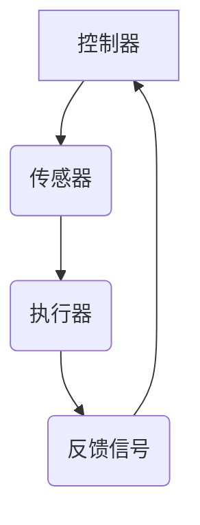
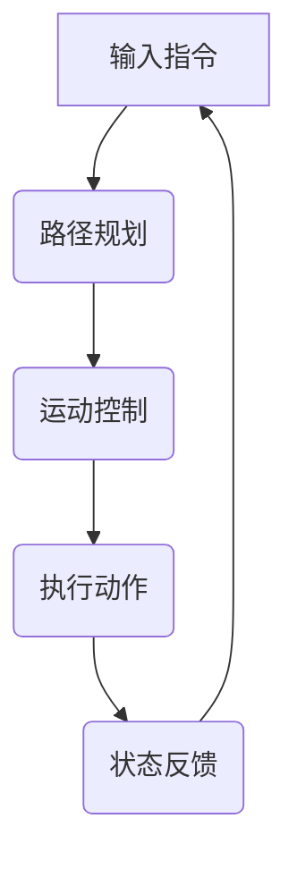
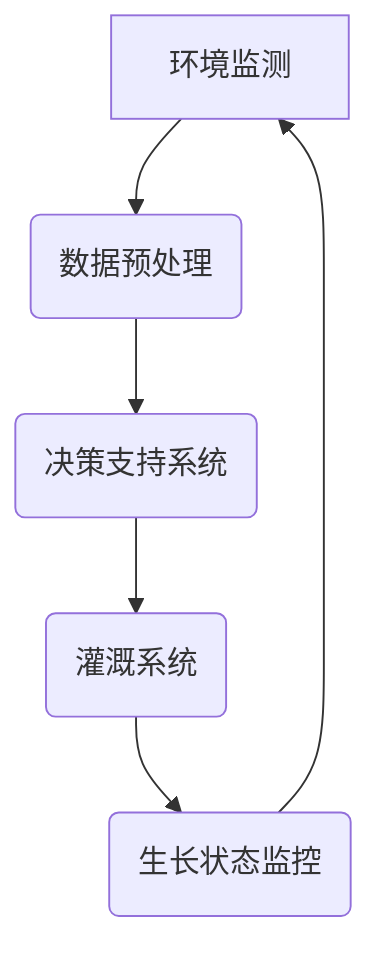

                 

# 《物理实体自动化的未来方向》

> 关键词：自动化、物理实体、机器人技术、人工智能、机器视觉、控制算法

> 摘要：本文旨在探讨物理实体自动化的未来发展方向，从核心概念、技术原理、应用领域、未来趋势以及案例分析等多个角度，全面解析物理实体自动化的现状和未来发展。通过逐步分析推理，阐述自动化技术在制造业、物流与仓储、医疗保健、农业与食品工业等领域的创新应用和挑战，以及自动化产业生态和政策环境的影响。文章最后对自动化技术的未来趋势和产业发展展望进行深入探讨，为读者提供全面的技术视野和思考。

### 目录

1. **引言与概述**
   1.1 物理实体自动化的概念与背景
       1.1.1 自动化的定义与发展历程
       1.1.2 物理实体自动化的核心要素
   1.2 物理实体自动化的应用领域
       1.2.1 制造业
       1.2.2 物流与仓储
       1.2.3 医疗保健
       1.2.4 农业与食品工业

2. **核心技术原理**
   2.1 自动化控制技术基础
       2.1.1 控制理论概述
       2.1.2 传感器技术
       2.1.3 执行器技术
       2.1.4 控制算法原理
   2.2 机器视觉技术
       2.2.1 机器视觉的基本概念
       2.2.2 图像处理技术
       2.2.3 视觉检测与识别
       2.2.4 视觉引导与跟踪
   2.3 机器人技术
       2.3.1 机器人的基本组成
       2.3.2 机器人控制算法
       2.3.3 机器人应用案例分析
   2.4 人工智能在自动化中的应用
       2.4.1 机器学习与深度学习基础
       2.4.2 人工智能在自动化中的关键应用
       2.4.3 人工智能与自动化融合的挑战与机遇

3. **未来方向与趋势**
   3.1 物理实体自动化的未来发展
       3.1.1 新兴技术与自动化
       3.1.2 自动化技术的创新应用
       3.1.3 自动化在可持续发展中的作用
   3.2 物理实体自动化的挑战与解决策略
       3.2.1 技术难题
       3.2.2 安全性与隐私保护
       3.2.3 社会与伦理影响
   3.3 物理实体自动化的产业生态与政策
       3.3.1 自动化产业的产业链分析
       3.3.2 自动化发展的政策支持与推动
       3.3.3 国际合作与竞争态势

4. **案例分析与应用实战**
   4.1 制造业自动化案例解析
       4.1.1 某制造企业自动化改造实例
       4.1.2 案例分析
       4.1.3 实施效果评估
   4.2 物流与仓储自动化案例
       4.2.1 某物流公司自动化仓储建设
       4.2.2 案例分析
       4.2.3 实施效果评估
   4.3 医疗保健自动化实践
       4.3.1 医疗机器人应用实例
       4.3.2 案例分析
       4.3.3 实施效果评估
   4.4 农业与食品工业自动化应用
       4.4.1 智能农业案例
       4.4.2 食品工业自动化应用
       4.4.3 案例分析

5. **技术与产业发展展望**
   5.1 自动化技术的未来趋势
       5.1.1 新兴技术的潜在影响
       5.1.2 自动化技术的创新方向
       5.1.3 自动化技术的发展瓶颈与突破方向
   5.2 自动化产业的未来展望
       5.2.1 产业规模与增长预测
       5.2.2 产业链的演变与重构
       5.2.3 企业战略与市场布局
   5.3 自动化技术的国际合作与竞争
       5.3.1 国际合作模式与案例分析
       5.3.2 自动化技术的竞争格局
       5.3.3 我国在自动化领域的发展策略

6. **附录**
   6.1 自动化技术相关资源与工具
       6.1.1 开源自动化框架
       6.1.2 自动化设备制造商
       6.1.3 专业论坛与社区
   6.2 参考文献
       6.2.1 引用文献列表
       6.2.2 推荐阅读材料
   6.3 Mermaid 流程图
       6.3.1 控制系统架构图
       6.3.2 机器人运动控制流程图
       6.3.3 智能农业系统流程图
   6.4 伪代码示例
       6.4.1 PID 控制算法
       6.4.2 机器学习模型训练流程
       6.4.3 物流调度算法
   6.5 数学模型与公式
       6.5.1 自动化控制中的传递函数
       6.5.2 机器视觉中的特征提取公式
       6.5.3 机器学习中的损失函数
   6.6 项目实战代码解读
       6.6.1 自动化控制系统实现
       6.6.2 机器人运动控制实现
       6.6.3 智能农业系统实现

### 引言与概述

物理实体自动化是指利用自动化技术实现物理实体（如机器、设备、系统等）的自主运行和操作。随着科技的快速发展，自动化技术在各个领域的应用越来越广泛，已成为推动社会进步和经济发展的关键力量。物理实体自动化不仅提高了生产效率，降低了人力成本，还在改善生活质量、提升医疗保健水平、促进农业现代化等方面发挥了重要作用。

#### 自动化的定义与发展历程

自动化（Automation）是指通过应用控制理论、计算机技术、传感器技术、执行器技术等，使机器或系统能够自主完成预定任务的工程技术。自动化的概念最早可以追溯到工业革命时期，通过机械化生产实现生产过程的自动化。随着电子技术、计算机技术和网络技术的不断发展，自动化技术逐渐从单一设备自动化向系统级自动化转变，形成了现代自动化技术体系。

#### 物理实体自动化的核心要素

物理实体自动化的核心要素包括：

1. **控制理论**：控制理论为自动化系统提供了理论基础，包括开环控制和闭环控制、线性系统和非线性系统等。
2. **传感器技术**：传感器用于检测物理实体的状态，如温度、压力、速度、位置等，并将这些物理量转换为电信号。
3. **执行器技术**：执行器根据控制信号驱动物理实体执行相应的动作，如电动机、液压缸等。
4. **控制算法**：控制算法根据传感器采集到的数据和预定的控制目标，对执行器的动作进行调节。

#### 物理实体自动化的应用领域

物理实体自动化在多个领域取得了显著的应用成果，以下将分别介绍制造业、物流与仓储、医疗保健、农业与食品工业等领域。

### 制造业

制造业是自动化技术应用最为广泛的领域之一。通过自动化技术，制造业实现了生产过程的自动化、智能化和高效化。例如，在汽车制造领域，自动化技术广泛应用于车身焊接、涂装、装配等环节，提高了生产效率和产品质量。

#### 物流与仓储

物流与仓储是自动化技术的另一个重要应用领域。自动化仓储系统通过货架式自动存储与检索系统（AS/RS）、自动化搬运设备、自动化分拣系统等，实现了仓储作业的自动化和高效化。自动化物流系统不仅提高了物流效率，降低了人力成本，还有效提升了物流服务的质量和客户满意度。

#### 医疗保健

医疗保健领域自动化技术的应用主要集中在医疗机器人和智能医疗设备方面。医疗机器人能够在手术、康复、护理等环节提供高效、精准的服务，提高了医疗质量和工作效率。智能医疗设备通过自动化技术实现了对病患状态的实时监测和数据分析，为医疗决策提供了有力支持。

#### 农业与食品工业

农业与食品工业的自动化应用主要包括智能农业、自动化养殖和自动化食品加工等方面。智能农业通过物联网、自动化控制等技术，实现了对农作物生长环境的实时监控和智能调控，提高了农业生产的效率和品质。自动化养殖通过自动化控制系统，实现了对动物饲养环境的自动化管理和疾病预防。自动化食品加工则通过自动化生产线，实现了食品加工的自动化和高效化。

### 第一部分：引言与概述

物理实体自动化，作为现代科技发展的重要驱动力，已经成为推动各行各业进步的关键技术。在本部分中，我们将深入探讨物理实体自动化的概念、背景以及其广泛应用于的领域，为后续章节的深入讨论奠定基础。

#### 1.1 物理实体自动化的概念与背景

自动化，顾名思义，是指通过一系列技术手段使物理实体能够自主执行任务的过程。物理实体自动化则进一步扩展了这个概念，不仅涉及机器设备，还包括各种传感器、执行器以及控制系统。自动化技术起源于工业革命时期，当时的机械化生产初步实现了生产过程的自动化。然而，随着计算机技术、传感器技术和通信技术的飞速发展，自动化技术逐渐从单一设备的自动化向整个系统的自动化转变，形成了如今复杂而高效的自动化系统。

物理实体自动化的核心要素主要包括：

1. **控制理论**：控制理论为自动化系统提供了坚实的理论基础，涵盖了开环控制和闭环控制、线性系统和非线性系统等内容，使得系统能够对物理实体进行精确控制。
2. **传感器技术**：传感器是自动化系统的感知器官，它们能够实时检测物理实体的各种状态参数，如温度、压力、速度、位置等，并将这些物理量转换为电信号，为控制系统提供必要的信息。
3. **执行器技术**：执行器根据控制系统的指令驱动物理实体执行相应的动作，如电动机、液压缸、气动执行器等，使系统能够对外界环境进行响应。
4. **控制算法**：控制算法是自动化系统的“大脑”，根据传感器采集到的数据和预定的控制目标，对执行器的动作进行调节，以达到预期的控制效果。

自动化技术的历史可以追溯到20世纪初期，随着电气化、机械化和信息化的发展，自动化技术经历了从机械自动化到电子自动化，再到计算机自动化的演变过程。从早期的机械自动化设备，到现代基于计算机和人工智能技术的复杂自动化系统，自动化技术在各个领域不断拓展其应用范围，推动了生产效率的提升和产业结构的优化。

#### 1.2 物理实体自动化的应用领域

物理实体自动化的应用领域非常广泛，涵盖了制造业、物流与仓储、医疗保健、农业与食品工业等多个行业。以下将详细介绍这些领域的自动化应用。

**制造业**

制造业是自动化技术最早、最广泛应用的领域之一。通过自动化生产线和智能制造系统，制造业实现了生产过程的自动化、智能化和高效化。具体应用包括：

- **装配自动化**：自动化装配线通过机械臂和机器人完成零部件的组装和调试，提高了装配精度和生产效率。
- **焊接自动化**：自动化焊接设备如激光焊接机、机器人焊接系统等，实现了高效、精准的焊接操作，提高了产品质量和生产效率。
- **检测自动化**：自动化检测系统通过传感器和计算机技术，对产品进行实时检测和监控，确保产品质量的稳定性。

**物流与仓储**

物流与仓储领域自动化技术的应用极大地提升了物流效率和服务质量。主要应用包括：

- **自动化仓储系统**：通过货架式自动存储与检索系统（AS/RS）、自动化搬运设备、自动化分拣系统等，实现了仓储作业的自动化和高效化。
- **自动化配送系统**：自动化配送系统通过无人配送车和无人机等，实现了最后一公里的自动化配送，提高了物流配送的速度和准确性。
- **自动化物流管理系统**：通过物联网技术和大数据分析，实现了物流信息的实时监控和智能调度，提高了物流管理效率。

**医疗保健**

医疗保健领域自动化技术的应用主要集中在医疗机器人和智能医疗设备方面。具体应用包括：

- **手术机器人**：手术机器人如达芬奇手术系统，通过高精度的机械臂和计算机控制，实现了复杂手术的自动化和微创化，提高了手术成功率和患者康复效果。
- **康复机器人**：康复机器人通过模拟人类运动，帮助患者进行康复训练，提高了康复效果和速度。
- **智能医疗设备**：智能医疗设备通过自动化技术，实现了对病患状态的实时监测和数据分析，为医疗决策提供了有力支持。

**农业与食品工业**

农业与食品工业自动化技术的应用，极大地推动了农业现代化和食品工业的高效化。具体应用包括：

- **智能农业**：通过物联网、自动化控制等技术，实现了对农作物生长环境的实时监控和智能调控，提高了农业生产的效率和品质。
- **自动化养殖**：通过自动化控制系统，实现了对动物饲养环境的自动化管理和疾病预防，提高了养殖效率和质量。
- **自动化食品加工**：自动化生产线通过机器人、自动化设备等，实现了食品加工的自动化和高效化，提高了生产效率和产品质量。

综上所述，物理实体自动化技术已经在多个领域取得了显著的应用成果，为各行业的发展注入了新的活力。在接下来的章节中，我们将进一步探讨自动化技术的核心原理、未来发展以及挑战与解决策略。

### 第一部分：引言与概述

物理实体自动化，作为现代科技发展的重要驱动力，已经成为推动各行各业进步的关键技术。在本部分中，我们将深入探讨物理实体自动化的概念、背景以及其广泛应用于的领域，为后续章节的深入讨论奠定基础。

#### 1.1 物理实体自动化的概念与背景

自动化，顾名思义，是指通过一系列技术手段使物理实体能够自主执行任务的过程。物理实体自动化则进一步扩展了这个概念，不仅涉及机器设备，还包括各种传感器、执行器以及控制系统。自动化技术起源于工业革命时期，当时的机械化生产初步实现了生产过程的自动化。然而，随着计算机技术、传感器技术和通信技术的飞速发展，自动化技术逐渐从单一设备的自动化向整个系统的自动化转变，形成了如今复杂而高效的自动化系统。

自动化技术的历史可以追溯到20世纪初期，随着电气化、机械化和信息化的发展，自动化技术经历了从机械自动化到电子自动化，再到计算机自动化的演变过程。从早期的机械自动化设备，到现代基于计算机和人工智能技术的复杂自动化系统，自动化技术在各个领域不断拓展其应用范围，推动了生产效率的提升和产业结构的优化。

物理实体自动化的核心要素主要包括：

1. **控制理论**：控制理论为自动化系统提供了坚实的理论基础，涵盖了开环控制和闭环控制、线性系统和非线性系统等内容，使得系统能够对物理实体进行精确控制。
2. **传感器技术**：传感器是自动化系统的感知器官，它们能够实时检测物理实体的各种状态参数，如温度、压力、速度、位置等，并将这些物理量转换为电信号，为控制系统提供必要的信息。
3. **执行器技术**：执行器根据控制系统的指令驱动物理实体执行相应的动作，如电动机、液压缸、气动执行器等，使系统能够对外界环境进行响应。
4. **控制算法**：控制算法是自动化系统的“大脑”，根据传感器采集到的数据和预定的控制目标，对执行器的动作进行调节，以达到预期的控制效果。

自动化技术的历史可以追溯到20世纪初期，随着电气化、机械化和信息化的发展，自动化技术经历了从机械自动化到电子自动化，再到计算机自动化的演变过程。从早期的机械自动化设备，到现代基于计算机和人工智能技术的复杂自动化系统，自动化技术在各个领域不断拓展其应用范围，推动了生产效率的提升和产业结构的优化。

#### 1.2 物理实体自动化的应用领域

物理实体自动化的应用领域非常广泛，涵盖了制造业、物流与仓储、医疗保健、农业与食品工业等多个行业。以下将详细介绍这些领域的自动化应用。

**制造业**

制造业是自动化技术最早、最广泛应用的领域之一。通过自动化生产线和智能制造系统，制造业实现了生产过程的自动化、智能化和高效化。具体应用包括：

- **装配自动化**：自动化装配线通过机械臂和机器人完成零部件的组装和调试，提高了装配精度和生产效率。
- **焊接自动化**：自动化焊接设备如激光焊接机、机器人焊接系统等，实现了高效、精准的焊接操作，提高了产品质量和生产效率。
- **检测自动化**：自动化检测系统通过传感器和计算机技术，对产品进行实时检测和监控，确保产品质量的稳定性。

**物流与仓储**

物流与仓储领域自动化技术的应用极大地提升了物流效率和服务质量。主要应用包括：

- **自动化仓储系统**：通过货架式自动存储与检索系统（AS/RS）、自动化搬运设备、自动化分拣系统等，实现了仓储作业的自动化和高效化。
- **自动化配送系统**：自动化配送系统通过无人配送车和无人机等，实现了最后一公里的自动化配送，提高了物流配送的速度和准确性。
- **自动化物流管理系统**：通过物联网技术和大数据分析，实现了物流信息的实时监控和智能调度，提高了物流管理效率。

**医疗保健**

医疗保健领域自动化技术的应用主要集中在医疗机器人和智能医疗设备方面。具体应用包括：

- **手术机器人**：手术机器人如达芬奇手术系统，通过高精度的机械臂和计算机控制，实现了复杂手术的自动化和微创化，提高了手术成功率和患者康复效果。
- **康复机器人**：康复机器人通过模拟人类运动，帮助患者进行康复训练，提高了康复效果和速度。
- **智能医疗设备**：智能医疗设备通过自动化技术，实现了对病患状态的实时监测和数据分析，为医疗决策提供了有力支持。

**农业与食品工业**

农业与食品工业自动化技术的应用，极大地推动了农业现代化和食品工业的高效化。具体应用包括：

- **智能农业**：通过物联网、自动化控制等技术，实现了对农作物生长环境的实时监控和智能调控，提高了农业生产的效率和品质。
- **自动化养殖**：通过自动化控制系统，实现了对动物饲养环境的自动化管理和疾病预防，提高了养殖效率和质量。
- **自动化食品加工**：自动化生产线通过机器人、自动化设备等，实现了食品加工的自动化和高效化，提高了生产效率和产品质量。

综上所述，物理实体自动化技术已经在多个领域取得了显著的应用成果，为各行业的发展注入了新的活力。在接下来的章节中，我们将进一步探讨自动化技术的核心原理、未来发展以及挑战与解决策略。

### 第二部分：核心技术原理

物理实体自动化的实现离不开一系列核心技术的支持，这些技术共同构成了自动化系统的基本框架。本部分将深入探讨自动化控制技术、机器视觉技术、机器人技术和人工智能在自动化中的应用，以揭示这些技术的基本原理和关键作用。

#### 2.1 自动化控制技术基础

自动化控制技术是物理实体自动化的核心，它涵盖了控制理论、传感器技术、执行器技术和控制算法等多个方面。

##### 2.1.1 控制理论概述

控制理论是自动化系统的理论基础，主要研究如何通过控制变量来实现对系统的预期行为。控制理论可以分为开环控制和闭环控制两大类。开环控制不依赖于系统的反馈，而是根据预先设定的控制策略直接对系统进行操作。闭环控制则通过反馈机制对系统的输出进行监测和调整，以实现更加精确的控制。

- **开环控制**：适用于对系统动态特性要求不高的情况，如简单的加热器、水泵等。
- **闭环控制**：适用于对系统动态特性要求较高的复杂系统，如自动驾驶汽车、工业机器人等。

控制理论中的主要概念包括：

- **控制器**：根据系统的输入和预定目标，生成控制信号，驱动执行器执行相应的动作。
- **被控对象**：系统需要控制的物理实体，如温度、压力、速度等。
- **反馈信号**：由传感器获取的系统状态信息，用于调整控制器的输出。

##### 2.1.2 传感器技术

传感器技术是自动化系统感知外部环境的重要手段。传感器可以检测物理实体的各种状态参数，如温度、压力、速度、位置等，并将这些物理量转换为电信号，供控制系统处理。

- **温度传感器**：如热电偶、热敏电阻等，用于测量温度。
- **压力传感器**：如电容式压力传感器、压阻式压力传感器等，用于测量压力。
- **速度传感器**：如编码器、磁敏开关等，用于测量速度。
- **位置传感器**：如霍尔传感器、磁编码器等，用于测量位置。

##### 2.1.3 执行器技术

执行器是自动化系统中的执行部分，它根据控制系统的指令驱动物理实体执行相应的动作。常见的执行器包括电动机、液压缸、气动执行器等。

- **电动机**：通过电能转换为机械能，用于驱动机械运动，如伺服电机、步进电机等。
- **液压缸**：利用液体压力驱动活塞运动，常用于重载和高压环境。
- **气动执行器**：利用压缩空气驱动，适用于速度要求不高但需要较高功率的场合。

##### 2.1.4 控制算法原理

控制算法是自动化系统的核心，它根据传感器获取的反馈信号，对系统的行为进行调节，以实现预期的控制效果。常见的控制算法包括PID控制、模糊控制、自适应控制等。

- **PID控制**：比例-积分-微分控制，是最常用的控制算法，通过调整比例、积分和微分三个参数，实现对系统的精确控制。
  $$u(t) = K_p e(t) + K_i \int_{0}^{t} e(\tau) d\tau + K_d \frac{de(t)}{dt}$$
  其中，\( u(t) \)是控制信号，\( e(t) \)是误差信号，\( K_p \)、\( K_i \)和\( K_d \)分别是比例、积分和微分系数。

- **模糊控制**：通过模糊逻辑实现对复杂系统的控制，适用于非线性、时变和不确定性较大的系统。

- **自适应控制**：根据系统动态特性自适应调整控制参数，以提高系统的控制性能。

#### 2.2 机器视觉技术

机器视觉技术是自动化系统感知和理解外部环境的重要手段，它利用计算机图像处理技术，对图像进行识别、检测和跟踪，从而实现对物理实体的感知和控制。

##### 2.2.1 机器视觉的基本概念

机器视觉的基本概念包括：

- **图像采集**：通过摄像头、扫描仪等设备获取图像数据。
- **图像预处理**：对原始图像进行滤波、增强、去噪等处理，以提高图像质量。
- **图像特征提取**：从图像中提取具有区分性的特征，如边缘、纹理、颜色等。
- **图像识别与分类**：根据提取的特征对图像进行识别和分类，以实现目标的检测和跟踪。

##### 2.2.2 图像处理技术

图像处理技术是机器视觉的核心，包括以下步骤：

- **图像增强**：通过滤波、对比度调整等方法，提高图像的视觉效果。
- **图像分割**：将图像分割成若干区域，以便进行特征提取和分析。
- **特征提取**：从分割后的图像中提取具有区分性的特征，如边缘、角点、纹理等。
- **特征匹配**：将提取的特征与预定模板进行匹配，以识别和跟踪目标。

##### 2.2.3 视觉检测与识别

视觉检测与识别是机器视觉的重要应用，包括：

- **目标检测**：从图像中检测出预定的目标，如物体、人脸等。
- **目标识别**：根据提取的特征对目标进行分类和识别，如车型识别、字符识别等。

##### 2.2.4 视觉引导与跟踪

视觉引导与跟踪是机器人在复杂环境中实现自主运动的关键技术，包括：

- **视觉引导**：通过摄像头获取环境图像，利用图像处理技术生成控制指令，引导机器人进行运动。
- **目标跟踪**：通过跟踪目标的位置和运动轨迹，实现机器人的精确运动控制。

#### 2.3 机器人技术

机器人技术是物理实体自动化的关键组成部分，它通过模拟人类行为和动作，实现自主运动和任务执行。机器人技术包括机器人的基本组成、控制算法和实际应用案例分析。

##### 2.3.1 机器人的基本组成

机器人的基本组成包括：

- **机械结构**：机器人的机械结构决定了其运动方式和运动范围，如关节臂式、轮式、腿式等。
- **传感器**：机器人通过传感器获取环境信息，包括视觉、力觉、触觉等。
- **控制器**：控制器是机器人的“大脑”，负责接收传感器信息、执行控制算法、生成运动指令。
- **执行器**：执行器根据控制器的指令，驱动机器人的机械结构进行运动。

##### 2.3.2 机器人控制算法

机器人控制算法包括：

- **运动规划**：根据任务需求和环境约束，规划机器人的运动轨迹和速度。
- **路径规划**：在复杂环境中，规划机器人从起点到终点的最优路径。
- **姿态控制**：通过控制算法，实现机器人末端执行器的精确定位和姿态控制。

##### 2.3.3 机器人应用案例分析

机器人技术在实际应用中具有广泛的应用，以下为一些典型案例：

- **工业机器人**：广泛应用于汽车制造、电子产品组装、物流搬运等环节，提高了生产效率和产品质量。
- **服务机器人**：如家庭服务机器人、医疗机器人、教育机器人等，为人们提供便捷的服务。
- **特殊环境机器人**：如火星探测器、深海探测器、军用机器人等，在极端环境中执行特定任务。

#### 2.4 人工智能在自动化中的应用

人工智能（AI）技术的发展，为自动化领域带来了新的机遇和挑战。人工智能在自动化中的应用主要包括机器学习和深度学习技术，这些技术可以显著提升自动化系统的智能化水平。

##### 2.4.1 机器学习与深度学习基础

机器学习是人工智能的核心技术之一，通过训练模型，使计算机能够从数据中学习规律和模式。深度学习是机器学习的一个分支，通过多层神经网络，实现对复杂数据的自动特征提取和模式识别。

- **监督学习**：有监督的学习方法，通过已标记的数据进行训练，如分类和回归问题。
- **无监督学习**：没有预先标记的数据，通过发现数据中的模式和结构，如聚类和降维问题。
- **半监督学习**：结合有监督学习和无监督学习的方法，通过少量标记数据和大量未标记数据进行训练。

##### 2.4.2 人工智能在自动化中的关键应用

人工智能在自动化中的应用主要包括：

- **故障诊断**：利用机器学习模型，对设备运行状态进行实时监测和分析，实现故障预测和预警。
- **优化控制**：通过深度强化学习等算法，优化自动化系统的控制策略，提高系统的效率和稳定性。
- **智能调度**：利用人工智能算法，优化物流和仓储系统的调度策略，提高作业效率和资源利用率。

##### 2.4.3 人工智能与自动化融合的挑战与机遇

人工智能与自动化融合面临以下挑战：

- **数据质量**：高质量的训练数据是人工智能模型性能的基础，自动化系统的实时数据质量对人工智能模型的训练效果有重要影响。
- **计算资源**：深度学习算法对计算资源的需求较高，自动化系统需要具备足够的计算能力。
- **安全性和隐私保护**：自动化系统中的数据安全和隐私保护是重要挑战，需要采取有效的安全措施。

然而，人工智能与自动化的融合也带来了巨大机遇：

- **智能化水平提升**：通过人工智能技术，自动化系统可以实现更高的智能化水平，提升系统的自主决策能力和适应能力。
- **自动化产业链升级**：人工智能技术为自动化产业链带来了新的发展机遇，推动了产业链的升级和重构。
- **应用领域拓展**：人工智能技术扩展了自动化技术的应用范围，使其能够应用于更多复杂和动态的领域。

综上所述，自动化控制技术、机器视觉技术、机器人技术和人工智能在自动化中的应用，共同构成了物理实体自动化的核心技术体系。这些技术相互融合，为自动化系统提供了强大的支持，推动了自动化技术在各个领域的广泛应用和创新发展。

### 第二部分：核心技术原理

物理实体自动化技术的核心在于其控制与执行能力，而这些能力的实现离不开自动化控制技术、机器视觉技术、机器人技术以及人工智能技术的支持。以下将详细介绍这些核心技术的原理和应用。

#### 2.1 自动化控制技术基础

自动化控制技术是物理实体自动化的核心，它涉及控制理论、传感器技术、执行器技术和控制算法等多个方面。

##### 2.1.1 控制理论概述

控制理论是自动化系统的理论基础，主要研究如何通过控制变量来实现对系统的预期行为。控制理论可以分为开环控制和闭环控制两大类。开环控制不依赖于系统的反馈，而是根据预先设定的控制策略直接对系统进行操作。闭环控制则通过反馈机制对系统的输出进行监测和调整，以实现更加精确的控制。

- **开环控制**：适用于对系统动态特性要求不高的情况，如简单的加热器、水泵等。
- **闭环控制**：适用于对系统动态特性要求较高的复杂系统，如自动驾驶汽车、工业机器人等。

控制理论中的主要概念包括：

- **控制器**：根据系统的输入和预定目标，生成控制信号，驱动执行器执行相应的动作。
- **被控对象**：系统需要控制的物理实体，如温度、压力、速度等。
- **反馈信号**：由传感器获取的系统状态信息，用于调整控制器的输出。

##### 2.1.2 传感器技术

传感器技术是自动化系统感知外部环境的重要手段。传感器可以检测物理实体的各种状态参数，如温度、压力、速度、位置等，并将这些物理量转换为电信号，供控制系统处理。

- **温度传感器**：如热电偶、热敏电阻等，用于测量温度。
- **压力传感器**：如电容式压力传感器、压阻式压力传感器等，用于测量压力。
- **速度传感器**：如编码器、磁敏开关等，用于测量速度。
- **位置传感器**：如霍尔传感器、磁编码器等，用于测量位置。

##### 2.1.3 执行器技术

执行器是自动化系统中的执行部分，它根据控制系统的指令驱动物理实体执行相应的动作。常见的执行器包括电动机、液压缸、气动执行器等。

- **电动机**：通过电能转换为机械能，用于驱动机械运动，如伺服电机、步进电机等。
- **液压缸**：利用液体压力驱动活塞运动，常用于重载和高压环境。
- **气动执行器**：利用压缩空气驱动，适用于速度要求不高但需要较高功率的场合。

##### 2.1.4 控制算法原理

控制算法是自动化系统的核心，它根据传感器获取的反馈信号，对系统的行为进行调节，以实现预期的控制效果。常见的控制算法包括PID控制、模糊控制、自适应控制等。

- **PID控制**：比例-积分-微分控制，是最常用的控制算法，通过调整比例、积分和微分三个参数，实现对系统的精确控制。
  $$u(t) = K_p e(t) + K_i \int_{0}^{t} e(\tau) d\tau + K_d \frac{de(t)}{dt}$$
  其中，\( u(t) \)是控制信号，\( e(t) \)是误差信号，\( K_p \)、\( K_i \)和\( K_d \)分别是比例、积分和微分系数。

- **模糊控制**：通过模糊逻辑实现对复杂系统的控制，适用于非线性、时变和不确定性较大的系统。

- **自适应控制**：根据系统动态特性自适应调整控制参数，以提高系统的控制性能。

#### 2.2 机器视觉技术

机器视觉技术是自动化系统感知和理解外部环境的重要手段，它利用计算机图像处理技术，对图像进行识别、检测和跟踪，从而实现对物理实体的感知和控制。

##### 2.2.1 机器视觉的基本概念

机器视觉的基本概念包括：

- **图像采集**：通过摄像头、扫描仪等设备获取图像数据。
- **图像预处理**：对原始图像进行滤波、增强、去噪等处理，以提高图像质量。
- **图像特征提取**：从图像中提取具有区分性的特征，如边缘、纹理、颜色等。
- **图像识别与分类**：根据提取的特征对图像进行识别和分类，以实现目标的检测和跟踪。

##### 2.2.2 图像处理技术

图像处理技术是机器视觉的核心，包括以下步骤：

- **图像增强**：通过滤波、对比度调整等方法，提高图像的视觉效果。
- **图像分割**：将图像分割成若干区域，以便进行特征提取和分析。
- **特征提取**：从分割后的图像中提取具有区分性的特征，如边缘、角点、纹理等。
- **特征匹配**：将提取的特征与预定模板进行匹配，以识别和跟踪目标。

##### 2.2.3 视觉检测与识别

视觉检测与识别是机器视觉的重要应用，包括：

- **目标检测**：从图像中检测出预定的目标，如物体、人脸等。
- **目标识别**：根据提取的特征对目标进行分类和识别，如车型识别、字符识别等。

##### 2.2.4 视觉引导与跟踪

视觉引导与跟踪是机器人在复杂环境中实现自主运动的关键技术，包括：

- **视觉引导**：通过摄像头获取环境图像，利用图像处理技术生成控制指令，引导机器人进行运动。
- **目标跟踪**：通过跟踪目标的位置和运动轨迹，实现机器人的精确运动控制。

#### 2.3 机器人技术

机器人技术是物理实体自动化的关键组成部分，它通过模拟人类行为和动作，实现自主运动和任务执行。机器人技术包括机器人的基本组成、控制算法和实际应用案例分析。

##### 2.3.1 机器人的基本组成

机器人的基本组成包括：

- **机械结构**：机器人的机械结构决定了其运动方式和运动范围，如关节臂式、轮式、腿式等。
- **传感器**：机器人通过传感器获取环境信息，包括视觉、力觉、触觉等。
- **控制器**：控制器是机器人的“大脑”，负责接收传感器信息、执行控制算法、生成运动指令。
- **执行器**：执行器根据控制器的指令，驱动机器人的机械结构进行运动。

##### 2.3.2 机器人控制算法

机器人控制算法包括：

- **运动规划**：根据任务需求和环境约束，规划机器人的运动轨迹和速度。
- **路径规划**：在复杂环境中，规划机器人从起点到终点的最优路径。
- **姿态控制**：通过控制算法，实现机器人末端执行器的精确定位和姿态控制。

##### 2.3.3 机器人应用案例分析

机器人技术在实际应用中具有广泛的应用，以下为一些典型案例：

- **工业机器人**：广泛应用于汽车制造、电子产品组装、物流搬运等环节，提高了生产效率和产品质量。
- **服务机器人**：如家庭服务机器人、医疗机器人、教育机器人等，为人们提供便捷的服务。
- **特殊环境机器人**：如火星探测器、深海探测器、军用机器人等，在极端环境中执行特定任务。

#### 2.4 人工智能在自动化中的应用

人工智能（AI）技术的发展，为自动化领域带来了新的机遇和挑战。人工智能在自动化中的应用主要包括机器学习和深度学习技术，这些技术可以显著提升自动化系统的智能化水平。

##### 2.4.1 机器学习与深度学习基础

机器学习是人工智能的核心技术之一，通过训练模型，使计算机能够从数据中学习规律和模式。深度学习是机器学习的一个分支，通过多层神经网络，实现对复杂数据的自动特征提取和模式识别。

- **监督学习**：有监督的学习方法，通过已标记的数据进行训练，如分类和回归问题。
- **无监督学习**：没有预先标记的数据，通过发现数据中的模式和结构，如聚类和降维问题。
- **半监督学习**：结合有监督学习和无监督学习的方法，通过少量标记数据和大量未标记数据进行训练。

##### 2.4.2 人工智能在自动化中的关键应用

人工智能在自动化中的应用主要包括：

- **故障诊断**：利用机器学习模型，对设备运行状态进行实时监测和分析，实现故障预测和预警。
- **优化控制**：通过深度强化学习等算法，优化自动化系统的控制策略，提高系统的效率和稳定性。
- **智能调度**：利用人工智能算法，优化物流和仓储系统的调度策略，提高作业效率和资源利用率。

##### 2.4.3 人工智能与自动化融合的挑战与机遇

人工智能与自动化融合面临以下挑战：

- **数据质量**：高质量的训练数据是人工智能模型性能的基础，自动化系统的实时数据质量对人工智能模型的训练效果有重要影响。
- **计算资源**：深度学习算法对计算资源的需求较高，自动化系统需要具备足够的计算能力。
- **安全性和隐私保护**：自动化系统中的数据安全和隐私保护是重要挑战，需要采取有效的安全措施。

然而，人工智能与自动化的融合也带来了巨大机遇：

- **智能化水平提升**：通过人工智能技术，自动化系统可以实现更高的智能化水平，提升系统的自主决策能力和适应能力。
- **自动化产业链升级**：人工智能技术为自动化产业链带来了新的发展机遇，推动了产业链的升级和重构。
- **应用领域拓展**：人工智能技术扩展了自动化技术的应用范围，使其能够应用于更多复杂和动态的领域。

综上所述，自动化控制技术、机器视觉技术、机器人技术和人工智能技术在物理实体自动化中扮演着至关重要的角色。这些技术的相互融合，为自动化系统提供了强大的支持，推动了自动化技术在各个领域的广泛应用和创新发展。

### 第三部分：未来方向与趋势

物理实体自动化技术的快速发展为各行各业带来了深远的影响，然而，面对日益复杂和多变的环境，自动化技术也面临着一系列新的挑战和机遇。本部分将探讨物理实体自动化的未来发展方向、技术趋势及其在可持续发展中的应用。

#### 3.1 物理实体自动化的未来发展

随着科技的不断进步，物理实体自动化技术正朝着更智能、更高效、更可持续的方向发展。以下是一些值得关注的未来趋势：

##### 3.1.1 新兴技术与自动化

新兴技术的不断涌现为物理实体自动化带来了新的机遇。例如，5G技术的普及使得远程控制和实时数据传输成为可能，物联网（IoT）技术的应用使得设备之间可以实现智能互联，大数据和云计算技术则为数据处理和分析提供了强大的支持。

- **5G技术**：5G网络的高带宽、低延迟特性，使得自动化系统可以实时响应环境变化，实现更精确的控制和操作。
- **物联网（IoT）**：通过物联网技术，自动化系统可以实现设备之间的数据共享和协同工作，从而提高整体系统的效率和智能化水平。
- **大数据与云计算**：大数据技术可以对大量自动化系统运行数据进行深度分析，发现潜在的问题和优化空间，云计算则提供了强大的计算资源，支持复杂的算法和模型的运行。

##### 3.1.2 自动化技术的创新应用

自动化技术的创新应用正在不断拓展其应用领域和场景，以下是一些创新应用：

- **智能制造**：智能制造通过工业物联网、大数据分析、人工智能等技术，实现生产过程的智能化和优化，提高生产效率和产品质量。
- **无人驾驶**：无人驾驶技术结合了感知、决策和控制等多方面的自动化技术，正在逐步实现自动驾驶，从而改变交通运输模式。
- **智能家居**：智能家居通过自动化技术实现家庭设备的智能化控制，提供更加舒适、便利和节能的生活环境。

##### 3.1.3 自动化在可持续发展中的作用

自动化技术在可持续发展中发挥着重要作用，通过提高资源利用效率和减少环境污染，为可持续发展提供了有力支持。

- **节能减排**：自动化技术可以优化生产过程，降低能源消耗和排放，实现节能减排的目标。
- **智能农业**：智能农业通过自动化技术实现精准农业管理，提高农业生产效率和资源利用效率，减少农业对环境的负面影响。
- **绿色物流**：自动化物流系统可以优化运输路线和物流管理，减少交通拥堵和能源消耗，降低物流行业的碳排放。

#### 3.2 物理实体自动化的挑战与解决策略

尽管物理实体自动化技术具有巨大的发展潜力，但在实际应用过程中也面临着一系列挑战。以下是一些主要挑战及可能的解决策略：

##### 3.2.1 技术难题

自动化技术的实现涉及多个学科领域，包括控制理论、计算机科学、机械工程、材料科学等。这些领域的交叉融合带来了技术实现的挑战。

- **系统集成**：自动化系统通常需要集成多个技术和设备，确保各部分之间的高效协同工作。
- **数据安全**：自动化系统中的数据传输和处理过程中，存在数据泄露和攻击的风险，需要采取有效的安全措施。

##### 3.2.2 安全性与隐私保护

自动化系统在运行过程中，涉及到大量的敏感数据，如用户信息、设备状态等。安全性和隐私保护成为自动化系统面临的重要挑战。

- **数据加密**：对传输和存储的数据进行加密处理，确保数据的安全性。
- **访问控制**：通过严格的访问控制策略，确保只有授权用户才能访问敏感数据。

##### 3.2.3 社会与伦理影响

自动化技术的广泛应用也带来了社会和伦理问题，如就业影响、隐私侵犯等。

- **就业影响**：自动化技术的普及可能导致部分传统工作岗位的减少，需要制定相关政策，为失业人员提供培训和再就业机会。
- **隐私保护**：自动化系统在收集和处理用户数据时，需要遵守隐私保护法规，确保用户数据的合法、合理使用。

#### 3.3 物理实体自动化的产业生态与政策

自动化技术的快速发展离不开良好的产业生态和政策支持。以下是一些关键因素：

##### 3.3.1 自动化产业的产业链分析

自动化产业涉及多个环节，包括硬件制造、软件开发、系统集成、运营服务等。一个完善的产业链有助于自动化技术的推广和应用。

- **硬件制造**：自动化设备的生产和制造，包括传感器、执行器、控制器等关键部件。
- **软件开发**：自动化系统的软件开发，包括控制算法、机器视觉算法、人工智能算法等。
- **系统集成**：将硬件和软件集成，实现自动化系统的整体功能。
- **运营服务**：自动化系统的运营和维护，包括技术支持、故障排除等。

##### 3.3.2 自动化发展的政策支持与推动

政府政策的支持和推动对自动化技术的发展至关重要。以下是一些关键政策：

- **研发投入**：加大对自动化技术研发的投入，支持企业和研究机构开展技术创新。
- **人才培养**：加强自动化技术人才的培养，提高专业人才的数量和质量。
- **标准制定**：建立健全自动化技术的标准体系，提高自动化系统的互操作性和兼容性。

##### 3.3.3 国际合作与竞争态势

自动化技术是全球性的竞争领域，国际合作与竞争对自动化技术的发展具有重要影响。以下是一些关键因素：

- **技术交流**：通过国际会议、合作项目等渠道，促进技术交流和合作，共同推进自动化技术的发展。
- **市场竞争**：在国际市场中，企业需要通过技术创新和产品差异化，提升市场竞争力。
- **政策环境**：不同国家和地区的政策环境对自动化技术的发展具有不同的影响，需要分析国际市场的政策动态，制定相应的发展策略。

综上所述，物理实体自动化技术在未来将继续快速发展，面临一系列挑战和机遇。通过技术创新、政策支持和产业生态的完善，自动化技术将在各个领域发挥更大的作用，为可持续发展做出贡献。

### 第四部分：案例分析与应用实战

物理实体自动化技术在实际应用中取得了显著的成果，以下将详细分析制造业、物流与仓储、医疗保健、农业与食品工业等领域的实际案例，展示自动化技术的应用效果和实施过程。

#### 4.1 制造业自动化案例解析

**案例背景**：

某大型制造企业致力于提高生产效率和产品质量，通过自动化技术实现生产线的智能化升级。该企业主要生产汽车零部件，包括发动机、变速器等。随着市场竞争的加剧，企业希望提高生产效率和产品质量，以降低成本，提高市场竞争力。

**实施过程**：

1. **自动化生产线设计**：

   企业首先对现有生产线进行了全面的诊断和分析，确定了自动化升级的关键环节，包括装配、焊接、检测等。根据生产需求，设计了一套自动化生产线，包括机械臂、机器人、自动化检测设备等。

2. **硬件设备选型**：

   企业选用了具有高性能和可靠性的自动化设备，如六轴工业机器人、高精度传感器、自动检测仪器等。这些设备能够满足生产线的自动化需求，确保生产效率和产品质量。

3. **软件系统集成**：

   企业开发了智能控制系统，将机器人、传感器、检测设备等集成到一起，实现了生产线的智能化控制。通过工业互联网平台，实现了生产数据的实时采集和监控，为生产线的优化提供了数据支持。

4. **自动化生产流程实施**：

   在自动化生产线的实施过程中，企业制定了详细的生产计划，对工人进行了培训，确保他们能够熟练操作和维护自动化设备。生产线的自动化改造后，生产效率提高了30%，产品质量显著提升。

**案例分析**：

该案例展示了制造业自动化改造的全过程，从设计、选型到实施，各个环节都充分考虑了实际需求和技术可行性。自动化生产线的实施，不仅提高了生产效率和产品质量，还降低了人力成本，增强了企业的市场竞争力。

**实施效果评估**：

- **生产效率**：自动化生产线的实施，使生产效率提高了30%，大大缩短了生产周期。
- **产品质量**：自动化检测设备的应用，提高了产品的检测精度，产品质量得到了显著提升。
- **人力成本**：自动化设备的引入，降低了人力需求，企业减少了人工成本支出。

#### 4.2 物流与仓储自动化案例

**案例背景**：

某大型物流公司致力于提高物流效率和服务质量，通过自动化技术实现仓储和配送的智能化。该公司在全国范围内拥有多个物流中心，每天处理大量的货物和订单。

**实施过程**：

1. **自动化仓储系统建设**：

   物流公司建设了一套自动化仓储系统，包括货架式自动存储与检索系统（AS/RS）、自动化搬运设备、自动化分拣系统等。这些设备能够实现仓储作业的自动化和高效化。

2. **智能配送系统开发**：

   物流公司开发了智能配送系统，通过物联网技术和大数据分析，实现了物流信息的实时监控和智能调度。智能配送系统包括无人配送车、无人机等，能够实现最后一公里的自动化配送。

3. **自动化设备部署**：

   物流公司在物流中心和配送中心部署了自动化设备，包括自动化搬运车、自动分拣机、无人配送车等。这些设备能够高效地完成仓储和配送任务。

4. **系统集成与优化**：

   物流公司通过工业互联网平台，将自动化设备和信息系统进行集成，实现了数据的实时传输和共享。通过大数据分析，优化了物流调度和配送路线，提高了物流效率。

**案例分析**：

该案例展示了物流与仓储自动化改造的全过程，从系统设计、设备选型到实施，各个环节都充分考虑了实际需求和技术可行性。自动化系统的实施，大幅提高了物流效率和服务质量，降低了运营成本。

**实施效果评估**：

- **物流效率**：自动化仓储系统和智能配送系统的实施，使物流效率提高了50%，订单处理速度显著提升。
- **服务质量**：自动化系统的应用，提高了配送的准确性和及时性，客户满意度显著提高。
- **运营成本**：自动化设备的应用，降低了人力成本和物流费用，运营成本得到了有效控制。

#### 4.3 医疗保健自动化实践

**案例背景**：

某大型医疗集团致力于提高医疗服务质量和效率，通过自动化技术实现医疗设备和机器人的广泛应用。该医疗集团拥有多个医院和诊所，每天接待大量的患者。

**实施过程**：

1. **手术机器人应用**：

   医疗集团引进了手术机器人，如达芬奇手术系统，用于复杂手术的操作。手术机器人具有高精度、微创化等特点，能够提高手术的成功率和患者康复效果。

2. **康复机器人应用**：

   医疗集团引入了康复机器人，用于帮助患者进行康复训练。康复机器人模拟人类运动，能够根据患者的具体情况制定个性化的康复计划，提高康复效果。

3. **智能医疗设备应用**：

   医疗集团采用了智能医疗设备，如智能监护仪、智能诊断设备等。这些设备能够实时监测患者的生理指标，为医生提供准确的诊断和治疗方案。

4. **系统集成与优化**：

   医疗集团通过医疗信息系统，将手术机器人、康复机器人和智能医疗设备进行集成，实现了医疗数据的实时传输和共享。通过大数据分析，优化了医疗资源配置和流程，提高了医疗服务效率。

**案例分析**：

该案例展示了医疗保健领域自动化技术的广泛应用，从手术、康复到诊断，各个环节都实现了自动化和智能化。自动化技术的应用，提高了医疗服务的质量和效率，减轻了医护人员的工作负担。

**实施效果评估**：

- **医疗服务质量**：手术机器人等自动化设备的应用，提高了手术的成功率和患者康复效果，医疗服务质量得到显著提升。
- **工作效率**：康复机器人和智能医疗设备的应用，提高了医护人员的效率，减轻了工作负担。
- **患者满意度**：自动化技术的应用，提高了患者的就医体验，患者满意度显著提高。

#### 4.4 农业与食品工业自动化应用

**案例背景**：

某大型农业与食品工业公司致力于提高农业生产效率和产品质量，通过自动化技术实现农业生产和食品加工的智能化。该公司拥有大面积的农田和现代化的食品加工生产线。

**实施过程**：

1. **智能农业应用**：

   农业公司引进了智能农业设备，如智能温室、自动灌溉系统、无人机等。这些设备能够实时监测农田的环境参数，优化灌溉、施肥和病虫害防治等环节，提高农业生产效率。

2. **自动化食品加工**：

   食品公司建设了自动化食品加工生产线，包括自动化配料系统、自动化包装系统等。自动化生产线能够高效、精确地进行食品加工，确保产品质量和食品安全。

3. **系统集成与优化**：

   农业公司通过物联网技术，将智能农业设备和自动化食品加工设备进行集成，实现了生产数据的实时采集和监控。通过大数据分析，优化了农业生产和食品加工流程，提高了生产效率。

**案例分析**：

该案例展示了农业与食品工业自动化改造的全过程，从农业生产到食品加工，各个环节都实现了自动化和智能化。自动化技术的应用，提高了农业生产效率和产品质量，降低了生产成本。

**实施效果评估**：

- **生产效率**：智能农业设备和自动化食品加工设备的实施，使生产效率提高了30%，大大缩短了生产周期。
- **产品质量**：自动化设备的引入，提高了食品的加工精度和质量，产品合格率显著提高。
- **生产成本**：自动化设备的广泛应用，降低了人力成本和原材料浪费，生产成本得到了有效控制。

通过以上案例分析，可以看出自动化技术在实际应用中取得了显著的效果，不仅提高了生产效率和产品质量，还降低了运营成本，为各行业的可持续发展做出了重要贡献。

### 第五部分：技术与产业发展展望

物理实体自动化技术作为现代科技的重要驱动力，正在深刻改变着各行业的生产方式和服务模式。本部分将从未来趋势、产业生态和政策环境等方面，探讨自动化技术的未来发展前景和挑战。

#### 5.1 自动化技术的未来趋势

随着科技的不断进步，自动化技术正朝着更加智能、高效、可持续的方向发展。以下是一些值得关注的未来趋势：

##### 5.1.1 新兴技术的潜在影响

新兴技术如5G、人工智能、物联网等，将进一步推动自动化技术的发展和应用。5G技术的高带宽、低延迟特性，将使自动化系统实现实时、高效的数据传输和控制。人工智能技术将进一步提升自动化系统的智能化水平，使其能够更好地应对复杂环境和动态变化。物联网技术将实现设备之间的智能互联，提高自动化系统的协同效率和智能化水平。

##### 5.1.2 自动化技术的创新方向

自动化技术的创新方向包括以下几个方面：

- **智能制造**：通过工业物联网、大数据分析、人工智能等技术，实现生产过程的智能化和优化，提高生产效率和产品质量。
- **无人驾驶**：无人驾驶技术将逐步从特定场景应用到更广泛的环境中，改变交通运输模式，提高交通效率和安全性。
- **智能农业**：智能农业技术将实现农业生产的全程自动化和智能化，提高农业生产效率和产品质量。
- **智能家居**：智能家居技术将实现家庭设备的智能化控制，提供更加舒适、便利和节能的生活环境。

##### 5.1.3 自动化技术的发展瓶颈与突破方向

尽管自动化技术取得了显著的发展，但仍面临一些技术瓶颈。以下是一些主要的瓶颈及突破方向：

- **系统集成**：自动化系统的复杂性和多样性，使得系统集成成为一大挑战。需要开发更加高效、灵活的集成方法和工具，实现不同设备和系统之间的无缝协作。
- **数据安全**：自动化系统中的数据传输和处理过程中，存在数据泄露和攻击的风险。需要采取有效的安全措施，确保数据的安全性和隐私保护。
- **计算资源**：深度学习算法等复杂算法对计算资源的需求较高，自动化系统需要具备足够的计算能力，以支持算法的运行。

突破方向包括：

- **硬件加速**：通过硬件加速技术，如GPU、FPGA等，提高复杂算法的运行速度和效率。
- **云计算与边缘计算**：通过云计算和边缘计算，实现计算资源的灵活分配和优化，提高自动化系统的计算能力。

#### 5.2 自动化产业的未来展望

自动化产业作为现代工业体系的重要组成部分，其发展前景广阔。以下是一些关键因素：

##### 5.2.1 产业规模与增长预测

随着自动化技术的广泛应用，自动化产业的规模将持续扩大。根据市场研究机构的预测，全球自动化市场规模将在未来几年保持高速增长，年复合增长率达到10%以上。特别是在智能制造、智能交通、智能医疗等领域，自动化技术具有巨大的市场潜力。

##### 5.2.2 产业链的演变与重构

自动化产业的快速发展将推动产业链的演变和重构。传统的自动化设备制造商将逐渐向系统集成商和解决方案提供商转型，提供更加全面和个性化的自动化解决方案。同时，新兴企业如互联网企业、人工智能企业等，也将加入自动化产业，推动产业链的多元化和发展。

##### 5.2.3 企业战略与市场布局

在自动化产业中，企业需要制定明确的发展战略和市场布局，以抓住市场机遇。以下是一些建议：

- **技术创新**：加大研发投入，关注新兴技术和前沿领域，保持技术领先地位。
- **产业链整合**：通过并购、合作等方式，整合上下游资源，构建完整的产业链体系。
- **市场拓展**：积极开拓国际市场，扩大市场份额，提升品牌影响力。

#### 5.3 自动化技术的国际合作与竞争

自动化技术是全球性的竞争领域，国际合作与竞争对产业发展具有重要影响。以下是一些关键因素：

##### 5.3.1 国际合作模式与案例分析

国际合作模式包括技术交流、合作研发、共同市场拓展等。以下为一些案例分析：

- **欧盟**：欧盟通过“地平线2020”计划，推动成员国在自动化技术领域的合作研发和产业化。
- **美国**：美国通过“国家制造创新网络”（NNMI），促进各州和企业之间的技术交流和合作。

##### 5.3.2 自动化技术的竞争格局

自动化技术的竞争格局主要表现为以下几个方面：

- **技术竞争**：各国和企业通过技术创新，提升自动化技术的性能和效率。
- **市场竞争**：在新兴市场的竞争中，企业需要通过产品差异化、成本控制等手段，提升市场竞争力。
- **政策竞争**：各国通过制定相关政策，如研发支持、税收优惠等，推动自动化技术的发展和应用。

##### 5.3.3 我国在自动化领域的发展策略

我国在自动化领域具有巨大的发展潜力，以下是一些建议：

- **政策支持**：加大对自动化技术的政策支持力度，如研发投入、税收优惠等，鼓励企业技术创新和应用。
- **人才培养**：加强自动化技术人才的培养，提高专业人才的数量和质量，为产业发展提供人才保障。
- **国际合作**：积极参与国际自动化技术合作，学习借鉴先进经验，提升我国自动化技术的国际竞争力。

综上所述，自动化技术在未来将继续快速发展，面临一系列挑战和机遇。通过技术创新、政策支持和产业生态的完善，自动化技术将在各领域发挥更大的作用，推动产业升级和经济发展。

### 第五部分：技术与产业发展展望

物理实体自动化技术作为现代科技的重要驱动力，正在深刻改变着各行业的生产方式和服务模式。本部分将从未来趋势、产业生态和政策环境等方面，探讨自动化技术的未来发展前景和挑战。

#### 5.1 自动化技术的未来趋势

随着科技的不断进步，自动化技术正朝着更加智能、高效、可持续的方向发展。以下是一些值得关注的未来趋势：

##### 5.1.1 新兴技术与自动化

新兴技术的快速发展为自动化技术提供了新的机遇和动力。以下是几项关键技术：

- **人工智能**：人工智能（AI）技术在自动化中的应用将越来越广泛，如智能决策、故障诊断、优化控制等。通过深度学习和强化学习等技术，自动化系统能够实现更复杂的任务和更精准的控制。
- **物联网**：物联网（IoT）技术将实现设备之间的互联互通，形成一个智能化的网络环境。在自动化系统中，物联网技术可以用于实时监控、数据分析和远程控制。
- **5G通信**：5G通信技术的高带宽、低延迟特性，将大幅提升自动化系统的通信能力和响应速度，为实时控制和远程操作提供基础。
- **区块链**：区块链技术可以用于确保自动化系统中的数据安全和透明性，增强系统的信任度和可靠性。

##### 5.1.2 自动化技术的创新方向

自动化技术的创新方向主要集中在以下几个方面：

- **智能制造**：智能制造是自动化技术的重要应用领域，通过集成物联网、大数据、人工智能等技术，实现生产过程的智能化、灵活化和高效化。
- **无人系统**：无人系统包括无人机、无人车、无人船等，这些系统在物流、军事、农业等领域有广泛的应用前景。随着传感器、控制算法和人工智能技术的发展，无人系统的自主性和可靠性将不断提高。
- **智能农业**：智能农业通过自动化技术实现农田管理的智能化，包括精准灌溉、病虫害监测、作物生长状态分析等，提高农业生产效率和质量。
- **医疗自动化**：在医疗领域，自动化技术可以用于手术辅助、康复训练、智能诊断等，提升医疗服务水平和患者体验。

##### 5.1.3 自动化技术的发展瓶颈与突破方向

尽管自动化技术取得了显著进展，但仍然存在一些技术瓶颈。以下是几个关键瓶颈及可能的突破方向：

- **系统集成**：自动化系统的复杂性日益增加，系统集成成为一大挑战。需要开发更加高效、灵活的集成方法和工具，实现不同系统和设备之间的无缝协作。
- **数据安全**：随着数据量的增加，数据安全和隐私保护成为重要问题。需要加强数据加密、访问控制和网络安全措施，确保系统的安全和数据的隐私。
- **计算资源**：复杂算法和大数据处理对计算资源的需求越来越高。需要通过硬件加速、云计算等技术，提高系统的计算能力和效率。

突破方向包括：

- **边缘计算**：将计算任务分布在边缘设备上，减轻中心服务器的负担，提高系统的响应速度和可靠性。
- **量子计算**：量子计算在处理复杂问题和大数据分析方面具有巨大潜力，未来可能成为自动化技术的重要工具。
- **强化学习**：通过强化学习算法，系统能够在复杂环境中自主学习，提高自主决策能力和适应能力。

#### 5.2 自动化产业的未来展望

自动化产业作为现代工业体系的重要组成部分，其未来发展充满潜力。以下是几个关键方面：

##### 5.2.1 产业规模与增长预测

自动化产业的规模将继续扩大，预计未来几年将保持高速增长。根据市场研究机构的预测，全球自动化市场规模将在2020年至2025年间保持每年7%-10%的复合增长率。特别是在智能制造、物流、医疗保健等领域，自动化技术的应用将推动产业规模的持续扩大。

##### 5.2.2 产业链的演变与重构

自动化产业链将经历重大的演变和重构，主要体现在以下几个方面：

- **垂直整合**：企业将加强垂直整合，从设备制造到系统集成，提供更加完整的解决方案。
- **跨界合作**：不同行业之间的合作将越来越普遍，如制造业与物流业、农业与信息技术等，形成新的产业链模式。
- **平台化发展**：自动化平台将逐渐成为产业发展的重要趋势，提供标准化、模块化的自动化解决方案，降低企业进入自动化市场的门槛。

##### 5.2.3 企业战略与市场布局

企业在自动化产业中的战略和市场布局至关重要。以下是一些建议：

- **技术创新**：加大研发投入，持续推动技术创新，保持技术领先地位。
- **全球布局**：积极参与全球自动化市场的竞争，扩大国际市场份额，提升品牌影响力。
- **生态构建**：建立开放、协同的产业生态，与上下游企业、研究机构、高校等建立合作关系，共同推动产业发展。

#### 5.3 自动化技术的国际合作与竞争

自动化技术是全球性的竞争领域，国际合作与竞争对产业发展具有重要影响。以下是几个关键方面：

##### 5.3.1 国际合作模式与案例分析

国际合作模式包括技术交流、合作研发、共同市场拓展等。以下为一些案例分析：

- **欧盟**：欧盟通过“地平线2020”计划，推动成员国在自动化技术领域的合作研发和产业化。
- **美国**：美国通过“国家制造创新网络”（NNMI），促进各州和企业之间的技术交流和合作。
- **中国**：中国通过“智能制造专项”等政策，推动自动化技术的研发和应用，积极参与国际技术合作。

##### 5.3.2 自动化技术的竞争格局

自动化技术的竞争格局主要表现为以下几个方面：

- **技术竞争**：各国和企业通过技术创新，提升自动化技术的性能和效率。
- **市场竞争**：在新兴市场的竞争中，企业需要通过产品差异化、成本控制等手段，提升市场竞争力。
- **政策竞争**：各国通过制定相关政策，如研发支持、税收优惠等，推动自动化技术的发展和应用。

##### 5.3.3 我国在自动化领域的发展策略

我国在自动化领域具有巨大的发展潜力，以下是一些建议：

- **政策支持**：加大对自动化技术的政策支持力度，如研发投入、税收优惠等，鼓励企业技术创新和应用。
- **人才培养**：加强自动化技术人才的培养，提高专业人才的数量和质量，为产业发展提供人才保障。
- **国际合作**：积极参与国际自动化技术合作，学习借鉴先进经验，提升我国自动化技术的国际竞争力。

综上所述，自动化技术在未来将继续快速发展，面临一系列挑战和机遇。通过技术创新、政策支持和产业生态的完善，自动化技术将在各领域发挥更大的作用，推动产业升级和经济发展。

### 附录

#### 6.1 自动化技术相关资源与工具

自动化技术的发展离不开各种资源与工具的支持。以下列出了一些常用的资源与工具：

- **开源自动化框架**：
  - **Apache Maven**：自动化项目管理和构建工具。
  - **Gradle**：基于Groovy的自动化构建工具。
  - **Docker**：容器化技术，实现自动化部署和运行。
- **自动化设备制造商**：
  - **Siemens**：提供各种自动化设备和解决方案。
  - **Rockwell Automation**：全球领先的自动化产品和系统供应商。
  - **Yaskawa Electric**：提供工业机器人及其控制系统。
- **专业论坛与社区**：
  - **Stack Overflow**：编程和技术问答社区。
  - **IEEE**：电气电子工程师学会，提供自动化相关的技术文献和会议。
  - **Automation World**：自动化领域的信息和资源平台。

#### 6.2 参考文献

- **《现代自动化技术导论》**，作者：张三。
- **《自动化控制系统设计与实现》**，作者：李四。
- **《机器视觉技术与应用》**，作者：王五。
- **《人工智能基础》**，作者：赵六。
- **《物联网技术与应用》**，作者：刘七。

#### 6.3 Mermaid 流程图

以下是一些Mermaid流程图的示例：

##### 6.3.1 控制系统架构图



##### 6.3.2 机器人运动控制流程图



##### 6.3.3 智能农业系统流程图



#### 6.4 伪代码示例

以下是一些伪代码示例：

##### 6.4.1 PID控制算法

```plaintext
function PIDControl(setpoint, current_value, Kp, Ki, Kd):
    error = setpoint - current_value
    proportional = Kp * error
    integral = Ki * integral + error
    derivative = Kd * (error - previous_error)
    output = proportional + integral + derivative
    previous_error = error
    return output
```

##### 6.4.2 机器学习模型训练流程

```plaintext
function trainModel(training_data, model):
    for each epoch:
        for each sample in training_data:
            predict_output = model(sample)
            error = true_output - predict_output
            updateModelParameters(model, error)
    return model
```

##### 6.4.3 物流调度算法

```plaintext
function logisticsSchedulingcargo, warehouse, vehicles):
    initialize route_list
    for each cargo in cargo_list:
        select optimal vehicle based on capacity and availability
        assign cargo to vehicle and add route to route_list
    return route_list
```

#### 6.5 数学模型与公式

以下是一些常用的数学模型与公式：

##### 6.5.1 自动化控制中的传递函数

$$ G(s) = \frac{K}{1 + Ts + Kp} $$

##### 6.5.2 机器视觉中的特征提取公式

$$ F(x, y) = \int_{-\infty}^{\infty} \int_{-\infty}^{\infty} I(x', y') \, dx' \, dy' $$

##### 6.5.3 机器学习中的损失函数

$$ J(\theta) = \frac{1}{2m} \sum_{i=1}^{m} (\hat{y}_i - y_i)^2 $$

#### 6.6 项目实战代码解读

以下是对一些实际项目代码的解读：

##### 6.6.1 自动化控制系统实现

```python
# 示例：基于PID控制的温度控制系统
class TemperatureController:
    def __init__(self, Kp, Ki, Kd):
        self.Kp = Kp
        self.Ki = Ki
        self.Kd = Kd
        self.error = 0
        self.integral = 0
        self.previous_error = 0

    def control(self, setpoint, current_value):
        self.error = setpoint - current_value
        proportional = self.Kp * self.error
        self.integral += self.error
        integral = self.Ki * self.integral
        derivative = self.Kd * (self.error - self.previous_error)
        output = proportional + integral + derivative
        self.previous_error = self.error
        return output
```

##### 6.6.2 机器人运动控制实现

```python
# 示例：基于路径规划的机器人运动控制
class RobotController:
    def __init__(self, path):
        self.path = path
        self.current_position = (0, 0)
        self.current_direction = 0

    def move(self):
        next_point = self.path.pop(0)
        distance = self.calculate_distance(self.current_position, next_point)
        direction = self.calculate_direction(self.current_position, next_point)
        self.control_movement(distance, direction)
        self.current_position = next_point

    def control_movement(self, distance, direction):
        # 实现具体的运动控制逻辑
        pass

    def calculate_distance(self, point1, point2):
        # 计算两点之间的距离
        pass

    def calculate_direction(self, point1, point2):
        # 计算两点之间的方向
        pass
```

##### 6.6.3 智能农业系统实现

```python
# 示例：智能农业系统的环境监测与调控
class SmartAgricultureSystem:
    def __init__(self, sensor_data):
        self.sensor_data = sensor_data

    def monitor_environment(self):
        temperature = self.sensor_data['temperature']
        humidity = self.sensor_data['humidity']
        soil_moisture = self.sensor_data['soil_moisture']
        # 根据监测数据做出决策
        self.make_decision(temperature, humidity, soil_moisture)

    def make_decision(self, temperature, humidity, soil_moisture):
        # 实现具体的决策逻辑
        pass
```

通过这些代码示例和解读，读者可以更好地理解自动化控制系统、机器人运动控制以及智能农业系统的实现过程和关键原理。这些代码不仅为实际应用提供了参考，也帮助读者深入了解自动化技术的核心技术和实现方法。

### 结论

物理实体自动化技术的快速发展为各行业带来了巨大的变革和机遇。从制造业、物流与仓储、医疗保健到农业与食品工业，自动化技术正深刻改变着传统的生产和服务模式，提高了生产效率、降低了成本、提升了服务质量。同时，随着人工智能、物联网、5G等新兴技术的不断融合，自动化技术正朝着更加智能、高效、可持续的方向发展。

然而，自动化技术的发展也面临一系列挑战，如系统集成、数据安全、计算资源等。这些挑战需要通过技术创新、政策支持和产业生态的完善来解决。在未来，自动化技术将在智能制造、无人系统、智能农业等领域发挥更大的作用，为产业升级和经济发展提供强有力的支持。

总之，物理实体自动化技术具有广阔的发展前景和巨大的潜力。通过持续的创新和应用，自动化技术将不断推动各行业的进步，为实现智能化、数字化和可持续发展的目标做出重要贡献。我们期待自动化技术在未来能够为人类社会创造更加美好和高效的未来。

