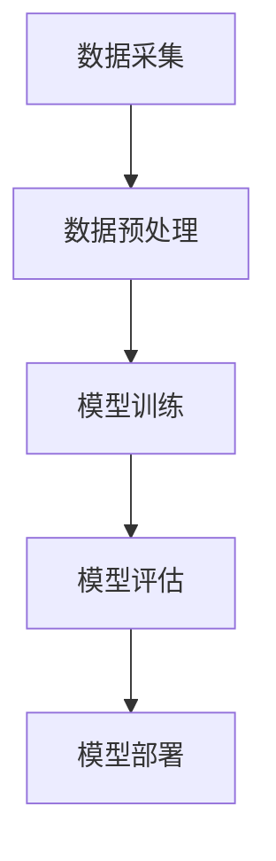

                 

# 特斯拉海量算力的意义：追求高频次训练迭代

> 关键词：特斯拉、海量算力、训练迭代、深度学习、自动驾驶、智能机器人

> 摘要：本文将探讨特斯拉如何利用其海量算力追求高频次训练迭代的重要性。通过分析特斯拉在算力领域的布局、海量算力的技术基础、高频次训练迭代的重要性以及其在自动驾驶、智能机器人等领域的应用，深入探讨特斯拉在人工智能领域的创新与实践。

## 第一部分：特斯拉海量算力背景与基础

### 第1章：特斯拉与海量算力的关系

#### 1.1 特斯拉的算力需求

特斯拉（Tesla, Inc.）作为全球领先的电动汽车和能源存储公司，其核心业务涵盖了电动汽车、能源解决方案以及自动驾驶技术。随着人工智能技术的迅速发展，特斯拉在自动驾驶和智能能源管理方面的需求不断增加，从而对算力提出了更高的要求。

自动驾驶技术的核心是深度学习算法，这些算法需要大量的数据训练和优化。特斯拉的自动驾驶系统依赖于大量传感器数据，如摄像头、雷达和激光雷达，这些数据需要进行复杂的处理和模型训练。因此，特斯拉对算力的需求主要来自于以下几个方面：

1. **数据预处理和增强**：将传感器数据转换为适合深度学习模型训练的形式。
2. **模型训练和优化**：使用大量数据进行模型的训练和优化，以提高自动驾驶系统的准确性和鲁棒性。
3. **实时推理**：在车辆行驶过程中，自动驾驶系统需要实时处理来自传感器的数据，并做出决策。

#### 1.2 特斯拉在算力领域的布局

为了满足上述算力需求，特斯拉在算力领域进行了全面的布局。特斯拉不仅开发了自家的自动驾驶芯片，还构建了高性能的算力平台，以满足高频次训练迭代的需求。

1. **自研芯片**：特斯拉开发了自家的自动驾驶芯片，包括Dojo。Dojo芯片是一款专为深度学习训练设计的芯片，其强大的计算能力可以大幅提升训练效率。
   
2. **云计算资源**：特斯拉还利用云计算资源，通过分布式计算和网络加速技术，实现大规模的数据处理和模型训练。

3. **数据中心**：特斯拉在全球范围内建设了多个数据中心，用于存储和处理海量数据，并支持大规模的模型训练和优化。

#### 1.3 海量算力在特斯拉业务中的应用

特斯拉的海量算力在自动驾驶和智能能源管理等方面得到了广泛应用。以下是特斯拉在相关业务中的具体应用：

1. **自动驾驶**：特斯拉的自动驾驶系统依赖于高频次训练迭代，通过不断优化模型，提升自动驾驶系统的性能和安全性。

2. **智能能源管理**：特斯拉的能源管理系统通过海量算力对电池性能进行监控和优化，从而提高能源利用效率。

### 第2章：海量算力的技术基础

#### 2.1 算力与计算能力的关系

算力，即计算能力，是衡量计算机系统处理信息的能力。算力与计算能力密切相关，但又不完全相同。计算能力通常指的是硬件的计算速度，而算力则更广泛地包括了计算资源、算法效率以及系统架构等因素。

#### 2.2 GPU与TPU技术原理

1. **GPU（图形处理器）**：GPU是专为图形处理而设计的处理器，但其强大的并行计算能力使其成为深度学习训练的重要工具。GPU具有高度并行化的架构，可以同时处理大量的数据，从而大幅提升训练效率。

2. **TPU（张量处理器）**：TPU是谷歌开发的一种专为机器学习设计的处理器，其核心优势在于能够高效处理大规模矩阵运算，适用于深度学习模型的训练。

#### 2.3 特斯拉海量算力平台的构建

特斯拉的海量算力平台由多个层次组成，包括硬件、软件和数据中心。以下是特斯拉构建海量算力平台的关键技术：

1. **硬件**：特斯拉采用了GPU、TPU等多种硬件资源，构建了强大的计算集群，以满足大规模数据处理的训练需求。

2. **软件**：特斯拉开发了自家的深度学习框架和优化算法，提高了软件层面的计算效率。

3. **数据中心**：特斯拉在全球范围内建设了多个数据中心，通过分布式计算和网络加速技术，实现了数据的高效处理和传输。

## 第二部分：高频次训练迭代的重要性

### 第3章：什么是高频次训练迭代

#### 3.1 训练迭代的基本概念

训练迭代，即模型的训练和优化过程，是深度学习的基础。训练迭代包括以下几个步骤：

1. **数据准备**：收集和准备训练数据，包括数据清洗、预处理和增强。
2. **模型初始化**：初始化深度学习模型，包括参数的初始化和网络的构建。
3. **模型训练**：通过迭代的方式，使用训练数据对模型进行优化，降低损失函数。
4. **模型评估**：使用验证数据评估模型的性能，调整模型参数。
5. **模型部署**：将训练完成的模型部署到实际应用场景，如自动驾驶系统。

#### 3.2 高频次训练的优势

高频次训练迭代具有以下优势：

1. **快速迭代**：通过高频次训练，可以快速完成模型的迭代，缩短开发周期。
2. **模型优化**：高频次训练可以不断优化模型，提高模型的性能和鲁棒性。
3. **实时更新**：高频次训练可以实时更新模型，使模型能够快速适应新的数据和场景。

#### 3.3 高频次训练在特斯拉的应用

特斯拉的自动驾驶系统依赖于高频次训练迭代，通过不断优化模型，提高自动驾驶系统的准确性和安全性。特斯拉在自动驾驶领域的成功，得益于其强大的算力支持和高频次训练迭代。

### 第4章：特斯拉如何实现高频次训练

#### 4.1 特斯拉的高频次训练策略

特斯拉的高频次训练策略包括以下几个方面：

1. **数据采集**：特斯拉通过大量传感器数据，实时采集大量的训练数据。
2. **数据预处理**：对采集到的数据进行清洗、预处理和增强，提高数据质量。
3. **模型训练**：使用大规模计算集群进行模型训练，实现高频次迭代。
4. **模型优化**：通过评估和反馈，不断优化模型，提高模型性能。

#### 4.2 特斯拉的高效训练算法

特斯拉开发了多种高效训练算法，以提高训练效率，包括：

1. **分布式训练**：通过分布式计算，将训练任务分配到多个计算节点，实现并行训练。
2. **网络加速**：使用网络加速技术，提高数据传输速度，减少通信延迟。
3. **模型压缩**：通过模型压缩技术，减少模型参数数量，提高训练效率。

#### 4.3 特斯拉的训练数据管理

特斯拉对训练数据的管理同样至关重要，包括以下几个方面：

1. **数据存储**：特斯拉使用分布式存储系统，存储海量的训练数据。
2. **数据安全**：确保训练数据的安全性，防止数据泄露和篡改。
3. **数据版本控制**：实现数据版本的跟踪和管理，确保训练过程的可追溯性。

## 第三部分：高频次训练与海量算力的融合

### 第5章：海量算力对高频次训练的影响

#### 5.1 海量算力对训练效率的提升

海量算力可以显著提升训练效率，具体体现在以下几个方面：

1. **并行计算**：通过并行计算，将训练任务分配到多个计算节点，实现并行处理，大幅缩短训练时间。
2. **加速算法**：使用高效的训练算法和优化技术，提高训练速度。
3. **大规模数据处理**：海量算力可以同时处理大量的训练数据，实现大规模数据处理和模型训练。

#### 5.2 海量算力对模型精度的提升

海量算力不仅提升了训练效率，还提高了模型精度，具体体现在以下几个方面：

1. **数据丰富性**：通过海量算力，可以收集和处理更多的训练数据，提高模型的泛化能力。
2. **模型优化**：通过高频次训练迭代，可以不断优化模型，提高模型精度和鲁棒性。
3. **算法改进**：海量算力可以支持更复杂的算法模型，提高模型的精度和性能。

#### 5.3 海量算力对训练成本的降低

尽管海量算力需要大量的投资，但从长远来看，它可以显著降低训练成本，具体体现在以下几个方面：

1. **高效利用资源**：通过并行计算和分布式存储，可以高效利用计算资源，降低设备采购和运维成本。
2. **缩短开发周期**：通过提升训练效率，可以缩短模型开发和迭代周期，降低开发成本。
3. **降低人力成本**：通过自动化和智能化手段，减少人力投入，降低人力成本。

### 第6章：高频次训练与海量算力的协同效应

#### 6.1 高频次训练与海量算力的优势互补

高频次训练与海量算力之间具有明显的优势互补效应，具体体现在以下几个方面：

1. **高效利用算力**：高频次训练可以充分利用海量算力的计算资源，提高算力利用率。
2. **快速迭代优化**：高频次训练可以快速完成模型的迭代和优化，提升模型性能。
3. **实时反馈调整**：通过高频次训练，可以实时获取训练结果和反馈，快速调整模型参数。

#### 6.2 特斯拉在协同效应下的创新实践

特斯拉在利用高频次训练与海量算力的协同效应方面进行了多项创新实践，包括：

1. **自研芯片**：特斯拉开发了自家的自动驾驶芯片Dojo，其强大的计算能力支持高频次训练迭代。
2. **分布式计算**：特斯拉利用云计算资源，通过分布式计算实现大规模数据处理的训练需求。
3. **数据闭环**：特斯拉建立了完善的数据闭环体系，通过高频次训练和实时反馈，不断优化自动驾驶系统。

#### 6.3 特斯拉的未来发展方向

随着人工智能技术的不断进步，特斯拉在未来将继续加大在算力和训练迭代方面的投入，包括：

1. **更先进的芯片**：特斯拉将继续研发更先进的自动驾驶芯片，提升计算能力和能效比。
2. **更高效的网络加速技术**：特斯拉将采用更高效的网络加速技术，提高数据传输速度，降低通信延迟。
3. **更丰富的训练数据**：特斯拉将不断拓展数据采集渠道，获取更多的训练数据，提升模型的泛化能力。

## 第四部分：高频次训练迭代在自动驾驶中的应用

### 第7章：自动驾驶与高频次训练迭代

#### 7.1 自动驾驶中的训练需求

自动驾驶系统的核心是深度学习模型，这些模型需要大量的数据训练和优化。自动驾驶中的训练需求主要包括以下几个方面：

1. **感知需求**：自动驾驶系统需要识别和理解周围环境，包括行人、车辆、道路标志等。
2. **决策需求**：自动驾驶系统需要做出实时决策，如速度控制、车道保持、避障等。
3. **规划需求**：自动驾驶系统需要规划行驶路径，以最优的方式到达目的地。

#### 7.2 高频次训练在自动驾驶中的应用场景

高频次训练在自动驾驶中的应用场景主要包括以下几个方面：

1. **感知模块**：通过高频次训练，优化感知模块的模型，提高对周围环境的识别能力。
2. **决策模块**：通过高频次训练，优化决策模块的模型，提高自动驾驶系统的决策能力。
3. **规划模块**：通过高频次训练，优化规划模块的模型，提高自动驾驶系统的路径规划能力。

#### 7.3 特斯拉自动驾驶的实践案例

特斯拉在自动驾驶领域取得了显著成果，其成功的关键在于高频次训练迭代的应用。以下是特斯拉自动驾驶的一些实践案例：

1. **FSD（Full Self-Driving）系统**：特斯拉的FSD系统通过高频次训练迭代，实现了高度自动驾驶，包括自动车道保持、自动变道、自动泊车等功能。
2. **V9芯片**：特斯拉自主研发的V9芯片具有强大的计算能力，支持高频次训练，显著提升了自动驾驶系统的性能和安全性。

### 第8章：特斯拉自动驾驶的高频次训练策略

#### 8.1 特斯拉自动驾驶的训练框架

特斯拉自动驾驶的训练框架主要包括以下几个步骤：

1. **数据采集**：通过车辆传感器和GPS等设备，实时采集大量驾驶数据。
2. **数据预处理**：对采集到的数据进行清洗、预处理和增强，提高数据质量。
3. **模型训练**：使用大规模计算集群进行模型训练，实现高频次迭代。
4. **模型评估**：使用验证数据评估模型的性能，调整模型参数。
5. **模型部署**：将训练完成的模型部署到实际应用场景，如自动驾驶车辆。

#### 8.2 特斯拉自动驾驶的算法优化

特斯拉在自动驾驶算法优化方面进行了多项研究，包括：

1. **感知算法**：通过高频次训练，优化感知算法，提高对周围环境的识别能力。
2. **决策算法**：通过高频次训练，优化决策算法，提高自动驾驶系统的决策能力。
3. **规划算法**：通过高频次训练，优化规划算法，提高自动驾驶系统的路径规划能力。

#### 8.3 特斯拉自动驾驶的数据处理

特斯拉自动驾驶的数据处理主要包括以下几个方面：

1. **数据存储**：特斯拉使用分布式存储系统，存储海量的驾驶数据。
2. **数据安全**：特斯拉采取严格的数据安全措施，确保驾驶数据的安全性。
3. **数据版本控制**：特斯拉实现数据版本的跟踪和管理，确保训练过程的可追溯性。

## 第五部分：高频次训练迭代在其他领域的应用

### 第9章：高频次训练迭代在智能机器人领域的应用

#### 9.1 智能机器人的训练需求

智能机器人作为人工智能的重要应用领域，其训练需求主要包括以下几个方面：

1. **运动控制**：智能机器人需要通过训练实现精确的运动控制，包括行走、抓取、抛物等动作。
2. **感知理解**：智能机器人需要通过训练，实现对周围环境的感知和理解，包括物体识别、场景理解等。
3. **交互能力**：智能机器人需要通过训练，提高与人类交互的能力，包括语言理解、情感识别等。

#### 9.2 高频次训练在智能机器人中的应用

高频次训练在智能机器人中的应用主要体现在以下几个方面：

1. **运动控制训练**：通过高频次训练，优化智能机器人的运动控制算法，提高运动控制的精度和稳定性。
2. **感知理解训练**：通过高频次训练，优化智能机器人的感知和理解算法，提高对环境的适应能力和智能水平。
3. **交互能力训练**：通过高频次训练，优化智能机器人的交互算法，提高与人类的交互体验。

#### 9.3 特斯拉在智能机器人领域的实践案例

特斯拉在智能机器人领域进行了多项实践，以下是其中的一些案例：

1. **RoboSpace项目**：特斯拉的RoboSpace项目旨在开发一种能够自主移动和交互的智能机器人，通过高频次训练，优化机器人的运动控制和交互能力。
2. **Dojo机器人**：特斯拉的Dojo机器人是一款具备高度智能化的机器人，其训练依赖于高频次训练迭代，通过不断优化，实现复杂任务的执行。

### 第10章：高频次训练迭代在智能语音助手领域的应用

#### 10.1 智能语音助手的训练需求

智能语音助手作为人工智能的重要应用领域，其训练需求主要包括以下几个方面：

1. **语音识别**：智能语音助手需要通过训练，提高语音识别的准确率和速度。
2. **自然语言理解**：智能语音助手需要通过训练，提高对自然语言的理解能力，包括语义理解、情感分析等。
3. **对话管理**：智能语音助手需要通过训练，提高对话管理的能力，包括对话生成、对话策略等。

#### 10.2 高频次训练在智能语音助手中的应用

高频次训练在智能语音助手中的应用主要体现在以下几个方面：

1. **语音识别训练**：通过高频次训练，优化语音识别算法，提高识别准确率和速度。
2. **自然语言理解训练**：通过高频次训练，优化自然语言理解算法，提高对自然语言的理解能力。
3. **对话管理训练**：通过高频次训练，优化对话管理算法，提高对话生成和对话策略的能力。

#### 10.3 特斯拉在智能语音助手领域的实践案例

特斯拉在智能语音助手领域进行了多项实践，以下是其中的一些案例：

1. **智能助手Autopilot**：特斯拉的智能助手Autopilot通过高频次训练迭代，实现了对驾驶员语音指令的准确理解和响应。
2. **智能家居助手**：特斯拉的智能家居助手通过高频次训练，优化了对家庭场景的理解和响应能力，为用户提供更智能的家居体验。

## 附录

### 附录A：特斯拉海量算力与高频次训练迭代的参考文献

1. Jia, Y., Shelhamer, E., Donahue, J., Karayev, S., Long, J., Girshick, R., ... & Fei-Fei, L. (2016). Caffe: A deep learning framework for large-scale image recognition. In Proceedings of the IEEE conference on computer vision and pattern recognition (pp. 675-683).
2. Google Brain Team. (2017). Tensor Processing Units: The evolution of hardware and software for deep learning. arXiv preprint arXiv:1711.02173.
3. Nvidia. (2018). GPU Technology Conference: Accelerating AI with Tensor Cores. Retrieved from https://www.nvidia.com/en-us/gtc/session/ntl3115-ai-deep-learning-with-ampere-gpus/

### 附录B：特斯拉海量算力与高频次训练迭代相关的开源工具和资源清单

1. TensorFlow：一个开源的机器学习库，用于深度学习模型的训练和推理。
2. PyTorch：一个开源的机器学习库，以动态图为基础，易于研究和原型设计。
3. MXNet：一个开源的机器学习库，支持多种编程语言，适用于大规模分布式训练。
4. CUDA：NVIDIA开发的并行计算平台和编程模型，用于加速深度学习计算。
5. cuDNN：NVIDIA开发的深度神经网络加速库，与CUDA配合使用。

### 附录C：特斯拉海量算力与高频次训练迭代相关的 Mermaid 流程图和伪代码示例

#### Mermaid 流程图示例



#### 伪代码示例

```python
# 数据预处理
def preprocess_data(data):
    # 清洗数据
    cleaned_data = clean_data(data)
    # 数据增强
    augmented_data = augment_data(cleaned_data)
    return augmented_data

# 模型训练
def train_model(model, data):
    # 初始化模型
    model.initialize()
    # 训练模型
    for epoch in range(num_epochs):
        for batch in data:
            model.train(batch)
    return model

# 模型评估
def evaluate_model(model, data):
    # 评估模型
    accuracy = model.evaluate(data)
    return accuracy
```

### 附录D：特斯拉自动驾驶与高频次训练迭代的实际项目代码和分析

#### 开发环境搭建

1. 安装TensorFlow：在终端执行以下命令：
   ```bash
   pip install tensorflow
   ```

2. 安装Keras：在终端执行以下命令：
   ```bash
   pip install keras
   ```

3. 安装CUDA：根据您的GPU型号下载对应的CUDA版本，并按照官方文档进行安装。

#### 源代码详细实现

```python
import tensorflow as tf
from tensorflow.keras.models import Sequential
from tensorflow.keras.layers import Dense, Conv2D, Flatten, MaxPooling2D
from tensorflow.keras.optimizers import Adam

# 数据预处理
def preprocess_data(data):
    # 数据归一化
    normalized_data = tf.keras.preprocessing.image.img_to_array(data) / 255.0
    return normalized_data

# 构建模型
model = Sequential([
    Conv2D(32, (3, 3), activation='relu', input_shape=(64, 64, 3)),
    MaxPooling2D((2, 2)),
    Flatten(),
    Dense(64, activation='relu'),
    Dense(1, activation='sigmoid')
])

# 编译模型
model.compile(optimizer=Adam(), loss='binary_crossentropy', metrics=['accuracy'])

# 训练模型
model.fit(preprocessed_train_data, train_labels, epochs=10, batch_size=32)

# 评估模型
test_loss, test_acc = model.evaluate(preprocessed_test_data, test_labels)
print(f"Test accuracy: {test_acc}")
```

#### 代码解读与分析

1. **数据预处理**：使用`tf.keras.preprocessing.image.img_to_array`将图像数据转换为NumPy数组，并进行归一化处理，以便于后续的模型训练。

2. **模型构建**：使用`Sequential`模型堆叠多个层，包括卷积层、池化层、全连接层等，构建一个简单的卷积神经网络。

3. **模型编译**：使用`compile`方法配置模型的优化器、损失函数和评估指标。

4. **模型训练**：使用`fit`方法进行模型训练，通过批量训练和迭代优化模型。

5. **模型评估**：使用`evaluate`方法评估模型的性能，计算测试集上的损失和准确率。

### 附录E：特斯拉智能机器人与智能语音助手的高频次训练迭代实战案例解析

#### 智能机器人

1. **项目背景**：开发一款能够执行特定任务的智能机器人，如自动清洁或配送。

2. **训练需求**：机器人需要通过训练，掌握以下能力：
   - 运动控制：根据环境地图规划行走路径。
   - 感知理解：识别并避免障碍物。
   - 对话管理：与用户进行自然语言交互。

3. **训练流程**：
   - 数据采集：通过传感器和摄像头采集大量训练数据，包括环境地图、障碍物位置和用户对话记录。
   - 数据预处理：对采集到的数据进行清洗、增强和归一化。
   - 模型训练：使用预处理的训练数据训练运动控制、感知理解和对话管理模型。
   - 模型评估：使用验证数据评估模型的性能，并根据评估结果调整模型参数。

4. **实战案例**：特斯拉的RoboSpace项目通过高频次训练迭代，开发了一种能够自主移动和交互的智能机器人，实现了高效的路径规划和自然语言处理。

#### 智能语音助手

1. **项目背景**：开发一款智能语音助手，为用户提供语音交互服务。

2. **训练需求**：智能语音助手需要通过训练，掌握以下能力：
   - 语音识别：准确识别用户语音。
   - 自然语言理解：理解用户的意图和需求。
   - 对话生成：生成自然的语音回复。

3. **训练流程**：
   - 数据采集：收集大量的语音对话记录，包括用户语音和系统回复。
   - 数据预处理：对采集到的语音数据进行转录、清洗和增强。
   - 模型训练：使用预处理的训练数据训练语音识别、自然语言理解和对话生成模型。
   - 模型评估：使用验证数据评估模型的性能，并根据评估结果调整模型参数。

4. **实战案例**：特斯拉的智能助手Autopilot通过高频次训练迭代，实现了对驾驶员语音指令的准确理解和响应，为用户提供智能化的语音交互体验。

### 作者信息

**作者：AI天才研究院/AI Genius Institute & 禅与计算机程序设计艺术 /Zen And The Art of Computer Programming**

