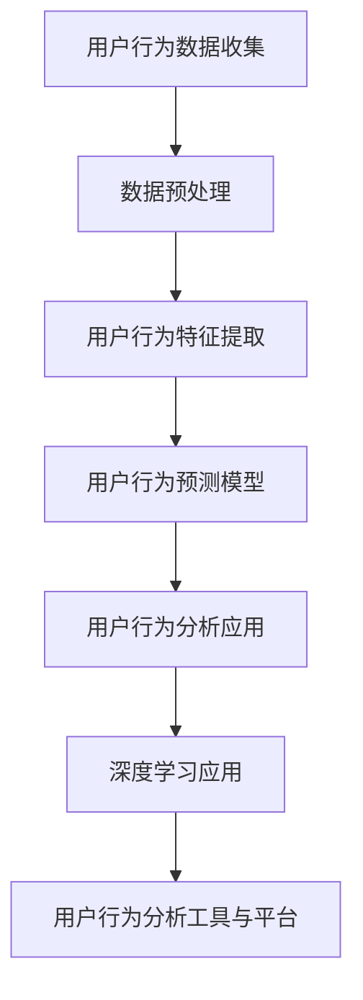

                 

# 《用户行为分析技术解析》

> 关键词：用户行为分析、数据收集、数据分析、机器学习、深度学习

> 摘要：本文将深入探讨用户行为分析的技术原理和实现方法。通过解析用户行为分析的基础概念、数据收集方法、数据分析技术，我们将了解到如何通过用户行为数据进行预测和特征提取，并探讨用户行为分析在实际应用中的案例和前沿技术。

### 《用户行为分析技术解析》目录大纲

#### 第一部分：用户行为分析基础

##### 第1章：用户行为分析概述

- **1.1 用户行为分析的基本概念**
- **1.2 用户行为分析的方法**
- **1.3 用户行为分析的应用领域**
- **1.4 用户行为分析的发展趋势**

##### 第2章：用户行为数据收集

- **2.1 用户行为数据的来源**
- **2.2 数据收集技术**
- **2.3 用户隐私保护**

##### 第3章：用户行为数据分析技术

- **3.1 数据预处理**
- **3.2 数据分析工具**
- **3.3 数据可视化技术**

#### 第二部分：用户行为分析模型

##### 第4章：用户行为预测模型

- **4.1 机器学习基础**
- **4.2 时间序列分析**
- **4.3 协同过滤**

##### 第5章：用户行为特征提取

- **5.1 用户特征分类**
- **5.2 特征提取方法**

##### 第6章：用户行为分析应用案例

- **6.1 电子商务领域**
- **6.2 社交媒体领域**
- **6.3 在线教育领域**

#### 第三部分：用户行为分析前沿技术

##### 第7章：深度学习在用户行为分析中的应用

- **7.1 卷积神经网络（CNN）**
- **7.2 循环神经网络（RNN）**
- **7.3 图神经网络（GNN）**

##### 第8章：用户行为分析工具与平台

- **8.1 数据库工具**
- **8.2 数据分析工具**
- **8.3 开源框架**

#### 附录

##### 附录A：用户行为分析资源与工具列表

- **A.1 资源列表**
- **A.2 工具列表**

### Mermaid 流程图



### 伪代码示例

```python
# 用户行为预测模型伪代码
def predict_user_behavior(data):
    # 数据预处理
    preprocessed_data = preprocess_data(data)
    
    # 特征提取
    features = extract_features(preprocessed_data)
    
    # 模型训练
    model = train_model(features)
    
    # 预测
    predictions = model.predict(new_data)
    
    return predictions
```

### 数学公式

$$
\text{UserBehaviorModel} = f(\text{Features}, \text{Weights})
$$

### 项目实战

**案例：电子商务领域个性化推荐系统**

1. **开发环境搭建：**
   - 安装Python和Anaconda
   - 安装TensorFlow和Scikit-learn库

2. **数据准备：**
   - 收集用户行为数据（如浏览记录、购买记录等）
   - 清洗数据并转换为适合分析的格式

3. **特征提取：**
   - 使用TF-IDF提取关键词特征
   - 使用K-means聚类提取用户群体特征

4. **模型训练：**
   - 使用协同过滤算法训练推荐模型
   - 使用深度学习模型进行优化

5. **模型评估：**
   - 使用准确率、召回率、F1分数等指标评估模型效果
   - 进行模型调优

6. **代码解读与分析：**
   - 代码解析
   - 性能优化建议

```python
# 代码片段示例
def collaborative_filtering(data, K=10):
    # K-means聚类提取用户群体特征
    clusters = KMeans(n_clusters=K).fit(data).clusters_
    
    # 计算用户相似度矩阵
    similarity_matrix = cosine_similarity(data)
    
    # 针对每个用户，计算其与其他用户的相似度并推荐物品
    recommendations = []
    for user in range(K):
        similar_users = np.argsort(similarity_matrix[user])[:-K]
        recommended_items = np.mean(data[similar_users], axis=0)
        recommendations.append(recommended_items)
    
    return recommendations
```

### 正文开始

#### 第1章：用户行为分析概述

**1.1 用户行为分析的基本概念**

用户行为分析是指通过收集、处理和分析用户在使用产品或服务过程中的行为数据，以了解用户需求、喜好、行为模式等，从而为产品优化、营销策略制定和用户体验提升提供支持。用户行为分析的核心概念包括：

- 用户行为：指用户在使用产品或服务过程中产生的各种操作，如浏览、搜索、点击、购买等。
- 行为数据：指用户在使用产品或服务过程中产生的数据，如日志文件、用户输入、交互记录等。
- 行为分析：指对用户行为数据进行收集、处理和分析的过程，以提取有价值的信息和洞察。

**1.2 用户行为分析的方法**

用户行为分析的方法主要包括以下几种：

- 数据收集方法：通过Web日志、移动应用、社交媒体等渠道收集用户行为数据。
- 数据分析方法：包括数据预处理、特征提取、模型训练和预测等步骤，以从用户行为数据中提取有价值的信息。
- 数据可视化技术：通过图表、表格等形式将分析结果进行可视化展示，以便更直观地理解用户行为模式。

**1.3 用户行为分析的应用领域**

用户行为分析在众多领域有着广泛的应用，以下是其中几个典型的应用领域：

- 电子商务：通过用户行为分析，实现个性化推荐、流失预测、营销策略优化等，提高用户满意度和转化率。
- 社交媒体：通过用户行为分析，实现话题监测、内容推荐、用户画像等，提升用户体验和平台活跃度。
- 在线教育：通过用户行为分析，实现课程推荐、学习效果评估、用户流失预测等，提高学习效果和用户留存率。

**1.4 用户行为分析的发展趋势**

随着大数据、人工智能技术的快速发展，用户行为分析领域也在不断演进。以下是用户行为分析的一些发展趋势：

- 数据多样化和实时性：用户行为数据的来源越来越多样化，如物联网设备、社交媒体等，同时数据的实时性要求也越来越高。
- 深度学习和人工智能：深度学习和人工智能技术在用户行为分析中发挥着越来越重要的作用，如用户画像、行为预测等。
- 用户隐私保护：在用户行为分析过程中，用户隐私保护成为一个重要议题，如何平衡用户隐私和数据利用成为关键问题。

#### 第2章：用户行为数据收集

**2.1 用户行为数据的来源**

用户行为数据的来源主要包括以下几种：

- Web日志：Web服务器生成的日志文件，记录用户访问网站的行为，如访问时间、访问页面、操作行为等。
- 移动应用：移动应用生成的日志数据，记录用户在应用中的操作行为，如点击、浏览、购买等。
- 社交媒体：社交媒体平台生成的数据，记录用户在社交平台上的行为，如发布、评论、点赞等。
- 用户输入：用户在产品或服务中的输入数据，如搜索关键词、填写表单等。

**2.2 数据收集技术**

数据收集技术主要包括以下几种：

- 跟踪技术：通过在网页、移动应用中嵌入跟踪代码或SDK，实时收集用户行为数据。
- 问卷调研：通过在线问卷或电话调研等方式，收集用户对产品或服务的满意度、行为习惯等信息。
- 用户访谈：通过面对面或在线访谈的方式，深入了解用户的行为和需求。

**2.3 用户隐私保护**

在用户行为分析过程中，用户隐私保护是一个重要的议题。以下是一些用户隐私保护的措施：

- 数据匿名化：对收集到的用户数据进行匿名化处理，去除可直接识别用户身份的信息。
- 数据加密：对敏感数据采用加密技术进行存储和传输，确保数据安全。
- 用户权限管理：建立严格的用户权限管理制度，确保只有授权人员才能访问用户数据。
- 合规性审查：确保用户行为分析过程符合相关法律法规要求，如《通用数据保护条例》（GDPR）等。

#### 第3章：用户行为数据分析技术

**3.1 数据预处理**

数据预处理是用户行为数据分析的重要环节，主要包括以下步骤：

- 数据清洗：去除数据中的噪声和异常值，如重复记录、缺失值、无效值等。
- 数据整合：将来自不同来源和格式的数据整合为一个统一的数据集，以便后续分析。
- 数据转换：将数据转换为适合分析的形式，如将文本数据转换为数值数据、将时间序列数据转换为特征向量等。

**3.2 数据分析工具**

数据分析工具是实现用户行为数据分析的重要工具，以下是一些常用的数据分析工具：

- SQL：用于结构化查询语言，用于对关系型数据库中的数据进行分析和查询。
- Python：Python是一种强大的编程语言，提供了丰富的数据分析库，如Pandas、NumPy等。
- R语言：R语言是一种专门用于统计分析和数据可视化的语言，提供了丰富的统计分析和可视化工具。
- Tableau：Tableau是一种数据可视化工具，用于将数据分析结果以图表、报表等形式进行可视化展示。

**3.3 数据可视化技术**

数据可视化技术是将数据分析结果以直观、易理解的形式进行展示的方法，以下是一些常用的数据可视化技术：

- 表格：用于展示数据的详细信息和统计指标。
- 折线图：用于展示数据随时间变化的趋势。
- 散点图：用于展示两个变量之间的关系。
- 饼图：用于展示各部分数据在整体中的占比。
- 柱状图：用于对比不同类别或时间点的数据。

#### 第4章：用户行为预测模型

**4.1 机器学习基础**

用户行为预测模型通常基于机器学习方法构建，以下是一些常见的机器学习算法：

- 线性回归：用于预测用户行为的连续值，如购买金额、浏览时长等。
- 决策树：用于分类问题，将用户行为分为不同的类别，如用户是否流失、用户是否购买等。
- 随机森林：结合了决策树的优点，用于提高分类和回归模型的预测性能。
- 支持向量机：用于分类问题，将用户行为划分为不同的类别。

**4.2 时间序列分析**

时间序列分析是用户行为预测的重要方法，以下是一些常见的时间序列分析方法：

- ARIMA模型：自回归移动平均模型，用于预测时间序列数据的趋势和季节性。
- LSTM神经网络：长短时记忆神经网络，用于处理时间序列数据的长期依赖关系。
- seasonal_model：季节性模型，用于分析时间序列数据的季节性特征。

**4.3 协同过滤**

协同过滤是用户行为预测的重要方法，以下是一些常见的协同过滤算法：

- 用户基础协同过滤：基于用户对物品的评分相似度进行推荐，如基于用户的历史行为数据推荐相似用户喜欢的物品。
- Item基础协同过滤：基于物品的属性相似度进行推荐，如基于物品的标签、分类信息推荐相似物品。

#### 第5章：用户行为特征提取

**5.1 用户特征分类**

用户特征提取是用户行为分析的核心步骤之一，用户特征可以根据不同层次进行分类：

- 段落级特征：指用户在一个段落或文本中的行为特征，如浏览时间、点击次数等。
- 交互式特征：指用户在交互过程中的行为特征，如操作路径、浏览顺序等。
- 社交网络特征：指用户在社交网络中的行为特征，如好友关系、互动频率等。

**5.2 特征提取方法**

特征提取方法是将原始用户行为数据转换为可用于模型训练的特征向量的过程，以下是一些常见的特征提取方法：

- TF-IDF：词频-逆文档频率，用于计算文本中关键词的重要性。
- Word2Vec：词嵌入技术，将文本中的每个词映射为一个固定维度的向量。
- Doc2Vec：文档嵌入技术，将整个文档映射为一个固定维度的向量。

#### 第6章：用户行为分析应用案例

**6.1 电子商务领域**

在电子商务领域，用户行为分析可以用于以下几个方面：

- 个性化推荐：根据用户的历史行为数据，为用户推荐感兴趣的商品。
- 用户流失预测：预测哪些用户可能流失，并采取相应的挽回措施。
- 营销策略优化：分析用户行为数据，优化营销策略，提高转化率和用户满意度。

**6.2 社交媒体领域**

在社交媒体领域，用户行为分析可以用于以下几个方面：

- 爆发话题检测：分析用户的行为数据，识别出当前的热门话题。
- 欺诈检测：通过分析用户的行为模式，检测出潜在的欺诈行为。
- 用户画像：基于用户的行为数据，构建用户画像，用于广告投放和精准营销。

**6.3 在线教育领域**

在在线教育领域，用户行为分析可以用于以下几个方面：

- 学习行为分析：分析用户的学习行为，识别出高效的学习方法和策略。
- 课程推荐系统：根据用户的学习行为和喜好，为用户推荐合适的课程。
- 用户留存预测：预测哪些用户可能流失，并采取相应的措施提高用户留存率。

#### 第7章：深度学习在用户行为分析中的应用

**7.1 卷积神经网络（CNN）**

卷积神经网络（CNN）是一种专门用于处理图像数据的深度学习模型，通过卷积操作提取图像中的特征，可以应用于用户行为分析中的图像识别任务。

**7.2 循环神经网络（RNN）**

循环神经网络（RNN）是一种可以处理序列数据的深度学习模型，通过循环结构可以捕捉序列中的长期依赖关系，可以应用于用户行为分析中的序列预测任务。

**7.3 图神经网络（GNN）**

图神经网络（GNN）是一种可以处理图结构数据的深度学习模型，通过图卷积操作提取图中的特征，可以应用于用户行为分析中的图数据分析任务。

#### 第8章：用户行为分析工具与平台

**8.1 数据库工具**

数据库工具是用户行为分析中用于存储和管理数据的工具，以下是一些常用的数据库工具：

- MongoDB：一种分布式文档数据库，适合存储非结构化数据。
- MySQL：一种关系型数据库，适合存储结构化数据。

**8.2 数据分析工具**

数据分析工具是用户行为分析中用于处理和分析数据的工具，以下是一些常用的数据分析工具：

- Tableau：一种数据可视化工具，可以快速生成各种类型的可视化报表。
- Power BI：一种商业智能工具，可以集成多种数据源并进行数据分析。

**8.3 开源框架**

开源框架是用户行为分析中用于构建深度学习模型的工具，以下是一些常用的开源框架：

- TensorFlow：一种开源的深度学习框架，提供丰富的API和工具。
- PyTorch：一种开源的深度学习框架，具有灵活的动态计算图。

### 附录

**附录A：用户行为分析资源与工具列表**

- **A.1 资源列表**
  - 论文：《用户行为分析技术综述》
  - 书籍：《深度学习》
  - 博客：用户行为分析技术博客

- **A.2 工具列表**
  - 数据分析工具：Pandas、NumPy、Tableau
  - 深度学习框架：TensorFlow、PyTorch
  - 用户行为分析平台：用户行为分析平台

### 总结

本文从用户行为分析的基础概念、数据收集、数据分析技术、预测模型、特征提取、应用案例和前沿技术等方面进行了详细解析，旨在为读者提供全面的用户行为分析技术解析。在用户行为分析领域，随着大数据、人工智能技术的不断发展，用户行为分析的方法和应用场景也在不断拓展。希望通过本文的介绍，读者能够对用户行为分析技术有更深入的理解，并能够将其应用于实际项目中，提升产品和服务的用户体验和满意度。作者：AI天才研究院/AI Genius Institute & 禅与计算机程序设计艺术 /Zen And The Art of Computer Programming。

