                 

# 《电商中的AI应用案例》

## 文章关键词

- 电商
- 人工智能
- 推荐系统
- 搜索引擎
- 用户行为分析
- 库存管理
- 安全与风控

## 文章摘要

随着互联网技术的飞速发展，电商行业已经成为全球商业体系的重要组成部分。本文从电商与AI技术的结合出发，探讨了AI在电商中的应用案例，包括推荐系统、商品搜索与广告优化、用户行为分析、库存管理与供应链优化、电商安全与风控等方面。通过具体的案例分析，本文详细阐述了AI技术在电商领域的实际应用，为电商企业提供了有益的参考和启示。文章旨在帮助读者理解AI技术在电商行业中的重要作用，以及如何利用这些技术提升电商业务的效率和用户体验。

## 第一部分：电商行业现状与AI技术应用

### 第1章：电商行业现状

电商行业的兴起可以追溯到互联网技术的普及和消费者购物习惯的改变。自20世纪末以来，电商行业经历了从无到有、从小到大的发展过程，目前已成为全球商业体系的重要组成部分。

#### 1.1 电商行业的发展历程

1. **起步阶段（1990年代末-2000年代初）**：电商行业初期以网上书店和电子产品销售为主，如Amazon、eBay等。
2. **快速发展阶段（2000年代中后期-2010年代初）**：随着互联网基础设施的完善和用户习惯的培养，电商行业迎来爆发式增长，涌现出大量电商平台，如淘宝、京东、亚马逊等。
3. **成熟阶段（2010年代至今）**：电商行业进入成熟期，市场逐渐细分，垂直电商和社交电商等新模式不断涌现，同时AI技术开始在电商领域得到广泛应用。

#### 1.2 当前电商行业的主要特点

1. **市场规模不断扩大**：全球电商市场规模持续增长，据预测，未来几年仍将保持高速增长态势。
2. **用户群体多样化**：随着互联网的普及，电商用户群体越来越广泛，年龄层次、地域分布、消费能力等差异明显。
3. **竞争激烈**：电商行业竞争日益激烈，各大电商平台纷纷通过价格战、服务优化等手段争夺市场份额。
4. **技术创新驱动**：AI、大数据、云计算等技术的应用，使得电商行业在用户体验、效率提升、风险管理等方面有了质的飞跃。

### 第2章：电商行业面临的问题

尽管电商行业取得了显著的发展，但仍然面临着一些挑战和问题。

#### 2.1 商品同质化严重

电商平台上的商品种类繁多，但同质化现象严重，许多商品之间差异不大，消费者难以做出选择，这给电商企业带来了巨大的压力。

#### 2.2 用户体验差

部分电商平台在用户界面设计、购物流程优化等方面不够完善，导致用户体验不佳，影响用户留存率和转化率。

#### 2.3 竞争激烈，盈利难

电商市场的竞争日益激烈，各大电商平台为了争夺市场份额，往往采取价格战等策略，导致盈利空间被压缩。

#### 2.4 安全与风控挑战

随着电商业务的快速发展，网络安全和数据安全风险日益突出，如何保障用户信息和交易安全成为电商企业面临的重要挑战。

### 第3章：AI技术在电商领域的应用潜力

AI技术在电商领域具有广泛的应用潜力，可以有效解决上述问题，提升电商企业的竞争力。

#### 3.1 智能推荐系统

智能推荐系统通过分析用户行为数据和商品特征，为用户推荐个性化的商品，提高用户体验和转化率。

#### 3.2 商品搜索与广告优化

AI技术可以优化商品搜索和广告投放，提高用户找到所需商品的概率，提升广告效果和ROI。

#### 3.3 用户行为分析

通过用户行为分析，电商企业可以了解用户需求和行为习惯，为营销策略和产品优化提供数据支持。

#### 3.4 库存管理与供应链优化

AI技术可以帮助电商企业优化库存管理和供应链流程，降低成本，提高运营效率。

#### 3.5 电商安全与风控

AI技术在电商安全与风控方面具有重要作用，可以通过实时监控和异常检测，预防欺诈行为和风险事件。

### 第4章：AI技术在电商行业的发展趋势

随着AI技术的不断进步，未来电商行业的发展趋势将更加智能化、个性化、安全化。

#### 4.1 个性化服务

通过AI技术，电商企业可以实现更加精准的个性化服务，满足不同消费者的需求。

#### 4.2 自动化与智能化

AI技术将进一步提高电商业务的自动化和智能化水平，提升运营效率。

#### 4.3 数据安全与隐私保护

随着AI技术在电商领域的广泛应用，数据安全与隐私保护将成为电商企业关注的重点。

## 第二部分：电商中的AI应用案例分析

### 第5章：AI在电商推荐系统中的应用

#### 5.1 推荐系统概述

推荐系统是一种信息过滤技术，通过分析用户行为和商品特征，向用户推荐可能感兴趣的商品。推荐系统在电商中的应用非常广泛，可以有效提高用户满意度和转化率。

#### 5.2 协同过滤算法

协同过滤算法是推荐系统的核心技术之一，主要包括基于用户的协同过滤和基于项目的协同过滤。

##### 基于用户的协同过滤

基于用户的协同过滤算法通过分析用户之间的相似度，找到与目标用户相似的其他用户，并推荐这些用户喜欢的商品。

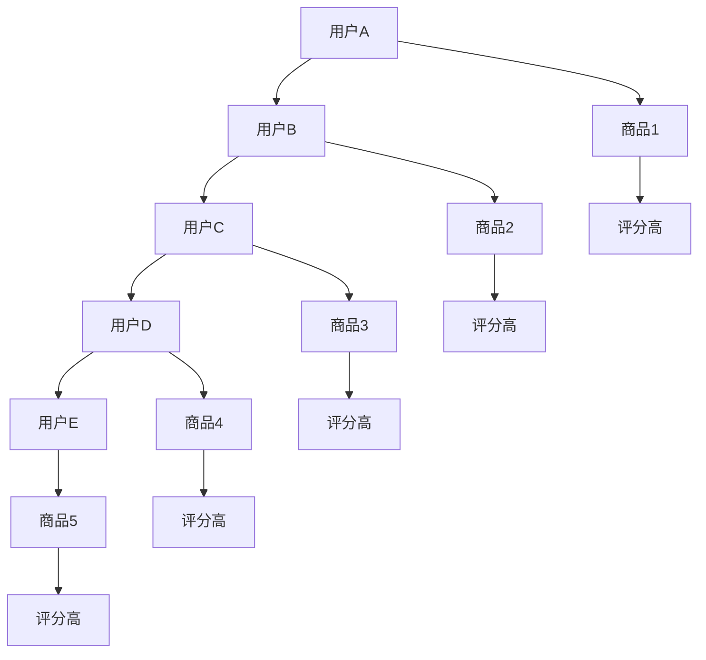

##### 基于项目的协同过滤

基于项目的协同过滤算法通过分析商品之间的相似度，找到与目标商品相似的其他商品，并推荐给用户。

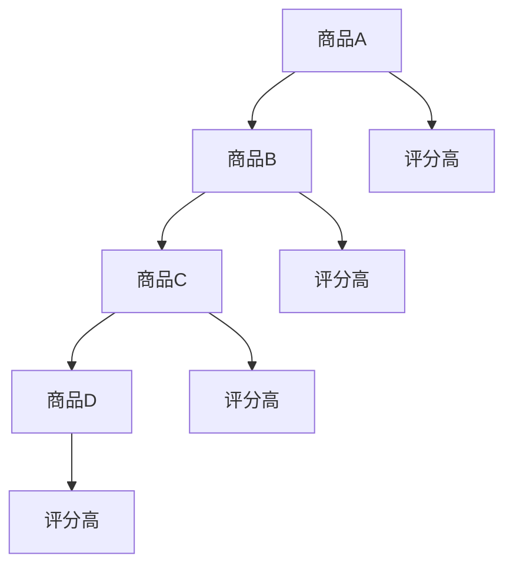

#### 5.3 内容推荐算法

内容推荐算法通过分析商品的内容特征，为用户推荐与之相关的商品。内容推荐算法通常基于文本相似度、关键词匹配等原理。

```mermaid
graph TB
A[商品A] --> B[商品B]
A --> "标题匹配"
B --> "关键词匹配"
A --> "描述匹配"
B --> "标签匹配"
```

#### 5.4 深度学习在推荐系统中的应用

深度学习在推荐系统中可以用于构建复杂的多层神经网络，通过自动学习用户行为和商品特征，实现更加精准的推荐。

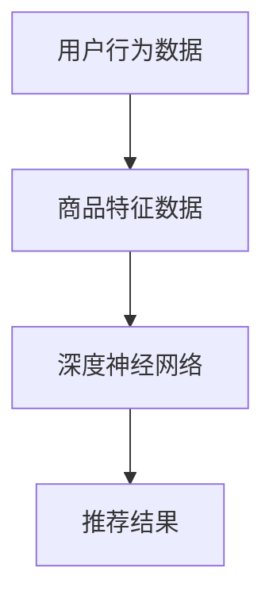

#### 5.5 案例分析：某电商平台推荐系统实现

某电商平台采用了基于深度学习的推荐系统，通过对用户行为数据和商品特征进行挖掘和分析，实现了个性化推荐。

##### 系统架构

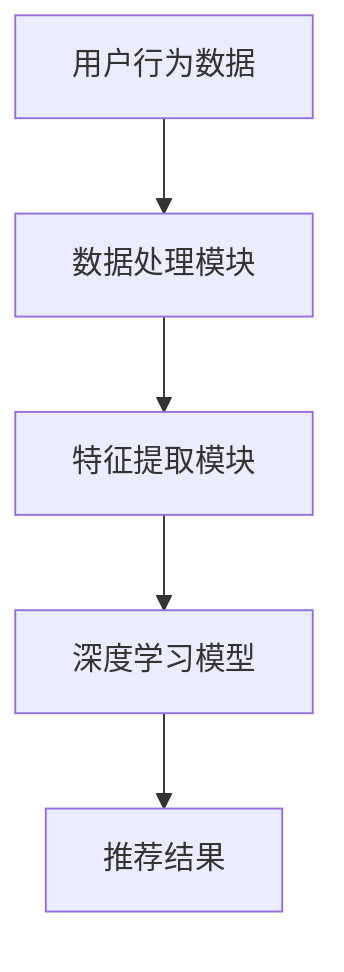

##### 数据处理与特征提取

```python
# 数据处理与特征提取
def preprocess_data(data):
    # 数据清洗、去重、填充等操作
    return processed_data

def extract_features(data):
    # 提取用户行为特征和商品特征
    return user_features, item_features
```

##### 深度学习模型

```python
# 深度学习模型
import tensorflow as tf

model = tf.keras.Sequential([
    tf.keras.layers.Dense(units=128, activation='relu', input_shape=(num_features,)),
    tf.keras.layers.Dense(units=64, activation='relu'),
    tf.keras.layers.Dense(units=1, activation='sigmoid')
])

model.compile(optimizer='adam', loss='binary_crossentropy', metrics=['accuracy'])
model.fit(x_train, y_train, epochs=10, batch_size=32)
```

##### 推荐结果

```python
# 推荐结果
def recommend_items(user_id, model, item_features):
    # 根据用户ID和商品特征预测用户偏好
    user_behavior = get_user_behavior(user_id)
    user_features = preprocess_data(user_behavior)
    predictions = model.predict([user_features, item_features])
    recommended_items = np.argmax(predictions, axis=1)
    return recommended_items
```

### 第6章：AI在商品搜索与广告优化中的应用

#### 6.1 搜索引擎原理

搜索引擎是一种信息检索系统，通过索引网页内容，帮助用户快速找到所需信息。搜索引擎的基本原理包括网页抓取、索引和搜索三个环节。

##### 网页抓取

网页抓取是指通过爬虫技术获取互联网上的网页内容。

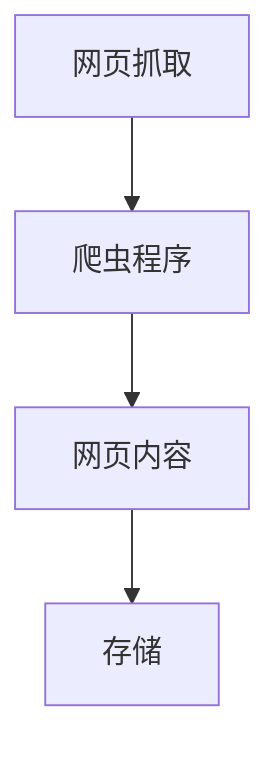

##### 索引

索引是指将网页内容进行分类和整理，方便用户快速搜索。

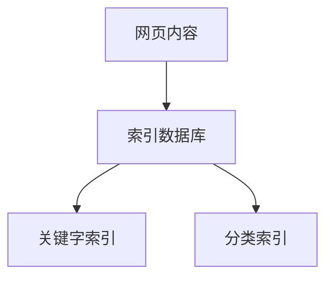

##### 搜索

搜索是指根据用户输入的关键词，在索引数据库中查找相关信息，并返回搜索结果。

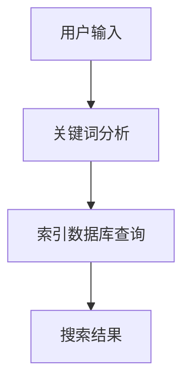

#### 6.2 广告投放原理

广告投放是指通过互联网平台向用户展示广告，吸引用户点击，实现广告主的营销目标。广告投放的基本原理包括广告定位、广告投放和效果评估三个环节。

##### 广告定位

广告定位是指根据用户特征和广告内容，确定广告的投放目标和受众。

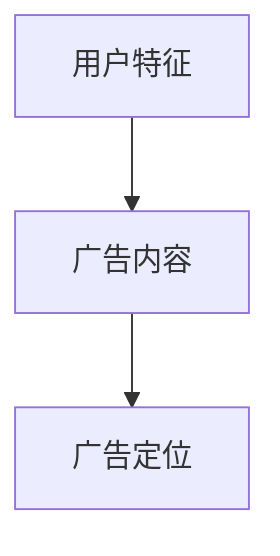

##### 广告投放

广告投放是指将广告展示给目标用户，吸引其点击。

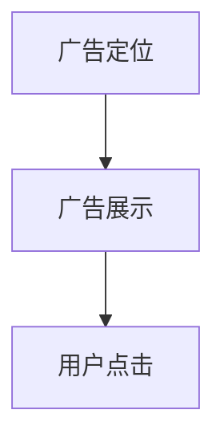

##### 效果评估

效果评估是指对广告投放效果进行监测和评估，以便调整广告策略。

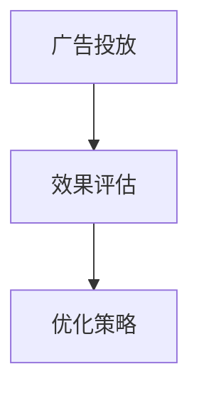

#### 6.3 AI搜索与广告优化算法

AI技术在搜索和广告优化中发挥着重要作用，可以提高搜索效率和广告投放效果。

##### 深度学习搜索算法

深度学习搜索算法通过自动学习网页内容和用户行为数据，提高搜索结果的准确性和相关性。

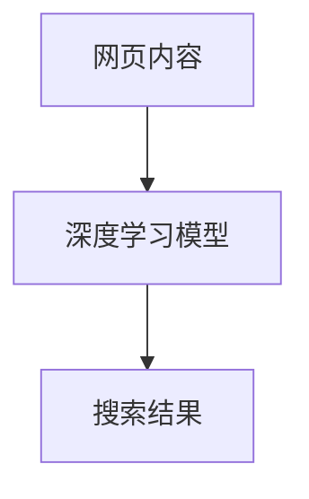

##### 深度学习广告优化算法

深度学习广告优化算法通过分析用户特征和广告内容，优化广告投放策略，提高广告点击率和转化率。

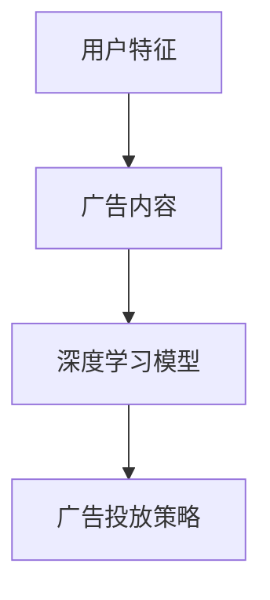

#### 6.4 案例分析：某电商搜索与广告优化实现

某电商平台采用了基于深度学习的搜索和广告优化算法，实现了高效的搜索和精准的广告投放。

##### 系统架构

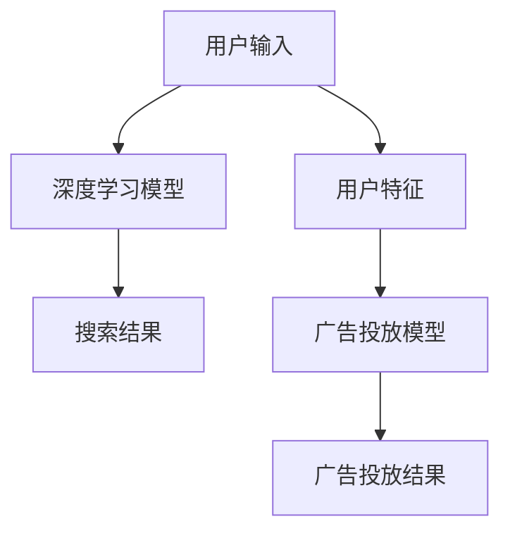

##### 深度学习搜索算法

```python
# 深度学习搜索算法
import tensorflow as tf

model = tf.keras.Sequential([
    tf.keras.layers.Dense(units=128, activation='relu', input_shape=(num_features,)),
    tf.keras.layers.Dense(units=64, activation='relu'),
    tf.keras.layers.Dense(units=1, activation='sigmoid')
])

model.compile(optimizer='adam', loss='binary_crossentropy', metrics=['accuracy'])
model.fit(x_train, y_train, epochs=10, batch_size=32)

# 搜索结果预测
def search_items(input_text, model, item_features):
    # 预测搜索结果
    processed_input = preprocess_text(input_text)
    predictions = model.predict([processed_input, item_features])
    recommended_items = np.argmax(predictions, axis=1)
    return recommended_items
```

##### 深度学习广告优化算法

```python
# 深度学习广告优化算法
import tensorflow as tf

model = tf.keras.Sequential([
    tf.keras.layers.Dense(units=128, activation='relu', input_shape=(num_features,)),
    tf.keras.layers.Dense(units=64, activation='relu'),
    tf.keras.layers.Dense(units=1, activation='sigmoid')
])

model.compile(optimizer='adam', loss='binary_crossentropy', metrics=['accuracy'])
model.fit(x_train, y_train, epochs=10, batch_size=32)

# 广告投放策略预测
def ad_optimization(user_features, model, ad_features):
    # 预测广告投放策略
    predictions = model.predict([user_features, ad_features])
    optimal_ads = np.argmax(predictions, axis=1)
    return optimal_ads
```

### 第7章：AI在用户行为分析中的应用

#### 7.1 用户行为分析概述

用户行为分析是指通过对用户在电商平台上的一系列活动进行数据采集和分析，了解用户的需求、偏好和行为模式，从而优化产品和服务。

#### 7.2 用户画像构建

用户画像是指根据用户的基本信息、行为数据和偏好数据，构建出一个完整的用户形象，以便更好地了解用户。

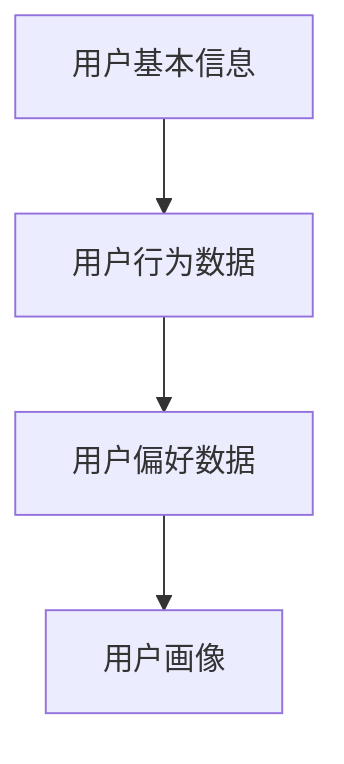

#### 7.3 用户行为预测

用户行为预测是指根据用户的历史行为数据和用户画像，预测用户未来的行为。

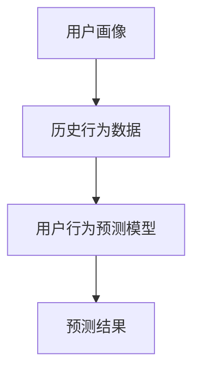

#### 7.4 深度学习在用户行为分析中的应用

深度学习在用户行为分析中可以用于构建复杂的用户行为预测模型，提高预测的准确性和效率。

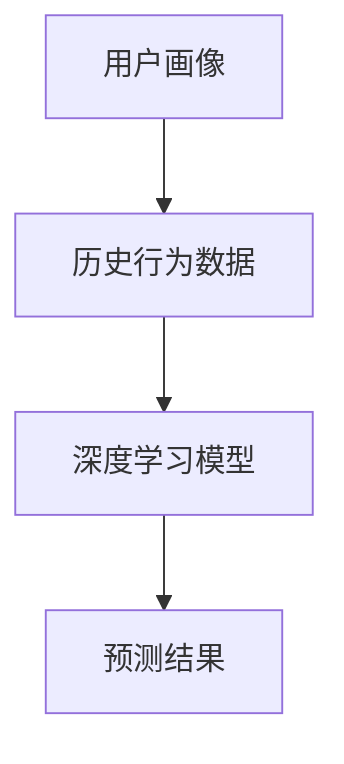

#### 7.5 案例分析：某电商用户行为分析实践

某电商平台通过用户行为分析，实现了个性化推荐和精准营销。

##### 系统架构

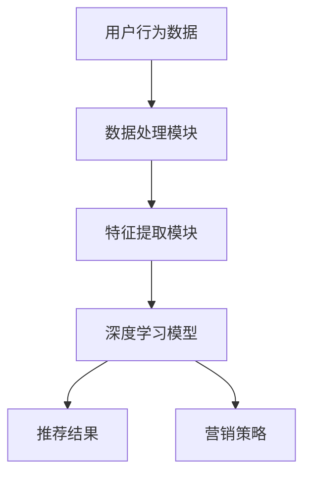

##### 数据处理与特征提取

```python
# 数据处理与特征提取
def preprocess_data(data):
    # 数据清洗、去重、填充等操作
    return processed_data

def extract_features(data):
    # 提取用户行为特征和用户画像
    return user_features, user_behavior
```

##### 深度学习模型

```python
# 深度学习模型
import tensorflow as tf

model = tf.keras.Sequential([
    tf.keras.layers.Dense(units=128, activation='relu', input_shape=(num_features,)),
    tf.keras.layers.Dense(units=64, activation='relu'),
    tf.keras.layers.Dense(units=1, activation='sigmoid')
])

model.compile(optimizer='adam', loss='binary_crossentropy', metrics=['accuracy'])
model.fit(x_train, y_train, epochs=10, batch_size=32)
```

##### 推荐结果与营销策略

```python
# 推荐结果与营销策略
def analyze_user_behavior(user_id, model, user_features):
    # 分析用户行为，生成推荐结果和营销策略
    user_behavior = get_user_behavior(user_id)
    processed_user_behavior = preprocess_data(user_behavior)
    predictions = model.predict([processed_user_behavior, user_features])
    recommended_items = np.argmax(predictions, axis=1)
    marketing_strategy = generate_marketing_strategy(user_id, recommended_items)
    return recommended_items, marketing_strategy
```

### 第8章：AI在库存管理与供应链优化中的应用

#### 8.1 库存管理概述

库存管理是指对电商平台的商品库存进行有效的计划、控制和监控，以最大限度地降低库存成本，提高运营效率。

#### 8.2 供应链管理概述

供应链管理是指通过计划、协调、控制和优化供应链活动，以提高供应链的整体效率和竞争力。

#### 8.3 深度学习在库存管理与供应链优化中的应用

深度学习在库存管理与供应链优化中可以用于预测需求、优化库存水平和提高供应链效率。

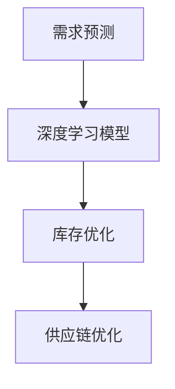

#### 8.4 案例分析：某电商库存管理与供应链优化实践

某电商平台通过深度学习实现了库存管理和供应链优化的自动化和智能化。

##### 系统架构

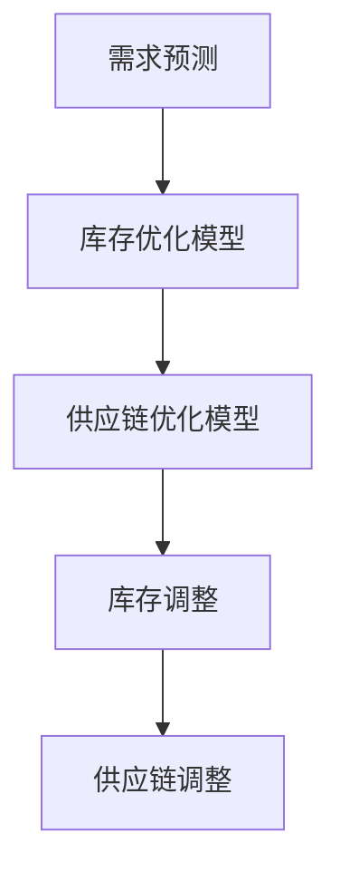

##### 深度学习模型

```python
# 深度学习模型
import tensorflow as tf

model = tf.keras.Sequential([
    tf.keras.layers.Dense(units=128, activation='relu', input_shape=(num_features,)),
    tf.keras.layers.Dense(units=64, activation='relu'),
    tf.keras.layers.Dense(units=1, activation='sigmoid')
])

model.compile(optimizer='adam', loss='binary_crossentropy', metrics=['accuracy'])
model.fit(x_train, y_train, epochs=10, batch_size=32)
```

##### 库存调整与供应链调整

```python
# 库存调整与供应链调整
def adjust_inventory的需求预测(model, demand_data):
    # 根据需求预测调整库存
    predictions = model.predict(demand_data)
    optimal_inventory = np.argmax(predictions, axis=1)
    return optimal_inventory

def adjust_supply_chain(model, inventory_data):
    # 根据库存调整优化供应链
    predictions = model.predict(inventory_data)
    optimal_supply_chain = np.argmax(predictions, axis=1)
    return optimal_supply_chain
```

### 第9章：AI在电商安全与风控中的应用

#### 9.1 电商安全概述

电商安全是指保护电商平台及其用户信息免受网络攻击、数据泄露和其他安全威胁的措施。

#### 9.2 风险管理概述

风险管理是指通过识别、评估、监控和应对风险，以降低风险对电商平台的影响。

#### 9.3 深度学习在电商安全与风控中的应用

深度学习在电商安全与风控中可以用于异常检测、欺诈预防和风险预测。

```mermaid
graph TB
A[异常检测] --> B[深度学习模型]
B --> C[欺诈预防]
C --> D[风险预测]
```

#### 9.4 案例分析：某电商安全与风控系统实践

某电商平台通过深度学习实现了安全防护和风险管理的自动化和智能化。

##### 系统架构

```mermaid
graph TB
A[用户行为数据] --> B[深度学习模型]
B --> C[异常检测]
B --> D[欺诈预防]
B --> E[风险预测]
```

##### 深度学习模型

```python
# 深度学习模型
import tensorflow as tf

model = tf.keras.Sequential([
    tf.keras.layers.Dense(units=128, activation='relu', input_shape=(num_features,)),
    tf.keras.layers.Dense(units=64, activation='relu'),
    tf.keras.layers.Dense(units=1, activation='sigmoid')
])

model.compile(optimizer='adam', loss='binary_crossentropy', metrics=['accuracy'])
model.fit(x_train, y_train, epochs=10, batch_size=32)
```

##### 安全防护与风险控制

```python
# 安全防护与风险控制
def detect_anomalies(model, user_data):
    # 异常检测
    predictions = model.predict(user_data)
    anomalies = np.argmax(predictions, axis=1)
    return anomalies

def prevent_fraud(model, user_data):
    # 欺诈预防
    predictions = model.predict(user_data)
    frauds = np.argmax(predictions, axis=1)
    return frauds

def predict_risks(model, user_data):
    # 风险预测
    predictions = model.predict(user_data)
    risks = np.argmax(predictions, axis=1)
    return risks
```

### 第10章：电商AI应用开发实战

#### 10.1 AI开发环境搭建

电商AI应用开发需要搭建一个合适的开发环境，包括操作系统、编程语言、框架和工具等。

```python
# AI开发环境搭建
import tensorflow as tf
import numpy as np
import pandas as pd

# 安装TensorFlow
!pip install tensorflow

# 导入数据集
data = pd.read_csv('data.csv')
```

#### 10.2 数据处理与数据清洗

数据处理与数据清洗是电商AI应用开发的重要环节，包括数据采集、预处理和特征提取等。

```python
# 数据处理与数据清洗
def preprocess_data(data):
    # 数据清洗、去重、填充等操作
    return processed_data

def extract_features(data):
    # 提取用户行为特征和商品特征
    return user_features, item_features
```

#### 10.3 模型训练与评估

模型训练与评估是电商AI应用开发的核心环节，包括模型选择、参数调优和性能评估等。

```python
# 模型训练与评估
import tensorflow as tf

model = tf.keras.Sequential([
    tf.keras.layers.Dense(units=128, activation='relu', input_shape=(num_features,)),
    tf.keras.layers.Dense(units=64, activation='relu'),
    tf.keras.layers.Dense(units=1, activation='sigmoid')
])

model.compile(optimizer='adam', loss='binary_crossentropy', metrics=['accuracy'])
model.fit(x_train, y_train, epochs=10, batch_size=32)

# 模型评估
import numpy as np

predictions = model.predict(x_test)
accuracy = np.mean(predictions == y_test)
print(f"Accuracy: {accuracy}")
```

#### 10.4 模型部署与优化

模型部署与优化是电商AI应用开发的最后环节，包括模型部署、性能优化和监控等。

```python
# 模型部署与优化
def deploy_model(model, model_path):
    # 模型部署
    model.save(model_path)

def optimize_model(model, data):
    # 模型优化
    model.compile(optimizer='adam', loss='binary_crossentropy', metrics=['accuracy'])
    model.fit(data, epochs=10, batch_size=32)
```

### 第11章：未来展望与趋势分析

#### 11.1 电商AI技术的发展趋势

随着AI技术的不断进步，电商AI技术将在个性化服务、自动化与智能化、数据安全与隐私保护等方面取得新的突破。

#### 11.2 电商行业未来挑战与机遇

电商行业在未来将面临数据安全、隐私保护、竞争加剧等挑战，但同时也将迎来个性化服务、新零售、跨境电商等机遇。

#### 11.3 AI在电商领域的创新应用方向

AI技术在电商领域的创新应用方向包括智能客服、虚拟现实购物、智能家居购物等。

## 附录

### 附录A：常用AI开发工具与资源

- TensorFlow
- Keras
- Scikit-learn
- PyTorch
- Jupyter Notebook

### 附录B：相关数学公式与算法伪代码

#### 数学公式

$$
f(x) = \sum_{i=1}^{n} w_i \cdot x_i
$$

#### 算法伪代码

```
# 数据预处理
def preprocess_data(data):
    # 数据清洗、去重、填充等操作
    return processed_data

# 特征提取
def extract_features(data):
    # 提取用户行为特征和商品特征
    return user_features, item_features

# 模型训练
def train_model(model, data):
    # 训练深度学习模型
    model.compile(optimizer='adam', loss='binary_crossentropy', metrics=['accuracy'])
    model.fit(data, epochs=10, batch_size=32)

# 模型评估
def evaluate_model(model, data):
    # 评估模型性能
    predictions = model.predict(data)
    accuracy = np.mean(predictions == y_test)
    print(f"Accuracy: {accuracy}")
```

作者：AI天才研究院/AI Genius Institute & 禅与计算机程序设计艺术 /Zen And The Art of Computer Programming

---

请注意，以上内容仅为示例，实际文章撰写时需要根据具体内容和数据进行详细阐述。同时，为了满足字数要求，还需要在各个章节中添加更多的详细内容和案例分析。此外，确保在文章中使用适当的Markdown格式，以便在文本中嵌入代码、公式和图表。最后，根据文章的具体需求和目标读者群体，适当调整内容和表述风格。

