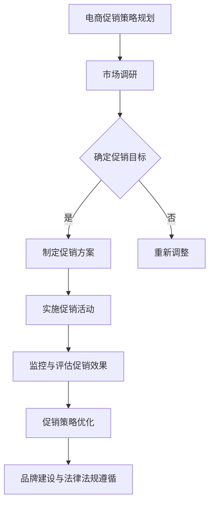

                 

# 文章标题：电商促销策略的实践应用

> 关键词：电商促销、价格策略、赠品促销、折扣促销、积分兑换、社交媒体营销、数据分析、案例分析、促销优化、品牌建设、法律法规、新趋势、挑战、未来

> 摘要：本文将深入探讨电商促销策略的实践应用，从基础理论到实际操作，再到新趋势与挑战，全面解析电商促销的各个方面。通过详细的分析、案例分析、优化方法以及法律法规的探讨，为电商企业提供有效的促销策略制定和实施指导。

## 第一部分：电商促销策略基础

### 1.1 电商促销概述

#### 1.1.1 促销的定义与作用

促销是指企业通过各种手段和策略，吸引消费者的注意力，激发消费者的购买欲望，从而实现商品销售的一种市场行为。在电商领域，促销不仅是为了提升销售额，更是品牌推广、市场拓展的重要手段。

促销的作用主要体现在以下几个方面：

1. **提升销量**：通过促销活动，可以迅速提升商品销量，提高市场份额。
2. **品牌推广**：促销活动可以提升品牌知名度，增加消费者对品牌的认知和好感。
3. **库存清理**：针对库存积压的商品，通过促销活动可以快速清理库存，缓解资金压力。
4. **市场拓展**：促销活动可以吸引新客户，扩大市场覆盖范围。

#### 1.1.2 促销的分类与形式

电商促销可以按照不同的标准进行分类，常见的分类方法包括：

1. **按促销对象分类**：可以分为大众促销、群体促销、个人促销等。
   - **大众促销**：面向所有消费者，如节日促销、全民促销等。
   - **群体促销**：面向特定群体，如会员促销、学生促销等。
   - **个人促销**：面向个别消费者，如VIP优惠、生日特权等。

2. **按促销形式分类**：可以分为价格促销、赠品促销、折扣促销、积分兑换等。
   - **价格促销**：通过降低商品价格来吸引消费者购买。
   - **赠品促销**：购买商品赠送其他商品或赠品。
   - **折扣促销**：提供一定的折扣优惠，如满减、打折等。
   - **积分兑换**：消费者通过消费积累积分，兑换商品或优惠券。

#### 1.1.3 电商促销的发展历程

电商促销的发展历程可以分为以下几个阶段：

1. **初级阶段**：主要是价格促销，通过大幅度降价来吸引消费者。
2. **发展阶段**：随着电商平台的竞争加剧，促销形式逐渐多样化，包括赠品促销、折扣促销、积分兑换等。
3. **成熟阶段**：电商促销开始注重策略性和个性化，结合数据分析、用户行为研究等手段，制定更加精准和有效的促销策略。

### 1.2 电商市场环境分析

#### 1.2.1 电商行业现状

电商行业近年来呈现出高速增长的态势，市场规模逐年扩大。以下是电商行业现状的一些关键数据：

- **市场规模**：全球电商市场规模持续扩大，2020年已达到3.5万亿美元。
- **用户增长**：全球电商用户数量不断增加，预计2021年将达到20亿人。
- **竞争态势**：电商平台之间的竞争愈发激烈，各大电商平台都在不断优化自身服务，提升用户体验。

#### 1.2.2 消费者行为分析

消费者行为分析是制定有效促销策略的重要依据。以下是电商消费者行为分析的一些关键点：

- **购买动机**：消费者的购买动机主要包括价格、品牌、质量、服务等因素。
- **购买习惯**：消费者在电商平台的购买习惯包括搜索、浏览、比较、下单等环节。
- **消费偏好**：消费者的消费偏好受年龄、性别、地域、收入水平等因素的影响。

#### 1.2.3 竞争对手分析

竞争对手分析是电商促销策略制定过程中不可或缺的一环。以下是竞争对手分析的一些关键点：

- **竞争地位**：分析竞争对手在市场中的地位，包括市场份额、品牌影响力等。
- **促销策略**：分析竞争对手的促销策略，包括价格策略、赠品策略、折扣策略等。
- **市场反应**：分析竞争对手对市场变化和促销活动的反应，为自身促销策略提供参考。

### 1.3 电商促销目标与原则

#### 1.3.1 促销目标设定

电商促销目标应具有明确性和可衡量性，常见的促销目标包括：

- **提升销售额**：通过促销活动提高商品销量，增加收入。
- **提高市场份额**：通过促销活动扩大品牌在市场中的占有率。
- **吸引新客户**：通过促销活动吸引新客户，提高客户转化率。
- **提高品牌知名度**：通过促销活动提高品牌知名度和影响力。

#### 1.3.2 促销原则制定

电商促销原则是制定促销策略的基础，常见的促销原则包括：

- **诚信原则**：促销活动要诚实守信，不得虚假宣传。
- **创新原则**：促销活动要富有创意，能够吸引消费者的注意力。
- **针对性原则**：促销活动要针对不同的消费者群体和商品特点，制定相应的促销策略。
- **经济性原则**：促销活动要考虑成本效益，确保促销活动的经济效益。

#### 1.3.3 促销策略规划

促销策略规划是电商促销活动成功的关键。以下是促销策略规划的主要步骤：

1. **市场调研**：分析市场环境和竞争对手，了解消费者需求和购买习惯。
2. **目标设定**：根据市场调研结果，设定明确的促销目标。
3. **策略制定**：根据促销目标和市场环境，制定具体的促销策略。
4. **资源分配**：合理分配促销资源，包括预算、人力、物力等。
5. **活动实施**：按照促销策略规划，实施促销活动。
6. **效果评估**：对促销活动效果进行评估，包括销售额、市场份额、品牌知名度等指标。

### 1.4 电商促销策略概述

#### 1.4.1 价格促销策略

价格促销策略是最常见的电商促销策略之一，通过降低商品价格来吸引消费者购买。以下是一些常见的价格促销策略：

1. **打折促销**：提供一定的折扣优惠，如满减、打折等。
2. **特价促销**：针对特定商品提供特价优惠，吸引消费者购买。
3. **会员专享**：为会员提供专享价格优惠，提高会员忠诚度。
4. **限时抢购**：设置限时抢购活动，刺激消费者快速购买。

#### 1.4.2 赠品促销策略

赠品促销策略通过赠送商品或赠品来吸引消费者购买。以下是一些常见的赠品促销策略：

1. **买一赠一**：购买一件商品赠送另一件商品。
2. **赠品兑换**：消费者通过积分或优惠券兑换赠品。
3. **捆绑销售**：将商品组合在一起销售，提供优惠价格。
4. **赠品抽奖**：在购买商品后，提供赠品抽奖机会，增加购买乐趣。

#### 1.4.3 折扣促销策略

折扣促销策略通过提供折扣优惠来吸引消费者购买。以下是一些常见的折扣促销策略：

1. **满减促销**：购买金额达到一定额度，提供减免优惠。
2. **优惠券促销**：提供优惠券，消费者在购买时使用。
3. **限时折扣**：设置限时折扣活动，刺激消费者快速购买。
4. **阶梯折扣**：根据购买数量提供不同等级的折扣优惠。

#### 1.4.4 积分兑换促销策略

积分兑换促销策略通过积分兑换商品或优惠券来吸引消费者购买。以下是一些常见的积分兑换促销策略：

1. **积分兑换商品**：消费者通过积分兑换自己喜欢的商品。
2. **积分兑换优惠券**：消费者通过积分兑换优惠券，用于下次购买。
3. **积分翻倍**：在特定活动期间，积分获取速度加快，增加消费者兑换动力。
4. **积分抽奖**：在购买商品后，提供积分抽奖机会，增加消费者参与度。

#### 1.4.5 联合促销策略

联合促销策略是电商与品牌商、第三方平台等合作，共同开展促销活动。以下是一些常见的联合促销策略：

1. **品牌联合**：电商与品牌商合作，提供品牌专属优惠。
2. **平台合作**：电商与第三方平台合作，共同推广促销活动。
3. **跨界合作**：电商与其他行业企业合作，开展跨界促销活动。
4. **线上线下联动**：线上线下共同开展促销活动，提高活动影响力。

### 1.5 电商促销工具与技术

#### 1.5.1 SEO与SEM

SEO（搜索引擎优化）和SEM（搜索引擎营销）是提高电商网站流量和转化率的重要工具。

- **SEO**：通过优化网站内容和结构，提高在搜索引擎中的排名，吸引更多有机流量。
- **SEM**：通过付费广告投放，在搜索引擎中展示广告，提高曝光度和转化率。

#### 1.5.2 内容营销

内容营销是通过创建和分享有价值的内容，吸引潜在客户，提高品牌知名度和影响力。以下是一些常见的内容营销策略：

- **博客文章**：发布与商品相关的内容，提供购物指南、评测等。
- **视频营销**：制作有趣、有用的视频，展示商品特点和使用方法。
- **社交媒体内容**：在社交媒体平台上发布动态，与粉丝互动，增加品牌曝光度。

#### 1.5.3 社交媒体营销

社交媒体营销是通过社交媒体平台，如微信、微博、抖音等，与消费者进行互动，提高品牌知名度和影响力。以下是一些常见的社交媒体营销策略：

- **社交媒体广告**：在社交媒体平台上投放广告，精准定位目标客户。
- **社交媒体互动**：通过评论、点赞、分享等互动，增加用户参与度和忠诚度。
- **社交媒体直播**：通过直播形式，与用户实时互动，提高销售转化率。

#### 1.5.4 电子邮件营销

电子邮件营销是通过电子邮件向潜在和现有客户发送营销信息，提高销售转化率和客户忠诚度。以下是一些常见的电子邮件营销策略：

- **欢迎邮件**：向新注册的用户发送欢迎邮件，介绍品牌和商品。
- **促销邮件**：向用户发送促销信息和优惠券，刺激购买欲望。
- **订单跟踪邮件**：向用户发送订单状态更新邮件，提高用户满意度。

## 第二部分：电商促销策略的实践应用

### 2.1 电商促销策略实施流程

#### 2.1.1 市场调研

市场调研是制定电商促销策略的第一步，通过对市场环境、竞争对手、消费者行为等方面的分析，为促销策略制定提供数据支持。以下是市场调研的主要步骤：

1. **确定调研目标**：明确调研的目的和需要获取的信息。
2. **选择调研方法**：根据调研目标选择合适的调研方法，如问卷调查、深度访谈、数据分析等。
3. **收集数据**：通过调研方法收集相关数据，如市场数据、消费者行为数据、竞争对手数据等。
4. **分析数据**：对收集到的数据进行分析，识别市场趋势、消费者需求、竞争对手策略等。
5. **撰写调研报告**：将调研结果整理成报告，为促销策略制定提供依据。

#### 2.1.2 确定促销目标

在市场调研的基础上，根据企业的战略目标和市场环境，确定具体的促销目标。促销目标应具有明确性和可衡量性，如提升销售额、提高市场份额、吸引新客户、提高品牌知名度等。

#### 2.1.3 制定促销方案

制定促销方案是电商促销策略实施的关键步骤。以下是制定促销方案的主要步骤：

1. **选择促销形式**：根据促销目标和市场环境，选择合适的促销形式，如价格促销、赠品促销、折扣促销、积分兑换等。
2. **设计促销活动**：根据促销形式，设计具体的促销活动，如打折促销、买一赠一、满减促销等。
3. **确定促销预算**：根据促销目标和促销形式，制定合理的促销预算，确保促销活动的经济效益。
4. **制定促销时间表**：明确促销活动的开始和结束时间，确保促销活动的顺利进行。

#### 2.1.4 实施促销活动

实施促销活动是电商促销策略的执行环节。以下是实施促销活动的主要步骤：

1. **准备促销资源**：根据促销方案，准备所需的促销资源，如商品库存、优惠券、广告素材等。
2. **宣传推广**：通过多种渠道宣传推广促销活动，如社交媒体、电子邮件、短信等，提高活动曝光度。
3. **活动执行**：按照促销方案执行促销活动，确保活动顺利进行。
4. **监控活动效果**：实时监控促销活动的效果，包括销售额、市场份额、客户满意度等指标。

#### 2.1.5 监控与评估促销效果

促销效果评估是电商促销策略优化的重要依据。以下是监控与评估促销效果的主要步骤：

1. **收集数据**：收集促销活动期间的销售数据、用户行为数据等。
2. **分析数据**：对收集到的数据进行分析，评估促销活动的效果，如销售额增长、市场份额提升等。
3. **撰写评估报告**：将评估结果整理成报告，为促销策略优化提供依据。
4. **调整促销策略**：根据评估结果，调整促销策略，提高促销活动的效果。

### 2.2 电商促销策略案例分析

#### 2.2.1 案例一：双十一购物节的促销策略

双十一购物节是中国电商行业的年度促销盛宴，各大电商平台纷纷推出各种促销策略。以下是双十一购物节的促销策略分析：

1. **价格促销**：电商平台通过打折、满减等价格促销策略，吸引消费者购买。
2. **赠品促销**：购买特定商品赠送赠品，提高消费者购买意愿。
3. **折扣促销**：提供限时折扣，刺激消费者快速购买。
4. **积分兑换**：通过积分兑换商品或优惠券，提高用户粘性。
5. **品牌联合**：与知名品牌合作，提供品牌专属优惠，提高品牌知名度。

#### 2.2.2 案例二：618购物节的促销策略

618购物节是京东、天猫等电商平台举办的年度促销活动。以下是618购物节的促销策略分析：

1. **价格促销**：电商平台通过打折、满减等价格促销策略，吸引消费者购买。
2. **限时抢购**：设置限时抢购活动，刺激消费者快速购买。
3. **赠品促销**：购买特定商品赠送赠品，提高消费者购买意愿。
4. **优惠券促销**：提供大量优惠券，提高消费者购买积极性。
5. **会员专享**：为会员提供专享优惠，提高会员忠诚度。

#### 2.2.3 案例三：黑五购物节的促销策略

黑五购物节是欧美地区的重要购物节日，电商平台纷纷推出各种促销策略。以下是黑五购物节的促销策略分析：

1. **价格促销**：电商平台通过打折、满减等价格促销策略，吸引消费者购买。
2. **赠品促销**：购买特定商品赠送赠品，提高消费者购买意愿。
3. **折扣促销**：提供限时折扣，刺激消费者快速购买。
4. **积分兑换**：通过积分兑换商品或优惠券，提高用户粘性。
5. **限时抢购**：设置限时抢购活动，刺激消费者快速购买。

### 2.3 电商促销策略优化

#### 2.3.1 促销效果的评估指标

促销效果的评估指标是衡量促销活动效果的重要依据。以下是常见的促销效果评估指标：

1. **销售额**：促销活动期间的总销售额，用于衡量促销活动的直接效果。
2. **市场份额**：促销活动期间的市场占有率，用于衡量促销活动的市场影响。
3. **客户满意度**：消费者对促销活动的满意度，用于评估促销活动的用户体验。
4. **品牌知名度**：促销活动后，品牌知名度的提升程度，用于评估促销活动的品牌推广效果。
5. **用户留存率**：促销活动后，用户留存率的变化情况，用于评估促销活动的用户粘性。

#### 2.3.2 促销策略的优化方法

促销策略的优化方法包括以下方面：

1. **数据分析**：通过对促销活动期间的数据进行分析，识别促销活动的优势和不足，为优化策略提供依据。
2. **A/B测试**：对不同的促销策略进行A/B测试，比较不同策略的效果，选择最优策略。
3. **用户调研**：通过用户调研，了解消费者的需求和偏好，调整促销策略。
4. **竞争分析**：分析竞争对手的促销策略，借鉴优秀策略，优化自身促销策略。

#### 2.3.3 促销策略的调整与改进

促销策略的调整与改进是提高促销活动效果的关键。以下是促销策略调整与改进的方法：

1. **根据效果调整**：根据促销效果评估指标，对促销策略进行相应调整，如调整价格、赠品、折扣等。
2. **根据市场变化调整**：根据市场环境的变化，及时调整促销策略，如节假日促销、季节性促销等。
3. **根据消费者需求调整**：根据消费者的需求和偏好，调整促销策略，提高消费者满意度。
4. **持续改进**：不断收集用户反馈和市场数据，持续优化促销策略，提高促销活动的效果。

### 2.4 电商促销策略与品牌建设

#### 2.4.1 促销活动与品牌形象的关系

促销活动与品牌形象密切相关。通过合理的促销活动，可以提升品牌形象，增加消费者对品牌的认知和好感。以下是一些促进品牌形象提升的促销策略：

1. **品牌定位明确**：在促销活动中明确品牌定位，传递品牌核心价值。
2. **品质保证**：通过促销活动展示商品品质，提升品牌形象。
3. **创新营销**：通过创意促销活动，提升品牌在消费者心中的独特性。
4. **口碑营销**：通过消费者的好评和口碑传播，提升品牌形象。

#### 2.4.2 促销活动与消费者关系的维护

促销活动是维护消费者关系的重要手段。通过合理的促销活动，可以增强消费者对品牌的忠诚度，提升消费者满意度。以下是一些维护消费者关系的促销策略：

1. **会员制度**：建立会员制度，为会员提供专属优惠和福利，提高会员忠诚度。
2. **优惠券和折扣**：通过优惠券和折扣，吸引消费者重复购买，增加消费者粘性。
3. **互动活动**：举办线上线下互动活动，与消费者建立良好的互动关系。
4. **售后服务**：提供优质的售后服务，提高消费者满意度，增加消费者忠诚度。

#### 2.4.3 促销活动与品牌忠诚度的提升

促销活动对品牌忠诚度的提升具有重要作用。通过合理的促销活动，可以激发消费者的购买欲望，提升品牌忠诚度。以下是一些提升品牌忠诚度的促销策略：

1. **积分兑换**：通过积分兑换活动，增加消费者参与度，提升品牌忠诚度。
2. **老客户优惠**：为老客户提供专属优惠，增强消费者对品牌的忠诚度。
3. **品牌联名**：与知名品牌合作，通过品牌联名活动，提升品牌形象和忠诚度。
4. **情感营销**：通过情感营销，如公益活动、品牌故事等，与消费者建立深厚的情感联系，提升品牌忠诚度。

### 2.5 电商促销策略与法律法规

#### 2.5.1 电商促销的法律框架

电商促销活动需要遵守相关法律法规，确保促销活动的合法性和合规性。以下是电商促销的法律框架：

1. **《中华人民共和国反不正当竞争法》**：规范电商促销行为，禁止虚假宣传、不正当竞争等违法行为。
2. **《中华人民共和国消费者权益保护法》**：保障消费者的合法权益，规范电商促销活动。
3. **《中华人民共和国广告法》**：规范电商广告行为，禁止虚假广告和误导性宣传。
4. **《电子商务法》**：规范电商经营行为，保护消费者权益。

#### 2.5.2 电商促销中的法律风险

电商促销活动中存在一些法律风险，需要引起重视。以下是常见的法律风险：

1. **虚假宣传**：通过虚假广告、夸大宣传等手段误导消费者，涉嫌违反《中华人民共和国广告法》。
2. **不正当竞争**：通过恶意降价、虚假折扣等手段破坏市场竞争秩序，涉嫌违反《中华人民共和国反不正当竞争法》。
3. **侵犯消费者权益**：未按照法律规定履行售后服务义务，侵犯消费者权益，涉嫌违反《中华人民共和国消费者权益保护法》。

#### 2.5.3 遵守法律法规的促销策略

为了确保电商促销活动的合法性和合规性，企业可以采取以下措施：

1. **合规审查**：在制定促销策略前，进行合规审查，确保促销活动符合法律法规要求。
2. **明确规则**：在促销活动中，明确促销规则和条件，避免引起消费者误解和纠纷。
3. **合规培训**：对促销活动相关人员开展法律法规培训，提高法律意识和合规意识。
4. **投诉处理**：建立投诉处理机制，及时处理消费者投诉，维护消费者权益。

## 第三部分：电商促销策略的新趋势与挑战

### 3.1 电商促销策略的新趋势

随着电商行业的不断发展，电商促销策略也在不断演变和更新。以下是电商促销策略的新趋势：

#### 3.1.1 数据驱动的促销策略

数据驱动的促销策略是基于大数据分析和用户行为研究，制定精准的促销策略。以下是一些数据驱动的促销策略：

1. **个性化推荐**：根据用户浏览、购买历史等数据，推荐个性化的促销活动。
2. **精准营销**：通过数据分析，锁定目标客户群体，进行精准的促销活动。
3. **实时调整**：根据实时数据，动态调整促销策略，提高促销效果。

#### 3.1.2 个性化促销策略

个性化促销策略是根据消费者的兴趣、购买历史等数据，提供个性化的促销优惠。以下是一些个性化促销策略：

1. **定制化优惠**：根据消费者的个性化需求，提供定制化的优惠方案。
2. **个性化推荐**：通过个性化推荐，向消费者推荐感兴趣的商品和促销活动。
3. **会员专享**：为会员提供专属的个性化优惠，提高会员忠诚度。

#### 3.1.3 社交电商的促销策略

社交电商的促销策略通过社交媒体平台，与消费者进行互动，提高促销效果。以下是一些社交电商的促销策略：

1. **社交互动**：通过社交媒体平台，与消费者进行互动，增加用户参与度。
2. **社交裂变**：通过社交分享，实现用户的裂变传播，提高活动曝光度。
3. **社交直播**：通过社交媒体直播，与消费者实时互动，提高销售转化率。

#### 3.1.4 跨界合作的促销策略

跨界合作的促销策略是电商与品牌商、第三方平台等合作，共同开展促销活动。以下是一些跨界合作的促销策略：

1. **品牌联合**：与知名品牌合作，提供品牌专属优惠，提高品牌知名度。
2. **平台合作**：与第三方平台合作，共同推广促销活动，扩大市场影响力。
3. **跨界融合**：与其他行业企业合作，开展跨界促销活动，吸引新客户。

### 3.2 电商促销策略的挑战

电商促销策略在实施过程中面临一些挑战，需要企业不断探索和创新。以下是电商促销策略的挑战：

#### 3.2.1 消费者心理的变化

随着消费者对电商促销的日益熟悉，消费者心理也在不断变化。以下是一些消费者心理的变化：

1. **促销疲劳**：消费者对频繁的促销活动产生疲劳，降低促销效果。
2. **价格敏感度降低**：消费者对价格促销的敏感度降低，更关注商品的品质和品牌。
3. **个性化需求增加**：消费者对个性化、定制化的促销需求增加，对传统的价格促销方式产生抵触。

#### 3.2.2 活动频率与消费者疲劳

电商促销活动频率的增加可能导致消费者疲劳。以下是一些应对措施：

1. **合理控制活动频率**：避免频繁的促销活动，确保活动有足够的时间让消费者消化。
2. **创新活动形式**：通过创新促销形式，如游戏化营销、互动体验等，提高消费者参与度。
3. **活动差异化**：针对不同消费者群体和商品特点，制定差异化的促销策略，避免活动疲劳。

#### 3.2.3 促销成本的控制

电商促销策略的实施需要一定的成本投入，企业需要控制促销成本。以下是一些控制促销成本的方法：

1. **优化促销策略**：通过优化促销策略，提高促销活动的效益，降低促销成本。
2. **精细化运营**：通过精细化运营，提高运营效率，降低促销成本。
3. **合作共赢**：与品牌商、第三方平台等合作，实现共赢，降低促销成本。

#### 3.2.4 竞争环境的压力

电商行业的竞争日益激烈，企业面临巨大的竞争压力。以下是一些应对竞争环境压力的方法：

1. **差异化竞争**：通过差异化策略，突出品牌特色，提高市场竞争力。
2. **技术创新**：通过技术创新，提高产品质量和服务水平，提升竞争力。
3. **品牌建设**：加强品牌建设，提高品牌知名度和美誉度，提升市场竞争力。

### 3.3 电商促销策略的创新与未来

随着电商行业的快速发展，电商促销策略也在不断创新和演变。以下是电商促销策略的创新方向和未来趋势：

#### 3.3.1 促销策略的创新方向

1. **虚拟现实（VR）购物体验**：通过VR技术，提供沉浸式的购物体验，提高消费者购买意愿。
2. **增强现实（AR）互动营销**：通过AR技术，实现与消费者的互动，提高促销活动的趣味性和参与度。
3. **区块链技术**：利用区块链技术，实现透明、可追溯的促销活动，提高消费者信任度。
4. **人工智能（AI）个性化推荐**：利用AI技术，实现个性化推荐，提高促销活动的精准度和转化率。

#### 3.3.2 电商促销的未来趋势

1. **大数据与人工智能的应用**：大数据和人工智能技术在电商促销中的应用将更加广泛，实现精准营销和个性化推荐。
2. **社交电商的兴起**：社交电商将逐步取代传统电商，成为主流购物方式，社交互动和分享成为促销的重要手段。
3. **跨界合作**：电商将与更多行业企业进行跨界合作，实现资源整合和共赢发展。
4. **可持续发展**：电商促销将更加注重可持续发展，通过环保、公益等主题，提高品牌形象和社会责任感。

### 附录

#### 附录 A：电商促销策略工具与应用

##### A.1 数据分析工具

数据分析工具在电商促销策略制定和优化中具有重要意义。以下是常用的数据分析工具：

1. **Python**：Python是一种强大的编程语言，拥有丰富的数据分析库，如Pandas、NumPy等。
2. **R语言**：R语言是一种专门用于数据统计分析的语言，具有强大的数据处理和分析功能。
3. **Tableau**：Tableau是一种可视化的数据分析工具，能够快速生成可视化报表，帮助用户更好地理解数据。
4. **Google Analytics**：Google Analytics是一种免费的网站分析工具，能够提供详尽的用户行为数据和流量分析。

##### A.2 促销活动管理工具

促销活动管理工具可以帮助企业高效地管理和实施促销活动。以下是常用的促销活动管理工具：

1. **CRM系统**：CRM系统（Customer Relationship Management）是一种客户关系管理系统，能够帮助企业管理客户信息和促销活动。
2. **ERP系统**：ERP系统（Enterprise Resource Planning）是一种企业资源规划系统，能够整合企业内部资源，优化促销活动管理。
3. **营销自动化平台**：营销自动化平台能够帮助企业自动化营销活动，提高营销效果和效率。
4. **促销活动管理软件**：如Shopify、Magento等电商平台自带的促销活动管理功能，能够方便地创建和执行促销活动。

##### A.3 社交媒体营销工具

社交媒体营销工具可以帮助企业在社交媒体平台上开展促销活动。以下是常用的社交媒体营销工具：

1. **Facebook广告**：Facebook广告是一种付费广告形式，能够帮助企业精准定位目标客户，提高广告效果。
2. **Instagram广告**：Instagram广告是一种图片和视频广告形式，能够吸引年轻用户的关注。
3. **Twitter广告**：Twitter广告是一种文本和图像广告形式，能够帮助企业快速传播信息。
4. **LinkedIn广告**：LinkedIn广告是一种专业社交网络广告形式，能够帮助企业吸引潜在客户。

#### 附录 B：电商促销策略相关法规与政策

##### B.1 国内电商促销法律法规

国内电商促销法律法规主要包括以下内容：

1. **《中华人民共和国反不正当竞争法》**：规范电商促销行为，禁止虚假宣传、不正当竞争等违法行为。
2. **《中华人民共和国消费者权益保护法》**：保障消费者的合法权益，规范电商促销活动。
3. **《中华人民共和国广告法》**：规范电商广告行为，禁止虚假广告和误导性宣传。
4. **《电子商务法》**：规范电商经营行为，保护消费者权益。

##### B.2 国际电商促销法律法规

国际电商促销法律法规因国家和地区而异，以下是部分国家和地区的相关法律法规：

1. **欧盟**：欧盟颁布了《欧盟消费者权利指令》，规范电商促销行为，保护消费者权益。
2. **美国**：美国有《联邦贸易委员会法》，规范电商广告行为，禁止虚假宣传和误导性广告。
3. **日本**：日本颁布了《日本消费者保护基本法》，规范电商促销行为，保护消费者权益。
4. **澳大利亚**：澳大利亚颁布了《澳大利亚消费者法律》，规范电商促销行为，保障消费者权益。

##### B.3 法律法规对电商促销策略的影响

法律法规对电商促销策略具有重要影响，企业在制定促销策略时需要遵守相关法律法规。以下是法律法规对电商促销策略的影响：

1. **促销行为的规范**：法律法规规范了电商促销行为，禁止虚假宣传、不正当竞争等违法行为，企业需要遵守法律法规，确保促销活动的合法性和合规性。
2. **消费者权益的保护**：法律法规保障了消费者的合法权益，企业需要遵守法律法规，提供优质的售后服务，保护消费者权益。
3. **广告行为的规范**：法律法规规范了电商广告行为，禁止虚假广告和误导性宣传，企业需要遵守法律法规，确保广告内容的真实性和合法性。

## Mermaid 流程图



## 伪代码示例

```python
# 电商促销策略规划伪代码

def plan_promotion_strategy():
    market_research()
    determine_promotion_goals()
    if goals_met():
        create_promotion_plan()
        execute_promotion_activity()
        monitor_and_evaluate_effects()
        optimize_promotion_strategy()
        build_brand_relationship()
        comply_with_law_and_regulations()
    else:
        adjust_and_replan()

# 市场调研
def market_research():
    # 收集市场数据
    # 分析竞争对手
    # 研究消费者行为

# 确定促销目标
def determine_promotion_goals():
    # 设定销售额目标
    # 设定市场份额目标
    # 设定品牌知名度目标

# 制定促销方案
def create_promotion_plan():
    # 选择促销形式
    # 设计促销活动
    # 确定促销预算

# 实施促销活动
def execute_promotion_activity():
    # 准备促销资源
    # 宣传推广
    # 执行促销活动

# 监控与评估促销效果
def monitor_and_evaluate_effects():
    # 收集促销数据
    # 分析促销效果
    # 撰写评估报告

# 促销策略优化
def optimize_promotion_strategy():
    # 根据评估结果调整策略
    # 进行A/B测试
    # 实施优化措施

# 品牌建设与法律法规遵循
def build_brand_relationship():
    # 维护消费者关系
    # 提升品牌形象
    # 遵守法律法规

# 调整和重新规划促销策略
def adjust_and_replan():
    # 根据市场变化调整策略
    # 根据消费者需求调整策略
    # 重新制定促销策略
```

## 数学模型与公式讲解

### 消费者剩余

消费者剩余是消费者在购买商品时所感受到的额外收益，可以用以下公式表示：

$$
\text{消费者剩余} = \text{消费者愿意支付的价格} - \text{实际支付的价格}
$$

### 边际成本

边际成本是生产一单位额外产品所需要付出的成本，可以用以下公式表示：

$$
\text{边际成本} = \frac{\text{总成本变化量}}{\text{产量变化量}}
$$

## 数学公式举例说明

### 消费者剩余计算示例

假设消费者A购买一件商品，愿意支付的价格是100元，实际支付的价格是80元，则消费者剩余为：

$$
\text{消费者剩余} = 100\text{元} - 80\text{元} = 20\text{元}
$$

### 边际成本计算示例

假设企业生产100件产品时的总成本为5000元，生产200件产品时的总成本为8000元，则边际成本为：

$$
\text{边际成本} = \frac{8000\text{元} - 5000\text{元}}{200\text{件} - 100\text{件}} = \frac{3000\text{元}}{100\text{件}} = 30\text{元/件}
$$

## 项目实战与代码解读

### 实战案例：双十一购物节的促销策略实现

#### 环境搭建

- 开发工具：Python
- 数据库：MySQL
- 数据分析工具：Pandas, NumPy

#### 源代码实现

```python
import pandas as pd
import numpy as np

# 读取销售数据
sales_data = pd.read_csv('sales_data.csv')

# 计算每日销售额
daily_sales = sales_data.groupby('date')['revenue'].sum()

# 计算折扣力度
discount_rate = daily_sales / sales_data['revenue']

# 存储折扣力度数据
discount_data = pd.DataFrame(discount_rate, columns=['discount_rate'])

# 输出折扣力度数据
discount_data.to_csv('discount_data.csv', index=False)
```

#### 代码解读与分析

- **读取销售数据**：使用Pandas库读取销售数据，数据文件为CSV格式，包含日期、销售额等字段。
- **计算每日销售额**：使用Pandas的`groupby`函数对销售数据进行分组，按照日期计算每日销售额。
- **计算折扣力度**：将每日销售额与总销售额进行比较，计算折扣力度。
- **存储折扣力度数据**：将计算出的折扣力度存储在新的数据框中，并将其保存为CSV文件，以供后续分析使用。

通过以上步骤，实现了双十一购物节促销策略中的折扣力度计算功能。该代码示例展示了如何使用Python和Pandas库对销售数据进行分析和处理，为电商企业制定有效的促销策略提供了技术支持。在实际应用中，可以结合更多的数据分析和机器学习技术，对消费者行为和市场趋势进行深入分析，为促销策略制定提供更加精确的依据。

