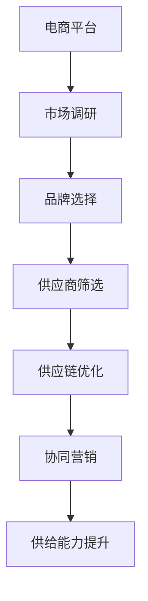

                 

# 文章标题
《电商平台供给能力提升：与新品牌和供应商的合作》

## 关键词
电商平台，供给能力，新品牌，供应商，合作，市场调研，品牌选择，供应链优化，协同营销。

## 摘要
本文深入探讨了电商平台在提升供给能力方面，如何通过引入新品牌和供应商实现合作。文章首先明确了供给能力的定义和重要性，随后分析了新品牌和供应商合作的优势与挑战。接着，详细阐述了市场调研、品牌选择、供应商筛选与管理、产品供应链优化、品牌与供应商协同营销等提升供给能力的方法，并通过实际案例展示了这些策略的应用。最后，总结了提升供给能力的关键因素和未来趋势，为电商平台的发展提供了有益的参考。

---

## 《电商平台供给能力提升：与新品牌和供应商的合作》目录大纲

### 第一部分：引言
- **第1章：电商平台供给能力概述**
  - **1.1 电商平台供给能力的定义与重要性**
  - **1.2 供给能力提升的意义**

- **第2章：新品牌和供应商合作的重要性**
  - **2.1 新品牌引入的优势**
  - **2.2 与供应商合作的挑战与机遇**

### 第二部分：提升供给能力的方法
- **第3章：市场调研与品牌选择**
  - **3.1 市场调研的步骤与方法**
  - **3.2 品牌选择标准与策略**

- **第4章：供应商筛选与管理**
  - **4.1 供应商筛选标准**
  - **4.2 供应商管理策略**

- **第5章：产品供应链优化**
  - **5.1 产品供应链的基本流程**
  - **5.2 供应链优化策略**

- **第6章：品牌与供应商的协同营销**
  - **6.1 协同营销的原理与实践**
  - **6.2 成功案例分享**

- **第7章：提升供给能力的实际操作**
  - **7.1 实际操作流程**
  - **7.2 案例研究**

### 第三部分：总结与展望
- **第8章：供给能力提升的总结与展望**
  - **8.1 总结与反思**
  - **8.2 展望未来**

### 附录
- **A.1 相关工具与资源**
- **A.2 案例分析**

## 核心概念与联系
### 电商平台供给能力
- **流程图**：


### 供应商管理策略
- **伪代码**：
```python
def filter_suppliers(candidates):
    qualified_suppliers = []
    for supplier in candidates:
        if evaluate_supplier(supplier):
            qualified_suppliers.append(supplier)
    return qualified_suppliers

def evaluate_supplier(supplier):
    score = 0
    if supplier.has_relevant_experience():
        score += 1
    if supplier.meets_quality_standards():
        score += 1
    return score >= 2
```

## 数学模型和数学公式
### 供应链成本控制
- **公式**：
```latex
C = \sum_{i=1}^{n} (C_{i1} + C_{i2} + C_{i3})
```
- **解释**：
  - \( C \) 为总成本
  - \( C_{i1} \) 为采购成本
  - \( C_{i2} \) 为库存成本
  - \( C_{i3} \) 为物流成本

## 项目实战
### 电商平台供应商筛选系统开发
- **开发环境搭建**：
  - 使用 Python 编写供应商筛选脚本
  - 使用 MySQL 数据库存储供应商数据
  - 使用 Flask 搭建 Web 应用程序

- **源代码详细实现和代码解读**：
  - **源代码实现**：
    ```python
    import mysql.connector

    def filter_suppliers():
        connection = mysql.connector.connect(
            host="localhost",
            user="yourusername",
            password="yourpassword",
            database="yourdatabase"
        )

        cursor = connection.cursor()

        cursor.execute("SELECT * FROM suppliers")
        suppliers = cursor.fetchall()

        qualified_suppliers = []
        for supplier in suppliers:
            if evaluate_supplier(supplier):
                qualified_suppliers.append(supplier)

        return qualified_suppliers

    def evaluate_supplier(supplier):
        score = 0
        if supplier[1] == "Yes":
            score += 1
        if supplier[2] == "Yes":
            score += 1
        return score >= 2

    # 执行筛选流程
    qualified_suppliers = filter_suppliers()
    for supplier in qualified_suppliers:
        print(supplier)
    ```
  - **代码解读与分析**：
    - 该脚本使用 MySQL 连接数据库，查询供应商表中的数据
    - 对每个供应商进行评估，根据评估结果筛选出合格的供应商
    - 最终输出合格的供应商列表

## 附录
### 相关工具与资源
- **市场调研工具**：
  - SurveysMonkey
  - Google Analytics

- **供应商管理工具**：
  - SAP Ariba
  - Coupa

- **供应链优化工具**：
  - JDA Software
  - Blue Yonder

---

接下来，我们将逐步深入每个章节的内容，通过详细的分析和案例研究，探讨如何提升电商平台的供给能力。让我们一步一步进行思考，以逻辑清晰、结构紧凑、简单易懂的文笔来撰写这篇文章。让我们开始吧！

