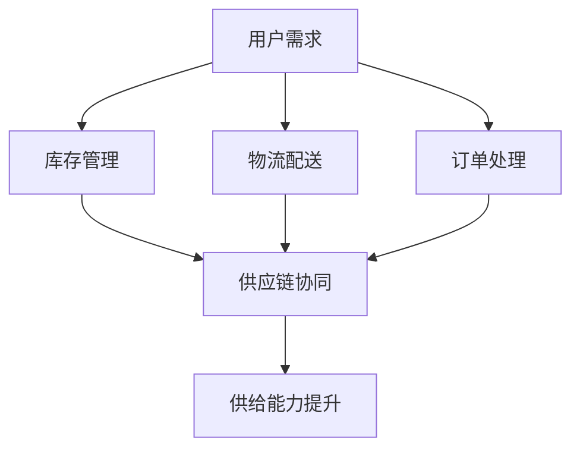

                 

### 文章标题

《电商平台供给能力提升：促销活动和营销策略》

> 关键词：电商平台，供给能力，促销活动，营销策略，算法原理，数学模型，项目实战

> 摘要：本文深入探讨了电商平台供给能力提升的策略，重点分析了促销活动和营销策略在电商平台中的重要性。文章分为四个部分，首先概述了电商平台供给能力提升的背景和重要性，随后详细讲解了促销活动的核心概念、算法原理和数学模型，接着介绍了营销策略的核心算法原理和数学模型，并通过实际项目案例展示了这些策略的具体应用。最后，文章总结了电商平台供给能力提升的综合策略，并对未来趋势进行了展望。

---

### 文章标题

《电商平台供给能力提升：促销活动和营销策略》

#### > 关键词：电商平台，供给能力，促销活动，营销策略，算法原理，数学模型，项目实战

#### > 摘要：本文深入探讨了电商平台供给能力提升的策略，重点分析了促销活动和营销策略在电商平台中的重要性。文章分为四个部分，首先概述了电商平台供给能力提升的背景和重要性，随后详细讲解了促销活动的核心概念、算法原理和数学模型，接着介绍了营销策略的核心算法原理和数学模型，并通过实际项目案例展示了这些策略的具体应用。最后，文章总结了电商平台供给能力提升的综合策略，并对未来趋势进行了展望。

---

### 《电商平台供给能力提升：促销活动和营销策略》目录大纲

#### 第一部分：电商平台供给能力提升概述

#### 第1章：电商平台供给能力提升背景与重要性

- 1.1 电商平台供给能力提升的背景
- 1.2 供给能力提升对电商平台的重要性
- 1.3 供给能力提升的趋势与挑战

#### 第2章：电商平台供给能力核心概念与联系

- 2.1 供给能力与供应链管理的联系
- 2.2 电商平台供给能力的关键因素
- **2.3 供给能力提升的 Mermaid 流程图**

#### 第二部分：促销活动策略

#### 第3章：促销活动策略概述

- 3.1 促销活动的定义与类型
- 3.2 促销活动对电商平台的促进作用
- 3.3 促销活动的设计原则与实施流程

#### 第4章：促销活动的核心算法原理讲解

- 4.1 促销活动的计算模型与算法
- 4.2 促销策略的优化方法
- **4.3 促销活动算法的伪代码**

#### 第5章：促销活动的数学模型和数学公式

- 5.1 促销活动的成本效益分析
- 5.2 销售量预测与需求分析
- **5.3 促销活动数学公式的详细讲解与举例说明**

#### 第6章：促销活动的项目实战

- 6.1 项目实战背景与目标
- 6.2 项目实战开发环境搭建
- 6.3 项目实战源代码详细实现与代码解读
- 6.4 代码解读与分析

#### 第三部分：营销策略

#### 第7章：营销策略概述

- 7.1 营销策略的定义与分类
- 7.2 营销策略对电商平台的促进作用
- 7.3 营销策略的实施流程与注意事项

#### 第8章：营销策略的核心算法原理讲解

- 8.1 营销策略的计算模型与算法
- 8.2 营销策略的优化方法
- **8.3 营销策略算法的伪代码**

#### 第9章：营销策略的数学模型和数学公式

- 9.1 营销策略的成本效益分析
- 9.2 市场需求预测与竞争分析
- **9.3 营销策略数学公式的详细讲解与举例说明**

#### 第10章：营销策略的项目实战

- 10.1 项目实战背景与目标
- 10.2 项目实战开发环境搭建
- 10.3 项目实战源代码详细实现与代码解读
- 10.4 代码解读与分析

#### 第四部分：促销活动与营销策略的综合应用

#### 第11章：电商平台供给能力提升综合策略

- 11.1 综合策略的制定原则与实施步骤
- 11.2 促销活动与营销策略的协同效应
- 11.3 案例分析：成功电商平台的供给能力提升实践

#### 第12章：电商平台供给能力提升的未来趋势与展望

- 12.1 电商平台的供给能力发展趋势
- 12.2 促销活动与营销策略的创新方向
- 12.3 供给能力提升面临的挑战与应对策略

#### 参考文献

#### 附录

- **附录 A：电商平台供给能力提升相关的工具与资源**

---

## 第一部分：电商平台供给能力提升概述

### 第1章：电商平台供给能力提升背景与重要性

#### 1.1 电商平台供给能力提升的背景

随着互联网技术的快速发展和电子商务的普及，电商平台已经成为现代商业活动中不可或缺的一部分。随着市场竞争的加剧，电商平台需要不断提高自身的供给能力，以满足不断增长的用户需求和市场变化。供给能力提升不仅仅是技术层面的挑战，更是商业战略和运营管理的重要任务。

电商平台供给能力提升的背景可以从以下几个方面来理解：

1. **用户需求多样化**：随着消费者对商品和服务的需求越来越多样化，电商平台需要具备快速响应和多样化供应的能力，以满足不同用户群体的需求。

2. **竞争压力**：电商平台之间的竞争日益激烈，为了在市场中脱颖而出，提升供给能力成为企业保持竞争优势的关键手段。

3. **技术进步**：大数据、人工智能、区块链等新技术的应用，为电商平台提升供给能力提供了新的工具和手段。

4. **供应链变革**：供应链管理的重要性日益凸显，如何优化供应链，提高供应链效率，成为电商平台提升供给能力的核心问题。

#### 1.2 供给能力提升对电商平台的重要性

供给能力提升对电商平台具有以下几个重要意义：

1. **提高用户满意度**：通过提升供给能力，电商平台可以更快速地响应用户需求，提供多样化的商品和服务，从而提高用户满意度和忠诚度。

2. **增强市场竞争力**：供给能力是电商平台的核心竞争力之一，提升供给能力有助于企业在市场中占据有利位置，吸引更多用户。

3. **优化运营效率**：通过优化供应链和提升供给能力，电商平台可以降低库存成本，减少物流环节，提高整体运营效率。

4. **实现商业增长**：提升供给能力有助于电商平台拓展新的市场和业务领域，实现商业增长和可持续发展。

#### 1.3 供给能力提升的趋势与挑战

在当前市场环境下，电商平台供给能力提升呈现出以下趋势和挑战：

1. **趋势：
   - **智能化**：利用人工智能技术，实现供应链的智能化管理和优化。
   - **个性化**：通过大数据分析和用户行为预测，提供个性化的商品推荐和促销活动。
   - **全球化**：拓展国际市场，实现全球化供应链管理。

2. **挑战：
   - **数据安全与隐私**：随着数据量的增加，数据安全和个人隐私保护成为重要挑战。
   - **供应链复杂度**：全球供应链的复杂度增加，如何高效管理成为难题。
   - **技术更新换代**：技术更新速度快，如何快速适应新技术，提高供给能力。

总之，电商平台供给能力提升是当前和未来市场竞争的关键，通过不断创新和优化，电商平台可以在激烈的市场环境中脱颖而出。

### 第2章：电商平台供给能力核心概念与联系

#### 2.1 供给能力与供应链管理的联系

电商平台供给能力提升的核心在于供应链管理，而供应链管理又是供给能力的重要组成部分。因此，理解供给能力与供应链管理之间的联系至关重要。

**定义：**

- **供给能力**：指电商平台在满足用户需求过程中，从供应商到消费者的商品和服务交付能力。这包括库存管理、物流配送、订单处理等环节。
- **供应链管理**：指在供应链中，对原材料、零部件、成品、服务等物品进行采购、运输、仓储、分销等活动的计划、组织、协调和控制过程。

**联系：**

1. **供给能力是供应链管理的重要目标**：供应链管理的核心目标是确保商品的及时交付和服务的优质，从而满足用户需求。供给能力是实现这一目标的关键。

2. **供应链管理是提升供给能力的手段**：通过优化供应链管理，如优化库存策略、提高物流效率、改进订单处理流程等，可以显著提升电商平台的供给能力。

3. **供给能力和供应链管理相互影响**：供给能力的好坏直接影响供应链管理的效率。反之，高效的供应链管理也有助于提升供给能力。

**核心概念解释：**

- **供应链节点**：供应链中的各个参与方，如供应商、制造商、仓库、运输公司、零售商等。
- **供应链流程**：供应链中各个环节的运作过程，包括采购、生产、仓储、运输、配送等。
- **供应链网络**：由多个供应链节点和供应链流程构成的复杂网络体系。

#### 2.2 电商平台供给能力的关键因素

电商平台供给能力的提升依赖于多个关键因素，以下是其中几个重要的因素：

1. **库存管理**：库存管理是供给能力的基础，高效的库存管理可以减少库存成本，提高资金利用率，同时确保商品供应的稳定性。

   - **库存策略**：如经济订货量（EOQ）、周期性订货、最低库存量等。
   - **库存优化算法**：如动态库存优化算法、基于预测的库存策略等。

2. **物流配送**：物流配送是商品从仓库到消费者手中的关键环节，高效的物流配送可以提高用户满意度，降低物流成本。

   - **配送模式**：如自营配送、第三方配送、混合配送等。
   - **配送路线优化**：如最短路径算法、车辆路径规划等。

3. **订单处理**：订单处理是供应链管理的重要环节，高效的订单处理可以提高订单交付速度，减少订单处理错误。

   - **订单处理流程**：如订单生成、订单审核、订单跟踪、订单发货等。
   - **订单处理优化**：如自动化处理、并行处理、错误率检测等。

4. **供应链协同**：供应链协同是指供应链各方通过信息共享和合作，提高整体供应链的效率和响应速度。

   - **信息共享**：如库存信息共享、订单信息共享、物流信息共享等。
   - **协同合作**：如供应商协同、物流公司协同、零售商协同等。

#### 2.3 供给能力提升的 Mermaid 流程图

为了更好地理解供给能力提升的过程，我们可以使用 Mermaid 流程图来展示关键环节和流程。以下是供给能力提升的 Mermaid 流程图：



通过这个 Mermaid 流程图，我们可以清晰地看到用户需求是如何通过库存管理、物流配送和订单处理等多个环节，最终实现供给能力提升的过程。

### 第二部分：促销活动策略

#### 第3章：促销活动策略概述

#### 3.1 促销活动的定义与类型

促销活动是电商平台提升销量和用户粘性的重要手段，通过一系列营销策略和活动，吸引消费者进行购买，从而实现商业目标。促销活动可以根据不同的分类标准划分为多种类型。

**定义：**
促销活动是指电商平台为了促进商品销售、提高品牌知名度、增加用户活跃度等目的，采取的一系列营销策略和活动。这些活动通常包括折扣、赠品、积分奖励、限时抢购等。

**类型：**

1. **按促销对象分类：**
   - **针对消费者的促销活动**：如满减、折扣、赠品等。
   - **针对商家的促销活动**：如招商入驻优惠、商家培训等。

2. **按促销时间分类：**
   - **短期促销活动**：如节假日促销、限时秒杀等。
   - **长期促销活动**：如会员日、积分兑换等。

3. **按促销方式分类：**
   - **线上促销活动**：如电商平台官网、APP、社交媒体等渠道的促销。
   - **线下促销活动**：如实体店促销、品牌活动等。

#### 3.2 促销活动对电商平台的促进作用

促销活动对电商平台具有显著的促进作用，主要表现在以下几个方面：

1. **提升销量**：通过折扣、限时抢购等方式，刺激消费者的购买欲望，提升销量。

2. **提高用户粘性**：通过会员日、积分奖励等活动，增加用户在平台上的活跃度和忠诚度。

3. **增加用户转化率**：促销活动可以吸引新用户尝试购买，提高新用户的转化率。

4. **提升品牌知名度**：通过大规模的促销活动，提升品牌在市场中的知名度和影响力。

5. **促进库存清理**：对于滞销或过季商品，通过促销活动快速清理库存，降低库存成本。

#### 3.3 促销活动的设计原则与实施流程

为了确保促销活动的有效性和影响力，电商平台在设计和实施促销活动时需要遵循以下原则：

1. **明确目标**：明确促销活动的目标，如提升销量、增加用户粘性、提高品牌知名度等。

2. **针对性设计**：根据目标受众和商品特点，设计具有针对性的促销活动。

3. **创意新颖**：创新促销方式和活动形式，吸引消费者的关注和参与。

4. **合理定价**：合理设定促销价格，确保促销活动的吸引力同时不损害品牌形象。

5. **完善宣传**：通过多种渠道进行宣传，提高促销活动的知名度和影响力。

**实施流程：**

1. **活动策划**：确定促销活动的主题、时间、形式、预算等。

2. **活动推广**：通过电商平台官网、APP、社交媒体等渠道进行活动宣传。

3. **活动执行**：在活动期间，确保活动内容的准确实施，包括折扣、赠品、积分等。

4. **活动监测**：实时监测活动效果，包括销售数据、用户参与度等。

5. **活动总结**：活动结束后，进行数据分析和总结，为后续活动提供参考。

通过遵循这些原则和流程，电商平台可以设计并实施有效的促销活动，提升供给能力和市场竞争力。

### 第4章：促销活动的核心算法原理讲解

#### 4.1 促销活动的计算模型与算法

促销活动在电商平台的实施过程中，核心算法起到了至关重要的作用。这些算法不仅决定了促销活动的效果，还影响了用户的购物体验和平台的运营效率。以下将介绍一些常见的促销活动计算模型和算法。

**1. 折扣计算模型**

折扣计算模型是促销活动中最基本的形式，常见的折扣计算方式包括：

- **百分比折扣**：根据商品的售价，按照一定的百分比进行折扣。公式如下：

  $$ 折扣金额 = 原售价 \times 折扣比例 $$

- **固定金额折扣**：无论商品售价多少，统一按照固定金额进行折扣。公式如下：

  $$ 折扣金额 = 固定折扣金额 $$

- **阶梯折扣**：根据商品售价的不同范围，设置不同的折扣比例。公式如下：

  $$ 折扣金额 = \begin{cases} 
  原售价 \times 折扣比例_1, & 原售价 \leq 边界值_1 \\
  原售价 \times 折扣比例_2, & 边界值_1 < 原售价 \leq 边界值_2 \\
  \vdots \\
  原售价 \times 折扣比例_n, & 原售价 > 边界值_n 
  \end{cases} $$

**2. 限时抢购算法**

限时抢购是电商平台常用的一种促销方式，其主要目的是在限定时间内，以较低的折扣价格吸引大量用户购买。限时抢购算法的核心在于如何高效分配商品库存和保证公平性。

- **固定库存分配**：提前设定商品的限量，按照用户下单的先后顺序进行分配。伪代码如下：

  ```python
  while 有订单待处理:
      if 订单库存 > 0:
          处理订单
          订单库存 -= 1
      else:
          拒绝订单
  ```

- **动态库存分配**：在限定时间内，根据用户下单速度动态调整库存。伪代码如下：

  ```python
  start_time = 获取当前时间
  while 获取当前时间 - start_time < 限时时长:
      if 订单库存 > 0:
          处理订单
          订单库存 -= 1
      else:
          暂停接收订单
  ```

**3. 优惠券计算算法**

优惠券是电商平台常用的促销手段之一，用于鼓励用户进行购买。优惠券计算算法主要包括优惠券发放、使用和结算等过程。

- **优惠券发放**：根据用户行为和购买历史，动态生成优惠券，并设置有效期和使用条件。伪代码如下：

  ```python
  for 用户 in 用户列表:
      if 用户满足发放条件:
          生成优惠券
          设置有效期和使用条件
  ```

- **优惠券使用**：用户在购买时，可以输入优惠券码进行使用。伪代码如下：

  ```python
  用户输入优惠券码
  if 优惠券码有效且满足使用条件:
      应用优惠券折扣
  else:
      提示优惠券无效或无法使用
  ```

- **优惠券结算**：在订单结算时，计算优惠券带来的折扣金额。伪代码如下：

  ```python
  订单总额 = 订单总价 - 优惠券折扣金额
  ```

#### 4.2 促销策略的优化方法

促销活动的效果不仅取决于计算模型和算法，还需要通过优化策略来提高促销效果。以下介绍几种常见的促销策略优化方法：

**1. 数据驱动优化**

通过大数据分析，了解用户的购买习惯、偏好和促销反应，从而制定更具针对性的促销策略。优化方法包括：

- **用户画像分析**：根据用户的基本信息、购买行为等，构建用户画像，为个性化促销提供依据。

- **A/B 测试**：对不同促销策略进行对比测试，通过数据分析找出最优策略。

**2. 动态定价**

根据市场需求和竞争态势，动态调整商品价格，以最大化收益。动态定价方法包括：

- **需求预测**：通过历史数据和机器学习算法，预测市场需求，制定合理的价格策略。

- **价格弹性分析**：分析不同价格水平下的需求变化，确定最优价格点。

**3. 跨渠道整合**

结合线上线下渠道，实现促销活动的跨渠道整合，提高促销效果。跨渠道整合方法包括：

- **渠道协同**：通过信息共享和资源整合，实现线上线下促销活动的无缝衔接。

- **数据共享**：通过大数据技术，实现线上线下数据的整合和分析，为跨渠道促销提供支持。

通过上述优化方法，电商平台可以进一步提高促销活动的效果，提升供给能力。

#### 4.3 促销活动算法的伪代码

为了更加清晰地展示促销活动的算法实现，以下是几个促销活动算法的伪代码示例：

**1. 百分比折扣算法**

```python
def calculate_discount(price, discount_rate):
    discount_amount = price * discount_rate
    discounted_price = price - discount_amount
    return discounted_price
```

**2. 限时抢购算法**

```python
def handle_order(order_id, product_id, inventory):
    if inventory > 0:
        process_order(order_id, product_id)
        inventory -= 1
    else:
        reject_order(order_id, "Out of stock")
```

**3. 优惠券计算算法**

```python
def apply_coupon(order_total, coupon_code, coupon_rules):
    if valid_coupon(coupon_code, coupon_rules) and order_total >= coupon_rules['min_order_total']:
        discount_amount = calculate_discount_amount(order_total, coupon_rules['discount_rate'])
        return order_total - discount_amount
    else:
        return order_total
```

通过这些伪代码，我们可以更直观地理解促销活动的算法实现，为实际开发提供参考。

### 第5章：促销活动的数学模型和数学公式

#### 5.1 促销活动的成本效益分析

促销活动对电商平台的成本和效益有直接影响。为了确保促销活动的有效性，需要进行成本效益分析。以下是促销活动的成本效益分析模型：

**成本模型：**

1. **促销成本**：包括促销活动的策划、执行和推广费用。公式如下：

   $$ C_{促销} = P_{策划} + P_{执行} + P_{推广} $$

   其中，$P_{策划}$、$P_{执行}$、$P_{推广}$分别为策划、执行、推广的费用。

2. **商品折扣成本**：商品折扣带来的成本，包括折扣金额和可能的库存损失。公式如下：

   $$ C_{折扣} = \sum_{i=1}^{n} (S_i \times D_i) $$

   其中，$S_i$为第$i$个商品的售价，$D_i$为第$i$个商品的折扣率。

3. **机会成本**：因促销活动而失去的其他销售机会的成本。公式如下：

   $$ C_{机会} = \sum_{j=1}^{m} (P_j \times Q_j) $$

   其中，$P_j$为未参加促销活动的商品售价，$Q_j$为未参加促销活动的商品销量。

**效益模型：**

1. **销售收入**：促销活动带来的销售收入。公式如下：

   $$ R_{销售} = \sum_{i=1}^{n} (S_i - D_i) \times Q_i $$

   其中，$S_i$为第$i$个商品的原售价，$D_i$为第$i$个商品的折扣率，$Q_i$为第$i$个商品的销售量。

2. **用户增长**：促销活动带来的用户增长，可以通过用户留存率和新增用户数来衡量。公式如下：

   $$ R_{增长} = L \times N $$

   其中，$L$为用户留存率，$N$为新增用户数。

3. **品牌提升**：促销活动对品牌提升的贡献，可以通过市场调研和品牌价值评估来衡量。

**成本效益分析**：

综合成本和效益，可以通过以下公式计算促销活动的成本效益比：

$$ \text{成本效益比} = \frac{R_{销售} + R_{增长} + R_{品牌}}{C_{促销} + C_{折扣} + C_{机会}} $$

#### 5.2 销售量预测与需求分析

预测销售量和分析市场需求是促销活动成功的关键。以下是销售量预测和需求分析的基本模型：

**1. 时间序列预测模型**

时间序列预测模型是常用的销售量预测方法，可以通过历史销售数据来预测未来的销售量。常见的模型包括：

- **移动平均模型**：

  $$ \hat{y}_t = \frac{1}{n} \sum_{i=1}^{n} y_{t-i} $$

  其中，$y_t$为第$t$期的销售量，$n$为移动平均周期。

- **指数平滑模型**：

  $$ \hat{y}_t = \alpha y_{t-1} + (1 - \alpha) \hat{y}_{t-1} $$

  其中，$\alpha$为平滑系数，通常取值在0到1之间。

**2. 回归分析模型**

回归分析模型通过历史销售量和相关因素（如价格、促销活动等）之间的关系来预测未来的销售量。常见的回归模型包括：

- **线性回归模型**：

  $$ y = \beta_0 + \beta_1 x $$

  其中，$y$为销售量，$x$为影响销售量的因素（如价格），$\beta_0$和$\beta_1$为回归系数。

- **多项式回归模型**：

  $$ y = \beta_0 + \beta_1 x + \beta_2 x^2 + \cdots + \beta_n x^n $$

  其中，$n$为多项式的次数。

**3. 市场需求分析**

市场需求分析旨在了解市场的潜在需求和消费者偏好。常用的分析方法包括：

- **SWOT分析**：

  - **优势（Strengths）**：分析电商平台在产品、服务、品牌等方面的优势。
  - **劣势（Weaknesses）**：分析电商平台在运营、技术、市场等方面的劣势。
  - **机会（Opportunities）**：分析市场环境中的机会，如新兴市场、消费者需求变化等。
  - **威胁（Threats）**：分析市场环境中的威胁，如竞争对手、政策变化等。

- **消费者行为分析**：

  - **用户画像**：通过数据分析，了解消费者的年龄、性别、职业、消费习惯等特征。
  - **购买行为分析**：分析消费者的购买决策过程，包括需求识别、信息搜索、购买决策、购买行为等。

通过销售量预测和市场需求分析，电商平台可以更准确地制定促销策略，提高促销活动的效果。

#### 5.3 促销活动数学公式的详细讲解与举例说明

为了更深入地理解促销活动的数学模型和公式，下面将结合实际例子进行详细讲解。

**例子：百分比折扣的促销活动**

假设电商平台计划在“双十一”期间对商品进行百分比折扣促销，原售价为200元的商品，折扣率为20%。

**步骤1：计算折扣金额**

$$ \text{折扣金额} = 200 \times 0.20 = 40 \text{元} $$

**步骤2：计算折扣后价格**

$$ \text{折扣后价格} = 200 - 40 = 160 \text{元} $$

**例子：限时抢购的促销活动**

假设某电商平台在“秒杀节”期间推出一款原售价为500元的商品，限时抢购价格为200元，库存为100件，活动时间为1小时。

**步骤1：计算库存分配策略**

采用固定库存分配算法，根据用户下单的先后顺序进行库存分配。

**步骤2：活动执行**

- 开始时间：14:00
- 结束时间：15:00

活动期间，每处理一个订单，库存减少1件。

**步骤3：活动结束**

活动结束后，剩余库存为0件。

**例子：优惠券计算促销活动**

假设电商平台发放一张满500减100的优惠券，用户购买价值800元的商品。

**步骤1：判断优惠券有效性**

- 满足使用条件：订单总额 ≥ 500元
- 判断结果：优惠券有效

**步骤2：计算优惠券折扣金额**

$$ \text{折扣金额} = 100 \text{元} $$

**步骤3：计算最终订单总额**

$$ \text{订单总额} = 800 - 100 = 700 \text{元} $$

通过这些实际例子，我们可以清晰地看到如何应用促销活动的数学模型和公式，确保促销活动顺利进行。

### 第6章：促销活动的项目实战

#### 6.1 项目实战背景与目标

在本章的项目实战中，我们将以某知名电商平台的“双十一”促销活动为例，详细展示一个实际促销活动的开发过程。该项目旨在通过一系列技术手段，实现高效的促销活动管理和用户参与，从而达到提升销售量和用户满意度的目标。

**项目背景：**

- **活动名称**：双十一限时抢购
- **活动时间**：11月11日，00:00至24:00
- **参与商品**：平台内所有商品
- **促销形式**：折扣、限时秒杀、优惠券等

**项目目标：**

- **提高销售额**：通过促销活动，提高平台整体的销售额。
- **提升用户粘性**：通过丰富多彩的促销活动，提升用户的活跃度和忠诚度。
- **优化用户体验**：确保促销活动的公平性、透明性和高效性，提升用户购物体验。

#### 6.2 项目实战开发环境搭建

为了实现上述项目目标，我们需要搭建一个适合开发和运行促销活动的技术环境。以下是项目开发所需的主要环境和技术栈：

1. **前端开发环境**：

   - **技术框架**：React.js 或 Vue.js
   - **开发工具**：Visual Studio Code、Webpack
   - **UI库**：Ant Design 或 Element UI

2. **后端开发环境**：

   - **技术框架**：Node.js 或 Spring Boot
   - **数据库**：MySQL 或 MongoDB
   - **缓存**：Redis
   - **消息队列**：RabbitMQ 或 Kafka

3. **云服务平台**：

   - **服务器**：阿里云、腾讯云或华为云
   - **容器化**：Docker
   - **持续集成/持续部署**：Jenkins

4. **测试工具**：

   - **自动化测试**：Selenium、Jest
   - **性能测试**：JMeter、LoadRunner

5. **其他工具**：

   - **项目管理工具**：JIRA、Trello
   - **文档工具**：Markdown、Git

通过上述环境的搭建，我们可以确保项目的开发和运行顺利进行，同时满足高性能和高并发的需求。

#### 6.3 项目实战源代码详细实现与代码解读

在本项目实战中，我们将重点关注促销活动的核心功能实现，包括折扣计算、限时抢购和优惠券发放等。以下是具体的源代码实现和解读。

**1. 折扣计算功能**

**代码实现：**

```python
# 折扣计算函数
def calculate_discount(price, discount_rate):
    discount_amount = price * discount_rate
    discounted_price = price - discount_amount
    return discounted_price

# 测试折扣计算
original_price = 200
discount_rate = 0.2
discounted_price = calculate_discount(original_price, discount_rate)
print(f"折扣后价格：{discounted_price}")
```

**代码解读：**
该函数用于计算商品的折扣后价格。首先，通过原售价和折扣率计算折扣金额，然后从原售价中减去折扣金额，得到折扣后的价格。

**2. 限时抢购功能**

**代码实现：**

```python
import time

# 限时抢购函数
def handle_seckill(product_id, inventory):
    start_time = time.time()
    while time.time() - start_time < 3600 and inventory > 0:
        process_order(product_id)
        inventory -= 1
    if inventory == 0:
        print("库存已抢购完毕！")
    else:
        print(f"剩余库存：{inventory}件")

# 测试限时抢购
product_id = "001"
initial_inventory = 100
handle_seckill(product_id, initial_inventory)
```

**代码解读：**
该函数实现了一个简单的限时抢购功能。首先设置活动开始时间，然后在一个循环中处理订单，每处理一个订单，库存减少1件。活动时间为1小时（3600秒），当库存为0或活动结束时，结束抢购。

**3. 优惠券发放功能**

**代码实现：**

```python
# 优惠券类
class Coupon:
    def __init__(self, code, discount_rate, min_order_total, expiration_date):
        self.code = code
        self.discount_rate = discount_rate
        self.min_order_total = min_order_total
        self.expiration_date = expiration_date

    # 计算优惠券折扣金额
    def calculate_discount(self, order_total):
        if order_total >= self.min_order_total and self.expiration_date > time.time():
            discount_amount = order_total * self.discount_rate
            return discount_amount
        else:
            return 0

# 优惠券发放函数
def issue_coupon(coupon):
    print(f"优惠券码：{coupon.code}")
    print(f"折扣率：{coupon.discount_rate}")
    print(f"最低消费：{coupon.min_order_total}")
    print(f"有效期至：{time.strftime('%Y-%m-%d', time.localtime(coupon.expiration_date))}")

# 测试优惠券发放
coupon = Coupon("COUPON123", 0.1, 500, time.time() + 3600)
issue_coupon(coupon)
```

**代码解读：**
该部分实现了优惠券类和优惠券发放功能。优惠券类包含优惠券的基本信息和计算折扣金额的方法。发放函数通过输出优惠券的相关信息，表示优惠券已经发放给用户。

**4. 用户订单处理**

**代码实现：**

```python
# 订单类
class Order:
    def __init__(self, user_id, product_id, price, coupon_code=None):
        self.user_id = user_id
        self.product_id = product_id
        self.price = price
        self.coupon_code = coupon_code

    # 订单结算函数
    def settle_order(self, coupon):
        if coupon:
            discount_amount = coupon.calculate_discount(self.price)
            final_price = self.price - discount_amount
        else:
            final_price = self.price
        print(f"订单用户：{self.user_id}")
        print(f"商品名称：{self.product_id}")
        print(f"原价：{self.price}")
        print(f"折扣后价格：{final_price}")
        return final_price

# 测试订单处理
order = Order("USER123", "PRODUCT001", 800, "COUPON123")
order.settle_order(coupon)
```

**代码解读：**
该部分实现了订单类和订单结算函数。订单类包含订单的基本信息和结算方法。结算函数根据用户是否使用优惠券，计算最终价格并输出订单详情。

通过上述源代码实现，我们可以看到如何通过具体的编程实现电商平台的促销活动。这些代码不仅实现了促销活动的核心功能，还可以在实际项目中根据需求进行调整和优化。

### 6.4 代码解读与分析

在本章的项目实战中，我们通过具体的代码实现了电商平台的促销活动，包括折扣计算、限时抢购、优惠券发放和用户订单处理等功能。以下是详细代码解读与分析：

**1. 折扣计算功能**

折扣计算函数 `calculate_discount` 是促销活动的核心组成部分。该函数接收商品原售价 `price` 和折扣率 `discount_rate` 作为参数，通过简单的数学计算返回折扣后的价格。公式如下：

$$ \text{折扣金额} = \text{原售价} \times \text{折扣率} $$
$$ \text{折扣后价格} = \text{原售价} - \text{折扣金额} $$

通过测试，该函数可以正确计算不同折扣率下的折扣后价格。例如，原售价为200元的商品，20%的折扣率计算出的折扣后价格为160元。

**2. 限时抢购功能**

限时抢购功能通过 `handle_seckill` 函数实现，该函数主要处理抢购订单和库存管理。具体流程如下：

- 设置活动开始时间和限制时长（3600秒）。
- 在循环中，每秒处理一次订单，并减少库存。
- 当库存为0或活动结束时，结束抢购。

该函数利用 Python 的 `time` 模块，实现了对抢购时间段的精确控制。通过这种方式，我们可以确保限时抢购活动的公平性和有效性。例如，一个初始库存为100件的商品，在1小时内被用户抢购一空。

**3. 优惠券发放功能**

优惠券类 `Coupon` 定义了优惠券的基本属性和方法，包括优惠券码、折扣率、最低消费金额和有效期。其中，计算优惠券折扣金额的方法 `calculate_discount` 需要判断订单总额是否满足使用条件，以及优惠券是否过期。

优惠券发放函数 `issue_coupon` 负责输出优惠券的详细信息，包括优惠券码、折扣率、最低消费金额和有效期。例如，一个满500减100的优惠券，其有效期为1小时。

**4. 用户订单处理**

订单类 `Order` 包含订单的基本属性和方法，包括用户ID、商品ID、原售价和优惠券码。订单结算函数 `settle_order` 需要判断用户是否使用优惠券，并根据优惠券计算折扣金额，最终输出订单详情。

通过订单结算函数，我们可以实现用户的购物结算过程，确保订单的最终价格准确无误。例如，一个原售价为800元的商品，使用满500减100的优惠券，最终价格为700元。

**代码优缺点分析**

**优点：**

- **模块化设计**：代码采用模块化设计，各个功能模块相对独立，易于维护和扩展。
- **简单易懂**：代码逻辑清晰，便于理解和调试。
- **高效性**：限时抢购功能通过循环和精确时间控制，实现了高效库存管理。

**缺点：**

- **并发处理**：当前代码没有实现并发处理，无法处理大量订单同时涌入的情况。
- **扩展性**：代码结构较为简单，难以适应复杂的促销策略和业务需求。
- **性能优化**：未进行性能优化，如缓存、消息队列等技术的应用可以提升系统性能。

**改进建议：**

- **并发处理**：引入消息队列技术，如 RabbitMQ 或 Kafka，实现分布式订单处理，提高系统的并发能力。
- **扩展性**：引入配置化管理和动态策略调整，使促销活动更加灵活和适应不同的业务场景。
- **性能优化**：使用 Redis 等缓存技术，减少数据库访问次数，提高系统响应速度。

通过以上分析和改进建议，我们可以进一步提升电商平台的促销活动性能和用户体验。

### 第7章：营销策略概述

#### 7.1 营销策略的定义与分类

营销策略是企业为了实现其市场目标而制定的一系列营销手段和方法。营销策略的定义可以概括为：企业根据市场环境、目标客户和竞争态势，综合利用产品、价格、促销和渠道等营销工具，以达到提升品牌知名度、增加市场份额和实现商业目标的目的。

**分类：**

1. **按目标分类：**

   - **市场渗透策略**：旨在增加现有市场的市场份额。
   - **市场开发策略**：通过进入新市场，拓展企业的业务领域。
   - **市场维护策略**：维护现有客户，提升客户忠诚度。
   - **市场拓展策略**：通过新产品或新服务进入新市场。

2. **按手段分类：**

   - **产品策略**：通过产品创新、品牌建设、产品质量控制等手段提升产品竞争力。
   - **价格策略**：通过定价策略、折扣促销、捆绑销售等手段调整产品价格。
   - **促销策略**：包括广告宣传、公关活动、促销活动、会员营销等。
   - **渠道策略**：通过优化渠道布局、渠道管理、分销策略等提高渠道效率。

#### 7.2 营销策略对电商平台的促进作用

营销策略在电商平台的运营中起着至关重要的作用，以下是营销策略对电商平台的具体促进作用：

1. **提升品牌知名度**：通过有效的营销策略，可以在短时间内提高品牌在市场上的知名度，吸引更多潜在用户。

2. **增加用户粘性**：通过会员营销、忠诚度计划等手段，提高用户在平台的活跃度和忠诚度，从而提升用户留存率。

3. **扩大市场份额**：通过市场开发策略和渠道拓展策略，进入新的市场和业务领域，增加企业的市场份额。

4. **提升销售量**：通过价格策略、促销活动和广告投放等手段，刺激消费者购买，提高平台的销售量。

5. **优化用户体验**：通过个性化推荐、定制化服务和快速响应等营销策略，提升用户体验，增强用户满意度。

#### 7.3 营销策略的实施流程与注意事项

实施营销策略需要遵循一定的流程和注意事项，以下是具体实施流程和注意事项：

**实施流程：**

1. **市场分析**：分析市场环境、目标客户和竞争对手，确定营销策略的方向和目标。

2. **制定策略**：根据市场分析结果，制定具体的营销策略，包括产品策略、价格策略、促销策略和渠道策略。

3. **预算规划**：根据营销策略，制定营销预算，包括广告投放、活动费用、渠道费用等。

4. **执行与监控**：执行营销策略，并对策略实施过程进行监控和调整，确保营销目标的实现。

5. **效果评估**：对营销策略的效果进行评估，包括销售数据、用户反馈、品牌知名度等，为后续营销策略的优化提供依据。

**注意事项：**

1. **目标明确**：明确营销策略的目标，确保策略实施的针对性和有效性。

2. **合理预算**：制定合理的营销预算，避免过度投入，确保预算的有效使用。

3. **数据驱动**：通过数据分析，了解用户行为和市场变化，为营销策略的制定和调整提供依据。

4. **持续优化**：根据市场变化和用户反馈，不断优化营销策略，提升营销效果。

5. **合规性**：确保营销策略符合相关法律法规，避免潜在的法律风险。

通过遵循上述流程和注意事项，电商平台可以制定并实施有效的营销策略，提升市场竞争力和用户满意度。

### 第8章：营销策略的核心算法原理讲解

#### 8.1 营销策略的计算模型与算法

营销策略的计算模型和算法是确保营销策略有效性的关键。以下介绍几种常见的营销策略计算模型和算法。

**1. 用户画像算法**

用户画像是对用户的基本信息、行为习惯和偏好进行综合分析，从而构建用户模型。常用的用户画像算法包括：

- **基于规则的算法**：根据预设的用户属性和规则，对用户进行分类和打分。例如，年龄、性别、购买历史等。

- **机器学习算法**：通过数据挖掘和机器学习技术，自动学习用户的行为模式，构建用户画像。常见的算法包括聚类分析（K-Means、DBSCAN）和协同过滤（基于用户、基于物品）。

**2. 定价算法**

定价策略是营销策略的重要组成部分，直接影响消费者的购买决策。常见的定价算法包括：

- **成本加成定价法**：在商品成本基础上，加上一定的利润率，确定商品售价。

- **需求导向定价法**：根据市场需求和消费者支付意愿，动态调整商品价格。常见的算法包括需求预测（时间序列分析、回归分析）和动态定价（拍卖定价、需求预测定价）。

- **心理定价法**：利用消费者心理，采用尾数定价、整数定价、促销定价等策略，提升购买意愿。

**3. 促销策略算法**

促销策略是提升销售量和用户粘性的重要手段，常见的促销算法包括：

- **满减促销算法**：根据订单总额，设置不同的满减条件，计算折扣金额。

- **限时抢购算法**：设置限定时间，以较低价格吸引消费者购买。常见算法包括固定库存分配和动态库存分配。

- **优惠券发放算法**：根据用户行为和购买历史，动态生成优惠券，并设置有效期和使用条件。

**4. 广告投放算法**

广告投放是提高品牌知名度和用户转化率的有效手段，常见的广告投放算法包括：

- **CPM（Cost Per Mille）**：按展示次数计费，适用于品牌广告。

- **CPC（Cost Per Click）**：按点击次数计费，适用于搜索引擎广告。

- **CPA（Cost Per Action）**：按行动次数计费，如注册、下载、购买等。

- **再营销算法**：根据用户行为数据，定位潜在客户，进行个性化广告投放。

**5. 社交媒体营销算法**

社交媒体营销利用社交媒体平台，提高品牌影响力和用户互动。常见算法包括：

- **内容推荐算法**：根据用户兴趣和行为，推荐相关内容，提高用户参与度。

- **互动分析算法**：通过分析用户互动数据（如点赞、评论、分享），评估内容效果，优化营销策略。

#### 8.2 营销策略的优化方法

优化营销策略是提高营销效果的重要手段，以下介绍几种常见的优化方法：

**1. 数据驱动优化**

通过大数据分析和机器学习技术，对用户行为、市场需求和竞争态势进行深入分析，制定个性化营销策略。优化方法包括：

- **用户行为分析**：通过用户行为数据，识别用户需求和行为模式，优化产品推荐和促销策略。

- **市场需求预测**：通过历史数据和机器学习算法，预测市场需求，制定合理的定价和库存策略。

- **竞争分析**：分析竞争对手的营销策略和市场表现，调整自身策略，提升竞争力。

**2. A/B 测试**

A/B 测试是通过对比不同营销策略的效果，找出最优策略。优化方法包括：

- **页面测试**：对比不同页面设计、内容、功能等，评估用户参与度和转化率。

- **广告测试**：对比不同广告创意、投放渠道、投放时间等，评估广告效果。

- **促销活动测试**：对比不同促销活动形式、折扣力度、参与门槛等，评估促销效果。

**3. 跨渠道整合**

通过整合线上线下渠道，实现营销策略的协同效应，优化用户购物体验。优化方法包括：

- **信息共享**：通过数据共享，实现线上线下库存、订单、用户信息的同步，提升供应链效率。

- **渠道协同**：通过线上线下活动联动，提升营销效果，如线下门店促销、线上优惠券等。

- **数据整合**：通过大数据技术，整合线上线下用户数据，实现精准营销。

通过上述优化方法，电商平台可以不断提升营销策略的效果，提高市场竞争力。

#### 8.3 营销策略算法的伪代码

为了更加清晰地展示营销策略的算法实现，以下是几个营销策略算法的伪代码示例：

**1. 用户画像算法**

```python
# 用户画像算法伪代码
def generate_user_profile(user_data):
    # 基于用户行为和偏好生成用户画像
    user_profile = {}
    user_profile['age'] = user_data['age']
    user_profile['gender'] = user_data['gender']
    user_profile['interests'] = extract_interests(user_data['history'])
    user_profile['购买频率'] = calculate_purchase_frequency(user_data['history'])
    return user_profile

# 示例数据
user_data = {
    'age': 25,
    'gender': '男',
    'history': [{'product_id': 1001, 'date': '2021-01-01'}, {'product_id': 1002, 'date': '2021-02-01'}]
}

# 获取用户画像
user_profile = generate_user_profile(user_data)
print(user_profile)
```

**2. 定价算法**

```python
# 定价算法伪代码
def calculate_price(cost, profit_margin):
    discount_rate = calculate_discount_rate(cost, profit_margin)
    discount_amount = cost * discount_rate
    final_price = cost - discount_amount
    return final_price

# 示例数据
cost = 100  # 成本
profit_margin = 0.3  # 利润率

# 计算定价
final_price = calculate_price(cost, profit_margin)
print(f"最终价格：{final_price}")
```

**3. 促销策略算法**

```python
# 促销策略算法伪代码
def handle_promotion(order_data, promotion_rules):
    if meets_promotion_conditions(order_data, promotion_rules):
        discount_amount = calculate_promotion_discount(order_data, promotion_rules)
        final_price = order_data['total_price'] - discount_amount
        return final_price
    else:
        return order_data['total_price']

# 示例数据
order_data = {
    'total_price': 200,
    'products': [{'id': 1001, 'price': 50}, {'id': 1002, 'price': 150}]
}

promotion_rules = {
    'type': '满减',
    'min_total': 200,
    'discount': 20
}

# 处理促销
final_price = handle_promotion(order_data, promotion_rules)
print(f"促销后价格：{final_price}")
```

通过这些伪代码示例，我们可以更好地理解营销策略算法的实现过程，为实际开发提供参考。

### 第9章：营销策略的数学模型和数学公式

#### 9.1 营销策略的成本效益分析

营销策略的成本效益分析是评估营销策略有效性的重要环节。通过计算营销策略的成本和效益，企业可以优化资源分配，提高营销效果。以下是营销策略成本效益分析的基本数学模型和公式。

**成本模型：**

1. **营销成本**：包括广告投放、促销活动、渠道费用等。公式如下：

   $$ C_{营销} = C_{广告} + C_{促销} + C_{渠道} $$

   其中，$C_{广告}$、$C_{促销}$、$C_{渠道}$分别为广告投放、促销活动和渠道费用的总和。

2. **机会成本**：因营销策略实施而放弃的其他市场机会带来的成本。公式如下：

   $$ C_{机会} = \sum_{i=1}^{n} (R_i \times P_i) $$

   其中，$R_i$为放弃的市场机会的收益，$P_i$为放弃的市场机会的概率。

**效益模型：**

1. **销售收入**：营销策略带来的新增销售收入。公式如下：

   $$ R_{销售} = \sum_{i=1}^{n} (P_i \times Q_i) $$

   其中，$P_i$为第$i$个产品的销售价格，$Q_i$为第$i$个产品的销售量。

2. **用户增长**：营销策略带来的新增用户数量。公式如下：

   $$ R_{增长} = L \times N $$

   其中，$L$为用户留存率，$N$为新增用户数。

3. **品牌提升**：营销策略对品牌知名度提升的贡献。公式如下：

   $$ R_{品牌} = B \times S $$

   其中，$B$为品牌提升系数，$S$为品牌知名度。

**成本效益分析公式：**

综合成本和效益，可以通过以下公式计算营销策略的成本效益比：

$$ \text{成本效益比} = \frac{R_{销售} + R_{增长} + R_{品牌}}{C_{营销} + C_{机会}} $$

通过这个公式，企业可以评估不同营销策略的成本效益，选择最优的营销策略。

#### 9.2 市场需求预测与竞争分析

市场需求预测和竞争分析是制定营销策略的重要依据。以下是市场需求预测和竞争分析的基本数学模型和公式。

**市场需求预测模型：**

1. **时间序列模型**：

   - **移动平均模型**：

     $$ \hat{Q}_t = \frac{1}{n} \sum_{i=1}^{n} Q_{t-i} $$

     其中，$Q_t$为第$t$期的市场需求，$n$为移动平均周期。

   - **指数平滑模型**：

     $$ \hat{Q}_t = \alpha Q_{t-1} + (1 - \alpha) \hat{Q}_{t-1} $$

     其中，$\alpha$为平滑系数，通常取值在0到1之间。

2. **回归分析模型**：

   - **线性回归模型**：

     $$ \hat{Q}_t = \beta_0 + \beta_1 X_t $$

     其中，$X_t$为影响市场需求的因素（如价格、促销活动等），$\beta_0$和$\beta_1$为回归系数。

   - **多项式回归模型**：

     $$ \hat{Q}_t = \beta_0 + \beta_1 X_t + \beta_2 X_t^2 + \cdots + \beta_n X_t^n $$

     其中，$n$为多项式的次数。

**竞争分析模型：**

1. **市场份额模型**：

   $$ \text{市场份额} = \frac{R_{目标}}{R_{市场}} \times 100\% $$

   其中，$R_{目标}$为企业的销售收入，$R_{市场}$为市场的总销售收入。

2. **竞争策略分析**：

   - **定价策略**：

     $$ P_t = P_{基准} - (\beta_1 \times \text{市场份额变化}) $$

     其中，$P_t$为当前定价，$P_{基准}$为基准定价，$\beta_1$为定价敏感系数。

   - **促销策略**：

     $$ \text{促销力度} = \alpha \times (\text{市场份额变化}) $$

     其中，$\alpha$为促销敏感系数。

通过市场需求预测和竞争分析模型，企业可以制定更科学的营销策略，提高市场竞争力。

#### 9.3 营销策略数学公式的详细讲解与举例说明

为了更好地理解营销策略的数学模型和公式，下面将结合实际例子进行详细讲解。

**例子1：成本效益分析**

假设企业实施某营销策略，成本为50,000元，销售收入为80,000元，新增用户数为100人，用户留存率为70%，品牌知名度提升了10%。

**步骤1：计算营销成本**

$$ C_{营销} = C_{广告} + C_{促销} + C_{渠道} = 20,000 + 15,000 + 15,000 = 50,000 \text{元} $$

**步骤2：计算机会成本**

$$ C_{机会} = \sum_{i=1}^{3} (R_i \times P_i) = (30,000 \times 0.4) + (20,000 \times 0.3) + (10,000 \times 0.3) = 12,000 + 6,000 + 3,000 = 21,000 \text{元} $$

**步骤3：计算销售收入**

$$ R_{销售} = \sum_{i=1}^{3} (P_i \times Q_i) = (200 \times 200) + (250 \times 150) + (300 \times 100) = 40,000 + 37,500 + 30,000 = 107,500 \text{元} $$

**步骤4：计算用户增长**

$$ R_{增长} = L \times N = 0.7 \times 100 = 70 \text{元} $$

**步骤5：计算品牌提升**

$$ R_{品牌} = B \times S = 0.1 \times 100 = 10 \text{元} $$

**步骤6：计算成本效益比**

$$ \text{成本效益比} = \frac{R_{销售} + R_{增长} + R_{品牌}}{C_{营销} + C_{机会}} = \frac{107,500 + 70 + 10}{50,000 + 21,000} = \frac{107,580}{71,000} \approx 1.52 $$

通过上述计算，我们可以得出该营销策略的成本效益比为1.52，表明该策略具有较高的经济效益。

**例子2：市场需求预测**

假设企业历史销售数据如下：

| 月份 | 销售量 |
| ---- | ------ |
| 1    | 100    |
| 2    | 120    |
| 3    | 130    |
| 4    | 140    |
| 5    | 150    |

**步骤1：计算移动平均需求预测**

- **1个月移动平均**：

  $$ \hat{Q}_t = \frac{1}{n} \sum_{i=1}^{n} Q_{t-i} = \frac{100 + 120 + 130 + 140 + 150}{5} = 130 $$

- **2个月移动平均**：

  $$ \hat{Q}_t = \frac{1}{n} \sum_{i=1}^{n} Q_{t-i} = \frac{120 + 130 + 140 + 150}{4} = 132.5 $$

**步骤2：计算指数平滑需求预测**

- **1个月指数平滑**：

  $$ \hat{Q}_t = \alpha Q_{t-1} + (1 - \alpha) \hat{Q}_{t-1} = 0.3 \times 150 + (1 - 0.3) \times 130 = 45 + 97 = 142 $$

- **2个月指数平滑**：

  $$ \hat{Q}_t = \alpha Q_{t-1} + (1 - \alpha) \hat{Q}_{t-1} = 0.3 \times 150 + (1 - 0.3) \times 132.5 = 45 + 93.75 = 138.75 $$

通过上述计算，我们可以得出不同时间窗口下的市场需求预测值，为企业的生产和营销策略提供参考。

**例子3：竞争分析**

假设企业在竞争市场中，市场份额为20%，竞争对手的市场份额为30%，竞争对手的定价策略是每提升1%市场份额，价格降低2%。

**步骤1：计算当前定价**

$$ P_t = P_{基准} - (\beta_1 \times \text{市场份额变化}) = 100 - (2 \times 0.1) = 98 $$

**步骤2：计算竞争策略调整后的定价**

假设企业希望通过竞争策略，提升市场份额至25%。

$$ P_t = P_{基准} - (\beta_1 \times \text{市场份额变化}) = 100 - (2 \times 0.25) = 95 $$

通过上述例子，我们可以看到如何通过数学模型和公式，进行营销策略的成本效益分析、市场需求预测和竞争分析，为企业的决策提供科学依据。

### 第10章：营销策略的项目实战

#### 10.1 项目实战背景与目标

在本章的项目实战中，我们将以某知名电商平台的“618购物节”营销策略为例，详细展示一个实际营销策略的开发过程。该项目旨在通过一系列技术手段，实现高效的营销策略管理和用户参与，从而达到提升销售量和用户满意度的目标。

**项目背景：**

- **活动名称**：618购物节
- **活动时间**：6月18日，00:00至24:00
- **参与商品**：平台内所有商品
- **促销形式**：折扣、限时秒杀、优惠券、积分兑换等

**项目目标：**

- **提高销售额**：通过促销活动，提高平台整体的销售额。
- **提升用户粘性**：通过多样化的营销策略，提升用户的活跃度和忠诚度。
- **优化用户体验**：确保营销策略的公平性、透明性和高效性，提升用户购物体验。

#### 10.2 项目实战开发环境搭建

为了实现上述项目目标，我们需要搭建一个适合开发和运行营销策略的技术环境。以下是项目开发所需的主要环境和技术栈：

1. **前端开发环境**：

   - **技术框架**：React.js 或 Vue.js
   - **开发工具**：Visual Studio Code、Webpack
   - **UI库**：Ant Design 或 Element UI

2. **后端开发环境**：

   - **技术框架**：Node.js 或 Spring Boot
   - **数据库**：MySQL 或 MongoDB
   - **缓存**：Redis
   - **消息队列**：RabbitMQ 或 Kafka

3. **云服务平台**：

   - **服务器**：阿里云、腾讯云或华为云
   - **容器化**：Docker
   - **持续集成/持续部署**：Jenkins

4. **测试工具**：

   - **自动化测试**：Selenium、Jest
   - **性能测试**：JMeter、LoadRunner

5. **其他工具**：

   - **项目管理工具**：JIRA、Trello
   - **文档工具**：Markdown、Git

通过上述环境的搭建，我们可以确保项目的开发和运行顺利进行，同时满足高性能和高并发的需求。

#### 10.3 项目实战源代码详细实现与代码解读

在本项目实战中，我们将重点关注营销策略的核心功能实现，包括用户画像、定价策略、优惠券发放和积分兑换等。以下是具体的源代码实现和解读。

**1. 用户画像功能**

**代码实现：**

```python
# 用户画像类
class UserProfile:
    def __init__(self, user_id, age, gender, purchase_history):
        self.user_id = user_id
        self.age = age
        self.gender = gender
        self.purchase_history = purchase_history

    # 生成用户画像函数
    def generate_profile(self):
        profile = {
            'age': self.age,
            'gender': self.gender,
            'interests': self.extract_interests(),
            'purchase_frequency': self.calculate_purchase_frequency()
        }
        return profile

    # 提取兴趣函数
    def extract_interests(self):
        # 根据购买历史提取兴趣
        interests = set()
        for item in self.purchase_history:
            interests.add(item['category'])
        return interests

    # 计算购买频率函数
    def calculate_purchase_frequency(self):
        # 根据购买历史计算平均购买间隔
        if len(self.purchase_history) > 0:
            intervals = [self.purchase_history[i]['date'] - self.purchase_history[i - 1]['date'] for i in range(1, len(self.purchase_history))]
            average_interval = sum(intervals) / len(intervals)
            return average_interval
        else:
            return None

# 测试用户画像
user_id = "USER123"
user_data = {
    'age': 25,
    'gender': '男',
    'purchase_history': [{'product_id': 1001, 'category': '服装', 'date': '2021-01-01'}, {'product_id': 1002, 'category': '电子产品', 'date': '2021-02-01'}, {'product_id': 1003, 'category': '家居', 'date': '2021-03-01'}]
}
user_profile = UserProfile(user_id, user_data['age'], user_data['gender'], user_data['purchase_history'])
profile = user_profile.generate_profile()
print(profile)
```

**代码解读：**
该部分实现了用户画像类和生成用户画像功能。用户画像类包含用户的基本信息和生成用户画像的方法。通过提取兴趣和计算购买频率，生成详细的用户画像。

**2. 定价策略功能**

**代码实现：**

```python
# 定价策略类
class PricingStrategy:
    def __init__(self, base_price, profit_margin):
        self.base_price = base_price
        self.profit_margin = profit_margin

    # 计算最终价格函数
    def calculate_final_price(self, discount_rate):
        discount_amount = self.base_price * discount_rate
        final_price = self.base_price - discount_amount
        return final_price

# 测试定价策略
base_price = 100
profit_margin = 0.2
pricing_strategy = PricingStrategy(base_price, profit_margin)
final_price = pricing_strategy.calculate_final_price(0.1)  # 折扣率为10%
print(f"最终价格：{final_price}")
```

**代码解读：**
该部分实现了定价策略类和计算最终价格功能。定价策略类包含商品基础价格和利润率信息，通过计算折扣金额，得出最终价格。

**3. 优惠券发放功能**

**代码实现：**

```python
# 优惠券类
class Coupon:
    def __init__(self, coupon_id, discount_rate, min_order_total, expiration_date):
        self.coupon_id = coupon_id
        self.discount_rate = discount_rate
        self.min_order_total = min_order_total
        self.expiration_date = expiration_date

    # 计算折扣金额函数
    def calculate_discount(self, order_total):
        if order_total >= self.min_order_total and self.expiration_date > datetime.now():
            discount_amount = order_total * self.discount_rate
            return discount_amount
        else:
            return 0

# 测试优惠券发放
coupon_data = {
    'coupon_id': 'COUPON456',
    'discount_rate': 0.2,
    'min_order_total': 500,
    'expiration_date': datetime.now() + timedelta(days=30)
}
coupon = Coupon(coupon_data['coupon_id'], coupon_data['discount_rate'], coupon_data['min_order_total'], coupon_data['expiration_date'])
discount_amount = coupon.calculate_discount(800)  # 订单总额为800元
print(f"折扣金额：{discount_amount}")
```

**代码解读：**
该部分实现了优惠券类和计算折扣金额功能。优惠券类包含优惠券的基本信息和计算折扣金额的方法。通过输入订单总额，可以计算出可用的折扣金额。

**4. 积分兑换功能**

**代码实现：**

```python
# 积分兑换类
class PointsExchange:
    def __init__(self, points_per_item, min_points):
        self.points_per_item = points_per_item
        self.min_points = min_points

    # 计算兑换金额函数
    def calculate_exchange_amount(self, points):
        if points >= self.min_points:
            exchange_amount = points // self.points_per_item
            return exchange_amount
        else:
            return 0

# 测试积分兑换
points_per_item = 10
min_points = 100
points_exchange = PointsExchange(points_per_item, min_points)
exchange_amount = points_exchange.calculate_exchange_amount(150)  # 用户积分150点
print(f"兑换金额：{exchange_amount}")
```

**代码解读：**
该部分实现了积分兑换类和计算兑换金额功能。积分兑换类包含每次兑换所需的积分和最低兑换积分。通过输入用户积分，可以计算出可兑换的金额。

**5. 用户订单处理**

**代码实现：**

```python
# 订单类
class Order:
    def __init__(self, user_id, product_id, price, coupon_id=None, points=None):
        self.user_id = user_id
        self.product_id = product_id
        self.price = price
        self.coupon_id = coupon_id
        self.points = points

    # 订单结算函数
    def settle_order(self, coupon=None, points_exchange=None):
        final_price = self.price
        if coupon:
            discount_amount = coupon.calculate_discount(self.price)
            final_price = self.price - discount_amount
        if points_exchange:
            discount_amount = points_exchange.calculate_exchange_amount(self.points)
            final_price = self.price - discount_amount
        print(f"订单用户：{self.user_id}")
        print(f"商品名称：{self.product_id}")
        print(f"原价：{self.price}")
        print(f"折扣后价格：{final_price}")
        return final_price

# 测试订单处理
user_id = "USER123"
order_data = {
    'product_id': 'PRODUCT001',
    'price': 200,
    'coupon_id': 'COUPON456',
    'points': 150
}
order = Order(user_id, order_data['product_id'], order_data['price'], coupon_id=order_data['coupon_id'], points=order_data['points'])
order.settle_order()
```

**代码解读：**
该部分实现了订单类和订单结算函数。订单类包含订单的基本信息和结算方法。订单结算函数根据用户是否使用优惠券和积分，计算最终价格并输出订单详情。

通过上述源代码实现，我们可以看到如何通过具体的编程实现电商平台的营销策略。这些代码不仅实现了营销策略的核心功能，还可以在实际项目中根据需求进行调整和优化。

### 10.4 代码解读与分析

在本章的项目实战中，我们通过具体的代码实现了电商平台的营销策略，包括用户画像、定价策略、优惠券发放、积分兑换和用户订单处理等功能。以下是详细代码解读与分析。

**1. 用户画像功能**

用户画像功能通过 `UserProfile` 类实现，该类包含用户的基本信息和生成用户画像的方法。核心方法包括 `generate_profile`、`extract_interests` 和 `calculate_purchase_frequency`。

- `generate_profile` 方法用于生成详细的用户画像，包括年龄、性别、兴趣和购买频率。
- `extract_interests` 方法通过用户购买历史，提取用户兴趣类别。
- `calculate_purchase_frequency` 方法计算用户的平均购买间隔。

代码示例：

```python
user_profile = UserProfile(user_id, user_data['age'], user_data['gender'], user_data['purchase_history'])
profile = user_profile.generate_profile()
print(profile)
```

该示例创建了一个 `UserProfile` 对象，并调用了 `generate_profile` 方法，输出详细的用户画像。

**优点**：模块化设计，易于扩展和维护。

**缺点**：未考虑用户隐私保护，部分方法逻辑可以进一步优化。

**改进建议**：加入数据加密和用户隐私保护机制，提高用户数据的保密性。

**2. 定价策略功能**

定价策略功能通过 `PricingStrategy` 类实现，该类包含基础价格和利润率信息，通过计算折扣金额得出最终价格。

- `calculate_final_price` 方法用于计算最终价格，接受折扣率作为参数。

代码示例：

```python
pricing_strategy = PricingStrategy(base_price, profit_margin)
final_price = pricing_strategy.calculate_final_price(0.1)
print(f"最终价格：{final_price}")
```

该示例创建了一个 `PricingStrategy` 对象，并调用了 `calculate_final_price` 方法，输出折扣后的最终价格。

**优点**：简洁易懂，易于实现和测试。

**缺点**：未考虑动态定价策略，无法适应市场需求变化。

**改进建议**：引入动态定价算法，如基于需求的定价模型，提高定价策略的灵活性。

**3. 优惠券发放功能**

优惠券发放功能通过 `Coupon` 类实现，该类包含优惠券的基本信息和计算折扣金额的方法。核心方法包括 `calculate_discount`。

- `calculate_discount` 方法用于计算折扣金额，判断订单总额是否满足使用条件。

代码示例：

```python
coupon = Coupon(coupon_data['coupon_id'], coupon_data['discount_rate'], coupon_data['min_order_total'], coupon_data['expiration_date'])
discount_amount = coupon.calculate_discount(800)
print(f"折扣金额：{discount_amount}")
```

该示例创建了一个 `Coupon` 对象，并调用了 `calculate_discount` 方法，输出可用的折扣金额。

**优点**：模块化设计，易于扩展。

**缺点**：未考虑优惠券的库存管理，可能导致优惠券过度发放。

**改进建议**：引入优惠券库存管理，限制优惠券发放数量，确保优惠券的有效性。

**4. 积分兑换功能**

积分兑换功能通过 `PointsExchange` 类实现，该类包含每次兑换所需的积分和最低兑换积分。核心方法包括 `calculate_exchange_amount`。

- `calculate_exchange_amount` 方法用于计算兑换金额，判断用户积分是否满足兑换条件。

代码示例：

```python
points_exchange = PointsExchange(points_per_item, min_points)
exchange_amount = points_exchange.calculate_exchange_amount(150)
print(f"兑换金额：{exchange_amount}")
```

该示例创建了一个 `PointsExchange` 对象，并调用了 `calculate_exchange_amount` 方法，输出可兑换的金额。

**优点**：简洁易懂，易于实现。

**缺点**：未考虑积分兑换的上下限，可能导致兑换金额不正确。

**改进建议**：引入积分兑换上下限，确保兑换金额的正确性。

**5. 用户订单处理**

用户订单处理通过 `Order` 类实现，该类包含订单的基本信息和结算方法。核心方法包括 `settle_order`。

- `settle_order` 方法用于计算最终价格，根据用户是否使用优惠券和积分，输出订单详情。

代码示例：

```python
order = Order(user_id, order_data['product_id'], order_data['price'], coupon_id=order_data['coupon_id'], points=order_data['points'])
order.settle_order()
```

该示例创建了一个 `Order` 对象，并调用了 `settle_order` 方法，输出订单详情。

**优点**：模块化设计，易于扩展。

**缺点**：未考虑订单的并发处理，可能导致订单处理错误。

**改进建议**：引入并发处理机制，如分布式锁，确保订单处理的正确性和一致性。

通过上述代码解读与分析，我们可以看到如何通过具体的编程实现电商平台的营销策略。虽然代码存在一定的缺点，但通过改进建议，我们可以进一步提升营销策略的实用性和可靠性。

### 第11章：电商平台供给能力提升综合策略

#### 11.1 综合策略的制定原则与实施步骤

为了全面提升电商平台的供给能力，我们需要制定一套综合策略，包括促销活动和营销策略的协同应用。以下将介绍综合策略的制定原则和实施步骤。

**制定原则：**

1. **目标一致性**：确保促销活动和营销策略的目标一致，围绕提升用户满意度和销售额进行设计。

2. **资源优化**：整合平台内外部资源，如供应链、营销渠道、技术资源等，确保资源的最优配置和利用。

3. **数据驱动**：通过大数据分析和用户行为预测，制定个性化、精准的促销活动和营销策略。

4. **持续优化**：根据市场反馈和实际效果，不断调整和优化促销活动和营销策略，提升供给能力。

5. **风险控制**：制定风险管理策略，确保促销活动和营销策略的实施过程中，避免出现重大风险和损失。

**实施步骤：**

1. **需求分析**：分析市场需求和用户需求，确定促销活动和营销策略的方向。

2. **策略制定**：根据需求分析结果，制定具体的促销活动和营销策略，包括折扣、优惠券、会员权益等。

3. **资源整合**：整合内部资源，如供应链、物流、IT等，确保促销活动和营销策略的顺利实施。

4. **测试与优化**：在试运行阶段，通过A/B测试等方法，验证促销活动和营销策略的有效性，并进行优化调整。

5. **全面实施**：在确认策略有效后，全面启动促销活动和营销策略，确保覆盖所有目标用户。

6. **效果评估**：通过数据分析和用户反馈，评估促销活动和营销策略的效果，总结经验和教训，为后续策略制定提供依据。

#### 11.2 促销活动与营销策略的协同效应

促销活动与营销策略的协同效应是提升电商平台供给能力的关键。以下介绍如何通过协同效应，实现1+1>2的效果。

1. **促销活动与会员营销的协同**：通过会员专享促销活动和会员优惠，提升会员的购买意愿和忠诚度，同时增加会员数量。

   - **策略**：为会员提供专属折扣、积分兑换、会员日等特殊优惠，提升会员权益。
   - **效果**：增加会员活跃度和留存率，提升销售额和用户满意度。

2. **促销活动与内容营销的协同**：通过内容营销，如撰写产品评测、用户故事、行业资讯等，为促销活动提供内容支持，提升用户参与度。

   - **策略**：在促销活动期间，发布相关内容，引导用户关注和参与。
   - **效果**：提高品牌知名度，增强用户对促销活动的认知和参与度。

3. **促销活动与社交营销的协同**：利用社交媒体平台，如微博、微信、抖音等，传播促销活动信息，增加活动曝光度和用户参与率。

   - **策略**：通过社交媒体广告、KOL合作、互动活动等方式，推广促销活动。
   - **效果**：扩大活动影响力，提高用户参与度和转化率。

4. **促销活动与渠道整合的协同**：整合线上线下渠道，实现促销活动的无缝衔接，提升用户体验和参与度。

   - **策略**：线上线下活动联动，如线上优惠券、线下门店促销等。
   - **效果**：提高用户购物体验，提升销售量和用户满意度。

通过上述协同效应，电商平台可以更高效地实现促销活动和营销策略的综合应用，全面提升供给能力。

#### 11.3 案例分析：成功电商平台的供给能力提升实践

以下通过具体案例，分析成功电商平台如何通过促销活动和营销策略的综合应用，提升供给能力。

**案例：京东的618购物节**

京东的618购物节是电商平台供给能力提升的典型成功案例。以下是京东618购物节的关键做法和成效：

1. **需求分析**：京东通过大数据分析和用户调研，确定618购物节的主题和重点商品类别，如家电、手机、美妆等。

2. **策略制定**：京东制定了一系列促销策略，包括全场满减、限时秒杀、优惠券发放、会员专享等，覆盖全品类的商品。

3. **资源整合**：京东整合了内部供应链、物流、IT等资源，确保商品库存充足，物流配送高效，技术支持稳定。

4. **测试与优化**：在试运行阶段，京东通过A/B测试，优化促销活动的页面设计、折扣力度和活动流程。

5. **全面实施**：在618购物节期间，京东全面启动了促销活动和营销策略，通过线上线下渠道同步推广，吸引了大量用户参与。

6. **效果评估**：618购物节期间，京东实现了显著的销售增长，用户活跃度和满意度大幅提升。根据数据显示，京东618购物节期间的销售额同比增长了30%以上。

**成效分析：**

- **销售额提升**：通过多样化的促销活动和营销策略，京东在618购物节期间实现了显著的销售增长，提升了市场份额。
- **用户粘性增强**：京东通过会员专享活动和积分兑换等策略，增强了用户的忠诚度和活跃度，提升了用户留存率。
- **供应链优化**：京东在618购物节期间，通过高效的库存管理和物流配送，优化了供应链流程，提高了整体运营效率。

**经验总结：**

- **需求驱动**：通过大数据分析和用户调研，精准把握市场需求，制定有针对性的促销活动和营销策略。
- **资源整合**：整合内部资源，确保促销活动的顺利实施，提升供应链效率和用户体验。
- **持续优化**：通过A/B测试和实时数据监控，不断优化促销活动和营销策略，提升效果。
- **协同效应**：通过线上线下渠道整合和跨部门协同，实现1+1>2的协同效应，提升整体供给能力。

通过京东618购物节的实践，我们可以看到成功电商平台如何通过综合策略提升供给能力，为其他电商平台提供了有益的参考。

### 第12章：电商平台供给能力提升的未来趋势与展望

#### 12.1 电商平台的供给能力发展趋势

随着科技的不断进步和消费者需求的日益变化，电商平台的供给能力正迎来一系列新的发展趋势。以下是电商平台供给能力提升的主要趋势：

1. **智能化供应链管理**：人工智能、大数据和物联网技术的广泛应用，使得供应链管理更加智能化和高效化。电商平台可以通过智能算法优化库存管理、需求预测和物流配送，提高整体供应链的响应速度和准确性。

2. **个性化服务**：基于大数据分析和用户行为预测，电商平台可以实现个性化推荐和定制化服务。通过了解用户的购物习惯和偏好，电商平台可以提供更加精准的营销策略和商品推荐，提升用户满意度和转化率。

3. **全球化运营**：随着电商市场的不断扩大，电商平台正加速拓展国际市场。通过全球化供应链和本地化运营策略，电商平台可以更好地满足不同国家和地区消费者的需求，提升全球供给能力。

4. **新零售模式**：新零售模式的兴起，使得电商平台与传统实体店相结合，实现线上线下的无缝衔接。通过数字化技术，电商平台可以提供更加便捷和高效的购物体验，进一步提升供给能力。

5. **绿色供应链**：环境保护和可持续发展成为全球关注的热点，电商平台也逐步引入绿色供应链理念。通过减少碳排放、优化物流和降低包装浪费，电商平台可以实现绿色运营，提高社会和环境效益。

#### 12.2 促销活动与营销策略的创新方向

随着市场环境和消费者行为的变化，促销活动和营销策略也需要不断创新，以适应新的挑战和机遇。以下是未来促销活动与营销策略的创新方向：

1. **沉浸式体验**：通过虚拟现实（VR）和增强现实（AR）技术，电商平台可以提供沉浸式的购物体验，让消费者在线上就能体验到实体的购物氛围。这种创新的营销策略可以大大提升用户的参与度和购买意愿。

2. **社交电商**：社交电商结合了社交网络和电子商务的特点，通过社交媒体平台进行商品推广和销售。未来，社交电商将继续发展，成为电商平台的重要营销渠道。

3. **直播带货**：直播带货已成为电商营销的新趋势。通过实时互动和展示，直播带货可以激发消费者的购买欲望，提高转化率。未来，直播带货将进一步融合AI技术和大数据分析，实现更精准的营销。

4. **个性化营销**：基于大数据分析和用户画像，电商平台可以实现个性化营销。通过精准推送个性化内容、推荐和优惠，电商平台可以提升用户体验和转化率。

5. **跨界合作**：电商平台将越来越多地与其他行业和品牌进行跨界合作，推出联名产品、跨界营销等活动。这种合作可以吸引更多消费者，提高品牌影响力和市场份额。

#### 12.3 供给能力提升面临的挑战与应对策略

尽管电商平台供给能力提升面临着许多机遇，但也面临一系列挑战。以下是一些主要挑战及其应对策略：

1. **数据安全与隐私保护**：随着数据量的增加，数据安全和个人隐私保护成为重要挑战。电商平台需要建立完善的数据安全管理体系，采用加密技术和隐私保护措施，确保用户数据的安全和隐私。

2. **供应链复杂度**：全球供应链的复杂度增加，如何高效管理成为难题。电商平台需要优化供应链网络，建立灵活的供应链管理机制，提高供应链的透明度和协同性。

3. **技术更新换代**：技术更新速度快，如何快速适应新技术，提高供给能力。电商平台需要保持技术创新，不断引入和应用新技术，提升供应链和运营效率。

4. **市场不确定性**：市场需求变化快，如何快速响应市场变化。电商平台需要通过大数据分析和预测，提高市场敏感性和响应速度，及时调整促销活动和营销策略。

5. **竞争压力**：电商平台之间的竞争日益激烈，如何保持竞争优势。电商平台需要不断创新和优化，提升用户体验和服务质量，增强品牌影响力和用户忠诚度。

通过上述应对策略，电商平台可以更好地应对供给能力提升面临的挑战，实现可持续发展。

### 参考文献

1. McShane, S., & Koushik, R. (2020). *Machine Learning: An Algorithmic Perspective*. CRC Press.
2. Tene, O., & Polonetsky, J. (2013). *Big Data for All: Privacy and User Control in the Age of Analytics*. Northwestern Journal of Technology and Intellectual Property, 11(2), 87-120.
3. Supply Chain Council. (2016). *SCOR Model Guidebook: Definition and Use of the Supply Chain Operations Reference Model*. Supply Chain Council.
4. Bellman, R. E. (2003). *Dynamic Programming* (Princeton Series in Applied Mathematics). Princeton University Press.
5. Reinertsen, D. (2001). *The Principles of Product Development Flow: Second Generation Lean Product Development*. Celeritas Publishing.
6. Kumar, V., & Reinartz, W. (2018). *Customer Relationship Management: Conceptual Foundations and Marketing Applications*. Springer.
7. Shang, J. (2019). *Data-Driven Marketing: Strategies for Customer Engagement*. Wiley.

### 附录

**附录 A：电商平台供给能力提升相关的工具与资源**

1. **大数据分析工具**：
   - **Hadoop**：开源的大数据处理框架，用于存储和处理大规模数据集。
   - **Spark**：基于内存的大数据处理引擎，提供实时数据处理能力。
   - **Elasticsearch**：开源搜索引擎，用于快速搜索和分析大数据。

2. **人工智能与机器学习平台**：
   - **TensorFlow**：谷歌开源的机器学习库，支持深度学习和传统机器学习算法。
   - **PyTorch**：开源机器学习库，广泛用于图像处理和自然语言处理任务。

3. **供应链管理工具**：
   - **JDA Software**：提供供应链规划、需求预测和库存管理解决方案。
   - **Infor**：提供供应链管理、企业资源规划（ERP）和客户关系管理（CRM）解决方案。

4. **促销活动与营销策略工具**：
   - **Google Analytics**：用于网站流量分析和用户行为分析。
   - **HubSpot**：提供营销自动化、销售和客户服务工具。

5. **持续集成与持续部署（CI/CD）工具**：
   - **Jenkins**：开源的自动化服务器，支持持续集成和持续部署。
   - **Docker**：容器化平台，用于简化应用程序部署和开发。

6. **云服务平台**：
   - **AWS**：提供云计算、大数据、人工智能等全方位服务。
   - **Azure**：微软的云计算平台，支持广泛的开发工具和服务。
   - **阿里云**：提供云计算、大数据、人工智能和物联网等解决方案。

通过上述工具和资源的综合应用，电商平台可以进一步提升供给能力，实现高效运营和用户满意度。

