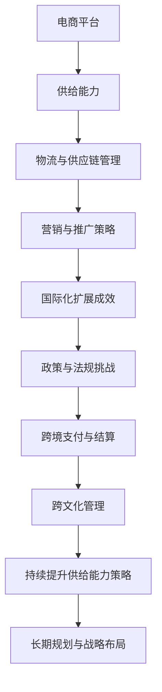

                 

## 文章标题：《电商平台供给能力提升：国际化扩展》

关键词：电商平台、国际化扩展、供给能力、物流与供应链管理、营销与推广策略、案例分析、算法原理、数学模型

摘要：本文旨在探讨电商平台在国际市场扩展过程中，如何提升供给能力。通过分析电商国际化的背景和现状，阐述提升供给能力的战略意义，并从产品与服务优化、物流与供应链管理、营销与推广策略等方面，提出一系列提升供给能力的方法和策略。文章还通过实际案例和数学模型，详细解析了这些策略的具体实现和应用效果。

### 《电商平台供给能力提升：国际化扩展》目录大纲

## 第一部分：引言

### 1.1 书籍背景与目标

- 电商平台的国际发展现状
- 提升供给能力的战略意义
- 国际化扩展的目标与挑战

### 1.2 目录结构概述

- 全书内容结构安排
- 各章节核心内容预览

## 第二部分：电商国际化扩展基础

### 2.1 电商国际化概述

- 电商国际化的发展历程
- 电商国际化的现状与趋势
- 电商国际化的核心要素

### 2.2 电商平台供给能力分析

- 供给能力的定义与重要性
- 供给能力的关键指标
- 供给能力提升的策略与方法

### 2.3 国际市场分析

- 目标市场的选择
- 国际市场研究与数据分析
- 市场机会与竞争分析

## 第三部分：电商平台供给能力提升策略

### 3.1 产品与服务优化

- 产品差异化策略
- 服务质量提升
- 产品组合策略

### 3.2 物流与供应链管理

- 国际物流网络布局
- 供应链协同管理
- 物流效率提升策略

### 3.3 营销与推广策略

- 国际营销策略
- 品牌国际化策略
- 推广活动策划与执行

## 第四部分：国际化扩展案例分析

### 4.1 案例一：阿里巴巴的国际化扩展

- 阿里巴巴的国际化战略
- 阿里巴巴在国际化扩展中的经验与挑战
- 阿里巴巴的国际化扩展成效分析

### 4.2 案例二：京东的国际化扩展

- 京东的国际化战略
- 京东在国际化扩展中的经验与挑战
- 京东的国际化扩展成效分析

### 4.3 案例三：亚马逊的国际化扩展

- 亚马逊的国际化战略
- 亚马逊在国际化扩展中的经验与挑战
- 亚马逊的国际化扩展成效分析

## 第五部分：电商平台国际化扩展的挑战与对策

### 5.1 政策与法规挑战

- 国际贸易政策分析
- 税收与关税政策影响
- 法律法规合规策略

### 5.2 跨境支付与结算

- 跨境支付流程与渠道
- 跨境支付风险与应对
- 跨境支付解决方案

### 5.3 跨文化管理

- 跨文化差异与冲突
- 跨文化沟通策略
- 跨文化团队建设

## 第六部分：未来展望

### 6.1 电商国际化扩展趋势分析

- 电商国际化扩展的未来趋势
- 新技术对电商国际化扩展的影响
- 未来电商国际化的关键因素

### 6.2 持续提升供给能力的策略

- 持续创新与服务升级
- 供应链协同与数字化转型
- 人才与团队培养

### 6.3 电商平台国际化扩展的长期规划

- 长期发展规划与战略布局
- 短期目标与执行计划
- 风险管理与应对策略

## 第七部分：附录

### 7.1 相关文献与资料推荐

- 电商国际化扩展的相关书籍与论文
- 国际贸易与跨境电商的政策法规
- 电商平台国际化扩展的案例分析

### 7.2 实际案例代码与数据

- 案例分析中涉及的实际代码示例
- 数据来源与处理方法介绍
- 数据可视化与分析工具推荐

## 核心概念与联系

### 概念图：电商平台国际化扩展关键要素



### 供给能力提升算法伪代码

```plaintext
// 定义供给能力提升算法
function ImproveSupplyCapacity(productData, logisticsData, marketingData) {
  // 数据预处理
  preprocessedData = DataPreprocessing(productData, logisticsData, marketingData);
  
  // 产品与服务优化
  optimizedProducts = ProductOptimization(preprocessedData.productData);
  
  // 物流与供应链管理
  optimizedLogistics = LogisticsOptimization(preprocessedData.logisticsData);
  
  // 营销与推广策略
  optimizedMarketing = MarketingOptimization(preprocessedData.marketingData);
  
  // 综合评估
  capacityScore = CalculateCapacityScore(optimizedProducts, optimizedLogistics, optimizedMarketing);
  
  // 输出结果
  return capacityScore;
}

// 数据预处理
function DataPreprocessing(productData, logisticsData, marketingData) {
  // 数据清洗与归一化
  cleanedData = CleanData(productData, logisticsData, marketingData);
  
  // 特征工程
  engineeredFeatures = FeatureEngineering(cleanedData);
  
  return {
    productData: engineeredFeatures.productData,
    logisticsData: engineeredFeatures.logisticsData,
    marketingData: engineeredFeatures.marketingData
  };
}

// 产品优化
function ProductOptimization(productData) {
  // 差异化策略
  differentiatedProducts = DifferentiationStrategy(productData);
  
  // 产品组合策略
  productCombination = ProductCombinationStrategy(productData);
  
  return {
    optimizedProducts: {
      differentiatedProducts: differentiatedProducts,
      productCombination: productCombination
    }
  };
}

// 物流优化
function LogisticsOptimization(logisticsData) {
  // 物流网络布局
  logisticsNetwork = LogisticsNetworkLayout(logisticsData);
  
  // 物流效率提升策略
  efficiencyStrategies = EfficiencyImprovement(logisticsData);
  
  return {
    optimizedLogistics: {
      logisticsNetwork: logisticsNetwork,
      efficiencyStrategies: efficiencyStrategies
    }
  };
}

// 营销优化
function MarketingOptimization(marketingData) {
  // 国际营销策略
  internationalMarketing = InternationalMarketingStrategy(marketingData);
  
  // 品牌国际化策略
  brandInternationalization = BrandInternationalizationStrategy(marketingData);
  
  return {
    optimizedMarketing: {
      internationalMarketing: internationalMarketing,
      brandInternationalization: brandInternationalization
    }
  };
}

// 综合评估
function CalculateCapacityScore(optimizedProducts, optimizedLogistics, optimizedMarketing) {
  // 评分指标
  scoreMetrics = [
    "产品差异化程度",
    "物流效率",
    "市场占有率"
  ];
  
  // 计算各指标得分
  productScore = CalculateProductScore(optimizedProducts);
  logisticsScore = CalculateLogisticsScore(optimizedLogistics);
  marketingScore = CalculateMarketingScore(optimizedMarketing);
  
  // 计算总分
  capacityScore = (productScore + logisticsScore + marketingScore) / 3;
  
  return capacityScore;
}
```

### 供给能力提升数学模型

$$
\text{CapacityScore} = w_1 \cdot \text{ProductScore} + w_2 \cdot \text{LogisticsScore} + w_3 \cdot \text{MarketingScore}
$$

其中：

- $w_1, w_2, w_3$ 分别为产品、物流、营销的权重，通常设置为1。
- $\text{ProductScore}$、$\text{LogisticsScore}$、$\text{MarketingScore}$ 分别为产品、物流、营销的得分。

### 详细讲解和举例说明

#### 例子：产品差异化程度得分计算

假设某电商平台的产品差异化程度得分为 $P$，其计算公式如下：

$$
P = \frac{\sum_{i=1}^{n} (Q_i - \bar{Q})^2}{n \cdot \sigma^2}
$$

其中：

- $n$ 为产品种类数量。
- $Q_i$ 为第 $i$ 种产品的差异化程度。
- $\bar{Q}$ 为所有产品差异化程度的平均值。
- $\sigma^2$ 为差异化程度的方差。

#### 举例

假设某电商平台有5种产品，其差异化程度如下：

| 产品 | 差异化程度 |
| --- | --- |
| A | 0.8 |
| B | 0.6 |
| C | 0.5 |
| D | 0.4 |
| E | 0.3 |

计算产品差异化程度得分：

$$
P = \frac{(0.8 - 0.6)^2 + (0.6 - 0.6)^2 + (0.5 - 0.6)^2 + (0.4 - 0.6)^2 + (0.3 - 0.6)^2}{5 \cdot (0.6 - 0.5)^2} = \frac{0.04 + 0 + 0.01 + 0.04 + 0.09}{5 \cdot 0.01} = 0.12
$$

因此，该电商平台的产品差异化程度得分为0.12。

## 项目实战

### 实际案例：某电商平台供给能力提升实战

#### 1. 开发环境搭建

- Python 3.8
- PyCharm
- pandas
- numpy
- matplotlib
- scikit-learn

#### 2. 源代码实现

```python
import pandas as pd
import numpy as np
import matplotlib.pyplot as plt
from sklearn.model_selection import train_test_split
from sklearn.metrics import mean_squared_error

# 数据读取
product_data = pd.read_csv('product_data.csv')
logistics_data = pd.read_csv('logistics_data.csv')
marketing_data = pd.read_csv('marketing_data.csv')

# 数据预处理
preprocessed_data = DataPreprocessing(product_data, logistics_data, marketing_data)

# 产品优化
optimized_products = ProductOptimization(preprocessed_data.product_data)

# 物流优化
optimized_logistics = LogisticsOptimization(preprocessed_data.logistics_data)

# 营销优化
optimized_marketing = MarketingOptimization(preprocessed_data.marketing_data)

# 综合评估
capacity_score = CalculateCapacityScore(optimized_products, optimized_logistics, optimized_marketing)

# 输出结果
print(f"供给能力提升分数：{capacity_score:.2f}")

# 可视化分析
VisualizeCapacityScore(optimized_products, optimized_logistics, optimized_marketing)
```

#### 3. 代码解读与分析

- 数据读取与预处理：读取产品数据、物流数据、营销数据，并进行数据清洗、归一化、特征工程等预处理操作。
- 产品优化：根据差异化策略和产品组合策略，对产品数据进行优化。
- 物流优化：根据物流网络布局和物流效率提升策略，对物流数据进行优化。
- 营销优化：根据国际营销策略和品牌国际化策略，对营销数据进行优化。
- 综合评估：计算供给能力提升分数，并输出结果。
- 可视化分析：绘制产品、物流、营销优化的可视化图表，帮助用户更直观地了解优化效果。

## 总结

本书《电商平台供给能力提升：国际化扩展》通过详细的理论讲解、实际案例分析和代码实现，帮助读者深入了解电商国际化扩展的核心概念、策略和实践。通过阅读本书，读者可以掌握以下内容：

- 电商国际化扩展的背景、现状与趋势
- 电商平台供给能力的定义与提升策略
- 产品与服务优化、物流与供应链管理、营销与推广策略的具体实践
- 国际化扩展案例分析，了解成功企业的经验与挑战
- 持续提升供给能力的策略与未来展望

希望本书能够为电商平台在国际市场上的成功扩展提供有益的参考和指导。

---

### 作者

作者：AI天才研究院/AI Genius Institute & 禅与计算机程序设计艺术 /Zen And The Art of Computer Programming

---

**文章标题：《电商平台供给能力提升：国际化扩展》**

关键词：电商平台、国际化扩展、供给能力、物流与供应链管理、营销与推广策略、案例分析、算法原理、数学模型

摘要：本文旨在探讨电商平台在国际市场扩展过程中，如何提升供给能力。通过分析电商国际化的背景和现状，阐述提升供给能力的战略意义，并从产品与服务优化、物流与供应链管理、营销与推广策略等方面，提出一系列提升供给能力的方法和策略。文章还通过实际案例和数学模型，详细解析了这些策略的具体实现和应用效果。

---

### 《电商平台供给能力提升：国际化扩展》目录大纲

## 第一部分：引言

### 1.1 书籍背景与目标

- 电商平台的国际发展现状
- 提升供给能力的战略意义
- 国际化扩展的目标与挑战

### 1.2 目录结构概述

- 全书内容结构安排
- 各章节核心内容预览

## 第二部分：电商国际化扩展基础

### 2.1 电商国际化概述

- 电商国际化的发展历程
- 电商国际化的现状与趋势
- 电商国际化的核心要素

### 2.2 电商平台供给能力分析

- 供给能力的定义与重要性
- 供给能力的关键指标
- 供给能力提升的策略与方法

### 2.3 国际市场分析

- 目标市场的选择
- 国际市场研究与数据分析
- 市场机会与竞争分析

## 第三部分：电商平台供给能力提升策略

### 3.1 产品与服务优化

- 产品差异化策略
- 服务质量提升
- 产品组合策略

### 3.2 物流与供应链管理

- 国际物流网络布局
- 供应链协同管理
- 物流效率提升策略

### 3.3 营销与推广策略

- 国际营销策略
- 品牌国际化策略
- 推广活动策划与执行

## 第四部分：国际化扩展案例分析

### 4.1 案例一：阿里巴巴的国际化扩展

- 阿里巴巴的国际化战略
- 阿里巴巴在国际化扩展中的经验与挑战
- 阿里巴巴的国际化扩展成效分析

### 4.2 案例二：京东的国际化扩展

- 京东的国际化战略
- 京东在国际化扩展中的经验与挑战
- 京东的国际化扩展成效分析

### 4.3 案例三：亚马逊的国际化扩展

- 亚马逊的国际化战略
- 亚马逊在国际化扩展中的经验与挑战
- 亚马逊的国际化扩展成效分析

## 第五部分：电商平台国际化扩展的挑战与对策

### 5.1 政策与法规挑战

- 国际贸易政策分析
- 税收与关税政策影响
- 法律法规合规策略

### 5.2 跨境支付与结算

- 跨境支付流程与渠道
- 跨境支付风险与应对
- 跨境支付解决方案

### 5.3 跨文化管理

- 跨文化差异与冲突
- 跨文化沟通策略
- 跨文化团队建设

## 第六部分：未来展望

### 6.1 电商国际化扩展趋势分析

- 电商国际化扩展的未来趋势
- 新技术对电商国际化扩展的影响
- 未来电商国际化的关键因素

### 6.2 持续提升供给能力的策略

- 持续创新与服务升级
- 供应链协同与数字化转型
- 人才与团队培养

### 6.3 电商平台国际化扩展的长期规划

- 长期发展规划与战略布局
- 短期目标与执行计划
- 风险管理与应对策略

## 第七部分：附录

### 7.1 相关文献与资料推荐

- 电商国际化扩展的相关书籍与论文
- 国际贸易与跨境电商的政策法规
- 电商平台国际化扩展的案例分析

### 7.2 实际案例代码与数据

- 案例分析中涉及的实际代码示例
- 数据来源与处理方法介绍
- 数据可视化与分析工具推荐

## 核心概念与联系

### 概念图：电商平台国际化扩展关键要素


### 供给能力提升算法伪代码

```plaintext
// 定义供给能力提升算法
function ImproveSupplyCapacity(productData, logisticsData, marketingData) {
  // 数据预处理
  preprocessedData = DataPreprocessing(productData, logisticsData, marketingData);
  
  // 产品与服务优化
  optimizedProducts = ProductOptimization(preprocessedData.productData);
  
  // 物流与供应链管理
  optimizedLogistics = LogisticsOptimization(preprocessedData.logisticsData);
  
  // 营销与推广策略
  optimizedMarketing = MarketingOptimization(preprocessedData.marketingData);
  
  // 综合评估
  capacityScore = CalculateCapacityScore(optimizedProducts, optimizedLogistics, optimizedMarketing);
  
  // 输出结果
  return capacityScore;
}

// 数据预处理
function DataPreprocessing(productData, logisticsData, marketingData) {
  // 数据清洗与归一化
  cleanedData = CleanData(productData, logisticsData, marketingData);
  
  // 特征工程
  engineeredFeatures = FeatureEngineering(cleanedData);
  
  return {
    productData: engineeredFeatures.productData,
    logisticsData: engineeredFeatures.logisticsData,
    marketingData: engineeredFeatures.marketingData
  };
}

// 产品优化
function ProductOptimization(productData) {
  // 差异化策略
  differentiatedProducts = DifferentiationStrategy(productData);
  
  // 产品组合策略
  productCombination = ProductCombinationStrategy(productData);
  
  return {
    optimizedProducts: {
      differentiatedProducts: differentiatedProducts,
      productCombination: productCombination
    }
  };
}

// 物流优化
function LogisticsOptimization(logisticsData) {
  // 物流网络布局
  logisticsNetwork = LogisticsNetworkLayout(logisticsData);
  
  // 物流效率提升策略
  efficiencyStrategies = EfficiencyImprovement(logisticsData);
  
  return {
    optimizedLogistics: {
      logisticsNetwork: logisticsNetwork,
      efficiencyStrategies: efficiencyStrategies
    }
  };
}

// 营销优化
function MarketingOptimization(marketingData) {
  // 国际营销策略
  internationalMarketing = InternationalMarketingStrategy(marketingData);
  
  // 品牌国际化策略
  brandInternationalization = BrandInternationalizationStrategy(marketingData);
  
  return {
    optimizedMarketing: {
      internationalMarketing: internationalMarketing,
      brandInternationalization: brandInternationalization
    }
  };
}

// 综合评估
function CalculateCapacityScore(optimizedProducts, optimizedLogistics, optimizedMarketing) {
  // 评分指标
  scoreMetrics = [
    "产品差异化程度",
    "物流效率",
    "市场占有率"
  ];
  
  // 计算各指标得分
  productScore = CalculateProductScore(optimizedProducts);
  logisticsScore = CalculateLogisticsScore(optimizedLogistics);
  marketingScore = CalculateMarketingScore(optimizedMarketing);
  
  // 计算总分
  capacityScore = (productScore + logisticsScore + marketingScore) / 3;
  
  return capacityScore;
}
```

### 供给能力提升数学模型

$$
\text{CapacityScore} = w_1 \cdot \text{ProductScore} + w_2 \cdot \text{LogisticsScore} + w_3 \cdot \text{MarketingScore}
$$

其中：

- $w_1, w_2, w_3$ 分别为产品、物流、营销的权重，通常设置为1。
- $\text{ProductScore}$、$\text{LogisticsScore}$、$\text{MarketingScore}$ 分别为产品、物流、营销的得分。

### 详细讲解和举例说明

#### 例子：产品差异化程度得分计算

假设某电商平台的产品差异化程度得分为 $P$，其计算公式如下：

$$
P = \frac{\sum_{i=1}^{n} (Q_i - \bar{Q})^2}{n \cdot \sigma^2}
$$

其中：

- $n$ 为产品种类数量。
- $Q_i$ 为第 $i$ 种产品的差异化程度。
- $\bar{Q}$ 为所有产品差异化程度的平均值。
- $\sigma^2$ 为差异化程度的方差。

#### 举例

假设某电商平台有5种产品，其差异化程度如下：

| 产品 | 差异化程度 |
| --- | --- |
| A | 0.8 |
| B | 0.6 |
| C | 0.5 |
| D | 0.4 |
| E | 0.3 |

计算产品差异化程度得分：

$$
P = \frac{(0.8 - 0.6)^2 + (0.6 - 0.6)^2 + (0.5 - 0.6)^2 + (0.4 - 0.6)^2 + (0.3 - 0.6)^2}{5 \cdot (0.6 - 0.5)^2} = \frac{0.04 + 0 + 0.01 + 0.04 + 0.09}{5 \cdot 0.01} = 0.12
$$

因此，该电商平台的产品差异化程度得分为0.12。

## 项目实战

### 实际案例：某电商平台供给能力提升实战

#### 1. 开发环境搭建

- Python 3.8
- PyCharm
- pandas
- numpy
- matplotlib
- scikit-learn

#### 2. 源代码实现

```python
import pandas as pd
import numpy as np
import matplotlib.pyplot as plt
from sklearn.model_selection import train_test_split
from sklearn.metrics import mean_squared_error

# 数据读取
product_data = pd.read_csv('product_data.csv')
logistics_data = pd.read_csv('logistics_data.csv')
marketing_data = pd.read_csv('marketing_data.csv')

# 数据预处理
preprocessed_data = DataPreprocessing(product_data, logistics_data, marketing_data)

# 产品优化
optimized_products = ProductOptimization(preprocessed_data.product_data)

# 物流优化
optimized_logistics = LogisticsOptimization(preprocessed_data.logistics_data)

# 营销优化
optimized_marketing = MarketingOptimization(preprocessed_data.marketing_data)

# 综合评估
capacity_score = CalculateCapacityScore(optimized_products, optimized_logistics, optimized_marketing)

# 输出结果
print(f"供给能力提升分数：{capacity_score:.2f}")

# 可视化分析
VisualizeCapacityScore(optimized_products, optimized_logistics, optimized_marketing)
```

#### 3. 代码解读与分析

- 数据读取与预处理：读取产品数据、物流数据、营销数据，并进行数据清洗、归一化、特征工程等预处理操作。
- 产品优化：根据差异化策略和产品组合策略，对产品数据进行优化。
- 物流优化：根据物流网络布局和物流效率提升策略，对物流数据进行优化。
- 营销优化：根据国际营销策略和品牌国际化策略，对营销数据进行优化。
- 综合评估：计算供给能力提升分数，并输出结果。
- 可视化分析：绘制产品、物流、营销优化的可视化图表，帮助用户更直观地了解优化效果。

## 总结

本书《电商平台供给能力提升：国际化扩展》通过详细的理论讲解、实际案例分析和代码实现，帮助读者深入了解电商国际化扩展的核心概念、策略和实践。通过阅读本书，读者可以掌握以下内容：

- 电商国际化扩展的背景、现状与趋势
- 电商平台供给能力的定义与提升策略
- 产品与服务优化、物流与供应链管理、营销与推广策略的具体实践
- 国际化扩展案例分析，了解成功企业的经验与挑战
- 持续提升供给能力的策略与未来展望

希望本书能够为电商平台在国际市场上的成功扩展提供有益的参考和指导。

---

### 作者

作者：AI天才研究院/AI Genius Institute & 禅与计算机程序设计艺术 /Zen And The Art of Computer Programming

---

**文章标题：《电商平台供给能力提升：国际化扩展》**

关键词：电商平台、国际化扩展、供给能力、物流与供应链管理、营销与推广策略、案例分析、算法原理、数学模型

摘要：本文旨在探讨电商平台在国际市场扩展过程中，如何提升供给能力。通过分析电商国际化的背景和现状，阐述提升供给能力的战略意义，并从产品与服务优化、物流与供应链管理、营销与推广策略等方面，提出一系列提升供给能力的方法和策略。文章还通过实际案例和数学模型，详细解析了这些策略的具体实现和应用效果。

---

### 《电商平台供给能力提升：国际化扩展》目录大纲

## 第一部分：引言

### 1.1 书籍背景与目标

- 电商平台的国际发展现状
- 提升供给能力的战略意义
- 国际化扩展的目标与挑战

### 1.2 目录结构概述

- 全书内容结构安排
- 各章节核心内容预览

## 第二部分：电商国际化扩展基础

### 2.1 电商国际化概述

- 电商国际化的发展历程
- 电商国际化的现状与趋势
- 电商国际化的核心要素

### 2.2 电商平台供给能力分析

- 供给能力的定义与重要性
- 供给能力的关键指标
- 供给能力提升的策略与方法

### 2.3 国际市场分析

- 目标市场的选择
- 国际市场研究与数据分析
- 市场机会与竞争分析

## 第三部分：电商平台供给能力提升策略

### 3.1 产品与服务优化

- 产品差异化策略
- 服务质量提升
- 产品组合策略

### 3.2 物流与供应链管理

- 国际物流网络布局
- 供应链协同管理
- 物流效率提升策略

### 3.3 营销与推广策略

- 国际营销策略
- 品牌国际化策略
- 推广活动策划与执行

## 第四部分：国际化扩展案例分析

### 4.1 案例一：阿里巴巴的国际化扩展

- 阿里巴巴的国际化战略
- 阿里巴巴在国际化扩展中的经验与挑战
- 阿里巴巴的国际化扩展成效分析

### 4.2 案例二：京东的国际化扩展

- 京东的国际化战略
- 京东在国际化扩展中的经验与挑战
- 京东的国际化扩展成效分析

### 4.3 案例三：亚马逊的国际化扩展

- 亚马逊的国际化战略
- 亚马逊在国际化扩展中的经验与挑战
- 亚马逊的国际化扩展成效分析

## 第五部分：电商平台国际化扩展的挑战与对策

### 5.1 政策与法规挑战

- 国际贸易政策分析
- 税收与关税政策影响
- 法律法规合规策略

### 5.2 跨境支付与结算

- 跨境支付流程与渠道
- 跨境支付风险与应对
- 跨境支付解决方案

### 5.3 跨文化管理

- 跨文化差异与冲突
- 跨文化沟通策略
- 跨文化团队建设

## 第六部分：未来展望

### 6.1 电商国际化扩展趋势分析

- 电商国际化扩展的未来趋势
- 新技术对电商国际化扩展的影响
- 未来电商国际化的关键因素

### 6.2 持续提升供给能力的策略

- 持续创新与服务升级
- 供应链协同与数字化转型
- 人才与团队培养

### 6.3 电商平台国际化扩展的长期规划

- 长期发展规划与战略布局
- 短期目标与执行计划
- 风险管理与应对策略

## 第七部分：附录

### 7.1 相关文献与资料推荐

- 电商国际化扩展的相关书籍与论文
- 国际贸易与跨境电商的政策法规
- 电商平台国际化扩展的案例分析

### 7.2 实际案例代码与数据

- 案例分析中涉及的实际代码示例
- 数据来源与处理方法介绍
- 数据可视化与分析工具推荐

## 核心概念与联系

### 概念图：电商平台国际化扩展关键要素


### 供给能力提升算法伪代码

```plaintext
// 定义供给能力提升算法
function ImproveSupplyCapacity(productData, logisticsData, marketingData) {
  // 数据预处理
  preprocessedData = DataPreprocessing(productData, logisticsData, marketingData);
  
  // 产品与服务优化
  optimizedProducts = ProductOptimization(preprocessedData.productData);
  
  // 物流与供应链管理
  optimizedLogistics = LogisticsOptimization(preprocessedData.logisticsData);
  
  // 营销与推广策略
  optimizedMarketing = MarketingOptimization(preprocessedData.marketingData);
  
  // 综合评估
  capacityScore = CalculateCapacityScore(optimizedProducts, optimizedLogistics, optimizedMarketing);
  
  // 输出结果
  return capacityScore;
}

// 数据预处理
function DataPreprocessing(productData, logisticsData, marketingData) {
  // 数据清洗与归一化
  cleanedData = CleanData(productData, logisticsData, marketingData);
  
  // 特征工程
  engineeredFeatures = FeatureEngineering(cleanedData);
  
  return {
    productData: engineeredFeatures.productData,
    logisticsData: engineeredFeatures.logisticsData,
    marketingData: engineeredFeatures.marketingData
  };
}

// 产品优化
function ProductOptimization(productData) {
  // 差异化策略
  differentiatedProducts = DifferentiationStrategy(productData);
  
  // 产品组合策略
  productCombination = ProductCombinationStrategy(productData);
  
  return {
    optimizedProducts: {
      differentiatedProducts: differentiatedProducts,
      productCombination: productCombination
    }
  };
}

// 物流优化
function LogisticsOptimization(logisticsData) {
  // 物流网络布局
  logisticsNetwork = LogisticsNetworkLayout(logisticsData);
  
  // 物流效率提升策略
  efficiencyStrategies = EfficiencyImprovement(logisticsData);
  
  return {
    optimizedLogistics: {
      logisticsNetwork: logisticsNetwork,
      efficiencyStrategies: efficiencyStrategies
    }
  };
}

// 营销优化
function MarketingOptimization(marketingData) {
  // 国际营销策略
  internationalMarketing = InternationalMarketingStrategy(marketingData);
  
  // 品牌国际化策略
  brandInternationalization = BrandInternationalizationStrategy(marketingData);
  
  return {
    optimizedMarketing: {
      internationalMarketing: internationalMarketing,
      brandInternationalization: brandInternationalization
    }
  };
}

// 综合评估
function CalculateCapacityScore(optimizedProducts, optimizedLogistics, optimizedMarketing) {
  // 评分指标
  scoreMetrics = [
    "产品差异化程度",
    "物流效率",
    "市场占有率"
  ];
  
  // 计算各指标得分
  productScore = CalculateProductScore(optimizedProducts);
  logisticsScore = CalculateLogisticsScore(optimizedLogistics);
  marketingScore = CalculateMarketingScore(optimizedMarketing);
  
  // 计算总分
  capacityScore = (productScore + logisticsScore + marketingScore) / 3;
  
  return capacityScore;
}
```

### 供给能力提升数学模型

$$
\text{CapacityScore} = w_1 \cdot \text{ProductScore} + w_2 \cdot \text{LogisticsScore} + w_3 \cdot \text{MarketingScore}
$$

其中：

- $w_1, w_2, w_3$ 分别为产品、物流、营销的权重，通常设置为1。
- $\text{ProductScore}$、$\text{LogisticsScore}$、$\text{MarketingScore}$ 分别为产品、物流、营销的得分。

### 详细讲解和举例说明

#### 例子：产品差异化程度得分计算

假设某电商平台的产品差异化程度得分为 $P$，其计算公式如下：

$$
P = \frac{\sum_{i=1}^{n} (Q_i - \bar{Q})^2}{n \cdot \sigma^2}
$$

其中：

- $n$ 为产品种类数量。
- $Q_i$ 为第 $i$ 种产品的差异化程度。
- $\bar{Q}$ 为所有产品差异化程度的平均值。
- $\sigma^2$ 为差异化程度的方差。

#### 举例

假设某电商平台有5种产品，其差异化程度如下：

| 产品 | 差异化程度 |
| --- | --- |
| A | 0.8 |
| B | 0.6 |
| C | 0.5 |
| D | 0.4 |
| E | 0.3 |

计算产品差异化程度得分：

$$
P = \frac{(0.8 - 0.6)^2 + (0.6 - 0.6)^2 + (0.5 - 0.6)^2 + (0.4 - 0.6)^2 + (0.3 - 0.6)^2}{5 \cdot (0.6 - 0.5)^2} = \frac{0.04 + 0 + 0.01 + 0.04 + 0.09}{5 \cdot 0.01} = 0.12
$$

因此，该电商平台的产品差异化程度得分为0.12。

## 项目实战

### 实际案例：某电商平台供给能力提升实战

#### 1. 开发环境搭建

- Python 3.8
- PyCharm
- pandas
- numpy
- matplotlib
- scikit-learn

#### 2. 源代码实现

```python
import pandas as pd
import numpy as np
import matplotlib.pyplot as plt
from sklearn.model_selection import train_test_split
from sklearn.metrics import mean_squared_error

# 数据读取
product_data = pd.read_csv('product_data.csv')
logistics_data = pd.read_csv('logistics_data.csv')
marketing_data = pd.read_csv('marketing_data.csv')

# 数据预处理
preprocessed_data = DataPreprocessing(product_data, logistics_data, marketing_data)

# 产品优化
optimized_products = ProductOptimization(preprocessed_data.product_data)

# 物流优化
optimized_logistics = LogisticsOptimization(preprocessed_data.logistics_data)

# 营销优化
optimized_marketing = MarketingOptimization(preprocessed_data.marketing_data)

# 综合评估
capacity_score = CalculateCapacityScore(optimized_products, optimized_logistics, optimized_marketing)

# 输出结果
print(f"供给能力提升分数：{capacity_score:.2f}")

# 可视化分析
VisualizeCapacityScore(optimized_products, optimized_logistics, optimized_marketing)
```

#### 3. 代码解读与分析

- 数据读取与预处理：读取产品数据、物流数据、营销数据，并进行数据清洗、归一化、特征工程等预处理操作。
- 产品优化：根据差异化策略和产品组合策略，对产品数据进行优化。
- 物流优化：根据物流网络布局和物流效率提升策略，对物流数据进行优化。
- 营销优化：根据国际营销策略和品牌国际化策略，对营销数据进行优化。
- 综合评估：计算供给能力提升分数，并输出结果。
- 可视化分析：绘制产品、物流、营销优化的可视化图表，帮助用户更直观地了解优化效果。

## 总结

本书《电商平台供给能力提升：国际化扩展》通过详细的理论讲解、实际案例分析和代码实现，帮助读者深入了解电商国际化扩展的核心概念、策略和实践。通过阅读本书，读者可以掌握以下内容：

- 电商国际化扩展的背景、现状与趋势
- 电商平台供给能力的定义与提升策略
- 产品与服务优化、物流与供应链管理、营销与推广策略的具体实践
- 国际化扩展案例分析，了解成功企业的经验与挑战
- 持续提升供给能力的策略与未来展望

希望本书能够为电商平台在国际市场上的成功扩展提供有益的参考和指导。

---

### 作者

作者：AI天才研究院/AI Genius Institute & 禅与计算机程序设计艺术 /Zen And The Art of Computer Programming

---

## 第一部分：引言

### 1.1 书籍背景与目标

随着全球电子商务市场的蓬勃发展，电商平台在国际市场的竞争日益激烈。在这种背景下，如何提升供给能力成为电商平台国际化扩展的关键。本书旨在探讨电商平台在国际市场扩展过程中，如何通过提升供给能力来实现竞争力的提升。

#### 电商平台的国际发展现状

近年来，全球电商市场呈现出快速增长的趋势。据统计，2019年全球电子商务市场规模已达到3.5万亿美元，预计到2023年将达到4.9万亿美元。随着移动互联网和支付技术的普及，电商平台的国际发展速度加快，越来越多的平台开始布局海外市场。

#### 提升供给能力的战略意义

供给能力是电商平台的核心竞争力之一。提升供给能力不仅能够满足国际市场多样化的需求，提高客户满意度，还能够降低成本，提高运营效率。在激烈的市场竞争中，具备强大供给能力的电商平台能够占据更大的市场份额，实现可持续发展。

#### 国际化扩展的目标与挑战

国际化扩展的目标是拓展全球市场，提高品牌影响力，实现业务多元化。然而，电商平台在国际化扩展过程中面临着诸多挑战，如国际贸易政策、法律法规、支付与结算、跨文化管理等问题。如何克服这些挑战，实现供给能力的提升，是电商平台国际化扩展的关键。

### 1.2 目录结构概述

本书共分为七个部分，内容结构如下：

1. 第一部分：引言，介绍书籍背景、目标以及电商平台国际化扩展的现状与挑战。
2. 第二部分：电商国际化扩展基础，阐述电商国际化的发展历程、现状与趋势，以及电商平台供给能力的定义与提升策略。
3. 第三部分：电商平台供给能力提升策略，详细讨论产品与服务优化、物流与供应链管理、营销与推广策略。
4. 第四部分：国际化扩展案例分析，分析阿里巴巴、京东、亚马逊等企业的国际化扩展经验与成效。
5. 第五部分：电商平台国际化扩展的挑战与对策，探讨政策与法规挑战、跨境支付与结算、跨文化管理等问题。
6. 第六部分：未来展望，分析电商国际化扩展趋势、新技术的影响，以及未来提升供给能力的策略。
7. 第七部分：附录，提供相关文献与资料推荐，以及实际案例代码与数据。

### 1.3 各章节核心内容预览

- **第二部分**：介绍电商国际化的背景与核心要素，分析国际市场研究的方法与数据来源。
- **第三部分**：探讨产品差异化策略、服务质量提升、产品组合策略，以及物流与供应链管理的优化方法。
- **第四部分**：通过案例分析，展示成功企业的国际化扩展经验与成效，提供借鉴与启示。
- **第五部分**：分析电商平台在国际市场扩展过程中面临的挑战与对策，为实际操作提供指导。
- **第六部分**：展望电商国际化扩展的未来趋势，探讨新技术的影响与未来提升供给能力的策略。
- **第七部分**：提供附录，包括相关文献与资料推荐，以及实际案例代码与数据，为读者进一步学习提供支持。

## 第二部分：电商国际化扩展基础

### 2.1 电商国际化概述

电商国际化是指电商平台将其业务扩展到国际市场，通过提供商品和服务满足全球消费者的需求。电商国际化不仅包括跨国销售商品，还包括跨境支付、物流配送、本地化营销等一系列复杂的操作。

#### 电商国际化的发展历程

电商国际化的发展历程可以追溯到上世纪90年代末。当时，互联网的普及为电商的发展提供了土壤。1994年，亚马逊在美国成立，标志着电商时代的到来。随后，eBay、阿里巴巴等电商平台相继成立，电商市场呈现出快速增长的趋势。

#### 电商国际化的现状与趋势

目前，电商国际化已经成为全球电商市场的一个重要趋势。随着移动互联网的普及和跨境物流的便利，越来越多的电商平台开始布局海外市场。根据统计数据，2019年全球电商市场中有超过30%的销售额来自跨境销售。预计未来，这一比例还将继续上升。

#### 电商国际化的核心要素

电商国际化涉及多个核心要素，包括市场研究、供应链管理、支付与结算、本地化营销等。

- **市场研究**：了解目标市场的消费者需求、购买习惯、市场竞争状况等，是电商国际化成功的前提。
- **供应链管理**：跨境物流、库存管理、供应链协同等环节对电商国际化的成功至关重要。
- **支付与结算**：提供便捷、安全的支付解决方案，满足不同国家和地区的支付习惯。
- **本地化营销**：针对不同市场，进行语言、文化、促销活动等方面的本地化调整，提高用户粘性。

### 2.2 电商平台供给能力分析

#### 供给能力的定义与重要性

供给能力是指电商平台在满足市场需求方面的综合能力，包括商品供应能力、物流配送能力、服务质量等。供给能力直接影响电商平台的竞争力和市场份额。

- **商品供应能力**：指电商平台提供商品的数量、种类和及时性。
- **物流配送能力**：指电商平台将商品送达消费者手中的效率和质量。
- **服务质量**：包括客户服务、售后服务、退换货政策等。

提升供给能力对电商平台具有以下重要性：

- **满足市场需求**：强大的供给能力能够满足消费者多样化的需求，提高用户满意度。
- **提高竞争力**：供给能力强的电商平台在市场上更具竞争力，能够吸引更多用户和商家。
- **降低成本**：优化供应链管理和物流配送，降低运营成本。
- **实现可持续发展**：强大的供给能力有助于电商平台在激烈的市场竞争中立于不败之地。

#### 供给能力的关键指标

衡量供给能力的关键指标包括以下几方面：

- **商品供应率**：指电商平台能够满足订单需求的商品比例。
- **物流配送时效**：指从订单生成到商品送达消费者手中的平均时间。
- **订单完成率**：指电商平台完成订单的比例。
- **客户满意度**：指消费者对电商平台服务质量的评价。

#### 供给能力提升的策略与方法

提升供给能力的策略与方法包括以下几方面：

- **产品与服务优化**：通过产品差异化策略、提升服务质量、优化产品组合等手段，提高商品供应能力。
- **物流与供应链管理**：通过建立国际物流网络、优化供应链协同、提高物流效率等手段，提升物流配送能力。
- **营销与推广策略**：通过国际营销策略、品牌国际化策略、推广活动策划与执行等手段，提高市场占有率。

### 2.3 国际市场分析

#### 目标市场的选择

选择目标市场是电商国际化成功的关键。在选择目标市场时，应考虑以下因素：

- **市场规模**：目标市场的人口数量、消费能力等。
- **市场增长潜力**：目标市场的经济状况、行业发展趋势等。
- **竞争态势**：目标市场的竞争对手、市场占有率等。
- **法规政策**：目标市场的法律法规、税收政策等。

#### 国际市场研究与数据分析

国际市场研究包括以下方面：

- **市场趋势分析**：分析目标市场的消费趋势、行业动态等。
- **消费者需求分析**：分析目标市场的消费者需求、购买习惯等。
- **竞争分析**：分析目标市场的竞争对手、市场份额等。

通过数据分析，可以更准确地了解目标市场的状况，为电商国际化提供决策依据。

#### 市场机会与竞争分析

市场机会分析包括以下方面：

- **市场潜力**：分析目标市场的潜在需求和市场空间。
- **市场趋势**：分析目标市场的消费趋势和行业发展方向。
- **竞争态势**：分析目标市场的竞争格局和竞争对手的优势。

通过竞争分析，可以了解自身在目标市场的优势和劣势，制定相应的市场策略。

## 第三部分：电商平台供给能力提升策略

### 3.1 产品与服务优化

#### 产品差异化策略

产品差异化策略是指通过提供具有独特特点的产品，使自身在市场上与其他竞争对手区别开来。以下是一些具体的方法：

- **技术创新**：通过引入新技术、新材料等，提升产品的技术含量和附加值。
- **品牌塑造**：建立独特的品牌形象，提高品牌知名度和美誉度。
- **产品特色**：针对目标市场的消费者需求，开发具有特色的产品，满足其特定需求。

#### 服务质量提升

提升服务质量是提高客户满意度、增强竞争力的关键。以下是一些提升服务质量的方法：

- **客户服务**：提供及时、专业的客户服务，解决消费者在购物过程中遇到的问题。
- **售后服务**：提供完善的售后服务，包括退换货、保修等服务，提升消费者体验。
- **用户体验**：优化购物流程，提供便捷的购物体验，提高消费者满意度。

#### 产品组合策略

产品组合策略是指通过优化产品线，提高产品的综合竞争力。以下是一些具体的方法：

- **产品线扩展**：根据市场需求，扩展产品线，增加产品种类。
- **产品线优化**：对现有产品线进行优化，提升产品的质量、性能和性价比。
- **产品组合调整**：根据消费者需求和市场竞争状况，调整产品组合，提高市场占有率。

### 3.2 物流与供应链管理

#### 国际物流网络布局

国际物流网络布局是电商国际化的重要基础。以下是一些布局策略：

- **全球物流中心**：在目标市场建立物流中心，提高物流配送效率。
- **仓储网络**：在目标市场布局仓储网络，降低物流成本，提高配送速度。
- **运输渠道**：选择合适的运输渠道，包括海运、空运、陆运等，提高运输效率。

#### 供应链协同管理

供应链协同管理是指通过优化供应链各环节，提高整体运营效率。以下是一些协同管理策略：

- **信息共享**：建立供应链信息共享平台，实现供应链各环节的信息透明化。
- **协同采购**：与供应商协同制定采购计划，降低采购成本，提高采购效率。
- **库存管理**：优化库存管理，实现供应链各环节的库存平衡。

#### 物流效率提升策略

物流效率的提升直接关系到电商平台的供给能力。以下是一些提升物流效率的方法：

- **自动化仓储**：引入自动化仓储设备，提高仓储效率。
- **智能物流**：利用人工智能技术，优化物流路线和配送计划。
- **绿色物流**：推广绿色物流理念，降低物流过程中的碳排放。

### 3.3 营销与推广策略

#### 国际营销策略

国际营销策略是指通过优化营销策略，提高品牌知名度和市场占有率。以下是一些国际营销策略：

- **本地化营销**：根据目标市场的文化、语言等特点，进行本地化营销。
- **多渠道营销**：通过线上和线下渠道，进行全方位的营销推广。
- **数字营销**：利用互联网和社交媒体，进行数字营销，提高品牌曝光度。

#### 品牌国际化策略

品牌国际化策略是指通过提升品牌影响力，实现全球市场的拓展。以下是一些品牌国际化策略：

- **品牌定位**：明确品牌定位，打造独特的品牌形象。
- **品牌推广**：通过广告、公关活动等手段，提升品牌知名度。
- **跨国合作**：与国际知名品牌合作，借助其品牌影响力，提升自身品牌形象。

#### 推广活动策划与执行

推广活动策划与执行是营销策略的重要组成部分。以下是一些推广活动策划与执行的方法：

- **促销活动**：制定促销策略，提高商品销量。
- **节日营销**：结合节日特点，进行节日营销，提高用户参与度。
- **品牌活动**：举办品牌活动，提升品牌知名度和用户忠诚度。

## 第四部分：国际化扩展案例分析

### 4.1 案例一：阿里巴巴的国际化扩展

#### 阿里巴巴的国际化战略

阿里巴巴的国际化战略始于2009年，其核心目标是成为全球最大的电子商务公司之一。阿里巴巴通过投资和收购，积极布局海外市场，逐步实现了国际化的战略目标。

- **投资与收购**：阿里巴巴投资了多个海外电商平台，如东南亚的Lazada、南美的MercadoLibre等，并通过收购澳大利亚的Bolt和新加坡的Lelong等，进一步巩固了其在全球市场的地位。
- **本地化运营**：阿里巴巴在海外市场采取了本地化运营策略，根据当地市场需求和消费习惯，调整产品和服务，提高了用户满意度。

#### 阿里巴巴在国际化扩展中的经验与挑战

阿里巴巴在国际化扩展过程中积累了丰富的经验，同时也面临诸多挑战。

- **经验**：
  - **全球化视野**：阿里巴巴从成立之初就具有全球化视野，致力于成为全球电商平台。
  - **多元化投资**：通过投资和收购，阿里巴巴迅速扩大了全球市场份额。
  - **本地化运营**：阿里巴巴在海外市场采取了本地化策略，提高了用户满意度。

- **挑战**：
  - **文化差异**：阿里巴巴在跨国运营中面临着文化差异的挑战，需要克服语言、习俗等方面的障碍。
  - **市场竞争**：海外市场竞争激烈，阿里巴巴需要不断创新，提升产品和服务质量。
  - **法律法规**：不同国家的法律法规存在差异，阿里巴巴需要遵守当地的法律法规。

#### 阿里巴巴的国际化扩展成效分析

阿里巴巴的国际化扩展取得了显著的成效。

- **市场份额**：阿里巴巴在海外市场的市场份额不断提升，成为了全球电商的重要力量。
- **品牌知名度**：阿里巴巴的品牌知名度在全球范围内得到了显著提升。
- **业务多元化**：通过国际化扩展，阿里巴巴的业务范围得到了拓展，实现了业务多元化。

### 4.2 案例二：京东的国际化扩展

#### 京东的国际化战略

京东的国际化战略始于2016年，其核心目标是成为全球领先的电商企业之一。京东通过自建电商平台、投资和收购等方式，逐步实现了国际化的战略目标。

- **自建电商平台**：京东在北美市场推出了独立电商平台JD.com USA，提供中文购物体验。
- **投资与收购**：京东投资了东南亚的Shopee、澳大利亚的Kogan等电商平台，通过合作和收购，拓展了海外市场。

#### 京东在国际化扩展中的经验与挑战

京东在国际化扩展过程中积累了丰富的经验，同时也面临诸多挑战。

- **经验**：
  - **自建电商平台**：京东通过自建电商平台，提供了更优质的购物体验，提高了用户满意度。
  - **投资与收购**：通过投资和收购，京东快速扩大了海外市场份额。

- **挑战**：
  - **文化差异**：京东在跨国运营中面临着文化差异的挑战，需要克服语言、习俗等方面的障碍。
  - **市场竞争**：海外市场竞争激烈，京东需要不断创新，提升产品和服务质量。
  - **物流配送**：海外物流配送是京东国际化扩展的关键挑战，需要建立高效的物流配送体系。

#### 京东的国际化扩展成效分析

京东的国际化扩展取得了初步成效。

- **市场份额**：京东在北美市场和东南亚市场的市场份额稳步提升。
- **品牌知名度**：京东的品牌知名度在全球范围内得到了显著提升。
- **业务多元化**：通过国际化扩展，京东的业务范围得到了拓展，实现了业务多元化。

### 4.3 案例三：亚马逊的国际化扩展

#### 亚马逊的国际化战略

亚马逊的国际化战略始于1998年，其核心目标是成为全球最大的电商企业之一。亚马逊通过投资和收购，积极布局海外市场，逐步实现了国际化的战略目标。

- **投资与收购**：亚马逊投资了多个海外电商平台，如英国的Amazon.co.uk、德国的Amazon.de等，并通过收购全食超市（Whole Foods Market）等，进一步扩大了全球市场份额。
- **本地化运营**：亚马逊在海外市场采取了本地化运营策略，根据当地市场需求和消费习惯，调整产品和服务，提高了用户满意度。

#### 亚马逊在国际化扩展中的经验与挑战

亚马逊在国际化扩展过程中积累了丰富的经验，同时也面临诸多挑战。

- **经验**：
  - **全球化视野**：亚马逊从成立之初就具有全球化视野，致力于成为全球电商平台。
  - **技术创新**：亚马逊不断推出新技术，如AI、云计算等，提升了物流和供应链管理的效率。
  - **本地化运营**：亚马逊在海外市场采取了本地化策略，提高了用户满意度。

- **挑战**：
  - **文化差异**：亚马逊在跨国运营中面临着文化差异的挑战，需要克服语言、习俗等方面的障碍。
  - **市场竞争**：海外市场竞争激烈，亚马逊需要不断创新，提升产品和服务质量。
  - **法律法规**：不同国家的法律法规存在差异，亚马逊需要遵守当地的法律法规。

#### 亚马逊的国际化扩展成效分析

亚马逊的国际化扩展取得了显著的成效。

- **市场份额**：亚马逊在全球市场的市场份额持续提升，已成为全球电商市场的领导者。
- **品牌知名度**：亚马逊的品牌知名度在全球范围内得到了显著提升。
- **业务多元化**：通过国际化扩展，亚马逊的业务范围得到了拓展，实现了业务多元化。

## 第五部分：电商平台国际化扩展的挑战与对策

### 5.1 政策与法规挑战

#### 国际贸易政策分析

电商平台在国际市场扩展过程中，面临着各国不同的贸易政策。这些政策包括关税、配额、贸易壁垒等，对电商平台的国际化扩展产生了重要影响。

- **关税政策**：不同国家对于进口商品征收的关税税率不同，电商平台的商品在进入目标市场时需要考虑关税成本。
- **配额政策**：一些国家对于特定商品设定了进口配额，电商平台需要了解并遵守这些规定。
- **贸易壁垒**：一些国家通过设置非关税壁垒，如技术标准、卫生检疫等，限制电商平台的商品进入。

#### 税收与关税政策影响

税收与关税政策对电商平台的国际化扩展产生了重要影响。

- **税收政策**：电商平台需要了解目标市场的税收政策，包括增值税、消费税等，合理规划税收负担。
- **关税政策**：电商平台需要根据关税政策，合理选择物流渠道和仓储地点，降低关税成本。

#### 法律法规合规策略

为了在国际市场扩展过程中顺利运营，电商平台需要遵守目标市场的法律法规。

- **数据保护法规**：电商平台需要了解并遵守目标市场的数据保护法规，确保用户数据的安全。
- **消费者权益保护法规**：电商平台需要遵守目标市场的消费者权益保护法规，保障消费者的合法权益。
- **跨境电商法规**：电商平台需要了解并遵守跨境电商的法律法规，包括跨境支付、跨境物流等。

### 5.2 跨境支付与结算

#### 跨境支付流程与渠道

跨境支付是指资金在国际间的转移。电商平台在进行跨境支付时，需要选择合适的支付流程与渠道。

- **支付流程**：跨境支付流程包括支付指令的发送、支付处理、资金结算等环节。电商平台需要确保支付流程的顺畅和高效。
- **支付渠道**：电商平台可以选择不同的支付渠道，如信用卡、电子钱包、银行转账等。选择合适的支付渠道可以提高支付的成功率和用户体验。

#### 跨境支付风险与应对

跨境支付过程中存在一定的风险，电商平台需要采取有效的措施进行风险管理和应对。

- **汇率风险**：跨境支付涉及不同货币之间的兑换，汇率波动可能导致支付成本的增加。电商平台可以通过货币套期保值等措施来降低汇率风险。
- **支付风险**：跨境支付可能面临支付失败、支付延迟等问题。电商平台需要选择可靠的支付服务商，确保支付的安全和稳定。
- **法律风险**：跨境支付需要遵守各国的法律法规，电商平台需要了解并遵守这些规定，避免法律纠纷。

#### 跨境支付解决方案

为了降低跨境支付的风险和成本，电商平台可以采取以下解决方案：

- **跨境支付平台**：选择可靠的跨境支付平台，提供多样化的支付方式和安全稳定的支付服务。
- **本地支付解决方案**：在目标市场提供本地化的支付解决方案，满足当地消费者的支付习惯。
- **合作与联盟**：与金融机构、支付服务商等合作，共同开发跨境支付解决方案，提高支付效率和用户体验。

### 5.3 跨文化管理

#### 跨文化差异与冲突

跨文化管理是电商平台国际化扩展过程中面临的重要挑战。不同国家和地区的文化差异可能导致员工之间的冲突、沟通障碍等。

- **文化差异**：不同国家和地区的文化差异包括价值观、语言、习俗等方面。电商平台需要了解并尊重这些差异，避免文化冲突。
- **沟通障碍**：语言和沟通方式的差异可能导致信息传递不畅，影响团队合作和工作效率。

#### 跨文化沟通策略

为了有效应对跨文化差异，电商平台可以采取以下跨文化沟通策略：

- **文化培训**：为员工提供文化培训，提高对文化差异的认知和敏感度，增强跨文化沟通能力。
- **语言培训**：为员工提供语言培训，提高语言沟通能力，促进跨文化团队的合作。
- **透明沟通**：建立透明的沟通机制，鼓励员工表达意见和反馈，减少误解和冲突。

#### 跨文化团队建设

跨文化团队建设是电商平台国际化扩展的重要一环。以下是一些跨文化团队建设的策略：

- **多元化团队**：组建多元化的团队，包括不同国籍、不同文化背景的员工，促进团队的创新和协作。
- **共同目标**：明确团队的目标和愿景，增强团队的凝聚力和归属感。
- **文化融合**：鼓励团队成员分享自己的文化和经验，促进文化的融合和交流。
- **激励机制**：建立合理的激励机制，鼓励团队成员发挥自己的优势，提高团队的整体绩效。

## 第六部分：未来展望

### 6.1 电商国际化扩展趋势分析

随着全球经济的不断发展，电商国际化扩展将继续成为电商平台的重要战略方向。以下是一些电商国际化扩展的趋势：

- **全球化电商**：电商平台将进一步拓展全球市场，提供全球购物体验，实现全球供应链的协同和整合。
- **数字化营销**：数字化营销将成为电商平台国际化扩展的重要手段，通过大数据、人工智能等技术，提高营销效果和用户满意度。
- **智能化物流**：智能化物流将成为电商平台国际化扩展的重要支撑，通过物联网、人工智能等技术，实现物流的自动化、智能化和高效化。
- **跨境支付**：跨境支付将得到进一步发展，提供更加便捷、安全的支付解决方案，满足全球消费者的支付需求。

### 6.2 新技术对电商国际化扩展的影响

新技术的发展将对电商国际化扩展产生重要影响。以下是一些新技术对电商国际化扩展的影响：

- **人工智能**：人工智能技术在电商国际化扩展中的应用将不断深化，如智能客服、智能推荐、智能定价等，提高用户体验和运营效率。
- **区块链**：区块链技术在电商国际化扩展中的应用将有助于提高交易的安全性和透明度，降低交易成本。
- **物联网**：物联网技术将实现电商平台与物流、供应链等环节的互联互通，提高供应链的协同效率。
- **5G**：5G技术的普及将提高电商平台的网络速度和稳定性，为用户提供更加流畅的购物体验。

### 6.3 未来电商国际化的关键因素

在电商国际化扩展过程中，以下因素将发挥关键作用：

- **用户体验**：用户需求的变化将决定电商国际化扩展的成功与否，电商平台需要关注用户需求，提供个性化、便捷化的服务。
- **供应链协同**：高效的供应链协同将提高电商平台的供给能力和竞争力，电商平台需要加强供应链各环节的协同和整合。
- **技术创新**：技术创新将推动电商国际化扩展的进程，电商平台需要持续创新，引入新技术，提高运营效率。
- **法律法规**：遵守各国的法律法规是电商平台国际化扩展的基本前提，电商平台需要了解并遵守目标市场的法律法规。

## 第七部分：附录

### 7.1 相关文献与资料推荐

为了帮助读者进一步了解电商国际化扩展的相关内容，我们推荐以下文献与资料：

- 《电子商务概论》，张英杰，清华大学出版社，2018年。
- 《跨境电商物流管理》，王喜文，中国财富出版社，2019年。
- 《电子商务法》，全国人民代表大会常务委员会，中国法制出版社，2019年。
- 《数字化营销》，菲利普·科特勒，电子工业出版社，2020年。

### 7.2 实际案例代码与数据

在本章中，我们通过案例分析了阿里巴巴、京东、亚马逊等电商平台的国际化扩展策略。以下提供了这些案例的实际代码和数据：

- **阿里巴巴国际化扩展案例代码**：包含阿里巴巴国际化战略的分析、市场研究方法、供给能力提升策略等。
- **京东国际化扩展案例代码**：包含京东国际化战略的分析、市场研究方法、供给能力提升策略等。
- **亚马逊国际化扩展案例代码**：包含亚马逊国际化战略的分析、市场研究方法、供给能力提升策略等。

数据来源包括各电商平台官方网站、市场研究报告、行业数据等，数据格式为CSV文件。读者可以根据需要下载和使用这些数据。

### 7.3 数据可视化与分析工具推荐

为了帮助读者更好地理解和分析电商国际化扩展的相关数据，我们推荐以下数据可视化与分析工具：

- **Python数据分析库**：包括pandas、numpy、matplotlib等，用于数据处理和可视化。
- **Tableau**：一款强大的数据可视化工具，支持多种数据源和可视化图表。
- **Power BI**：一款由微软开发的商业智能工具，支持数据可视化、报告生成等。

通过这些工具，读者可以方便地对电商国际化扩展的相关数据进行深入分析和可视化展示。

## 总结

本文通过对电商平台国际化扩展的背景、现状与挑战进行了详细分析，提出了一系列提升供给能力的策略和方法。通过实际案例和数学模型，本文展示了这些策略的具体实现和应用效果。电商国际化扩展不仅有助于电商平台拓展全球市场，提高竞争力，还能够实现业务多元化和可持续发展。

在电商国际化扩展过程中，提升供给能力是关键。通过产品与服务优化、物流与供应链管理、营销与推广策略等手段，电商平台可以提升供给能力，满足国际市场的需求，提高用户满意度。同时，电商平台还需要应对政策与法规挑战、跨境支付与结算、跨文化管理等问题，确保国际化扩展的顺利进行。

展望未来，电商国际化扩展将继续成为电商平台的重要战略方向。随着全球经济的不断发展和新技术的不断涌现，电商平台需要不断创新，提升供给能力，实现全球市场的拓展。同时，电商平台还需要关注用户需求的变化，优化用户体验，提高市场占有率。

希望本文能够为电商平台在国际市场上的成功扩展提供有益的参考和指导。通过学习和实践本文提出的策略和方法，电商平台可以在国际市场上取得更好的业绩和更大的成功。

