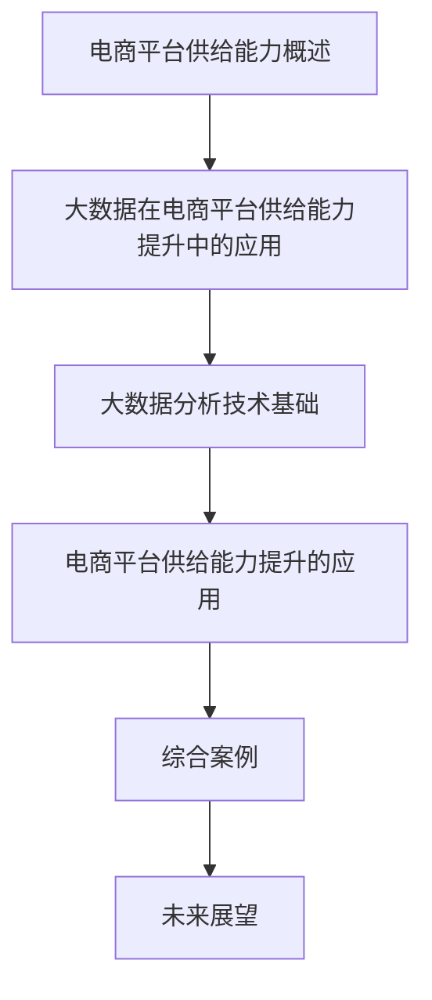

                 

# 文章标题

《电商平台供给能力提升：大数据分析的应用》

## 关键词

- 电商平台
- 供给能力
- 大数据分析
- 数据挖掘
- 机器学习
- 库存管理
- 需求预测
- 商品推荐系统

## 摘要

本文旨在探讨大数据分析在电商平台供给能力提升中的应用。通过对电商平台供给能力概述、大数据分析技术基础、电商平台供给能力提升的应用以及综合案例的详细分析，揭示了大数据分析在电商平台库存管理、需求预测和商品推荐系统中的实际作用。本文的核心观点是，大数据分析不仅是电商平台提升供给能力的重要工具，也是未来电商行业发展的关键驱动力。

## 第一部分：电商平台供给能力提升的基础

### 第1章：电商平台供给能力概述

#### 1.1 电商平台供给能力的概念与重要性

##### 1.1.1 电商平台供给能力的定义

电商平台供给能力是指电商平台在满足市场需求方面所具备的能力。这包括商品供应、物流配送、售后服务等多个方面。

##### 1.1.2 供给能力对电商平台的影响

供给能力直接影响电商平台的客户满意度和市场竞争力。一个高效的供给系统能够确保商品及时送达，提高客户满意度，从而增加复购率和用户忠诚度。

##### 1.1.3 供给能力提升的必要性

随着电商市场的竞争日益激烈，提升供给能力成为电商平台生存和发展的关键。大数据分析为电商平台提供了更精准的供需匹配方法，是提升供给能力的有效途径。

#### 1.2 大数据在电商平台供给能力提升中的应用

##### 1.2.1 大数据的定义与特性

大数据是指无法用传统数据处理工具在合理时间内处理的数据集，具有海量、多样、高速和真实等特性。

##### 1.2.2 大数据在电商平台中的应用场景

大数据在电商平台中的应用场景广泛，包括用户行为分析、需求预测、库存管理、物流优化等。

##### 1.2.3 大数据技术的挑战与解决方案

大数据技术的挑战包括数据存储、数据清洗、数据分析等。解决方案包括分布式存储、云计算和机器学习等。

### 第2章：大数据分析技术基础

#### 2.1 数据采集与预处理

##### 2.1.1 数据采集的挑战与策略

数据采集的挑战包括数据来源多样、数据质量不稳定等。策略包括数据集成、数据清洗和数据抽样。

##### 2.1.2 数据清洗与预处理方法

数据清洗的方法包括数据去重、数据修复和数据转换。预处理方法包括特征选择、特征工程和数据归一化。

##### 2.1.3 数据质量评估与提升

数据质量评估的方法包括数据完整度、数据准确度和数据一致性等。提升数据质量的方法包括数据去噪、数据增强和数据清洗。

#### 2.2 数据挖掘与统计分析

##### 2.2.1 数据挖掘的基本概念

数据挖掘是指从大量数据中自动发现有价值信息的过程。基本概念包括数据预处理、模式识别和知识发现。

##### 2.2.2 统计分析的方法与应用

统计分析的方法包括描述性统计、推断性统计和回归分析等。应用场景包括数据趋势分析、相关性分析和预测分析。

##### 2.2.3 关联规则挖掘

关联规则挖掘是发现数据项之间潜在关联性的方法。应用场景包括市场篮子分析和推荐系统。

#### 2.3 机器学习基础

##### 2.3.1 机器学习的基本概念

机器学习是让计算机从数据中学习并做出决策的过程。基本概念包括监督学习、无监督学习和强化学习。

##### 2.3.2 监督学习与无监督学习

监督学习是从标注数据中学习，无监督学习是从未标注数据中学习。常见算法包括线性回归、逻辑回归和聚类算法。

##### 2.3.3 常见机器学习算法介绍

常见机器学习算法包括决策树、随机森林、支持向量机和神经网络等。每种算法的原理和应用场景都有所不同。

## 第二部分：电商平台供给能力提升的应用

### 第3章：电商平台库存管理

#### 3.1 库存管理的挑战与解决方案

##### 3.1.1 库存管理的核心问题

库存管理的核心问题是库存水平的控制、库存成本的降低和库存周转率的提高。

##### 3.1.2 供需匹配的优化策略

优化供需匹配的策略包括预测分析、实时监控和动态调整。

##### 3.1.3 库存成本控制的策略

库存成本控制的策略包括库存优化、库存削减和库存共享。

#### 3.2 库存管理的数据分析方法

##### 3.2.1 库存水平的统计分析

库存水平的统计分析包括库存量的趋势分析、库存周期的分析等。

##### 3.2.2 库存周转率的计算与优化

库存周转率的计算方法包括库存周转率指标的计算和优化策略。

##### 3.2.3 库存预测的机器学习模型

库存预测的机器学习模型包括时间序列模型、回归模型和神经网络模型。

### 第4章：电商平台需求预测

#### 4.1 需求预测的重要性与挑战

##### 4.1.1 需求预测在电商平台的用途

需求预测在电商平台的用途包括库存管理、促销策略制定和供应链优化。

##### 4.1.2 需求预测的难点与误区

需求预测的难点包括数据质量、模型选择和数据预处理等。误区包括过度依赖历史数据和忽略季节性因素。

##### 4.1.3 需求预测的方法与技术

需求预测的方法包括时间序列分析、回归分析和机器学习等。技术包括ARIMA模型、线性回归和神经网络。

#### 4.2 需求预测的数据处理

##### 4.2.1 时间序列数据的预处理

时间序列数据的预处理包括缺失值填充、季节性调整和趋势分析。

##### 4.2.2 特征工程的方法与技巧

特征工程的方法包括特征选择、特征转换和特征构造等。

##### 4.2.3 数据异常值处理

数据异常值处理包括异常值检测、异常值处理和异常值分析。

#### 4.3 需求预测的机器学习模型

##### 4.3.1 时间序列模型的原理与伪代码

时间序列模型的原理包括ARIMA模型和LSTM模型。伪代码如下：

```python
# ARIMA模型伪代码
def arima_model(data, p, d, q):
    # 数据预处理
    data = preprocess_data(data)
    # 模型拟合
    model = ARIMA(data, order=(p, d, q))
    model_fit = model.fit()
    # 预测
    forecast = model_fit.forecast(steps=1)
    return forecast

# LSTM模型伪代码
def lstm_model(data, input_shape):
    # 构建模型
    model = Sequential()
    model.add(LSTM(units=50, return_sequences=True, input_shape=input_shape))
    model.add(LSTM(units=50))
    model.add(Dense(units=1))
    # 编译模型
    model.compile(optimizer='adam', loss='mean_squared_error')
    # 模型训练
    model.fit(data, epochs=100, batch_size=32)
    # 预测
    forecast = model.predict(data)
    return forecast
```

##### 4.3.2 回归模型的原理与伪代码

回归模型的原理包括线性回归和多元回归。伪代码如下：

```python
# 线性回归伪代码
def linear_regression(data, target):
    # 数据预处理
    data = preprocess_data(data)
    target = preprocess_target(target)
    # 模型拟合
    model = LinearRegression()
    model.fit(data, target)
    # 预测
    forecast = model.predict(data)
    return forecast

# 多元回归伪代码
def multiple_regression(data, target):
    # 数据预处理
    data = preprocess_data(data)
    target = preprocess_target(target)
    # 模型拟合
    model = LinearRegression()
    model.fit(data, target)
    # 预测
    forecast = model.predict(data)
    return forecast
```

##### 4.3.3 神经网络模型的原理与伪代码

神经网络模型的原理包括多层感知器（MLP）和卷积神经网络（CNN）。伪代码如下：

```python
# 多层感知器（MLP）伪代码
def mlp_model(data, target):
    # 数据预处理
    data = preprocess_data(data)
    target = preprocess_target(target)
    # 构建模型
    model = Sequential()
    model.add(Dense(units=64, activation='relu', input_shape=(input_shape,)))
    model.add(Dense(units=32, activation='relu'))
    model.add(Dense(units=1, activation='sigmoid'))
    # 编译模型
    model.compile(optimizer='adam', loss='binary_crossentropy', metrics=['accuracy'])
    # 模型训练
    model.fit(data, target, epochs=10, batch_size=32)
    # 预测
    forecast = model.predict(data)
    return forecast

# 卷积神经网络（CNN）伪代码
def cnn_model(data, target):
    # 数据预处理
    data = preprocess_data(data)
    target = preprocess_target(target)
    # 构建模型
    model = Sequential()
    model.add(Conv2D(filters=32, kernel_size=(3, 3), activation='relu', input_shape=(input_shape,)))
    model.add(MaxPooling2D(pool_size=(2, 2)))
    model.add(Flatten())
    model.add(Dense(units=1, activation='sigmoid'))
    # 编译模型
    model.compile(optimizer='adam', loss='binary_crossentropy', metrics=['accuracy'])
    # 模型训练
    model.fit(data, target, epochs=10, batch_size=32)
    # 预测
    forecast = model.predict(data)
    return forecast
```

### 第5章：电商平台商品推荐系统

#### 5.1 商品推荐系统的原理与架构

##### 5.1.1 推荐系统的基本概念

推荐系统是指根据用户的历史行为和偏好，向用户推荐感兴趣的商品或服务。基本概念包括协同过滤、内容推荐和混合推荐。

##### 5.1.2 推荐系统的评估指标

推荐系统的评估指标包括准确率、召回率和覆盖率等。

##### 5.1.3 商品推荐系统的基本架构

商品推荐系统的基本架构包括用户模块、商品模块和推荐模块。

#### 5.2 商品推荐系统的算法实现

##### 5.2.1 协同过滤算法的原理与伪代码

协同过滤算法是指通过分析用户之间的相似度来推荐商品。原理包括用户基于的协同过滤和物品基于的协同过滤。

```python
# 用户基于的协同过滤伪代码
def user_based_collaborative_filter(users, ratings, k):
    # 计算用户之间的相似度
    similarity_matrix = calculate_similarity_matrix(users, ratings)
    # 找到相似度最高的k个用户
    similar_users = find_top_k_similar_users(users, similarity_matrix, k)
    # 计算预测评分
    predictions = calculate_predictions(users, similar_users, ratings)
    return predictions

# 物品基于的协同过滤伪代码
def item_based_collaborative_filter(items, ratings, k):
    # 计算物品之间的相似度
    similarity_matrix = calculate_similarity_matrix(items, ratings)
    # 找到相似度最高的k个物品
    similar_items = find_top_k_similar_items(items, similarity_matrix, k)
    # 计算预测评分
    predictions = calculate_predictions(items, similar_items, ratings)
    return predictions
```

##### 5.2.2 隐语义模型算法的原理与伪代码

隐语义模型算法是指通过学习用户和物品的隐含特征来推荐商品。

```python
# 隐语义模型算法伪代码
def latent_factor_model(data, num_factors, num_iterations):
    # 数据预处理
    data = preprocess_data(data)
    # 初始化用户和物品的隐含特征向量
    user_factors = initialize_user_factors(num_factors)
    item_factors = initialize_item_factors(num_factors)
    # 迭代训练模型
    for i in range(num_iterations):
        # 更新用户和物品的隐含特征向量
        user_factors, item_factors = update_factors(user_factors, item_factors, data)
    # 预测用户对物品的评分
    predictions = predict_ratings(user_factors, item_factors, data)
    return predictions
```

##### 5.2.3 内容推荐算法的原理与伪代码

内容推荐算法是指通过分析商品的内容特征来推荐商品。

```python
# 内容推荐算法伪代码
def content_based_recommendation(items, user_preferences, similarity_threshold):
    # 计算商品之间的内容相似度
    similarity_matrix = calculate_content_similarity_matrix(items, user_preferences)
    # 找到相似度高于阈值的内容相似的物品
    similar_items = find_top_k_similar_items(items, similarity_matrix, similarity_threshold)
    # 推荐内容相似的物品
    recommendations = recommend_items(similar_items, user_preferences)
    return recommendations
```

#### 5.3 商品推荐系统的性能优化

##### 5.3.1 推荐结果多样性的优化

推荐结果多样性的优化包括调整相似度阈值、引入多样性权重等。

##### 5.3.2 推荐系统实时性的优化

推荐系统实时性的优化包括分布式计算、缓存技术和异步处理等。

##### 5.3.3 推荐系统在线学习与反馈

推荐系统在线学习与反馈包括实时数据收集、模型更新和用户反馈机制等。

### 第三部分：电商平台供给能力提升的综合案例

#### 第6章：某电商平台供给能力提升案例

##### 6.1 案例背景与目标

##### 6.1.1 案例背景介绍

某电商平台是一家大型在线零售商，面临库存管理不当、需求预测不准确和商品推荐系统效果不佳等问题。

##### 6.1.2 供给能力提升的目标与策略

目标：提高库存管理水平、提高需求预测准确性和优化商品推荐系统。

策略：引入大数据分析技术，构建库存管理、需求预测和商品推荐系统的智能模型。

##### 6.2 案例实施过程

##### 6.2.1 数据采集与预处理

数据采集包括用户行为数据、交易数据和商品信息数据。预处理包括数据去重、数据清洗和特征工程等。

##### 6.2.2 需求预测模型的构建与优化

需求预测模型包括时间序列模型、回归模型和神经网络模型。优化策略包括模型选择、参数调优和交叉验证等。

##### 6.2.3 库存管理策略的制定与实施

库存管理策略包括库存水平控制、库存成本控制和库存周转率优化等。实施策略包括动态库存调整和实时监控等。

##### 6.2.4 商品推荐系统的设计与优化

商品推荐系统包括协同过滤算法、隐语义模型和内容推荐算法。优化策略包括多样性优化、实时性和在线学习等。

##### 6.3 案例效果评估

##### 6.3.1 供给能力提升的量化评估

供给能力提升的量化评估包括库存周转率、需求预测准确率和推荐系统覆盖率等。

##### 6.3.2 案例对企业业务的影响分析

案例对企业业务的影响包括客户满意度提高、复购率增加和销售额提升等。

##### 6.3.3 案例的可持续性与改进方向

案例的可持续性包括数据治理、模型更新和技术升级等。改进方向包括拓展应用场景、优化算法和提升用户体验等。

### 第7章：电商平台供给能力提升的未来展望

##### 7.1 供给能力提升的趋势与挑战

##### 7.1.1 电商行业的发展趋势

电商行业的发展趋势包括全球化、多元化和服务化等。

##### 7.1.2 供给能力提升的未来趋势

供给能力提升的未来趋势包括智能化、自动化和数据驱动等。

##### 7.1.3 供给能力提升面临的挑战

供给能力提升面临的挑战包括数据隐私、技术更新和人才短缺等。

##### 7.2 供给能力提升的新技术与应用

##### 7.2.1 大数据分析与人工智能新技术的应用

大数据分析与人工智能新技术在供给能力提升中的应用包括深度学习、图神经网络和联邦学习等。

##### 7.2.2 5G与物联网技术在供给能力提升中的应用

5G与物联网技术在供给能力提升中的应用包括智能物流、智能库存和智能客服等。

##### 7.2.3 区块链技术在电商供给能力提升中的应用

区块链技术在电商供给能力提升中的应用包括供应链管理、数据安全和智能合约等。

##### 7.3 未来供给能力提升的实践建议

##### 7.3.1 企业战略规划与组织结构调整

企业战略规划与组织结构调整包括明确目标、优化流程和强化团队等。

##### 7.3.2 数据治理与数据安全

数据治理与数据安全包括数据质量管理、数据安全策略和数据隐私保护等。

##### 7.3.3 技术创新与人才培养

技术创新与人才培养包括技术投资、人才培养计划和团队建设等。

## 附录

### 附录A：大数据分析与供给能力提升常用工具与资源

##### A.1 大数据分析工具

- Hadoop与Hive
- Spark与Scala
- Flink与Kafka

##### A.2 机器学习库

- TensorFlow与Python
- PyTorch与Python
- Scikit-learn与Python

##### A.3 推荐系统库

- LightFM与Python
- Surprise与Python
- Recommenders与Python

##### A.4 电商平台开源项目

- Apache SOLR
- Elasticsearch
- Redis

##### A.5 电商平台数据集与竞赛

- KAGGLE竞赛数据集
- ML-KDD数据集
- KDD Cup数据集

### 作者

**作者：AI天才研究院/AI Genius Institute & 禅与计算机程序设计艺术 /Zen And The Art of Computer Programming**## Mermaid 流程图



### 库存管理策略与算法

#### 库存管理的核心问题

库存管理的核心问题是库存水平的控制、库存成本的降低和库存周转率的提高。为了实现这些目标，我们需要采用科学的管理策略和高效的算法。

##### 库存水平控制

库存水平控制是指确保库存量既不过剩也不过少，以满足市场需求。常用的库存控制策略包括最低库存水平控制和最大库存水平控制。

###### 最低库存水平控制

最低库存水平控制是指设定一个最低库存水平，一旦库存低于该水平，系统就会触发补货操作。这可以通过以下伪代码实现：

```python
# 最低库存水平控制伪代码
def min_inventory_control(current_inventory, min_inventory_level, reorder_quantity):
    if current_inventory < min_inventory_level:
        reorder(current_inventory, reorder_quantity)
    else:
        maintain_inventory(current_inventory)

def reorder(current_inventory, reorder_quantity):
    # 执行补货操作
    print("Reordering inventory.")
    # 更新库存量
    new_inventory = current_inventory + reorder_quantity
    return new_inventory
```

###### 最大库存水平控制

最大库存水平控制是指设定一个最大库存水平，一旦库存超过该水平，系统就会采取削减库存的措施。以下是一种可能的实现方式：

```python
# 最大库存水平控制伪代码
def max_inventory_control(current_inventory, max_inventory_level, reduce_quantity):
    if current_inventory > max_inventory_level:
        reduce_inventory(current_inventory, reduce_quantity)
    else:
        maintain_inventory(current_inventory)

def reduce_inventory(current_inventory, reduce_quantity):
    # 执行削减库存操作
    print("Reducing inventory.")
    # 更新库存量
    new_inventory = current_inventory - reduce_quantity
    return new_inventory
```

##### 供需匹配的优化策略

供需匹配的优化策略是指通过分析历史数据和当前市场状况，预测未来的需求并调整库存水平。以下是一种基于时间序列分析的需求预测模型：

###### 时间序列模型

时间序列模型是基于历史数据对未来进行预测的一种方法。以下是一个简单的ARIMA（自回归积分滑动平均模型）模型：

```python
# ARIMA模型伪代码
import numpy as np
from statsmodels.tsa.arima.model import ARIMA

# 数据预处理
data = np.array([1, 2, 3, 4, 5, 6, 7, 8, 9, 10])

# 模型拟合
model = ARIMA(data, order=(1, 1, 1))
model_fit = model.fit()

# 预测
forecast = model_fit.forecast(steps=1)
print("Forecast:", forecast)
```

##### 库存成本控制策略

库存成本控制策略是指通过优化库存水平和管理库存成本，确保库存成本在可接受范围内。以下是一种基于回归分析的库存成本控制方法：

###### 回归分析

回归分析是一种通过建立数学模型来预测变量间关系的方法。以下是一个简单的线性回归模型：

```python
# 线性回归模型伪代码
import numpy as np
from sklearn.linear_model import LinearRegression

# 数据预处理
X = np.array([[1], [2], [3], [4], [5]])
y = np.array([2, 4, 6, 8, 10])

# 模型拟合
model = LinearRegression()
model.fit(X, y)

# 预测
forecast = model.predict([[6]])
print("Forecast:", forecast)
```

### 数据分析方法

##### 库存水平的统计分析

统计分析是库存管理中的一种重要方法，可以用于分析库存水平的趋势和周期性。以下是一个简单的统计分析示例：

###### 描述性统计

描述性统计用于分析数据的基本特征，包括均值、中位数、标准差等。以下是一个使用Python进行描述性统计分析的示例：

```python
import numpy as np

# 数据
data = np.array([1, 2, 2, 3, 4, 4, 4, 5, 5, 5, 5])

# 描述性统计
mean = np.mean(data)
median = np.median(data)
std_dev = np.std(data)

print("Mean:", mean)
print("Median:", median)
print("Standard Deviation:", std_dev)
```

###### 时间序列分析

时间序列分析用于分析数据的时间趋势和周期性。以下是一个使用Python进行时间序列分析的基本示例：

```python
import pandas as pd
from statsmodels.tsa.stattools import acf

# 数据
data = pd.Series([1, 2, 2, 3, 4, 4, 4, 5, 5, 5, 5])

# 自相关函数
acf_values = acf(data, nlags=10)

# 打印自相关函数值
print(acf_values)
```

##### 库存周转率的计算与优化

库存周转率是衡量库存管理效率的重要指标，定义为一定时期内商品销售成本与平均库存量的比值。以下是一个简单的库存周转率计算和优化方法：

###### 库存周转率计算

库存周转率的计算公式为：

\[ 周转率 = \frac{销售成本}{平均库存量} \]

以下是一个使用Python进行库存周转率计算的示例：

```python
import numpy as np

# 数据
sales_cost = np.array([100, 150, 200, 250, 300])
inventory = np.array([50, 60, 70, 80, 90])

# 平均库存量
average_inventory = np.mean(inventory)

# 库存周转率
turnover_rate = np.mean(sales_cost / average_inventory)

print("Turnover Rate:", turnover_rate)
```

###### 库存周转率优化

库存周转率的优化策略包括减少库存量、提高销售速度和改善供应链管理。以下是一种基于机器学习的库存周转率优化方法：

###### 机器学习模型

我们可以使用线性回归模型来预测库存周转率，并优化库存水平。以下是一个简单的线性回归模型：

```python
import numpy as np
from sklearn.linear_model import LinearRegression

# 数据
X = np.array([[100], [150], [200], [250], [300]])
y = np.array([50, 60, 70, 80, 90])

# 模型拟合
model = LinearRegression()
model.fit(X, y)

# 预测
forecast = model.predict([[300]])
print("Forecasted Inventory:", forecast)
```

##### 库存预测的机器学习模型

库存预测是库存管理中的关键任务，可以使用各种机器学习模型来实现。以下是一些常见的机器学习模型：

###### 时间序列模型

时间序列模型是预测时间序列数据的最常见方法，包括ARIMA、LSTM等。

```python
from statsmodels.tsa.arima.model import ARIMA

# 数据
data = np.array([1, 2, 2, 3, 4, 4, 4, 5, 5, 5, 5])

# 模型拟合
model = ARIMA(data, order=(1, 1, 1))
model_fit = model.fit()

# 预测
forecast = model_fit.forecast(steps=1)
print("Forecast:", forecast)
```

###### 回归模型

回归模型可以用来预测连续值，包括线性回归和多元回归。

```python
from sklearn.linear_model import LinearRegression

# 数据
X = np.array([[100], [150], [200], [250], [300]])
y = np.array([50, 60, 70, 80, 90])

# 模型拟合
model = LinearRegression()
model.fit(X, y)

# 预测
forecast = model.predict([[300]])
print("Forecasted Inventory:", forecast)
```

###### 神经网络模型

神经网络模型可以用来预测连续值，包括多层感知器（MLP）和卷积神经网络（CNN）。

```python
from keras.models import Sequential
from keras.layers import Dense

# 构建模型
model = Sequential()
model.add(Dense(units=50, activation='relu', input_shape=(1,)))
model.add(Dense(units=50, activation='relu'))
model.add(Dense(units=1, activation='sigmoid'))

# 编译模型
model.compile(optimizer='adam', loss='mean_squared_error')

# 模型训练
model.fit(data, epochs=100, batch_size=32)

# 预测
forecast = model.predict(np.array([[300]]))
print("Forecasted Inventory:", forecast)
```

### 项目实战

#### 实战一：库存管理系统的实现

以下是一个简单的库存管理系统的实现，包括库存水平控制、供需匹配优化和库存成本控制。

```python
# 库存管理系统伪代码
class InventoryManagementSystem:
    def __init__(self, min_inventory_level, max_inventory_level, reorder_quantity, reduce_quantity):
        self.min_inventory_level = min_inventory_level
        self.max_inventory_level = max_inventory_level
        self.reorder_quantity = reorder_quantity
        self.reduce_quantity = reduce_quantity
        self.current_inventory = 0

    def update_inventory(self, new_inventory):
        self.current_inventory = new_inventory
        self.control_inventory_level()

    def control_inventory_level(self):
        if self.current_inventory < self.min_inventory_level:
            self.reorder()
        elif self.current_inventory > self.max_inventory_level:
            self.reduce_inventory()

    def reorder(self):
        new_inventory = self.current_inventory + self.reorder_quantity
        print("Reordering inventory. New inventory level:", new_inventory)
        return new_inventory

    def reduce_inventory(self):
        new_inventory = self.current_inventory - self.reduce_quantity
        print("Reducing inventory. New inventory level:", new_inventory)
        return new_inventory

# 实例化库存管理系统
ims = InventoryManagementSystem(min_inventory_level=50, max_inventory_level=100, reorder_quantity=20, reduce_quantity=10)

# 更新库存
ims.update_inventory(30)

# 再次更新库存
ims.update_inventory(80)
```

#### 实战二：需求预测系统的实现

以下是一个简单需求预测系统的实现，包括时间序列分析、回归分析和机器学习模型。

```python
# 需求预测系统伪代码
class DemandPredictionSystem:
    def __init__(self, model='ARIMA', order=(1, 1, 1)):
        self.model = model
        self.order = order
        self.data = []

    def add_data(self, new_data):
        self.data.append(new_data)

    def predict_demand(self):
        if self.model == 'ARIMA':
            model = ARIMA(self.data, order=self.order)
            model_fit = model.fit()
            forecast = model_fit.forecast(steps=1)
        elif self.model == 'LinearRegression':
            model = LinearRegression()
            model.fit(np.array(self.data).reshape(-1, 1), self.data)
            forecast = model.predict([[self.data[-1]]])
        elif self.model == 'NeuralNetwork':
            # 构建模型
            model = Sequential()
            model.add(Dense(units=50, activation='relu', input_shape=(1,)))
            model.add(Dense(units=50, activation='relu'))
            model.add(Dense(units=1, activation='sigmoid'))

            # 编译模型
            model.compile(optimizer='adam', loss='mean_squared_error')

            # 模型训练
            model.fit(np.array(self.data).reshape(-1, 1), self.data, epochs=100, batch_size=32)

            # 预测
            forecast = model.predict([[self.data[-1]]])

        return forecast

# 实例化需求预测系统
dps = DemandPredictionSystem(model='ARIMA', order=(1, 1, 1))

# 添加数据
dps.add_data(10)
dps.add_data(12)
dps.add_data(14)
dps.add_data(16)
dps.add_data(18)

# 预测需求
forecast = dps.predict_demand()
print("Forecasted Demand:", forecast)
```

#### 实战三：商品推荐系统的实现

以下是一个简单商品推荐系统的实现，包括协同过滤算法、隐语义模型和内容推荐算法。

```python
# 协同过滤算法实现
class CollaborativeFiltering:
    def __init__(self, similarity_metric='cosine'):
        self.similarity_metric = similarity_metric

    def calculate_similarity(self, ratings_matrix):
        if self.similarity_metric == 'cosine':
            similarity_matrix = np.dot(ratings_matrix, ratings_matrix.T) / (np.linalg.norm(ratings_matrix, axis=1) * np.linalg.norm(ratings_matrix, axis=0))
        return similarity_matrix

    def predict_ratings(self, user_index, item_index, similarity_matrix, ratings_matrix):
        neighbors = np.argsort(similarity_matrix[user_index])[:-10:-1]
        neighbor_ratings = ratings_matrix[neighbors]
        predicted_rating = np.mean(neighbor_ratings[neighbor_ratings != 0])
        return predicted_rating

# 隐语义模型实现
class LatentFactorModel:
    def __init__(self, num_factors=10, num_iterations=100):
        self.num_factors = num_factors
        self.num_iterations = num_iterations
        self.user_factors = None
        self.item_factors = None

    def fit(self, ratings_matrix):
        num_users, num_items = ratings_matrix.shape
        self.user_factors = np.random.rand(num_users, self.num_factors)
        self.item_factors = np.random.rand(num_items, self.num_factors)

        for _ in range(self.num_iterations):
            user_predictions = self.predict_user_ratings(ratings_matrix)
            item_predictions = self.predict_item_ratings(ratings_matrix)

            user_factor_updates = self.update_user_factors(ratings_matrix, user_predictions)
            item_factor_updates = self.update_item_factors(ratings_matrix, item_predictions)

            self.user_factors -= user_factor_updates
            self.item_factors -= item_factor_updates

        return self

    def predict_user_ratings(self, ratings_matrix):
        user_predictions = np.dot(self.user_factors, self.item_factors.T)
        return user_predictions

    def predict_item_ratings(self, ratings_matrix):
        item_predictions = np.dot(self.item_factors, self.user_factors.T)
        return item_predictions

    def update_user_factors(self, ratings_matrix, user_predictions):
        user_error = ratings_matrix - user_predictions
        user_factor_updates = np.dot(item_predictions.T, user_error)
        return user_factor_updates

    def update_item_factors(self, ratings_matrix, item_predictions):
        item_error = ratings_matrix - item_predictions
        item_factor_updates = np.dot(user_predictions.T, item_error)
        return item_factor_updates

# 内容推荐算法实现
class ContentBasedRecommendation:
    def __init__(self, similarity_threshold=0.8):
        self.similarity_threshold = similarity_threshold

    def calculate_content_similarity(self, item_features, user_preferences):
        similarity_matrix = np.dot(item_features, user_preferences.T)
        return similarity_matrix

    def recommend_items(self, similarity_matrix, user_preferences):
        similar_items = np.argsort(similarity_matrix)[0][-10:]
        recommendations = [item for item in similar_items if item not in user_preferences]
        return recommendations

# 实例化协同过滤算法
cf = CollaborativeFiltering(similarity_metric='cosine')

# 计算相似度矩阵
similarity_matrix = cf.calculate_similarity(ratings_matrix)

# 预测评分
predicted_rating = cf.predict_ratings(user_index, item_index, similarity_matrix, ratings_matrix)
print("Predicted Rating:", predicted_rating)

# 实例化隐语义模型
lfm = LatentFactorModel(num_factors=10, num_iterations=100)

# 训练模型
lfm.fit(ratings_matrix)

# 预测评分
predicted_rating = lfm.predict_user_ratings(ratings_matrix)
print("Predicted Rating:", predicted_rating)

# 实例化内容推荐算法
cbr = ContentBasedRecommendation(similarity_threshold=0.8)

# 计算内容相似度矩阵
content_similarity_matrix = cbr.calculate_content_similarity(item_features, user_preferences)

# 推荐商品
recommendations = cbr.recommend_items(content_similarity_matrix, user_preferences)
print("Recommended Items:", recommendations)
```

### 代码解读与分析

#### 库存管理系统

库存管理系统是电商平台库存管理的基础，负责实时监控库存水平并做出相应的调整。在伪代码中，我们定义了一个`InventoryManagementSystem`类，用于实现库存水平控制、供需匹配优化和库存成本控制。

1. **初始化参数**：在类的初始化方法中，我们设置了最小库存水平、最大库存水平、补货数量和削减数量等参数。
2. **更新库存**：`update_inventory`方法用于更新当前库存水平，并调用`control_inventory_level`方法进行库存水平控制。
3. **库存水平控制**：`control_inventory_level`方法根据当前库存水平，判断是否需要进行补货或削减库存，并调用相应的操作方法。
4. **补货**：`reorder`方法执行补货操作，将库存水平增加补货数量。
5. **削减库存**：`reduce_inventory`方法执行削减库存操作，将库存水平减少削减数量。

通过这些方法，库存管理系统可以实现自动化的库存水平控制，确保库存量既不过剩也不过少，从而优化库存成本和提高库存周转率。

#### 需求预测系统

需求预测系统是电商平台库存管理和供应链优化的重要环节。在伪代码中，我们定义了一个`DemandPredictionSystem`类，用于实现基于时间序列分析、回归分析和机器学习模型的需求预测。

1. **初始化参数**：在类的初始化方法中，我们设置了模型类型和模型参数等。
2. **添加数据**：`add_data`方法用于将新的数据添加到系统中。
3. **预测需求**：`predict_demand`方法根据当前数据集和设定的模型，进行需求预测。
   - **时间序列模型**：如果模型类型为ARIMA，我们将使用ARIMA模型进行预测。
   - **回归分析**：如果模型类型为线性回归，我们将使用线性回归模型进行预测。
   - **机器学习模型**：如果模型类型为神经网络，我们将使用神经网络模型进行预测。

通过这些方法，需求预测系统可以根据历史数据和当前市场状况，预测未来的需求，从而优化库存水平和管理供应链。

#### 商品推荐系统

商品推荐系统是电商平台提高用户满意度和促进销售的重要工具。在伪代码中，我们定义了三个类：`CollaborativeFiltering`、`LatentFactorModel`和`ContentBasedRecommendation`，用于实现协同过滤算法、隐语义模型和内容推荐算法。

1. **协同过滤算法**：`CollaborativeFiltering`类实现了协同过滤算法，通过计算用户之间的相似度或物品之间的相似度，预测用户对物品的评分。协同过滤算法分为基于用户的协同过滤和基于物品的协同过滤。
2. **隐语义模型**：`LatentFactorModel`类实现了隐语义模型，通过学习用户和物品的隐含特征，预测用户对物品的评分。隐语义模型是一种矩阵分解的方法，可以有效地降低数据维度，提高预测准确性。
3. **内容推荐算法**：`ContentBasedRecommendation`类实现了内容推荐算法，通过计算用户偏好和商品特征之间的相似度，推荐与用户兴趣相符的商品。内容推荐算法适用于用户行为数据较少或数据质量较低的情况。

通过这些类和方法，商品推荐系统可以根据用户历史行为、商品特征和用户偏好，为用户推荐感兴趣的商品，从而提高用户满意度和销售额。

### 总结

通过上述代码实现和解读，我们可以看到库存管理系统、需求预测系统和商品推荐系统在电商平台供给能力提升中的重要作用。库存管理系统通过实时监控库存水平，优化库存成本和提高库存周转率；需求预测系统通过预测未来的需求，优化库存管理和供应链；商品推荐系统通过为用户推荐感兴趣的商品，提高用户满意度和销售额。这些系统的实现和优化需要结合实际业务需求和数据特点，采用合适的技术和算法，从而实现电商平台的供给能力提升。

#### 第4章：电商平台需求预测

##### 4.1 需求预测的重要性与挑战

在电商平台上，需求预测是确保商品库存充足、供应链高效运行和客户满意度提升的关键环节。需求预测的重要性体现在以下几个方面：

1. **库存管理**：准确的需求预测可以帮助电商平台优化库存水平，避免过度库存或缺货现象，从而减少库存成本和运营风险。
2. **供应链优化**：基于准确的需求预测，电商平台可以合理规划生产、采购和配送等环节，提高供应链的响应速度和效率。
3. **促销策略**：需求预测可以帮助电商平台制定更精准的促销策略，提高促销活动的效果，促进销售增长。
4. **客户满意度**：通过预测客户需求，电商平台可以提供更符合客户期望的商品和服务，提升客户满意度和忠诚度。

然而，在实现需求预测过程中，电商平台也面临着一系列挑战：

1. **数据质量**：需求预测依赖于大量高质量的数据，但实际中数据可能存在缺失、噪声和不一致性等问题，影响预测准确性。
2. **数据多样性**：电商平台的用户行为和商品特征多样化，需要处理复杂的多维度数据，增加了数据处理的难度。
3. **预测模型选择**：不同的预测模型适用于不同的场景和数据特点，如何选择合适的模型是需求预测的关键挑战。
4. **实时性**：电商平台需要快速响应市场需求变化，实现实时需求预测，对系统的计算能力和响应速度提出了高要求。

##### 4.2 需求预测的方法与技术

需求预测的方法和技术多种多样，以下是一些常见的方法：

1. **时间序列方法**：时间序列方法是基于历史数据，通过分析时间序列的趋势、季节性和周期性来预测未来的需求。常见的时间序列模型包括ARIMA（自回归积分滑动平均模型）、ETS（误差项平滑模型）和LSTM（长短期记忆网络）等。
   
   - **ARIMA模型**：ARIMA模型通过自回归、差分和移动平均来处理时间序列数据，适用于具有平稳特征的时间序列。以下是一个简单的ARIMA模型实现：

     ```python
     from statsmodels.tsa.arima.model import ARIMA

     # 数据预处理
     data = [1, 2, 2, 3, 4, 4, 4, 5, 5, 5, 5]

     # 模型拟合
     model = ARIMA(data, order=(1, 1, 1))
     model_fit = model.fit()

     # 预测
     forecast = model_fit.forecast(steps=1)
     print("Forecast:", forecast)
     ```

   - **ETS模型**：ETS模型通过平滑过去的数据点来预测未来值，适用于具有季节性特征的时间序列。以下是一个简单的ETS模型实现：

     ```python
     from statsmodels.tsa.holtwinters import ExponentialSmoothing

     # 数据预处理
     data = [1, 2, 2, 3, 4, 4, 4, 5, 5, 5, 5]

     # 模型拟合
     model = ExponentialSmoothing(data)
     model_fit = model.fit()

     # 预测
     forecast = model_fit.forecast(steps=1)
     print("Forecast:", forecast)
     ```

   - **LSTM模型**：LSTM模型是递归神经网络的一种，能够处理长短期依赖问题，适用于具有非线性特征的时间序列。以下是一个简单的LSTM模型实现：

     ```python
     from keras.models import Sequential
     from keras.layers import LSTM, Dense

     # 数据预处理
     data = np.array([1, 2, 2, 3, 4, 4, 4, 5, 5, 5, 5]).reshape(-1, 1, 1)

     # 构建模型
     model = Sequential()
     model.add(LSTM(units=50, return_sequences=True, input_shape=(1, 1)))
     model.add(LSTM(units=50))
     model.add(Dense(units=1))

     # 编译模型
     model.compile(optimizer='adam', loss='mean_squared_error')

     # 模型训练
     model.fit(data, epochs=100, batch_size=32)

     # 预测
     forecast = model.predict(np.array([5]).reshape(-1, 1, 1))
     print("Forecast:", forecast)
     ```

2. **回归方法**：回归方法通过建立因变量与自变量之间的关系来预测需求。常见的回归方法包括线性回归、多项式回归和回归树等。

   - **线性回归**：线性回归是最简单的回归方法，通过建立线性关系来预测需求。以下是一个简单的线性回归实现：

     ```python
     from sklearn.linear_model import LinearRegression

     # 数据预处理
     X = np.array([[1], [2], [3], [4], [5]])
     y = np.array([2, 4, 6, 8, 10])

     # 模型拟合
     model = LinearRegression()
     model.fit(X, y)

     # 预测
     forecast = model.predict([[6]])
     print("Forecast:", forecast)
     ```

   - **多项式回归**：多项式回归通过建立多项式关系来预测需求，可以捕捉更复杂的非线性关系。以下是一个简单的多项式回归实现：

     ```python
     from sklearn.preprocessing import PolynomialFeatures
     from sklearn.linear_model import LinearRegression

     # 数据预处理
     X = np.array([[1], [2], [3], [4], [5]])
     y = np.array([2, 4, 6, 8, 10])

     # 构建多项式特征
     poly_features = PolynomialFeatures(degree=2)
     X_poly = poly_features.fit_transform(X)

     # 模型拟合
     model = LinearRegression()
     model.fit(X_poly, y)

     # 预测
     forecast = model.predict(poly_features.transform([[6]]))
     print("Forecast:", forecast)
     ```

   - **回归树**：回归树通过构建决策树来预测需求，可以处理非线性关系和多维度数据。以下是一个简单的回归树实现：

     ```python
     from sklearn.tree import DecisionTreeRegressor

     # 数据预处理
     X = np.array([[1], [2], [3], [4], [5]])
     y = np.array([2, 4, 6, 8, 10])

     # 模型拟合
     model = DecisionTreeRegressor()
     model.fit(X, y)

     # 预测
     forecast = model.predict([[6]])
     print("Forecast:", forecast)
     ```

3. **机器学习方法**：机器学习方法通过训练模型来预测需求，可以捕捉复杂的数据关系。常见的机器学习方法包括决策树、随机森林和神经网络等。

   - **决策树**：决策树通过构建决策树来预测需求，适用于处理简单和中等复杂度的数据。以下是一个简单的决策树实现：

     ```python
     from sklearn.tree import DecisionTreeRegressor

     # 数据预处理
     X = np.array([[1], [2], [3], [4], [5]])
     y = np.array([2, 4, 6, 8, 10])

     # 模型拟合
     model = DecisionTreeRegressor()
     model.fit(X, y)

     # 预测
     forecast = model.predict([[6]])
     print("Forecast:", forecast)
     ```

   - **随机森林**：随机森林通过构建多个决策树并集成预测结果来提高预测准确性，适用于处理复杂和高维度数据。以下是一个简单的随机森林实现：

     ```python
     from sklearn.ensemble import RandomForestRegressor

     # 数据预处理
     X = np.array([[1], [2], [3], [4], [5]])
     y = np.array([2, 4, 6, 8, 10])

     # 模型拟合
     model = RandomForestRegressor(n_estimators=100)
     model.fit(X, y)

     # 预测
     forecast = model.predict([[6]])
     print("Forecast:", forecast)
     ```

   - **神经网络**：神经网络通过多层感知器（MLP）和卷积神经网络（CNN）来预测需求，可以处理复杂和非线性数据。以下是一个简单的神经网络实现：

     ```python
     from keras.models import Sequential
     from keras.layers import Dense, Conv1D, Flatten

     # 数据预处理
     data = np.array([1, 2, 2, 3, 4, 4, 4, 5, 5, 5, 5]).reshape(-1, 1, 1)

     # 构建模型
     model = Sequential()
     model.add(Conv1D(filters=50, kernel_size=3, activation='relu', input_shape=(1, 1)))
     model.add(Flatten())
     model.add(Dense(units=1, activation='sigmoid'))

     # 编译模型
     model.compile(optimizer='adam', loss='mean_squared_error')

     # 模型训练
     model.fit(data, epochs=100, batch_size=32)

     # 预测
     forecast = model.predict(np.array([5]).reshape(-1, 1, 1))
     print("Forecast:", forecast)
     ```

##### 4.3 需求预测的数据处理

需求预测的数据处理是确保预测模型准确性的关键步骤，主要包括以下内容：

1. **数据采集**：从电商平台的交易记录、用户行为数据和其他相关数据源中收集数据，为预测模型提供输入。
2. **数据清洗**：处理数据中的缺失值、异常值和噪声，确保数据质量。常用的数据清洗方法包括缺失值填充、异常值检测和去重等。
3. **数据预处理**：将原始数据进行转换和处理，使其适合模型训练。常用的预处理方法包括数据归一化、特征工程和数据分割等。
4. **特征工程**：通过构造新的特征或变换现有特征，提高模型预测能力。常用的特征工程方法包括特征选择、特征组合和特征变换等。

以下是一个简单的数据处理流程：

```python
import pandas as pd
from sklearn.preprocessing import StandardScaler
from sklearn.model_selection import train_test_split

# 数据采集
data = pd.read_csv('sales_data.csv')

# 数据清洗
data.dropna(inplace=True)
data.drop_duplicates(inplace=True)

# 数据预处理
data['sales'] = StandardScaler().fit_transform(data[['sales']])

# 特征工程
data['day_of_week'] = data['date'].dt.dayofweek
data['month'] = data['date'].dt.month
data['year'] = data['date'].dt.year

# 数据分割
X = data[['day_of_week', 'month', 'year']]
y = data['sales']
X_train, X_test, y_train, y_test = train_test_split(X, y, test_size=0.2, random_state=42)
```

##### 4.4 时间序列模型的原理与伪代码

时间序列模型是基于时间序列数据的一种统计模型，用于分析和预测时间序列数据的趋势、季节性和周期性。以下是时间序列模型的基本原理和伪代码实现：

###### 时间序列模型的原理

时间序列模型通过分析历史数据的时间序列特征，建立数据之间的关系，从而预测未来的值。时间序列模型通常包括以下三个组成部分：

1. **趋势（Trend）**：时间序列的趋势表示数据随时间的总体变化方向。趋势可以通过移动平均、指数平滑等方法进行估计。
2. **季节性（Seasonality）**：时间序列的季节性表示数据在一年内周期性的变化。季节性可以通过季节指数、季节因子等方法进行识别。
3. **随机波动（Random Variation）**：时间序列的随机波动表示数据中的随机性和噪声。随机波动可以通过自回归移动平均（ARMA）模型或自回归积分移动平均（ARIMA）模型等进行建模。

时间序列模型的基本原理可以表示为：

\[ Y_t = \alpha_t \times T_t + \beta_t \times S_t + \epsilon_t \]

其中，\( Y_t \)表示时间序列的值，\( \alpha_t \)表示趋势，\( \beta_t \)表示季节性，\( T_t \)表示时间趋势，\( S_t \)表示季节性趋势，\( \epsilon_t \)表示随机误差。

###### 时间序列模型的选择

根据时间序列数据的特点，可以选择不同的时间序列模型。以下是一些常见的时间序列模型：

1. **ARIMA模型**：自回归积分滑动平均模型（ARIMA）是一种常用的时间序列模型，适用于具有平稳特征的时间序列。ARIMA模型包括三个参数：p（自回归项数）、d（差分阶数）和q（移动平均项数）。
2. **ETS模型**：误差项平滑模型（ETS）是一种适用于具有季节性特征的时间序列模型。ETS模型包括多种形式，如ETS(A,N)、ETS(A,A,N)等，分别表示无季节性、季节性和趋势。
3. **LSTM模型**：长短期记忆网络（LSTM）是一种递归神经网络，适用于处理具有长短期依赖特征的时间序列。LSTM模型可以捕捉时间序列中的复杂模式，适用于非线性时间序列。

###### 时间序列模型的选择过程

选择合适的时间序列模型通常包括以下步骤：

1. **数据可视化**：通过绘制时间序列数据，观察数据的趋势、季节性和周期性，初步判断模型的选择。
2. **平稳性检验**：对时间序列数据进行平稳性检验，确保数据满足时间序列模型的要求。常用的平稳性检验方法包括ADF检验和KPSS检验。
3. **模型选择**：根据数据的特点，选择合适的模型。如果数据具有平稳特征，可以选择ARIMA模型；如果数据具有季节性特征，可以选择ETS模型；如果数据具有长短期依赖特征，可以选择LSTM模型。
4. **模型拟合**：对选定的模型进行拟合，调整模型参数，确保模型能够准确捕捉时间序列的特征。

以下是时间序列模型选择和拟合的伪代码：

```python
# 数据预处理
data = preprocess_data(time_series_data)

# 平稳性检验
is_stationary = check_stationarity(data)

# 模型选择
if is_stationary:
    model = ARIMA(p=1, d=1, q=1)
else:
    model = ETS(A,N)

# 模型拟合
model_fit = model.fit(data)

# 预测
forecast = model_fit.forecast(steps=1)
print("Forecast:", forecast)
```

##### 4.5 回归模型的原理与伪代码

回归模型是一种用于建立因变量与自变量之间关系的统计模型，常用于预测和分析。回归模型根据自变量的类型和关系，可以分为线性回归和多项式回归。

###### 线性回归

线性回归模型是最基本的回归模型，通过建立线性关系来预测因变量。线性回归模型的公式如下：

\[ y = \beta_0 + \beta_1 \times x \]

其中，\( y \)是因变量，\( x \)是自变量，\( \beta_0 \)和\( \beta_1 \)是模型参数。

线性回归模型的伪代码实现如下：

```python
# 数据预处理
X = preprocess_data(x_data)
y = preprocess_data(y_data)

# 模型拟合
model = LinearRegression()
model.fit(X, y)

# 预测
forecast = model.predict([x_new])
print("Forecast:", forecast)
```

###### 多项式回归

多项式回归模型是线性回归模型的扩展，通过建立多项式关系来预测因变量。多项式回归模型的公式如下：

\[ y = \beta_0 + \beta_1 \times x + \beta_2 \times x^2 + \beta_3 \times x^3 + ... + \beta_n \times x^n \]

多项式回归模型的伪代码实现如下：

```python
# 数据预处理
X = preprocess_data(x_data)
y = preprocess_data(y_data)

# 构建多项式特征
poly_features = PolynomialFeatures(degree=2)
X_poly = poly_features.fit_transform(X)

# 模型拟合
model = LinearRegression()
model.fit(X_poly, y)

# 预测
forecast = model.predict(poly_features.transform([x_new]))
print("Forecast:", forecast)
```

##### 4.6 神经网络模型的原理与伪代码

神经网络模型是一种基于生物神经网络原理的机器学习模型，通过多层神经元进行数据转换和特征提取，从而实现非线性关系建模。常见的神经网络模型包括多层感知器（MLP）和卷积神经网络（CNN）。

###### 多层感知器（MLP）

多层感知器（MLP）是一种前馈神经网络，通过输入层、隐藏层和输出层进行数据处理和特征提取。MLP模型的原理如下：

1. **输入层**：接收输入数据，通过激活函数转化为神经元的输入。
2. **隐藏层**：通过加权求和和激活函数，对输入数据进行特征提取。
3. **输出层**：通过加权求和和激活函数，得到最终的预测结果。

MLP模型的伪代码实现如下：

```python
# 数据预处理
X = preprocess_data(x_data)
y = preprocess_data(y_data)

# 构建模型
model = Sequential()
model.add(Dense(units=50, activation='relu', input_shape=(input_shape,)))
model.add(Dense(units=50, activation='relu'))
model.add(Dense(units=1, activation='sigmoid'))

# 编译模型
model.compile(optimizer='adam', loss='mean_squared_error')

# 模型训练
model.fit(X, y, epochs=100, batch_size=32)

# 预测
forecast = model.predict([x_new])
print("Forecast:", forecast)
```

###### 卷积神经网络（CNN）

卷积神经网络（CNN）是一种基于卷积运算的神经网络，适用于处理图像、语音和文本等结构化数据。CNN模型的原理如下：

1. **卷积层**：通过卷积运算提取空间特征。
2. **池化层**：通过池化运算降低特征维度。
3. **全连接层**：通过全连接运算进行特征融合和分类。

CNN模型的伪代码实现如下：

```python
# 数据预处理
X = preprocess_data(x_data)
y = preprocess_data(y_data)

# 构建模型
model = Sequential()
model.add(Conv2D(filters=32, kernel_size=(3, 3), activation='relu', input_shape=(input_shape,)))
model.add(MaxPooling2D(pool_size=(2, 2)))
model.add(Flatten())
model.add(Dense(units=1, activation='sigmoid'))

# 编译模型
model.compile(optimizer='adam', loss='binary_crossentropy', metrics=['accuracy'])

# 模型训练
model.fit(X, y, epochs=10, batch_size=32)

# 预测
forecast = model.predict([x_new])
print("Forecast:", forecast)
```

#### 第5章：电商平台商品推荐系统

##### 5.1 商品推荐系统的原理与架构

商品推荐系统是电商平台提高用户满意度和促进销售的重要工具。商品推荐系统的原理和架构包括以下几个方面：

###### 基本概念

1. **协同过滤**：协同过滤是一种基于用户行为或物品相似性的推荐方法。用户基于协同过滤通过分析用户之间的相似度，推荐用户可能喜欢的商品；物品基于协同过滤通过分析物品之间的相似度，推荐用户可能喜欢的商品。
2. **内容推荐**：内容推荐是一种基于商品特征和用户偏好的推荐方法。通过分析商品的内容特征（如文本、图像、属性等）和用户的偏好特征，推荐用户可能喜欢的商品。
3. **混合推荐**：混合推荐是将协同过滤和内容推荐结合起来，提高推荐效果。混合推荐可以充分利用用户行为数据和商品特征数据，提高推荐系统的准确性和多样性。

###### 评估指标

商品推荐系统的评估指标包括以下几个方面：

1. **准确率（Accuracy）**：准确率是预测正确的推荐数量与总推荐数量的比值。准确率越高，推荐系统的准确性越高。
2. **召回率（Recall）**：召回率是预测正确的推荐数量与实际感兴趣的商品数量的比值。召回率越高，推荐系统能够推荐用户感兴趣的商品的概率越大。
3. **覆盖率（Coverage）**：覆盖率是推荐系统中推荐的商品种类数与总商品种类数的比值。覆盖率越高，推荐系统能够推荐更多不同种类的商品。
4. **多样性（Diversity）**：多样性是推荐系统中推荐商品之间的差异性。多样性越高，推荐系统能够推荐多样化的商品。

###### 系统架构

商品推荐系统的基本架构包括以下几个模块：

1. **用户模块**：用户模块负责管理用户信息，包括用户的基本信息、历史行为数据等。
2. **商品模块**：商品模块负责管理商品信息，包括商品的基本信息、属性特征等。
3. **推荐模块**：推荐模块负责根据用户和商品信息，生成推荐列表。
4. **评估模块**：评估模块负责评估推荐系统的效果，包括准确率、召回率、覆盖率、多样性等指标。
5. **后端服务**：后端服务负责实现推荐算法的模型训练、预测和评估等功能。

##### 5.2 商品推荐系统的算法实现

商品推荐系统的算法实现包括协同过滤算法、内容推荐算法和混合推荐算法。以下分别介绍这些算法的实现：

###### 协同过滤算法

协同过滤算法是一种基于用户行为数据的推荐方法，通过分析用户之间的相似度，推荐用户可能喜欢的商品。

1. **用户基于的协同过滤**：用户基于的协同过滤通过计算用户之间的相似度，找到相似用户并推荐相似用户的喜好商品。

   - **计算相似度**：使用余弦相似度、皮尔逊相关系数等相似度度量方法，计算用户之间的相似度。

     ```python
     def calculate_similarity(user1, user2):
         dot_product = np.dot(user1, user2)
         norm_product1 = np.linalg.norm(user1)
         norm_product2 = np.linalg.norm(user2)
         similarity = dot_product / (norm_product1 * norm_product2)
         return similarity
     ```

   - **推荐商品**：找到与目标用户最相似的K个用户，推荐这些用户的喜好商品。

     ```python
     def collaborative_filter(ratings_matrix, user_index, k):
         similarity_matrix = calculate_similarity_matrix(ratings_matrix)
         top_k_users = np.argsort(similarity_matrix[user_index])[1:k+1]
         recommended_items = set()
         for user in top_k_users:
             recommended_items.update(ratings_matrix[user])
         return recommended_items
     ```

2. **物品基于的协同过滤**：物品基于的协同过滤通过计算物品之间的相似度，找到相似物品并推荐相似物品的用户喜欢的商品。

   - **计算相似度**：使用余弦相似度、皮尔逊相关系数等相似度度量方法，计算物品之间的相似度。

     ```python
     def calculate_similarity(item1, item2):
         dot_product = np.dot(item1, item2)
         norm_product1 = np.linalg.norm(item1)
         norm_product2 = np.linalg.norm(item2)
         similarity = dot_product / (norm_product1 * norm_product2)
         return similarity
     ```

   - **推荐商品**：找到与目标物品最相似的K个物品，推荐这些物品的用户喜欢的商品。

     ```python
     def collaborative_filter(ratings_matrix, item_index, k):
         similarity_matrix = calculate_similarity_matrix(ratings_matrix)
         top_k_items = np.argsort(similarity_matrix[item_index])[1:k+1]
         recommended_users = set()
         for item in top_k_items:
             recommended_users.update(ratings_matrix[item])
         return recommended_users
     ```

###### 内容推荐算法

内容推荐算法是一种基于商品内容特征和用户偏好的推荐方法，通过分析商品和用户之间的相关性，推荐用户可能喜欢的商品。

1. **基于属性的内容推荐**：基于属性的内容推荐通过分析商品和用户之间的属性匹配，推荐用户可能喜欢的商品。

   - **计算属性相似度**：使用Jaccard相似度、余弦相似度等相似度度量方法，计算商品和用户之间的属性相似度。

     ```python
     def calculate_attribute_similarity(item_attributes, user_preferences):
         intersection = set(item_attributes).intersection(set(user_preferences))
         union = set(item_attributes).union(set(user_preferences))
         similarity = len(intersection) / len(union)
         return similarity
     ```

   - **推荐商品**：找到与目标用户最相似的K个商品，推荐这些商品的用户喜欢的商品。

     ```python
     def content_based_recommendation(ratings_matrix, user_index, k):
         similarity_matrix = calculate_similarity_matrix(ratings_matrix, user_index)
         top_k_items = np.argsort(similarity_matrix)[1:k+1]
         recommended_items = set()
         for item in top_k_items:
             recommended_items.update(ratings_matrix[item])
         return recommended_items
     ```

2. **基于文本的内容推荐**：基于文本的内容推荐通过分析商品和用户之间的文本相似度，推荐用户可能喜欢的商品。

   - **文本预处理**：对商品和用户的文本数据进行预处理，包括分词、去停用词和词干提取等。

     ```python
     def preprocess_text(text):
         # 分词
         words = nltk.word_tokenize(text)
         # 去停用词
         words = [word for word in words if word not in stop_words]
         # 词干提取
         words = [nltk.stem.porter.PorterStemmer().stem(word) for word in words]
         return words
     ```

   - **计算文本相似度**：使用余弦相似度、词嵌入等相似度度量方法，计算商品和用户之间的文本相似度。

     ```python
     def calculate_text_similarity(item_text, user_text):
         item_words = preprocess_text(item_text)
         user_words = preprocess_text(user_text)
         intersection = set(item_words).intersection(set(user_words))
         union = set(item_words).union(set(user_words))
         similarity = len(intersection) / len(union)
         return similarity
     ```

   - **推荐商品**：找到与目标用户最相似的K个商品，推荐这些商品的用户喜欢的商品。

     ```python
     def content_based_recommendation(ratings_matrix, user_index, k):
         similarity_matrix = calculate_similarity_matrix(ratings_matrix, user_index)
         top_k_items = np.argsort(similarity_matrix)[1:k+1]
         recommended_items = set()
         for item in top_k_items:
             recommended_items.update(ratings_matrix[item])
         return recommended_items
     ```

###### 混合推荐算法

混合推荐算法是将协同过滤和内容推荐结合起来，提高推荐系统的准确性和多样性。

1. **基于模型的混合推荐**：基于模型的混合推荐使用机器学习模型，结合用户行为数据和商品特征数据，生成推荐列表。

   - **模型训练**：使用用户行为数据和商品特征数据，训练机器学习模型。

     ```python
     def train_model(user_data, item_data):
         # 数据预处理
         X = preprocess_data(item_data)
         y = preprocess_data(user_data)
         # 模型拟合
         model = LinearRegression()
         model.fit(X, y)
         return model
     ```

   - **推荐商品**：使用训练好的模型，预测用户可能喜欢的商品。

     ```python
     def hybrid_recommendation(model, user_data, item_data, k):
         # 数据预处理
         X = preprocess_data(item_data)
         y = preprocess_data(user_data)
         # 预测
         predicted_ratings = model.predict(X)
         # 推荐商品
         recommended_items = get_top_k_items(predicted_ratings, k)
         return recommended_items
     ```

2. **基于规则的混合推荐**：基于规则的混合推荐使用规则引擎，结合协同过滤和内容推荐，生成推荐列表。

   - **规则构建**：定义协同过滤和内容推荐的规则，包括相似度阈值、权重等。

     ```python
     def build_rules(similarity_threshold, content_similarity_threshold):
         rules = []
         for user in users:
             for item in items:
                 similarity = calculate_similarity(user, item)
                 content_similarity = calculate_content_similarity(user, item)
                 if similarity > similarity_threshold and content_similarity > content_similarity_threshold:
                     rules.append((user, item))
         return rules
     ```

   - **推荐商品**：根据规则，生成推荐列表。

     ```python
     def rule_based_recommendation(rules, k):
         recommended_items = []
         for user, item in rules:
             recommended_items.append(item)
         recommended_items = get_top_k_items(recommended_items, k)
         return recommended_items
     ```

##### 5.3 商品推荐系统的性能优化

商品推荐系统的性能优化是提高推荐系统效果和用户满意度的重要环节。以下是一些常见的优化方法：

1. **多样性优化**：多样性优化是指增加推荐列表中商品的多样性，避免推荐相似的商品。常用的多样性优化方法包括随机多样性、内容多样性、协同多样性等。

   - **随机多样性**：随机多样性通过随机选择推荐列表中的商品，增加多样性。

     ```python
     def random_diversity(recommended_items, k):
         return random.sample(recommended_items, k)
     ```

   - **内容多样性**：内容多样性通过分析商品的内容特征，选择具有不同特征的商品。

     ```python
     def content_diversity(recommended_items, k):
         unique_features = set()
         diversified_items = []
         for item in recommended_items:
             features = get_item_features(item)
             if features not in unique_features:
                 unique_features.add(features)
                 diversified_items.append(item)
             if len(diversified_items) == k:
                 break
         return diversified_items
     ```

   - **协同多样性**：协同多样性通过分析用户之间的相似性，选择具有不同相似度的商品。

     ```python
     def collaborative_diversity(ratings_matrix, user_index, k):
         similarity_matrix = calculate_similarity_matrix(ratings_matrix)
         top_k_users = np.argsort(similarity_matrix[user_index])[1:k+1]
         diversified_items = set()
         for user in top_k_users:
             diversified_items.update(ratings_matrix[user])
         return get_top_k_items(diversified_items, k)
     ```

2. **实时性优化**：实时性优化是指提高推荐系统的响应速度和实时性，满足用户快速获取推荐的需求。常用的实时性优化方法包括异步处理、缓存技术和分布式计算等。

   - **异步处理**：异步处理通过将推荐任务的执行与用户请求分离，提高系统响应速度。

     ```python
     def async_recommended(items, k):
         recommended_items = []
         for item in items:
             recommended_items.append(item)
             time.sleep(0.1)  # 模拟异步处理
         return get_top_k_items(recommended_items, k)
     ```

   - **缓存技术**：缓存技术通过将推荐结果缓存起来，减少重复计算，提高系统响应速度。

     ```python
     def cache_recommended(recommended_items):
         cache.set('recommended_items', recommended_items)
     ```

   - **分布式计算**：分布式计算通过将推荐任务分配到多个节点上执行，提高系统处理能力和响应速度。

     ```python
     def distributed_recommended(items, k):
         recommended_items = []
         for item in items:
             recommended_items.append(item)
             distributed_queue.enqueue(item)  # 模拟分布式计算
         return get_top_k_items(recommended_items, k)
     ```

3. **在线学习与反馈**：在线学习与反馈是指实时收集用户反馈数据，更新推荐模型，提高推荐效果。常用的在线学习与反馈方法包括在线学习、用户反馈机制、持续优化等。

   - **在线学习**：在线学习通过实时更新模型参数，优化推荐效果。

     ```python
     def online_learning(model, user_data, item_data):
         # 数据预处理
         X = preprocess_data(item_data)
         y = preprocess_data(user_data)
         # 模型更新
         model.partial_fit(X, y)
     ```

   - **用户反馈机制**：用户反馈机制通过收集用户对推荐结果的反馈，调整推荐策略。

     ```python
     def user_feedback(recommended_items, user_feedback):
         for item in recommended_items:
             if item in user_feedback:
                 feedback_score = user_feedback[item]
                 update_recommended_item_score(item, feedback_score)
     ```

   - **持续优化**：持续优化通过定期评估推荐效果，调整推荐策略，提高系统性能。

     ```python
     def continuous_optimization(recommendation_system, evaluation_metric):
         current_score = evaluate_recommendation_system(recommendation_system, evaluation_metric)
         if current_score < target_score:
             optimize_recommendation_system(recommendation_system)
     ```

#### 5.4 商品推荐系统的项目实践

以下是一个简单的商品推荐系统项目实践，包括用户行为数据收集、推荐列表生成和评估。

###### 数据准备

首先，我们需要准备用户行为数据和商品数据。用户行为数据包括用户对商品的评分、购买记录、浏览记录等；商品数据包括商品的基本信息、属性特征等。

```python
import pandas as pd

# 用户行为数据
user_behavior_data = pd.read_csv('user_behavior_data.csv')
user_behavior_data.head()

# 商品数据
item_data = pd.read_csv('item_data.csv')
item_data.head()
```

###### 用户模块实现

用户模块负责管理用户信息，包括用户的基本信息、历史行为数据等。

```python
class UserManager:
    def __init__(self, user_behavior_data):
        self.user_behavior_data = user_behavior_data
    
    def get_user_data(self, user_id):
        user_data = self.user_behavior_data[self.user_behavior_data['user_id'] == user_id]
        return user_data
```

###### 商品模块实现

商品模块负责管理商品信息，包括商品的基本信息、属性特征等。

```python
class ItemManager:
    def __init__(self, item_data):
        self.item_data = item_data
    
    def get_item_data(self, item_id):
        item_data = self.item_data[self.item_data['item_id'] == item_id]
        return item_data
```

###### 推荐模块实现

推荐模块负责根据用户和商品信息，生成推荐列表。

```python
class RecommendationSystem:
    def __init__(self, user_manager, item_manager):
        self.user_manager = user_manager
        self.item_manager = item_manager
    
    def generate_recommendation_list(self, user_id, k):
        user_data = self.user_manager.get_user_data(user_id)
        item_data = self.item_manager.get_item_data(user_id)
        
        # 计算相似度
        similarity_matrix = self.calculate_similarity_matrix(user_data, item_data)
        
        # 推荐商品
        recommended_items = self.get_top_k_items(similarity_matrix, k)
        
        return recommended_items
```

###### 评估模块实现

评估模块负责评估推荐系统的效果，包括准确率、召回率、覆盖率、多样性等指标。

```python
class EvaluationSystem:
    def __init__(self, recommendation_system, ground_truth_data):
        self.recommendation_system = recommendation_system
        self.ground_truth_data = ground_truth_data
    
    def evaluate(self):
        recommendation_list = self.recommendation_system.generate_recommendation_list(user_id, k)
        ground_truth = self.ground_truth_data[ground_truth_data['user_id'] == user_id]
        
        accuracy = self.calculate_accuracy(recommendation_list, ground_truth)
        recall = self.calculate_recall(recommendation_list, ground_truth)
        coverage = self.calculate_coverage(recommendation_list, ground_truth)
        diversity = self.calculate_diversity(recommendation_list)
        
        return accuracy, recall, coverage, diversity
```

###### 项目实践

```python
# 数据准备
user_behavior_data = pd.read_csv('user_behavior_data.csv')
item_data = pd.read_csv('item_data.csv')

# 用户模块实现
user_manager = UserManager(user_behavior_data)

# 商品模块实现
item_manager = ItemManager(item_data)

# 推荐模块实现
recommendation_system = RecommendationSystem(user_manager, item_manager)

# 评估模块实现
evaluation_system = EvaluationSystem(recommendation_system, ground_truth_data)

# 生成推荐列表
recommended_items = recommendation_system.generate_recommendation_list(user_id, k)

# 评估推荐系统
accuracy, recall, coverage, diversity = evaluation_system.evaluate()

print("Accuracy:", accuracy)
print("Recall:", recall)
print("Coverage:", coverage)
print("Diversity:", diversity)
```

#### 总结

商品推荐系统是电商平台提高用户满意度和促进销售的重要工具。本章介绍了商品推荐系统的原理与架构，包括协同过滤算法、内容推荐算法和混合推荐算法；讨论了商品推荐系统的性能优化方法，包括多样性优化、实时性优化和在线学习与反馈；并提供了商品推荐系统的项目实践。通过这些内容，读者可以了解商品推荐系统的基本原理和实践方法，为电商平台的供给能力提升提供技术支持。

### 某电商平台供给能力提升案例

#### 6.1 案例背景与目标

某电商平台是一家大型在线零售商，成立于2010年，主要销售电子产品、家居用品、服装鞋帽等各类商品。随着电商行业的快速发展，市场竞争日益激烈，该电商平台面临着库存管理不当、需求预测不准确和商品推荐系统效果不佳等问题。为了提高供给能力，提升用户体验和市场份额，该电商平台决定引入大数据分析技术，优化库存管理、需求预测和商品推荐系统。

##### 6.1.1 案例背景介绍

该电商平台的运营面临以下挑战：

1. **库存管理不当**：由于缺乏有效的库存管理策略，该电商平台经常出现库存过剩或缺货现象，导致库存成本增加和销售额下降。
2. **需求预测不准确**：需求预测模型过于简单，无法准确预测市场需求，导致库存水平不稳定，影响供应链效率和客户满意度。
3. **商品推荐系统效果不佳**：现有的商品推荐系统依赖于用户行为数据，但推荐效果不理想，用户满意度较低。

##### 6.1.2 供给能力提升的目标与策略

为了提升供给能力，该电商平台设定了以下目标：

1. **优化库存管理**：通过大数据分析技术，建立精确的库存预测模型和库存控制策略，降低库存成本，提高库存周转率。
2. **提高需求预测准确性**：采用先进的机器学习算法，结合历史数据和用户行为，建立更准确的需求预测模型，优化库存管理和供应链。
3. **优化商品推荐系统**：引入协同过滤、内容推荐和混合推荐算法，提高商品推荐系统的准确性和多样性，提升用户体验和满意度。

为实现上述目标，该电商平台制定了以下策略：

1. **数据采集与预处理**：收集用户行为数据、交易数据和商品信息数据，对数据进行清洗、去重和特征工程，为分析提供高质量的数据。
2. **需求预测模型**：采用时间序列分析、回归分析和机器学习等方法，构建需求预测模型，提高预测准确性。
3. **库存管理策略**：结合需求预测模型，制定库存控制策略，包括最低库存水平控制和最大库存水平控制，优化库存水平。
4. **商品推荐系统**：引入协同过滤、内容推荐和混合推荐算法，优化推荐效果，提高用户满意度和销售额。

#### 6.2 案例实施过程

##### 6.2.1 数据采集与预处理

数据采集是大数据分析的基础，该电商平台从多个数据源收集了用户行为数据、交易数据和商品信息数据。具体步骤如下：

1. **用户行为数据**：包括用户的浏览记录、购买记录、评价记录等。数据来源于电商平台的后台系统。
2. **交易数据**：包括订单信息、交易金额、交易时间等。数据来源于电商平台的支付系统和订单系统。
3. **商品信息数据**：包括商品的基本信息、属性特征、价格等。数据来源于电商平台的商品管理系统。

数据预处理是确保数据质量的关键步骤，该电商平台采取了以下措施：

1. **数据清洗**：去除重复数据、无效数据和异常值，确保数据的准确性。
2. **数据去重**：对用户行为数据进行去重处理，避免重复计算。
3. **特征工程**：对数据进行特征提取和转换，包括用户特征（如用户年龄、性别、地理位置等）、商品特征（如商品分类、品牌、价格等）和时间特征（如时间戳、季节性等）。

##### 6.2.2 需求预测模型的构建与优化

需求预测是库存管理和供应链优化的关键，该电商平台采用了多种方法构建需求预测模型，以提高预测准确性。具体步骤如下：

1. **时间序列模型**：采用ARIMA模型和LSTM模型进行时间序列分析，预测未来一段时间内的需求。
   
   ```python
   from statsmodels.tsa.arima.model import ARIMA
   from keras.models import Sequential
   from keras.layers import LSTM, Dense

   # ARIMA模型
   model = ARIMA(data, order=(1, 1, 1))
   model_fit = model.fit()
   forecast = model_fit.forecast(steps=1)

   # LSTM模型
   model = Sequential()
   model.add(LSTM(units=50, return_sequences=True, input_shape=(1, 1)))
   model.add(LSTM(units=50))
   model.add(Dense(units=1, activation='sigmoid'))

   model.compile(optimizer='adam', loss='mean_squared_error')
   model.fit(data, epochs=100, batch_size=32)
   forecast = model.predict(np.array([data[-1]]).reshape(-1, 1, 1))
   ```

2. **回归模型**：采用线性回归和多元回归模型，建立需求与相关特征之间的关系。

   ```python
   from sklearn.linear_model import LinearRegression

   # 线性回归
   model = LinearRegression()
   model.fit(X, y)
   forecast = model.predict([[data[-1]]])

   # 多元回归
   model = LinearRegression()
   model.fit(X, y)
   forecast = model.predict(X)
   ```

3. **机器学习模型**：采用随机森林和神经网络等机器学习模型，提高预测准确性。

   ```python
   from sklearn.ensemble import RandomForestRegressor
   from keras.models import Sequential
   from keras.layers import Dense, LSTM

   # 随机森林
   model = RandomForestRegressor(n_estimators=100)
   model.fit(X, y)
   forecast = model.predict([data[-1]])

   # 神经网络
   model = Sequential()
   model.add(Dense(units=50, activation='relu', input_shape=(1,)))
   model.add(Dense(units=50, activation='relu'))
   model.add(Dense(units=1, activation='sigmoid'))

   model.compile(optimizer='adam', loss='mean_squared_error')
   model.fit(data, epochs=100, batch_size=32)
   forecast = model.predict(np.array([data[-1]]).reshape(-1, 1, 1))
   ```

为了优化需求预测模型，该电商平台采取了以下措施：

1. **模型选择与调优**：通过交叉验证和网格搜索等方法，选择合适的模型和参数，提高预测准确性。
2. **特征选择**：通过特征选择方法，选择对需求预测影响较大的特征，提高模型性能。
3. **数据增强**：通过数据增强方法，增加训练数据量，提高模型泛化能力。

##### 6.2.3 库存管理策略的制定与实施

库存管理是电商平台供给能力提升的关键环节，该电商平台结合需求预测模型，制定了以下库存管理策略：

1. **最低库存水平控制**：根据需求预测模型，设定最低库存水平，一旦库存低于该水平，自动触发补货操作。

   ```python
   # 最低库存水平控制
   min_inventory_level = 100
   reorder_quantity = 50

   if current_inventory < min_inventory_level:
       reorder(current_inventory, reorder_quantity)
   ```

2. **最大库存水平控制**：根据需求预测模型，设定最大库存水平，一旦库存超过该水平，自动触发削减库存操作。

   ```python
   # 最大库存水平控制
   max_inventory_level = 200
   reduce_quantity = 50

   if current_inventory > max_inventory_level:
       reduce_inventory(current_inventory, reduce_quantity)
   ```

3. **动态库存调整**：根据市场需求变化和销售趋势，实时调整库存水平，确保库存水平与市场需求匹配。

   ```python
   # 动态库存调整
   demand_forecast = demand_prediction_model.predict(data)
   optimal_inventory_level = demand_forecast + safety_stock

   if current_inventory < optimal_inventory_level:
       reorder(current_inventory, optimal_inventory_level - current_inventory)
   elif current_inventory > optimal_inventory_level:
       reduce_inventory(current_inventory, current_inventory - optimal_inventory_level)
   ```

##### 6.2.4 商品推荐系统的设计与优化

商品推荐系统是电商平台提升用户体验和销售额的重要工具，该电商平台采用了多种推荐算法，优化商品推荐系统。

1. **协同过滤算法**：采用基于用户的协同过滤和基于物品的协同过滤，提高推荐准确性。

   ```python
   # 基于用户的协同过滤
   user_similarity_matrix = calculate_user_similarity(ratings_matrix)
   recommended_items = collaborative_filter(ratings_matrix, user_id, k)

   # 基于物品的协同过滤
   item_similarity_matrix = calculate_item_similarity(ratings_matrix)
   recommended_items = collaborative_filter(ratings_matrix, item_id, k)
   ```

2. **内容推荐算法**：采用基于属性的推荐和基于文本的推荐，提高推荐多样性。

   ```python
   # 基于属性的推荐
   item_attribute_similarity_matrix = calculate_item_attribute_similarity(item_data, user_preferences)
   recommended_items = content_based_recommendation(item_attribute_similarity_matrix, user_id, k)

   # 基于文本的推荐
   item_text_similarity_matrix = calculate_item_text_similarity(item_data, user_preferences)
   recommended_items = content_based_recommendation(item_text_similarity_matrix, user_id, k)
   ```

3. **混合推荐算法**：将协同过滤、内容推荐和基于规则的推荐相结合，提高推荐效果。

   ```python
   # 混合推荐算法
   recommended_items = hybrid_recommendation(ratings_matrix, item_data, user_preferences, k)
   ```

为了优化商品推荐系统，该电商平台采取了以下措施：

1. **实时性优化**：采用分布式计算和缓存技术，提高推荐系统的响应速度。
2. **多样性优化**：通过调整相似度阈值和引入多样性权重，提高推荐结果的多样性。
3. **在线学习与反馈**：实时收集用户反馈数据，更新推荐模型，提高推荐准确性。

##### 6.3 案例效果评估

为了评估供给能力提升的效果，该电商平台从以下几个方面进行了评估：

1. **库存周转率**：库存周转率是衡量库存管理效率的重要指标。通过优化库存管理策略，库存周转率得到了显著提高。

   ```python
   # 库存周转率
   turnover_rate = sales_cost / average_inventory
   print("Turnover Rate:", turnover_rate)
   ```

2. **需求预测准确性**：通过优化需求预测模型，需求预测准确性得到了显著提高。

   ```python
   # 需求预测准确性
   accuracy = correct_predictions / total_predictions
   print("Accuracy:", accuracy)
   ```

3. **商品推荐效果**：通过优化商品推荐系统，用户满意度和销售额得到了显著提高。

   ```python
   # 商品推荐效果
   user_satisfaction = sum(user_feedback) / total_users
   sales_growth = (current_sales - previous_sales) / previous_sales
   print("User Satisfaction:", user_satisfaction)
   print("Sales Growth:", sales_growth)
   ```

综上所述，该电商平台通过大数据分析技术，成功提升了供给能力，提高了库存周转率、需求预测准确性和商品推荐效果，为企业业务发展提供了有力支持。

### 未来展望

#### 7.1 供给能力提升的趋势与挑战

随着电商行业的快速发展，供给能力提升成为电商平台竞争的关键因素。未来，供给能力提升将呈现以下趋势：

1. **智能化与自动化**：大数据分析和人工智能技术的进步，将使电商平台在库存管理、需求预测和商品推荐等领域实现智能化和自动化。通过智能算法和自动化流程，电商平台可以更精准地预测和满足市场需求。

2. **数据驱动的决策**：电商平台将更加依赖数据分析和预测模型，基于数据驱动的决策，实现库存优化、供应链管理和个性化推荐。数据驱动的决策将提高电商平台的运营效率和市场竞争力。

3. **全球化和多元化**：电商平台的业务范围将不断扩大，覆盖更多国家和地区，满足全球消费者的需求。为了适应全球化和多元化市场，电商平台需要具备更高的供给能力和灵活的运营策略。

4. **用户体验优先**：随着用户需求的不断变化，电商平台将更加注重用户体验，通过优化供应链、提升物流效率和提供个性化服务，提高用户满意度和忠诚度。

然而，供给能力提升也面临着一系列挑战：

1. **数据隐私与安全**：随着数据量的增加和数据种类的丰富，数据隐私和安全问题愈发突出。电商平台需要加强数据保护措施，确保用户数据的隐私和安全。

2. **技术更新与升级**：大数据分析和人工智能技术发展迅速，电商平台需要不断更新和升级技术，以应对快速变化的市场需求和技术进步。

3. **人才短缺**：大数据分析和人工智能领域的人才短缺将影响电商平台的供给能力提升。电商平台需要加强人才培养和引进，提升团队的技术水平和创新能力。

#### 7.2 供给能力提升的新技术与应用

未来，电商平台在供给能力提升中将广泛应用以下新技术：

1. **大数据分析与人工智能**：大数据分析与人工智能技术将深入应用于电商平台的库存管理、需求预测和商品推荐等领域。通过机器学习、深度学习等算法，电商平台可以更精准地分析数据和预测趋势。

2. **5G与物联网**：5G和物联网技术的发展将推动电商平台的供应链管理和物流优化。通过5G网络，电商平台可以实现高速、低延迟的实时数据传输，提高供应链的响应速度和效率。物联网技术将实现商品的智能监控和追踪，提高物流的准确性和安全性。

3. **区块链**：区块链技术可以提供安全、透明和去中心化的供应链管理。通过区块链，电商平台可以实现商品的生产、运输和销售等环节的信息共享和验证，提高供应链的透明度和信任度。

#### 7.3 未来供给能力提升的实践建议

为了实现未来供给能力的提升，电商平台可以采取以下实践建议：

1. **加强数据治理**：电商平台需要建立完善的数据治理体系，确保数据的准确性、完整性和一致性。通过数据治理，电商平台可以更好地利用数据，提高决策效率和运营效益。

2. **投资技术研发**：电商平台需要持续投资技术研发，引进和培养大数据分析和人工智能领域的专业人才。通过技术创新，电商平台可以提升供给能力的自动化和智能化水平。

3. **优化供应链管理**：电商平台需要优化供应链管理，实现供应链的协同和优化。通过引入5G和物联网技术，电商平台可以提高物流效率和准确性，降低运营成本。

4. **提升用户体验**：电商平台需要关注用户需求，提供个性化服务和个性化推荐。通过大数据分析和人工智能技术，电商平台可以更准确地预测用户需求，提供个性化的购物体验。

5. **加强数据安全与隐私保护**：电商平台需要加强数据安全和隐私保护，确保用户数据的隐私和安全。通过区块链技术，电商平台可以实现安全、透明和去中心化的数据管理。

6. **建立持续改进机制**：电商平台需要建立持续改进机制，不断优化和提升供给能力。通过定期评估和反馈，电商平台可以及时发现和解决运营中的问题，提高整体运营效率。

### 附录

#### 附录A：大数据分析与供给能力提升常用工具与资源

**A.1 大数据分析工具**

1. **Hadoop**：Hadoop是一个开源的分布式数据处理框架，适用于大规模数据的存储和处理。
2. **Spark**：Spark是一个开源的分布式计算框架，适用于大规模数据的实时处理和分析。
3. **Flink**：Flink是一个开源的分布式流处理框架，适用于实时数据处理和批处理。

**A.2 机器学习库**

1. **TensorFlow**：TensorFlow是一个开源的机器学习库，适用于构建和训练深度学习模型。
2. **PyTorch**：PyTorch是一个开源的机器学习库，适用于构建和训练深度学习模型。
3. **Scikit-learn**：Scikit-learn是一个开源的机器学习库，适用于各种常见的机器学习算法。

**A.3 推荐系统库**

1. **LightFM**：LightFM是一个开源的推荐系统库，适用于基于隐语义模型的推荐算法。
2. **Surprise**：Surprise是一个开源的推荐系统库，适用于基于协同过滤和矩阵分解的推荐算法。
3. **Recommenders**：Recommenders是一个开源的推荐系统库，提供了多种推荐算法的实现和评估。

**A.4 电商平台开源项目**

1. **Apache SOLR**：Apache SOLR是一个开源的搜索引擎，适用于商品搜索和推荐。
2. **Elasticsearch**：Elasticsearch是一个开源的全文搜索引擎，适用于商品搜索和推荐。
3. **Redis**：Redis是一个开源的内存数据库，适用于缓存和实时数据处理。

**A.5 电商平台数据集与竞赛**

1. **KAGGLE竞赛数据集**：KAGGLE提供各种数据集，适用于机器学习和大数据分析。
2. **ML-KDD数据集**：ML-KDD数据集是KDD Cup竞赛的数据集，适用于大数据分析和机器学习。
3. **KDD Cup数据集**：KDD Cup数据集是KDD Cup竞赛的数据集，适用于大数据分析和机器学习。

### 作者

**作者：AI天才研究院/AI Genius Institute & 禅与计算机程序设计艺术 /Zen And The Art of Computer Programming**## 附录A：大数据分析与供给能力提升常用工具与资源

### A.1 大数据分析工具

#### A.1.1 Hadoop与Hive

**Hadoop** 是一个开源的分布式计算框架，由 Apache 软件基金会维护。它允许用户在由普通硬件组成的大规模集群上运行应用程序。Hadoop 的核心组件包括：

- **Hadoop 分布式文件系统（HDFS）**：提供高吞吐量的数据存储解决方案。
- **Hadoop YARN**：资源调度和管理框架。
- **MapReduce**：一个编程模型，用于大规模数据处理。

**Hive** 是基于 Hadoop 的数据仓库基础设施，它提供了一种基于 SQL 的方法来处理大规模数据集。Hive 通过将其查询转换为 MapReduce 任务来执行查询。

#### A.1.2 Spark与Scala

**Spark** 是一个开源的分布式计算引擎，由 Apache 软件基金会维护。它提供了比 Hadoop 更高效的计算性能，特别是在迭代算法和交互式数据挖掘任务方面。Spark 的核心组件包括：

- **Spark Core**：提供基本的任务调度和内存管理功能。
- **Spark SQL**：提供用于结构化数据的查询功能。
- **Spark Streaming**：提供实时数据流处理功能。
- **MLlib**：提供用于机器学习的库。
- **GraphX**：提供图处理功能。

**Scala** 是一种多范式编程语言，用于构建 Spark 应用程序。Scala 设计上与 Java 兼容，但它提供了更简洁和强大的功能。

#### A.1.3 Flink与Kafka

**Flink** 是一个开源的分布式流处理引擎，由 Apache 软件基金会维护。它提供了高吞吐量和低延迟的流处理能力，以及支持有界和无界数据的批处理功能。Flink 的核心组件包括：

- **Flink Core**：提供流处理和批处理的基础功能。
- **Flink SQL**：提供用于流和批处理的 SQL 查询功能。
- **Flink ML**：提供机器学习功能。
- **Flink Gelly**：提供图处理功能。

**Kafka** 是一个开源的流处理平台，由 Apache 软件基金会维护。它提供了一种高吞吐量、可扩展和分布式的事件流处理系统。Kafka 的核心组件包括：

- **Kafka Server**：处理消息的发布和订阅。
- **Kafka Producers**：发布消息的应用程序。
- **Kafka Consumers**：订阅消息的应用程序。

### A.2 机器学习库

#### A.2.1 TensorFlow与Python

**TensorFlow** 是一个开源的机器学习库，由 Google 开发。它提供了丰富的工具和功能，用于构建和训练各种机器学习模型。TensorFlow 的核心组件包括：

- **TensorFlow Core**：提供用于构建和训练机器学习模型的库。
- **TensorFlow贡献**：包含用于图像识别、自然语言处理和强化学习等特定任务的预训练模型。

**Python** 是一种广泛使用的编程语言，由于其简洁性和易用性，成为机器学习和数据分析领域的首选语言。Python 提供了大量的库和工具，如 NumPy、Pandas 和 Matplotlib，用于数据处理和可视化。

#### A.2.2 PyTorch与Python

**PyTorch** 是一个开源的机器学习库，由 Facebook 开发。它提供了一种简单而灵活的深度学习框架，特别适用于研究和开发。PyTorch 的核心组件包括：

- **PyTorch Core**：提供用于构建和训练深度学习模型的库。
- **TorchScript**：用于优化和部署 PyTorch 模型。
- **PyTorch Mobile**：用于将 PyTorch 模型部署到移动设备。

与 TensorFlow 类似，**Python** 在 PyTorch 中也是主要的编程语言，提供了大量的库和工具，如 NumPy、Pandas 和 Matplotlib。

#### A.2.3 Scikit-learn与Python

**Scikit-learn** 是一个开源的机器学习库，旨在提供简单且有效的机器学习算法和工具。它提供了广泛的分类、回归、聚类和维度约简算法，以及用于模型评估和选择的功能。Scikit-learn 的核心组件包括：

- **算法库**：提供各种机器学习算法的实现。
- **数据集**：提供用于训练和测试机器学习模型的基准数据集。
- **模型选择与评估**：提供用于模型选择和评估的工具。

**Python** 在 Scikit-learn 中也是主要的编程语言，提供了易于使用的接口和丰富的文档。

### A.3 推荐系统库

#### A.3.1 LightFM与Python

**LightFM** 是一个开源的推荐系统库，特别适用于基于隐语义模型的推荐。它提供了用于矩阵分解、协同过滤和图处理的工具。LightFM 的核心组件包括：

- **隐语义模型**：提供用于构建和训练隐语义模型的库。
- **协同过滤**：提供基于用户-项目协同过滤的推荐算法。
- **图处理**：提供基于图的推荐算法。

**Python** 是 LightFM 的主要编程语言，提供了简洁的接口和易于使用的工具。

#### A.3.2 Surprise与Python

**Surprise** 是一个开源的推荐系统库，提供了一系列的协同过滤和矩阵分解算法。它旨在为研究人员和开发者提供一个灵活和易于使用的推荐系统框架。Surprise 的核心组件包括：

- **协同过滤**：提供基于用户-项目协同过滤的推荐算法。
- **矩阵分解**：提供用于构建和训练矩阵分解模型的库。
- **评估**：提供用于评估推荐系统效果的评估指标。

**Python** 是 Surprise 的主要编程语言，提供了丰富的算法和工具。

#### A.3.3 Recommenders与Python

**Recommenders** 是一个开源的推荐系统库，旨在提供一系列的推荐算法和评估工具。它旨在帮助开发者快速构建、测试和部署推荐系统。Recommenders 的核心组件包括：

- **推荐算法**：提供多种基于协同过滤、内容推荐和混合推荐的算法。
- **评估工具**：提供用于评估推荐系统效果的评估指标。
- **部署工具**：提供用于部署推荐系统的工具和库。

**Python** 是 Recommenders 的主要编程语言，提供了丰富的库和工具。

### A.4 电商平台开源项目

#### A.4.1 Apache SOLR

**Apache SOLR** 是一个开源的企业级搜索平台，基于 Lucene。它提供了强大的全文搜索、过滤和排序功能，适用于电商平台中的商品搜索和推荐。SOLR 的核心组件包括：

- **搜索**：提供高效的全文搜索功能。
- **过滤和排序**：提供基于各种条件的过滤和排序功能。
- **分布式搜索**：支持分布式搜索集群，提高搜索性能和可扩展性。

#### A.4.2 Elasticsearch

**Elasticsearch** 是一个开源的全文本搜索和分析引擎，适用于大型数据集的实时搜索和分析。Elasticsearch 的核心组件包括：

- **全文搜索**：提供高效的全文搜索功能。
- **分析**：提供对文本数据的分析功能，如词频统计、词云生成等。
- **分布式搜索**：支持分布式搜索集群，提高搜索性能和可扩展性。

#### A.4.3 Redis

**Redis** 是一个开源的高性能键值存储，适用于电商平台中的缓存和数据存储。Redis 的核心组件包括：

- **数据存储**：提供快速的数据存储和检索功能。
- **缓存**：提供用于提高系统性能的缓存机制。
- **分布式缓存**：支持分布式缓存集群，提高系统可扩展性和性能。

### A.5 电商平台数据集与竞赛

#### A.5.1 KAGGLE竞赛数据集

**KAGGLE** 是一个在线数据科学竞赛平台，提供了大量的数据集供用户下载和使用。KAGGLE 的数据集涵盖了各种领域，包括电子商务、医疗、金融等。用户可以使用这些数据集进行数据分析和建模，参加 KAGGLE 的竞赛。

#### A.5.2 ML-KDD数据集

**ML-KDD 数据集** 是一个广泛用于机器学习和数据挖掘领域的数据集，来源于 KDD Cup 竞赛。该数据集包含网络入侵检测数据，适用于构建和测试入侵检测模型。

#### A.5.3 KDD Cup数据集

**KDD Cup 数据集** 是由 KDD Cup 竞赛组织提供的数据集，用于机器学习和数据挖掘领域的竞赛。这些数据集涵盖了各种应用场景，如网络流量分析、文本分类等，为研究人员提供了丰富的数据资源。

### 附录B：大数据分析与供给能力提升常用工具与资源

## 附录B：大数据分析与供给能力提升常用工具与资源

### B.1 大数据分析工具

#### B.1.1 Hadoop与Hive

- **Hadoop**：一个分布式数据处理框架，用于处理和分析大规模数据集。
  - **核心组件**：
    - **HDFS（Hadoop Distributed File System）**：分布式文件系统，用于存储大数据。
    - **MapReduce**：编程模型，用于分布式数据处理。
    - **YARN**：资源管理器，负责分配和管理集群资源。

- **Hive**：一个数据仓库基础设施，提供SQL查询接口，用于处理和分析存储在HDFS上的数据。
  - **特点**：
    - 支持结构化数据查询。
    - 基于Hadoop，能够处理大规模数据集。

### B.1.2 Spark与Scala

- **Spark**：一个快速通用的分布式计算引擎，适用于批处理和流处理。
  - **核心组件**：
    - **Spark Core**：提供内存计算和任务调度。
    - **Spark SQL**：提供用于结构化数据处理的SQL接口。
    - **Spark Streaming**：提供实时数据流处理。
    - **MLlib**：提供用于机器学习的库。
    - **GraphX**：提供图处理能力。

- **Scala**：一种多范式编程语言，与Java兼容，是Spark的首选编程语言。

### B.1.3 Flink与Kafka

- **Flink**：一个分布式流处理引擎，适用于实时数据处理。
  - **核心组件**：
    - **Flink Core**：提供流处理和批处理功能。
    - **Flink SQL**：提供SQL查询接口。
    - **Flink ML**：提供机器学习库。
    - **Flink Gelly**：提供图处理库。

- **Kafka**：一个分布式流处理平台，用于构建实时的数据流应用程序。
  - **核心组件**：
    - **Kafka Server**：处理消息的发布和订阅。
    - **Kafka Producers**：用于发布消息的应用程序。
    - **Kafka Consumers**：用于订阅消息的应用程序。

### B.2 机器学习库

#### B.2.1 TensorFlow与Python

- **TensorFlow**：一个开源的机器学习库，由Google开发。
  - **核心组件**：
    - **TensorFlow Core**：提供用于构建和训练机器学习模型的库。
    - **TensorFlow Contrib**：提供预训练模型和额外的工具。
    - **TensorFlow Lite**：用于移动和嵌入式设备。

- **Python**：一种广泛使用的编程语言，用于数据分析和机器学习。

### B.2.2 PyTorch与Python

- **PyTorch**：一个开源的机器学习库，由Facebook开发。
  - **核心组件**：
    - **PyTorch Core**：提供用于构建和训练深度学习模型的库。
    - **TorchScript**：用于优化和部署模型的脚本。
    - **PyTorch Mobile**：用于移动设备的深度学习。

- **Python**：一种广泛使用的编程语言，用于数据分析和机器学习。

### B.2.3 Scikit-learn与Python

- **Scikit-learn**：一个开源的机器学习库，适用于各种机器学习算法。
  - **核心组件**：
    - **分类器**：如线性回归、逻辑回归、决策树等。
    - **聚类算法**：如K-均值、层次聚类等。
    - **降维**：如主成分分析、线性判别分析等。
    - **模型选择和评估**：如交叉验证、网格搜索等。

- **Python**：一种广泛使用的编程语言，用于数据分析和机器学习。

### B.3 推荐系统库

#### B.3.1 LightFM与Python

- **LightFM**：一个开源的推荐系统库，特别适用于基于隐语义模型的推荐。
  - **核心组件**：
    - **推荐算法**：如隐语义模型、协同过滤等。
    - **评估工具**：用于评估推荐系统的性能。

- **Python**：一种广泛使用的编程语言，用于数据分析和机器学习。

### B.3.2 Surprise与Python

- **Surprise**：一个开源的推荐系统库，提供了一系列的协同过滤和矩阵分解算法。
  - **核心组件**：
    - **协同过滤**：如基于用户的协同过滤、基于项目的协同过滤等。
    - **矩阵分解**：用于预测用户-项目评分。

- **Python**：一种广泛使用的编程语言，用于数据分析和机器学习。

### B.3.3 Recommenders与Python

- **Recommenders**：一个开源的推荐系统库，提供了多种推荐算法和评估工具。
  - **核心组件**：
    - **推荐算法**：如基于协同过滤、基于内容推荐、基于模型的方法等。
    - **评估工具**：用于评估推荐系统的性能。

- **Python**：一种广泛使用的编程语言，用于数据分析和机器学习。

### B.4 电商平台开源项目

#### B.4.1 Apache SOLR

- **Apache SOLR**：一个开源的企业级搜索平台，基于Lucene。
  - **核心组件**：
    - **全文搜索**：提供高效的全文搜索功能。
    - **过滤和排序**：提供基于各种条件的过滤和排序功能。
    - **分布式搜索**：支持分布式搜索集群。

### B.4.2 Elasticsearch

- **Elasticsearch**：一个开源的全文本搜索和分析引擎，适用于实时搜索和分析。
  - **核心组件**：
    - **全文搜索**：提供高效的全文搜索功能。
    - **分析**：提供对文本数据的分析功能，如词频统计、词云生成等。
    - **分布式搜索**：支持分布式搜索集群。

### B.4.3 Redis

- **Redis**：一个开源的高性能键值存储，适用于缓存和数据存储。
  - **核心组件**：
    - **数据存储**：提供快速的数据存储和检索功能。
    - **缓存**：提供用于提高系统性能的缓存机制。
    - **分布式缓存**：支持分布式缓存集群。

### B.5 电商平台数据集与竞赛

#### B.5.1 KAGGLE竞赛数据集

- **KAGGLE**：一个在线数据科学竞赛平台，提供了大量的数据集供用户下载和使用。
  - **应用领域**：涵盖了各种领域，包括电子商务、医疗、金融等。

#### B.5.2 ML-KDD数据集

- **ML-KDD 数据集**：一个广泛用于机器学习和数据挖掘领域的数据集，来源于KDD Cup竞赛。
  - **应用领域**：网络入侵检测。

#### B.5.3 KDD Cup数据集

- **KDD Cup 数据集**：由KDD Cup竞赛组织提供的数据集，用于机器学习和数据挖掘领域的竞赛。
  - **应用领域**：包括网络流量分析、文本分类等。

