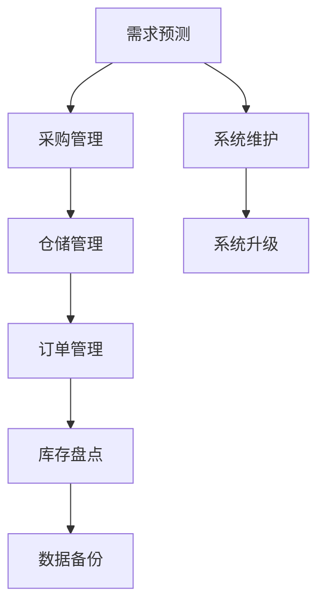

                 

### 文章标题

《电商平台供给能力提升：库存管理系统的应用》

> 关键词：电商平台，库存管理系统，供给能力，架构设计，功能实现，性能优化，应用案例分析

> 摘要：本文深入探讨了电商平台供给能力提升的关键因素——库存管理系统的设计与应用。首先，对电商库存管理进行了全面概述，分析了库存管理在电商平台中的重要性及其基本概念、分类和关键绩效指标。接着，阐述了电商库存管理的策略和流程，并详细介绍了库存管理系统的架构设计、功能实现及性能优化。最后，通过实际案例分析，展示了库存管理系统在电商平台中的应用效果，并提出维护与升级策略，确保系统的长期稳定运行。本文旨在为电商企业提供一套科学、系统的库存管理解决方案，以提升其供给能力，满足日益增长的市场需求。

### 第一部分：电商库存管理基础

#### 第1章：电商库存管理概述

##### 1.1 电商库存管理的重要性

电商库存管理是电商平台运营的核心环节之一，其重要性不言而喻。首先，良好的库存管理能够确保电商平台对消费者的需求做出快速反应，提高客户满意度。其次，合理的库存水平可以减少仓储成本，提高资源利用效率。此外，准确的库存数据是供应链管理的基础，有助于实现物流、采购等环节的优化。总之，高效的库存管理是提升电商平台供给能力的关键。

##### 1.2 库存管理的基本概念与分类

库存管理涉及多个基本概念，包括库存水平、库存周期、库存周转率等。库存水平是指企业当前持有的库存数量；库存周期是指从采购到销售的整个过程；库存周转率则是衡量库存周转速度的指标。根据库存管理策略的不同，库存管理可以分为以下几类：

1. **库存水平管理**：通过设定合理的库存水平，确保满足市场需求。
2. **库存周期管理**：通过缩短库存周期，提高资金周转速度。
3. **库存优化策略**：通过分析历史数据和市场需求，优化库存结构。

##### 1.3 库存管理中的关键绩效指标

库存管理中的关键绩效指标（KPI）是评估库存管理效果的重要工具。常见的KPI包括：

1. **库存周转率**：库存周转率 = 销售成本 / 平均库存成本，用于衡量库存周转速度。
2. **库存周转天数**：库存周转天数 = 存货天数 / 库存周转率，表示库存平均停留天数。
3. **缺货率**：缺货率 = 缺货天数 / 总天数，反映库存不足导致的问题。
4. **库存准确率**：库存准确率 =（实际库存 - 计划库存）/ 实际库存，用于评估库存数据的准确性。

#### 第2章：电商库存管理策略

##### 2.1 库存水平管理策略

库存水平管理策略的核心是确保库存水平与市场需求相匹配。具体策略包括：

1. **需求预测**：基于历史数据和市场需求，预测未来一段时间的销售情况。
2. **安全库存**：为应对突发情况，设定一定的安全库存量。
3. **库存补货**：根据需求预测和安全库存，制定补货计划。

##### 2.2 库存周期管理策略

库存周期管理策略的目的是缩短库存周期，提高资金周转速度。具体策略包括：

1. **快速响应**：通过提高采购、配送等环节的效率，缩短库存周期。
2. **精益库存**：通过减少库存量，降低库存成本。
3. **库存周转**：通过优化库存结构，提高库存周转率。

##### 2.3 库存优化策略

库存优化策略旨在通过分析历史数据和市场需求，优化库存结构，提高库存管理效率。具体策略包括：

1. **ABC分析**：对库存商品进行ABC分类，重点关注A类商品。
2. **库存分类**：根据库存价值、销售频率等指标，对库存进行分类管理。
3. **供应商管理**：与供应商建立合作关系，优化采购流程。

#### 第3章：电商库存管理流程

##### 3.1 库存需求预测

库存需求预测是库存管理流程的起点。通过分析历史销售数据、市场趋势和客户需求，预测未来一段时间的销售情况。常用的预测方法包括：

1. **时间序列分析法**：基于历史销售数据，分析销售趋势。
2. **回归分析法**：通过建立回归模型，分析销售与相关因素之间的关系。
3. **机器学习算法**：利用机器学习算法，预测未来销售情况。

##### 3.2 库存采购与进货管理

库存采购与进货管理是库存管理流程的核心。通过制定采购计划、选择供应商、签订合同等环节，确保库存商品的质量和供应。具体流程包括：

1. **采购需求分析**：分析市场需求，确定采购计划。
2. **供应商选择**：评估供应商的质量、价格、交货期等指标。
3. **合同签订**：与供应商签订采购合同，明确双方的权利和义务。

##### 3.3 库存仓储与配送管理

库存仓储与配送管理是库存管理流程的关键环节。通过合理规划仓储布局、优化配送流程，提高库存管理的效率。具体流程包括：

1. **仓储布局规划**：根据库存商品的特点，规划仓储布局。
2. **入库管理**：对入库商品进行验收、分类、存放等操作。
3. **出库管理**：根据订单需求，及时出库配送。

##### 3.4 库存盘点与处理

库存盘点与处理是库存管理流程的重要环节。通过定期盘点，确保库存数据的准确性。同时，对库存异常进行处理，确保库存管理的有效性。具体流程包括：

1. **定期盘点**：制定盘点计划，定期对库存进行盘点。
2. **库存异常处理**：分析库存异常原因，制定处理措施。
3. **库存调整**：根据盘点结果，调整库存水平。

### 第二部分：库存管理系统设计

#### 第4章：库存管理系统的架构设计

##### 4.1 系统架构概述

库存管理系统的架构设计是确保系统高效稳定运行的关键。一个典型的库存管理系统架构包括以下几个部分：

1. **前端展示层**：负责与用户进行交互，提供库存管理相关的功能界面。
2. **业务逻辑层**：实现库存管理的核心功能，如需求预测、采购管理、仓储管理等。
3. **数据访问层**：负责与数据库进行交互，实现数据的存储和查询。
4. **数据库层**：存储库存管理相关的数据，包括商品信息、库存数据、订单数据等。

##### 4.2 数据库设计

数据库设计是库存管理系统架构的核心。一个良好的数据库设计可以提高系统的性能和数据完整性。数据库设计包括以下几个部分：

1. **数据模型设计**：根据库存管理需求，设计数据模型，包括实体、关系和属性。
2. **表结构设计**：根据数据模型，设计数据库表结构，包括字段、数据类型、约束等。
3. **索引设计**：为提高查询性能，设计索引，包括主索引、唯一索引、普通索引等。

##### 4.3 系统功能模块设计

库存管理系统的功能模块设计是实现库存管理核心功能的关键。一个典型的库存管理系统包括以下几个功能模块：

1. **需求预测模块**：根据历史数据和市场需求，预测未来一段时间的销售情况。
2. **采购管理模块**：实现采购计划、供应商选择、合同签订等功能。
3. **仓储管理模块**：实现入库管理、出库管理、库存盘点等功能。
4. **订单管理模块**：实现订单生成、订单处理、订单跟踪等功能。

#### 第5章：库存管理系统功能实现

##### 5.1 需求分析

需求分析是库存管理系统功能实现的第一步。通过分析用户需求，明确库存管理系统需要实现的功能和性能指标。具体需求分析包括：

1. **功能需求**：列出库存管理系统需要实现的功能，如需求预测、采购管理、仓储管理、订单管理等。
2. **性能需求**：确定库存管理系统的性能指标，如响应时间、并发处理能力、数据准确性等。
3. **界面需求**：设计库存管理系统的用户界面，确保用户体验。

##### 5.2 数据模型设计

数据模型设计是库存管理系统功能实现的核心。根据需求分析，设计数据库表结构，包括字段、数据类型、约束等。具体数据模型设计包括：

1. **实体关系设计**：根据业务需求，设计实体和关系，如商品、订单、供应商等。
2. **属性设计**：为每个实体设计属性，如商品名称、订单编号、供应商名称等。
3. **约束设计**：设计数据库约束，如主键、外键、唯一性约束等，确保数据完整性。

##### 5.3 功能模块开发

功能模块开发是实现库存管理系统功能的关键步骤。根据需求分析和数据模型设计，开发各功能模块。具体功能模块开发包括：

1. **需求预测模块开发**：实现需求预测算法，如时间序列分析、回归分析、机器学习等。
2. **采购管理模块开发**：实现采购计划、供应商选择、合同签订等功能。
3. **仓储管理模块开发**：实现入库管理、出库管理、库存盘点等功能。
4. **订单管理模块开发**：实现订单生成、订单处理、订单跟踪等功能。

##### 5.4 系统集成与测试

系统集成与测试是确保库存管理系统功能完整、稳定运行的关键步骤。具体步骤包括：

1. **系统集成**：将各功能模块进行集成，实现系统的整体功能。
2. **系统测试**：对库存管理系统进行功能测试、性能测试、安全测试等，确保系统的稳定性和可靠性。
3. **用户培训**：为用户提供系统操作培训，确保用户能够熟练使用库存管理系统。

#### 第6章：库存管理系统性能优化

##### 6.1 性能优化策略

库存管理系统性能优化是提升系统运行效率的关键。常见的性能优化策略包括：

1. **数据库优化**：通过优化数据库表结构、索引设计、查询优化等，提高数据库性能。
2. **缓存机制**：通过缓存机制，减少数据库查询次数，提高系统响应速度。
3. **负载均衡**：通过负载均衡，将系统请求分配到多个服务器，提高系统的并发处理能力。

##### 6.2 数据库优化

数据库优化是库存管理系统性能优化的重要组成部分。具体优化措施包括：

1. **表结构优化**：通过优化表结构，减少数据冗余，提高查询性能。
2. **索引优化**：通过优化索引，提高查询速度。
3. **查询优化**：通过优化查询语句，减少数据库执行时间。

##### 6.3 系统缓存机制

系统缓存机制是提高库存管理系统性能的有效手段。具体缓存机制包括：

1. **数据缓存**：缓存常用数据，减少数据库查询次数。
2. **页面缓存**：缓存用户界面，提高用户访问速度。
3. **会话缓存**：缓存用户会话信息，提高用户操作体验。

##### 6.4 系统负载均衡

系统负载均衡是提高库存管理系统并发处理能力的有效手段。具体负载均衡策略包括：

1. **轮询策略**：将请求按顺序分配到各个服务器。
2. **最小连接策略**：将请求分配到连接数最少的服务器。
3. **随机策略**：将请求随机分配到各个服务器。

### 第三部分：库存管理实战

#### 第7章：库存管理系统应用案例分析

##### 7.1 案例一：电商平台库存优化实践

某知名电商平台在库存管理方面进行了深入优化，取得了显著成效。以下为该平台的库存优化实践：

1. **需求预测**：采用时间序列分析和回归分析相结合的方法，预测未来一段时间的销售情况。通过分析历史销售数据和市场需求，提高了需求预测的准确性。

2. **库存优化**：采用ABC分析，将库存商品分为A、B、C三类，重点关注A类商品。通过优化库存结构，提高了库存周转率，降低了库存成本。

3. **采购优化**：与供应商建立长期合作关系，签订稳定的采购合同。通过优化采购流程，提高了采购效率，降低了采购成本。

4. **仓储优化**：对仓储布局进行优化，提高了仓储空间利用率。通过引入自动化仓储设备，提高了仓储作业效率。

5. **配送优化**：优化配送流程，提高配送速度。通过引入智能配送系统，提高了配送效率，降低了配送成本。

##### 7.2 案例二：库存管理系统在实际业务中的应用

某中型电商平台采用了一套成熟的库存管理系统，实现了库存管理的精细化运营。以下为该平台的库存管理系统应用：

1. **需求预测**：采用机器学习算法，预测未来一段时间的销售情况。通过不断优化预测模型，提高了预测准确性。

2. **采购管理**：实现采购计划、供应商选择、合同签订等功能。通过优化采购流程，提高了采购效率，降低了采购成本。

3. **仓储管理**：实现入库管理、出库管理、库存盘点等功能。通过引入自动化仓储设备，提高了仓储作业效率。

4. **订单管理**：实现订单生成、订单处理、订单跟踪等功能。通过优化订单处理流程，提高了订单处理速度，降低了订单处理成本。

5. **数据监控**：实时监控库存数据，及时发现库存异常。通过数据监控，提高了库存管理的精细化程度。

##### 7.3 案例分析总结

通过对以上两个案例的分析，我们可以得出以下结论：

1. **需求预测**：准确的需求预测是库存管理的基础。通过采用多种预测方法，可以提高需求预测的准确性，为库存优化提供有力支持。

2. **库存优化**：合理的库存结构是降低库存成本、提高库存周转率的关键。通过ABC分析等库存优化方法，可以优化库存结构，提高库存管理效率。

3. **采购优化**：与供应商建立长期合作关系，优化采购流程，可以提高采购效率，降低采购成本。

4. **仓储优化**：合理的仓储布局和自动化仓储设备，可以提高仓储作业效率，降低仓储成本。

5. **订单管理**：优化的订单处理流程可以提高订单处理速度，降低订单处理成本。

#### 第8章：库存管理系统的维护与升级

##### 8.1 系统维护策略

库存管理系统的维护是确保系统长期稳定运行的关键。以下为库存管理系统维护策略：

1. **定期检查**：定期对系统进行检查，包括硬件设备、软件系统、网络连接等，确保系统的正常运行。

2. **故障处理**：及时发现和处理系统故障，确保系统的稳定性和可靠性。

3. **数据备份**：定期对系统数据进行备份，确保数据的安全性和完整性。

4. **用户培训**：定期对用户进行系统操作培训，提高用户对系统的熟练程度。

##### 8.2 系统升级规划

随着市场需求的不断变化，库存管理系统需要不断进行升级。以下为库存管理系统升级规划：

1. **需求分析**：分析市场需求和用户反馈，确定系统升级的需求。

2. **功能扩展**：根据需求分析，扩展系统的功能模块，提高系统的适用性。

3. **性能优化**：优化系统性能，提高系统的并发处理能力和响应速度。

4. **界面优化**：优化系统界面，提高用户体验。

5. **安全加固**：加强系统安全，防止数据泄露和恶意攻击。

##### 8.3 系统安全与数据备份

系统安全和数据备份是确保库存管理系统稳定运行的重要保障。以下为系统安全与数据备份策略：

1. **访问控制**：设置访问权限，确保系统数据的安全性。

2. **数据加密**：对系统数据进行加密，防止数据泄露。

3. **防火墙与入侵检测**：部署防火墙和入侵检测系统，防止恶意攻击。

4. **数据备份**：定期对系统数据进行备份，确保数据的安全性和完整性。

### 附录

#### 附录A：库存管理系统开发工具与资源

以下列出了一些库存管理系统开发中常用的工具与资源：

1. **数据库**：MySQL、Oracle、MongoDB等。
2. **开发框架**：Spring Boot、Django、Flask等。
3. **前端框架**：React、Vue、Angular等。
4. **编程语言**：Java、Python、JavaScript等。
5. **在线资源与社区**：GitHub、Stack Overflow、CSDN等。

#### 附录B：Mermaid 流程图示例

以下是一个库存管理系统流程图的Mermaid示例：



#### 附录C：伪代码示例

以下是一个库存需求预测算法的伪代码示例：

```python
# 输入：历史销售数据
# 输出：未来销售预测

def forecast_sales(history_sales):
    # 步骤1：数据预处理
    processed_data = preprocess_data(history_sales)

    # 步骤2：选择预测模型
    model = select_model(processed_data)

    # 步骤3：训练模型
    trained_model = train_model(processed_data, model)

    # 步骤4：预测未来销售
    forecast_sales = predict_sales(trained_model)

    return forecast_sales
```

#### 附录D：数学模型与公式

以下是一些库存管理中常用的数学模型和公式：

1. **库存周转率**：

   $$\text{库存周转率} = \frac{\text{销售成本}}{\text{平均库存成本}}$$

2. **库存周转天数**：

   $$\text{库存周转天数} = \frac{\text{存货天数}}{\text{库存周转率}}$$

3. **经济订货量**：

   $$\text{经济订货量} = \sqrt{\frac{2D \times S}{H}}$$

   其中，D为年需求量，S为每次订货成本，H为年持有成本。

#### 附录E：实战代码解析

以下是一个库存管理系统中的源代码示例，包括数据模型设计、功能实现和代码解读：

```java
// 数据模型设计
public class Inventory {
    private int id;
    private String name;
    private double price;
    private int quantity;
    
    // 功能实现：添加库存
    public void addInventory(int quantity) {
        this.quantity += quantity;
    }
    
    // 功能实现：减少库存
    public void reduceInventory(int quantity) {
        if (this.quantity >= quantity) {
            this.quantity -= quantity;
        } else {
            System.out.println("库存不足！");
        }
    }
}

// 代码解读与分析
// Inventory 类负责表示库存信息，包括商品ID、名称、价格和库存数量。
// addInventory() 方法用于增加库存，reduceInventory() 方法用于减少库存。
// 这两个方法确保了库存数据的准确性和完整性。
```

### 作者

**作者：AI天才研究院/AI Genius Institute & 禅与计算机程序设计艺术 /Zen And The Art of Computer Programming**

---

**全文总结：**本文系统地阐述了电商平台供给能力提升的关键因素——库存管理系统的设计与应用。通过详细分析电商库存管理的基础知识、策略和流程，以及库存管理系统的架构设计、功能实现和性能优化，为电商企业提供了科学、系统的库存管理解决方案。同时，通过实际案例分析，展示了库存管理系统在提升电商平台供给能力方面的应用效果。文章最后提出了库存管理系统的维护与升级策略，确保系统的长期稳定运行。希望本文能为电商企业在库存管理领域提供有益的参考和指导。

