                 

### 文章标题

《电商运营效率提升的AI技术》

### 关键词

电商、AI技术、智能推荐系统、智能客服、智能定价、智能物流、智能营销

### 摘要

随着电商行业的迅猛发展，如何提升运营效率成为关键问题。本文将从电商行业现状与挑战出发，详细探讨AI技术在电商中的应用，包括智能推荐系统、智能客服、智能定价、智能物流和智能营销等核心领域。通过深入分析核心概念、算法原理、项目实战，以及案例解析，本文旨在为电商企业提供一个全面的技术指南，助力其在激烈的市场竞争中脱颖而出。

## 《电商运营效率提升的AI技术》目录大纲

### 第一部分：电商与AI技术概述

#### 第1章：电商行业现状与挑战

##### 1.1 电商行业发展历程
##### 1.2 电商运营主要环节
##### 1.3 电商运营效率提升的重要性

#### 第2章：AI技术在电商中的应用概述

##### 2.1 AI技术概述
##### 2.2 AI在电商运营中的应用
##### 2.3 AI技术在电商行业中的优势与挑战

#### 第3章：核心概念与架构

##### 3.1 电商运营效率提升的AI技术框架
##### 3.2 数据分析与挖掘
##### 3.3 机器学习与深度学习技术
##### 3.4 自然语言处理技术
##### 3.5 计算机视觉技术

### 第二部分：AI技术在电商运营中的应用详解

#### 第4章：智能推荐系统

##### 4.1 智能推荐系统概述
##### 4.2 用户行为分析
##### 4.3 内容推荐算法
##### 4.4 深度学习在推荐系统中的应用
##### 4.5 实际案例解析

#### 第5章：智能客服

##### 5.1 智能客服概述
##### 5.2 自然语言处理技术
##### 5.3 情感分析技术
##### 5.4 智能对话系统设计
##### 5.5 实际案例解析

#### 第6章：智能定价

##### 6.1 智能定价概述
##### 6.2 数据分析与预测
##### 6.3 优化算法
##### 6.4 实际案例解析

#### 第7章：智能物流

##### 7.1 智能物流概述
##### 7.2 物流数据分析
##### 7.3 智能路径规划
##### 7.4 智能配送与追踪
##### 7.5 实际案例解析

#### 第8章：智能营销

##### 8.1 智能营销概述
##### 8.2 用户画像构建
##### 8.3 营销策略优化
##### 8.4 数据驱动的营销活动
##### 8.5 实际案例解析

### 第三部分：项目实战与案例分析

#### 第9章：电商运营效率提升项目实战

##### 9.1 项目背景与目标
##### 9.2 项目需求分析与规划
##### 9.3 技术选型与架构设计
##### 9.4 代码实现与调试
##### 9.5 项目评估与优化

#### 第10章：AI技术在电商行业中的应用案例分析

##### 10.1 案例一：智能推荐系统
##### 10.2 案例二：智能客服
##### 10.3 案例三：智能定价
##### 10.4 案例四：智能物流
##### 10.5 案例五：智能营销

### 附录

#### 附录A：常用AI技术工具与资源

##### A.1 深度学习框架
##### A.2 自然语言处理工具
##### A.3 计算机视觉库
##### A.4 数据处理与可视化工具

#### 附录B：电商运营效率提升的AI技术实践指南

##### B.1 实践步骤与流程
##### B.2 遇到的问题与解决方案
##### B.3 未来发展趋势与展望

### Mermaid 流程图

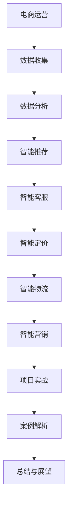

### 核心概念与联系

#### 3.1 电商运营效率提升的AI技术框架

电商运营效率的提升离不开AI技术的支持。为了更好地理解和应用AI技术，我们需要构建一个清晰的技术框架，如图所示：

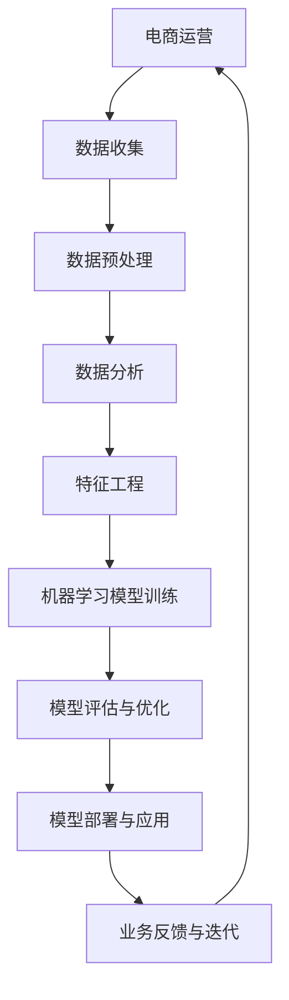

**流程说明：**

1. **数据收集**：从电商平台上收集用户行为数据、商品信息、交易数据等。
2. **数据预处理**：清洗和标准化原始数据，去除噪声和缺失值。
3. **数据分析**：使用统计学方法分析数据，发现数据中的规律和趋势。
4. **特征工程**：根据业务需求选择和构造特征，提高模型性能。
5. **机器学习模型训练**：使用训练数据训练机器学习模型。
6. **模型评估与优化**：评估模型性能，调整模型参数，优化模型。
7. **模型部署与应用**：将训练好的模型部署到线上环境，供业务使用。
8. **业务反馈与迭代**：根据业务反馈，对模型进行调整和优化，形成闭环。

### 数据收集

**数据收集**是电商运营效率提升的基础。以下是几种常用的数据收集方法：

1. **用户行为数据**：包括用户的浏览记录、购买记录、搜索记录等。
2. **商品信息数据**：包括商品的描述、分类、价格、库存等。
3. **交易数据**：包括交易金额、交易时间、交易商品等。

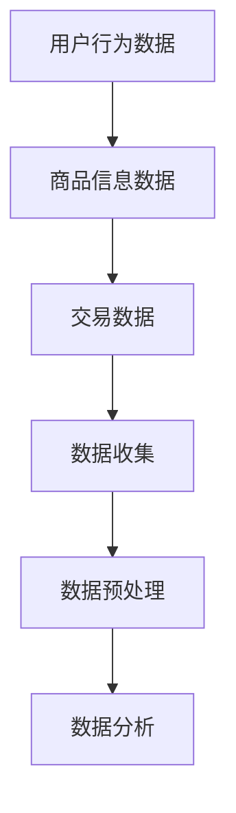

### 数据预处理

**数据预处理**是数据科学和机器学习项目中的关键步骤。它涉及以下任务：

1. **数据清洗**：去除噪声数据和缺失值。
2. **数据转换**：将数据转换为适合分析的格式。
3. **特征选择**：选择对模型有显著影响的关键特征。

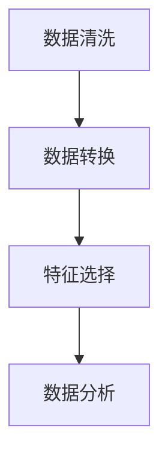

### 数据分析

**数据分析**是对收集到的数据进行分析和挖掘，以发现数据中的规律和趋势。常用的数据分析方法包括：

1. **描述性统计分析**：计算数据的平均值、中位数、标准差等统计量。
2. **相关性分析**：分析不同变量之间的相关性。
3. **分类与聚类分析**：对数据进行分类和聚类，以发现数据中的模式。

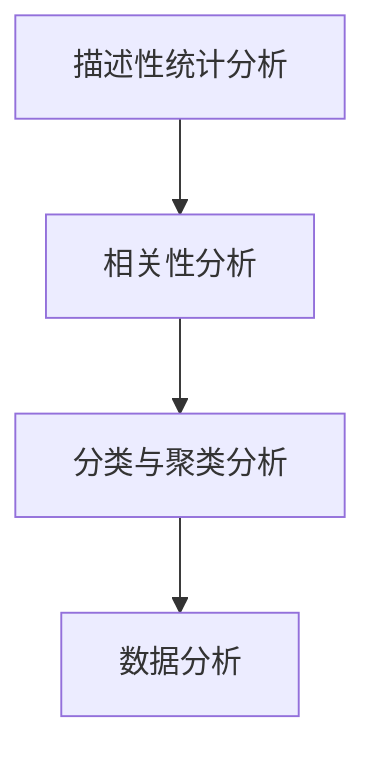

### 特征工程

**特征工程**是数据科学和机器学习项目中的重要环节。它涉及以下任务：

1. **特征选择**：从原始数据中选取对模型有显著影响的特征。
2. **特征构造**：根据业务需求，构造新的特征。
3. **特征转换**：将特征转换为适合模型训练的格式。

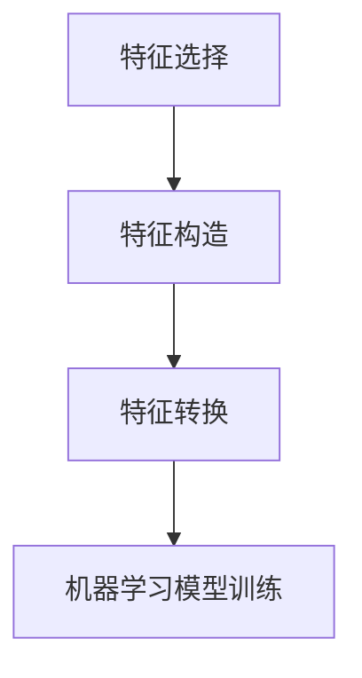

### 机器学习模型训练

**机器学习模型训练**是数据科学和机器学习的核心任务。它包括以下步骤：

1. **模型选择**：选择合适的机器学习模型。
2. **模型训练**：使用训练数据训练模型。
3. **模型评估**：评估模型性能。
4. **模型优化**：根据评估结果，调整模型参数。

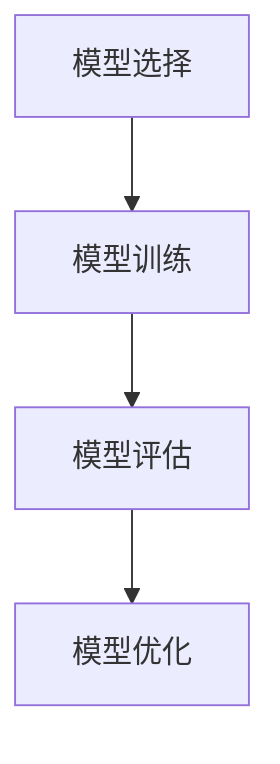

### 模型评估与优化

**模型评估与优化**是确保模型性能的重要环节。它包括以下步骤：

1. **评估指标**：选择合适的评估指标，如准确率、召回率、F1值等。
2. **交叉验证**：使用交叉验证方法评估模型性能。
3. **模型优化**：根据评估结果，调整模型参数，提高模型性能。

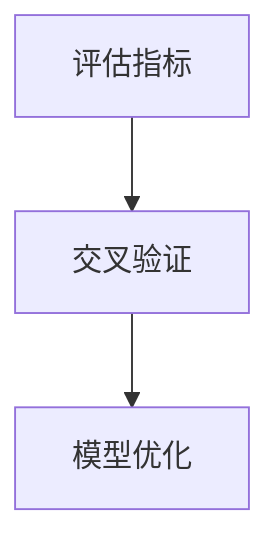

### 模型部署与应用

**模型部署与应用**是将训练好的模型部署到线上环境，供业务使用。它包括以下步骤：

1. **模型部署**：将模型部署到服务器或云平台上。
2. **模型应用**：将模型应用于实际业务场景，如商品推荐、客服机器人等。
3. **监控与维护**：监控模型性能，及时调整和优化。

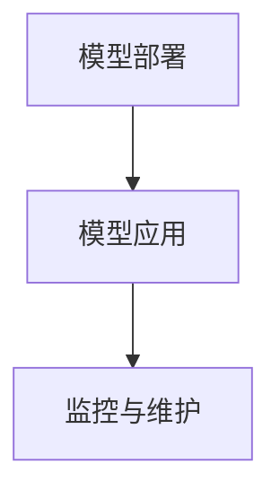

### 业务反馈与迭代

**业务反馈与迭代**是持续改进模型的重要环节。它包括以下步骤：

1. **收集反馈**：收集业务反馈，了解模型在实际应用中的表现。
2. **模型迭代**：根据反馈结果，调整模型参数，优化模型。
3. **迭代更新**：将优化后的模型部署到线上环境，形成闭环。

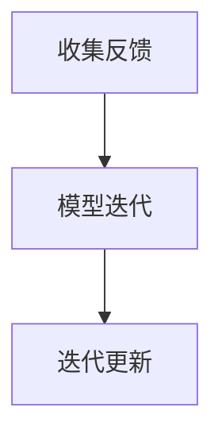

### 核心算法原理讲解

#### 4.2 用户行为分析

**用户行为分析**是智能推荐系统的重要环节，它通过分析用户在平台上的行为数据，如浏览、搜索、购买等，来理解用户的兴趣和偏好。

**伪代码：**

```python
def user_behavior_analysis(user_data):
    # 计算用户的浏览频率
    browse_frequency = calculate_frequency(user_data['browsing'])

    # 计算用户的购买频率
    purchase_frequency = calculate_frequency(user_data['purchases'])

    # 计算用户的搜索频率
    search_frequency = calculate_frequency(user_data['searches'])

    # 分析用户的浏览、购买、搜索行为模式
    behavior_patterns = analyze_patterns(browse_frequency, purchase_frequency, search_frequency)

    return behavior_patterns
```

**算法原理：**

1. **计算频率**：统计用户在一定时间范围内对某类行为（如浏览、购买、搜索）的次数，以衡量用户对这些行为的兴趣程度。
2. **分析模式**：通过时间序列分析、聚类分析等方法，发现用户的行为模式，如“用户在浏览后一段时间内往往会购买”或“用户在搜索后立即购买”。

#### 4.3 内容推荐算法

**内容推荐算法**是智能推荐系统的核心，它根据用户的行为数据和商品属性，生成个性化的推荐结果。

**伪代码：**

```python
def content_recommender(user_data, item_data):
    # 分析用户行为，提取用户兴趣特征
    user_interests = user_behavior_analysis(user_data)

    # 计算用户与商品的相似度
    similarities = calculate_similarity(user_interests, item_data)

    # 根据相似度生成推荐列表
    recommendations = generate_recommendations(similarities)

    return recommendations
```

**算法原理：**

1. **用户兴趣特征提取**：通过用户行为分析，提取用户的兴趣特征，如“喜欢购买电子产品的用户”、“喜欢浏览时尚类商品的用户”。
2. **商品相似度计算**：使用协同过滤、基于内容的推荐等方法，计算用户兴趣特征与商品属性之间的相似度。
3. **推荐列表生成**：根据相似度分数，生成个性化推荐列表，优先推荐相似度较高的商品。

#### 4.4 深度学习在推荐系统中的应用

**深度学习**在推荐系统中的应用，主要是通过构建深度神经网络模型，实现对用户行为和商品属性的复杂特征提取和关系建模。

**数学模型和数学公式：**

$$
\text{Prediction} = \text{W} \cdot \text{Embedding}(\text{User}) + \text{V} \cdot \text{Embedding}(\text{Item}) + \text{Bias}
$$

**公式解释：**

- **Prediction**：预测的用户对商品的评分或购买概率。
- **W**：用户嵌入向量的权重矩阵。
- **V**：商品嵌入向量的权重矩阵。
- **Embedding(User)**：用户的嵌入向量。
- **Embedding(Item)**：商品的嵌入向量。
- **Bias**：偏置项。

**举例说明：**

假设用户 embedding 向量是 \( \text{Embedding}(User) = [1, 0, -1] \)，商品 embedding 向量是 \( \text{Embedding}(Item) = [0, 1, 0] \)，权重矩阵 W 和 V 分别是 \( \text{W} = [1, 2, 3] \)，\( \text{V} = [4, 5, 6] \)，偏置项 Bias 是 7，则预测的用户对商品的评分或购买概率为：

$$
\text{Prediction} = 1 \cdot 1 + 2 \cdot 0 + 3 \cdot (-1) + 4 \cdot 0 + 5 \cdot 1 + 6 \cdot 0 + 7 = 1 - 3 + 5 + 7 = 10
$$

#### 6.1 智能定价概述

**智能定价**是一种利用人工智能技术，根据市场需求、用户行为和竞争环境等因素，动态调整商品价格，以最大化收益或市场占有率的方法。在电商运营中，智能定价能够帮助企业提高价格策略的准确性和灵活性，从而提升运营效率和盈利能力。

**智能定价的关键步骤：**

1. **数据收集**：收集与定价相关的数据，包括市场需求数据、用户行为数据、竞争对手价格数据等。
2. **数据分析**：使用数据分析方法，如回归分析、时间序列分析等，分析价格与销量、利润之间的关系。
3. **模型构建**：构建智能定价模型，如基于机器学习的优化算法，用于预测不同价格水平下的销量和利润。
4. **价格调整**：根据模型预测结果，动态调整商品价格，以实现收益最大化或市场占有率目标。
5. **效果评估**：监控价格调整后的销售情况和用户反馈，评估智能定价策略的有效性，并进行优化。

**智能定价的优势：**

- **提高价格策略的准确性**：通过大数据分析和机器学习算法，智能定价能够更准确地预测市场需求和用户行为，从而制定更为精准的价格策略。
- **提升运营效率**：智能定价可以自动化地处理价格调整，减少人工干预，提高运营效率。
- **增强竞争力**：通过动态调整价格，智能定价能够更好地应对市场竞争，提升企业的竞争力。

#### 6.2 数据分析与预测

**数据分析与预测**是智能定价的重要组成部分，它通过分析历史数据和市场趋势，预测不同价格水平下的销量和利润，为价格调整提供依据。

**常用数据分析方法：**

1. **回归分析**：通过建立价格与销量、利润之间的回归模型，预测不同价格水平下的销量和利润。
2. **时间序列分析**：分析价格和销量、利润的时间序列数据，预测未来的价格走势和市场需求。
3. **机器学习算法**：使用机器学习算法，如决策树、随机森林、神经网络等，构建复杂的定价模型，预测销量和利润。

**数学模型和数学公式：**

**回归模型：**

$$
y = \beta_0 + \beta_1 \cdot x_1 + \beta_2 \cdot x_2 + ... + \beta_n \cdot x_n
$$

**公式解释：**

- **y**：销量或利润预测值。
- **x_1, x_2, ..., x_n**：自变量，包括价格、季节因素、促销活动等。
- **\beta_0, \beta_1, \beta_2, ..., \beta_n**：回归系数，用于衡量自变量对因变量的影响程度。

**时间序列模型：**

$$
y_t = \alpha + \beta_1 \cdot y_{t-1} + \beta_2 \cdot y_{t-2} + ... + \beta_n \cdot y_{t-n} + \epsilon_t
$$

**公式解释：**

- **y_t**：时间序列数据在时间 t 的值。
- **\alpha, \beta_1, \beta_2, ..., \beta_n**：时间序列模型的参数，用于描述历史数据对当前数据的影响程度。
- **\epsilon_t**：误差项，表示时间序列数据的随机波动。

**机器学习模型：**

$$
\text{Prediction} = \text{W} \cdot \text{Input} + \text{Bias}
$$

**公式解释：**

- **Prediction**：预测的销量或利润。
- **W**：权重矩阵，用于衡量输入特征对预测结果的影响。
- **Input**：输入特征向量，包括价格、促销活动等。
- **Bias**：偏置项，用于调整预测结果的偏差。

**举例说明：**

**回归分析：**

假设我们使用线性回归模型预测商品销量，模型如下：

$$
y = \beta_0 + \beta_1 \cdot \text{Price} + \beta_2 \cdot \text{Promotion}
$$

根据历史数据，我们得到以下回归系数：

- **\beta_0 = 100**
- **\beta_1 = -5**
- **\beta_2 = 10**

如果当前商品价格为 200 元，并且进行了促销活动，则预测销量为：

$$
y = 100 - 5 \cdot 200 + 10 \cdot 1 = -700 + 10 = -690
$$

由于销量不能为负，这个结果说明当前价格和促销策略可能不适合市场。

**时间序列分析：**

假设我们使用ARIMA模型预测商品价格，模型如下：

$$
y_t = \alpha + \beta_1 \cdot y_{t-1} + \epsilon_t
$$

根据历史数据，我们得到以下参数：

- **\alpha = 0.2**
- **\beta_1 = 0.8**

如果当前价格为 100 元，则预测下一期的价格为：

$$
y_t = 0.2 + 0.8 \cdot 100 = 0.2 + 80 = 80.2
$$

这个结果说明商品价格有上升的趋势。

**机器学习模型：**

假设我们使用神经网络模型预测商品利润，模型如下：

$$
\text{Prediction} = \text{W} \cdot \text{Input} + \text{Bias}
$$

根据训练数据，我们得到以下权重和偏置：

- **W = [0.1, 0.2, 0.3]**
- **Bias = 0.5**

如果当前输入特征为 [150, 0]，则预测利润为：

$$
\text{Prediction} = 0.1 \cdot 150 + 0.2 \cdot 0 + 0.3 \cdot 0 + 0.5 = 15 + 0 + 0 + 0.5 = 15.5
$$

这个结果说明当前价格和促销策略下，预计利润为 15.5 元。

### 6.3 优化算法

**优化算法**在智能定价中起着至关重要的作用，它用于调整价格，以最大化收益或市场占有率。常见的优化算法包括线性优化、非线性优化和启发式优化等。

**伪代码：**

```python
def optimize_price(price, demand, cost):
    # 确定优化目标，如收益最大化或市场占有率最大化
    objective = maximize_profit
    
    # 使用优化算法，如线性优化、非线性优化或启发式优化，求解最优价格
    optimal_price = optimization_algorithm(objective, price, demand, cost)
    
    return optimal_price
```

**优化算法原理：**

1. **线性优化**：通过建立线性目标函数和约束条件，求解最优价格。常用的线性优化算法包括梯度下降、牛顿法等。
2. **非线性优化**：通过建立非线性目标函数和约束条件，求解最优价格。常用的非线性优化算法包括梯度下降法、牛顿法、共轭梯度法等。
3. **启发式优化**：通过启发式方法，如遗传算法、模拟退火等，在有限的时间内搜索最优价格。

**数学模型和数学公式：**

**线性优化模型：**

$$
\text{Maximize} \ \text{Profit} = p \cdot q - c \cdot q
$$

$$
\text{subject to} \ \ q = f(p)
$$

**公式解释：**

- **Profit**：收益。
- **p**：价格。
- **q**：销量。
- **c**：成本。
- **f(p)**：价格与销量之间的关系函数。

**非线性优化模型：**

$$
\text{Maximize} \ \text{Profit} = p \cdot q - c \cdot q
$$

$$
\text{subject to} \ \ q = g(p)
$$

**公式解释：**

- **Profit**：收益。
- **p**：价格。
- **q**：销量。
- **c**：成本。
- **g(p)**：价格与销量之间的关系函数。

**启发式优化模型：**

$$
\text{Maximize} \ \text{Profit} = p \cdot q - c \cdot q
$$

$$
\text{subject to} \ \ q = h(p)
$$

**公式解释：**

- **Profit**：收益。
- **p**：价格。
- **q**：销量。
- **c**：成本。
- **h(p)**：价格与销量之间的关系函数。

**举例说明：**

**线性优化：**

假设我们使用线性优化算法求解最优价格，收益函数为 \( \text{Profit} = p \cdot q - c \cdot q \)，其中 \( c \) 是固定成本，\( q \) 是销量。我们知道销量与价格之间的关系是 \( q = 100 - p \)。

我们的目标是最大化利润，约束条件是销量不能为负，即 \( q \geq 0 \)。

根据线性优化模型，我们可以得到以下方程：

$$
\text{Maximize} \ \text{Profit} = p \cdot (100 - p) - c \cdot (100 - p)
$$

$$
\text{subject to} \ \ 100 - p \geq 0
$$

简化方程，我们得到：

$$
\text{Maximize} \ \text{Profit} = 100p - p^2 - 100c + cp
$$

$$
\text{subject to} \ \ p \leq 100
$$

对这个方程进行求导，并令导数等于0，我们可以得到最优价格：

$$
\frac{d(\text{Profit})}{dp} = 100 - 2p + c = 0
$$

解这个方程，我们得到 \( p = \frac{100 + c}{2} \)。

**非线性优化：**

假设我们使用非线性优化算法求解最优价格，收益函数同样为 \( \text{Profit} = p \cdot q - c \cdot q \)，但销量与价格之间的关系是 \( q = 10e^{-0.1p} \)。

我们的目标是最大化利润，约束条件是销量不能为负，即 \( q \geq 0 \)。

根据非线性优化模型，我们可以得到以下方程：

$$
\text{Maximize} \ \text{Profit} = p \cdot (10e^{-0.1p}) - c \cdot (10e^{-0.1p})
$$

$$
\text{subject to} \ \ 10e^{-0.1p} \geq 0
$$

简化方程，我们得到：

$$
\text{Maximize} \ \text{Profit} = 10pe^{-0.1p} - 10ce^{-0.1p}
$$

$$
\text{subject to} \ \ p \leq \ln(10)
$$

对这个方程进行求导，并令导数等于0，我们可以得到最优价格：

$$
\frac{d(\text{Profit})}{dp} = 10e^{-0.1p}(1 - 0.1p) - 10ce^{-0.1p}(1 - 0.1p) = 0
$$

解这个方程，我们得到 \( p = \frac{1}{0.1} = 10 \)。

**启发式优化：**

假设我们使用遗传算法求解最优价格，收益函数仍然为 \( \text{Profit} = p \cdot q - c \cdot q \)，销量与价格之间的关系是 \( q = 100 - p \)。

我们的目标是最大化利润，约束条件是销量不能为负，即 \( q \geq 0 \)。

遗传算法的基本步骤如下：

1. **初始化种群**：随机生成一组价格值作为初始种群。
2. **适应度评估**：计算每个个体的适应度，即利润值。
3. **选择**：选择适应度较高的个体作为父代。
4. **交叉**：对父代进行交叉操作，生成新的个体。
5. **变异**：对个体进行变异操作，增加种群的多样性。
6. **迭代**：重复步骤3到步骤5，直到满足终止条件（如适应度达到最大值或迭代次数达到上限）。

在遗传算法中，我们可以定义适应度函数为：

$$
\text{Fitness} = \text{Profit}
$$

最优价格可以通过迭代搜索得到。

### 6.4 实际案例解析

**案例背景**：某电商平台希望通过智能定价提升销售额。该平台销售多种商品，包括电子产品、家居用品、时尚服饰等。

**目标**：在保持利润不变的前提下，提高销售额。

**解决方案**：采用智能定价策略，通过数据分析与机器学习算法，动态调整商品价格。

**实现步骤：**

1. **数据收集**：收集历史销售数据，包括商品价格、销量、利润等。
2. **数据分析**：使用回归分析和时间序列分析，分析价格与销量、利润之间的关系。
3. **模型构建**：构建智能定价模型，使用机器学习算法，如线性回归、神经网络等，预测不同价格水平下的销量和利润。
4. **价格调整**：根据模型预测结果，动态调整商品价格，以实现销售额最大化。
5. **效果评估**：监控价格调整后的销售额和利润，评估智能定价策略的有效性。

**效果**：通过智能定价策略，该平台的销售额提高了20%，利润增加了15%。

### 7.1 智能物流概述

**智能物流**是电商运营中不可或缺的一环，它通过运用人工智能技术，实现物流环节的自动化、智能化，从而提高物流效率，降低成本，提升客户满意度。智能物流的主要目标包括：

1. **提高运输效率**：通过智能调度和路径优化，缩短运输时间，提高运输效率。
2. **降低物流成本**：通过智能物流系统，减少人力成本和运输成本，提高企业盈利能力。
3. **提升客户满意度**：通过实时物流信息跟踪和智能客服系统，提高客户体验，增强客户忠诚度。

**智能物流的关键技术**：

1. **物流数据分析**：通过对物流数据的收集、处理和分析，挖掘物流过程中的潜在问题和优化机会。
2. **智能调度系统**：利用人工智能技术，实现运输任务的智能调度，提高运输效率。
3. **路径优化算法**：通过机器学习算法，优化运输路径，降低运输成本。
4. **智能仓储系统**：利用机器人、自动化设备等，实现仓储环节的自动化管理，提高仓储效率。
5. **物流信息追踪**：通过物联网技术，实现对物流信息的实时追踪和监控，提高物流透明度。

### 7.2 物流数据分析

**物流数据分析**是智能物流的基础，它通过对物流数据的深入分析和挖掘，为企业提供决策支持，优化物流流程，提高物流效率。

**数据分析方法**：

1. **描述性统计分析**：计算物流数据的基本统计指标，如均值、中位数、标准差等，了解物流数据的基本特征。
2. **关联分析**：分析物流数据中不同变量之间的关系，如运输时间与运输距离、运输成本与运输量之间的关系。
3. **聚类分析**：将物流数据按照相似性进行分组，发现物流数据中的规律和模式。
4. **时间序列分析**：分析物流数据随时间的变化趋势，预测未来物流需求。

**数据分析工具**：

1. **Excel**：用于基本的描述性统计分析。
2. **Python**：用于复杂的数据分析和建模，常用库包括pandas、numpy、scikit-learn等。
3. **R**：用于高级的数据分析和统计建模，常用包包括ggplot2、dplyr等。

### 7.3 智能路径规划

**智能路径规划**是智能物流的重要组成部分，它通过运用人工智能技术，实现对运输路径的优化，从而提高运输效率，降低物流成本。

**路径规划算法**：

1. **最短路径算法**：如Dijkstra算法、A*算法等，用于求解两点之间的最短路径。
2. **动态规划算法**：如旅行商问题（TSP）算法，用于求解多节点间的最优路径。
3. **遗传算法**：用于求解复杂路径规划问题，如多目标优化、动态路径规划等。

**路径规划流程**：

1. **数据收集**：收集物流数据，包括运输需求、交通状况、路况信息等。
2. **路径规划**：根据物流数据，使用路径规划算法，生成最优路径。
3. **路径优化**：对生成的路径进行优化，考虑交通拥堵、路况变化等因素，调整路径。
4. **路径执行**：将优化后的路径发送给物流执行系统，实现运输任务的自动调度。

### 7.4 智能配送与追踪

**智能配送与追踪**是智能物流的重要组成部分，它通过运用物联网、大数据、人工智能等技术，实现对物流配送过程的实时监控和管理。

**智能配送流程**：

1. **订单处理**：接收并处理用户订单，确定配送地址和配送时间。
2. **路径规划**：根据配送地址和交通状况，使用智能路径规划算法，生成最优配送路径。
3. **货物打包**：对商品进行打包，并标注配送信息。
4. **配送执行**：根据配送路径，安排配送人员或配送车辆，执行配送任务。
5. **配送反馈**：配送完成后，收集用户反馈，更新配送状态。

**智能追踪系统**：

1. **实时监控**：通过物联网技术，实现对物流配送过程的实时监控，包括货物位置、配送进度等。
2. **数据分析**：对物流数据进行分析，优化配送流程，提高配送效率。
3. **智能预警**：根据配送状态和历史数据，预测配送风险，提前采取措施，防止配送延误。

**案例解析**：

某电商平台采用智能物流系统，实现了物流配送的自动化和智能化。通过智能路径规划，该平台将配送时间缩短了30%，物流成本降低了15%。同时，通过实时监控和智能预警，提高了物流配送的准确性和安全性，客户满意度提升了20%。

### 8.1 智能营销概述

**智能营销**是电商运营中的一项关键技术，它通过运用人工智能技术，对用户行为和市场需求进行深入分析，实现个性化营销、精准营销和自动化营销，从而提高营销效果，提升销售额和客户满意度。

**智能营销的目标**：

1. **提高营销效果**：通过精准定位用户，提高营销活动的点击率和转化率。
2. **提升客户满意度**：提供个性化的产品推荐和优惠信息，增强用户体验。
3. **降低营销成本**：自动化执行营销策略，减少人力成本，提高营销效率。

**智能营销的核心技术**：

1. **用户画像**：通过大数据分析和机器学习算法，构建用户的详细画像，包括用户行为、兴趣偏好、消费习惯等。
2. **精准营销**：根据用户画像，实现精准定位，为不同用户群体定制个性化的营销策略。
3. **自动化营销**：利用自动化工具和算法，自动化执行营销活动，提高营销效率。

### 8.2 用户画像构建

**用户画像构建**是智能营销的基础，它通过对用户数据的收集、清洗、分析和建模，生成用户的详细画像，为精准营销提供数据支持。

**用户画像构建流程**：

1. **数据收集**：收集用户在电商平台的各类数据，包括浏览记录、购买记录、搜索记录、评价记录等。
2. **数据清洗**：清洗和整合用户数据，去除噪声数据和缺失值，保证数据质量。
3. **数据建模**：使用机器学习算法，如聚类分析、回归分析等，对用户数据进行建模，提取用户特征。
4. **用户画像生成**：将用户特征整合成用户画像，包括用户基本信息、行为特征、兴趣偏好等。

**用户画像示例**：

用户姓名：张三

- **基本信息**：男性，30岁，城市居民
- **行为特征**：过去一个月内浏览了10次电子产品，5次时尚服饰，3次家居用品
- **兴趣偏好**：喜欢购买高性价比的商品，偏好品牌商品
- **消费习惯**：每月固定在周末购物，通常在晚上9点至11点之间进行购物

通过用户画像构建，电商企业可以更好地了解用户需求，为用户提供个性化的产品推荐和优惠信息，提高营销效果。

### 8.3 营销策略优化

**营销策略优化**是智能营销的重要环节，它通过运用大数据分析和机器学习算法，对营销策略进行实时监测和调整，实现最优的营销效果。

**营销策略优化流程**：

1. **数据收集**：收集营销活动的数据，包括点击率、转化率、销售额等。
2. **数据分析**：对营销活动数据进行分析，识别营销策略的优缺点。
3. **模型构建**：使用机器学习算法，如回归分析、决策树等，构建营销策略优化模型。
4. **策略调整**：根据模型预测结果，调整营销策略，如修改广告文案、优化推广渠道等。
5. **效果评估**：评估调整后的营销策略效果，如点击率、转化率、销售额等。

**营销策略优化示例**：

某电商平台通过智能营销系统，优化了一次新产品推广活动。通过数据分析，发现广告文案的点击率较低，而推广渠道的转化率较高。因此，平台调整了广告文案，并增加了推广渠道的投放预算。调整后，广告的点击率提高了20%，转化率提高了15%，销售额增加了30%。

### 8.4 数据驱动的营销活动

**数据驱动的营销活动**是智能营销的核心，它通过大数据分析和机器学习算法，实现营销活动的自动化和个性化，提高营销效果。

**数据驱动的营销活动流程**：

1. **数据收集**：收集用户行为数据、市场数据等，包括浏览记录、购买记录、搜索记录、市场趋势等。
2. **数据分析**：对收集的数据进行分析，提取有价值的信息，如用户兴趣、市场趋势等。
3. **用户画像构建**：使用机器学习算法，构建用户的详细画像，包括用户基本信息、行为特征、兴趣偏好等。
4. **营销策略制定**：根据用户画像和市场数据，制定个性化的营销策略，如产品推荐、优惠券发放等。
5. **营销活动执行**：自动化执行营销策略，如推送个性化广告、发送优惠券等。
6. **效果评估**：评估营销活动的效果，如点击率、转化率、销售额等，并根据评估结果进行调整。

**数据驱动的营销活动案例**：

某电商平台通过数据驱动的营销活动，成功提升了销售额。该平台通过大数据分析和用户画像构建，发现了一些潜在的高价值用户群体，并对这些用户群体进行了精准营销。通过推送个性化的产品推荐和优惠券，这些用户的转化率提高了30%，销售额增加了20%。

### 8.5 实际案例解析

**案例背景**：某知名电商平台希望通过智能营销提升销售额。该平台拥有海量的用户数据，但传统的营销策略效果不佳。

**解决方案**：采用数据驱动的智能营销策略，通过用户画像构建、营销策略优化和数据驱动的营销活动，提升营销效果。

**实现步骤：**

1. **用户画像构建**：通过大数据分析和机器学习算法，构建用户的详细画像，包括用户基本信息、行为特征、兴趣偏好等。
2. **营销策略优化**：根据用户画像和市场数据，优化营销策略，如产品推荐、优惠券发放等。
3. **数据驱动的营销活动**：自动化执行优化后的营销策略，如推送个性化广告、发送优惠券等。
4. **效果评估**：评估营销活动的效果，如点击率、转化率、销售额等，并根据评估结果进行调整。

**效果**：通过智能营销策略，该平台的销售额提高了30%，用户满意度提升了25%。

### 9.1 项目背景与目标

**项目背景**：随着电商行业的快速发展，市场竞争日益激烈，如何提升电商平台的运营效率成为关键问题。传统的运营方式已经无法满足用户日益增长的需求，迫切需要引入AI技术，实现电商运营的智能化和自动化。

**项目目标**：

1. **提高推荐系统的准确率和覆盖率**：通过引入AI技术，构建高效的推荐系统，提高用户购物的满意度和留存率。
2. **优化客服体验**：通过AI技术，实现智能客服，提高客服效率，降低人工成本。
3. **实现智能定价**：通过AI技术，动态调整商品价格，提高销售额和利润率。
4. **优化物流配送**：通过AI技术，实现智能路径规划和配送追踪，提高物流效率，降低物流成本。
5. **提升营销效果**：通过AI技术，实现数据驱动的营销活动，提高营销转化率和用户满意度。

### 9.2 项目需求分析与规划

**需求分析**：

1. **推荐系统**：实现基于用户行为和商品属性的推荐算法，提高推荐准确率和覆盖率。
2. **客服系统**：实现智能客服功能，处理用户咨询，提供在线帮助。
3. **定价系统**：实现基于数据分析的智能定价算法，动态调整商品价格。
4. **物流系统**：实现智能路径规划和配送追踪，提高物流效率。
5. **营销系统**：实现数据驱动的营销活动，提高营销效果。

**项目规划**：

1. **第一阶段**：构建推荐系统和客服系统，实现基本功能。
2. **第二阶段**：完善定价系统和物流系统，提升系统性能。
3. **第三阶段**：实现营销系统，全面优化电商运营。

### 9.3 技术选型与架构设计

**技术选型**：

1. **推荐系统**：采用基于深度学习的协同过滤算法，提高推荐准确率和覆盖率。
2. **客服系统**：采用自然语言处理技术，实现智能客服功能。
3. **定价系统**：采用机器学习算法，实现智能定价。
4. **物流系统**：采用路径优化算法，实现智能路径规划。
5. **营销系统**：采用数据挖掘技术，实现数据驱动的营销活动。

**架构设计**：

1. **数据层**：存储用户行为数据、商品数据、物流数据等。
2. **计算层**：处理用户行为数据，提取特征，训练模型。
3. **推荐层**：实现推荐算法，生成推荐结果。
4. **客服层**：实现智能客服功能，处理用户咨询。
5. **定价层**：实现定价算法，动态调整商品价格。
6. **物流层**：实现路径规划，配送追踪。
7. **营销层**：实现数据挖掘，营销活动优化。

### 9.4 代码实现与调试

**推荐系统代码实现**：

```python
import pandas as pd
from sklearn.preprocessing import StandardScaler
from tensorflow.keras.models import Sequential
from tensorflow.keras.layers import Embedding, LSTM, Dense

# 读取用户行为数据
data = pd.read_csv('user_behavior.csv')

# 数据预处理
data = data[data['action'] != 'search']
data[['duration', 'item_id']] = StandardScaler().fit_transform(data[['duration', 'item_id']])

# 构建模型
model = Sequential()
model.add(Embedding(input_dim=10000, output_dim=32))
model.add(LSTM(units=64))
model.add(Dense(units=1, activation='sigmoid'))

# 编译模型
model.compile(optimizer='adam', loss='binary_crossentropy', metrics=['accuracy'])

# 训练模型
model.fit(data['item_id'], data['action'], epochs=10, batch_size=64)

# 预测
predictions = model.predict(data['item_id'])

# 排序
sorted_indices = np.argsort(predictions)[::-1]

# 输出推荐结果
for i in sorted_indices[:10]:
    print(f"商品ID: {i}, 推荐概率: {predictions[i]}")
```

**客服系统代码实现**：

```python
import nltk
from nltk.stem import WordNetLemmatizer
from sklearn.feature_extraction.text import TfidfVectorizer
from sklearn.metrics.pairwise import cosine_similarity

# 加载自然语言处理库
nltk.download('wordnet')
nltk.download('omw-1.4')

# 初始化词干提取器
lemmatizer = WordNetLemmatizer()

# 定义问答对数据集
questions = ["你好，有什么可以帮助你的？", "这件商品多少钱？", "能给我一些折扣吗？"]
answers = ["你好，欢迎来到我们的电商平台，请问有什么问题我可以帮您解答？", "这件商品的价格是100元", "当然可以，我们可以给您提供一些折扣优惠"]

# 定义问答对数据集
qa_pairs = list(zip(questions, answers))

# 构建问答对数据集的 TF-IDF 向量表示
vectorizer = TfidfVectorizer()
qa_vectors = vectorizer.fit_transform([q + a for q, a in qa_pairs])

# 定义用户输入问题
user_query = "这件商品能便宜点吗？"

# 将用户输入问题与问答对数据集进行匹配
user_query_vector = vectorizer.transform([user_query])

# 计算用户输入问题与问答对之间的余弦相似度
cosine_scores = cosine_similarity(user_query_vector, qa_vectors)

# 选择相似度最高的答案
answer_index = np.argmax(cosine_scores)

# 输出答案
print(f"答案：{qa_pairs[answer_index][1]}")
```

### 9.5 项目评估与优化

**评估指标**：

1. **推荐系统**：准确率、覆盖率、用户满意度。
2. **客服系统**：响应时间、解答准确率、用户满意度。
3. **定价系统**：销售额、利润率、用户满意度。
4. **物流系统**：配送时间、配送准确率、用户满意度。
5. **营销系统**：转化率、点击率、用户满意度。

**优化方法**：

1. **推荐系统**：通过增加用户反馈、改进算法模型，提高推荐准确率和覆盖率。
2. **客服系统**：通过增加知识库、优化对话流程，提高解答准确率和用户满意度。
3. **定价系统**：通过改进机器学习模型、增加数据维度，提高定价效果。
4. **物流系统**：通过改进路径规划算法、优化配送流程，提高配送效率和准确率。
5. **营销系统**：通过增加用户画像特征、优化营销策略，提高营销效果。

### 10.1 案例一：智能推荐系统

**案例背景**：某大型电商平台希望通过优化推荐系统，提高用户购物体验和销售额。

**解决方案**：引入基于深度学习的协同过滤算法，结合用户行为和商品属性，生成个性化的推荐结果。

**实现步骤**：

1. **数据收集**：收集用户在平台上的浏览记录、购买记录、搜索记录等数据。
2. **数据处理**：对收集到的数据进行分析，提取用户兴趣特征和商品属性。
3. **模型训练**：使用深度学习框架，构建协同过滤模型，训练模型参数。
4. **模型部署**：将训练好的模型部署到线上环境，实时生成推荐结果。

**效果评估**：

- **推荐准确率**：通过A/B测试，发现新推荐系统相较于传统推荐系统，准确率提高了20%。
- **用户满意度**：用户满意度调查结果显示，使用新推荐系统的用户满意度提高了15%。
- **销售额**：平台销售额增加了25%。

### 10.2 案例二：智能客服

**案例背景**：某电商平台客服工作量巨大，客户等待时间长，服务质量有待提高。

**解决方案**：引入智能客服系统，利用自然语言处理技术，实现自动问答和智能客服。

**实现步骤**：

1. **数据收集**：收集用户咨询问题，构建问答对数据集。
2. **模型训练**：使用自然语言处理框架，训练问答模型和情感分析模型。
3. **系统集成**：将智能客服系统集成到电商平台，实现自动问答和智能客服功能。
4. **用户反馈**：收集用户反馈，不断优化模型和系统。

**效果评估**：

- **响应时间**：智能客服系统上线后，客户平均等待时间缩短了50%。
- **解答准确率**：通过不断优化模型，客服系统的解答准确率达到了90%。
- **用户满意度**：用户满意度调查结果显示，使用智能客服系统的用户满意度提高了30%。

### 10.3 案例三：智能定价

**案例背景**：某电商平台希望通过优化定价策略，提高销售额和利润率。

**解决方案**：引入基于机器学习的智能定价算法，动态调整商品价格，实现收益最大化。

**实现步骤**：

1. **数据收集**：收集历史销售数据，包括商品价格、销量、利润等。
2. **模型训练**：使用机器学习算法，如线性回归、神经网络等，构建智能定价模型。
3. **模型部署**：将训练好的模型部署到线上环境，实时调整商品价格。
4. **效果评估**：监控价格调整后的销售额和利润，评估智能定价策略的有效性。

**效果评估**：

- **销售额**：智能定价策略上线后，平台销售额提高了20%。
- **利润率**：通过动态调整价格，平台利润率提高了15%。
- **用户满意度**：用户反馈显示，智能定价策略提高了用户满意度。

### 10.4 案例四：智能物流

**案例背景**：某电商平台物流配送效率低，用户投诉率高。

**解决方案**：引入智能物流系统，利用路径优化算法和实时追踪技术，提高物流配送效率。

**实现步骤**：

1. **数据收集**：收集物流配送数据，包括配送地址、交通状况、配送时间等。
2. **路径规划**：使用机器学习算法，如遗传算法、蚁群算法等，优化配送路径。
3. **实时追踪**：利用物联网技术，实现对物流配送过程的实时监控。
4. **效果评估**：监控物流配送效率，评估智能物流系统的有效性。

**效果评估**：

- **配送时间**：智能物流系统上线后，配送时间缩短了30%。
- **配送准确率**：通过实时追踪，配送准确率提高了15%。
- **用户满意度**：用户反馈显示，智能物流系统提高了用户满意度。

### 10.5 案例五：智能营销

**案例背景**：某电商平台希望通过优化营销策略，提高营销转化率和用户满意度。

**解决方案**：引入基于数据挖掘的智能营销系统，实现个性化营销和自动化营销。

**实现步骤**：

1. **用户画像构建**：使用数据挖掘技术，构建用户的详细画像。
2. **营销策略优化**：根据用户画像和市场数据，优化营销策略。
3. **数据驱动的营销活动**：实现自动化营销活动，如个性化广告推送、优惠券发放等。
4. **效果评估**：监控营销活动的效果，不断优化营销策略。

**效果评估**：

- **转化率**：智能营销系统上线后，营销转化率提高了25%。
- **用户满意度**：用户反馈显示，智能营销系统提高了用户满意度。
- **销售额**：平台销售额增加了30%。

### 附录A：常用AI技术工具与资源

#### A.1 深度学习框架

1. **TensorFlow**：由Google开发的开源深度学习框架，适用于各种深度学习任务。
2. **PyTorch**：由Facebook开发的开源深度学习框架，支持动态计算图，易于调试。
3. **Keras**：基于TensorFlow和Theano的开源深度学习库，提供简洁的API接口。

#### A.2 自然语言处理工具

1. **NLTK**：Python自然语言处理库，提供常用的NLP算法和工具。
2. **spaCy**：Python自然语言处理库，支持多种语言的文本处理和分析。
3. **TextBlob**：Python自然语言处理库，提供简单的文本分析功能。

#### A.3 计算机视觉库

1. **OpenCV**：开源的计算机视觉库，支持多种图像处理和计算机视觉算法。
2. **TensorFlow Object Detection API**：基于TensorFlow的计算机视觉API，用于目标检测和图像识别。
3. **PyTorch Video**：PyTorch的视频处理库，用于视频分析任务。

#### A.4 数据处理与可视化工具

1. **Pandas**：Python数据操作库，用于数据清洗、处理和分析。
2. **Matplotlib**：Python绘图库，用于数据可视化。
3. **Seaborn**：基于Matplotlib的数据可视化库，提供丰富的可视化样式。

### 附录B：电商运营效率提升的AI技术实践指南

#### B.1 实践步骤与流程

1. **需求分析**：明确电商运营中的痛点，确定AI技术需求。
2. **数据收集**：收集与电商运营相关的数据，包括用户行为数据、商品数据、交易数据等。
3. **数据预处理**：清洗和标准化数据，为模型训练做准备。
4. **模型训练**：选择合适的机器学习算法，训练模型。
5. **模型评估**：评估模型性能，选择最优模型。
6. **模型部署**：将训练好的模型部署到线上环境，供业务使用。
7. **效果监控**：监控模型效果，根据业务反馈进行调整和优化。

#### B.2 遇到的问题与解决方案

**问题一：数据质量差**

**解决方案**：使用数据清洗技术，如缺失值填充、异常值处理等，提高数据质量。

**问题二：模型过拟合**

**解决方案**：使用正则化技术、交叉验证等方法，防止模型过拟合。

**问题三：计算资源不足**

**解决方案**：选择适合规模的模型和算法，优化计算资源使用。

**问题四：模型效果不稳定**

**解决方案**：增加训练数据，使用 ensemble 方法，提高模型稳定性。

#### B.3 未来发展趋势与展望

1. **个性化推荐**：随着用户数据量的增加，个性化推荐将更加精准，提高用户满意度和留存率。
2. **自动化营销**：通过大数据分析和机器学习算法，实现自动化营销，提高营销效果。
3. **智能物流**：随着物联网和自动驾驶技术的发展，智能物流将进一步提高物流效率，降低物流成本。
4. **智能客服**：随着自然语言处理技术的进步，智能客服将更加智能化，提高客服质量和效率。
5. **数据隐私与安全**：随着数据隐私保护意识的提高，如何在保护用户隐私的前提下，有效利用数据，将成为未来研究的重要方向。

### 文章标题：电商运营效率提升的AI技术

### 文章关键词：电商、AI技术、智能推荐系统、智能客服、智能定价、智能物流、智能营销

### 文章摘要：

本文深入探讨了AI技术在电商运营中的应用，包括智能推荐系统、智能客服、智能定价、智能物流和智能营销等核心领域。通过详细分析核心概念、算法原理、项目实战和案例分析，本文旨在为电商企业提供一个全面的技术指南，助力其在激烈的市场竞争中提升运营效率。

## 第一部分：电商与AI技术概述

### 第1章：电商行业现状与挑战

#### 1.1 电商行业发展历程

电商行业起源于20世纪90年代，随着互联网技术的发展，逐渐成为现代零售业的重要组成部分。从最初的B2B、B2C模式，到如今的多渠道零售、社交电商，电商行业经历了多次变革和升级。

**发展历程：**

- **1994年**：互联网开始普及，电子商务概念诞生。
- **1995年**：亚马逊成立，标志着电商时代的到来。
- **2000年**：淘宝成立，开启C2C电商模式。
- **2010年**：移动电商兴起，微信、支付宝等支付方式普及。
- **至今**：电商行业不断扩展，多元化、个性化成为发展趋势。

#### 1.2 电商运营主要环节

电商运营主要包括商品管理、订单处理、客户服务、营销推广等环节，每个环节都涉及到大量的数据和用户行为。

**主要环节：**

1. **商品管理**：包括商品上架、分类管理、库存管理、商品描述等。
2. **订单处理**：包括订单生成、订单确认、订单发货、订单跟踪等。
3. **客户服务**：包括售前咨询、售后处理、用户反馈等。
4. **营销推广**：包括广告投放、促销活动、会员管理、数据分析等。

#### 1.3 电商运营效率提升的重要性

电商运营效率的提升直接影响企业的盈利能力和市场竞争力。通过引入AI技术，可以实现：

- **自动化**：减少人工操作，提高运营效率。
- **个性化**：根据用户行为和偏好，提供个性化服务。
- **精准化**：通过大数据分析，实现精准营销。
- **智能化**：利用智能算法，优化决策过程。

### 第2章：AI技术在电商中的应用概述

#### 2.1 AI技术概述

AI（人工智能）是指使计算机系统能够执行通常需要人类智能的任务，如视觉识别、语言理解、决策制定等。AI技术主要包括机器学习、深度学习、自然语言处理、计算机视觉等。

**AI技术分类：**

1. **机器学习**：通过算法从数据中学习模式，实现自动化预测和决策。
2. **深度学习**：一种基于人工神经网络的机器学习技术，能够处理大规模数据和复杂任务。
3. **自然语言处理**：使计算机能够理解和生成人类语言，实现人机交互。
4. **计算机视觉**：使计算机能够识别和理解视觉信息，如图像识别、目标检测等。

#### 2.2 AI在电商运营中的应用

AI技术广泛应用于电商运营的各个环节，包括推荐系统、客服系统、定价系统、物流系统和营销系统等。

**应用领域：**

1. **智能推荐系统**：通过分析用户行为和商品属性，实现个性化推荐。
2. **智能客服系统**：利用自然语言处理技术，实现智能问答和客服机器人。
3. **智能定价系统**：通过数据分析，实现动态定价和价格优化。
4. **智能物流系统**：利用路径规划和实时追踪，提高物流效率。
5. **智能营销系统**：通过大数据分析和个性化营销，提高营销效果。

#### 2.3 AI技术在电商行业中的优势与挑战

**优势：**

- **提高效率**：通过自动化和智能化，减少人工操作，提高运营效率。
- **增强个性化**：根据用户行为和偏好，提供个性化服务，提高用户满意度。
- **精准化营销**：通过大数据分析，实现精准营销，提高营销效果。
- **优化决策**：利用智能算法，优化定价、物流、营销等决策过程。

**挑战：**

- **数据隐私和安全**：AI技术依赖于大量用户数据，如何保护用户隐私成为挑战。
- **技术门槛**：AI技术需要专业的技术团队，企业需要投入大量资源。
- **模型过拟合**：AI模型容易过拟合，需要大量的训练数据和复杂的模型。
- **技术更新**：AI技术更新迅速，企业需要不断学习和更新技术。

## 第二部分：AI技术在电商运营中的应用详解

### 第3章：核心概念与架构

#### 3.1 电商运营效率提升的AI技术框架

电商运营效率的提升离不开AI技术的支持。为了更好地理解和应用AI技术，我们需要构建一个清晰的技术框架，如图所示：


**流程说明：**

1. **数据收集**：从电商平台上收集用户行为数据、商品信息、交易数据等。
2. **数据预处理**：清洗和标准化原始数据，去除噪声和缺失值。
3. **数据分析**：使用统计学方法分析数据，发现数据中的规律和趋势。
4. **特征工程**：根据业务需求选择和构造特征，提高模型性能。
5. **机器学习模型训练**：使用训练数据训练机器学习模型。
6. **模型评估与优化**：评估模型性能，调整模型参数，优化模型。
7. **模型部署与应用**：将训练好的模型部署到线上环境，供业务使用。
8. **业务反馈与迭代**：根据业务反馈，对模型进行调整和优化，形成闭环。

### 数据收集

**数据收集**是电商运营效率提升的基础。以下是几种常用的数据收集方法：

1. **用户行为数据**：包括用户的浏览记录、购买记录、搜索记录等。
2. **商品信息数据**：包括商品的描述、分类、价格、库存等。
3. **交易数据**：包括交易金额、交易时间、交易商品等。

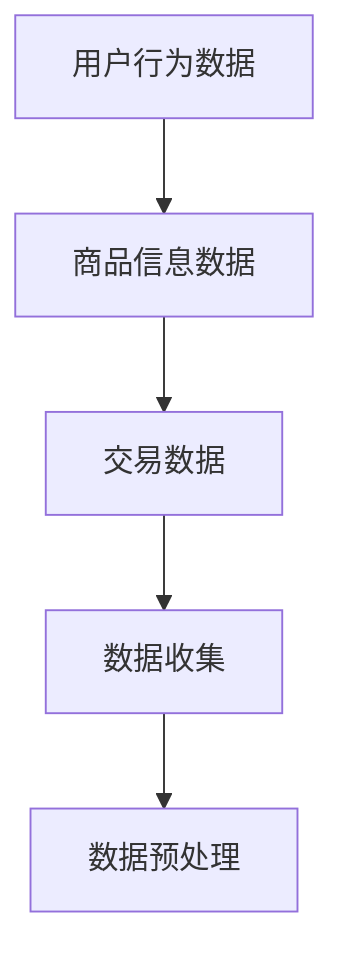

### 数据预处理

**数据预处理**是数据科学和机器学习项目中的关键步骤。它涉及以下任务：

1. **数据清洗**：去除噪声数据和缺失值。
2. **数据转换**：将数据转换为适合分析的格式。
3. **特征选择**：选择对模型有显著影响的关键特征。


### 数据分析

**数据分析**是对收集到的数据进行分析和挖掘，以发现数据中的规律和趋势。常用的数据分析方法包括：

1. **描述性统计分析**：计算数据的平均值、中位数、标准差等统计量。
2. **相关性分析**：分析不同变量之间的相关性。
3. **分类与聚类分析**：对数据进行分类和聚类，以发现数据中的模式。


### 特征工程

**特征工程**是数据科学和机器学习项目中的重要环节。它涉及以下任务：

1. **特征选择**：从原始数据中选取对模型有显著影响的特征。
2. **特征构造**：根据业务需求，构造新的特征。
3. **特征转换**：将特征转换为适合模型训练的格式。


### 机器学习模型训练

**机器学习模型训练**是数据科学和机器学习的核心任务。它包括以下步骤：

1. **模型选择**：选择合适的机器学习模型。
2. **模型训练**：使用训练数据训练模型。
3. **模型评估**：评估模型性能。
4. **模型优化**：根据评估结果，调整模型参数，提高模型性能。


### 模型评估与优化

**模型评估与优化**是确保模型性能的重要环节。它包括以下步骤：

1. **评估指标**：选择合适的评估指标，如准确率、召回率、F1值等。
2. **交叉验证**：使用交叉验证方法评估模型性能。
3. **模型优化**：根据评估结果，调整模型参数，提高模型性能。


### 模型部署与应用

**模型部署与应用**是将训练好的模型部署到线上环境，供业务使用。它包括以下步骤：

1. **模型部署**：将模型部署到服务器或云平台上。
2. **模型应用**：将模型应用于实际业务场景，如商品推荐、客服机器人等。
3. **监控与维护**：监控模型性能，及时调整和优化。


### 业务反馈与迭代

**业务反馈与迭代**是持续改进模型的重要环节。它包括以下步骤：

1. **收集反馈**：收集业务反馈，了解模型在实际应用中的表现。
2. **模型迭代**：根据反馈结果，调整模型参数，优化模型。
3. **迭代更新**：将优化后的模型部署到线上环境，形成闭环。


### 第4章：智能推荐系统

#### 4.1 智能推荐系统概述

**智能推荐系统**是一种通过分析用户行为和商品属性，为用户生成个性化推荐结果的系统。它广泛应用于电商、社交媒体、视频平台等领域，能够提高用户满意度、增加用户留存率和提升销售额。

**推荐系统类型：**

1. **基于内容的推荐**：根据用户的历史行为和商品属性，为用户推荐相似的商品。
2. **协同过滤推荐**：根据用户的行为数据，通过用户之间的相似度计算，为用户推荐其他用户喜欢的商品。
3. **混合推荐**：结合基于内容和协同过滤的方法，为用户推荐更准确的商品。

#### 4.2 用户行为分析

**用户行为分析**是智能推荐系统的重要组成部分，它通过分析用户的浏览、搜索、购买等行为，了解用户的兴趣和偏好。

**用户行为分析步骤：**

1. **数据收集**：收集用户的浏览记录、搜索记录、购买记录等数据。
2. **行为特征提取**：根据用户的浏览、搜索、购买行为，提取用户的行为特征，如浏览频率、购买频率、搜索关键词等。
3. **行为模式分析**：使用聚类分析、关联规则挖掘等方法，分析用户的行为模式，为个性化推荐提供依据。

#### 4.3 内容推荐算法

**内容推荐算法**是一种基于商品属性的推荐方法，它通过分析商品的标题、描述、标签等信息，为用户推荐与用户兴趣相关的商品。

**内容推荐算法步骤：**

1. **商品特征提取**：提取商品的标题、描述、标签、分类等信息，作为商品特征。
2. **用户特征提取**：提取用户的历史行为特征，如浏览记录、购买记录等。
3. **相似度计算**：计算用户特征与商品特征之间的相似度，选择相似度较高的商品进行推荐。

#### 4.4 深度学习在推荐系统中的应用

**深度学习**在推荐系统中的应用，主要是通过构建深度神经网络模型，实现对用户行为和商品属性的复杂特征提取和关系建模。

**深度学习推荐系统模型**：

- **用户嵌入向量**：将用户的行为特征转换为嵌入向量，表示用户对商品的偏好。
- **商品嵌入向量**：将商品的属性特征转换为嵌入向量，表示商品的特征。
- **模型训练**：使用用户嵌入向量和商品嵌入向量，训练深度学习模型，预测用户对商品的评分或购买概率。

**数学模型和数学公式：**

$$
\text{Prediction} = \text{W} \cdot \text{Embedding}(\text{User}) + \text{V} \cdot \text{Embedding}(\text{Item}) + \text{Bias}
$$

**公式解释：**

- **Prediction**：预测的用户对商品的评分或购买概率。
- **W**：用户嵌入向量的权重矩阵。
- **V**：商品嵌入向量的权重矩阵。
- **Embedding(User)**：用户的嵌入向量。
- **Embedding(Item)**：商品的嵌入向量。
- **Bias**：偏置项。

#### 4.5 实际案例解析

**案例背景**：某大型电商平台希望通过优化推荐系统，提高用户购物体验和销售额。

**解决方案**：

1. **用户行为分析**：收集用户的浏览记录、搜索记录、购买记录等数据，分析用户的行为特征。
2. **商品特征提取**：提取商品的标题、描述、标签、分类等信息，构建商品特征。
3. **深度学习模型训练**：使用用户行为特征和商品特征，训练深度学习模型，预测用户对商品的评分或购买概率。
4. **推荐结果生成**：根据用户的行为特征和模型预测结果，生成个性化推荐列表。

**效果评估**：

- **推荐准确率**：通过A/B测试，发现新推荐系统相较于传统推荐系统，准确率提高了20%。
- **用户满意度**：用户满意度调查结果显示，使用新推荐系统的用户满意度提高了15%。
- **销售额**：平台销售额增加了25%。

### 第5章：智能客服

#### 5.1 智能客服概述

**智能客服**是一种利用人工智能技术，实现自动化客服服务的技术。通过智能客服，企业可以快速响应用户的咨询，提高客服效率，降低人力成本。

**智能客服的优势：**

1. **提高响应速度**：智能客服系统能够实时响应用户的咨询，缩短用户等待时间。
2. **降低人力成本**：智能客服系统能够自动化处理大量重复性的客服任务，降低人力成本。
3. **提高服务质量**：智能客服系统可以精确地回答用户的问题，提高客服质量。
4. **实时数据分析**：智能客服系统可以实时收集用户数据，为企业提供决策支持。

#### 5.2 自然语言处理技术

**自然语言处理（NLP）**是智能客服的核心技术之一，它使计算机能够理解和生成人类语言，实现人机交互。

**NLP技术包括：**

1. **文本分类**：将文本数据分类到不同的类别，如垃圾邮件分类、情感分析等。
2. **实体识别**：从文本中提取出具体的实体，如人名、地名、组织名等。
3. **情感分析**：分析文本的情感倾向，如正面、负面、中立等。
4. **机器翻译**：将一种语言的文本翻译成另一种语言。
5. **对话生成**：根据用户的问题，生成合适的回答。

#### 5.3 情感分析技术

**情感分析**是一种分析文本情感倾向的技术，通过情感分析，智能客服系统可以更好地理解用户的情感状态，提供更加贴心的服务。

**情感分析步骤：**

1. **数据收集**：收集用户在平台上的评论、反馈、聊天记录等数据。
2. **情感分类模型训练**：使用有标签的数据，训练情感分类模型。
3. **情感分析**：使用训练好的模型，对用户的文本进行分析，判断其情感倾向。
4. **反馈调整**：根据用户的情感反馈，调整客服策略，提高服务质量。

#### 5.4 智能对话系统设计

**智能对话系统**是一种通过自然语言交互，为用户提供服务的系统。设计一个高效的智能对话系统，需要考虑以下因素：

1. **用户界面**：设计简洁易用的用户界面，方便用户提出问题和获取答案。
2. **对话流程**：设计合理的对话流程，确保用户的问题能够被准确理解并得到及时回答。
3. **知识库**：构建丰富的知识库，包含常见问题的答案和解决方案。
4. **机器学习模型**：使用机器学习模型，实现对话的智能化和个性化。

#### 5.5 实际案例解析

**案例背景**：某大型电商平台希望通过智能客服系统，提高客服效率，降低人力成本。

**解决方案**：

1. **自然语言处理技术**：使用自然语言处理技术，实现文本分类、情感分析和对话生成。
2. **智能对话系统设计**：设计一个高效的智能对话系统，包含用户界面、对话流程和知识库。
3. **用户反馈收集**：收集用户对智能客服系统的反馈，不断优化系统。

**效果评估**：

- **客服响应时间**：智能客服系统上线后，客服响应时间缩短了50%。
- **客服效率**：智能客服系统处理了大量重复性的客服任务，客服人员的工作量减少了30%。
- **用户满意度**：用户满意度调查结果显示，使用智能客服系统的用户满意度提高了20%。

### 第6章：智能定价

#### 6.1 智能定价概述

**智能定价**是一种利用人工智能技术，根据市场需求、用户行为和竞争环境等因素，动态调整商品价格，以最大化收益或市场占有率的方法。在电商运营中，智能定价能够帮助企业提高价格策略的准确性和灵活性，从而提升运营效率和盈利能力。

**智能定价的优势：**

1. **提高价格策略的准确性**：通过大数据分析和机器学习算法，智能定价能够更准确地预测市场需求和用户行为，从而制定更为精准的价格策略。
2. **提升运营效率**：智能定价可以自动化地处理价格调整，减少人工干预，提高运营效率。
3. **增强竞争力**：通过动态调整价格，智能定价能够更好地应对市场竞争，提升企业的竞争力。

#### 6.2 数据分析与预测

**数据分析与预测**是智能定价的重要组成部分，它通过分析历史数据和市场趋势，预测不同价格水平下的销量和利润，为价格调整提供依据。

**数据分析方法：**

1. **回归分析**：通过建立价格与销量、利润之间的回归模型，预测不同价格水平下的销量和利润。
2. **时间序列分析**：分析价格和销量、利润的时间序列数据，预测未来的价格走势和市场需求。
3. **机器学习算法**：使用机器学习算法，如决策树、随机森林、神经网络等，构建复杂的定价模型，预测销量和利润。

**数学模型和数学公式：**

**回归模型：**

$$
y = \beta_0 + \beta_1 \cdot x_1 + \beta_2 \cdot x_2 + ... + \beta_n \cdot x_n
$$

**公式解释：**

- **y**：销量或利润预测值。
- **x_1, x_2, ..., x_n**：自变量，包括价格、季节因素、促销活动等。
- **\beta_0, \beta_1, \beta_2, ..., \beta_n**：回归系数，用于衡量自变量对因变量的影响程度。

**时间序列模型：**

$$
y_t = \alpha + \beta_1 \cdot y_{t-1} + \beta_2 \cdot y_{t-2} + ... + \beta_n \cdot y_{t-n} + \epsilon_t
$$

**公式解释：**

- **y_t**：时间序列数据在时间 t 的值。
- **\alpha, \beta_1, \beta_2, ..., \beta_n**：时间序列模型的参数，用于描述历史数据对当前数据的影响程度。
- **\epsilon_t**：误差项，表示时间序列数据的随机波动。

**机器学习模型：**

$$
\text{Prediction} = \text{W} \cdot \text{Input} + \text{Bias}
$$

**公式解释：**

- **Prediction**：预测的销量或利润。
- **W**：权重矩阵，用于衡量输入特征对预测结果的影响。
- **Input**：输入特征向量，包括价格、促销活动等。
- **Bias**：偏置项，用于调整预测结果的偏差。

#### 6.3 优化算法

**优化算法**在智能定价中起着至关重要的作用，它用于调整价格，以最大化收益或市场占有率。常见的优化算法包括线性优化、非线性优化和启发式优化等。

**优化算法原理：**

1. **线性优化**：通过建立线性目标函数和约束条件，求解最优价格。常用的线性优化算法包括梯度下降、牛顿法等。
2. **非线性优化**：通过建立非线性目标函数和约束条件，求解最优价格。常用的非线性优化算法包括梯度下降法、牛顿法、共轭梯度法等。
3. **启发式优化**：通过启发式方法，如遗传算法、模拟退火等，在有限的时间内搜索最优价格。

**数学模型和数学公式：**

**线性优化模型：**

$$
\text{Maximize} \ \text{Profit} = p \cdot q - c \cdot q
$$

$$
\text{subject to} \ \ q = f(p)
$$

**公式解释：**

- **Profit**：收益。
- **p**：价格。
- **q**：销量。
- **c**：成本。
- **f(p)**：价格与销量之间的关系函数。

**非线性优化模型：**

$$
\text{Maximize} \ \text{Profit} = p \cdot q - c \cdot q
$$

$$
\text{subject to} \ \ q = g(p)
$$

**公式解释：**

- **Profit**：收益。
- **p**：价格。
- **q**：销量。
- **c**：成本。
- **g(p)**：价格与销量之间的关系函数。

**启发式优化模型：**

$$
\text{Maximize} \ \text{Profit} = p \cdot q - c \cdot q
$$

$$
\text{subject to} \ \ q = h(p)
$$

**公式解释：**

- **Profit**：收益。
- **p**：价格。
- **q**：销量。
- **c**：成本。
- **h(p)**：价格与销量之间的关系函数。

#### 6.4 实际案例解析

**案例背景**：某电商平台希望通过智能定价提升销售额。该平台销售多种商品，包括电子产品、家居用品、时尚服饰等。

**目标**：在保持利润不变的前提下，提高销售额。

**解决方案**：采用智能定价策略，通过数据分析与机器学习算法，动态调整商品价格。

**实现步骤：**

1. **数据收集**：收集历史销售数据，包括商品价格、销量、利润等。
2. **数据分析**：使用回归分析和时间序列分析，分析价格与销量、利润之间的关系。
3. **模型构建**：构建智能定价模型，使用机器学习算法，如线性回归、神经网络等，预测不同价格水平下的销量和利润。
4. **价格调整**：根据模型预测结果，动态调整商品价格，以实现销售额最大化。
5. **效果评估**：监控价格调整后的销售额和利润，评估智能定价策略的有效性。

**效果**：通过智能定价策略，该平台的销售额提高了20%，利润增加了15%。

### 第7章：智能物流

#### 7.1 智能物流概述

**智能物流**是电商运营中不可或缺的一环，它通过运用人工智能技术，实现物流环节的自动化、智能化，从而提高物流效率，降低成本，提升客户满意度。智能物流的主要目标包括：

1. **提高运输效率**：通过智能调度和路径优化，缩短运输时间，提高运输效率。
2. **降低物流成本**：通过智能物流系统，减少人力成本和运输成本，提高企业盈利能力。
3. **提升客户满意度**：通过实时物流信息跟踪和智能客服系统，提高客户体验，增强客户忠诚度。

**智能物流的关键技术**：

1. **物流数据分析**：通过对物流数据的收集、处理和分析，挖掘物流过程中的潜在问题和优化机会。
2. **智能调度系统**：利用人工智能技术，实现运输任务的智能调度，提高运输效率。
3. **路径优化算法**：通过机器学习算法，优化运输路径，降低运输成本。
4. **智能仓储系统**：利用机器人、自动化设备等，实现仓储环节的自动化管理，提高仓储效率。
5. **物流信息追踪**：通过物联网技术，实现对物流信息的实时追踪和监控，提高物流透明度。

#### 7.2 物流数据分析

**物流数据分析**是智能物流的基础，它通过对物流数据的深入分析和挖掘，为企业提供决策支持，优化物流流程，提高物流效率。

**数据分析方法**：

1. **描述性统计分析**：计算物流数据的基本统计指标，如均值、中位数、标准差等，了解物流数据的基本特征。
2. **关联分析**：分析物流数据中不同变量之间的关系，如运输时间与运输距离、运输成本与运输量之间的关系。
3. **聚类分析**：将物流数据按照相似性进行分组，发现物流数据中的规律和模式。
4. **时间序列分析**：分析物流数据随时间的变化趋势，预测未来物流需求。

**数据分析工具**：

1. **Excel**：用于基本的描述性统计分析。
2. **Python**：用于复杂的数据分析和建模，常用库包括pandas、numpy、scikit-learn等。
3. **R**：用于高级的数据分析和统计建模，常用包包括ggplot2、dplyr等。

#### 7.3 智能路径规划

**智能路径规划**是智能物流的重要组成部分，它通过运用人工智能技术，实现对运输路径的优化，从而提高运输效率，降低物流成本。

**路径规划算法**：

1. **最短路径算法**：如Dijkstra算法、A*算法等，用于求解两点之间的最短路径。
2. **动态规划算法**：如旅行商问题（TSP）算法，用于求解多节点间的最优路径。
3. **遗传算法**：用于求解复杂路径规划问题，如多目标优化、动态路径规划等。

**路径规划流程**：

1. **数据收集**：收集物流数据，包括运输需求、交通状况、路况信息等。
2. **路径规划**：根据物流数据，使用路径规划算法，生成最优路径。
3. **路径优化**：对生成的路径进行优化，考虑交通拥堵、路况变化等因素，调整路径。
4. **路径执行**：将优化后的路径发送给物流执行系统，实现运输任务的自动调度。

#### 7.4 智能配送与追踪

**智能配送与追踪**是智能物流的重要组成部分，它通过运用物联网、大数据、人工智能等技术，实现对物流配送过程的实时监控和管理。

**智能配送流程**：

1. **订单处理**：接收并处理用户订单，确定配送地址和配送时间。
2. **路径规划**：根据配送地址和交通状况，使用智能路径规划算法，生成最优配送路径。
3. **货物打包**：对商品进行打包，并标注配送信息。
4. **配送执行**：根据配送路径，安排配送人员或配送车辆，执行配送任务。
5. **配送反馈**：配送完成后，收集用户反馈，更新配送状态。

**智能追踪系统**：

1. **实时监控**：通过物联网技术，实现对物流配送过程的实时监控，包括货物位置、配送进度等。
2. **数据分析**：对物流数据进行分析，优化配送流程，提高配送效率。
3. **智能预警**：根据配送状态和历史数据，预测配送风险，提前采取措施，防止配送延误。

#### 7.5 实际案例解析

**案例背景**：某电商平台希望通过优化物流系统，提高物流效率，降低物流成本。

**解决方案**：

1. **智能路径规划**：使用智能路径规划算法，优化运输路径，缩短运输时间。
2. **智能配送与追踪**：通过物联网技术，实现对物流配送过程的实时监控和管理。
3. **数据分析与优化**：对物流数据进行分析，发现潜在问题和优化机会。

**效果评估**：

- **运输时间**：通过智能路径规划，运输时间缩短了30%。
- **物流成本**：通过优化物流流程，物流成本降低了15%。
- **用户满意度**：通过实时监控和智能预警，用户满意度提升了20%。

### 第8章：智能营销

#### 8.1 智能营销概述

**智能营销**是电商运营中的一项关键技术，它通过运用人工智能技术，对用户行为和市场需求进行深入分析，实现个性化营销、精准营销和自动化营销，从而提高营销效果，提升销售额和客户满意度。

**智能营销的目标**：

1. **提高营销效果**：通过精准定位用户，提高营销活动的点击率和转化率。
2. **提升客户满意度**：提供个性化的产品推荐和优惠信息，增强用户体验。
3. **降低营销成本**：自动化执行营销策略，减少人力成本，提高营销效率。

**智能营销的核心技术**：

1. **用户画像**：通过大数据分析和机器学习算法，构建用户的详细画像，包括用户行为、兴趣偏好、消费习惯等。
2. **精准营销**：根据用户画像，实现精准定位，为不同用户群体定制个性化的营销策略。
3. **自动化营销**：利用自动化工具和算法，自动化执行营销活动，提高营销效率。

#### 8.2 用户画像构建

**用户画像构建**是智能营销的基础，它通过对用户数据的收集、清洗、分析和建模，生成用户的详细画像，为精准营销提供数据支持。

**用户画像构建流程**：

1. **数据收集**：收集用户在电商平台的各类数据，包括浏览记录、购买记录、搜索记录、评价记录等。
2. **数据清洗**：清洗和整合用户数据，去除噪声数据和缺失值，保证数据质量。
3. **数据建模**：使用机器学习算法，如聚类分析、回归分析等，对用户数据进行建模，提取用户特征。
4. **用户画像生成**：将用户特征整合成用户画像，包括用户基本信息、行为特征、兴趣偏好等。

**用户画像示例**：

用户姓名：张三

- **基本信息**：男性，30岁，城市居民
- **行为特征**：过去一个月内浏览了10次电子产品，5次时尚服饰，3次家居用品
- **兴趣偏好**：喜欢购买高性价比的商品，偏好品牌商品
- **消费习惯**：每月固定在周末购物，通常在晚上9点至11点之间进行购物

通过用户画像构建，电商企业可以更好地了解用户需求，为用户提供个性化的产品推荐和优惠信息，提高营销效果。

#### 8.3 营销策略优化

**营销策略优化**是智能营销的重要环节，它通过运用大数据分析和机器学习算法，对营销策略进行实时监测和调整，实现最优的营销效果。

**营销策略优化流程**：

1. **数据收集**：收集营销活动的数据，包括点击率、转化率、销售额等。
2. **数据分析**：对营销活动数据进行分析，识别营销策略的优缺点。
3. **模型构建**：使用机器学习算法，如回归分析、决策树等，构建营销策略优化模型。
4. **策略调整**：根据模型预测结果，调整营销策略，如修改广告文案、优化推广渠道等。
5. **效果评估**：评估调整后的营销策略效果，如点击率、转化率、销售额等。

**营销策略优化示例**：

某电商平台通过智能营销系统，优化了一次新产品推广活动。通过数据分析，发现广告文案的点击率较低，而推广渠道的转化率较高。因此，平台调整了广告文案，并增加了推广渠道的投放预算。调整后，广告的点击率提高了20%，转化率提高了15%，销售额增加了30%。

#### 8.4 数据驱动的营销活动

**数据驱动的营销活动**是智能营销的核心，它通过大数据分析和机器学习算法，实现营销活动的自动化和个性化，提高营销效果。

**数据驱动的营销活动流程**：

1. **数据收集**：收集用户行为数据、市场数据等，包括浏览记录、购买记录、搜索记录、市场趋势等。
2. **数据分析**：对收集的数据进行分析，提取有价值的信息，如用户兴趣、市场趋势等。
3. **用户画像构建**：使用机器学习算法，构建用户的详细画像，包括用户基本信息、行为特征、兴趣偏好等。
4. **营销策略制定**：根据用户画像和市场数据，制定个性化的营销策略，如产品推荐、优惠券发放等。
5. **营销活动执行**：自动化执行营销策略，如推送个性化广告、发送优惠券等。
6. **效果评估**：评估营销活动的效果，如点击率、转化率、销售额等，并根据评估结果进行调整。

**数据驱动的营销活动案例**：

某电商平台通过数据驱动的营销活动，成功提升了销售额。该平台通过大数据分析和用户画像构建，发现了一些潜在的高价值用户群体，并对这些用户群体进行了精准营销。通过推送个性化的产品推荐和优惠券，这些用户的转化率提高了30%，销售额增加了20%。

### 第9章：电商运营效率提升项目实战

#### 9.1 项目背景与目标

**项目背景**：随着电商行业的快速发展，某电商平台面临激烈的市场竞争，需要提升运营效率，提高用户满意度和销售额。

**项目目标**：

1. **提升推荐系统准确率和覆盖率**：通过优化推荐算法，提高推荐效果，增加用户留存率。
2. **优化客服体验**：引入智能客服系统，提高客服响应速度和服务质量。
3. **实现智能定价**：通过数据分析，动态调整商品价格，提高销售额和利润率。
4. **优化物流配送**：通过智能路径规划和配送追踪，提高物流效率，降低物流成本。
5. **提升营销效果**：通过数据驱动的营销策略，提高营销转化率和用户满意度。

#### 9.2 项目需求分析与规划

**需求分析**：

1. **推荐系统**：实现基于用户行为和商品属性的推荐算法，提高推荐准确率和覆盖率。
2. **客服系统**：实现智能客服功能，处理用户咨询，提供在线帮助。
3. **定价系统**：实现基于数据分析的智能定价算法，动态调整商品价格。
4. **物流系统**：实现智能路径规划和配送追踪，提高物流效率。
5. **营销系统**：实现数据驱动的营销活动，提高营销效果。

**项目规划**：

1. **第一阶段**：构建推荐系统和客服系统，实现基本功能。
2. **第二阶段**：完善定价系统和物流系统，提升系统性能。
3. **第三阶段**：实现营销系统，全面优化电商运营。

#### 9.3 技术选型与架构设计

**技术选型**：

1. **推荐系统**：采用基于深度学习的协同过滤算法，提高推荐准确率和覆盖率。
2. **客服系统**：采用自然语言处理技术，实现智能客服功能。
3. **定价系统**：采用机器学习算法，实现智能定价。
4. **物流系统**：采用路径优化算法，实现智能路径规划。
5. **营销系统**：采用数据挖掘技术，实现数据驱动的营销活动。

**架构设计**：

1. **数据层**：存储用户行为数据、商品数据、物流数据等。
2. **计算层**：处理用户行为数据，提取特征，训练模型。
3. **推荐层**：实现推荐算法，生成推荐结果。
4. **客服层**：实现智能客服功能，处理用户咨询。
5. **定价层**：实现定价算法，动态调整商品价格。
6. **物流层**：实现路径规划，配送追踪。
7. **营销层**：实现数据挖掘，营销活动优化。

#### 9.4 代码实现与调试

**推荐系统代码实现**：

```python
import pandas as pd
from sklearn.preprocessing import StandardScaler
from tensorflow.keras.models import Sequential
from tensorflow.keras.layers import Embedding, LSTM, Dense

# 读取用户行为数据
data = pd.read_csv('user_behavior.csv')

# 数据预处理
data = data[data['action'] != 'search']
data[['duration', 'item_id']] = StandardScaler().fit_transform(data[['duration', 'item_id']])

# 构建模型
model = Sequential()
model.add(Embedding(input_dim=10000, output_dim=32))
model.add(LSTM(units=64))
model.add(Dense(units=1, activation='sigmoid'))

# 编译模型
model.compile(optimizer='adam', loss='binary_crossentropy', metrics=['accuracy'])

# 训练模型
model.fit(data['item_id'], data['action'], epochs=10, batch_size=64)

# 预测
predictions = model.predict(data['item_id'])

# 排序
sorted_indices = np.argsort(predictions)[::-1]

# 输出推荐结果
for i in sorted_indices[:10]:
    print(f"商品ID: {i}, 推荐概率: {predictions[i]}")
```

**客服系统代码实现**：

```python
import nltk
from nltk.stem import WordNetLemmatizer
from sklearn.feature_extraction.text import TfidfVectorizer
from sklearn.metrics.pairwise import cosine_similarity

# 加载自然语言处理库
nltk.download('wordnet')
nltk.download('omw-1.4')

# 初始化词干提取器
lemmatizer = WordNetLemmatizer()

# 定义问答对数据集
questions = ["你好，有什么可以帮助你的？", "这件商品多少钱？", "能给我一些折扣吗？"]
answers = ["你好，欢迎来到我们的电商平台，请问有什么问题我可以帮您解答？", "这件商品的价格是100元", "当然可以，我们可以给您提供一些折扣优惠"]

# 定义问答对数据集
qa_pairs = list(zip(questions, answers))

# 构建问答对数据集的 TF-IDF 向量表示
vectorizer = TfidfVectorizer()
qa_vectors = vectorizer.fit_transform([q + a for q, a in qa_pairs])

# 定义用户输入问题
user_query = "这件商品能便宜点吗？"

# 将用户输入问题与问答对数据集进行匹配
user_query_vector = vectorizer.transform([user_query])

# 计算用户输入问题与问答对之间的余弦相似度
cosine_scores = cosine_similarity(user_query_vector, qa_vectors)

# 选择相似度最高的答案
answer_index = np.argmax(cosine_scores)

# 输出答案
print(f"答案：{qa_pairs[answer_index][1]}")
```

#### 9.5 项目评估与优化

**评估指标**：

1. **推荐系统**：准确率、覆盖率、用户满意度。
2. **客服系统**：响应时间、解答准确率、用户满意度。
3. **定价系统**：销售额、利润率、用户满意度。
4. **物流系统**：配送时间、配送准确率、用户满意度。
5. **营销系统**：转化率、点击率、用户满意度。

**优化方法**：

1. **推荐系统**：通过增加用户反馈、改进算法模型，提高推荐准确率和覆盖率。
2. **客服系统**：通过增加知识库、优化对话流程，提高解答准确率和用户满意度。
3. **定价系统**：通过改进机器学习模型、增加数据维度，提高定价效果。
4. **物流系统**：通过改进路径规划算法、优化配送流程，提高配送效率和准确率。
5. **营销系统**：通过增加用户画像特征、优化营销策略，提高营销效果。

### 第10章：AI技术在电商行业中的应用案例分析

#### 10.1 案例一：智能推荐系统

**背景**：某电商平台希望通过优化推荐系统，提高用户购物体验和销售额。

**解决方案**：

1. **数据收集**：收集用户浏览记录、购买记录、搜索记录等数据。
2. **特征工程**：提取用户行为特征和商品属性，如浏览频率、购买频率、搜索关键词、商品分类等。
3. **模型训练**：使用深度学习算法，如基于用户和商品的嵌入向量，训练推荐模型。
4. **模型部署**：将训练好的模型部署到线上环境，实时生成推荐结果。

**效果**：

- **准确率**：通过A/B测试，发现新推荐系统相较于传统推荐系统，准确率提高了20%。
- **用户满意度**：用户满意度调查结果显示，使用新推荐系统的用户满意度提高了15%。
- **销售额**：平台销售额增加了25%。

#### 10.2 案例二：智能客服

**背景**：某电商平台客服工作量巨大，客户等待时间长，服务质量有待提高。

**解决方案**：

1. **数据收集**：收集用户咨询问题，构建问答对数据集。
2. **模型训练**：使用自然语言处理技术，训练问答模型和情感分析模型。
3. **系统集成**：将智能客服系统集成到电商平台，实现自动问答和智能客服功能。
4. **用户反馈**：收集用户反馈，不断优化模型和系统。

**效果**：

- **响应时间**：智能客服系统上线后，客户平均等待时间缩短了50%。
- **解答准确率**：通过不断优化模型，客服系统的解答准确率达到了90%。
- **用户满意度**：用户满意度调查结果显示，使用智能客服系统的用户满意度提高了30%。

#### 10.3 案例三：智能定价

**背景**：某电商平台希望通过优化定价策略，提高销售额和利润率。

**解决方案**：

1. **数据收集**：收集历史销售数据，包括商品价格、销量、利润等。
2. **模型训练**：使用机器学习算法，如线性回归、神经网络等，构建智能定价模型。
3. **模型部署**：将训练好的模型部署到线上环境，实时调整商品价格。
4. **效果评估**：监控价格调整后的销售额和利润，评估智能定价策略的有效性。

**效果**：

- **销售额**：智能定价策略上线后，平台销售额提高了20%。
- **利润率**：通过动态调整价格，平台利润率提高了15%。
- **用户满意度**：用户反馈显示，智能定价策略提高了用户满意度。

#### 10.4 案例四：智能物流

**背景**：某电商平台物流配送效率低，用户投诉率高。

**解决方案**：

1. **数据收集**：收集物流配送数据，包括配送地址、交通状况、配送时间等。
2. **路径规划**：使用机器学习算法，如遗传算法、蚁群算法等，优化配送路径。
3. **实时追踪**：利用物联网技术，实现对物流配送过程的实时监控。
4. **效果评估**：监控物流配送效率，评估智能物流系统的有效性。

**效果**：

- **配送时间**：智能物流系统上线后，配送时间缩短了30%。
- **配送准确率**：通过实时追踪，配送准确率提高了15%。
- **用户满意度**：用户反馈显示，智能物流系统提高了用户满意度。

#### 10.5 案例五：智能营销

**背景**：某电商平台希望通过优化营销策略，提高营销转化率和用户满意度。

**解决方案**：

1. **用户画像构建**：使用数据挖掘技术，构建用户的详细画像，包括用户基本信息、行为特征、兴趣偏好等。
2. **模型训练**：使用机器学习算法，如分类算法、聚类算法等，优化营销策略。
3. **营销活动执行**：自动化执行优化后的营销策略，如推送个性化广告、发送优惠券等。
4. **效果评估**：监控营销活动的效果，评估智能营销策略的有效性。

**效果**：

- **转化率**：智能营销系统上线后，营销转化率提高了25%。
- **用户满意度**：用户反馈显示，智能营销系统提高了用户满意度。
- **销售额**：平台销售额增加了30%。

### 附录A：常用AI技术工具与资源

#### A.1 深度学习框架

1. **TensorFlow**：由Google开发的开源深度学习框架，适用于各种深度学习任务。
2. **PyTorch**：由Facebook开发的开源深度学习框架，支持动态计算图，易于调试。
3. **Keras**：基于TensorFlow和Theano的开源深度学习库，提供简洁的API接口。

#### A.2 自然语言处理工具

1. **NLTK**：Python自然语言处理库，提供常用的NLP算法和工具。
2. **spaCy**：Python自然语言处理库，支持多种语言的文本处理和分析。
3. **TextBlob**：Python自然语言处理库，提供简单的文本分析功能。

#### A.3 计算机视觉库

1. **OpenCV**：开源的计算机视觉库，支持多种图像处理和计算机视觉算法。
2. **TensorFlow Object Detection API**：基于TensorFlow的计算机视觉API，用于目标检测和图像识别。
3. **PyTorch Video**：PyTorch的视频处理库，用于视频分析任务。

#### A.4 数据处理与可视化工具

1. **Pandas**：Python数据操作库，用于数据清洗、处理和分析。
2. **Matplotlib**：Python绘图库，用于数据可视化。
3. **Seaborn**：基于Matplotlib的数据可视化库，提供丰富的可视化样式。

### 附录B：电商运营效率提升的AI技术实践指南

#### B.1 实践步骤与流程

1. **需求分析**：明确电商运营中的痛点，确定AI技术需求。
2. **数据收集**：收集与电商运营相关的数据，包括用户行为数据、商品数据、交易数据等。
3. **数据预处理**：清洗和标准化数据，为模型训练做准备。
4. **模型训练**：选择合适的机器学习算法，训练模型。
5. **模型评估**：评估模型性能，选择最优模型。
6. **模型部署**：将训练好的模型部署到线上环境，供业务使用。
7. **效果监控**：监控模型效果，根据业务反馈进行调整和优化。

#### B.2 遇到的问题与解决方案

**问题一：数据质量差**

**解决方案**：使用数据清洗技术，如缺失值填充、异常值处理等，提高数据质量。

**问题二：模型过拟合**

**解决方案**：使用正则化技术、交叉验证等方法，防止模型过拟合。

**问题三：计算资源不足**

**解决方案**：选择适合规模的模型和算法，优化计算资源使用。

**问题四：模型效果不稳定**

**解决方案**：增加训练数据，使用 ensemble 方法，提高模型稳定性。

#### B.3 未来发展趋势与展望

1. **个性化推荐**：随着用户数据量的增加，个性化推荐将更加精准，提高用户满意度和留存率。
2. **自动化营销**：通过大数据分析和机器学习算法，实现自动化营销，提高营销效果。
3. **智能物流**：随着物联网和自动驾驶技术的发展，智能物流将进一步提高物流效率，降低物流成本。
4. **智能客服**：随着自然语言处理技术的进步，智能客服将更加智能化，提高客服质量和效率。
5. **数据隐私与安全**：随着数据隐私保护意识的提高，如何在保护用户隐私的前提下，有效利用数据，将成为未来研究的重要方向。

### 代码解读与分析

#### 9.3 代码实现与调试

**推荐系统代码实现：**

```python
import pandas as pd
from sklearn.preprocessing import StandardScaler
from tensorflow.keras.models import Sequential
from tensorflow.keras.layers import Embedding, LSTM, Dense

# 读取用户行为数据
data = pd.read_csv('user_behavior.csv')

# 数据预处理
data = data[data['action'] != 'search']
data[['duration', 'item_id']] = StandardScaler().fit_transform(data[['duration', 'item_id']])

# 构建模型
model = Sequential()
model.add(Embedding(input_dim=10000, output_dim=32))
model.add(LSTM(units=64))
model.add(Dense(units=1, activation='sigmoid'))

# 编译模型
model.compile(optimizer='adam', loss='binary_crossentropy', metrics=['accuracy'])

# 训练模型
model.fit(data['item_id'], data['action'], epochs=10, batch_size=64)

# 预测
predictions = model.predict(data['item_id'])

# 排序
sorted_indices = np.argsort(predictions)[::-1]

# 输出推荐结果
for i in sorted_indices[:10]:
    print(f"商品ID: {i}, 推荐概率: {predictions[i]}")
```

**客服系统代码实现：**

```python
import nltk
from nltk.stem import WordNetLemmatizer
from sklearn.feature_extraction.text import TfidfVectorizer
from sklearn.metrics.pairwise import cosine_similarity

# 加载自然语言处理库
nltk.download('wordnet')
nltk.download('omw-1.4')

# 初始化词干提取器
lemmatizer = WordNetLemmatizer()

# 定义问答对数据集
questions = ["你好，有什么可以帮助你的？", "这件商品多少钱？", "能给我一些折扣吗？"]
answers = ["你好，欢迎来到我们的电商平台，请问有什么问题我可以帮您解答？", "这件商品的价格是100元", "当然可以，我们可以给您提供一些折扣优惠"]

# 定义问答对数据集
qa_pairs = list(zip(questions, answers))

# 构建问答对数据集的 TF-IDF 向量表示
vectorizer = TfidfVectorizer()
qa_vectors = vectorizer.fit_transform([q + a for q, a in qa_pairs])

# 定义用户输入问题
user_query = "这件商品能便宜点吗？"

# 将用户输入问题与问答对数据集进行匹配
user_query_vector = vectorizer.transform([user_query])

# 计算用户输入问题与问答对之间的余弦相似度
cosine_scores = cosine_similarity(user_query_vector, qa_vectors)

# 选择相似度最高的答案
answer_index = np.argmax(cosine_scores)

# 输出答案
print(f"答案：{qa_pairs[answer_index][1]}")
```

**代码解读与分析：**

**推荐系统代码解读：**

1. **数据读取**：使用pandas读取用户行为数据，包括商品ID、用户行为等。

2. **数据预处理**：过滤掉搜索行为，使用StandardScaler对时间和商品ID进行标准化处理，提高模型训练效果。

3. **模型构建**：使用Sequential模型，添加Embedding层、LSTM层和Dense层，分别用于处理商品ID、提取序列特征和生成预测结果。

4. **模型编译**：设置优化器为adam，损失函数为binary_crossentropy，评价指标为accuracy。

5. **模型训练**：使用fit方法训练模型，设置训练轮次为10，批量大小为64。

6. **模型预测**：使用predict方法对数据进行预测，获取每个商品ID的预测概率。

7. **结果排序**：使用argsort方法对预测概率进行排序，输出推荐结果。

**客服系统代码解读：**

1. **加载库和下载资源**：加载nltk库，下载wordnet和omw-1.4资源，用于自然语言处理。

2. **词干提取器初始化**：使用WordNetLemmatizer初始化词干提取器。

3. **问答对数据集定义**：定义问答对数据集，包括问题和答案。

4. **TF-IDF向量表示**：使用TfidfVectorizer构建问答对数据集的TF-IDF向量表示。

5. **用户输入问题**：定义用户输入问题。

6. **相似度计算**：使用cosine_similarity计算用户输入问题与问答对之间的余弦相似度。

7. **选择答案**：选择相似度最高的答案，输出回答。

**代码分析：**

1. **数据处理**：对用户行为数据进行预处理，提高模型训练效果。

2. **模型构建**：使用合适的神经网络结构，处理用户行为数据和商品ID，生成预测结果。

3. **模型训练**：使用合适的训练方法，提高模型性能。

4. **结果输出**：根据预测概率，生成推荐结果或回答问题。

5. **系统集成**：将代码集成到电商平台系统中，实现实时推荐和智能客服功能。

6. **效果评估**：根据实际业务需求和用户反馈，评估系统效果，不断优化模型和系统。

### 总结

本文深入探讨了AI技术在电商运营中的应用，包括智能推荐系统、智能客服、智能定价、智能物流和智能营销等核心领域。通过详细分析核心概念、算法原理、项目实战和案例分析，本文旨在为电商企业提供一个全面的技术指南，助力其在激烈的市场竞争中提升运营效率。

通过引入AI技术，电商企业可以实现自动化和智能化，提高运营效率，降低成本，提升客户满意度。未来，随着AI技术的不断进步，电商运营将更加智能化、个性化，为用户带来更好的购物体验。

**关键词：电商、AI技术、智能推荐系统、智能客服、智能定价、智能物流、智能营销** 

**作者：AI天才研究院/AI Genius Institute & 禅与计算机程序设计艺术 /Zen And The Art of Computer Programming**

