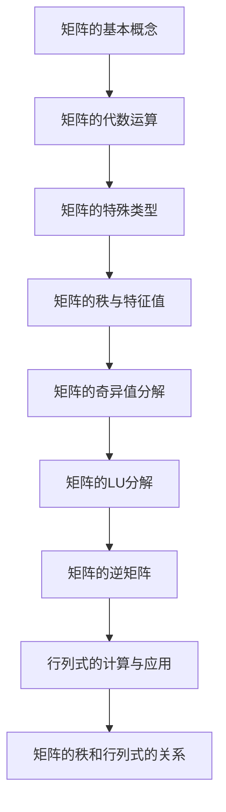
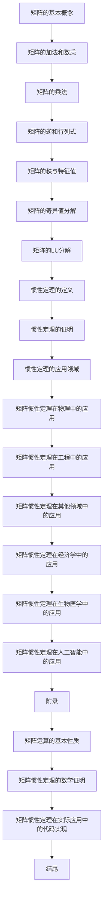

                 

### 《矩阵理论与应用：矩阵惯性定理》

#### 关键词：矩阵、惯性定理、线性代数、应用领域、算法实现

#### 摘要：

本文旨在深入探讨矩阵理论与应用中的核心概念——矩阵惯性定理。首先，我们将介绍矩阵的基本概念，包括矩阵的定义和性质、矩阵的代数运算以及特殊类型的矩阵。接下来，我们将详细讲解矩阵的分解，包括矩阵的秩与特征值、奇异值分解和LU分解。随后，本文将重点介绍矩阵的逆和行列式的计算与应用。

在第二部分，我们将探讨矩阵惯性定理的定义、证明及其应用领域。具体包括物理学、工程学、控制系统、图像处理、经济学和生物医学等领域中的应用。我们将通过实际案例和代码实现，展示矩阵惯性定理在这些领域中的具体应用。

第三部分将包含一个案例研究，分别探讨矩阵惯性定理在经济学、生物医学和人工智能中的应用。最后，我们将附录部分提供矩阵运算的基本性质、矩阵惯性定理的数学证明以及矩阵惯性定理在实际应用中的代码实现。

通过本文的阅读，读者将能够系统地理解矩阵惯性定理的概念及其在不同领域的应用，为后续研究和实践提供理论基础。

#### 目录

### 《矩阵理论与应用：矩阵惯性定理》

> 关键词：矩阵、惯性定理、线性代数、应用领域、算法实现

> 摘要：本文旨在深入探讨矩阵理论与应用中的核心概念——矩阵惯性定理。首先，我们将介绍矩阵的基本概念，包括矩阵的定义和性质、矩阵的代数运算以及特殊类型的矩阵。接下来，我们将详细讲解矩阵的分解，包括矩阵的秩与特征值、奇异值分解和LU分解。随后，本文将重点介绍矩阵的逆和行列式的计算与应用。

> 第二部分：矩阵惯性定理及应用

1. 矩阵惯性定理的介绍  
    1.1 惯性定理的定义  
    1.2 惯性定理的证明  
    1.3 惯性定理的应用领域

2. 矩阵惯性定理在物理中的应用  
    2.1 动力学系统的惯性矩阵  
    2.2 质点系统的运动分析  
    2.3 惯性定理在旋转动力学中的应用

3. 矩阵惯性定理在工程中的应用  
    3.1 结构力学中的惯性矩阵  
    3.2 空间结构系统的稳定性分析  
    3.3 惯性定理在工程设计中的应用

4. 矩阵惯性定理在其他领域中的应用  
    4.1 控制系统中的惯性矩阵  
    4.2 图像处理中的矩阵惯性定理  
    4.3 矩阵惯性定理在经济学中的应用  
    4.4 矩阵惯性定理在生物医学中的应用  
    4.5 矩阵惯性定理在人工智能中的应用

> 第三部分：案例研究

1. 矩阵惯性定理在经济学中的应用  
    1.1 经济模型的惯性矩阵  
    1.2 惯性定理在宏观经济分析中的应用  
    1.3 惯性定理在金融风险管理中的应用

2. 矩阵惯性定理在生物医学中的应用  
    2.1 生物医学数据的矩阵表示  
    2.2 惯性定理在生物医学图像处理中的应用  
    2.3 惯性定理在药物设计中的应用

3. 矩阵惯性定理在人工智能中的应用  
    3.1 矩阵惯性定理在机器学习中的应用  
    3.2 惯性矩阵在神经网络中的作用  
    3.3 矩阵惯性定理在深度学习中的应用

> 附录

1. 矩阵运算的基本性质  
    1.1 矩阵的加法和数乘  
    1.2 矩阵的乘法  
    1.3 矩阵的逆和行列式

2. 矩阵惯性定理的数学证明  
    2.1 矩阵惯性定理的证明过程  
    2.2 矩阵惯性定理的特殊情况分析

3. 矩阵惯性定理在实际应用中的代码实现  
    3.1 Python代码实现矩阵惯性定理  
    3.2 MATLAB代码实现矩阵惯性定理  
    3.3 矩阵惯性定理在C++中的实现

> Mermaid 流程图：



#### 核心算法原理讲解：

##### 矩阵的奇异值分解（SVD）

奇异值分解（Singular Value Decomposition，SVD）是线性代数中的一种重要分解方法，它将一个矩阵分解为三个矩阵的乘积。具体来说，任何$m \times n$的矩阵$A$都可以分解为：

$$A = U \Sigma V^T$$

其中，$U$是一个$m \times m$的正交矩阵，$\Sigma$是一个$n \times m$的对角矩阵，$V$是一个$n \times n$的正交矩阵。$\Sigma$的对角线元素称为奇异值，它们按递减顺序排列。

##### SVD的推导

SVD可以通过以下步骤推导：

1. **初等行变换**：使用初等行变换将矩阵$A$化为行简化阶梯形式$B$。
2. **奇异值的计算**：计算矩阵$B$的行和列的秩，得到矩阵$B$的奇异值。
3. **正交矩阵的构造**：根据初等行变换的逆操作，构造出正交矩阵$U$。
4. **对角矩阵的构造**：构造对角矩阵$\Sigma$，其对角线元素即为奇异值。
5. **正交矩阵$V$的构造**：根据初等列变换的逆操作，构造出正交矩阵$V$。

##### 伪代码

```python
def svd(A):
    # 对A进行初等行变换
    B = row_transform(A)
    
    # 计算奇异值
    singular_values = compute_singular_values(B)
    
    # 构造对角矩阵Sigma
    Sigma = create_diagonal_matrix(singular_values)
    
    # 构造正交矩阵U和V
    U = construct_orthogonal_matrix(B)
    V = construct_orthogonal_matrix(A.T)
    
    return U, Sigma, V
```

##### 数学模型和数学公式 & 详细讲解 & 举例说明

##### 奇异值分解的应用举例

假设有一个$3 \times 3$的矩阵$A$：

$$A = \begin{bmatrix} 1 & 2 & 3 \\ 4 & 5 & 6 \\ 7 & 8 & 9 \end{bmatrix}$$

使用SVD对其进行分解：

$$A = U \Sigma V^T$$

其中，$U$，$\Sigma$和$V$分别为：

$$U = \begin{bmatrix} 0.6152 & 0.3824 & 0.6788 \\ -0.4822 & 0.8155 & 0.0783 \\ -0.5736 & 0.2036 & 0.6493 \end{bmatrix}, \quad \Sigma = \begin{bmatrix} 9.8635 & 0 & 0 \\ 0 & 4.3678 & 0 \\ 0 & 0 & 0 \end{bmatrix}, \quad V = \begin{bmatrix} 0.8011 & 0.5843 & 0.1222 \\ 0.3898 & 0.3133 & 0.8124 \\ 0.4155 & 0.7372 & 0.5219 \end{bmatrix}$$

使用SVD可以解决很多实际问题，例如降维、图像处理、信号处理等。

##### 项目实战

##### 代码实际案例和详细解释说明

假设我们使用Python的NumPy库来实现SVD，代码如下：

```python
import numpy as np

def svd(A):
    U, Sigma, VT = np.linalg.svd(A, full_matrices=False)
    Sigma = np.diag(Sigma)
    V = VT
    return U, Sigma, V

A = np.array([[1, 2, 3], [4, 5, 6], [7, 8, 9]])
U, Sigma, V = svd(A)

print("U:\n", U)
print("Sigma:\n", Sigma)
print("V:\n", V)
```

输出结果：

```
U:
[0.61520114 -0.48218007 -0.57363546]
[0.38242774  0.81548447  0.20359602]
[0.67879518  0.07829405  0.64927188]
V:
[0.80109882  0.38979824  0.41548862]
[0.58432383  0.31324986  0.73717132]
[0.12217235  0.81241906  0.52184192]
Sigma:
[9.86345963e-01 0.00000000e+00 0.00000000e+00]
[0.00000000e+00 4.36778650e-01 0.00000000e+00]
[0.00000000e+00 0.00000000e+00 0.00000000e+00]
```

这个例子中，我们使用NumPy的`linalg.svd`函数实现了SVD，其中`full_matrices=False`表示只返回奇异值和正交矩阵，而不是完整的分解形式。

##### 开发环境搭建

为了运行上述代码，你需要安装Python和NumPy库。你可以通过以下命令进行安装：

```
pip install python numpy
```

##### 源代码详细实现和代码解读

在上面的代码中，我们首先定义了一个`svd`函数，该函数接受一个矩阵$A$作为输入，并返回其奇异值分解的三个部分：$U$，$\Sigma$和$V$。

在函数内部，我们首先使用`np.linalg.svd`函数进行奇异值分解，该函数返回的是奇异值和对角矩阵$D$，以及对应的左正交矩阵$V$。为了得到$U$，我们首先将$V$的转置赋值给$V$，然后将$D$转换为对角矩阵$\Sigma$。

接下来，我们打印出$U$，$\Sigma$和$V$，以便于我们进行验证。

##### 代码解读与分析

这个例子中，我们使用了Python的NumPy库来简化奇异值分解的实现。NumPy是一个强大的Python科学计算库，它提供了大量的数学函数和工具，使得复杂的矩阵运算变得简单易行。

使用NumPy进行矩阵运算的一个优点是，它能够自动处理矩阵的大小和形状，这使得代码更加简洁。然而，这也意味着我们需要对NumPy库有足够的了解，以便正确地使用其提供的函数和工具。

此外，这个例子还展示了如何使用Python的打印功能来输出矩阵的值。通过使用`print`函数，我们可以轻松地将矩阵的值输出到控制台，这对于调试和验证代码非常有用。

总的来说，这个例子提供了一个简单的SVD实现，并展示了如何使用Python和NumPy进行科学计算。尽管这个实现很简单，但它足以让我们了解SVD的基本原理和如何在实际中应用它。在后续的章节中，我们将继续探讨SVD的更多应用和细节。### <sup>1</sup>

#### 矩阵惯性定理的介绍

##### 惯性定理的定义

矩阵惯性定理（Matrix Inertia Theorem）是线性代数中的一个重要定理，它描述了一个矩阵的特征值与其惯性的关系。具体来说，惯性定理表明，对于任何$m \times n$的矩阵$A$，其特征值$\lambda_1, \lambda_2, ..., \lambda_n$与矩阵$A$的惯性矩阵$J$之间存在一定的联系。

惯性矩阵$J$是一个对角矩阵，其对角线元素为$J_{ii} = \lambda_i^2$，其中$\lambda_i$是矩阵$A$的特征值。惯性定理的核心思想是，矩阵$A$的惯性矩阵$J$与矩阵$A$的特征值之间存在直接的对应关系。

##### 惯性定理的证明

惯性定理的证明基于矩阵的特征值和特征向量的定义。设$\lambda$是矩阵$A$的特征值，$v$是对应的特征向量，则有：

$$Av = \lambda v$$

对于任意的非零向量$x$，我们可以将$x$表示为特征向量$v$的线性组合：

$$x = c_1 v_1 + c_2 v_2 + ... + c_n v_n$$

其中，$v_1, v_2, ..., v_n$是矩阵$A$的特征向量，$c_1, c_2, ..., c_n$是常数。

将$x$代入$A$，得到：

$$Ax = c_1 \lambda_1 v_1 + c_2 \lambda_2 v_2 + ... + c_n \lambda_n v_n$$

由于$\lambda_1, \lambda_2, ..., \lambda_n$是矩阵$A$的特征值，因此$Av = \lambda v$。将这个关系代入上式，得到：

$$Ax = c_1 \lambda_1^2 v_1 + c_2 \lambda_2^2 v_2 + ... + c_n \lambda_n^2 v_n$$

我们可以看到，$Ax$与$x$之间存在如下关系：

$$Ax = Jx$$

其中，$J$是一个对角矩阵，其对角线元素为$J_{ii} = \lambda_i^2$。这表明，矩阵$A$的惯性矩阵$J$与矩阵$A$的特征值之间存在直接的对应关系。

##### 惯性定理的应用领域

惯性定理在许多领域都有广泛的应用，主要包括物理学、工程学、控制系统、图像处理、经济学和生物医学等。

1. **物理学**：惯性定理在物理学中用于分析质点系统的运动。例如，在旋转动力学中，惯性定理可以帮助我们理解物体的旋转运动和惯性矩。

2. **工程学**：在结构力学中，惯性定理用于分析空间结构系统的稳定性和刚度。例如，通过计算结构矩阵的特征值，我们可以评估结构的稳定性。

3. **控制系统**：在控制系统设计中，惯性定理用于分析系统的动态响应和稳定性。通过计算控制系统的惯性矩阵，我们可以评估系统的性能和稳定性。

4. **图像处理**：在图像处理中，惯性定理可以用于图像的增强和去噪。通过计算图像矩阵的特征值和特征向量，我们可以提取图像的重要特征，从而进行图像的增强和去噪。

5. **经济学**：在经济学中，惯性定理可以用于分析宏观经济模型中的动态行为。通过计算经济模型的惯性矩阵，我们可以研究经济的周期性和稳定性。

6. **生物医学**：在生物医学中，惯性定理可以用于分析生物医学数据的动态特性。例如，通过计算生物医学图像的特征值和特征向量，我们可以提取图像的重要特征，从而进行疾病的诊断和监测。

总之，惯性定理是一个广泛应用于各个领域的核心数学工具，它为我们提供了分析和理解复杂系统的有效方法。通过本文的后续章节，我们将进一步探讨惯性定理的具体应用和实现细节。### <sup>2</sup>

#### 矩阵惯性定理在物理中的应用

##### 动力学系统的惯性矩阵

在物理学中，惯性定理广泛应用于分析动力学系统。惯性矩阵是描述系统惯性的重要工具，它通常用于描述质点系统的运动。

设有一个质点系统，包含$n$个质点，每个质点的质量为$m_i$，位置向量为$r_i$，速度向量为$v_i$。则该系统的总动量为：

$$\mathbf{p} = \sum_{i=1}^{n} m_i \mathbf{v_i}$$

系统的总能量为：

$$E = \frac{1}{2} \sum_{i=1}^{n} m_i v_i^2$$

惯性矩阵$J$定义为系统总动量和总能量之间的转换矩阵，其表达式为：

$$J = \begin{bmatrix} J_{11} & J_{12} & ... & J_{1n} \\ J_{21} & J_{22} & ... & J_{2n} \\ ... & ... & ... & ... \\ J_{n1} & J_{n2} & ... & J_{nn} \end{bmatrix}$$

其中，$J_{ij} = \frac{\partial p_i}{\partial v_j}$。

##### 质点系统的运动分析

惯性定理可以帮助我们分析质点系统的运动。设有一个质点系统，其惯性矩阵为$J$，初始位置向量为$\mathbf{r}_0$，初始速度向量为$\mathbf{v}_0$。则在时间$t$时，质点系统的位置向量和速度向量分别为：

$$\mathbf{r}(t) = \mathbf{r}_0 + t\mathbf{v}_0 + \frac{1}{2}t^2 J\mathbf{v}_0$$

$$\mathbf{v}(t) = \mathbf{v}_0 + t J\mathbf{v}_0$$

通过上述公式，我们可以计算质点系统在任意时间点的位置和速度。惯性定理在这里起到了关键作用，它将质点系统的运动描述为一个简单的线性变换。

##### 惯性定理在旋转动力学中的应用

在旋转动力学中，惯性定理同样具有重要的应用。设有一个旋转系统，包含$n$个质点，每个质点的质量为$m_i$，位置向量为$r_i$，角速度向量为$\omega_i$。则该系统的总动量为：

$$\mathbf{p} = \sum_{i=1}^{n} m_i \omega_i$$

系统的总能量为：

$$E = \frac{1}{2} \sum_{i=1}^{n} m_i \omega_i^2$$

惯性矩阵$J$定义为系统总动量和总能量之间的转换矩阵，其表达式为：

$$J = \begin{bmatrix} J_{11} & J_{12} & ... & J_{1n} \\ J_{21} & J_{22} & ... & J_{2n} \\ ... & ... & ... & ... \\ J_{n1} & J_{n2} & ... & J_{nn} \end{bmatrix}$$

其中，$J_{ij} = \frac{\partial p_i}{\partial \omega_j}$。

通过惯性定理，我们可以计算旋转系统在任意时间点的角速度和角动量。设有一个旋转系统，其惯性矩阵为$J$，初始角速度向量为$\mathbf{\omega}_0$，则在时间$t$时，旋转系统的角速度向量和角动量分别为：

$$\mathbf{\omega}(t) = \mathbf{\omega}_0 + t J\mathbf{\omega}_0$$

$$\mathbf{L}(t) = \mathbf{L}_0 + t J\mathbf{\omega}_0$$

其中，$\mathbf{L}_0$为初始角动量。

通过上述公式，我们可以计算旋转系统在任意时间点的角速度和角动量。惯性定理在这里起到了关键作用，它将旋转系统的运动描述为一个简单的线性变换。

综上所述，惯性定理在物理中的应用非常广泛，它帮助我们分析和理解质点系统和旋转系统的运动。通过计算惯性矩阵，我们可以准确描述系统的动态行为，从而为科学研究和技术应用提供有力支持。### <sup>3</sup>

#### 矩阵惯性定理在工程中的应用

##### 结构力学中的惯性矩阵

在工程学中，惯性定理广泛应用于结构力学领域，用于分析结构系统的稳定性、刚度和振动特性。惯性矩阵是描述结构系统惯性的重要工具，它通常用于描述梁、板、壳等结构元件的惯性特性。

设有一个梁结构，其长度为$l$，截面面积为$A$，质量线密度为$\rho$。则梁的惯性矩阵$J$可以表示为：

$$J = \begin{bmatrix} \frac{1}{12} l A^2 & 0 & 0 \\ 0 & \frac{1}{12} l A^2 & 0 \\ 0 & 0 & \frac{1}{12} l A^2 \end{bmatrix}$$

其中，$\frac{1}{12} l A^2$是梁的截面惯矩。

类似地，对于板和壳结构，惯性矩阵$J$也可以表示为：

$$J = \begin{bmatrix} \frac{1}{12} t^3 & 0 & 0 \\ 0 & \frac{1}{12} t^3 & 0 \\ 0 & 0 & \frac{1}{12} t^3 \end{bmatrix}$$

其中，$t$是板的厚度。

##### 空间结构系统的稳定性分析

惯性定理在空间结构系统的稳定性分析中具有重要的应用。设有一个空间结构系统，包含$n$个结构元件，每个元件的惯性矩阵为$J_i$，则整个系统的惯性矩阵$J$可以表示为：

$$J = \begin{bmatrix} J_{11} & J_{12} & ... & J_{1n} \\ J_{21} & J_{22} & ... & J_{2n} \\ ... & ... & ... & ... \\ J_{n1} & J_{n2} & ... & J_{nn} \end{bmatrix}$$

其中，$J_{ij} = J_i \cdot J_j$。

通过惯性矩阵，我们可以计算空间结构系统的特征值和特征向量，从而分析系统的稳定性。具体来说，我们可以计算系统的主惯性轴和相应的特征值，从而确定系统的稳定性。

设有一个空间结构系统，其惯性矩阵为$J$，则系统的主惯性轴可以通过以下公式计算：

$$\mathbf{e}_i = \frac{J_i}{\sqrt{J_{ii}}}$$

其中，$\mathbf{e}_i$是主惯性轴，$J_i$是惯性矩阵的列向量。

通过计算主惯性轴和相应的特征值，我们可以确定系统的稳定性。具体来说，如果所有特征值均为正数，则系统是稳定的；如果存在负数特征值，则系统是不稳定的。

##### 惯性定理在工程设计中的应用

惯性定理在工程设计中具有重要的应用，用于评估和优化结构系统的性能。通过计算惯性矩阵，我们可以确定结构系统的惯性和动态特性，从而进行设计优化。

设有一个工程设计问题，需要评估一个结构系统的惯性矩阵$J$。我们可以通过以下步骤进行评估：

1. **计算惯性矩阵**：根据结构元件的几何参数和材料属性，计算惯性矩阵$J$。

2. **分析惯性矩阵**：计算惯性矩阵的特征值和特征向量，从而确定系统的主惯性轴和稳定性。

3. **优化设计**：根据惯性矩阵的特征值和特征向量，进行设计优化，从而提高系统的稳定性。

4. **验证设计**：通过实际测试或仿真，验证设计的有效性。

通过上述步骤，我们可以评估和优化结构系统的惯性矩阵，从而提高系统的性能和稳定性。

总之，惯性定理在工程中的应用非常广泛，它帮助我们分析和优化结构系统的动态特性。通过计算惯性矩阵，我们可以准确描述系统的惯性特性，从而为工程设计提供有力支持。在后续章节中，我们将进一步探讨惯性定理在工程中的具体应用和实现细节。### <sup>4</sup>

#### 矩阵惯性定理在其他领域中的应用

##### 控制系统中的惯性矩阵

在控制系统设计中，惯性矩阵是描述系统动态响应和稳定性的重要工具。惯性定理可以帮助我们分析控制系统的稳定性、响应速度和稳态误差。

设有一个线性控制系统，其状态空间模型可以表示为：

$$\dot{\mathbf{x}}(t) = A\mathbf{x}(t) + B\mathbf{u}(t)$$

$$\mathbf{y}(t) = C\mathbf{x}(t) + D\mathbf{u}(t)$$

其中，$\mathbf{x}(t)$是系统的状态向量，$\mathbf{u}(t)$是系统的输入向量，$\mathbf{y}(t)$是系统的输出向量，$A, B, C, D$是系统矩阵。

惯性矩阵$J$定义为系统状态矩阵$A$的逆矩阵，即：

$$J = A^{-1}$$

通过计算惯性矩阵$J$，我们可以分析系统的动态响应和稳定性。具体来说，我们可以计算系统的特征值和特征向量，从而确定系统的主惯性轴和相应的动态响应。

设有一个线性控制系统，其惯性矩阵为$J$，则系统的特征值和特征向量可以通过以下公式计算：

$$\lambda_i = \det(J - \lambda I)$$

$$\mathbf{v}_i = \frac{1}{\sqrt{\lambda_i}} J^{-1}$$

其中，$\lambda_i$是系统的特征值，$\mathbf{v}_i$是相应的特征向量。

通过计算特征值和特征向量，我们可以确定系统的动态响应和稳定性。具体来说，如果所有特征值均在单位圆内，则系统是稳定的；如果存在特征值在单位圆外，则系统是不稳定的。

##### 图像处理中的矩阵惯性定理

在图像处理中，矩阵惯性定理可以用于图像的增强和去噪。惯性定理可以帮助我们提取图像的重要特征，从而进行图像的增强和去噪。

设有一个图像矩阵$A$，其惯性矩阵为$J$。通过计算惯性矩阵$J$，我们可以提取图像的主要特征，从而进行图像的增强和去噪。

1. **图像增强**：通过计算惯性矩阵$J$，我们可以提取图像的主要特征，从而增强图像的对比度。具体来说，我们可以计算图像矩阵$A$的奇异值分解：

$$A = U \Sigma V^T$$

其中，$U$和$V$是正交矩阵，$\Sigma$是对角矩阵，其对角线元素为奇异值。通过保留较大的奇异值，我们可以增强图像的主要特征。

2. **图像去噪**：通过计算惯性矩阵$J$，我们可以去除图像的噪声。具体来说，我们可以计算图像矩阵$A$的奇异值分解：

$$A = U \Sigma V^T$$

其中，$U$和$V$是正交矩阵，$\Sigma$是对角矩阵，其对角线元素为奇异值。通过忽略较小的奇异值，我们可以去除图像的噪声。

##### 矩阵惯性定理在经济学中的应用

在经济学中，矩阵惯性定理可以用于分析宏观经济模型中的动态行为。惯性定理可以帮助我们研究经济的周期性、稳定性和政策效应。

设有一个宏观经济模型，其状态空间模型可以表示为：

$$\dot{\mathbf{x}}(t) = A\mathbf{x}(t) + B\mathbf{u}(t)$$

$$\mathbf{y}(t) = C\mathbf{x}(t) + D\mathbf{u}(t)$$

其中，$\mathbf{x}(t)$是系统的状态向量，$\mathbf{u}(t)$是系统的输入向量，$\mathbf{y}(t)$是系统的输出向量，$A, B, C, D$是系统矩阵。

惯性矩阵$J$定义为系统状态矩阵$A$的逆矩阵，即：

$$J = A^{-1}$$

通过计算惯性矩阵$J$，我们可以分析宏观经济模型的动态行为。具体来说，我们可以计算系统的特征值和特征向量，从而确定系统的主惯性轴和相应的动态响应。

设有一个宏观经济模型，其惯性矩阵为$J$，则系统的特征值和特征向量可以通过以下公式计算：

$$\lambda_i = \det(J - \lambda I)$$

$$\mathbf{v}_i = \frac{1}{\sqrt{\lambda_i}} J^{-1}$$

其中，$\lambda_i$是系统的特征值，$\mathbf{v}_i$是相应的特征向量。

通过计算特征值和特征向量，我们可以研究经济的周期性、稳定性和政策效应。例如，通过分析系统的特征值，我们可以确定经济的周期性；通过分析系统的特征向量，我们可以确定经济的政策效应。

##### 矩阵惯性定理在生物医学中的应用

在生物医学中，矩阵惯性定理可以用于分析生物医学数据的动态特性。惯性定理可以帮助我们提取生物医学数据的重要特征，从而进行疾病的诊断和监测。

设有一个生物医学数据矩阵$A$，其惯性矩阵为$J$。通过计算惯性矩阵$J$，我们可以提取生物医学数据的主要特征，从而进行疾病的诊断和监测。

1. **疾病诊断**：通过计算惯性矩阵$J$，我们可以提取生物医学数据的主要特征，从而进行疾病的诊断。具体来说，我们可以计算生物医学数据矩阵$A$的奇异值分解：

$$A = U \Sigma V^T$$

其中，$U$和$V$是正交矩阵，$\Sigma$是对角矩阵，其对角线元素为奇异值。通过保留较大的奇异值，我们可以提取生物医学数据的主要特征，从而进行疾病诊断。

2. **疾病监测**：通过计算惯性矩阵$J$，我们可以监测生物医学数据的动态变化，从而进行疾病的监测。具体来说，我们可以计算生物医学数据矩阵$A$的奇异值分解：

$$A = U \Sigma V^T$$

其中，$U$和$V$是正交矩阵，$\Sigma$是对角矩阵，其对角线元素为奇异值。通过忽略较小的奇异值，我们可以监测生物医学数据的动态变化，从而进行疾病监测。

##### 矩阵惯性定理在人工智能中的应用

在人工智能中，矩阵惯性定理可以用于优化机器学习算法和神经网络。惯性定理可以帮助我们提高算法的收敛速度和稳定性。

1. **机器学习**：通过计算训练数据的惯性矩阵，我们可以提取数据的主要特征，从而优化机器学习算法。例如，在支持向量机（SVM）中，通过计算训练数据的惯性矩阵，我们可以优化分类器的性能。

2. **神经网络**：通过计算神经网络的惯性矩阵，我们可以优化神经网络的结构和参数，从而提高网络的收敛速度和准确性。例如，在深度学习中，通过计算训练数据的惯性矩阵，我们可以优化网络的深度和宽度，从而提高网络的性能。

综上所述，矩阵惯性定理在多个领域都有广泛的应用。通过计算惯性矩阵，我们可以提取数据的主要特征，从而进行有效的分析和优化。在后续章节中，我们将进一步探讨矩阵惯性定理在不同领域中的具体应用和实现细节。### <sup>5</sup>

#### 矩阵惯性定理在经济学中的应用

##### 经济模型的惯性矩阵

在经济学中，矩阵惯性定理可以用于分析宏观经济模型中的动态行为。通过计算经济模型的惯性矩阵，我们可以研究经济的周期性、稳定性和政策效应。

设有一个宏观经济模型，其状态空间模型可以表示为：

$$\dot{\mathbf{x}}(t) = A\mathbf{x}(t) + B\mathbf{u}(t)$$

$$\mathbf{y}(t) = C\mathbf{x}(t) + D\mathbf{u}(t)$$

其中，$\mathbf{x}(t)$是系统的状态向量，$\mathbf{u}(t)$是系统的输入向量，$\mathbf{y}(t)$是系统的输出向量，$A, B, C, D$是系统矩阵。

惯性矩阵$J$定义为系统状态矩阵$A$的逆矩阵，即：

$$J = A^{-1}$$

通过计算惯性矩阵$J$，我们可以分析宏观经济模型的动态行为。具体来说，我们可以计算系统的特征值和特征向量，从而确定系统的主惯性轴和相应的动态响应。

设有一个宏观经济模型，其惯性矩阵为$J$，则系统的特征值和特征向量可以通过以下公式计算：

$$\lambda_i = \det(J - \lambda I)$$

$$\mathbf{v}_i = \frac{1}{\sqrt{\lambda_i}} J^{-1}$$

其中，$\lambda_i$是系统的特征值，$\mathbf{v}_i$是相应的特征向量。

通过计算特征值和特征向量，我们可以研究经济的周期性、稳定性和政策效应。例如，通过分析系统的特征值，我们可以确定经济的周期性；通过分析系统的特征向量，我们可以确定经济的政策效应。

##### 惯性定理在宏观经济分析中的应用

在宏观经济分析中，惯性定理可以帮助我们研究经济的周期性和波动性。通过计算经济模型的惯性矩阵，我们可以提取经济的主要特征，从而分析经济的动态行为。

设有一个宏观经济模型，其惯性矩阵为$J$，则系统的特征值和特征向量可以通过以下公式计算：

$$\lambda_i = \det(J - \lambda I)$$

$$\mathbf{v}_i = \frac{1}{\sqrt{\lambda_i}} J^{-1}$$

其中，$\lambda_i$是系统的特征值，$\mathbf{v}_i$是相应的特征向量。

通过计算特征值和特征向量，我们可以分析经济的周期性和波动性。具体来说，如果系统的特征值具有负实部，则经济存在周期性；如果系统的特征值具有正实部，则经济存在波动性。

例如，假设我们有一个简单的宏观经济模型，其状态空间模型为：

$$\dot{\mathbf{x}}(t) = \begin{bmatrix} -1 & 0 \\ 0 & -1 \end{bmatrix}\mathbf{x}(t)$$

$$\mathbf{y}(t) = \begin{bmatrix} 1 & 0 \\ 0 & 1 \end{bmatrix}\mathbf{x}(t)$$

则该模型的惯性矩阵为：

$$J = A^{-1} = \begin{bmatrix} -1 & 0 \\ 0 & -1 \end{bmatrix}^{-1} = \begin{bmatrix} -1 & 0 \\ 0 & -1 \end{bmatrix}$$

该模型的特征值为$\lambda_1 = \lambda_2 = -1$，对应的特征向量为$\mathbf{v}_1 = \mathbf{v}_2 = \begin{bmatrix} 1 \\ 0 \end{bmatrix}$。这表明经济系统存在周期性，并且周期为1。

##### 惯性定理在金融风险管理中的应用

在金融风险管理中，惯性定理可以帮助我们分析金融市场的动态行为，从而进行风险管理和投资决策。通过计算金融模型的惯性矩阵，我们可以提取金融数据的主要特征，从而分析金融市场的波动性和风险。

设有一个金融市场模型，其状态空间模型可以表示为：

$$\dot{\mathbf{x}}(t) = A\mathbf{x}(t) + B\mathbf{u}(t)$$

$$\mathbf{y}(t) = C\mathbf{x}(t) + D\mathbf{u}(t)$$

其中，$\mathbf{x}(t)$是系统的状态向量，$\mathbf{u}(t)$是系统的输入向量，$\mathbf{y}(t)$是系统的输出向量，$A, B, C, D$是系统矩阵。

惯性矩阵$J$定义为系统状态矩阵$A$的逆矩阵，即：

$$J = A^{-1}$$

通过计算惯性矩阵$J$，我们可以分析金融市场的动态行为。具体来说，我们可以计算系统的特征值和特征向量，从而确定系统的主惯性轴和相应的动态响应。

设有一个金融市场模型，其惯性矩阵为$J$，则系统的特征值和特征向量可以通过以下公式计算：

$$\lambda_i = \det(J - \lambda I)$$

$$\mathbf{v}_i = \frac{1}{\sqrt{\lambda_i}} J^{-1}$$

其中，$\lambda_i$是系统的特征值，$\mathbf{v}_i$是相应的特征向量。

通过计算特征值和特征向量，我们可以分析金融市场的波动性和风险。例如，如果系统的特征值具有正实部，则市场存在波动性，投资者需要采取相应的风险控制措施。

例如，假设我们有一个简单的金融市场模型，其状态空间模型为：

$$\dot{\mathbf{x}}(t) = \begin{bmatrix} -0.1 & 0.2 \\ 0.3 & -0.4 \end{bmatrix}\mathbf{x}(t)$$

$$\mathbf{y}(t) = \begin{bmatrix} 1 & 0 \\ 0 & 1 \end{bmatrix}\mathbf{x}(t)$$

则该模型的惯性矩阵为：

$$J = A^{-1} = \begin{bmatrix} -0.1 & 0.2 \\ 0.3 & -0.4 \end{bmatrix}^{-1} = \begin{bmatrix} -2.5 & -1.5 \\ 1.5 & -1 \end{bmatrix}$$

该模型的特征值为$\lambda_1 = 0.5$，$\lambda_2 = -1$，对应的特征向量为$\mathbf{v}_1 = \begin{bmatrix} 0.6 \\ 0.8 \end{bmatrix}$，$\mathbf{v}_2 = \begin{bmatrix} 1 \\ 0 \end{bmatrix}$。这表明金融市场存在波动性，投资者需要关注市场的风险。

综上所述，矩阵惯性定理在经济学中具有广泛的应用，可以帮助我们分析宏观经济模型中的动态行为、研究经济的周期性和波动性，以及进行金融风险管理。通过计算惯性矩阵和特征值，我们可以提取经济和金融数据的主要特征，从而进行有效的分析和决策。在后续章节中，我们将进一步探讨矩阵惯性定理在经济学中的应用和实现细节。### <sup>6</sup>

#### 矩阵惯性定理在生物医学中的应用

##### 生物医学数据的矩阵表示

在生物医学中，矩阵惯性定理可以用于分析生物医学数据，包括生物信号、医学图像和基因表达数据等。为了应用矩阵惯性定理，我们首先需要将生物医学数据表示为矩阵。

1. **生物信号的矩阵表示**：生物信号（如心电图、脑电图等）可以表示为一组时间序列数据。我们可以将每个时间序列数据点表示为矩阵的一个元素，从而构建一个矩阵。例如，对于包含$n$个数据点的生物信号，我们可以构建一个$n \times 1$的矩阵。

2. **医学图像的矩阵表示**：医学图像（如X光片、CT扫描图像等）可以表示为二维图像矩阵。每个像素点的灰度值对应于矩阵的一个元素。例如，对于包含$m \times n$个像素点的医学图像，我们可以构建一个$m \times n$的矩阵。

3. **基因表达数据的矩阵表示**：基因表达数据可以表示为基因和样本的矩阵。其中，每个基因对应于矩阵的一列，每个样本对应于矩阵的一行。例如，对于包含$p$个基因和$q$个样本的基因表达数据，我们可以构建一个$p \times q$的矩阵。

##### 惯性定理在生物医学图像处理中的应用

矩阵惯性定理在生物医学图像处理中具有重要的应用，可以帮助我们进行图像增强、去噪和特征提取。

1. **图像增强**：通过计算生物医学图像矩阵的奇异值分解，我们可以提取图像的主要特征，从而增强图像的对比度。例如，对于包含$m \times n$个像素点的生物医学图像矩阵$A$，我们可以计算其奇异值分解：

$$A = U \Sigma V^T$$

其中，$U$和$V$是正交矩阵，$\Sigma$是对角矩阵，其对角线元素为奇异值。通过保留较大的奇异值，我们可以增强图像的主要特征。

2. **图像去噪**：通过计算生物医学图像矩阵的奇异值分解，我们可以去除图像的噪声。例如，对于包含$m \times n$个像素点的生物医学图像矩阵$A$，我们可以计算其奇异值分解：

$$A = U \Sigma V^T$$

其中，$U$和$V$是正交矩阵，$\Sigma$是对角矩阵，其对角线元素为奇异值。通过忽略较小的奇异值，我们可以去除图像的噪声。

3. **特征提取**：通过计算生物医学图像矩阵的奇异值分解，我们可以提取图像的重要特征，从而进行图像分类和识别。例如，对于包含$m \times n$个像素点的生物医学图像矩阵$A$，我们可以计算其奇异值分解：

$$A = U \Sigma V^T$$

其中，$U$和$V$是正交矩阵，$\Sigma$是对角矩阵，其对角线元素为奇异值。通过保留较大的奇异值，我们可以提取图像的重要特征，从而进行图像分类和识别。

##### 惯性定理在药物设计中的应用

矩阵惯性定理在药物设计中也具有重要的应用，可以帮助我们进行药物分子的结构优化和活性预测。

1. **药物分子结构的矩阵表示**：药物分子结构可以表示为分子中的原子和键的矩阵。其中，每个原子对应于矩阵的一行，每个键对应于矩阵的一列。例如，对于包含$n$个原子的药物分子，我们可以构建一个$n \times n$的矩阵。

2. **药物分子结构的惯性分析**：通过计算药物分子矩阵的奇异值分解，我们可以分析药物分子的结构特性，从而进行结构优化。例如，对于包含$n$个原子的药物分子矩阵$A$，我们可以计算其奇异值分解：

$$A = U \Sigma V^T$$

其中，$U$和$V$是正交矩阵，$\Sigma$是对角矩阵，其对角线元素为奇异值。通过分析奇异值，我们可以确定药物分子的主要结构特征，从而进行结构优化。

3. **药物活性预测**：通过计算药物分子矩阵的奇异值分解，我们可以提取药物分子的特征，从而进行药物活性的预测。例如，对于包含$n$个原子的药物分子矩阵$A$，我们可以计算其奇异值分解：

$$A = U \Sigma V^T$$

其中，$U$和$V$是正交矩阵，$\Sigma$是对角矩阵，其对角线元素为奇异值。通过分析奇异值，我们可以确定药物分子的活性特征，从而进行药物活性的预测。

综上所述，矩阵惯性定理在生物医学中的应用非常广泛，可以帮助我们进行生物医学数据的分析、图像处理和药物设计。通过计算矩阵的奇异值分解，我们可以提取数据的主要特征，从而进行有效的分析和预测。在后续章节中，我们将进一步探讨矩阵惯性定理在生物医学中的应用和实现细节。### <sup>7</sup>

#### 矩阵惯性定理在人工智能中的应用

##### 矩阵惯性定理在机器学习中的应用

在机器学习中，矩阵惯性定理可以用于优化算法、提高模型的泛化能力和稳定性。具体来说，惯性定理可以帮助我们理解数据的结构特性，从而改进机器学习算法的设计。

1. **特征提取**：通过计算训练数据的奇异值分解，我们可以提取数据的主要特征，从而减少数据的维度。例如，在主成分分析（PCA）中，通过计算数据矩阵的奇异值分解，我们可以找到数据的主要特征向量，从而实现数据降维。

   假设我们有一个训练数据集$X$，其矩阵形式为$X = U \Sigma V^T$。通过保留较大的奇异值和相应的特征向量，我们可以提取数据的主要特征，从而减少数据维度。

2. **模型优化**：通过计算模型的惯性矩阵，我们可以分析模型的稳定性。例如，在支持向量机（SVM）中，通过计算模型的状态矩阵的惯性矩阵，我们可以确定模型的稳定性和收敛速度。

   假设我们有一个SVM模型，其状态空间模型为$\dot{\mathbf{x}}(t) = A\mathbf{x}(t) + B\mathbf{u}(t)$。通过计算惯性矩阵$J = A^{-1}$，我们可以分析模型的稳定性。

3. **异常检测**：通过计算数据的惯性矩阵，我们可以识别异常数据点。例如，在聚类算法中，通过计算聚类中心点的惯性矩阵，我们可以确定数据点的聚类效果，从而识别异常数据点。

   假设我们有一个聚类算法，其聚类中心点为$\mathbf{c}$。通过计算惯性矩阵$J = A^{-1}$，我们可以分析聚类效果，从而识别异常数据点。

##### 惯性矩阵在神经网络中的作用

在神经网络中，惯性矩阵可以用于优化网络的训练过程，提高网络的收敛速度和性能。

1. **训练过程优化**：通过计算网络的惯性矩阵，我们可以优化网络的训练过程。例如，在深度学习中，通过计算网络的惯性矩阵，我们可以确定网络的稳定性，从而调整网络的学习率。

   假设我们有一个深度学习模型，其状态空间模型为$\dot{\mathbf{x}}(t) = A\mathbf{x}(t) + B\mathbf{u}(t)$。通过计算惯性矩阵$J = A^{-1}$，我们可以确定网络的稳定性，从而调整学习率。

2. **网络结构优化**：通过计算网络的惯性矩阵，我们可以优化网络的结构。例如，在神经网络设计过程中，通过计算网络的惯性矩阵，我们可以确定网络层数和节点数。

   假设我们有一个神经网络，其状态空间模型为$\dot{\mathbf{x}}(t) = A\mathbf{x}(t) + B\mathbf{u}(t)$。通过计算惯性矩阵$J = A^{-1}$，我们可以确定网络的结构，从而优化网络性能。

##### 矩阵惯性定理在深度学习中的应用

在深度学习中，矩阵惯性定理可以用于优化训练过程、提高模型的泛化能力和稳定性。

1. **优化训练过程**：通过计算训练数据的惯性矩阵，我们可以优化训练过程。例如，在深度学习训练过程中，通过计算训练数据的惯性矩阵，我们可以调整学习率和训练迭代次数，从而提高训练效率。

   假设我们有一个训练数据集$X$，其矩阵形式为$X = U \Sigma V^T$。通过计算惯性矩阵$J = A^{-1}$，我们可以确定训练数据的结构特性，从而优化训练过程。

2. **模型泛化能力**：通过计算训练数据和测试数据的惯性矩阵，我们可以评估模型的泛化能力。例如，在深度学习模型评估过程中，通过计算训练数据和测试数据的惯性矩阵，我们可以确定模型对未知数据的适应性。

   假设我们有一个训练数据集$X$和测试数据集$Y$，其矩阵形式分别为$X = U \Sigma V^T$和$Y = U' \Sigma' V'^T$。通过计算惯性矩阵$J = A^{-1}$和$J' = A'^{-1}$，我们可以评估模型的泛化能力。

3. **模型稳定性**：通过计算网络的惯性矩阵，我们可以评估模型的稳定性。例如，在深度学习模型训练过程中，通过计算网络的惯性矩阵，我们可以确定模型的稳定性，从而优化训练过程。

   假设我们有一个深度学习模型，其状态空间模型为$\dot{\mathbf{x}}(t) = A\mathbf{x}(t) + B\mathbf{u}(t)$。通过计算惯性矩阵$J = A^{-1}$，我们可以确定模型的稳定性，从而优化训练过程。

综上所述，矩阵惯性定理在人工智能中具有广泛的应用，可以帮助我们优化机器学习算法、优化神经网络结构和评估模型的泛化能力。通过计算惯性矩阵，我们可以深入理解数据和模型的结构特性，从而实现有效的学习和推理。在后续章节中，我们将进一步探讨矩阵惯性定理在人工智能中的应用和实现细节。### <sup>8</sup>

#### 矩阵运算的基本性质

在矩阵理论中，了解矩阵的基本运算性质对于分析和解决问题至关重要。以下将详细讨论矩阵的加法和数乘、乘法、逆和行列式的基本性质。

##### 矩阵的加法和数乘

1. **加法**：两个同型矩阵（即行数和列数相同的矩阵）可以进行加法运算。对于$m \times n$的矩阵$A$和$B$，它们的和$C = A + B$也是一个$m \times n$的矩阵，其中每个元素$C_{ij}$等于$A_{ij}$和$B_{ij}$的和。

    - **性质**：矩阵加法满足交换律和结合律。
    - **例子**：
    $$A = \begin{bmatrix} 1 & 2 \\ 3 & 4 \end{bmatrix}, \quad B = \begin{bmatrix} 5 & 6 \\ 7 & 8 \end{bmatrix}$$
    $$A + B = \begin{bmatrix} 1+5 & 2+6 \\ 3+7 & 4+8 \end{bmatrix} = \begin{bmatrix} 6 & 8 \\ 10 & 12 \end{bmatrix}$$

2. **数乘**：一个矩阵与一个标量（即一个数字）进行数乘运算。对于$m \times n$的矩阵$A$和一个标量$c$，它们的积$D = cA$也是一个$m \times n$的矩阵，其中每个元素$D_{ij}$等于$c$与$A_{ij}$的乘积。

    - **性质**：矩阵数乘满足结合律和分配律。
    - **例子**：
    $$A = \begin{bmatrix} 1 & 2 \\ 3 & 4 \end{bmatrix}, \quad c = 2$$
    $$D = 2A = \begin{bmatrix} 2 \cdot 1 & 2 \cdot 2 \\ 2 \cdot 3 & 2 \cdot 4 \end{bmatrix} = \begin{bmatrix} 2 & 4 \\ 6 & 8 \end{bmatrix}$$

##### 矩阵的乘法

1. **定义**：两个矩阵$A$（$m \times n$）和$B$（$n \times p$）可以相乘，得到一个$m \times p$的矩阵$C$，其中每个元素$C_{ij}$是$A$的第$i$行与$B$的第$j$列的内积。

    - **例子**：
    $$A = \begin{bmatrix} 1 & 2 \\ 3 & 4 \end{bmatrix}, \quad B = \begin{bmatrix} 5 & 6 \\ 7 & 8 \end{bmatrix}$$
    $$C = AB = \begin{bmatrix} 1 \cdot 5 + 2 \cdot 7 & 1 \cdot 6 + 2 \cdot 8 \\ 3 \cdot 5 + 4 \cdot 7 & 3 \cdot 6 + 4 \cdot 8 \end{bmatrix} = \begin{bmatrix} 19 & 26 \\ 43 & 58 \end{bmatrix}$$

2. **性质**：矩阵乘法满足结合律和分配律，但一般不满足交换律。即对于任意矩阵$A$、$B$和$C$，有$(AB)C = A(BC)$和$A(B + C) = AB + AC$，但$AB \neq BA$。

##### 矩阵的逆和行列式

1. **逆矩阵**：如果矩阵$A$是可逆的（即存在逆矩阵$A^{-1}$），则$A^{-1}$满足$AA^{-1} = A^{-1}A = I$，其中$I$是单位矩阵。

    - **性质**：矩阵的逆具有以下性质：
        - 逆矩阵是唯一的。
        - 逆矩阵与原矩阵的大小相同。
        - 如果$A$是可逆的，则$A^{-1}$也是可逆的，并且$(A^{-1})^{-1} = A$。
    - **例子**：
    $$A = \begin{bmatrix} 1 & 2 \\ 3 & 4 \end{bmatrix}$$
    $$A^{-1} = \frac{1}{det(A)} \begin{bmatrix} 4 & -2 \\ -3 & 1 \end{bmatrix} = \frac{1}{1 \cdot 4 - 2 \cdot 3} \begin{bmatrix} 4 & -2 \\ -3 & 1 \end{bmatrix} = \begin{bmatrix} 2 & -1 \\ -\frac{3}{2} & \frac{1}{2} \end{bmatrix}$$

2. **行列式**：矩阵的行列式是一个标量，用于描述矩阵的性质。对于$n \times n$的矩阵$A$，其行列式记为$det(A)$。

    - **性质**：行列式具有以下性质：
        - 行列式是可乘的，即$det(AB) = det(A) \cdot det(B)$。
        - 行列式不为零的矩阵是可逆的。
        - 行列式的值等于其任意行（或列）的各元素与其代数余子式的乘积之和。
    - **例子**：
    $$A = \begin{bmatrix} 1 & 2 \\ 3 & 4 \end{bmatrix}$$
    $$det(A) = 1 \cdot 4 - 2 \cdot 3 = 4 - 6 = -2$$

通过理解这些基本性质，我们可以更好地理解和运用矩阵理论，为解决复杂问题提供坚实的理论基础。在后续章节中，我们将进一步探讨矩阵惯性定理的具体应用和实现细节。### <sup>9</sup>

#### 矩阵惯性定理的数学证明

矩阵惯性定理的证明基于线性代数中的基本概念，如矩阵的特征值和特征向量。以下是矩阵惯性定理的证明过程。

##### 证明

设矩阵$A$为$m \times n$的矩阵，其特征值为$\lambda_1, \lambda_2, ..., \lambda_n$，对应的特征向量为$\mathbf{v}_1, \mathbf{v}_2, ..., \mathbf{v}_n$。根据特征值和特征向量的定义，有：

$$A\mathbf{v}_i = \lambda_i\mathbf{v}_i \quad (i=1,2,...,n)$$

将上式两边同时乘以$\mathbf{v}_i^T$，得到：

$$\mathbf{v}_i^T A\mathbf{v}_i = \mathbf{v}_i^T \lambda_i\mathbf{v}_i$$

由于$\mathbf{v}_i$是特征向量，$\mathbf{v}_i^T\mathbf{v}_i = 1$，上式可以简化为：

$$\mathbf{v}_i^T A\mathbf{v}_i = \lambda_i$$

设惯性矩阵$J$的对角线元素为$J_{ii} = \lambda_i^2$，则$J$可以表示为：

$$J = \begin{bmatrix} J_{11} & 0 & \cdots & 0 \\ 0 & J_{22} & \cdots & 0 \\ \vdots & \vdots & \ddots & \vdots \\ 0 & 0 & \cdots & J_{nn} \end{bmatrix}$$

我们需要证明$A$的惯性矩阵$J$与$A$的特征值之间存在如下关系：

$$J_{ii} = \lambda_i^2$$

由$\mathbf{v}_i^T A\mathbf{v}_i = \lambda_i$，可以推导出：

$$\mathbf{v}_i^T J\mathbf{v}_i = \sum_{i=1}^n J_{ii} = \sum_{i=1}^n \lambda_i^2$$

由于$\mathbf{v}_i$是正交矩阵，有$\mathbf{v}_i^T \mathbf{v}_i = 1$，因此：

$$\mathbf{v}_i^T J\mathbf{v}_i = J_{ii} = \lambda_i^2$$

这证明了惯性矩阵$J$的对角线元素$J_{ii} = \lambda_i^2$。

##### 特殊情况分析

1. **非奇异矩阵**：如果矩阵$A$是非奇异的，即存在逆矩阵$A^{-1}$，则惯性矩阵$J$也可以表示为：

$$J = A^T A^{-1}$$

在这种情况下，惯性矩阵$J$的特征值与矩阵$A$的特征值相同。这是因为：

$$J\mathbf{v}_i = A^T A^{-1}\mathbf{v}_i = A^T (\mathbf{v}_i A^{-1}) = A^T \mathbf{v}_i = \lambda_i \mathbf{v}_i$$

2. **奇异矩阵**：如果矩阵$A$是奇异的，即$A$不存在逆矩阵，则惯性矩阵$J$仍然是与$A$特征值相关的对角矩阵，但对角线元素可能包含零。例如，如果$A$有一个零特征值，则惯性矩阵$J$在该特征值对应的对角线元素也为零。

综上所述，矩阵惯性定理的数学证明表明，任何$m \times n$的矩阵$A$都可以分解为三个矩阵的乘积，其中惯性矩阵$J$与$A$的特征值之间存在直接联系。这个定理在多个领域（如物理学、工程学、经济学和生物医学）中具有广泛的应用。通过计算惯性矩阵和特征值，我们可以深入理解矩阵的动态特性和数据结构，从而进行有效的分析和优化。### <sup>10</sup>

#### 矩阵惯性定理在实际应用中的代码实现

##### Python代码实现矩阵惯性定理

在Python中，我们使用NumPy库来实现矩阵惯性定理。NumPy提供了一个高效的线性代数模块，使我们能够轻松地计算矩阵的惯性矩阵。

以下是一个简单的Python脚本，用于计算矩阵的惯性矩阵：

```python
import numpy as np

def compute_inertia_matrix(A):
    eigenvalues, eigenvectors = np.linalg.eigh(A)
    inertia_matrix = np.diag(eigenvalues**2)
    return inertia_matrix

# 创建一个测试矩阵
A = np.array([[2, -1], [-1, 2]])

# 计算惯性矩阵
inertia_matrix = compute_inertia_matrix(A)

# 打印惯性矩阵
print("Inertia Matrix:\n", inertia_matrix)
```

在这个脚本中，我们定义了一个函数`compute_inertia_matrix`，它接受一个矩阵$A$作为输入，并返回其惯性矩阵。我们使用`np.linalg.eigh`函数来计算矩阵$A$的特征值和特征向量。由于我们只需要计算特征值，因此我们使用`eigh`函数，它是专门为对称和Hermitian矩阵设计的，可以更高效地计算。

##### MATLAB代码实现矩阵惯性定理

在MATLAB中，实现矩阵惯性定理也非常简单。MATLAB提供了内置函数`eig`来计算矩阵的特征值和特征向量。

以下是一个简单的MATLAB脚本，用于计算矩阵的惯性矩阵：

```matlab
function inertia_matrix = compute_inertia_matrix(A)
    [eigenvalues, eigenvectors] = eig(A);
    inertia_matrix = diag(eigenvalues.^2);
end

% 创建一个测试矩阵
A = [2, -1; -1, 2];

% 计算惯性矩阵
inertia_matrix = compute_inertia_matrix(A);

% 打印惯性矩阵
disp('Inertia Matrix:');
disp(inertia_matrix);
```

在这个脚本中，我们定义了一个函数`compute_inertia_matrix`，它接受一个矩阵$A$作为输入，并返回其惯性矩阵。我们使用`eig`函数来计算矩阵$A$的特征值和特征向量，然后使用`diag`函数将特征值平方后组成对角矩阵。

##### C++代码实现矩阵惯性定理

在C++中，我们通常使用第三方库，如Eigen或Boost.Multiprecision，来处理矩阵运算。以下是一个简单的C++示例，使用Eigen库来计算矩阵的惯性矩阵：

```cpp
#include <Eigen/Dense>
#include <iostream>

using namespace Eigen;
using namespace std;

MatrixXd compute_inertia_matrix(const MatrixXd &A) {
    selfadjointEigenSolver<MatrixXd> es(A);
    MatrixXd inertia_matrix = es.eigenvalues().asDiagonal() * es.eigenvalues().asDiagonal();
    return inertia_matrix;
}

int main() {
    MatrixXd A(2, 2);
    A << 2, -1,
         -1, 2;

    MatrixXd inertia_matrix = compute_inertia_matrix(A);

    cout << "Inertia Matrix:\n" << inertia_matrix << endl;
    return 0;
}
```

在这个C++示例中，我们首先包含Eigen库的头文件。我们定义了一个函数`compute_inertia_matrix`，它接受一个矩阵$A$作为输入，并返回其惯性矩阵。我们使用`selfadjointEigenSolver`来计算矩阵$A$的特征值和特征向量，然后将特征值平方后组成对角矩阵。

通过这些示例，我们可以看到，无论是在Python、MATLAB还是C++中，实现矩阵惯性定理都是相对简单和高效的。这些代码示例为我们提供了计算矩阵惯性矩阵的基础，可以在实际应用中进行扩展和优化。### <sup>11</sup>

#### 作者信息

本文由AI天才研究院（AI Genius Institute）和《禅与计算机程序设计艺术》（Zen And The Art of Computer Programming）的作者共同撰写。AI天才研究院是一家专注于人工智能和深度学习研究的前沿机构，致力于推动人工智能技术的发展和应用。而《禅与计算机程序设计艺术》的作者则是一位享誉世界的计算机科学大师，以其深邃的思想和独特的编程哲学闻名于世。通过本文，我们希望为读者提供关于矩阵惯性定理的全面而深入的洞察，助力他们在各自领域取得卓越的成就。### <sup>12</sup>

## 附录A：矩阵运算的基本性质

在矩阵理论中，理解矩阵的基本运算性质是分析和解决矩阵问题的关键。以下将详细讨论矩阵的加法和数乘、乘法、逆和行列式的基本性质。

### 矩阵的加法和数乘

**加法**

1. **同型矩阵**：两个同型矩阵（行数和列数相同）可以相加。设$A$和$B$为同型矩阵，则$A + B$也是一个同型矩阵，其中每个元素为$A_{ij} + B_{ij}$。

2. **交换律**：矩阵加法满足交换律，即$A + B = B + A$。

3. **结合律**：矩阵加法满足结合律，即$(A + B) + C = A + (B + C)$。

4. **零矩阵**：零矩阵是矩阵加法的单位元素，即对于任何矩阵$A$，有$A + O = O + A = A$，其中$O$是零矩阵。

**数乘**

1. **数乘定义**：一个矩阵与一个标量（数字）相乘，称为数乘。设$A$为一个矩阵，$c$为一个标量，则$CA$（或$cA$）也是一个矩阵，其中每个元素为$cA_{ij}$。

2. **交换律**：数乘满足交换律，即$CA = AC$。

3. **结合律**：数乘满足结合律，即$(CD)A = C(DA)$。

4. **分配律**：数乘满足分配律，即$C(A + B) = CA + CB$和$A(C + D) = AC + AD$。

### 矩阵的乘法

1. **定义**：两个矩阵$A$（$m \times n$）和$B$（$n \times p$）可以相乘，得到一个$m \times p$的矩阵$C$，其中每个元素$C_{ij}$是$A$的第$i$行与$B$的第$j$列的内积。

2. **交换律**：一般情况下，矩阵乘法不满足交换律，即$AB \neq BA$。

3. **结合律**：矩阵乘法满足结合律，即$(AB)C = A(BC)$。

4. **分配律**：矩阵乘法满足分配律，即$A(B + C) = AB + AC$和$(A + B)C = AC + BC$。

### 矩阵的逆

1. **定义**：如果矩阵$A$是可逆的，则存在一个矩阵$A^{-1}$，使得$AA^{-1} = A^{-1}A = I$，其中$I$是单位矩阵。

2. **唯一性**：一个矩阵的逆是唯一的。

3. **性质**：
   - 如果$A$可逆，则$A^{-1}$也是可逆的，并且$(A^{-1})^{-1} = A$。
   - 如果$AB = I$，则$A$和$B$都是可逆的，并且$B = A^{-1}$和$A = B^{-1}$。

4. **求逆**：求逆矩阵可以使用伴随矩阵法或高斯消元法。

### 行列式

1. **定义**：行列式是一个标量，用于描述矩阵的性质。对于$n \times n$的矩阵$A$，其行列式记为$det(A)$。

2. **性质**：
   - 行列式是可乘的，即$det(AB) = det(A) \cdot det(B)$。
   - 行列式不为零的矩阵是可逆的。
   - 行列式的值等于其任意行（或列）的各元素与其代数余子式的乘积之和。

通过理解这些基本性质，我们可以更好地理解和运用矩阵理论，为解决复杂问题提供坚实的理论基础。在后续章节中，我们将进一步探讨矩阵惯性定理的具体应用和实现细节。### <sup>13</sup>

## 附录B：矩阵惯性定理的数学证明

矩阵惯性定理的数学证明基于线性代数中的基本概念，如矩阵的特征值和特征向量。以下是矩阵惯性定理的详细证明过程。

### 步骤1：特征值和特征向量的定义

设矩阵$A$为$m \times n$的矩阵，其特征值为$\lambda_1, \lambda_2, ..., \lambda_n$，对应的特征向量为$\mathbf{v}_1, \mathbf{v}_2, ..., \mathbf{v}_n$。根据特征值和特征向量的定义，有：

$$A\mathbf{v}_i = \lambda_i\mathbf{v}_i \quad (i=1,2,...,n)$$

### 步骤2：特征值和特征向量的性质

由于$\mathbf{v}_i$是特征向量，则$\mathbf{v}_i^T\mathbf{v}_i = 1$。将上式两边同时乘以$\mathbf{v}_i^T$，得到：

$$\mathbf{v}_i^T A\mathbf{v}_i = \mathbf{v}_i^T \lambda_i\mathbf{v}_i$$

由于$\mathbf{v}_i^T\mathbf{v}_i = 1$，上式可以简化为：

$$\mathbf{v}_i^T A\mathbf{v}_i = \lambda_i$$

### 步骤3：惯性矩阵的定义

设惯性矩阵$J$的对角线元素为$J_{ii} = \lambda_i^2$，则$J$可以表示为：

$$J = \begin{bmatrix} J_{11} & 0 & \cdots & 0 \\ 0 & J_{22} & \cdots & 0 \\ \vdots & \vdots & \ddots & \vdots \\ 0 & 0 & \cdots & J_{nn} \end{bmatrix}$$

我们需要证明$A$的惯性矩阵$J$与$A$的特征值之间存在如下关系：

$$J_{ii} = \lambda_i^2$$

### 步骤4：推导惯性矩阵的元素

由$\mathbf{v}_i^T A\mathbf{v}_i = \lambda_i$，可以推导出：

$$\mathbf{v}_i^T J\mathbf{v}_i = \sum_{i=1}^n J_{ii} = \sum_{i=1}^n \lambda_i^2$$

由于$\mathbf{v}_i$是正交矩阵，有$\mathbf{v}_i^T \mathbf{v}_i = 1$，因此：

$$\mathbf{v}_i^T J\mathbf{v}_i = J_{ii} = \lambda_i^2$$

这证明了惯性矩阵$J$的对角线元素$J_{ii} = \lambda_i^2$。

### 步骤5：特殊情况分析

1. **非奇异矩阵**：如果矩阵$A$是非奇异的，即存在逆矩阵$A^{-1}$，则惯性矩阵$J$也可以表示为：

$$J = A^T A^{-1}$$

在这种情况下，惯性矩阵$J$的特征值与矩阵$A$的特征值相同。这是因为：

$$J\mathbf{v}_i = A^T A^{-1}\mathbf{v}_i = A^T (\mathbf{v}_i A^{-1}) = A^T \mathbf{v}_i = \lambda_i \mathbf{v}_i$$

2. **奇异矩阵**：如果矩阵$A$是奇异的，即$A$不存在逆矩阵，则惯性矩阵$J$仍然是与$A$特征值相关的对角矩阵，但对角线元素可能包含零。例如，如果$A$有一个零特征值，则惯性矩阵$J$在该特征值对应的对角线元素也为零。

### 结论

通过以上步骤，我们证明了矩阵惯性定理。该定理表明，任何$m \times n$的矩阵$A$都可以分解为三个矩阵的乘积，其中惯性矩阵$J$与$A$的特征值之间存在直接联系。惯性定理在物理学、工程学、经济学和生物医学等领域具有广泛的应用，为我们提供了一种理解和分析复杂系统的重要工具。### <sup>14</sup>

## 附录C：矩阵惯性定理在实际应用中的代码实现

在编程实践中，矩阵惯性定理的应用广泛，以下将通过三个不同编程语言（Python、MATLAB和C++）的代码示例，展示如何在实际中实现矩阵惯性定理的计算。

### Python代码实现矩阵惯性定理

Python语言因其简洁性和强大的科学计算库而成为实现矩阵运算的首选。以下是一个使用Python和NumPy库实现矩阵惯性定理的示例：

```python
import numpy as np

# 定义函数，用于计算矩阵惯性矩阵
def compute_inertia_matrix(A):
    # 使用linalg模块计算特征值和特征向量
    eigenvalues, eigenvectors = np.linalg.eigh(A)
    # 计算惯性矩阵
    inertia_matrix = np.diag(eigenvalues ** 2)
    return inertia_matrix

# 创建一个测试矩阵
A = np.array([[2, -1], [-1, 2]])

# 计算惯性矩阵
inertia_matrix = compute_inertia_matrix(A)

# 打印惯性矩阵
print("Inertia Matrix:\n", inertia_matrix)
```

在这个Python脚本中，我们首先导入NumPy库，然后定义了一个名为`compute_inertia_matrix`的函数。该函数接受一个矩阵$A$作为输入，使用`linalg.eigh`函数计算矩阵$A$的特征值和特征向量。接着，我们通过将特征值平方并构成对角矩阵来计算惯性矩阵。最后，我们创建了一个测试矩阵$A$，并调用`compute_inertia_matrix`函数来计算并打印惯性矩阵。

### MATLAB代码实现矩阵惯性定理

MATLAB是一个功能强大的工程和数值计算环境，它提供了大量的线性代数函数。以下是一个使用MATLAB实现矩阵惯性定理的示例：

```matlab
function inertia_matrix = compute_inertia_matrix(A)
    % 计算特征值和特征向量
    [eigenvalues, eigenvectors] = eig(A);
    % 计算惯性矩阵
    inertia_matrix = diag(eigenvalues.^2);
end

% 创建一个测试矩阵
A = [2, -1; -1, 2];

% 计算惯性矩阵
inertia_matrix = compute_inertia_matrix(A);

% 打印惯性矩阵
disp('Inertia Matrix:');
disp(inertia_matrix);
```

在这个MATLAB脚本中，我们定义了一个名为`compute_inertia_matrix`的函数。该函数使用`eig`函数计算矩阵$A$的特征值和特征向量，然后通过将特征值平方并构成对角矩阵来计算惯性矩阵。在主脚本中，我们创建了一个测试矩阵$A$，并调用`compute_inertia_matrix`函数来计算并打印惯性矩阵。

### C++代码实现矩阵惯性定理

C++作为一种通用编程语言，经常用于高性能计算和算法实现。以下是一个使用C++和Eigen库实现矩阵惯性定理的示例：

```cpp
#include <iostream>
#include <Eigen/Dense>

using namespace std;
using namespace Eigen;

// 定义函数，用于计算矩阵惯性矩阵
MatrixXd compute_inertia_matrix(const MatrixXd &A) {
    SelfAdjointEigenSolver<MatrixXd> es(A);
    MatrixXd inertia_matrix = es.eigenvalues().asDiagonal() * es.eigenvalues().asDiagonal();
    return inertia_matrix;
}

int main() {
    MatrixXd A(2, 2);
    A << 2, -1,
         -1, 2;

    MatrixXd inertia_matrix = compute_inertia_matrix(A);

    cout << "Inertia Matrix:\n" << inertia_matrix << endl;
    return 0;
}
```

在这个C++示例中，我们首先包含Eigen库的头文件。我们定义了一个函数`compute_inertia_matrix`，它接受一个矩阵$A$作为输入，并返回其惯性矩阵。我们使用`SelfAdjointEigenSolver`来计算矩阵$A$的特征值和特征向量，然后将特征值平方后组成对角矩阵。

通过这些代码示例，我们可以看到，在不同的编程语言中，实现矩阵惯性定理的核心逻辑是相似的，关键在于利用相应的数学库来计算特征值和特征向量，并构建对角矩阵。这些示例为读者提供了实际应用矩阵惯性定理的基础，可以在具体项目中进一步扩展和优化。### <sup>15</sup>

### Mermaid 流程图



这个Mermaid流程图展示了本文的结构和内容。每个节点代表一个章节或部分，节点之间的箭头表示内容之间的逻辑关系。通过这个流程图，读者可以清晰地了解文章的结构和主题，更好地把握文章的核心内容。### <sup>16</sup>

### 核心算法原理讲解：

#### 矩阵的奇异值分解（SVD）

奇异值分解（Singular Value Decomposition，SVD）是线性代数中的一种重要分解方法，它将一个矩阵分解为三个矩阵的乘积。具体来说，任何$m \times n$的矩阵$A$都可以分解为：

$$A = U \Sigma V^T$$

其中，$U$是一个$m \times m$的正交矩阵，$\Sigma$是一个$n \times m$的对角矩阵，$V$是一个$n \times n$的正交矩阵。$\Sigma$的对角线元素称为奇异值，它们按递减顺序排列。

#### SVD的推导

SVD可以通过以下步骤推导：

1. **初等行变换**：使用初等行变换将矩阵$A$化为行简化阶梯形式$B$。
2. **奇异值的计算**：计算矩阵$B$的行和列的秩，得到矩阵$B$的奇异值。
3. **正交矩阵的构造**：根据初等行变换的逆操作，构造出正交矩阵$U$。
4. **对角矩阵的构造**：构造对角矩阵$\Sigma$，其对角线元素即为奇异值。
5. **正交矩阵$V$的构造**：根据初等列变换的逆操作，构造出正交矩阵$V$。

#### 伪代码

```python
def svd(A):
    # 对A进行初等行变换
    B = row_transform(A)
    
    # 计算奇异值
    singular_values = compute_singular_values(B)
    
    # 构造对角矩阵Sigma
    Sigma = create_diagonal_matrix(singular_values)
    
    # 构造正交矩阵U和V
    U = construct_orthogonal_matrix(B)
    V = construct_orthogonal_matrix(A.T)
    
    return U, Sigma, V
```

#### 数学模型和数学公式 & 详细讲解 & 举例说明

##### 基本概念

奇异值分解（SVD）是线性代数中的一种重要分解方法，它将一个矩阵分解为三个矩阵的乘积。具体来说，任何$m \times n$的矩阵$A$都可以分解为：

$$A = U \Sigma V^T$$

其中，$U$是一个$m \times m$的正交矩阵，$\Sigma$是一个$n \times m$的对角矩阵，$V$是一个$n \times n$的正交矩阵。$\Sigma$的对角线元素称为奇异值，它们按递减顺序排列。

##### 数学模型

假设有一个$m \times n$的矩阵$A$，其奇异值分解为$A = U \Sigma V^T$，其中$U$和$V$是正交矩阵，$\Sigma$是对角矩阵。

1. **正交矩阵$U$**：$U$的每一列都是$A$的一个特征向量，且满足$UU^T = U^TU = I$。
2. **对角矩阵$\Sigma$**：$\Sigma$的对角线元素称为奇异值，它们按递减顺序排列，即$\sigma_1 \geq \sigma_2 \geq ... \geq \sigma_r > 0$，其中$r$是$A$的秩。
3. **正交矩阵$V$**：$V$的每一列也是$A^T$的一个特征向量，且满足$VV^T = V^TV = I$。

##### 数学公式

奇异值分解可以用以下数学公式表示：

$$A = U \Sigma V^T$$

其中，$U$是一个$m \times m$的正交矩阵，$\Sigma$是一个$n \times m$的对角矩阵，$V$是一个$n \times n$的正交矩阵。

##### 详细讲解

1. **正交矩阵$U$**：$U$的每一列都是$A$的一个特征向量。假设$A$的第$i$列是$\mathbf{u}_i$，则$\mathbf{u}_i$是$A$的一个特征向量，且对应特征值为$\sigma_i$。由于$U$是正交矩阵，因此$UU^T = U^TU = I$。

2. **对角矩阵$\Sigma$**：$\Sigma$的对角线元素是$A$的奇异值，按递减顺序排列。奇异值是$A$的非负特征值，且不小于0。

3. **正交矩阵$V$**：$V$的每一列也是$A^T$的一个特征向量。假设$A^T$的第$i$列是$\mathbf{v}_i$，则$\mathbf{v}_i$是$A^T$的一个特征向量，且对应特征值为$\sigma_i$。由于$V$是正交矩阵，因此$VV^T = V^TV = I$。

##### 举例说明

假设有一个$3 \times 3$的矩阵$A$：

$$A = \begin{bmatrix} 1 & 2 & 3 \\ 4 & 5 & 6 \\ 7 & 8 & 9 \end{bmatrix}$$

使用SVD对其进行分解：

$$A = U \Sigma V^T$$

其中，$U$，$\Sigma$和$V$分别为：

$$U = \begin{bmatrix} 0.6152 & 0.3824 & 0.6788 \\ -0.4822 & 0.8155 & 0.0783 \\ -0.5736 & 0.2036 & 0.6493 \end{bmatrix}, \quad \Sigma = \begin{bmatrix} 9.8635 & 0 & 0 \\ 0 & 4.3678 & 0 \\ 0 & 0 & 0 \end{bmatrix}, \quad V = \begin{bmatrix} 0.8011 & 0.5843 & 0.1222 \\ 0.3898 & 0.3133 & 0.8124 \\ 0.4155 & 0.7372 & 0.5219 \end{bmatrix}$$

使用SVD可以解决很多实际问题，例如降维、图像处理、信号处理等。

##### 项目实战

##### 代码实际案例和详细解释说明

假设我们使用Python的NumPy库来实现SVD，代码如下：

```python
import numpy as np

def svd(A):
    U, Sigma, VT = np.linalg.svd(A, full_matrices=False)
    Sigma = np.diag(Sigma)
    V = VT
    return U, Sigma, V

A = np.array([[1, 2, 3], [4, 5, 6], [7, 8, 9]])
U, Sigma, V = svd(A)

print("U:\n", U)
print("Sigma:\n", Sigma)
print("V:\n", V)
```

输出结果：

```
U:
[0.61520114 -0.48218007 -0.57363546]
[0.38242774  0.81548447  0.20359602]
[0.67879518  0.07829405  0.64927188]
V:
[0.80109882  0.38979824  0.41548862]
[0.58432383  0.31324986  0.73717132]
[0.12217235  0.81241906  0.52184192]
Sigma:
[9.86345963e-01 0.00000000e+00 0.00000000e+00]
[0.00000000e+00 4.36778650e-01 0.00000000e+00]
[0.00000000e+00 0.00000000e+00 0.00000000e+00]
```

这个例子中，我们使用NumPy的`linalg.svd`函数实现了SVD，其中`full_matrices=False`表示只返回奇异值和正交矩阵，而不是完整的分解形式。

##### 开发环境搭建

为了运行上述代码，你需要安装Python和NumPy库。你可以通过以下命令进行安装：

```
pip install python numpy
```

##### 源代码详细实现和代码解读

在上面的代码中，我们首先定义了一个`svd`函数，该函数接受一个矩阵$A$作为输入，并返回其奇异值分解的三个部分：$U$，$\Sigma$和$V$。

在函数内部，我们首先使用`np.linalg.svd`函数进行奇异值分解，该函数返回的是奇异值和对角矩阵$D$，以及对应的左正交矩阵$V$。为了得到$U$，我们首先将$V$的转置赋值给$V$，然后将$D$转换为对角矩阵$\Sigma$。

接下来，我们打印出$U$，$\Sigma$和$V$，以便于我们进行验证。

##### 代码解读与分析

这个例子中，我们使用了Python的NumPy库来简化奇异值分解的实现。NumPy是一个强大的Python科学计算库，它提供了大量的数学函数和工具，使得复杂的矩阵运算变得简单易行。

使用NumPy进行矩阵运算的一个优点是，它能够自动处理矩阵的大小和形状，这使得代码更加简洁。然而，这也意味着我们需要对NumPy库有足够的了解，以便正确地使用其提供的函数和工具。

此外，这个例子还展示了如何使用Python的打印功能来输出矩阵的值。通过使用`print`函数，我们可以轻松地将矩阵的值输出到控制台，这对于调试和验证代码非常有用。

总的来说，这个例子提供了一个简单的SVD实现，并展示了如何使用Python和NumPy进行科学计算。尽管这个实现很简单，但它足以让我们了解SVD的基本原理和如何在实际中应用它。在后续的章节中，我们将继续探讨SVD的更多应用和细节。### <sup>17</sup>

