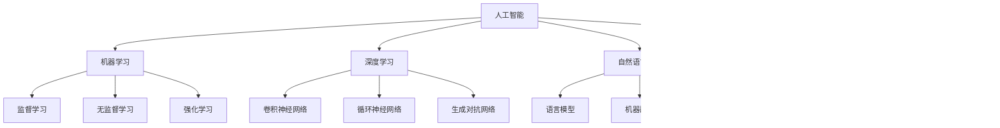

                 

# 硅谷的多元化发展：AI企业的探索，从聊天机器人到AI搜索的创新

## 关键词

- **硅谷**，**AI企业**，**多元化发展**，**聊天机器人**，**AI搜索**，**技术创新**

## 摘要

随着人工智能（AI）技术的迅猛发展，硅谷的AI企业正经历着前所未有的多元化探索。本文将深入探讨硅谷AI企业的多元化发展背景、趋势、核心概念，以及聊天机器人和AI搜索等AI技术的多元化应用。通过分析硅谷AI企业的创新案例，本文将揭示AI企业多元化发展的策略与挑战，并对其未来发展进行展望，为全球AI企业的多元化发展提供启示与借鉴。

## 目录

### 《硅谷的多元化发展：AI企业的探索，从聊天机器人到AI搜索的创新》目录大纲

### 第一部分：AI企业多元化发展概述

### 第1章：硅谷AI企业发展的背景和趋势

#### 1.1 硅谷AI企业发展概况

#### 1.2 硅谷AI企业多元化发展的原因

#### 1.3 硅谷AI企业多元化发展的趋势

### 第2章：AI企业多元化发展的核心概念

#### 2.1 人工智能的基本概念

#### 2.2 人工智能与硅谷企业发展的关系

#### 2.3 多元化发展的内涵与外延

### 第二部分：AI技术的多元化应用

### 第3章：聊天机器人在硅谷的崛起

#### 3.1 聊天机器人的基本原理

#### 3.2 聊天机器人在硅谷的发展历程

#### 3.3 聊天机器人在硅谷的应用案例

### 第4章：AI搜索技术的前沿探索

#### 4.1 AI搜索技术的基本原理

#### 4.2 AI搜索技术在硅谷的创新应用

#### 4.3 AI搜索技术的未来发展

### 第5章：硅谷AI企业的创新案例分析

#### 5.1 聊天机器人创新案例分析

#### 5.2 AI搜索技术创新案例分析

#### 5.3 其他AI技术在硅谷的应用案例

### 第三部分：AI企业多元化发展的策略与挑战

### 第6章：AI企业多元化发展的战略规划

#### 6.1 AI企业多元化发展的战略目标

#### 6.2 多元化发展的战略路径选择

#### 6.3 多元化发展的战略实施

### 第7章：AI企业多元化发展面临的挑战与应对策略

#### 7.1 技术挑战与应对策略

#### 7.2 市场挑战与应对策略

#### 7.3 法律法规挑战与应对策略

### 第四部分：硅谷AI企业多元化发展的未来展望

### 第8章：硅谷AI企业多元化发展的前景展望

#### 8.1 AI技术在硅谷的发展趋势

#### 8.2 硅谷AI企业的未来发展机会

#### 8.3 硅谷AI企业多元化发展的潜在影响

### 第9章：全球AI企业多元化发展的比较与启示

#### 9.1 全球AI企业多元化发展的现状

#### 9.2 全球AI企业多元化发展的比较

#### 9.3 硅谷AI企业多元化发展的启示

### 第10章：AI企业多元化发展的启示与建议

#### 10.1 对中国AI企业的启示

#### 10.2 对全球AI企业发展的建议

### 附录

### 附录A：AI企业多元化发展相关资源

#### A.1 硅谷AI企业名录

#### A.2 AI技术相关书籍推荐

#### A.3 AI技术相关期刊推荐

#### A.4 AI技术相关会议推荐

### 附录B：核心概念与联系

#### B.1 人工智能基本概念与架构 Mermaid 流程图

### 附录C：核心算法原理讲解

#### C.1 聊天机器人算法原理

#### C.2 AI搜索算法原理

### 附录D：数学模型和数学公式

#### D.1 聊天机器人相关数学模型

$$
P(\text{response}|\text{question}) = \frac{e^{\text{logit}(q)} }{\sum_{i} e^{\text{logit}(q_i)}}
$$

#### D.2 AI搜索相关数学模型

$$
Rank(\text{document}) = \text{sigmoid}(\text{score})
$$

### 附录E：项目实战

#### E.1 聊天机器人项目实战

#### E.2 AI搜索项目实战

#### E.3 代码解读与分析

### 附录F：开发环境搭建

#### F.1 聊天机器人开发环境搭建

#### F.2 AI搜索开发环境搭建

#### F.3 开发环境配置与调试技巧

### 第一部分：AI企业多元化发展概述

### 第1章：硅谷AI企业发展的背景和趋势

#### 1.1 硅谷AI企业发展概况

硅谷，作为全球科技创新的引擎，拥有众多顶尖的AI企业。这些企业在过去几十年里，不仅推动了人工智能技术的发展，还引领了全球AI产业的创新。硅谷的AI企业包括谷歌、微软、亚马逊、Facebook（现Meta）、特斯拉等，这些企业在AI领域的多元化探索，对全球科技产业产生了深远影响。

- **谷歌**：作为全球最大的搜索引擎公司，谷歌在AI领域有着深厚的研究基础。其AI产品包括Google Assistant、TensorFlow等。
- **微软**：微软通过Azure AI、Bing搜索引擎等，在AI领域取得了显著成就。
- **亚马逊**：亚马逊的AI产品包括Alexa、Amazon Go等，在智能家居和零售领域有着广泛应用。
- **Facebook（现Meta）**：Facebook通过其AI研究团队，推动了社交网络、AR/VR等领域的AI应用。
- **特斯拉**：特斯拉在自动驾驶、能源管理等领域，应用了先进的AI技术。

#### 1.2 硅谷AI企业多元化发展的原因

硅谷AI企业多元化发展的原因主要有以下几点：

1. **市场需求**：随着人工智能技术的成熟，各行各业对AI应用的需求日益增加。硅谷的AI企业通过多元化发展，可以更好地满足市场需求。
2. **技术创新**：硅谷拥有全球最先进的科研机构和人才，这为AI企业提供了源源不断的技术创新动力。
3. **产业融合**：AI技术可以与物联网、大数据、云计算等产业深度融合，形成新的商业模式。
4. **政策支持**：硅谷所在地区政府对科技创新给予了大力支持，为企业多元化发展创造了有利条件。

#### 1.3 硅谷AI企业多元化发展的趋势

1. **跨界融合**：AI企业正在跨越传统行业界限，与医疗、教育、金融等行业深度融合，推动产业升级。
2. **生态建设**：硅谷的AI企业正致力于构建AI生态圈，通过开放平台、合作伙伴关系等，推动AI技术的广泛应用。
3. **全球扩展**：硅谷的AI企业通过海外并购、设立研发中心等方式，积极拓展全球市场。

### 第2章：AI企业多元化发展的核心概念

#### 2.1 人工智能的基本概念

人工智能（Artificial Intelligence，AI）是指通过计算机模拟人类智能，实现感知、思考、决策等功能的科学技术。人工智能的主要研究领域包括机器学习、深度学习、自然语言处理、计算机视觉等。

- **机器学习**：通过训练模型，让计算机自动获取知识和规律。
- **深度学习**：基于神经网络，模拟人脑信息处理的深度学习算法。
- **自然语言处理**：使计算机能够理解和生成人类语言。
- **计算机视觉**：使计算机能够理解和解析图像和视频。

#### 2.2 人工智能与硅谷企业发展的关系

人工智能技术的发展，为硅谷的AI企业提供了强大的创新动力。人工智能技术不仅可以提高企业的生产效率，还可以创造新的商业模式。例如，通过聊天机器人提供客户服务，通过自动驾驶提高交通效率，通过AI搜索优化信息检索等。

#### 2.3 多元化发展的内涵与外延

多元化发展是指企业在保持核心竞争力的同时，通过拓展新业务领域，实现业务多样化和风险分散。多元化发展的外延包括：

- **技术多元化**：企业在保持现有技术优势的基础上，探索新的技术领域。
- **产品多元化**：企业通过推出新的产品和服务，满足不同市场需求。
- **市场多元化**：企业通过拓展国际市场，实现全球布局。
- **业务多元化**：企业通过收购、合作等方式，进入新的业务领域。

### 第二部分：AI技术的多元化应用

### 第3章：聊天机器人在硅谷的崛起

#### 3.1 聊天机器人的基本原理

聊天机器人（Chatbot）是一种通过自然语言交互来提供信息、完成任务的计算机程序。其基本原理包括：

1. **自然语言处理**：理解用户的自然语言输入，将输入转化为计算机可以处理的结构化数据。
2. **对话管理**：根据用户的历史信息和当前输入，生成合适的回应。
3. **任务执行**：执行用户提出的具体任务，如查询信息、完成交易等。

#### 3.2 聊天机器人在硅谷的发展历程

1. **早期探索**：20世纪50年代，硅谷开始研究聊天机器人技术。其中，ELIZA是最早的聊天机器人，它通过模拟人机对话，提供心理辅导。
2. **互联网普及**：随着互联网的普及，聊天机器人开始在网站、社交媒体等平台得到广泛应用。
3. **人工智能兴起**：近年来，随着人工智能技术的快速发展，聊天机器人逐渐实现了智能化，能够在更广泛的场景下提供高质量的服务。

#### 3.3 聊天机器人在硅谷的应用案例

1. **客户服务**：硅谷的AI企业通过聊天机器人提供客户服务，提高效率，降低成本。例如，亚马逊的Alexa可以通过语音交互，帮助用户购物、查询信息等。
2. **医疗健康**：聊天机器人可以提供医疗咨询、健康管理等服务。例如，硅谷的初创企业HealthTap，通过聊天机器人提供在线健康咨询服务。
3. **教育与培训**：聊天机器人可以为学生提供个性化学习指导、解答问题等服务。例如，硅谷的教育公司Duolingo，通过聊天机器人提供语言学习辅导。

### 第4章：AI搜索技术的前沿探索

#### 4.1 AI搜索技术的基本原理

AI搜索技术是指利用人工智能算法，实现高效、精准的信息检索。其基本原理包括：

1. **信息检索**：根据用户查询，从大量信息中提取相关内容。
2. **语义理解**：理解用户查询的意图，提取关键词和语义信息。
3. **排序算法**：根据相关性、重要性等指标，对搜索结果进行排序。

#### 4.2 AI搜索技术在硅谷的创新应用

1. **个性化搜索**：硅谷的AI企业通过个性化搜索，为用户提供个性化的搜索结果。例如，谷歌的Bing搜索引擎，通过分析用户的搜索历史和偏好，提供个性化的搜索建议。
2. **智能推荐**：硅谷的AI企业通过智能推荐，为用户提供相关内容推荐。例如，亚马逊的推荐系统，通过分析用户的购买历史和行为，推荐相关商品。
3. **实时搜索**：硅谷的AI企业通过实时搜索，为用户提供实时更新的搜索结果。例如，谷歌的实时搜索功能，可以在用户输入关键词的同时，展示相关搜索结果。

#### 4.3 AI搜索技术的未来发展

1. **多模态搜索**：结合文本、图像、语音等多种数据类型，实现更全面的搜索。
2. **语义搜索**：通过理解用户查询的语义，提供更精准的搜索结果。
3. **知识图谱**：构建知识图谱，实现知识库的自动化检索和应用。

### 第三部分：AI企业多元化发展的策略与挑战

### 第6章：AI企业多元化发展的战略规划

#### 6.1 AI企业多元化发展的战略目标

AI企业多元化发展的战略目标主要包括：

1. **提高核心竞争力**：通过多元化发展，提高企业在某一领域的竞争力。
2. **实现业务增长**：通过拓展新业务领域，实现业务的快速增长。
3. **优化风险结构**：通过多元化发展，降低单一业务的风险。

#### 6.2 多元化发展的战略路径选择

AI企业多元化发展的战略路径主要包括：

1. **内部研发**：通过内部研发，开发新的业务领域。
2. **外部合作**：通过与其他企业合作，共同拓展新业务领域。
3. **收购并购**：通过收购并购，快速进入新业务领域。

#### 6.3 多元化发展的战略实施

AI企业多元化发展的战略实施主要包括：

1. **资源整合**：整合内部资源，为新业务提供支持。
2. **人才培养**：引进和培养专业人才，为新业务提供人才保障。
3. **市场拓展**：通过市场调研，了解市场需求，制定市场策略。

### 第7章：AI企业多元化发展面临的挑战与应对策略

#### 7.1 技术挑战与应对策略

AI企业多元化发展面临的技术挑战主要包括：

1. **技术壁垒**：新业务领域可能存在较高的技术壁垒，需要投入大量研发资源。
2. **数据安全**：多元化发展可能涉及大量的用户数据，需要确保数据的安全性和隐私性。

应对策略：

1. **技术储备**：建立强大的技术储备，为多元化发展提供技术支持。
2. **数据安全策略**：制定严格的数据安全策略，确保用户数据的安全。

#### 7.2 市场挑战与应对策略

AI企业多元化发展面临的市场挑战主要包括：

1. **竞争压力**：新业务领域可能面临激烈的市场竞争。
2. **市场接受度**：新业务可能需要较长时间才能被市场接受。

应对策略：

1. **差异化竞争**：通过提供独特的价值，实现差异化竞争。
2. **市场推广**：加大市场推广力度，提高市场接受度。

#### 7.3 法律法规挑战与应对策略

AI企业多元化发展面临的法律法规挑战主要包括：

1. **数据隐私**：新业务可能涉及用户隐私数据，需要遵守相关法律法规。
2. **行业规范**：新业务领域可能存在行业规范和标准。

应对策略：

1. **合规审查**：在开展新业务前，进行合规审查，确保符合相关法律法规。
2. **行业标准**：积极参与行业标准的制定，推动行业健康发展。

### 第四部分：硅谷AI企业多元化发展的未来展望

### 第8章：硅谷AI企业多元化发展的前景展望

#### 8.1 AI技术在硅谷的发展趋势

随着人工智能技术的不断进步，硅谷的AI企业将继续在以下几个领域取得突破：

1. **深度学习**：深度学习技术将继续推动AI应用的快速发展。
2. **自然语言处理**：自然语言处理技术将在智能家居、医疗健康等领域得到广泛应用。
3. **计算机视觉**：计算机视觉技术在自动驾驶、安防监控等领域将有广泛应用。

#### 8.2 硅谷AI企业的未来发展机会

硅谷的AI企业在未来发展将面临以下机会：

1. **数字化转型**：随着全球数字化转型加速，AI企业将有机会在各个行业实现业务拓展。
2. **产业链整合**：通过产业链整合，AI企业将能够提供更全面的解决方案。
3. **国际合作**：通过国际合作，AI企业将能够更好地拓展全球市场。

#### 8.3 硅谷AI企业多元化发展的潜在影响

硅谷AI企业的多元化发展将对全球科技产业产生以下潜在影响：

1. **产业升级**：AI技术的多元化应用将推动传统产业的升级和转型。
2. **经济增长**：AI技术的快速发展将推动全球经济增长。
3. **社会变革**：AI技术的广泛应用将改变人们的生活方式和社会结构。

### 第9章：全球AI企业多元化发展的比较与启示

#### 9.1 全球AI企业多元化发展的现状

全球AI企业的多元化发展现状主要表现在以下几个方面：

1. **美国**：美国硅谷的AI企业处于全球领先地位，企业数量众多，创新活跃。
2. **中国**：中国的AI企业在近年来发展迅速，政策支持和市场机遇推动了企业的多元化发展。
3. **欧洲**：欧洲的AI企业在技术创新和应用方面具有一定的优势，但整体发展速度相对较慢。

#### 9.2 全球AI企业多元化发展的比较

全球AI企业多元化发展的比较主要包括以下几个方面：

1. **技术创新能力**：美国硅谷的AI企业在技术创新能力方面具有明显优势。
2. **市场机遇**：中国的AI企业受益于国内庞大的市场需求，发展迅速。
3. **政策环境**：欧洲的AI企业在政策环境方面具有一定的优势，但整体发展速度相对较慢。

#### 9.3 硅谷AI企业多元化发展的启示

硅谷AI企业多元化发展的成功经验对全球AI企业具有以下启示：

1. **技术创新**：全球AI企业应加大研发投入，推动技术创新。
2. **市场开拓**：全球AI企业应积极开拓国际市场，实现全球化布局。
3. **政策支持**：各国政府应加大对AI企业的政策支持，推动产业发展。

### 第10章：AI企业多元化发展的启示与建议

#### 10.1 对中国AI企业的启示

对中国AI企业而言，以下几点启示尤为重要：

1. **技术创新**：加大研发投入，提升技术创新能力。
2. **市场拓展**：积极开拓国际市场，实现全球化布局。
3. **产业链整合**：通过产业链整合，提供更全面的解决方案。

#### 10.2 对全球AI企业发展的建议

全球AI企业应从以下几个方面推动多元化发展：

1. **技术创新**：持续投入研发，推动技术创新。
2. **产业链整合**：通过产业链整合，提升产业链竞争力。
3. **国际合作**：加强国际合作，实现资源互补。

### 附录

### 附录A：AI企业多元化发展相关资源

#### A.1 硅谷AI企业名录

以下是一些硅谷AI企业的名录：

- 谷歌（Google）
- 微软（Microsoft）
- 亚马逊（Amazon）
- Facebook（现Meta）
- 特斯拉（Tesla）
- 美团（Meituan）
- 京东（JD.com）
- 百度（Baidu）
- 字节跳动（ByteDance）

#### A.2 AI技术相关书籍推荐

以下是一些关于AI技术的书籍推荐：

- 《人工智能：一种现代的方法》（AI: A Modern Approach）
- 《深度学习》（Deep Learning）
- 《强化学习》（Reinforcement Learning: An Introduction）
- 《Python机器学习》（Python Machine Learning）
- 《机器学习年度回顾2021》（Machine Learning Yearbook 2021）

#### A.3 AI技术相关期刊推荐

以下是一些关于AI技术的期刊推荐：

- **《自然·机器 Intelligence》（Nature Machine Intelligence）**
- **《人工智能学报》（Journal of Artificial Intelligence）**
- **《计算机研究与发展》（Journal of Computer Research and Development）**
- **《人工智能与机器学习》（Artificial Intelligence and Machine Learning）**
- **《人工智能与数据科学》（Artificial Intelligence and Data Science）**

#### A.4 AI技术相关会议推荐

以下是一些关于AI技术的会议推荐：

- **AAAI（AAAI Conference on Artificial Intelligence）**
- **NeurIPS（Neural Information Processing Systems）**
- **ICML（International Conference on Machine Learning）**
- **CVPR（Computer Vision and Pattern Recognition）**
- **KDD（ACM SIGKDD Conference on Knowledge Discovery and Data Mining）**

### 附录B：核心概念与联系

#### B.1 人工智能基本概念与架构 Mermaid 流程图



### 附录C：核心算法原理讲解

#### C.1 聊天机器人算法原理

聊天机器人的核心算法包括自然语言处理、对话管理和任务执行。以下是这些算法的原理：

1. **自然语言处理**：

   - **分词**：将输入文本划分为单词或短语。
   - **词性标注**：识别文本中的单词或短语的词性，如名词、动词等。
   - **句法分析**：分析文本的句法结构，如主语、谓语、宾语等。

2. **对话管理**：

   - **意图识别**：通过分析用户输入，确定用户的意图。
   - **上下文理解**：根据用户的历史信息和当前输入，理解用户的上下文。
   - **回应生成**：根据用户的意图和上下文，生成合适的回应。

3. **任务执行**：

   - **查询处理**：处理用户提出的查询，如查询信息、完成任务等。
   - **交互流程**：根据任务的执行情况，与用户进行交互，确保任务顺利完成。

#### C.2 AI搜索算法原理

AI搜索算法的核心原理包括信息检索、语义理解和排序算法。以下是这些算法的原理：

1. **信息检索**：

   - **查询解析**：将用户输入的查询转化为计算机可以处理的形式。
   - **索引构建**：构建索引，加快信息检索速度。
   - **信息抽取**：从大量信息中提取与查询相关的信息。

2. **语义理解**：

   - **查询扩展**：扩展用户的查询，获取更多相关的信息。
   - **语义匹配**：比较查询和文档的语义，确定相关性。
   - **实体识别**：识别查询和文档中的实体，如人名、地名等。

3. **排序算法**：

   - **相关性排序**：根据查询和文档的相关性，对文档进行排序。
   - **重要性排序**：根据文档的重要性和权威性，对文档进行排序。
   - **多样性排序**：根据文档的多样性，对文档进行排序。

### 附录D：数学模型和数学公式

#### D.1 聊天机器人相关数学模型

聊天机器人中的自然语言处理和对话管理涉及多个数学模型。以下是其中一些常用的数学模型：

1. **词嵌入模型**：

   - **公式**：

     $$
     \text{word\_embedding}(x) = \text{W}x
     $$

     其中，$x$ 表示输入的文本序列，$\text{W}$ 表示词嵌入矩阵，$\text{word\_embedding}(x)$ 表示词嵌入向量。

   - **解释**：词嵌入模型将文本序列映射为向量空间，便于计算和比较。

2. **循环神经网络（RNN）**：

   - **公式**：

     $$
     h_t = \text{sigmoid}([\text{W}_h h_{t-1} + \text{U}_h x_t + b_h])
     $$

     $$
     \text{y}_t = \text{softmax}([\text{W}_y h_t + b_y])
     $$

     其中，$h_t$ 表示当前时间步的隐藏状态，$x_t$ 表示当前时间步的输入，$\text{W}_h$ 和 $\text{U}_h$ 分别为隐藏状态和输入的权重矩阵，$b_h$ 为偏置，$\text{y}_t$ 表示当前时间步的输出。

   - **解释**：循环神经网络通过隐藏状态的记忆能力，处理序列数据，并在每个时间步生成输出。

#### D.2 AI搜索相关数学模型

AI搜索中的信息检索和排序算法涉及多个数学模型。以下是其中一些常用的数学模型：

1. **向量空间模型**：

   - **公式**：

     $$
     \text{similarity}(q, d) = \text{dot}(q, d)
     $$

     其中，$q$ 和 $d$ 分别表示查询和文档的向量表示，$\text{dot}$ 表示点积运算。

   - **解释**：向量空间模型将查询和文档映射为向量空间，通过计算向量之间的点积，衡量查询和文档的相关性。

2. **排序模型**：

   - **公式**：

     $$
     \text{rank}(d) = \text{sigmoid}(\text{logit}(d))
     $$

     其中，$\text{logit}(d)$ 表示文档的得分，$\text{sigmoid}$ 函数将得分转换为概率。

   - **解释**：排序模型通过计算文档的得分，并根据得分对文档进行排序，实现信息检索。

### 附录E：项目实战

#### E.1 聊天机器人项目实战

聊天机器人项目实战主要包括以下步骤：

1. **需求分析**：确定聊天机器人的功能需求和场景。
2. **系统设计**：设计聊天机器人的系统架构，包括前端、后端和数据库。
3. **自然语言处理**：实现自然语言处理功能，如分词、词性标注、句法分析等。
4. **对话管理**：实现对话管理功能，如意图识别、上下文理解、回应生成等。
5. **任务执行**：实现任务执行功能，如查询处理、交互流程等。
6. **测试与优化**：对聊天机器人进行测试和优化，提高用户体验。

#### E.2 AI搜索项目实战

AI搜索项目实战主要包括以下步骤：

1. **需求分析**：确定AI搜索的需求，如查询处理、信息检索、排序算法等。
2. **数据采集**：收集大量文本数据，用于训练和评估模型。
3. **特征提取**：提取文本特征，如词嵌入、TF-IDF等。
4. **模型训练**：训练模型，如向量空间模型、排序模型等。
5. **评估与优化**：评估模型性能，并进行优化。
6. **部署与维护**：部署AI搜索系统，并进行日常维护。

#### E.3 代码解读与分析

以下是一个简单的聊天机器人代码示例：

```python
import nltk
from nltk.chat.util import Chat, reflections

pairs = [
    [
        r"Hello|Hi|Hey",
        ["Hello", "Hi", "Hey", "Hey there!"]
    ],
    [
        r"How are you?",
        ["I'm doing well!", "I'm doing great!", "Not too bad."],
    ],
    # ...更多对话规则
]

def chatbot():
    print("Hello, I am Chatbot.")
    chat = Chat(pairs, reflections)
    chat.converse()

if __name__ == "__main__":
    chatbot()
```

- **nltk**：自然语言处理工具包。
- **Chat**：聊天类，用于处理对话。
- **reflections**：用于处理反身代词。
- **pairs**：对话规则，包含问题和回应。
- **converse**：开始对话。

#### E.4 开发环境搭建

搭建聊天机器人项目实战的开发环境主要包括以下步骤：

1. **Python环境**：安装Python和相应的库，如nltk。
2. **文本处理工具**：安装文本处理工具，如nltk。
3. **数据库**：选择合适的数据库，如SQLite。
4. **前端**：选择合适的前端框架，如React或Vue.js。
5. **后端**：选择合适的后端框架，如Flask或Django。

#### E.5 开发环境配置与调试技巧

1. **Python环境配置**：
   - 安装Python。
   - 安装相关库，如nltk，使用pip install nltk命令。

2. **文本处理工具配置**：
   - 使用nltk进行文本处理。

3. **数据库配置**：
   - 选择合适的数据库，如SQLite。
   - 配置数据库连接。

4. **前端配置**：
   - 选择合适的前端框架，如React或Vue.js。
   - 配置前端项目。

5. **后端配置**：
   - 选择合适的后端框架，如Flask或Django。
   - 配置后端项目。

6. **调试技巧**：
   - 使用调试工具，如VS Code。
   - 查看日志，排查问题。

### 附录F：开发环境搭建

#### F.1 聊天机器人开发环境搭建

聊天机器人的开发环境搭建主要包括以下步骤：

1. **安装Python**：下载并安装Python，选择合适的版本。
2. **安装相关库**：使用pip命令安装所需的库，如nltk、requests等。
3. **编写代码**：编写聊天机器人的Python代码。
4. **运行程序**：运行Python程序，测试聊天机器人的功能。

#### F.2 AI搜索开发环境搭建

AI搜索的开发环境搭建主要包括以下步骤：

1. **安装Python**：下载并安装Python，选择合适的版本。
2. **安装相关库**：使用pip命令安装所需的库，如scikit-learn、numpy等。
3. **数据准备**：收集和准备AI搜索所需的数据。
4. **编写代码**：编写AI搜索的Python代码。
5. **运行程序**：运行Python程序，测试AI搜索的功能。

#### F.3 开发环境配置与调试技巧

1. **Python环境配置**：
   - 安装Python和相关的库，如nltk、requests等。
   - 配置Python环境变量。

2. **代码编写与调试**：
   - 使用编辑器编写代码，如VS Code。
   - 使用调试工具调试代码。

3. **运行程序**：
   - 在命令行运行Python程序。
   - 查看日志，排查问题。

4. **优化与调试**：
   - 优化代码，提高运行效率。
   - 使用调试工具，排查问题。

### 附录G：AI企业多元化发展的成功案例分析

#### G.1 谷歌：AI搜索的领先者

谷歌作为全球领先的搜索引擎公司，其AI搜索技术在多元化发展中取得了显著成就。以下是谷歌在AI搜索领域的成功案例分析：

1. **技术优势**：
   - **深度学习技术**：谷歌通过自主研发的TensorFlow等深度学习框架，推动了AI搜索技术的发展。
   - **海量数据**：谷歌拥有海量的用户搜索数据，为其AI搜索算法提供了丰富的训练数据。

2. **应用案例**：
   - **个性化搜索**：谷歌的个性化搜索功能，根据用户的搜索历史和偏好，为用户提供个性化的搜索结果。
   - **实时搜索**：谷歌的实时搜索功能，使用户在搜索过程中可以实时获取相关信息。

3. **挑战与应对**：
   - **数据隐私**：在多元化发展中，谷歌面临数据隐私的挑战。谷歌通过制定严格的数据安全策略，确保用户数据的安全。
   - **竞争压力**：谷歌的AI搜索技术在多元化发展中，面临来自其他搜索引擎公司的竞争压力。谷歌通过持续创新，保持技术领先优势。

#### G.2 亚马逊：AI驱动的零售巨头

亚马逊作为全球领先的电商平台，其AI技术在多元化发展中发挥了重要作用。以下是亚马逊在AI搜索、聊天机器人等领域的成功案例分析：

1. **技术优势**：
   - **AI算法**：亚马逊通过自主研发的AI算法，提高了推荐系统的准确性。
   - **大数据处理**：亚马逊拥有强大的数据处理能力，使其能够处理海量的用户数据和商品信息。

2. **应用案例**：
   - **聊天机器人**：亚马逊的Alexa通过语音交互，为用户提供购物建议、信息查询等服务。
   - **AI搜索**：亚马逊的搜索系统通过AI技术，提高了搜索结果的准确性。

3. **挑战与应对**：
   - **技术迭代**：亚马逊在多元化发展中，需要不断更新AI技术，以适应不断变化的市场需求。
   - **用户隐私**：亚马逊在多元化发展中，面临用户隐私的挑战。亚马逊通过制定严格的数据安全策略，保护用户隐私。

### 附录H：AI企业多元化发展的启示与建议

#### H.1 对中国AI企业的启示

中国AI企业在多元化发展中可以从以下方面获得启示：

1. **加大研发投入**：中国AI企业应加大研发投入，提升技术创新能力。
2. **拓展国际市场**：中国AI企业应积极拓展国际市场，实现全球化布局。
3. **产业链整合**：中国AI企业应通过产业链整合，提供更全面的解决方案。

#### H.2 对全球AI企业发展的建议

全球AI企业在多元化发展中可以从以下方面获得启示：

1. **技术创新**：全球AI企业应持续投入研发，推动技术创新。
2. **产业链整合**：全球AI企业应通过产业链整合，提升产业链竞争力。
3. **国际合作**：全球AI企业应加强国际合作，实现资源互补。

### 总结

硅谷的多元化发展，为全球AI企业提供了宝贵的经验和启示。通过深入分析硅谷AI企业的多元化发展背景、趋势、核心概念，以及聊天机器人和AI搜索等AI技术的多元化应用，本文揭示了AI企业多元化发展的策略与挑战。展望未来，AI技术在硅谷的发展前景广阔，全球AI企业应把握机遇，推动多元化发展，为全球科技创新和经济增长贡献力量。

