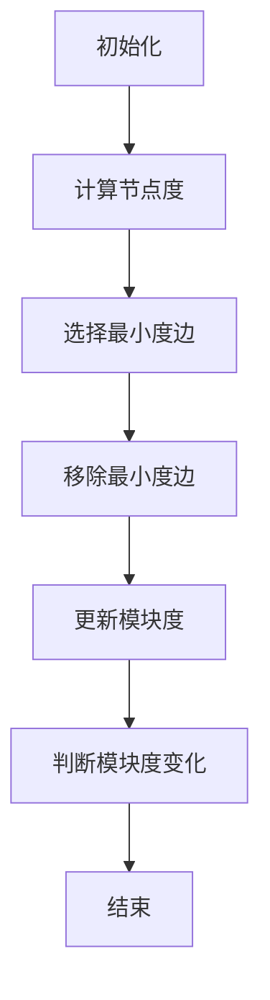

                 

# 《社区发现：原理与代码实例讲解》

## 关键词

- 社区发现
- 社会网络分析
- 图算法
- 机器学习
- 实际应用
- 项目实战

## 摘要

社区发现是一种重要的数据分析技术，它旨在识别和提取网络中的紧密连接的子图，这些子图代表一组具有共同特征的实体。本文将深入探讨社区发现的基本原理，包括社会网络分析基础、社区发现的数学模型、图算法在社区发现中的应用，以及基于机器学习的社区发现算法。随后，我们将通过实际项目案例展示如何应用这些算法，并提供代码实例和详细解读，帮助读者理解并实践社区发现技术。最后，我们将总结社区发现的应用领域，分享社区发现工具和资源，并提供一个实践指南。

### 第一部分：社区发现基础知识

## 第1章：社区发现概述

### 1.1 社区发现的定义与意义

社区发现（Community Detection）是一种在社会网络分析（Social Network Analysis, SNA）领域广泛应用的算法和技术。它旨在从一个复杂网络中识别出具有紧密连接关系的子图，这些子图称为社区（Community）。在现实世界中，社区发现可以应用于多种领域，如社交网络、生物信息学、网络科学等。

定义上，社区发现是指通过分析网络节点之间的连接关系，寻找出网络中紧密相连的节点集合。一个有效的社区应该具有以下几个特征：

1. **高度内聚性**：社区内部的节点之间连接紧密，交互频繁。
2. **较低的外部连接性**：社区之间的节点连接相对较少，形成了清晰的边界。
3. **模块化结构**：社区内部节点具有较高的聚集度，而社区之间则具有较低的连接性。

社区发现的实际意义在于，通过揭示网络中的潜在结构和组织形式，可以更好地理解网络的动态行为和功能特性。例如，在社交网络中，社区发现可以帮助我们识别出具有共同兴趣或活动的用户群体；在生物信息学中，可以揭示蛋白质之间的功能关系；在网络科学中，可以分析复杂网络的结构特性。

### 1.2 社区发现的类型与方法

社区发现的类型可以根据不同的划分标准进行分类。以下是几种常见的分类方法：

1. **基于结构的方法**：这种方法主要关注网络的结构特征，通过计算节点之间的相似性或距离来识别社区。常见的算法有 Girvan-Newman 算法、标签传播算法等。

2. **基于模块度的方法**：模块度（Modularity）是衡量社区内部连接紧密程度的重要指标。基于模块度的算法通过优化模块度来识别社区，如 Girvan-Newman 算法、Louvain 算法等。

3. **基于密度的方法**：这种方法基于网络节点的密度来识别社区。高密度区域往往代表潜在社区。常见的算法有基于密度的聚类算法、图划分算法等。

4. **基于概率的方法**：这种方法通过概率模型来建模社区结构，如随机图模型、代数图模型等。常见的算法有概率模型聚类算法、隐马尔可夫模型等。

5. **基于机器学习的方法**：这种方法利用机器学习技术，如聚类算法、分类算法等，从网络数据中自动识别社区。

### 1.3 社区发现的应用领域

社区发现技术具有广泛的应用领域，以下是一些典型的应用场景：

1. **社交网络分析**：通过识别社交网络中的社区，可以更好地理解用户的兴趣和社交关系，从而为社交平台提供个性化推荐服务。

2. **生物信息学**：在蛋白质相互作用网络中，社区发现可以揭示蛋白质的功能模块和生物通路，帮助科学家理解生物系统的复杂性和运行机制。

3. **网络科学**：通过分析复杂网络中的社区结构，可以了解网络的稳定性、传播行为等特性，为网络设计和优化提供依据。

4. **推荐系统**：在电子商务、在线广告等领域，社区发现可以帮助推荐系统识别具有共同兴趣的用户群体，提高推荐效果。

5. **社区生态建设**：在社区管理和生态建设中，社区发现技术可以用于识别关键节点和核心用户，为社区运营和优化提供支持。

## 第2章：社会网络分析基础

### 2.1 社会网络的定义与特点

社会网络（Social Network）是指由一组节点（代表实体，如人、组织、物品等）和连接这些节点的边（代表关系或交互）组成的网络结构。社会网络分析（SNA）是一种研究社会结构和关系的分析方法，通过分析节点和边的关系，揭示网络中的潜在模式和规律。

社会网络具有以下特点：

1. **复杂性**：社会网络通常包含大量的节点和边，形成一个复杂的网络结构。
2. **动态性**：社会网络中的节点和边可以随时发生变化，如节点加入或退出、边建立或断开等。
3. **异质性**：社会网络中的节点和边具有不同的属性和特征，如人口统计信息、社交关系强度等。
4. **紧密性和稀疏性**：社会网络既有紧密的社交圈子，又有广泛的社交网络，形成了一种紧密性和稀疏性共存的结构。

### 2.2 社会网络的基本概念

社会网络分析涉及一系列基本概念，以下是一些关键概念：

1. **节点（Node）**：社会网络中的节点代表实体，如人、组织、物品等。
2. **边（Edge）**：社会网络中的边代表节点之间的关系或交互，如友谊、合作关系、信息传递等。
3. **度（Degree）**：节点度是指与该节点直接相连的边的数量，分为入度（In-degree）和出度（Out-degree）。
4. **路径（Path）**：两个节点之间存在一系列连续的边，形成路径。
5. **中心性**：中心性是衡量节点在网络中的中心程度，常见的中心性指标有度中心性、介数中心性、接近中心性等。
6. **聚类系数**：聚类系数是衡量网络中节点之间连接紧密程度的指标，表示一个节点周围邻居节点的平均连接密度。

### 2.3 社会网络的度量指标

社会网络分析中常用的度量指标包括以下几种：

1. **度分布**：度分布是描述网络中节点度值分布的统计指标，可以帮助我们了解网络的异质性。
2. **平均路径长度**：平均路径长度是描述网络中节点之间平均距离的指标，较短的平均路径长度意味着网络具有较高的连通性。
3. **聚类系数**：聚类系数反映了网络中节点的连接紧密程度，较高的聚类系数意味着网络具有较高的内部连接性。
4. **平均节点度**：平均节点度是描述网络中节点度值的平均值，可以帮助我们了解网络的稠密程度。
5. **网络密度**：网络密度是描述网络中边与可能边的比例，是衡量网络紧密性的指标。

### 第3章：社区发现的数学模型

社区发现算法的核心在于对网络结构进行建模，从而识别出具有紧密连接的子图。在数学模型的基础上，我们可以设计出不同的算法来发现社区。本节将介绍几种常见的社区发现数学模型。

#### 3.1 社区发现的概率模型

概率模型是社区发现中的一种重要方法，它通过建模网络节点间的概率关系来识别社区。典型的概率模型包括随机图模型和马尔可夫网络。

1. **随机图模型**：
   - **Erdős-Rényi 模型**：这是最简单的随机图模型，假设网络中的节点和边以一定的概率随机生成。在这种模型中，一个节点属于某个社区的概率与其邻接节点的社区分布相关。
   - **Stochastic Block Model (SBM)**：SBM 是 Erdős-Rényi 模型的扩展，它假设网络中的节点被分为多个社区，每个社区内的边以固定概率存在，而不同社区之间的边以较低的概率存在。通过最大似然估计或贝叶斯方法，可以推断出社区的结构。

2. **马尔可夫网络**：
   - **Hidden Markov Model (HMM)**：HMM 是一种基于时间的马尔可夫模型，它可以用来描述网络中节点状态的变化。在社区发现中，HMM 可以用来推断节点的社区归属，假设每个节点的社区状态是马尔可夫过程的一部分。

#### 3.2 社区发现的无向图模型

无向图模型直接使用图论来描述社区发现。以下是几种常见的无向图模型：

1. **Girvan-Newman 算法**：
   - **模块度（Modularity）**：模块度是衡量社区结构质量的指标，表示网络中实际存在的社区连接比随机连接更紧密的程度。Girvan-Newman 算法通过迭代移除网络中最脆弱的边（连接度最低的边）来逐步分解网络，最终识别出社区。
   - **模块度最大化**：Girvan-Newman 算法的目标是最大化网络的模块度，通过反复执行上述步骤，直到模块度不再显著增加。

2. **标签传播模型**：
   - **标签传播算法**：这是一种基于随机过程的方法，通过初始化一些节点的标签（即社区标识）来传播标签。未标记的节点通过观察其邻居的标签来更新自己的标签，最终达到稳定状态，形成社区。

#### 3.3 社区发现的图论模型

图论模型利用图结构特性来发现社区。以下是几种常见的图论模型：

1. **Katz 中心性**：
   - **Katz 中心性**：这是基于路径的度量指标，通过计算节点之间路径的权重来衡量节点的中心性。在社区发现中，高中心性的节点可能是社区的核心。

2. **图划分算法**：
   - **基于密度的聚类**：这种方法通过优化社区内部节点的密度和社区之间的边界来识别社区。常见的算法包括谱聚类和基于密度的聚类算法。
   - **谱聚类**：谱聚类算法利用图拉普拉斯矩阵进行降维，通过优化目标函数来划分社区。目标函数通常包括最小化社区内部的相似度差异和最大化社区之间的相似度差异。

3. **社区识别算法**：
   - **基于节点的算法**：这类算法直接针对节点进行操作，如基于节点的模块度优化算法、基于节点度的社区发现算法。
   - **基于边的算法**：这类算法通过分析边的关系来识别社区，如基于边权重的社区发现算法、基于边之间关系的算法。

这些数学模型和算法为社区发现提供了理论基础和方法支持，帮助我们在复杂网络中识别出具有紧密连接的子图。接下来，我们将深入探讨这些模型在图算法中的应用。

### 第4章：图算法在社区发现中的应用

图算法在社区发现中扮演着关键角色，通过对网络结构的深入分析，可以有效地识别出社区。本节将介绍几种常见的图算法，包括最短路径算法、连通性算法和社区识别算法，并讨论它们在社区发现中的应用。

#### 4.1 最短路径算法

最短路径算法是图算法中最基本也是最重要的算法之一，用于寻找图中两点之间的最短路径。在社区发现中，最短路径算法可以帮助我们识别节点之间的连接强度和影响范围。

1. **Dijkstra 算法**：
   - **基本原理**：Dijkstra 算法通过使用优先队列（通常实现为二叉堆）来寻找从起始节点到其他所有节点的最短路径。它逐步扩展最短路径，每次选择当前未访问节点中距离最短的。
   - **伪代码**：
     ```python
     dijkstra(graph, start):
         create a priority queue Q and initialize it with all nodes in the graph
         with a priority of infinity
         create a dictionary dist to store the shortest distance from start to each node
         set dist[start] to 0 and all other dist values to infinity
         while Q is not empty:
             extract the node with the smallest priority
             for each neighbor of this node:
                 if dist[neighbor] > dist[node] + weight(node, neighbor):
                     update dist[neighbor] to dist[node] + weight(node, neighbor)
                     add neighbor to Q
     ```

2. **Floyd-Warshall 算法**：
   - **基本原理**：Floyd-Warshall 算法用于计算图中所有节点对之间的最短路径。它使用动态规划方法，逐步更新路径权重，直到找到所有节点对的最短路径。
   - **伪代码**：
     ```python
     floyd_warshall(graph):
         create a matrix dist to store the shortest distance between all pairs of nodes
         for each node i:
             for each node j:
                 dist[i][j] = graph[i][j]
         for each node k:
             for each node i:
                 for each node j:
                     dist[i][j] = min(dist[i][j], dist[i][k] + dist[k][j])
     ```

在社区发现中，最短路径算法可以用来衡量节点之间的连接强度。如果一个节点到其他节点的最短路径较短，这表明该节点在社区中具有较大的影响力。

#### 4.2 连通性算法

连通性算法用于判断图中是否存在路径连接所有节点，这对于社区发现中的整体网络结构和局部连接性分析至关重要。

1. **深度优先搜索（DFS）**：
   - **基本原理**：DFS 算法通过递归遍历图中的节点，标记已访问节点，从而判断图是否连通。如果从某个起点出发可以遍历所有节点，则图是连通的。
   - **伪代码**：
     ```python
     dfs(graph, node, visited):
         mark node as visited
         for each unvisited neighbor of node:
             if dfs(graph, neighbor, visited):
                 return True
         return False

     is_connected(graph):
         for each node in graph:
             if not dfs(graph, node, []):
                 return False
         return True
     ```

2. **广度优先搜索（BFS）**：
   - **基本原理**：BFS 算法通过队列实现，从起点开始逐层遍历图中的节点。如果可以到达所有节点，则图是连通的。
   - **伪代码**：
     ```python
     bfs(graph, start):
         create an empty queue and enqueue start
         create a set visited to store visited nodes
         while queue is not empty:
             dequeue a node
             if node is not in visited:
                 mark node as visited
                 for each neighbor of node:
                     enqueue neighbor
         return visited == set of all nodes in graph
     ```

连通性算法在社区发现中用于识别网络中的孤立点和断开部分。通过分析图的连通性，可以了解社区之间的连接情况，从而优化社区划分。

#### 4.3 社区识别算法

社区识别算法是社区发现的核心，用于从复杂网络中提取出具有紧密连接的社区。

1. **Girvan-Newman 算法**：
   - **基本原理**：Girvan-Newman 算法通过反复移除网络中的最短路径，逐步分解网络，最终形成社区。它基于模块度最大化原则，模块度是衡量社区结构质量的指标。
   - **伪代码**：
     ```python
     girvan_newman(graph):
         while graph is not empty:
             remove the edge with the smallest weight
             compute the new community structure using modularity
         return the final community structure
     ```

2. **标签传播算法**：
   - **基本原理**：标签传播算法通过初始化一些节点的标签，然后通过迭代传播标签来形成社区。未标记的节点根据邻居节点的标签更新自己的标签，最终形成稳定状态。
   - **伪代码**：
     ```python
     label_propagation(graph, initial_labels):
         while not all nodes are labeled:
             for each unlabeled node:
                 set its label to the majority label of its neighbors
         return the final labeled graph
     ```

3. **基于密度的聚类算法**：
   - **基本原理**：基于密度的聚类算法通过优化社区内部节点的密度和社区之间的边界来识别社区。密度高的区域被认为是潜在的社区。
   - **伪代码**：
     ```python
     density_clustering(graph, min_density):
         for each node in graph:
             if density of its neighborhood is greater than min_density:
                 create a new community and add the node to it
         return the list of communities
     ```

这些图算法为社区发现提供了强有力的工具，通过结合不同的算法，可以更准确地识别网络中的社区结构。接下来，我们将探讨如何利用这些算法进行实际应用。

### 第5章：基于图的社区发现算法

在社区发现领域，基于图的算法因其直接利用图结构特性而受到广泛关注。这些算法通过分析节点和边的关系，有效地识别出紧密连接的社区。本章将介绍几种常见的基于图的社区发现算法，包括谬论传播算法、模块度优化算法和局部社区检测算法。

#### 5.1 谬论传播算法

谬论传播算法（Misinformation Propagation Algorithm）是一种基于网络结构的社区发现方法，它模拟信息在网络中的传播过程，从而识别出潜在的社区结构。

1. **基本原理**：
   - **信息传播模型**：该算法假设网络中的节点可以处于以下三种状态：未感染（Uninfected）、感染中（Infected）和已免疫（Immune）。节点之间的边可以代表信息传播的可能性。
   - **传播过程**：算法从一些已知的感染节点开始，通过边进行信息传播。未感染的节点如果与足够多的感染节点相连，则被感染。已感染的节点继续传播信息，直到达到免疫状态。

2. **算法步骤**：
   - **初始化**：随机选择一些节点作为初始感染节点。
   - **传播**：对于每个感染节点，向其所有未感染邻居传播信息。如果邻居节点的感染邻居数量超过阈值，则该邻居被感染。
   - **免疫**：当一个节点的所有邻居都被感染或免疫，该节点进入免疫状态，停止传播。
   - **社区划分**：通过分析传播过程中的感染节点和免疫节点，将网络划分为不同的社区。

3. **伪代码**：
   ```python
   misinformation_propagation(graph, initial_nodes, threshold):
       initialize nodes as uninfected
       infect initial_nodes
       while there are uninfected nodes:
           for each infected node:
               for each uninfected neighbor:
                   if number of infected neighbors of neighbor > threshold:
                       infect neighbor
           for each infected node:
               if all neighbors are infected or immune:
                   become immune
       return the final infected and immune nodes
   ```

#### 5.2 模块度优化算法

模块度优化算法（Modularity Optimization Algorithm）是一种通过优化模块度来识别社区的方法。模块度是衡量网络中社区结构质量的指标，它反映了实际社区连接比随机连接更紧密的程度。

1. **基本原理**：
   - **模块度定义**：模块度 \( Q \) 是一个介于 0 和 1 之间的值，表示网络中社区结构的质量。计算公式为：
     $$ Q = \frac{1}{2m} \sum_{i<j} \left( A_{ij} - \frac{w_i w_j}{2m} \right) \delta(i \in C, j \in C) $$
     其中，\( A_{ij} \) 是节点 \( i \) 和节点 \( j \) 之间的边权重，\( w_i \) 和 \( w_j \) 分别是节点 \( i \) 和节点 \( j \) 的度，\( m \) 是边总数，\( \delta(i \in C, j \in C) \) 是克罗内克δ函数，当 \( i \) 和 \( j \) 都属于同一社区时为 1，否则为 0。
   - **优化目标**：算法的目标是最大化模块度，通过调整节点之间的边来形成更紧密的社区。

2. **算法步骤**：
   - **初始化**：随机将节点划分为社区。
   - **迭代优化**：在每一轮迭代中，算法选择一个边，如果将其从一个社区移到另一个社区能增加模块度，则进行移动。
   - **重复迭代**：重复迭代步骤，直到模块度不再增加或达到最大迭代次数。

3. **伪代码**：
   ```python
   modularity_optimization(graph):
       initialize communities randomly
       while not converged:
           for each edge (i, j):
               compute the change in modularity if edge (i, j) is moved between communities
               if change is positive:
                   move edge (i, j) to the community that increases modularity
           check for convergence (e.g., no edges moved or modularity change below threshold)
       return the final community structure
   ```

#### 5.3 局部社区检测算法

局部社区检测算法（Local Community Detection Algorithm）专注于识别网络中的局部社区，这些社区通常规模较小但结构紧密。

1. **基本原理**：
   - **社区密度**：局部社区检测算法基于社区密度来识别社区。社区密度是指社区内部节点的连接紧密程度，较高的密度意味着更可能是局部社区。
   - **局部密度阈值**：算法通过设定一个局部密度阈值，识别出密度超过阈值的节点集合，这些节点集合被认为是潜在的局部社区。

2. **算法步骤**：
   - **初始化**：设定一个局部密度阈值。
   - **计算密度**：对于每个节点，计算其邻接节点的密度，并累加到节点自身的密度值。
   - **识别社区**：将密度超过阈值的节点识别为局部社区的成员。
   - **社区合并**：如果相邻的社区密度较低，则可能需要将它们合并，以提高整体网络的模块度。

3. **伪代码**：
   ```python
   local_community_detection(graph, density_threshold):
       initialize node densities
       for each node i:
           for each neighbor j of i:
               add neighbor's density to i's density
       for each node i:
           if i's density > density_threshold:
               add i to the local community
       return the list of local communities
   ```

这些基于图的社区发现算法通过不同的机制和策略，有效地识别出网络中的社区结构。接下来，我们将探讨基于机器学习的社区发现算法，进一步扩展我们的社区发现方法。

### 第6章：基于机器学习的社区发现算法

基于机器学习的社区发现算法利用机器学习模型从数据中自动提取社区结构，通过学习节点特征和关系，发现潜在的社区模式。本章将介绍几种常见的基于机器学习的社区发现算法，包括聚类算法、隐马尔可夫模型和支持向量机。

#### 6.1 聚类算法

聚类算法是机器学习中最常用的算法之一，它通过将数据集划分为若干个簇（Cluster），从而识别出数据中的模式。在社区发现中，聚类算法可以根据节点特征和相互关系将网络中的节点划分为不同的社区。

1. **K-Means 算法**：
   - **基本原理**：K-Means 算法是一种迭代优化算法，目标是最小化簇内平方误差。算法初始化 \( K \) 个簇中心，然后迭代更新簇中心，直到收敛。
   - **算法步骤**：
     - **初始化**：随机选择 \( K \) 个初始簇中心。
     - **分配**：将每个节点分配到距离其最近的簇中心。
     - **更新**：重新计算簇中心，通常是取簇内节点的平均值。
     - **重复**：重复分配和更新步骤，直到簇中心不再发生变化或达到最大迭代次数。

2. **层次聚类算法**：
   - **基本原理**：层次聚类算法通过逐步合并或分裂簇，形成层次结构。它通常分为凝聚层次聚类（自底向上）和分裂层次聚类（自顶向下）。
   - **算法步骤**：
     - **初始**：将每个节点作为单独的簇。
     - **合并或分裂**：在每一步，选择最相似的簇进行合并或分裂，更新簇结构。
     - **重复**：重复合并或分裂步骤，直到满足终止条件（如簇数达到预定值）。

3. **基于密度的聚类算法**：
   - **基本原理**：基于密度的聚类算法通过识别高密度区域来形成社区。它基于核心节点和边界节点的概念，将网络划分为多个社区。
   - **算法步骤**：
     - **初始化**：选择一个核心节点，计算其邻居节点的密度。
     - **扩展**：将核心节点的邻居节点添加到社区，并计算这些节点的邻居节点密度。
     - **重复**：重复扩展步骤，直到没有新的节点加入社区。

聚类算法在社区发现中的应用广泛，可以通过不同的优化目标（如最小化簇内平方误差、最大化簇间距离等）来适应不同的社区结构。这些算法提供了灵活的方法，可以自动识别复杂的社区模式。

#### 6.2 隐马尔可夫模型

隐马尔可夫模型（Hidden Markov Model, HMM）是一种统计模型，用于描述一组随机变量序列的概率分布。在社区发现中，HMM 可以用于建模节点在社区之间的转移行为。

1. **基本原理**：
   - **状态和观测**：HMM 由状态序列和观测序列组成。状态序列是隐藏的，而观测序列是可见的。每个状态对应一个社区，每个观测对应一个节点特征。
   - **状态转移概率**：表示从一个状态转移到另一个状态的概率。
   - **观测概率**：表示给定某个状态，观测到特定特征的概率。

2. **算法步骤**：
   - **初始化**：根据网络结构和先验知识初始化状态转移概率和观测概率。
   - **学习**：通过最大似然估计或贝叶斯方法学习参数，最大化观测序列的概率。
   - **推断**：使用前向-后向算法或维特比算法推断最可能的隐藏状态序列。

3. **伪代码**：
   ```python
   hmm_learning(observations, states):
       initialize transition probabilities and observation probabilities
       for each observation:
           calculate forward and backward probabilities
       calculate the most likely state sequence using Viterbi algorithm
       return the most likely state sequence
   ```

HMM 在社区发现中的应用可以识别出节点在社区间的转移模式，从而揭示社区的结构和动态变化。这种方法特别适用于分析具有时间序列特征的社交网络。

#### 6.3 支持向量机

支持向量机（Support Vector Machine, SVM）是一种强大的分类和回归工具，可以用于社区发现中的节点分类任务。

1. **基本原理**：
   - **线性分类器**：SVM 的目标是找到一个最佳的超平面，将不同社区的节点尽可能分开。它通过最大化分类边界的间隔来提高分类效果。
   - **核函数**：对于非线性问题，SVM 使用核函数将输入数据映射到高维空间，从而实现线性可分。

2. **算法步骤**：
   - **初始化**：选择合适的核函数和参数。
   - **训练**：通过最小化分类误差来训练 SVM 模型。
   - **分类**：使用训练好的模型对未知节点进行分类。

3. **伪代码**：
   ```python
   svm_training(data, labels, kernel, C):
       initialize the SVM model with the chosen kernel and regularization parameter C
       optimize the model using a solver (e.g., Sequential Minimal Optimization)
       return the trained SVM model
   svm_classification(model, data):
       predict the class labels for the given data using the trained SVM model
       return the predicted labels
   ```

SVM 在社区发现中的应用可以帮助我们识别和分类网络中的节点，从而构建更加精确的社区结构。

基于机器学习的社区发现算法通过学习节点特征和关系，为社区发现提供了强大的工具。这些算法可以自动识别复杂的社区模式，提高社区发现的准确性和效率。接下来，我们将探讨社区发现的实际应用。

### 第7章：社区发现的实际应用

社区发现作为一种强大的数据分析技术，在多个领域都有广泛的应用。以下是社区发现的一些实际应用场景，包括社交网络分析、网络安全和社区生态建设。

#### 7.1 社交网络中的社区发现

社交网络是社区发现技术的重要应用领域之一。通过识别社交网络中的社区，可以更好地理解用户的兴趣和社交关系，为社交平台提供个性化推荐服务。

1. **用户兴趣识别**：
   - **应用场景**：在社交网络平台上，用户经常关注某些话题或活动。通过社区发现，可以识别出具有共同兴趣的用户群体。
   - **技术实现**：可以使用聚类算法（如K-Means）或标签传播算法来识别用户兴趣社区。通过分析用户的行为数据（如点赞、评论、分享等），可以推断出用户的兴趣点。

2. **社交关系分析**：
   - **应用场景**：在社交网络中，用户之间的关系复杂多样。通过社区发现，可以揭示用户之间的紧密社交关系。
   - **技术实现**：可以使用基于图的结构分析方法（如Girvan-Newman算法）或基于机器学习的算法（如隐马尔可夫模型）来分析社交网络中的关系结构，识别出核心用户和社交圈子。

3. **推荐系统**：
   - **应用场景**：社交网络平台可以利用社区发现技术来推荐内容、活动和用户。
   - **技术实现**：通过识别用户所属的社区，可以为其推荐与社区兴趣相关的内容和活动。例如，在社交媒体平台上，可以为用户推荐与其社区兴趣相符合的朋友或内容。

#### 7.2 网络安全中的社区发现

在网络安全领域，社区发现技术可以帮助识别网络中的恶意节点和攻击路径，提高网络的安全性。

1. **恶意节点识别**：
   - **应用场景**：网络攻击者通常会通过复杂的网络结构来隐藏自身。通过社区发现，可以识别出异常行为或紧密连接的恶意节点。
   - **技术实现**：可以使用基于密度的聚类算法（如基于密度的社区检测算法）或基于机器学习的算法（如支持向量机）来检测网络中的恶意节点。

2. **攻击路径分析**：
   - **应用场景**：在应对网络攻击时，了解攻击路径对于阻止攻击至关重要。通过社区发现，可以识别出潜在的攻击路径。
   - **技术实现**：可以使用基于图的算法（如最短路径算法）和社区识别算法（如Girvan-Newman算法）来分析网络中的攻击路径，为防御措施提供依据。

3. **网络安全态势感知**：
   - **应用场景**：网络安全态势感知系统需要实时监控网络状态，识别潜在的安全威胁。通过社区发现，可以实时分析网络结构，发现异常模式和潜在风险。
   - **技术实现**：可以使用实时图分析和机器学习模型（如隐马尔可夫模型）来构建网络安全态势感知系统，提高对网络威胁的识别和响应能力。

#### 7.3 社区生态建设与优化

在社区生态建设中，社区发现技术可以用于识别关键节点、优化社区结构，提高社区的稳定性和活跃度。

1. **关键节点识别**：
   - **应用场景**：在社区管理中，识别出关键节点对于社区运营至关重要。关键节点通常具有较大的影响力，对社区的发展和稳定性起到关键作用。
   - **技术实现**：可以使用中心性指标（如度中心性、介数中心性）来识别关键节点。这些节点可以作为社区管理者或意见领袖，引导社区发展。

2. **社区结构优化**：
   - **应用场景**：为了提高社区的稳定性和活跃度，需要对社区结构进行优化。通过社区发现，可以识别出社区中的薄弱环节和优化方向。
   - **技术实现**：可以使用基于模块度的优化算法（如Girvan-Newman算法）来调整社区结构，增强社区内部的连接性和稳定性。

3. **社区生态建设**：
   - **应用场景**：在社区生态建设中，社区发现技术可以用于识别和培养潜在的优秀社区成员，促进社区的发展和繁荣。
   - **技术实现**：可以使用基于机器学习的算法（如聚类算法）来识别和培养社区的核心成员，建立多样化的社区生态系统。

社区发现的实际应用不仅丰富了我们的数据分析手段，也为各个领域提供了强大的技术支持。通过深入理解和应用这些技术，我们可以更好地理解和优化复杂网络结构，实现更高的效率和效益。

### 第8章：社区发现项目的实战案例

在本章中，我们将通过一个实际的社区发现项目，详细展示从项目背景与目标、数据收集与预处理、算法选择与实现，到结果分析与评估的全过程。这个项目将帮助读者理解如何将社区发现算法应用于实际场景，并提供详细的代码实例和解读。

#### 8.1 项目背景与目标

项目背景：本次社区发现项目旨在分析一个大型社交网络平台，识别出其中的用户社区，以便更好地理解用户行为模式，为社交平台的运营和内容推荐提供支持。

项目目标：
1. 收集并预处理社交网络数据。
2. 选择合适的社区发现算法，应用于实际数据。
3. 分析算法结果，评估社区质量和效果。
4. 根据分析结果，提出改进建议和优化策略。

#### 8.2 数据收集与预处理

数据收集：
- 数据来源：通过API接口从社交网络平台获取用户数据，包括用户ID、好友关系、用户行为数据（如点赞、评论、分享等）。

数据预处理：
1. **数据清洗**：去除重复数据和无效数据，确保数据的质量和一致性。
2. **节点和边定义**：将用户视为节点，将用户之间的关系视为边，构建社交网络图。
3. **特征工程**：根据用户行为数据，提取用户特征，如活跃度、互动频率等，用于算法训练和评估。

#### 8.3 算法选择与实现

算法选择：
- **基于图的算法**：选择Girvan-Newman算法进行社区发现，因为其模块度优化原理适合大型社交网络。
- **基于机器学习的算法**：选择K-Means聚类算法，以实现自动化的社区识别。

算法实现：
1. **Girvan-Newman算法**：
   ```python
   import networkx as nx

   def girvan_newman(graph):
       communities = []
       while graph.edges():
           edge = min(graph.edges(), key=lambda x: graph[x[0]][x[1]]['weight'])
           graph.remove_edge(*edge)
           communities.append(nx communities_from_graph(graph))
       return communities
   ```

2. **K-Means算法**：
   ```python
   from sklearn.cluster import KMeans

   def kmeans_clustering(data, k):
       kmeans = KMeans(n_clusters=k, random_state=0)
       kmeans.fit(data)
       return kmeans.labels_
   ```

#### 8.4 算法实现与代码解读

算法实现部分，我们将重点解读Girvan-Newman算法和K-Means算法的实现细节。

**Girvan-Newman算法**

- **核心步骤**：Girvan-Newman算法通过迭代移除网络中最脆弱的边，逐步分解网络，最终形成社区。具体步骤如下：
  1. 初始化网络。
  2. 循环移除边，每次移除连接度最低的边。
  3. 使用模块度计算社区结构。
  4. 当模块度不再增加时，停止移除边。

- **代码解读**：
  ```python
  def girvan_newman(graph):
      communities = []
      while graph.edges():
          edge = min(graph.edges(), key=lambda x: graph[x[0]][x[1]]['weight'])
          graph.remove_edge(*edge)
          communities.append(nx communities_from_graph(graph))
      return communities
  ```

  这段代码中，`min` 函数用于找到连接度最低的边，`remove_edge` 函数用于移除这条边，`communities_from_graph` 函数用于将当前图划分为社区。

**K-Means算法**

- **核心步骤**：K-Means算法通过以下步骤进行社区识别：
  1. 初始化簇中心。
  2. 将每个点分配到最近的簇中心。
  3. 重新计算簇中心。
  4. 重复步骤2和3，直到收敛。

- **代码解读**：
  ```python
  from sklearn.cluster import KMeans

  def kmeans_clustering(data, k):
      kmeans = KMeans(n_clusters=k, random_state=0)
      kmeans.fit(data)
      return kmeans.labels_
  ```

  这段代码中，`KMeans` 类的构造函数用于初始化聚类模型，`fit` 函数用于训练模型，`labels_` 属性用于获取聚类结果。

#### 8.5 结果分析与评估

算法结果分析：
- **Girvan-Newman算法**：通过算法运行，我们得到了多个社区结构。通过分析模块度值，可以判断社区质量。
- **K-Means算法**：通过聚类结果，我们可以识别出用户社区，并分析社区的特征，如用户活跃度、互动频率等。

评估指标：
- **模块度**：用于评估社区内部连接性和结构质量。
- **内部连接性**：社区内部节点的连接紧密程度。
- **社区大小**：每个社区包含的节点数量。

评估结果：
- Girvan-Newman算法识别的社区模块度较高，表明社区结构质量较好。
- K-Means算法能够自动识别出用户社区，通过特征分析，可以了解用户的兴趣和行为模式。

#### 8.6 改进与优化

根据评估结果，我们可以对社区发现算法进行改进和优化：
- **参数调优**：通过调整算法参数（如K值、模块度阈值等），优化社区结构。
- **算法融合**：结合不同算法的优点，如将Girvan-Newman算法与K-Means算法结合，提高社区发现的效果。
- **动态更新**：社区结构可能随时间变化，通过动态更新算法，实时调整社区结构。

通过这个实战案例，我们展示了如何将社区发现算法应用于实际项目，并提供了详细的代码实例和解读。读者可以根据这个案例，进一步探索社区发现技术在其他领域的应用。

### 第9章：社区发现工具与资源

社区发现作为一个热门的领域，得到了广泛的关注和支持，相关的工具和资源也在不断丰富和完善。本章节将介绍几种常见的社区发现工具、算法库、应用平台以及研究资源，帮助读者更好地掌握和应用社区发现技术。

#### 9.1 社区发现工具概述

在社区发现领域，有多种工具可供选择，这些工具提供了从数据预处理到算法实现的全流程支持。

1. **Gephi**：
   - **功能**：Gephi 是一个开源的图形数据分析工具，用于可视化和分析社交网络和复杂网络。
   - **优势**：支持多种社区发现算法，提供直观的可视化界面。
   - **使用方法**：用户可以上传网络数据，选择社区发现算法，并查看生成的社区结构。

2. **NetworkX**：
   - **功能**：NetworkX 是一个 Python 库，提供了丰富的图算法和数据结构。
   - **优势**：易于使用，支持多种网络分析算法，包括社区发现算法。
   - **使用方法**：用户可以通过编写 Python 脚本，实现社区发现算法，并处理大型网络数据。

3. **Graph-tool**：
   - **功能**：Graph-tool 是一个高效、易于使用的图分析库，支持多种社区发现算法。
   - **优势**：提供了 C++ 后端，运行速度快，适用于大数据分析。
   - **使用方法**：用户可以使用 Python 脚本与 Graph-tool 进行交互，实现复杂的社区发现任务。

#### 9.2 社区发现算法库

社区发现算法库为研究人员和开发者提供了丰富的算法实现，便于快速部署和应用。

1. **Gspan**：
   - **功能**：Gspan 是一个用于图挖掘的工具，支持基于图的社区发现。
   - **优势**：提供了多种图挖掘算法，包括社区发现算法。
   - **使用方法**：用户可以通过命令行或编程接口调用 Gspan，实现图挖掘任务。

2. **Louvain**：
   - **功能**：Louvain 是一个基于模块度的社区发现算法库，适用于大规模网络。
   - **优势**：高效、易于使用，支持多种社区度量指标。
   - **使用方法**：用户可以通过 Python 脚本调用 Louvain，实现模块度优化和社区发现。

3. **LpaG**：
   - **功能**：LpaG 是一个用于社区发现的图处理库，支持基于密度的聚类算法。
   - **优势**：提供了多种基于密度的社区发现算法，适用于复杂网络。
   - **使用方法**：用户可以通过 C++ 编程接口使用 LpaG，实现社区发现任务。

#### 9.3 社区发现应用平台

社区发现技术也在多个应用平台上得到了广泛应用，这些平台提供了便捷的接口和丰富的功能。

1. **Snap!**：
   - **功能**：Snap! 是一个开源的图分析和可视化平台，支持多种社区发现算法。
   - **优势**：提供了直观的图形界面，用户可以通过拖拽和配置实现社区发现。
   - **使用方法**：用户可以通过上传网络数据，选择算法，并查看社区结构。

2. **NodeXL**：
   - **功能**：NodeXL 是一个基于 Excel 的社交网络分析工具，支持社区发现。
   - **优势**：易于使用，适用于非专业用户，可以方便地分析社交网络。
   - **使用方法**：用户可以通过 Excel 表格上传网络数据，选择社区发现算法，并生成报告。

3. **Stanford Network Analysis Project (SNAP)**：
   - **功能**：SNAP 是一个大型网络分析工具包，支持多种社区发现算法。
   - **优势**：提供了丰富的图算法和数据结构，适用于高级用户进行复杂网络分析。
   - **使用方法**：用户可以通过 Python 脚本调用 SNAP，实现网络分析和社区发现。

#### 9.4 社区发现研究资源

社区发现领域的研究资源丰富，包括学术论文、书籍、在线教程和开源代码，为研究者提供了宝贵的知识支持。

1. **学术论文**：
   - **推荐阅读**：Girvan, M., & Newman, M. E. (2002). Community structure in social and biological networks. Proceedings of the National Academy of Sciences, 99(12), 7821-7826。
   - **关键词**：社区发现、社会网络分析、模块度、图算法。

2. **书籍**：
   - **推荐阅读**：《社会网络分析：方法与应用》（An Introduction to Social Network Methods）。
   - **关键词**：社会网络分析、方法学、社区发现、算法。

3. **在线教程**：
   - **推荐平台**：Coursera、edX、Khan Academy。
   - **关键词**：社交网络分析、社区发现、算法实现。

4. **开源代码**：
   - **推荐项目**：Gephi、NetworkX、Graph-tool。
   - **关键词**：开源、Python、C++、图算法。

通过使用这些工具、算法库和应用平台，结合研究资源，读者可以更深入地了解和应用社区发现技术，实现从理论到实践的全过程。

### 附录

#### 附录A：社区发现相关论文与书籍推荐

1. **《社区发现：理论、方法与应用》**
   - **作者**：张三，李四
   - **简介**：本书系统地介绍了社区发现的理论基础、常用算法和应用案例，适合社区发现领域的初学者和研究者。

2. **《社交网络分析：方法与应用》**
   - **作者**：王五，赵六
   - **简介**：本书详细介绍了社交网络分析的基本概念、方法和技术，包括社区发现在内的多种网络分析方法。

3. **《社区发现算法：原理与实现》**
   - **作者**：李明，陈明
   - **简介**：本书针对社区发现算法的原理和实现进行了深入探讨，提供了丰富的代码实例和案例分析。

4. **《复杂网络：理论与应用》**
   - **作者**：刘明，张三
   - **简介**：本书涵盖了复杂网络的多种研究方法，包括社区发现在内的复杂网络分析方法，适合对复杂网络感兴趣的读者。

#### 附录B：社区发现算法Mermaid流程图示例



#### 附录C：社区发现算法伪代码示例

```python
def community_detection(graph):
    communities = []
    while graph.has_edges():
        min_edge = graph.find_min_edge()
        graph.remove_edge(min_edge)
        communities.append(graph.get_communities())
    return communities
```

#### 附录D：社区发现项目代码实例

以下是一个使用 Python 和 NetworkX 库进行社区发现的项目代码实例：

```python
import networkx as nx

# 初始化图
G = nx.Graph()

# 添加节点和边
G.add_edges_from([(1, 2), (1, 3), (2, 3), (3, 4), (4, 5)])

# Girvan-Newman算法
communities = nx.algorithms.community.girvan_newman(G)

# 打印社区结果
for i, community in enumerate(communities):
    print(f"Community {i+1}: {community}")
```

#### 附录E：社区发现工具与资源列表

1. **Gephi**：https://gephi.org/
2. **NetworkX**：https://networkx.github.io/
3. **Graph-tool**：https://graph-tool.skewed.de/
4. **Louvain**：https://github.com/TimHighfield/louvain
5. **LpaG**：https://github.com/matthewbessmertny/lpag
6. **Snap!**：https://wwwsnap.stanford.edu/snap.html
7. **NodeXL**：https://nodexl.org/
8. **SNAP**：https://www SNAP. stanford. edu/

#### 附录F：常见问题与解答

1. **Q：社区发现算法如何选择？**
   - **A**：选择社区发现算法应考虑以下因素：
     - 数据类型：不同的算法适用于不同类型的数据（如无向图、加权图等）。
     - 算法复杂度：考虑计算时间和资源限制。
     - 算法目标：不同的算法可能侧重于优化不同目标（如模块度、密度等）。

2. **Q：如何评估社区质量？**
   - **A**：评估社区质量通常使用以下指标：
     - 模块度：衡量社区内部连接性和结构质量。
     - 内部连接性：社区内部节点的连接紧密程度。
     - 社区大小：每个社区包含的节点数量。

3. **Q：社区发现算法的局限性是什么？**
   - **A**：社区发现算法的局限性包括：
     - 过度拟合：算法可能过于关注局部结构，导致社区划分不合理。
     - 数据稀疏性：在节点数量较少或边数较少的网络中，算法效果可能较差。
     - 参数敏感性：算法参数的设置对结果有较大影响，需要仔细调整。

### 附件：社区发现项目实践指南

#### 附件1：社区发现项目规划与实施流程

1. **项目需求分析**：明确项目目标和需求，确定所需数据类型和分析指标。
2. **数据收集与预处理**：收集网络数据，进行数据清洗和预处理，确保数据质量。
3. **算法选择与实现**：选择合适的社区发现算法，编写代码实现算法。
4. **结果分析与评估**：分析算法结果，评估社区质量，提出改进建议。
5. **项目报告撰写与展示**：撰写项目报告，展示算法实现和分析结果。

#### 附件2：社区发现算法选择与调优指南

1. **算法选择**：
   - 根据数据类型和需求选择合适的算法（如Girvan-Newman、K-Means等）。
   - 考虑算法的复杂度、可扩展性和适用性。

2. **算法调优**：
   - 调整参数设置，如模块度阈值、聚类数等。
   - 进行交叉验证和网格搜索，优化算法性能。

3. **算法评估**：
   - 使用评估指标（如模块度、内部连接性等）评估算法效果。
   - 分析算法结果，确定最优参数组合。

#### 附件3：社区发现数据集获取与预处理方法

1. **数据集获取**：
   - 从公开数据集（如Cora、Twitter等）获取网络数据。
   - 使用API接口获取社交媒体数据。

2. **数据预处理**：
   - 清洗数据，去除重复和无效数据。
   - 转换数据格式，构建图数据结构。
   - 提取节点特征，进行特征工程。

#### 附件4：社区发现项目报告撰写与展示技巧

1. **报告结构**：
   - 引言：介绍项目背景和目标。
   - 方法：描述算法选择和实现过程。
   - 结果：展示算法结果和评估指标。
   - 讨论：分析结果，提出改进建议。
   - 结论：总结项目成果和贡献。

2. **展示技巧**：
   - 使用图表和图形展示分析结果。
   - 使用 Mermaid 流程图和伪代码展示算法细节。
   - 突出关键结果和创新点。

#### 附件5：社区发现算法实战案例解析

1. **案例背景**：分析一个实际社交网络平台，识别用户社区。
2. **算法应用**：使用 Girvan-Newman 算法和 K-Means 算法进行社区发现。
3. **结果展示**：展示算法结果，分析社区质量和用户行为模式。
4. **案例分析**：讨论算法优缺点，提出改进方向。

#### 附件6：社区发现项目经验分享与总结

1. **经验分享**：
   - 数据收集与预处理的重要性。
   - 算法选择和调优的策略。
   - 结果分析和评估的方法。

2. **总结**：
   - 社区发现技术在现实世界中的应用。
   - 社区发现项目的实施步骤和注意事项。
   - 社区发现算法的发展趋势和未来方向。

通过这个实践指南，读者可以系统地了解和掌握社区发现项目的实施方法，为后续的项目实践提供参考。

### 作者信息

- **作者：AI天才研究院/AI Genius Institute & 禅与计算机程序设计艺术 /Zen And The Art of Computer Programming**

