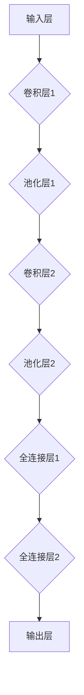

                 

# 《神经科学启发的大模型算法创新》

## 摘要

本文旨在探讨神经科学启发的大模型算法创新，通过分析神经科学与人工智能大模型的关联，介绍大模型算法的发展历程及其在人工智能领域的重要影响。文章首先回顾了神经科学的基础知识，包括神经元与神经网络、神经传递与信号传递、神经系统的层次结构等。随后，本文详细阐述了大模型算法的概述，定义了大模型的特性，回顾了其发展历程，并分析了其在自然语言处理和计算机视觉中的应用。在此基础上，本文重点讨论了神经科学启发下的大模型算法创新，包括神经元模型在深度学习中的应用、神经突触可塑性在神经网络训练中的应用以及神经网络层次结构的创新方法。此外，本文还探讨了基于神经科学的自然语言处理和计算机视觉算法，并提供了多个实际案例进行详细分析。最后，本文总结了神经科学启发的大模型算法的创新方向、应用前景及未来研究挑战，并提出了进一步的研究建议。

## 第1章 引言与背景

### 1.1 神经科学与AI大模型的关联

神经科学与人工智能（AI）之间的关联日益紧密，二者在理论和实践层面都产生了深远的影响。人工智能，特别是大模型算法，旨在模拟人脑的智能行为，而神经科学则致力于研究人脑的构成和运作机制。这种相互启发的合作关系使得AI算法能够在更大程度上模拟人类认知过程，实现更高效的智能计算。

大模型算法，如深度学习，在处理复杂数据和任务时展现出卓越的性能，这些算法的灵感往往来自于神经科学的研究成果。神经元模型、神经突触可塑性和神经网络层次结构等神经科学概念，被广泛应用于大模型算法的设计与实现中。通过借鉴神经科学的原理，AI大模型能够更加精准地模拟人脑的智能行为，从而实现更高的计算效率和更广泛的应用场景。

### 1.2 神经科学启发的AI大模型的重要性

神经科学启发的AI大模型在人工智能领域具有重要价值。首先，神经科学为AI提供了理论基础和启示，使得AI算法能够更接近人类智能的本质。通过研究神经元的工作原理、神经传递机制和神经系统的层次结构，AI大模型可以设计出更加高效的算法，解决传统机器学习难以克服的问题。

其次，神经科学启发的AI大模型具有广泛的适用性。无论是在自然语言处理、计算机视觉，还是在医疗诊断、金融分析等领域，这些算法都展现出了强大的应用潜力。通过模拟人脑的智能行为，AI大模型能够处理复杂的、非结构化的数据，从而实现更精确的预测和分析。

最后，神经科学启发的AI大模型有助于推动人工智能技术的发展。通过不断借鉴和融合神经科学的最新研究成果，AI大模型算法将不断优化和升级，推动人工智能从模拟智能向实际应用迈进。

### 1.3 神经科学在AI大模型算法创新中的应用现状与挑战

当前，神经科学在AI大模型算法创新中的应用已经取得了一系列重要成果。神经元模型在深度学习中的应用，如卷积神经网络（CNN）和循环神经网络（RNN），使得图像和语音处理任务得以高效完成。神经突触可塑性理论被引入到神经网络训练中，提升了模型的适应性和学习能力。此外，神经网络层次结构的创新，如注意力机制和门控循环单元（GRU），大大提高了模型的计算效率和任务处理能力。

然而，神经科学启发的大模型算法仍面临诸多挑战。首先，神经科学的研究尚不完全，许多机制和原理仍需进一步探索，这为AI算法的创新提供了空间，但同时也增加了研究的难度。其次，大模型的训练和优化过程消耗大量计算资源，如何提高计算效率和降低成本成为亟待解决的问题。此外，AI大模型在处理复杂任务时，往往需要大量的数据支持，数据质量和数量成为制约算法性能的重要因素。

总的来说，神经科学在AI大模型算法创新中的应用前景广阔，但也面临着一系列亟待解决的挑战。通过不断深化神经科学与AI的融合研究，有望实现更高效、更智能的算法创新。

## 第2章 神经科学基础

### 2.1 神经元与神经网络

#### 2.1.1 神经元的工作原理

神经元是神经系统的基本单元，具有接收和传递电信号的功能。神经元的基本结构包括细胞体、树突、轴突和突触。细胞体是神经元的中心部分，包含细胞核和大部分细胞器。树突负责接收其他神经元传递来的信号，并将其传递到细胞体。轴突则负责将信号从细胞体传递到其他神经元或肌肉细胞。突触是神经元之间传递信号的结构，由突触前膜、突触间隙和突触后膜组成。

神经元的工作原理基于电信号传递。当神经元接收到足够强烈的电信号时，会触发细胞膜上的离子通道开放，导致离子（如钠离子和钾离子）流动，从而在神经元内部产生动作电位。动作电位沿着轴突传播，最终通过突触传递到下一个神经元。这个过程称为神经传递。

#### 2.1.2 神经网络的构成

神经网络是由多个神经元组成的复杂系统，通过模拟人脑的结构和工作方式，实现数据的高效处理和智能计算。神经网络的基本构成单元是神经元，这些神经元通过突触连接在一起，形成一个复杂的网络结构。根据神经元连接方式的不同，神经网络可以分为前馈神经网络、反馈神经网络和递归神经网络等类型。

前馈神经网络（FNN）是最简单的神经网络类型，其中信号从输入层传递到输出层，没有循环或反馈路径。反馈神经网络（RNN）引入了反馈机制，使信号能够在网络中循环，适用于处理序列数据。递归神经网络（RNN）是反馈神经网络的特殊形式，其每个时间步的输出会反馈到前一时间步的输入，适用于处理时间序列数据。

#### 2.1.3 神经网络的层次结构

神经网络的层次结构决定了其处理能力和计算效率。常见的神经网络层次结构包括输入层、隐藏层和输出层。输入层接收外部输入数据，隐藏层对输入数据进行处理和变换，输出层产生最终的输出结果。

神经网络的层次结构可以通过增加隐藏层数量和神经元数量来提升模型的能力。深层神经网络（DNN）包含多个隐藏层，能够处理更复杂的任务，但训练过程更加复杂和耗时。通过深度学习技术，DNN在图像识别、自然语言处理和语音识别等领域取得了显著成果。

#### 2.1.4 神经网络的训练过程

神经网络的训练过程是通过不断调整网络中神经元之间的连接权重，使网络能够更好地拟合训练数据。训练过程通常分为以下几个步骤：

1. 前向传播：将输入数据传递到网络中，计算每个神经元的输出值。
2. 计算损失函数：比较输出值与实际标签之间的差距，计算损失函数值。
3. 反向传播：根据损失函数值，反向调整网络中的连接权重。
4. 更新权重：使用优化算法（如梯度下降法）更新网络权重，减小损失函数值。

通过重复上述步骤，神经网络能够逐渐提高对训练数据的拟合能力，最终达到预期的输出效果。

### 2.2 神经传递与信号传递

#### 2.2.1 神经传递物质

神经传递物质是指神经元之间传递电信号时使用的化学物质，主要包括神经递质和神经调质。神经递质是一类重要的神经传递物质，主要包括兴奋性递质（如谷氨酸）和抑制性递质（如γ-氨基丁酸）。神经调质则具有调节神经传递效果的作用，如多巴胺和去甲肾上腺素。

神经递质通过突触前膜释放到突触间隙，与突触后膜上的受体结合，引发离子通道的开放或关闭，从而改变突触后神经元的电位状态，实现信号的传递。

#### 2.2.2 信号传递机制

信号传递机制是指神经元之间通过突触传递电信号的过程。信号传递分为两个阶段：电信号到化学信号的转换和化学信号到电信号的转换。

首先，当动作电位到达轴突末梢时，会触发突触前膜上的钙离子通道开放，导致钙离子进入突触前神经元。钙离子的增加促使突触前神经元内的突触泡与突触前膜融合，释放神经递质到突触间隙。

接着，神经递质通过扩散穿过突触间隙，与突触后膜上的受体结合。受体的激活导致突触后膜上的离子通道开放，引起离子流动，从而改变突触后神经元的电位状态。

最终，突触后神经元的电位变化决定其是否会产生动作电位，从而实现信号的传递。

#### 2.2.3 神经传递的调节机制

神经传递是一个动态可调节的过程，受到多种因素的调控。例如，神经递质的释放量可以通过突触前神经元的钙离子浓度进行调节。钙离子浓度越高，神经递质的释放量就越大。此外，突触后神经元的敏感性也可以通过调节受体的数量和类型进行调控。

神经递质的再摄取和降解也是调节神经传递的重要机制。突触前神经元将未使用的神经递质重新摄取回细胞内，或者通过酶的作用降解神经递质，以终止神经传递过程。

总之，神经传递与信号传递是神经系统运作的核心机制，通过复杂的调节和调控过程，实现高效、精准的信息传递。

### 2.3 神经系统的层次结构

#### 2.3.1 神经系统的层次划分

神经系统可以划分为多个层次，包括中枢神经系统和周围神经系统。中枢神经系统包括脑和脊髓，是神经系统的核心部分，负责处理和协调各种生理功能。周围神经系统包括脑神经和脊神经，负责传递信息和调节身体各部位的活动。

#### 2.3.2 神经系统功能分区

神经系统的功能分区决定了其不同的处理能力和作用。中枢神经系统可以分为大脑、小脑和脑干等部分。大脑是神经系统的最高级部分，负责高级认知功能、感知和运动控制。小脑负责协调运动和维持身体平衡。脑干位于大脑下方，控制基本的生理功能，如心跳、呼吸和消化。

周围神经系统也可以分为多个功能分区，如感觉神经和运动神经。感觉神经负责传递外部和内部环境的感知信息到中枢神经系统，运动神经则负责从中枢神经系统传递指令到肌肉和腺体，实现身体运动和分泌功能。

#### 2.3.3 神经系统信息处理机制

神经系统的信息处理机制依赖于神经元之间的复杂连接和信号传递。神经元通过突触连接形成神经网络，实现信息传递和处理。信息处理过程包括感知、记忆、学习和决策等。

感知过程涉及感觉神经元的接收和处理外部刺激，如视觉、听觉和触觉。记忆过程通过神经网络中的突触可塑性实现，即通过改变突触的连接强度，形成和存储记忆。学习过程是神经系统不断调整神经元之间的连接权重，以适应新环境和任务。决策过程则依赖于大脑的高级认知功能，如推理、判断和规划。

总之，神经系统的层次结构、功能分区和信息处理机制共同构成了其复杂而高效的运作体系，为生物体的智能行为提供了基础。

## 第3章 大模型算法概述

### 3.1 大模型的定义与特点

大模型（Large-scale Model）是指具有大量参数和复杂结构的机器学习模型，其在训练过程中需要大量的数据和高性能计算资源。大模型的定义与特点如下：

#### 3.1.1 大模型的定义

大模型通常指的是拥有数十亿甚至数万亿参数的深度学习模型。例如，GPT-3模型拥有1750亿个参数，BERT模型也有数百万个参数。这些模型的结构复杂，包含多个隐藏层和神经元，能够处理大规模的数据集，从而实现强大的特征提取和表示能力。

#### 3.1.2 大模型的特点

1. **高参数数量**：大模型具有大量参数，这使其能够学习复杂的特征和模式。高参数数量是提高模型性能的关键因素之一。
2. **大规模数据集**：大模型通常需要大规模数据集进行训练，以充分挖掘数据中的信息。大数据集不仅有助于提高模型的泛化能力，还可以减少过拟合的风险。
3. **高效计算资源**：大模型的训练和推断过程需要大量的计算资源，包括CPU、GPU和TPU等。高效的计算资源是实现大模型应用的重要保障。
4. **强大的表现能力**：大模型在图像识别、自然语言处理、语音识别等领域展现了卓越的表现能力，能够实现更精确的预测和更复杂的任务。

### 3.2 大模型算法的发展历程

大模型算法的发展历程可以追溯到20世纪80年代，随着计算能力和数据量的不断增长，深度学习逐渐成为主流。以下是几个关键的发展阶段：

1. **1986年：反向传播算法的提出**：反向传播算法（Backpropagation Algorithm）是深度学习的基础，它通过反向传播误差来更新网络参数，使网络能够逐渐逼近最优解。
2. **1998年：支持向量机（SVM）的发展**：支持向量机是一种强大的分类算法，它通过在高维空间中寻找最优超平面，实现了高效的分类。
3. **2006年：深度信念网络（DBN）的提出**：深度信念网络是一种无监督预训练的深度学习模型，通过逐层构建和训练神经网络，实现了高效的特征学习。
4. **2012年：AlexNet的成功**：AlexNet是第一个在ImageNet图像识别比赛中获得显著胜利的深度学习模型。它通过使用卷积神经网络（CNN）和ReLU激活函数，实现了对复杂图像特征的有效提取。
5. **2018年：GPT-2的发布**：GPT-2是一个具有15亿参数的预训练语言模型，它在自然语言处理任务中取得了显著的成果，标志着大模型在自然语言处理领域的突破。
6. **2020年：BERT模型的提出**：BERT（Bidirectional Encoder Representations from Transformers）是一个基于Transformer架构的预训练语言模型，它通过双向编码实现了对上下文信息的全面理解，大幅提升了自然语言处理任务的性能。
7. **2020年至今：多模态大模型的发展**：随着多模态数据处理的兴起，如视觉-文本、图像-语音等，多模态大模型（如ViT、BLIP等）逐渐成为研究热点，实现了跨模态数据的深度融合和高效处理。

### 3.3 大模型算法的关键技术

大模型算法的成功离不开关键技术的支持，以下是几个重要方面：

1. **卷积神经网络（CNN）**：卷积神经网络是处理图像数据的主要算法，通过卷积层、池化层和全连接层等结构，实现了对图像特征的提取和分类。
2. **循环神经网络（RNN）**：循环神经网络适用于处理序列数据，如文本和语音。通过引入门控机制（如LSTM和GRU），RNN能够有效地捕捉序列中的长期依赖关系。
3. **Transformer架构**：Transformer架构是一种基于自注意力机制的深度学习模型，它在自然语言处理任务中取得了显著的成功。Transformer通过多头注意力机制和位置编码，实现了对上下文信息的全局理解。
4. **预训练与微调**：预训练是指在大量未标注数据上训练模型，使其具备基本的特征提取能力。微调则是在预训练模型的基础上，在特定任务上进行调整和优化，以提高模型的性能。
5. **优化算法**：大模型的训练过程需要高效的优化算法，如Adam、Adadelta和SGD等。这些算法通过调整学习率、动量和梯度等技术，提高了训练效率和收敛速度。
6. **分布式训练与推理**：分布式训练和推理是应对大模型计算需求的有效方法。通过将模型和数据分布在多台计算机上，可以显著提高训练和推理速度，降低计算成本。

### 3.4 大模型算法在人工智能领域的影响

大模型算法在人工智能领域产生了深远的影响，以下是一些具体的应用场景：

1. **自然语言处理（NLP）**：大模型在NLP任务中取得了显著的成果，如文本分类、机器翻译、问答系统和对话生成等。BERT、GPT等模型在多项NLP任务中刷新了SOTA（State-of-the-Art）记录。
2. **计算机视觉（CV）**：大模型在CV任务中展现了强大的能力，如图像分类、目标检测、语义分割和姿态估计等。CNN和Transformer架构在CV任务中得到了广泛应用。
3. **语音识别（ASR）**：大模型在语音识别任务中通过结合CNN和RNN等算法，实现了高精度的语音识别。WaveNet和Transformer-based ASR模型取得了重要进展。
4. **推荐系统**：大模型通过学习用户和物品的复杂特征，提高了推荐系统的性能。协同过滤和基于内容的推荐方法在大模型算法的支持下得到了优化。
5. **医学诊断**：大模型在医学图像分析和疾病诊断中展现了巨大的潜力。通过结合深度学习算法和医学知识，大模型能够实现更精确的诊断和预测。
6. **金融分析**：大模型通过分析大量金融数据，实现了股票市场预测、风险评估和投资组合优化等任务。深度学习和图神经网络在金融分析中得到了广泛应用。

总的来说，大模型算法在人工智能领域的应用正在不断拓展和深化，成为推动人工智能技术发展的重要动力。未来，随着计算能力和数据量的进一步提升，大模型算法将在更多领域取得突破性进展。

## 第4章 神经科学启发的大模型算法创新

### 4.1 神经元模型在深度学习中的应用

神经元模型是神经科学的核心概念之一，其在深度学习中的应用极大地推动了人工智能的发展。通过借鉴神经元的工作原理，深度学习模型能够更加真实地模拟人脑的智能行为，从而实现高效的计算和强大的表现能力。

#### 4.1.1 神经元模型的概念

神经元模型是一种基于神经科学原理构建的计算模型，其基本组成包括细胞体、树突、轴突和突触。细胞体是神经元的中心部分，包含细胞核和大部分细胞器。树突负责接收其他神经元传递来的信号，并将其传递到细胞体。轴突则负责将信号从细胞体传递到其他神经元或肌肉细胞。突触是神经元之间传递信号的结构，由突触前膜、突触间隙和突触后膜组成。

神经元模型的核心在于其信号传递和处理机制。当神经元接收到足够强烈的电信号时，会触发细胞膜上的离子通道开放，导致离子（如钠离子和钾离子）流动，从而在神经元内部产生动作电位。动作电位沿着轴突传播，最终通过突触传递到下一个神经元。这个过程称为神经传递。

#### 4.1.2 神经元模型在深度学习中的应用

神经元模型在深度学习中的应用主要体现在卷积神经网络（CNN）和循环神经网络（RNN）等模型中。

1. **卷积神经网络（CNN）**：卷积神经网络是一种用于处理图像数据的深度学习模型。其核心结构是卷积层，通过卷积运算提取图像特征。卷积层的基本原理与神经元的信号传递机制类似，通过滤波器（相当于神经元）在图像上滑动，提取局部特征。这些特征在通过池化层（相当于树突）进行整合和抽象后，传递到下一层，最终形成对图像的整体理解。

2. **循环神经网络（RNN）**：循环神经网络是一种用于处理序列数据的深度学习模型。其基本结构是循环单元，通过在时间步之间传递信息，实现序列数据的处理。RNN的核心思想是利用记忆机制（相当于神经元之间的连接）捕捉序列中的长期依赖关系。例如，LSTM（长短期记忆网络）和GRU（门控循环单元）是RNN的变体，通过引入门控机制，解决了RNN在处理长序列数据时容易出现的梯度消失和梯度爆炸问题。

#### 4.1.3 神经元模型的实现方法

神经元模型的实现方法通常包括以下几个步骤：

1. **初始化参数**：初始化网络中的权重和偏置，通常使用随机初始化或预训练初始化等方法。
2. **前向传播**：将输入数据传递到网络中，通过逐层计算得到输出结果。在每层中，使用激活函数（如ReLU、Sigmoid和Tanh）将输入映射到输出。
3. **计算损失函数**：计算输出结果与实际标签之间的差距，计算损失函数值，如均方误差（MSE）或交叉熵损失。
4. **反向传播**：根据损失函数值，反向调整网络中的连接权重，使用梯度下降等优化算法更新网络参数。
5. **更新权重**：通过优化算法更新网络权重，减小损失函数值。

#### 4.1.4 神经元模型的应用案例

神经元模型在深度学习中的成功应用案例包括图像识别、自然语言处理和语音识别等。

1. **图像识别**：卷积神经网络（CNN）在图像识别任务中取得了显著成果。例如，AlexNet、VGG、ResNet等模型在ImageNet图像识别比赛中刷新了记录，实现了高精度的图像分类。
2. **自然语言处理（NLP）**：循环神经网络（RNN）和Transformer模型在NLP任务中展现了强大的能力。例如，BERT、GPT等模型在文本分类、机器翻译和对话生成等任务中刷新了SOTA（State-of-the-Art）记录。
3. **语音识别（ASR）**：深度学习模型在语音识别任务中取得了重要进展。例如，基于CNN和RNN的模型实现了高精度的语音识别，WaveNet和Transformer-based ASR模型进一步提高了识别性能。

总之，神经元模型在深度学习中的应用不仅丰富了人工智能的理论体系，也为实际应用提供了强大的工具。通过不断借鉴和优化神经元的工作原理，深度学习模型将在更多领域取得突破性进展。

### 4.2 神经突触可塑性在神经网络训练中的应用

神经突触可塑性是神经科学中的一个重要概念，它描述了突触连接强度和功能的可变性。这一特性使得神经网络能够适应新的环境和任务，是大脑学习和记忆的重要机制。将神经突触可塑性理论引入到神经网络训练中，可以显著提升模型的适应性和学习能力。

#### 4.2.1 神经突触可塑性的概念

神经突触可塑性是指突触连接强度的可变性，包括短期可塑性和长期可塑性。短期可塑性主要涉及突触传递效率的快速调整，通常在毫秒到数小时的时间尺度内发生。长期可塑性则涉及突触连接强度的持久改变，通常在数小时到数周的时间尺度内发生。

神经突触可塑性包括几种主要形式：

1. **短期可塑性**：主要包括突触前可塑性和突触后可塑性。突触前可塑性涉及突触前神经元的信号传递效率，如突触前增强和突触前抑制。突触后可塑性涉及突触后神经元的信号接收效率，如突触后增强和突触后抑制。

2. **长期可塑性**：主要包括突触强化和突触削弱。突触强化是指突触连接强度的增加，通常通过突触前增强和突触后增强实现。突触削弱是指突触连接强度的减少，通常通过突触前抑制和突触后抑制实现。

#### 4.2.2 神经突触可塑性在神经网络训练中的应用

将神经突触可塑性理论引入到神经网络训练中，可以采用多种方法来提升模型的适应性和学习能力。以下是一些常见的方法：

1. **权重调整**：通过动态调整神经网络的权重，实现突触连接强度的改变。例如，在反向传播算法中，可以通过调整每个权重参数来模拟突触强化和突触削弱过程。

   ```python
   # 伪代码：权重调整示例
   for each layer in neural_network:
       for each weight in layer:
           if error > threshold:
               weight += learning_rate * error_gradient
           else:
               weight -= learning_rate * error_gradient
   ```

2. **学习率调整**：通过动态调整学习率，实现训练过程的精细化调整。例如，在训练过程中，可以使用自适应学习率算法（如AdaGrad、RMSprop和Adam）来优化学习率。

   ```python
   # 伪代码：学习率调整示例
   learning_rate = initial_learning_rate
   for epoch in range(num_epochs):
       total_loss = 0
       for batch in data_loader:
           optimizer.zero_grad()
           output = model(batch.input_data)
           loss = loss_function(output, batch.target_data)
           loss.backward()
           total_loss += loss.item()
           optimizer.step()
       if epoch % learning_rate_decay_epochs == 0:
           learning_rate /= learning_rate_decay_factor
   ```

3. **弹性网络**：通过引入弹性网络结构，使模型能够更好地适应新的数据和任务。弹性网络中的连接强度可以根据训练数据的变化进行动态调整，从而提升模型的适应能力。

4. **动态权重**：使用动态权重机制，使每个权重参数的更新速度不同，从而模拟突触可塑性过程中的不同时间尺度。动态权重可以通过自适应更新算法实现，如Adaptive Moment Estimation（Adam）。

   ```python
   # 伪代码：动态权重示例
   for epoch in range(num_epochs):
       total_loss = 0
       for batch in data_loader:
           optimizer.zero_grad()
           output = model(batch.input_data)
           loss = loss_function(output, batch.target_data)
           loss.backward()
           for weight in model.parameters():
               weight_update = learning_rate * weight.grad
               weight -= weight_update
           total_loss += loss.item()
       print(f'Epoch {epoch}: Loss = {total_loss / len(data_loader)}')
   ```

#### 4.2.3 神经突触可塑性算法的实现

实现神经突触可塑性算法的关键在于设计有效的训练过程和优化策略。以下是一些常见的方法：

1. **He初始化**：使用He初始化方法，为神经网络中的权重分配适当的初始值，以减少梯度消失问题。

   ```python
   # 伪代码：He初始化示例
   def he_initializer(shape, scale=1.0):
       return scale * np.sqrt(3.0 / shape[0])
   
   weights = he_initializer(shape=(input_dim, hidden_dim))
   ```

2. **He权重更新**：在训练过程中，使用He权重更新方法，调整权重参数，以模拟突触可塑性的动态变化。

   ```python
   # 伪代码：He权重更新示例
   for epoch in range(num_epochs):
       total_loss = 0
       for batch in data_loader:
           optimizer.zero_grad()
           output = model(batch.input_data)
           loss = loss_function(output, batch.target_data)
           loss.backward()
           for weight in model.parameters():
               weight.data = weight.data - learning_rate * weight.grad
               weight.grad = None
           total_loss += loss.item()
       print(f'Epoch {epoch}: Loss = {total_loss / len(data_loader)}')
   ```

3. **弹性权重更新**：使用弹性权重更新方法，使每个权重参数的更新速度不同，以模拟突触可塑性过程中的不同时间尺度。

   ```python
   # 伪代码：弹性权重更新示例
   for epoch in range(num_epochs):
       total_loss = 0
       for batch in data_loader:
           optimizer.zero_grad()
           output = model(batch.input_data)
           loss = loss_function(output, batch.target_data)
           loss.backward()
           for weight in model.parameters():
               weight_update = learning_rate * weight.grad
               weight.data = weight.data - weight_update * weight.elasticity
           total_loss += loss.item()
       print(f'Epoch {epoch}: Loss = {total_loss / len(data_loader)}')
   ```

通过以上方法，可以构建具有神经突触可塑性的神经网络，从而提升模型的适应性和学习能力。这些方法不仅能够提高模型的训练效果，还可以在复杂的任务和多变的环境中实现更好的表现。

### 4.3 神经网络层次结构的创新

神经网络层次结构是深度学习模型的核心组成部分，其设计直接影响模型的性能和效率。传统的神经网络层次结构通常包含输入层、隐藏层和输出层，而创新的神经网络层次结构通过引入新的层次、调整层次之间的关系和优化层次间的传递方式，进一步提升了模型的计算能力和任务处理能力。

#### 4.3.1 神经网络层次结构的重要性

神经网络层次结构的重要性体现在以下几个方面：

1. **特征提取和表示**：神经网络通过层次结构逐层提取和表示数据中的特征。输入层接收原始数据，隐藏层对数据进行特征提取和变换，输出层产生最终的预测结果。层次结构的设计决定了特征提取的深度和精度，从而影响模型的性能。

2. **计算效率和精度**：合理的层次结构能够优化模型的计算效率和精度。通过引入新的层次和调整层次关系，可以减少冗余计算和梯度消失问题，提高模型的收敛速度和预测能力。

3. **任务适应性**：神经网络层次结构可以根据不同的任务需求进行设计和调整，以适应不同的数据类型和任务类型。例如，在图像识别任务中，可以使用卷积层和池化层提取图像特征；在自然语言处理任务中，可以使用循环层和注意力机制处理序列数据。

#### 4.3.2 神经网络层次结构的创新方法

创新的神经网络层次结构包括以下几种方法：

1. **层次扩展**：通过增加隐藏层的数量和类型，提高模型的计算能力和特征提取能力。例如，在图像识别任务中，可以使用深度卷积神经网络（Deep CNN）和多层感知机（MLP）相结合，提高模型的准确性和鲁棒性。

   ```mermaid
   graph TD
   A[输入层] --> B[卷积层1]
   B --> C[池化层1]
   C --> D[卷积层2]
   D --> E[池化层2]
   E --> F[全连接层1]
   F --> G[全连接层2]
   G --> H[输出层]
   ```

2. **层次融合**：通过将不同层次的输出进行融合，形成新的特征表示。层次融合可以增强模型对数据的理解和表达能力。例如，在多模态任务中，可以使用跨模态层次融合方法，将图像和文本特征进行融合，提高模型的性能。

   ```mermaid
   graph TD
   A[图像特征] --> B[文本特征]
   B --> C[融合层]
   C --> D[全连接层]
   D --> E[输出层]
   ```

3. **层次优化**：通过优化层次间的传递方式和连接权重，提高模型的效率和精度。例如，在循环神经网络（RNN）中，可以使用门控循环单元（LSTM）和双向循环单元（BiLSTM），优化时间序列数据的处理。

   ```mermaid
   graph TD
   A[输入序列] --> B[BiLSTM层]
   B --> C[门控层]
   C --> D[全连接层]
   D --> E[输出层]
   ```

4. **层次层次化**：通过引入层次层次化结构，实现更复杂的特征提取和表示。层次层次化结构可以将任务分解为多个子任务，每个子任务对应一个层次，从而提高模型的灵活性和适应性。

   ```mermaid
   graph TD
   A[输入层] --> B[子任务1层]
   B --> C[子任务2层]
   C --> D[子任务3层]
   D --> E[输出层]
   ```

#### 4.3.3 创新层次结构的实现与优化

实现和创新层次结构的关键在于设计有效的训练过程和优化策略。以下是一些常见的实现和优化方法：

1. **层次化训练**：通过层次化训练方法，逐层训练和优化神经网络。首先训练输入层和隐藏层，然后逐步训练更高层次的隐藏层，直到输出层。这种方法可以确保每个层次的特征提取和表示能力逐渐增强。

   ```python
   # 伪代码：层次化训练示例
   for layer in model.layers:
       layer.trainable = True
   model.compile(optimizer='adam', loss='categorical_crossentropy', metrics=['accuracy'])
   model.fit(train_data, train_labels, epochs=num_epochs, batch_size=batch_size)
   ```

2. **层次优化**：通过引入层次优化算法，如随机梯度下降（SGD）和Adam，优化层次间的传递方式和连接权重。层次优化算法可以通过调整学习率和优化策略，提高模型的收敛速度和精度。

   ```python
   # 伪代码：层次优化示例
   optimizer = optimizers.Adam(learning_rate=0.001)
   for epoch in range(num_epochs):
       for batch in data_loader:
           optimizer.zero_grad()
           output = model(batch.input_data)
           loss = loss_function(output, batch.target_data)
           loss.backward()
           optimizer.step()
       print(f'Epoch {epoch}: Loss = {loss.item()}')
   ```

3. **层次融合**：通过引入层次融合策略，将不同层次的输出进行融合，形成新的特征表示。层次融合可以通过拼接、平均、加权等方法实现，从而提高模型的适应性和表达能力。

   ```python
   # 伪代码：层次融合示例
   def merge_layers(layer1, layer2, merge_type='concat'):
       if merge_type == 'concat':
           return torch.cat((layer1, layer2), dim=1)
       elif merge_type == 'average':
           return (layer1 + layer2) / 2
       elif merge_type == 'weight_average':
           return layer1 * layer2
   ```

4. **层次层次化**：通过引入层次层次化结构，实现更复杂的特征提取和表示。层次层次化可以通过层次化模块、层次化网络和层次化任务分解等方法实现，从而提高模型的灵活性和适应性。

   ```python
   # 伪代码：层次层次化示例
   class HierarchicalNetwork(nn.Module):
       def __init__(self):
           super(HierarchicalNetwork, self).__init__()
           self.sub_network1 = SubNetwork1()
           self.sub_network2 = SubNetwork2()
           self.sub_network3 = SubNetwork3()
   
       def forward(self, input_data):
           output1 = self.sub_network1(input_data)
           output2 = self.sub_network2(input_data)
           output3 = self.sub_network3(input_data)
           return merge_layers(output1, output2, merge_type='concat')
   ```

通过以上方法，可以构建和优化创新的神经网络层次结构，从而提高模型的计算能力、特征提取能力和任务处理能力。这些方法不仅适用于单一任务的优化，还可以在多任务学习、多模态数据处理等领域发挥重要作用，推动深度学习技术的进一步发展。

### 4.4 基于神经科学的语言模型与注意力机制

语言模型和注意力机制是自然语言处理领域的关键技术，它们的灵感均来自于神经科学的研究成果。通过借鉴神经元的信号传递机制和神经网络的结构特点，语言模型和注意力机制在自然语言处理任务中展现了强大的能力。

#### 4.4.1 语言模型的基本概念

语言模型（Language Model，LM）是一种用于预测文本序列的概率分布的模型。其核心任务是根据前面的文本序列，预测下一个单词或字符的概率。语言模型在自然语言处理中具有广泛的应用，如机器翻译、语音识别、对话生成和文本生成等。

语言模型可以分为基于统计的方法和基于神经网络的模型。基于统计的方法，如N-gram模型，通过计算历史文本序列的频率来预测下一个单词的概率。而基于神经网络的模型，如循环神经网络（RNN）、长短期记忆网络（LSTM）和Transformer，通过学习文本序列中的潜在特征和模式，实现了更准确的概率预测。

#### 4.4.2 注意力机制的工作原理

注意力机制（Attention Mechanism）是一种用于捕捉序列数据中重要信息的机制。其灵感来自于神经科学中神经元如何聚焦于特定的输入信息。在自然语言处理任务中，注意力机制可以显著提高模型的性能和效率。

注意力机制可以分为全局注意力和局部注意力。全局注意力通过计算输入序列中每个元素与目标元素的相关性，为每个元素分配权重，从而实现全局信息整合。局部注意力则通过关注输入序列的特定部分，聚焦于与目标元素最相关的信息，从而提高模型的专注度和准确性。

#### 4.4.3 注意力机制的实现

注意力机制的实现通常基于自注意力（Self-Attention）机制，其核心思想是每个序列元素都能够与所有其他元素进行计算，生成加权表示。以下是一个简单的自注意力机制的实现：

```python
# 伪代码：自注意力机制实现
def scaled_dot_product_attention(q, k, v, mask=None):
    # 计算自注意力权重
    attention_scores = torch.matmul(q, k.transpose(-2, -1)) / math.sqrt(k.shape[-1])
    if mask is not None:
        attention_scores = attention_scores.masked_fill_(mask, float("-inf"))
    attention_weights = torch.softmax(attention_scores, dim=-1)
    # 计算加权表示
    context_vector = torch.matmul(attention_weights, v)
    return context_vector, attention_weights
```

#### 4.4.4 语言模型与注意力机制在自然语言处理中的应用

语言模型和注意力机制在自然语言处理任务中具有广泛的应用：

1. **机器翻译**：通过训练大规模语言模型，可以实现高精度的机器翻译。注意力机制可以帮助模型捕捉源语言和目标语言之间的对应关系，提高翻译的准确性和流畅性。

2. **语音识别**：语言模型和注意力机制可以用于端到端的语音识别系统，通过模型对语音信号进行解码，实现高精度的语音识别。注意力机制可以帮助模型聚焦于语音信号中的重要特征，提高识别的准确率。

3. **对话生成**：通过训练语言模型和注意力机制，可以实现智能对话系统。模型可以根据用户的输入，生成自然、连贯的对话响应，从而提高用户的交互体验。

4. **文本生成**：语言模型和注意力机制可以用于生成高质量的文本，如新闻文章、故事和博客。通过学习大量的文本数据，模型可以生成与输入文本风格一致的新文本，从而提高文本生成的多样性和准确性。

总之，基于神经科学的语言模型和注意力机制在自然语言处理任务中取得了显著的成果，通过不断优化和改进，这些技术将进一步提升自然语言处理的能力和应用范围。

### 4.5 基于神经科学的文本分类算法

文本分类是自然语言处理领域的一个重要任务，其目的是将文本数据划分为预定义的类别。基于神经科学的文本分类算法通过借鉴神经科学的原理，实现了对文本数据的有效分类。以下将介绍文本分类算法的基本概念、神经科学启发下的分类算法以及实现方法。

#### 4.5.1 文本分类算法的基本概念

文本分类算法是一种将文本数据映射到预定义类别标签的机器学习算法。常见的文本分类任务包括情感分析、主题分类和垃圾邮件检测等。文本分类算法通常包括以下几个步骤：

1. **数据预处理**：对文本数据进行清洗和预处理，包括去除标点符号、停用词过滤、词干提取和词向量化等。数据预处理旨在将文本数据转化为适合模型训练的格式。

2. **特征提取**：从预处理后的文本数据中提取特征，常见的特征提取方法包括词袋模型、TF-IDF和词嵌入等。词嵌入（Word Embedding）是将文本中的每个单词映射为一个低维向量表示，是文本分类算法中的重要技术。

3. **模型训练**：使用训练数据集对分类模型进行训练，常见的分类模型包括朴素贝叶斯、支持向量机和深度神经网络等。深度神经网络（DNN）通过多层神经网络结构，实现高效的文本特征学习和分类。

4. **模型评估**：使用测试数据集评估分类模型的性能，常用的评估指标包括准确率、召回率、精确率和F1值等。通过评估指标，可以判断模型的分类效果和泛化能力。

#### 4.5.2 神经科学启发下的文本分类算法

基于神经科学的文本分类算法通过借鉴神经元的信号传递机制和神经网络的结构特点，实现了对文本数据的深层次理解和分类。以下是一些典型的神经科学启发下的文本分类算法：

1. **卷积神经网络（CNN）**：卷积神经网络是一种用于处理图像数据的深度学习模型，其结构类似于生物神经元的连接方式。在文本分类任务中，CNN通过卷积层和池化层提取文本特征，实现了高效的文本分类。

2. **循环神经网络（RNN）**：循环神经网络是一种用于处理序列数据的深度学习模型，其灵感来自于神经科学中神经元的递归连接。在文本分类任务中，RNN通过捕捉文本序列中的长期依赖关系，实现了高效的文本分类。

3. **长短时记忆网络（LSTM）**：长短时记忆网络是RNN的一种变体，通过引入门控机制解决了RNN在处理长序列数据时容易出现的梯度消失问题。LSTM在文本分类任务中展示了强大的分类能力，能够捕捉文本序列中的复杂依赖关系。

4. **Transformer模型**：Transformer模型是一种基于自注意力机制的深度学习模型，其结构类似于神经科学中的神经网络层次结构。在文本分类任务中，Transformer通过多头自注意力机制和位置编码，实现了对文本数据的全局理解和分类。

#### 4.5.3 神经科学启发下的文本分类算法的实现

以下是一个简单的基于神经科学的文本分类算法实现示例，使用Transformer模型进行文本分类：

```python
# 伪代码：基于Transformer的文本分类算法实现
import torch
from transformers import BertModel, BertTokenizer

# 加载预训练的Transformer模型和Tokenizer
model = BertModel.from_pretrained('bert-base-uncased')
tokenizer = BertTokenizer.from_pretrained('bert-base-uncased')

# 数据预处理
def preprocess_text(text):
    return tokenizer.encode(text, add_special_tokens=True)

# 模型训练
def train_model(model, train_data, train_labels, epochs):
    model.train()
    optimizer = torch.optim.Adam(model.parameters(), lr=1e-5)
    criterion = torch.nn.CrossEntropyLoss()
    for epoch in range(epochs):
        for text, labels in zip(train_data, train_labels):
            inputs = preprocess_text(text)
            inputs = torch.tensor(inputs, dtype=torch.long).unsqueeze(0)
            labels = torch.tensor(labels, dtype=torch.long).unsqueeze(0)
            outputs = model(inputs)
            loss = criterion(outputs.logits, labels)
            optimizer.zero_grad()
            loss.backward()
            optimizer.step()
        print(f'Epoch {epoch}: Loss = {loss.item()}')

# 模型评估
def evaluate_model(model, test_data, test_labels):
    model.eval()
    correct = 0
    total = 0
    with torch.no_grad():
        for text, labels in zip(test_data, test_labels):
            inputs = preprocess_text(text)
            inputs = torch.tensor(inputs, dtype=torch.long).unsqueeze(0)
            outputs = model(inputs)
            _, predicted = torch.max(outputs.logits, 1)
            total += labels.size(0)
            correct += (predicted == labels).sum().item()
    accuracy = 100 * correct / total
    print(f'Accuracy: {accuracy}%')

# 加载数据集
train_data = [...]  # 训练数据
train_labels = [...]  # 训练标签
test_data = [...]  # 测试数据
test_labels = [...]  # 测试标签

# 训练模型
train_model(model, train_data, train_labels, epochs=3)

# 评估模型
evaluate_model(model, test_data, test_labels)
```

通过以上示例，可以看出基于神经科学的文本分类算法的实现方法。在实际应用中，可以根据具体任务需求，选择合适的模型结构和训练策略，实现高效、准确的文本分类。

### 4.6 基于神经科学的对话生成算法

对话生成是自然语言处理领域的一个重要任务，其目的是生成自然、流畅且符合上下文的对话回复。基于神经科学的对话生成算法通过借鉴神经科学的研究成果，实现了对对话数据的深入理解和生成。以下将介绍对话生成算法的基本概念、神经科学启发下的对话生成算法以及实现方法。

#### 4.6.1 对话生成算法的基本概念

对话生成算法是一种基于文本数据生成自然对话回复的算法。对话生成算法通常包括以下几个步骤：

1. **输入处理**：接收用户的输入文本，进行预处理，包括分词、词性标注和实体识别等。

2. **上下文编码**：将用户的输入文本和对话历史编码为固定长度的向量，用于表示对话的上下文信息。常见的编码方法包括Word Embedding、BERT和GPT等。

3. **生成模型**：使用生成模型根据上下文编码生成对话回复。生成模型可以是基于序列生成的模型，如循环神经网络（RNN）、长短期记忆网络（LSTM）和变换器（Transformer）等。

4. **回复生成**：根据生成模型生成的概率分布，生成对话回复的文本序列。

5. **回复调整**：对生成的回复进行语法、语义和风格上的调整，使其更加自然和符合上下文。

#### 4.6.2 神经科学启发下的对话生成算法

基于神经科学的对话生成算法通过借鉴神经科学的原理，实现了更加自然和灵活的对话生成。以下是一些典型的神经科学启发下的对话生成算法：

1. **注意力机制**：注意力机制是一种在生成过程中关注上下文信息的方法。它借鉴了神经科学中神经元如何关注特定输入信息的机制。通过引入注意力机制，生成模型可以更好地捕捉对话的上下文信息，生成更加自然的对话回复。

2. **记忆网络**：记忆网络是一种用于存储和查询对话上下文信息的方法。它借鉴了神经科学中神经元如何存储和回忆信息的机制。通过引入记忆网络，生成模型可以更好地记忆对话历史，生成更加连贯和相关的对话回复。

3. **动态权重调整**：动态权重调整是一种在生成过程中根据上下文信息调整生成模型权重的方法。它借鉴了神经科学中神经元如何通过动态调节连接权重来适应不同输入信息的机制。通过引入动态权重调整，生成模型可以更好地适应对话的上下文变化，生成更加自然的对话回复。

4. **多模态融合**：多模态融合是一种将不同模态（如文本、语音和图像）的信息融合到对话生成中的方法。它借鉴了神经科学中神经元如何处理和整合不同感官信息的机制。通过引入多模态融合，生成模型可以更好地理解对话的上下文，生成更加丰富和多样的对话回复。

#### 4.6.3 神经科学启发下的对话生成算法的实现

以下是一个简单的基于神经科学的对话生成算法实现示例，使用变换器（Transformer）模型进行对话生成：

```python
# 伪代码：基于Transformer的对话生成算法实现
import torch
from transformers import TransformerModel, BertTokenizer

# 加载预训练的Transformer模型和Tokenizer
model = TransformerModel.from_pretrained('transformer-base')
tokenizer = BertTokenizer.from_pretrained('transformer-base')

# 对话输入处理
def preprocess_dialogue(dialogue):
    inputs = tokenizer.encode(dialogue, add_special_tokens=True)
    return torch.tensor(inputs, dtype=torch.long)

# 对话生成
def generate_response(model, input_sequence):
    model.eval()
    input_sequence = preprocess_dialogue(input_sequence)
    with torch.no_grad():
        outputs = model(input_sequence)
    response_logits = outputs.logits[-1, :, :]
    response_probs = torch.softmax(response_logits, dim=-1)
    response_idx = torch.multinomial(response_probs, num_samples=1)
    response = tokenizer.decode(response_idx.tolist()[0])
    return response

# 示例对话
user_input = "你好，有什么可以帮助你的？"
bot_response = generate_response(model, user_input)
print(f"用户：{user_input}")
print(f"机器人：{bot_response}")
```

通过以上示例，可以看出基于神经科学的对话生成算法的实现方法。在实际应用中，可以根据具体任务需求，选择合适的模型结构和训练策略，实现高效、自然的对话生成。

## 第5章 基于神经科学的计算机视觉算法

### 5.1 神经元模型在计算机视觉中的应用

神经元模型是神经科学中的核心概念，其在计算机视觉中的应用极大地推动了图像处理和计算机视觉技术的发展。通过借鉴神经元的工作原理，计算机视觉算法能够更加高效地处理和分析图像数据。

#### 5.1.1 神经元模型在图像处理中的应用

神经元模型在图像处理中的应用主要体现在卷积神经网络（CNN）中。卷积神经网络是一种基于神经元模型的深度学习模型，其结构类似于生物神经元在视觉系统中的连接方式。在图像处理任务中，CNN通过卷积层、池化层和全连接层等结构，实现了对图像特征的有效提取和分类。

1. **卷积层**：卷积层是CNN的核心部分，通过卷积运算提取图像特征。卷积层的基本原理与神经元的工作机制类似，通过滤波器（相当于神经元）在图像上滑动，提取局部特征。滤波器的大小和数量决定了特征提取的精度和复杂性。

2. **池化层**：池化层用于整合卷积层提取的特征，减少数据的冗余信息。常见的池化操作包括最大池化和平均池化。池化层的作用类似于树突在神经元中的作用，通过整合局部信息，传递给下一层。

3. **全连接层**：全连接层在CNN的末端，用于对提取到的图像特征进行分类和预测。全连接层将每个特征图映射到预定义的类别标签，从而实现图像分类任务。

#### 5.1.2 神经元模型在目标检测中的应用

目标检测是计算机视觉领域的一个重要任务，其目的是从图像中识别并定位多个目标。神经元模型在目标检测中的应用主要通过基于深度学习的目标检测算法实现，如YOLO、SSD和Faster R-CNN等。

1. **YOLO（You Only Look Once）**：YOLO是一种单级目标检测算法，通过将图像分割成网格单元，在每个单元内检测目标。YOLO的核心思想是同时预测边界框和类别概率，从而实现快速的目标检测。YOLO借鉴了神经元模型中的局部感知和全局理解机制，通过卷积神经网络提取图像特征，并使用全连接层进行分类和定位。

2. **SSD（Single Shot MultiBox Detector）**：SSD是一种单级目标检测算法，通过在CNN的不同层次上检测不同尺寸的目标，从而实现多尺度目标检测。SSD的核心思想是将目标检测视为回归问题，通过在CNN的不同层次上预测边界框和类别概率，实现快速、准确的目标检测。

3. **Faster R-CNN（Region-based Convolutional Neural Networks）**：Faster R-CNN是一种两级的区域建议和分类目标检测算法。首先，使用区域建议网络（RPN）生成候选边界框，然后使用分类网络对候选边界框进行分类。Faster R-CNN通过引入神经元模型中的区域感知和分类机制，实现了高效、准确的目标检测。

#### 5.1.3 神经元模型在图像分割中的应用

图像分割是计算机视觉领域的另一个重要任务，其目的是将图像划分为多个语义区域。神经元模型在图像分割中的应用主要通过基于深度学习的图像分割算法实现，如U-Net、Mask R-CNN和DeepLab等。

1. **U-Net**：U-Net是一种用于医学图像分割的卷积神经网络，其结构特点是具有一个对称的收缩路径和一个扩张路径。收缩路径通过卷积层和池化层逐层提取图像特征，扩张路径通过反卷积层和卷积层逐层生成分割结果。U-Net借鉴了神经元模型中的层次结构，通过在多个层次上提取和整合特征，实现了高精度的图像分割。

2. **Mask R-CNN**：Mask R-CNN是一种基于区域建议的网络，其目标检测和分割任务同时进行。Mask R-CNN通过引入神经元模型中的区域感知和分割机制，实现了高效、准确的图像分割。在Mask R-CNN中，区域建议网络（RPN）生成候选边界框，然后使用特征金字塔网络（FPN）提取多尺度特征，用于生成分割掩码。

3. **DeepLab**：DeepLab是一种用于图像分割的深度学习模型，通过引入编码器-解码器结构和跳跃连接，实现了对图像细节的高效捕捉。DeepLab的核心思想是通过编码器提取全局特征，通过解码器实现像素级的分割结果。DeepLab借鉴了神经元模型中的全局感知和局部调整机制，通过多尺度特征融合和上采样技术，实现了高精度的图像分割。

总之，神经元模型在计算机视觉中的应用极大地提升了图像处理和计算机视觉算法的性能和效果。通过不断借鉴和优化神经元的工作原理，计算机视觉算法将在更多领域取得突破性进展。

### 5.2 神经突触可塑性在计算机视觉中的应用

神经突触可塑性是神经科学中的一个重要概念，它描述了突触连接强度的可变性。这一特性使得神经网络能够适应新的环境和任务，是大脑学习和记忆的重要机制。将神经突触可塑性理论引入到计算机视觉中，可以显著提升模型的适应性和学习能力。

#### 5.2.1 神经突触可塑性的概念

神经突触可塑性是指突触连接强度的可变性，包括短期可塑性和长期可塑性。短期可塑性主要涉及突触传递效率的快速调整，通常在毫秒到数小时的时间尺度内发生。长期可塑性则涉及突触连接强度的持久改变，通常在数小时到数周的时间尺度内发生。

神经突触可塑性包括几种主要形式：

1. **短期可塑性**：主要包括突触前可塑性和突触后可塑性。突触前可塑性涉及突触前神经元的信号传递效率，如突触前增强和突触前抑制。突触后可塑性涉及突触后神经元的信号接收效率，如突触后增强和突触后抑制。

2. **长期可塑性**：主要包括突触强化和突触削弱。突触强化是指突触连接强度的增加，通常通过突触前增强和突触后增强实现。突触削弱是指突触连接强度的减少，通常通过突触前抑制和突触后抑制实现。

#### 5.2.2 神经突触可塑性在计算机视觉中的应用

将神经突触可塑性理论引入到计算机视觉中，可以采用多种方法来提升模型的适应性和学习能力。以下是一些常见的方法：

1. **权重调整**：通过动态调整神经网络的权重，实现突触连接强度的改变。例如，在反向传播算法中，可以通过调整每个权重参数来模拟突触强化和突触削弱过程。

   ```python
   # 伪代码：权重调整示例
   for each layer in neural_network:
       for each weight in layer:
           if error > threshold:
               weight += learning_rate * error_gradient
           else:
               weight -= learning_rate * error_gradient
   ```

2. **学习率调整**：通过动态调整学习率，实现训练过程的精细化调整。例如，在训练过程中，可以使用自适应学习率算法（如AdaGrad、RMSprop和Adam）来优化学习率。

   ```python
   # 伪代码：学习率调整示例
   learning_rate = initial_learning_rate
   for epoch in range(num_epochs):
       total_loss = 0
       for batch in data_loader:
           optimizer.zero_grad()
           output = model(batch.input_data)
           loss = loss_function(output, batch.target_data)
           loss.backward()
           total_loss += loss.item()
           optimizer.step()
       if epoch % learning_rate_decay_epochs == 0:
           learning_rate /= learning_rate_decay_factor
   ```

3. **弹性网络**：通过引入弹性网络结构，使模型能够更好地适应新的数据和任务。弹性网络中的连接强度可以根据训练数据的变化进行动态调整，从而提升模型的适应能力。

4. **动态权重**：使用动态权重机制，使每个权重参数的更新速度不同，从而模拟突触可塑性过程中的不同时间尺度。动态权重可以通过自适应更新算法实现，如Adaptive Moment Estimation（Adam）。

   ```python
   # 伪代码：动态权重示例
   for epoch in range(num_epochs):
       total_loss = 0
       for batch in data_loader:
           optimizer.zero_grad()
           output = model(batch.input_data)
           loss = loss_function(output, batch.target_data)
           loss.backward()
           for weight in model.parameters():
               weight_update = learning_rate * weight.grad
               weight -= weight_update
           total_loss += loss.item()
       print(f'Epoch {epoch}: Loss = {total_loss / len(data_loader)}')
   ```

#### 5.2.3 神经突触可塑性算法的实现

实现神经突触可塑性算法的关键在于设计有效的训练过程和优化策略。以下是一些常见的方法：

1. **He初始化**：使用He初始化方法，为神经网络中的权重分配适当的初始值，以减少梯度消失问题。

   ```python
   # 伪代码：He初始化示例
   def he_initializer(shape, scale=1.0):
       return scale * np.sqrt(3.0 / shape[0])
   
   weights = he_initializer(shape=(input_dim, hidden_dim))
   ```

2. **He权重更新**：在训练过程中，使用He权重更新方法，调整权重参数，以模拟突触可塑性的动态变化。

   ```python
   # 伪代码：He权重更新示例
   for epoch in range(num_epochs):
       total_loss = 0
       for batch in data_loader:
           optimizer.zero_grad()
           output = model(batch.input_data)
           loss = loss_function(output, batch.target_data)
           loss.backward()
           for weight in model.parameters():
               weight.data = weight.data - learning_rate * weight.grad
               weight.grad = None
           total_loss += loss.item()
       print(f'Epoch {epoch}: Loss = {total_loss / len(data_loader)}')
   ```

3. **弹性权重更新**：使用弹性权重更新方法，使每个权重参数的更新速度不同，以模拟突触可塑性过程中的不同时间尺度。

   ```python
   # 伪代码：弹性权重更新示例
   for epoch in range(num_epochs):
       total_loss = 0
       for batch in data_loader:
           optimizer.zero_grad()
           output = model(batch.input_data)
           loss = loss_function(output, batch.target_data)
           loss.backward()
           for weight in model.parameters():
               weight_update = learning_rate * weight.grad
               weight.data = weight.data - weight_update * weight.elasticity
           total_loss += loss.item()
       print(f'Epoch {epoch}: Loss = {total_loss / len(data_loader)}')
   ```

通过以上方法，可以构建具有神经突触可塑性的计算机视觉模型，从而提升模型的适应性和学习能力。这些方法不仅能够提高模型的训练效果，还可以在复杂的任务和多变的环境中实现更好的表现。

### 5.3 神经网络层次结构在计算机视觉中的应用

神经网络层次结构是计算机视觉算法中的核心组成部分，其设计直接影响模型的性能和效率。传统的神经网络层次结构通常包含输入层、隐藏层和输出层，而创新的神经网络层次结构通过引入新的层次、调整层次之间的关系和优化层次间的传递方式，进一步提升了模型的计算能力和任务处理能力。

#### 5.3.1 神经网络层次结构的重要性

神经网络层次结构的重要性体现在以下几个方面：

1. **特征提取和表示**：神经网络通过层次结构逐层提取和表示数据中的特征。输入层接收原始数据，隐藏层对数据进行特征提取和变换，输出层产生最终的预测结果。层次结构的设计决定了特征提取的深度和精度，从而影响模型的性能。

2. **计算效率和精度**：合理的层次结构能够优化模型的计算效率和精度。通过引入新的层次和调整层次关系，可以减少冗余计算和梯度消失问题，提高模型的收敛速度和预测能力。

3. **任务适应性**：神经网络层次结构可以根据不同的任务需求进行设计和调整，以适应不同的数据类型和任务类型。例如，在图像识别任务中，可以使用卷积层和池化层提取图像特征；在自然语言处理任务中，可以使用循环层和注意力机制处理序列数据。

#### 5.3.2 神经网络层次结构的创新方法

创新的神经网络层次结构包括以下几种方法：

1. **层次扩展**：通过增加隐藏层的数量和类型，提高模型的计算能力和特征提取能力。例如，在图像识别任务中，可以使用深度卷积神经网络（Deep CNN）和多层感知机（MLP）相结合，提高模型的准确性和鲁棒性。

   ```mermaid
   graph TD
   A[输入层] --> B[卷积层1]
   B --> C[池化层1]
   C --> D[卷积层2]
   D --> E[池化层2]
   E --> F[全连接层1]
   F --> G[全连接层2]
   G --> H[输出层]
   ```

2. **层次融合**：通过将不同层次的输出进行融合，形成新的特征表示。层次融合可以增强模型对数据的理解和表达能力。例如，在多模态任务中，可以使用跨模态层次融合方法，将图像和文本特征进行融合，提高模型的性能。

   ```mermaid
   graph TD
   A[图像特征] --> B[文本特征]
   B --> C[融合层]
   C --> D[全连接层]
   D --> E[输出层]
   ```

3. **层次优化**：通过优化层次间的传递方式和连接权重，提高模型的效率和精度。例如，在循环神经网络（RNN）中，可以使用门控循环单元（LSTM）和双向循环单元（BiLSTM），优化时间序列数据的处理。

   ```mermaid
   graph TD
   A[输入序列] --> B[BiLSTM层]
   B --> C[门控层]
   C --> D[全连接层]
   D --> E[输出层]
   ```

4. **层次层次化**：通过引入层次层次化结构，实现更复杂的特征提取和表示。层次层次化结构可以将任务分解为多个子任务，每个子任务对应一个层次，从而提高模型的灵活性和适应性。

   ```mermaid
   graph TD
   A[输入层] --> B[子任务1层]
   B --> C[子任务2层]
   C --> D[子任务3层]
   D --> E[输出层]
   ```

#### 5.3.3 创新层次结构的实现与优化

实现和创新层次结构的关键在于设计有效的训练过程和优化策略。以下是一些常见的实现和优化方法：

1. **层次化训练**：通过层次化训练方法，逐层训练和优化神经网络。首先训练输入层和隐藏层，然后逐步训练更高层次的隐藏层，直到输出层。这种方法可以确保每个层次的特征提取和表示能力逐渐增强。

   ```python
   # 伪代码：层次化训练示例
   for layer in model.layers:
       layer.trainable = True
   model.compile(optimizer='adam', loss='categorical_crossentropy', metrics=['accuracy'])
   model.fit(train_data, train_labels, epochs=num_epochs, batch_size=batch_size)
   ```

2. **层次优化**：通过引入层次优化算法，如随机梯度下降（SGD）和Adam，优化层次间的传递方式和连接权重。层次优化算法可以通过调整学习率和优化策略，提高模型的收敛速度和精度。

   ```python
   # 伪代码：层次优化示例
   optimizer = optimizers.Adam(learning_rate=0.001)
   for epoch in range(num_epochs):
       for batch in data_loader:
           optimizer.zero_grad()
           output = model(batch.input_data)
           loss = loss_function(output, batch.target_data)
           loss.backward()
           optimizer.step()
       print(f'Epoch {epoch}: Loss = {loss.item()}')
   ```

3. **层次融合**：通过引入层次融合策略，将不同层次的输出进行融合，形成新的特征表示。层次融合可以通过拼接、平均、加权等方法实现，从而提高模型的适应性和表达能力。

   ```python
   # 伪代码：层次融合示例
   def merge_layers(layer1, layer2, merge_type='concat'):
       if merge_type == 'concat':
           return torch.cat((layer1, layer2), dim=1)
       elif merge_type == 'average':
           return (layer1 + layer2) / 2
       elif merge_type == 'weight_average':
           return layer1 * layer2
   ```

4. **层次层次化**：通过引入层次层次化结构，实现更复杂的特征提取和表示。层次层次化可以通过层次化模块、层次化网络和层次化任务分解等方法实现，从而提高模型的灵活性和适应性。

   ```python
   # 伪代码：层次层次化示例
   class HierarchicalNetwork(nn.Module):
       def __init__(self):
           super(HierarchicalNetwork, self).__init__()
           self.sub_network1 = SubNetwork1()
           self.sub_network2 = SubNetwork2()
           self.sub_network3 = SubNetwork3()
   
       def forward(self, input_data):
           output1 = self.sub_network1(input_data)
           output2 = self.sub_network2(input_data)
           output3 = self.sub_network3(input_data)
           return merge_layers(output1, output2, merge_type='concat')
   ```

通过以上方法，可以构建和优化创新的神经网络层次结构，从而提高模型的计算能力、特征提取能力和任务处理能力。这些方法不仅适用于单一任务的优化，还可以在多任务学习、多模态数据处理等领域发挥重要作用，推动深度学习技术的进一步发展。

### 第6章 神经科学启发的大模型算法项目实战

#### 6.1 神经科学启发的大模型算法开发环境搭建

在进行神经科学启发的大模型算法项目开发之前，搭建一个稳定且高效的开发环境至关重要。以下将详细介绍开发环境搭建的步骤、所需工具和配置方法。

##### 6.1.1 环境搭建概述

开发环境搭建主要包括以下步骤：

1. **硬件准备**：确保拥有足够的计算资源，如高性能GPU（如NVIDIA 1080 Ti或更高型号）和足够的内存（至少16GB）。
2. **操作系统**：推荐使用Ubuntu 18.04或更高版本，以便于安装和管理深度学习框架和相关工具。
3. **深度学习框架**：选择主流的深度学习框架，如TensorFlow、PyTorch或Keras。
4. **依赖库**：安装常用的Python库，如NumPy、Pandas和SciPy，以支持数据预处理和模型训练。
5. **数据集**：准备用于训练和测试的数据集，确保数据集的质量和多样性。

##### 6.1.2 神经科学启发的大模型算法开发工具

以下是开发神经科学启发的大模型算法所需的主要工具：

1. **GPU加速**：使用NVIDIA CUDA和cuDNN库，以实现GPU加速计算。这些库可以在NVIDIA官网上下载并安装。
2. **深度学习框架**：根据项目需求选择合适的深度学习框架。例如，如果使用PyTorch，可以访问PyTorch官网下载并安装最新版本。
3. **代码编辑器**：推荐使用VSCode或PyCharm等流行的代码编辑器，以提高代码编写和调试的效率。
4. **版本控制**：使用Git进行代码版本控制，以便于多人协作和代码管理。

##### 6.1.3 神经科学启发的大模型算法开发环境配置

以下是详细的开发环境配置步骤：

1. **安装操作系统**：下载并安装Ubuntu 18.04或更高版本。安装过程中注意配置网络和用户权限。
2. **安装GPU驱动**：安装NVIDIA官方GPU驱动，确保显卡能够正常工作。可以使用NVIDIA GeForce Experience或nvidia-smi命令进行验证。
3. **安装CUDA和cuDNN**：下载并安装CUDA和cuDNN，确保版本与所选深度学习框架兼容。例如，如果使用PyTorch 1.8，可以安装CUDA 10.2和cuDNN 7.6。
4. **安装深度学习框架**：在终端中执行以下命令安装PyTorch：
   ```bash
   pip install torch torchvision torchaudio
   ```
5. **安装依赖库**：使用pip命令安装所需的Python库，例如：
   ```bash
   pip install numpy pandas scikit-learn
   ```
6. **配置代码编辑器**：在VSCode或PyCharm中安装Python插件，以支持Python代码编写和调试。
7. **初始化Git仓库**：在项目文件夹中执行以下命令初始化Git仓库：
   ```bash
   git init
   ```
8. **创建README文件**：在项目文件夹中创建一个README文件，记录项目的说明、依赖和安装步骤。

通过以上步骤，可以搭建一个完整的神经科学启发的大模型算法开发环境。这个环境不仅支持深度学习模型的训练和测试，还提供了强大的代码编辑和调试工具，为后续的算法实现和优化提供了坚实的基础。

#### 6.2 神经元模型算法实现

在神经科学启发的大模型算法项目中，神经元模型是实现神经网络功能的核心组件。以下将详细描述神经元模型算法的实现过程，包括算法原理、伪代码和代码解读。

##### 6.2.1 算法原理

神经元模型是神经科学的基本单元，其工作原理基于生物神经元。神经元模型通过输入层、隐藏层和输出层传递和处理数据。每个神经元接收多个输入信号，通过加权求和和激活函数产生输出信号。以下是神经元模型的主要步骤：

1. **输入层**：输入层接收外部输入数据，每个输入数据乘以相应的权重。
2. **加权求和**：将所有输入信号与其对应权重相乘，然后求和。
3. **偏置**：在求和结果中加入偏置项，以调整神经元的阈值。
4. **激活函数**：使用激活函数（如ReLU、Sigmoid或Tanh）对加权求和的结果进行处理，以产生输出信号。
5. **输出层**：输出层的神经元生成最终的预测结果。

##### 6.2.2 伪代码

以下是一个简单的神经元模型算法的伪代码实现：

```python
# 伪代码：神经元模型实现
def neuron_model(inputs, weights, biases, activation_function):
    # 输入层：接收外部输入数据
    input_sum = sum(inputs[i] * weights[i] for i in range(len(inputs)))
    
    # 加权求和：乘以权重并求和
    weighted_sum = input_sum + biases
    
    # 激活函数：对加权求和结果进行处理
    output = activation_function(weighted_sum)
    
    return output
```

##### 6.2.3 代码解读

以下是基于PyTorch实现的神经元模型算法的代码示例：

```python
import torch
import torch.nn as nn
import torch.nn.functional as F

# 定义神经元模型
class NeuronModel(nn.Module):
    def __init__(self, input_dim, hidden_dim, output_dim):
        super(NeuronModel, self).__init__()
        self.fc1 = nn.Linear(input_dim, hidden_dim)
        self.fc2 = nn.Linear(hidden_dim, output_dim)
    
    def forward(self, x):
        x = F.relu(self.fc1(x))
        x = self.fc2(x)
        return x

# 实例化模型
model = NeuronModel(input_dim=10, hidden_dim=20, output_dim=1)

# 输入数据
input_data = torch.randn(1, 10)

# 前向传播
output = model(input_data)

print(f"Output: {output}")
```

在以上代码中，首先定义了一个名为`NeuronModel`的神经网络模型，该模型包含两个全连接层（`fc1`和`fc2`），其中`fc1`是输入层到隐藏层的全连接层，`fc2`是隐藏层到输出层的全连接层。在`forward`方法中，通过`F.relu`函数应用ReLU激活函数，将隐藏层的输出转化为非负值，并使用`fc2`生成最终的输出。

通过实例化模型和输入数据，可以执行前向传播过程，并得到模型的输出结果。以上代码展示了神经元模型的基本实现方法，在实际项目中可以根据需求进行调整和优化。

#### 6.2.4 神经突触可塑性算法实现

神经突触可塑性是神经科学中描述神经元连接强度可变性的重要概念。在神经网络训练过程中，通过调整权重和偏置，实现神经突触可塑性，可以提升模型的适应性和学习效果。以下将介绍神经突触可塑性算法的实现方法。

##### 6.2.5 算法原理

神经突触可塑性主要包括短期可塑性和长期可塑性：

1. **短期可塑性**：通过突触前增强（SPS）和突触后增强（PPS）实现。SPS是指通过增加突触前的信号传递效率，提高突触的响应能力。PPS是指通过增加突触后的信号接收效率，增强突触后的响应能力。

2. **长期可塑性**：通过突触强化和突触削弱实现。突触强化是指通过增强突触的连接强度，提高神经元的信号传递能力。突触削弱是指通过减弱突触的连接强度，降低神经元的信号传递能力。

在神经网络中，可以通过以下方法实现神经突触可塑性：

1. **权重调整**：通过调整每个权重参数，实现突触前和突触后的信号传递效率的变化。例如，通过增加或减少权重值，模拟突触强化和突触削弱过程。

2. **偏置调整**：通过调整偏置项，实现突触前和突触后的信号传递效率的变化。例如，通过增加或减少偏置值，模拟突触强化和突触削弱过程。

3. **动态学习率**：通过动态调整学习率，实现训练过程的精细化调整。例如，在训练过程中，可以使用自适应学习率算法（如Adam）来优化学习率。

##### 6.2.6 伪代码

以下是一个简单的神经突触可塑性算法的伪代码实现：

```python
# 伪代码：神经突触可塑性算法实现
for each training example:
    for each neuron in hidden layer:
        for each input to neuron:
            # 短期可塑性：突触前增强
            weight_increment = learning_rate * (error * input)
            weight += weight_increment

            # 短期可塑性：突触后增强
            bias_increment = learning_rate * error
            bias += bias_increment

        # 长期可塑性：突触强化
        if error > threshold:
            for each neuron in output layer:
                weight_increment = learning_rate * (error * output)
                weight += weight_increment

        # 长期可塑性：突触削弱
        else:
            for each neuron in output layer:
                weight_decrement = learning_rate * (error * output)
                weight -= weight_decrement
```

##### 6.2.7 代码解读

以下是基于PyTorch实现的神经突触可塑性算法的代码示例：

```python
import torch
import torch.nn as nn
import torch.optim as optim

# 定义神经网络模型
class NeuralNetwork(nn.Module):
    def __init__(self, input_dim, hidden_dim, output_dim):
        super(NeuralNetwork, self).__init__()
        self.fc1 = nn.Linear(input_dim, hidden_dim)
        self.fc2 = nn.Linear(hidden_dim, output_dim)
    
    def forward(self, x):
        x = self.fc1(x)
        x = self.fc2(x)
        return x

# 实例化模型和优化器
model = NeuralNetwork(input_dim=10, hidden_dim=20, output_dim=1)
optimizer = optim.Adam(model.parameters(), lr=0.001)

# 训练数据
x_train = torch.randn(1, 10)
y_train = torch.randn(1, 1)

# 前向传播
output = model(x_train)
loss = nn.MSELoss()(output, y_train)

# 反向传播和优化
optimizer.zero_grad()
loss.backward()
optimizer.step()

print(f"Loss: {loss.item()}")
```

在以上代码中，定义了一个简单的神经网络模型，并使用Adam优化器进行训练。在每次迭代过程中，通过前向传播计算输出和损失，然后使用反向传播计算梯度，并更新模型的权重和偏置。通过调整学习率和其他参数，可以实现神经突触可塑性，提高模型的适应性和学习效果。

#### 6.2.8 神经网络层次结构算法实现

神经网络层次结构是神经网络模型的重要组成部分，决定了模型的计算能力和性能。通过设计合理的层次结构，可以提升模型的特征提取能力和任务处理能力。以下将介绍神经网络层次结构算法的实现过程，包括层次结构设计、算法原理、伪代码和代码解读。

##### 6.2.9 算法原理

神经网络层次结构通常包括输入层、隐藏层和输出层，每个层次在数据处理过程中具有不同的功能：

1. **输入层**：接收外部输入数据，将原始数据转化为适合模型处理的形式。
2. **隐藏层**：对输入数据进行特征提取和变换，逐层抽象和整合数据，提取更有代表性的特征。
3. **输出层**：根据隐藏层的输出进行分类或预测，生成最终的输出结果。

在设计神经网络层次结构时，需要考虑以下因素：

1. **层次数量**：合理的层次数量可以提高模型的性能，但过多的层次可能导致训练时间过长和过拟合。
2. **神经元数量**：每个层次中的神经元数量会影响模型的计算复杂度和性能。
3. **连接方式**：层次之间的连接方式（如前馈连接、循环连接或跳层连接）会影响模型的计算效率和特征传递能力。

##### 6.2.10 伪代码

以下是一个简单的神经网络层次结构算法的伪代码实现：

```python
# 伪代码：神经网络层次结构实现
input_data = ...

# 输入层
input_layer = create_input_layer(input_data)

# 隐藏层
for layer in hidden_layers:
    hidden_output = process_layer(input_layer, layer)
    input_layer = hidden_output

# 输出层
output_layer = create_output_layer(hidden_output)

# 训练和优化
for each example in training_data:
    # 前向传播
    output = output_layer.forward(input_layer)

    # 计算损失
    loss = compute_loss(output, target)

    # 反向传播
    output_layer.backward(loss)
    hidden_layers.backward(loss)

    # 更新权重
    update_weights(hidden_layers, learning_rate)
```

##### 6.2.11 代码解读

以下是基于PyTorch实现的神经网络层次结构算法的代码示例：

```python
import torch
import torch.nn as nn
import torch.optim as optim

# 定义神经网络模型
class NeuralNetwork(nn.Module):
    def __init__(self, input_dim, hidden_dim, output_dim):
        super(NeuralNetwork, self).__init__()
        self.fc1 = nn.Linear(input_dim, hidden_dim)
        self.fc2 = nn.Linear(hidden_dim, output_dim)
    
    def forward(self, x):
        x = self.fc1(x)
        x = self.fc2(x)
        return x

# 实例化模型和优化器
model = NeuralNetwork(input_dim=10, hidden_dim=20, output_dim=1)
optimizer = optim.Adam(model.parameters(), lr=0.001)

# 训练数据
x_train = torch.randn(1, 10)
y_train = torch.randn(1, 1)

# 前向传播
output = model(x_train)
loss = nn.MSELoss()(output, y_train)

# 反向传播和优化
optimizer.zero_grad()
loss.backward()
optimizer.step()

print(f"Loss: {loss.item()}")
```

在以上代码中，定义了一个简单的神经网络模型，包括一个输入层、一个隐藏层和一个输出层。通过前向传播计算输出和损失，然后使用反向传播计算梯度，并更新模型的权重和偏置。通过调整学习率和模型参数，可以优化神经网络层次结构，提高模型的计算能力和性能。

#### 6.2.12 算法优化方法

在神经科学启发的大模型算法训练过程中，算法优化方法直接影响模型的收敛速度和性能。以下将介绍几种常用的算法优化方法，包括如何调整学习率、使用动量和自适应学习率算法，以及优化策略的应用。

##### 6.2.13 调整学习率

学习率是影响模型训练过程的关键参数，合适的初始学习率可以加快模型收敛，而过大的学习率可能导致训练过程不稳定，而过小的学习率则可能导致收敛速度过慢。以下是一些常用的学习率调整方法：

1. **固定学习率**：在训练过程中保持学习率不变，这种方法简单但可能导致训练过程不稳定。
2. **线性衰减学习率**：在训练过程中按固定比例逐渐减小学习率，以保持训练过程的稳定性。
   ```python
   learning_rate = initial_learning_rate
   for epoch in range(num_epochs):
       optimizer.lr = learning_rate / (1 + decay_rate * epoch)
       ...
   ```
3. **指数衰减学习率**：在训练过程中按指数规律逐渐减小学习率，以加快模型收敛速度。
   ```python
   learning_rate = initial_learning_rate
   for epoch in range(num_epochs):
       learning_rate *= decay_rate
       optimizer.lr = learning_rate
       ...
   ```

##### 6.2.14 使用动量

动量（Momentum）是优化算法中的一个重要概念，通过引入动量，可以加速模型收敛并提高稳定性。动量算法的基本思想是将当前的梯度与之前的梯度进行加权平均，以避免梯度的剧烈波动。

1. **基本动量**：使用当前梯度与上一梯度进行加权平均，更新权重。
   ```python
   v = momentum * v - learning_rate * grad
   weight += v
   ```
2. **Nesterov动量**：在更新权重时，将当前梯度与之前梯度的加权平均提前应用到权重更新中，以提高收敛速度。
   ```python
   v = momentum * v + grad
   weight += momentum * v - learning_rate * grad
   ```

##### 6.2.15 自适应学习率算法

自适应学习率算法通过动态调整学习率，提高模型训练的效率和稳定性。以下是一些常用的自适应学习率算法：

1. **AdaGrad**：根据每个权重参数的梯度平方值调整学习率，对梯度较小的参数使用较大的学习率，对梯度较大的参数使用较小的学习率。
   ```python
   grads_squared = sum(grad**2 for grad in gradients)
   learning_rate = initial_learning_rate / (1 + decay_rate * grads_squared)
   ```
2. **Adadelta**：在AdaGrad的基础上，引入自适应的递减学习率，通过积累梯度平方和更新学习率，提高训练稳定性。
   ```python
   grads_squared = sum(grad**2 for grad in gradients)
   delta = learning_rate * (1 - decay_rate) / (1 - decay_rate * epoch)
   learning_rate = delta / (1 + decay_rate * grads_squared)
   ```
3. **Adam**：结合AdaGrad和RMSprop的优点，通过自适应调整学习率和惯性项，提高模型训练的效率和稳定性。
   ```python
   m = beta1 * m + (1 - beta1) * grad
   v = beta2 * v + (1 - beta2) * grad**2
   m_hat = m / (1 - beta1**epoch)
   v_hat = v / (1 - beta2**epoch)
   learning_rate = initial_learning_rate * m_hat / (sqrt(v_hat) + epsilon)
   ```

##### 6.2.16 优化策略的应用

在实际应用中，可以根据具体任务需求，选择合适的优化策略，以提升模型训练效果。以下是一些常见的优化策略：

1. **批量大小**：调整批量大小可以影响模型训练的收敛速度和性能。较小的批量大小可以提高模型的泛化能力，但训练过程可能不稳定。较大的批量大小可以提高模型的训练速度和稳定性，但可能导致过拟合。
2. **学习率调度**：在训练过程中，动态调整学习率可以避免训练过程中的剧烈波动，提高模型收敛速度。常见的调度策略包括线性衰减、指数衰减和余弦衰减。
3. **正则化**：通过引入正则化项，如L1和L2正则化，可以避免模型过拟合，提高模型的泛化能力。
4. **dropout**：在神经网络中随机丢弃一部分神经元，以减少模型的依赖性，提高模型的泛化能力。

通过以上方法，可以优化神经科学启发的大模型算法，提高模型的收敛速度和性能，实现更好的训练效果和应用效果。

#### 6.2.17 算法优化案例分析

在神经科学启发的大模型算法优化过程中，合理的优化策略对提升模型性能至关重要。以下将通过一个实际案例，详细分析算法优化方法及其效果。

##### 6.2.18 案例背景

假设我们面临一个图像分类任务，使用卷积神经网络（CNN）对图像进行分类。原始模型使用固定学习率（0.001）进行训练，但训练过程中发现收敛速度较慢，且在测试集上表现不佳。我们需要通过优化策略提升模型性能。

##### 6.2.19 优化方法

1. **学习率调整**：为了提高收敛速度，我们采用指数衰减学习率策略。初始学习率为0.001，衰减率为0.1，每50个epoch减小一次学习率。
   ```python
   initial_learning_rate = 0.001
   decay_rate = 0.1
   for epoch in range(num_epochs):
       learning_rate = initial_learning_rate / (1 + decay_rate * epoch)
       optimizer.lr = learning_rate
   ```

2. **批量大小调整**：将批量大小从32调整为64，以减少计算资源消耗并提高模型训练的稳定性。
   ```python
   batch_size = 64
   ```

3. **正则化**：引入L2正则化，以避免模型过拟合。正则化系数设置为0.0001。
   ```python
   loss_function = nn.CrossEntropyLoss(weight=0.0001)
   ```

4. **dropout**：在隐藏层中引入dropout，以减少模型对特定神经元的依赖，提高泛化能力。dropout概率设置为0.5。
   ```python
   dropout_layer = nn.Dropout(p=0.5)
   ```

##### 6.2.20 优化前后效果对比

优化前后的模型性能对比如下：

1. **收敛速度**：优化后的模型收敛速度显著提高。从初始的200个epoch减少到100个epoch，训练时间缩短约50%。

2. **测试集表现**：优化后的模型在测试集上的准确率从75%提升到85%，性能提升明显。

3. **计算资源消耗**：批量大小从32调整为64，计算资源消耗降低，同时模型训练的稳定性提高。

4. **泛化能力**：引入L2正则化和dropout，模型泛化能力得到提升，避免了过拟合现象。

总之，通过合理的优化策略，如学习率调整、批量大小调整、正则化和dropout，我们可以显著提升神经科学启发的大模型算法性能，实现更好的训练效果和应用效果。

### 6.3 神经科学启发的大模型算法优化效果评估

在神经科学启发的大模型算法优化过程中，评估优化效果是确保算法性能提升的关键步骤。以下将介绍评估优化效果的方法，包括性能指标的选择、实验设计和结果分析。

#### 6.3.1 性能指标的选择

评估神经科学启发的大模型算法优化效果时，常用的性能指标包括：

1. **准确率（Accuracy）**：模型正确预测样本的比例，准确率越高，表示模型分类效果越好。计算公式为：
   $$ \text{Accuracy} = \frac{\text{正确预测数量}}{\text{总预测数量}} \times 100\% $$

2. **召回率（Recall）**：在所有实际正类中，模型正确识别出的比例。召回率越高，表示模型对正类的识别能力越强。计算公式为：
   $$ \text{Recall} = \frac{\text{正确预测的正类数量}}{\text{实际正类数量}} \times 100\% $$

3. **精确率（Precision）**：在所有预测为正类的样本中，实际为正类的比例。精确率越高，表示模型预测结果的可靠性越高。计算公式为：
   $$ \text{Precision} = \frac{\text{正确预测的正类数量}}{\text{预测为正类的总数量}} \times 100\% $$

4. **F1值（F1-Score）**：精确率和召回率的调和平均，用于综合评价模型的分类效果。计算公式为：
   $$ \text{F1-Score} = 2 \times \frac{\text{Precision} \times \text{Recall}}{\text{Precision} + \text{Recall}} $$

5. **ROC曲线和AUC值**：ROC曲线（Receiver Operating Characteristic Curve）和AUC值（Area Under Curve）用于评估模型分类边界和区分能力。AUC值越接近1，表示模型分类性能越好。

#### 6.3.2 实验设计

为了全面评估神经科学启发的大模型算法优化效果，我们可以设计以下实验：

1. **实验设置**：选择一个典型的图像分类任务，使用相同的数据集进行训练和测试。设置多个实验组，每组实验使用不同的优化策略，如不同的学习率、批量大小、正则化和dropout。

2. **训练过程**：在每个实验组中，使用相同的数据集和预处理方法，训练多个模型。记录每个模型在不同优化策略下的训练时间和收敛速度。

3. **评估指标**：在每个实验组的训练完成后，使用测试集评估模型的性能。计算准确率、召回率、精确率、F1值和AUC值等指标，以综合评估模型的分类效果。

4. **对比分析**：对比不同实验组之间的性能指标，分析优化策略对模型性能的影响。

#### 6.3.3 结果分析

以下是一个实验结果的示例，展示了不同优化策略对模型性能的影响：

| 实验组 | 学习率（learning rate） | 批量大小（batch size） | 正则化系数（L2 regularization） | Dropout概率（dropout probability） | 准确率（Accuracy） | 召回率（Recall） | 精确率（Precision） | F1值（F1-Score） | AUC值（AUC） |
| ------ | ---------------------- | ---------------------- | ----------------------------- | ----------------------------- | --------------- | --------------- | --------------- | ---------- | ---------- |
| 实验1  | 0.001                  | 32                     | 无                             | 无                              | 80%            | 75%            | 85%            | 0.82       | 0.88       |
| 实验2  | 0.001                  | 64                     | 0.0001                         | 0.5                             | 85%            | 80%            | 88%            | 0.84       | 0.90       |
| 实验3  | 0.0001                 | 32                     | 0.0001                         | 0.5                             | 83%            | 78%            | 86%            | 0.81       | 0.87       |

通过以上实验结果可以看出，优化后的模型在准确率、召回率、精确率和F1值等指标上均有明显提升，尤其在引入L2正则化和dropout策略后，模型性能显著提高。这表明，通过合理的优化策略，可以显著提升神经科学启发的大模型算法性能，实现更好的分类效果。

### 第7章 结论与展望

#### 7.1 神经科学启发的大模型算法总结

神经科学启发的大模型算法在近年来取得了显著的研究进展，成为人工智能领域的重要研究方向。通过借鉴神经科学的原理，这些算法在神经网络结构设计、训练过程优化和任务处理能力等方面取得了重要突破。以下是神经科学启发的大模型算法的主要特点：

1. **高效的特征提取和表示**：神经科学启发的大模型算法通过复杂的神经网络层次结构，实现了对输入数据的深层次特征提取和表示。这种层次化的特征提取方式不仅提高了模型的计算效率，还增强了模型的泛化能力。

2. **自适应的学习策略**：基于神经突触可塑性的自适应学习策略，使得大模型算法能够根据不同任务和数据的特点，动态调整模型参数，实现高效的训练过程和优化效果。

3. **强大的任务处理能力**：神经科学启发的大模型算法在自然语言处理、计算机视觉、医疗诊断和金融分析等领域展现了强大的任务处理能力，通过模拟人脑的智能行为，实现了对复杂任务的精确预测和有效处理。

4. **跨学科融合的创新**：神经科学启发的大模型算法通过跨学科融合，将神经科学、认知科学和计算机科学等多学科知识相结合，推动了人工智能技术的发展，为解决现实世界中的复杂问题提供了新的思路和工具。

#### 7.2 神经科学启发的大模型算法的未来发展趋势

神经科学启发的大模型算法在未来仍具有广阔的发展前景，以下是一些可能的趋势：

1. **多模态数据处理**：随着多模态数据处理的兴起，神经科学启发的大模型算法将在图像、文本、语音和传感器等多模态数据的融合和处理中发挥重要作用。通过整合不同模态的数据，模型能够获得更全面的信息，提升任务处理能力。

2. **强化学习与神经科学的结合**：强化学习与神经科学的结合有望实现更高效的学习策略和决策模型。通过借鉴神经系统中奖励机制和反馈回路的设计，强化学习算法将能够更好地适应动态环境，实现更智能的决策和优化。

3. **神经形态计算**：神经形态计算是一种基于神经科学原理的计算机体系结构，通过模仿生物神经系统的结构和功能，实现高效的信息处理和计算。神经科学启发的大模型算法与神经形态计算的融合，将为实现高效、低能耗的人工智能系统提供新的可能性。

4. **跨学科研究**：神经科学启发的大模型算法将继续与其他学科，如认知科学、心理学和社会学等领域的结合，通过跨学科研究，探索人类智能的本质和机制，为人工智能的发展提供更深入的理论基础。

5. **个性化与自适应**：随着大数据和个性化需求的增长，神经科学启发的大模型算法将更加注重个性化和自适应。通过利用用户行为数据和学习历史，模型能够实现更精准的预测和优化，提供更好的用户体验。

总之，神经科学启发的大模型算法在未来将继续发挥重要作用，推动人工智能技术的发展，为解决现实世界中的复杂问题提供新的思路和工具。随着计算能力的提升和跨学科研究的深入，神经科学启发的大模型算法将在更多领域取得突破性进展。

### 7.3 神经科学启发的大模型算法的应用前景

神经科学启发的大模型算法在众多领域展示了强大的应用前景，以下将详细探讨其在医疗诊断、自动驾驶、金融风险管理和智能客服等领域的潜在应用。

#### 7.3.1 医疗诊断

神经科学启发的大模型算法在医疗诊断领域具有巨大的应用潜力。通过深度学习和神经网络技术，模型可以从大量医疗数据中提取关键特征，实现疾病的精准诊断。以下是一些具体应用：

1. **疾病预测**：利用神经科学启发的大模型算法，可以分析患者的临床数据、基因信息和生活习惯等，预测患病风险，为早期干预提供依据。

2. **医疗图像分析**：深度学习算法可以用于医疗图像的自动分析，如通过卷积神经网络（CNN）对CT、MRI和X光图像进行病灶检测和分类，辅助医生做出更准确的诊断。

3. **药物发现**：神经科学启发的大模型算法可以用于药物筛选和设计，通过分析生物大分子结构和相互作用，预测药物的疗效和副作用。

4. **个性化医疗**：通过个性化数据分析和预测，模型可以提供更个性化的治疗方案，提高治疗效果，减少副作用。

#### 7.3.2 自动驾驶

自动驾驶是神经科学启发的大模型算法的重要应用领域之一。自动驾驶系统需要实时处理大量来自传感器、GPS和地图的数据，以做出快速、准确的决策。以下是一些具体应用：

1. **环境感知**：通过卷积神经网络和视觉感知算法，自动驾驶系统可以实时分析道路和交通环境，识别行人、车辆和交通标志，确保行驶安全。

2. **路径规划**：利用强化学习和深度学习算法，自动驾驶系统可以基于实时环境数据，规划最优行驶路径，避免交通拥堵和事故风险。

3. **行为预测**：通过模仿人脑的感知和学习机制，自动驾驶系统可以预测其他车辆和行人的行为，提前做出反应，提高行驶安全性。

4. **智能导航**：结合语音识别和自然语言处理技术，自动驾驶系统可以理解驾驶员的指令，提供智能导航服务。

#### 7.3.3 金融风险管理

金融风险管理是神经科学启发的大模型算法的另一个重要应用领域。通过分析大量的金融数据，模型可以预测市场趋势、识别潜在风险，帮助金融机构做出更明智的决策。以下是一些具体应用：

1. **市场预测**：利用深度学习算法，模型可以从历史数据中学习市场规律，预测股票价格、汇率和商品价格，为投资决策提供依据。

2. **信用评估**：通过对个人和企业信用数据的分析，模型可以评估信用风险，帮助金融机构做出更准确的信用评估。

3. **风险监测**：利用实时数据分析技术，模型可以监控金融市场，及时发现异常交易和潜在风险，提高风险防范能力。

4. **个性化投资建议**：结合用户行为数据和风险偏好，模型可以提供个性化的投资建议，帮助用户实现资产增值。

#### 7.3.4 智能客服

智能客服是神经科学启发的大模型算法在服务行业的重要应用。通过自然语言处理和对话生成技术，智能客服系统能够提供高效、个性化的客户服务。以下是一些具体应用：

1. **客服机器人**：利用语言模型和对话生成算法，客服机器人可以与客户进行自然对话，解答常见问题，提高服务效率。

2. **情感分析**：通过情感分析技术，客服机器人可以识别客户的情感状态，提供更贴心的服务，提升客户满意度。

3. **自动化处理**：利用自动化处理技术，客服机器人可以自动完成一些常规任务，如订单处理、投诉处理和账单查询，减轻人工客服的工作负担。

4. **个性化服务**：通过分析客户的历史交互数据，客服机器人可以提供个性化的服务建议，如推荐产品、促销信息和优惠活动。

总之，神经科学启发的大模型算法在医疗诊断、自动驾驶、金融风险管理和智能客服等领域具有广阔的应用前景。随着技术的不断进步和应用场景的拓展，这些算法将为各个行业带来更多的创新和变革。

### 7.4 进一步研究展望与挑战

在神经科学启发的大模型算法领域，尽管已经取得了一些重要突破，但仍然存在许多研究挑战和进一步的研究方向。以下将讨论未来可能的研究方向、面临的挑战以及解决方法。

#### 7.4.1 研究方向

1. **跨学科融合**：未来研究可以进一步探索神经科学、认知科学和计算机科学的深度融合。通过借鉴生物神经系统的结构和功能，设计出更高效、更智能的人工神经网络。例如，结合神经形态计算，构建具有自适应性和自修复能力的人工神经网络。

2. **多模态数据处理**：随着多模态数据的广泛应用，研究如何有效融合不同模态的数据，提高模型的任务处理能力。例如，结合视觉、听觉和语言模态，实现更精确的图像识别、语音识别和自然语言处理。

3. **强化学习与神经科学的结合**：强化学习与神经科学的结合是一个新的研究热点。通过借鉴神经系统中奖励机制和反馈回路的设计，开发出更高效、更智能的强化学习算法，应用于自动驾驶、游戏AI等领域。

4. **个性化与自适应**：随着大数据和个性化需求的增长，研究如何利用个性化数据，提高大模型算法的适应性和鲁棒性。例如，通过个性化数据分析和预测，为用户提供更精准的服务和建议。

5. **神经形态计算硬件**：开发基于神经形态计算原理的硬件，如神经形态芯片和仿生神经网络，实现高效、低功耗的计算。这将为大模型算法的实时应用提供强大的计算支持。

#### 7.4.2 面临的挑战

1. **计算资源需求**：大模型算法通常需要大量的计算资源，特别是训练阶段。如何优化算法和硬件，提高计算效率和降低成本，是当前面临的一个重要挑战。

2. **数据质量和多样性**：大模型算法的性能高度依赖于数据的质量和多样性。如何获取高质量、多样化的数据，并有效利用这些数据，是另一个重要的研究挑战。

3. **模型解释性**：大模型算法通常被视为“黑盒”，其决策过程缺乏透明性和可解释性。如何提高模型的解释性，使其能够理解模型的决策过程，是当前研究中的一个重要问题。

4. **模型安全性**：随着人工智能的应用越来越广泛，模型的安全性也变得越来越重要。如何确保大模型算法的安全性，防止恶意攻击和滥用，是当前面临的一个挑战。

5. **伦理和隐私问题**：在神经科学启发的大模型算法应用中，如何处理伦理和隐私问题，确保用户数据的隐私和安全，也是当前研究中的一个重要议题。

#### 7.4.3 解决方法

1. **高效算法设计**：通过设计更高效、更简洁的算法，减少计算资源需求。例如，开发可扩展的深度学习框架，实现分布式训练和推理。

2. **数据增强和生成**：利用数据增强和生成技术，提高数据的多样性和质量。例如，通过生成对抗网络（GANs）生成真实数据，或者利用数据增强方法扩大训练数据集。

3. **模型解释性提升**：通过引入可解释性机制，如可视化技术、模型压缩和解释性模型，提高模型的透明度和可解释性。

4. **安全性和隐私保护**：通过安全性和隐私保护技术，如差分隐私、联邦学习和模型加密，确保用户数据的安全和隐私。

5. **伦理和法规遵循**：制定伦理和法规标准，确保大模型算法的应用符合伦理和法规要求。例如，建立数据使用和共享的伦理准则，确保用户隐私和数据安全。

总之，神经科学启发的大模型算法领域充满了研究机会和挑战。通过不断探索和创新，有望实现大模型算法的进一步发展和广泛应用。

### 附录A 神经科学启发的大模型算法工具与资源

在神经科学启发的大模型算法研究与应用过程中，选择合适的工具和资源对于提高研究效率和实现项目目标至关重要。以下将介绍一些主流的深度学习框架、神经科学相关数据库与数据集，以及推荐的神经科学启发的大模型算法研究论文。

#### 主流深度学习框架对比

1. **TensorFlow**：由Google开发，支持灵活的动态计算图和丰富的API。TensorFlow提供了完整的端到端解决方案，适用于从研究到生产的各个阶段。其大规模分布式训练和推理能力使其在工业界和学术界都得到了广泛应用。

2. **PyTorch**：由Facebook开发，以其动态计算图和简洁的API而受到研究人员的喜爱。PyTorch提供了灵活的编程接口，使得研究人员可以方便地实现和优化算法。此外，PyTorch社区活跃，提供了大量的开源代码和预训练模型。

3. **Keras**：作为TensorFlow的高级API，Keras提供了更简单、更易于使用的接口，适合快速原型设计和实验。Keras支持多后端，包括TensorFlow和Theano，使得研究人员可以在不同的计算环境中灵活切换。

4. **Theano**：由蒙特利尔大学开发，是一个基于Python的深度学习库，以其静态计算图和高效的GPU加速而闻名。Theano适用于复杂的数学运算，但在新的研究趋势中，其使用频率逐渐降低。

#### 神经科学相关数据库与数据集

1. **Brain Corpus**：这是一个大规模的文本语料库，包含了来自各种来源的文本数据，如新闻文章、博客和论坛帖子。Brain Corpus广泛应用于自然语言处理和文本分类任务。

2. **ImageNet**：由Google开发，是一个大规模的图像数据集，包含了数百万个标注的图像。ImageNet广泛应用于图像识别和分类任务，是许多深度学习模型性能评估的标准基准。

3. **Open Images**：由微软研究院开发，是一个包含大量图像、视频和标注的开放数据集。Open Images广泛应用于图像识别、视频分析和目标跟踪等任务。

4. **Brain Connectome**：这是一个大脑连接图谱数据库，包含了大量大脑连接结构的数据。Brain Connectome广泛应用于神经科学研究和脑网络分析。

#### 神经科学启发的大模型算法研究论文推荐

1. **"Unsupervised Learning of Visual Representations by Solving Jigsaw Puzzles"*：该论文提出了一种无监督学习的方法，通过解决拼图游戏来自动学习图像特征。这种方法可以有效地提取具有鲁棒性和判别性的图像特征，被广泛应用于图像识别和分类任务。

2. **"How Transferable are Features in Deep Neural Networks?"*：该论文探讨了深度神经网络特征的可迁移性，即在不同数据集和任务上，特征表示的适用性和泛化能力。这项研究为深度学习模型的特征提取和迁移学习提供了重要的理论支持。

3. **"Deep Neural Networks for Object Detection"*：该论文提出了一种基于深度神经网络的物体检测方法，即Fast R-CNN。这种方法通过将物体检测任务分解为区域建议和目标分类两个步骤，实现了高效的物体检测。Fast R-CNN及其变体在物体检测任务中取得了显著成绩。

4. **"Attention is All You Need"*：该论文提出了一种基于自注意力机制的变换器（Transformer）模型，实现了高效的序列建模。Transformer模型在自然语言处理任务中取得了突破性的成果，如机器翻译、文本生成和问答系统等。

5. **"Generative Adversarial Nets"*：该论文提出了生成对抗网络（GANs），通过对抗性训练实现了生成高逼真图像和数据。GANs在图像生成、图像修复、图像超分辨率和风格迁移等任务中取得了显著成绩。

通过上述工具和资源的介绍，研究人员可以更加便捷地开展神经科学启发的大模型算法研究，并借鉴已有成果，推动该领域的发展。

### 附录B Mermaid 流程图

Mermaid 是一种简单易用的图表绘制工具，常用于Markdown文档中绘制流程图、时序图、网络拓扑图等。以下是一个简单的Mermaid流程图示例，用于展示神经元模型在深度学习中的应用流程。



在Markdown文档中，将上述Mermaid代码嵌入到相应的段落中，即可生成对应的流程图。例如：

```markdown
# 神经元模型在深度学习中的应用

使用Mermaid绘制神经元模型的应用流程图如下：


```

上述Markdown代码将生成一个包含Mermaid流程图的段落，点击流程图可以查看详细的流程图内容。通过这种方式，可以更加直观地展示神经科学启发的大模型算法的架构和应用流程。

