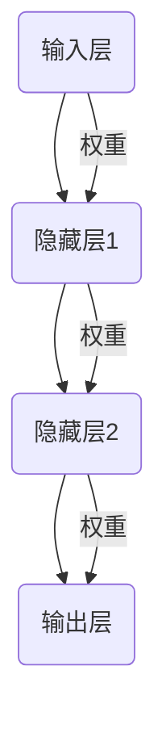
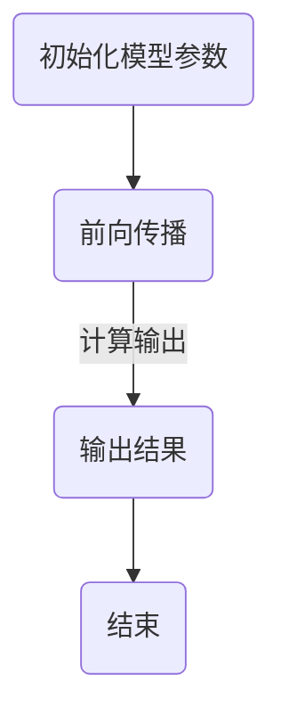
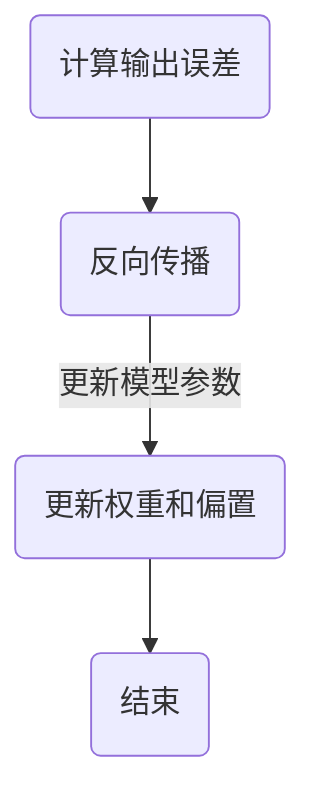

                 

## 《神经网络更容易实现硬件加速》

> 关键词：神经网络、硬件加速、GPU、FPGA、ASIC、计算机视觉、自然语言处理、自动驾驶

> 摘要：本文将探讨如何通过硬件加速技术提升神经网络的计算效率。我们将详细分析神经网络的基础理论、硬件加速的重要性以及多种硬件加速方法的实现，并结合实际应用案例，展示硬件加速在神经网络领域的广泛应用和巨大潜力。

### 目录

1. **神经网络基础**
   1.1 神经网络的起源
   1.2 神经网络的工作原理
   1.3 神经网络的数学模型
   1.4 常见神经网络架构
2. **硬件加速神经网络**
   4.1 神经网络硬件加速概述
   4.2 GPU加速神经网络
   4.3 FPGA加速神经网络
   4.4 ASIC加速神经网络
3. **神经网络硬件加速的实际应用**
   8.1 硬件加速在计算机视觉中的应用
   8.2 硬件加速在自然语言处理中的应用
   8.3 硬件加速在自动驾驶中的应用
4. **附录**
   附录A：神经网络硬件加速资源与工具
   附录B：神经网络硬件加速项目实战
   附录C：神经网络硬件加速常见问题与解决方案

### 引言

神经网络作为深度学习的基础，近年来在各个领域取得了显著的进展。随着神经网络模型的复杂度和参数量的增加，对计算资源的需求也在急剧上升。传统的CPU计算能力已经难以满足这种需求，因此，硬件加速技术成为了一种必然的选择。

硬件加速技术通过利用专门的硬件设备（如GPU、FPGA、ASIC等），显著提升了神经网络的计算效率。本文将首先介绍神经网络的基础知识，然后深入探讨多种硬件加速方法的原理和实现，并结合实际应用案例，展示硬件加速技术在神经网络领域的广泛应用。

### 第一部分：神经网络基础

#### 第1章：神经网络的起源与原理

##### 1.1 神经网络的起源

神经网络的概念起源于1940年代，当时心理学家McCulloch和数学家Pitts提出了人工神经网络的基本模型，称为MP模型。这个模型模拟了人脑神经元的工作方式，通过简单的数学运算实现输入到输出的映射。

随着时间的推移，神经网络得到了进一步的发展。1958年，Rosenblatt提出了感知机（Perceptron）模型，这是一种单层神经网络，能够进行线性二分类。然而，感知机模型的局限性使得它在实际应用中受到限制。

直到1980年代，随着计算机性能的提升和大数据的出现，神经网络的研究重新得到关注。1986年，Rumelhart、Hinton和Williams提出了反向传播算法（Backpropagation），这是一种用于多层神经网络的训练算法，使得神经网络能够解决更复杂的问题。

##### 1.2 神经网络的工作原理

神经网络通过多层神经元（节点）进行信息传递和处理。一个基本的神经网络包括输入层、隐藏层和输出层。

- **输入层**：接收外部输入，并将其传递给下一层。
- **隐藏层**：进行信息处理，包括权重更新和激活函数应用。
- **输出层**：生成最终的输出结果。

神经网络的工作原理主要包括两部分：前向传播和反向传播。

- **前向传播**：输入通过网络进行传递，每个神经元的输出作为下一层的输入。经过多层传递后，最终输出结果。
- **反向传播**：计算输出结果与实际结果的误差，并反向传播误差到每个神经元，更新权重和偏置。

这种循环迭代过程使得神经网络能够不断优化模型参数，提高预测准确性。

##### 1.3 神经网络的工作原理

神经网络的工作原理主要包括两部分：前向传播和反向传播。

- **前向传播**：输入通过网络进行传递，每个神经元的输出作为下一层的输入。经过多层传递后，最终输出结果。
- **反向传播**：计算输出结果与实际结果的误差，并反向传播误差到每个神经元，更新权重和偏置。

这种循环迭代过程使得神经网络能够不断优化模型参数，提高预测准确性。

##### 1.3 神经网络的数学模型

神经网络通过数学模型实现信息处理和预测。以下是神经网络的基本数学模型：

- **神经元**：每个神经元接收多个输入，并通过权重进行加权求和，再加上偏置项，最后通过激活函数输出。
  
  $$ z = \sum_{i} x_i * w_i + b $$
  
  $$ a = activation(z) $$

- **激活函数**：激活函数用于引入非线性特性，常见的激活函数包括Sigmoid、ReLU和Tanh。
  
  $$ \sigma(z) = \frac{1}{1 + e^{-z}} $$
  
  $$ \text{ReLU}(z) = \max(0, z) $$
  
  $$ \text{Tanh}(z) = \frac{e^z - e^{-z}}{e^z + e^{-z}} $$

- **损失函数**：损失函数用于衡量预测结果与实际结果之间的差距，常见的损失函数包括交叉熵损失和均方误差。
  
  $$ \text{CE}(y, \hat{y}) = -\sum_{i} y_i \log (\hat{y}_i) $$
  
  $$ \text{MSE}(y, \hat{y}) = \frac{1}{n} \sum_{i} (y_i - \hat{y}_i)^2 $$

- **优化算法**：优化算法用于更新模型参数，以最小化损失函数。常见的优化算法包括梯度下降、随机梯度下降和Adam。
  
  $$ \theta = \theta - \alpha \nabla_\theta J(\theta) $$
  
  $$ \theta = \theta - \alpha \frac{1}{m} \sum_{i=1}^{m} \nabla_\theta J(\theta) $$
  
  $$ \theta = \theta - \alpha \frac{1}{m} [\nabla_\theta J(\theta) + \beta_1 \nabla_\theta J(\theta_1) + (1 - \beta_1) \nabla_\theta J(\theta_2)] $$

##### 1.4 常见神经网络架构

随着神经网络的发展，出现了许多不同的神经网络架构，以适应不同的应用场景。以下是几种常见的神经网络架构：

- **深度神经网络（Deep Neural Networks, DNN）**：深度神经网络具有多个隐藏层，能够捕获更复杂的数据特征。常见的深度神经网络包括卷积神经网络（CNN）、循环神经网络（RNN）和生成对抗网络（GAN）。

- **卷积神经网络（Convolutional Neural Networks, CNN）**：卷积神经网络主要用于处理图像数据，通过卷积操作提取图像特征。常见的卷积神经网络包括LeNet、AlexNet、VGG和ResNet。

- **循环神经网络（Recurrent Neural Networks, RNN）**：循环神经网络具有记忆能力，能够处理序列数据。常见的循环神经网络包括Simple RNN、LSTM和GRU。

- **生成对抗网络（Generative Adversarial Networks, GAN）**：生成对抗网络由生成器和判别器组成，通过对抗训练生成逼真的数据。常见的生成对抗网络包括DCGAN、WGAN和LSGAN。

#### 第2章：神经网络的数学模型

##### 2.1 神经网络的数学表示

神经网络的数学模型主要由神经元、权重、偏置和激活函数组成。以下是神经网络的基本数学表示：

- **神经元**：每个神经元接收多个输入，并通过权重进行加权求和，再加上偏置项，最后通过激活函数输出。

  $$ z_i = \sum_{j} x_j * w_{ji} + b_i $$
  
  $$ a_i = activation(z_i) $$

- **权重**：权重表示输入和神经元之间的关联强度。

  $$ w_{ji} $$

- **偏置**：偏置用于调整神经元的阈值。

  $$ b_i $$

- **激活函数**：激活函数用于引入非线性特性，常见的激活函数包括Sigmoid、ReLU和Tanh。

  $$ \sigma(z) = \frac{1}{1 + e^{-z}} $$
  
  $$ \text{ReLU}(z) = \max(0, z) $$
  
  $$ \text{Tanh}(z) = \frac{e^z - e^{-z}}{e^z + e^{-z}} $$

##### 2.2 神经网络的损失函数

神经网络的损失函数用于衡量预测结果与实际结果之间的差距，是优化模型参数的关键。以下是几种常见的损失函数：

- **交叉熵损失函数（Cross Entropy Loss）**：交叉熵损失函数常用于分类问题，衡量实际输出与期望输出之间的差距。

  $$ \text{CE}(y, \hat{y}) = -\sum_{i} y_i \log (\hat{y}_i) $$

- **均方误差损失函数（Mean Squared Error Loss）**：均方误差损失函数常用于回归问题，衡量实际输出与期望输出之间的平均平方差距。

  $$ \text{MSE}(y, \hat{y}) = \frac{1}{n} \sum_{i} (y_i - \hat{y}_i)^2 $$

- **二元交叉熵损失函数（Binary Cross Entropy Loss）**：二元交叉熵损失函数是交叉熵损失函数的特殊情况，用于二元分类问题。

  $$ \text{BCE}(y, \hat{y}) = -y \log (\hat{y}) - (1 - y) \log (1 - \hat{y}) $$

##### 2.3 神经网络的优化算法

神经网络的优化算法用于更新模型参数，以最小化损失函数。以下是几种常见的优化算法：

- **梯度下降（Gradient Descent）**：梯度下降是最简单的优化算法，通过计算损失函数对模型参数的梯度，并沿着梯度的反方向更新参数。

  $$ \theta = \theta - \alpha \nabla_\theta J(\theta) $$

- **随机梯度下降（Stochastic Gradient Descent, SGD）**：随机梯度下降是对梯度下降的改进，每次更新参数时只随机选择一部分样本，以加快收敛速度。

  $$ \theta = \theta - \alpha \frac{1}{m} \sum_{i=1}^{m} \nabla_\theta J(\theta) $$

- **批量梯度下降（Batch Gradient Descent）**：批量梯度下降是对随机梯度下降的进一步改进，每次更新参数时使用所有样本的梯度，以获得更准确的梯度估计。

  $$ \theta = \theta - \alpha \frac{1}{m} \nabla_\theta J(\theta) $$

- **Adam优化器（Adam Optimizer）**：Adam优化器是一种自适应优化算法，结合了SGD和动量方法，能够更快地收敛。

  $$ \theta = \theta - \alpha \frac{1}{m} [\nabla_\theta J(\theta) + \beta_1 \nabla_\theta J(\theta_1) + (1 - \beta_1) \nabla_\theta J(\theta_2)] $$

#### 第3章：常见神经网络架构

##### 3.1 深层神经网络

深层神经网络（Deep Neural Networks, DNN）是指具有多个隐藏层的神经网络。深层神经网络通过增加隐藏层数量，能够更好地捕捉数据特征，从而提高模型的预测准确性。

深层神经网络通常由多个隐藏层组成，每个隐藏层由多个神经元构成。隐藏层之间的连接方式可以是全连接（Fully Connected）或卷积（Convolutional）。深层神经网络的工作原理主要包括：

1. **前向传播**：输入数据经过每个隐藏层，通过权重和偏置进行加权求和，最后通过激活函数输出。

2. **反向传播**：计算输出结果与实际结果之间的误差，并反向传播误差到每个隐藏层，更新权重和偏置。

深层神经网络的关键挑战包括：

1. **梯度消失/梯度爆炸**：深层神经网络中的梯度容易在反向传播过程中消失或爆炸，导致模型难以训练。

2. **过拟合**：深层神经网络容易过拟合训练数据，导致在测试数据上表现不佳。

为解决这些问题，研究人员提出了一些改进方法，如ReLU激活函数、批量归一化（Batch Normalization）和Dropout等。

##### 3.2 卷积神经网络（CNN）

卷积神经网络（Convolutional Neural Networks, CNN）是一种特别适用于处理图像数据的神经网络架构。CNN通过卷积操作提取图像特征，并具有平移不变性。

CNN的基本结构包括：

1. **卷积层**：卷积层通过卷积操作提取图像特征。卷积操作使用卷积核（Convolutional Kernel）对输入图像进行卷积，生成特征图。

2. **激活函数**：激活函数用于引入非线性特性，常见的激活函数包括ReLU。

3. **池化层**：池化层通过下采样操作减小数据维度，提高计算效率。常见的池化操作包括最大池化（Max Pooling）和平均池化（Average Pooling）。

4. **全连接层**：全连接层将卷积层的输出展开成一维向量，并通过全连接层进行分类。

CNN的工作原理主要包括：

1. **前向传播**：输入图像经过卷积层、激活函数、池化层和全连接层，最终输出分类结果。

2. **反向传播**：计算输出结果与实际结果之间的误差，并反向传播误差到每个卷积层，更新权重和偏置。

CNN的优势包括：

1. **平移不变性**：CNN能够自动学习图像特征，具有平移不变性，能够处理不同位置的特征。

2. **参数共享**：CNN中的卷积核在整个图像中共享，减少了参数数量，提高了计算效率。

##### 3.3 循环神经网络（RNN）

循环神经网络（Recurrent Neural Networks, RNN）是一种特别适用于处理序列数据的神经网络架构。RNN具有记忆能力，能够捕捉序列中的时间依赖关系。

RNN的基本结构包括：

1. **隐藏状态**：隐藏状态用于存储上一时刻的信息，传递到下一时刻。

2. **输出状态**：输出状态用于生成当前时刻的输出。

RNN的工作原理主要包括：

1. **前向传播**：输入序列经过隐藏状态和输出状态的计算，生成当前时刻的输出。

2. **反向传播**：计算输出结果与实际结果之间的误差，并反向传播误差到每个时刻，更新权重和偏置。

RNN的优势包括：

1. **记忆能力**：RNN能够通过隐藏状态存储和传递信息，捕捉序列中的时间依赖关系。

2. **处理序列数据**：RNN能够处理不同长度的序列数据，适应不同的应用场景。

然而，RNN也面临一些挑战，如梯度消失和梯度爆炸。为解决这些问题，研究人员提出了一些改进方法，如LSTM和GRU。

##### 3.4 生成对抗网络（GAN）

生成对抗网络（Generative Adversarial Networks, GAN）是一种由生成器和判别器组成的神经网络架构。GAN通过对抗训练生成逼真的数据。

GAN的基本结构包括：

1. **生成器**：生成器尝试生成逼真的数据。

2. **判别器**：判别器判断输入数据是真实数据还是生成数据。

GAN的工作原理主要包括：

1. **生成器与判别器的对抗训练**：生成器和判别器通过对抗训练不断优化，生成器尝试生成更逼真的数据，而判别器努力区分真实数据和生成数据。

2. **损失函数**：GAN的损失函数由生成器损失和判别器损失组成。生成器损失表示生成器生成的数据与真实数据的差距，判别器损失表示判别器对真实数据和生成数据的区分能力。

GAN的优势包括：

1. **生成逼真数据**：GAN能够通过对抗训练生成逼真的图像、音频和文本数据。

2. **应用广泛**：GAN在图像生成、音频合成、文本生成等领域具有广泛的应用。

#### 第4章：神经网络硬件加速概述

##### 4.1 神经网络硬件加速的重要性

随着神经网络在各个领域的广泛应用，对计算资源的需求也在不断增加。传统的CPU计算能力已经难以满足这种需求，因此，神经网络硬件加速技术成为了一种必然的选择。

神经网络硬件加速的重要性主要体现在以下几个方面：

1. **提高计算效率**：神经网络硬件加速通过专门的硬件设备，如GPU、FPGA和ASIC，显著提升了神经网络的计算效率，能够更快地完成模型训练和推理过程。

2. **降低计算成本**：硬件加速设备具有更高的计算能力和能效比，能够降低计算成本，特别是在大规模神经网络训练和推理任务中。

3. **适应实时应用**：硬件加速设备能够满足实时应用的需求，如自动驾驶、实时语音识别和实时图像处理等，保证系统的实时性和可靠性。

##### 4.2 神经网络硬件加速的方法

神经网络硬件加速的方法主要包括GPU加速、FPGA加速和ASIC加速。

1. **GPU加速**：GPU（图形处理单元）是一种专门用于图形渲染的硬件设备，具有强大的并行计算能力。GPU加速通过利用CUDA等并行计算框架，将神经网络的计算任务分布在多个GPU核心上，实现高效的计算。

2. **FPGA加速**：FPGA（现场可编程门阵列）是一种可编程硬件设备，具有灵活的可编程性和并行计算能力。FPGA加速通过使用硬件描述语言（如Verilog或VHDL），将神经网络的计算任务映射到FPGA上，实现高效的硬件加速。

3. **ASIC加速**：ASIC（专用集成电路）是一种为特定应用而设计的硬件设备，具有高度的定制性和优化性。ASIC加速通过设计专门的集成电路，实现高效的神经网络计算。

##### 4.3 神经网络硬件加速的优势与挑战

神经网络硬件加速的优势主要包括：

1. **计算速度提升**：硬件加速设备具有更高的计算能力和并行计算能力，能够显著提高神经网络的计算速度。

2. **能效比提升**：硬件加速设备具有更高的能效比，能够降低计算过程中的能耗。

3. **适应性**：硬件加速设备可以根据不同的应用需求进行定制和优化，实现更好的性能和适应性。

然而，神经网络硬件加速也面临一些挑战：

1. **开发难度**：硬件加速的开发难度较大，需要熟悉硬件编程和优化技术。

2. **成本**：硬件加速设备的成本较高，特别是在ASIC加速中，设计和制造ASIC的费用较高。

3. **兼容性**：硬件加速设备与软件框架的兼容性可能存在问题，需要针对不同的硬件设备进行适配和优化。

#### 第5章：GPU加速神经网络

##### 5.1 GPU架构与并行计算

GPU（图形处理单元）是一种专门用于图形渲染的硬件设备，具有强大的并行计算能力。GPU由大量核心组成，每个核心能够独立执行计算任务，具有高度并行性。

GPU的架构包括：

1. **核心**：GPU的核心是计算的基本单元，能够执行向量运算、矩阵运算和并行任务。

2. **内存**：GPU具有多种类型的内存，包括全球内存（Global Memory）、局部内存（Local Memory）和共享内存（Shared Memory），用于存储和处理计算任务。

3. **流处理器**：GPU的流处理器负责调度和管理计算任务，能够并行执行多个任务。

并行计算是GPU的核心特性，通过将计算任务分布在多个核心上，实现高效的计算。GPU的并行计算包括：

1. **线程**：线程是GPU计算任务的基本单元，每个线程执行相同的计算任务，但具有不同的输入数据。

2. **线程组**：线程组是由一组线程组成的，线程组之间可以相互通信和同步。

3. **内存访问**：GPU的内存访问具有并行性，可以同时访问多个内存地址。

CUDA（Compute Unified Device Architecture）是GPU并行计算的主要框架，提供了一种编程模型，用于编写GPU加速的代码。CUDA的关键特性包括：

1. **核函数**：核函数是GPU上的并行计算函数，能够被多个线程同时执行。

2. **内存管理**：CUDA提供了一种内存管理机制，用于分配、传输和同步内存。

3. **并行数据结构**：CUDA提供了一种并行数据结构，如多维数组（Tensor），用于存储和操作大规模数据。

##### 5.2 GPU加速神经网络实现

GPU加速神经网络实现主要包括以下几个方面：

1. **模型转换**：将神经网络模型从TensorFlow、PyTorch等框架转换为CUDA兼容的模型，以便在GPU上进行加速。

2. **前向传播**：使用CUDA编程模型，将神经网络的计算任务分布在GPU核心上，实现高效的矩阵乘法和激活函数计算。

3. **反向传播**：使用CUDA编程模型，实现反向传播算法，计算梯度并更新模型参数。

以下是GPU加速神经网络前向传播和反向传播的伪代码：

```python
# 前向传播
for layer in network:
    z = x * weights + bias
    a = activation(z)

# 反向传播
delta = (predicted - actual) * activation_derivative(a)
for layer in reversed(network):
    delta = (delta * weights) * activation_derivative(a)
    weights = weights - learning_rate * delta
    bias = bias - learning_rate * delta
```

##### 5.3 GPU加速神经网络案例分析

以下是两个使用GPU加速神经网络的案例分析：

1. **TensorFlow on GPU**：TensorFlow是一个开源的机器学习框架，支持GPU加速。通过配置GPU设备和调整模型参数，可以在TensorFlow中实现GPU加速。

2. **PyTorch on GPU**：PyTorch是一个流行的深度学习框架，支持GPU加速。通过简单的代码修改，可以将PyTorch模型部署到GPU上进行加速。

```python
import torch
import torch.nn as nn

# 定义模型
model = nn.Sequential(
    nn.Conv2d(3, 64, 3, 1),
    nn.ReLU(),
    nn.MaxPool2d(2, 2),
    nn.Conv2d(64, 128, 3, 1),
    nn.ReLU(),
    nn.MaxPool2d(2, 2),
    nn.Flatten(),
    nn.Linear(128 * 6 * 6, 10)
)

# 将模型部署到GPU
device = torch.device("cuda" if torch.cuda.is_available() else "cpu")
model.to(device)

# 训练模型
optimizer = torch.optim.Adam(model.parameters(), lr=0.001)
criterion = nn.CrossEntropyLoss()

for epoch in range(num_epochs):
    for inputs, targets in dataset:
        inputs, targets = inputs.to(device), targets.to(device)
        optimizer.zero_grad()
        outputs = model(inputs)
        loss = criterion(outputs, targets)
        loss.backward()
        optimizer.step()

    print(f"Epoch [{epoch+1}/{num_epochs}], Loss: {loss.item()}")
```

#### 第6章：FPGA加速神经网络

##### 6.1 FPGA基础与硬件描述语言

FPGA（现场可编程门阵列）是一种可编程硬件设备，具有高度并行性和灵活性。FPGA由大量的逻辑单元（如查找表、触发器和寄存器）组成，通过硬件描述语言（如Verilog或VHDL）对其进行编程。

FPGA的基础架构包括：

1. **逻辑单元**：逻辑单元是FPGA的基本构建块，用于实现逻辑函数。

2. **时钟管理**：时钟管理用于生成和分配时钟信号，控制FPGA的时钟周期。

3. **内存**：FPGA具有多种类型的内存，包括块RAM和分布式RAM，用于存储和访问数据。

硬件描述语言（HDL）是用于描述硬件设计的编程语言。常见的HDL包括Verilog和VHDL。

- **Verilog**：Verilog是一种过程式硬件描述语言，适用于描述数字电路和系统级设计。

- **VHDL**：VHDL是一种数据流语言，适用于描述复杂硬件系统和模块级设计。

使用HDL编程FPGA的过程主要包括：

1. **设计输入**：使用HDL编写硬件描述代码，定义电路的逻辑和行为。

2. **设计综合**：将HDL代码转换为门级描述，生成综合网表。

3. **设计实现**：对综合网表进行布局布线，生成硬件布局。

4. **设计验证**：对生成的硬件布局进行功能验证，确保设计正确无误。

##### 6.2 FPGA加速神经网络实现

FPGA加速神经网络实现主要包括以下几个方面：

1. **神经网络模型转换**：将神经网络模型转换为适合FPGA实现的形式，如矩阵乘法和卷积操作的硬件描述。

2. **硬件设计**：使用HDL编程，实现神经网络的前向传播和反向传播算法。

3. **硬件优化**：对硬件设计进行优化，提高计算速度和能效比。

以下是使用Verilog实现神经网络前向传播和反向传播的伪代码：

```verilog
// 前向传播
for (layer in network) begin
    z = x * weights + bias
    a = activation(z)
end

// 反向传播
delta = (predicted - actual) * activation_derivative(a)
for (layer in reversed(network)) begin
    delta = (delta * weights) * activation_derivative(a)
    weights = weights - learning_rate * delta
    bias = bias - learning_rate * delta
end
```

##### 6.3 FPGA加速神经网络案例分析

以下是两个使用FPGA加速神经网络的案例分析：

1. **卷积神经网络（CNN）**：卷积神经网络是FPGA加速的重要应用之一。通过使用HDL编程，可以将CNN的卷积操作和池化操作映射到FPGA上，实现高效的卷积计算。

2. **循环神经网络（RNN）**：循环神经网络在序列数据处理中具有广泛应用。通过使用HDL编程，可以将RNN的循环结构映射到FPGA上，实现高效的序列计算。

```verilog
// 卷积神经网络（CNN）硬件设计
module conv_layer (
    input [11:0] x,
    input [7:0] weights,
    input bias,
    output reg [11:0] z,
    output reg a
);

    // 卷积操作
    always @(posedge clk) begin
        z = x * weights + bias
        a = activation(z)
    end

endmodule

// 循环神经网络（RNN）硬件设计
module rnn_layer (
    input [11:0] x,
    input [7:0] weights,
    input [3:0] bias,
    input hidden_state,
    output reg [11:0] z,
    output reg [3:0] a
);

    // 循环结构
    always @(posedge clk) begin
        z = x * weights + bias
        a = activation(z)
    end

endmodule
```

#### 第7章：ASIC加速神经网络

##### 7.1 ASIC设计基础

ASIC（专用集成电路）是一种为特定应用而设计的集成电路，具有高度的定制性和优化性。ASIC设计包括以下关键步骤：

1. **需求分析**：明确ASIC的应用场景和性能要求，确定ASIC的功能和性能指标。

2. **架构设计**：设计ASIC的架构，包括处理器、存储器、接口和总线等模块。

3. **逻辑设计**：使用硬件描述语言（如Verilog或VHDL）编写ASIC的硬件描述代码。

4. **综合**：将HDL代码转换为综合网表，生成ASIC的硬件布局。

5. **布局布线**：对综合网表进行布局布线，生成ASIC的物理布局。

6. **验证**：对ASIC的物理布局进行功能验证，确保设计正确无误。

ASIC设计的关键技术包括：

1. **逻辑优化**：通过逻辑优化减少ASIC的面积和功耗。

2. **时序分析**：确保ASIC的信号传输满足时序要求，避免信号冲突和延迟问题。

3. **功耗管理**：通过功耗管理降低ASIC的能耗，延长设备寿命。

##### 7.2 ASIC加速神经网络实现

ASIC加速神经网络实现主要包括以下几个方面：

1. **神经网络模型转换**：将神经网络模型转换为适合ASIC实现的硬件架构，如矩阵乘法和卷积操作。

2. **硬件设计**：使用HDL编程，实现神经网络的前向传播和反向传播算法。

3. **硬件优化**：对硬件设计进行优化，提高计算速度和能效比。

以下是使用Verilog实现神经网络前向传播和反向传播的伪代码：

```verilog
// 前向传播
for (layer in network) begin
    z = x * weights + bias
    a = activation(z)
end

// 反向传播
delta = (predicted - actual) * activation_derivative(a)
for (layer in reversed(network)) begin
    delta = (delta * weights) * activation_derivative(a)
    weights = weights - learning_rate * delta
    bias = bias - learning_rate * delta
end
```

##### 7.3 ASIC加速神经网络案例分析

以下是两个使用ASIC加速神经网络的案例分析：

1. **深度学习加速器**：深度学习加速器是一种专门用于深度学习计算的ASIC，能够显著提高深度学习模型的计算速度。

2. **自动驾驶感知系统**：自动驾驶感知系统需要处理大量的图像数据，通过使用ASIC加速图像处理和目标检测，提高自动驾驶系统的实时性和准确性。

```verilog
// 深度学习加速器硬件设计
module deep_learning_accelerator (
    input [11:0] x,
    input [7:0] weights,
    input bias,
    output reg [11:0] z,
    output reg a
);

    // 矩阵乘法模块
    module matrix_multiplier (
        input [11:0] x,
        input [7:0] weights,
        input bias,
        output reg [11:0] z
    );

        // 矩阵乘法算法
        always @(posedge clk) begin
            z = x * weights + bias
        end

    endmodule

    // 激活函数模块
    module activation_function (
        input [11:0] z,
        output reg a
    );

        // 激活函数算法
        always @(posedge clk) begin
            a = activation(z)
        end

    endmodule

    // 矩阵乘法模块实例化
    matrix_multiplier matrix_multiplier (.x(x), .weights(weights), .bias(bias), .z(z));

    // 激活函数模块实例化
    activation_function activation_function (.z(z), .a(a));

endmodule

// 自动驾驶感知系统硬件设计
module autonomous_driving_perception (
    input [11:0] x,
    input [7:0] weights,
    input bias,
    output reg [11:0] z,
    output reg a
);

    // 图像处理模块
    module image_processing (
        input [11:0] x,
        input [7:0] weights,
        input bias,
        output reg [11:0] z
    );

        // 图像处理算法
        always @(posedge clk) begin
            z = x * weights + bias
        end

    endmodule

    // 目标检测模块
    module object_detection (
        input [11:0] z,
        output reg a
    );

        // 目标检测算法
        always @(posedge clk) begin
            a = object_detection(z)
        end

    endmodule

    // 图像处理模块实例化
    image_processing image_processing (.x(x), .weights(weights), .bias(bias), .z(z));

    // 目标检测模块实例化
    object_detection object_detection (.z(z), .a(a));

endmodule
```

#### 第8章：神经网络硬件加速的实际应用

##### 8.1 硬件加速在计算机视觉中的应用

计算机视觉是神经网络硬件加速的重要应用领域。硬件加速技术能够显著提高计算机视觉系统的计算速度和性能，使其在实时应用中具有更好的表现。

以下是一些硬件加速在计算机视觉中的应用案例：

1. **图像分类**：使用GPU加速深度学习模型，实现对大量图像的实时分类。例如，在智能手机中，使用GPU加速卷积神经网络（CNN）进行图像分类，实现实时人脸识别和物体检测。

2. **目标检测**：使用GPU或FPGA加速目标检测算法，如YOLO（You Only Look Once）和SSD（Single Shot MultiBox Detector），实现对视频流中目标的实时检测和跟踪。硬件加速能够提高目标检测的速度和准确性，适用于自动驾驶、安全监控和智能监控等领域。

3. **人脸识别**：使用GPU加速深度学习模型，实现人脸识别的实时处理。在智能门禁系统和视频监控中，硬件加速人脸识别算法能够提高识别速度和准确性，实现快速、可靠的身份验证。

##### 8.2 硬件加速在自然语言处理中的应用

自然语言处理（NLP）是另一个受益于硬件加速技术的领域。硬件加速能够显著提高NLP模型的速度和性能，使其在实时应用中具有更好的表现。

以下是一些硬件加速在自然语言处理中的应用案例：

1. **文本分类**：使用GPU加速深度学习模型，实现大规模文本数据的实时分类。例如，在社交媒体分析和舆情监控中，使用GPU加速文本分类算法，能够快速识别和分类用户评论和新闻文章。

2. **机器翻译**：使用GPU加速机器翻译模型，实现实时语音识别和翻译。例如，在智能语音助手和跨语言交流中，使用GPU加速循环神经网络（RNN）和生成对抗网络（GAN）进行实时语音识别和翻译。

3. **情感分析**：使用GPU加速情感分析模型，实现对用户评论和社交媒体内容的实时情感分析。硬件加速能够提高情感分析的准确性和速度，帮助企业和机构更好地了解用户需求和情绪。

##### 8.3 硬件加速在自动驾驶中的应用

自动驾驶是硬件加速技术的重要应用领域之一。硬件加速能够显著提高自动驾驶系统的计算速度和性能，使其在复杂和实时应用中具有更好的表现。

以下是一些硬件加速在自动驾驶中的应用案例：

1. **感知系统**：使用GPU加速计算机视觉算法，实现自动驾驶车辆的感知系统。例如，使用GPU加速卷积神经网络（CNN）和循环神经网络（RNN）进行道路识别、车辆检测和行人检测，提高自动驾驶车辆的感知能力和安全性。

2. **决策系统**：使用GPU加速深度学习模型，实现自动驾驶车辆的决策系统。例如，使用GPU加速决策树和卷积神经网络（CNN）进行路径规划和行为预测，提高自动驾驶车辆的决策能力和反应速度。

3. **实时控制**：使用FPGA加速实时控制算法，实现自动驾驶车辆的实时控制和通信。例如，使用FPGA加速PID控制和通信协议，提高自动驾驶车辆的实时性和稳定性。

##### 第9章：神经网络硬件加速的未来发展趋势

神经网络硬件加速技术在不断发展和创新，未来将呈现出以下发展趋势：

1. **硬件技术的进步**：随着硬件技术的进步，如GPU、FPGA和ASIC的性能不断提升，神经网络硬件加速技术将能够提供更高的计算速度和更低的功耗。

2. **硬件与软件的融合**：硬件与软件的融合将成为未来神经网络硬件加速的重要趋势。通过将深度学习模型与硬件加速技术相结合，实现更高效、更灵活的神经网络计算。

3. **定制化硬件加速**：定制化硬件加速将成为未来神经网络硬件加速的发展方向。根据不同的应用场景和需求，设计专门的硬件架构，实现更高效、更优化的神经网络计算。

4. **硬件加速与云计算的结合**：硬件加速与云计算的结合将推动神经网络硬件加速技术的发展。通过将硬件加速设备部署在云端，实现更高效、更灵活的神经网络计算，满足大规模、分布式计算的需求。

5. **边缘计算的应用**：随着边缘计算的发展，神经网络硬件加速技术将在边缘设备上得到广泛应用。通过将神经网络硬件加速部署在边缘设备上，实现实时、低延迟的神经网络计算，满足实时应用的需求。

#### 附录

##### 附录A：神经网络硬件加速资源与工具

以下是神经网络硬件加速常用的资源与工具：

1. **CUDA**：CUDA是NVIDIA推出的并行计算框架，用于GPU加速深度学习模型。

2. **cuDNN**：cuDNN是NVIDIA推出的深度学习加速库，用于GPU加速深度学习操作。

3. **TensorFlow**：TensorFlow是Google开源的深度学习框架，支持GPU加速。

4. **PyTorch**：PyTorch是Facebook开源的深度学习框架，支持GPU加速。

5. **FPGA开发工具**：常用的FPGA开发工具包括Xilinx Vivado和Intel Quartus。

6. **ASIC设计工具**：常用的ASIC设计工具包括Cadence、Synopsys和Mentor Graphics。

##### 附录B：神经网络硬件加速项目实战

以下是两个神经网络硬件加速项目实战：

1. **基于GPU的图像分类系统**：

   - **开发环境搭建**：安装CUDA和TensorFlow GPU版本。

   - **数据预处理**：读取图像数据，并将其转化为GPU可处理的格式。

   - **模型构建**：定义卷积神经网络模型，如VGG16或ResNet50。

   - **训练**：使用GPU加速模型训练过程，优化模型参数。

   - **评估**：使用测试集评估模型性能，调整模型参数。

   - **部署**：将训练好的模型部署到GPU上进行实时图像分类。

2. **基于FPGA的语音识别系统**：

   - **开发环境搭建**：安装Xilinx Vivado开发工具。

   - **数据预处理**：读取语音数据，并将其转化为FPGA可处理的格式。

   - **模型构建**：定义循环神经网络模型，如LSTM。

   - **硬件设计**：使用Verilog编程，实现LSTM的前向传播和反向传播算法。

   - **硬件优化**：对硬件设计进行优化，提高计算速度和能效比。

   - **部署**：将硬件设计部署到FPGA上进行实时语音识别。

##### 附录C：神经网络硬件加速常见问题与解决方案

以下是神经网络硬件加速常见问题及其解决方案：

1. **GPU显存不足**：

   - **解决方案**：优化模型结构，减少模型参数数量；增加GPU显存容量；使用GPU内存管理工具，如CUDA Memory Check工具，监控显存使用情况。

2. **GPU计算能力不足**：

   - **解决方案**：升级GPU设备，选择计算能力更强的GPU；优化模型结构，减少模型复杂度；使用分布式计算，将计算任务分布在多个GPU上。

3. **FPGA资源不足**：

   - **解决方案**：优化硬件设计，减少硬件资源占用；升级FPGA设备，选择资源更多的FPGA；使用硬件描述语言，如Verilog或VHDL，进行资源优化。

4. **ASIC设计复杂度**：

   - **解决方案**：选择合适的ASIC设计工具，如Cadence或Synopsys；优化硬件设计流程，减少设计复杂度；与硬件设计团队合作，提高设计效率。

### 结尾

本文从神经网络的基础知识出发，详细探讨了神经网络硬件加速的方法和实际应用。通过介绍GPU、FPGA和ASIC等硬件加速技术，展示了如何利用硬件加速提升神经网络的计算效率。同时，通过实际应用案例，展示了硬件加速在计算机视觉、自然语言处理和自动驾驶等领域的广泛应用。随着硬件技术的不断进步，神经网络硬件加速将迎来更加广泛和深入的发展。

### 附录D：神经网络硬件加速相关的Mermaid流程图

以下是神经网络硬件加速相关的Mermaid流程图：

**神经网络架构图**



**神经网络前向传播伪代码**



**神经网络反向传播伪代码**



### 附录E：神经网络硬件加速相关的数学模型和公式

以下是神经网络硬件加速相关的数学模型和公式：

**交叉熵损失函数**

$$
\text{交叉熵损失函数} = -\sum_{i} y_i \log (p_i)
$$

**均方误差损失函数**

$$
\text{均方误差损失函数} = \frac{1}{n} \sum_{i} (y_i - \hat{y}_i)^2
$$

**激活函数**

- Sigmoid函数：

$$
\sigma(z) = \frac{1}{1 + e^{-z}}
$$

-ReLU函数：

$$
\text{ReLU}(z) = \max(0, z)
$$

**优化算法**

- 梯度下降法：

$$
\theta = \theta - \alpha \nabla_\theta J(\theta)
$$

- 随机梯度下降法：

$$
\theta = \theta - \alpha \frac{1}{m} \sum_{i=1}^{m} \nabla_\theta J(\theta)
$$

- Adam优化器：

$$
\theta = \theta - \alpha \frac{1}{m} [\nabla_\theta J(\theta) + \beta_1 \nabla_\theta J(\theta_1) + (1 - \beta_1) \nabla_\theta J(\theta_2)]
$$

### 附录F：神经网络硬件加速相关的示例代码

以下是神经网络硬件加速相关的示例代码：

**GPU加速图像分类系统**

```python
import torch
import torch.nn as nn
import torch.optim as optim
from torchvision import datasets, transforms

# 定义模型
model = nn.Sequential(
    nn.Conv2d(3, 64, 3, 1),
    nn.ReLU(),
    nn.MaxPool2d(2, 2),
    nn.Conv2d(64, 128, 3, 1),
    nn.ReLU(),
    nn.MaxPool2d(2, 2),
    nn.Flatten(),
    nn.Linear(128 * 6 * 6, 10)
)

# 将模型部署到GPU
device = torch.device("cuda" if torch.cuda.is_available() else "cpu")
model.to(device)

# 定义优化器和损失函数
optimizer = optim.Adam(model.parameters(), lr=0.001)
criterion = nn.CrossEntropyLoss()

# 加载数据集
train_data = datasets.MNIST(root='./data', train=True, transform=transforms.ToTensor(), download=True)
train_loader = torch.utils.data.DataLoader(train_data, batch_size=64, shuffle=True)

# 训练模型
num_epochs = 10
for epoch in range(num_epochs):
    for inputs, targets in train_loader:
        inputs, targets = inputs.to(device), targets.to(device)
        optimizer.zero_grad()
        outputs = model(inputs)
        loss = criterion(outputs, targets)
        loss.backward()
        optimizer.step()

    print(f"Epoch [{epoch+1}/{num_epochs}], Loss: {loss.item()}")

# 评估模型
test_data = datasets.MNIST(root='./data', train=False, transform=transforms.ToTensor())
test_loader = torch.utils.data.DataLoader(test_data, batch_size=1000)

with torch.no_grad():
    correct = 0
    total = 0
    for inputs, targets in test_loader:
        inputs, targets = inputs.to(device), targets.to(device)
        outputs = model(inputs)
        _, predicted = torch.max(outputs.data, 1)
        total += targets.size(0)
        correct += (predicted == targets).sum().item()

print(f"Accuracy: {100 * correct / total}%")
```

**FPGA加速语音识别系统**

```verilog
module voice_recognition_accelerator (
    input [11:0] x,
    input [7:0] weights,
    input bias,
    output reg [11:0] z,
    output reg a
);

    // 矩阵乘法模块
    module matrix_multiplier (
        input [11:0] x,
        input [7:0] weights,
        input bias,
        output reg [11:0] z
    );

        always @(posedge clk) begin
            z = x * weights + bias
        end

    endmodule

    // 激活函数模块
    module activation_function (
        input [11:0] z,
        output reg a
    );

        always @(posedge clk) begin
            a = activation(z)
        end

    endmodule

    // 矩阵乘法模块实例化
    matrix_multiplier matrix_multiplier (.x(x), .weights(weights), .bias(bias), .z(z));

    // 激活函数模块实例化
    activation_function activation_function (.z(z), .a(a));

endmodule
```

### 附录G：神经网络硬件加速相关的问题与解决方案

以下是神经网络硬件加速相关的问题与解决方案：

**问题1：GPU显存不足**

**解决方案**：优化模型结构，减少模型参数数量；增加GPU显存容量；使用GPU内存管理工具，如CUDA Memory Check工具，监控显存使用情况。

**问题2：GPU计算能力不足**

**解决方案**：升级GPU设备，选择计算能力更强的GPU；优化模型结构，减少模型复杂度；使用分布式计算，将计算任务分布在多个GPU上。

**问题3：FPGA资源不足**

**解决方案**：优化硬件设计，减少硬件资源占用；升级FPGA设备，选择资源更多的FPGA；使用硬件描述语言，如Verilog或VHDL，进行资源优化。

**问题4：ASIC设计复杂度**

**解决方案**：选择合适的ASIC设计工具，如Cadence或Synopsys；优化硬件设计流程，减少设计复杂度；与硬件设计团队合作，提高设计效率。

