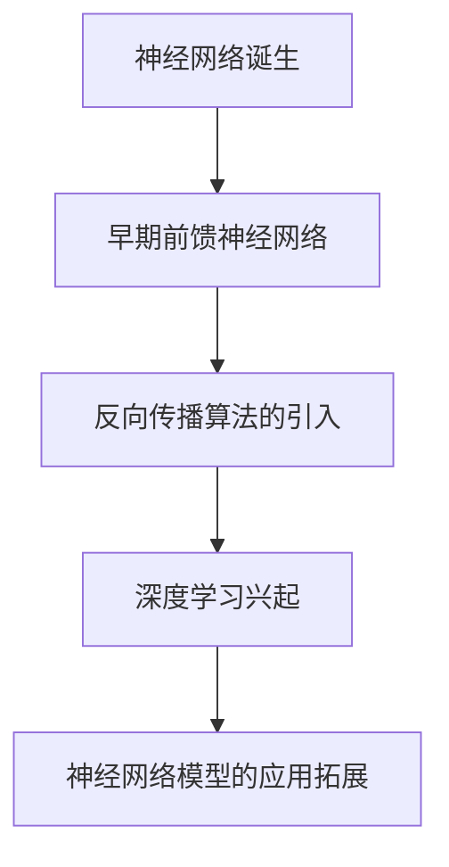
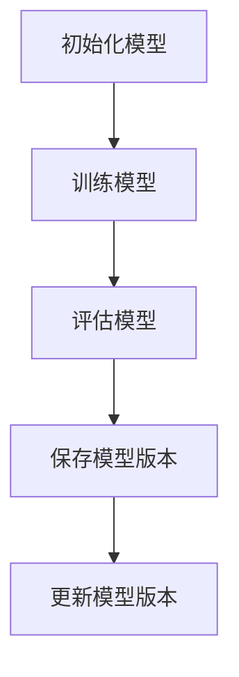

                 

# 《神经网络模型的版本控制与协作开发》

> 关键词：神经网络模型、版本控制、协作开发、分布式训练、模型集成、模型测试

> 摘要：本文将深入探讨神经网络模型的版本控制与协作开发，介绍相关背景知识、基本原则和实践方法。通过具体案例和实际操作，帮助读者理解和掌握神经网络模型版本控制与协作开发的要领，提升开发效率和团队协作能力。

## 目录

### 第一部分：背景与基础

#### 第1章：神经网络模型概述  
- 1.1 神经网络模型的基本概念  
- 1.2 神经网络的历史与发展

#### 第2章：版本控制的基本概念  
- 2.1 版本控制系统的原理  
- 2.2 Git工作流程

#### 第3章：神经网络模型的协作开发  
- 3.1 协作开发的重要性  
- 3.2 神经网络模型的协作开发实践

### 第二部分：版本控制与协作开发实践

#### 第4章：神经网络模型的版本控制  
- 4.1 模型版本号的命名规则  
- 4.2 模型版本的管理与追踪

#### 第5章：神经网络模型的协同训练  
- 5.1 分布式训练的基本原理  
- 5.2 分布式训练的实践方法

#### 第6章：协作开发中的模型集成与测试  
- 6.1 模型集成策略  
- 6.2 模型测试与评估方法  
- 6.3 模型评估报告的编写规范

### 第三部分：案例研究

#### 第7章：神经网络模型版本控制与协作开发的实际案例  
- 7.1 案例背景  
- 7.2 模型开发流程  
- 7.3 版本控制与协作开发的实践

### 第四部分：扩展与展望

#### 第8章：未来趋势与挑战  
- 8.1 神经网络模型版本控制与协作开发的未来趋势  
- 8.2 当前面临的挑战与解决方案

#### 第9章：进一步阅读与资源推荐  
- 9.1 相关书籍推荐  
- 9.2 论文与研究报告  
- 9.3 开源工具与平台介绍

### 附录

#### 附录A：神经网络模型版本控制与协作开发工具使用指南  
- A.1 Git命令操作指南  
- A.2 TensorFlow分布式训练配置指南  
- A.3 PyTorch分布式训练配置指南

#### 附录B：神经网络模型版本控制与协作开发常见问题解答  
- B.1 问题1：如何管理大量的模型版本？  
- B.2 问题2：如何保证分布式训练的稳定性和一致性？  
- B.3 问题3：如何在协作开发中避免模型泄露的风险？

---

### 第一部分：背景与基础

#### 第1章：神经网络模型概述

1.1 神经网络模型的基本概念

神经网络模型是一种通过模拟人脑神经元结构进行信息处理的计算模型。它由一系列相互连接的节点（或称为“神经元”）组成，这些节点通过权重进行连接，并通过激活函数进行非线性变换。

一个简单的神经网络模型可以表示为：

$$ f(x) = \sigma(\sum_{i=1}^{n} w_i * x_i) $$

其中，$x_i$ 是输入特征，$w_i$ 是连接权重，$\sigma$ 是激活函数，通常使用sigmoid函数：

$$ \sigma(x) = \frac{1}{1 + e^{-x}} $$

伪代码如下：

```python
def sigmoid(x):
    return 1 / (1 + math.exp(-x))
```

1.2 神经网络的历史与发展

神经网络的研究可以追溯到20世纪40年代，当时由心理学家McCulloch和数学家Pitts提出了神经网络的初步概念。然而，真正推动神经网络发展的是1986年由Rumelhart、Hinton和Williams等人提出的反向传播算法。

反向传播算法的引入使得神经网络能够通过反向传播误差来调整权重，从而实现高效的梯度下降优化。这一突破为深度学习的发展奠定了基础。

随着计算机性能的提升和大数据的普及，深度学习在图像识别、语音识别、自然语言处理等领域取得了显著的成果。如今，神经网络模型已经成为人工智能领域的重要组成部分。

**Mermaid流程图：**



---

#### 第2章：版本控制的基本概念

2.1 版本控制系统的原理

版本控制系统（Version Control System，VCS）是一种用于跟踪源代码或文档变更的软件工具。它可以帮助开发人员管理代码的版本，确保代码的一致性和可追溯性。

版本控制系统通常包含以下核心功能：

- **版本管理**：记录文件或代码库的历史变更，包括谁、何时、做了什么。
- **并发控制**：允许多个开发者在同一代码库上同时工作，并自动合并他们的更改。
- **分支与合并**：允许创建代码的分支副本，以便独立开发，最后再合并回主分支。
- **故障恢复**：提供回滚功能，以便在代码出现问题时快速恢复到之前的状态。

2.2 Git工作流程

Git是最流行的分布式版本控制系统之一。以下是一个简单的Git工作流程：

- **gitClone(url)**：克隆远程仓库到本地。

  ```shell
  git clone https://github.com/username/repository.git
  ```

- **gitCheckout(branch)**：切换到指定分支。

  ```shell
  git checkout branch-name
  ```

- **gitAdd(file)**：将文件添加到暂存区。

  ```shell
  git add file-name
  ```

- **gitCommit(message)**：提交更改并附上提交信息。

  ```shell
  git commit -m "commit message"
  ```

- **gitPush**：将本地更改推送到远程仓库。

  ```shell
  git push
  ```

**伪代码：**

```python
def gitClone(url):
    # 克隆仓库

def gitCheckout(branch):
    # 切换分支

def gitAdd(file):
    # 添加文件到暂存区

def gitCommit(message):
    # 提交更改

def gitPush():
    # 推送更改到远程仓库
```

---

#### 第3章：神经网络模型的协作开发

3.1 协作开发的重要性

神经网络模型的开发通常需要大量的时间和资源，单打独斗往往难以取得突破。因此，协作开发成为提高开发效率、保证代码质量的重要手段。

协作开发的重要性体现在以下几个方面：

- **资源共享**：团队成员可以共享代码库、数据和模型，提高开发效率。
- **代码审查**：通过代码审查，可以及时发现并修复潜在的问题，保证代码质量。
- **协同训练**：分布式训练可以加快模型的训练速度，提高模型的性能。
- **分工合作**：团队成员可以根据各自的专业技能和兴趣，承担不同的任务，提高整体效率。

3.2 神经网络模型的协作开发实践

神经网络模型的协作开发需要遵循以下基本原则：

- **明确分工**：根据团队成员的技能和兴趣，明确各自的任务和职责。
- **代码规范**：遵循统一的代码规范，确保代码的可读性和可维护性。
- **版本控制**：使用版本控制系统管理代码的版本，确保代码的完整性和一致性。
- **代码审查**：定期进行代码审查，及时发现并修复问题。

**伪代码：**

```python
def collaborativeDevelopment(model, teamMembers):
    # 分配任务给团队成员
    # 接收并合并模型更新
```

---

### 第二部分：版本控制与协作开发实践

#### 第4章：神经网络模型的版本控制

4.1 模型版本号的命名规则

在神经网络模型的版本控制中，模型版本号的命名规则至关重要。一个良好的命名规则可以帮助团队成员快速理解模型的版本历史和更新内容。

常见的模型版本号命名规则包括以下几种：

- **日期命名法**：使用发布日期作为版本号，例如`20230315.1`。
- **语义化版本法**：遵循`MAJOR.MINOR.PATCH`的格式，分别表示主版本、次版本和修订版本，例如`1.0.1`。
- **描述性命名法**：使用描述性文字来标记版本特征，例如`v1.0-alpha`。

4.2 模型版本的管理与追踪

模型版本的管理与追踪是确保模型版本一致性和可追溯性的关键。以下是一个简单的模型版本管理流程：

1. **初始化模型**：创建一个新的模型版本，设置版本号为`1.0.0`。
2. **训练模型**：在模型版本下进行模型训练，记录训练过程中的关键指标和参数。
3. **评估模型**：在训练完成后，对模型进行评估，记录评估结果。
4. **保存模型版本**：将训练好的模型保存为版本文件，并记录版本号和更新内容。
5. **更新模型版本**：在后续的迭代中，根据模型的更新内容和评估结果，更新版本号。

**Mermaid流程图：**



---

#### 第5章：神经网络模型的协同训练

5.1 分布式训练的基本原理

分布式训练（Distributed Training）是一种将模型训练任务分布在多台机器上的方法。它通过将数据集分割成多个子数据集，分别在不同的机器上训练模型，并在训练过程中进行参数同步，从而提高训练效率和模型性能。

分布式训练的基本原理包括：

- **数据划分**：将原始数据集划分成多个子数据集，每个子数据集由不同的机器处理。
- **模型分割**：将模型分割成多个子模型，每个子模型负责处理子数据集的一部分。
- **参数同步**：在训练过程中，定期同步各个子模型的参数，以确保全局模型的更新。
- **通信协议**：通过通信协议（如TensorFlow的参数服务器或PyTorch的进程组）实现子模型之间的参数同步。

5.2 分布式训练的实践方法

分布式训练的实践方法包括以下几种：

- **参数服务器架构**：使用参数服务器作为中心节点，负责存储和同步模型参数。各计算节点从参数服务器获取参数并进行本地训练。
- **进程组架构**：使用进程组将多个计算节点组成一个分布式训练组，各节点之间通过共享内存进行参数同步。
- **混合架构**：将参数服务器架构和进程组架构相结合，部分节点使用参数服务器进行参数同步，其他节点使用进程组架构。

**伪代码：**

```python
def distributedTraining(model, trainers):
    # 分配数据给训练器
    # 同步或异步更新模型参数
```

---

#### 第6章：协作开发中的模型集成与测试

6.1 模型集成策略

在协作开发中，模型集成（Model Ensembling）是一种常用的方法，通过结合多个模型的预测结果来提高整体模型的性能。常见的模型集成策略包括：

- **简单平均**：将多个模型的预测结果取平均值作为最终预测结果。
- **权重平均**：根据模型在训练数据上的表现，为每个模型赋予不同的权重，再取加权平均值作为最终预测结果。
- **堆叠**：将多个模型作为堆叠网络的一部分，每个模型的输出作为下一层的输入，通过训练一个更大的网络来提高性能。

6.2 模型测试与评估方法

模型测试与评估是确保模型性能和可靠性的关键步骤。常见的模型测试与评估方法包括：

- **准确率（Accuracy）**：分类问题中，正确分类的样本数占总样本数的比例。
- **召回率（Recall）**：分类问题中，正确分类的样本数占实际正样本数的比例。
- **F1分数（F1 Score）**：综合考虑准确率和召回率，用于平衡两类性能。
- **ROC曲线（Receiver Operating Characteristic Curve）**：用于评估分类器的性能，曲线下的面积越大，性能越好。

6.3 模型评估报告的编写规范

模型评估报告应包含以下内容：

- **摘要**：简要介绍模型评估的目的、方法、结果和结论。
- **模型描述**：详细描述模型的架构、参数和训练过程。
- **评估指标**：列出用于评估模型的指标，并解释每个指标的含义。
- **评估结果**：展示模型的评估结果，包括每个指标的具体数值。
- **结论与建议**：总结评估结果，提出改进模型的建议。

---

### 第三部分：案例研究

#### 第7章：神经网络模型版本控制与协作开发的实际案例

7.1 案例背景

某人工智能公司开发了一个用于图像分类的神经网络模型，项目由多个团队成员共同协作完成。随着项目的进展，模型需要进行多次迭代和改进，同时要确保模型版本的一致性和可追溯性。

7.2 模型开发流程

以下是模型开发的基本流程：

1. **需求分析**：确定模型的应用场景和需求，制定开发计划。
2. **数据预处理**：对原始图像数据进行预处理，包括数据清洗、数据增强等。
3. **模型设计**：设计神经网络模型的结构，选择合适的激活函数和损失函数。
4. **模型训练**：在训练数据上训练模型，使用反向传播算法优化模型参数。
5. **模型评估**：在验证数据上评估模型性能，选择最优的模型版本。
6. **模型部署**：将模型部署到生产环境，实现实时图像分类。

7.3 版本控制与协作开发的实践

以下是模型开发中的版本控制与协作开发实践：

1. **版本控制**：
   - 使用Git进行版本控制，确保代码的一致性和可追溯性。
   - 每次迭代后，提交新的模型版本，并附上更新说明。
   - 定义模型版本号的命名规则，确保版本号的唯一性和可理解性。

2. **协作开发**：
   - 明确分工，每个团队成员负责不同的模块。
   - 使用代码审查工具（如GitHub的Pull Request功能）进行代码审查，确保代码质量。
   - 使用TensorFlow进行分布式训练，提高训练效率。
   - 定期召开团队会议，讨论模型改进和版本更新。

**代码实现**（假设使用TensorFlow和Git进行模型版本控制与协作开发）：

```python
# Git操作
!git clone https://github.com/username/imagenet.git
!cd imagenet
!git checkout -b new-feature

# 数据预处理
# ...

# 模型设计
# ...

# 模型训练
# ...

# 模型评估
# ...

# 提交更新
!git add .
!git commit -m "Update model version 1.1"
!git push

# 分布式训练
# ...

# 代码审查
# ...
```

---

### 第四部分：扩展与展望

#### 第8章：未来趋势与挑战

8.1 神经网络模型版本控制与协作开发的未来趋势

随着人工智能技术的不断发展，神经网络模型版本控制与协作开发将在以下几个方面呈现出发展趋势：

- **自动化版本控制**：利用自动化工具和AI算法，实现模型的自动版本管理和更新。
- **智能化协作开发**：通过AI技术，实现智能化的代码审查、模型优化和协作建议。
- **分布式协作开发**：随着云计算和边缘计算的普及，分布式协作开发将更加重要，模型版本控制和协作开发将在更广泛的范围内得到应用。
- **社区化开发**：鼓励更多的开发者参与到模型版本控制和协作开发中，形成更加开放和共享的模型开发环境。

8.2 当前面临的挑战与解决方案

虽然神经网络模型版本控制与协作开发具有广泛的应用前景，但仍然面临一些挑战：

- **复杂性**：神经网络模型的复杂性导致版本控制与协作开发的难度增加，需要开发更加高效和智能的工具。
- **一致性**：在分布式协作开发中，确保模型参数的一致性是一个挑战，需要改进同步协议和通信机制。
- **安全性**：模型泄露和安全问题在协作开发中需要重点关注，需要制定相应的安全策略和防护措施。
- **可解释性**：神经网络模型的黑盒特性使得模型的可解释性成为一个挑战，需要研究如何提高模型的可解释性和透明度。

---

### 第五部分：进一步阅读与资源推荐

#### 第9章：进一步阅读与资源推荐

9.1 相关书籍推荐

- **《深度学习》（Deep Learning）**：由Ian Goodfellow、Yoshua Bengio和Aaron Courville所著的深度学习领域的经典教材，涵盖了神经网络模型的基础理论和实践方法。
- **《版本控制技术》（Version Control with Git）**：由Jon Loeliger和Matthias Ettrich所著，详细介绍了Git的工作原理和操作方法。

9.2 论文与研究报告

- **《Distributed Deep Learning: Existing Techniques and New Directions》**：该论文讨论了分布式深度学习的现有技术和未来发展方向。
- **《A Theoretically Grounded Application of Dropout in Recurrent Neural Networks》**：该研究报告提出了在循环神经网络中应用Dropout的新方法，提高了模型的性能。

9.3 开源工具与平台介绍

- **TensorFlow**：由Google开源的深度学习框架，支持分布式训练和协作开发。
- **PyTorch**：由Facebook开源的深度学习框架，具有灵活的动态计算图和强大的社区支持。

---

### 附录

#### 附录A：神经网络模型版本控制与协作开发工具使用指南

A.1 Git命令操作指南

- **git clone**：克隆远程仓库。
- **git checkout**：切换到指定分支。
- **git add**：添加文件到暂存区。
- **git commit**：提交更改。
- **git push**：将本地更改推送到远程仓库。

A.2 TensorFlow分布式训练配置指南

- **设置参数服务器**：使用`tf.distribute.Strategy`设置参数服务器。
- **分配设备**：使用`tf.device`指定设备（如GPU或CPU）。
- **分布式训练**：使用`model.fit`进行分布式训练。

A.3 PyTorch分布式训练配置指南

- **设置分布式训练**：使用`torch.nn.parallel.DistributedDataParallel`设置分布式训练。
- **分配进程组**：使用`torch.distributed.group`分配进程组。
- **分布式训练**：使用`model.train()`进行分布式训练。

---

#### 附录B：神经网络模型版本控制与协作开发常见问题解答

B.1 问题1：如何管理大量的模型版本？

**解答**：可以使用版本控制系统（如Git）对模型版本进行管理。为每个模型版本创建一个独立的分支，并在分支上进行模型的迭代和改进。通过合并分支，可以将更新合并回主分支。

B.2 问题2：如何保证分布式训练的稳定性和一致性？

**解答**：可以使用参数服务器架构或进程组架构来保证分布式训练的稳定性和一致性。参数服务器可以存储和同步模型参数，进程组可以确保子模型之间的参数同步。此外，还可以使用通信协议（如TCP/IP）确保数据的一致性。

B.3 问题3：如何在协作开发中避免模型泄露的风险？

**解答**：在协作开发中，可以采取以下措施来避免模型泄露的风险：

- **加密模型文件**：对模型文件进行加密，确保只有授权人员可以访问。
- **访问控制**：设置访问控制策略，限制对模型文件的访问权限。
- **代码审查**：在提交代码之前进行代码审查，确保代码没有泄露模型信息。
- **安全审计**：定期进行安全审计，检测和修复潜在的安全漏洞。

